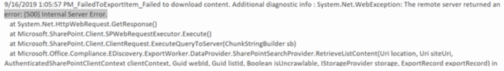

# <a name="investigate-troubleshoot-and-resolve-common-ediscovery-issues"></a>Investigar, solucionar problemas y resolver problemas comunes de la exhibición de documentos electrónicos

En este tema se describen los pasos básicos de solución de problemas que puede realizar para identificar y resolver los problemas que se encuentren durante una búsqueda de exhibición de documentos electrónicos o en cualquier otro lugar del proceso de eDiscovery. Para resolver algunos de estos escenarios se necesita ayuda de los servicios de soporte técnico (CSS). La información sobre cuándo ponerse en contacto con CSS se incluye en los pasos de resolución.

## <a name="errorissue-ambiguous-location"></a>Error/problema ubicación ambigua

Recibirá este error "la búsqueda de cumplimiento contiene la siguiente ubicación `(s):useralias@contoso.com. The location "useralias@contoso.com" is ambiguous"` no válida si intentó agregar la ubicación del buzón de correo del usuario a la búsqueda y hay objetos duplicados o en conflicto con el mismo identificador de usuario en la protección en línea de Exchange (EOP). Active.

### <a name="resolution"></a>Solución

Compruebe si hay usuarios duplicados o una lista de distribución con el mismo identificador de usuario.

1. Conéctese a [Exchange Online PowerShell](https://docs.microsoft.com/en-us/powershell/exchange/exchange-online/connect-to-exchange-online-powershell/connect-to-exchange-online-powershell?view=exchange-ps).
2. Recuperar todas las instancias del nombre de usuario, escriba:

```powershell
Get-Recipient <username>
```

El resultado de ' useralias@contoso.com ' podría ser

> 
> |Nombre  |RecipientType  |
> |---------|---------|
> |Alias, usuario     |MailUser         |
> |Alias, usuario     |User         |

3. Si se devuelven varios usuarios, busque y corrija el objeto conflictivo.

## <a name="errorissue-search-fails-on-specific-locations"></a>Error/problema de búsqueda de errores en ubicaciones específicas

Una exhibición de documentos electrónicos o búsqueda de contenido puede producir el siguiente error:
>Esta búsqueda se completó con errores (#).  ¿Desea volver a intentar la búsqueda en las ubicaciones con errores?


### <a name="resolution"></a>Solución

Si recibe este error, le recomendamos que compruebe las ubicaciones en las que se produjo un error en la búsqueda y que, a continuación, vuelva a ejecutar la búsqueda solo en las ubicaciones con error.

1. Conéctese a [PowerShell de Exchange Online Protection](https://docs.microsoft.com/en-us/powershell/exchange/exchange-eop/connect-to-exchange-online-protection-powershell?view=exchange-ps).
1. Tipo:

```powershell
Get-Compliancesearch searchname|fl 
```

3. Desde el resultado de PowerShell, vea las ubicaciones fallidas en el campo errores o los detalles de estado en el error de la salida de la búsqueda.
1. Vuelva a intentar la búsqueda de exhibición de documentos electrónicos solo en las ubicaciones fallidas.
1. Si sigue recibiendo estos errores, consulte [reintento de ubicaciones fallidas](https://docs.microsoft.com/en-us/Office365/SecurityCompliance/retry-failed-content-search) para obtener pasos adicionales para la solución de problemas.

## <a name="errorissue-file-not-found"></a>No se encontró el archivo de error/problema

Cuando se ejecuta una búsqueda de exhibición de documentos electrónicos que incluye SharePoint Online y una unidad para las ubicaciones de `File Not Found` la empresa, puede recibir el error, aunque el archivo se encuentra en el sitio. Este error se producirá en la advertencia de exportación y errores. csv o en los elementos omitidos. csv esto puede ocurrir si el archivo no se encuentra en el sitio o si el índice está obsoleto. Este es el texto de un error real, con énfasis agregado.
  
> 28.06.2019 10:02:19_FailedToExportItem_Failed para descargar contenido. Información de diagnóstico adicional: Microsoft. Office. Compliance. EDiscovery. ExportWorker. Exceptions. ContentDownloadTemporaryFailure: no se pudo descargar del contenido 6ea52149-91cd-4965-b5bb-82ca6a3ec9be de tipo Document. Identificador de correlación: 3bd84722-937b-4c23-b61b-08d6fba9ec32. ServerErrorCode:-2147024894---> Microsoft. SharePoint. Client. ServerException: ***no se encuentra el archivo***. en Microsoft. SharePoint. Client. ClientRequest. ProcessResponseStream (Stream responseStream) en Microsoft. SharePoint. Client. ClientRequest. ProcessResponse ()---final del seguimiento de pila de la excepción interna---

### <a name="resolution"></a>Solución

1. Compruebe la ubicación identificada en la búsqueda para asegurarse de que la ubicación del archivo es correcta y se ha agregado en las ubicaciones de búsqueda.
2. Use los procedimientos que se [muestran en solicitar manualmente el rastreo y la reindexación de un sitio, una biblioteca o una lista](https://docs.microsoft.com/en-us/sharepoint/crawl-site-content) para volver a indizar el sitio.

## <a name="errorissue-search-fails-recipient-not-found"></a>Error/problema la búsqueda no se encuentra el destinatario

la búsqueda de exhibición de `recipient not found`documentos electrónicos produce errores. Este error puede producirse si no se encuentra el objeto de usuario en Exchange Online Protection (EOP) porque el objeto no se ha sincronizado.

### <a name="resolution"></a>Solución

1. Conéctese a [PowerShell de Exchange Online Protection](https://docs.microsoft.com/en-us/powershell/exchange/exchange-eop/connect-to-exchange-online-protection-powershell?view=exchange-ps).
1. Compruebe si el objeto de usuario está sincronizado con Exchange Online Protection tipo:

```powershell
Get-Recipient userId|fl
```

3. Debe haber un objeto mailuser para la pregunta del usuario. Si no se devuelve nada, investigue el objeto de usuario. CSS de contacto si el objeto no se puede sincronizar.

## <a name="errorissue-exporting-search-results-is-slow"></a>Error/problema la exportación de resultados de búsqueda es lenta

Al exportar resultados de búsqueda de eDiscovery o búsqueda de contenido en el centro de seguridad y cumplimiento, la descarga tarda más de lo esperado.  Puede comprobar la cantidad de datos que se van a descargar y, posiblemente, aumentar la velocidad de exportación.

### <a name="resolution"></a>Solución

1.  Pruebe a usar los pasos que se indican en el artículo [aumentar la velocidad de descarga](https://docs.microsoft.com/en-us/office365/securitycompliance/increase-download-speeds-when-exporting-ediscovery-results).
2.  Si sigue teniendo problemas, conéctese a [PowerShell de Exchange Online Protection](https://docs.microsoft.com/en-us/powershell/exchange/exchange-eop/connect-to-exchange-online-protection-powershell?view=exchange-ps) y escriba:

```powershell
Get-ComplianceSearch searchname\fl
```

4. Busque la cantidad de datos que se van a descargar en los parámetros SearchResults y SearchStatistics.
5. Tipo:

```powershell
Get-ComplianceSearchAction |fl
```

6. En el campo resultados, busque los datos que se han exportado y vea los errores encontrados.
7. Consulte el archivo trace. log que se encuentra en el directorio al que exportó el contenido para ver si hay errores.

## <a name="errorissue-internal-server-error-500-occurred"></a>Error/problema "se ha producido un error interno del servidor (500)"

Cuando se ejecuta una búsqueda de exhibición de documentos electrónicos, si se produce un error en la búsqueda con un error similar a "error interno del servidor (500)", es posible que necesite volver a ejecutar la búsqueda solo en ubicaciones de buzón específicas.



### <a name="resolution"></a>Solución

1. Divida la búsqueda en búsquedas más pequeñas y vuelva a ejecutar la búsqueda.  Intente usar un intervalo de fechas menor o limitar el número de ubicaciones en las que se busca.
2. Conéctese a [Exchange Online Protection PowerShell](https://docs.microsoft.com/en-us/powershell/exchange/exchange-eop/connect-to-exchange-online-protection-powershell?view=exchange-ps) y escriba lo siguiente:

```powershell
Get-ComplianceSearch searchname |fl
```

3. Examine el resultado para obtener resultados y errores.
3. Examine el archivo trace. log. Estará en la misma carpeta a la que envió la exportación.
4. Póngase en contacto con CSS de soporte.

## <a name="errorissue-holds-dont-sync"></a>No se sincronizan los errores/problemas en espera

error de distribución de sincronización de la Directiva de suspensión de casos de eDiscovery. El error reza:

> "Recursos: se está tardando más de lo esperado en implementar la Directiva. Es posible que tarde unas dos horas en actualizar el estado de implementación final, por lo que debe volver a comprobarlo en un par de horas.

### <a name="resolution"></a>Solución

1.  Conéctese a [Exchange Online Protection PowerShell](https://docs.microsoft.com/en-us/powershell/exchange/exchange-eop/connect-to-exchange-online-protection-powershell?view=exchange-ps) y escriba lo siguiente:

```powershell
Get-RetentionCompliancePolicy  policyname - Distributiondetail|fl
```

2. Examine el valor del parámetro Distributiondetail para buscar errores como los siguientes:

> Si se produce un error, cree una escalación a PG para forzar una resincronización manual en la Directiva.

3. CSS de contactos.

## <a name="see-also"></a>Vea también
- [Sugerencias para evitar errores de ubicación de contenido](https://docs.microsoft.com/en-us/microsoft-365/compliance/retry-failed-content-search%23tips-to-avoid-content-location-errors)