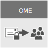
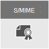

# Cifrado de correo electrónicoEmail encryption

Este articulo compara las opciones de cifrado en Microsoft 365, incluido el Cifrado de mensajes de Office (OME), S/MIME e Information Rights Management (IRM), y presenta la Seguridad de capa de transporte (TLS).This article compares encryption options in Microsoft 365 including Office Message Encryption (OME), S/MIME, Information Rights Management (IRM), and introduces Transport Layer Security (TLS).
  
Microsoft 365 delivers multiple encryption options to help you meet your business needs for email security. This article presents three ways to encrypt email in Office 365. If you want to learn more about all security features in Office 365, visit the [Office 365 Trust Center](https://go.microsoft.com/fwlink/p/?LinkID=282470). This article introduces the three types of encryption available for Microsoft 365 administrators to help secure email in Office 365:Microsoft 365 delivers multiple encryption options to help you meet your business needs for email security. This article presents three ways to encrypt email in Office 365. If you want to learn more about all security features in Office 365, visit the [Office 365 Trust Center](https://go.microsoft.com/fwlink/p/?LinkID=282470). This article introduces the three types of encryption available for Microsoft 365 administrators to help secure email in Office 365:
  
- Cifrado de mensajes de Office (OME).Office Message Encryption (OME).

- Extensiones seguras multipropósito al correo de Internet (S/MIME).Secure/Multipurpose Internet Mail Extensions (S/MIME).

- Information Rights Management (IRM).Information Rights Management (IRM).

## Cifrado de correo electrónico y cómo lo usa Microsoft 365Email encryption and how Microsoft 365 uses it

Encryption is the process by which information is encoded so that only an authorized recipient can decode and consume the information. Microsoft 365 uses encryption in two ways: in the service, and as a customer control. In the service, encryption is used in Microsoft 365 by default; you don't have to configure anything. For example, Microsoft 365 uses Transport Layer Security (TLS) to encrypt the connection, or session, between two servers.Encryption is the process by which information is encoded so that only an authorized recipient can decode and consume the information. Microsoft 365 uses encryption in two ways: in the service, and as a customer control. In the service, encryption is used in Microsoft 365 by default; you don't have to configure anything. For example, Microsoft 365 uses Transport Layer Security (TLS) to encrypt the connection, or session, between two servers. 
  
Así es cómo funciona normalmente el cifrado de correo electrónico:Here's how email encryption typically works:
  
- Un mensaje está cifrado, o se transforma de texto sin formato en texto cifrado ilegible, ya sea en el equipo del remitente, o mediante un servidor central mientras el mensaje está en tránsito.A message is encrypted, or transformed from plain text into unreadable ciphertext, either on the sender's machine, or by a central server while the message is in transit.

- El mensaje permanece como texto cifrado mientras está en tránsito para protegerlo y que no sea leído en caso de que se intercepte.The message remains in ciphertext while it's in transit in order to protect it from being read in case the message is intercepted.

- Cuando el destinatario recibe el mensaje, este se transforma nuevamente en texto sin formato legible de una de estas dos maneras:Once the message is received by the recipient, the message is transformed back into readable plain text in one of two ways:

  - El equipo del destinatario usa una clave para descifrar el mensaje, oThe recipient's machine uses a key to decrypt the message, or

  - Un servidor central descifra el mensaje en nombre del destinatario, después de validar la identidad del destinatario.A central server decrypts the message on behalf of the recipient, after validating the recipient's identity.

Para obtener más información sobre cómo Microsoft 365 protege la comunicación entre servidores, entre organizaciones dentro de Microsoft 365 o entre Microsoft 365 y un socio comercial de confianza fuera de Microsoft 365, puede consultar [Cómo Exchange Online usa TLS para proteger las conexiones de correo electrónico en Office 365](exchange-online-uses-tls-to-secure-email-connections.md).For more information on how Microsoft 365 secures communication between servers, such as between organizations within Microsoft 365 or between Microsoft 365 and a trusted business partner outside of Microsoft 365, see [How Exchange Online uses TLS to secure email connections in Office 365](exchange-online-uses-tls-to-secure-email-connections.md).
  
Vea este vídeo para una introducción [al cifrado en Office 365](https://www.youtube.com/watch?v=KmfxCd5ublI).Watch this video for an introduction to [Encryption in Office 365](https://www.youtube.com/watch?v=KmfxCd5ublI).
  
## Comparación de las opciones de cifrado de correo electrónico disponibles en Office 365 Comparing email encryption options available in Office 365

|||||
|:-----|:-----|:-----|:-----|
|¿Qué es?What is it?|El cifrado de mensajes de Office 365 (OME) es un servicio basado en Azure Rights Management (Azure RMS) que permite enviar correo electrónico cifrado a otras personas dentro o fuera de la organización, independientemente de la dirección de correo electrónico de destino (Gmail, Yahoo! Mail, Outlook.com, etc.).Office 365 Message Encryption (OME) is a service built on Azure Rights Management (Azure RMS) that lets you send encrypted email to people inside or outside your organization, regardless of the destination email address (Gmail, Yahoo! Mail, Outlook.com, etc.).   Como administrador, puede configurar reglas de transporte que definen las condiciones para el cifrado. Cuando un usuario envía un mensaje que coincide con una regla, se aplica automáticamente el cifrado.As an admin, you can set up transport rules that define the conditions for encryption. When a user sends a message that matches a rule, encryption is applied automatically.   To view encrypted messages, recipients can either get a one-time passcode, sign in with a Microsoft account, or sign in with a work or school account associated with Office 365. Recipients can also send encrypted replies. They don't need a Microsoft 365 subscription to view encrypted messages or send encrypted replies.To view encrypted messages, recipients can either get a one-time passcode, sign in with a Microsoft account, or sign in with a work or school account associated with Office 365. Recipients can also send encrypted replies. They don't need a Microsoft 365 subscription to view encrypted messages or send encrypted replies.|IRM es una solución de cifrado que también se aplica a las restricciones de uso para los mensajes de correo electrónico. Ayuda a evitar que personas no autorizadas impriman, reenvíen o copien información confidencial.IRM is an encryption solution that also applies usage restrictions to email messages. It helps prevent sensitive information from being printed, forwarded, or copied by unauthorized people.   Las capacidades IRM de Microsoft 365 usan Azure Rights Management (Azure RMS).IRM capabilities in Microsoft 365 use Azure Rights Management (Azure RMS).|S/MIME is a certificate-based encryption solution that allows you to both encrypt and digitally sign a message. The message encryption helps ensure that only the intended recipient can open and read the message. A digital signature helps the recipient validate the identity of the sender.S/MIME is a certificate-based encryption solution that allows you to both encrypt and digitally sign a message. The message encryption helps ensure that only the intended recipient can open and read the message. A digital signature helps the recipient validate the identity of the sender.   Las firmas digitales y el cifrado de mensajes son posibles gracias al uso exclusivo de certificados digitales que contienen las claves para comprobar las firmas digitales y cifrar o descifrar mensajes.Both digital signatures and message encryption are made possible through the use of unique digital certificates that contain the keys for verifying digital signatures and encrypting or decrypting messages.   To use S/MIME, you must have public keys on file for each recipient. Recipients have to maintain their own private keys, which must remain secure. If a recipient's private keys are compromised, the recipient needs to get a new private key and redistribute public keys to all potential senders.To use S/MIME, you must have public keys on file for each recipient. Recipients have to maintain their own private keys, which must remain secure. If a recipient's private keys are compromised, the recipient needs to get a new private key and redistribute public keys to all potential senders.|
|¿Qué hace?What does it do?|OME:OME:   Cifra los mensajes enviados a destinatarios internos o externos.Encrypts messages sent to internal or external recipients.    Permite a los usuarios enviar mensajes cifrados a cualquier dirección de correo electrónico, incluidos Outlook.com, Yahoo! Mail y Gmail.Allows users to send encrypted messages to any email address, including Outlook.com, Yahoo! Mail, and Gmail.    Le permite, como administrador, personalizar el portal de visualización de correo electrónico para reflejar la marca de su organización.Allows you, as an admin, to customize the email viewing portal to reflect your organization's brand.   Microsoft administra y almacena de forma segura las claves, por lo que no es necesario que usted lo haga.Microsoft securely manages and stores the keys, so you don't have to.   No se necesita ningún software de cliente especial siempre y cuando el mensaje cifrado (enviado como datos adjuntos HTML) pueda abrirse en un explorador.No special client side software is needed as long as the encrypted message (sent as an HTML attachment) can be opened in a browser.|IRM:IRM:   Usa cifrado y restricciones de uso para proporcionar protección en línea y sin conexión para los mensajes de correo electrónico y datos adjuntos.Uses encryption and usage restrictions to provide online and offline protection for email messages and attachments.   Ofrece, como administrador, la capacidad de configurar reglas de transporte o reglas de protección de Outlook para aplicar automáticamente IRM a mensajes seleccionados.Gives you, as an admin, the ability to set up transport rules or Outlook protection rules to automatically apply IRM to select messages.   Le permite a los usuarios aplicar plantillas manualmente en Outlook o en Outlook en la Web (anteriormente denominado Outlook Web App).Lets users manually apply templates in Outlook or Outlook on the web (formerly known as Outlook Web App).|S/MIME aborda la autenticación de remitentes con firmas digitales y la confidencialidad de mensajes con cifrado.S/MIME addresses sender authentication with digital signatures, and message confidentiality with encryption.|
|¿Qué no hace?What does it not do?|OME doesn't let you apply usage restrictions to messages. For example, you can't use it to stop a recipient from forwarding or printing an encrypted message.OME doesn't let you apply usage restrictions to messages. For example, you can't use it to stop a recipient from forwarding or printing an encrypted message.|Some applications may not support IRM emails on all devices. For more information about these and other products that support IRM email, see [Client device capabilities](https://technet.microsoft.com/library/dn655136.aspx#BKMK_ClientCapabilities).Some applications may not support IRM emails on all devices. For more information about these and other products that support IRM email, see [Client device capabilities](https://technet.microsoft.com/library/dn655136.aspx#BKMK_ClientCapabilities).|S/MIME no permite analizar los mensajes cifrados en búsqueda de malware, correo no deseado o directivas.S/MIME doesn't allow encrypted messages to be scanned for malware, spam, or policies.|
|Recomendaciones y escenarios de ejemploRecommendations and example scenarios|We recommend using OME when you want to send sensitive business information to people outside your organization, whether they're consumers or other businesses. For example:We recommend using OME when you want to send sensitive business information to people outside your organization, whether they're consumers or other businesses. For example:     Un empleado bancario que envía extractos de tarjeta de crédito a los clientesA bank employee sending credit card statements to customers     Un consultorio que envía registros médicos a un pacienteA doctor's office sending medical records to a patient     Un abogado que envía información legal confidencial a otro abogadoAn attorney sending confidential legal information to another attorney|Se recomienda usar IRM para aplicar restricciones de uso y también cifrado. Por ejemplo:We recommend using IRM when you want to apply usage restrictions as well as encryption. For example:     Un administrador que envía detalles confidenciales a su equipo sobre un nuevo producto aplica la opción “No reenviar”.A manager sending confidential details to her team about a new product applies the "Do Not Forward" option.     Un ejecutivo necesita compartir una propuesta de oferta con otra compañía, que incluye datos adjuntos de un socio que usa Office 365, y requieren que el correo electrónico y los datos adjuntos estén protegidos.An executive needs to share a bid proposal with another company, which includes an attachment from a partner who is using Office 365, and require both the email and the attachment to be protected.|Se recomienda usar S/MIME cuando su organización o la organización del destinatario requieran un auténtico cifrado de punto a punto.We recommend using S/MIME when either your organization or the recipient's organization requires true peer-to-peer encryption.     Normalmente se usa S/MIME en los siguientes escenarios:S/MIME is most commonly used in the following scenarios:     Autoridades gubernamentales que se comunican con otras autoridades gubernamentalesGovernment agencies communicating with other government agencies     Una empresa que se comunica con una autoridad gubernamentalA business communicating with a government agency|
||

En caso de utilizar tanto [Azure Information Protection](https://docs.microsoft.com/microsoft-365/compliance/protect-information) como el cifrado de correo electrónico para proteger los datos, tenga en cuenta lo siguiente:In case of using both [Azure Information Protection](https://docs.microsoft.com/microsoft-365/compliance/protect-information) and email encryption to protect the data, consider following:
- Las etiquetas de confidencialidad se pueden usar con OME y el cifrado IRM.You can use sensitivity labels with OME and IRM encryption. Para más detalles, consulte [Restringir el acceso al contenido mediante el uso de etiquetas de confidencialidad para aplicar el cifrado](https://docs.microsoft.com/microsoft-365/compliance/encryption-sensitivity-labels?view=o365-worldwide#what-happens-to-existing-encryption-when-a-labels-applied).For more details, see [Restrict access to content by using sensitivity labels to apply encryption](https://docs.microsoft.com/microsoft-365/compliance/encryption-sensitivity-labels?view=o365-worldwide#what-happens-to-existing-encryption-when-a-labels-applied).
- Las etiquetas de confidencialidad se pueden aplicar a los mensajes de correo electrónicos firmados digitalmente con S/MIME.You can apply sensitivity labels to emails digitally signed using S/MIME.
- Las etiquetas de confidencialidad no se pueden aplicar a los mensajes de correo electrónico cifrados con S/MIME, porque los mensajes protegidos con el cifrado de un extremo a otro no se procesan con directivas.You can't apply sensitivity labels to emails encrypted using S/MIME, because messages protected by end-to-end encryption are not processed by policies.

## Opciones de cifrado disponibles para mi suscripción de Microsoft 365Encryption options available for my Microsoft 365 subscription

Para obtener más información sobre las opciones de cifrado de correo electrónico para su suscripción de Microsoft 365, vea la [descripción del servicio Exchange Online](https://technet.microsoft.com/library/exchange-online-service-description.aspx).For information about email encryption options for your Microsoft 365 subscription see the [Exchange Online service description](https://technet.microsoft.com/library/exchange-online-service-description.aspx). Aquí encontrará información sobre las siguientes características de cifrado:Here, you can find information about the following encryption features:

- Azure RMS, incluidas tanto las capacidades IRM y las nuevas capacidades OMEAzure RMS, including both IRM capabilities and the new OME capabilities

- S/MIMES/MIME

- TLSTLS

- Cifrado de datos en reposo (mediante BitLocker)Encryption of data at rest (through BitLocker)

También puede usar herramientas de cifrado de terceros con Microsoft 365, por ejemplo, PGP (Pretty Good Privacy).You can also use third-party encryption tools with Microsoft 365, for example, PGP (Pretty Good Privacy). Microsoft 365 no admite PGP/MIME y solo se puede usar PGP/Inline para enviar y recibir correos electrónicos cifrados con PGP.Microsoft 365 does not support PGP/MIME and you can only use PGP/Inline to send and receive PGP-encrypted emails.

## ¿Qué sucede con el cifrado de datos en reposo?What about encryption for data at rest?

El término "Datos en reposo" hace referencia a datos que no están activos en tránsito."Data at rest" refers to data that isn't actively in transit. En Microsoft 365, los datos de correo electrónico en reposo se cifran mediante el cifrado de unidad BitLocker.In Microsoft 365, email data at rest is encrypted using BitLocker Drive Encryption. BitLocker cifra las unidades de disco duro en centros de datos de Microsoft para proporcionar mayor protección frente a accesos no autorizados.BitLocker encrypts the hard drives in Microsoft datacenters to provide enhanced protection against unauthorized access. Para obtener más información,[consulte Información general de BitLocker](https://go.microsoft.com/fwlink/p/?LinkId=394737).To learn more, see [BitLocker Overview](https://go.microsoft.com/fwlink/p/?LinkId=394737).
  
## Más información sobre opciones de cifrado de correo electrónicoMore information about email encryption options

Para obtener más información sobre las opciones de cifrado de correo electrónico en este artículo, así como TLS, consulte los siguientes artículos:For more information about the email encryption options in this article as well as TLS, see these articles:
  
**OME****OME**
  
[Cifrado de mensajes de Office 365 (OME)Office 365 Message Encryption (OME)](ome.md)
  
**IRM****IRM**
  
[Information Rights Management en Exchange OnlineInformation Rights Management in Exchange Online](https://technet.microsoft.com/library/jj983436%28v=exchg.150%29.aspx)
  
[¿Qué es Azure Rights Management?What is Azure Rights Management?](https://technet.microsoft.com/library/jj585026)
  
**S/MIME****S/MIME**
  
[S/MIME para la firma y cifrado de mensajesS/MIME for message signing and encryption](https://technet.microsoft.com/library/dn626158)
  
[Información sobre S/MIMEUnderstanding S/MIME](https://technet.microsoft.com/library/aa995740%28v=exchg.65%29.aspx)
  
[Descripción de la criptografía mediante claves públicas](https://technet.microsoft.com/library/aa998077%28v=exchg.65%29.aspx) [Understanding Public Key Cryptography](https://technet.microsoft.com/library/aa998077%28v=exchg.65%29.aspx)
  
**TLS****TLS**
  
[Configurar un flujo de correo personalizado mediante conectoresConfigure custom mail flow by using connectors](https://technet.microsoft.com/library/jj723138%28v=exchg.150%29.aspx)
