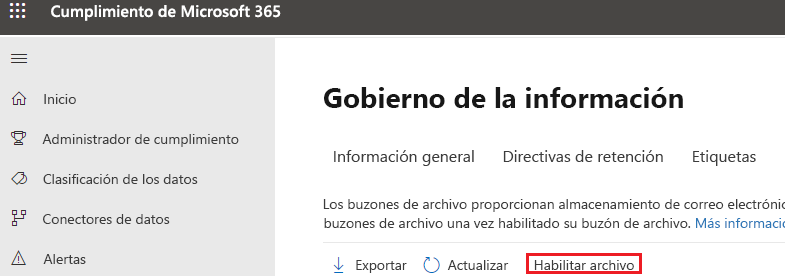

# <a name="enable-archive-mailboxes-in-the-compliance-center"></a><span data-ttu-id="aff79-103">Habilitar los buzones de archivo en el centro de cumplimiento</span><span class="sxs-lookup"><span data-stu-id="aff79-103">Enable archive mailboxes in the compliance center</span></span>

<span data-ttu-id="aff79-104">El archivado en Microsoft 365 (también llamado *archivado local*) proporciona a los usuarios un espacio de almacenamiento adicional en el buzón.</span><span class="sxs-lookup"><span data-stu-id="aff79-104">Archiving in Microsoft 365 (also called *In-Place Archiving*) provides users with additional mailbox storage space.</span></span> <span data-ttu-id="aff79-105">Después de habilitar los buzones de archivo, los usuarios pueden obtener acceso a los mensajes y almacenarlos en los buzones de archivo con Microsoft Outlook y Outlook en la Web (anteriormente denominada Outlook Web App).</span><span class="sxs-lookup"><span data-stu-id="aff79-105">After you turn on archive mailboxes, users can access and store messages in their archive mailboxes by using Microsoft Outlook and Outlook on the web (formerly known as Outlook Web App).</span></span> <span data-ttu-id="aff79-106">Los usuarios también pueden mover o copiar mensajes entre su buzón de correo principal y el buzón de archivo.</span><span class="sxs-lookup"><span data-stu-id="aff79-106">Users can also move or copy messages between their primary mailbox and their archive mailbox.</span></span> <span data-ttu-id="aff79-107">También pueden recuperar elementos eliminados de la carpeta de Elementos recuperables en su buzón de archivo mediante la herramienta Recuperar elementos eliminados.</span><span class="sxs-lookup"><span data-stu-id="aff79-107">They can also recover deleted items from the Recoverable Items folder in their archive mailbox by using the Recover Deleted Items tool.</span></span>

> [!NOTE]
> <span data-ttu-id="aff79-108">La función de archivado de expansión automática de Microsoft 365 proporciona almacenamiento adicional en los buzones de archivo.</span><span class="sxs-lookup"><span data-stu-id="aff79-108">The auto-expanding archiving feature in Microsoft 365 provides additional storage in archive mailboxes.</span></span> <span data-ttu-id="aff79-109">Cuando se activa el archivo de ampliación automática y se alcanza la cuota de almacenamiento inicial en el buzón de archivo de un usuario, Microsoft 365 agrega automáticamente espacio de almacenamiento adicional.</span><span class="sxs-lookup"><span data-stu-id="aff79-109">When auto-expanding  archiving is turned on, and then the initial storage quota in a user's archive mailbox is reached, Microsoft 365 automatically adds additional storage space.</span></span> <span data-ttu-id="aff79-110">Esto significa que los usuarios no se quedan sin espacio de almacenamiento en el buzón y que no tendrá que administrar nada después de habilitar el buzón de archivo por primera vez y activar el archivado de ampliación automática para su organización.</span><span class="sxs-lookup"><span data-stu-id="aff79-110">This means that users won't run out of mailbox storage space and you won't have to manage anything after you initially enable the archive mailbox and turn on auto-expanding archiving for your organization.</span></span> <span data-ttu-id="aff79-111">Para obtener más información, consulte [Información general del archivado ilimitado](unlimited-archiving.md).</span><span class="sxs-lookup"><span data-stu-id="aff79-111">For more information, see [Overview of unlimited archiving](unlimited-archiving.md).</span></span>

## <a name="get-the-necessary-permissions"></a><span data-ttu-id="aff79-112">Obtener los permisos necesarios</span><span class="sxs-lookup"><span data-stu-id="aff79-112">Get the necessary permissions</span></span>

<span data-ttu-id="aff79-113">Debe tener asignado el rol de Destinatarios de correo de Exchange Online para habilitar o deshabilitar los buzones de archivo.</span><span class="sxs-lookup"><span data-stu-id="aff79-113">You have to be assigned the Mail Recipients role in Exchange Online to enable or disable archive mailboxes.</span></span> <span data-ttu-id="aff79-114">De manera predeterminada, este rol se asigna a los grupos de roles Administración de la organización y Administración de destinatarios en la página **Permisos** del centro de administración de Exchange.</span><span class="sxs-lookup"><span data-stu-id="aff79-114">By default, this role is assigned to the Recipient Management and Organization Management role groups on the **Permissions** page in the Exchange admin center.</span></span> <span data-ttu-id="aff79-115">Si no ve la página **Archivo** en el Centro de seguridad y cumplimiento, pida al administrador que le asigne los permisos necesarios.</span><span class="sxs-lookup"><span data-stu-id="aff79-115">If you don't see the **Archive** page in the Security & Compliance Center, ask your administrator to assign you the necessary permissions.</span></span>

## <a name="enable-an-archive-mailbox"></a><span data-ttu-id="aff79-116">Habilitación de un buzón de archivo</span><span class="sxs-lookup"><span data-stu-id="aff79-116">Enable an archive mailbox</span></span>

1. <span data-ttu-id="aff79-117">Vaya a <https://protection.office.com>.</span><span class="sxs-lookup"><span data-stu-id="aff79-117">Go to <https://protection.office.com>.</span></span>

2. <span data-ttu-id="aff79-118">Inicie sesión con su cuenta profesional o educativa.</span><span class="sxs-lookup"><span data-stu-id="aff79-118">Sign in using your work or school account.</span></span>

3. <span data-ttu-id="aff79-119">En el panel izquierdo del centro de cumplimiento de & de seguridad, haga clic en **control de la información** \> **archivo**.</span><span class="sxs-lookup"><span data-stu-id="aff79-119">In the left pane of the Security & Compliance Center, click **Information governance** \> **Archive**.</span></span>

   <span data-ttu-id="aff79-p104">Aparece la página **Archivo**. La columna **Buzón de correo de archivo** indica si un buzón de archivo está habilitado o deshabilitado para cada usuario.</span><span class="sxs-lookup"><span data-stu-id="aff79-p104">The **Archive** page is displayed. The **Archive mailbox** column indicates whether an archive mailbox is enabled or disabled for each user.</span></span>

   > [!NOTE]
   > <span data-ttu-id="aff79-122">La página **Archivo** muestra un máximo de 500 usuarios.</span><span class="sxs-lookup"><span data-stu-id="aff79-122">The **Archive** page shows a maximum of 500 users.</span></span>

4. <span data-ttu-id="aff79-123">En la lista de buzones de correo, seleccione el usuario para el que desea habilitar el buzón de correo.</span><span class="sxs-lookup"><span data-stu-id="aff79-123">In the list of mailboxes, select the user that you want to enable the archive mailbox for.</span></span>

   

5. <span data-ttu-id="aff79-125">En el panel de detalles para el usuario seleccionado, haga clic en **Habilitar**.</span><span class="sxs-lookup"><span data-stu-id="aff79-125">In the details pane for the selected user, click **Enable**.</span></span>

   <span data-ttu-id="aff79-126">Se muestra una advertencia que indica que, si habilita el buzón de archivo, los elementos en el buzón del usuario que sean más antiguos que la directiva de archivado asignada al buzón se moverán al nuevo buzón de archivo.</span><span class="sxs-lookup"><span data-stu-id="aff79-126">A warning is displayed saying that if you enable the archive mailbox, items in the user's mailbox that are older than the archiving policy assigned to the mailbox will be moved to the new archive mailbox.</span></span> <span data-ttu-id="aff79-127">La directiva de archivo predeterminada que forma parte de la directiva de retención asignada a buzones de Exchange Online mueve elementos al buzón de archivo dos años después de la fecha en que el elemento se entregó al buzón o fue creado por el usuario.</span><span class="sxs-lookup"><span data-stu-id="aff79-127">The default archive policy that is part of the retention policy assigned to Exchange Online mailboxes moves items to the archive mailbox two years after the date the item was delivered to the mailbox or created by the user.</span></span> <span data-ttu-id="aff79-128">Para más información, vea la sección **Más información** de este artículo.</span><span class="sxs-lookup"><span data-stu-id="aff79-128">For more information, see the **More info** section in this article.</span></span>

6. <span data-ttu-id="aff79-129">Haga clic en **Sí** para habilitar el buzón de archivo.</span><span class="sxs-lookup"><span data-stu-id="aff79-129">Click **Yes** to enable the archive mailbox.</span></span>

   <span data-ttu-id="aff79-130">Puede tardar unos momentos para crear el buzón de archivo.</span><span class="sxs-lookup"><span data-stu-id="aff79-130">It might take a few moments to create the archive mailbox.</span></span> <span data-ttu-id="aff79-131">Una vez creado, aparece **Buzón de archivo: habilitado** en el panel de detalles del usuario seleccionado.</span><span class="sxs-lookup"><span data-stu-id="aff79-131">When it's created, **Archive mailbox: enabled** is displayed in the details pane for the selected user.</span></span> <span data-ttu-id="aff79-132">Es posible que deba hacer clic en **Actualizar**  para actualizar la información en el panel de detalles.</span><span class="sxs-lookup"><span data-stu-id="aff79-132">You might have to click **Refresh**  to update the information in the details pane.</span></span>

> [!TIP]
> <span data-ttu-id="aff79-p107">También puede habilitar buzones de archivo de forma masiva seleccionando varios usuarios con los buzones de archivo deshabilitados (use las teclas Mayús o Ctrl). Después de seleccionar varios buzones, haga clic en **Habilitar** en el panel de detalles.</span><span class="sxs-lookup"><span data-stu-id="aff79-p107">You can also bulk-enable archive mailboxes by selecting multiple users with disabled archive mailboxes (use the Shift or Ctrl keys). After selecting multiple mailboxes, click **Enable** in the details pane.</span></span>

## <a name="disable-an-archive-mailbox"></a><span data-ttu-id="aff79-135">Deshabilitar un buzón de archivo</span><span class="sxs-lookup"><span data-stu-id="aff79-135">Disable an archive mailbox</span></span>

<span data-ttu-id="aff79-136">También puede usar la página **Archivo** en el Centro de seguridad y cumplimiento para deshabilitar el buzón de archivo del usuario.</span><span class="sxs-lookup"><span data-stu-id="aff79-136">You can also use the **Archive** page in the Security & Compliance Center to disable a user's archive mailbox.</span></span> <span data-ttu-id="aff79-137">Después de deshabilitar un buzón de archivo, puede volver a conectarlo al buzón de correo principal del usuario en un plazo de 30 días tras la deshabilitación.</span><span class="sxs-lookup"><span data-stu-id="aff79-137">After you disable an archive mailbox, you can reconnect it to the user's primary mailbox within 30 days of disabling it.</span></span> <span data-ttu-id="aff79-138">En este caso, se restaura el contenido original del buzón de archivo.</span><span class="sxs-lookup"><span data-stu-id="aff79-138">In this case, the original contents of the archive mailbox are restored.</span></span> <span data-ttu-id="aff79-139">Transcurridos los 30 días, el contenido del buzón de archivo original se elimina definitivamente y no se puede recuperar.</span><span class="sxs-lookup"><span data-stu-id="aff79-139">After 30 days, the contents of the original archive mailbox are permanently deleted and can't be recovered.</span></span> <span data-ttu-id="aff79-140">Así, si vuelve a habilitar el archivo después de los 30 días posteriores a la deshabilitación, se crea un buzón de archivo nuevo.</span><span class="sxs-lookup"><span data-stu-id="aff79-140">So if you re-enable the archive more than 30 days after disabling it, a new archive mailbox is created.</span></span>

<span data-ttu-id="aff79-141">La directiva de archivo de forma predeterminada asignada a los buzones de los usuarios mueve los elementos al buzón de archivo dos años después de la fecha de entrega del elemento.</span><span class="sxs-lookup"><span data-stu-id="aff79-141">The default archive policy assigned to users' mailboxes moves items to the archive mailbox two years after the date the item is delivered.</span></span> <span data-ttu-id="aff79-142">Si deshabilita un buzón de archivo de un usuario, no se realizará ninguna acción en los elementos del buzón y permanecerán en el buzón principal del usuario.</span><span class="sxs-lookup"><span data-stu-id="aff79-142">If you disable a user's archive mailbox, no action will be taken on mailbox items and they will remain in the user's primary mailbox.</span></span>

<span data-ttu-id="aff79-143">Para deshabilitar un buzón de archivo:</span><span class="sxs-lookup"><span data-stu-id="aff79-143">To disable an archive mailbox:</span></span>

1. <span data-ttu-id="aff79-144">Vaya a <https://protection.office.com>.</span><span class="sxs-lookup"><span data-stu-id="aff79-144">Go to <https://protection.office.com>.</span></span>

2. <span data-ttu-id="aff79-145">Inicie sesión con su cuenta profesional o educativa.</span><span class="sxs-lookup"><span data-stu-id="aff79-145">Sign in using your work or school account.</span></span>

3. <span data-ttu-id="aff79-146">En el panel izquierdo del centro de cumplimiento de & de seguridad, haga clic en **control de la información** \> **archivo**.</span><span class="sxs-lookup"><span data-stu-id="aff79-146">In the left pane of the Security & Compliance Center, click **Information governance** \> **Archive**.</span></span>

   <span data-ttu-id="aff79-p110">Aparece la página **Archivo**. La columna **Buzón de correo de archivo** indica si un buzón de archivo está habilitado o deshabilitado para cada usuario.</span><span class="sxs-lookup"><span data-stu-id="aff79-p110">The **Archive** page is displayed. The **Archive mailbox** column indicates whether an archive mailbox is enabled or disabled for each user.</span></span>

   > [!NOTE]
   > <span data-ttu-id="aff79-149">La página **Archivo** muestra un máximo de 500 usuarios.</span><span class="sxs-lookup"><span data-stu-id="aff79-149">The **Archive** page shows a maximum of 500 users.</span></span>

4. <span data-ttu-id="aff79-150">En la lista de buzones, seleccione el usuario para el que desea deshabilitar el buzón de archivo.</span><span class="sxs-lookup"><span data-stu-id="aff79-150">In the list of mailboxes, select the user that you want to disable the archive mailbox for.</span></span>

5. <span data-ttu-id="aff79-151">En el panel de detalles, haga clic en **Deshabilitar**.</span><span class="sxs-lookup"><span data-stu-id="aff79-151">In the details pane, click **Disable**.</span></span>

   <span data-ttu-id="aff79-152">Aparece un mensaje de advertencia que indica que tendrá 30 días para volver a habilitar el buzón de archivo y que, transcurridos esos 30 días, toda la información del archivo se eliminará permanentemente.</span><span class="sxs-lookup"><span data-stu-id="aff79-152">A warning message is displayed saying that you'll have 30 days to re-enable the archive mailbox, and that after 30 days, all information in the archive will be permanently deleted.</span></span>

6. <span data-ttu-id="aff79-153">Haga clic en **Sí** para deshabilitar el buzón de archivo.</span><span class="sxs-lookup"><span data-stu-id="aff79-153">Click **Yes** to disable the archive mailbox.</span></span>

   <span data-ttu-id="aff79-154">El buzón de archivo puede tardar un poco en deshabilitarse.</span><span class="sxs-lookup"><span data-stu-id="aff79-154">It might take a few moments to disable the archive mailbox.</span></span> <span data-ttu-id="aff79-155">Una vez deshabilitado, aparece **Buzón de archivo: deshabilitado** en el panel de detalles del usuario seleccionado.</span><span class="sxs-lookup"><span data-stu-id="aff79-155">When it's disabled, **Archive mailbox: disabled** is displayed in the details pane for the selected user.</span></span> <span data-ttu-id="aff79-156">Es posible que deba hacer clic en **Actualizar**  para actualizar la información en el panel de detalles.</span><span class="sxs-lookup"><span data-stu-id="aff79-156">You might have to click **Refresh**  to update the information in the details pane.</span></span>

> [!TIP]
> <span data-ttu-id="aff79-p112">También puede deshabilitar buzones de archivo de forma masiva seleccionando varios usuarios con los buzones de archivo habilitados (use las teclas Mayús o Ctrl). Después de seleccionar varios buzones, haga clic en **Deshabilitar** en el panel de detalles.</span><span class="sxs-lookup"><span data-stu-id="aff79-p112">You can also bulk-disable archive mailboxes by selecting multiple users with enabled archive mailboxes (use the Shift or Ctrl keys). After selecting multiple mailboxes, click **Disable** in the details pane.</span></span>

## <a name="use-exchange-online-powershell-to-enable-or-disable-archive-mailboxes"></a><span data-ttu-id="aff79-159">Usar PowerShell de Exchange Online para habilitar o deshabilitar buzones de archivo.</span><span class="sxs-lookup"><span data-stu-id="aff79-159">Use Exchange Online PowerShell to enable or disable archive mailboxes</span></span>

<span data-ttu-id="aff79-160">También puede usar PowerShell de Exchange Online para habilitar buzones de archivo.</span><span class="sxs-lookup"><span data-stu-id="aff79-160">You can also use Exchange Online PowerShell to enable archive mailboxes.</span></span> <span data-ttu-id="aff79-161">La razón principal para usar PowerShell es que permite habilitar rápidamente el buzón de archivo para todos los usuarios de la organización.</span><span class="sxs-lookup"><span data-stu-id="aff79-161">The primary reason to use PowerShell is that you can quickly enable the archive mailbox for all users in your organization.</span></span>

<span data-ttu-id="aff79-162">El primer paso es conectar al PowerShell de Exchange Online.</span><span class="sxs-lookup"><span data-stu-id="aff79-162">The first step is to connect to Exchange Online PowerShell.</span></span> <span data-ttu-id="aff79-163">Para obtener instrucciones, consulte [Conexión a Exchange Online PowerShell](/powershell/exchange/connect-to-exchange-online-powershell).</span><span class="sxs-lookup"><span data-stu-id="aff79-163">For instructions, see [Connect to Exchange Online PowerShell](/powershell/exchange/connect-to-exchange-online-powershell).</span></span>

<span data-ttu-id="aff79-164">Una vez que esté conectado a Exchange Online, puede ejecutar los comandos de las secciones siguientes para habilitar o deshabilitar los buzones de archivo.</span><span class="sxs-lookup"><span data-stu-id="aff79-164">After you're connected to Exchange Online, you can run the commands in the following sections to enable or disable archive mailboxes.</span></span>

### <a name="enable-archive-mailboxes"></a><span data-ttu-id="aff79-165">Habilitar buzones de archivo</span><span class="sxs-lookup"><span data-stu-id="aff79-165">Enable archive mailboxes</span></span>

<span data-ttu-id="aff79-166">Ejecute el comando siguiente para habilitar el buzón de archivo para un único usuario.</span><span class="sxs-lookup"><span data-stu-id="aff79-166">Run the following command to enable the archive mailbox for a single user.</span></span>

```powershell
Enable-Mailbox -Identity <username> -Archive
```

<span data-ttu-id="aff79-167">Ejecute el comando siguiente para habilitar el buzón de archivo para todos los usuarios de su organización (cuyo buzón de archivo no está habilitado en este momento).</span><span class="sxs-lookup"><span data-stu-id="aff79-167">Run the following command to enable the archive mailbox for all users in your organization (whose archive mailbox is currently not enabled).</span></span>

```powershell
Get-Mailbox -Filter {ArchiveGuid -Eq "00000000-0000-0000-0000-000000000000" -AND RecipientTypeDetails -Eq "UserMailbox"} | Enable-Mailbox -Archive
```

### <a name="disable-archive-mailboxes"></a><span data-ttu-id="aff79-168">Deshabilitar los buzones de archivo</span><span class="sxs-lookup"><span data-stu-id="aff79-168">Disable archive mailboxes</span></span>

<span data-ttu-id="aff79-169">Ejecute el siguiente comando para deshabilitar el buzón de archivo de un único usuario.</span><span class="sxs-lookup"><span data-stu-id="aff79-169">Run the following command to disable the archive mailbox for a single user.</span></span>

```powershell
Disable-Mailbox -Identity <username> -Archive
```

<span data-ttu-id="aff79-170">Ejecute el comando siguiente para deshabilitar el buzón de archivo para todos los usuarios de su organización (cuyo buzón de archivo está habilitado en este momento).</span><span class="sxs-lookup"><span data-stu-id="aff79-170">Run the following command to disable the archive mailbox for all users in your organization (whose archive mailbox is currently enabled).</span></span>

```powershell
Get-Mailbox -Filter {ArchiveGuid -Ne "00000000-0000-0000-0000-000000000000" -AND RecipientTypeDetails -Eq "UserMailbox"} | Disable-Mailbox -Archive
```

## <a name="more-information"></a><span data-ttu-id="aff79-171">Más información</span><span class="sxs-lookup"><span data-stu-id="aff79-171">More information</span></span>

- <span data-ttu-id="aff79-172">Cuando un buzón de archivo está habilitado, los usuarios pueden almacenar mensajes en su buzón de archivo.</span><span class="sxs-lookup"><span data-stu-id="aff79-172">When an archive mailbox is enabled, users can store messages in their archive mailbox.</span></span> <span data-ttu-id="aff79-173">Los usuarios pueden obtener acceso a los buzones de archivo mediante Microsoft Outlook y Outlook en la Web.</span><span class="sxs-lookup"><span data-stu-id="aff79-173">Users can access their archive mailboxes by using Microsoft Outlook and Outlook on the web.</span></span> <span data-ttu-id="aff79-174">Mediante cualquiera de estas aplicaciones cliente, los usuarios pueden visualizar mensajes en su buzón de archivo y mover o copiar mensajes entre su buzón de correo principal y el buzón de archivo.</span><span class="sxs-lookup"><span data-stu-id="aff79-174">Using either of these client applications, users can view messages in their archive mailbox and move or copy messages between their primary mailbox and their archive mailbox.</span></span> <span data-ttu-id="aff79-175">Los usuarios también pueden recuperar elementos eliminados de la carpeta de Elementos recuperables en su buzón de archivo mediante la herramienta Recuperar elementos eliminados.</span><span class="sxs-lookup"><span data-stu-id="aff79-175">Users can also recover deleted items from the Recoverable Items folder in their archive mailbox by using the Recover Deleted Items tool.</span></span>

  <span data-ttu-id="aff79-176">Para obtener una lista de las licencias de Outlook que son compatibles con el archivado local, vea [Requisitos de licencia de Outlook para las funciones de Exchange](https://support.microsoft.com/office/46b6b7c5-c3ca-43e5-8424-1e2807917c99).</span><span class="sxs-lookup"><span data-stu-id="aff79-176">For a list of Outlook licenses that support In-Place Archiving, see [Outlook license requirements for Exchange features](https://support.microsoft.com/office/46b6b7c5-c3ca-43e5-8424-1e2807917c99).</span></span>

- <span data-ttu-id="aff79-177">Los buzones de archivo permiten que usted y sus usuarios cumplan con los requisitos de retención de mensajes de la organización, eDiscovery y conservación.</span><span class="sxs-lookup"><span data-stu-id="aff79-177">Archive mailboxes help you and your users to meet your organization's retention, eDiscovery, and hold requirements.</span></span> <span data-ttu-id="aff79-178">Por ejemplo, puede usar la directiva de retención de Exchange de su organización para mover el contenido del buzón al buzón de archivo de los usuarios.</span><span class="sxs-lookup"><span data-stu-id="aff79-178">For example, you can use your organization's Exchange retention policy to move mailbox content to users' archive mailbox.</span></span> <span data-ttu-id="aff79-179">Cuando se usa la herramienta de Búsqueda de contenido en el Centro de seguridad y cumplimiento para buscar contenido específico en el buzón de un usuario, también se buscará en el buzón de archivo del usuario.</span><span class="sxs-lookup"><span data-stu-id="aff79-179">When you use the Content Search tool in the Security & Compliance Center to search a user's mailbox for specific content, the user's archive mailbox will also be searched.</span></span> <span data-ttu-id="aff79-180">Y, cuando se coloca una Retención por juicio o se aplica una directiva de retención en el buzón de un usuario, también se retienen los elementos del buzón de archivo.</span><span class="sxs-lookup"><span data-stu-id="aff79-180">And, when you place a Litigation Hold or apply a retention policy to a user's mailbox, items in the archive mailbox are also retained.</span></span>

- <span data-ttu-id="aff79-181">Cuando se habilitan los buzones de archivo, la organización puede beneficiarse de la directiva de retención de Exchange predeterminada (también llamada directiva de Administración de registros de mensajería o MRM) que se asigna automáticamente a todos los buzones.</span><span class="sxs-lookup"><span data-stu-id="aff79-181">After archive mailboxes are enabled, your organization can take advantage of the default Exchange retention policy (also called Messaging Records Management or MRM policy) that is automatically assigned to every mailbox.</span></span> <span data-ttu-id="aff79-182">Cuando se habilita un buzón de archivo, la directiva de retención de Exchange predeterminada hace automáticamente lo siguiente:</span><span class="sxs-lookup"><span data-stu-id="aff79-182">When an archive mailbox is enabled, the default Exchange retention policy automatically does the following:</span></span>

  - <span data-ttu-id="aff79-183">Mueve los elementos que tienen dos años o más del buzón principal del usuario a su buzón de archivo.</span><span class="sxs-lookup"><span data-stu-id="aff79-183">Moves items that are two years or older from a user's primary mailbox to their archive mailbox.</span></span>

  - <span data-ttu-id="aff79-184">Mueve los elementos que tienen 14 días o más de la carpeta Elementos recuperables del buzón de correo principal del usuario a la carpeta Elementos recuperables del buzón de archivo.</span><span class="sxs-lookup"><span data-stu-id="aff79-184">Moves items that are 14 days or older from the Recoverable Items folder in the user's primary mailbox to the Recoverable Items folder in their archive mailbox.</span></span>

- <span data-ttu-id="aff79-185">Para obtener más información acerca de los buzones de archivo y las directivas de retención de Exchange, vea:</span><span class="sxs-lookup"><span data-stu-id="aff79-185">For more information about archive mailboxes and Exchange retention policies, see:</span></span>

  - [<span data-ttu-id="aff79-186">Etiquetas de retención y directivas de retención en Exchange Online</span><span class="sxs-lookup"><span data-stu-id="aff79-186">Retention tags and retention policies in Exchange Online</span></span>](/exchange/security-and-compliance/messaging-records-management/retention-tags-and-policies)

  - [<span data-ttu-id="aff79-187">Directiva de retención predeterminada de Exchange Online</span><span class="sxs-lookup"><span data-stu-id="aff79-187">Default Retention Policy in Exchange Online</span></span>](/exchange/security-and-compliance/messaging-records-management/default-retention-policy)

  - [<span data-ttu-id="aff79-188">Configurar una directiva de archivo y eliminación de buzones en la organización</span><span class="sxs-lookup"><span data-stu-id="aff79-188">Set up an archive and deletion policy for mailboxes in your organization</span></span>](set-up-an-archive-and-deletion-policy-for-mailboxes.md)