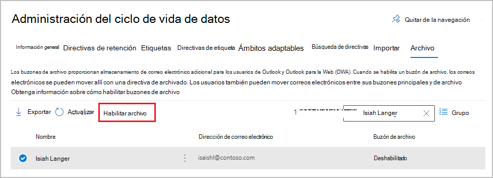
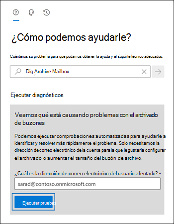

# <a name="enable-archive-mailboxes-in-the-microsoft-purview-compliance-portal"></a>Habilitación de buzones de archivo en el portal de cumplimiento de Microsoft Purview

[!include[Purview banner](../includes/purview-rebrand-banner.md)]

El archivado en Microsoft 365 (también llamado *Archivado local*) proporciona a los usuarios un espacio de almacenamiento adicional en el buzón. Para obtener más información, vea [Obtener información sobre los buzones de archivo](archive-mailboxes.md).

Use la información de este artículo para habilitar o deshabilitar un buzón de archivo en el portal de cumplimiento de Microsoft Purview o mediante PowerShell. Obtenga también información sobre cómo ejecutar una comprobación de diagnóstico automatizada en el buzón de archivo de un usuario para identificar los problemas y las soluciones sugeridas.

## <a name="get-the-necessary-permissions"></a>Obtener los permisos necesarios

Debe tener asignado el rol Destinatarios de correo en Exchange Online para habilitar o deshabilitar los buzones de archivo. De forma predeterminada, este rol se asigna a los grupos de roles Administración de destinatarios y Administración de la organización en la página **Permisos** del <a href="https://go.microsoft.com/fwlink/p/?linkid=2059104" target="_blank">Centro de administración de Exchange</a>. 

Si no ve la página **Archivo** en el portal de cumplimiento de Microsoft Purview, pida al administrador que le asigne los permisos necesarios.

## <a name="enable-an-archive-mailbox"></a>Habilitación de un buzón de archivo

1. Vaya a <a href="https://go.microsoft.com/fwlink/p/?linkid=2077149" target="_blank">portal de cumplimiento de Microsoft Purview</a> e inicie sesión.

2. En el panel izquierdo del portal de cumplimiento, seleccione **Administración del ciclo de vida de los datos** > **Archivo**.

   En la página **Archivo**, la columna **Buzón de archivo** indica si un buzón de archivo está habilitado o deshabilitado para cada usuario.

   > [!NOTE]
   > La página **Archivo** muestra un máximo de 500 usuarios. Use el cuadro de búsqueda si no puede ver inmediatamente el nombre del usuario que desea.

3. En la lista de buzones, seleccione el usuario para el que desea habilitar el buzón de archivo y seleccione la opción **Habilitar Archivo**:
    
   
    
   Se muestra una advertencia que indica que, si habilita el buzón de archivo, los elementos en el buzón del usuario que sean más antiguos que la directiva de archivado asignada al buzón se moverán al nuevo buzón de archivo. La directiva de archivo predeterminada que forma parte de la directiva de retención asignada a buzones de Exchange Online mueve elementos al buzón de archivo dos años después de la fecha en que el elemento se entregó al buzón o fue creado por el usuario. Para obtener más información, vea [Obtener información sobre los buzones de archivo](archive-mailboxes.md).

5. Seleccione **Habilitar** para confirmar.

   Puede tardar unos momentos para crear el buzón de archivo. Cuando se ha creado, **Habilitado** se muestra en la columna **Buzón de archivo** del usuario seleccionado, aunque es posible que tenga que actualizar la página para ver el cambio de estado.

## <a name="disable-an-archive-mailbox"></a>Deshabilitar un buzón de archivo

Del mismo modo que habilita un buzón de archivo, puede usar la página **Archivo** del portal de cumplimiento de Microsoft Purview para deshabilitar el buzón de archivo de un usuario. Esta vez, seleccione la opción **Deshabilitar archivo** después de seleccionar el usuario.

Después de deshabilitar un buzón de archivo, puede volver a conectarlo al buzón de correo principal del usuario en un plazo de 30 días tras la deshabilitación. En este caso se restaura el contenido original del buzón de archivo. Transcurridos los 30 días, el contenido del buzón de archivo original se elimina definitivamente y no se puede recuperar. Así, si vuelve a habilitar el archivo después de los 30 días posteriores a la deshabilitación, se crea un buzón de archivo nuevo.

La directiva de archivo de forma predeterminada asignada a los buzones de usuarios mueve los elementos al buzón de archivo dos años después de la fecha de entrega del elemento. Si deshabilita el buzón de archivo de un usuario, no se realizará ninguna acción en los elementos del buzón y permanecerán en el buzón principal del usuario.

## <a name="use-exchange-online-powershell-to-enable-or-disable-archive-mailboxes"></a>Usar PowerShell de Exchange Online para habilitar o deshabilitar buzones de archivo.

También puede usar PowerShell de Exchange Online para habilitar los buzones de archivo. La razón principal para usar PowerShell es que permite habilitar rápidamente el buzón de archivo para todos los usuarios de la organización.

El primer paso es conectar al PowerShell de Exchange Online. Para obtener instrucciones, consulte [Conexión a Exchange Online PowerShell](/powershell/exchange/connect-to-exchange-online-powershell).

Una vez que esté conectado a Exchange Online, puede ejecutar los comandos de las secciones siguientes para habilitar o deshabilitar los buzones de archivo.

### <a name="enable-archive-mailboxes"></a>Habilitar buzones de archivo

Ejecute el comando siguiente para habilitar el buzón de archivo para un único usuario.

```powershell
Enable-Mailbox -Identity <username> -Archive
```

Ejecute el comando siguiente para habilitar el buzón de archivo para todos los usuarios de su organización (cuyo buzón de archivo no está habilitado en este momento).

```powershell
Get-Mailbox -Filter {ArchiveGuid -Eq "00000000-0000-0000-0000-000000000000" -AND RecipientTypeDetails -Eq "UserMailbox"} | Enable-Mailbox -Archive
```

### <a name="disable-archive-mailboxes"></a>Deshabilitar los buzones de archivo

Ejecute el siguiente comando para deshabilitar el buzón de archivo de un único usuario.

```powershell
Disable-Mailbox -Identity <username> -Archive
```

Ejecute el comando siguiente para deshabilitar el buzón de archivo para todos los usuarios de su organización (cuyo buzón de archivo está habilitado en este momento).

```powershell
Get-Mailbox -Filter {ArchiveGuid -Ne "00000000-0000-0000-0000-000000000000" -AND RecipientTypeDetails -Eq "UserMailbox"} | Disable-Mailbox -Archive
```

## <a name="run-diagnostics-on-archive-mailboxes"></a>Ejecutar diagnósticos en buzones de correo de archivo

Puede ejecutar una comprobación de diagnóstico automatizada en el buzón de archivo de un usuario para identificar los problemas y las soluciones sugeridas.

Para ejecutar la comprobación de diagnóstico, haga clic en el siguiente botón. 

> [!div class="nextstepaction"]
> [Ejecutar pruebas: Buzón de archivo](https://aka.ms/PillarArchiveMailbox)



Se abre una página de control flotante en el Centro de administración de Microsoft 365. Escriba la dirección de correo electrónico del buzón que desea comprobar y haga clic en **Ejecutar las pruebas**.

> [!NOTE]
> Debe ser un administrador global de Microsoft 365 para usar la comprobación de diagnóstico del buzón de archivo. Además, esta característica no está disponible en las nubes de Microsoft 365 Government, Microsoft 365 operado por 21Vianet o Microsoft 365 Alemania.

## <a name="next-steps"></a>Pasos siguientes

Considere la posibilidad de habilitar el [archivado de expansión automática](autoexpanding-archiving.md) para obtener espacio de almacenamiento adicional. Para obtener instrucciones, consulte [Habilitar el archivado de expansión automática](enable-autoexpanding-archiving.md).
