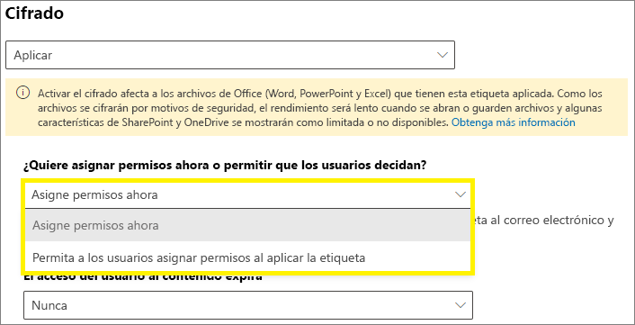
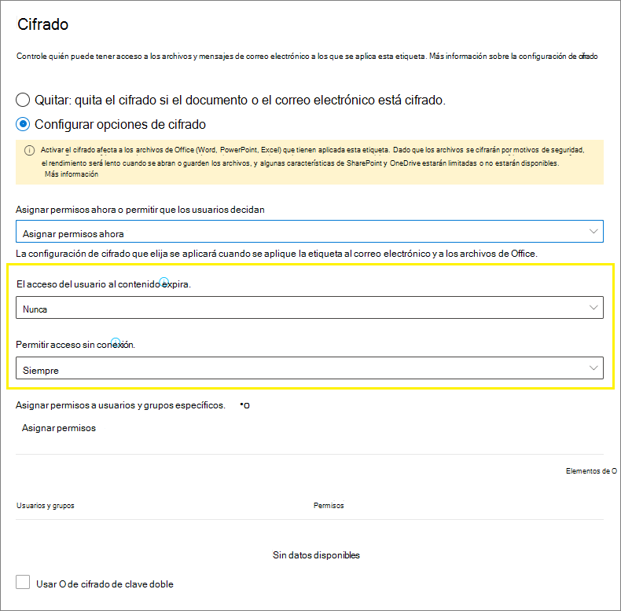
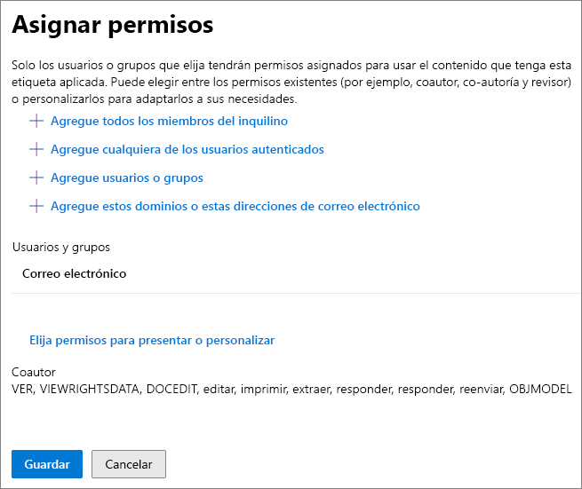
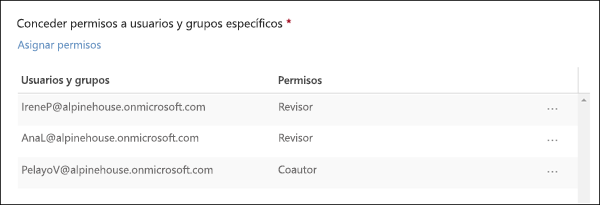
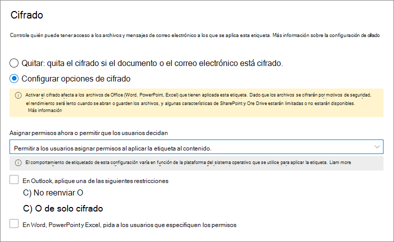
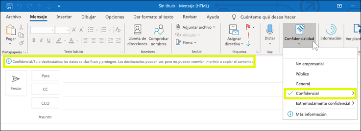
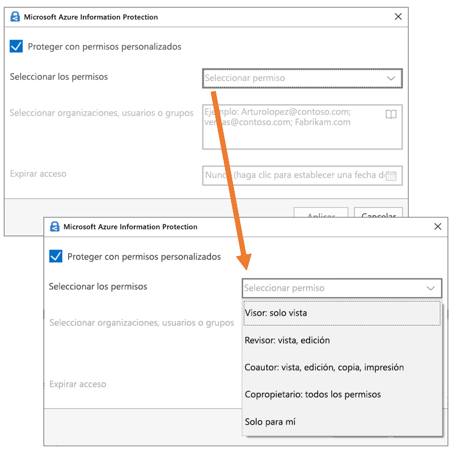

# Restringir el acceso al contenido mediante el uso de etiquetas de confidencialidad para aplicar el cifradoRestrict access to content by using sensitivity labels to apply encryption 

Al crear una etiqueta de confidencialidad, puede restringir el acceso al contenido al que se aplique la etiqueta. Por ejemplo, con las opciones de encriptación de una etiqueta de confidencialidad, se puede proteger el contenido para que:When you create a sensitivity label, you can restrict access to content that the label will be applied to. For example, with the encryption settings for a sensitivity label, you can protect content so that:

- Solo los usuarios de su organización puedan abrir un correo electrónico o documentos confidenciales.Only users within your organization can open a confidential document or email.
- Solo los usuarios del departamento de marketing puedan editar e imprimir documentos o correos electrónicos de anuncios de promociones, mientras que todos los demás usuarios de su organización solo puedan leerlos.Only users in the marketing department can edit and print the promotion announcement document or email, while all other users in your organization can only read it.
- Los usuarios no puedan reenviar un correo electrónico o copiar información que contenga noticias sobre una reorganización interna.Users cannot forward an email or copy information from it that contains news about an internal reorganization.
- La lista de precios actual que se envía a socios comerciales no pueda abrirse tras una fecha especificada.The current price list that is sent to business partners cannot be opened after a specified date.

Cuando se encripta un documento o correo electrónico, el acceso al contenido está restringido, por lo que:When a document or email is encrypted, access to the content is restricted, so that it:

- Se puede desencriptar solo por los usuarios autorizados por la configuración de encriptado de la etiqueta.Can be decrypted only by users authorized by the label’s encryption settings.
- Permanece encriptado independientemente de dónde resida, dentro o fuera de su organización, incluso si cambia el nombre del archivo.Remains encrypted no matter where it resides, inside or outside your organization, even if the file’s renamed.
- Se encripta tanto en reposo (por ejemplo, en una cuenta de OneDrive) como y en tránsito (por ejemplo, un correo electrónico enviado).Is encrypted both at rest (for example, in a OneDrive account) and in transit (for example, a sent email).

Por último, como administrador, al configurar una etiqueta de confidencialidad para aplicar el cifrado, puede elegir entre:Finally, as an admin, when you configure a sensitivity label to apply encryption, you can choose either to:

- **Asignar permisos ahora** para que determine exactamente los permisos para el contenido con esa etiqueta y los usuarios que los obtendrán.**Assign permissions now**, so that you determine exactly which users get which permissions to content with that label.
- **Permitir a los usuarios asignar permisos** al aplicar la etiqueta al contenido.**Let users assign permissions** when they apply the label to content. De esta forma, puede permitir a los usuarios de su organización cierta flexibilidad que pueden necesitar para colaborar y llevar a cabo su trabajo.This way, you can allow people in your organization some flexibility that they might need to collaborate and get their work done.

La configuración de cifrado está disponible cuando se [crea una etiqueta de confidencialidad](create-sensitivity-labels.md) en el Centro de cumplimiento de Microsoft 365, Centro de seguridad de Microsoft 365 o el Centro de seguridad y cumplimiento de Office 365.The encryption settings are available when you [create a sensitivity label](create-sensitivity-labels.md) in the Microsoft 365 compliance center, Microsoft 365 security center, or Office 365 Security & Compliance Center.

## Cómo funciona la encriptaciónHow encryption works

El cifrado usa el servicio Azure Rights Management (Azure RMS) de Azure Information Protection.Encryption uses the Azure Rights Management service (Azure RMS) from Azure Information Protection. Esta solución de protección usa directivas de cifrado, identidades y de autorización.This protection solution uses encryption, identity, and authorization policies. Para obtener más información, consulte [¿qué es Azure Rights Management?](https://docs.microsoft.com/azure/information-protection/what-is-azure-rms) en la documentación de Azure Information Protection.To learn more, see [What is Azure Rights Management?](https://docs.microsoft.com/azure/information-protection/what-is-azure-rms) from the Azure Information Protection documentation. 

Cuando usa esta solución de cifrado, la característica de **superusuario** garantiza que los usuarios y los servicios autorizados siempre puedan leer e inspeccionar los datos que se han cifrado para la organización.When you use this encryption solution, the **super user** feature ensures that authorized people and services can always read and inspect the data that has been encrypted for your organization. Si es necesario, el cifrado puede quitarse o modificarse.If necessary, the encryption can then be removed or changed. Para obtener más información, consulte [configuración de superusuarios para Azure Information Protection y servicios de detección y de recuperación de datos de Azure](https://docs.microsoft.com/azure/information-protection/configure-super-users).For more information, see [Configuring super users for Azure Information Protection and discovery services or data recovery](https://docs.microsoft.com/azure/information-protection/configure-super-users).

## Configurar una etiqueta para el cifradoConfiguring a label for encryption

Cuando [crea o modifica una etiqueta de confidencialidad](create-sensitivity-labels.md#create-and-configure-sensitivity-labels), en la página **cifrado** del asistente, puede seleccionar una de las siguientes opciones:When you [create or edit a sensitivity label](create-sensitivity-labels.md#create-and-configure-sensitivity-labels), on the **Encryption** page of the wizard, you can select one of the following options:

- **Ninguno**: es la configuración predeterminada para una nueva etiqueta.**None**: The default setting for a new label. No se aplica ningún nuevo cifrado.No new encryption is applied.
- **Aplicar**: activa el cifrado y podrá especificar la configuración de cifrado.**Apply**: Turns on encryption, and you then specify encryption settings.
- **Quitar**: quita el cifrado si el documento o el correo electrónico está cifrado.**Remove**: Removes encryption if the document or email is encrypted.

> [!NOTE]
> La opción **Quitar** solo es compatible con el cliente de etiquetado unificado de Azure Information Protection.The **Remove** option is supported by the Azure Information Protection unified labeling client only. Cuando se usa la etiqueta integrada, en las aplicaciones de Office se puede ver una etiqueta con esta opción y, si se selecciona, el comportamiento de cifrado es igual que **Ninguno**.When you use built-in labeling, a label with this option is visible in Office apps and if selected, the encryption behavior is the same as **None**.

Configuración de las opciones de cifrado:Configuring the encryption options:

### Qué sucede con el cifrado existente al aplicar una etiquetaWhat happens to existing encryption when a label's applied

Si se aplica una etiqueta de confidencialidad a contenido sin cifrar, el resultado de las opciones de cifrado que puede seleccionar se explica por sí mismo.If a sensitivity label is applied to unencrypted content, the outcome of the encryption options you can select is self-explanatory. Por ejemplo, si el cifrado está establecido en **ninguno**, el contenido permanece sin cifrar.For example, if encryption is set to **None**, the content remains unencrypted.

Sin embargo, es posible que el contenido ya esté cifrado.However, the content might be already encrypted. Por ejemplo, otro usuario puede haber aplicado:For example, another user might have applied:

- Sus propios permisos, que incluyen permisos definidos por el usuario cuando se le solicitan con una etiqueta, permisos personalizados por el cliente de Azure Information Protection y la protección del documento con **acceso restringido** desde una aplicación de Office.Their own permissions, which include user-defined permissions when prompted by a label, custom permissions by the Azure Information Protection client, and the **Restricted Access** document protection from within an Office app.
- Una plantilla de Azure Rights Management Protection que cifre el contenido independientemente de una etiqueta.An Azure Rights Management protection template that encrypts the content independently from a label. Esta categoría incluye las reglas de flujo de correo que aplican el cifrado mediante la protección de derechos.This category includes mail flow rules that apply encryption by using rights protection.
- Una etiqueta que aplica el cifrado con los permisos asignados por el administrador.A label that applies encryption with permissions assigned by the administrator.

En la tabla siguiente se identifica lo que ocurre con el cifrado existente cuando se aplica una etiqueta de confidencialidad al contenido:The following table identifies what happens to existing encryption when a sensitivity label is applied to that content:

| |**Cifrado: ninguno****Encryption: None**|**Cifrado: aplicar****Encryption: Apply**|**Cifrado: quitar****Encryption: Remove**|
|:-----|:-----|:-----|:-----|
|**Permisos especificados por un usuario****Permissions specified by a user**|Se preserva el cifrado originalOriginal encryption is preserved|Se aplica el cifrado de la nueva etiquetaNew label encryption is applied|Se quita el cifrado originalOriginal encryption is removed|
|**Plantilla de protección****Protection template**|Se preserva el cifrado originalOriginal encryption is preserved|Se aplica el cifrado de la nueva etiquetaNew label encryption is applied|Se quita el cifrado originalOriginal encryption is removed|
|**Etiqueta con permisos definidos por el administator****Label with administator-defined permissions**|Se quita el cifrado originalOriginal encryption is removed|Se aplica el cifrado de la nueva etiquetaNew label encryption is applied|Se quita el cifrado originalOriginal encryption is removed|

Tenga en cuenta que, en los casos en los que se aplica el cifrado de la nueva etiqueta o se elimina el cifrado original, esto solo se produce si el usuario que aplica la etiqueta tiene un derecho de uso o un rol que admite esta acción:Note that in the cases where the new label encryption is applied or the original encryption is removed, this happens only if the user applying the label has a usage right or role that supports this action:
- El [derecho de uso](https://docs.microsoft.com/azure/information-protection/configure-usage-rights.md#usage-rights-and-descriptions) exportar o control total.The [usage right](https://docs.microsoft.com/azure/information-protection/configure-usage-rights.md#usage-rights-and-descriptions) Export or Full Control.
- El rol de [emisor de Administración de derechos o propietario de la Administración de derechos](https://docs.microsoft.com/azure/information-protection/configure-usage-rights#rights-management-issuer-and-rights-management-owner), o bien de [superusuario](https://docs.microsoft.com/azure/information-protection/configure-super-users).The role of [Rights Management issuer or Rights Management owner](https://docs.microsoft.com/azure/information-protection/configure-usage-rights#rights-management-issuer-and-rights-management-owner), or [super user](https://docs.microsoft.com/azure/information-protection/configure-super-users).

Si el usuario no tiene uno de estos derechos o roles, la etiqueta no se puede aplicar y, por lo tanto, se preserva el cifrado original.If the user doesn't have one of these rights or roles, the label can't be applied and so the original encryption is preserved. El usuario verá el siguiente mensaje: **No tiene permiso para realizar este cambio en la etiqueta de confidencialidad. Póngase en contacto con el propietario del contenido.**The user sees the following message: **You don't have permission to make this change to the sensitivity label. Please contact the content owner.**

Por ejemplo, la persona que aplica No reenviar a un mensaje de correo puede reetiquetar el hilo para reemplazar el cifrado o quitarlo, ya que es el propietario de la Administración de derechos del correo electrónico.For example, the person who applies Do Not Forward to an email message can relabel the thread to replace the encryption or remove it, because they are the Rights Management owner for the email. Pero, con la excepción de superusuarios, los destinatarios de este mensaje de correo electrónico no pueden volver a etiquetarlo porque no tienen los derechos de uso necesarios.But with the exception of super users, recipients of this email can't relabel it because they don't have the required usage rights.

#### Datos adjuntos de correo electrónico para mensajes de correo electrónico codificadosEmail attachments for encrypted email messages

Cuando un mensaje de correo electrónico se cifre con cualquier método, todos los documentos de Office no cifrados que se adjunten al correo electrónico heredarán automáticamente la misma configuración de cifrado.When an email message is encrypted by any method, any unencrypted Office documents that are attached to the email automatically inherit the same encryption settings.

Los documentos que ya están cifrados y se agregan como datos adjuntos siempre conservan el cifrado original.Documents that are already encrypted and then added as attachments always preserve their original encryption. 

## Cómo configurar la configuración de cifrado para una etiqueta de confidencialidadHow to configure encryption settings for a sensitivity label

Cuando selecciona **Aplicar** en la página **Cifrado** del asistente para crear o editar una etiqueta de confidencialidad, elija si quiere:When you select **Apply** on the **Encryption** page of the wizard to create or edit a sensitivity label, choose whether to:

- **Asignar permisos ahora** para que pueda determinar exactamente qué permisos obtienen los distintos usuarios para el contenido que tenga aplicada la etiqueta.**Assign permissions now**, so that you can determine exactly which users get which permissions to content that has the label applied. Para obtener más información, vea la sección siguiente [Asignar permisos ahora](#assign-permissions-now).For more information, see the next section [Assign permissions now](#assign-permissions-now).
- **Permitir a los usuarios asignar permisos** al aplicar la etiqueta al contenido.**Let users assign permissions** when your users apply the label to content. De esta forma, puede permitir a los usuarios de su organización cierta flexibilidad que pueden necesitar para colaborar y llevar a cabo su trabajo.With this option, you can allow people in your organization some flexibility that they might need to collaborate and get their work done. Para obtener más información, vea la sección [Permitir a los usuarios asignar permisos](#let-users-assign-permissions) en esta página.For more information, see the [Let users assign permissions](#let-users-assign-permissions) section on this page.

Por ejemplo, si tiene una etiqueta de confidencialidad denominada **Extremadamente confidencial** que se aplicará al contenido más confidencial, es posible que quiera decidir ahora quién obtendrá cierto tipo de permisos para ese contenido.For example, if you have a sensitivity label named **Highly Confidential** that will be applied to your most sensitive content, you might want to decide now who gets what type of permissions to that content.

Por otra parte, si tiene una etiqueta de confidencialidad denominada **Contratos empresariales** y el flujo de trabajo de su organización requiere que sus usuarios colaboren en este contenido con diferentes personas según sea necesario, puede que quiera permitir a los usuarios decidir quién obtiene permisos cuando asignan la etiqueta.Alternatively, if you have a sensitivity label named **Business Contracts**, and your organization's workflow requires that your people collaborate on this content with different people on an ad hoc basis, you might want to allow your users to decide who gets permissions when they assign the label. Esta flexibilidad aumenta la productividad de los usuarios y reduce las solicitudes de actualización y creación de nuevas etiquetas a los administradores para solucionar escenarios específicos.This flexibility both helps your users' productivity and reduces the requests for your admins to update or create new sensitivity labels to address specific scenarios.

Elegir si asignar permisos ahora o permitir a los usuarios asignar permisos:Choosing whether to assign permissions now or let users assign permissions: 

## Asignar permisos ahoraAssign permissions now

Use las opciones siguientes para controlar quién puede tener acceso al correo electrónico o a los documentos a los que se aplica esta etiqueta.Use the following options to control who can access email or documents to which this label is applied. Puede:You can:

1. **Permitir que el acceso al contenido con la etiqueta expire**, ya sea en una fecha específica o tras un número determinado de días después de aplicar la etiqueta. Después de ese momento, los usuarios no podrán abrir el elemento con la etiqueta. Si especifica una fecha, se activará en la medianoche de esa fecha, en la zona horaria actual. (Tenga en cuenta que algunos clientes de correo electrónico pueden no aplicar la expiración y mostrar correos electrónicos una vez pasada dicha fecha, debido a otros mecanismos de almacenamiento en caché).**Allow access to labeled content to expire**, either on a specific date or after a specific number of days after the label is applied. After this time, users won’t be able to open the labeled item. If you specify a date, it is effective midnight on that date in your current time zone. (Note that some email clients might not enforce expiration and show emails past their expiration date, due to their caching mechanisms.)

2. **Permitir el acceso sin conexión** nunca, siempre o durante un número concreto de días después de aplicar la etiqueta. Si restringe el acceso sin conexión a nunca o a un número de días, cuando se alcance el umbral, los usuarios deberán volver a autenticarse y se registrará el acceso. Para obtener más información, vea la siguiente sección sobre la licencia de uso de administración de derechos.**Allow offline access** never, always, or for a specific number of days after the label is applied. If you restrict offline access to never or a number of days, when that threshold is reached, users must be reauthenticated and their access is logged. For more information, see the next section on the Rights Management use license.

Configuración de control de acceso para contenido cifrado:Settings for access control for encrypted content:

### Licencia de uso de administración de derechos para el acceso sin conexiónRights Management use license for offline access

Cuando un usuario abre un documento o un correo electrónico que se ha protegido con el cifrado desde el servicio de Azure Rights Management, se otorga una licencia de uso de Azure Rights Management para ese contenido al usuario.When a user opens a document or email that’s been protected by encryption from the Azure Rights Management service, an Azure Rights Management use license for that content is granted to the user. Esta licencia de uso es un certificado que contiene los derechos de uso del usuario para el documento o correo electrónico y la clave de cifrado que se usó para cifrar el contenido.This use license is a certificate that contains the user's usage rights for the document or email, and the encryption key that was used to encrypt the content. La licencia de uso también contiene una fecha de expiración en caso de que se haya establecido y durante cuánto tiempo es válida la licencia de uso.The use license also contains an expiration date if this has been set, and how long the use license is valid.

Si no se ha establecido ninguna fecha de expiración, el período predeterminado de validez de licencia de uso para un espacio empresarial es 30 días. Durante la duración de la licencia de uso, el usuario no se vuelve a autenticar o autorizar para ver el contenido. Este proceso permite que el usuario pueda abrir el documento o correo electrónico protegido sin conexión a Internet. Cuando la validez de la licencia de uso expire, la próxima vez que el usuario acceda a un documento o correo electrónico protegido, el usuario debe ser autorizado y autenticarse de nuevo.If no expiration date has been set, the default use license validity period for a tenant is 30 days. For the duration of the use license, the user is not reauthenticated or reauthorized for the content. This process lets the user continue to open the protected document or email without an internet connection. When the use license validity period expires, the next time the user accesses the protected document or email, the user must be reauthenticated and reauthorized.

Además de volver a hacer la autenticación, se vuelven a evaluar la configuración de cifrado y la pertenencia a grupos de usuarios.In addition to reauthentication, the encryption settings and user group membership is reevaluated. Esto significa que los usuarios podrían experimentar resultados diferentes de acceso para el mismo documento o correo electrónico si hay cambios en la configuración de cifrado o la pertenencia a grupos con respecto al último momento en que se accedió al contenido.This means that users could experience different access results for the same document or email if there are changes in the encryption settings or group membership from when they last accessed the content.

Para obtener información sobre cómo cambiar la configuración de 30 días predeterminada, vea [Licencia de uso de administración de derechos](https://docs.microsoft.com/azure/information-protection/configure-usage-rights#rights-management-use-license).To learn how to change the default 30-day setting, see [Rights Management use license](https://docs.microsoft.com/azure/information-protection/configure-usage-rights#rights-management-use-license).

### Asignar permisos a usuarios o grupos específicosAssign permissions to specific users or groups

Puede conceder permisos a usuarios específicos para que solo pueden interactuar con el contenido con la etiqueta:You can grant permissions to specific people so that only they can interact with the labeled content:

1. Primero, agregue usuarios o grupos a los que se asignarán permisos para el contenido con la etiqueta.First, add users or groups that will be assigned permissions to the labeled content.

2. Después, elijaqué permisos obtienen los usuarios para el contenido con la etiqueta.Then, choose which permissions those users should have for the labeled content.

Asignación de permisos:Assigning permissions:

#### Agregar usuarios o gruposAdd users or groups

Al asignar permisos, puede elegir:When you assign permissions, you can choose:

- Todos los usuarios de su organización (todos los miembros del espacio empresarial). Esta configuración excluye cuentas de invitado.Everyone in your organization (all tenant members). This setting excludes guest accounts.
- Todos los usuarios autenticados.Any authenticated users. Asegúrese de comprender [las limitaciones y los requisitos](#requirements-and-limitations-for-add-any-authenticated-users) de esta configuración antes de seleccionarla.Make sure you understand the [requirements and limitations](#requirements-and-limitations-for-add-any-authenticated-users) of this setting before selecting it.
- Cualquier usuario específico o grupo de seguridad habilitado para correo electrónico, grupo de distribución, grupo de Office 365 o grupo de distribución dinámico.Any specific user or email-enabled security group, distribution group, Office 365 group, or dynamic distribution group. 
- Cualquier dirección de correo electrónico o dominio fuera de su organización, como gmail.com, outlook.com o hotmail.com.Any email address or domain outside your organization, such as gmail.com, hotmail.com, or outlook.com. 

Cuando elige a todos los miembros del espacio empresarial o busca en el directorio, los usuarios o grupos deben tener una dirección de correo electrónico.When you choose all tenant members or browse the directory, the users or groups must have an email address.

Se recomienda usar grupos en lugar de usuarios. Esta estrategia mantiene la configuración más sencilla.As a best practice, use groups rather than users. This strategy keeps your configuration simpler.

##### Requisitos y limitaciones para **Todos los usuarios autenticados**Requirements and limitations for **Add any authenticated users**

Esta configuración no impide que los usuarios tengan acceso al contenido cifrado por la etiqueta, a la vez que cifra el contenido y ofrece opciones para restringir la manera en que puede usarse el contenido (permisos) y tener acceso a él (acceso de expiración y sin conexión).This setting doesn't restrict who can access the content that the label encrypts, while still encrypting the content and providing you with options to restrict how the content can be used (permissions), and accessed (expiry and offline access). Sin embargo, la aplicación que abra el contenido cifrado debe poder admitir la autenticación que se usa.However, the application opening the encrypted content must be able to support the authentication being used. Por este motivo, los proveedores de redes sociales federadas, como Google, y la autenticación de contraseña de una sola vez, solo funcionan para correo electrónico, y solo cuando se usa Exchange Online y las nuevas funciones del Cifrado de mensajes de Office 365.For this reason, federated social providers such as Google, and onetime passcode authentication work for email only, and only when you use Exchange Online and the new capabilities from Office 365 Message Encryption. Las cuentas de Microsoft se pueden usar con las aplicaciones de Office 365 y el [visor de Azure Information Protection](https://portal.azurerms.com/#/download).Microsoft accounts can be used with Office 365 apps and the [Azure Information Protection viewer](https://portal.azurerms.com/#/download).

Algunos escenarios comunes para la configuración de todos los usuarios autenticados:Some typical scenarios for the any authenticated users setting:
- No le importa quién vea el contenido, pero desea restringir cómo se usa.You don't mind who views the content, but you want to restrict how it is used. Por ejemplo, no quiere que el contenido se pueda modificar, copiar o imprimir.For example, you don't want the content to be edited, copied, or printed.
- No es necesario restringir el acceso al contenido, pero quiere confirmar quién lo abre.You don't need to restrict who accesses the content, but you want to be able to confirm who opens it.
- Tiene un requisito para que el contenido se cifre en reposo y en tránsito, pero no se requieren controles de acceso.You have a requirement that the content must be encrypted at rest and in transit, but it doesn't require access controls.

#### Elegir permisosChoose permissions

Al elegir qué permisos permitir para los usuarios o grupos, puede seleccionar entre:When you choose which permissions to allow for those users or groups, you can select either:

- Un [nivel de permiso predefinido](https://docs.microsoft.com/azure/information-protection/configure-usage-rights#rights-included-in-permissions-levels) con un grupo de derechos preestablecido, como coautor o revisor.A [predefined permissions level](https://docs.microsoft.com/azure/information-protection/configure-usage-rights#rights-included-in-permissions-levels) with a preset group of rights, such as Co-Author or Reviewer.
- Un grupo personalizado de derechos, donde elije los permisos que quiere.A Custom group of rights, where you choose whichever permissions you want.

Para obtener más información sobre cada permiso específico, consulte [Derechos y descripciones de uso](https://docs.microsoft.com/azure/information-protection/configure-usage-rights#usage-rights-and-descriptions).For more information on each specific permission, see [Usage rights and descriptions](https://docs.microsoft.com/azure/information-protection/configure-usage-rights#usage-rights-and-descriptions).  

Tenga en cuenta que la misma etiqueta puede conceder diferentes permisos a diferentes usuarios. Por ejemplo, una sola etiqueta puede asignar a algunos usuarios como revisor y a otros usuarios como coautor, como se muestra en la siguiente captura.Note that the same label can grant different permissions to different users. For example, a single label can assign some users as Reviewer and a different user as Co-author, as shown in the following screenshot.

Para ello, agregue usuarios o grupos, asigne sus permisos y guarde las opciones de configuración. Luego repita estos pasos, agregue usuarios y asigne permisos para guardar la configuración de nuevo. Puede repetir esta configuración tantas veces como sea necesario para definir permisos diferentes para distintos usuarios.To do this, add users or groups, assign them permissions, and save those settings. Then repeat these steps, adding users and assigning them permissions, saving the settings each time. You can repeat this configuration as often as necessary, to define different permissions for different users.

#### El emisor de administración de derechos (el usuario que aplica la etiqueta de confidencialidad) siempre tiene control totalRights Management issuer (user applying the sensitivity label) always has Full Control

El cifrado de una etiqueta de confidencialidad usa el servicio Azure Rights Management de Azure Information Protection.Encryption for a sensitivity label uses the Azure Rights Management service from Azure Information Protection. Cuando un usuario aplica una etiqueta de confidencialidad para proteger un documento o correo electrónico mediante cifrado, ese usuario pasa a ser el emisor de administración de derechos para ese contenido.When a user applies a sensitivity label to protect a document or email by using encryption, that user becomes the Rights Management issuer for that content.

El emisor de administración de derechos siempre obtiene permisos de control total para el documento o correo electrónico y además:The Rights Management issuer is always granted Full Control permissions for the document or email, and in addition:

- Si la configuración de cifrado incluye una fecha de expiración, el emisor de administración de derechos puede abrir y editar el documento o correo electrónico después de esa fecha.If the encryption settings include an expiration date, the Rights Management issuer can still open and edit the document or email after that date.
- El emisor de administración de derechos siempre puede acceder al documento o correo electrónico sin conexión.The Rights Management issuer can always access the document or email offline.
- El emisor de administración de derechos puede seguir abriendo un documento después de que se revoque.The Rights Management issuer can still open a document after it is revoked.

Para obtener más información, vea [Emisor de administración de derechos y propietario de administración de derechos](https://docs.microsoft.com/azure/information-protection/configure-usage-rights#rights-management-issuer-and-rights-management-owner).For more information, see [Rights Management issuer and Rights Management owner](https://docs.microsoft.com/azure/information-protection/configure-usage-rights#rights-management-issuer-and-rights-management-owner).

## Permitir a los usuarios asignar permisosLet users assign permissions

Puede usar estas opciones para que los usuarios puedan asignar permisos cuando aplican manualmente una etiqueta de confidencialidad al contenido:You can use these options to let users assign permissions when they manually apply a sensitivity label to content:

- En Outlook, un usuario puede seleccionar restricciones equivalentes a la opción [No reenviar](https://docs.microsoft.com/azure/information-protection/configure-usage-rights#do-not-forward-option-for-emails) para los destinatarios seleccionados.In Outlook, a user can select restrictions equivalent to the [Do Not Forward](https://docs.microsoft.com/azure/information-protection/configure-usage-rights#do-not-forward-option-for-emails) option for their chosen recipients.

- En Word, PowerPoint y Excel, se pide al usuario que seleccione sus propios permisos para organizaciones, usuarios o grupos específicos.In Word, PowerPoint, and Excel, a user is prompted to select their own permissions for specific users, groups, or organizations. 
    > [!NOTE]
    > Esta opción para Word, PowerPoint y Excel es compatible con el cliente de etiquetado unificado de Azure Information Protection.This option for Word, PowerPoint, and Excel is supported by the Azure Information Protection unified labeling client. Para las aplicaciones que usan etiquetas integradas, hay compatibilidad en las [versiones preliminares para Windows y Mac](sensitivity-labels-office-apps.md#sensitivity-label-capabilities-in-word-excel-and-powerpoint) actualmente.For apps that use built-in labeling, support is currently in [preview for Windows and Mac](sensitivity-labels-office-apps.md#sensitivity-label-capabilities-in-word-excel-and-powerpoint). 
    > 
    > Si esta opción está seleccionada, pero no es compatible con la aplicación de un usuario, la etiqueta no se mostrará al usuario, o bien (actualmente, se está implementando en la versión preliminar para iOS y Android) la etiqueta se mostrará por coherencia, pero no se podrá aplicar con un mensaje de explicación para los usuarios.If this option is selected but isn't supported for a user's app, either that label doesn't display to the user, or (currently rolling out in preview for iOS and Android) the label displays for consistency, but it can't be applied with an explanation message to users.

Cuando se admitan las opciones, use la tabla siguiente para identificar cuándo los usuarios ven la etiqueta de confidencialidad:When the options are supported, use the following table to identify when users see the sensitivity label:

|ConfiguraciónSetting |Etiqueta visible en OutlookLabel visible in Outlook|Etiqueta visible en Word, Excel y PowerPointLabel visible in Word, Excel, PowerPoint|
|:-----|:-----|:-----|:-----|
|**En Outlook, un usuario puede aplicar restricciones equivalentes a la opción No reenviar****In Outlook, enforce restrictions equivalent to the Do Not Forward option**|SíYes |NoNo |
|**En Word, PowerPoint y Excel, pida a los usuarios que especifiquen los permisos****In Word, PowerPoint, and Excel, prompt users to specify permissions**|NoNo |SíYes|

Cuando ambas opciones están seleccionadas, la etiqueta es visible tanto en Outlook como en Word, Excel y PowerPoint.When both settings are selected, the label is therefore visible in both Outlook and in Word, Excel, and PowerPoint.

Una etiqueta de confidencialidad que permite a los usuarios asignar permisos solo se puede aplicar al contenido manualmente. No se puede aplicar automáticamente o usar como etiqueta recomendada.A sensitivity label that lets users assign permissions can be applied to content only manually by users; it can't be auto-applied or used as a recommended label.

Configurar los permisos asignados por el usuario:Configuring the user-assigned permissions:

### Restricciones de OutlookOutlook restrictions

En Outlook, cuando un usuario aplica una etiqueta de confidencialidad que les permite asignar permisos a un mensaje, las restricciones son las mismas que la opción No reenviar.In Outlook, when a user applies a sensitivity label that lets them assign permissions to a message, the restrictions are the same as the Do Not Forward option. El usuario verá el nombre y la descripción de la etiqueta en la parte superior del mensaje, lo que indica que se está protegiendo el contenido.The user will see the label name and description at the top of the message, which indicates the content's being protected. A diferencia de Word, PowerPoint y Excel (vea la [siguiente sección](#word-powerpoint-and-excel-permissions)), no se pide a los usuarios que seleccionen permisos específicos.Unlike Word, PowerPoint, and Excel (see the [next section](#word-powerpoint-and-excel-permissions)), users aren't prompted to select specific permissions.

Cuando la opción No reenviar se aplica a un correo electrónico, este se cifra y los destinatarios tienen que autenticarse.When the Do Not Forward option is applied to an email, the email is encrypted and recipients must be authenticated. Luego, los destinatarios no podrán reenviarlo, imprimirlo ni copiarlo.Then, the recipients cannot forward it, print it, or copy from it. Por ejemplo, en el cliente de Outlook, el botón Reenviar y las opciones de menú Guardar como e Imprimir no están disponibles, y no se pueden agregar o cambiar destinatarios en los cuadros Para, CC o CCO.For example, in the Outlook client, the Forward button is not available, the Save As and Print menu options are not available, and you cannot add or change recipients in the To, Cc, or Bcc boxes.

Los documentos de Office sin cifrar asociados al correo electrónico heredan automáticamente las mismas restricciones.Unencrypted Office documents that are attached to the email automatically inherit the same restrictions. Los derechos de uso que se aplican a estos documentos son Editar contenido, Editar; Guardar; Ver, Abrir, Leer y Permitir macros.The usage rights applied to these documents are Edit Content, Edit; Save; View, Open, Read; and Allow Macros. Si el usuario quiere derechos de uso distintos para los datos adjuntos o el archivo adjunto no es un documento de Office compatible con esta protección heredada, debe proteger el archivo antes de adjuntarlo al correo electrónico.If the user wants different usage rights for an attachment, or the attachment is not an Office document that supports this inherited protection, the user needs to protect the file before attaching it to the email.

### Permisos de Word, PowerPoint y ExcelWord, PowerPoint, and Excel permissions

En Word, PowerPoint y Excel, cuando un usuario aplica una etiqueta de confidencialidad que le permite asignar permisos a un documento, se le pedirá que especifique la elección de usuarios y permisos cuando se aplique el cifrado.In Word, PowerPoint, and Excel, when a user applies a sensitivity label that lets them assign permissions to a document, they are prompted to specify their choice of users and permissions when the encryption is applied.

Por ejemplo, con el cliente de etiquetas unificado de Azure Information Protection, los usuarios pueden:For example, with the Azure Information Protection unified labeling client, users can:

- Seleccionar un nivel de permisos, como Visor (que asigna el permiso de solo vista) o Co-autoría (que asigna los permisos de vista, edición, copia e impresión). Select a permission level, such as Viewer (which assigns View Only permission) or Co-Author (which assigns View, Edit, Copy, and Print permissions).
- Seleccionar organizaciones, usuarios o grupos.Select users, groups, or organizations. Esto puede incluir usuarios dentro o fuera de su organización.This can include people both inside or outside your organizations.
- Establecer una fecha de expiración, después de la que los usuarios seleccionados no pueden tener acceso al contenido.Set an expiration date, after which the selected users cannot access the content. Para obtener más información, vea la sección anterior [Licencia de uso de Rights Management para el acceso sin conexión](#rights-management-use-license-for-offline-access).For more information, see the above section [Rights Management use license for offline access](#rights-management-use-license-for-offline-access).

Para las etiquetas integradas, los usuarios verán el mismo cuadro de diálogo si seleccionan lo siguiente:For built-in labeling, users see the same dialog box if they select the following:

- Windows: pestaña **Archivo** > **Información** > **Proteger documento** > **Restringir accesso** > **Accesso restringido**Windows: **File** tab > **Info** > **Protect Document** > **Restrict Access** > **Restricted Access**

- MacOS: pestaña **Revisar** > **Protección** > **Permisos** > **Acceso restringido**MacOS: **Review** tab > **Protection** > **Permissions** > **Restricted Access**

## Consideraciones sobre el contenido cifradoConsiderations for encrypted content

Cifrar los documentos y mensajes de correo electrónico más confidenciales le ayuda a asegurarse de que solo los usuarios autorizados puedan acceder a estos datos.Encrypting your most sensitive documents and emails helps to ensure that only authorized people can access this data. Sin embargo, hay algunas consideraciones que debe tener en cuenta:However, there are some considerations to take into account:

- Si su organización no ha [habilitado las etiquetas de confidencialidad para los archivos de Office en SharePoint y OneDrive (versión preliminar pública)](sensitivity-labels-sharepoint-onedrive-files.md):If your organization hasn't [enabled sensitivity labels for Office files in SharePoint and OneDrive (public preview)](sensitivity-labels-sharepoint-onedrive-files.md):
    
    - Search, eDiscovery y Delve no funcionarán en archivos cifrados.Search, eDiscovery, and Delve will not work for encrypted files. 
    - Las directivas DLP funcionan para los metadatos de estos archivos cifrados (incluida la información de la etiqueta de retención), pero no el contenido de estos archivos (como números de tarjeta de crédito en los archivos).DLP policies work for the metadata of these encrypted files (including retention label information) but not the content of these files (such as credit card numbers within files).
    - Los usuarios no pueden abrir archivos cifrados con Office en la Web.Users can't open encrypted files using Office on the web. Cuando las etiquetas de confidencialidad de los archivos de Office en SharePoint y OneDrive están habilitadas, los usuarios pueden usar Office en la web para abrir archivos cifrados, con algunas [limitaciones](sensitivity-labels-sharepoint-onedrive-files.md#limitations) entre las que se incluyen el cifrado que se ha aplicado con una clave local (conocido como "mantener su propia clave" o HYOK) y el cifrado que se ha aplicado independientemente de una etiqueta de confidencialidad.When sensitivity labels for Office files in SharePoint and OneDrive is enabled, users can use Office on the web to open encrypted files, with some [limitations](sensitivity-labels-sharepoint-onedrive-files.md#limitations) that include encryption that has been applied with an on-premises key (known as "hold your own key", or HYOK), and encryption that has been applied independently from a sensitivity label.

- Para que varios usuarios puedan modificar un archivo cifrado al mismo tiempo, deben usar Office para la Web.For multiple users to edit an encrypted file at the same time, they must all be using Office for the web. Si este no es el caso, y el archivo ya está abierto:If this isn't the case, and the file is already open:
    
    - En las aplicaciones de Office (Windows, Mac, Android y iOS), los usuarios verán un mensaje de **archivo en uso** con el nombre de la persona que ha desprotegido el archivo.In Office apps (Windows, Mac, Android, and iOS), users see a **File In Use** message with the name of the person who has checked out the file. Podrán ver una copia de solo lectura, guardar y editar una copia del archivo, y recibir una notificación cuando el archivo esté disponible.They can then view a read-only copy or save and edit a copy of the file, and receive notification when the file is available.
    - En Office para la web, los usuarios ven un mensaje de error que indica que no pueden editar el documento con otras personas.In Office for the web, users see an error message that they can't edit the document with other people. Pueden seleccionar **Abrir en vista de lectura**.They can then select **Open in Reading View**.

- La funcionalidad de [autoguardado](https://support.office.com/article/what-is-autosave-6d6bd723-ebfd-4e40-b5f6-ae6e8088f7a5) en las aplicaciones de Office (Windows, Mac, Android y iOS) está deshabilitada para archivos cifrados.The [AutoSave](https://support.office.com/article/what-is-autosave-6d6bd723-ebfd-4e40-b5f6-ae6e8088f7a5) functionality in Office apps (Windows, Mac, Android, and iOS) is disabled for encrypted files. Los usuarios verán un mensaje en el que se indica que el archivo tiene permisos restringidos que deben quitarse para que se pueda activar el autoguardado.Users see a message that the file has restricted permissions that must be removed before AutoSave can be turned on.

- Los archivos cifrados pueden tardar más en abrirse en las aplicaciones de Office (Windows, Mac, Android y iOS).Encrypted files might take longer to open in Office apps (Windows, Mac, Android, and iOS).

- Las siguientes acciones para archivos cifrados no son compatibles con las aplicaciones de Office (Windows, Mac, Android y iOS), y los usuarios ven un mensaje de error que indica que se ha producido un problema.The following actions for encrypted files aren't supported from Office apps (Windows, Mac, Android, and iOS), and users see an error message that something went wrong. Sin embargo, la funcionalidad de SharePoint se puede usar como alternativa:However, SharePoint functionality can be used as an alternative:
    
    - Ver, restaurar y guardar las copias de versiones anteriores.View, restore, and save copies of previous versions. Como alternativa, los usuarios pueden realizar estas acciones mediante Office en la web cuando [habilita y configura las versiones para una lista o biblioteca](https://support.office.com/article/enable-and-configure-versioning-for-a-list-or-library-1555d642-23ee-446a-990a-bcab618c7a37).As an alternative, users can do these actions using Office on the web when you [enable and configure versioning for a list or library](https://support.office.com/article/enable-and-configure-versioning-for-a-list-or-library-1555d642-23ee-446a-990a-bcab618c7a37). 
    - Cambiar el nombre o la ubicación de los archivos.Change the name or location of files. Como alternativa, los usuarios pueden [cambiar el nombre de un archivo, carpeta o vínculo de una biblioteca de documentos](https://support.office.com/article/rename-a-file-folder-or-link-in-a-document-library-bc493c1a-921f-4bc1-a7f6-985ce11bb185) en SharePoint.As an alternative, users can [rename a file, folder, or link in a document library](https://support.office.com/article/rename-a-file-folder-or-link-in-a-document-library-bc493c1a-921f-4bc1-a7f6-985ce11bb185) in SharePoint.

Para disfrutar de la mejor experiencia de colaboración para los archivos que se cifran con una etiqueta de confidencialidad, le recomendamos que use [etiquetas de confidencialidad para los archivos de Office en SharePoint y OneDrive](sensitivity-labels-sharepoint-onedrive-files.md) y Office para la Web.For the best collaboration experience for files that are encrypted by a sensitivity label, we recommend you use [sensitivity labels for Office files in SharePoint and OneDrive](sensitivity-labels-sharepoint-onedrive-files.md) and Office for the web. 

## Requisitos previos importantesImportant prerequisites

Para poder usar el cifrado, es posible que tenga que realizar algunas tareas de configuración.Before you can use encryption, you might need to do some configuration tasks.

### Activar la protección de Azure Information ProtectionActivate protection from Azure Information Protection

Para que las etiquetas de confidencialidad puedan aplicar el cifrado, el servicio de protección (Azure Rights Management) de Azure Information Protection debe estar activado para su espacio empresarial.For sensitivity labels to apply encryption, the protection service (Azure Rights Management) from Azure Information Protection must be activated for your tenant. En los espacios empresariales más recientes, esta es la configuración predeterminada, pero es posible que tenga que activar el servicio manualmente.In newer tenants, this is the default setting, but you might need to manually activate the service. Para obtener más información, consulte [Activar el servicio de protección de Azure Information Protection](https://docs.microsoft.com/azure/information-protection/activate-service).For more information, see [Activating the protection service from Azure Information Protection](https://docs.microsoft.com/azure/information-protection/activate-service).

### Configurar Exchange para Azure Information ProtectionConfigure Exchange for Azure Information Protection

Exchange no tiene que estar configurado para Azure Information Protection antes de que los usuarios puedan aplicar etiquetas en Outlook para proteger los mensajes. Sin embargo, hasta que Exchange no esté configurado para Azure Information Protection, no obtendrá toda la funcionalidad del uso de la protección de Azure Rights Management con Exchange.Exchange does not have to be configured for Azure Information Protection before users can apply labels in Outlook to protect their emails. However, until Exchange is configured for Azure Information Protection, you do not get the full functionality of using Azure Rights Management protection with Exchange.
 
Por ejemplo, los usuarios no pueden ver mensajes de correo electrónico protegidos en teléfonos móviles o con Outlook en la Web, no se puede indizar mensajes de correo electrónico protegidos para la búsqueda y no puede se configura Exchange Online DLP para la protección de administración de derechos.For example, users cannot view protected emails on mobile phones or with Outlook on the web, protected emails cannot be indexed for search, and you cannot configure Exchange Online DLP for Rights Management protection. 

Para asegurarse de que Exchange puede admitir estos escenarios adicionales, vea lo siguiente:To ensure that Exchange can support these additional scenarios, see the following:

- Para Exchange Online, consulte las instrucciones de [Exchange Online: configuración de IRM](https://docs.microsoft.com/azure/information-protection/configure-office365#exchangeonline-irm-configuration).For Exchange Online, see the instructions for [Exchange Online: IRM Configuration](https://docs.microsoft.com/azure/information-protection/configure-office365#exchangeonline-irm-configuration).
- Para Exchange local, debe implementar el [conector RMS y configurar los servidores de Exchange](https://docs.microsoft.com/azure/information-protection/deploy-rms-connector).For Exchange on-premises, you must deploy the [RMS connector and configure your Exchange servers](https://docs.microsoft.com/azure/information-protection/deploy-rms-connector). 
