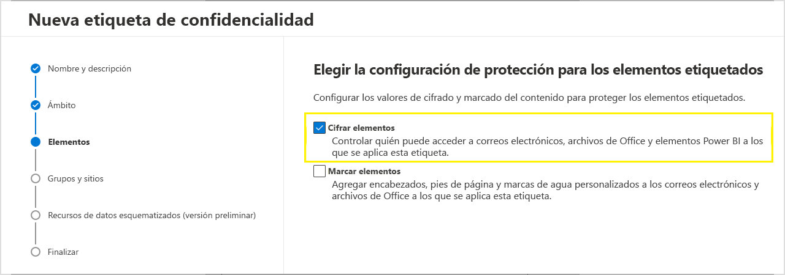
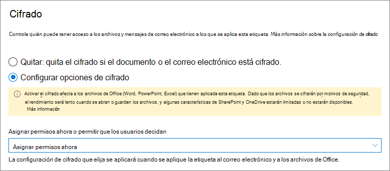

# Restringir el acceso al contenido mediante el uso de etiquetas de confidencialidad para aplicar el cifradoRestrict access to content by using sensitivity labels to apply encryption

>*[Instrucciones de licencias de Microsoft 365 para la seguridad y el cumplimiento](https://aka.ms/ComplianceSD).**[Microsoft 365 licensing guidance for security & compliance](https://aka.ms/ComplianceSD).*

Al crear una etiqueta de confidencialidad, puede restringir el acceso al contenido al que se aplique la etiqueta. Por ejemplo, con las opciones de encriptación de una etiqueta de confidencialidad, se puede proteger el contenido para que:When you create a sensitivity label, you can restrict access to content that the label will be applied to. For example, with the encryption settings for a sensitivity label, you can protect content so that:

- Solo los usuarios de su organización puedan abrir un correo electrónico o documentos confidenciales.Only users within your organization can open a confidential document or email.
- Solo los usuarios del departamento de marketing puedan editar e imprimir documentos o correos electrónicos de anuncios de promociones, mientras que todos los demás usuarios de su organización solo puedan leerlos.Only users in the marketing department can edit and print the promotion announcement document or email, while all other users in your organization can only read it.
- Los usuarios no puedan reenviar un correo electrónico o copiar información que contenga noticias sobre una reorganización interna.Users cannot forward an email or copy information from it that contains news about an internal reorganization.
- La lista de precios actual que se envía a socios comerciales no pueda abrirse tras una fecha especificada.The current price list that is sent to business partners cannot be opened after a specified date.

Cuando se encripta un documento o correo electrónico, el acceso al contenido está restringido, por lo que:When a document or email is encrypted, access to the content is restricted, so that it:

- Se puede desencriptar solo por los usuarios autorizados por la configuración de encriptado de la etiqueta.Can be decrypted only by users authorized by the label's encryption settings.
- Permanece encriptado independientemente de dónde resida, dentro o fuera de su organización, incluso si cambia el nombre del archivo.Remains encrypted no matter where it resides, inside or outside your organization, even if the file's renamed.
- Se encripta tanto en reposo (por ejemplo, en una cuenta de OneDrive) como y en tránsito (por ejemplo, cuando un correo electrónico viaja a través de Internet).Is encrypted both at rest (for example, in a OneDrive account) and in transit (for example, email as it traverses the internet).

Por último, como administrador, al configurar una etiqueta de confidencialidad para aplicar el cifrado, puede elegir entre:Finally, as an admin, when you configure a sensitivity label to apply encryption, you can choose either to:

- **Asignar permisos ahora** para que determine exactamente los permisos para el contenido con esa etiqueta y los usuarios que los obtendrán.**Assign permissions now**, so that you determine exactly which users get which permissions to content with that label.
- **Permitir a los usuarios asignar permisos** al aplicar la etiqueta al contenido.**Let users assign permissions** when they apply the label to content. De esta forma, puede permitir a los usuarios de su organización cierta flexibilidad que pueden necesitar para colaborar y llevar a cabo su trabajo.This way, you can allow people in your organization some flexibility that they might need to collaborate and get their work done.

La configuración de cifrado está disponible cuando se [crea una etiqueta de confidencialidad](create-sensitivity-labels.md) en el Centro de cumplimiento de Microsoft 365, Centro de seguridad de Microsoft 365 o el Centro de seguridad y cumplimiento.The encryption settings are available when you [create a sensitivity label](create-sensitivity-labels.md) in the Microsoft 365 compliance center, Microsoft 365 security center, or the Security & Compliance Center.

## Entender cómo funciona el cifradoUnderstand how the encryption works

El cifrado usa el servicio Azure Rights Management (Azure RMS) de Azure Information Protection.Encryption uses the Azure Rights Management service (Azure RMS) from Azure Information Protection. Esta solución de protección usa directivas de cifrado, identidades y de autorización.This protection solution uses encryption, identity, and authorization policies. Para obtener más información, consulte [¿qué es Azure Rights Management?](https://docs.microsoft.com/azure/information-protection/what-is-azure-rms) en la documentación de Azure Information Protection.To learn more, see [What is Azure Rights Management?](https://docs.microsoft.com/azure/information-protection/what-is-azure-rms) from the Azure Information Protection documentation. 

Cuando usa esta solución de cifrado, la característica de **superusuario** garantiza que los usuarios y los servicios autorizados siempre puedan leer e inspeccionar los datos que se han cifrado para la organización.When you use this encryption solution, the **super user** feature ensures that authorized people and services can always read and inspect the data that has been encrypted for your organization. Si es necesario, el cifrado puede quitarse o modificarse.If necessary, the encryption can then be removed or changed. Para obtener más información, consulte [configuración de superusuarios para Azure Information Protection y servicios de detección y de recuperación de datos de Azure](https://docs.microsoft.com/azure/information-protection/configure-super-users).For more information, see [Configuring super users for Azure Information Protection and discovery services or data recovery](https://docs.microsoft.com/azure/information-protection/configure-super-users).

## Cómo configurar una etiqueta para el cifradoHow to configure a label for encryption

1. Siga las instrucciones generales para [crear o editar una etiqueta de confidencialidad](create-sensitivity-labels.md#create-and-configure-sensitivity-labels) y asegurarse de que **Archivos y mensajes de correo electrónico** está seleccionada para el ámbito de la etiqueta:Follow the general instructions to [create or edit a sensitivity label](create-sensitivity-labels.md#create-and-configure-sensitivity-labels) and make sure **Files & emails** is selected for the label's scope: 
    
    

2. Luego, en la página **Elegir la configuración de protección para archivos y mensajes de correo electrónico**, asegúrese de seleccionar **Cifrar archivos y mensajes de correo electrónico**Then, on the **Choose protection settings for files and emails** page, make sure you select **Encrypt files and emails**
    
    

4.  En la página **Cifrado** del asistente, seleccione una de las siguientes opciones:On the **Encryption** page of the wizard, select one of the following options:
    
    - **Quitar el cifrado si el archivo está cifrado**: para obtener más información sobre este escenario, vea la sección [¿Qué ocurre con el cifrado existente al aplicar una etiqueta?](#what-happens-to-existing-encryption-when-a-labels-applied).**Remove encryption if the file is encrypted**: For more information about this scenario, see the [What happens to existing encryption when a label's applied](#what-happens-to-existing-encryption-when-a-labels-applied) section. Es importante tener en cuenta que esta configuración puede dar lugar a que los usuarios no puedan aplicar una etiqueta de confidencialidad cuando no tienen permisos suficientes.It's important to understand that this setting can result in a sensitivity label that users might not be able to apply when they don't have sufficient permissions.
    
    - **Configurar las opciones de cifrado**: activa el cifrado y hace que la configuración de cifrado sea visible:**Configure encryption settings**: Turns on encryption and makes the encryption settings visible:
        
        
        
        Las instrucciones para estas opciones de configuración están en la sección [Establecer la configuración de cifrado](#configure-encryption-settings).Instructions for these settings are in the following [Configure encryption settings](#configure-encryption-settings) section.

### Qué sucede con el cifrado existente al aplicar una etiquetaWhat happens to existing encryption when a label's applied

Si se aplica una etiqueta de confidencialidad a contenido sin cifrar, el resultado de las opciones de cifrado que puede seleccionar se explica por sí mismo.If a sensitivity label is applied to unencrypted content, the outcome of the encryption options you can select is self-explanatory. Por ejemplo, si no ha seleccionado **Cifrar archivos y mensajes de correo electrónico**, el contenido permanecerá sin cifrar.For example, if you didn't select **Encrypt files and emails**, the content remains unencrypted.

Sin embargo, es posible que el contenido ya esté cifrado.However, the content might be already encrypted. Por ejemplo, otro usuario puede haber aplicado:For example, another user might have applied:

- Sus propios permisos, que incluyen permisos definidos por el usuario cuando se le solicitan con una etiqueta, permisos personalizados por el cliente de Azure Information Protection y la protección del documento con **acceso restringido** desde una aplicación de Office.Their own permissions, which include user-defined permissions when prompted by a label, custom permissions by the Azure Information Protection client, and the **Restricted Access** document protection from within an Office app.
- Una plantilla de Azure Rights Management Protection que cifre el contenido independientemente de una etiqueta.An Azure Rights Management protection template that encrypts the content independently from a label. Esta categoría incluye las reglas de flujo de correo que aplican el cifrado mediante la protección de derechos.This category includes mail flow rules that apply encryption by using rights protection.
- Una etiqueta que aplica el cifrado con los permisos asignados por el administrador.A label that applies encryption with permissions assigned by the administrator.

En la tabla siguiente se identifica lo que ocurre con el cifrado existente cuando se aplica una etiqueta de confidencialidad al contenido:The following table identifies what happens to existing encryption when a sensitivity label is applied to that content:

| | Cifrado: no seleccionadoEncryption: Not selected | Cifrado: configuradoEncryption: Configured | Cifrado: quitarEncryption: Remove |
|:-----|:-----|:-----|:-----|
|**Permisos especificados por un usuario****Permissions specified by a user**|Se preserva el cifrado originalOriginal encryption is preserved|Se aplica el cifrado de la nueva etiquetaNew label encryption is applied|Se quita el cifrado originalOriginal encryption is removed|
|**Plantilla de protección****Protection template**|Se preserva el cifrado originalOriginal encryption is preserved|Se aplica el cifrado de la nueva etiquetaNew label encryption is applied|Se quita el cifrado originalOriginal encryption is removed|
|**Etiqueta con permisos definidos por el administator****Label with administator-defined permissions**|Se quita el cifrado originalOriginal encryption is removed|Se aplica el cifrado de la nueva etiquetaNew label encryption is applied|Se quita el cifrado originalOriginal encryption is removed|

Tenga en cuenta que, en los casos en los que se aplica el cifrado de la nueva etiqueta o se elimina el cifrado original, esto solo se produce si el usuario que aplica la etiqueta tiene un derecho de uso o un rol que admite esta acción:Note that in the cases where the new label encryption is applied or the original encryption is removed, this happens only if the user applying the label has a usage right or role that supports this action:

- El [derecho de uso](https://docs.microsoft.com/azure/information-protection/configure-usage-rights#usage-rights-and-descriptions) exportar o control total.The [usage right](https://docs.microsoft.com/azure/information-protection/configure-usage-rights#usage-rights-and-descriptions) Export or Full Control.
- El rol de [emisor de Administración de derechos o propietario de la Administración de derechos](https://docs.microsoft.com/azure/information-protection/configure-usage-rights#rights-management-issuer-and-rights-management-owner), o bien de [superusuario](https://docs.microsoft.com/azure/information-protection/configure-super-users).The role of [Rights Management issuer or Rights Management owner](https://docs.microsoft.com/azure/information-protection/configure-usage-rights#rights-management-issuer-and-rights-management-owner), or [super user](https://docs.microsoft.com/azure/information-protection/configure-super-users).

Si el usuario no tiene uno de estos derechos o roles, la etiqueta no se puede aplicar y, por lo tanto, se preserva el cifrado original.If the user doesn't have one of these rights or roles, the label can't be applied and so the original encryption is preserved. El usuario verá el siguiente mensaje: **No tiene permiso para realizar este cambio en la etiqueta de confidencialidad. Póngase en contacto con el propietario del contenido.**The user sees the following message: **You don't have permission to make this change to the sensitivity label. Please contact the content owner.**

Por ejemplo, la persona que aplica No reenviar a un mensaje de correo puede reetiquetar el hilo para reemplazar el cifrado o quitarlo, ya que es el propietario de la Administración de derechos del correo electrónico.For example, the person who applies Do Not Forward to an email message can relabel the thread to replace the encryption or remove it, because they are the Rights Management owner for the email. Pero, con la excepción de superusuarios, los destinatarios de este mensaje de correo electrónico no pueden volver a etiquetarlo porque no tienen los derechos de uso necesarios.But with the exception of super users, recipients of this email can't relabel it because they don't have the required usage rights.

#### Datos adjuntos de correo electrónico para mensajes de correo electrónico codificadosEmail attachments for encrypted email messages

Cuando un mensaje de correo electrónico se cifre con cualquier método, todos los documentos de Office no cifrados que se adjunten al correo electrónico heredarán automáticamente la misma configuración de cifrado.When an email message is encrypted by any method, any unencrypted Office documents that are attached to the email automatically inherit the same encryption settings.

Los documentos que ya están cifrados y se agregan como datos adjuntos siempre conservan el cifrado original.Documents that are already encrypted and then added as attachments always preserve their original encryption.

## Configurar opciones de cifradoConfigure encryption settings

Cuando seleccione **Establecer la configuración de cifrado**, en la página **Cifrado** del asistente para crear o editar una etiqueta de confidencialidad, elija una de las siguientes opciones:When you select **Configure encryption settings** on the **Encryption** page of the wizard to create or edit a sensitivity label, choose one of the following options:

- **Asignar permisos ahora** para que pueda determinar exactamente qué permisos obtienen los distintos usuarios para el contenido que tenga aplicada la etiqueta.**Assign permissions now**, so that you can determine exactly which users get which permissions to content that has the label applied. Para obtener más información, vea la sección siguiente [Asignar permisos ahora](#assign-permissions-now).For more information, see the next section [Assign permissions now](#assign-permissions-now).
- **Permitir a los usuarios asignar permisos** al aplicar la etiqueta al contenido.**Let users assign permissions** when your users apply the label to content. De esta forma, puede permitir a los usuarios de su organización cierta flexibilidad que pueden necesitar para colaborar y llevar a cabo su trabajo.With this option, you can allow people in your organization some flexibility that they might need to collaborate and get their work done. Para obtener más información, vea la sección [Permitir a los usuarios asignar permisos](#let-users-assign-permissions) en esta página.For more information, see the [Let users assign permissions](#let-users-assign-permissions) section on this page.

Por ejemplo, si tiene una etiqueta de confidencialidad denominada **Extremadamente confidencial** que se aplicará al contenido más confidencial, es posible que quiera decidir ahora quién obtendrá cierto tipo de permisos para ese contenido.For example, if you have a sensitivity label named **Highly Confidential** that will be applied to your most sensitive content, you might want to decide now who gets what type of permissions to that content.

Por otra parte, si tiene una etiqueta de confidencialidad denominada **Contratos empresariales** y el flujo de trabajo de su organización requiere que sus usuarios colaboren en este contenido con diferentes personas según sea necesario, puede que quiera permitir a los usuarios decidir quién obtiene permisos cuando asignan la etiqueta.Alternatively, if you have a sensitivity label named **Business Contracts**, and your organization's workflow requires that your people collaborate on this content with different people on an ad hoc basis, you might want to allow your users to decide who gets permissions when they assign the label. Esta flexibilidad aumenta la productividad de los usuarios y reduce las solicitudes de actualización y creación de nuevas etiquetas a los administradores para solucionar escenarios específicos.This flexibility both helps your users' productivity and reduces the requests for your admins to update or create new sensitivity labels to address specific scenarios.

Elegir si asignar permisos ahora o permitir a los usuarios asignar permisos:Choosing whether to assign permissions now or let users assign permissions:

## Asignar permisos ahoraAssign permissions now

Use las opciones siguientes para controlar quién puede tener acceso al correo electrónico o a los documentos a los que se aplica esta etiqueta.Use the following options to control who can access email or documents to which this label is applied. Puede:You can:

- **Permitir que el acceso al contenido con la etiqueta expire**, ya sea en una fecha específica o tras un número determinado de días después de aplicar la etiqueta. Después de ese momento, los usuarios no podrán abrir el elemento con la etiqueta. Si especifica una fecha, se activará en la medianoche de esa fecha, en la zona horaria actual. (Tenga en cuenta que algunos clientes de correo electrónico pueden no aplicar la expiración y mostrar correos electrónicos una vez pasada dicha fecha, debido a otros mecanismos de almacenamiento en caché).**Allow access to labeled content to expire**, either on a specific date or after a specific number of days after the label is applied. After this time, users won't be able to open the labeled item. If you specify a date, it is effective midnight on that date in your current time zone. (Note that some email clients might not enforce expiration and show emails past their expiration date, due to their caching mechanisms.)

- **Permitir el acceso sin conexión** nunca, siempre o durante un número concreto de días después de aplicar la etiqueta. Si restringe el acceso sin conexión a nunca o a un número de días, cuando se alcance el umbral, los usuarios deberán volver a autenticarse y se registrará el acceso. Para obtener más información, vea la siguiente sección sobre la licencia de uso de administración de derechos.**Allow offline access** never, always, or for a specific number of days after the label is applied. If you restrict offline access to never or a number of days, when that threshold is reached, users must be reauthenticated and their access is logged. For more information, see the next section on the Rights Management use license.

Configuración de control de acceso para contenido cifrado:Settings for access control for encrypted content:

### Licencia de uso de administración de derechos para el acceso sin conexiónRights Management use license for offline access

Cuando un usuario abre un documento o un correo electrónico que se ha protegido con el cifrado desde el servicio de Azure Rights Management, se otorga una licencia de uso de Azure Rights Management para ese contenido al usuario.When a user opens a document or email that's been protected by encryption from the Azure Rights Management service, an Azure Rights Management use license for that content is granted to the user. Esta licencia de uso es un certificado que contiene los derechos de uso del usuario para el documento o correo electrónico y la clave de cifrado que se usó para cifrar el contenido.This use license is a certificate that contains the user's usage rights for the document or email, and the encryption key that was used to encrypt the content. La licencia de uso también contiene una fecha de expiración en caso de que se haya establecido y durante cuánto tiempo es válida la licencia de uso.The use license also contains an expiration date if this has been set, and how long the use license is valid.

Si no se ha establecido ninguna fecha de expiración, el período predeterminado de validez de licencia de uso para un espacio empresarial es 30 días. Durante la duración de la licencia de uso, el usuario no se vuelve a autenticar o autorizar para ver el contenido. Este proceso permite que el usuario pueda abrir el documento o correo electrónico protegido sin conexión a Internet. Cuando la validez de la licencia de uso expire, la próxima vez que el usuario acceda a un documento o correo electrónico protegido, el usuario debe ser autorizado y autenticarse de nuevo.If no expiration date has been set, the default use license validity period for a tenant is 30 days. For the duration of the use license, the user is not reauthenticated or reauthorized for the content. This process lets the user continue to open the protected document or email without an internet connection. When the use license validity period expires, the next time the user accesses the protected document or email, the user must be reauthenticated and reauthorized.

Además de volver a hacer la autenticación, se vuelven a evaluar la configuración de cifrado y la pertenencia a grupos de usuarios.In addition to reauthentication, the encryption settings and user group membership is reevaluated. Esto significa que los usuarios podrían experimentar resultados diferentes de acceso para el mismo documento o correo electrónico si hay cambios en la configuración de cifrado o la pertenencia a grupos con respecto al último momento en que se accedió al contenido.This means that users could experience different access results for the same document or email if there are changes in the encryption settings or group membership from when they last accessed the content.

Para obtener información sobre cómo cambiar la configuración de 30 días predeterminada, vea [Licencia de uso de administración de derechos](https://docs.microsoft.com/azure/information-protection/configure-usage-rights#rights-management-use-license).To learn how to change the default 30-day setting, see [Rights Management use license](https://docs.microsoft.com/azure/information-protection/configure-usage-rights#rights-management-use-license).

### Asignar permisos a usuarios o grupos específicosAssign permissions to specific users or groups

Puede conceder permisos a usuarios específicos para que solo pueden interactuar con el contenido con la etiqueta:You can grant permissions to specific people so that only they can interact with the labeled content:

1. Primero, agregue usuarios o grupos a los que se asignarán permisos para el contenido con la etiqueta.First, add users or groups that will be assigned permissions to the labeled content.

2. Después, elijaqué permisos obtienen los usuarios para el contenido con la etiqueta.Then, choose which permissions those users should have for the labeled content.

Asignación de permisos:Assigning permissions:

#### Agregar usuarios o gruposAdd users or groups

Al asignar permisos, puede elegir:When you assign permissions, you can choose:

- Todos los usuarios de su organización (todos los miembros del espacio empresarial). Esta configuración excluye cuentas de invitado.Everyone in your organization (all tenant members). This setting excludes guest accounts.

- Todos los usuarios autenticados.Any authenticated users. Asegúrese de comprender [las limitaciones y los requisitos](#requirements-and-limitations-for-add-any-authenticated-users) de esta configuración antes de seleccionarla.Make sure you understand the [requirements and limitations](#requirements-and-limitations-for-add-any-authenticated-users) of this setting before selecting it.

- Cualquier usuario específico o grupo de seguridad habilitado para correo electrónico, grupo de distribución o grupo de Microsoft 365 ([anteriormente denominado grupo de Office 365](https://techcommunity.microsoft.com/t5/microsoft-365-blog/office-365-groups-will-become-microsoft-365-groups/ba-p/1303601)) en Azure AD.Any specific user or email-enabled security group, distribution group, or Microsoft 365 group ([formerly Office 365 group](https://techcommunity.microsoft.com/t5/microsoft-365-blog/office-365-groups-will-become-microsoft-365-groups/ba-p/1303601)) in Azure AD. El grupo de Microsoft 365 puede tener [pertenencia estática o dinámica](https://docs.microsoft.com/azure/active-directory/users-groups-roles/groups-create-rule).The Microsoft 365 group can have static or [dynamic membership](https://docs.microsoft.com/azure/active-directory/users-groups-roles/groups-create-rule). Tenga en cuenta que no puede usar un grupo de [distribución dinámico de Exchange](https://docs.microsoft.com/Exchange/recipients/dynamic-distribution-groups/dynamic-distribution-groups) porque este tipo de grupo no está sincronizado con Azure AD, y no puede usar un grupo de seguridad que no esté habilitado para correo electrónico.Note that you can't use a [dynamic distribution group from Exchange](https://docs.microsoft.com/Exchange/recipients/dynamic-distribution-groups/dynamic-distribution-groups) because this group type isn't synchronized to Azure AD, and you can't use a security group that isn't email-enabled.

- Cualquier dirección de correo electrónico o dominio.Any email address or domain. Use esta opción para especificar todos los usuarios de otra organización que usan Azure AD, escribiendo un nombre de dominio de dicha organización.Use this option to specify all users in another organization who uses Azure AD, by entering any domain name from that organization. También puede usar esta opción para proveedores de redes sociales si escribe su nombre de dominio, como **gmail.com**, **hotmail.com** o **outlook.com**.You can also use this option for social providers, by entering their domain name such as **gmail.com**, **hotmail.com**, or **outlook.com**.

    > [!NOTE]
    > Si especifica un dominio de una organización que usa Azure AD, no puede restringir el acceso a ese dominio específico.If you specify a domain from an organization that uses Azure AD, you can't restrict access to that specific domain. En su lugar, todos los dominios comprobados en Azure AD se incluyen automáticamente para el espacio empresarial propietario del nombre de dominio que especifique.Instead, all verified domains in Azure AD are automatically included for the tenant that owns the domain name you specify.

Al elegir todos los usuarios y grupos de su organización o al examina el directorio, los usuarios o grupos deben tener una dirección de correo electrónico.When you choose all users and groups in your organization or browse the directory, the users or groups must have an email address.

Se recomienda usar grupos en lugar de usuarios. Esta estrategia mantiene la configuración más sencilla.As a best practice, use groups rather than users. This strategy keeps your configuration simpler.

##### Requisitos y limitaciones para "Añadir todos los usuarios autenticados"Requirements and limitations for "Add any authenticated users"

Esta configuración no impide que los usuarios tengan acceso al contenido cifrado por la etiqueta, a la vez que cifra el contenido y ofrece opciones para restringir la manera en que puede usarse el contenido (permisos) y tener acceso a él (acceso de expiración y sin conexión).This setting doesn't restrict who can access the content that the label encrypts, while still encrypting the content and providing you with options to restrict how the content can be used (permissions), and accessed (expiry and offline access). Sin embargo, la aplicación que abra el contenido cifrado debe poder admitir la autenticación que se usa.However, the application opening the encrypted content must be able to support the authentication being used. Por este motivo, los proveedores de redes sociales federadas, como Google, y la autenticación de contraseña de una sola vez, solo funcionan para correo electrónico, y solo cuando se usa Exchange Online.For this reason, federated social providers such as Google, and onetime passcode authentication work for email only, and only when you use Exchange Online. Las cuentas de Microsoft se pueden usar con las aplicaciones de Office 365 y el [visor de Azure Information Protection](https://portal.azurerms.com/#/download).Microsoft accounts can be used with Office 365 apps and the [Azure Information Protection viewer](https://portal.azurerms.com/#/download).

> [!NOTE]
> Considere la posibilidad de usar esta configuración con la [integración de SharePoint y OneDrive con Azure AD B2B](https://docs.microsoft.com/sharepoint/sharepoint-azureb2b-integration-preview) cuando las etiquetas de confidencialidad estén [habilitadas para los archivos de Office en SharePoint y OneDrive](sensitivity-labels-sharepoint-onedrive-files.md).Consider using this setting with [SharePoint and OneDrive integration with Azure AD B2B](https://docs.microsoft.com/sharepoint/sharepoint-azureb2b-integration-preview) when sensitivity labels are [enabled for Office files in SharePoint and OneDrive](sensitivity-labels-sharepoint-onedrive-files.md).

Algunos escenarios comunes para la configuración de todos los usuarios autenticados:Some typical scenarios for any authenticated users setting:

- No le importa quién vea el contenido, pero desea restringir cómo se usa.You don't mind who views the content, but you want to restrict how it is used. Por ejemplo, no quiere que el contenido se pueda modificar, copiar o imprimir.For example, you don't want the content to be edited, copied, or printed.
- No es necesario restringir el acceso al contenido, pero quiere confirmar quién lo abre.You don't need to restrict who accesses the content, but you want to be able to confirm who opens it.
- Tiene un requisito para que el contenido se cifre en reposo y en tránsito, pero no se requieren controles de acceso.You have a requirement that the content must be encrypted at rest and in transit, but it doesn't require access controls.

#### Elegir permisosChoose permissions

Al elegir qué permisos permitir para los usuarios o grupos, puede seleccionar entre:When you choose which permissions to allow for those users or groups, you can select either:

- Un [nivel de permiso predefinido](https://docs.microsoft.com/azure/information-protection/configure-usage-rights#rights-included-in-permissions-levels) con un grupo de derechos preestablecido, como coautor o revisor.A [predefined permissions level](https://docs.microsoft.com/azure/information-protection/configure-usage-rights#rights-included-in-permissions-levels) with a preset group of rights, such as Co-Author or Reviewer.
- Permisos personalizados, donde puede elegir uno o más derechos de uso.Custom permissions, where you choose one or more usage rights.

Para obtener más información sobre cómo seleccionar los permisos adecuados, consulte [derechos y descripciones de uso](https://docs.microsoft.com/azure/information-protection/configure-usage-rights#usage-rights-and-descriptions).For more information to help you select the appropriate permissions, see [Usage rights and descriptions](https://docs.microsoft.com/azure/information-protection/configure-usage-rights#usage-rights-and-descriptions).  

Tenga en cuenta que la misma etiqueta puede conceder diferentes permisos a diferentes usuarios. Por ejemplo, una sola etiqueta puede asignar a algunos usuarios como revisor y a otros usuarios como coautor, como se muestra en la siguiente captura.Note that the same label can grant different permissions to different users. For example, a single label can assign some users as Reviewer and a different user as Co-author, as shown in the following screenshot.

Para ello, agregue usuarios o grupos, asigne sus permisos y guarde las opciones de configuración. Luego repita estos pasos, agregue usuarios y asigne permisos para guardar la configuración de nuevo. Puede repetir esta configuración tantas veces como sea necesario para definir permisos diferentes para distintos usuarios.To do this, add users or groups, assign them permissions, and save those settings. Then repeat these steps, adding users and assigning them permissions, saving the settings each time. You can repeat this configuration as often as necessary, to define different permissions for different users.

#### El emisor de administración de derechos (el usuario que aplica la etiqueta de confidencialidad) siempre tiene control totalRights Management issuer (user applying the sensitivity label) always has Full Control

El cifrado de una etiqueta de confidencialidad usa el servicio Azure Rights Management de Azure Information Protection.Encryption for a sensitivity label uses the Azure Rights Management service from Azure Information Protection. Cuando un usuario aplica una etiqueta de confidencialidad para proteger un documento o correo electrónico mediante cifrado, ese usuario pasa a ser el emisor de administración de derechos para ese contenido.When a user applies a sensitivity label to protect a document or email by using encryption, that user becomes the Rights Management issuer for that content.

El emisor de administración de derechos siempre obtiene permisos de control total para el documento o correo electrónico y además:The Rights Management issuer is always granted Full Control permissions for the document or email, and in addition:

- Si la configuración de cifrado incluye una fecha de expiración, el emisor de administración de derechos puede abrir y editar el documento o correo electrónico después de esa fecha.If the encryption settings include an expiration date, the Rights Management issuer can still open and edit the document or email after that date.
- El emisor de administración de derechos siempre puede acceder al documento o correo electrónico sin conexión.The Rights Management issuer can always access the document or email offline.
- El emisor de administración de derechos puede seguir abriendo un documento después de que se revoque.The Rights Management issuer can still open a document after it is revoked.

Para obtener más información, vea [Emisor de administración de derechos y propietario de administración de derechos](https://docs.microsoft.com/azure/information-protection/configure-usage-rights#rights-management-issuer-and-rights-management-owner).For more information, see [Rights Management issuer and Rights Management owner](https://docs.microsoft.com/azure/information-protection/configure-usage-rights#rights-management-issuer-and-rights-management-owner).

### Cifrado de claves dobleDouble Key Encryption

> [!NOTE]
> Esta característica solo es compatible actualmente con el cliente de etiquetado unificado de Azure Information Protection.This feature is currently supported only by the Azure Information Protection unified labeling client.

Seleccione esta opción solo después de configurar el servicio Cifrado de doble clave. Necesitará usar el cifrado de doble clave para los archivos que tengan aplicada esta etiqueta.Select this option only after you have configured the Double Key Encryption service and you need to use this double key encryption for files that will have this label applied.

Para obtener más información, ver los requisitos previos y las instrucciones de configuración, consulte el [Cifrado de doble clave (DKE)](double-key-encryption.md).For more information, prerequisites, and configuration instructions, see [Double Key Encryption (DKE)](double-key-encryption.md).

## Permitir a los usuarios asignar permisosLet users assign permissions

Puede usar estas opciones para que los usuarios puedan asignar permisos cuando aplican manualmente una etiqueta de confidencialidad al contenido:You can use these options to let users assign permissions when they manually apply a sensitivity label to content:

- En Outlook, un usuario puede seleccionar restricciones equivalentes a la opción [No reenviar](https://docs.microsoft.com/azure/information-protection/configure-usage-rights#do-not-forward-option-for-emails) para los destinatarios seleccionados.In Outlook, a user can select restrictions equivalent to the [Do Not Forward](https://docs.microsoft.com/azure/information-protection/configure-usage-rights#do-not-forward-option-for-emails) option for their chosen recipients.

- En Word, PowerPoint y Excel, se pide al usuario que seleccione sus propios permisos para organizaciones, usuarios o grupos específicos.In Word, PowerPoint, and Excel, a user is prompted to select their own permissions for specific users, groups, or organizations.

    > [!NOTE]
    > Esta opción para Word, PowerPoint y Excel es compatible con el cliente de etiquetado unificado de Azure Information Protection.This option for Word, PowerPoint, and Excel is supported by the Azure Information Protection unified labeling client. Para las aplicaciones que usan etiquetas integradas, [compruebe qué aplicaciones son compatibles](sensitivity-labels-office-apps.md#sensitivity-label-capabilities-in-word-excel-and-powerpoint).For apps that use built-in labeling, [check which apps support it](sensitivity-labels-office-apps.md#sensitivity-label-capabilities-in-word-excel-and-powerpoint).
    >
    > Si esta opción está seleccionada, pero no es compatible con la aplicación de un usuario, la etiqueta no se mostrará al usuario, o bien la etiqueta se mostrará por coherencia, pero no se podrá aplicar con un mensaje de explicación para los usuarios.If this option is selected but isn't supported for a user's app, either that label doesn't display to the user, or the label displays for consistency, but it can't be applied with an explanation message to users.

Cuando se admitan las opciones, use la tabla siguiente para identificar cuándo los usuarios ven la etiqueta de confidencialidad:When the options are supported, use the following table to identify when users see the sensitivity label:

|ConfiguraciónSetting |Etiqueta visible en OutlookLabel visible in Outlook|Etiqueta visible en Word, Excel y PowerPointLabel visible in Word, Excel, PowerPoint|
|:-----|:-----|:-----|:-----|
|**En Outlook, un usuario puede aplicar restricciones equivalentes a la opción No reenviar****In Outlook, enforce restrictions equivalent to the Do Not Forward option**|SíYes |NoNo |
|**En Word, PowerPoint y Excel, pida a los usuarios que especifiquen los permisos****In Word, PowerPoint, and Excel, prompt users to specify permissions**|NoNo |SíYes|

Cuando ambas opciones están seleccionadas, la etiqueta es visible tanto en Outlook como en Word, Excel y PowerPoint.When both settings are selected, the label is therefore visible in both Outlook and in Word, Excel, and PowerPoint.

Una etiqueta de confidencialidad que permite a los usuarios asignar permisos solo se puede aplicar al contenido manualmente. No se puede aplicar automáticamente o usar como etiqueta recomendada.A sensitivity label that lets users assign permissions can be applied to content only manually by users; it can't be auto-applied or used as a recommended label.

Configurar los permisos asignados por el usuario:Configuring the user-assigned permissions:

### Restricciones de OutlookOutlook restrictions

En Outlook, cuando un usuario aplica una etiqueta de confidencialidad que les permite asignar permisos a un mensaje, las restricciones son las mismas que la opción No reenviar.In Outlook, when a user applies a sensitivity label that lets them assign permissions to a message, the restrictions are the same as the Do Not Forward option. El usuario verá el nombre y la descripción de la etiqueta en la parte superior del mensaje, lo que indica que se está protegiendo el contenido.The user will see the label name and description at the top of the message, which indicates the content's being protected. A diferencia de Word, PowerPoint y Excel (vea la [siguiente sección](#word-powerpoint-and-excel-permissions)), no se pide a los usuarios que seleccionen permisos específicos.Unlike Word, PowerPoint, and Excel (see the [next section](#word-powerpoint-and-excel-permissions)), users aren't prompted to select specific permissions.

Cuando la opción No reenviar se aplica a un correo electrónico, este se cifra y los destinatarios tienen que autenticarse.When the Do Not Forward option is applied to an email, the email is encrypted and recipients must be authenticated. Luego, los destinatarios no podrán reenviarlo, imprimirlo ni copiarlo.Then, the recipients cannot forward it, print it, or copy from it. Por ejemplo, en el cliente de Outlook, el botón Reenviar y las opciones de menú Guardar como e Imprimir no están disponibles, y no se pueden agregar o cambiar destinatarios en los cuadros Para, CC o CCO.For example, in the Outlook client, the Forward button is not available, the Save As and Print menu options are not available, and you cannot add or change recipients in the To, Cc, or Bcc boxes.

Los documentos de Office sin cifrar asociados al correo electrónico heredan automáticamente las mismas restricciones.Unencrypted Office documents that are attached to the email automatically inherit the same restrictions. Los derechos de uso que se aplican a estos documentos son Editar contenido, Editar; Guardar; Ver, Abrir, Leer y Permitir macros.The usage rights applied to these documents are Edit Content, Edit; Save; View, Open, Read; and Allow Macros. Si el usuario quiere derechos de uso distintos para los datos adjuntos o el archivo adjunto no es un documento de Office compatible con esta protección heredada, debe proteger el archivo antes de adjuntarlo al correo electrónico.If the user wants different usage rights for an attachment, or the attachment is not an Office document that supports this inherited protection, the user needs to protect the file before attaching it to the email.

### Permisos de Word, PowerPoint y ExcelWord, PowerPoint, and Excel permissions

En Word, PowerPoint y Excel, cuando un usuario aplica una etiqueta de confidencialidad que le permite asignar permisos a un documento, se le pedirá que especifique la elección de usuarios y permisos cuando se aplique el cifrado.In Word, PowerPoint, and Excel, when a user applies a sensitivity label that lets them assign permissions to a document, they are prompted to specify their choice of users and permissions when the encryption is applied.

Por ejemplo, con el cliente de etiquetas unificado de Azure Information Protection, los usuarios pueden:For example, with the Azure Information Protection unified labeling client, users can:

- Seleccionar un nivel de permisos, como Visor (que asigna el permiso de solo vista) o Co-autoría (que asigna los permisos de vista, edición, copia e impresión). Select a permission level, such as Viewer (which assigns View Only permission) or Co-Author (which assigns View, Edit, Copy, and Print permissions).
- Seleccionar organizaciones, usuarios o grupos.Select users, groups, or organizations. Esto puede incluir usuarios dentro o fuera de su organización.This can include people both inside or outside your organizations.
- Establecer una fecha de expiración, después de la que los usuarios seleccionados no pueden tener acceso al contenido.Set an expiration date, after which the selected users cannot access the content. Para obtener más información, vea la sección anterior [Licencia de uso de Rights Management para el acceso sin conexión](#rights-management-use-license-for-offline-access).For more information, see the above section [Rights Management use license for offline access](#rights-management-use-license-for-offline-access).

Para las etiquetas integradas, los usuarios verán el mismo cuadro de diálogo si seleccionan lo siguiente:For built-in labeling, users see the same dialog box if they select the following:

- Windows: pestaña **Archivo** > **Información** > **Proteger documento** > **Restringir accesso** > **Accesso restringido**Windows: **File** tab > **Info** > **Protect Document** > **Restrict Access** > **Restricted Access**

- MacOS: pestaña **Revisar** > **Protección** > **Permisos** > **Acceso restringido**macOS: **Review** tab > **Protection** > **Permissions** > **Restricted Access**

## Configuraciones de ejemplo para la configuración de cifradoExample configurations for the encryption settings

Para cada ejemplo que se muestra a continuación, lleve a cabo la configuración desde la página **Cifrado** del asistente, cuando **Establecer la configuración de cifrado** esté seleccionada:For each example that follows, do the configuration from the **Encryption** page of the wizard when **Configure encryption settings** is selected:

### Ejemplo 1: etiqueta que aplica No reenviar para enviar un correo electrónico cifrado a una cuenta de GmailExample 1: Label that applies Do Not Forward to send an encrypted email to a Gmail account

Esta etiqueta solo se muestra en Outlook y Outlook en la Web y debe usar Exchange Online.This label displays only in Outlook and Outlook on the web, and you must use Exchange Online. Pida a los usuarios que seleccionen esta etiqueta cuando necesiten enviar un correo electrónico cifrado a las personas que usen una cuenta de Gmail (o cualquier otra cuenta de correo electrónico fuera de su organización).Instruct users to select this label when they need to send an encrypted email to people using a Gmail account (or any other email account outside your organization).

Los usuarios escriben la dirección de correo electrónico de Gmail en el cuadro **Para**.Your users type the Gmail email address in the **To** box.  Después, seleccionan la etiqueta y la opción No reenviar se agrega automáticamente al correo electrónico.Then, they select the label and the Do Not Forward option is automatically added to the email. El resultado es que los destinatarios no pueden reenviar el correo electrónico o imprimirlo, copiar desde él o guardar el correo electrónico fuera de su buzón con la opción **Guardar como**.The result is that recipients cannot forward the email, or print it, copy from it, or save the email outside their mailbox by using the **Save As** option.

1. En la página **Cifrado**: para **¿Quiere asignar permisos ahora o permitir que los usuarios decidan?** seleccione **Permita a los usuarios asignar permisos al aplicar la etiqueta**.On the **Encryption** page: For **Assign permissions now or let users decide?** select **Let users assign permissions when they apply the label**.

2. Marque la casilla de verificación: **En Outlook, aplicar restricciones equivalentes a la opción No reenviar**.Select the checkbox: **In Outlook, enforce restrictions equivalent to the Do Not Forward option**.

3. Si está seleccionada, desactive la casilla: **En Word, PowerPoint y Excel, pedir a los usuarios que especifiquen los permisos**.If selected, clear the checkbox: **In Word, PowerPoint, and Excel, prompt users to specify permissions**.

4. Seleccione **Siguiente** y finalice el asistente.Select **Next** and complete the wizard.

### Ejemplo 2: etiqueta que restringe los permisos de solo lectura a todos los usuarios de otra organizaciónExample 2: Label that restricts read-only permission to all users in another organization

Esta etiqueta es adecuada para compartir documentos muy confidenciales como solo lectura, y los documentos siempre requieren una conexión a Internet para verlos.This label is suitable for sharing very sensitive documents as read-only, and the documents always require an internet connection to view them.

Esta etiqueta no es adecuada para correos electrónicos.This label is not suitable for emails.

1. En la página **Cifrado**: para **¿Quiere asignar permisos ahora o permitir que los usuarios decidan?** seleccione **Asignar permisos ahora**.On the **Encryption** page: For **Assign permissions now or let users decide?** select **Assign permissions now**.

2. Para **permitir el acceso sin conexión**, seleccione **nunca**.For **Allow offline access**, select **Never**.

3. Seleccione **asignar permisos**.Select **Assign permissions**.

4. En el panel **Asignar permisos**, seleccione **Agregar direcciones de correo electrónico o dominios específicos**.On the **Assign permissions** pane, select **Add specific email addresses or domains**.

5. En el cuadro de texto, escriba el nombre de un dominio de la otra organización, por ejemplo, **fabrikam.com**.In the text box, enter the name of a domain from the other organization, for example, **fabrikam.com**. A continuación, seleccione **Aceptar**.Then select **Add**.

6. Seleccione **Elegir permisos**.Select **Choose permissions**.

7. En el panel **Elegir permisos**, seleccione el cuadro de lista desplegable, seleccione **Visor** y, después, **Guardar**.On the **Choose permissions** pane, select the dropdown box, select **Viewer**, and then select **Save**.

8. De nuevo, en el panel **asignar permisos**, seleccione **guardar**.Back on the **Assign Permissions** pane, select **Save**.

9. En la página **cifrado**, seleccione **siguiente** y finalice el asistente.On the **Encryption** page, select **Next** and complete the wizard.

### Ejemplo 3: agregar usuarios externos a una etiqueta existente que cifra el contenidoExample 3: Add external users to an existing label that encrypts content

Los nuevos usuarios que agregue serán capaces de abrir documentos y mensajes de correo electrónico que ya estén protegidos con esta etiqueta.The new users that you add will be able open documents and emails that have already been protected with this label. Los permisos concedidos a estos usuarios pueden ser distintos de los permisos que tienen los usuarios existentes.The permissions that you grant these users can be different from the permissions that the existing users have.

1. En la página **Cifrado**: para **¿Quiere asignar permisos ahora o permitir que los usuarios decidan?** asegúrese de que la opción **Asignar permisos ahora** está seleccionada.On the **Encryption** page: For **Assign permissions now or let users decide?** make sure **Assign permissions now** is selected.

2. Seleccione **asignar permisos**.Select **Assign permissions**.

3. En el panel **Asignar permisos**, seleccione **Agregar direcciones de correo electrónico o dominios específicos**.On the **Assign permissions** pane, select **Add specific email addresses or domains**.

4. En el cuadro de texto, escriba la dirección de correo electrónico del primer usuario (o grupo) que desea agregar y seleccione **agregar**.In the text box, enter the email address of the first user (or group) to add, and then select **Add**.

5. Seleccione **Elegir permisos**.Select **Choose permissions**.

6. En el panel **Elegir permisos**, seleccione los permisos para este usuario (o grupo) y seleccione **Guardar**.On the **Choose permissions** pane, select the permissions for this user (or group), and then select **Save**.

7. De nuevo, en el panel **asignar permisos**, repita los pasos del 3 al 6 para cada usuario (o grupo) que quiera agregar a esta etiqueta.Back on the **Assign Permissions** pane, repeat steps 3 through 6 for each user (or group) that you want to add to this label. Después, haga clic en **Guardar**.Then click **Save**.

8. En la página **cifrado**, seleccione **siguiente** y finalice el asistente.On the **Encryption** page, select **Next** and complete the wizard.

### Ejemplo 4: etiqueta que cifra el contenido, pero que no restringe quién puede tener acceso a él.Example 4: Label that encrypts content but doesn't restrict who can access it

Esta configuración tiene la ventaja de no tener que especificar usuarios, grupos o dominios para cifrar un correo electrónico o un documento.This configuration has the advantage that you don't need to specify users, groups, or domains to encrypt an email or document. El contenido seguirá estando cifrado y aún podrá especificar derechos de uso, una fecha de expiración y acceso sin conexión.The content will still be encrypted and you can still specify usage rights, an expiry date, and offline access.

Use esta configuración solo si no necesita restringir quién puede abrir el documento o correo electrónico protegido.Use this configuration only when you do not need to restrict who can open the protected document or email. [Más información sobre esta configuraciónMore information about this setting](#requirements-and-limitations-for-add-any-authenticated-users)

1. En la página **Cifrado**: para **¿Quiere asignar permisos ahora o permitir que los usuarios decidan?** asegúrese de que la opción **Asignar permisos ahora** está seleccionada.On the **Encryption** page: For **Assign permissions now or let users decide?** make sure **Assign permissions now** is selected.

2. Configure las opciones de **el acceso de usuario al contenido expira** y **permitir el acceso sin conexión** según sea necesario.Configure settings for **User access to content expires** and **Allow offline access** as required.

3. Seleccione **asignar permisos**.Select **Assign permissions**.

4. En el panel **asignar permisos**, seleccione **agregar cualquiera de los usuarios autenticados**.On the **Assign permissions** pane, select **Add any authenticated users**.

    Para **Usuarios y grupos**, verá que **Usuarios autenticados** se agrega automáticamente.For **Users and groups**, you see **Authenticated users** automatically added. No se puede cambiar este valor, solo eliminarlo, lo que cancela la selección de **agregar cualquiera de los usuarios autenticados**.You can't change this value, only delete it, which cancels the **Add any authenticated users** selection.

5. Seleccione **Elegir permisos**.Select **Choose permissions**.

6. En el panel **Elegir permisos**, seleccione el cuadro de lista desplegable, elija los permisos que quiera y seleccione **Guardar**.On the **Choose permissions** pane, select the dropdown box, select the permissions you want, and then select **Save**.

7. De nuevo, en el panel **asignar permisos**, seleccione **guardar**.Back on the **Assign Permissions** pane, select **Save**.

8. En la página **cifrado**, seleccione **siguiente** y finalice el asistente.On the **Encryption** page, select **Next** and complete the wizard.

## Consideraciones sobre el contenido cifradoConsiderations for encrypted content

Cifrar los documentos y mensajes de correo electrónico más confidenciales le ayuda a asegurarse de que solo los usuarios autorizados puedan acceder a estos datos.Encrypting your most sensitive documents and emails helps to ensure that only authorized people can access this data. Sin embargo, hay algunas consideraciones que debe tener en cuenta:However, there are some considerations to take into account:

- Si su organización no ha [habilitado las etiquetas de confidencialidad para los archivos de Office en SharePoint y OneDrive](sensitivity-labels-sharepoint-onedrive-files.md):If your organization hasn't [enabled sensitivity labels for Office files in SharePoint and OneDrive](sensitivity-labels-sharepoint-onedrive-files.md):

  - Search, eDiscovery y Delve no funcionarán en archivos cifrados.Search, eDiscovery, and Delve will not work for encrypted files.
  - Las directivas DLP funcionan para los metadatos de estos archivos cifrados (incluida la información de la etiqueta de retención), pero no el contenido de estos archivos (como números de tarjeta de crédito en los archivos).DLP policies work for the metadata of these encrypted files (including retention label information) but not the content of these files (such as credit card numbers within files).
  - Los usuarios no pueden abrir archivos cifrados con Office en la Web.Users can't open encrypted files using Office on the web. Cuando las etiquetas de confidencialidad de los archivos de Office en SharePoint y OneDrive están habilitadas, los usuarios pueden usar Office en la Web para abrir archivos cifrados, con algunas [limitaciones](sensitivity-labels-sharepoint-onedrive-files.md#limitations) entre las que se incluyen el cifrado que se ha aplicado con una clave local (conocido como "mantenga su propia clave" o HYOK), el [cifrado de doble clave](#double-key-encryption) y el cifrado que se ha aplicado independientemente de una etiqueta de confidencialidad.When sensitivity labels for Office files in SharePoint and OneDrive are enabled, users can use Office on the web to open encrypted files, with some [limitations](sensitivity-labels-sharepoint-onedrive-files.md#limitations) that include encryption that has been applied with an on-premises key (known as "hold your own key", or HYOK), [double key encryption](#double-key-encryption), and encryption that has been applied independently from a sensitivity label.

- Para que varios usuarios puedan modificar un archivo cifrado al mismo tiempo, deben usar Office para la Web.For multiple users to edit an encrypted file at the same time, they must all be using Office for the web. Si este no es el caso, y el archivo ya está abierto:If this isn't the case, and the file is already open:

  - En las aplicaciones de Office (Windows, Mac, Android y iOS), los usuarios verán un mensaje de **archivo en uso** con el nombre de la persona que ha desprotegido el archivo.In Office apps (Windows, Mac, Android, and iOS), users see a **File In Use** message with the name of the person who has checked out the file. Podrán ver una copia de solo lectura, guardar y editar una copia del archivo, y recibir una notificación cuando el archivo esté disponible.They can then view a read-only copy or save and edit a copy of the file, and receive notification when the file is available.
  - En Office para la web, los usuarios ven un mensaje de error que indica que no pueden editar el documento con otras personas.In Office for the web, users see an error message that they can't edit the document with other people. Pueden seleccionar **Abrir en vista de lectura**.They can then select **Open in Reading View**.

- La funcionalidad de [autoguardado](https://support.office.com/article/what-is-autosave-6d6bd723-ebfd-4e40-b5f6-ae6e8088f7a5) en las aplicaciones de Office (Windows, Mac, Android y iOS) está deshabilitada para archivos cifrados.The [AutoSave](https://support.office.com/article/what-is-autosave-6d6bd723-ebfd-4e40-b5f6-ae6e8088f7a5) functionality in Office apps (Windows, Mac, Android, and iOS) is disabled for encrypted files. Los usuarios verán un mensaje en el que se indica que el archivo tiene permisos restringidos que deben quitarse para que se pueda activar el autoguardado.Users see a message that the file has restricted permissions that must be removed before AutoSave can be turned on.

- Los archivos cifrados pueden tardar más en abrirse en las aplicaciones de Office (Windows, Mac, Android y iOS).Encrypted files might take longer to open in Office apps (Windows, Mac, Android, and iOS).

- Si se agrega una etiqueta que aplica el cifrado a través de una aplicación de Office, cuando el documento está [extraído en SharePoint](https://support.microsoft.com/office/check-out-check-in-or-discard-changes-to-files-in-a-library-7e2c12a9-a874-4393-9511-1378a700f6de) y el usuario descarta la desprotección, el documento permanece etiquetado y cifrado.If a label that applies encryption is added by using an Office app when the document is [checked out in SharePoint](https://support.microsoft.com/office/check-out-check-in-or-discard-changes-to-files-in-a-library-7e2c12a9-a874-4393-9511-1378a700f6de), and the user then discards the checkout, the document remains labeled and encrypted.

- Las siguientes acciones para archivos cifrados no son compatibles con las aplicaciones de Office (Windows, Mac, Android y iOS) y los usuarios ven un mensaje de error que indica que se ha producido un problema.The following actions for encrypted files aren't supported from Office apps (Windows, Mac, Android, and iOS), and users see an error message that something went wrong. Sin embargo, la funcionalidad de SharePoint se puede usar como alternativa:However, SharePoint functionality can be used as an alternative:

  - Ver, restaurar y guardar las copias de versiones anteriores.View, restore, and save copies of previous versions. Como alternativa, los usuarios pueden realizar estas acciones mediante Office en la web cuando [habilita y configura las versiones para una lista o biblioteca](https://support.office.com/article/enable-and-configure-versioning-for-a-list-or-library-1555d642-23ee-446a-990a-bcab618c7a37).As an alternative, users can do these actions using Office on the web when you [enable and configure versioning for a list or library](https://support.office.com/article/enable-and-configure-versioning-for-a-list-or-library-1555d642-23ee-446a-990a-bcab618c7a37).
  - Cambiar el nombre o la ubicación de los archivos.Change the name or location of files. Como alternativa, los usuarios pueden [cambiar el nombre de un archivo, carpeta o vínculo de una biblioteca de documentos](https://support.microsoft.com/office/rename-a-file-folder-or-link-in-a-document-library-bc493c1a-921f-4bc1-a7f6-985ce11bb185) en SharePoint.As an alternative, users can [rename a file, folder, or link in a document library](https://support.microsoft.com/office/rename-a-file-folder-or-link-in-a-document-library-bc493c1a-921f-4bc1-a7f6-985ce11bb185) in SharePoint.

Para disfrutar de la mejor experiencia de colaboración para los archivos que se cifran con una etiqueta de confidencialidad, le recomendamos que use [etiquetas de confidencialidad para los archivos de Office en SharePoint y OneDrive](sensitivity-labels-sharepoint-onedrive-files.md) y Office para la Web.For the best collaboration experience for files that are encrypted by a sensitivity label, we recommend you use [sensitivity labels for Office files in SharePoint and OneDrive](sensitivity-labels-sharepoint-onedrive-files.md) and Office for the web.

## Requisitos previos importantesImportant prerequisites

Para poder usar el cifrado, es posible que tenga que realizar algunas tareas de configuración.Before you can use encryption, you might need to do some configuration tasks.

- Activar la protección de Azure Information ProtectionActivate protection from Azure Information Protection
    
    Para que las etiquetas de confidencialidad puedan aplicar el cifrado, el servicio de protección (Azure Rights Management) de Azure Information Protection debe estar activado para su espacio empresarial.For sensitivity labels to apply encryption, the protection service (Azure Rights Management) from Azure Information Protection must be activated for your tenant. En los espacios empresariales más recientes, esta es la configuración predeterminada, pero es posible que tenga que activar el servicio manualmente.In newer tenants, this is the default setting, but you might need to manually activate the service. Para obtener más información, consulte [Activar el servicio de protección de Azure Information Protection](https://docs.microsoft.com/azure/information-protection/activate-service).For more information, see [Activating the protection service from Azure Information Protection](https://docs.microsoft.com/azure/information-protection/activate-service).

- Configurar Exchange para Azure Information ProtectionConfigure Exchange for Azure Information Protection
    
    Exchange no necesita configurarse para Azure Information Protection para que los usuarios puedan aplicar etiquetas en Outlook para cifrar sus correos electrónicos.Exchange does not have to be configured for Azure Information Protection before users can apply labels in Outlook to encrypt their emails. Sin embargo, hasta que Exchange se configure para Azure Information Protection, no tendrá la funcionalidad completa para usar la protección de Azure Rights Management con Exchange.However, until Exchange is configured for Azure Information Protection, you do not get the full functionality of using Azure Rights Management protection with Exchange.
    
    Por ejemplo, los usuarios no pueden ver mensajes de correo electrónico cifrados en teléfonos móviles o con Outlook en la Web, no se pueden indizar mensajes de correo electrónico cifrados para la búsqueda y no puede configurar Exchange Online DLP para la protección de administración de derechos.For example, users cannot view encrypted emails on mobile phones or with Outlook on the web, encrypted emails cannot be indexed for search, and you cannot configure Exchange Online DLP for Rights Management protection. 
    
    Para asegurarse de que Exchange puede admitir estos escenarios adicionales, vea lo siguiente:To ensure that Exchange can support these additional scenarios, see the following:
    
    - Para Exchange Online, consulte las instrucciones de [Exchange Online: configuración de IRM](https://docs.microsoft.com/azure/information-protection/configure-office365#exchangeonline-irm-configuration).For Exchange Online, see the instructions for [Exchange Online: IRM Configuration](https://docs.microsoft.com/azure/information-protection/configure-office365#exchangeonline-irm-configuration).
    - Para Exchange local, debe implementar el [conector RMS y configurar los servidores de Exchange](https://docs.microsoft.com/azure/information-protection/deploy-rms-connector).For Exchange on-premises, you must deploy the [RMS connector and configure your Exchange servers](https://docs.microsoft.com/azure/information-protection/deploy-rms-connector). 

## Pasos siguientesNext steps

¿Necesita compartir los documentos etiquetados y cifrados con personas fuera de su organización?Need to share your labeled and encrypted documents with people outside your organization?  Consulte [Compartir documentos cifrados con usuarios externos](sensitivity-labels-office-apps.md#sharing-encrypted-documents-with-external-users).See [Sharing encrypted documents with external users](sensitivity-labels-office-apps.md#sharing-encrypted-documents-with-external-users).