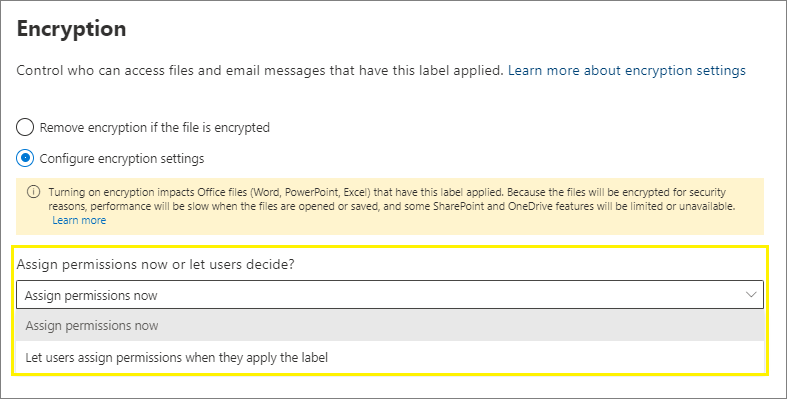

# Restringir el acceso al contenido mediante el uso de etiquetas de confidencialidad para aplicar el cifrado 

>*[Instrucciones de licencias de Microsoft 365 para la seguridad y el cumplimiento](https://aka.ms/ComplianceSD).*

Al crear una etiqueta de confidencialidad, puede restringir el acceso al contenido al que se aplique la etiqueta. Por ejemplo, con las opciones de encriptación de una etiqueta de confidencialidad, se puede proteger el contenido para que:

- Solo los usuarios de su organización puedan abrir un correo electrónico o documentos confidenciales.
- Solo los usuarios del departamento de marketing puedan editar e imprimir documentos o correos electrónicos de anuncios de promociones, mientras que todos los demás usuarios de su organización solo puedan leerlos.
- Los usuarios no puedan reenviar un correo electrónico o copiar información que contenga noticias sobre una reorganización interna.
- La lista de precios actual que se envía a socios comerciales no pueda abrirse tras una fecha especificada.

Cuando se encripta un documento o correo electrónico, el acceso al contenido está restringido, por lo que:

- Se puede desencriptar solo por los usuarios autorizados por la configuración de encriptado de la etiqueta.
- Permanece encriptado independientemente de dónde resida, dentro o fuera de su organización, incluso si cambia el nombre del archivo.
- Se encripta tanto en reposo (por ejemplo, en una cuenta de OneDrive) como y en tránsito (por ejemplo, cuando un correo electrónico viaja a través de Internet).

Por último, como administrador, al configurar una etiqueta de confidencialidad para aplicar el cifrado, puede elegir entre:

- **Asignar permisos ahora** para que determine exactamente los permisos para el contenido con esa etiqueta y los usuarios que los obtendrán.
- **Permitir a los usuarios asignar permisos** al aplicar la etiqueta al contenido. De esta forma, puede permitir a los usuarios de su organización cierta flexibilidad que pueden necesitar para colaborar y llevar a cabo su trabajo.

La configuración de cifrado está disponible cuando se [crea una etiqueta de confidencialidad](create-sensitivity-labels.md) en el Centro de cumplimiento de Microsoft 365, Centro de seguridad de Microsoft 365 o el Centro de seguridad y cumplimiento.

## Entender cómo funciona el cifrado

El cifrado usa el servicio Azure Rights Management (Azure RMS) de Azure Information Protection. Esta solución de protección usa directivas de cifrado, identidades y de autorización. Para obtener más información, consulte [¿qué es Azure Rights Management?](https://docs.microsoft.com/azure/information-protection/what-is-azure-rms) en la documentación de Azure Information Protection. 

Cuando usa esta solución de cifrado, la característica de **superusuario** garantiza que los usuarios y los servicios autorizados siempre puedan leer e inspeccionar los datos que se han cifrado para la organización. Si es necesario, el cifrado puede quitarse o modificarse. Para obtener más información, consulte [configuración de superusuarios para Azure Information Protection y servicios de detección y de recuperación de datos de Azure](https://docs.microsoft.com/azure/information-protection/configure-super-users).

## Cómo configurar una etiqueta para el cifrado

[Cree o edite una etiqueta de confidencialidad](create-sensitivity-labels.md#create-and-configure-sensitivity-labels) y, en la página de **cifrado** del asistente, seleccione una de las opciones siguientes:

- **Ninguno**: es la configuración predeterminada para una nueva etiqueta. No se aplica ningún nuevo cifrado.
- **Aplicar**: activa el cifrado y podrá especificar la configuración de cifrado.
- **Quitar**: quita el cifrado si el documento o el correo electrónico está cifrado.

> [!NOTE]
> La opción **Quitar** solo es compatible con el cliente de etiquetado unificado de Azure Information Protection. Cuando se usa la etiqueta integrada, en las aplicaciones y servicios de Office se puede ver una etiqueta con esta opción y, si se selecciona, el comportamiento de cifrado es igual que **Ninguno**.

Configuración de las opciones de cifrado:

### Qué sucede con el cifrado existente al aplicar una etiqueta

Si se aplica una etiqueta de confidencialidad a contenido sin cifrar, el resultado de las opciones de cifrado que puede seleccionar se explica por sí mismo. Por ejemplo, si el cifrado está establecido en **ninguno**, el contenido permanece sin cifrar.

Sin embargo, es posible que el contenido ya esté cifrado. Por ejemplo, otro usuario puede haber aplicado:

- Sus propios permisos, que incluyen permisos definidos por el usuario cuando se le solicitan con una etiqueta, permisos personalizados por el cliente de Azure Information Protection y la protección del documento con **acceso restringido** desde una aplicación de Office.
- Una plantilla de Azure Rights Management Protection que cifre el contenido independientemente de una etiqueta. Esta categoría incluye las reglas de flujo de correo que aplican el cifrado mediante la protección de derechos.
- Una etiqueta que aplica el cifrado con los permisos asignados por el administrador.

En la tabla siguiente se identifica lo que ocurre con el cifrado existente cuando se aplica una etiqueta de confidencialidad al contenido:

| |**Cifrado: ninguno**|**Cifrado: aplicar**|**Cifrado: quitar**|
|:-----|:-----|:-----|:-----|
|**Permisos especificados por un usuario**|Se preserva el cifrado original|Se aplica el cifrado de la nueva etiqueta|Se quita el cifrado original|
|**Plantilla de protección**|Se preserva el cifrado original|Se aplica el cifrado de la nueva etiqueta|Se quita el cifrado original|
|**Etiqueta con permisos definidos por el administator**|Se quita el cifrado original|Se aplica el cifrado de la nueva etiqueta|Se quita el cifrado original|

Tenga en cuenta que, en los casos en los que se aplica el cifrado de la nueva etiqueta o se elimina el cifrado original, esto solo se produce si el usuario que aplica la etiqueta tiene un derecho de uso o un rol que admite esta acción:
- El [derecho de uso](https://docs.microsoft.com/azure/information-protection/configure-usage-rights#usage-rights-and-descriptions) exportar o control total.
- El rol de [emisor de Administración de derechos o propietario de la Administración de derechos](https://docs.microsoft.com/azure/information-protection/configure-usage-rights#rights-management-issuer-and-rights-management-owner), o bien de [superusuario](https://docs.microsoft.com/azure/information-protection/configure-super-users).

Si el usuario no tiene uno de estos derechos o roles, la etiqueta no se puede aplicar y, por lo tanto, se preserva el cifrado original. El usuario verá el siguiente mensaje: **No tiene permiso para realizar este cambio en la etiqueta de confidencialidad. Póngase en contacto con el propietario del contenido.**

Por ejemplo, la persona que aplica No reenviar a un mensaje de correo puede reetiquetar el hilo para reemplazar el cifrado o quitarlo, ya que es el propietario de la Administración de derechos del correo electrónico. Pero, con la excepción de superusuarios, los destinatarios de este mensaje de correo electrónico no pueden volver a etiquetarlo porque no tienen los derechos de uso necesarios.

#### Datos adjuntos de correo electrónico para mensajes de correo electrónico codificados

Cuando un mensaje de correo electrónico se cifre con cualquier método, todos los documentos de Office no cifrados que se adjunten al correo electrónico heredarán automáticamente la misma configuración de cifrado.

Los documentos que ya están cifrados y se agregan como datos adjuntos siempre conservan el cifrado original. 

## Configurar opciones de cifrado

Cuando selecciona **Aplicar** en la página **Cifrado** del asistente para crear o editar una etiqueta de confidencialidad, elija si quiere:

- **Asignar permisos ahora** para que pueda determinar exactamente qué permisos obtienen los distintos usuarios para el contenido que tenga aplicada la etiqueta. Para obtener más información, vea la sección siguiente [Asignar permisos ahora](#assign-permissions-now).
- **Permitir a los usuarios asignar permisos** al aplicar la etiqueta al contenido. De esta forma, puede permitir a los usuarios de su organización cierta flexibilidad que pueden necesitar para colaborar y llevar a cabo su trabajo. Para obtener más información, vea la sección [Permitir a los usuarios asignar permisos](#let-users-assign-permissions) en esta página.

Por ejemplo, si tiene una etiqueta de confidencialidad denominada **Extremadamente confidencial** que se aplicará al contenido más confidencial, es posible que quiera decidir ahora quién obtendrá cierto tipo de permisos para ese contenido.

Por otra parte, si tiene una etiqueta de confidencialidad denominada **Contratos empresariales** y el flujo de trabajo de su organización requiere que sus usuarios colaboren en este contenido con diferentes personas según sea necesario, puede que quiera permitir a los usuarios decidir quién obtiene permisos cuando asignan la etiqueta. Esta flexibilidad aumenta la productividad de los usuarios y reduce las solicitudes de actualización y creación de nuevas etiquetas a los administradores para solucionar escenarios específicos.

Elegir si asignar permisos ahora o permitir a los usuarios asignar permisos: 

## Asignar permisos ahora

Use las opciones siguientes para controlar quién puede tener acceso al correo electrónico o a los documentos a los que se aplica esta etiqueta. Puede:

- **Permitir que el acceso al contenido con la etiqueta expire**, ya sea en una fecha específica o tras un número determinado de días después de aplicar la etiqueta. Después de ese momento, los usuarios no podrán abrir el elemento con la etiqueta. Si especifica una fecha, se activará en la medianoche de esa fecha, en la zona horaria actual. (Tenga en cuenta que algunos clientes de correo electrónico pueden no aplicar la expiración y mostrar correos electrónicos una vez pasada dicha fecha, debido a otros mecanismos de almacenamiento en caché).

- **Permitir el acceso sin conexión** nunca, siempre o durante un número concreto de días después de aplicar la etiqueta. Si restringe el acceso sin conexión a nunca o a un número de días, cuando se alcance el umbral, los usuarios deberán volver a autenticarse y se registrará el acceso. Para obtener más información, vea la siguiente sección sobre la licencia de uso de administración de derechos.

Configuración de control de acceso para contenido cifrado:

### Licencia de uso de administración de derechos para el acceso sin conexión

Cuando un usuario abre un documento o un correo electrónico que se ha protegido con el cifrado desde el servicio de Azure Rights Management, se otorga una licencia de uso de Azure Rights Management para ese contenido al usuario. Esta licencia de uso es un certificado que contiene los derechos de uso del usuario para el documento o correo electrónico y la clave de cifrado que se usó para cifrar el contenido. La licencia de uso también contiene una fecha de expiración en caso de que se haya establecido y durante cuánto tiempo es válida la licencia de uso.

Si no se ha establecido ninguna fecha de expiración, el período predeterminado de validez de licencia de uso para un espacio empresarial es 30 días. Durante la duración de la licencia de uso, el usuario no se vuelve a autenticar o autorizar para ver el contenido. Este proceso permite que el usuario pueda abrir el documento o correo electrónico protegido sin conexión a Internet. Cuando la validez de la licencia de uso expire, la próxima vez que el usuario acceda a un documento o correo electrónico protegido, el usuario debe ser autorizado y autenticarse de nuevo.

Además de volver a hacer la autenticación, se vuelven a evaluar la configuración de cifrado y la pertenencia a grupos de usuarios. Esto significa que los usuarios podrían experimentar resultados diferentes de acceso para el mismo documento o correo electrónico si hay cambios en la configuración de cifrado o la pertenencia a grupos con respecto al último momento en que se accedió al contenido.

Para obtener información sobre cómo cambiar la configuración de 30 días predeterminada, vea [Licencia de uso de administración de derechos](https://docs.microsoft.com/azure/information-protection/configure-usage-rights#rights-management-use-license).

### Asignar permisos a usuarios o grupos específicos

Puede conceder permisos a usuarios específicos para que solo pueden interactuar con el contenido con la etiqueta:

1. Primero, agregue usuarios o grupos a los que se asignarán permisos para el contenido con la etiqueta.

2. Después, elijaqué permisos obtienen los usuarios para el contenido con la etiqueta.

Asignación de permisos:

#### Agregar usuarios o grupos

Al asignar permisos, puede elegir:

- Todos los usuarios de su organización (todos los miembros del espacio empresarial). Esta configuración excluye cuentas de invitado.

- Todos los usuarios autenticados. Asegúrese de comprender [las limitaciones y los requisitos](#requirements-and-limitations-for-add-any-authenticated-users) de esta configuración antes de seleccionarla.

- Cualquier usuario específico o grupo de seguridad habilitado para correo electrónico, grupo de distribución o grupo de Microsoft 365 ([anteriormente denominado grupo de Office 365](https://techcommunity.microsoft.com/t5/microsoft-365-blog/office-365-groups-will-become-microsoft-365-groups/ba-p/1303601)) en Azure AD. El grupo de Microsoft 365 puede tener [pertenencia estática o dinámica](https://docs.microsoft.com/azure/active-directory/users-groups-roles/groups-create-rule). Tenga en cuenta que no puede usar un grupo de [distribución dinámico de Exchange](https://docs.microsoft.com/Exchange/recipients/dynamic-distribution-groups/dynamic-distribution-groups?view=exchserver-2019) porque este tipo de grupo no está sincronizado con Azure AD, y no puede usar un grupo de seguridad que no esté habilitado para correo electrónico.

- Cualquier dirección de correo electrónico o dominio. Use esta opción para especificar todos los usuarios de otra organización que usan Azure AD, escribiendo un nombre de dominio de dicha organización. También puede usar esta opción para proveedores de redes sociales si escribe su nombre de dominio, como **gmail.com**, **hotmail.com** o **outlook.com**.
    
    > [!NOTE]
    > Si especifica un dominio de una organización que usa Azure AD, no puede restringir el acceso a ese dominio específico. En su lugar, todos los dominios comprobados en Azure AD se incluyen automáticamente para el espacio empresarial propietario del nombre de dominio que especifique.

Al elegir todos los usuarios y grupos de su organización o al examina el directorio, los usuarios o grupos deben tener una dirección de correo electrónico.

Se recomienda usar grupos en lugar de usuarios. Esta estrategia mantiene la configuración más sencilla.

##### Requisitos y limitaciones para **Todos los usuarios autenticados**

Esta configuración no impide que los usuarios tengan acceso al contenido cifrado por la etiqueta, a la vez que cifra el contenido y ofrece opciones para restringir la manera en que puede usarse el contenido (permisos) y tener acceso a él (acceso de expiración y sin conexión). Sin embargo, la aplicación que abra el contenido cifrado debe poder admitir la autenticación que se usa. Por este motivo, los proveedores de redes sociales federadas, como Google, y la autenticación de contraseña de una sola vez, solo funcionan para correo electrónico, y solo cuando se usa Exchange Online. Las cuentas de Microsoft se pueden usar con las aplicaciones de Office 365 y el [visor de Azure Information Protection](https://portal.azurerms.com/#/download).

Algunos escenarios comunes para la configuración de todos los usuarios autenticados:
- No le importa quién vea el contenido, pero desea restringir cómo se usa. Por ejemplo, no quiere que el contenido se pueda modificar, copiar o imprimir.
- No es necesario restringir el acceso al contenido, pero quiere confirmar quién lo abre.
- Tiene un requisito para que el contenido se cifre en reposo y en tránsito, pero no se requieren controles de acceso.

#### Elegir permisos

Al elegir qué permisos permitir para los usuarios o grupos, puede seleccionar entre:

- Un [nivel de permiso predefinido](https://docs.microsoft.com/azure/information-protection/configure-usage-rights#rights-included-in-permissions-levels) con un grupo de derechos preestablecido, como coautor o revisor.
- Permisos personalizados, donde puede elegir uno o más derechos de uso.

Para obtener más información sobre cómo seleccionar los permisos adecuados, consulte [derechos y descripciones de uso](https://docs.microsoft.com/azure/information-protection/configure-usage-rights#usage-rights-and-descriptions).  

Tenga en cuenta que la misma etiqueta puede conceder diferentes permisos a diferentes usuarios. Por ejemplo, una sola etiqueta puede asignar a algunos usuarios como revisor y a otros usuarios como coautor, como se muestra en la siguiente captura.

Para ello, agregue usuarios o grupos, asigne sus permisos y guarde las opciones de configuración. Luego repita estos pasos, agregue usuarios y asigne permisos para guardar la configuración de nuevo. Puede repetir esta configuración tantas veces como sea necesario para definir permisos diferentes para distintos usuarios.

#### El emisor de administración de derechos (el usuario que aplica la etiqueta de confidencialidad) siempre tiene control total

El cifrado de una etiqueta de confidencialidad usa el servicio Azure Rights Management de Azure Information Protection. Cuando un usuario aplica una etiqueta de confidencialidad para proteger un documento o correo electrónico mediante cifrado, ese usuario pasa a ser el emisor de administración de derechos para ese contenido.

El emisor de administración de derechos siempre obtiene permisos de control total para el documento o correo electrónico y además:

- Si la configuración de cifrado incluye una fecha de expiración, el emisor de administración de derechos puede abrir y editar el documento o correo electrónico después de esa fecha.
- El emisor de administración de derechos siempre puede acceder al documento o correo electrónico sin conexión.
- El emisor de administración de derechos puede seguir abriendo un documento después de que se revoque.

Para obtener más información, vea [Emisor de administración de derechos y propietario de administración de derechos](https://docs.microsoft.com/azure/information-protection/configure-usage-rights#rights-management-issuer-and-rights-management-owner).

### Cifrado de claves doble

> [!NOTE]
> Esta característica está disponible actualmente en versión preliminar pública. Para obtener más información, vea [Presentación de la versión preliminar pública del cifrado de doble clave de Microsoft 365](https://techcommunity.microsoft.com/t5/microsoft-security-and/announcing-public-preview-of-double-key-encryption-for-microsoft/ba-p/1534451).

Seleccione esta opción solo después de configurar el servicio Cifrado de doble clave. Necesitará usar el cifrado de doble clave para los archivos y correos electrónico que tengan esta etiqueta aplicada.

Para obtener más información, ver los requisitos previos y las instrucciones de configuración, consulte el [Cifrado de doble clave (DKE)](double-key-encryption.md).

## Permitir a los usuarios asignar permisos

Puede usar estas opciones para que los usuarios puedan asignar permisos cuando aplican manualmente una etiqueta de confidencialidad al contenido:

- En Outlook, un usuario puede seleccionar restricciones equivalentes a la opción [No reenviar](https://docs.microsoft.com/azure/information-protection/configure-usage-rights#do-not-forward-option-for-emails) para los destinatarios seleccionados.

- En Word, PowerPoint y Excel, se pide al usuario que seleccione sus propios permisos para organizaciones, usuarios o grupos específicos. 
    > [!NOTE]
    > Esta opción para Word, PowerPoint y Excel es compatible con el cliente de etiquetado unificado de Azure Information Protection. Para las aplicaciones que usan etiquetas integradas, [compruebe qué aplicaciones son compatibles](sensitivity-labels-office-apps.md#sensitivity-label-capabilities-in-word-excel-and-powerpoint).
    > 
    > Si esta opción está seleccionada, pero no es compatible con la aplicación de un usuario, la etiqueta no se mostrará al usuario, o bien la etiqueta se mostrará por coherencia, pero no se podrá aplicar con un mensaje de explicación para los usuarios.

Cuando se admitan las opciones, use la tabla siguiente para identificar cuándo los usuarios ven la etiqueta de confidencialidad:

|Configuración |Etiqueta visible en Outlook|Etiqueta visible en Word, Excel y PowerPoint|
|:-----|:-----|:-----|:-----|
|**En Outlook, un usuario puede aplicar restricciones equivalentes a la opción No reenviar**|Sí |No |
|**En Word, PowerPoint y Excel, pida a los usuarios que especifiquen los permisos**|No |Sí|

Cuando ambas opciones están seleccionadas, la etiqueta es visible tanto en Outlook como en Word, Excel y PowerPoint.

Una etiqueta de confidencialidad que permite a los usuarios asignar permisos solo se puede aplicar al contenido manualmente. No se puede aplicar automáticamente o usar como etiqueta recomendada.

Configurar los permisos asignados por el usuario:

### Restricciones de Outlook

En Outlook, cuando un usuario aplica una etiqueta de confidencialidad que les permite asignar permisos a un mensaje, las restricciones son las mismas que la opción No reenviar. El usuario verá el nombre y la descripción de la etiqueta en la parte superior del mensaje, lo que indica que se está protegiendo el contenido. A diferencia de Word, PowerPoint y Excel (vea la [siguiente sección](#word-powerpoint-and-excel-permissions)), no se pide a los usuarios que seleccionen permisos específicos.

Cuando la opción No reenviar se aplica a un correo electrónico, este se cifra y los destinatarios tienen que autenticarse. Luego, los destinatarios no podrán reenviarlo, imprimirlo ni copiarlo. Por ejemplo, en el cliente de Outlook, el botón Reenviar y las opciones de menú Guardar como e Imprimir no están disponibles, y no se pueden agregar o cambiar destinatarios en los cuadros Para, CC o CCO.

Los documentos de Office sin cifrar asociados al correo electrónico heredan automáticamente las mismas restricciones. Los derechos de uso que se aplican a estos documentos son Editar contenido, Editar; Guardar; Ver, Abrir, Leer y Permitir macros. Si el usuario quiere derechos de uso distintos para los datos adjuntos o el archivo adjunto no es un documento de Office compatible con esta protección heredada, debe proteger el archivo antes de adjuntarlo al correo electrónico.

### Permisos de Word, PowerPoint y Excel

En Word, PowerPoint y Excel, cuando un usuario aplica una etiqueta de confidencialidad que le permite asignar permisos a un documento, se le pedirá que especifique la elección de usuarios y permisos cuando se aplique el cifrado.

Por ejemplo, con el cliente de etiquetas unificado de Azure Information Protection, los usuarios pueden:

- Seleccionar un nivel de permisos, como Visor (que asigna el permiso de solo vista) o Co-autoría (que asigna los permisos de vista, edición, copia e impresión). 
- Seleccionar organizaciones, usuarios o grupos. Esto puede incluir usuarios dentro o fuera de su organización.
- Establecer una fecha de expiración, después de la que los usuarios seleccionados no pueden tener acceso al contenido. Para obtener más información, vea la sección anterior [Licencia de uso de Rights Management para el acceso sin conexión](#rights-management-use-license-for-offline-access).

Para las etiquetas integradas, los usuarios verán el mismo cuadro de diálogo si seleccionan lo siguiente:

- Windows: pestaña **Archivo** > **Información** > **Proteger documento** > **Restringir accesso** > **Accesso restringido**

- MacOS: pestaña **Revisar** > **Protección** > **Permisos** > **Acceso restringido**

## Configuraciones de ejemplo para la configuración de cifrado

Para cada ejemplo que se muestra a continuación, lleve a cabo la configuración desde la página **cifrado** del asistente cuando [cree o edite una etiqueta de confidencialidad](create-sensitivity-labels.md#create-and-configure-sensitivity-labels). En primer lugar, asegúrese de que el **cifrado** se establece en **aplicar**:

### Ejemplo 1: etiqueta que aplica No reenviar para enviar un correo electrónico cifrado a una cuenta de Gmail

Esta etiqueta solo se muestra en Outlook y Outlook en la Web y debe usar Exchange Online. Pida a los usuarios que seleccionen esta etiqueta cuando necesiten enviar un correo electrónico cifrado a las personas que usen una cuenta de Gmail (o cualquier otra cuenta de correo electrónico fuera de su organización). 

Los usuarios escriben la dirección de correo electrónico de Gmail en el cuadro **Para**.  Después, seleccionan la etiqueta y la opción No reenviar se agrega automáticamente al correo electrónico. El resultado es que los destinatarios no pueden reenviar el correo electrónico o imprimirlo, copiar desde él o guardar el correo electrónico fuera de su buzón con la opción **Guardar como**. 

1. En la página **Cifrado**: para **¿Quiere asignar permisos ahora o permitir que los usuarios decidan?** seleccione **Permita a los usuarios asignar permisos al aplicar la etiqueta**.

3. Marque la casilla de verificación: **En Outlook, aplicar restricciones equivalentes a la opción No reenviar**.

4. Si está seleccionada, desactive la casilla: **En Word, PowerPoint y Excel, pedir a los usuarios que especifiquen los permisos**.

5. Seleccione **Siguiente** y finalice el asistente.

### Ejemplo 2: etiqueta que restringe los permisos de solo lectura a todos los usuarios de otra organización

Esta etiqueta es adecuada para compartir documentos muy confidenciales como solo lectura, y los documentos siempre requieren una conexión a Internet para verlos.

Esta etiqueta no es adecuada para correos electrónicos.

1. En la página **Cifrado**: para **¿Quiere asignar permisos ahora o permitir que los usuarios decidan?** seleccione **Asignar permisos ahora**.

3. Para **permitir el acceso sin conexión**, seleccione **nunca**.

4. Seleccione **asignar permisos**.

3. En el panel **Asignar permisos**, seleccione **Agregar direcciones de correo electrónico o dominios específicos**.

4. En el cuadro de texto, escriba el nombre de un dominio de la otra organización, por ejemplo, **fabrikam.com**. A continuación, seleccione **Aceptar**.

5. Seleccione **Elegir permisos**.

6. En el panel **Elegir permisos**, seleccione el cuadro de lista desplegable, seleccione **Visor** y, después, **Guardar**.

6. De nuevo, en el panel **asignar permisos**, seleccione **guardar**.

7. En la página **cifrado**, seleccione **siguiente** y finalice el asistente.

### Ejemplo 3: agregar usuarios externos a una etiqueta existente que cifra el contenido

Los nuevos usuarios que agregue serán capaces de abrir documentos y mensajes de correo electrónico que ya estén protegidos con esta etiqueta. Los permisos concedidos a estos usuarios pueden ser distintos de los permisos que tienen los usuarios existentes.

1. En la página **Cifrado**: para **¿Quiere asignar permisos ahora o permitir que los usuarios decidan?** asegúrese de que la opción **Asignar permisos ahora** está seleccionada.

2. Seleccione **asignar permisos**.

3. En el panel **Asignar permisos**, seleccione **Agregar direcciones de correo electrónico o dominios específicos**.

4. En el cuadro de texto, escriba la dirección de correo electrónico del primer usuario (o grupo) que desea agregar y seleccione **agregar**.

5. Seleccione **Elegir permisos**.

6. En el panel **Elegir permisos**, seleccione los permisos para este usuario (o grupo) y seleccione **Guardar**.

7. De nuevo, en el panel **asignar permisos**, repita los pasos del 3 al 6 para cada usuario (o grupo) que quiera agregar a esta etiqueta. Después, haga clic en **Guardar**.

8. En la página **cifrado**, seleccione **siguiente** y finalice el asistente.

### Ejemplo 4: etiqueta que cifra el contenido, pero que no restringe quién puede tener acceso a él.

Esta configuración tiene la ventaja de no tener que especificar usuarios, grupos o dominios para cifrar un correo electrónico o un documento. El contenido seguirá estando cifrado y aún podrá especificar derechos de uso, una fecha de expiración y acceso sin conexión. 

Use esta configuración solo si no necesita restringir quién puede abrir el documento o correo electrónico protegido. [Más información sobre esta configuración](#requirements-and-limitations-for-add-any-authenticated-users)

1. En la página **Cifrado**: para **¿Quiere asignar permisos ahora o permitir que los usuarios decidan?** asegúrese de que la opción **Asignar permisos ahora** está seleccionada.

2. Configure las opciones de **el acceso de usuario al contenido expira** y **permitir el acceso sin conexión** según sea necesario.

3. Seleccione **asignar permisos**.

4. En el panel **asignar permisos**, seleccione **agregar cualquiera de los usuarios autenticados**. 
    
    Para **Usuarios y grupos**, verá que **Usuarios autenticados** se agrega automáticamente. No se puede cambiar este valor, solo eliminarlo, lo que cancela la selección de **agregar cualquiera de los usuarios autenticados**.

5. Seleccione **Elegir permisos**.

6. En el panel **Elegir permisos**, seleccione el cuadro de lista desplegable, elija los permisos que quiera y seleccione **Guardar**.

7. De nuevo, en el panel **asignar permisos**, seleccione **guardar**.

8. En la página **cifrado**, seleccione **siguiente** y finalice el asistente.

## Consideraciones sobre el contenido cifrado

Cifrar los documentos y mensajes de correo electrónico más confidenciales le ayuda a asegurarse de que solo los usuarios autorizados puedan acceder a estos datos. Sin embargo, hay algunas consideraciones que debe tener en cuenta:

- Si su organización no ha [habilitado las etiquetas de confidencialidad para los archivos de Office en SharePoint y OneDrive](sensitivity-labels-sharepoint-onedrive-files.md):
    
    - Search, eDiscovery y Delve no funcionarán en archivos cifrados.
    - Las directivas DLP funcionan para los metadatos de estos archivos cifrados (incluida la información de la etiqueta de retención), pero no el contenido de estos archivos (como números de tarjeta de crédito en los archivos).
    - Los usuarios no pueden abrir archivos cifrados con Office en la Web. Cuando las etiquetas de confidencialidad de los archivos de Office en SharePoint y OneDrive están habilitadas, los usuarios pueden usar Office en la Web para abrir archivos cifrados, con algunas [limitaciones](sensitivity-labels-sharepoint-onedrive-files.md#limitations) entre las que se incluyen el cifrado que se ha aplicado con una clave local (conocido como "mantenga su propia clave" o HYOK), el [cifrado de doble clave](#double-key-encryption) y el cifrado que se ha aplicado independientemente de una etiqueta de confidencialidad.

- Para que varios usuarios puedan modificar un archivo cifrado al mismo tiempo, deben usar Office para la Web. Si este no es el caso, y el archivo ya está abierto:
    
    - En las aplicaciones de Office (Windows, Mac, Android y iOS), los usuarios verán un mensaje de **archivo en uso** con el nombre de la persona que ha desprotegido el archivo. Podrán ver una copia de solo lectura, guardar y editar una copia del archivo, y recibir una notificación cuando el archivo esté disponible.
    - En Office para la web, los usuarios ven un mensaje de error que indica que no pueden editar el documento con otras personas. Pueden seleccionar **Abrir en vista de lectura**.

- La funcionalidad de [autoguardado](https://support.office.com/article/what-is-autosave-6d6bd723-ebfd-4e40-b5f6-ae6e8088f7a5) en las aplicaciones de Office (Windows, Mac, Android y iOS) está deshabilitada para archivos cifrados. Los usuarios verán un mensaje en el que se indica que el archivo tiene permisos restringidos que deben quitarse para que se pueda activar el autoguardado.

- Los archivos cifrados pueden tardar más en abrirse en las aplicaciones de Office (Windows, Mac, Android y iOS).

- Las siguientes acciones para archivos cifrados no son compatibles con las aplicaciones de Office (Windows, Mac, Android y iOS), y los usuarios ven un mensaje de error que indica que se ha producido un problema. Sin embargo, la funcionalidad de SharePoint se puede usar como alternativa:
    
    - Ver, restaurar y guardar las copias de versiones anteriores. Como alternativa, los usuarios pueden realizar estas acciones mediante Office en la web cuando [habilita y configura las versiones para una lista o biblioteca](https://support.office.com/article/enable-and-configure-versioning-for-a-list-or-library-1555d642-23ee-446a-990a-bcab618c7a37). 
    - Cambiar el nombre o la ubicación de los archivos. Como alternativa, los usuarios pueden [cambiar el nombre de un archivo, carpeta o vínculo de una biblioteca de documentos](https://support.microsoft.com/es-ES/office/rename-a-file-folder-or-link-in-a-document-library-bc493c1a-921f-4bc1-a7f6-985ce11bb185) en SharePoint.

Para disfrutar de la mejor experiencia de colaboración para los archivos que se cifran con una etiqueta de confidencialidad, le recomendamos que use [etiquetas de confidencialidad para los archivos de Office en SharePoint y OneDrive](sensitivity-labels-sharepoint-onedrive-files.md) y Office para la Web. 

## Requisitos previos importantes

Para poder usar el cifrado, es posible que tenga que realizar algunas tareas de configuración.

### Activar la protección de Azure Information Protection

Para que las etiquetas de confidencialidad puedan aplicar el cifrado, el servicio de protección (Azure Rights Management) de Azure Information Protection debe estar activado para su espacio empresarial. En los espacios empresariales más recientes, esta es la configuración predeterminada, pero es posible que tenga que activar el servicio manualmente. Para obtener más información, consulte [Activar el servicio de protección de Azure Information Protection](https://docs.microsoft.com/azure/information-protection/activate-service).

### Configurar Exchange para Azure Information Protection

Exchange no necesita configurarse para Azure Information Protection para que los usuarios puedan aplicar etiquetas en Outlook para cifrar sus correos electrónicos. Sin embargo, hasta que Exchange se configure para Azure Information Protection, no tendrá la funcionalidad completa para usar la protección de Azure Rights Management con Exchange.
 
Por ejemplo, los usuarios no pueden ver mensajes de correo electrónico cifrados en teléfonos móviles o con Outlook en la Web, no se pueden indizar mensajes de correo electrónico cifrados para la búsqueda y no puede configurar Exchange Online DLP para la protección de administración de derechos. 

Para asegurarse de que Exchange puede admitir estos escenarios adicionales, vea lo siguiente:

- Para Exchange Online, consulte las instrucciones de [Exchange Online: configuración de IRM](https://docs.microsoft.com/azure/information-protection/configure-office365#exchangeonline-irm-configuration).
- Para Exchange local, debe implementar el [conector RMS y configurar los servidores de Exchange](https://docs.microsoft.com/azure/information-protection/deploy-rms-connector). 
