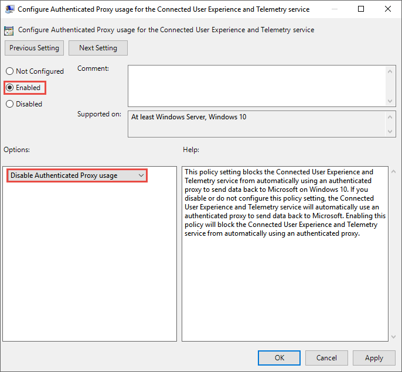

# <a name="configure-device-proxy-and-internet-connection-settings-for-endpoint-dlp"></a>Configurar la conexión a Internet y el proxy del dispositivo para la DLP de punto de conexión

La DLP de punto de conexión de Microsoft usa Microsoft Windows HTTP (WinHTTP) para notificar datos y comunicarse con el servicio en la nube del punto de conexión de Microsoft. La DLP de punto de conexión insertada se ejecuta en el contexto del sistema con la cuenta LocalSystem.

> [!TIP]
> Para las organizaciones que usan servidores proxy de reenvío como puerta de enlace a Internet, puede usar la protección de red para investigar lo que ocurre detrás de un servidor proxy. Para obtener más información, vea [Investigar eventos de conexión que ocurren detrás de los servidores proxy de reenvío](/windows/security/threat-protection/microsoft-defender-atp/investigate-behind-proxy).

La configuración de WinHTTP es independiente de la configuración de proxy de exploración de Internet de Windows Internet (WinINet) y solo puede detectar un servidor proxy mediante los siguientes métodos de detección automática:

- Proxy transparente
- Protocolo de detección automática de proxy web (WPAD)

> [!NOTE]
> Si usa un proxy transparente o WPAD en la topología de red, no necesitará una configuración especial. Para obtener más información sobre las exclusiones de URL de Defender para punto de conexión en el servidor proxy, vea [Habilitar el acceso a las direcciones URL del servicio en la nube de DLP para punto de conexión el servidor proxy](#enable-access-to-endpoint-dlp-cloud-service-urls-in-the-proxy-server).

- Configuración del proxy estático manual:
  - Configuración basada en el registro
  - WinHTTP se configuró con el comando netsh (adecuado solo para dispositivos de escritorio en una topología estable, por ejemplo, un escritorio en una red corporativa detrás del mismo proxy)

## <a name="configure-the-proxy-server-manually-using-a-registry-based-static-proxy"></a>Configurar manualmente el servidor proxy mediante un proxy estático basado en el registro

Para los dispositivos de punto de conexión a los que no se permite conectarse a Internet, debe configurar un proxy estático basado en el registro. Debe configurar esta opción para permitir que solo DLP de punto de conexión de Microsoft notifique datos de diagnóstico y se comunique con el servicio en la nube de punto de conexión de Microsoft.

El proxy estático se puede configurar mediante la directiva de grupo (GP). La directiva de grupo se puede encontrar aquí:

1. Abra **Plantillas administrativas > Componentes de Windows > Recopilación de datos y versiones preliminares > Configurar el uso del proxy autenticado para el servicio de Experiencia del usuario y telemetría asociadas**.

2. Establece la opción en **Habilitado** y seleccione **Deshabilitar el uso de proxy autenticado**:

   

3. Abra **Plantillas administrativas > Componentes de Windows > Recopilación de datos y versiones preliminares > Configurar Experiencia del usuario y telemetría asociadas**:

   Configurar el servidor proxy

   

   La directiva establece dos valores del registro `TelemetryProxyServer` como REG_SZ y `DisableEnterpriseAuthProxy` como REG_DWORD en la clave del registro `HKLM\Software\Policies\Microsoft\Windows\DataCollection`.

   El valor del registro TelemetryProxyServer está en este formato \<server name or ip\>:\<port\>. Por ejemplo, **10.0.0.6:8080**

   El valor del registro `DisableEnterpriseAuthProxy` debe establecerse en 1.

## <a name="configure-the-proxy-server-manually-using-netsh-command"></a>Configure el servidor proxy manualmente con el comando "netsh".

Use netsh para configurar un proxy estático en todo el sistema.

> [!NOTE]
> Esto afectará a todas las aplicaciones, incluidos los servicios de Windows que utilicen WinHTTP con el proxy predeterminado. - Los equipos portátiles que cambien de topología (por ejemplo: entre oficina a casa) no funcionarán correctamente con netsh. Use la configuración de proxy estático basada en el registro.

1. Abra un símbolo del sistema con privilegios elevados:
    1. Vaya a **Inicio** y escriba **cmd**.
    2. Haga clic derecho en **Símbolo del sistema** y seleccione **Ejecutar como administrador**.

2. Escriba el siguiente comando y presione **Entrar**:

   `netsh winhttp set proxy <proxy>:<port>`

   Por ejemplo: **netsh winhttp set proxy 10.0.0.6:8080**

3. Para restablecer el servidor proxy winhttp, escriba el siguiente comando y presione **Entrar**:

   `netsh winhttp reset proxy`

Para obtener más información, vea [Sintaxis de comando Netsh, contextos y formatos](/windows-server/networking/technologies/netsh/netsh-contexts).

## <a name="enable-access-to-endpoint-dlp-cloud-service-urls-in-the-proxy-server"></a>Habilitar el acceso a las direcciones URL del servicio en la nube de DLP de punto de conexión en el servidor proxy

Si un servidor proxy o firewall bloquea todo el tráfico de forma predeterminada y permite únicamente el acceso a dominios específicos, agregue los dominios que aparecen en la hoja descargable a la lista de dominios permitidos.

Esta [hoja de cálculo descargable](https://download.microsoft.com/download/8/a/5/8a51eee5-cd02-431c-9d78-a58b7f77c070/mde-urls.xlsx) muestra los servicios y sus direcciones URL asociadas a las que la red debe poder conectarse. Debe asegurarse de que no haya ninguna regla de filtrado de red o firewall que deniegue el acceso a estas direcciones URL o puede que necesite crear una regla de permiso específica para ellas.

Si un servidor proxy o firewall tiene habilitada la detección HTTPS (inspección SSL), excluya los dominios que aparecen en la tabla anterior de la detección HTTPS.
Si un servidor proxy o firewall bloquea el tráfico anónimo, como la DLP de punto de conexión se conecta desde el contexto del sistema, asegúrese de que se permite el tráfico anónimo en las direcciones URL indicadas anteriormente.

## <a name="verify-client-connectivity-to-microsoft-cloud-service-urls"></a>Comprobar la conectividad del cliente con las direcciones URL del servicio en la nube de Microsoft

Compruebe que la configuración del proxy se ha completado correctamente, que WinHTTP puede detectar y comunicarse mediante el servidor proxy en su entorno y que el servidor proxy permite el tráfico a las direcciones URL del servicio de Defender para punto de conexión.

1. Descargue la [herramienta MDATP Client Analyzer](https://aka.ms/mdatpanalyzer) en el equipo en el que se ejecuta la DLP de punto de conexión.
2. Extraiga el contenido de MDATPClientAnalyzer.zip en el dispositivo.
3. Abra un símbolo del sistema con privilegios elevados:
    1. Vaya a **Inicio** y escriba **cmd**.
    1. Haga clic derecho en **Símbolo del sistema** y seleccione **Ejecutar como administrador**.
4. Escriba el siguiente comando y presione **Entrar**:

   `HardDrivePath\MDATPClientAnalyzer.cmd`

   Reemplace *HardDrivePath* por la ruta de acceso en la que se descargó la herramienta MDATPClientAnalyzer, por ejemplo:

   **C:\Work\tools\MDATPClientAnalyzer\MDATPClientAnalyzer.cmd**

5. Extraiga el archivo **MDATPClientAnalyzerResult.zip** _ que creó la herramienta en la carpeta usada en _HardDrivePath*.

6. Abra **MDATPClientAnalyzerResult.txt** y compruebe que ha realizado los pasos de configuración del proxy para habilitar la detección del servidor y tener acceso a las direcciones URL del servicio.  La herramienta comprueba la conectividad de las direcciones URL del servicio de Defender para punto de conexión con las que el cliente está configurado para interactuar. Luego, imprime los resultados en el archivo **MDATPClientAnalyzerResult.txt** para cada URL que se puede usar potencialmente para comunicarse con los servicios de Defender para punto de conexión. Por ejemplo:

   ```DOS
   Testing URL: https://xxx.microsoft.com/xxx
   1 - Default proxy: Succeeded (200)
   2 - Proxy auto discovery (WPAD): Succeeded (200)
   3 - Proxy disabled: Succeeded (200)
   4 - Named proxy: Doesn't exist
   5 - Command-line proxy: Doesn't exist
   ```

Si al menos una de las opciones de conectividad devuelve un estado (200), el cliente de Defender para punto de conexión puede comunicarse con la URL probada correctamente con este método de conectividad.

Pero si los resultados de la comprobación de conectividad indican un error, se mostrará un error HTTP (vea los códigos de estado HTTP). Luego, puede usar las direcciones URL de la tabla que se muestra en [Habilitar el acceso a las direcciones URL del servicio en la nube de DLP de punto de conexión en el servidor proxy](#enable-access-to-endpoint-dlp-cloud-service-urls-in-the-proxy-server). Las direcciones URL que vaya a usar dependerán de la región seleccionada durante el procedimiento de incorporación.

> [!NOTE]
>
> [ La herramienta Analizador de conectividad no es compatible con la regla ASR ](/windows/security/threat-protection/windows-defender-exploit-guard/attack-surface-reduction#attack-surface-reduction-rules)Bloquear las creaciones de procesos procedentes de comandos PSExec y WMI. Tendrá que deshabilitar temporalmente esta regla para ejecutar la herramienta de conectividad.
>
> Cuando se configura TelemetryProxyServer, en el Registro o mediante la Política de grupo, Defender for Endpoint recurrirá a la función directa si no puede acceder al proxy definido. Temas relacionados:
>
> - Incorporar dispositivos Windows 10
> - Solución de problemas de incorporación de DLP de Microsoft Endpoint

## <a name="see-also"></a>Consulte también

- [Obtenga más información sobre la prevención de pérdida de datos en punto de conexión](endpoint-dlp-learn-about.md)
- [Uso de la prevención de pérdida de datos en punto de conexión](endpoint-dlp-using.md)
- [Obtenga más información acerca de la prevención contra la pérdida de datos](dlp-learn-about-dlp.md)
- [Crear, probar y optimizar una directiva DLP](create-test-tune-dlp-policy.md)
- [Introducción al explorador de actividad](data-classification-activity-explorer.md)
- [Microsoft Defender para punto de conexión](/windows/security/threat-protection/)
- [Herramientas y métodos de incorporación para equipos con Windows 10](/windows/security/threat-protection/microsoft-defender-atp/configure-endpoints).
- [Suscripción a Microsoft 365](https://www.microsoft.com/microsoft-365/compare-microsoft-365-enterprise-plans?rtc=1)
- [Dispositivos de Azure AD Unidos](/azure/active-directory/devices/concept-azure-ad-join)
- [Descargar el nuevo Microsoft Edge basado en Chromium](https://support.microsoft.com/help/4501095/download-the-new-microsoft-edge-based-on-chromium)
