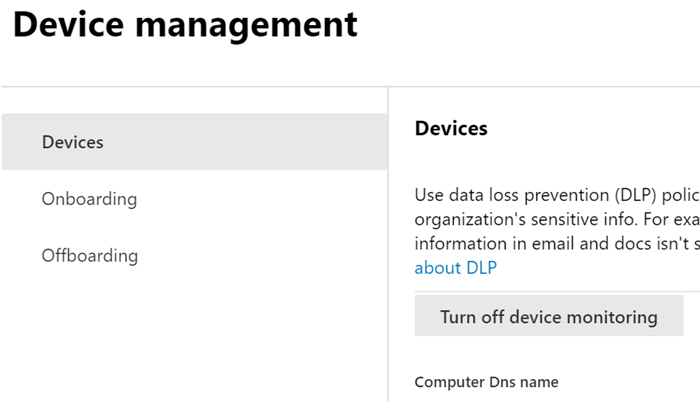

# Introducción a la prevención de pérdida de datos en punto de conexión

La prevención de pérdida de datos de Microsoft Endpoint (Endpoint DLP) es parte de la serie de características de prevención de pérdida de datos (DLP) de Microsoft 365 que se pueden usar para detectar y proteger elementos confidenciales en los servicios de Microsoft 365. Para obtener más información sobre las ofertas de DLP de Microsoft, consulte [Obtenga más información acerca de la prevención contra la pérdida de datos](dlp-learn-about-dlp.md). Para más información sobre la DLP de punto de conexión, consulte [Obtener información sobre la prevención de pérdida de datos de punto de conexión](endpoint-dlp-learn-about.md)

Microsoft Endpoint DLP le permite supervisar dispositivos con Windows 10 y detectar cuándo se usan y comparten elementos confidenciales. Esto le proporciona la visibilidad y el control que necesita para asegurarse de que se usan y protegen correctamente, así como para ayudar a evitar algún comportamiento peligroso que podría comprometerlos.

## Antes de empezar

### Licencias de SKU/suscripciones

Antes de empezar con Endpoint DLP, debe confirmar la [Suscripción a Microsoft 365](https://www.microsoft.com/microsoft-365/compare-microsoft-365-enterprise-plans?rtc=1) y cualquier complemento. Para acceder y usar la funcionalidad Endpoint DLP, debe tener una de estas suscripciones o complementos.

- Microsoft 365 E5
- Microsoft 365 A5 (EDU)
- Cumplimiento de Microsoft 365 E5
- Cumplimiento de Microsoft 365 A5
- Gobierno y protección de información de Microsoft 365 E5
- Gobierno y protección de información de Microsoft 365 A5

### Permisos

Para habilitar la administración de dispositivos, la cuenta que use debe pertenecer a uno de los siguientes roles:

- Administrador global
- Administrador de seguridad
- Administrador de cumplimiento

Si desea usar una cuenta personalizada para ver la configuración de administración de dispositivos, debe tener uno de estos roles:

- Administrador global
- Administrador de cumplimiento
- Administrador de datos de cumplimiento
- Lector global

Si desea usar una cuenta personalizada para acceder a la página de incorporación y baja, debe tener uno de estos roles:

- Administrador global
- Administrador de cumplimiento

Si desea usar una cuenta personalizada para activar o desactivar la supervisión de dispositivos, debe tener uno de estos roles:

- Administrador global
- Administrador de cumplimiento

Los datos de Endpoint DLP se pueden ver en el [Explorador de actividad](data-classification-activity-explorer.md). Hay cuatro roles que conceden permisos al explorador de actividad; la cuenta que use para acceder a los datos debe pertenecer a uno de ellos.

- Administrador global
- Administrador de cumplimiento
- Administrador de seguridad
- Administrador de datos de cumplimiento

### Preparar los puntos de conexión

Asegúrese de que los dispositivos con Windows 10 en los que planee implementar Endpoint DLP cumplan los siguientes requisitos.

1. Debe estar ejecutando Windows 10 x64 compilación 1809 o posterior.

2. La versión del cliente antimalware es 4.18.2009.7 o posterior. Para comprobar la versión actual, abra la aplicación de Seguridad de Windows, seleccione el icono Configuración y, a continuación, Acerca de. El número de versión aparece en la versión del cliente antimalware. Instale Windows Update KB4052623 para actualizar a la última versión del cliente antimalware. 

   > [!NOTE]
   > No es necesario que ninguno de los componentes de Seguridad de Windows estén activos; puede ejecutar DLP en punto de conexión independiente del estado de Seguridad de Windows, pero la [protección en tiempo real y el comportamiento del monitor ](/windows/security/threat-protection/microsoft-defender-antivirus/configure-real-time-protection-microsoft-defender-antivirus)) se debe habilitar.
 
3. Se instalan las siguientes actualizaciones de Windows. 
 
   > [!NOTE]
   > Estas actualizaciones no son un requisito previo para incorporar un dispositivo a DLP en punto de conexión, pero contienen correcciones de problemas importantes y, por lo tanto, deben instalarse antes de usar el producto.

    - For Windows 10 1809 - KB4559003, KB4577069, KB4580390
    - Para Windows 10 1903 o 1909 - KB4559004, KB4577062, KB4580386
    - For Windows 10 2004 - KB4568831, KB4577063
    - Para dispositivos que ejecutan Office 2016 (en lugar de cualquier otra versión de Office): KB4577063 

4. Todos los dispositivos deben cumplir una de estas opciones:
- [Unido a Azure Active Directory (Azure AD)](/azure/active-directory/devices/concept-azure-ad-join)
- [Unido a Azure AD híbrido ](/azure/active-directory/devices/concept-azure-ad-join-hybrid)
- [Registrado en AAD](/azure/active-directory/user-help/user-help-register-device-on-network)

5. Instale el explorador Chromium Edge de Microsoft en el dispositivo del punto de conexión para aplicar acciones de directiva para cargar a la actividad de la nube. Consulte [Descargar el nuevo Microsoft Edge basado en Chromium](https://support.microsoft.com/help/4501095/download-the-new-microsoft-edge-based-on-chromium).

6. Si está en el canal mensual de la empresa de las versiones 2004 a 2008 de Aplicaciones de Microsoft 365, hay un problema conocido con el punto de conexión de DLP que clasifica el contenido de Office y tendrá que actualizar a la versión 2009 o posterior. Vea [Historial de actualizaciones de las Aplicaciones de Microsoft 365 (enumeradas por fecha)](/officeupdates/update-history-microsoft365-apps-by-date) las versiones actuales. Para obtener más información sobre este problema, vea la sección Office Suite de [Notas de la versión para obtener las versiones del canal actuales en 2020](/officeupdates/current-channel#version-2010-october-27).

7. Si tiene puntos de conexión que usan un proxy de dispositivo para conectarse a Internet, siga los procedimientos que se describen en [Configurar proxy de dispositivo y configuración de conexión a Internet para DLP de puntos de conexión](endpoint-dlp-configure-proxy.md).

## Incorporación de dispositivos a la administración de dispositivos

Para poder supervisar y proteger los elementos confidenciales de un dispositivo, es necesario que habilite la supervisión del dispositivo y que incorpore los puntos de conexión. Ambas acciones se realizan en el portal de cumplimiento de Microsoft 365.

Cuando quiera incorporar dispositivos que todavía no hayan sido incorporados, descargue el script apropiado y, luego, impleméntelo en esos dispositivos. Siga los pasos del [Procedimiento de incorporación de dispositivos](endpoint-dlp-getting-started.md#onboarding-devices).

Si ya tiene dispositivos incorporados en [ Microsoft Defender para punto de conexión (MDATP)](/windows/security/threat-protection/), estos aparecerán en la lista de dispositivos administrados. Siga el [procedimiento con dispositivos incorporados en Microsoft Defender para punto de conexión](?source=docs&view=o365-worldwide#with-devices-onboarded-into-microsoft-defender-for-endpoint).

### Incorporar dispositivos

En este escenario de implementación, incorporará dispositivos que aún no hayan sido incorporados y, además, solo quiere supervisar y proteger elementos confidenciales frente al uso compartido no intencionado en dispositivos con Windows 10.

1. Abra el [Centro de cumplimiento de Microsoft](https://compliance.microsoft.com).

2. Abra la página de configuración del Centro de cumplimiento y elija **Incorporar dispositivos**. 

   > [!div class="mx-imgBorder"]
   > 

   > [!NOTE]
   > Aunque, por lo general, habilitar la incorporación de dispositivos tarda aproximadamente 60 segundos, espere 30 minutos antes de ponerse en contacto con el soporte técnico de Microsoft.

3. Elija **Administración de dispositivos** para abrir la lista de **Dispositivos**. La lista estará vacía hasta que haya incorporado dispositivos.

4. Elija **Incorporación** para iniciar el proceso de incorporación.

5. Elija el modo en que desea implementar estos dispositivos adicionales de la lista **Método de implementación** y, después, **Descargar paquete**.

   > [!div class="mx-imgBorder"]
   > 
   
6. Siga los procedimientos adecuados que puede consultar en [Herramientas y métodos de incorporación para equipos con Windows 10](/windows/security/threat-protection/microsoft-defender-atp/configure-endpoints). Este vínculo le lleva a una página de aterrizaje en la que puede acceder a los procedimientos de Microsoft Defender para punto de conexión que coinciden con el paquete de implementación que seleccionó en el paso 5:

    - Incorporar equipos con Windows 10 usando Directiva de grupo
    - Incorporar equipos con Windows con Microsoft Endpoint Configuration Manager
    - Incorporar equipos con Windows 10 con herramientas de administración de dispositivos móviles
    - Incorporar equipos con Windows 10 usando un script local
    - Incorporar equipos de infraestructura de escritorio virtual (VDI) no persistentes en escenarios de sesión única

Una vez que se haya incorporado el punto de conexión, debería estar visible en la lista de dispositivos y también empezar a informar de los registros de actividad de auditoría al explorador de actividad.

> [!NOTE]
> Esta experiencia requiere la aplicación de una licencia. Sin la licencia necesaria, los datos no serán visibles ni accesibles.

### Con dispositivos incorporados en Microsoft Defender para punto de conexión

En este escenario, Microsoft Defender para punto de conexión ya está implementada y existen puntos de conexión de los que se informa. Todos estos puntos de conexión aparecerán en la lista de dispositivos administrados. Puede seguir incorporando nuevos dispositivos a Endpoint DLP para ampliar la cobertura siguiendo el [Procedimiento de incorporación de dispositivos](endpoint-dlp-getting-started.md#onboarding-devices).

1. Abra el [Centro de cumplimiento de Microsoft](https://compliance.microsoft.com).

2. Abra la página de configuración del Centro de cumplimiento y elija **Habilitar supervisión de dispositivos**.

3. Elija **Administración de dispositivos** para abrir la lista de **Dispositivos**. Debe ver la lista de dispositivos sobre los que ya se envían informes a Microsoft Defender para punto de conexión.

   > [!div class="mx-imgBorder"]
   > 
   
4. Elija **Incorporación** si necesita incorporar dispositivos adicionales.

5. Elija el modo en que desea implementar estos dispositivos adicionales de la lista **Método de implementación** y, después, **Descargar paquete**.

6. Siga los procedimientos adecuados que puede consultar en [Herramientas y métodos de incorporación para equipos con Windows 10](/windows/security/threat-protection/microsoft-defender-atp/configure-endpoints). Este vínculo le lleva a una página de aterrizaje en la que puede acceder a los procedimientos de Microsoft Defender para punto de conexión que coinciden con el paquete de implementación que seleccionó en el paso 5:

    - Incorporar equipos con Windows 10 usando Directiva de grupo
    - Incorporar equipos con Windows con Microsoft Endpoint Configuration Manager
    - Incorporar equipos con Windows 10 con herramientas de administración de dispositivos móviles
    - Incorporar equipos con Windows 10 usando un script local
    - Incorporar equipos de infraestructura de escritorio virtual no persistente (VDI).

Una vez que se haya incorporado el punto de conexión, debería estar visible en la tabla **Dispositivos** y también empezar a informar de los registros de auditoría al **Explorador de actividad**.

> [!NOTE]
>Esta experiencia requiere la aplicación de una licencia. Sin la licencia necesaria, los datos no serán visibles ni accesibles.

### Visualizar alertas de DLP del punto de conexión en el panel de administración de alertas de DLP

1. Abra la página sobre la prevención de pérdida de datos en el Centro de cumplimiento de Microsoft 365 y elija Alertas.

2. Consulte los procedimientos descritos en [Cómo configurar y ver las alertas de las directivas DLP](dlp-configure-view-alerts-policies.md) para ver las alertas de las directivas DLP del punto de conexión.

### Visualizar datos de Endpoint DLP en el explorador de actividad

1. Abra la [Página clasificación de datos](https://compliance.microsoft.com/dataclassification?viewid=overview) del dominio en el Centro de cumplimiento de Microsoft 365 y elija Explorador de actividad.

2. Consulte los procedimientos descritos en [Introducción al explorador de actividad](data-classification-activity-explorer.md) para tener acceso a todos los datos de los dispositivos con Endpoint y filtrarlos.

   > [!div class="mx-imgBorder"]
   > 

## Pasos siguientes
Ahora que tiene dispositivos incorporados y puede ver los datos de la actividad en el explorador de actividad, está listo para realizar el siguiente paso, donde puede crear directivas DLP que protegen los elementos confidenciales.

- [Uso de la prevención de pérdida de datos en punto de conexión](endpoint-dlp-using.md)

## Consulte también

- [Obtenga información sobre la prevención de pérdida de datos en punto de conexión](endpoint-dlp-learn-about.md)
- [Uso de la prevención de pérdida de datos en punto de conexión](endpoint-dlp-using.md)
- [Obtenga más información acerca de la prevención contra la pérdida de datos](dlp-learn-about-dlp.md)
- [Crear, probar y optimizar una directiva DLP](create-test-tune-dlp-policy.md)
- [Introducción al explorador de actividad](data-classification-activity-explorer.md)
- [Microsoft Defender para punto de conexión](/windows/security/threat-protection/)
- [Herramientas y métodos de incorporación para equipos con Windows 10](/windows/security/threat-protection/microsoft-defender-atp/configure-endpoints).
- [Suscripción a Microsoft 365](https://www.microsoft.com/microsoft-365/compare-microsoft-365-enterprise-plans?rtc=1)
- [Dispositivos de Azure AD Unidos](/azure/active-directory/devices/concept-azure-ad-join)
- [Descargar el nuevo Microsoft Edge basado en Chromium](https://support.microsoft.com/help/4501095/download-the-new-microsoft-edge-based-on-chromium)
