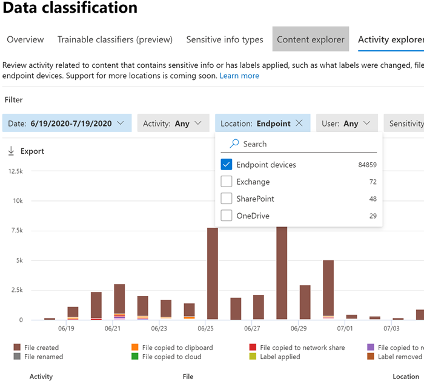

# Introducción a la prevención de pérdida de datos de Endpoint (versión preliminar)Get started with Endpoint data loss prevention (preview)

La prevención de pérdida de datos de Microsoft Endpoint (Endpoint DLP) es parte de la serie de características de prevención de pérdida de datos (DLP) de Microsoft 365 que se pueden usar para detectar y proteger elementos confidenciales en los servicios de Microsoft 365.Microsoft Endpoint data loss prevention (Endpoint DLP) is part of the Microsoft 365 data loss prevention (DLP) suite of features you can use to discover and protect sensitive items across Microsoft 365 services. Para obtener más información sobre las ofertas de DLP de Microsoft, consulte [Información general sobre la prevención de pérdida de datos](data-loss-prevention-policies.md).For more information about all of Microsoft’s DLP offerings, see [Overview of data loss prevention](data-loss-prevention-policies.md). Para obtener más información sobre la DLP de Endpoint, consulte [Obtener más información sobre la prevención de pérdida de datos de Endpoint (versión preliminar)](endpoint-dlp-learn-about.md)To learn more about Endpoint DLP, see [Learn about Endpoint data loss prevention (preview)](endpoint-dlp-learn-about.md)

Microsoft Endpoint DLP le permite supervisar dispositivos con Windows 10 y detectar cuándo se usan y comparten elementos confidenciales.Microsoft Endpoint DLP allows you to monitor Windows 10 devices and detect when sensitive items are used and shared. Esto le proporciona la visibilidad y el control que necesita para asegurarse de que se usan y protegen correctamente, así como para ayudar a evitar algún comportamiento peligroso que podría comprometerlos.This gives you the visibility and control you need to ensure that they are used and protected properly, and to help prevent risky behavior that might compromise them.

## Antes de empezarBefore you begin

### Licencias de SKU/suscripcionesSKU/subscriptions licensing

Antes de empezar con Endpoint DLP, debe confirmar la [Suscripción a Microsoft 365](https://www.microsoft.com/microsoft-365/compare-microsoft-365-enterprise-plans?rtc=1) y cualquier complemento.Before you get started with Endpoint DLP, you should confirm your [Microsoft 365 subscription](https://www.microsoft.com/microsoft-365/compare-microsoft-365-enterprise-plans?rtc=1) and any add-ons. Para acceder y usar la funcionalidad Endpoint DLP, debe tener una de estas suscripciones o complementos.To access and use Endpoint DLP functionality, you must have one of these subscriptions or add-ons.

- Microsoft 365 E5Microsoft 365 E5
- Microsoft 365 A5 (EDU)Microsoft 365 A5 (EDU)
- Cumplimiento de Microsoft 365 E5Microsoft 365 E5 compliance
- Cumplimiento de Microsoft 365 A5Microsoft 365 A5 compliance
- Gobierno y protección de información de Microsoft 365 E5Microsoft 365 E5 information protection and governance
- Gobierno y protección de información de Microsoft 365 A5Microsoft 365 A5 information protection and governance

### PermisosPermissions

Para habilitar la administración de dispositivos, la cuenta que use debe pertenecer a uno de los siguientes roles:To enable device management, the account you use must be a member of any one of these roles:

- Administrador globalGlobal admin
- Administrador de seguridadSecurity admin
- Administrador de cumplimientoCompliance admin

Si desea usar una cuenta personalizada para ver la configuración de administración de dispositivos, debe tener uno de estos roles:If you want to use a custom account to view the device management settings, it must be in one of these roles:

- Administrador globalGlobal admin
- Administrador de cumplimientoCompliance admin
- Administrador de datos de cumplimientoCompliance data admin
- Lector globalGlobal reader

Si desea usar una cuenta personalizada para acceder a la página de incorporación y baja, debe tener uno de estos roles:If you want to use a custom account to access the onboarding/offboarding page, it must be in one of these roles:

- Administrador globalGlobal admin
- Administrador de cumplimientoCompliance admin

Si desea usar una cuenta personalizada para activar o desactivar la supervisión de dispositivos, debe tener uno de estos roles:If you want to use a custom account to turn on/off device monitoring, it must be in one of these roles:

- Administrador globalGlobal admin
- Administrador de cumplimientoCompliance admin

Los datos de Endpoint DLP se pueden ver en el [Explorador de actividad](data-classification-activity-explorer.md).Data from Endpoint DLP can be viewed in [Activity explorer](data-classification-activity-explorer.md). Hay cuatro roles que conceden permisos al explorador de actividad; la cuenta que use para acceder a los datos debe pertenecer a uno de ellos.There are four roles that grant permission to activity explorer, the account you use for accessing the data must be a member of any one of them.

- Administrador globalGlobal admin
- Administrador de cumplimientoCompliance admin
- Administrador de seguridadSecurity admin
- Administrador de datos de cumplimientoCompliance data admin

### Preparar los puntos de conexiónPrepare your endpoints

Asegúrese de que los dispositivos con Windows 10 en los que planee implementar Endpoint DLP cumplan los siguientes requisitos.Make sure that the Windows 10 devices that you plan on deploying Endpoint DLP to meet these requirements.

1. Debe estar ejecutando Windows 10 compilación 1809 o superior.Must be running Windows 10 build 1809 or up.
2. Todos los dispositivos deben estar [unidos a Azure Active Directory (AAD)](https://docs.microsoft.com/azure/active-directory/devices/concept-azure-ad-join) o unidos a Azure AD híbrido.All devices must be [Azure Active Directory (AAD) joined](https://docs.microsoft.com/azure/active-directory/devices/concept-azure-ad-join), or Hybrid Azure AD joined.
3. Instale el explorador Chromium Edge de Microsoft en el dispositivo del punto de conexión para aplicar acciones de directiva para la actividad de cargar en la nube.Install Microsoft Chromium Edge browser on the endpoint device to enforce policy actions for the the upload to cloud activity. Consulte [Descargar el nuevo Microsoft Edge basado en Chromium](https://support.microsoft.com/help/4501095/download-the-new-microsoft-edge-based-on-chromium).See, [Download the new Microsoft Edge based on Chromium](https://support.microsoft.com/help/4501095/download-the-new-microsoft-edge-based-on-chromium).

## Incorporación de dispositivos a la administración de dispositivosOnboarding devices into device management

 Para poder supervisar y proteger los elementos confidenciales de un dispositivo, es necesario que habilite la supervisión del dispositivo y que incorpore los puntos de conexión.You must enable device monitoring and onboard your endpoints before you can monitor and protect sensitive items on a device. Ambas acciones se realizan en el portal de cumplimiento de Microsoft 365.Both of these actions are done in the Microsoft 365 Compliance portal.

Cuando quiera incorporar dispositivos que todavía no hayan sido incorporados, descargue el script apropiado y, luego, impleméntelo en esos dispositivos.When you want to onboard devices that haven't been onboarded yet, you'll download the appropriate script and deploy it to those devices. Siga los pasos del [Procedimiento de incorporación de dispositivos](endpoint-dlp-getting-started.md#onboarding-devices).Follow the [Onboarding devices procedure](endpoint-dlp-getting-started.md#onboarding-devices).

Si ya tiene dispositivos incorporados en [Protección contra amenazas avanzada de Microsoft Defender (MDATP)](https://docs.microsoft.com/windows/security/threat-protection/), aparecerán ya en la lista de dispositivos administrados.If you already have devices onboarded into [Microsoft Defender Advanced Threat Protection (MDATP)](https://docs.microsoft.com/windows/security/threat-protection/), they will already appear in the managed devices list. Siga el [Procedimiento para dispositivos incorporados en MDATP](endpoint-dlp-getting-started.md#with-devices-onboarded-into-mdatp).Follow the [With devices onboarded into MDATP procedure](endpoint-dlp-getting-started.md#with-devices-onboarded-into-mdatp).

### Incorporación de dispositivosOnboarding devices

En este escenario de implementación, incorporará dispositivos que aún no hayan sido incorporados y, además, solo quiere supervisar y proteger elementos confidenciales frente al uso compartido no intencionado en dispositivos con Windows 10.In this deployment scenario, you'll onboard devices that have not been onboarded yet, and you just want to monitor and protect sensitive items from unintentional sharing on Windows 10 devices.

1. Abra el [Centro de cumplimiento de Microsoft](https://compliance.microsoft.com).Open the [Microsoft compliance center](https://compliance.microsoft.com).
2. Abra la página de configuración del Centro de cumplimiento y elija **Incorporar dispositivos**.Open the Compliance Center settings page and choose **Onboard devices**. 

   

   > [!NOTE]
   > Aunque, por lo general, habilitar la incorporación de dispositivos tarda aproximadamente 60 segundos, espere 30 minutos antes de ponerse en contacto con el soporte técnico de Microsoft.While it usually takes about 60 seconds for device onboarding to be enabled, please allow up to 30 minutes before engaging with Microsoft    support.

3. Elija **Administración de dispositivos** para abrir la lista de **Dispositivos**.Choose **Device management** to open the **Devices** list. La lista estará vacía hasta que haya incorporado dispositivos.The list will be empty until you onboard devices.
4. Elija **Incorporación** para iniciar el proceso de incorporación.Choose **Onboarding** to begin the onboarding process.
5. Elija el modo en que desea implementar estos dispositivos adicionales de la lista **Método de implementación** y, después, **Descargar paquete**.Choose the way you want to deploy to these additional devices from the **Deployment method** list and then **download package**.

   
6. Siga los procedimientos adecuados que puede consultar en [Herramientas y métodos de incorporación para equipos con Windows 10](https://docs.microsoft.com/windows/security/threat-protection/microsoft-defender-atp/configure-endpoints).Follow the appropriate procedures in [Onboarding tools and methods for Windows 10 machines](https://docs.microsoft.com/windows/security/threat-protection/microsoft-defender-atp/configure-endpoints). Este vínculo le lleva a una página de destino en la que puede acceder a los procedimientos de MDATP que coinciden con el paquete de implementación que seleccionó en el paso 5:This link take you to a landing page where you can access MDATP procedures that match the deployment package you selected in step 5:
    - Incorporar equipos con Windows 10 usando Directiva de grupoOnboard Windows 10 machines using Group Policy
    - Incorporar equipos con Windows con Microsoft Endpoint Configuration ManagerOnboard Windows machines using Microsoft Endpoint Configuration Manager
    - Incorporar equipos con Windows 10 con herramientas de administración de dispositivos móvilesOnboard Windows 10 machines using Mobile Device Management tools
    - Incorporar equipos con Windows 10 usando un script localOnboard Windows 10 machines using a local script
    - Incorporar equipos de infraestructura de escritorio virtual no persistente (VDI).Onboard non-persistent virtual desktop infrastructure (VDI) machines.

Una vez que se haya incorporado el punto de conexión, debería estar visible en la lista de dispositivos y también empezar a informar de los registros de actividad de auditoría al explorador de actividad.Once done and endpoint is onboarded, it should be visible in the devices list and also start reporting audit activity logs to Activity explorer.

> [!NOTE]
> Esta experiencia requiere la aplicación de una licencia.This experience is under license enforcement. Sin la licencia necesaria, los datos no serán visibles ni accesibles.Without the required license, data will not be visible or accessible.

### Para dispositivos incorporados en MDATPWith devices onboarded into MDATP

En este escenario, MDATP ya está implementada y existen puntos de conexión de los que se informa.In this scenario, MDATP is already deployed and there are endpoints reporting in. Todos estos puntos de conexión aparecerán en la lista de dispositivos administrados.All these endpoints will appear in the managed devices list. Puede seguir incorporando nuevos dispositivos a Endpoint DLP para ampliar la cobertura siguiendo el [Procedimiento de incorporación de dispositivos](endpoint-dlp-getting-started.md#onboarding-devices).You can continue to onboard new devices into Endpoint DLP to expand coverage by using the [Onboarding devices procedure](endpoint-dlp-getting-started.md#onboarding-devices).

1. Abra el [Centro de cumplimiento de Microsoft](https://compliance.microsoft.com).Open the [Microsoft compliance center](https://compliance.microsoft.com).
2. Abra la página de configuración del Centro de cumplimiento y elija **Habilitar supervisión de dispositivos**.Open the Compliance Center settings page and choose **Enable device monitoring**.
3. Elija **Administración de dispositivos** para abrir la lista de **Dispositivos**.Choose **Device management** to open the **Devices** list. Debe ver la lista de dispositivos sobre los que ya se envían informes a MDATP.You should see the list of devices that are already reporting in to MDATP. 
4. Elija **Incorporación** si necesita incorporar dispositivos adicionales.Choose **Onboarding** if you need to onboard additional devices.
5. Elija el modo en que desea implementar estos dispositivos adicionales de la lista **Método de implementación** y, después, **Descargar paquete**.Choose the way you want to deploy to these additional devices from the **Deployment method** list and then **Download package**.
6. Siga los procedimientos adecuados que puede consultar en [Herramientas y métodos de incorporación para equipos con Windows 10](https://docs.microsoft.com/windows/security/threat-protection/microsoft-defender-atp/configure-endpoints).Follow the appropriate procedures in [Onboarding tools and methods for Windows 10 machines](https://docs.microsoft.com/windows/security/threat-protection/microsoft-defender-atp/configure-endpoints). Este vínculo le lleva a una página de destino en la que puede acceder a los procedimientos de MDATP que coinciden con el paquete de implementación que seleccionó en el paso 5:This link take you to a landing page where you can access MDATP procedures that match the deployment package you selected in step 5:
    - Incorporar equipos con Windows 10 usando Directiva de grupoOnboard Windows 10 machines using Group Policy
    - Incorporar equipos con Windows con Microsoft Endpoint Configuration ManagerOnboard Windows machines using Microsoft Endpoint Configuration Manager
    - Incorporar equipos con Windows 10 con herramientas de administración de dispositivos móvilesOnboard Windows 10 machines using Mobile Device Management tools
    - Incorporar equipos con Windows 10 usando un script localOnboard Windows 10 machines using a local script
    - Incorporar equipos de infraestructura de escritorio virtual no persistente (VDI).Onboard non-persistent virtual desktop infrastructure (VDI) machines.

Una vez que se haya incorporado el punto de conexión, debería estar visible en la tabla **Dispositivos** y también empezar a informar de los registros de auditoría al **Explorador de actividad**.Once done and endpoint is onboarded, it should be visible under the **Devices** table and also start reporting audit logs to the **Activity Explorer**.

> [!NOTE]
>Esta experiencia requiere la aplicación de una licencia.This experience is under license enforcement. Sin la licencia necesaria, los datos no serán visibles ni accesibles.Without the required license, data will not be visible or accessible.

### Visualizar datos de Endpoint DLP en el explorador de actividadViewing Endpoint DLP data in activity explorer

1. Abra la [Página clasificación de datos](https://compliance.microsoft.com/dataclassification?viewid=overview) del dominio en el Centro de cumplimiento de Microsoft 365 y elija Explorador de actividad.Open the [Data classification page](https://compliance.microsoft.com/dataclassification?viewid=overview) for your domain in the Microsoft 365 Compliance center and choose Activity explorer.
2. Consulte los procedimientos descritos en [Introducción al explorador de actividad](data-classification-activity-explorer.md) para tener acceso a todos los datos de los dispositivos con Endpoint y filtrarlos.Refer to the procedures in [Get started with Activity explorer](data-classification-activity-explorer.md) to access and filter all the data for your Endpoint devices.

## Pasos siguientesNext steps
Ahora que tiene dispositivos incorporados y puede ver los datos de la actividad en el explorador de actividad, está listo para realizar el siguiente paso, donde puede crear directivas DLP que protegen los elementos confidenciales.Now that you have onboarded devices and can view the activity data in Activity explorer, you are ready to move on to your next step where you create DLP policies that protect your sensitive items.

- [Uso de la prevención de pérdida de datos de Endpoint (versión preliminar)Using Endpoint data loss prevention (preview)](endpoint-dlp-using.md)

## Consulte tambiénSee also

- [Obtenga más información sobre la prevención de pérdida de datos de Endpoint (versión preliminar)Learn about Endpoint data loss prevention (preview)](endpoint-dlp-learn-about.md)
- [Uso de la prevención de pérdida de datos de Endpoint (versión preliminar)Using Endpoint data loss prevention (preview)](endpoint-dlp-using.md)
- [Información general sobre la prevención de pérdida de datosOverview of data loss prevention](data-loss-prevention-policies.md)
- [Crear, probar y optimizar una directiva DLPCreate, test, and tune a DLP policy](create-test-tune-dlp-policy.md)
- [Introducción al explorador de actividadGet started with Activity explorer](data-classification-activity-explorer.md)
- [Protección contra amenazas avanzada de Microsoft Defender (ATP de Microsoft Defender)Microsoft Defender Advanced Threat Protection (Microsoft Defender ATP)](https://docs.microsoft.com/windows/security/threat-protection/)
- [Herramientas y métodos de incorporación para equipos con Windows 10](https://docs.microsoft.com/windows/security/threat-protection/microsoft-defender-atp/configure-endpoints).[Onboarding tools and methods for Windows 10 machines](https://docs.microsoft.com/windows/security/threat-protection/microsoft-defender-atp/configure-endpoints)
- [Suscripción a Microsoft 365Microsoft 365 subscription](https://www.microsoft.com/microsoft-365/compare-microsoft-365-enterprise-plans?rtc=1)
- [Unido a Azure Active Directory (AAD)Azure Active Directory (AAD) joined](https://docs.microsoft.com/azure/active-directory/devices/concept-azure-ad-join)
- [Descargar el nuevo Microsoft Edge basado en ChromiumDownload the new Microsoft Edge based on Chromium](https://support.microsoft.com/help/4501095/download-the-new-microsoft-edge-based-on-chromium)
