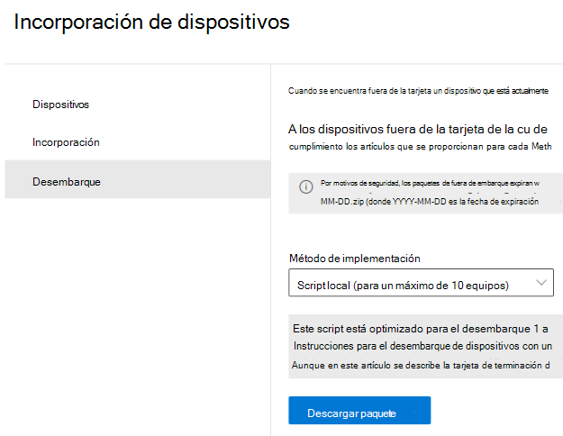
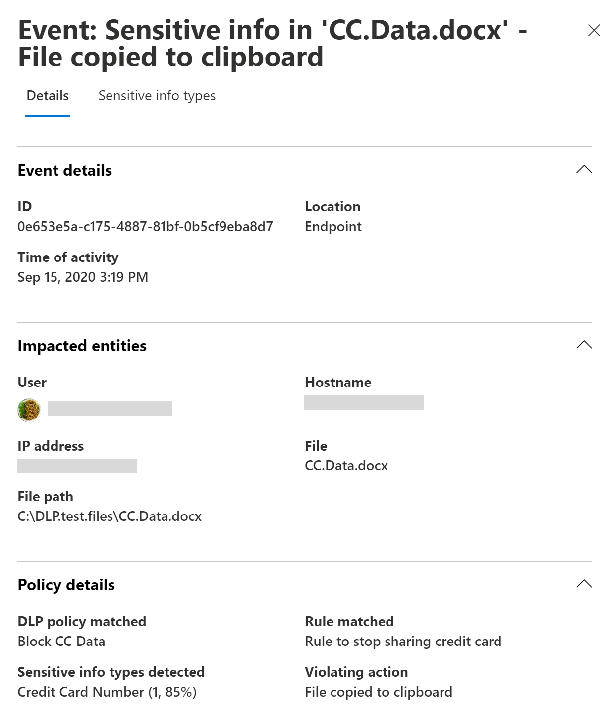
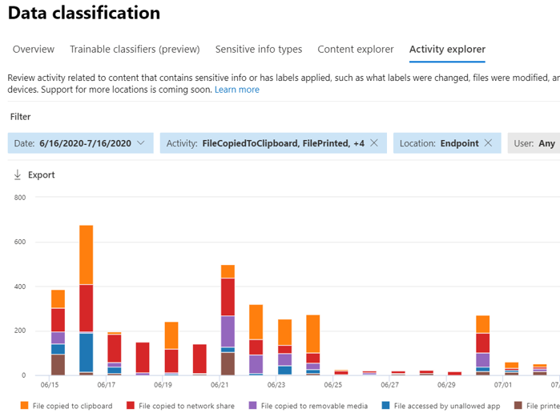

# Obtenga más información sobre la prevención de pérdida de datos de Microsoft 365 de punto de conexiónLearn about Microsoft 365 Endpoint data loss prevention

Puede usar la prevención de pérdida de datos (DLP) de Microsoft 365 para supervisar las acciones que se realizan en elementos que ha determinado que son confidenciales y para ayudar a evitar el uso compartido accidental de estos elementos.You can use Microsoft 365 data loss prevention (DLP) to monitor the actions that are being taken on items you've determined to be sensitive and to help prevent the unintentional sharing of those items. Para más información sobre DLP en punto de conexión de Microsoft, consulte [Obtenga más información acerca de la prevención contra la pérdida de datos](dlp-learn-about-dlp.md).For more information on DLP, see [Learn about data loss prevention](dlp-learn-about-dlp.md).

**La prevención de pérdida de datos en punto de conexión** (Endpoint DLP) amplía la supervisión de la actividad y las capacidades de protección de DLP a elementos confidenciales que estén en dispositivos con Windows 10.**Endpoint data loss prevention** (Endpoint DLP) extends the activity monitoring and protection capabilities of DLP to sensitive items that are on Windows 10 devices. Una vez que los dispositivos están incorporados en las soluciones del Centro de cumplimiento de Microsoft 365, la información sobre las acciones de los usuarios relacionadas con los elementos confidenciales se hace visible en el[explorador de actividades](data-classification-activity-explorer.md), y se pueden aplicar acciones de protección a estos elementos mediante [directivas DLP](create-test-tune-dlp-policy.md).Once devices are onboarded into the Microsoft 365 compliance solutions, the information about what users are doing with sensitive items is made visible in [activity explorer](data-classification-activity-explorer.md) and you can enforce protective actions on those items via [DLP policies](create-test-tune-dlp-policy.md).

> [!TIP]
> Si está buscando el control de dispositivos para el almacenamiento extraíble, consulte [Control de dispositivo de Microsoft Defender para punto de conexión extraíble en el control de acceso de almacenamiento](../security/defender-endpoint/device-control-removable-storage-access-control.md#microsoft-defender-for-endpoint-device-control-removable-storage-access-control).If you are looking for device control for removable storage, see [Microsoft Defender for Endpoint Device Control Removable Storage Access Control](../security/defender-endpoint/device-control-removable-storage-access-control.md#microsoft-defender-for-endpoint-device-control-removable-storage-access-control).

## Actividades en punto de conexión que puede supervisar y sobre las que puede tomar medidasEndpoint activities you can monitor and take action on

DLP en punto de conexión de Microsoft le permite auditar y administrar los siguientes tipos de actividades que los usuarios llevan a cabo en elementos confidenciales de los dispositivos que ejecutan Windows 10.Microsoft Endpoint DLP enables you to audit and manage the following types of activities users take on sensitive items on devices running Windows 10.

|ActividadActivity |DescripciónDescription  | Auditable/RestringibleAuditable/restictable|
|---------|---------|---------|
|cargar en el servicio en la nube o acceso por exploradores no permitidosupload to cloud service, or access by unallowed browsers    | Detecta cuándo un usuario intenta cargar un elemento en un dominio de servicio restringido o tener acceso a un elemento con un explorador.Detects when a user attempts to upload an item to a restricted service domain or access an item through a browser.  Si usa un explorador que se muestra en DLP como un explorador que no es el permitido, la actividad de carga se bloqueará y se redirigirá al usuario para usar la arista de cromo.If they are using a browser that is listed in DLP as an being an unallowed browser, the upload activity will be blocked and the user is redirected to use Edge Chromium. Por último, cromo puede permitir o bloquear la carga o el acceso en función de la configuración de la Directiva DLP.Edge Chromium will then either allow or block the upload or access based on the DLP policy configuration         |auditable y restringibleauditable and restrictable|
|copiar a otra aplicacióncopy to other app    |Se detecta cuando un usuario intenta copiar información de un elemento protegido y, a continuación, lo pega en otra aplicación, proceso o elemento.Detects when a user attempts to copy information from a protected item and then paste it into another app, process or item. Esta actividad no detecta la copia y el pegado de información dentro de la misma aplicación, proceso o elemento.Copying and pasting information within the same app, process, or item is not detected by this activity.         | auditable y restringibleauditable and restrictable|
|copiar en un medio extraíble USBcopy to USB removable media |Detecta cuando un usuario intenta copiar un elemento o información en un medio extraíble o un dispositivo USB.Detects when a user attempts to copy an item or information to removable media or USB device.         | auditable y restringibleauditable and restrictable|
|Copiar en un recurso compartido de redcopy to a network share    |Detecta cuando un usuario intenta copiar un elemento en un recurso compartido de red o en una unidad de red asignadaDetects when a user attempts to copy an item to a network share or mapped network drive         |auditable y restringibleauditable and restrictable|
|imprimir un documentoprint a document    |Detecta cuando un usuario intenta imprimir un elemento protegido en una impresora local o de red.Detects when a user attempts to print a protected item to a local or network printer.| auditable y restringibleauditable and restrictable         |
|copiar a una sesión remotacopy to a remote session|Detecta cuando un usuario intenta copiar un elemento a una sesión de escritorio remotoDetects when a user attempts to copy an item to a remote desktop session |  auditable y restringibleauditable and restrictable|
|copiar en un dispositivo Bluetoothcopy to a Bluetooth device|Detecta cuando un usuario intenta copiar un elemento en una aplicación Bluetooth no permitida (según se define en la lista de aplicaciones de Bluetooth no permitidas en la configuración del punto de conexión DLP).Detects when a user attempts to copy an item to an unallowed Bluetooth app (as defined in the list of unallowed Bluetooth aps in Endpoint DLP settings).| auditable y restringibleauditable and restrictable|
|crear un elementocreate an item|Detecta cuándo un usuario crea un elementoDetects when a user creates an item| auditableauditable|
|cambiar el nombre de un elementorename an item|Detecta cuando un usuario cambia el nombre de un elementoDetects when a user renames an item| auditableauditable|

## Archivos supervisadosMonitored files

La DLP en punto de conexión admite la supervisión de estos tipos de archivo:Endpoint DLP supports monitoring of these file types:

- archivos de WordWord files
- archivos de PowerPointPowerPoint files
- archivos de ExcelExcel files
- archivos PDFPDF files
- archivos .csv.csv files
- archivos .tsv.tsv files
- archivos .txt.txt files
- archivos .rtf.rtf files
- archivos .c.c files
- archivos .class.class files
- archivos .cpp.cpp files
- archivos .cs.cs files
- archivos .h.h files
- archivos .java.java files

De forma predeterminada, la DLP en punto de conexión audita las actividades para estos tipos de archivo, incluso si no hay una coincidencia de directiva.By default, endpoint DLP audits the activities for these file types, even if there isn't a policy match. Si solo quiere supervisar los datos de las coincidencias de directivas, puede desactivar **Auditar siempre para la actividad de archivos de los dispositivos** en la configuración global de DLP en punto de conexión.If you only want monitoring data from policy matches, you can turn off the **Always audit file activity for devices** in the endpoint DLP global settings. Si esta configuración está instalada, las actividades de cualquier archivo Word, PowerPoint, Excel, PDF y .csv siempre se auditan, incluso si el dispositivo no está dirigido por ninguna directiva.If this setting is on, activities on any Word, PowerPoint, Excel, PDF, and .csv file are always audited even if the device is not targeted by any policy.

DLP en punto de conexión supervisa la actividad basada en un tipo de extensiones multipropósito de correo Internet (MIME), por lo que las actividades se capturan incluso si se cambia la extensión de archivo.Endpoint DLP monitors activity-based on MIME type, so activities will be captured even if the file extension is changed.

## ¿Qué es diferente en DLP en punto de conexión?What's different in Endpoint DLP

Debe tener en cuenta algunos conceptos adicionales antes de profundizar en DLP en punto de conexión.There are a few extra concepts that you need to be aware of before you dig into Endpoint DLP.

### Habilitar la administración de dispositivosEnabling Device management

La administración de dispositivos es la funcionalidad que permite la colección de telemetría desde dispositivos y la incluye en las soluciones de cumplimiento de Microsoft 365 como DLP en punto de conexión y la [administración de riesgos internos](insider-risk-management.md).Device management is the functionality that enables the collection of telemetry from devices and brings it into Microsoft 365 compliance solutions like Endpoint DLP and [Insider Risk management](insider-risk-management.md). Necesitará incorporar todos los dispositivos que quiera usar como ubicaciones en directivas DLP.You'll need to onboard all devices you want to use as locations in DLP policies.

> [!div class="mx-imgBorder"]
> 

La incorporación y la retirada se controlan mediante scripts que se descargan desde el centro de administración de dispositivos.Onboarding and offboarding are handled via scripts you download from the Device management center. El centro tiene scripts personalizados para cada uno de estos métodos de implementación:The center has custom scripts for each of these deployment methods:

- script local (hasta 10 equipos)local script (up to 10 machines)
- Directiva de grupoGroup policy
- System Center Configuration Manager (versión 1610 o posterior)System Center Configuration Manager (version 1610 or later)
- Administración de dispositivos móviles/Microsoft IntuneMobile Device Management/Microsoft Intune
- Scripts de incorporación de VDI para equipos no persistentesVDI onboarding scripts for non-persistent machines

> [!div class="mx-imgBorder"]
> 

 Use los procedimientos descritos en [Introducción a DLP en punto de conexión de Microsoft 365](endpoint-dlp-getting-started.md) para incorporar dispositivos.Use the procedures in [Getting started with Microsoft 365 Endpoint DLP](endpoint-dlp-getting-started.md) to onboard devices.

Si incorporó dispositivos a través de [Protección contra amenazas avanzada de Microsoft Defender](/windows/security/threat-protection/), estos dispositivos se mostrarán automáticamente en la lista de dispositivos.If you have onboarded devices through [Microsoft Defender for Endpoint](/windows/security/threat-protection/), those devices will automatically show up in the list of devices.

> [!div class="mx-imgBorder"]
> 

### Visualizar datos de DLP en punto de conexiónViewing Endpoint DLP data

Puede ver las alertas relacionadas con las directivas DLP ejecutadas en los dispositivos de punto de conexión si va al [Panel de administración de alertas de DLP](dlp-configure-view-alerts-policies.md).You can view alerts related to DLP policies enforced on endpoint devices by going to the [DLP Alerts Management Dashboard](dlp-configure-view-alerts-policies.md).

> [!div class="mx-imgBorder"]
> 

También puede ver los detalles del evento asociado con metadatos enriquecidos en el mismo panelYou can also view details of the associated event with rich metadata in the same dashboard

> [!div class="mx-imgBorder"]
> 

Una vez que se incorpora un dispositivo, la información sobre las actividades auditadas fluye al explorador de actividad, incluso antes de que configure e implemente las directivas DLP que tienen dispositivos como ubicación.Once a device is onboarded, information about audited activities flows into Activity explorer even before you configure and deploy any DLP policies that have devices as a location.

> [!div class="mx-imgBorder"]
> 

DLP en punto de conexión recopila información exhaustiva sobre la actividad auditada.Endpoint DLP collects extensive information on audited activity.

Por ejemplo, si se copia un archivo a un medio USB extraíble, vería estos atributos en los detalles de actividad:For example, if a file is copied to removable USB media, you'd see these attributes in the activity details:

- tipo de actividadactivity type
- IP del clienteclient IP
- ruta de acceso del archivo de destinotarget file path
- ocurrió una marca de tiempohappened timestamp
- nombre de archivofile name
- usuariouser
- extensión de archivofile extension
- tamaño de archivofile size
- tipo de información confidencial (si corresponde)sensitive information type (if applicable)
- valor sha1sha1 value
- valor sha256sha256 value
- nombre de archivo anteriorprevious file name
- ubicaciónlocation
- primarioparent
- ruta de acceso al archivofilepath
- tipo de ubicación de origensource location type
- plataformaplatform
- nombre de dispositivodevice name
- tipo de ubicación de destinodestination location type
- aplicación que realizó la copiaapplication that performed the copy
- Id. de dispositivo de Microsoft Defender para punto de conexión (si corresponde)Microsoft Defender for Endpoint device ID (if applicable)
- fabricante del dispositivo multimedia extraíbleremovable media device manufacturer
- modelo del dispositivo multimedia extraíbleremovable media device model
- número de serie del dispositivo multimedia extraíbleremovable media device serial number

> [!div class="mx-imgBorder"]
> 

## Pasos siguientesNext steps

Ahora que ya conoce DLP en punto de conexión, estos son los pasos siguientes:Now that you've learned about Endpoint DLP, your next steps are:

1. [Introducción a la prevención de pérdida de datos en punto de conexión de MicrosoftGetting started with Microsoft Endpoint data loss prevention](endpoint-dlp-getting-started.md)
2. [Uso de la prevención de pérdida de datos en punto de conexión de MicrosoftUsing Microsoft Endpoint data loss prevention](endpoint-dlp-using.md)

## Consulte tambiénSee also

- [Introducción a la prevención de pérdida de datos en punto de conexión de MicrosoftGetting started with Microsoft Endpoint data loss prevention](endpoint-dlp-getting-started.md)
- [Uso de la prevención de pérdida de datos en punto de conexión de MicrosoftUsing Microsoft Endpoint data loss prevention](endpoint-dlp-using.md)
- [Obtenga más información acerca de la prevención contra la pérdida de datosLearn about data loss prevention](dlp-learn-about-dlp.md)
- [Crear, probar y optimizar una directiva DLPCreate, test, and tune a DLP policy](create-test-tune-dlp-policy.md)
- [Introducción al explorador de actividadGet started with Activity explorer](data-classification-activity-explorer.md)
- [Microsoft Defender para punto de conexiónMicrosoft Defender for Endpoint](/windows/security/threat-protection/)
- [Administración de riesgos internosInsider Risk management](insider-risk-management.md)
