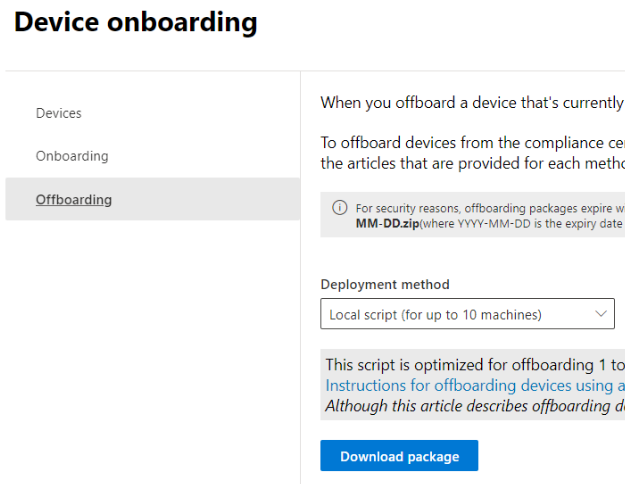

# Obtener información sobre la Prevención de pérdida de datos en punto de conexión

[!include[Purview banner](../includes/purview-rebrand-banner.md)]

Puede usar la prevención de pérdida de datos (DLP) de Microsoft Purview para supervisar las acciones que se realizan en los elementos que ha determinado que son confidenciales y para ayudar a evitar el uso compartido involuntario de esos elementos. Para más información sobre la DLP, vea [Obtener información sobre la prevención de pérdida de datos](dlp-learn-about-dlp.md).

**La Prevención de pérdida de datos en puntos finales** (DLP para punto de conexión) amplía las capacidades de supervisión y protección de la actividad de DLP a los elementos sensibles almacenados físicamente en dispositivos Windows 10, Windows 11 y macOS (Catalina 10.15 y superior). Una vez que los dispositivos están incorporados en las soluciones del Centro de cumplimiento de Microsoft Purview, la información sobre las acciones de los usuarios relacionadas con los elementos confidenciales se hace visible en el [explorador de actividades](data-classification-activity-explorer.md), y se pueden aplicar acciones de protección a estos elementos mediante [directivas DLP](create-test-tune-dlp-policy.md).

> [!TIP]
> Si está buscando el control de dispositivos para el almacenamiento extraíble, consulte [Control de dispositivo de Microsoft Defender para punto de conexión extraíble en el control de acceso de almacenamiento](../security/defender-endpoint/device-control-removable-storage-access-control.md#microsoft-defender-for-endpoint-device-control-removable-storage-access-control).

> [!NOTE]
> En Microsoft Purview, la evaluación de directivas DLP de elementos confidenciales se produce de forma centralizada, por lo que no hay retraso temporal para que las directivas y las actualizaciones de las directivas se distribuyan a dispositivos individuales. Cuando una directiva se actualiza en el centro de cumplimiento, tarda aproximadamente una hora en sincronizarse en todo el servicio. Una vez sincronizadas las actualizaciones de directivas, los elementos de los dispositivos de destino se vuelven a evaluar automáticamente la próxima vez que se accede a ellos o se modifican.

## Actividades en punto de conexión que puede supervisar y sobre las que puede tomar medidas

DLP en punto de conexión permite auditar y administrar los siguientes tipos de actividades que los usuarios realizan en elementos confidenciales almacenados físicamente en dispositivos Windows 10, Windows 11 y macOS.

|Actividad |Descripción  |Windows 10 1809 y versiones posteriores/Windows 11| macOS Catalina 10.15| Auditable/restringible|
|---------|---------|---------|---------|---------|
|cargar en el servicio en la nube o acceso por exploradores no permitidos    | Detecta cuándo un usuario intenta cargar un elemento en un dominio de servicio restringido o tener acceso a un elemento con un explorador.  Si usa un explorador que se muestra en DLP como un explorador que no es el permitido, la actividad de carga se bloqueará y se redirigirá al usuario para usar la arista de Microsoft Edge. Por último, Microsoft Edge puede permitir o bloquear la carga o el acceso en función de la configuración de la directiva DLP.         |compatible | compatible|auditable y restringible|
|copiar a otra aplicación    |Se detecta cuando un usuario intenta copiar información de un elemento protegido y, a continuación, lo pega en otra aplicación, proceso o elemento. Esta actividad no detecta la copia y el pegado de información dentro de la misma aplicación, proceso o elemento.|compatible|compatible         | auditable y restringible|
|copiar en un medio extraíble USB |Detecta cuando un usuario intenta copiar un elemento o información en un medio extraíble o un dispositivo USB.|compatible|compatible         | auditable y restringible|
|Copiar en un recurso compartido de red    |Detecta cuando un usuario intenta copiar un elemento en un recurso compartido de red o en una unidad de red asignada |compatible|compatible         |auditable y restringible|
|imprimir un documento    |Detecta cuando un usuario intenta imprimir un elemento protegido en una impresora local o de red.|compatible|compatible|auditable y restringible         |
|copiar a una sesión remota|Detecta cuando un usuario intenta copiar un elemento a una sesión de escritorio remoto |compatible|no compatible|  auditable y restringible|
|copiar en un dispositivo Bluetooth|Detecta cuando un usuario intenta copiar un elemento en una aplicación Bluetooth no permitida (según se define en la lista de aplicaciones de Bluetooth no permitidas en la configuración del punto de conexión DLP).|compatible|no compatible| auditable y restringible|
|crear un elemento|Detecta cuándo un usuario crea un elemento|compatible | |auditable|
|cambiar el nombre de un elemento|Detecta cuando un usuario cambia el nombre de un elemento|compatible | |auditable|

## Procedimiento recomendado para directivas DLP de punto de conexión

Supongamos que quiere bloquear todos los elementos que contengan números de tarjetas de crédito para que no salgan de los puntos de conexión de los usuarios del departamento de finanzas. Se recomienda:

- Cree una directiva y aplíquela a los puntos finales y a ese grupo de usuarios.
- Cree una regla en la directiva que detecte el tipo de información que desea proteger. En este caso, el **contenido contiene** la configuración *Tipo de información confidencial** y seleccione **Tarjeta de crédito**.
- Establezca las acciones de cada actividad en **Bloquear**.

Vea, [Diseñar una directiva de prevención de pérdida de datos](dlp-policy-design.md) para obtener más instrucciones sobre el diseño de las directivas de prevención de la pérdida de datos.

## Archivos supervisados

La DLP en punto de conexión admite la supervisión de estos tipos de archivo. La DLP en punto de conexión audita las actividades para estos tipos de archivo, incluso si no hay una coincidencia de directiva. 

- archivos de Word
- archivos de PowerPoint
- archivos de Excel
- archivos PDF
- archivos .csv
- archivos .tsv
- archivos .txt
- archivos .rtf
- archivos .c
- archivos .class
- archivos .cpp
- archivos .cs
- archivos .h
- archivos .java
 
Si solo quiere supervisar los datos de las coincidencias de directivas, puede desactivar **Auditar siempre para la actividad de archivos de los dispositivos** en la configuración global de DLP en punto de conexión.

> [!NOTE]
> Si la configuración **Auditar siempre la actividad de archivos para dispositivos** está instalada, las actividades de cualquier archivo Word, PowerPoint, Excel, PDF y .csv siempre se auditan, incluso si el dispositivo no está dirigido por ninguna directiva.

> [!TIP]
> Para asegurarse de que las actividades se auditan para todos los tipos de archivo admitidos, cree una [ directiva DLP personalizada](create-test-tune-dlp-policy.md).

DLP en punto de conexión supervisa la actividad basada en un tipo de extensiones multipropósito de correo Internet (MIME), por lo que las actividades se capturan incluso si se cambia la extensión de archivo.

### Tipos de archivo

Los tipos de archivo son una agrupación de formatos de archivo que se usan para proteger flujos de trabajo o áreas de negocio específicos. Puede usar uno o varios tipos de archivo como condiciones en las directivas DLP.

|Tipo de archivo |Aplicación  |extensiones de archivo supervisadas  |
|---------|---------|---------|
|procesamiento de texto |Word, PDF | .doc, .docx, .docm, .dot, .dotx, .dotm, .docb, .pdf |
|hoja de cálculo    |Excel, CSV, TSV |.xls, .xlsx, .xlt, .xlm, .xlsm, .xltx, .xltm, .xlsb, .xlw, .csv, .tsv         |
|presentación |PowerPoint|.ppt, .pptx, .pos, .pps, .pptm, .potx, .potm, .ppam, .ppsx|
|archivar  |herramientas de compresión y archivo de archivos | .zip, .zipx, .rar, .7z, .tar, .gz        |
|correo electrónico    |Outlook |.pst, .ost, .msg         |

### Extensiones de archivo

Si los tipos de archivo no cubren las extensiones de archivo que necesita enumerar como una condición en una directiva, puede usar extensiones de archivo separadas por comas en su lugar.

> [!IMPORTANT]
> Las opciones de extensiones de archivo y tipos de archivo no se pueden usar como condiciones en la misma regla. Si desea usarlas como condiciones en la misma directiva, deben estar en reglas independientes. 

> [!IMPORTANT]
> Estas versiones de Windows admiten tipos de archivo y características de extensión de archivo:
>- Windows 10 versiones 20H1/20H2/21H1 (KB 5006738)
>- Windows 10 versiones 19H1/19H2 (KB 5007189)
>- Windows 10 RS5 (KB 5006744)

## ¿Qué es diferente en DLP en punto de conexión?

Debe tener en cuenta algunos conceptos adicionales antes de profundizar en DLP en punto de conexión.

### Habilitar la administración de dispositivos

La administración de dispositivos es la funcionalidad que permite la colección de telemetría desde dispositivos y la incluye en las soluciones de cumplimiento de Microsoft Purview como DLP en punto de conexión y la [administración de riesgos internos](insider-risk-management.md). Necesitará incorporar todos los dispositivos que quiera usar como ubicaciones en directivas DLP.

> [!div class="mx-imgBorder"]
> 

La incorporación y la retirada se controlan mediante scripts que se descargan desde el centro de administración de dispositivos. El centro tiene scripts personalizados para cada uno de estos métodos de implementación:

- script local (hasta 10 equipos)
- Directiva de grupo
- System Center Configuration Manager (versión 1610 o posterior)
- Administración de dispositivos móviles/Microsoft Intune
- Scripts de incorporación de VDI para equipos no persistentes

> [!div class="mx-imgBorder"]
> 

 Use los procedimientos descritos en [Introducción a DLP en punto de conexión de Microsoft 365](endpoint-dlp-getting-started.md) para incorporar dispositivos.

Si incorporó dispositivos a través de [Protección contra amenazas avanzada de Microsoft Defender](/windows/security/threat-protection/), estos dispositivos se mostrarán automáticamente en la lista de dispositivos. Puede **Activar la supervisión de dispositivos** para usar DLP para punto de conexión.

> [!div class="mx-imgBorder"]
> 

### Visualizar datos de DLP en punto de conexión

Puede ver las alertas relacionadas con las directivas DLP ejecutadas en los dispositivos de punto de conexión si va al [Panel de administración de alertas de DLP](dlp-configure-view-alerts-policies.md).

> [!div class="mx-imgBorder"]
> 

También puede ver los detalles del evento asociado con metadatos enriquecidos en el mismo panel

> [!div class="mx-imgBorder"]
> 

Una vez que se incorpora un dispositivo, la información sobre las actividades auditadas fluye al explorador de actividad, incluso antes de que configure e implemente las directivas DLP que tienen dispositivos como ubicación.

> [!div class="mx-imgBorder"]
> 

DLP en punto de conexión recopila información exhaustiva sobre la actividad auditada.

Por ejemplo, si se copia un archivo a un medio USB extraíble, vería estos atributos en los detalles de actividad:

- tipo de actividad
- IP del cliente
- ruta de acceso del archivo de destino
- ocurrió una marca de tiempo
- nombre de archivo
- usuario
- extensión de archivo
- tamaño de archivo
- tipo de información confidencial (si corresponde)
- valor sha1
- valor sha256
- nombre de archivo anterior
- ubicación
- primario
- ruta de acceso al archivo
- tipo de ubicación de origen
- plataforma
- nombre de dispositivo
- tipo de ubicación de destino
- aplicación que realizó la copia
- Id. de dispositivo de Microsoft Defender para punto de conexión (si corresponde)
- fabricante del dispositivo multimedia extraíble
- modelo del dispositivo multimedia extraíble
- número de serie del dispositivo multimedia extraíble

> [!div class="mx-imgBorder"]
> 

## Pasos siguientes

Ahora que ya conoce DLP en punto de conexión, estos son los pasos siguientes:

1. [Introducción a la incorporación de dispositivos Windows 10 y Windows 11 a Microsoft Purview](device-onboarding-overview.md)
1. [introducción a la incorporación de dispositivos macOS a Microsoft Purview](device-onboarding-macos-overview.md)
1. [Configuración de la prevención de pérdida de datos de punto de conexión](dlp-configure-endpoint-settings.md)
1. [Uso de la prevención de pérdida de datos en punto de conexión](endpoint-dlp-using.md)

## Consulte también

- [Introducción a la prevención de pérdida de datos en punto de conexión de Microsoft](endpoint-dlp-getting-started.md)
- [Uso de la prevención de pérdida de datos en punto de conexión de Microsoft](endpoint-dlp-using.md)
- [Obtenga más información acerca de la prevención contra la pérdida de datos](dlp-learn-about-dlp.md)
- [Crear, probar y optimizar una directiva DLP](create-test-tune-dlp-policy.md)
- [Introducción al explorador de actividad](data-classification-activity-explorer.md)
- [Microsoft Defender para punto de conexión](/windows/security/threat-protection/)
- [Administración de riesgos internos](insider-risk-management.md)
