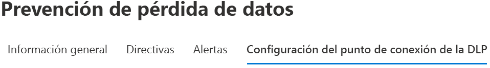
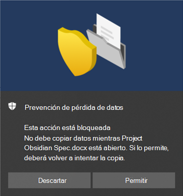

# Uso de la prevención de pérdida de datos en punto de conexiónUsing Endpoint data loss prevention

Este artículo le guiará a través de tres escenarios donde puede crear y modificar una directiva DLP que use dispositivos como una ubicación.This article walks you through three scenarios where you create and modify a DLP policy that uses devices as a location.

## Configuración DLPDLP settings

Antes de empezar, configure las opciones de configuración DLP que se aplican a todas las directivas DLP para dispositivos.Before you get started you should set up your DLP settings which are applied to all DLP policies for devices. Debe configurarlas si tiene previsto crear directivas que cumplan con lo siguiente:You must configure these if you intend to create policies that enforce:

- restricciones de salida de la nubecloud egress restrictions
- restricciones de aplicaciones no permitidasunallowed apps restrictions

O bienOr

- Si desea excluir de la supervisión las rutas de archivo ruidosasIf you want to exclude noisy file paths from monitoring

  > [!div class="mx-imgBorder"]
  > 

### Exclusiones de ruta de archivoFile path exclusions

Es posible que quiera excluir determinadas rutas de supervisión DLP, alertas DLP y aplicación de directivas DLP en sus dispositivos, ya sea porque tienen demasiado ruido o no contienen archivos que le interesan.You may want to exclude certain paths from DLP monitoring, DLP alerting, and DLP policy enforcement on your devices because they are too noisy or don’t contain files you are interested in. Los archivos en esas ubicaciones no se auditarán y los archivos que se creen o modifiquen en esas ubicaciones no se someterán a la aplicación de directivas DLP.Files in those locations will not be audited and any files that are created or modified in those locations will not be subject to DLP policy enforcement. Puede configurar exclusiones de ruta en configuración DLP.You can configure path exclusions in DLP settings.

Puede usar esta lógica para crear sus rutas de exclusión:You can use this logic to construct your exclusion paths:

- Una ruta de archivo es válida cuando termina en "\". Esto incluye solo a los archivos que se encuentran directamente dentro de la carpeta.Valid file path that ends with ‘\’, which means only files directly under folder.  Por ejemplo: C:\TempFor example: C:\Temp\

- Una ruta de archivo es válida cuando termina en "\*". Esto incluye solo a los archivos que se encuentran dentro de las subcarpetas, además de los archivos ubicados directamente dentro de la carpeta.Valid file path that ends with ‘\*’, which means only files under sub-folders, besides the files directly under the folder.  Por ejemplo: C:\Temp\*For example: C:\Temp\*

- Una ruta de archivo es válida cuando termina sin "\" o "\*". Esto incluye a todos los archivos que se encuentran directamente dentro de la carpeta o subcarpetas.Valid file path that ends without ‘\’ or ‘\*’, which means all files directly under folder and all sub-folders.  Por ejemplo: C:\TempFor example: C:\Temp

- Una ruta con comodín con "\" en cada lado.A path with wildcard between ‘\’ from each side.  Por ejemplo: C:\Usuarios\*\EscritorioFor example: C:\Users\*\Desktop\

- Una ruta con comodín con "\" en cada lado y con "(número)" para dar un número exacto de subcarpetas.A path with wildcard between ‘\’ from each side and with ‘(number)’ to give exact number of subfolders.  Por ejemplo: C:\Usuarios\*(1)\DescargasFor example: C:\Users\*(1)\Downloads\

- Una ruta con variables de entorno del SISTEMA.A path with SYSTEM environment variables.  Por ejemplo: %SystemDrive%\Test\*For example: %SystemDrive%\Test\*

- Una combinación de todas las anteriores.A mix of all the above.  Por ejemplo: %SystemDrive%\Users\*\Documents\*(2)\SubFor example: %SystemDrive%\Users\*\Documents\*(2)\Sub\

### Aplicaciones no permitidasUnallowed apps

Cuando la configuración de **Acceso por aplicaciones y exploradores no permitidos** de una directiva esté activada y los usuarios intenten usar estas aplicaciones para acceder a un archivo protegido, la actividad se permitirá, se bloqueará, o se bloqueará pero los usuarios podrán invalidar la restricción.When a policy's **Access by unallowed apps and browsers** setting is turned on and users attempt to use these apps to access a protected file, the activity will be allowed, blocked, or blocked but users can override the restriction. Toda actividad es auditada y está disponible para su revisión en el explorador de actividades.All activity is audited and available to review in activity explorer.

> [!IMPORTANT]
> No incluya la ruta de acceso al archivo ejecutable, solo el nombre del archivo ejecutable (por ejemplo, browser.exe).Do not include the path to the executable, but only the executable name (such as browser.exe).

### Restricciones del dominio y del explorador:Browser and domain restrictions
Restrinja el uso compartido de los archivos confidenciales que coincidan con las directivas con dominios de servicio en la nube sin restricciones.Restrict sensitive files that match your policies from being shared with unrestricted cloud service domains.

#### Dominios de servicioService domains

Puede controlar si los archivos confidenciales protegidos por sus directivas se pueden cargar en dominios de servicio específicos de Microsoft Edge.You can control whether sensitive files protected by your policies can be uploaded to specific service domains from Microsoft Edge.

Si el modo de lista está configurado en **Bloquear**, el usuario no podrá cargar elementos confidenciales a esos dominios.If the list mode is set to **Block**, then user will not be able to upload sensitive items to those domains. Cuando se bloquea una acción de carga porque un elemento coincide con una directiva DLP, la DLP genera una advertencia o bloquea la carga del elemento confidencial.When an upload action is blocked because an item matches a DLP policy, DLP will either generate a warning or block the upload of the sensitive item.

Si el modo de lista está configurado en **Permitir**, los usuarios podrán cargar elementos confidenciales **_solo_** a dichos dominios y no se permitirá el acceso de carga a los demás dominios.If the list mode is set to **Allow**, then users will be able to upload sensitive items **_only_** to those domains, and upload access to all other domains is not allowed.

> [!IMPORTANT]
> Cuando el modo de restricción del servicio esté establecido en "Permitir", debe tener al menos un dominio de servicio configurado antes de que las restricciones se apliquen.When the service restriction mode is set to "Allow", you must have at least one service domain configured before restrictions are enforced.

#### Exploradores no permitidosUnallowed browsers

Agregue exploradores, identificados por sus nombres ejecutables, que no tendrán acceso a los archivos que cumplan las condiciones de una directiva DLP aplicada cuya restricción de carga a servicios en la nube esté configurada para bloquearse o bloquear una invalidación.You add browsers, identified by their executable names, that will be blocked from accessing files that match the conditions of an enforced a DLP policy where the upload to cloud services restriction is set to block or block override. Cuando estos exploradores no puedan acceder a un archivo, los usuarios finales verán una notificación del sistema que les pedirá que abran el archivo a través de Edge Chromium.When these browsers are blocked from accessing a file, the end users will see a toast notification asking them to open the file through Edge Chromium.

### Justificaciones empresariales en sugerencias de directivasBusiness justification in policy tips

Puede controlar cómo interactúan los usuarios con la opción de justificación empresarial en las notificaciones de sugerencias de directiva DLP.You can control how users interact with the business justification option in DLP policy tip notifications. Esta opción aparece cuando los usuarios realizan una actividad que está protegida por la configuración **Bloquear con anulación** en una directiva DLP.This option appears when users perform an activity that's protected by the **Block with override** setting in a DLP policy. Puede elegir entre una de las siguientes opciones:You can choose from one the following options:

- De forma predeterminada, los usuarios pueden seleccionar una justificación integrada o introducir su propio texto.By default, users can select either a built-in justification, or enter their own text.
- Los usuarios solo pueden seleccionar una justificación integrada.Users can only select a built-in justification.
- Los usuarios solo pueden introducir su propia justificación.Users can only enter their own justification.

## Vincular las opciones de configuración DLPTying DLP settings together

Con la DLP de los puntos de conexión y el Explorador web Edge Chromium, puede restringir el uso compartido no intencionado de elementos confidenciales a las aplicaciones y servicios en la nube no permitidos.With Endpoint DLP and Edge Chromium Web browser, you can restrict unintentional sharing of sensitive items to unallowed cloud apps and services. Edge Chromium comprende cuándo un elemento está restringido por una directiva DLP de los puntos de conexión y aplica las restricciones de acceso.Edge Chromium understands when an item is restricted by an Endpoint DLP policy and enforces access restrictions.

Cuando usa la DLP de los puntos de conexión como una ubicación en una directiva DLP configurada correctamente y en el explorador Edge Chromium, los exploradores no permitidos que haya definido en esta configuración no tendrán acceso a los elementos confidenciales que coincidan con los controles de la directiva DLP.When you use Endpoint DLP as a location in a properly configured DLP policy and the Edge Chromium browser, the unallowed browsers that you've defined in these settings will be prevented from accessing the sensitive items that match your DLP policy controls. En su lugar, los usuarios serán redirigidos para usar Edge Chromium y Edge Chromium, con su reconocimiento de las restricciones impuestas por DLP, podrá bloquear o restringir actividades cuando se cumplan las condiciones de la directiva DLP.Instead, users will be redirected to use Edge Chromium and Edge Chromium, with its understanding of DLP imposed restrictions, can block or restrict activities when the conditions in the DLP policy are met.

Para usar esta restricción, tendrá que configurar tres partes importantes:To use this restriction you’ll need to configure three important pieces:

1. Especifique los sitios (servicios, dominios y direcciones IP) con los que no quiere que se compartan elementos confidenciales.Specify the places – services, domains, IP addresses – that you want to prevent sensitive items from being shared to.

2. Agregue los exploradores que no tienen permitido acceder a ciertos elementos confidenciales cuando se produzca una coincidencia de directiva DLP.Add the browsers that aren’t allowed to access certain sensitive items when a DLP policy match occurs.

3. Configure directivas DLP para definir los tipos de elementos confidenciales que deberían tener carga restringida a estos lugares activando **Cargar a los servicios en la nube** y **Acceso desde un explorador no permitido**.Configure DLP policies to define the kinds of sensitive items for which upload should be restricted to these places by turning on **Upload to cloud services** and **Access from unallowed browser**.

Puede continuar agregando nuevos servicios, aplicaciones y directivas para ampliar y aumentar las restricciones para satisfacer las necesidades de su empresa y proteger los datos confidenciales.You can continue to add new services, apps, and policies to extend and augment your restrictions to meet your business needs and protect sensitive data. 

Esta configuración garantizará que sus datos estén seguros, evitando así las restricciones innecesarias que impiden o restringen a los usuarios el acceso y el uso compartido de elementos no confidenciales.This configuration will help ensure your data remains safe while also avoiding unnecessary restrictions that prevent or restrict users from accessing and sharing non-sensitive items.

## Escenarios de directiva DLP de los puntos de conexiónEndpoint DLP policy scenarios

Para ayudarle a familiarizarse con las características de DLP de los puntos de conexión y cómo se muestran en las directivas DLP, hemos recopilado algunos escenarios para que los siga.To help familiarize you with Endpoint DLP features and how they surface in DLP policies, we've put together some scenarios for you to follow.

> [!IMPORTANT]
> Estos escenarios DLP de los puntos de conexión no son los procedimientos oficiales para crear y optimizar directivas DLP.These Endpoint DLP scenarios are not the official procedures for creating and tuning DLP policies. Consulte los temas siguientes cuando necesite trabajar con directivas DLP en situaciones generales:Refer to the below topics when you need to work with DLP policies in general situations:

>- [Obtenga más información acerca de la prevención contra la pérdida de datosLearn about data loss prevention](dlp-learn-about-dlp.md)
>- [Introducción a la directiva predeterminada de DLPGet started with the default DLP policy](get-started-with-the-default-dlp-policy.md)
>- [Crear una directiva DLP a partir de una plantillaCreate a DLP policy from a template](create-a-dlp-policy-from-a-template.md)
>- [Crear, probar y optimizar una directiva DLPCreate, test, and tune a DLP policy](create-test-tune-dlp-policy.md)

### Escenario 1: crear una directiva a partir de una plantilla, solo auditoríaScenario 1: Create a policy from a template, audit only

Estos escenarios requieren que ya tenga dispositivos incorporados y que presenten informes al Explorador de actividades.These scenarios require that you already have devices onboarded and reporting into Activity explorer. Si todavía no ha incorporado sus dispositivos, consulte [Introducción a la prevención de pérdida de datos de los puntos de conexión](endpoint-dlp-getting-started.md).If you haven't onboarded devices yet, see [Get started with Endpoint data loss prevention](endpoint-dlp-getting-started.md).

1. Abra la [página de prevención de pérdida de datos](https://compliance.microsoft.com/datalossprevention?viewid=policies).Open the [Data loss prevention page](https://compliance.microsoft.com/datalossprevention?viewid=policies).

2. Elija **Crear directiva**.Choose **Create policy**.

3. Para este escenario, elija **Privacidad**, después **Datos de información de identificación personal (PII) de Estados Unidos**, y elija **Siguiente**.For this scenario, choose **Privacy**, then **U.S. Personally Identifiable Information (PII) Data** and choose **Next**.

4. Desactive el campo **Estado** para todas las ubicaciones excepto para **Dispositivos**.Toggle the **Status** field to off for all locations except **Devices**. Elija **Siguiente**.Choose **Next**.

5. Acepte la selección predeterminada **Revisar y personalizar la configuración a partir de la plantilla** y elija **Siguiente**.Accept the default **Review and customize settings from the template** selection and choose **Next**.

6. Acepte los valores predeterminados **Acciones de protección** y elija **Siguiente**.Accept the default **Protection actions** values and choose **Next**.

7. Seleccione **Auditar o restringir actividades en dispositivos Windows** y deje las acciones configuradas en **Solo auditar**.Select **Audit or restrict activities on Windows devices** and leave the actions set to **Audit only**. Elija **Siguiente**.Choose **Next**.

8. Acepte el valor predeterminado **Me gustaría probarlo primero** y elija **Mostrar sugerencias de directiva durante el modo de prueba**.Accept the default **I'd like to test it out first** value and choose **Show policy tips while in test mode**. Elija **Siguiente**.Choose **Next**.

9. Revise la configuración y elija **Enviar**.Review your settings and choose **Submit**.

10. La nueva directiva DLP se mostrará en la lista de directivas.The new DLP policy will appear in the policy list.

11. Compruebe que los datos de los puntos de conexión supervisados se encuentren en el Explorador de actividades.Check Activity explorer for data from the monitored endpoints. Configure el filtro por ubicación de los dispositivos, agregue la directiva y, después, filtre por nombre de directiva para ver el impacto de esta directiva.Set the location filter for devices and add the policy, then filter by policy name to see the impact of this policy. Consulte [Introducción al explorador de actividades](data-classification-activity-explorer.md), de ser necesario. See, [Get started with activity explorer](data-classification-activity-explorer.md) if needed.

12. Intente compartir una prueba que incluya contenido que activará la condición de datos de información de identificación personal (PII) de Estados Unidos con alguien ajeno a su organización.Attempt to share a test that contains content that will trigger the U.S. Personally Identifiable Information (PII) Data condition with someone outside your organization. Esto debería activar la directiva.This should trigger the policy.

13. Compruebe que el evento se encuentre en el Explorador de actividades.Check Activity explorer for the event.

### Escenario 2: modificar la directiva existente, configurar una alertaScenario 2: Modify the existing policy, set an alert

1. Abra la [Página de prevención de pérdida de datos](https://compliance.microsoft.com/datalossprevention?viewid=policies).Open the [Data loss prevention page](https://compliance.microsoft.com/datalossprevention?viewid=policies).

2. Elija la directiva **Datos de información de identificación personal (PII) de Estados Unidos** que creó en el escenario 1.Choose the **U.S. Personally Identifiable Information (PII) Data** policy that you created in scenario 1.

3. Elija **editar directiva**.Choose **edit policy**.

4. Vaya a la página **Reglas de DLP avanzadas** y edite el **Bajo volumen de contenido detectado en la información de identificación personal de Estados Unidos**.Go to the **Advanced DLP rules** page and edit the **Low volume of content detected U.S. Personally Identifiable Inf**.

5. Desplácese hacia abajo hasta la sección **Informes de incidentes** y configure **Enviar una alerta a los administradores cuando se produzca una coincidencia de regla** en **Activado**.Scroll down to the **Incident reports** section and set **Send an alert to admins when a rule match occurs** to **On**. Las alertas por correo electrónico se enviarán automáticamente al administrador y a cualquier persona que agregue a la lista de destinatarios.Email alerts will be automatically sent to the administrator and anyone else you add to the list of recipients. 

   > [!div class="mx-imgBorder"]
   > 
   
6. Para este escenario, elija **Enviar una alerta cada vez que una actividad coincida con la regla**.For the purposes of this scenario, choose **Send alert every time an activity matches the rule**.

7. Seleccione **Guardar**.Choose **Save**.

8. Conserve todas las opciones de configuración anteriores eligiendo **Siguiente** y, después, **Enviar** los cambios de directiva.Retain all your previous settings by choosing **Next** and then **Submit** the policy changes.

9. Intente compartir una prueba que incluya contenido que activará la condición de datos de información de identificación personal (PII) de Estados Unidos con alguien ajeno a su organización.Attempt to share a test that contains content that will trigger the U.S. Personally Identifiable Information (PII) Data condition with someone outside your organization. Esto debería activar la directiva.This should trigger the policy.

10. Compruebe que el evento se encuentre en el Explorador de actividades.Check Activity explorer for the event.

### Caso 3: modificar la directiva existente, bloquear la acción con permitir invalidaciónScenario 3: Modify the existing policy, block the action with allow override

1. Abra la [Página de prevención de pérdida de datos](https://compliance.microsoft.com/datalossprevention?viewid=policies).Open the [Data loss prevention page](https://compliance.microsoft.com/datalossprevention?viewid=policies).

2. Elija la directiva **Datos de información de identificación personal (PII) de Estados Unidos** que creó en el escenario 1.Choose the **U.S. Personally Identifiable Information (PII) Data** policy that you created in scenario 1.

3. Elija **editar directiva**.Choose **edit policy**.

4. Vaya a la página **Reglas de DLP avanzadas** y edite el **Bajo volumen de contenido detectado en la información de identificación personal de Estados Unidos**.Go to the **Advanced DLP rules** page and edit the **Low volume of content detected U.S. Personally Identifiable Inf**.

5. Desplácese hacia abajo hasta la sección **Auditar o restringir actividades en dispositivos Windows** y configure la acción correspondiente en **Bloquear con invalidación** para cada actividad.Scroll down to the **Audit or restrict activities on Windows device** section and for each activity set the corresponding action to  **Block with override**.

   > [!div class="mx-imgBorder"]
   > 
   
6. Seleccione **Guardar**.Choose **Save**.

7. Repita los pasos del 4 al 7 para el **Alto volumen de contenido detectado en la información de identificación personal de Estados Unidos**.Repeat steps 4-7 for the **High volume of content detected U.S. Personally Identifiable Inf**.

8. Conserve todas las opciones de configuración anteriores eligiendo **Siguiente** y, después, **Enviar** los cambios de directiva.Retain all your previous settings by choosing **Next** and then **Submit** the policy changes.

9. Intente compartir una prueba que incluya contenido que activará la condición de datos de información de identificación personal (PII) de Estados Unidos con alguien ajeno a su organización.Attempt to share a test that contains content that will trigger the U.S. Personally Identifiable Information (PII) Data condition with someone outside your organization. Esto debería activar la directiva.This should trigger the policy.

   Verá un elemento emergente como el siguiente en el dispositivo cliente:You'll see a popup like this on the client device:

   > [!div class="mx-imgBorder"]
   > 

10. Compruebe que el evento se encuentre en el Explorador de actividades.Check Activity explorer for the event.

## Consulte tambiénSee also

- [Obtenga más información sobre la prevención de pérdida de datos en punto de conexiónLearn about Endpoint data loss prevention](endpoint-dlp-learn-about.md)
- [Introducción a la prevención de pérdida de datos en punto de conexiónGet started with Endpoint data loss prevention](endpoint-dlp-getting-started.md)
- [Obtenga más información acerca de la prevención contra la pérdida de datosLearn about data loss prevention](dlp-learn-about-dlp.md)
- [Crear, probar y optimizar una directiva DLPCreate, test, and tune a DLP policy](create-test-tune-dlp-policy.md)
- [Introducción al explorador de actividadGet started with Activity explorer](data-classification-activity-explorer.md)
- [Microsoft Defender para punto de conexiónMicrosoft Defender for Endpoint](/windows/security/threat-protection/)
- [Herramientas y métodos de incorporación para equipos con Windows 10](/microsoft-365/compliance/dlp-configure-endpoints).[Onboarding tools and methods for Windows 10 machines](/microsoft-365/compliance/dlp-configure-endpoints)
- [Suscripción a Microsoft 365Microsoft 365 subscription](https://www.microsoft.com/microsoft-365/compare-microsoft-365-enterprise-plans?rtc=1)
- [Unido a Azure Active Directory (AAD)Azure Active Directory (AAD) joined](/azure/active-directory/devices/concept-azure-ad-join)
- [Descargue el nuevo Microsoft Edge basado en ChromiumDownload the new Microsoft Edge based on Chromium](https://support.microsoft.com/help/4501095/download-the-new-microsoft-edge-based-on-chromium)
- [Introducción a la directiva predeterminada de DLPGet started with the default DLP policy](get-started-with-the-default-dlp-policy.md)
- [Crear una directiva DLP desde una plantillaCreate a DLP policy from a template](create-a-dlp-policy-from-a-template.md)
