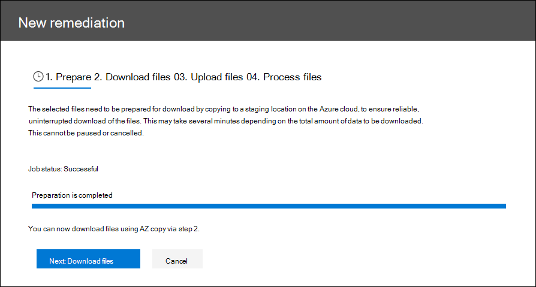
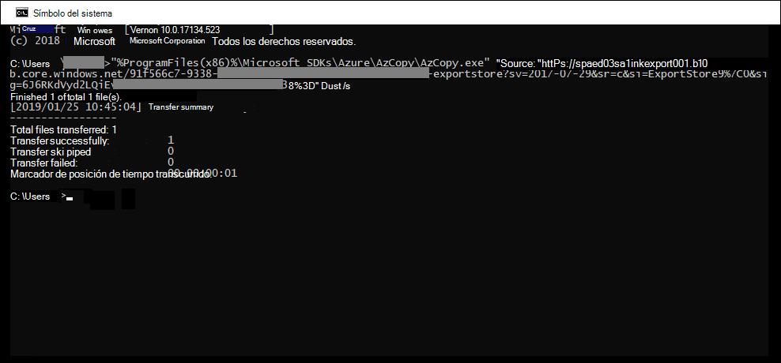
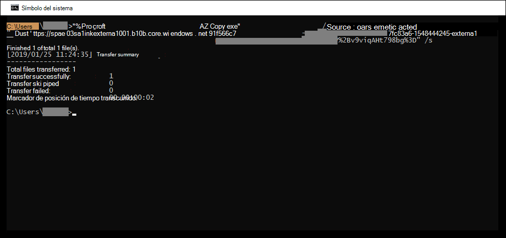

# Corrección de errores al procesar los datosError remediation when processing data

La corrección de errores permite a los administradores de exhibición de documentos electrónicos corregir problemas de datos que impiden que eDiscovery avanzado procese correctamente el contenido.Error remediation allows eDiscovery administrators the ability to rectify data issues that prevent Advanced eDiscovery from properly processing the content. Por ejemplo, los archivos protegidos con contraseña no se pueden procesar ya que los archivos están bloqueados o cifrados.For example, files that are password protected can't be processed since the files are locked or encrypted. Mediante la corrección de errores, los administradores de exhibición de documentos electrónicos pueden descargar archivos con estos errores, quitar la protección con contraseña y, a continuación, cargar los archivos corregidos.Using error remediation, eDiscovery administrators can download files with such errors, remove the password protection, and then upload the remediated files.

Use el siguiente flujo de trabajo para corregir archivos con errores en casos de eDiscovery avanzado.Use the following workflow to remediate files with errors in Advanced eDiscovery cases.

## Crear una sesión de corrección de errores para corregir archivos con errores de procesamientoCreate an error remediation session to remediate files with processing errors

>[!NOTE]
>Si el asistente para corrección de errores se cierra en cualquier momento durante el siguiente procedimiento,  puede volver  a la sesión de corrección de errores desde la pestaña Procesamiento seleccionando Correcciones en el menú desplegable Ver. If the the error remediation wizard is closed at any time during the following procedure, you can return to the error remediation session from the **Processing** tab by selecting **Remediations** in the **View** drop-down menu.

1. En **la** pestaña Procesamiento en el caso de  eDiscovery avanzado, seleccione Errores en el menú  desplegable Ver y, a continuación, seleccione un conjunto de revisión o todo el caso en el menú desplegable Ámbito. On the **Processing** tab in the Advanced eDiscovery case, select **Errors** in the **View** drop-down menu and then select a review set or the entire case in the **Scope** drop-down menu. En esta sección se muestran todos los errores del caso o error de un conjunto de revisión específico.This section displays all errors from the case or error from a specific review set.

   

2. Seleccione los errores que desea corregir haciendo clic en el botón de radio situado junto al tipo de error o al tipo de archivo.Select the errors you want to remediate by clicking the radio button next to either the error type or file type.  En el siguiente ejemplo, estamos remediando un archivo protegido con contraseña.In the following example, we're remediating a password protected file.

3. Haga **clic en Nueva corrección de errores.**Click **New error remediation**.

    El flujo de trabajo de corrección de errores comienza con una fase de preparación en la que los archivos con errores se copian en una ubicación de Azure Storage proporcionada por Microsoft para que pueda descargarlos en el equipo local para corregirlos.The error remediation workflow starts with a preparation stage where the files with errors are copied to a Microsoft-provided Azure Storage location so that you can download them to your local computer to remediate.

    

4. Una vez completada la preparación, haga clic en **Siguiente: Descargar archivos** para continuar con la descarga.After the preparation is complete, click **Next: Download files** to proceed with download.

    

5. Para descargar archivos, especifique la ruta **de destino para la descarga.**To download files, specify the **Destination path for download**. Se trata de una ruta de acceso a la carpeta principal del equipo local donde se descargará el archivo.This is a path to the parent folder on your local computer where the file will be downloaded.  La ruta de acceso predeterminada, %USERPROFILE%\Downloads\errors, apunta a la carpeta de descargas del usuario que ha iniciado sesión.The default path, %USERPROFILE%\Downloads\errors, points to the logged-in user's downloads folder. Puede cambiar esta ruta de acceso si lo desea.You can change this path if desired. Si lo cambia, le recomendamos que use una ruta de acceso de archivo local para obtener el mejor rendimiento.If you do change it, we recommend that you use a local file path for the best performance. No use una ruta de acceso de red remota.Don't use a remote network path. Por ejemplo, puede usar la ruta **de acceso C:\Remediation**.For example, you could use the path **C:\Remediation**. 

   La ruta de acceso a la carpeta principal se agrega automáticamente al comando AzCopy (como el valor del **parámetro /Dest).**The path to the parent folder is automatically added to AzCopy command (as the value of the **/Dest** parameter).

6. Copie el comando predefinido haciendo clic en **Copiar en el Portapapeles.**Copy the predefined command by clicking **Copy to clipboard**. Abra un símbolo del sistema de Windows, pegue el comando AzCopy y, a continuación, presione **Entrar**.Open a Windows Command Prompt, paste the AzCopy command, and then press **Enter**.  

        

    > [!NOTE]
    > Debe usar AzCopy v8.1 para usar correctamente el comando que se proporciona en la página Descargar **archivos.**You must use AzCopy v8.1 to successfully use the command that's provided on the **Download files** page. También debe usar AzCopy v8.1 para cargar los archivos en el paso 10.You also must use AzCopy v8.1 to upload the files in step 10. Para instalar esta versión de AzCopy, vea [Transferir datos con AzCopy v8.1 en Windows](https://docs.microsoft.com/previous-versions/azure/storage/storage-use-azcopy).To install this version of AzCopy, see [Transfer data with the AzCopy v8.1 on Windows](https://docs.microsoft.com/previous-versions/azure/storage/storage-use-azcopy). Si se produce un error en el comando AzCopy proporcionado, consulte Solucionar problemas [de AzCopy en eDiscovery avanzado.](troubleshooting-azcopy.md)If the supplied AzCopy command fails, please see [Troubleshoot AzCopy in Advanced eDiscovery](troubleshooting-azcopy.md).

    Los archivos que seleccionó se descargan en la ubicación que especificó en el paso 5.The files that you selected are downloaded to the location that you specified in step 5. En la carpeta principal (por ejemplo, **C:\Remediation),** se crea automáticamente la siguiente estructura de subcarpetas:In the parent folder (for example, **C:\Remediation**), the following subfolder structure is automatically created:

    `<Parent folder>\Subfolder 1\Subfolder 2\<file>`

    - *La subcarpeta 1* se denomina con el identificador del caso o del conjunto de revisión, en función del ámbito seleccionado en el paso 1.*Subfolder 1* is named with the ID for the case or the review set, depending on the scope that you selected in step 1.

    - *El nombre de la* subcarpeta 2 se denomina con el identificador de archivo del archivo descargado.*Subfolder 2* is named with the file ID of the downloaded file

    - El archivo descargado se encuentra en subcarpeta *2* y también se le denomina con el identificador de archivo.The downloaded file is located in *Subfolder 2* and is also named with the file ID.

    Este es un ejemplo de la ruta de acceso de carpeta y el nombre del archivo de error que se crea cuando los elementos se descargan en la carpeta principal **C:\Remediation:**Here's an example of the folder path and error file name that's created when items are downloaded to the **C:\Remediation** parent folder:

    `C:\Remediation\232f8b7e-089c-4781-88c6-210da0615d32\d1459499146268a096ea20202cd029857d64087706e6d6ca2a224970ae3b8938\d1459499146268a096ea20202cd029857d64087706e6d6ca2a224970ae3b8938.docx`

    Si se descargan varios archivos, cada uno de ellos se descarga en una subcarpeta con el nombre del identificador de archivo.If multiple files are downloaded, each one is downloaded to a subfolder that's named with the file ID.

    > [!IMPORTANT]
    > Al cargar archivos en los pasos 9 y 10, los archivos corregidos deben tener el mismo nombre de archivo y estar ubicados en la misma estructura de subcarpetas.When you upload files in step 9 and step 10, the remediated files must have that same filename and be located in the same subfolder structure. La subcarpeta y los nombres de archivo se usan para asociar el archivo corregido con el archivo de error original.The subfolder and file names are used to associated the remediated file with the original error file. Si se modifica la estructura de carpetas o los nombres de archivo, recibirá el siguiente error: `Cannot apply Error Remediation to the current Workingset` .If the folder structure or file names are changed, you'll receive the following error: `Cannot apply Error Remediation to the current Workingset`. Para evitar problemas, se recomienda mantener los archivos corregidos en la misma estructura de subcarpetas y carpetas primarias.To prevent any issues, we recommend that keep the remediated files in the same parent folder and subfolder structure.

7. Después de descargar los archivos, puede corregirlos con una herramienta adecuada.After downloading the files, you can remediate them with an appropriate tool. Para los archivos protegidos con contraseña, hay varias herramientas de descifrar contraseñas que puede usar.For password-protected files, there are several password cracking tools you can use. Si conoce las contraseñas de los archivos, puede abrirlos y quitar la protección con contraseña.If you know the passwords for the files, you can open them and remove the password protection.

8. Vuelva a eDiscovery avanzado y al Asistente para corrección de errores y, a continuación, haga clic en **Siguiente: Cargar archivos.**Return to Advanced eDiscovery and the error remediation wizard and then click **Next: Upload files**.  Esto pasa a la página siguiente, donde ahora puede cargar los archivos.This moves to the next page where you can now upload the files.

    

9. Especifique la carpeta principal donde se encuentran los archivos corregidos en el cuadro de texto Ruta de acceso **a la** ubicación de los archivos.Specify the parent folder where the remediated files are located in the **Path to location of files** text box. De nuevo, la carpeta principal debe tener la misma estructura de subcarpetas que se creó al descargar los archivos.Again, the parent folder must have the same subfolder structure that was created when you downloaded the files.

    La ruta de acceso a la carpeta principal se agrega automáticamente al comando AzCopy (como el valor del **parámetro /Source).**The path to the parent folder is automatically added to AzCopy command (as the value of the **/Source** parameter).

10. Copie el comando predefinido haciendo clic en **Copiar en el Portapapeles.**Copy the predefined command by clicking **Copy to clipboard**. Abra un símbolo del sistema de Windows, pegue el comando AzCopy y, a continuación, presione **Entrar**.Open a Windows Command Prompt, paste the AzCopy command, and then press **Enter**. cargar los archivos.upload the files.

    

11. Después de ejecutar el comando AzCopy, haga clic en **Siguiente: Procesar archivos.**After you run the AzCopy command, click **Next: Process files**.

    Una vez completado el procesamiento, puede ir a revisar el conjunto y ver los archivos corregidos.When processing is complete, you can go to review set and view the remediated files. 

## Corrección de errores en archivos contenedorRemediating errors in container files

En situaciones en las que la exhibición avanzada de documentos electrónicos no puede extraer el contenido de un archivo contenedor (como un archivo .zip), los contenedores se pueden descargar y expandir el contenido en la misma carpeta en la que reside el contenedor original.In situations when the contents of a container file (such as a .zip file) can't be extracted by Advanced eDiscovery, the containers can be downloaded and the contents expanded into the same folder in which the original container resides. Los archivos expandidos se atribuirán al contenedor primario como si se hubiera expandido originalmente mediante eDiscovery avanzado.The expanded files will be attributed to the parent container as if it was originally expanded by Advanced eDiscovery. El proceso funciona como se describió anteriormente, excepto para cargar un único archivo como archivo de reemplazo.The process works as described as above except for uploading a single file as the replacement file.  Cuando cargue archivos corregidos, no incluya el archivo contenedor original.When you upload remediated files, don't include the original container file.

## Corrección de errores al cargar el texto extraídoRemediating errors by uploading the extracted text

A veces no es posible corregir un archivo en formato nativo que la exhibición avanzada de documentos electrónicos puede interpretar.Sometimes it's not possible to remediate a file to native format that Advanced eDiscovery can interpret. Pero puedes reemplazar el archivo original con un archivo de texto que contenga el texto original del archivo nativo (en un proceso denominado *superposición de texto).*But you can replace the original file with a text file that contains the original text of the native file (in a process called *text overlay*). Para ello, siga los pasos descritos en este artículo, pero en lugar de corregir el archivo original en el formato nativo, crearía un archivo de texto que contiene el texto extraído del archivo original y, a continuación, cargaría el archivo de texto con el nombre de archivo original anexado con un sufijo .txt.To do this, follow the steps described in this article but instead of remediating the original file in the native format, you would create a text file that contains the extracted text from the original file, and then upload the text file using the original filename appended with a .txt suffix. Por ejemplo, puede descargar un archivo durante la corrección de errores con el nombre de archivo 335850cc-6602-4af0-acfa-1d14d9128ca2.abc.For example, you download a file during error remediation with the filename 335850cc-6602-4af0-acfa-1d14d9128ca2.abc. Abra el archivo en la aplicación nativa, copie el texto y, a continuación, péguelo en un nuevo archivo denominado 335850cc-6602-4af0-acfa-1d14d9128ca2.abc.txt.You open the file in the native application, copy the text, and then paste it into a new file named 335850cc-6602-4af0-acfa-1d14d9128ca2.abc.txt. Al hacerlo, asegúrese de quitar el archivo original en el formato nativo de la ubicación del archivo corregido en el equipo local antes de cargar el archivo de texto corregido en eDiscovery avanzado.When you do this, be sure to remove the original file in the native format from the remediated file location on your local computer before uploading the remediated text file to Advanced eDiscovery.

## Qué sucede cuando se corrigen los archivosWhat happens when files are remediated

Cuando se cargan los archivos corregidos, los metadatos originales se conservan excepto para los siguientes campos:When remediated files are uploaded, the original metadata is preserved except for the following fields: 

- ExtractedTextSizeExtractedTextSize
- HasTextHasText
- IsErrorRemediateIsErrorRemediate
- LoadIdLoadId
- ProcessingErrorMessageProcessingErrorMessage
- ProcessingStatusProcessingStatus
- TextoText
- WordCountWordCount
- WorkingsetIdWorkingsetId

Para obtener una definición de todos los campos de metadatos en eDiscovery avanzado, vea [Campos de metadatos del documento.](document-metadata-fields-in-advanced-ediscovery.md)For a definition of all metadata fields in Advanced eDiscovery, see [Document metadata fields](document-metadata-fields-in-advanced-ediscovery.md).
