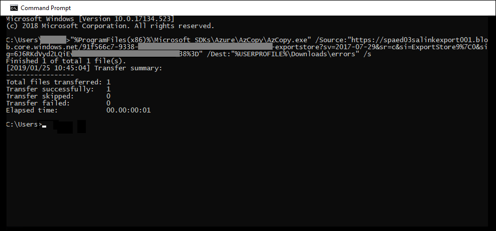

# Corrección de errores al procesar los datos

La corrección de errores permite que los administradores de eDiscovery puedan rectificar problemas de datos que impiden que eDiscovery avanzado procese correctamente el contenido. Por ejemplo, no se pueden procesar archivos protegidos con contraseña, ya que los archivos están bloqueados o cifrados. Mediante la corrección de errores, los administradores de eDiscovery pueden descargar archivos con estos errores, quitar la protección con contraseña y, a continuación, cargar los archivos corregidos.

Use el siguiente flujo de trabajo para corregir los archivos con errores en casos de exhibición avanzada de documentos electrónicos.

## Crear una sesión de corrección de errores para corregir los archivos con errores de procesamiento

>[!NOTE]
>Si el Asistente para la corrección de errores se cierra en cualquier momento durante el siguiente procedimiento, puede volver a la sesión de corrección de errores desde la pestaña **procesando** seleccionando **soluciones** en el menú desplegable **vista** .

1. En la pestaña **procesamiento** del caso de eDiscovery avanzado, seleccione **errores** en el menú desplegable **Ver** y, a continuación, seleccione un conjunto de revisiones o todo el caso en el menú desplegable **ámbito** . En esta sección se muestran todos los errores del caso o del error de un conjunto de revisión específico.

   

2. Seleccione los errores que desea corregir haciendo clic en el botón de opción situado junto a tipo de error o tipo de archivo.  En el siguiente ejemplo, estamos corrigiendo un archivo protegido con contraseña.

3. Haga clic en **nueva corrección de errores**.

    El flujo de trabajo de corrección de errores comienza con una etapa de preparación donde los archivos con errores se copian en una ubicación de almacenamiento de Azure proporcionada por Microsoft para que pueda descargarlos en el equipo local para corregirlos.

    

4. Una vez completada la preparación, haga clic en **siguiente: descargar archivos** para continuar con la descarga.

    

5. Para descargar archivos, especifique la **ruta de destino de la descarga**. Se trata de una ruta de acceso a la carpeta principal en el equipo local donde se descargará el archivo.  La ruta de acceso predeterminada,%USERPROFILE%\Downloads\errors, apunta a la carpeta descargas del usuario que ha iniciado sesión. Si lo desea, puede cambiar esta ruta de acceso. Si lo cambia, le recomendamos que use una ruta de acceso de archivo local para obtener el mejor rendimiento. No use una ruta de acceso de red remota. Por ejemplo, puede usar la ruta de acceso **C:\Remediation**. 

   La ruta de acceso a la carpeta principal se agrega automáticamente a comando AzCopy (como el valor del parámetro **/dest** ).

6. Copie el comando predefinido; para ello, haga clic en **copiar al portapapeles**. Abra un símbolo del sistema de Windows, pegue el comando AzCopy y, a continuación, presione **entrar**.  

        

    > [!NOTE]
    > Debe usar AzCopy v 8.1 para usar correctamente el comando que se proporciona en la página **descargar archivos** . También debe usar AzCopy v 8.1 para cargar los archivos en el paso 10. Para instalar esta versión de AzCopy, consulte [transferir datos con AzCopy v 8.1 en Windows](https://docs.microsoft.com/previous-versions/azure/storage/storage-use-azcopy). Si el comando AzCopy proporcionado no se produce, consulte [solucionar problemas de azcopy en EDiscovery avanzado](troubleshooting-azcopy.md).

    Los archivos que ha seleccionado se descargan en la ubicación que especificó en el paso 5. En la carpeta principal (por ejemplo, **C:\Remediation**), se crea automáticamente la siguiente estructura de subcarpetas:

    `<Parent folder>\Subfolder 1\Subfolder 2\<file>`

    - La *subcarpeta 1* tiene el mismo nombre que el identificador del caso o el conjunto de revisión, según el ámbito que seleccionó en el paso 1.

    - La *subcarpeta 2* tiene el mismo nombre que el archivo del archivo descargado.

    - El archivo descargado se encuentra en la *subcarpeta 2* y también se denomina con el identificador de archivo.

    A continuación, se muestra un ejemplo de la ruta de acceso de la carpeta y el nombre del archivo de error que se crea cuando los elementos se descargan en la carpeta principal **C:\Remediation** :

    `C:\Remediation\232f8b7e-089c-4781-88c6-210da0615d32\d1459499146268a096ea20202cd029857d64087706e6d6ca2a224970ae3b8938\d1459499146268a096ea20202cd029857d64087706e6d6ca2a224970ae3b8938.docx`

    Si se descargan varios archivos, cada uno de ellos se descarga en una subcarpeta que se nombra con el identificador de archivo.

    > [!IMPORTANT]
    > Al cargar archivos en el paso 9 y el paso 10, los archivos corregidos deben tener el mismo nombre de archivo y estar ubicados en la misma estructura de subcarpetas. La subcarpeta y los nombres de archivo se usan para asociar el archivo corregido con el archivo de errores original. Si se modifica la estructura de la carpeta o los nombres de archivo, recibirá el `Cannot apply Error Remediation to the current Workingset`siguiente error:. Para evitar problemas, le recomendamos que conserve los archivos corregidos en la misma estructura de carpetas primarias y subcarpetas.

7. Después de descargar los archivos, puede corregirlos con una herramienta adecuada. Para los archivos protegidos con contraseña, hay varias herramientas de averiguación de contraseñas que puede usar. Si conoce las contraseñas de los archivos, puede abrirlas y quitar la protección con contraseña.

8. Vuelva a eDiscovery avanzado y el Asistente para la corrección de errores y, a continuación, haga clic en **siguiente: cargar archivos**.  Se desplaza a la página siguiente, donde ahora puede cargar los archivos.

    

9. Especifique la carpeta principal donde se encuentran los archivos corregidos en el cuadro **de texto Ruta de acceso a la ubicación de los archivos** . Una vez más, la carpeta principal debe tener la misma estructura de subcarpetas que se creó cuando se descargaron los archivos.

    La ruta de acceso a la carpeta principal se agrega automáticamente a comando AzCopy (como el valor del parámetro **/source** ).

10. Copie el comando predefinido; para ello, haga clic en **copiar al portapapeles**. Abra un símbolo del sistema de Windows, pegue el comando AzCopy y, a continuación, presione **entrar**. cargar los archivos.

    

11. Después de ejecutar el comando AzCopy, haga clic en **siguiente: procesar archivos**.

    Una vez finalizado el procesamiento, puede ir a revisar establecer y ver los archivos corregidos. 

## Corrección de errores en archivos de contenedor

En situaciones en las que la exhibición de documentos electrónicos avanzado no puede extraer el contenido de un archivo contenedor (por ejemplo, un archivo. zip), los contenedores se pueden descargar y el contenido se puede expandir en la misma carpeta en la que reside el contenedor original. Los archivos expandidos se atribuirán al contenedor primario como si se hubiera expandido originalmente con eDiscovery avanzado. El proceso funciona como se ha descrito anteriormente, a excepción de cargar un solo archivo como archivo de reemplazo.  Al cargar archivos corregidos, no incluya el archivo contenedor original.

## Corrección de errores mediante la carga del texto extraído

A veces no es posible corregir un archivo en formato nativo que la exhibición avanzada de documentos electrónicos pueda interpretar. Sin embargo, puede reemplazar el archivo original por un archivo de texto que contenga el texto original del archivo nativo (en un proceso denominado " *superposición de texto*"). Para ello, siga los pasos que se describen en este artículo, pero, en lugar de corregir el archivo original en formato nativo, debe crear un archivo de texto que contenga el texto extraído del archivo original y, a continuación, cargar el archivo de texto con el nombre de archivo original anexado con un sufijo. txt. Por ejemplo, puede descargar un archivo durante la corrección de errores con el nombre de archivo 335850cc-6602-4af0-acfa-1d14d9128ca2. ABC. Abra el archivo en la aplicación nativa, copie el texto y, a continuación, péguelo en un nuevo archivo denominado 335850cc-6602-4af0-acfa-1d14d9128ca2. ABC. txt. Al hacerlo, asegúrese de quitar el archivo original en formato nativo de la ubicación de archivos corregidos en el equipo local antes de cargar el archivo de texto corregido en la exhibición avanzada de documentos electrónicos.

## Qué sucede cuando se corrigen los archivos

Cuando se cargan los archivos corregidos, se conservan los metadatos originales excepto los campos siguientes: 

- ExtractedTextSize
- HasText
- IsErrorRemediate
- LoadId
- ProcessingErrorMessage
- ProcessingStatus
- Texto
- WordCount
- WorkingsetId

Para obtener una definición de todos los campos de metadatos en eDiscovery avanzado, consulte [campos de metadatos del documento](document-metadata-fields.md).
