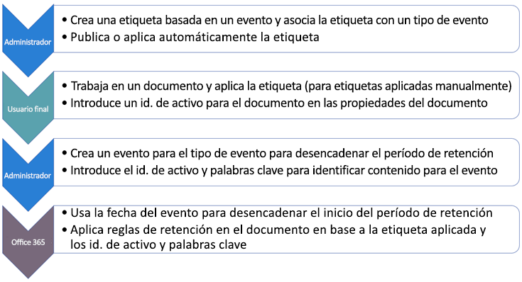
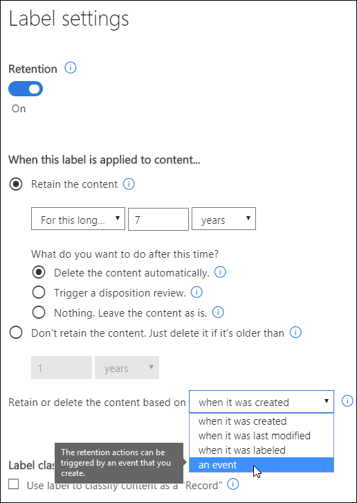
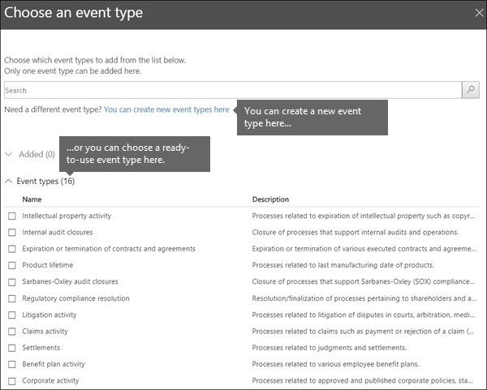
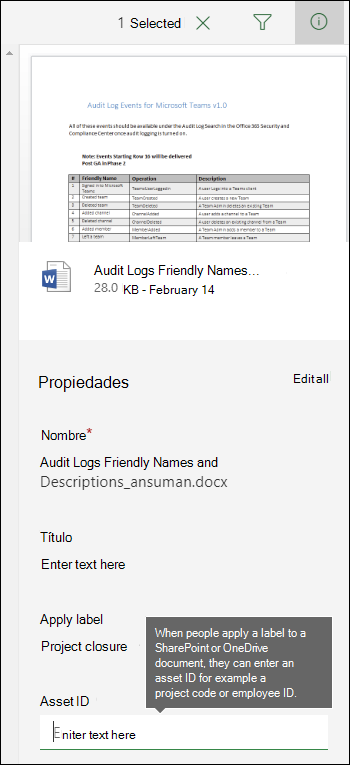
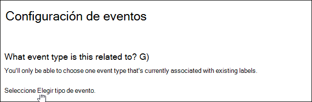
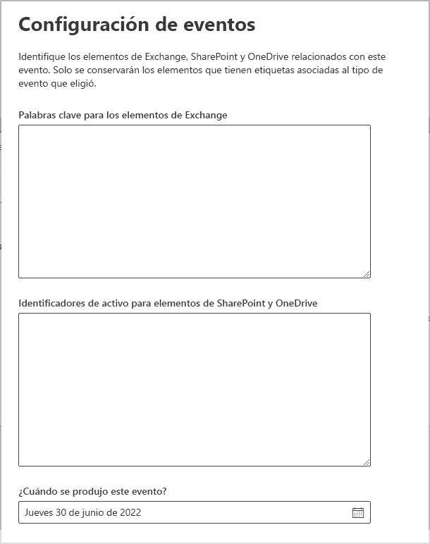
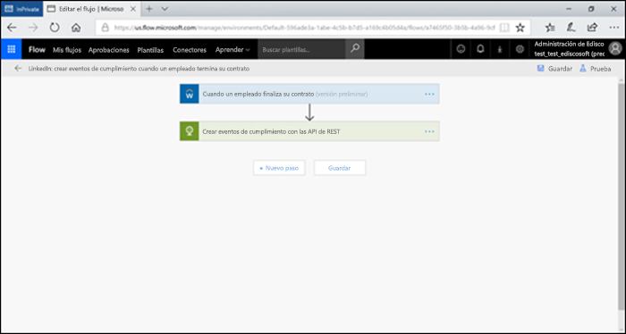

# <a name="start-retention-when-an-event-occurs"></a><span data-ttu-id="b8c3d-103">Iniciar la retención cuando se produzca un evento</span><span class="sxs-lookup"><span data-stu-id="b8c3d-103">Start retention when an event occurs</span></span>

><span data-ttu-id="b8c3d-104">*[Instrucciones de licencias de Microsoft 365 para la seguridad y el cumplimiento](https://aka.ms/ComplianceSD).*</span><span class="sxs-lookup"><span data-stu-id="b8c3d-104">*[Microsoft 365 licensing guidance for security & compliance](https://aka.ms/ComplianceSD).*</span></span>

<span data-ttu-id="b8c3d-p101">Al conservar contenido, el período de retención suele basarse en la antigüedad del contenido. Por ejemplo, puede conservar documentos durante siete años después de su creación y eliminarlos cuando transcurra ese período. Pero cuando configura [etiquetas de retención](labels.md), también puede hacer que un período de retención se base en el momento en que se produzca un tipo específico de evento. El evento desencadena el inicio del período de retención y se exigirán las acciones de retención de etiqueta en todo el contenido que tenga aplicada una etiqueta de retención para ese tipo de evento.</span><span class="sxs-lookup"><span data-stu-id="b8c3d-p101">When you retain content, the retention period is often based on the age of the content. For example, you might retain documents for seven years after they're created and then delete them. But when you configure [retention labels](labels.md), you can also base a retention period on when a specific type of event occurs. The event triggers the start of the retention period, and all content with a retention label applied for that type of event get the label's retention actions enforced on them.</span></span>
  
<span data-ttu-id="b8c3d-109">Ejemplos para usar la retención controlada por eventos:</span><span class="sxs-lookup"><span data-stu-id="b8c3d-109">Examples for using event-driven retention:</span></span>
  
- <span data-ttu-id="b8c3d-110">**Empleados que abandonan la organización** Imagine que tiene que conservar registros de empleados durante 10 años desde el momento en que un empleado abandona la organización.</span><span class="sxs-lookup"><span data-stu-id="b8c3d-110">**Employees leaving the organization** Suppose that employee records must be retained for 10 years from the time an employee leaves the organization.</span></span> <span data-ttu-id="b8c3d-111">Después de 10 años, se deberá eliminar todos los documentos relacionados con la contratación, la evaluación de rendimiento y la finalización de ese empleado.</span><span class="sxs-lookup"><span data-stu-id="b8c3d-111">After 10 years elapse, all documents related to the hiring, performance, and termination of that employee must be disposed.</span></span> <span data-ttu-id="b8c3d-112">El evento que desencadena el período de retención de 10 años es el empleado que abandona la organización.</span><span class="sxs-lookup"><span data-stu-id="b8c3d-112">The event that triggers the 10-year retention period is the employee leaving the organization.</span></span> 
    
- <span data-ttu-id="b8c3d-113">**Expiración de contratos** Imagine que debe conservar todos los registros relacionados con un contrato cinco años después de que este expire.</span><span class="sxs-lookup"><span data-stu-id="b8c3d-113">**Contract expiration** Suppose that all records related to contracts must be retained for five years from the time the contract expires.</span></span> <span data-ttu-id="b8c3d-114">El evento que desencadena el período de retención de cinco años es la expiración del contrato.</span><span class="sxs-lookup"><span data-stu-id="b8c3d-114">The event that triggers the five-year retention period is the expiration of the contract.</span></span> 
    
- <span data-ttu-id="b8c3d-p104">**Vida útil del producto** Puede que su organización tenga requisitos de retención relacionados con la última fecha de fabricación de productos para contenido como especificaciones técnicas. En ese caso, la última fecha de fabricación es el evento que desencadena el período de retención.</span><span class="sxs-lookup"><span data-stu-id="b8c3d-p104">**Product lifetime** Your organization might have retention requirements related to the last manufacturing date of products for content such as technical specifications. In this case, the last manufacturing date is the event that triggers the retention period.</span></span> 
    
<span data-ttu-id="b8c3d-p105">La retención controlada por eventos suele usarse como parte de un proceso de administración de registros. Esto quiere decir que:</span><span class="sxs-lookup"><span data-stu-id="b8c3d-p105">Event-driven retention is typically used as part of a records-management process. This means that:</span></span>
  
- <span data-ttu-id="b8c3d-119">Las etiquetas basadas en eventos también suelen clasificar contenido como registros.</span><span class="sxs-lookup"><span data-stu-id="b8c3d-119">Labels based on events also usually classify content as a record.</span></span> <span data-ttu-id="b8c3d-120">Para más información, vea [Información sobre registros](records.md).</span><span class="sxs-lookup"><span data-stu-id="b8c3d-120">For more information, see [Learn about records](records.md).</span></span>

- <span data-ttu-id="b8c3d-121">Un documento clasificado como registro, pero cuyo desencadenador de eventos aún no se produjo, se conserva de manera indefinida (los registros no se pueden eliminar de forma permanente), hasta que un evento desencadene el período de retención del documento.</span><span class="sxs-lookup"><span data-stu-id="b8c3d-121">A document that's been classified as a record but whose event trigger has not yet happened is retained indefinitely (records can't be permanently deleted), until an event triggers that document's retention period.</span></span>
    
- <span data-ttu-id="b8c3d-122">Las etiquetas de retención basadas en eventos suelen desencadenar una revisión de disposición al finalizar el período de retención, para que un administrador de registros pueda revisar de forma manual el contenido y eliminarlo.</span><span class="sxs-lookup"><span data-stu-id="b8c3d-122">Retention labels based on events usually trigger a disposition review at the end of the retention period, so that a records manager can manually review and dispose of the content.</span></span> <span data-ttu-id="b8c3d-123">Para obtener más información, vea [ Eliminación de contenido](disposition.md).</span><span class="sxs-lookup"><span data-stu-id="b8c3d-123">For more information, see [Disposition of content](disposition.md).</span></span>
    

<span data-ttu-id="b8c3d-124">Una etiqueta basada en un evento tiene las mismas funciones que cualquier etiqueta de retención en Microsoft 365.</span><span class="sxs-lookup"><span data-stu-id="b8c3d-124">A label based on an event has the same capabilities as any retention label in Microsoft  365.</span></span> <span data-ttu-id="b8c3d-125">Para obtener más información, vea [Información sobre las etiquetas y directivas de retención](retention.md).</span><span class="sxs-lookup"><span data-stu-id="b8c3d-125">For more information, see [Learn about retention policies and retention labels](retention.md).</span></span>

## <a name="understanding-the-relationship-between-event-types-labels-events-and-asset-ids"></a><span data-ttu-id="b8c3d-126">Información sobre la relación entre tipos de evento, etiquetas, eventos e id. de activo</span><span class="sxs-lookup"><span data-stu-id="b8c3d-126">Understanding the relationship between event types, labels, events, and asset IDs</span></span>

<span data-ttu-id="b8c3d-127">Para usar correctamente la retención controlada por eventos, es importante comprender la relación entre tipos de evento, etiquetas de retención, eventos e id. de activos, como se muestra en los diagramas y la explicación siguiente:</span><span class="sxs-lookup"><span data-stu-id="b8c3d-127">To successfully use event-driven retention, it's important to understand the relationship between event types, retention labels, events, and asset IDs as illustrated in the diagrams and the explanation that follows:</span></span> 
  

  

  
1. <span data-ttu-id="b8c3d-130">Puede crear etiquetas de retención para diferentes tipos de contenido y asociarlas a un tipo de evento.</span><span class="sxs-lookup"><span data-stu-id="b8c3d-130">You create retention labels for different types of content and then associate them with a type of event.</span></span> <span data-ttu-id="b8c3d-131">Por ejemplo, las etiquetas de retención para distintos tipos de registros y archivos de producto se asocian con un tipo de evento denominado Vida útil del producto, ya que esos registros tienen que conservarse durante 10 años desde el momento en que el producto alcanza el fin de vida.</span><span class="sxs-lookup"><span data-stu-id="b8c3d-131">For example, retention labels for different types of product files and records are associated with an event type named Product Lifetime because those records must be retained for 10 years from the time the product reaches its end of life.</span></span>
    
2. <span data-ttu-id="b8c3d-132">Los usuarios (normalmente, los administradores de registros) aplican esas etiquetas de retención en el contenido y (para documentos SharePoint y OneDrive) especifican un id. de activo para cada elemento.</span><span class="sxs-lookup"><span data-stu-id="b8c3d-132">Users (typically records managers) apply those retention labels to content and (for SharePoint and OneDrive documents) enter an asset ID for each item.</span></span> <span data-ttu-id="b8c3d-133">En este ejemplo, el identificador de activo es un nombre de producto o un código usado por la organización.</span><span class="sxs-lookup"><span data-stu-id="b8c3d-133">In this example, the asset ID is a product name or code used by the organization.</span></span> <span data-ttu-id="b8c3d-134">Por lo tanto, se asigna una etiqueta de retención a los registros de cada producto, y cada registro tiene una propiedad que contiene un id. de activo.</span><span class="sxs-lookup"><span data-stu-id="b8c3d-134">Thus, each product's records are assigned a retention label, and each record has a property that contains an asset ID.</span></span> <span data-ttu-id="b8c3d-135">El diagrama representa **todo el contenido** de todos los registros de productos de una organización, y cada elemento tiene asignado el id. de activo del producto al que pertenece el registro.</span><span class="sxs-lookup"><span data-stu-id="b8c3d-135">The diagram represents **all of the content** for all product records in an organization, and each item bears the asset ID of the product whose record it is.</span></span> 
    
3. <span data-ttu-id="b8c3d-p111">La vida útil del producto es el tipo de evento; un producto específico que llega al fin de su ciclo de vida es un evento. Cuando se produce este tipo de evento (en este caso, cuando un producto alcanza el fin de su ciclo de vida), creará un evento que especifique lo siguiente:</span><span class="sxs-lookup"><span data-stu-id="b8c3d-p111">Product Lifetime is the event type; a specific product reaching end of life is an event. When an event of that event type occurs—in this case, when a product reaches its end of life—you create an event that specifies:</span></span>
    
   - <span data-ttu-id="b8c3d-138">Un id. de activo (para documentos de OneDrive y SharePoint)</span><span class="sxs-lookup"><span data-stu-id="b8c3d-138">An asset ID (for SharePoint and OneDrive documents)</span></span>
    
   - <span data-ttu-id="b8c3d-p112">Palabras clave (para elementos de Exchange). En este ejemplo, la organización usa un código de producto en mensajes que contienen registros de productos, por lo que la palabra clave para los elementos de Exchange coincide con el id. de activo para documentos de OneDrive y SharePoint.</span><span class="sxs-lookup"><span data-stu-id="b8c3d-p112">Keywords (for Exchange items). In this example, the organization uses a product code in messages containing product records, so the keyword for Exchange items is the same as the asset ID for SharePoint and OneDrive documents.</span></span>
    
   - <span data-ttu-id="b8c3d-p113">La fecha en que se produjo el evento. La fecha se usa como el inicio del período de retención. Esta fecha puede ser la fecha actual, una fecha pasada o una fecha futura.</span><span class="sxs-lookup"><span data-stu-id="b8c3d-p113">The date when the event occurred. This date is used as the start of the retention period. This date can be the current, a past, or a future date.</span></span>

4. <span data-ttu-id="b8c3d-144">Después de crear un evento, la fecha del evento se sincroniza con todo el contenido que tenga aplicada una etiqueta de retención de ese tipo de evento y que contenga la palabra clave o el id. de activo especificado.</span><span class="sxs-lookup"><span data-stu-id="b8c3d-144">After you create an event, that event date is synchronized to all the content that has a retention label of that event type and that contains the specified asset ID or keyword.</span></span> <span data-ttu-id="b8c3d-145">Al igual que con cualquier etiqueta de retención, esta sincronización puede tardar hasta siete días en completarse.</span><span class="sxs-lookup"><span data-stu-id="b8c3d-145">Like any retention label, this synchronization can take up to seven days.</span></span> <span data-ttu-id="b8c3d-146">En el diagrama anterior, todos los elementos rodeados con un círculo rojo tienen el período de retención activado por este evento.</span><span class="sxs-lookup"><span data-stu-id="b8c3d-146">In the previous diagram, all the items circled in red have their retention period triggered by this event.</span></span> <span data-ttu-id="b8c3d-147">Es decir, cuando este producto llega al final de su vida, el evento provoca el período de retención de los registros del producto.</span><span class="sxs-lookup"><span data-stu-id="b8c3d-147">In other words, when this product reaches its end of life, that event triggers the retention period for that product's records.</span></span>

<span data-ttu-id="b8c3d-148">Es importante comprender que, si no especifica palabras clave o un id. de activo para un evento, el evento desencadenará el período de retención de **todo el contenido** que tenga aplicada una etiqueta de ese tipo de evento.</span><span class="sxs-lookup"><span data-stu-id="b8c3d-148">It's important to understand that if you don't specify an asset ID or keywords for an event, **all content** with a label of that event type will have its retention period triggered by the event.</span></span> <span data-ttu-id="b8c3d-149">En el diagrama anterior, esto quiere decir que se empezaría a conservar todo el contenido.</span><span class="sxs-lookup"><span data-stu-id="b8c3d-149">This means that in the previous diagram, all content would start being retained.</span></span> <span data-ttu-id="b8c3d-150">Es posible que no sea esto lo que quiera realizar.</span><span class="sxs-lookup"><span data-stu-id="b8c3d-150">This might not be what you intend.</span></span> 

<span data-ttu-id="b8c3d-151">Por último, recuerde que cada etiqueta de retención tiene sus propias opciones de retención.</span><span class="sxs-lookup"><span data-stu-id="b8c3d-151">Finally, remember that each retention label has its own retention settings.</span></span> <span data-ttu-id="b8c3d-152">En este ejemplo, todas especifican 10 años, pero puede que un evento desencadene etiquetas de retención donde cada etiqueta tenga un período de retención distinto.</span><span class="sxs-lookup"><span data-stu-id="b8c3d-152">In this example, they all specify 10 years, but it's possible for an event to trigger retention labels where each label has a different retention period.</span></span>
  
## <a name="how-to-set-up-event-driven-retention"></a><span data-ttu-id="b8c3d-153">Configurar la retención controlada por eventos</span><span class="sxs-lookup"><span data-stu-id="b8c3d-153">How to set up event-driven retention</span></span>

<span data-ttu-id="b8c3d-154">Flujo de trabajo general para la retención controlada por eventos:</span><span class="sxs-lookup"><span data-stu-id="b8c3d-154">High-level workflow for event-driven retention:</span></span>
  

  
> [!TIP]
> <span data-ttu-id="b8c3d-156">Vea [Administrar el ciclo de vida de los documentos de SharePoint con etiquetas de retención](auto-apply-retention-labels-scenario.md) para obtener más información sobre cómo usar las propiedades administradas en SharePoint para aplicar automáticamente las etiquetas de retención e implementar la retención basada en eventos.</span><span class="sxs-lookup"><span data-stu-id="b8c3d-156">See [Manage the lifecycle of SharePoint documents with retention labels](auto-apply-retention-labels-scenario.md) for a detailed scenario about using managed properties in SharePoint to auto-apply retention labels and implement event-driven retention.</span></span>

### <a name="step-1-create-a-label-whose-retention-period-is-based-on-an-event"></a><span data-ttu-id="b8c3d-157">Paso 1: Crear una etiqueta cuyo período de retención se base en un evento</span><span class="sxs-lookup"><span data-stu-id="b8c3d-157">Step 1: Create a label whose retention period is based on an event</span></span>

<span data-ttu-id="b8c3d-158">Para crear y configurar las etiquetas de retención, siga las instrucciones en [Crear y configurar las etiquetas de retención](create-retention-labels.md#create-and-configure-retention-labels) y, al activar la retención, elija la opción para retener o eliminar el contenido en función de un evento.</span><span class="sxs-lookup"><span data-stu-id="b8c3d-158">To create and configure your retention label, use the instructions from [Create and configure retention labels](create-retention-labels.md#create-and-configure-retention-labels) and when you turn on retention, choose the option to retain or delete the content based on an event.</span></span> <span data-ttu-id="b8c3d-159">Este ajuste indica que la configuración de retención no se aplicará hasta el paso 5, cuando cree un evento en la página **Eventos**.</span><span class="sxs-lookup"><span data-stu-id="b8c3d-159">This setting means that the retention settings won't go into effect until Step 5, when you create an event on the **Events** page.</span></span> 
  
<span data-ttu-id="b8c3d-160">La retención controlada por eventos suele usarse para el contenido que se clasifica como un registro, por lo que es un buen momento para comprobar si también tiene que seleccionar la opción que marca el contenido como un registro.</span><span class="sxs-lookup"><span data-stu-id="b8c3d-160">Event-driven retention is typically used for content that's classified as a record, so this is a good time to check whether you also need to select the option that marks content as a record.</span></span>
  
<span data-ttu-id="b8c3d-161">La retención controlada por eventos necesita una configuración de retención que:</span><span class="sxs-lookup"><span data-stu-id="b8c3d-161">Event-driven retention requires retention settings that:</span></span>
  
- <span data-ttu-id="b8c3d-162">Conserve el contenido.</span><span class="sxs-lookup"><span data-stu-id="b8c3d-162">Retain the content.</span></span>
    
- <span data-ttu-id="b8c3d-163">Elimine el contenido automáticamente o desencadene una revisión para eliminación al finalizar el período de retención.</span><span class="sxs-lookup"><span data-stu-id="b8c3d-163">Delete the content automatically or trigger a disposition review at the end of the retention period.</span></span>
    


### <a name="step-2-choose-an-event-type-for-that-label"></a><span data-ttu-id="b8c3d-165">Paso 2: Seleccionar un tipo de evento para esa etiqueta</span><span class="sxs-lookup"><span data-stu-id="b8c3d-165">Step 2: Choose an event type for that label</span></span>

<span data-ttu-id="b8c3d-166">En la configuración de etiquetas, después de seleccionar la opción para que la etiqueta se base en un **evento**, verá la opción **Seleccionar un tipo de evento**.</span><span class="sxs-lookup"><span data-stu-id="b8c3d-166">In the label settings, after you choose the option to base the label on an **event**, you'll see the option to **Choose an event type**.</span></span> <span data-ttu-id="b8c3d-167">Un tipo de evento es simplemente una descripción general de un evento al que puede asociar una etiqueta.</span><span class="sxs-lookup"><span data-stu-id="b8c3d-167">An event type is simply a general description of an event that you want to associate a label with.</span></span>
  
<span data-ttu-id="b8c3d-168">Por ejemplo, si crea un tipo de evento denominado "Vida útil del producto", creará etiquetas de retención basadas en eventos con nombres que describan los tipos de contenido donde quiere que se apliquen las etiquetas, como "Archivos de desarrollo de productos" o "Registros de decisiones empresariales de producto".</span><span class="sxs-lookup"><span data-stu-id="b8c3d-168">For example, if you create an event type named Product Lifetime, you'll create event-based retention labels with names that describe what types of content you want the labels to be applied to, such as "Product development files" or "Product business decision records".</span></span>

<span data-ttu-id="b8c3d-169">Seleccione uno de los tipos de eventos integrados o cree su propio tipo y, después, selecciónelo.</span><span class="sxs-lookup"><span data-stu-id="b8c3d-169">Select one of the built-in event types, or create your own and then select it.</span></span>

<span data-ttu-id="b8c3d-170">Después de seleccionar un tipo de evento y guardar la etiqueta de retención, el tipo de evento no se puede cambiar.</span><span class="sxs-lookup"><span data-stu-id="b8c3d-170">After you choose an event type and save the retention label, the event type cannot be changed.</span></span>
  

  
### <a name="step-3-publish-or-auto-apply-the-event-based-retention-labels"></a><span data-ttu-id="b8c3d-172">Paso 3: Publicar o aplicar automáticamente las etiquetas de retención basadas en eventos</span><span class="sxs-lookup"><span data-stu-id="b8c3d-172">Step 3: Publish or auto-apply the event-based retention labels</span></span>

<span data-ttu-id="b8c3d-173">Al igual que las etiquetas de retención, debe publicar o aplicar automáticamente una etiqueta basada en eventos para que se aplique de forma manual o automática al contenido:</span><span class="sxs-lookup"><span data-stu-id="b8c3d-173">Just like any retention label, you need to publish or auto-apply an event-based label, for it to be manually or automatically applied to content:</span></span>
- [<span data-ttu-id="b8c3d-174">Crear etiquetas de retención y aplicarlas en aplicaciones</span><span class="sxs-lookup"><span data-stu-id="b8c3d-174">Create retention labels and apply them in apps</span></span>](create-apply-retention-labels.md)
- [<span data-ttu-id="b8c3d-175">Aplicar una etiqueta de retención automáticamente al contenido</span><span class="sxs-lookup"><span data-stu-id="b8c3d-175">Apply a retention label to content automatically</span></span>](apply-retention-labels-automatically.md)


> [!NOTE]
> <span data-ttu-id="b8c3d-176">Si selecciona una etiqueta de retención basada en eventos en la pestaña **Administración de registros** > **Plan de archivos** o **Gobierno de datos** > **Etiquetas**, el botón **Aplicar automáticamente una etiqueta** no está disponible.</span><span class="sxs-lookup"><span data-stu-id="b8c3d-176">If you select an event-based retention label from **Records Management** > **File plan** tab or **Data governance** > **Labels** tab, the **Auto-apply a label** button is not available.</span></span>
> 
> <span data-ttu-id="b8c3d-177">En lugar de este botón, use la opción **Aplicar automáticamente una etiqueta** encima de la lista de etiquetas o directivas de una de las siguientes ubicaciones:</span><span class="sxs-lookup"><span data-stu-id="b8c3d-177">Instead of this button, use the **Auto-apply a label** option above the list of labels or policies from one of the following locations:</span></span>
> - <span data-ttu-id="b8c3d-178">**Administración de registros** > **pestaña Directivas de etiqueta**</span><span class="sxs-lookup"><span data-stu-id="b8c3d-178">**Records management** > **Label policies** tab</span></span>
> - <span data-ttu-id="b8c3d-179">**Gobierno de datos** > **pestaña Etiquetas** o **pestaña Directivas de etiqueta**</span><span class="sxs-lookup"><span data-stu-id="b8c3d-179">**Data governance** > **Labels** tab or **Label policies** tab</span></span>


### <a name="step-4-enter-an-asset-id"></a><span data-ttu-id="b8c3d-181">Paso 4: Escribir un id. de activo</span><span class="sxs-lookup"><span data-stu-id="b8c3d-181">Step 4: Enter an asset ID</span></span>

<span data-ttu-id="b8c3d-182">Después de aplicar una etiqueta basada en eventos al contenido, puede especificar un id. de activo para cada elemento.</span><span class="sxs-lookup"><span data-stu-id="b8c3d-182">After an event-based label is applied to content, you can enter an asset ID for each item.</span></span> <span data-ttu-id="b8c3d-183">Por ejemplo, puede que su organización use:</span><span class="sxs-lookup"><span data-stu-id="b8c3d-183">For example, your organization might use:</span></span>
  
- <span data-ttu-id="b8c3d-184">Códigos de producto que puede usar para conservar contenido solo para un producto específico.</span><span class="sxs-lookup"><span data-stu-id="b8c3d-184">Product codes that you can use to retain content for only a specific product.</span></span>
    
- <span data-ttu-id="b8c3d-185">Códigos de proyecto que puede usar para conservar contenido solo para un proyecto específico.</span><span class="sxs-lookup"><span data-stu-id="b8c3d-185">Project codes that you can use to retain content for only a specific project.</span></span>
    
- <span data-ttu-id="b8c3d-186">Id. de empleado que puede usar para conservar contenido solo para una persona específica.</span><span class="sxs-lookup"><span data-stu-id="b8c3d-186">Employee IDs that you can use to retain content for only a specific person.</span></span>
    
<span data-ttu-id="b8c3d-187">El Id. de activo es simplemente otra propiedad de documento disponible en SharePoint y OneDrive.</span><span class="sxs-lookup"><span data-stu-id="b8c3d-187">Asset ID is simply another document property that's available in SharePoint and OneDrive.</span></span> <span data-ttu-id="b8c3d-188">Es posible que la organización ya use otras propiedades del documento o id. para clasificar contenido.</span><span class="sxs-lookup"><span data-stu-id="b8c3d-188">Your organization might already use other document properties and IDs to classify content.</span></span> <span data-ttu-id="b8c3d-189">En ese caso, puede usar esas propiedades y valores al crear un evento (vea el paso 6 más adelante).</span><span class="sxs-lookup"><span data-stu-id="b8c3d-189">If so, you can also use those properties and values when you create an event—see step 6 that follows.</span></span> <span data-ttu-id="b8c3d-190">Lo importante es que su organización tiene que usar alguna combinación de *propiedad:valor* en las propiedades del documento para asociar ese elemento con un tipo de evento.</span><span class="sxs-lookup"><span data-stu-id="b8c3d-190">The important point is that you must use some *property:value* combination in the document properties to associate that item with an event type.</span></span>
  

  
### <a name="step-5-create-an-event"></a><span data-ttu-id="b8c3d-192">Paso 5: Crear un evento</span><span class="sxs-lookup"><span data-stu-id="b8c3d-192">Step 5: Create an event</span></span>

<span data-ttu-id="b8c3d-193">Si se produce un caso concreto de este tipo de evento, como si un producto llega al final de su ciclo de vida, vaya a la página de  >  **Eventos** de la**Administración de registros** en el Centro de cumplimiento de Microsoft 365 y cree un evento.</span><span class="sxs-lookup"><span data-stu-id="b8c3d-193">When a particular instance of that event type occurs, such as a product reaches its end of life, go to the **Records management** > **Events** page in the Microsoft 365 compliance center and create an event.</span></span> <span data-ttu-id="b8c3d-194">Para desencadenar un evento, debe crearlo.</span><span class="sxs-lookup"><span data-stu-id="b8c3d-194">You trigger an event by creating it.</span></span>
  
### <a name="step-6-choose-the-same-event-type-used-by-the-label-in-step-2"></a><span data-ttu-id="b8c3d-195">Paso 6: Seleccionar el mismo tipo de evento usado por la etiqueta en el paso 2</span><span class="sxs-lookup"><span data-stu-id="b8c3d-195">Step 6: Choose the same event type used by the label in step 2</span></span>

<span data-ttu-id="b8c3d-196">Al crear el evento, seleccione el mismo tipo de evento usado por la etiqueta de retención en el paso 2 (por ejemplo, Vida útil del producto).</span><span class="sxs-lookup"><span data-stu-id="b8c3d-196">When you create the event, choose the same event type used by the retention label in step 2—for example, Product Lifetime.</span></span> <span data-ttu-id="b8c3d-197">Solo se desencadenará el período de retención del contenido que tenga aplicadas etiquetas de retención de ese tipo de evento.</span><span class="sxs-lookup"><span data-stu-id="b8c3d-197">Only content with retention labels applied to it of that event type will have its retention period triggered.</span></span>
  

  
### <a name="step-7-enter-keywords-or-an-asset-id"></a><span data-ttu-id="b8c3d-199">Paso 7: Escribir las palabras clave o un id. de activo</span><span class="sxs-lookup"><span data-stu-id="b8c3d-199">Step 7: Enter keywords or an asset ID</span></span>

<span data-ttu-id="b8c3d-200">Ahora, restrinja el ámbito del contenido. Para ello, especifique los id. de activo para el contenido de SharePoint y OneDrive, o las palabras clave para el contenido de Exchange.</span><span class="sxs-lookup"><span data-stu-id="b8c3d-200">Now you narrow the scope of the content by specifying asset IDs for SharePoint and OneDrive content, or keywords for Exchange content.</span></span> <span data-ttu-id="b8c3d-201">Para los id. de activo, la retención solo se aplicará en el contenido que tenga la combinación de *propiedad:valor* especificada.</span><span class="sxs-lookup"><span data-stu-id="b8c3d-201">For asset IDs, retention will be enforced only on content with the specified *property:value* pair.</span></span> <span data-ttu-id="b8c3d-202">Si no se especifica un id. de activo, se aplicará la misma fecha de retención a todo el contenido con etiquetas de ese tipo de evento.</span><span class="sxs-lookup"><span data-stu-id="b8c3d-202">If an asset ID is not entered, all content with labels of that event type get the same retention date applied to them.</span></span>

<span data-ttu-id="b8c3d-203">Por ejemplo: si usa la propiedad de id. de activo, escriba `ComplianceAssetID:<value>` en el cuadro de id. de activo que se muestra abajo.</span><span class="sxs-lookup"><span data-stu-id="b8c3d-203">For example: If you're using the Asset ID property, enter `ComplianceAssetID:<value>` in the box for asset IDs shown below.</span></span>
  
<span data-ttu-id="b8c3d-204">Puede que su organización aplicara otras propiedades e id. a los documentos relacionados con este tipo de evento.</span><span class="sxs-lookup"><span data-stu-id="b8c3d-204">Your organization might have applied other properties and IDs to the documents related to this event type.</span></span> <span data-ttu-id="b8c3d-205">Por ejemplo, si necesita encontrar los registros de un producto específico, el id. puede ser una combinación de la propiedad personalizada “IdProducto” y el valor “XYZ”.</span><span class="sxs-lookup"><span data-stu-id="b8c3d-205">For example, if you need to detect a specific product's records, the ID might be a combination of your custom property ProductID and the value "XYZ".</span></span> <span data-ttu-id="b8c3d-206">En este caso, escriba `ProductID:XYZ` en el cuadro de id. de activo que se muestra abajo.</span><span class="sxs-lookup"><span data-stu-id="b8c3d-206">In this case, you'd enter `ProductID:XYZ` in the box for asset IDs shown in the following picture.</span></span>
  
<span data-ttu-id="b8c3d-207">Paro los elementos de Exchange, use palabras clave.</span><span class="sxs-lookup"><span data-stu-id="b8c3d-207">For Exchange items, use keywords.</span></span> <span data-ttu-id="b8c3d-208">Puede usar una consulta con operadores de búsqueda como AND, OR y NOT.</span><span class="sxs-lookup"><span data-stu-id="b8c3d-208">You can use a query by using search operators such as AND, OR, and NOT.</span></span> <span data-ttu-id="b8c3d-209">Para obtener más información, vea [Consultas de palabras clave y condiciones de búsqueda para la Búsqueda de Contenido](keyword-queries-and-search-conditions.md).</span><span class="sxs-lookup"><span data-stu-id="b8c3d-209">For more information, see [Keyword queries and search conditions for Content Search](keyword-queries-and-search-conditions.md).</span></span>
  
<span data-ttu-id="b8c3d-210">Por último, elija la fecha en la que se ha producido el evento, esta fecha se usa como inicio del periodo de retención.</span><span class="sxs-lookup"><span data-stu-id="b8c3d-210">Finally, choose the date when the event occurred; this date is used as the start of the retention period.</span></span> <span data-ttu-id="b8c3d-211">Después de crear un evento, la fecha del evento se sincroniza con todo el contenido con una etiqueta de retención de ese tipo de evento, id. de activo y palabras clave.</span><span class="sxs-lookup"><span data-stu-id="b8c3d-211">After you create an event, that event date is synchronized to all the content with a retention label of that event type, asset ID, and keywords.</span></span> <span data-ttu-id="b8c3d-212">Al igual que con cualquier etiqueta de retención, esta sincronización puede tardar hasta siete días en completarse.</span><span class="sxs-lookup"><span data-stu-id="b8c3d-212">As with any retention label, this synchronization can take up to seven days.</span></span>
  


<span data-ttu-id="b8c3d-214">Después de crear un evento, la configuración de retención surte efecto para el contenido que ya está etiquetado e indexado.</span><span class="sxs-lookup"><span data-stu-id="b8c3d-214">After creating an event, the retention settings take effect for the content that's already labeled and indexed.</span></span> <span data-ttu-id="b8c3d-215">Si se agrega la etiqueta de retención a contenido nuevo tras crear el evento, deberá crear un nuevo evento con los mismos detalles.</span><span class="sxs-lookup"><span data-stu-id="b8c3d-215">If the retention label is added to new content after the event is created, you must create a new event with the same details.</span></span>

<span data-ttu-id="b8c3d-216">Al eliminar un evento, no se cancela la configuración de retención que está vigente en el contenido que ya está etiquetado.</span><span class="sxs-lookup"><span data-stu-id="b8c3d-216">Deleting an event doesn't cancel the retention settings that are now in effect for the content that's already labeled.</span></span> <span data-ttu-id="b8c3d-217">Para ello, cree un nuevo evento con los mismos detalles, pero deje la fecha en blanco.</span><span class="sxs-lookup"><span data-stu-id="b8c3d-217">To do that, create a new event with the same details, but leave the date blank.</span></span> 

## <a name="use-content-search-to-find-all-content-with-a-specific-label-or-asset-id"></a><span data-ttu-id="b8c3d-218">Usar Búsqueda de contenido para encontrar todo el contenido que tenga aplicada una etiqueta o id. de activo específicos</span><span class="sxs-lookup"><span data-stu-id="b8c3d-218">Use Content Search to find all content with a specific label or asset ID</span></span>

<span data-ttu-id="b8c3d-219">Después de asignar etiquetas de retención a contenido, puede usar la búsqueda de contenido para encontrar todo el contenido clasificado con una etiqueta de retención específica o que contiene un id. de activo específico:</span><span class="sxs-lookup"><span data-stu-id="b8c3d-219">After retention labels are assigned to content, you can use content search to find all content that's classified with a specific retention label or that contains a specific asset ID:</span></span>
  
- <span data-ttu-id="b8c3d-220">Para encontrar todo el contenido con una etiqueta de retención específica, seleccione la condición **Etiqueta de retención** y, después, escriba el nombre de etiqueta completo o una parte del nombre de la etiqueta y use un comodín.</span><span class="sxs-lookup"><span data-stu-id="b8c3d-220">To find all content with a specific retention label, choose the **Retention label** condition, and then enter the complete label name or part of the label name and use a wildcard.</span></span> 
    
- <span data-ttu-id="b8c3d-221">Para encontrar todo el contenido con un id. de activo específico, escriba la propiedad **ComplianceAssetID** y un valor con el formato `ComplianceAssetID:<value>`.</span><span class="sxs-lookup"><span data-stu-id="b8c3d-221">To find all content with a specific asset ID, enter the **ComplianceAssetID** property and a value, using the format `ComplianceAssetID:<value>`.</span></span> 
    
<span data-ttu-id="b8c3d-222">Para obtener más información, consulte [Consultas de palabras clave y condiciones de búsqueda para la Búsqueda de Contenido](keyword-queries-and-search-conditions.md).</span><span class="sxs-lookup"><span data-stu-id="b8c3d-222">For more information, see [Keyword queries and search conditions for Content Search](keyword-queries-and-search-conditions.md).</span></span>
  
## <a name="permissions"></a><span data-ttu-id="b8c3d-223">Permisos</span><span class="sxs-lookup"><span data-stu-id="b8c3d-223">Permissions</span></span>

<span data-ttu-id="b8c3d-p129">Para obtener acceso a la página **Eventos**, los revisores tienen que ser miembros de un grupo de roles con el rol **Administración de disposición** y rol **Registros de auditoría de solo vista**. Le recomendamos que cree un grupo de roles llamado Revisores de disposiciones, que agregue estos dos roles al grupo de roles y que, después, agregue miembros al grupo de roles.</span><span class="sxs-lookup"><span data-stu-id="b8c3d-p129">To get access to the **Events** page, reviewers must be members of a role group with the **Disposition Management** role and the **View-Only Audit Logs** role. We recommend creating a new role group called Disposition Reviewers, adding these two roles to that role group, and then adding members to the role group.</span></span> 
  
<span data-ttu-id="b8c3d-226">Para obtener más información, vea [Conceder acceso a los usuarios al Centro de seguridad y cumplimiento de Office 365](../security/office-365-security/grant-access-to-the-security-and-compliance-center.md).</span><span class="sxs-lookup"><span data-stu-id="b8c3d-226">For more information, see [Give users access to the Office 365 Security &amp; Compliance Center](../security/office-365-security/grant-access-to-the-security-and-compliance-center.md).</span></span>
  
## <a name="automate-events-by-using-powershell"></a><span data-ttu-id="b8c3d-227">Automatizar eventos con PowerShell</span><span class="sxs-lookup"><span data-stu-id="b8c3d-227">Automate events by using PowerShell</span></span>

<span data-ttu-id="b8c3d-228">Puede usar un script de PowerShell para automatizar la retención basada en eventos desde sus aplicaciones empresariales.</span><span class="sxs-lookup"><span data-stu-id="b8c3d-228">You can use a PowerShell script to automate event-based retention from your business applications.</span></span> <span data-ttu-id="b8c3d-229">Los cmdlets de PowerShell disponibles para la retención basada en eventos son:</span><span class="sxs-lookup"><span data-stu-id="b8c3d-229">The PowerShell cmdlets available for event-based retention:</span></span>
  
- [<span data-ttu-id="b8c3d-230">Get-ComplianceRetentionEventType</span><span class="sxs-lookup"><span data-stu-id="b8c3d-230">Get-ComplianceRetentionEventType</span></span>](https://go.microsoft.com/fwlink/?linkid=873002)
    
- [<span data-ttu-id="b8c3d-231">New-ComplianceRetentionEventType</span><span class="sxs-lookup"><span data-stu-id="b8c3d-231">New-ComplianceRetentionEventType</span></span>](https://go.microsoft.com/fwlink/?linkid=873004)
    
- [<span data-ttu-id="b8c3d-232">Remove-ComplianceRetentionEventType</span><span class="sxs-lookup"><span data-stu-id="b8c3d-232">Remove-ComplianceRetentionEventType</span></span>](https://go.microsoft.com/fwlink/?linkid=873005)
    
- [<span data-ttu-id="b8c3d-233">Set-ComplianceRetentionEventType</span><span class="sxs-lookup"><span data-stu-id="b8c3d-233">Set-ComplianceRetentionEventType</span></span>](https://go.microsoft.com/fwlink/?linkid=873006)
    
- [<span data-ttu-id="b8c3d-234">Get-ComplianceRetentionEvent</span><span class="sxs-lookup"><span data-stu-id="b8c3d-234">Get-ComplianceRetentionEvent</span></span>](https://go.microsoft.com/fwlink/?linkid=873001)
    
- [<span data-ttu-id="b8c3d-235">New-ComplianceRetentionEvent</span><span class="sxs-lookup"><span data-stu-id="b8c3d-235">New-ComplianceRetentionEvent</span></span>](https://go.microsoft.com/fwlink/?linkid=873003)
    

## <a name="automate-events-by-using-a-rest-api"></a><span data-ttu-id="b8c3d-236">Automatizar eventos mediante una API de REST</span><span class="sxs-lookup"><span data-stu-id="b8c3d-236">Automate events by using a REST API</span></span>

<span data-ttu-id="b8c3d-237">Puede usar una API de REST para crear automáticamente eventos que desencadenen el inicio del tiempo de retención.</span><span class="sxs-lookup"><span data-stu-id="b8c3d-237">You can use a REST API to automatically create the events that trigger the start of the retention time.</span></span>

<span data-ttu-id="b8c3d-238">Una API de REST es un punto de conexión de servicio que admite conjuntos de operaciones (métodos) HTTP, que proporcionan acceso de creación/recuperación/actualización/eliminación a los recursos del servicio.</span><span class="sxs-lookup"><span data-stu-id="b8c3d-238">A REST API is a service endpoint that supports sets of HTTP operations (methods), which provide create/retrieve/update/delete access to the service's resources.</span></span> <span data-ttu-id="b8c3d-239">Para obtener más información, vea [Componentes de una solicitud o respuesta de la API de REST](https://docs.microsoft.com/rest/api/gettingstarted/#components-of-a-rest-api-requestresponse).</span><span class="sxs-lookup"><span data-stu-id="b8c3d-239">For more information, see [Components of a REST API request/response](https://docs.microsoft.com/rest/api/gettingstarted/#components-of-a-rest-api-requestresponse).</span></span> <span data-ttu-id="b8c3d-240">Al usar la API de REST de Microsoft 365, se pueden crear y recuperar eventos mediante el uso de métodos POST y GET.</span><span class="sxs-lookup"><span data-stu-id="b8c3d-240">By using the Microsoft 365 REST API, events can be created and retrieved using the POST and GET methods.</span></span>

<span data-ttu-id="b8c3d-241">Hay dos opciones para usar la API de REST:</span><span class="sxs-lookup"><span data-stu-id="b8c3d-241">There are two options for using the REST API:</span></span>

- <span data-ttu-id="b8c3d-242">**Usar Microsoft Power Automate o una aplicación similar** para desencadenar un evento automáticamente.</span><span class="sxs-lookup"><span data-stu-id="b8c3d-242">**Microsoft Power Automate or a similar application** to trigger the occurrence of an event automatically.</span></span> <span data-ttu-id="b8c3d-243">Microsoft Power Automate es un orquestador para conectarse a otros sistemas, por lo que no tiene que escribir una solución personalizada.</span><span class="sxs-lookup"><span data-stu-id="b8c3d-243">Microsoft Power Automate is an orchestrator for connecting to other systems, so you don't need to write a custom solution.</span></span> <span data-ttu-id="b8c3d-244">Para obtener más información, consulte el [sitio de Power Automate](https://flow.microsoft.com/es-es/).</span><span class="sxs-lookup"><span data-stu-id="b8c3d-244">For more information, see the [Power Automate website](https://flow.microsoft.com/es-es/).</span></span>

- <span data-ttu-id="b8c3d-245">**Usar PowerShell o un cliente HTTP para llamar a la API de REST** a fin de crear eventos con PowerShell (versión 6 o posterior), lo que forma parte de una solución personalizada.</span><span class="sxs-lookup"><span data-stu-id="b8c3d-245">**PowerShell or an HTTP client to call the REST API** to create events by using PowerShell (version 6 or later), which is part of a custom solution.</span></span>

<span data-ttu-id="b8c3d-246">Antes de usar la API de REST, como administrador global, confirme la dirección URL que se usará para la llamada al evento de retención.</span><span class="sxs-lookup"><span data-stu-id="b8c3d-246">Before you use the REST API, as a global administrator, confirm the URL to use for the retention event call.</span></span> <span data-ttu-id="b8c3d-247">Para ello, ejecute una llamada GET al evento de retención con la dirección URL de la API de REST:</span><span class="sxs-lookup"><span data-stu-id="b8c3d-247">To do this, run a GET retention event call by using the REST API URL:</span></span>

```console
https://ps.compliance.protection.outlook.com/psws/service.svc/ComplianceRetentionEvent
```

<span data-ttu-id="b8c3d-248">Compruebe el código de respuesta.</span><span class="sxs-lookup"><span data-stu-id="b8c3d-248">Check the response code.</span></span> <span data-ttu-id="b8c3d-249">Si es 302, obtenga la URL redirigida de la propiedad Ubicación del encabezado de respuesta y use esa dirección URL en lugar de `https://ps.compliance.protection.outlook.com/psws/service.svc/ComplianceRetentionEvent` en las instrucciones siguientes.</span><span class="sxs-lookup"><span data-stu-id="b8c3d-249">If it's 302, get the redirected URL from the Location property of the response header and use that URL instead of `https://ps.compliance.protection.outlook.com/psws/service.svc/ComplianceRetentionEvent` in the instructions that follow.</span></span>

<span data-ttu-id="b8c3d-250">Los eventos que se crean automáticamente se pueden visualizar y confirmar en el Centro de cumplimiento de Microsoft 365 > **Administración de registros** >  **Eventos**.</span><span class="sxs-lookup"><span data-stu-id="b8c3d-250">The events that get automatically created can be confirmed by viewing them in the Microsoft 365 compliance center > **Records management** >  **Events**.</span></span>

### <a name="use-microsoft-power-automate-to-create-the-event"></a><span data-ttu-id="b8c3d-251">Usar Microsoft Power Automate para crear el evento</span><span class="sxs-lookup"><span data-stu-id="b8c3d-251">Use Microsoft Power Automate to create the event</span></span>

<span data-ttu-id="b8c3d-252">Cree un flujo que cree un evento mediante la API de REST de Microsoft 365:</span><span class="sxs-lookup"><span data-stu-id="b8c3d-252">Create a flow that creates an event using the Microsoft 365 REST API:</span></span>




#### <a name="create-an-event"></a><span data-ttu-id="b8c3d-255">Crear un evento</span><span class="sxs-lookup"><span data-stu-id="b8c3d-255">Create an event</span></span>

<span data-ttu-id="b8c3d-256">Código de ejemplo para llamar a la API de REST:</span><span class="sxs-lookup"><span data-stu-id="b8c3d-256">Sample code to call the REST API:</span></span>

- <span data-ttu-id="b8c3d-257">**Método**: POST</span><span class="sxs-lookup"><span data-stu-id="b8c3d-257">**Method**: POST</span></span>
- <span data-ttu-id="b8c3d-258">**URL**: `https://ps.compliance.protection.outlook.com/psws/service.svc/ComplianceRetentionEvent`</span><span class="sxs-lookup"><span data-stu-id="b8c3d-258">**URL**: `https://ps.compliance.protection.outlook.com/psws/service.svc/ComplianceRetentionEvent`</span></span>
- <span data-ttu-id="b8c3d-259">**Headers**: Key = Content-Type, Value = application/atom+xml</span><span class="sxs-lookup"><span data-stu-id="b8c3d-259">**Headers**: Key = Content-Type, Value = application/atom+xml</span></span>
- <span data-ttu-id="b8c3d-260">**Body**:</span><span class="sxs-lookup"><span data-stu-id="b8c3d-260">**Body**:</span></span>
    
    ```xml
    <?xml version='1.0' encoding='utf-8' standalone='yes'?>
    
    <entry xmlns:d='http://schemas.microsoft.com/ado/2007/08/dataservices'
    
    xmlns:m='http://schemas.microsoft.com/ado/2007/08/dataservices/metadata'
    
    xmlns='http://www.w3.org/2005/Atom'>
    
    <category scheme='http://schemas.microsoft.com/ado/2007/08/dataservices/scheme' term='Exchange.ComplianceRetentionEvent' />
    
    <updated>9/9/2017 10:50:00 PM</updated>
    
    <content type='application/xml'>
    
    <m:properties>
    
    <d:Name>Employee Termination </d:Name>
    
    <d:EventType>99e0ae64-a4b8-40bb-82ed-645895610f56</d:EventType>
    
    <d:SharePointAssetIdQuery>1234</d:SharePointAssetIdQuery>
    
    <d:EventDateTime>2018-12-01T00:00:00Z </d:EventDateTime>
    
    </m:properties>
    
    </content>
    
    </entry>
    ```
    
- <span data-ttu-id="b8c3d-261">**Autenticación**: Básica</span><span class="sxs-lookup"><span data-stu-id="b8c3d-261">**Authentication**: Basic</span></span>
- <span data-ttu-id="b8c3d-262">**Nombre de usuario**: “Complianceuser”</span><span class="sxs-lookup"><span data-stu-id="b8c3d-262">**Username**: "Complianceuser"</span></span>
- <span data-ttu-id="b8c3d-263">**Contraseña**: “Compliancepassword”</span><span class="sxs-lookup"><span data-stu-id="b8c3d-263">**Password**: "Compliancepassword"</span></span>


##### <a name="available-parameters"></a><span data-ttu-id="b8c3d-264">Parámetros disponibles</span><span class="sxs-lookup"><span data-stu-id="b8c3d-264">Available parameters</span></span>


|<span data-ttu-id="b8c3d-265">Parámetros</span><span class="sxs-lookup"><span data-stu-id="b8c3d-265">Parameters</span></span>|<span data-ttu-id="b8c3d-266">Description</span><span class="sxs-lookup"><span data-stu-id="b8c3d-266">Description</span></span>|<span data-ttu-id="b8c3d-267">Notas</span><span class="sxs-lookup"><span data-stu-id="b8c3d-267">Notes</span></span>|
|--- |--- |--- |
|<span data-ttu-id="b8c3d-268"><d:Name></d:Name></span><span class="sxs-lookup"><span data-stu-id="b8c3d-268"><d:Name></d:Name></span></span>|<span data-ttu-id="b8c3d-269">Escriba un nombre único para el evento.</span><span class="sxs-lookup"><span data-stu-id="b8c3d-269">Provide a unique name for the event,</span></span>|<span data-ttu-id="b8c3d-270">No puede contener espacios finales ni los caracteres siguientes: % \* \ & < \> \| # ?</span><span class="sxs-lookup"><span data-stu-id="b8c3d-270">Cannot contain trailing spaces or the following characters: % \* \ & < \> \| # ?</span></span> <span data-ttu-id="b8c3d-271">, : ;</span><span class="sxs-lookup"><span data-stu-id="b8c3d-271">, : ;</span></span>|
|<span data-ttu-id="b8c3d-272"><d:EventType></d:EventType></span><span class="sxs-lookup"><span data-stu-id="b8c3d-272"><d:EventType></d:EventType></span></span>|<span data-ttu-id="b8c3d-273">Escribe el nombre del tipo de evento (o Guid)</span><span class="sxs-lookup"><span data-stu-id="b8c3d-273">Enter event type name (or Guid),</span></span>|<span data-ttu-id="b8c3d-274">Ejemplo: "Recisión de contrato del empleado".</span><span class="sxs-lookup"><span data-stu-id="b8c3d-274">Example: "Employee termination".</span></span> <span data-ttu-id="b8c3d-275">El tipo de evento debe estar asociado con una etiqueta de retención.</span><span class="sxs-lookup"><span data-stu-id="b8c3d-275">Event type has to be associated with a retention label.</span></span>|
|<span data-ttu-id="b8c3d-276"><d:SharePointAssetIdQuery></d:SharePointAssetIdQuery></span><span class="sxs-lookup"><span data-stu-id="b8c3d-276"><d:SharePointAssetIdQuery></d:SharePointAssetIdQuery></span></span>|<span data-ttu-id="b8c3d-277">Escriba "ComplianceAssetId:" + el id. del empleado</span><span class="sxs-lookup"><span data-stu-id="b8c3d-277">Enter "ComplianceAssetId:" + employee ID</span></span>|<span data-ttu-id="b8c3d-278">Ejemplo: "ComplianceAssetId:12345"</span><span class="sxs-lookup"><span data-stu-id="b8c3d-278">Example: "ComplianceAssetId:12345"</span></span>|
|<span data-ttu-id="b8c3d-279"><d:EventDateTime></d:EventDateTime></span><span class="sxs-lookup"><span data-stu-id="b8c3d-279"><d:EventDateTime></d:EventDateTime></span></span>|<span data-ttu-id="b8c3d-280">Fecha y hora del evento</span><span class="sxs-lookup"><span data-stu-id="b8c3d-280">Event Date and Time</span></span>|<span data-ttu-id="b8c3d-281">Formato: aaaa-MM-ddTHH:mm:ssZ, ejemplo: 2018-12-01T00:00:00Z</span><span class="sxs-lookup"><span data-stu-id="b8c3d-281">Format: yyyy-MM-ddTHH:mm:ssZ, Example: 2018-12-01T00:00:00Z</span></span>
|

###### <a name="response-codes"></a><span data-ttu-id="b8c3d-282">Códigos de respuesta</span><span class="sxs-lookup"><span data-stu-id="b8c3d-282">Response codes</span></span>

| <span data-ttu-id="b8c3d-283">Código de respuesta</span><span class="sxs-lookup"><span data-stu-id="b8c3d-283">Response Code</span></span> | <span data-ttu-id="b8c3d-284">Descripción</span><span class="sxs-lookup"><span data-stu-id="b8c3d-284">Description</span></span>       |
| ----------------- | --------------------- |
| <span data-ttu-id="b8c3d-285">302</span><span class="sxs-lookup"><span data-stu-id="b8c3d-285">302</span></span>               | <span data-ttu-id="b8c3d-286">Redirigir</span><span class="sxs-lookup"><span data-stu-id="b8c3d-286">Redirect</span></span>              |
| <span data-ttu-id="b8c3d-287">201</span><span class="sxs-lookup"><span data-stu-id="b8c3d-287">201</span></span>               | <span data-ttu-id="b8c3d-288">Fecha de creación</span><span class="sxs-lookup"><span data-stu-id="b8c3d-288">Created</span></span>               |
| <span data-ttu-id="b8c3d-289">403</span><span class="sxs-lookup"><span data-stu-id="b8c3d-289">403</span></span>               | <span data-ttu-id="b8c3d-290">Error de autorización</span><span class="sxs-lookup"><span data-stu-id="b8c3d-290">Authorization Failed</span></span>  |
| <span data-ttu-id="b8c3d-291">401</span><span class="sxs-lookup"><span data-stu-id="b8c3d-291">401</span></span>               | <span data-ttu-id="b8c3d-292">Error de autenticación</span><span class="sxs-lookup"><span data-stu-id="b8c3d-292">Authentication Failed</span></span> |

##### <a name="get-events-based-on-a-time-range"></a><span data-ttu-id="b8c3d-293">Obtener eventos según un intervalo de tiempo</span><span class="sxs-lookup"><span data-stu-id="b8c3d-293">Get events based on a time range</span></span>

- <span data-ttu-id="b8c3d-294">**Método**: GET</span><span class="sxs-lookup"><span data-stu-id="b8c3d-294">**Method**: GET</span></span>

- <span data-ttu-id="b8c3d-295">**URL**: `https://ps.compliance.protection.outlook.com/psws/service.svc/ComplianceRetentionEvent?BeginDateTime=2019-01-11&EndDateTime=2019-01-16`</span><span class="sxs-lookup"><span data-stu-id="b8c3d-295">**URL**: `https://ps.compliance.protection.outlook.com/psws/service.svc/ComplianceRetentionEvent?BeginDateTime=2019-01-11&EndDateTime=2019-01-16`</span></span>

- <span data-ttu-id="b8c3d-296">**Headers**: Key = Content-Type, Value = application/atom+xml</span><span class="sxs-lookup"><span data-stu-id="b8c3d-296">**Headers**: Key = Content-Type, Value = application/atom+xml</span></span>

- <span data-ttu-id="b8c3d-297">**Autenticación**: Básica</span><span class="sxs-lookup"><span data-stu-id="b8c3d-297">**Authentication**: Basic</span></span>

- <span data-ttu-id="b8c3d-298">**Nombre de usuario**: “Complianceuser”</span><span class="sxs-lookup"><span data-stu-id="b8c3d-298">**Username**: "Complianceuser"</span></span>

- <span data-ttu-id="b8c3d-299">**Contraseña**: “Compliancepassword”</span><span class="sxs-lookup"><span data-stu-id="b8c3d-299">**Password**: "Compliancepassword"</span></span>


###### <a name="response-codes"></a><span data-ttu-id="b8c3d-300">Códigos de respuesta</span><span class="sxs-lookup"><span data-stu-id="b8c3d-300">Response codes</span></span>

| <span data-ttu-id="b8c3d-301">Código de respuesta</span><span class="sxs-lookup"><span data-stu-id="b8c3d-301">Response Code</span></span> | <span data-ttu-id="b8c3d-302">Descripción</span><span class="sxs-lookup"><span data-stu-id="b8c3d-302">Description</span></span>                   |
| ----------------- | --------------------------------- |
| <span data-ttu-id="b8c3d-303">200</span><span class="sxs-lookup"><span data-stu-id="b8c3d-303">200</span></span>               | <span data-ttu-id="b8c3d-304">Aceptar, una lista de eventos de atom+ xml</span><span class="sxs-lookup"><span data-stu-id="b8c3d-304">OK, A list of events in atom+ xml</span></span> |
| <span data-ttu-id="b8c3d-305">404</span><span class="sxs-lookup"><span data-stu-id="b8c3d-305">404</span></span>               | <span data-ttu-id="b8c3d-306">No encontrado</span><span class="sxs-lookup"><span data-stu-id="b8c3d-306">Not found</span></span>                         |
| <span data-ttu-id="b8c3d-307">302</span><span class="sxs-lookup"><span data-stu-id="b8c3d-307">302</span></span>               | <span data-ttu-id="b8c3d-308">Redirigir</span><span class="sxs-lookup"><span data-stu-id="b8c3d-308">Redirect</span></span>                          |
| <span data-ttu-id="b8c3d-309">401</span><span class="sxs-lookup"><span data-stu-id="b8c3d-309">401</span></span>               | <span data-ttu-id="b8c3d-310">Error de autorización</span><span class="sxs-lookup"><span data-stu-id="b8c3d-310">Authorization Failed</span></span>              |
| <span data-ttu-id="b8c3d-311">403</span><span class="sxs-lookup"><span data-stu-id="b8c3d-311">403</span></span>               | <span data-ttu-id="b8c3d-312">Error de autenticación</span><span class="sxs-lookup"><span data-stu-id="b8c3d-312">Authentication Failed</span></span>             |

##### <a name="get-an-event-by-id"></a><span data-ttu-id="b8c3d-313">Obtén un objeto por id.</span><span class="sxs-lookup"><span data-stu-id="b8c3d-313">Get an event by ID</span></span>

- <span data-ttu-id="b8c3d-314">**Método**: GET</span><span class="sxs-lookup"><span data-stu-id="b8c3d-314">**Method**: GET</span></span>

- <span data-ttu-id="b8c3d-315">**URL**: `https://ps.compliance.protection.outlook.com/psws/service.svc/ComplianceRetentionEvent('174e9a86-74ff-4450-8666-7c11f7730f66')`</span><span class="sxs-lookup"><span data-stu-id="b8c3d-315">**URL**: `https://ps.compliance.protection.outlook.com/psws/service.svc/ComplianceRetentionEvent('174e9a86-74ff-4450-8666-7c11f7730f66')`</span></span>

- <span data-ttu-id="b8c3d-316">**Headers**: Key = Content-Type, Value = application/atom+xml</span><span class="sxs-lookup"><span data-stu-id="b8c3d-316">**Headers**: Key = Content-Type, Value = application/atom+xml</span></span>

- <span data-ttu-id="b8c3d-317">**Autenticación**: Básica</span><span class="sxs-lookup"><span data-stu-id="b8c3d-317">**Authentication**: Basic</span></span>

- <span data-ttu-id="b8c3d-318">**Nombre de usuario**: “Complianceuser”</span><span class="sxs-lookup"><span data-stu-id="b8c3d-318">**Username**: "Complianceuser"</span></span>

- <span data-ttu-id="b8c3d-319">**Contraseña**: “Compliancepassword”</span><span class="sxs-lookup"><span data-stu-id="b8c3d-319">**Password**: "Compliancepassword"</span></span>

###### <a name="response-codes"></a><span data-ttu-id="b8c3d-320">Códigos de respuesta</span><span class="sxs-lookup"><span data-stu-id="b8c3d-320">Response codes</span></span>

| <span data-ttu-id="b8c3d-321">Código de respuesta</span><span class="sxs-lookup"><span data-stu-id="b8c3d-321">Response Code</span></span> | <span data-ttu-id="b8c3d-322">Descripción</span><span class="sxs-lookup"><span data-stu-id="b8c3d-322">Description</span></span>                                      |
| ----------------- | ---------------------------------------------------- |
| <span data-ttu-id="b8c3d-323">200</span><span class="sxs-lookup"><span data-stu-id="b8c3d-323">200</span></span>               | <span data-ttu-id="b8c3d-324">Aceptar, el cuerpo de la respuesta contiene el evento en atom+ xml</span><span class="sxs-lookup"><span data-stu-id="b8c3d-324">OK, The response body contains the event in atom+xml</span></span> |
| <span data-ttu-id="b8c3d-325">404</span><span class="sxs-lookup"><span data-stu-id="b8c3d-325">404</span></span>               | <span data-ttu-id="b8c3d-326">No encontrado</span><span class="sxs-lookup"><span data-stu-id="b8c3d-326">Not found</span></span>                                            |
| <span data-ttu-id="b8c3d-327">302</span><span class="sxs-lookup"><span data-stu-id="b8c3d-327">302</span></span>               | <span data-ttu-id="b8c3d-328">Redirigir</span><span class="sxs-lookup"><span data-stu-id="b8c3d-328">Redirect</span></span>                                             |
| <span data-ttu-id="b8c3d-329">401</span><span class="sxs-lookup"><span data-stu-id="b8c3d-329">401</span></span>               | <span data-ttu-id="b8c3d-330">Error de autorización</span><span class="sxs-lookup"><span data-stu-id="b8c3d-330">Authorization Failed</span></span>                                 |
| <span data-ttu-id="b8c3d-331">403</span><span class="sxs-lookup"><span data-stu-id="b8c3d-331">403</span></span>               | <span data-ttu-id="b8c3d-332">Error de autenticación</span><span class="sxs-lookup"><span data-stu-id="b8c3d-332">Authentication Failed</span></span>                                |

##### <a name="get-an-event-by-name"></a><span data-ttu-id="b8c3d-333">Obtén un evento por nombre</span><span class="sxs-lookup"><span data-stu-id="b8c3d-333">Get an event by name</span></span>

- <span data-ttu-id="b8c3d-334">**Método**: GET</span><span class="sxs-lookup"><span data-stu-id="b8c3d-334">**Method**: GET</span></span>

- <span data-ttu-id="b8c3d-335">**URL**: `https://ps.compliance.protection.outlook.com/psws/service.svc/ComplianceRetentionEvent`</span><span class="sxs-lookup"><span data-stu-id="b8c3d-335">**URL**: `https://ps.compliance.protection.outlook.com/psws/service.svc/ComplianceRetentionEvent`</span></span>

- <span data-ttu-id="b8c3d-336">**Headers**: Key = Content-Type, Value = application/atom+xml</span><span class="sxs-lookup"><span data-stu-id="b8c3d-336">**Headers**: Key = Content-Type, Value = application/atom+xml</span></span>

- <span data-ttu-id="b8c3d-337">**Autenticación**: Básica</span><span class="sxs-lookup"><span data-stu-id="b8c3d-337">**Authentication**: Basic</span></span>

- <span data-ttu-id="b8c3d-338">**Nombre de usuario**: “Complianceuser”</span><span class="sxs-lookup"><span data-stu-id="b8c3d-338">**Username**: "Complianceuser"</span></span>

- <span data-ttu-id="b8c3d-339">**Contraseña**: “Compliancepassword”</span><span class="sxs-lookup"><span data-stu-id="b8c3d-339">**Password**: "Compliancepassword"</span></span>


###### <a name="response-codes"></a><span data-ttu-id="b8c3d-340">Códigos de respuesta</span><span class="sxs-lookup"><span data-stu-id="b8c3d-340">Response codes</span></span>

| <span data-ttu-id="b8c3d-341">Código de respuesta</span><span class="sxs-lookup"><span data-stu-id="b8c3d-341">Response Code</span></span> | <span data-ttu-id="b8c3d-342">Descripción</span><span class="sxs-lookup"><span data-stu-id="b8c3d-342">Description</span></span>                                      |
| ----------------- | ---------------------------------------------------- |
| <span data-ttu-id="b8c3d-343">200</span><span class="sxs-lookup"><span data-stu-id="b8c3d-343">200</span></span>               | <span data-ttu-id="b8c3d-344">Aceptar, el cuerpo de la respuesta contiene el evento en atom+ xml</span><span class="sxs-lookup"><span data-stu-id="b8c3d-344">OK, The response body contains the event in atom+xml</span></span> |
| <span data-ttu-id="b8c3d-345">404</span><span class="sxs-lookup"><span data-stu-id="b8c3d-345">404</span></span>               | <span data-ttu-id="b8c3d-346">No encontrado</span><span class="sxs-lookup"><span data-stu-id="b8c3d-346">Not found</span></span>                                            |
| <span data-ttu-id="b8c3d-347">302</span><span class="sxs-lookup"><span data-stu-id="b8c3d-347">302</span></span>               | <span data-ttu-id="b8c3d-348">Redirigir</span><span class="sxs-lookup"><span data-stu-id="b8c3d-348">Redirect</span></span>                                             |
| <span data-ttu-id="b8c3d-349">401</span><span class="sxs-lookup"><span data-stu-id="b8c3d-349">401</span></span>               | <span data-ttu-id="b8c3d-350">Error de autorización</span><span class="sxs-lookup"><span data-stu-id="b8c3d-350">Authorization Failed</span></span>                                 |
| <span data-ttu-id="b8c3d-351">403</span><span class="sxs-lookup"><span data-stu-id="b8c3d-351">403</span></span>               | <span data-ttu-id="b8c3d-352">Error de autenticación</span><span class="sxs-lookup"><span data-stu-id="b8c3d-352">Authentication Failed</span></span>                                |

### <a name="use-powershell-or-any-http-client-to-create-the-event"></a><span data-ttu-id="b8c3d-353">Usar PowerShell o cualquier cliente HTTP para crear el evento</span><span class="sxs-lookup"><span data-stu-id="b8c3d-353">Use PowerShell or any HTTP client to create the event</span></span>

<span data-ttu-id="b8c3d-354">La versión de PowerShell debe ser 6 o posterior.</span><span class="sxs-lookup"><span data-stu-id="b8c3d-354">PowerShell must be version 6 or later.</span></span>

<span data-ttu-id="b8c3d-355">En una sesión de PowerShell, ejecute el siguiente script:</span><span class="sxs-lookup"><span data-stu-id="b8c3d-355">In a PowerShell session, run the following script:</span></span>

```powershell
param([string]$baseUri)

$userName = "UserName"

$password = "Password"

$securePassword = ConvertTo-SecureString $password -AsPlainText -Force

$credentials = New-Object System.Management.Automation.PSCredential($userName, $securePassword)

$EventName="EventByRESTPost-$(([Guid]::NewGuid()).ToString('N'))"

Write-Host "Start to create an event with name: $EventName"

$body = "<?xml version='1.0' encoding='utf-8' standalone='yes'?>

<entry xmlns:d='http://schemas.microsoft.com/ado/2007/08/dataservices'

xmlns:m='http://schemas.microsoft.com/ado/2007/08/dataservices/metadata'

xmlns='http://www.w3.org/2005/Atom'>

<category scheme='http://schemas.microsoft.com/ado/2007/08/dataservices/scheme' term='Exchange.ComplianceRetentionEvent' />

<updated>7/14/2017 2:03:36 PM</updated>

<content type='application/xml'>

<m:properties>

<d:Name>$EventName</d:Name>

<d:EventType>e823b782-9a07-4e30-8091-034fc01f9347</d:EventType>

<d:SharePointAssetIdQuery>'ComplianceAssetId:123'</d:SharePointAssetIdQuery>

</m:properties>

</content>

</entry>"

$event = $null

try

{

$event = Invoke-RestMethod -Body $body -Method 'POST' -Uri "$baseUri/ComplianceRetentionEvent" -ContentType "application/atom+xml" -Authentication Basic -Credential $credentials -MaximumRedirection 0

}

catch

{

$response = $_.Exception.Response

if($response.StatusCode -eq "Redirect")

{

$url = $response.Headers.Location

Write-Host "redirected to $url"

$event = Invoke-RestMethod -Body $body -Method 'POST' -Uri $url -ContentType "application/atom+xml" -Authentication Basic -Credential $credentials -MaximumRedirection 0

}

}

$event | fl *

```

