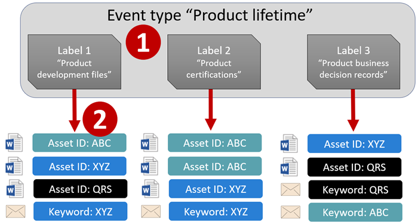

# <a name="start-retention-when-an-event-occurs"></a>Iniciar la retención cuando se produzca un evento

>*[Instrucciones de licencias de Microsoft 365 para la seguridad y el cumplimiento](/office365/servicedescriptions/microsoft-365-service-descriptions/microsoft-365-tenantlevel-services-licensing-guidance/microsoft-365-security-compliance-licensing-guidance).*

When you retain content, the retention period is often based on the age of the content. For example, you might retain documents for seven years after they're created and then delete them. But when you configure [retention labels](retention.md#retention-labels), you can also base a retention period on when a specific type of event occurs. The event triggers the start of the retention period, and all content with a retention label applied for that type of event get the label's retention actions enforced on them.
  
Ejemplos de uso de retención basada en eventos:

- **Employees leaving the organization** Suppose that employee records must be retained for 10 years from the time an employee leaves the organization. After 10 years elapse, all documents related to the hiring, performance, and termination of that employee must be disposed. The event that triggers the 10-year retention period is the employee leaving the organization. 

- **Contract expiration** Suppose that all records related to contracts must be retained for five years from the time the contract expires. The event that triggers the five-year retention period is the expiration of the contract. 

- **Product lifetime** Your organization might have retention requirements related to the last manufacturing date of products for content such as technical specifications. In this case, the last manufacturing date is the event that triggers the retention period. 

La retención basada en eventos, a veces también denominada "retención controlada por eventos", se usa normalmente con procesos de administración de registros. Esto significa que:

- Retention labels based on events also usually mark items as a record, as a part of a records management solution. For more information, see [Learn about records management](records-management.md).

- Un documento que se ha declarado como un registro pero cuyo desencadenador de eventos aún no se ha producido se conserva indefinidamente. Hasta que un evento desencadene el período de retención de ese documento, que expira después, los registros no se pueden eliminar de forma permanente.

- Las etiquetas de retención basadas en eventos a menudo desencadenan una revisión de disposición al finalizar el período de retención para que un administrador de registros pueda revisar de forma manual el contenido y eliminarlo. Para obtener más información, vea [ Eliminación de contenido](disposition.md).

Una etiqueta de retención basada en un evento tiene las mismas funciones que cualquier etiqueta de retención en Microsoft Purview. Para obtener más información, vea [Información sobre las etiquetas y directivas de retención](retention.md).

[!INCLUDE [purview-preview](../includes/purview-preview.md)]

## <a name="understanding-the-relationship-between-event-types-labels-events-and-asset-ids"></a>Información sobre la relación entre tipos de evento, etiquetas, eventos e id. de activo

Para usar correctamente la retención basada en eventos, es importante comprender la relación entre tipos de evento, etiquetas de retención, eventos e id. de activos, tal como se muestra en los diagramas y en la siguiente explicación: 
  

  

  
1. You create retention labels for different types of content and then associate them with a type of event. For example, retention labels for different types of product files and records are associated with an event type named Product Lifetime because those records must be retained for 10 years from the time the product reaches its end of life.
    
2. Los usuarios que suelen ser administradores de registros aplican esas etiquetas de retención al contenido y (para los documentos en SharePoint y OneDrive) escriben un identificador de activo para cada elemento. En este ejemplo, el identificador de activo es un nombre de producto o un código usado por la organización. Después, se asigna una etiqueta de retención a los registros de cada producto, y cada registro tiene una propiedad que contiene un id. de activo. El diagrama representa **todo el contenido** de todos los registros de productos de una organización, y cada elemento tiene asignado el id. de activo del producto al que pertenece el registro. 
    
3. Product Lifetime is the event type; a specific product reaching end of life is an event. When an event of that event type occurs—in this case, when a product reaches its end of life—you create an event that specifies:
    
   - Un id. de activo (para documentos de OneDrive y SharePoint)
    
   - Keywords (for Exchange items). In this example, the organization uses a product code in messages containing product records, so the keyword for Exchange items is functionally the same as the asset ID for SharePoint and OneDrive documents.
    
   - The date when the event occurred. This date is used as the start of the retention period. This date can be the current, a past, or a future date.

4. After you create an event, that event date is synchronized to all the content that has a retention label of that event type and that contains the specified asset ID or keyword. Like any retention label, this synchronization can take up to seven days. In the previous diagram, all the items circled in red have their retention period triggered by this event. In other words, when this product reaches its end of life, that event triggers the retention period for that product's records.

Es importante comprender que, si no especifica palabras clave o un id. de activo para un evento, el evento desencadenará el período de retención de **todo el contenido** que tenga una etiqueta de retención de ese tipo de evento. En el diagrama anterior, esto quiere decir que se empezaría a conservar todo el contenido. Es poco probable que este resultado sea lo que esperaba.

Finally, remember that each retention label has its own retention settings. In this example, they all specify 10 years, but it's possible for an event to trigger retention labels where each label has a different retention period.
  
## <a name="how-to-set-up-event-based-retention"></a>Cómo configurar la retención basada en eventos

Flujo de trabajo de alto nivel para la retención basada en eventos:
  

  
> [!TIP]
> Vea [Usar las etiquetas de retención para administrar el ciclo de vida de los documentos almacenados en SharePoint](auto-apply-retention-labels-scenario.md) para obtener más información sobre cómo usar las propiedades administradas en SharePoint para aplicar automáticamente las etiquetas de retención e implementar la retención basada en eventos.

### <a name="step-1-create-a-label-whose-retention-period-is-based-on-an-event"></a>Paso 1: Crear una etiqueta cuyo período de retención se base en un evento

Para crear y configurar la etiqueta de retención, consulte las instrucciones para [Crear etiquetas de retención](file-plan-manager.md#create-retention-labels) para la administración de registros. Específicamente para la retención basada en eventos:

- En la página **Definir configuración de etiqueta** al crear la etiqueta de retención, asegúrese de seleccionar **Conservar elementos para siempre o durante un período específico**. Luego:
    
    En la página **Definir el período**, después de establecer el período de tiempo, seleccione uno de los tipos de eventos predeterminados de la lista desplegable **¿Cuándo debe comenzar el período?**. O bien, cree su propio tipo de evento seleccionando **Crear nuevo tipo de evento** y siga las indicaciones de configuración:
    
    

Un tipo de evento es simplemente una descripción general de un evento al que desea asociar una etiqueta de retención.

Los tipos de sucesos predeterminados tienen **(tipo de evento)** después de su nombre en la lista desplegable para facilitar su identificación, y también puede ver y crear el tipo de evento desde la pestaña **Administración de registros** > **Eventos** > **Administrar tipos de eventos**.

La retención basada en eventos necesita una configuración de retención que:
  
- Conserve el contenido.
    
- Elimine el contenido automáticamente o desencadene una revisión para eliminación al finalizar el período de retención.
  
La retención basada en eventos se usa normalmente para el contenido que se declara como un registro, por lo que ahora es un buen momento para comprobar si también es necesario seleccionar la opción que marca el contenido como un [registro](records-management.md#records).

Si está usando un tipo de evento existente en lugar de crear un nuevo tipo de evento, vaya al paso 3.

> [!NOTE]
> Después de elegir un tipo de evento y guardar la etiqueta de retención, el tipo de evento no se puede cambiar.

### <a name="step-2-create-a-new-event-type-for-your-label"></a>Paso 2: crear un nuevo tipo de evento para su etiqueta

For the retention settings, if you selected **Create new event type**, enter a name and description for your event type. Then select **Next**, **Submit**, and **Done**.

De nuevo en la página **Definir el período**, para **¿Cuándo debe comenzar el período?**, use la lista desplegable para seleccionar el tipo de evento que ha creado.

  
### <a name="step-3-publish-or-auto-apply-the-event-based-retention-labels"></a>Paso 3: Publicar o aplicar automáticamente las etiquetas de retención basadas en eventos

Al igual que las etiquetas de retención, debe publicar o aplicar automáticamente una etiqueta basada en eventos para que se aplique de forma manual o automática al contenido:
- [Publicar etiquetas de retención y aplicarlas en aplicaciones](create-apply-retention-labels.md)
- [Aplicar una etiqueta de retención automáticamente al contenido](apply-retention-labels-automatically.md)

### <a name="step-4-enter-an-asset-id"></a>Paso 4: Escribir un id. de activo

After an event-based label is applied to content, you can enter an asset ID for each item. For example, your organization might use:
  
- Códigos de producto que puede usar para conservar contenido solo para un producto específico.
    
- Códigos de proyecto que puede usar para conservar contenido solo para un proyecto específico.
    
- Id. de empleado que puede usar para conservar contenido solo para una persona específica.
    
Asset ID is simply another document property that's available in SharePoint and OneDrive. Your organization might already use other document properties and IDs to classify content. If so, you can also use those properties and values when you create an event—see step 6 that follows. The important point is that you must use some *property:value* combination in the document properties to associate that item with an event type.
  

  
### <a name="step-5-create-an-event"></a>Paso 5: Crear un evento

When a particular instance of that event type occurs, such as a product reaches its end of life, go to the **Records management** > **Events** page in the Microsoft Purview compliance portal, and select **+ Create** to create an event. You trigger the event by creating it, here.


Se admiten hasta 1 000 000 eventos por inquilino.

### <a name="step-6-choose-the-same-event-type-used-by-the-label-in-step-2"></a>Paso 6: seleccionar el mismo tipo de evento usado por la etiqueta en el paso 2

Cuando cree el evento, elija el mismo tipo de evento especificado en la configuración de la etiqueta de retención en el paso 2. Por ejemplo, si seleccionó **Duración del producto** como tipo de evento para la configuración de la etiqueta, seleccione **Duración del producto** cuando cree el evento. Solo se desencadenará el período de retención del contenido que tenga aplicadas etiquetas de retención de ese tipo de evento.


Por otra parte, si necesita crear un evento para múltiples etiquetas de retención que tienen diferentes tipos de eventos, seleccione la opción **Elegir etiquetas existentes**. Después, seleccione las etiquetas que están configuradas para los tipos de eventos que quiere asociar con este evento.

### <a name="step-7-enter-keywords-or-a-query-or-asset-id-for-sharepoint-and-onedrive"></a>Paso 7: Escribir palabras clave o una consulta, o identificador de recurso para SharePoint y OneDrive

Ahora limite el ámbito del contenido. Para ello, especifique palabras clave o una consulta. Para el contenido de SharePoint y OneDrive, también puede hacerlo especificando identificadores de recursos.

Las consultas usan lenguaje de consulta de palabras clave (KQL). Para obtener más información, vea [Referencia de sintaxis del Lenguaje de consultas de palabras clave (KQL)](/sharepoint/dev/general-development/keyword-query-language-kql-syntax-reference). Para obtener más información sobre las propiedades utilizables en búsqueda que puede usar, vea [Consultas de palabras clave y condiciones de búsqueda para la Búsqueda de contenido](keyword-queries-and-search-conditions.md).

Para los Id. de activo, la retención solo se aplicará en el contenido que tenga la combinación de *propiedad:valor* especificada. Por ejemplo: si usa la propiedad de Id. de activo, escriba `ComplianceAssetID:<value>` en el cuadro de Id. de activo que se muestra en la siguiente imagen.

Si no se especifica un Id. de activo, se aplica la misma fecha de retención a todo el contenido con etiquetas de ese tipo de evento.

Your organization might have applied other properties and IDs to the documents related to this event type. For example, if you need to detect a specific product's records, the ID might be a combination of your custom property ProductID and the value "XYZ". In this case, you'd enter `ProductID:XYZ` in the box for asset IDs shown in the following picture.

Finally, choose the date when the event occurred; this date is used as the start of the retention period. After you create an event, that event date is synchronized to all the content with a retention label of that event type, asset ID, and keywords or queries. As with any retention label, this synchronization can take up to seven days.
  


Después de crear un evento, la configuración de retención surte efecto para el contenido que ya está etiquetado e indexado. Si se agrega la etiqueta de retención a contenido nuevo tras crear el evento, deberá crear un nuevo evento con los mismos detalles.

Deleting an event doesn't cancel the retention settings that are now in effect for the content that's already labeled. Currently, you can't cancel events after they're triggered.

## <a name="use-content-search-to-find-all-content-with-a-specific-label-or-asset-id"></a>Usar Búsqueda de contenido para encontrar todo el contenido que tenga aplicada una etiqueta o id. de activo específicos

Después de asignar etiquetas de retención al contenido, puede usar la búsqueda de contenido para buscar todo el contenido que tenga una etiqueta de retención específica o que contenga un Id. de activo específico:
  
- Para encontrar todo el contenido con una etiqueta de retención específica, seleccione la condición **Etiqueta de retención** y, después, escriba el nombre de etiqueta completo o una parte del nombre de la etiqueta y use un comodín. 
    
- Para encontrar todo el contenido con un id. de activo específico, escriba la propiedad **ComplianceAssetID** y un valor con el formato `ComplianceAssetID:<value>`. 
    
Para obtener más información, consulte [Consultas de palabras clave y condiciones de búsqueda para la Búsqueda de Contenido](keyword-queries-and-search-conditions.md).

## <a name="automate-events-by-using-powershell"></a>Automatizar eventos con PowerShell

Puede usar un script de PowerShell para automatizar la retención basada en eventos desde sus aplicaciones empresariales. Los cmdlets de PowerShell disponibles para la retención basada en eventos son:
  
- [Get-ComplianceRetentionEventType](/powershell/module/exchange/get-complianceretentioneventtype)
    
- [New-ComplianceRetentionEventType](/powershell/module/exchange/new-complianceretentioneventtype)
    
- [Remove-ComplianceRetentionEventType](/powershell/module/exchange/remove-complianceretentioneventtype)
    
- [Set-ComplianceRetentionEventType](/powershell/module/exchange/set-complianceretentioneventtype)
    
- [Get-ComplianceRetentionEvent](/powershell/module/exchange/get-complianceretentionevent)
    
- [New-ComplianceRetentionEvent](/powershell/module/exchange/new-complianceretentionevent)
    

para ayudar a identificar otros cmdlets para crear etiquetas de retención y sus directivas, consulte [ Cmdlets de PowerShell para las directivas de retención y las etiquetas de retención](retention-cmdlets.md).

## <a name="automate-events-by-using-a-rest-api"></a>Automatizar eventos mediante una API de REST

Puede usar una API de REST para crear automáticamente eventos que desencadenen el inicio del tiempo de retención.

> [!NOTE]
> Ahora que se está implementando en versión preliminar, también puede usar la [API de Microsoft Graph para la administración de registros](compliance-extensibility.md#microsoft-graph-api-for-records-management-preview) para crear el evento y también crear tipos de eventos y etiquetas de retención.
> 
> Le recomendamos que pruebe estas API de Graph, ya que las API de REST de esta sección pronto quedarán en desuso y dejarán de funcionar.

A REST API is a service endpoint that supports sets of HTTP operations (methods), which provide create/retrieve/update/delete access to the service's resources. For more information, see [Components of a REST API request/response](/rest/api/gettingstarted/#components-of-a-rest-api-requestresponse). By using the Microsoft 365 REST API, events can be created and retrieved using the POST and GET methods.

Hay dos opciones para usar la API de REST:

- **Usar Microsoft Power Automate o una aplicación similar** para desencadenar un evento automáticamente. Microsoft Power Automate es un orquestador para conectarse a otros sistemas, por lo que no tiene que escribir una solución personalizada. Para obtener más información, consulte el [sitio de Power Automate](https://flow.microsoft.com/en-us/).

- **Usar PowerShell o un cliente HTTP para llamar a la API de REST** a fin de crear eventos con PowerShell (versión 6 o posterior), lo que forma parte de una solución personalizada.

Antes de usar la API de REST, como administrador global, confirme la dirección URL que se usará para la llamada al evento de retención. Para ello, ejecute una llamada GET al evento de retención con la dirección URL de la API de REST:

```http
https://ps.compliance.protection.outlook.com/psws/service.svc/ComplianceRetentionEvent
```

Check the response code. If it's 302, get the redirected URL from the Location property of the response header and use that URL instead of `https://ps.compliance.protection.outlook.com/psws/service.svc/ComplianceRetentionEvent` in the instructions that follow.

Los eventos que se crean automáticamente se pueden confirmar mediante su visualización en el portal de cumplimiento de Microsoft Purview > **Administración de registros** >  **Eventos**.

### <a name="use-microsoft-power-automate-to-create-the-event"></a>Usar Microsoft Power Automate para crear el evento

Cree un flujo que cree un evento mediante la API de REST de Microsoft 365:


#### <a name="create-an-event"></a>Crear un evento

Código de ejemplo para llamar a la API de REST:

- **Método**: POST
- **URL**: `https://ps.compliance.protection.outlook.com/psws/service.svc/ComplianceRetentionEvent`
- **Headers**: Key = Content-Type, Value = application/atom+xml
- **Body**:

    ```xml
    <?xml version='1.0' encoding='utf-8' standalone='yes'?>
    
    <entry xmlns:d='http://schemas.microsoft.com/ado/2007/08/dataservices'
    
    xmlns:m='http://schemas.microsoft.com/ado/2007/08/dataservices/metadata'
    
    xmlns='http://www.w3.org/2005/Atom'>
    
    <category scheme='http://schemas.microsoft.com/ado/2007/08/dataservices/scheme' term='Exchange.ComplianceRetentionEvent' />
    
    <updated>9/9/2017 10:50:00 PM</updated>
    
    <content type='application/xml'>
    
    <m:properties>
    
    <d:Name>Employee Termination </d:Name>
    
    <d:EventType>99e0ae64-a4b8-40bb-82ed-645895610f56</d:EventType>
    
    <d:SharePointAssetIdQuery>1234</d:SharePointAssetIdQuery>
    
    <d:EventDateTime>2018-12-01T00:00:00Z </d:EventDateTime>
    
    </m:properties>
    
    </content>
    
    </entry>
    ```

- **Autenticación**: Básica
- **Nombre de usuario**: “Complianceuser”
- **Contraseña**: “Compliancepassword”


##### <a name="available-parameters"></a>Parámetros disponibles


|Parámetros|Description|Notas|
|--- |--- |--- |
|<d:Name></d:Name>|Escriba un nombre único para el evento.|No puede contener espacios finales ni los siguientes caracteres: % * \ & < \> \| # ? , : ;|
|<d:EventType></d:EventType>|Escribe el nombre del tipo de evento (o Guid)|Example: "Employee termination". Event type has to be associated with a retention label.|
|<d:SharePointAssetIdQuery></d:SharePointAssetIdQuery>|Escriba "ComplianceAssetId:" + el id. del empleado|Ejemplo: "ComplianceAssetId:12345"|
|<d:EventDateTime></d:EventDateTime>|Fecha y hora del evento|Formato: aaaa-MM-ddTHH:mm:ssZ, ejemplo: 2018-12-01T00:00:00Z
|

###### <a name="response-codes"></a>Códigos de respuesta

| Código de respuesta | Descripción       |
| ----------------- | --------------------- |
| 302               | Redirigir              |
| 201               | Fecha de creación               |
| 403               | Error de autorización  |
| 401               | Error de autenticación |

##### <a name="get-events-based-on-a-time-range"></a>Obtener eventos según un intervalo de tiempo

- **Método**: GET

- **URL**: `https://ps.compliance.protection.outlook.com/psws/service.svc/ComplianceRetentionEvent?BeginDateTime=2019-01-11&EndDateTime=2019-01-16`

- **Headers**: Key = Content-Type, Value = application/atom+xml

- **Autenticación**: Básica

- **Nombre de usuario**: “Complianceuser”

- **Contraseña**: “Compliancepassword”

###### <a name="response-codes"></a>Códigos de respuesta

| Código de respuesta | Descripción                   |
| ----------------- | --------------------------------- |
| 200               | Aceptar, una lista de eventos de atom+ xml |
| 404               | No encontrado                         |
| 302               | Redirigir                          |
| 401               | Error de autorización              |
| 403               | Error de autenticación             |

##### <a name="get-an-event-by-id"></a>Obtén un objeto por id.

- **Método**: GET

- **URL**: `https://ps.compliance.protection.outlook.com/psws/service.svc/ComplianceRetentionEvent('174e9a86-74ff-4450-8666-7c11f7730f66')`

- **Headers**: Key = Content-Type, Value = application/atom+xml

- **Autenticación**: Básica

- **Nombre de usuario**: “Complianceuser”

- **Contraseña**: “Compliancepassword”

###### <a name="response-codes"></a>Códigos de respuesta

| Código de respuesta | Descripción                                      |
| ----------------- | ---------------------------------------------------- |
| 200               | Aceptar, el cuerpo de la respuesta contiene el evento en atom+ xml |
| 404               | No encontrado                                            |
| 302               | Redirigir                                             |
| 401               | Error de autorización                                 |
| 403               | Error de autenticación                                |

##### <a name="get-an-event-by-name"></a>Obtén un evento por nombre

- **Método**: GET

- **URL**: `https://ps.compliance.protection.outlook.com/psws/service.svc/ComplianceRetentionEvent`

- **Headers**: Key = Content-Type, Value = application/atom+xml

- **Autenticación**: Básica

- **Nombre de usuario**: “Complianceuser”

- **Contraseña**: “Compliancepassword”

###### <a name="response-codes"></a>Códigos de respuesta

| Código de respuesta | Descripción                                      |
| ----------------- | ---------------------------------------------------- |
| 200               | Aceptar, el cuerpo de la respuesta contiene el evento en atom+ xml |
| 404               | No encontrado                                            |
| 302               | Redirigir                                             |
| 401               | Error de autorización                                 |
| 403               | Error de autenticación                                |

### <a name="use-powershell-or-any-http-client-to-create-the-event"></a>Usar PowerShell o cualquier cliente HTTP para crear el evento

La versión de PowerShell debe ser 6 o posterior.

En una sesión de PowerShell, ejecute el siguiente script:

```powershell
param([string]$baseUri)

$userName = "UserName"

$password = "Password"

$securePassword = ConvertTo-SecureString $password -AsPlainText -Force

$credentials = New-Object System.Management.Automation.PSCredential($userName, $securePassword)

$EventName="EventByRESTPost-$(([Guid]::NewGuid()).ToString('N'))"

Write-Host "Start to create an event with name: $EventName"

$body = "<?xml version='1.0' encoding='utf-8' standalone='yes'?>

<entry xmlns:d='http://schemas.microsoft.com/ado/2007/08/dataservices'

xmlns:m='http://schemas.microsoft.com/ado/2007/08/dataservices/metadata'

xmlns='http://www.w3.org/2005/Atom'>

<category scheme='http://schemas.microsoft.com/ado/2007/08/dataservices/scheme' term='Exchange.ComplianceRetentionEvent' />

<updated>7/14/2017 2:03:36 PM</updated>

<content type='application/xml'>

<m:properties>

<d:Name>$EventName</d:Name>

<d:EventType>e823b782-9a07-4e30-8091-034fc01f9347</d:EventType>

<d:SharePointAssetIdQuery>'ComplianceAssetId:123'</d:SharePointAssetIdQuery>

</m:properties>

</content>

</entry>"

$event = $null

try

{

$event = Invoke-RestMethod -Body $body -Method 'POST' -Uri "$baseUri/ComplianceRetentionEvent" -ContentType "application/atom+xml" -Authentication Basic -Credential $credentials -MaximumRedirection 0

}

catch

{

$response = $_.Exception.Response

if($response.StatusCode -eq "Redirect")

{

$url = $response.Headers.Location

Write-Host "redirected to $url"

$event = Invoke-RestMethod -Body $body -Method 'POST' -Uri $url -ContentType "application/atom+xml" -Authentication Basic -Credential $credentials -MaximumRedirection 0

}

}

$event | fl *
```
