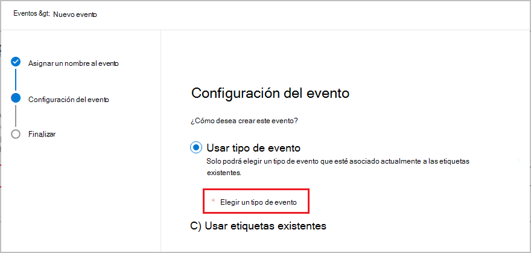

# <a name="start-retention-when-an-event-occurs"></a>Iniciar la retención cuando se produzca un evento

>*[Instrucciones de licencias de Microsoft 365 para la seguridad y el cumplimiento](/office365/servicedescriptions/microsoft-365-service-descriptions/microsoft-365-tenantlevel-services-licensing-guidance/microsoft-365-security-compliance-licensing-guidance).*

Al conservar contenido, el período de retención suele basarse en la antigüedad del contenido. Por ejemplo, puede conservar documentos durante siete años después de su creación y eliminarlos cuando transcurra ese período. Pero cuando configura [etiquetas de retención](retention.md#retention-labels), también puede hacer que un período de retención se base en el momento en que se produzca un tipo específico de evento. El evento desencadena el inicio del período de retención y se exigirán las acciones de retención de etiqueta en todo el contenido que tenga aplicada una etiqueta de retención para ese tipo de evento.
  
Ejemplos de uso de retención basada en eventos:
  
- **Empleados que abandonan la organización** Imagine que tiene que conservar registros de empleados durante 10 años desde el momento en que un empleado abandona la organización. Después de 10 años, se deberá eliminar todos los documentos relacionados con la contratación, la evaluación de rendimiento y la finalización de ese empleado. El evento que desencadena el período de retención de 10 años es el empleado que abandona la organización. 
    
- **Expiración de contratos** Imagine que debe conservar todos los registros relacionados con un contrato cinco años después de que este expire. El evento que desencadena el período de retención de cinco años es la expiración del contrato. 
    
- **Vida útil del producto** Puede que su organización tenga requisitos de retención relacionados con la última fecha de fabricación de productos para contenido como especificaciones técnicas. En ese caso, la última fecha de fabricación es el evento que desencadena el período de retención. 
    
La retención basada en eventos suele usarse como parte de un proceso de administración de registros. Esto quiere decir que:
  
- Las etiquetas de retención basadas en eventos también suelen marcar los elementos como un registro, como parte de una solución de administración de registros. Para más información, vea [Más información sobre la administración de registros](records-management.md).

- Un documento que se ha declarado como un registro, pero cuyo desencadenador de eventos aún no se ha producido, se conserva de manera indefinida (los registros no se pueden eliminar de forma permanente), hasta que un evento desencadene el período de retención del documento.
    
- Las etiquetas de retención basadas en eventos suelen desencadenar una revisión de disposición al finalizar el período de retención, para que un administrador de registros pueda revisar de forma manual el contenido y eliminarlo. Para obtener más información, vea [ Eliminación de contenido](disposition.md).
    

Una etiqueta de retención basada en un evento tiene las mismas funciones que cualquier etiqueta de retención en Microsoft 365. Para obtener más información, vea [Información sobre las etiquetas y directivas de retención](retention.md).

## <a name="understanding-the-relationship-between-event-types-labels-events-and-asset-ids"></a>Información sobre la relación entre tipos de evento, etiquetas, eventos e id. de activo

Para usar correctamente la retención basada en eventos, es importante comprender la relación entre tipos de evento, etiquetas de retención, eventos e id. de activos, tal como se muestra en los diagramas y en la siguiente explicación: 
  

  

  
1. Las etiquetas de retención se crean para distintos tipos de contenido y, después, se asocian con un tipo de evento. Por ejemplo, las etiquetas de retención para distintos tipos de registros y archivos de producto se asocian con un tipo de evento denominado “Vida útil del producto”, ya que esos registros tienen que conservarse durante 10 años desde el momento en que el producto alcanza el final de su ciclo de vida.
    
2. Los usuarios (normalmente administradores de registros) aplican esas etiquetas de retención en el contenido y (para documentos SharePoint y OneDrive) escriben un id. de activo para cada elemento. En este ejemplo, el identificador de activo es un nombre de producto o un código usado por la organización. Después, se asigna una etiqueta de retención a los registros de cada producto, y cada registro tiene una propiedad que contiene un id. de activo. El diagrama representa **todo el contenido** de todos los registros de productos de una organización, y cada elemento tiene asignado el id. de activo del producto al que pertenece el registro. 
    
3. La vida útil del producto es el tipo de evento; un producto específico que llega al fin de su ciclo de vida es un evento. Cuando se produce este tipo de evento (en este caso, cuando un producto alcanza el fin de su ciclo de vida), creará un evento que especifique lo siguiente:
    
   - Un id. de activo (para documentos de OneDrive y SharePoint)
    
   - Palabras clave (para elementos de Exchange). En este ejemplo, la organización usa un código de producto en mensajes que contengan registros de productos, para que la palabra clave de los elementos de Exchange coincida con el id. de activo para documentos de OneDrive y SharePoint.
    
   - La fecha en que se produjo el evento. La fecha se usa como el inicio del período de retención. Esta fecha puede ser la fecha actual, una fecha pasada o una fecha futura.

4. Después de crear un evento, esa fecha del evento se sincroniza con todo el contenido que tenga una etiqueta de retención para ese tipo de evento y que contenga la palabra clave o el Id. de activo especificado. Al igual que con cualquier etiqueta de retención, esta sincronización puede tardar hasta siete días. En el diagrama anterior, este evento desencadena el período de retención de todos los elementos rodeados con un círculo rojo. Es decir, cuando este producto alcanza el final de su ciclo de vida, el evento desencadena el período de retención para esos registros del producto.

Es importante comprender que, si no especifica palabras clave o un id. de activo para un evento, el evento desencadenará el período de retención de **todo el contenido** que tenga una etiqueta de retención de ese tipo de evento. En el diagrama anterior, esto quiere decir que se empezaría a conservar todo el contenido. Es posible que no sea esto lo que quiera realizar.

Por último, recuerde que cada etiqueta de retención tiene su propia configuración de retención. En este ejemplo, todas especifican 10 años, pero puede que un evento desencadene etiquetas de retención donde cada etiqueta tenga un período de retención distinto.
  
## <a name="how-to-set-up-event-driven-retention"></a>Configurar la retención controlada por eventos

Flujo de trabajo general para la retención controlada por eventos:
  

  
> [!TIP]
> Vea [Usar las etiquetas de retención para administrar el ciclo de vida de los documentos almacenados en SharePoint](auto-apply-retention-labels-scenario.md) para más información sobre cómo usar las propiedades administradas en SharePoint para aplicar automáticamente las etiquetas de retención e implementar la retención basada en eventos.

### <a name="step-1-create-a-label-whose-retention-period-is-based-on-an-event"></a>Paso 1: Crear una etiqueta cuyo período de retención se base en un evento

Para crear y configurar su etiqueta de retención, siga las instrucciones de [Crear etiquetas de retención](./create-apply-retention-labels.md#step-1-create-retention-labels). Sin embargo, específicamente para la retención basada en eventos, en la página **Definir configuración de retención** del asistente de creación de etiquetas de retención, después **Iniciar el período de retención basado en eventos**, seleccione uno de los tipos de eventos predeterminados de la lista desplegable o cree el suyo propio seleccionando **Crear nuevo tipo de evento**:


Un tipo de evento es simplemente una descripción general de un evento al que desea asociar una etiqueta de retención.

Los tipos de sucesos predeterminados tienen **(tipo de evento)** después de su nombre en la lista desplegable para facilitar su identificación, y también puede ver y crear el tipo de evento desde la pestaña **Administración de registros** > **Eventos** > **Administrar tipos de eventos**.

La retención basada en eventos necesita una configuración de retención que:
  
- Conserve el contenido.
    
- Elimine el contenido automáticamente o desencadene una revisión para eliminación al finalizar el período de retención.
  
La retención basada en eventos suele usarse para el contenido que se declara como registro, por lo que este es un buen momento para comprobar si también es necesario seleccionar la opción que marca el contenido como [registro](records-management.md#records).

Si está usando un tipo de evento existente en lugar de crear un nuevo tipo de evento, vaya al paso 3.

> [!NOTE]
> Después de seleccionar un tipo de evento y guardar la etiqueta de retención, el tipo de evento no se puede cambiar.

### <a name="step-2-create-a-new-event-type-for-your-label"></a>Paso 2: crear un nuevo tipo de evento para su etiqueta

Para la configuración de retención, si seleccionó **Crear nuevo tipo de evento**, escriba un nombre y una descripción para su tipo de evento. Luego seleccione **Siguiente**, **Enviar** y **Listo**.

Regrese a la página **Definir la configuración de retención**, para **Iniciar el período de retención basado en eventos**, utilice la lista desplegable para seleccionar el tipo de evento que creó.

  
### <a name="step-3-publish-or-auto-apply-the-event-based-retention-labels"></a>Paso 3: Publicar o aplicar automáticamente las etiquetas de retención basadas en eventos

Al igual que las etiquetas de retención, debe publicar o aplicar automáticamente una etiqueta basada en eventos para que se aplique de forma manual o automática al contenido:
- [Crear etiquetas de retención y aplicarlas en aplicaciones](create-apply-retention-labels.md)
- [Aplicar una etiqueta de retención automáticamente al contenido](apply-retention-labels-automatically.md)

### <a name="step-4-enter-an-asset-id"></a>Paso 4: Escribir un id. de activo

Después de que una etiqueta basada en evento se aplica al contenido, puede especificar un Id. de activo para cada elemento. Por ejemplo, su organización podría usar:
  
- Códigos de producto que puede usar para conservar contenido solo para un producto específico.
    
- Códigos de proyecto que puede usar para conservar contenido solo para un proyecto específico.
    
- Id. de empleado que puede usar para conservar contenido solo para una persona específica.
    
El Id. de activo es simplemente otra propiedad de documento disponible en SharePoint y OneDrive. Es posible que la organización ya use otras propiedades del documento o id. para clasificar contenido. En ese caso, puede usar esas propiedades y valores al crear un evento (vea el paso 6 más adelante). Lo importante es que su organización tiene que usar alguna combinación de *propiedad:valor* en las propiedades del documento para asociar ese elemento con un tipo de evento.
  

  
### <a name="step-5-create-an-event"></a>Paso 5: Crear un evento

Cuando se produzca una instancia específica de ese tipo de evento, como cuando un producto llega al final de su vida útil, vaya a la página **Administración de registros** > **Eventos** en el Centro de cumplimiento de Microsoft 365 y seleccione **+Crear** para crear un evento. Desencadena el evento creándolo, aquí.


Se admiten hasta 1 millón de eventos por espacio empresarial.

### <a name="step-6-choose-the-same-event-type-used-by-the-label-in-step-2"></a>Paso 6: seleccionar el mismo tipo de evento usado por la etiqueta en el paso 2

Cuando cree el evento, elija el mismo tipo de evento especificado en la configuración de la etiqueta de retención en el paso 2. Por ejemplo, si seleccionó **Duración del producto** como tipo de evento para la configuración de la etiqueta, seleccione **Duración del producto** cuando cree el evento. Solo se desencadenará el período de retención del contenido que tenga aplicadas etiquetas de retención de ese tipo de evento.



Por otra parte, si necesita crear un evento para múltiples etiquetas de retención que tienen diferentes tipos de eventos, seleccione la opción **Elegir etiquetas existentes**. Después, seleccione las etiquetas que están configuradas para los tipos de eventos que quiere asociar con este evento.

### <a name="step-7-enter-keywords-or-query-for-exchange-asset-id-for-sharepoint-and-onedrive"></a>Paso 7: Escribir palabras clave o consultas para Exchange, Id. de activo para SharePoint y OneDrive

Ahora limite el ámbito del contenido. Para el contenido de Exchange, puede hacerlo especificando palabras clave o una consulta. Para el contenido de SharePoint y OneDrive, puede hacerlo especificando Identificadores de activos.

Para los elementos de Exchange, use palabras clave o una consulta que use el Lenguaje de consulta de palabras clave (KQL). Para obtener más información, vea [Referencia de sintaxis del Lenguaje de consultas de palabras clave (KQL)](/sharepoint/dev/general-development/keyword-query-language-kql-syntax-reference). Para obtener más información sobre las propiedades que se pueden usar para la búsqueda en Exchange, vea [Consultas de palabras clave y condiciones de búsqueda para la Búsqueda de contenido](keyword-queries-and-search-conditions.md).

Para los Id. de activo, la retención solo se aplicará en el contenido que tenga la combinación de *propiedad:valor* especificada. Por ejemplo: si usa la propiedad de Id. de activo, escriba `ComplianceAssetID:<value>` en el cuadro de Id. de activo que se muestra en la siguiente imagen.

Si no se especifica un Id. de activo, se aplicará la misma fecha de retención a todo el contenido con etiquetas para ese tipo de evento.

Puede que su organización aplicara otras propiedades e id. a los documentos relacionados con este tipo de evento. Por ejemplo, si necesita encontrar los registros de un producto específico, el id. puede ser una combinación de la propiedad personalizada “IdProducto” y el valor “XYZ”. En este caso, escriba `ProductID:XYZ` en el cuadro de id. de activo que se muestra abajo.

Por último, seleccione la fecha en que se produjo el evento; esta fecha se usará como el inicio del período de retención. Después de crear un evento, la fecha del evento se sincronizará con todo el contenido mediante una etiqueta de retención para ese tipo de evento, Id. de activo y consultas o palabras clave. Al igual que con cualquier etiqueta de retención, esta sincronización puede tardar hasta siete días.
  


Después de crear un evento, la configuración de retención surte efecto para el contenido que ya está etiquetado e indexado. Si se agrega la etiqueta de retención a contenido nuevo tras crear el evento, deberá crear un nuevo evento con los mismos detalles.

Al eliminar un evento, no se cancela la configuración de retención que está vigente en el contenido que ya está etiquetado. Para ello, cree un nuevo evento con los mismos detalles, pero deje la fecha en blanco. 

## <a name="use-content-search-to-find-all-content-with-a-specific-label-or-asset-id"></a>Usar Búsqueda de contenido para encontrar todo el contenido que tenga aplicada una etiqueta o id. de activo específicos

Después de asignar etiquetas de retención a contenido, puede usar la búsqueda de contenido para encontrar todo el contenido clasificado con una etiqueta de retención específica o que contiene un id. de activo específico:
  
- Para encontrar todo el contenido con una etiqueta de retención específica, seleccione la condición **Etiqueta de retención** y, después, escriba el nombre de etiqueta completo o una parte del nombre de la etiqueta y use un comodín. 
    
- Para encontrar todo el contenido con un id. de activo específico, escriba la propiedad **ComplianceAssetID** y un valor con el formato `ComplianceAssetID:<value>`. 
    
Para obtener más información, consulte [Consultas de palabras clave y condiciones de búsqueda para la Búsqueda de Contenido](keyword-queries-and-search-conditions.md).

## <a name="automate-events-by-using-powershell"></a>Automatizar eventos con PowerShell

Puede usar un script de PowerShell para automatizar la retención basada en eventos desde sus aplicaciones empresariales. Los cmdlets de PowerShell disponibles para la retención basada en eventos son:
  
- [Get-ComplianceRetentionEventType](/powershell/module/exchange/get-complianceretentioneventtype)
    
- [New-ComplianceRetentionEventType](/powershell/module/exchange/new-complianceretentioneventtype)
    
- [Remove-ComplianceRetentionEventType](/powershell/module/exchange/remove-complianceretentioneventtype)
    
- [Set-ComplianceRetentionEventType](/powershell/module/exchange/set-complianceretentioneventtype)
    
- [Get-ComplianceRetentionEvent](/powershell/module/exchange/get-complianceretentionevent)
    
- [New-ComplianceRetentionEvent](/powershell/module/exchange/new-complianceretentionevent)
    

## <a name="automate-events-by-using-a-rest-api"></a>Automatizar eventos mediante una API de REST

Puede usar una API de REST para crear automáticamente eventos que desencadenen el inicio del tiempo de retención.

Una API de REST es un punto de conexión de servicio que admite conjuntos de operaciones (métodos) HTTP, que proporcionan acceso de creación/recuperación/actualización/eliminación a los recursos del servicio. Para obtener más información, vea [Componentes de una solicitud o respuesta de la API de REST](/rest/api/gettingstarted/#components-of-a-rest-api-requestresponse). Al usar la API de REST de Microsoft 365, se pueden crear y recuperar eventos mediante el uso de métodos POST y GET.

Hay dos opciones para usar la API de REST:

- **Usar Microsoft Power Automate o una aplicación similar** para desencadenar un evento automáticamente. Microsoft Power Automate es un orquestador para conectarse a otros sistemas, por lo que no tiene que escribir una solución personalizada. Para obtener más información, consulte el [sitio de Power Automate](https://flow.microsoft.com/es-ES/).

- **Usar PowerShell o un cliente HTTP para llamar a la API de REST** a fin de crear eventos con PowerShell (versión 6 o posterior), lo que forma parte de una solución personalizada.

Antes de usar la API de REST, como administrador global, confirme la dirección URL que se usará para la llamada al evento de retención. Para ello, ejecute una llamada GET al evento de retención con la dirección URL de la API de REST:

```http
https://ps.compliance.protection.outlook.com/psws/service.svc/ComplianceRetentionEvent
```

Compruebe el código de respuesta. Si es 302, obtenga la URL redirigida de la propiedad Ubicación del encabezado de respuesta y use esa dirección URL en lugar de `https://ps.compliance.protection.outlook.com/psws/service.svc/ComplianceRetentionEvent` en las instrucciones siguientes.

Los eventos que se crean automáticamente se pueden visualizar y confirmar en el Centro de cumplimiento de Microsoft 365 > **Administración de registros** >  **Eventos**.

### <a name="use-microsoft-power-automate-to-create-the-event"></a>Usar Microsoft Power Automate para crear el evento

Cree un flujo que cree un evento mediante la API de REST de Microsoft 365:


#### <a name="create-an-event"></a>Crear un evento

Código de ejemplo para llamar a la API de REST:

- **Método**: POST
- **URL**: `https://ps.compliance.protection.outlook.com/psws/service.svc/ComplianceRetentionEvent`
- **Headers**: Key = Content-Type, Value = application/atom+xml
- **Body**:
    
    ```xml
    <?xml version='1.0' encoding='utf-8' standalone='yes'?>
    
    <entry xmlns:d='http://schemas.microsoft.com/ado/2007/08/dataservices'
    
    xmlns:m='http://schemas.microsoft.com/ado/2007/08/dataservices/metadata'
    
    xmlns='http://www.w3.org/2005/Atom'>
    
    <category scheme='http://schemas.microsoft.com/ado/2007/08/dataservices/scheme' term='Exchange.ComplianceRetentionEvent' />
    
    <updated>9/9/2017 10:50:00 PM</updated>
    
    <content type='application/xml'>
    
    <m:properties>
    
    <d:Name>Employee Termination </d:Name>
    
    <d:EventType>99e0ae64-a4b8-40bb-82ed-645895610f56</d:EventType>
    
    <d:SharePointAssetIdQuery>1234</d:SharePointAssetIdQuery>
    
    <d:EventDateTime>2018-12-01T00:00:00Z </d:EventDateTime>
    
    </m:properties>
    
    </content>
    
    </entry>
    ```
    
- **Autenticación**: Básica
- **Nombre de usuario**: “Complianceuser”
- **Contraseña**: “Compliancepassword”


##### <a name="available-parameters"></a>Parámetros disponibles


|Parámetros|Description|Notas|
|--- |--- |--- |
|<d:Name></d:Name>|Escriba un nombre único para el evento.|No puede contener espacios finales ni los caracteres siguientes: % * \ & < \> \| # ? , : ;|
|<d:EventType></d:EventType>|Escribe el nombre del tipo de evento (o Guid)|Ejemplo: "Desvinculación del empleado". El tipo de evento debe estar asociado con una etiqueta de retención.|
|<d:SharePointAssetIdQuery></d:SharePointAssetIdQuery>|Escriba "ComplianceAssetId:" + el id. del empleado|Ejemplo: "ComplianceAssetId:12345"|
|<d:EventDateTime></d:EventDateTime>|Fecha y hora del evento|Formato: aaaa-MM-ddTHH:mm:ssZ, ejemplo: 2018-12-01T00:00:00Z
|

###### <a name="response-codes"></a>Códigos de respuesta

| Código de respuesta | Descripción       |
| ----------------- | --------------------- |
| 302               | Redirigir              |
| 201               | Fecha de creación               |
| 403               | Error de autorización  |
| 401               | Error de autenticación |

##### <a name="get-events-based-on-a-time-range"></a>Obtener eventos según un intervalo de tiempo

- **Método**: GET

- **URL**: `https://ps.compliance.protection.outlook.com/psws/service.svc/ComplianceRetentionEvent?BeginDateTime=2019-01-11&EndDateTime=2019-01-16`

- **Headers**: Key = Content-Type, Value = application/atom+xml

- **Autenticación**: Básica

- **Nombre de usuario**: “Complianceuser”

- **Contraseña**: “Compliancepassword”


###### <a name="response-codes"></a>Códigos de respuesta

| Código de respuesta | Descripción                   |
| ----------------- | --------------------------------- |
| 200               | Aceptar, una lista de eventos de atom+ xml |
| 404               | No encontrado                         |
| 302               | Redirigir                          |
| 401               | Error de autorización              |
| 403               | Error de autenticación             |

##### <a name="get-an-event-by-id"></a>Obtén un objeto por id.

- **Método**: GET

- **URL**: `https://ps.compliance.protection.outlook.com/psws/service.svc/ComplianceRetentionEvent('174e9a86-74ff-4450-8666-7c11f7730f66')`

- **Headers**: Key = Content-Type, Value = application/atom+xml

- **Autenticación**: Básica

- **Nombre de usuario**: “Complianceuser”

- **Contraseña**: “Compliancepassword”

###### <a name="response-codes"></a>Códigos de respuesta

| Código de respuesta | Descripción                                      |
| ----------------- | ---------------------------------------------------- |
| 200               | Aceptar, el cuerpo de la respuesta contiene el evento en atom+ xml |
| 404               | No encontrado                                            |
| 302               | Redirigir                                             |
| 401               | Error de autorización                                 |
| 403               | Error de autenticación                                |

##### <a name="get-an-event-by-name"></a>Obtén un evento por nombre

- **Método**: GET

- **URL**: `https://ps.compliance.protection.outlook.com/psws/service.svc/ComplianceRetentionEvent`

- **Headers**: Key = Content-Type, Value = application/atom+xml

- **Autenticación**: Básica

- **Nombre de usuario**: “Complianceuser”

- **Contraseña**: “Compliancepassword”


###### <a name="response-codes"></a>Códigos de respuesta

| Código de respuesta | Descripción                                      |
| ----------------- | ---------------------------------------------------- |
| 200               | Aceptar, el cuerpo de la respuesta contiene el evento en atom+ xml |
| 404               | No encontrado                                            |
| 302               | Redirigir                                             |
| 401               | Error de autorización                                 |
| 403               | Error de autenticación                                |

### <a name="use-powershell-or-any-http-client-to-create-the-event"></a>Usar PowerShell o cualquier cliente HTTP para crear el evento

La versión de PowerShell debe ser 6 o posterior.

En una sesión de PowerShell, ejecute el siguiente script:

```powershell
param([string]$baseUri)

$userName = "UserName"

$password = "Password"

$securePassword = ConvertTo-SecureString $password -AsPlainText -Force

$credentials = New-Object System.Management.Automation.PSCredential($userName, $securePassword)

$EventName="EventByRESTPost-$(([Guid]::NewGuid()).ToString('N'))"

Write-Host "Start to create an event with name: $EventName"

$body = "<?xml version='1.0' encoding='utf-8' standalone='yes'?>

<entry xmlns:d='http://schemas.microsoft.com/ado/2007/08/dataservices'

xmlns:m='http://schemas.microsoft.com/ado/2007/08/dataservices/metadata'

xmlns='http://www.w3.org/2005/Atom'>

<category scheme='http://schemas.microsoft.com/ado/2007/08/dataservices/scheme' term='Exchange.ComplianceRetentionEvent' />

<updated>7/14/2017 2:03:36 PM</updated>

<content type='application/xml'>

<m:properties>

<d:Name>$EventName</d:Name>

<d:EventType>e823b782-9a07-4e30-8091-034fc01f9347</d:EventType>

<d:SharePointAssetIdQuery>'ComplianceAssetId:123'</d:SharePointAssetIdQuery>

</m:properties>

</content>

</entry>"

$event = $null

try

{

$event = Invoke-RestMethod -Body $body -Method 'POST' -Uri "$baseUri/ComplianceRetentionEvent" -ContentType "application/atom+xml" -Authentication Basic -Credential $credentials -MaximumRedirection 0

}

catch

{

$response = $_.Exception.Response

if($response.StatusCode -eq "Redirect")

{

$url = $response.Headers.Location

Write-Host "redirected to $url"

$event = Invoke-RestMethod -Body $body -Method 'POST' -Uri $url -ContentType "application/atom+xml" -Authentication Basic -Credential $credentials -MaximumRedirection 0

}

}

$event | fl *

```
