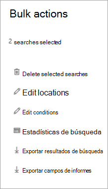

# Exportar contenido de un caso de eDiscovery principal

Una vez ejecutada correctamente la búsqueda, puede exportar los resultados de la búsqueda. Al exportar los resultados de la búsqueda, los elementos del buzón se descargan en archivos PST o como mensajes individuales. Al exportar contenido de sitios de SharePoint y OneDrive para la empresa, se exportan copias de documentos nativos de Office y otros documentos. También se exporta un archivo Results. csv que contiene información sobre todos los elementos que se exportan y un archivo de manifiesto (en formato XML) que contiene información sobre cada resultado de la búsqueda.
  
Puede exportar los resultados de una [sola búsqueda asociada a un caso](#export-the-results-of-a-single-search) o puede exportar los resultados de [varias búsquedas asociadas a un caso](#export-the-results-of-multiple-searches).
  
## Exportar los resultados de una búsqueda única

1. Vaya a [https://compliance.microsoft.com](https://compliance.microsoft.com) e inicie sesión con las credenciales de la cuenta de usuario a la que se le han asignado los permisos de eDiscovery adecuados.

2. En el panel de navegación izquierdo del centro de cumplimiento de Microsoft 365, haga clic en **Mostrar todos**y, a continuación, en **eDiscovery > Core**.

3. En la página **principal de eDiscovery** , seleccione el caso desde el que desea exportar los resultados de la búsqueda y, a continuación, haga clic en **abrir caso**.

4. En la página **principal** del caso, haga clic en la ficha **búsquedas** .

5. En la lista de búsquedas del caso, haga clic en la búsqueda desde la que desea exportar los resultados de la búsqueda y, a continuación, haga clic en **exportar resultados** en el control flotante.

    Se mostrará la página resultados de la **exportación** . 

    
  
    El flujo de trabajo para exportar los resultados de una búsqueda asociada a un caso de exhibición de documentos electrónicos principal es el mismo que para exportar los resultados de búsqueda para una búsqueda en la página **búsqueda de contenido** . Para obtener instrucciones paso a paso, consulte [exportar resultados](export-search-results.md)de la búsqueda de contenido.

    > [!NOTE]
    > Al exportar los resultados de búsqueda, tiene la opción de habilitar la desduplicación para que solo se exporte una copia de un mensaje de correo electrónico, aunque se hayan encontrado varias instancias del mismo mensaje en los buzones en los que se realizó la búsqueda. Para obtener más información acerca de la desduplicación y cómo se identifican los elementos duplicados, vea [desduplicación en resultados de la búsqueda de exhibición](de-duplication-in-ediscovery-search-results.md)de documentos electrónicos.

    Después de iniciar la exportación, los resultados de la búsqueda se preparan para la descarga, lo que significa que se cargan en una ubicación de almacenamiento de Azure proporcionada por Microsoft en la nube de Microsoft.
  
6. Haga clic en la pestaña **exportar** para mostrar la lista de trabajos de exportación del caso.
  
    Puede que tenga que hacer clic en **Actualizar** para actualizar la lista de trabajos de exportación para que muestre el trabajo de exportación que ha creado. Los trabajos de exportación tienen el mismo nombre que la búsqueda correspondiente con **_Export** anexado al nombre de búsqueda.

7. Haga clic en el trabajo de exportación que ha creado para mostrar la información de estado en la página flotante. Esta información incluye el porcentaje de elementos que se han transferido a la ubicación de almacenamiento de Azure.

8. Una vez transferidos todos los elementos, haga clic en **Descargar resultados** para descargar los resultados de la búsqueda en el equipo local. Para obtener más información sobre cómo descargar resultados de búsqueda, vea el paso 2 en [exportar resultados](export-search-results.md#step-2-download-the-search-results) de la búsqueda de contenido

## Exportar los resultados de varias búsquedas

Como alternativa a la exportación de los resultados de una sola búsqueda asociada a un caso, puede exportar los resultados de varias búsquedas desde el mismo caso en un solo trabajo de exportación. Exportar los resultados de varias búsquedas es más rápido y sencillo que exportar los resultados una búsqueda cada vez.
  
> [!NOTE]
> No puede exportar los resultados de varias búsquedas si una de esas búsquedas se configuró para buscar ubicaciones en suspensión.

1. Vaya a [https://compliance.microsoft.com](https://compliance.microsoft.com) e inicie sesión con las credenciales de la cuenta de usuario a la que se le han asignado los permisos de eDiscovery adecuados.

2. En el panel de navegación izquierdo del centro de cumplimiento de Microsoft 365, haga clic en **Mostrar todos**y, a continuación, en **eDiscovery > Core**.

3. En la página **principal de eDiscovery** , seleccione el caso desde el que desea exportar los resultados de la búsqueda y, a continuación, haga clic en **abrir caso**.

4. En la página **principal** del caso, haga clic en la ficha **búsquedas** .
    
5. En la lista de búsquedas del caso, active la casilla de verificación situada junto a dos o más búsquedas de las que desee exportar resultados de la búsqueda. 

   Aparece la página flotante **acciones en masa** . 

    
  
6. Haga clic en **exportar resultados**.

   Se mostrará la página resultados de la **exportación** . 

    
  
    En este momento, el flujo de trabajo para exportar los resultados de varias búsquedas asociadas a un caso de exhibición de documentos electrónicos principal es el mismo que exportar los resultados de la búsqueda para una sola búsqueda. Consulte el paso 5 de la sección anterior.

### Más información sobre cómo exportar los resultados de varias búsquedas

- Cuando se exportan los resultados de varias búsquedas, las consultas de búsqueda de todas las búsquedas se combinan mediante operadores **or** y, a continuación, se inicia la búsqueda combinada. Los resultados estimados de la búsqueda combinada se muestran en la página de flotante del trabajo de exportación seleccionado. A continuación, los resultados de la búsqueda se copian en la ubicación de almacenamiento de Azure en la nube de Microsoft. El estado del trabajo de copia también se muestra en la página de flotante. Como se indicó anteriormente, una vez que se han copiado todos los resultados de la búsqueda, puede descargarlos en un equipo local.

- El número máximo de palabras clave de las consultas para todas las búsquedas que desea exportar es de 500. Se trata del mismo límite para una sola búsqueda. Esto se debe a que el trabajo de exportación combina todas las consultas de búsqueda mediante el operador **or** . Si supera este límite, se devolverá un error. En este caso, tiene que exportar los resultados de menos búsquedas o simplificar las consultas de búsqueda de las búsquedas originales que desea exportar.

- Los resultados de la búsqueda que se exportan están organizados por la ubicación del contenido en la que se encontró el elemento. Esto significa que una ubicación de contenido en los resultados de la exportación puede tener elementos devueltos por búsquedas diferentes. Por ejemplo, si decide exportar los mensajes de correo electrónico de un archivo PST para cada buzón, el archivo PST podría tener resultados de varias búsquedas.

- Si más de una de las búsquedas que se exportan devuelven el mismo documento o elemento de correo electrónico de la misma ubicación de contenido, solo se exportará una copia del elemento.

- No puede editar una exportación para varias búsquedas después de crearla. Por ejemplo, no puede Agregar o quitar búsquedas del trabajo de exportación. Tiene que crear un trabajo de exportación para cambiar los resultados de la búsqueda que se van a exportar. Después de crear un trabajo de exportación, solo puede descargar los resultados en un equipo, reiniciar la exportación o eliminar el trabajo de exportación.

- Si reinicia la exportación, los cambios en las consultas de las búsquedas que componen el trabajo de exportación no afectarán a los resultados de la búsqueda que se recuperan. Cuando se reinicia una exportación, se ejecutará de nuevo el mismo trabajo de consulta de búsqueda combinado que se ejecutó al crear el trabajo de exportación.

- Además, si reinicia una exportación, los resultados de la búsqueda que se copian en la ubicación de almacenamiento de Azure sobrescribirán los resultados anteriores. Los resultados anteriores que se han copiado no estarán disponibles para su descarga.

- La preparación de los resultados de varias búsquedas para el análisis en la exhibición avanzada de documentos electrónicos (Classic) no está disponible. Solo puede preparar los resultados de una sola búsqueda para el análisis en la exhibición avanzada de documentos electrónicos (Classic).
