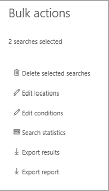

# Exportar contenido de un caso de exhibición de documentos electrónicos principal

Una vez ejecutada correctamente una búsqueda, puede exportar los resultados de la búsqueda. Al exportar los resultados de la búsqueda, los elementos del buzón se descargan en archivos PST o como mensajes individuales. Al exportar contenido de sitios de SharePoint y OneDrive para la Empresa, se exportan copias de documentos nativos de Office y otros documentos. También Results.csv archivo que contiene información sobre cada elemento exportado y un archivo de manifiesto (en formato XML) que contiene información sobre cada resultado de búsqueda.
  
Puede exportar los resultados de una sola búsqueda [asociada a](#export-the-results-of-a-single-search) un caso o exportar los resultados de varias búsquedas [asociadas a un caso.](#export-the-results-of-multiple-searches)
  
## Exportar los resultados de una sola búsqueda

1. Vaya e inicie sesión con las credenciales de la cuenta de usuario a la que se han asignado los permisos de exhibición de [https://compliance.microsoft.com](https://compliance.microsoft.com) documentos electrónicos adecuados.

2. En el panel de navegación izquierdo del Centro de cumplimiento de Microsoft 365, haga clic en Mostrar todo y, a continuación, haga clic en **eDiscovery > Principal.**

3. En la **página eDiscovery** principal, seleccione el caso desde el que desea exportar los resultados de la búsqueda y, a continuación, haga clic **en Abrir caso.**

4. En la **página principal** del caso, haga clic en la **pestaña** Búsquedas.

5. En la lista de búsquedas del caso, haga clic en la búsqueda desde la que desea exportar los resultados de la búsqueda y, a continuación, haga clic en Exportar resultados **en** el menú desplegable.

    Se **muestra la página** Exportar resultados. 

    
  
    El flujo de trabajo para exportar los resultados de una búsqueda asociada a un caso de exhibición de documentos electrónicos principal es el mismo que exportar los resultados de búsqueda de una búsqueda en la página **búsqueda de** contenido. Para obtener instrucciones paso a paso, vea [Exportar resultados de búsqueda de contenido.](export-search-results.md)

    > [!NOTE]
    > Al exportar los resultados de la búsqueda, tiene la opción de habilitar la desduplicación para que solo se exporte una copia de un mensaje de correo electrónico aunque se hayan encontrado varias instancias del mismo mensaje en los buzones en los que se ha buscado. Para obtener más información acerca de la desduplicación y cómo se identifican los elementos duplicados, vea Desduplicación en los resultados de la [búsqueda de exhibición de documentos electrónicos.](de-duplication-in-ediscovery-search-results.md)

    Después de iniciar la exportación, los resultados de la búsqueda están preparados para su descarga, lo que significa que se cargan en una ubicación de Azure Storage proporcionada por Microsoft en la nube de Microsoft.
  
6. Haga clic **en la pestaña** Exportar para mostrar la lista de trabajos de exportación del caso.
  
    Es posible que tenga que hacer clic **en Actualizar** para actualizar la lista de trabajos de exportación para que muestre el trabajo de exportación que creó. Los trabajos de exportación tienen el mismo nombre que la búsqueda correspondiente **con _Export** anexado al nombre de búsqueda.

7. Haga clic en el trabajo de exportación que creó para mostrar información de estado en la página desplegable. Esta información incluye el porcentaje de elementos que se han transferido a la ubicación de Azure Storage.

8. Después de transferir todos los elementos, haga clic en **Descargar resultados** para descargar los resultados de la búsqueda en el equipo local. Para obtener más información sobre la descarga de resultados de búsqueda, vea el paso 2 en [Exportar resultados de búsqueda de contenido](export-search-results.md#step-2-download-the-search-results)

## Exportar los resultados de varias búsquedas

Como alternativa a la exportación de los resultados de una sola búsqueda asociada a un caso, puede exportar los resultados de varias búsquedas desde el mismo caso en un único trabajo de exportación. Exportar los resultados de varias búsquedas es más rápido y fácil que exportar los resultados de una en una.
  
> [!NOTE]
> No puede exportar los resultados de varias búsquedas si una de ellas se configuró para buscar ubicaciones en espera.

1. Vaya e inicie sesión con las credenciales de la cuenta de usuario a la que se han asignado los permisos de exhibición de [https://compliance.microsoft.com](https://compliance.microsoft.com) documentos electrónicos adecuados.

2. En el panel de navegación izquierdo del Centro de cumplimiento de Microsoft 365, haga clic en Mostrar todo y, a continuación, haga clic en **eDiscovery > Principal.**

3. En la **página eDiscovery** principal, seleccione el caso desde el que desea exportar los resultados de la búsqueda y, a continuación, haga clic **en Abrir caso.**

4. En la **página principal** del caso, haga clic en la **pestaña** Búsquedas.
    
5. En la lista de búsquedas del caso, active la casilla junto a dos o más búsquedas de las que desee exportar los resultados de la búsqueda. 

   Aparece **la página desplegable Acciones** masivas. 

    
  
6. Haga clic **en Exportar resultados.**

   Se **muestra la página** Exportar resultados. 

    
  
    En este punto, el flujo de trabajo para exportar los resultados de varias búsquedas asociadas a un caso de exhibición de documentos electrónicos principal es el mismo que para exportar los resultados de búsqueda de una sola búsqueda. Vea el paso 5 de la sección anterior.

### Más información sobre cómo exportar los resultados de varias búsquedas

- Al exportar los resultados de varias búsquedas, las consultas de búsqueda de todas las búsquedas se combinan mediante operadores **OR** y, a continuación, se inicia la búsqueda combinada. Los resultados estimados de la búsqueda combinada se muestran en la página desplegable del trabajo de exportación seleccionado. A continuación, los resultados de la búsqueda se copian en la ubicación de Azure Storage en la nube de Microsoft. El estado del trabajo de copia también se muestra en la página desplegable. Como se indicó anteriormente, después de copiar todos los resultados de la búsqueda, puede descargarlos en un equipo local.

- El número máximo de palabras clave de las consultas para todas las búsquedas que desea exportar es 500. Este es el mismo límite para una sola búsqueda. Esto se debe a que el trabajo de exportación combina todas las consultas de búsqueda mediante el operador **OR.** Si supera este límite, se devolverá un error. En este caso, debe exportar los resultados de menos búsquedas o simplificar las consultas de búsqueda de las búsquedas originales que desea exportar.

- Los resultados de la búsqueda que se exportan se organizan por la ubicación de contenido en la que se encontró el elemento. Esto significa que una ubicación de contenido en los resultados de exportación puede tener elementos devueltos por distintas búsquedas. Por ejemplo, si decide exportar mensajes de correo electrónico en un archivo PST para cada buzón de correo, es posible que el archivo PST tenga resultados de varias búsquedas.

- Si más de una de las búsquedas que exporta devuelve el mismo elemento de correo electrónico o documento de la misma ubicación de contenido, solo se exportará una copia del elemento.

- No puede editar una exportación para varias búsquedas después de crearla. Por ejemplo, no puede agregar o quitar búsquedas del trabajo de exportación. Debe crear un trabajo de exportación para cambiar los resultados de búsqueda que se exportan. Después de crear un trabajo de exportación, solo puede descargar los resultados en un equipo, reiniciar la exportación o eliminar el trabajo de exportación.

- Si reinicia la exportación, los cambios en las consultas de las búsquedas que conste el trabajo de exportación no afectarán a los resultados de búsqueda que se recuperan. Al reiniciar una exportación, se volverá a ejecutar el mismo trabajo de consulta de búsqueda combinado que se ejecutaba cuando se creó el trabajo de exportación.

- Además, si reinicia una exportación, los resultados de la búsqueda que se copian en la ubicación de Azure Storage sobrescriben los resultados anteriores. Los resultados anteriores que se copiaron no estarán disponibles para su descarga.
