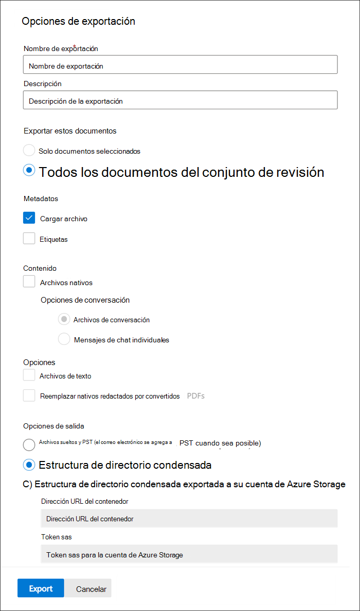

# Exportar documentos desde un conjunto de revisiónExport documents from a review set

La exportación permite a los usuarios personalizar el contenido que se incluye en el paquete de descarga.Export allows users to customize the content that is included in the download package. La herramienta de exportación proporciona una página de configuración con la siguiente configuración:The Export tool provides a configuration page with the following settings:

## Opciones de exportaciónExport options

- Nombre de exportación: nombre del trabajo de exportación.Export name: Name of the export job.

- Descripción: campo de texto libre para agregar una descripción.Description: Free-text field for you to add a description.

- Exportar estos documentos:Export these documents:

  - Solo documentos seleccionados: exporta solo los documentos que están seleccionados actualmente.Selected documents only - Exports only the documents that are currently selected.
  
  - Todos los documentos del conjunto de revisiones: exporta todos los documentos en el conjunto de revisiónAll documents in the review set - Exports all documents in the review set

- MetadatosMetadata
  
  - Cargar archivo: este archivo contiene metadatos para cada archivo.Load file - This file contains metadata for each file. consulte [Document Metadata Fields in Advanced eDiscovery](document-metadata-fields-in-Advanced-eDiscovery.md) para obtener más información sobre los campos que se incluyen.see [Document metadata fields in Advanced eDiscovery](document-metadata-fields-in-Advanced-eDiscovery.md) for more information about what fields are included. Normalmente, las herramientas de eDiscovery de terceros pueden recopilar este archivo.This file can typically be ingested by third-party eDiscovery tools.
  
  - Etiquetas: cuando se selecciona, la información de etiquetado se incluirá en el archivo de carga.Tags - When selected, tagging information will be included in the load file.

- ContenidoContent
  
  - Archivos nativos: Marque esta casilla para incluir los archivos nativos.Native files - Select this checkbox to include the native files.
  
  - Opciones de conversaciónConversation options
    
    - Archivos de conversación: exportar mensajes de chat reconstruidos.Conversation files - Export reconstructed chat messages. Este formato presenta las conversaciones en un formulario similar al que ven los usuarios en la aplicación nativa.This format presents conversations in a form that resembles what users see in the native application.
    
    - Mensajes de chat individuales: exporte los archivos de conversación originales tal y como están almacenados en Microsoft 365.Individual chat messages - Export the original conversation files as they are stored in Microsoft 365.

- OpcionesOptions

  - Archivos de texto: incluye versiones de texto extraídos de archivos nativos.Text files - Include extracted text versions of native files.
  
  - Reemplazar originales censurados con PDF convertidos: si se generan archivos PDF creados durante la revisión, estos archivos están disponibles para la exportación.Replace redacted natives with converted PDFs - If redacted PDF files are generated during review, these files are available for export. Puede elegir exportar solo los archivos nativos que se han censurado (no seleccionando esta opción) o puede seleccionar esta opción para exportar los archivos PDF que contienen las redacciones reales.You can choose to export only the native files that were redacted (by not selecting this option) or you can select this option to export the PDF files that contain the actual redactions.

- Opciones de salida (el contenido exportado está disponible para su descarga directa a través de un explorador Web o se puede enviar a una cuenta de almacenamiento de Azure.Output options (Exported content is either available for download directly through a web browser or can be sent to an Azure Storage account. Las dos primeras opciones permiten la descarga directa).The first two options enable direct download.)
  
  - Archivos separados y PST (el correo electrónico se agrega a los PST cuando sea posible): los archivos se exportan en un formato similar a la estructura de directorios original que ven los usuarios en sus aplicaciones nativas.Loose files and PSTs (email is added to PSTs when possible) - Files are exported in a format that resembles the original directory structure seen by users in their native applications.  Para obtener más información, consulte la sección [archivos sueltos y la estructura de exportación de PST](#loose-files-and-pst-export-structure) .For more information, see the [Loose files and PST export structure](#loose-files-and-pst-export-structure) section.
  
  - Estructura de directorios condensados: los archivos se exportan e incluyen en la descarga.Condensed directory structure - Files are exported and included in the download.
  
  - Estructura de directorios condensada exportada a su cuenta de almacenamiento de Azure: los archivos se exportan al accouunt de almacenamiento de Azure de su organización.Condensed directory structure exported to your Azure Storage account - Files are exported to your organization's Azure Storage accouunt.

## Archivos sueltos y estructura de exportación de PSTLoose files and PST export structure

Si selecciona esta opción de exportación, el contenido exportado se organiza en la estructura siguiente:If you select this export option, the exported content is organized in the following structure:

- Carpeta raíz: esta carpeta en la ExportName.zip con nombreRoot folder – This folder in named ExportName.zip
  
  - Archivo de metadatos de Export_load_file.csv.Export_load_file.csv - Metadata file.
  
  - Summary.csv: un archivo de resumen que también contiene estadísticas de exportación.Summary.csv - A summary file that also contains export statistics.
  
  - Exchange: esta carpeta contiene todo el contenido de Exchange en formato de archivo nativo.Exchange - This folder contains all content from Exchange in native file format. Los archivos nativos se reemplazan con documentos PDF censurados si ha seleccionado la opción **reemplazar archivos nativos censurados con archivos PDF convertidos** .Natives files are replaced with redacted PDFs if you selected the **Replace redacted natives with converted PDFs** option.
  
  - SharePoint = esta carpeta contiene todo el contenido nativo de SharePoint en un formato de archivo nativo.SharePoint = This folder contains all native content from SharePoint in a native file format. Los archivos nativos se reemplazan con documentos PDF censurados si ha seleccionado la opción **reemplazar archivos nativos censurados con archivos PDF convertidos** .Natives files are replaced with redacted PDFs if you selected the **Replace redacted natives with converted PDFs** option.

## Estructura de directorios condensadaCondensed directory structure

- Carpeta raíz: esta carpeta se denomina ExportName.zipRoot folder - This folder is named ExportName.zip
  
  - Archivo de metadatos de Export_load_file.csv.Export_load_file.csv - Metadata file.
  
  - Summary.txt: un archivo de resumen que también contiene estadísticas de exportación.Summary.txt - A summary file that also contains export statistics.
  
  - Input_or_native_files: esta carpeta contiene todos los archivos nativos que se exportaron.Input_or_native_files - This folder contains all the native files that were exported. Si exporta archivos PDF censurados, no se colocan en archivos PST.If you export redacted PDF files, they are not put in PST files. En su lugar, se agregan a una carpeta separada.Instead, they're added to a separated folder.
  
  - Error_files: esta carpeta contiene los siguientes archivos de error, si se incluyen en la exportación:Error_files - This folder contains the following error files, if they are included in the export:
    
    - ExtractionError.ExtractionError. Un archivo CSV que contiene los metadatos disponibles de los archivos que no se han extraído correctamente de los archivos principales.A CSV file that contains any available metadata of files that weren't properly extracted from parent files.
    
    - ProcessingError: este archivo contiene una lista de documentos con errores de procesamiento.ProcessingError – This file contains a list of documents with processing errors. Este contenido es de nivel de elemento, lo que significa que si un archivo adjunto produjo un error de procesamiento, el mensaje de correo electrónico que contiene los datos adjuntos se incluye en esta carpeta.This content is item-level, meaning if an attachment resulted in a processing error, the email message that contains the attachment is included in this folder.
  
  - Extracted_text_files: esta carpeta contiene todos los archivos de texto extraídos que se generaron en el procesamiento.Extracted_text_files - This folder contains all of the extracted text files that were generated at processing.

> [!NOTE]
> Los trabajos de exportación se conservan durante la vigencia del caso y se pueden descargar siempre y cuando no se elimine el caso.Export jobs are retained for the life of the case and can be downloaded as long as the case isn't deleted.
