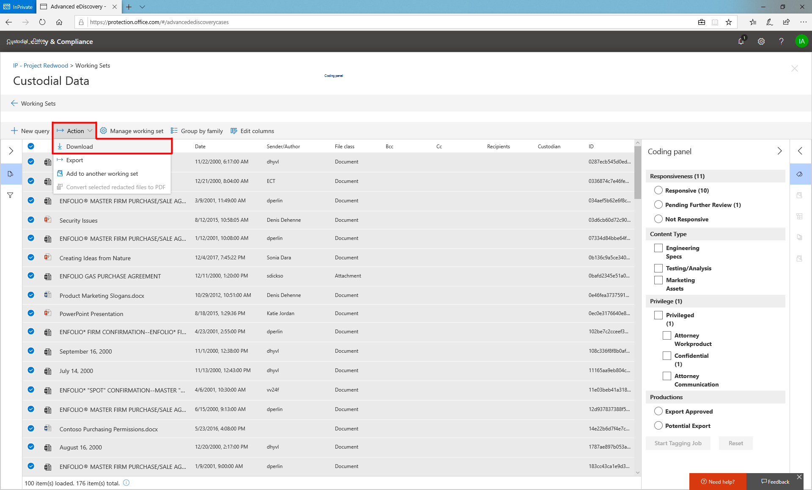

# Exportar documentos desde un conjunto de revisión

Puede exportar el contenido para la presentación o la revisión externa a partir de un conjunto de revisión por uno de los siguientes métodos:

- [Descargar documentos](#download-documents-from-a-review-set)
 
- [Exportar documentos](#export-documents-from-a-review-set)

## Descargar documentos de un conjunto de revisión

La descarga ofrece una forma sencilla de descargar contenido de un conjunto de revisión en formato nativo. Aprovecha las características de transferencia de datos del explorador para que aparezca un mensaje del explorador una vez que la descarga esté lista. Los archivos descargados con este método se comprimen en un archivo contenedor y serán archivos de nivel de elemento. Esto significa que, si selecciona un archivo adjunto, recibirá automáticamente el correo electrónico con los datos adjuntos incluidos. De forma similar, si selecciona una hoja de cálculo de Excel que estaba incrustada en un documento de Word, recibirá el documento de Word con la hoja de cálculo de Excel incrustada. Los elementos descargados conservarán la fecha de la última modificación, que se puede ver como una propiedad de archivo.

Para descargar contenido de un conjunto de revisión, seleccione los archivos que desea descargar y, a continuación, seleccione "Descargar" en el menú acciones.

## Exportar documentos desde un conjunto de revisión

La exportación permite a los usuarios personalizar el contenido que se incluye en el paquete de descarga. Proporciona una página de configuración con la siguiente configuración:

### Archivo de metadatos

Esto puede considerarse el "Cargar archivo" que contiene metadatos asociados con los archivos que se exportan. Para obtener una lista de los campos exportados disponibles en el archivo de metadatos, consulte [Document Metadata Fields in Advanced eDiscovery](document-metadata-fields-in-Advanced-eDiscovery.md). Por lo general, este archivo puede ser recopilado por herramientas de terceros.

### Datos de etiqueta

Este contenido se agregaría como campos en el archivo de metadatos. Contiene toda la información de etiqueta aplicada en los conjuntos de revisión.

### Archivos de texto

Los archivos de texto se pueden generar para cada archivo exportado de un conjunto de revisión. A menudo, los asociados de servicios necesitan estos archivos como parte de la recopilación de datos en herramientas de terceros.

### Archivos censurados

Si se generan archivos PDF censurados durante la revisión, estos archivos están disponibles durante la exportación. Puede decidir si desea exportar solo los archivos nativos o reemplazar los archivos nativos que requerían censura con los archivos PDF que contienen las redacciones reales.

### Ubicación de exportación

El contenido exportado se entrega en un BLOB de Azure o el BLOB de un cliente de Microsoft se puede usar si los detalles se proporcionan en la exportación.

### Exportar estructura

Cuando se exporta contenido desde un conjunto de revisión, el contenido se organiza en la estructura siguiente.

  - Carpeta raíz: identificador de descarga
    
      - Exportar\_archivo\_de carga. csv = archivo de metadatos
    
      - Summary. txt = un archivo de resumen con las estadísticas de exportación
    
      - Archivos\_nativos\_o de entrada = contiene todos los archivos nativos
    
      - Archivos\_de errores = contiene los archivos de error incluidos en la exportación
        
          - ExtractionError: un CSV que contiene los metadatos disponibles de los archivos que no se han extraído correctamente de los archivos principales
        
          - ProcessingError: contenido con errores de procesamiento. Este contenido es el significado del nivel de elemento si los datos adjuntos experimentan un error de procesamiento, el correo electrónico que contiene los datos adjuntos se incluirá en esta carpeta.
    
      - Archivos\_de\_texto extraídos = contiene todos los archivos de texto extraídos generados en el procesamiento.
