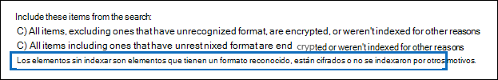

# <a name="export-content-search-results"></a>Exportar resultados de la búsqueda de contenido

Después de ejecutar correctamente una búsqueda de contenido, puede exportar los resultados de la búsqueda a un equipo local. Cuando exporta los resultados de correo electrónico, estos se descargan en su equipo como archivos PST. Al exportar contenido de sitios de SharePoint y OneDrive para la Empresa, se exportan copias de documentos nativos de Office. Hay otros documentos e informes incluidos con los resultados de búsqueda exportados.
  
Exportar los resultados de una búsqueda de contenido implica preparar los resultados y, a continuación, descargarlos en un equipo local.
  
## <a name="before-you-export-content-search-results"></a>Antes de exportar resultados de búsqueda de contenido

- Para exportar los resultados de la búsqueda, debe tener asignado el rol de administración Exportar en el Centro de seguridad & cumplimiento. Este rol se asigna al grupo de roles de administrador de exhibición de documentos electrónicos integrado. No se asigna de forma predeterminada al grupo de roles de administración de la organización. Para obtener más información, consulte [Asignar permisos de exhibición de documentos electrónicos](assign-ediscovery-permissions.md).

- El equipo que use para exportar los resultados de búsqueda debe cumplir los siguientes requisitos del sistema:
  
  - Versiones de 32 o 64 bits de Windows 7 y versiones posteriores
  
  - Microsoft .NET Framework 4.7
  
- Debe usar uno de los siguientes exploradores compatibles para ejecutar la herramienta de exportación de exhibición de documentos<sup>electrónicos 1</sup>:

  - Microsoft Edge <sup>2</sup>
  
    O

  - Microsoft Internet Explorer 10 y versiones posteriores
  
  > [!NOTE]
  > <sup>1</sup> Microsoft no fabrica extensiones de terceros ni complementos para ClickOnce aplicaciones. No se admite la exportación de resultados de búsqueda mediante un explorador no compatible con extensiones o complementos de terceros.<br/>
  > <sup>2</sup> Como resultado de los cambios recientes en Microsoft Edge, ClickOnce compatibilidad ya no está habilitada de forma predeterminada. Para obtener instrucciones sobre cómo ClickOnce compatibilidad en Edge, vea [Use the eDiscovery Export Tool in Microsoft Edge](configure-edge-to-export-search-results.md).
  
- Se recomienda descargar los resultados de la búsqueda en un equipo local. Sin embargo, para evitar que el firewall o la infraestructura de proxy de la empresa causen problemas al descargar resultados de búsqueda, es posible que considere la posibilidad de descargar resultados de búsqueda en un escritorio virtual fuera de la red. Esto puede disminuir los tiempos de espera que se producen en las conexiones de datos de Azure al exportar un gran número de archivos. Para obtener más información acerca de los escritorios virtuales, consulta [Windows Virtual Desktop](https://azure.microsoft.com/services/virtual-desktop). 

- Para mejorar el rendimiento al descargar resultados de búsqueda, considere la posibilidad de dividir las búsquedas que devuelven un gran conjunto de resultados en búsquedas más pequeñas. Por ejemplo, puede usar intervalos de fechas en las consultas de búsqueda para devolver un conjunto más pequeño de resultados que se pueden descargar más rápido.
  
- Al exportar los resultados de la búsqueda, los datos se almacenan temporalmente en una ubicación de Azure Storage proporcionada por Microsoft en la nube de Microsoft antes de que se descarguen en el equipo local. Asegúrese de que su organización puede conectarse al punto de conexión de Azure, que **\* es .blob.core.windows.net** (el comodín representa un identificador único para la exportación). Los datos de resultados de búsqueda se eliminan de la ubicación de Azure Storage dos semanas después de su creación. 
  
- Si su organización usa un servidor proxy para comunicarse con Internet, debe definir la configuración del servidor proxy en el equipo que use para exportar los resultados de la búsqueda (para que el servidor proxy pueda autenticar la herramienta de exportación). Para ello, abra el archivo  *machine.config*  en la ubicación que coincida con la versión de Windows. 
  
  - **32 bits:**`%windir%\Microsoft.NET\Framework\[version]\Config\machine.config`
  
  - **64 bits:**`%windir%\Microsoft.NET\Framework64\[version]\Config\machine.config`
  
    Agregue las siguientes líneas al  *archivomachine.config*  en algún lugar entre las  `<configuration>`  `</configuration>` etiquetas y. Asegúrese de reemplazar  `ProxyServer` y con los valores  `Port` correctos para su organización; por ejemplo,  `proxy01.contoso.com:80` . 
  
    ```xml
    <system.net>
       <defaultProxy enabled="true" useDefaultCredentials="true">
         <proxy proxyaddress="https://ProxyServer :Port " 
                usesystemdefault="False" 
                bypassonlocal="True" 
                autoDetect="False" />
       </defaultProxy>
    </system.net>
    ```

## <a name="step-1-prepare-search-results-for-export"></a>Paso 1: Preparar los resultados de búsqueda para la exportación

El primer paso es preparar los resultados de búsqueda para la exportación. Al preparar los resultados, se cargan en una ubicación de Azure Storage proporcionada por Microsoft en la nube de Microsoft. El contenido de buzones y sitios se carga a una velocidad máxima de 2 GB por hora.
  
1. Vaya a [https://protection.office.com](https://protection.office.com).
  
2. Inicie sesión con su cuenta profesional o educativa.
  
3. En el panel izquierdo del Centro de seguridad y & cumplimiento, haga clic en **Buscar** \> **en búsqueda de contenido**.
  
4. En la **página Búsqueda de contenido,** seleccione una búsqueda. 
  
5. En el panel de detalles, en **Exportar resultados a un equipo**, haga clic en **Iniciar la exportación**.
  
    > [!NOTE]
    > Si los resultados de una búsqueda son de hace más de 7 días, se le solicitará que actualice los resultados de búsqueda. Si esto ocurre, cancele la exportación, haga clic en **Actualizar los resultados de búsqueda** en el panel de detalles para la búsqueda seleccionada y, a continuación, inicie la exportación de nuevo después de que se actualicen los resultados.  
  
6. En la **página Exportar los resultados de búsqueda,** en **Opciones de salida,** elija una de las siguientes opciones:
  
    - Todos los elementos, excluidos los que tienen formato no reconocido, están cifrados o no se indizaron por otros motivos
  
    - Todos los elementos, incluidos los que tienen formato no reconocido, se cifran o no se indizan por otros motivos
  
    - Solo los elementos que tienen un formato no reconocido, están cifrados o no se indexaron por otros motivos
  
    Vea la [sección Más información](#more-information) para obtener una descripción sobre cómo se exportan los elementos parcialmente indizados. Para obtener más información acerca de los elementos parcialmente indizados, vea [Partially indexed items in Content Search](partially-indexed-items-in-content-search.md).
  
7. En **Exportar contenido de Exchange como**, elija una de las siguientes opciones:
  
    - **Un archivo PST para cada buzón:** Exporta un archivo PST para cada buzón de usuario que contiene los resultados de la búsqueda. Los resultados del buzón de archivo del usuario se incluyen en el mismo archivo PST. Esta opción reproduce la estructura de carpetas del buzón de correo del buzón de origen.
  
    - **Un archivo PST que contiene todos los mensajes:** Exporta un único archivo PST (denominado *Exchange.pst*) que contiene los resultados de la búsqueda de todos los buzones de origen incluidos en la búsqueda. Esta opción reproduce la estructura de carpetas de buzones de correo para cada mensaje.
  
    - **Un archivo PST que contiene todos los mensajes de una sola carpeta:** Exporta los resultados de la búsqueda a un único archivo PST donde todos los mensajes se encuentran en una única carpeta de nivel superior. Esta opción permite a los revisores revisar los elementos en orden cronológico (los elementos se ordenan por fecha de envío) sin tener que navegar por la estructura de carpetas de buzones original de cada elemento.
  
    - **Mensajes individuales:** Exporta los resultados de búsqueda como mensajes de correo electrónico individuales, con el formato .msg. Si selecciona esta opción, los resultados de la búsqueda de correo electrónico se exportan a una carpeta del sistema de archivos. La ruta de acceso de carpeta para mensajes individuales es la misma que la que se usa si exportó los resultados a archivos PST.
  
      > [!IMPORTANT]
      > Para descifrar mensajes protegidos por RMS cuando se exportan, debe exportar los resultados de búsqueda de correo electrónico como mensajes individuales. Los mensajes cifrados permanecerán cifrados si exporta los resultados de la búsqueda como un archivo PST. Para obtener más información, vea [Decrypting RMS-protected email messages and encrypted file attachments](#decrypting-rms-protected-email-messages-and-encrypted-file-attachments) en este artículo.
  
8. Haga clic en **la casilla Habilitar desduplicación** para excluir mensajes duplicados. Esta opción solo aparece si los orígenes de contenido de la búsqueda incluyen buzones de Exchange o carpetas públicas. 
  
    Si selecciona esta opción, solo se exportará una copia de un mensaje incluso si se encuentran varias copias del mismo mensaje en los buzones que se han buscado. El informe de resultados de exportación (Results.csv) contendrá una fila para cada copia de un mensaje duplicado de modo que pueda identificar los buzones (o carpetas públicas) que contienen una copia del mensaje duplicado. Para obtener más información sobre la desduplicación y cómo se identifican los elementos duplicados, vea [Desduplicación en](de-duplication-in-ediscovery-search-results.md)los resultados de búsqueda de exhibición de documentos electrónicos .
  
9. Haga clic en **la casilla Incluir versiones para documentos de SharePoint** para exportar todas las versiones de documentos de SharePoint. Esta opción solo aparece si los orígenes de contenido de la búsqueda incluyen sitios de SharePoint o OneDrive para la Empresa. 
  
10. Haga clic en la casilla Exportar archivos en una carpeta **comprimida (comprimida)** para exportar los resultados de búsqueda a carpetas comprimidas. Esta opción solo está disponible cuando elige exportar elementos de Exchange como mensajes individuales y cuando los resultados de la búsqueda incluyen documentos de SharePoint o OneDrive. Esta opción se usa principalmente para trabajar alrededor del límite de 260 caracteres en los nombres de ruta de acceso de archivos de Windows cuando se exportan elementos. Vea "Nombres de archivo de elementos exportados" en la [sección Más](#more-information) información. 
  
11. Haga clic en **Iniciar la exportación**. Los resultados de la búsqueda están preparados para su descarga, lo que significa que se cargan en una ubicación de Azure Storage en la nube de Microsoft. Esto podría llevar varios minutos.

Consulte la siguiente sección para obtener instrucciones para descargar los resultados de búsqueda exportados.
  
## <a name="step-2-download-the-search-results"></a>Paso 2: Descargar los resultados de búsqueda

El siguiente paso es descargar los resultados de búsqueda de la ubicación de Azure Storage en el equipo local.
  
1. En la **página Búsqueda de contenido,** haga clic en **la pestaña** Exportaciones. 
  
   Es posible que tenga que hacer clic **en Actualizar** para actualizar la lista de trabajos de exportación para que muestre el trabajo de exportación que creó. Los trabajos de exportación tienen el mismo nombre que la búsqueda correspondiente **_Export** anexado al nombre de búsqueda.
  
2. Seleccione el trabajo de exportación que creó en el paso 1.

3. En la página desplegable en **Exportar clave**, haga clic en Copiar en **el Portapapeles.** Esta clave se usa en el paso 6 para descargar los resultados de la búsqueda.
  
4. Haga clic en **Descargar resultados**.

5. Si se le pide que instale la herramienta de exportación **de exhibición** de documentos electrónicos, haga clic **en Instalar**.

6. En la **herramienta de exportación de exhibición de** documentos electrónicos , haga lo siguiente:

   

   1. Pegue la clave de exportación que copió en el paso 3 en el cuadro correspondiente.
  
   2. Haga clic en **Examinar** para especificar la ubicación en la que desea descargar los archivos de los resultados de la búsqueda.
  
      > [!IMPORTANT]
      >  Debido a la alta actividad de red durante la descarga, debe descargar los resultados de búsqueda solo en una ubicación en una unidad interna del equipo local. Para obtener la mejor experiencia de descarga, siga estas directrices: <br/>
      >- No descargue los resultados de búsqueda en una ruta unc, una unidad de red asignada, una unidad USB externa o una cuenta de OneDrive para la Empresa sincronizada.<br/>
      >- Deshabilite el examen antivirus de la carpeta en la que descarga el resultado de la búsqueda.<br/>
      >- Descargue los resultados de búsqueda en diferentes carpetas para trabajos de descarga simultáneos.

6. Haga clic en **Iniciar** para descargar los resultados de la búsqueda en el equipo.
  
    La **Herramienta de exportación de exhibición de documentos electrónicos** muestra información del estado acerca del proceso de exportación, incluida una estimación del número (y tamaño) de los elementos restantes que se van a descargar. Una vez completado el proceso de exportación, puede obtener acceso a los archivos en la ubicación donde se descargaron.

## <a name="more-information"></a>Más información

A continuación, encontrará más información sobre la exportación de resultados de búsqueda.
  
[Límites de exportación](#export-limits)
  
[Exportar informes](#export-reports)
  
[Exportar elementos parcialmente indizados](#exporting-partially-indexed-items)

[Exportación de mensajes individuales o archivos PST](#exporting-individual-messages-or-pst-files)
  
[Exportar resultados de más de 100 000 buzones](#exporting-results-from-more-than-100000-mailboxes)

[Descifrar mensajes de correo electrónico protegidos por RMS y datos adjuntos de archivos cifrados](#decrypting-rms-protected-email-messages-and-encrypted-file-attachments)

[Nombres de archivo de elementos exportados](#filenames-of-exported-items)  
  
[Varios](#miscellaneous)
  
### <a name="export-limits"></a>Límites de exportación

Para obtener información acerca de los límites al exportar resultados de búsqueda de contenido, vea la sección "Límites de exportación" [en Limits for content search](limits-for-content-search.md#export-limits).

### <a name="export-reports"></a>Exportar informes
  
- Al exportar los resultados de búsqueda, se incluyen los siguientes informes además de los resultados de búsqueda.
  
  - **Resumen de exportación** Documento de Excel que contiene un resumen de la exportación. Esto incluye información como el número de orígenes de contenido que se buscaron, los tamaños estimados y descargados de los resultados de la búsqueda y el número estimado y descargado de elementos que se exportaron.
  
  - **Manifiesto** Un archivo de manifiesto (en formato XML) que contiene información sobre cada elemento incluido en los resultados de la búsqueda.
  
  - **Resultados** Un documento de Excel que contiene información sobre cada elemento que se descarga como resultado de la búsqueda. Para el correo electrónico, un registro de resultados contiene información acerca de cada mensaje, incluidos:
  
    - La ubicación del mensaje en el buzón de origen (incluido si el mensaje se encuentra en el buzón de archivo o en el principal).
  
    - La fecha en que se envió o se recibió el mensaje.

    - La línea Asunto del mensaje.

    - El remitente y los destinatarios del mensaje.

    - Si el mensaje es un mensaje duplicado si ha habilitado la opción de desduplicación al exportar los resultados de búsqueda. Los mensajes duplicados tienen un valor en la **columna Duplicado** a elemento que identifica el mensaje como duplicado. El valor de la **columna Duplicar a elemento** contiene la identidad del elemento del mensaje que se exportó. Para obtener más información, vea [Desduplicación en los](de-duplication-in-ediscovery-search-results.md)resultados de búsqueda de exhibición de documentos electrónicos .

      Para los documentos de sitios de SharePoint y OneDrive para la Empresa, el registro de resultados contiene información sobre cada documento, incluidos:

      - La dirección URL del documento.

      - La dirección URL de la colección de sitio donde se ubica el documento.

      - La fecha en la que el documento se modificó por última vez.

      - El nombre del documento (que está ubicado en la columna Asunto del registro de resultados).

  - **Elementos sin indexar** Un documento de Excel que contiene información sobre los elementos parcialmente indizados que se incluirían en los resultados de búsqueda. Si no incluye elementos parcialmente indizados al generar el informe de resultados de búsqueda, este informe se seguirá descargando, pero estará vacío.

  - **Errores y advertencias** Contiene errores y advertencias para los archivos encontrados durante la exportación. Consulte la columna Detalles del error para obtener información específica de cada error o advertencia individual.

  - **Elementos omitido** Al exportar resultados de búsqueda desde sitios de SharePoint y OneDrive para la Empresa, la exportación normalmente incluirá un informe de elementos omitido (SkippedItems.csv). Los elementos citados en este informe suelen ser elementos que no se descargarán, como una carpeta o un conjunto de documentos. No exportar estos tipos de elementos es por diseño. Para otros elementos omitido, el campo "Tipo de error" y "Detalles de error" del informe de elementos omitido muestra el motivo por el que se omitió el elemento y no se descargó con los demás resultados de búsqueda.

  - **Registro de seguimiento** Contiene información de registro detallada sobre el proceso de exportación y puede ayudar a descubrir problemas durante la exportación.
  
    > [!NOTE]
    > Solo puede exportar estos documentos sin tener que exportar los resultados de búsqueda reales. Vea [Exportar un informe de búsqueda de contenido](export-a-content-search-report.md). 
  
### <a name="exporting-partially-indexed-items"></a>Exportar elementos parcialmente indizados
  
- Si exporta elementos de buzón de correo de una búsqueda de contenido que devuelve todos los elementos de buzón de los resultados de la búsqueda (ya que no hay palabras clave incluidas en la consulta de búsqueda), los elementos parcialmente indizados no se copiarán en el archivo PST que contiene los elementos sin indizar. Esto se debe a que todos los elementos, incluidos los elementos parcialmente indizados, se incluyen automáticamente en los resultados de búsqueda normales. Esto significa que los elementos parcialmente indizados se incluirán en un archivo PST (o como mensajes individuales) que contenga los otros elementos indizados.

    Si exporta los elementos indexados y parcialmente indizados o si exporta solo los elementos indizados de una búsqueda de contenido que devuelve todos los elementos, se descargará el mismo número de elementos. Esto sucede aunque los resultados de búsqueda estimados para la búsqueda de contenido (que se muestran en las estadísticas de búsqueda en el Centro de seguridad y cumplimiento de &) aún incluirán una estimación independiente para el número de elementos parcialmente indizados. Por ejemplo, supongamos que la estimación de una búsqueda que incluye todos los elementos (sin palabras clave en la consulta de búsqueda) muestra que se encontraron 1.000 elementos y que también se encontraron 200 elementos parcialmente indizados. En este caso, los 1.000 elementos incluyen los elementos parcialmente indizados porque la búsqueda devuelve todos los elementos. En otras palabras, hay 1.000 elementos totales devueltos por la búsqueda y no 1.200 elementos (como puede esperar). Si exporta los resultados de esta búsqueda y elige exportar elementos indexados e parcialmente indexados (o exportar solo elementos parcialmente indizados), se descargarán 1.000 elementos. De nuevo, esto se debe a que los elementos parcialmente indizados se incluyen con los resultados normales (indizados) cuando se usa una consulta de búsqueda en blanco para devolver todos los elementos. En este mismo ejemplo, si decide exportar solo elementos parcialmente indizados, solo se descargarán los 200 elementos sin indexar.

    Tenga en cuenta también que en el ejemplo anterior (al exportar elementos indizados  y parcialmente indizados o exportar solo elementos indizados), el informe Exportar resumen incluido con los resultados de búsqueda exportados enumeraría 1.000 elementos estimados y 1.000 elementos descargados por los mismos motivos que se han descrito anteriormente. 

- Si la búsqueda de la que exporta los resultados era una búsqueda de ubicaciones de contenido específicas o de todas las ubicaciones de contenido de la organización, solo se exportarán los elementos parciales de las ubicaciones de contenido que contienen elementos que coinciden con los criterios de búsqueda. En otras palabras, si no se encuentra ningún resultado de búsqueda en un buzón o sitio, no se exportarán los elementos parcialmente indizados de ese buzón o sitio. El motivo es que exportar elementos parcialmente indizados desde muchas ubicaciones de la organización podría aumentar la probabilidad de errores de exportación y aumentar el tiempo necesario para exportar y descargar los resultados de la búsqueda.

    Para exportar elementos parcialmente indizados desde todas las ubicaciones de contenido de una búsqueda, configure la búsqueda para devolver todos los elementos (quitando las palabras clave de la consulta de búsqueda) y, a continuación, exporte solo elementos parcialmente indizados al exportar los resultados de la búsqueda.

    
  
- Al exportar resultados de búsqueda desde sitios de SharePoint o OneDrive para la Empresa, la capacidad de exportar elementos sin indizar también depende de la opción de exportación que seleccione y de si un sitio que se ha buscado contiene un elemento indizado que coincida con los criterios de búsqueda. Por ejemplo, si busca sitios específicos de SharePoint o OneDrive para la Empresa y no se encuentran resultados de búsqueda, no se exportarán elementos sin indizar de esos sitios si elige la segunda opción de exportación para exportar elementos indexados y no indexados. Si un elemento indizado de un sitio coincide con los criterios de búsqueda, todos los elementos no indexados de ese sitio se exportarán al exportar elementos indexados y no indexados. En la siguiente ilustración se describen las opciones de exportación en función de si un sitio contiene un elemento indizado que coincide con los criterios de búsqueda.

    

    1. Solo se exportan elementos indizados que coincidan con los criterios de búsqueda. No se exportan elementos parcialmente indizados.

    2. Si ningún elemento indizado de un sitio coincide con los criterios de búsqueda, los elementos parcialmente indizados de ese mismo sitio no se exportan. Si los elementos indizados de un sitio se devuelven en los resultados de la búsqueda, se exportan los elementos parcialmente indizados de ese sitio. En otras palabras, solo se exportan los elementos parcialmente indizados de sitios que contienen elementos que coinciden con los criterios de búsqueda.

    3. Todos los elementos parcialmente indizados de todos los sitios de la búsqueda se exportan, independientemente de si un sitio contiene elementos que coinciden con los criterios de búsqueda.

    Si decide exportar elementos parcialmente indizados, los elementos de buzón parcialmente indizados se exportan en un archivo PST independientemente de la opción que elija en Exportar contenido de **Exchange como**.

- Si se devuelven elementos parcialmente indizados en los resultados de búsqueda (porque otras propiedades de elementos parcialmente indizados coinciden con los criterios de búsqueda), los elementos parcialmente indizados se exportan con los resultados de búsqueda normales. Por lo tanto, si decide exportar elementos indizados y parcialmente indizados (seleccionando la opción Todos los **elementos, incluidos** los que tienen formato no reconocido, están cifrados o no se indizaron por otros motivos, la opción exportar), los elementos parcialmente indizados exportados con los resultados normales se mostrarán en el informe Results.csv. No aparecerán en el informe Desindexado items.csv datos.
  
### <a name="exporting-individual-messages-or-pst-files"></a>Exportación de mensajes individuales o archivos PST
  
- Si el nombre de la ruta de acceso de un mensaje supera el límite máximo de caracteres para Windows, el nombre de la ruta de acceso del archivo se trunca. Pero el nombre de la ruta de acceso del archivo original se mostrará en el Manifiesto y resultslog.
  
- Como se ha explicado anteriormente, los resultados de la búsqueda de correo electrónico se exportan a una carpeta del sistema de archivos. La ruta de acceso de carpeta para mensajes individuales replicaría la ruta de acceso de carpeta en el buzón del usuario. Por ejemplo, para una búsqueda denominada "ContosoCase101" los mensajes en la bandeja de entrada de un usuario se ubicarán en la ruta de acceso de carpeta  `~ContosoCase101\\<date of export\Exchange\user@contoso.com (Primary)\Top of Information Store\Inbox` .

- Si decide exportar mensajes de correo electrónico en un archivo PST que contenga  todos los mensajes de una sola carpeta, se incluyen una carpeta **Elementos** eliminados y una carpeta Carpetas de búsqueda en el nivel superior de la carpeta PST. Estas carpetas están vacías.

- Como se ha indicado anteriormente, debe exportar los resultados de búsqueda de correo electrónico como mensajes individuales para descifrar los mensajes protegidos por RMS cuando se exportan. Los mensajes cifrados permanecerán cifrados si exporta los resultados de la búsqueda de correo electrónico como un archivo PST.
  
### <a name="exporting-results-from-more-than-100000-mailboxes"></a>Exportar resultados de más de 100 000 buzones

- Como se explicó anteriormente, debe usar PowerShell del Centro de seguridad & cumplimiento para descargar los resultados de búsqueda de más de 100 000 buzones. Puede ejecutar el siguiente script en esta sección para descargar estos resultados de búsqueda. El uso de este script supone que ya exportó los resultados de búsqueda (el trabajo de exportación se muestra en la pestaña Exportaciones de la herramienta búsqueda de contenido) y ahora desea descargarlos. 

   ```powershell
   $export=Get-ComplianceSearchAction SEARCHNAME_Export -IncludeCredential;
   $exportUrl=   [System.Uri]::EscapeDataString(($export.Results.Split(";") | ?{$_ -like '*Container url*'} | %{$_.Split(":",2)} | select -last 1).Trim());
   $exportToken=($export.Results.Split(";") | ?{$_ -like '*SAS Token*'} | %{$_.Split(":",2)} | select -last 1).Trim();
   ."$env:ProgramFiles\Internet Explorer\IEXPLORE.EXE" "https://complianceclientsdf.blob.core.windows.net/v16/Microsoft.Office.Client.Discovery.UnifiedExportTool.application?name=$($export.Name)&source=$exportUrl&zip=allow&trace=1";
   $exportToken | clip;
   ```

  En el script, debe especificar el nombre de la búsqueda a la que desea exportar los resultados. Por ejemplo, para una búsqueda denominada, `SearchAllMailboxes` reemplace SEARCHNAME_Export por `SearchAllMailboxes_Export` .

  Después de agregar el nombre de la búsqueda al script, puede copiar el texto del script y pegarlo en una ventana de Windows PowerShell conectada a [PowerShell](/powershell/exchange/connect-to-scc-powershell)del Centro de seguridad & cumplimiento. Después de pegar el script, se muestra la herramienta de exportación de exhibición de documentos electrónicos (como cuando descarga los resultados de búsqueda mediante la interfaz de usuario):

  

  Haga clic en el cuadro de tecla de exportación y, a continuación, presione para pegar la tecla de exportación (el script copia la `CTRL + V` clave de exportación en el Portapapeles). Haga **clic en** Examinar para especificar la ubicación en la que desea descargar los archivos y, a continuación, inicie la descarga.

  Como se ha indicado anteriormente, se recomienda descargar los resultados de búsqueda en una unidad de disco local debido a la gran cantidad de actividad de disco (lecturas y escrituras). No descargue los resultados de búsqueda en una unidad de red asignada u otra ubicación de red.

### <a name="decrypting-rms-protected-email-messages-and-encrypted-file-attachments"></a>Descifrar mensajes de correo electrónico protegidos por RMS y datos adjuntos de archivos cifrados

Los mensajes de correo electrónico protegidos por derechos (protegidos por RMS) incluidos en los resultados de una búsqueda de contenido se descifrarán al exportarlos. Además, los archivos cifrados con una tecnología de cifrado de [Microsoft](encryption.md) y que se adjuntan a un mensaje de correo electrónico que se incluye en los resultados de búsqueda también se descifrarán cuando se exporten. Esta funcionalidad de descifrado está habilitada de forma predeterminada para los miembros del grupo de roles administrador de exhibición de documentos electrónicos. Esto se debe a que el rol de administración Descifrar RMS está asignado a este grupo de funciones de forma predeterminada. Tenga en cuenta lo siguiente al exportar mensajes de correo electrónico cifrados y datos adjuntos:
  
- Como se explicó anteriormente, para descifrar mensajes protegidos con RMS al exportarlos, debe exportar los resultados de búsqueda como mensajes individuales. Si exporta resultados de búsqueda a un archivo PST, los mensajes protegidos por RMS permanecen cifrados.

- Los mensajes descifrados se identifican en el **informe ResultsLog.** Este informe contiene una columna denominada **Estado de** descodificación y un valor **de Descodificado** en esta columna identifica los mensajes que se descifraron.

- Además de descifrar los datos adjuntos de archivos al exportar resultados de búsqueda, también puede obtener una vista previa del archivo descifrado al obtener una vista previa de los resultados de búsqueda. Solo puede ver el mensaje de correo electrónico protegido por derechos después de exportarlo.

- En este momento, la funcionalidad de descifrado al exportar resultados de búsqueda no incluye contenido cifrado de sitios de SharePoint y OneDrive para la Empresa. Sin embargo, próximamente se admitirán documentos cifrados con tecnologías de cifrado de Microsoft y almacenados en SharePoint Online y OneDrive para la Empresa.

- Si necesita impedir que alguien descifra mensajes de protección RMS y datos adjuntos de archivos cifrados, debe crear un grupo de roles personalizado (copiando el grupo de roles integrado del Administrador de exhibición de documentos electrónicos) y, a continuación, quitar el rol de administración Descifrar RMS del grupo de roles personalizado. A continuación, agregue la persona que no desea descifrar los mensajes como miembro del grupo de roles personalizado.
  
### <a name="filenames-of-exported-items"></a>Nombres de archivo de elementos exportados
  
- Hay un límite de 260 caracteres (impuesto por el sistema operativo) para el nombre de ruta de acceso completa para los mensajes de correo electrónico y los documentos del sitio exportados al equipo local. El nombre completo de la ruta de acceso para los elementos exportados incluye la ubicación original del elemento y la ubicación de la carpeta en el equipo local en el que se descargan los resultados de la búsqueda. Por ejemplo, si especifica descargar los resultados de la búsqueda en la herramienta de exportación de exhibición de documentos electrónicos, el nombre de ruta de acceso completo de un elemento de correo electrónico  `C:\Users\Admin\Desktop\SearchResults` descargado sería  `C:\Users\Admin\Desktop\SearchResults\ContentSearch1\03.15.2017-1242PM\Exchange\sarad@contoso.com (Primary)\Top of Information Store\Inbox\Insider trading investigation.msg` .

    Si se supera el límite de 260 caracteres, se truncará el nombre completo de la ruta de acceso de un elemento.

  - Si el nombre de la ruta de acceso completa tiene más de 260 caracteres, el nombre del archivo se acortará para que esté por debajo del límite; tenga en cuenta que el nombre de archivo truncado (excluyendo la extensión de archivo) no tendrá menos de ocho caracteres.

  - Si el nombre de la ruta de acceso completa sigue siendo demasiado largo después de acortar el nombre del archivo, el elemento se mueve de su ubicación actual a la carpeta principal. Si el pathname es todavía demasiado largo, el proceso se repite: abreviar el nombre de archivo y, si es necesario, volver a mover a la carpeta principal. Este proceso se repite hasta que el pathname completo está bajo el límite de 260 caracteres.

  - Si ya existe un nombre de ruta de acceso completo truncado, se agrega un número de versión al final del nombre de archivo; por ejemplo,  `statusmessage(2).msg` .

    Para ayudar a mitigar este problema, considere la posibilidad de descargar resultados de búsqueda en una ubicación con un nombre de ruta de acceso corto; por ejemplo, la descarga de resultados de búsqueda en una carpeta denominada agregaría menos caracteres a los nombres de ruta de acceso de los elementos exportados que descargarlos  `C:\Results` en una carpeta denominada  `C:\Users\Admin\Desktop\Results` .

- Al exportar documentos de sitio, también es posible que se modifique el nombre de archivo original de un documento. Esto sucede específicamente para los documentos que se han eliminado de un sitio de SharePoint o OneDrive para la Empresa que se ha puesto en espera. Después de eliminar un documento que está en un sitio en espera, el documento eliminado se mueve automáticamente a la biblioteca de conservación del sitio (que se creó cuando el sitio estaba en espera). Cuando el documento eliminado se mueve a la biblioteca de conservación de conservación, se anexa un identificador único y generado aleatoriamente al nombre de archivo original del documento. Por ejemplo, si el nombre de archivo de un documento es y ese documento se elimina más tarde y se mueve a la biblioteca de conservación de conservación, el nombre de archivo del documento que se mueve a la biblioteca de conservación de conservación se modifica a algo como  `FY2017Budget.xlsx`  `FY2017Budget_DEAF727D-0478-4A7F-87DE-5487F033C81A2000-07-05T10-37-55.xlsx` . Si un documento de la biblioteca conservación de conservación coincide con la consulta de una búsqueda de contenido y exporta los resultados de esa búsqueda, el archivo exportado tiene el nombre de archivo modificado; en este ejemplo, el nombre de archivo del documento exportado sería  `FY2017Budget_DEAF727D-0478-4A7F-87DE-5487F033C81A2000-07-05T10-37-55.xlsx` .

    Cuando se modifica un documento de un sitio que está en espera (y se ha habilitado el control de versiones de la biblioteca de documentos del sitio), se crea automáticamente una copia del archivo en la biblioteca de conservación de conservación. En este caso, también se anexa un identificador único y generado aleatoriamente al nombre de archivo del documento que se copia en la biblioteca de conservación.

    El motivo por el que los nombres de archivo de los documentos que se mueven o copian en la biblioteca de conservación de conservación son para evitar nombres de archivo en conflicto. Para obtener más información acerca de cómo colocar una retención en los sitios y la biblioteca de conservación, vea [Overview of in-place hold in SharePoint Server 2016](https://support.office.com/article/5e400d68-cd51-444a-8fe6-e4df1d20aa95).

### <a name="miscellaneous"></a>Varios
  
- Al descargar resultados de búsqueda con la herramienta de exportación de exhibición de documentos electrónicos, es posible que reciba el siguiente error: se trata de un error transitorio, que normalmente se produce en la ubicación de `System.Net.WebException: The remote server returned an error: (412) The condition specified using HTTP conditional header(s) is not met.` Azure Storage. Para resolver este problema, [reintente la descarga de los resultados](#step-2-download-the-search-results)de la búsqueda, que reiniciará la herramienta de exportación de exhibición de documentos electrónicos.

- Todos los resultados de búsqueda y los informes de exportación se incluyen en una carpeta que tiene el mismo nombre que en la búsqueda de contenido. Los mensajes de correo electrónico que se exportaron se ubican en una carpeta denominada **Exchange**. Los documentos se ubican en una carpeta denominada **SharePoint**.

- Los metadatos del sistema de archivos para documentos en sitios de SharePoint y OneDrive para la Empresa se mantienen cuando los documentos se exportan al equipo local. Eso significa que las propiedades del documento, como la fecha de creación y la fecha en la que se modificó por última vez, no cambian cuando se exportan los documentos.

- Si los resultados de búsqueda incluyen un elemento de lista de SharePoint que coincida con la consulta de búsqueda, todas las filas de la lista se exportarán además del elemento que coincida con la consulta de búsqueda y los datos adjuntos de la lista. El motivo de este comportamiento es proporcionar un contexto para los elementos de lista que se devuelven en los resultados de la búsqueda. Tenga en cuenta también que los elementos de lista adicionales y los datos adjuntos pueden hacer que el recuento de elementos exportados sea diferente de la estimación original de los resultados de búsqueda.