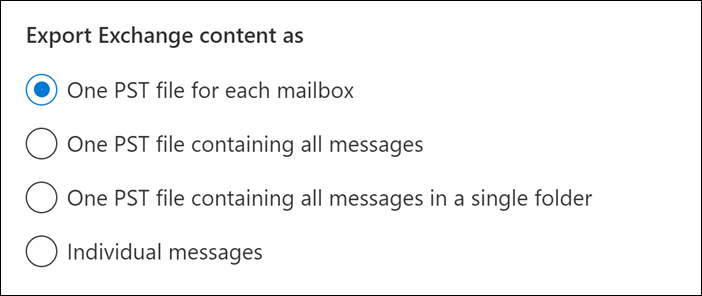
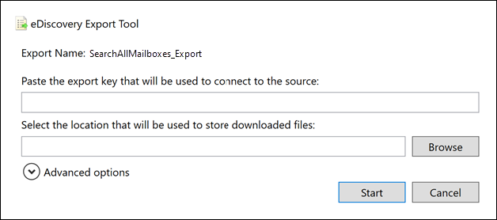

# <a name="export-content-search-results"></a>Exportar resultados de la búsqueda de contenido

Una vez que una búsqueda de contenido se ejecuta correctamente, puede exportar los resultados de la búsqueda a un equipo local. Cuando exporta los resultados de correo electrónico, estos se descargan en su equipo como archivos PST. Al exportar contenido de SharePoint y OneDrive para la Empresa sitios, se exportan copias de documentos nativos de Office. Hay otros documentos e informes incluidos en los resultados de búsqueda exportados.
  
La exportación de los resultados de una búsqueda de contenido implica preparar los resultados y, a continuación, descargarlos en un equipo local. Estos pasos para exportar resultados de búsqueda también se aplican a la exportación de los resultados de una búsqueda asociada a casos de Microsoft Purview eDiscovery (estándar).
  
[!INCLUDE [purview-preview](../includes/purview-preview.md)]

## <a name="before-you-export-search-results"></a>Antes de exportar los resultados de la búsqueda

- Para exportar los resultados de la búsqueda, debe tener asignado el rol De administración de exportación en portal de cumplimiento Microsoft Purview. Este rol se asigna al grupo de roles de administrador de exhibición de documentos electrónicos integrado. No se asigna de forma predeterminada al grupo de roles de administración de la organización. Para más información, consulte [Asignar permisos de eDiscovery](assign-ediscovery-permissions.md).
- El equipo que use para exportar los resultados de búsqueda debe cumplir los siguientes requisitos del sistema:
  
  - Versión más reciente de Windows (32 bits o 64 bits)
  - Microsoft .NET Framework 4.7 o superior

- Tiene que usar Microsoft Edge<sup>1</sup> para ejecutar la herramienta de exportación de exhibición de documentos electrónicos. El uso de Internet Explorer 11 para exportar los resultados de búsqueda ya no es compatible con<sup>2</sup>.
  
  > [!NOTE]
  > <sup>1</sup> Como resultado de los cambios recientes en Microsoft Edge, la compatibilidad con SelectOnce ya no está habilitada de forma predeterminada. Para obtener instrucciones sobre cómo habilitar la compatibilidad con SelectOnce en Edge, consulte [Uso de la herramienta de exportación de exhibición de documentos electrónicos en Microsoft Edge](configure-edge-to-export-search-results.md). Además, Microsoft no fabrica extensiones ni complementos de terceros para aplicaciones SelectOnce. No se admite la exportación de resultados de búsqueda mediante un explorador no compatible con extensiones o complementos de terceros.
  >
  > <sup>2</sup> A partir de agosto de 2021, las aplicaciones y servicios de Microsoft 365 ya no admitirán Internet Explorer 11 (IE11) y es posible que los usuarios tengan una experiencia degradada o no puedan conectarse a esas aplicaciones y servicios. Estas aplicaciones y servicios se eliminarán gradualmente en las próximas semanas y meses para garantizar un fin sin problemas del soporte técnico. Cada aplicación y servicio se están eliminando gradualmente según programaciones independientes. Para obtener más información, consulte esta [entrada de blog](https://techcommunity.microsoft.com/t5/microsoft-365-blog/microsoft-365-apps-say-farewell-to-internet-explorer-11-and/ba-p/1591666).

- La herramienta de exportación de exhibición de documentos electrónicos que se usa en el paso 2 para descargar los resultados de búsqueda no admite la automatización (mediante un script o cmdlets en ejecución). Se recomienda encarecidamente que no automatice el proceso de preparación en el paso 1 o el proceso de descarga en el paso 2. Si automatiza cualquiera de estos procesos, Soporte técnico de Microsoft no proporcionará ayuda si tiene problemas.
- Se recomienda descargar los resultados de la búsqueda en un equipo local. Para evitar que la infraestructura de proxy o firewall de su empresa provoque problemas al descargar los resultados de la búsqueda, puede considerar la posibilidad de descargar los resultados de búsqueda en un escritorio virtual fuera de la red. Esto puede reducir los tiempos de espera que se producen en las conexiones de datos de Azure al exportar un gran número de archivos. Para obtener más información sobre los escritorios virtuales, consulte [Windows Virtual Desktop](https://azure.microsoft.com/services/virtual-desktop).
- Para mejorar el rendimiento al descargar los resultados de búsqueda, considere la posibilidad de dividir las búsquedas que devuelven un gran conjunto de resultados en búsquedas más pequeñas. Por ejemplo, puede usar intervalos de fechas en las consultas de búsqueda para devolver un conjunto más pequeño de resultados que se pueden descargar más rápido.
- Al exportar los resultados de la búsqueda, los datos se almacenan temporalmente en una ubicación de Azure Storage proporcionada por Microsoft en la nube de Microsoft antes de que se descarguen en el equipo local. Asegúrese de que su organización puede conectarse al punto de conexión en Azure, que es **\*.blob.core.windows.net** (el carácter comodín representa un identificador único para la exportación). Los datos de resultados de búsqueda se eliminan de la ubicación de Azure Storage dos semanas después de su creación. 
- Si su organización usa un servidor proxy para comunicarse con Internet, debe definir la configuración del servidor proxy en el equipo que use para exportar los resultados de la búsqueda (para que el servidor proxy pueda autenticar la herramienta de exportación). Para ello, abra el archivo  *machine.config*  en la ubicación que coincida con la versión de Windows. 
  
  - **32 bits:** `%windir%\Microsoft.NET\Framework\[version]\Config\machine.config`
  - **64 bits:** `%windir%\Microsoft.NET\Framework64\[version]\Config\machine.config`
  
    Agregue las líneas siguientes al archivo  *machine.config*  en algún lugar entre las  `<configuration>` etiquetas y  `</configuration>` . Asegúrese de reemplazar  `ProxyServer` y  `Port` por los valores correctos para su organización; por ejemplo, `proxy01.contoso.com:80`. 
  
    ```xml
    <system.net>
       <defaultProxy enabled="true" useDefaultCredentials="true">
         <proxy proxyaddress="https://ProxyServer :Port " 
                usesystemdefault="False" 
                bypassonlocal="True" 
                autoDetect="False" />
       </defaultProxy>
    </system.net>
    ```

- Si los resultados de una búsqueda tienen más de 7 días y envía un trabajo de exportación, se muestra un mensaje de error que le pide que vuelva a ejecutar la búsqueda para actualizar los resultados de la búsqueda. Si esto sucede, cancele la exportación, vuelva a ejecutar la búsqueda y vuelva a iniciar la exportación.

## <a name="step-1-prepare-search-results-for-export"></a>Paso 1: Preparar los resultados de búsqueda para la exportación

El primer paso es preparar los resultados de búsqueda para la exportación. Al preparar los resultados, se cargan en una ubicación de Azure Storage proporcionada por Microsoft en la nube de Microsoft. El contenido de buzones y sitios se carga a una velocidad máxima de 2 GB por hora.
  
1. En el [portal de cumplimiento Microsoft Purview](https://compliance.microsoft.com), seleccione la búsqueda de contenido desde la que desea exportar los resultados.
  
2. En el menú **Acciones** de la parte inferior de la página desplegable, seleccione **Exportar resultados**.

   

   Se muestra la página flotante **Exportar resultados** . Las opciones de exportación disponibles para exportar contenido dependen de si los resultados de la búsqueda se encuentran en buzones o sitios o en una combinación de ambos.

3. En **Opciones de salida**, elija una de las siguientes opciones:
  
   

    - **Todos los elementos, excepto los que tienen formato no reconocido, se cifran o no se indexan por otros motivos**. Esta opción solo exporta elementos indizados.
    - **Todos los elementos, incluidos los que tienen formato no reconocido, se cifran o no se indexan por otros motivos**. Esta opción exporta elementos indexados y sin indexar.
    - **Solo los elementos que tienen un formato no reconocido, se cifran o no se indexan por otros motivos**. Esta opción solo exporta elementos sin indexar.

      Consulte la sección [Más información](#more-information) para obtener una descripción sobre cómo se exportan los elementos indizados parcialmente. Para obtener más información sobre los elementos indizados [parcialmente, vea Elementos indizados parcialmente en Búsqueda de contenido](partially-indexed-items-in-content-search.md).

4. En **Exportar contenido de Exchange como**, elija una de las siguientes opciones:
  
   

    - **Un archivo PST para cada buzón**: exporta un archivo PST para cada buzón de usuario que contiene resultados de búsqueda. Los resultados del buzón de archivo del usuario se incluyen en el mismo archivo PST. Esta opción reproduce la estructura de carpetas de buzón desde el buzón de origen.
    - **Un archivo PST que contiene todos los mensajes**: exporta un único archivo PST (denominado *Exchange.pst*) que contiene los resultados de la búsqueda de todos los buzones de origen incluidos en la búsqueda. Esta opción reproduce la estructura de carpetas de buzón para cada mensaje.
    - **Un archivo PST que contiene todos los mensajes de una sola carpeta**: exporta los resultados de la búsqueda a un único archivo PST donde todos los mensajes se encuentran en una única carpeta de nivel superior. Esta opción permite a los revisores revisar los elementos en orden cronológico (los elementos se ordenan por fecha de envío) sin tener que navegar por la estructura de carpetas del buzón original para cada elemento.
    - **Mensajes individuales**: exporta los resultados de búsqueda como mensajes de correo electrónico individuales, con el formato .msg. Si selecciona esta opción, los resultados de búsqueda de correo electrónico se exportan a una carpeta del sistema de archivos. La ruta de acceso de la carpeta para mensajes individuales es la misma que la que se usa si exportó los resultados a un archivo PST.
  
5. Configure las siguientes opciones adicionales:

   

   1. Active la casilla **Habilitar desduplicación para el contenido de Exchange** para excluir los mensajes duplicados.
  
      Si selecciona esta opción, solo se exportará una copia de un mensaje, incluso si se encuentran varias copias del mismo mensaje en los buzones que se buscaron. El informe de resultados de exportación (que es un archivo denominado Results.csv) contendrá una fila por cada copia de un mensaje duplicado para que pueda identificar los buzones (o carpetas públicas) que contienen una copia del mensaje duplicado. Para obtener más información sobre la desduplicación y cómo se identifican los elementos duplicados, vea [Desduplicación en los resultados de búsqueda de eDiscovery](de-duplication-in-ediscovery-search-results.md).
  
   2. Active la casilla **Incluir versiones para archivos de SharePoint** para exportar todas las versiones de documentos de SharePoint. Esta opción solo aparece si los orígenes de contenido de la búsqueda incluyen SharePoint o OneDrive para la Empresa sitios.
  
   3. Seleccione la **carpeta Exportar archivos en una carpeta comprimida (comprimida). Incluye solo mensajes individuales y la casilla documentos de SharePoint** para exportar resultados de búsqueda a carpetas comprimidas. Esta opción solo aparece cuando elige exportar elementos de Exchange como mensajes individuales y cuando los resultados de la búsqueda incluyen documentos de SharePoint o OneDrive. Esta opción se usa principalmente para evitar el límite de 260 caracteres en los nombres de ruta de acceso de archivo de Windows cuando se exportan los elementos. Vea los "Nombres de archivo de los elementos exportados" en la sección [Más información](#more-information) .
   > [!IMPORTANT]
   > La exportación de archivos en una carpeta comprimida (comprimida) aumentará los tiempos de exportación.
  
6. Seleccione **Exportar** para iniciar el proceso de exportación. Los resultados de la búsqueda están preparados para su descarga, lo que significa que se recopilan de las ubicaciones de contenido originales y, a continuación, se cargan en una ubicación de Azure Storage en la nube de Microsoft. Esto podría llevar varios minutos.

Consulte la sección siguiente para obtener instrucciones para descargar los resultados de búsqueda exportados.
  
## <a name="step-2-download-the-search-results"></a>Paso 2: Descargar los resultados de búsqueda

El siguiente paso consiste en descargar los resultados de la búsqueda desde la ubicación de Azure Storage en el equipo local.

> [!IMPORTANT]
> Los resultados de búsqueda exportados se deben descargar en un plazo de 14 días después de crear el trabajo de exportación en el paso 1.
  
1. En la página **Búsqueda de contenido** del portal de cumplimiento, seleccione la pestaña **Exportaciones** .
  
   Puede que tenga que seleccionar **Actualizar** para actualizar la lista de trabajos de exportación a fin de que muestre el trabajo de exportación que creó. Los trabajos de exportación tienen el mismo nombre que la búsqueda correspondiente con **_Export** anexado al nombre de búsqueda.
  
2. Seleccione el trabajo de exportación que creó en el paso 1.

3. En la página de control flotante en **Clave de exportación**, seleccione **Copiar en el Portapapeles**. Use esta clave en el paso 6 para descargar los resultados de la búsqueda.
  
   > [!IMPORTANT]
   > Dado que cualquier persona puede instalar e iniciar la herramienta de exportación de exhibición de documentos electrónicos y después usar esta clave para descargar los resultados de búsqueda, asegúrese de tomar precauciones para proteger esta clave como protegería las contraseñas u otra información relacionada con la seguridad. 

4. En la parte superior de la página de control flotante, seleccione **Descargar resultados**.

5. Si se le pide que instale la herramienta de **exportación de eDiscovery**, seleccione **Instalar**.

6. En la **herramienta de exportación de eDiscovery**, haga lo siguiente:

   

   1. Pegue la clave de exportación que copió en el paso 3 en el cuadro adecuado.
  
   2. Seleccione **Examinar** para especificar la ubicación donde desea descargar los archivos de resultados de búsqueda.
  
      > [!IMPORTANT]
      >  Debido a la alta actividad de red durante la descarga, debe descargar los resultados de búsqueda solo en una ubicación de una unidad interna en el equipo local. Para obtener la mejor experiencia de descarga, siga estas directrices: <br/>
      >- No descargue los resultados de la búsqueda en una ruta de acceso UNC, una unidad de red asignada, una unidad USB externa o una cuenta de OneDrive para la Empresa sincronizada.<br/>
      >- Deshabilite el examen antivirus de la carpeta en la que descargó el resultado de la búsqueda.<br/>
      >- Descargue los resultados de la búsqueda en diferentes carpetas para trabajos de descarga simultáneos.

7. Seleccione **Iniciar** para descargar los resultados de la búsqueda en el equipo.
  
    La **Herramienta de exportación de exhibición de documentos electrónicos** muestra información del estado acerca del proceso de exportación, incluida una estimación del número (y tamaño) de los elementos restantes que se van a descargar. Cuando el proceso de exportación se completa, puede acceder a los archivos en la ubicación donde se descargaron.

## <a name="more-information"></a>Más información

Aquí tiene más información sobre cómo exportar resultados de búsqueda.
  
- [Límites de exportación](#export-limits)
- [Exportar informes](#export-reports)
- [Exportar elementos indexados parcialmente](#exporting-partially-indexed-items)
- [Exportación de mensajes individuales o archivos PST](#exporting-individual-messages-or-pst-files)
- [Descifrado de mensajes de correo electrónico protegidos por RMS y datos adjuntos de archivos cifrados](#decrypting-rms-protected-email-messages-and-encrypted-file-attachments)
- [Nombres de archivo de los elementos exportados](#filenames-of-exported-items)
- [Varios](#miscellaneous)
  
### <a name="export-limits"></a>Límites de exportación

Para obtener información sobre los límites al exportar resultados de búsqueda de contenido, consulte la sección "Límites de exportación" en [Límites para la búsqueda de contenido](limits-for-content-search.md#export-limits).

### <a name="export-reports"></a>Exportar informes
  
- Al exportar los resultados de búsqueda, se incluyen los siguientes informes además de los resultados de la búsqueda.
  
  - **Resumen de exportación** Documento de Excel que contiene un resumen de la exportación. Esto incluye información como el número de orígenes de contenido que se buscaron, los tamaños estimados y descargados de los resultados de búsqueda y el número estimado y descargado de elementos que se exportaron.
  - **Manifiesto** Un archivo de manifiesto (en formato XML) que contiene información sobre cada elemento incluido en los resultados de la búsqueda.
  - **Resultados** Documento de Excel que contiene información sobre cada elemento que se descarga como resultado de la búsqueda. Para el correo electrónico, un registro de resultados contiene información acerca de cada mensaje, incluidos:
  
    - La ubicación del mensaje en el buzón de origen (incluido si el mensaje se encuentra en el buzón de archivo o en el principal).
    - La fecha en que se envió o se recibió el mensaje.
    - La línea Asunto del mensaje.
    - El remitente y los destinatarios del mensaje.
    - Si el mensaje es un mensaje duplicado si ha habilitado la opción de desduplicación al exportar los resultados de la búsqueda. Los mensajes duplicados tienen un valor en la columna **Duplicar en elemento** que identifica el mensaje como duplicado. El valor de la columna **Duplicar en elemento** contiene la identidad del elemento del mensaje que se exportó. Para obtener más información, vea [Desduplicación en los resultados de búsqueda de eDiscovery](de-duplication-in-ediscovery-search-results.md).

      En el caso de los documentos de SharePoint y sitios de OneDrive para la Empresa, el registro de resultados contiene información sobre cada documento, incluidos:

      - La dirección URL del documento.
      - La dirección URL de la colección de sitio donde se ubica el documento.
      - La fecha en la que el documento se modificó por última vez.
      - El nombre del documento (que está ubicado en la columna Asunto del registro de resultados).

  - **Elementos sin indexar** Documento de Excel que contiene información sobre los elementos parcialmente indexados que se incluirían en los resultados de la búsqueda. Si no incluye elementos indizados parcialmente al generar el informe de resultados de búsqueda, este informe se seguirá descargando, pero estará vacío.
  - **Errores y advertencias** Contiene errores y advertencias para los archivos encontrados durante la exportación. Consulte la columna Detalles del error para obtener información específica de cada error o advertencia individual.
  - **Elementos omitidos** Al exportar los resultados de la búsqueda desde SharePoint y OneDrive para la Empresa sitios, la exportación normalmente incluirá un informe de elementos omitidos (SkippedItems.csv). Los elementos mencionados en este informe suelen ser elementos que no se descargarán, como una carpeta o un conjunto de documentos. No exportar estos tipos de elementos es por diseño. Para otros elementos que se omitieron, los campos "Tipo de error" y "Detalles de error" del informe de elementos omitidos muestran el motivo por el que se omitió el elemento y no se descargaron con los demás resultados de búsqueda.
  - **Trace.log** Contiene información de registro detallada sobre el proceso de exportación y puede ayudar a descubrir problemas durante la exportación. Si abre un vale con Soporte técnico de Microsoft sobre un problema relacionado con la exportación de resultados de búsqueda, es posible que se le pida que proporcione este registro de seguimiento.
  
    > [!NOTE]
    > Puede exportar estos documentos sin tener que exportar los resultados de búsqueda reales. Consulte [Exportar un informe de búsqueda de contenido](export-a-content-search-report.md).
  
### <a name="exporting-partially-indexed-items"></a>Investigación de elementos indexados parcialmente
  
- Si va a exportar elementos de buzón de correo desde una búsqueda de contenido que devuelve todos los elementos de buzón en los resultados de la búsqueda (porque no hay palabras clave incluidas en la consulta de búsqueda), los elementos indizados parcialmente no se copiarán en el archivo PST que contiene los elementos sin indexar. Esto se debe a que todos los elementos, incluidos los elementos parcialmente indizados, se incluyen automáticamente en los resultados de búsqueda normales. Esto significa que los elementos indizados parcialmente se incluirán en un archivo PST (o como mensajes individuales) que contenga los demás elementos indizados.

    Si exporta los elementos indizados y parcialmente indizados o si exporta solo los elementos indizados de una búsqueda de contenido que devuelve todos los elementos, se descargará el mismo número de elementos. Esto sucede aunque los resultados de búsqueda estimados para la búsqueda de contenido (que se muestran en las estadísticas de búsqueda en el portal de cumplimiento) todavía incluirán una estimación independiente para el número de elementos indizados parcialmente. Por ejemplo, supongamos que la estimación de una búsqueda que incluye todos los elementos (sin palabras clave en la consulta de búsqueda) muestra que se encontraron 1000 elementos y que también se encontraron 200 elementos parcialmente indexados. En este caso, los 1000 elementos incluyen los elementos parcialmente indexados porque la búsqueda devuelve todos los elementos. Es decir, hay 1000 elementos totales devueltos por la búsqueda y no 1200 elementos (como cabría esperar). Si exporta los resultados de esta búsqueda y elige exportar elementos indexados y parcialmente indexados (o exportar solo elementos indizados parcialmente), se descargarán 1000 elementos. De nuevo, esto se debe a que los elementos parcialmente indexados se incluyen con los resultados normales (indizados) cuando se usa una consulta de búsqueda en blanco para devolver todos los elementos. En este mismo ejemplo, si decide exportar solo elementos indizados parcialmente, solo se descargarán los 200 elementos sin indexar.

    Tenga en cuenta también que en el ejemplo anterior (al exportar elementos indexados y parcialmente indizados o solo exportar elementos indizados), el informe **Resumen de exportación** incluido con los resultados de búsqueda exportados enumeraría 1000 elementos estimados y 1000 elementos descargados por los mismos motivos descritos anteriormente. 

- Si la búsqueda desde la que va a exportar los resultados era una búsqueda de ubicaciones de contenido específicas o de todas las ubicaciones de contenido de su organización, solo se exportarán los elementos parciales de las ubicaciones de contenido que contienen elementos que coinciden con los criterios de búsqueda. En otras palabras, si no se encuentra ningún resultado de búsqueda en un buzón o sitio, no se exportarán los elementos parcialmente indexados en ese buzón o sitio. El motivo es que la exportación de elementos parcialmente indexados desde muchas ubicaciones de la organización podría aumentar la probabilidad de errores de exportación y aumentar el tiempo necesario para exportar y descargar los resultados de la búsqueda.

    Para exportar elementos indizados parcialmente desde todas las ubicaciones de contenido de una búsqueda, configure la búsqueda para que devuelva todos los elementos (quitando las palabras clave de la consulta de búsqueda) y, a continuación, exporte solo elementos indizados parcialmente al exportar los resultados de la búsqueda.

    
  
- Al exportar resultados de búsqueda desde SharePoint o OneDrive para la Empresa sitios, la capacidad de exportar elementos no indexados también depende de la opción de exportación que seleccione y de si un sitio que se ha buscado contiene un elemento indexado que coincide con los criterios de búsqueda. Por ejemplo, si busca sitios específicos de SharePoint o OneDrive para la Empresa y no se encuentra ningún resultado de búsqueda, no se exportará ningún elemento sin indexar de esos sitios si elige la segunda opción de exportación para exportar elementos indexados y no indizados. Si un elemento indexado de un sitio coincide con los criterios de búsqueda, todos los elementos sin indexar de ese sitio se exportarán al exportar elementos indexados y no indizados. En la ilustración siguiente se describen las opciones de exportación en función de si un sitio contiene un elemento indexado que coincida con los criterios de búsqueda.

    

    a. Solo se exportan los elementos indizados que coinciden con los criterios de búsqueda. No se exportan elementos parcialmente indexados.

    b. Si ningún elemento indexado de un sitio coincide con los criterios de búsqueda, no se exportan los elementos indizados parcialmente de ese mismo sitio. Si los elementos indexados de un sitio se devuelven en los resultados de la búsqueda, se exportan los elementos parcialmente indexados de ese sitio. En otras palabras, solo se exportan los elementos parcialmente indizados de sitios que contienen elementos que coinciden con los criterios de búsqueda.

    c. Todos los elementos indizados parcialmente de todos los sitios de la búsqueda se exportan, independientemente de si un sitio contiene elementos que coinciden con los criterios de búsqueda.

    Si decide exportar elementos parcialmente indexados, los elementos de buzón indizados parcialmente se exportan en un archivo PST independientemente de la opción que elija en **Exportar contenido de Exchange como**.

- Si los elementos indizados parcialmente se devuelven en los resultados de la búsqueda (porque otras propiedades de elementos parcialmente indexados coincidieron con los criterios de búsqueda), esos elementos parcialmente indexados se exportan con los resultados de búsqueda normales. Por lo tanto, si decide exportar elementos indexados y elementos parcialmente indexados (seleccionando **todos los elementos, incluidos los que tienen formato no reconocido, se cifran o no se indexaron por otras razones** , opción de exportación), los elementos parcialmente indexados exportados con los resultados regulares se mostrarán en el informe de Results.csv. No aparecerán en el informe de items.csv sin indexar.
  
### <a name="exporting-individual-messages-or-pst-files"></a>Exportación de mensajes individuales o archivos PST
  
- Si el nombre de la ruta de acceso de archivo de un mensaje supera el límite máximo de caracteres para Windows, el nombre de la ruta de acceso del archivo se trunca. Pero el nombre de la ruta de acceso del archivo original se mostrará en el manifiesto y el registro de resultados.
- Como se explicó anteriormente, los resultados de la búsqueda de correo electrónico se exportan a una carpeta del sistema de archivos. La ruta de acceso de carpeta de los mensajes individuales replicaría la ruta de acceso de la carpeta en el buzón del usuario. Por ejemplo, para una búsqueda denominada "ContosoCase101" los mensajes de la bandeja de entrada de un usuario se encontrarían en la ruta de acceso de  `~ContosoCase101\\<date of export\Exchange\user@contoso.com (Primary)\Top of Information Store\Inbox`la carpeta .
- Si decide exportar mensajes de correo electrónico en un archivo PST que contiene todos los mensajes de una sola carpeta, se incluyen una carpeta **Elementos eliminados** y una carpeta **Carpetas de búsqueda** en el nivel superior de la carpeta PST. Estas carpetas están vacías.
- Como se indicó anteriormente, debe exportar los resultados de búsqueda de correo electrónico como mensajes individuales para descifrar los mensajes protegidos por RMS cuando se exportan. Los mensajes cifrados permanecerán cifrados si exporta los resultados de búsqueda de correo electrónico como un archivo PST.
  
### <a name="decrypting-rms-protected-email-messages-and-encrypted-file-attachments"></a>Descifrado de mensajes de correo electrónico protegidos por RMS y datos adjuntos de archivos cifrados

Los mensajes de correo electrónico protegidos por derechos (protegidos por RMS) incluidos en los resultados de una búsqueda de contenido se descifrarán al exportarlos. Además, todos los archivos cifrados con una tecnología de [cifrado de Microsoft](encryption.md) y conectados a un mensaje de correo electrónico incluido en los resultados de la búsqueda también se descifrarán cuando se exporten. Esta funcionalidad de descifrado está habilitada de forma predeterminada para los miembros del grupo de roles del Administrador de exhibición de documentos electrónicos. Esto se debe a que el rol de administración Descifrado de RMS se asigna a este grupo de roles de forma predeterminada. Tenga en cuenta lo siguiente al exportar mensajes de correo electrónico cifrados y datos adjuntos:
  
- Como se explicó anteriormente, para descifrar los mensajes protegidos por RMS al exportarlos, debe exportar los resultados de la búsqueda como mensajes individuales. Si exporta los resultados de búsqueda a un archivo PST, los mensajes protegidos por RMS permanecen cifrados.
- Los mensajes que se descifran se identifican en el informe **ResultsLog** . Este informe contiene una columna denominada **Estado de descodificación** y un valor de **Descodificado** en esta columna identifica los mensajes que se descifraron.
- Además de descifrar los datos adjuntos de archivos al exportar los resultados de la búsqueda, también puede obtener una vista previa del archivo descifrado al obtener una vista previa de los resultados de la búsqueda. Solo puede ver el mensaje de correo electrónico protegido con derechos después de exportarlo.
- En este momento, la funcionalidad de descifrado al exportar los resultados de búsqueda no incluye contenido cifrado de SharePoint y OneDrive para la Empresa sitios. Sin embargo, el soporte técnico estará disponible próximamente para los documentos cifrados con tecnologías de cifrado de Microsoft y almacenados en SharePoint Online y OneDrive para la Empresa.
- Si necesita evitar que alguien descifre mensajes y datos adjuntos de archivos cifrados para proteger RMS, debe crear un grupo de roles personalizado (copiando el grupo de roles integrado del Administrador de exhibición de documentos electrónicos) y, a continuación, quitar el rol de administración Descifrado de RMS del grupo de roles personalizado. A continuación, agregue la persona que no desea descifrar mensajes como miembro del grupo de roles personalizado.
  
### <a name="filenames-of-exported-items"></a>Nombres de archivo de los elementos exportados
  
- Hay un límite de 260 caracteres (impuesto por el sistema operativo) para el nombre de la ruta de acceso completa para los mensajes de correo electrónico y los documentos de sitio exportados al equipo local. El nombre de la ruta de acceso completa para los elementos exportados incluye la ubicación original del elemento y la ubicación de la carpeta en el equipo local en el que se descargan los resultados de la búsqueda. Por ejemplo, si especifica descargar los resultados  `C:\Users\Admin\Desktop\SearchResults` de la búsqueda en la herramienta eDiscovery Export, el nombre de ruta de acceso completo de un elemento de correo electrónico descargado sería  `C:\Users\Admin\Desktop\SearchResults\ContentSearch1\03.15.2017-1242PM\Exchange\sarad@contoso.com (Primary)\Top of Information Store\Inbox\Insider trading investigation.msg`.

- Si se supera el límite de 260 caracteres, se truncará el nombre de ruta de acceso completo de un elemento, en función de lo siguiente:

  - Si el nombre de la ruta de acceso completa tiene más de 260 caracteres, el nombre de archivo se acortará para que esté por debajo del límite; tenga en cuenta que el nombre de archivo truncado (excepto la extensión de archivo) no tendrá menos de ocho caracteres.

  - Si el nombre de la ruta de acceso completa sigue siendo demasiado largo después de acortar el nombre de archivo, el elemento se mueve de su ubicación actual a la carpeta primaria. Si el nombre de la ruta de acceso sigue siendo demasiado largo, el proceso se repite: acorte el nombre de archivo y, si es necesario, vuelva a moverse a la carpeta primaria. Este proceso se repite hasta que el nombre de ruta de acceso completo está por debajo del límite de 260 caracteres.

  - Si ya existe un nombre de ruta de acceso completa truncada, se agrega un número de versión al final del nombre de archivo; por ejemplo, `statusmessage(2).msg`.

    Para ayudar a mitigar este problema, considere la posibilidad de descargar los resultados de la búsqueda en una ubicación con un nombre de ruta de acceso corto; por ejemplo, descargar los resultados de búsqueda en una carpeta denominada  `C:\Results` agregaría menos caracteres a los nombres de ruta de acceso de los elementos exportados que descargarlos en una carpeta denominada  `C:\Users\Admin\Desktop\Results`.

- Al exportar documentos de sitio, también es posible que se modifique el nombre de archivo original de un documento. Esto sucede específicamente para los documentos que se han eliminado de un sitio de SharePoint o OneDrive para la Empresa que se ha colocado en espera. Después de eliminar un documento que se encuentra en un sitio en espera, el documento eliminado se mueve automáticamente a la biblioteca de suspensión de conservación del sitio (que se creó cuando el sitio se puso en suspensión). Cuando el documento eliminado se mueve a la biblioteca de suspensión de conservación, se anexa un identificador único y generado aleatoriamente al nombre de archivo original del documento. Por ejemplo, si el nombre de archivo de un documento es  `FY2017Budget.xlsx` y ese documento se elimina más adelante y se mueve a la biblioteca de suspensión de conservación, el nombre de archivo del documento que se mueve a la biblioteca de suspensión de conservación se modifica a algo parecido  `FY2017Budget_DEAF727D-0478-4A7F-87DE-5487F033C81A2000-07-05T10-37-55.xlsx`a . Si un documento de la biblioteca de suspensión de conservación coincide con la consulta de una búsqueda de contenido y exporta los resultados de esa búsqueda, el archivo exportado tiene el nombre de archivo modificado; en este ejemplo, el nombre de archivo del documento exportado sería  `FY2017Budget_DEAF727D-0478-4A7F-87DE-5487F033C81A2000-07-05T10-37-55.xlsx`.

    Cuando se modifica un documento de un sitio que está en espera (y se ha habilitado el control de versiones de la biblioteca de documentos del sitio), se crea automáticamente una copia del archivo en la biblioteca de suspensión de conservación. En este caso, también se anexa un identificador único y generado aleatoriamente al nombre de archivo del documento que se copia en la biblioteca de suspensión de conservación.

    La razón por la que los nombres de archivo de los documentos que se mueven o copian en la biblioteca de suspensión de conservación es para evitar nombres de archivo en conflicto. Para obtener más información sobre cómo colocar una suspensión en sitios y la biblioteca de suspensión de conservación, vea [Información general sobre la retención local en SharePoint Server 2016](https://support.office.com/article/5e400d68-cd51-444a-8fe6-e4df1d20aa95).

### <a name="miscellaneous"></a>Varios
  
- Al descargar los resultados de la búsqueda mediante la herramienta de exportación de exhibición de documentos electrónicos, es posible que reciba el siguiente error: `System.Net.WebException: The remote server returned an error: (412) The condition specified using HTTP conditional header(s) is not met.` Se trata de un error transitorio, que normalmente se produce en la ubicación de Azure Storage. Para resolver este problema, vuelva a [intentar descargar los resultados de la búsqueda](#step-2-download-the-search-results), lo que reiniciará la herramienta de exportación de exhibición de documentos electrónicos.
- Todos los resultados de búsqueda y los informes de exportación se incluyen en una carpeta que tiene el mismo nombre que la búsqueda de contenido. Los mensajes de correo electrónico que se exportaron se ubican en una carpeta denominada **Exchange**. Los documentos se ubican en una carpeta denominada **SharePoint**.
- Los metadatos del sistema de archivos para documentos en SharePoint y sitios de OneDrive para la Empresa se mantienen cuando los documentos se exportan al equipo local. Eso significa que las propiedades del documento, como la fecha de creación y la fecha en la que se modificó por última vez, no cambian cuando se exportan los documentos.
- Si los resultados de la búsqueda incluyen un elemento de lista de SharePoint que coincide con la consulta de búsqueda, todas las filas de la lista se exportarán además del elemento que coincida con la consulta de búsqueda y los datos adjuntos de la lista. El motivo de este comportamiento es proporcionar un contexto para los elementos de lista que se devuelven en los resultados de la búsqueda. Los demás elementos de lista y datos adjuntos pueden hacer que el recuento de elementos exportados sea diferente de la estimación original de los resultados de la búsqueda.
