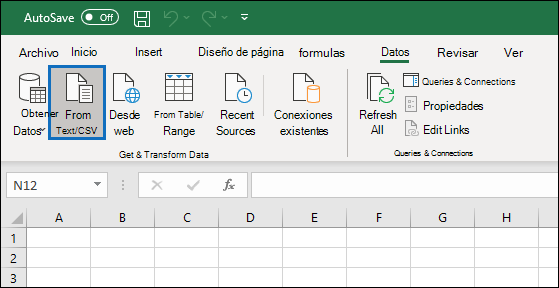
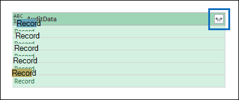
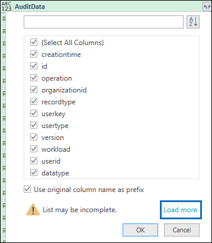

# <a name="export-configure-and-view-audit-log-records"></a><span data-ttu-id="319df-104">Exportar, configurar y ver registros de registro de auditoría</span><span class="sxs-lookup"><span data-stu-id="319df-104">Export, configure, and view audit log records</span></span>

<span data-ttu-id="319df-105">Una vez que haya buscado en el registro de auditoría y descargando los resultados de la búsqueda en un archivo CSV, el archivo contendrá una columna denominada **AuditData**, que contiene información adicional sobre cada evento.</span><span class="sxs-lookup"><span data-stu-id="319df-105">After you search the audit log and download the search results to a CSV file, the file contains a column named **AuditData**, which contains additional information about each event.</span></span> <span data-ttu-id="319df-106">Los datos de esta columna tienen el formato de un objeto JSON, que contiene varias propiedades que se configuran como pares *Property: Value* separados por comas.</span><span class="sxs-lookup"><span data-stu-id="319df-106">The data in this column is formatted as a JSON object, which contains multiple properties that are configured as *property:value* pairs separated by commas.</span></span> <span data-ttu-id="319df-107">Puede usar la característica transformación de JSON en el editor de Power Query en Excel para dividir cada propiedad en el objeto JSON de la columna **AuditData** en varias columnas para que cada propiedad tenga su propia columna.</span><span class="sxs-lookup"><span data-stu-id="319df-107">You can use the JSON transform feature in the Power Query Editor in Excel to split each property in the JSON object in the **AuditData** column into multiple columns so that each property has its own column.</span></span> <span data-ttu-id="319df-108">Esto le permite ordenar y filtrar por una o varias de estas propiedades, lo que puede ayudarle a encontrar rápidamente los datos de auditoría específicos que está buscando.</span><span class="sxs-lookup"><span data-stu-id="319df-108">This lets you sort and filter on one or more of these properties, which can help you quickly locate the specific auditing data you're looking for.</span></span>

## <a name="step-1-export-audit-log-search-results"></a><span data-ttu-id="319df-109">Paso 1: exportar los resultados de la búsqueda de registros de auditoría</span><span class="sxs-lookup"><span data-stu-id="319df-109">Step 1: Export audit log search results</span></span>

<span data-ttu-id="319df-110">El primer paso consiste en buscar en el registro de auditoría y, a continuación, exportar los resultados en un archivo de valores separados por comas (CSV) al equipo local.</span><span class="sxs-lookup"><span data-stu-id="319df-110">The first step is to search the audit log and then export the results in a comma-separated value (CSV) file to your local computer.</span></span>
  
1. <span data-ttu-id="319df-111">Ejecute una [búsqueda de registro de auditoría](search-the-audit-log-in-security-and-compliance.md#search-the-audit-log) y revise los criterios de búsqueda si es necesario hasta que tenga los resultados deseados.</span><span class="sxs-lookup"><span data-stu-id="319df-111">Run an [audit log search](search-the-audit-log-in-security-and-compliance.md#search-the-audit-log) and revise the search criteria if necessary until you have the desired results.</span></span>
    
2. <span data-ttu-id="319df-112">Haga clic en **exportar resultados** y seleccione **descargar todos los resultados**.</span><span class="sxs-lookup"><span data-stu-id="319df-112">Click **Export results** and select **Download all results**.</span></span> 
    
   

   <span data-ttu-id="319df-114">Esta opción permite exportar todos los registros de auditoría de la búsqueda de registros de auditoría que ejecutó en el paso 1 y descarga los datos sin procesar del registro de auditoría a un archivo CSV.</span><span class="sxs-lookup"><span data-stu-id="319df-114">This option to exports all the audit records from the audit log search you ran in step 1, and downloads the raw data from the audit log to a CSV file.</span></span> 

   <span data-ttu-id="319df-115">Se muestra un mensaje en la parte inferior de la ventana que le pide que abra o guarde el archivo CSV.</span><span class="sxs-lookup"><span data-stu-id="319df-115">A message is displayed at the bottom of the window that prompts you to open or save the CSV file.</span></span> 

3. <span data-ttu-id="319df-116">Haga clic en **guardar > guardar como** y guarde el archivo CSV en el equipo local.</span><span class="sxs-lookup"><span data-stu-id="319df-116">Click **Save > Save as** and save the CSV file to your local computer.</span></span> <span data-ttu-id="319df-117">Se tarda un rato en descargar muchos resultados de búsqueda.</span><span class="sxs-lookup"><span data-stu-id="319df-117">It takes a while to download many search results.</span></span> <span data-ttu-id="319df-118">Este suele ser el caso cuando se busca en todas las actividades o en un intervalo de fechas amplio.</span><span class="sxs-lookup"><span data-stu-id="319df-118">This is typically the case when searching for all activities or a broad date range.</span></span> <span data-ttu-id="319df-119">Se muestra un mensaje en la parte inferior de la ventana cuando se termina de descargar el archivo CSV.</span><span class="sxs-lookup"><span data-stu-id="319df-119">A message at the bottom of the windows is displayed when the CSV file is finished downloading.</span></span>
 
   

> [!NOTE]
  > <span data-ttu-id="319df-121">Puede descargar un máximo de 50 000 entradas en un archivo CSV desde una única búsqueda de registros de auditoría.</span><span class="sxs-lookup"><span data-stu-id="319df-121">You can download a maximum of 50,000 entries to a CSV file from a single audit log search.</span></span> <span data-ttu-id="319df-122">Si se descargan 50 000 entradas en el archivo CSV, probablemente puede suponer que existen más de 50 000 eventos que cumplen los criterios de búsqueda.</span><span class="sxs-lookup"><span data-stu-id="319df-122">If 50,000 entries are downloaded to the CSV file, you can probably assume there are more than 50,000 events that met the search criteria.</span></span> <span data-ttu-id="319df-123">Para exportar más de este límite, pruebe a usar un intervalo de fechas para reducir el número de registros de auditoría.</span><span class="sxs-lookup"><span data-stu-id="319df-123">To export more than this limit, try using a date range to reduce the number of audit log records.</span></span> <span data-ttu-id="319df-124">Puede que tenga que ejecutar varias búsquedas con intervalos de fecha de menor tamaño para exportar más de 50 000 entradas.</span><span class="sxs-lookup"><span data-stu-id="319df-124">You might have to run multiple searches with smaller date ranges to export more than 50,000 entries.</span></span>

## <a name="step-2-format-the-exported-audit-log-using-the-power-query-editor"></a><span data-ttu-id="319df-125">Paso 2: dar formato al registro de auditoría exportado con el editor de Power Query</span><span class="sxs-lookup"><span data-stu-id="319df-125">Step 2: Format the exported audit log using the Power Query Editor</span></span>

<span data-ttu-id="319df-126">El paso siguiente es usar la característica transformación de JSON en el editor de Power Query en Excel para dividir cada propiedad en el objeto JSON de la columna **AuditData** en su propia columna.</span><span class="sxs-lookup"><span data-stu-id="319df-126">The next step is to use the JSON transform feature in the Power Query Editor in Excel to split each property in the JSON object in the **AuditData** column into its own column.</span></span> <span data-ttu-id="319df-127">A continuación, filtre las columnas para ver los registros en función de los valores de propiedades específicas.</span><span class="sxs-lookup"><span data-stu-id="319df-127">Then you filter columns to view records based on the values of specific properties.</span></span> <span data-ttu-id="319df-128">Esto puede ayudarle a encontrar rápidamente los datos de auditoría específicos que está buscando.</span><span class="sxs-lookup"><span data-stu-id="319df-128">This can help you quickly locate the specific auditing data you're looking for.</span></span>

1. <span data-ttu-id="319df-129">Abra un libro en blanco en Excel para Office 365, Excel 2019 o Excel 2016.</span><span class="sxs-lookup"><span data-stu-id="319df-129">Open a blank workbook in Excel for Office 365, Excel 2019, or Excel 2016.</span></span>
    
2.  <span data-ttu-id="319df-130">En la pestaña **datos** , en el grupo de cinta **obtener & transformar datos** , haga clic en **desde texto/CSV**.</span><span class="sxs-lookup"><span data-stu-id="319df-130">On the **Data** tab, in the **Get & Transform Data** ribbon group, click **From Text/CSV**.</span></span>

    

3. <span data-ttu-id="319df-132">Abra el archivo CSV que ha descargado en el paso 1.</span><span class="sxs-lookup"><span data-stu-id="319df-132">Open the CSV file that you downloaded in Step 1.</span></span>
    
4. <span data-ttu-id="319df-133">En la ventana que se muestra, haga clic en **transformar datos**.</span><span class="sxs-lookup"><span data-stu-id="319df-133">In the window that's displayed, click **Transform Data**.</span></span>

   

<span data-ttu-id="319df-135">El archivo CSV se abre en el **Editor de consultas**.</span><span class="sxs-lookup"><span data-stu-id="319df-135">The CSV file is opened in the **Query Editor**.</span></span> <span data-ttu-id="319df-136">Hay cuatro columnas: **CreationDate**, **userid**, **Operations**y **AuditData**.</span><span class="sxs-lookup"><span data-stu-id="319df-136">There are four columns: **CreationDate**, **UserIds**, **Operations**, and **AuditData**.</span></span> <span data-ttu-id="319df-137">La columna **AuditData** es un objeto JSON que contiene varias propiedades.</span><span class="sxs-lookup"><span data-stu-id="319df-137">The **AuditData** column is a JSON object that contains multiple properties.</span></span> <span data-ttu-id="319df-138">El paso siguiente es crear una columna para cada propiedad en el objeto JSON.</span><span class="sxs-lookup"><span data-stu-id="319df-138">The next step is to create a column for each property in the JSON object.</span></span>
    
5. <span data-ttu-id="319df-139">Haga clic con el botón secundario en el título de la columna **AuditData** , haga clic en **transformar**y, a continuación, en **JSON**.</span><span class="sxs-lookup"><span data-stu-id="319df-139">Right-click the title in the **AuditData** column, click **Transform**, and then click **JSON**.</span></span> 
 
   

6. <span data-ttu-id="319df-141">En la esquina superior derecha de la columna **AuditData** , haga clic en el icono de expandir.</span><span class="sxs-lookup"><span data-stu-id="319df-141">In the upper-right corner of the **AuditData** column, click the expand icon.</span></span>
    
   

   <span data-ttu-id="319df-143">Se muestra una lista parcial de las propiedades de los objetos JSON en la columna **AuditData** .</span><span class="sxs-lookup"><span data-stu-id="319df-143">A partial list of the properties in the JSON objects in the **AuditData** column is displayed.</span></span>

7. <span data-ttu-id="319df-144">Haga clic en **cargar más** para mostrar todas las propiedades de los objetos JSON en la columna **AuditData** .</span><span class="sxs-lookup"><span data-stu-id="319df-144">Click **Load more** to display all properties in the JSON objects in the **AuditData** column.</span></span>

   

   <span data-ttu-id="319df-146">Puede anular la selección de la casilla de verificación situada junto a cualquier propiedad que no desee incluir.</span><span class="sxs-lookup"><span data-stu-id="319df-146">You can unselect the checkbox next to any property that you don't want to include.</span></span> <span data-ttu-id="319df-147">Eliminar columnas que no son útiles para la investigación es una buena forma de reducir la cantidad de datos que se muestran en el registro de auditoría.</span><span class="sxs-lookup"><span data-stu-id="319df-147">Eliminating columns that aren't useful for your investigation is a good way to reduce the amount of data displayed in the audit log.</span></span> 

   > [!NOTE]
   > <span data-ttu-id="319df-148">Las propiedades JSON que se muestran en la captura de pantalla anterior (después de hacer clic en **cargar más**) se basan en las propiedades que se encuentran en la columna **AuditData** de las primeras 1.000 filas del archivo CSV.</span><span class="sxs-lookup"><span data-stu-id="319df-148">The JSON properties displayed in the previous screenshot (after you click **Load more**) are based on the properties found in the **AuditData** column from the first 1,000 rows in the CSV file.</span></span> <span data-ttu-id="319df-149">Si hay distintas propiedades JSON en los registros después de las primeras 1.000 filas, estas propiedades (y una columna correspondiente) no se incluirán cuando la columna **AuditData** se divida en varias columnas.</span><span class="sxs-lookup"><span data-stu-id="319df-149">If there are different JSON properties in records after the first 1,000 rows, these properties (and a corresponding column) won't be included when the **AuditData** column is split into multiple columns.</span></span> <span data-ttu-id="319df-150">Para ayudar a evitar esto, considere la posibilidad de volver a ejecutar la búsqueda de registros de auditoría y restringir los criterios de búsqueda para que se devuelvan menos registros.</span><span class="sxs-lookup"><span data-stu-id="319df-150">To help prevent this, consider re-running the audit log search and narrow the search criteria so that fewer records are returned.</span></span> <span data-ttu-id="319df-151">Otra solución consiste en filtrar elementos en la columna **operaciones** para reducir el número de filas (antes de realizar el paso 5 anterior) antes de transformar el objeto JSON en la columna **AuditData** .</span><span class="sxs-lookup"><span data-stu-id="319df-151">Another workaround is to filter items in the **Operations** column to reduce the number of rows (before you perform step 5 above) before transforming the JSON object in the **AuditData** column.</span></span>

8. <span data-ttu-id="319df-152">Realice una de las siguientes acciones para dar formato al título de las columnas que se agregan para cada propiedad JSON seleccionada.</span><span class="sxs-lookup"><span data-stu-id="319df-152">Do one of the following things to format the title of the columns that are added for each JSON property that's selected.</span></span>

    - <span data-ttu-id="319df-153">Anule la selección de la casilla **usar el nombre de columna original como prefijo** para usar el nombre de la propiedad JSON como los nombres de columna; por ejemplo, **RecordType** o **SourceFileName**.</span><span class="sxs-lookup"><span data-stu-id="319df-153">Unselect the **Use original column name as prefix** checkbox to use the name of the JSON property as the column names; for example, **RecordType** or **SourceFileName**.</span></span>
    
   - <span data-ttu-id="319df-154">Deje seleccionada la casilla **Usar nombre de columna original como prefijo** para agregar el prefijo AuditData a los nombres de columna; por ejemplo, **AuditData. RecordType** o **AuditData. SourceFileName**.</span><span class="sxs-lookup"><span data-stu-id="319df-154">Leave the **Use original column name as prefix** checkbox selected to add the AuditData prefix to the column names; for example, **AuditData.RecordType** or **AuditData.SourceFileName**.</span></span>

9. <span data-ttu-id="319df-155">Haga clic en **Aceptar**.</span><span class="sxs-lookup"><span data-stu-id="319df-155">Click **OK**.</span></span>
    
    <span data-ttu-id="319df-156">La columna **AuditData** se divide en varias columnas.</span><span class="sxs-lookup"><span data-stu-id="319df-156">The **AuditData** column is split into multiple columns.</span></span> <span data-ttu-id="319df-157">Cada columna nueva corresponde a una propiedad del objeto JSON AuditData.</span><span class="sxs-lookup"><span data-stu-id="319df-157">Each new column corresponds to a property in the AuditData JSON object.</span></span> <span data-ttu-id="319df-158">Cada fila de la columna contiene el valor de la propiedad.</span><span class="sxs-lookup"><span data-stu-id="319df-158">Each row in the column contains the value for the property.</span></span> <span data-ttu-id="319df-159">Si la propiedad no contiene ningún valor, se muestra el valor *null* .</span><span class="sxs-lookup"><span data-stu-id="319df-159">If the property doesn't contain a value, the *null* value is displayed.</span></span> <span data-ttu-id="319df-160">En Excel, las celdas con valores NULL están vacías.</span><span class="sxs-lookup"><span data-stu-id="319df-160">In Excel, cells with null values are empty.</span></span>
  
10. <span data-ttu-id="319df-161">En la pestaña **Inicio** , haga clic en **cerrar & carga** para cerrar el editor de Power Query y abrir el archivo CSV transformado en un libro de Excel.</span><span class="sxs-lookup"><span data-stu-id="319df-161">On the **Home** tab, click **Close & Load** to close the Power Query Editor and open the transformed CSV file in an Excel workbook.</span></span> 

## <a name="tips-for-exporting-and-viewing-the-audit-log"></a><span data-ttu-id="319df-162">Sugerencias para exportar y ver el registro de auditoría</span><span class="sxs-lookup"><span data-stu-id="319df-162">Tips for exporting and viewing the audit log</span></span>

<span data-ttu-id="319df-163">A continuación, se muestran algunas sugerencias y ejemplos de cómo exportar y ver el registro de auditoría antes y después de usar la característica transformación JSON para dividir la columna **AuditData** en varias columnas.</span><span class="sxs-lookup"><span data-stu-id="319df-163">Here are some tips and examples of exporting and viewing the audit log before and after you use the JSON transform feature to split the **AuditData** column into multiple columns.</span></span>

- <span data-ttu-id="319df-164">Filtre la columna **RecordType** para mostrar solo los registros de un área funcional o de un servicio específico.</span><span class="sxs-lookup"><span data-stu-id="319df-164">Filter the **RecordType** column to display only the records from a specific service or functional area.</span></span> <span data-ttu-id="319df-165">Por ejemplo, para Mostrar eventos relacionados con el uso compartido de SharePoint, debe seleccionar **14** (el valor de enumeración para los registros desencadenados por las actividades de uso compartido de SharePoint).</span><span class="sxs-lookup"><span data-stu-id="319df-165">For example, to show events related to SharePoint sharing, you would select **14** (the enum value for records triggered by SharePoint sharing activities).</span></span> <span data-ttu-id="319df-166">Para obtener una lista de los servicios que corresponden a los valores de enumeración mostrados en la columna **RecordType** , consulte [propiedades detalladas en el registro de auditoría](detailed-properties-in-the-office-365-audit-log.md).</span><span class="sxs-lookup"><span data-stu-id="319df-166">For a list of the services that correspond to the enum values displayed in the **RecordType** column, see [Detailed properties in the audit log](detailed-properties-in-the-office-365-audit-log.md).</span></span>

- <span data-ttu-id="319df-167">Filtrar la columna **operaciones** para mostrar los registros de actividades específicas.</span><span class="sxs-lookup"><span data-stu-id="319df-167">Filter the **Operations** column to display the records for specific activities.</span></span> <span data-ttu-id="319df-168">Para obtener una lista de la mayoría de las operaciones que corresponden a una actividad que permite realizar búsquedas en la herramienta de búsqueda de registros de auditoría del centro de seguridad & cumplimiento, consulte la sección "actividades auditadas" en [Buscar el registro de auditoría en el centro de seguridad & cumplimiento](search-the-audit-log-in-security-and-compliance.md#audited-activities).</span><span class="sxs-lookup"><span data-stu-id="319df-168">For a list of most operations that correspond to a searchable activity in the audit log search tool in the Security & Compliance Center, see the "Audited activities" section in [Search the audit log in the Security & Compliance Center](search-the-audit-log-in-security-and-compliance.md#audited-activities).</span></span>

- <span data-ttu-id="319df-169">En lugar de usar la herramienta de búsqueda de registros de auditoría en el centro de seguridad & cumplimiento, puede usar el cmdlet [Search-UnifiedAuditLog](https://docs.microsoft.com/powershell/module/exchange/policy-and-compliance-audit/search-unifiedauditlog) en Exchange Online PowerShell para exportar los resultados de una búsqueda de registro de auditoría a un archivo CSV.</span><span class="sxs-lookup"><span data-stu-id="319df-169">Instead of using the audit log search tool in the Security & Compliance Center, you can use the [Search-UnifiedAuditLog](https://docs.microsoft.com/powershell/module/exchange/policy-and-compliance-audit/search-unifiedauditlog) cmdlet in Exchange Online Powershell to export the results of an audit log search to a CSV file.</span></span> <span data-ttu-id="319df-170">A continuación, puede seguir el mismo procedimiento descrito en el paso 2 para dar formato al registro de auditoría con el editor de Power Query.</span><span class="sxs-lookup"><span data-stu-id="319df-170">Then you can follow the same procedure described in Step 2 to format the audit log using the Power Query editor.</span></span> <span data-ttu-id="319df-171">Una de las ventajas de usar el cmdlet de PowerShell es que puede buscar eventos de un servicio específico mediante el parámetro *RecordType* .</span><span class="sxs-lookup"><span data-stu-id="319df-171">One advantage of using the PowerShell cmdlet is that you can search for events from a specific service by using the *RecordType* parameter.</span></span> <span data-ttu-id="319df-172">Estos son algunos ejemplos de cómo usar PowerShell para exportar registros de auditoría a un archivo CSV para que pueda usar el editor de Power Query para transformar el objeto JSON en la columna **AuditData** como se describe en el paso 2.</span><span class="sxs-lookup"><span data-stu-id="319df-172">Here are few examples of using PowerShell to export audit records to a CSV file so you can use the Power Query editor to transform the JSON object in the **AuditData** column as described in Step 2.</span></span>

   <span data-ttu-id="319df-173">En este ejemplo, ejecute los siguientes comandos para devolver todos los registros relacionados con las operaciones de uso compartido de SharePoint.</span><span class="sxs-lookup"><span data-stu-id="319df-173">In this example, run the following commands to return all records related to SharePoint sharing operations.</span></span> 
   
   ```powershell
   $auditlog = Search-UnifiedAuditLog -StartDate 06/01/2019 -EndDate 06/30/2019 -RecordType SharePointSharingOperation
   ```

   ```powershell
   $auditlog | Select-Object -Property CreationDate,UserIds,RecordType,AuditData | Export-Csv -Path c:\AuditLogs\PowerShellAuditlog.csv -NoTypeInformation
   ```

   - <span data-ttu-id="319df-174">Los resultados de la búsqueda se exportan a un archivo CSV denominado *PowerShellAuditlog* que contiene cuatro columnas: CreationDate, userid, RecordType, AuditData).</span><span class="sxs-lookup"><span data-stu-id="319df-174">The search results are exported to a CSV file named *PowerShellAuditlog* that contains four columns: CreationDate, UserIds, RecordType, AuditData).</span></span>

   - <span data-ttu-id="319df-175">Puede usar el nombre o el valor de enumeración para el tipo de registro como el valor para el parámetro *RecordType* .</span><span class="sxs-lookup"><span data-stu-id="319df-175">You can use the name or enum value for the record type as the value for the *RecordType* parameter.</span></span> <span data-ttu-id="319df-176">Para obtener una lista de los nombres de tipo de registro y sus valores de enumeración correspondientes, vea la tabla *AuditLogRecordType* en el esquema de la [API de actividad de administración 365 de Office](https://docs.microsoft.com/office/office-365-management-api/office-365-management-activity-api-schema#enum-auditlogrecordtype---type-edmint32).</span><span class="sxs-lookup"><span data-stu-id="319df-176">For a list of record type names and their corresponding enum values, see the *AuditLogRecordType* table in [Office 365 Management Activity API schema](https://docs.microsoft.com/office/office-365-management-api/office-365-management-activity-api-schema#enum-auditlogrecordtype---type-edmint32).</span></span>
   
   - <span data-ttu-id="319df-177">Solo puede incluir un valor único para este parámetro.</span><span class="sxs-lookup"><span data-stu-id="319df-177">You can only include a single value for this parameter.</span></span> <span data-ttu-id="319df-178">Para buscar registros de auditoría para otros tipos de registros, debe volver a ejecutar los dos comandos anteriores para especificar un tipo de registro diferente y anexar los resultados al archivo CSV original.</span><span class="sxs-lookup"><span data-stu-id="319df-178">To search for audit records for other record types, you have to run the two previous commands again to specify a different record type and append those results to the original CSV file.</span></span> <span data-ttu-id="319df-179">Por ejemplo, ejecutaría los dos comandos siguientes para agregar actividades de archivo de SharePoint del mismo intervalo de fechas al archivo PowerShellAuditlog. csv.</span><span class="sxs-lookup"><span data-stu-id="319df-179">For example, you would run the following two commands to add SharePoint file activities from the same date range to the PowerShellAuditlog.csv file.</span></span>

          ```powershell
          $auditlog = Search-UnifiedAuditLog -StartDate 06/01/2019 -EndDate 06/30/2019 -RecordType SharePointFileOperation
          ```

          ```powershell
          $auditlog | Select-Object -Property CreationDate,UserIds,RecordType,AuditData | Export-Csv -Append -Path c:\AuditLogs\PowerShellAuditlog.csv -NoTypeInformation
          ```
