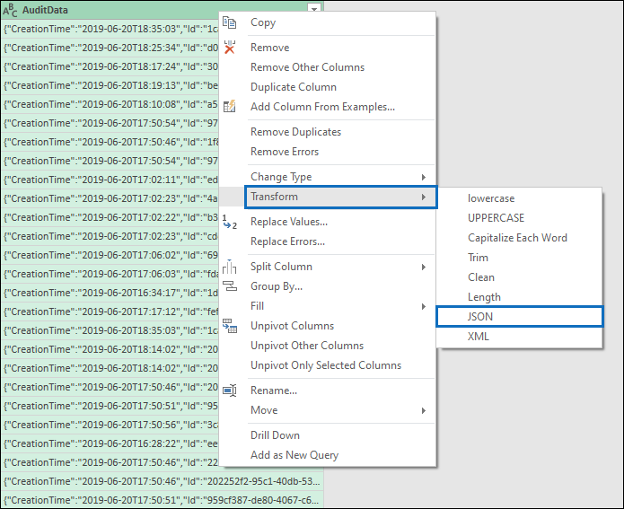

# <a name="export-configure-and-view-audit-log-records"></a>Exportar, configurar y ver registros de registro de auditoría

[!include[Purview banner](../includes/purview-rebrand-banner.md)]

Después de buscar en el registro de auditoría y descargar los resultados de la búsqueda en un archivo CSV, el archivo contiene una columna denominada **AuditData**, que contiene información adicional sobre cada evento. Los datos de esta columna tienen el formato de un objeto JSON, que contiene varias propiedades que se configuran como pares *property:value* separados por comas. Puede usar la característica de transformación JSON en el Editor de Power Query de Excel para dividir cada propiedad del objeto JSON de la columna **AuditData** en varias columnas para que cada propiedad tenga su propia columna. Esto le permite ordenar y filtrar una o varias de estas propiedades, lo que puede ayudarle a localizar rápidamente los datos de auditoría específicos que está buscando.

## <a name="step-1-export-audit-log-search-results"></a>Paso 1: Exportar resultados de búsqueda de registros de auditoría

El primer paso consiste en buscar en el registro de auditoría y, a continuación, exportar los resultados en un archivo de valores separados por comas (CSV) al equipo local.
  
1. Ejecute una [búsqueda de registros de auditoría](search-the-audit-log-in-security-and-compliance.md#search-the-audit-log) y revise los criterios de búsqueda si es necesario hasta que tenga los resultados deseados.

2. En la página de resultados de la búsqueda, haga clic en **Exportar** > **Descargar todos los resultados**.

   

   Esta opción exporta todos los registros de auditoría de la búsqueda de registros de auditoría que ejecutó en el paso 1 y agrega los datos sin procesar del registro de auditoría a un archivo CSV. El archivo de descarga tarda un tiempo en prepararse para una búsqueda grande. Los archivos grandes se producirán al buscar todas las actividades o usar un amplio intervalo de fechas.

3. Una vez completado el proceso de exportación, se muestra un mensaje en la parte superior de la ventana que le pide que abra el archivo CSV y lo guarde en el equipo local. También puede acceder al archivo CSV en la carpeta de Descargas.

   > [!NOTE]
   > Puede descargar un máximo de 50 000 entradas en un archivo CSV desde una única búsqueda de registros de auditoría. Si se descargan 50 000 entradas en el archivo CSV, probablemente puede suponer que existen más de 50 000 eventos que cumplen los criterios de búsqueda. Para exportar más de este límite, intente usar un intervalo de fechas más estrecho para reducir el número de registros de auditoría. Puede que tenga que ejecutar varias búsquedas con intervalos de fecha de menor tamaño para exportar más de 50 000 entradas.

## <a name="step-2-format-the-exported-audit-log-using-the-power-query-editor"></a>Paso 2: Dar formato al registro de auditoría exportado mediante el Editor de Power Query

El siguiente paso consiste en usar la característica de transformación JSON en el Editor de Power Query de Excel para dividir cada propiedad del objeto JSON de la columna **AuditData** en su propia columna. A continuación, se filtran las columnas para ver los registros en función de los valores de propiedades específicas. Esto puede ayudarle a localizar rápidamente los datos de auditoría específicos que está buscando.

1. Abra un libro en blanco en Excel para Office 365, Excel 2019 o Excel 2016.

2. En la pestaña **Datos** , en el grupo de la cinta **de opciones Obtener & transformar datos** , haga clic en **Desde texto o CSV**.

    

3. Abra el archivo CSV que descargó en el paso 1.

4. En la ventana que se muestra, haga clic en **Transformar datos**.

   

   El archivo CSV se abre en el **Editor de Power Query**. Hay cuatro columnas: **CreationDate**, **UserIds**, **Operations** y **AuditData**. La columna **AuditData** es un objeto JSON que contiene varias propiedades. El siguiente paso consiste en crear una columna para cada propiedad del objeto JSON.

5. Haga clic con el botón derecho en el título de la columna **AuditData** , haga clic en **Transformary**, a continuación, haga clic en **JSON**. 

   

6. En la esquina superior derecha de la columna **AuditData** , haga clic en el icono de expansión.

   

   Se muestra una lista parcial de las propiedades de los objetos JSON de la columna **AuditData** .

7. Haga clic en **Cargar más** para mostrar todas las propiedades de los objetos JSON de la columna **AuditData** .

   

   Puede anular la selección de la casilla situada junto a cualquier propiedad que no quiera incluir. La eliminación de columnas que no son útiles para la investigación es una buena manera de reducir la cantidad de datos que se muestran en el registro de auditoría. 

   > [!NOTE]
   > Las propiedades JSON que se muestran en la captura de pantalla anterior (después de hacer clic en **Cargar más**) se basan en las propiedades que se encuentran en la columna **AuditData** de las primeras 1000 filas del archivo CSV. Si hay diferentes propiedades JSON en los registros después de las primeras 1000 filas, estas propiedades (y una columna correspondiente) no se incluirán cuando la columna **AuditData** se divida en varias columnas. Para evitarlo, considere la posibilidad de volver a ejecutar la búsqueda de registros de auditoría y restringir los criterios de búsqueda para que se devuelvan menos registros. Otra solución alternativa consiste en filtrar los elementos de la columna **Operations** para reducir el número de filas (antes de realizar el paso 5 anterior) antes de transformar el objeto JSON en la columna **AuditData** .

   > [!TIP]
   > Para ver un atributo dentro de una lista como AuditData.AffectedItems, haga clic en el icono **Expandir** de la esquina superior derecha de la columna de la que desea extraer un atributo y, a continuación, seleccione **Expandir a nueva fila**.  Desde allí, será un registro y puede hacer clic en el icono **Expandir** de la esquina superior derecha de la columna, ver los atributos y seleccionar el que desea ver o extraer.

8. Realice una de las siguientes acciones para dar formato al título de las columnas que se agregan para cada propiedad JSON seleccionada.

    - Anule la selección de la casilla **Usar nombre de columna original como prefijo** para usar el nombre de la propiedad JSON como nombres de columna; por ejemplo, **RecordType** o **SourceFileName**.

    - Deje la casilla **Usar nombre de columna original como prefijo** seleccionada para agregar el prefijo AuditData a los nombres de columna; por ejemplo, **AuditData.RecordType** o **AuditData.SourceFileName**.

9. Haga clic en **Aceptar**.

    La columna **AuditData** se divide en varias columnas. Cada nueva columna corresponde a una propiedad del objeto JSON AuditData. Cada fila de la columna contiene el valor de la propiedad . Si la propiedad no contiene un valor, se muestra el valor *NULL* . En Excel, las celdas con valores NULL están vacías.
  
10. En la pestaña **Inicio**, haga clic en **Cerrar & cargar** para cerrar el Editor de Power Query y abrir el archivo CSV transformado en un libro de Excel.

## <a name="use-powershell-to-search-and-export-audit-log-records"></a>Uso de PowerShell para buscar y exportar registros de auditoría

En lugar de usar la herramienta de búsqueda de registros de auditoría en el portal de cumplimiento de Microsoft Purview, puede usar el cmdlet [Search-UnifiedAuditLog](/powershell/module/exchange/search-unifiedauditlog) en Exchange Online PowerShell para exportar los resultados de una búsqueda de registros de auditoría a un archivo CSV. A continuación, puede seguir el mismo procedimiento descrito en el paso 2 para dar formato al registro de auditoría mediante el editor de Power Query. Una ventaja de usar el cmdlet de PowerShell es que puede buscar eventos de un servicio específico mediante el parámetro *RecordType* . Estos son algunos ejemplos de uso de PowerShell para exportar registros de auditoría a un archivo CSV, de modo que pueda usar el editor de Power Query para transformar el objeto JSON en la columna **AuditData**, como se describe en el paso 2.

En este ejemplo, ejecute los siguientes comandos para devolver todos los registros relacionados con SharePoint operaciones de uso compartido.

```powershell
$auditlog = Search-UnifiedAuditLog -StartDate 06/01/2019 -EndDate 06/30/2019 -RecordType SharePointSharingOperation
```

```powershell
$auditlog | Select-Object -Property CreationDate,UserIds,RecordType,AuditData | Export-Csv -Path c:\AuditLogs\PowerShellAuditlog.csv -NoTypeInformation
```

Los resultados de la búsqueda se exportan a un archivo CSV denominado *PowerShellAuditlog* que contiene cuatro columnas: CreationDate, UserIds, RecordType, AuditData).

También puede usar el nombre o el valor de enumeración para el tipo de registro como valor para el parámetro *RecordType* . Para obtener una lista de los nombres de tipo de registro y sus valores de enumeración correspondientes, vea la tabla *AuditLogRecordType* en [Office 365 esquema de api de actividad de administración](/office/office-365-management-api/office-365-management-activity-api-schema#enum-auditlogrecordtype---type-edmint32).

Solo puede incluir un valor único para el parámetro *RecordType* . Para buscar registros de auditoría para otros tipos de registros, debe volver a ejecutar los dos comandos anteriores para especificar un tipo de registro diferente y anexar esos resultados al archivo CSV original. Por ejemplo, ejecutaría los dos comandos siguientes para agregar SharePoint actividades de archivo del mismo intervalo de fechas al archivo PowerShellAuditlog.csv.

```powershell
$auditlog = Search-UnifiedAuditLog -StartDate 06/01/2019 -EndDate 06/30/2019 -RecordType SharePointFileOperation
```

```powershell
$auditlog | Select-Object -Property CreationDate,UserIds,RecordType,AuditData | Export-Csv -Append -Path c:\AuditLogs\PowerShellAuditlog.csv -NoTypeInformation
```

## <a name="tips-for-exporting-and-viewing-the-audit-log"></a>Sugerencias para exportar y ver el registro de auditoría

Estas son algunas sugerencias y ejemplos de exportación y visualización del registro de auditoría antes y después de usar la característica de transformación JSON para dividir la columna **AuditData** en varias columnas.

- Filtre la columna **RecordType** para mostrar solo los registros de un servicio o área funcional específico. Por ejemplo, para mostrar eventos relacionados con el uso compartido de SharePoint, seleccione **14** (el valor de enumeración para los registros desencadenados por SharePoint actividades de uso compartido). Para obtener una lista de los servicios que corresponden a los valores de enumeración que se muestran en la columna **RecordType** , vea [Propiedades detalladas en el registro de auditoría](detailed-properties-in-the-office-365-audit-log.md).

- Filtre la columna **Operaciones** para mostrar los registros de actividades específicas. Para obtener una lista de la mayoría de las operaciones que se corresponden con una actividad de búsqueda en la herramienta de búsqueda de registros de auditoría del portal de cumplimiento, consulte la sección "Actividades auditadas" en [Buscar en el registro de auditoría](search-the-audit-log-in-security-and-compliance.md#audited-activities).
