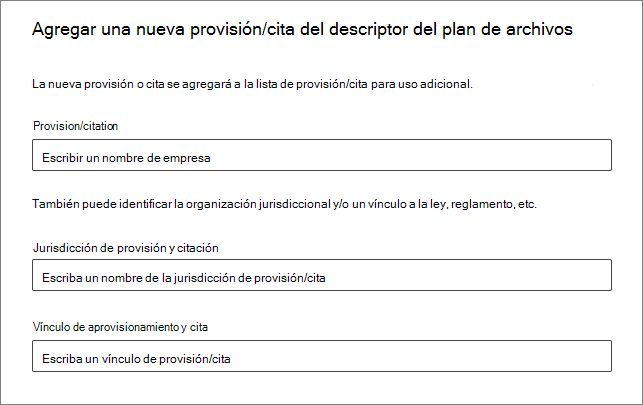

# Use el plan de archivos para administrar las etiquetas de retención

>*[Instrucciones de licencias de Microsoft 365 para la seguridad y el cumplimiento](/office365/servicedescriptions/microsoft-365-service-descriptions/microsoft-365-tenantlevel-services-licensing-guidance/microsoft-365-security-compliance-licensing-guidance).*

Aunque puede crear y administrar las etiquetas de retención desde **Gobierno de la información** en el centro de cumplimiento de Microsoft 365, el plan de archivos de **Administración de registros** tiene capacidades de administración adicionales:

- Puede crear una etiqueta de retención en masa al importar la información relevante desde una hoja de cálculo.

- Puede exportar la información de las etiquetas de retención existentes para el análisis y la colaboración sin conexión.

- Se muestra más información sobre las etiquetas de retención para que sea más fácil ver las opciones de configuración de todas sus etiquetas de retención desde una sola vista.

- Los descriptores del plan de archivos admiten información adicional y opcional para cada etiqueta.

El plan de archivos puede usarse para todas las etiquetas de retención, incluso si estas no marcan el contenido como un registro.

Para obtener información sobre qué son las etiquetas de retención y cómo usarlas, consulte [Obtener más información sobre las directivas y las etiquetas de retención](retention.md).

## Acceder al plan de archivos

Para acceder al plan de archivos, debe tener uno de los siguientes roles de administrador:
    
- Administrador de retención

- Administrador de retención con permiso de vista

En el Centro de cumplimiento de Microsoft 365, vaya a **Soluciones** > **Administración de registros** > **Plan de archivos**. 

Si **Administración de registros** no se muestra en el panel de navegación, desplácese hacia abajo y seleccione **Mostrar todo**.

## Navegar por el plan de archivos

Si ya ha creado las etiquetas de retención desde **Gobierno de la información** en el centro de cumplimiento de Microsoft 365, estas etiquetas se mostrarán automáticamente en su plan de archivos. 

De forma similar, si ahora crea etiquetas de retención en el plan de archivos, también estarán disponibles en **Gobierno de la información** si no se configuran para marcar el contenido como un registro.

En la página **Plan de archivos**, verá todas sus etiquetas con el estado y la configuración, los descriptores opcionales del plan de archivos, una opción de exportación para analizar o habilitar las revisiones sin conexión de sus etiquetas, y una opción de importación para crear etiquetas de retención. 

### Columnas de configuración de etiquetas

A excepción de la etiqueta **Nombre**, todas las columnas se pueden mostrar u ocultar al seleccionar la opción **Personalizar columnas**. Sin embargo, de manera predeterminada, las primeras columnas muestran información sobre el estado de la etiqueta y su configuración: 

- **Estado** identifica si la etiqueta está incluida en una directiva de etiqueta o en una directiva de aplicación automática (**Activa**) o no (**Inactiva**).

- **Basado en** identifica cómo y cuándo comienza el período de retención. Valores válidos:
    - Evento
    - Fecha de creación
    - Última modificación
    - Fecha de etiquetado

- **Es un registro** identifica si el elemento está marcado como un registro al aplicar la etiqueta. Valores válidos:
    - No
    - Sí
    - Sí (Normativa)

- **Duración de la retención** identifica el período de retención. Valores válidos:
    - Días
    - Meses
    - Años
    - Siempre
    - Ninguno

- **Tipo de eliminación** identifica qué ocurrirá con el contenido al final del período de retención. Valores válidos:
    - Ninguna acción
    - Eliminación automática
    - Revisión necesaria

### Columnas de descriptores del plan de archivos

El plan de archivos le permite incluir más información como parte de las etiquetas de retención. Estos descriptores del plan de archivos proporcionan más opciones para mejorar la facilidad de uso y la organización del contenido que necesite etiquetar.

De forma predeterminada, empezando por el **Reference Id**, en las siguientes columnas, se muestran estos descriptores opcionales del plan de archivos, que puede especificar al crear una etiqueta de retención o editar una etiqueta existente. 

Para empezar, hay algunos valores predeterminados para los siguientes descriptores del plan de archivos: 
- Departamento o función empresarial
- Categoría
- Authority type
- Provision/citation 

Ejemplo de descriptores del plan de archivos al crear o editar una etiqueta de retención:

Al seleccionar **Elegir** para cada uno de estos descriptores opcionales, puede seleccionar uno de los valores predefinidos o crear uno propio y, a continuación, seleccionarlo. Por ejemplo: 

## Exportar todas las etiquetas de retención para analizar o habilitar las revisiones sin conexión

Desde su administrador del plan de archivos, puede exportar los detalles de todas las etiquetas de retención a un archivo .csv, para facilitar las revisiones de cumplimiento periódicas con las partes interesadas del gobierno de datos de su organización.

Para exportar todas las etiquetas de retención: en la página **Plan de archivos**, haga clic en **Exportar**:

Se abrirá un archivo *.csv que contiene todas las etiquetas de retención existentes. Por ejemplo:

## Importar las etiquetas de retención al plan de archivos

En el plan de archivos, puede importar en masa nuevas etiquetas de retención mediante un archivo .csv con un formato específico: 

1. En la página **Plan de archivos**, haga clic en **Importar** para usar la página **Rellenar e importar su plan de archivos**:

   

   

2. Descargue una plantilla en blanco según las instrucciones:

   

3. Rellene la plantilla con la siguiente información que describe las propiedades y los valores válidos para cada propiedad. Para la importación, algunos valores tienen un límite de longitud:
    
    - **LabelName**: longitud máxima de 64 caracteres
    - **Comment** y **Notes**: longitud máxima de 1024 caracteres
    - Todos los demás valores: longitud ilimitada
     
    
   |Propiedad|Tipo|Obligatorio|Valores válidos|
   |:-----|:-----|:-----|:-----|
   |LabelName|Cadena|Sí|Esta propiedad especifica el nombre de la etiqueta de retención y debe ser única en el inquilino.|
   |Comentario|Cadena|No|Use esta propiedad para agregar una descripción sobre la etiqueta de retención para administradores. Esta descripción solo se mostrará a los administradores que administren la etiqueta de retención en el centro de cumplimiento.|
   |Notas|Cadena|No|Use esta propiedad para agregar una descripción sobre la etiqueta de retención para usuarios. Esta descripción aparece cuando los usuarios mueven el puntero sobre la etiqueta en aplicaciones como Outlook, SharePoint y OneDrive. Si deja esta propiedad en blanco, se muestra una descripción predeterminada que explica la configuración de retención de la etiqueta. |
   |IsRecordLabel|Cadena|No, a menos que **Regulatory** esté establecido en **TRUE**|Esta propiedad especifica si la etiqueta marca el contenido como un registro. Los valores válidos son: **TRUE**: la etiqueta marca el elemento como un registro y, por lo tanto, no se puede eliminar el elemento.  **FALSE**: la etiqueta no marca el contenido como un registro. Este es el valor predeterminado.     Dependencias de grupo: cuando se especifica esta propiedad, también se deben especificar RetentionAction, RetentionDuration y RetentionType.|
   |RetentionAction|Cadena|No, a menos que se especifiquen **RetentionDuration**, **RetentionType** o **ReviewerEmail**|Esta propiedad especifica la acción que se llevará a cabo cuando expire el valor especificado por la propiedad RetentionDuration (si está especificado). Los valores válidos son: **Delete**: se eliminan los elementos anteriores al valor especificado por la propiedad RetentionDuration. **Keep**: se conservan los elementos durante el tiempo que especifica la propiedad RetentionDuration y no se ejecuta ninguna acción cuando expira el período de duración.  **KeepAndDelete**: se conservan los elementos durante el tiempo que especifica la propiedad RetentionDuration y, al expirar el período de duración, se eliminan     Dependencias de grupo: cuando se especifica esta propiedad, también se deben especificar RetentionDuration y RetentionType. |
   |RetentionDuration|Cadena|No, a menos que se especifiquen **RetentionAction** o **RetentionType**|Esta propiedad especifica la cantidad de días que se va a conservar el contenido. Los valores válidos son: **Unlimited**: los elementos se conservarán de forma indefinida.  **_n_*: un entero positivo en días; por ejemplo, **365**. El número máximo admitido es 24 855, que es 68 años. Si necesita un número más grande, use Unlimited en su lugar.    Dependencias de grupo: cuando se especifica esta propiedad, también se deben especificar RetentionAction y RetentionType.
   |RetentionType|Cadena|No, a menos que se especifiquen **RetentionAction** o **RetentionDuration**|Esta propiedad especifica si se calcula la duración de la retención (si está especificada) desde la fecha de creación del contenido, la fecha del evento, la fecha de etiquetado o la última fecha de modificación. Los valores válidos son: **CreationAgeInDays** **EventAgeInDays** **TaggedAgeInDays** **ModificationAgeInDays**     Dependencias de grupo: cuando se especifica esta propiedad, también se deben especificar RetentionAction y RetentionDuration.|
   |ReviewerEmail|SmtpAddress|No|Al especificar esta propiedad, se activará una revisión para eliminación cuando expire la duración de la retención. Esta propiedad especifica la dirección de correo electrónico del revisor para las acción de retención **KeepAndDelete**.     Puede incluir la dirección de correo electrónico de usuarios individuales, grupos de seguridad o grupos de distribución en el inquilino. Especifique varias direcciones de correo electrónico separadas por punto y coma.     Dependencias de grupo: cuando se especifica esta propiedad, también se deben especificar **RetentionAction** (debe ser **KeepAndDelete**), **RetentionDuration** y **RetentionType**.|
   |ReferenceId|Cadena|No|Esta propiedad especifica el valor que se muestra en el descriptor de plan de archivos **Reference Id**, que puede usar como un valor único para su organización.| 
   |DepartmentName|Cadena|No|Esta propiedad especifica el valor que se muestra en el descriptor del plan de archivos **Function/Department**.|
   |Categoría|Cadena|No|Esta propiedad especifica el valor que se muestra en el descriptor **Categoría** del plan de archivos.|
   |SubCategory|Cadena|No|Esta propiedad especifica el valor que se muestra en el descriptor del plan de archivos **Sub category**.|
   |AuthorityType|Cadena|No|Esta propiedad especifica el valor que se muestra en el descriptor del plan de archivos **Authority type**.|
   |CitationName|Cadena|No|Esta propiedad especifica el nombre de la cita que se muestra en el descriptor del plan de archivos **Provision/citation**. Por ejemplo, "Ley Sarbanes-Oxley de 2002". |
   |CitationUrl|Cadena|No|Esta propiedad especifica el valor que se muestra en el descriptor del plan de archivos **Provision/citation**.|
   |CitationJurisdiction|Cadena|No|Esta propiedad especifica la jurisdicción o agencia que se muestra en el descriptor del plan de archivos **Provision/citation**. Por ejemplo, "Comisión de Bolsa y Valores de Estados Unidos (SEC)". |
   |Regulatory|Cadena|No|Esta propiedad especifica si la etiqueta marca el contenido como un registro normativo, que es [más restrictivo](records-management.md#compare-restrictions-for-what-actions-are-allowed-or-blocked) que un registro. Para usar esta configuración de etiqueta, el inquilino debe configurarse para [mostrar la opción de marcar el contenido como un registro normativo](declare-records.md#how-to-display-the-option-to-mark-content-as-a-regulatory-record) o se producirá un error en la validación de importación. Los valores admitidos son:  **TRUE**: la etiqueta marca el elemento como un registro normativo. También debe establecer la propiedad **IsRecordLabel** en TRUE. **FALSE**: la etiqueta no marca el contenido como un registro normativo. Este es el valor predeterminado.|
   |EventType|Cadena|No, a menos que **RetentionType** sea **EventAgeInDays**|Esta propiedad especifica un tipo de evento usado para la [retención basada en eventos](event-driven-retention.md). Especifique un tipo de evento existente que se muestre en **Administración de registros** > **Eventos** > **Administrar tipos de eventos**. Como alternativa, use el cmdlet [Get-ComplianceRetentionEventType](/powershell/module/exchange/get-complianceretentioneventtype) para ver los tipos de eventos disponibles. Aunque hay algunos tipos de eventos integrados, como **Actividad de empleado** y **Ciclo de vida del producto**, también puede crear sus propios tipos de eventos.     Si especifica su propio tipo de evento, debe existir antes de la importación porque el nombre se valida como parte del proceso de importación.|
   |||

   Este es un ejemplo de la plantilla que contiene información sobre las etiquetas de retención.

   

4. En el paso 3, en la página **Rellenar e importar el plan de archivos**, haga clic en **Buscar archivos** para cargar la plantilla completada y seleccione **Siguiente**.

   El plan de archivos carga el archivo y valida las entradas, mostrando las estadísticas de importación.

   

5. En función de los resultados de la validación:
    
    - Si se produce un error en la validación, anote el número de fila y el nombre de la columna para corregirlos en el archivo de importación. Seleccione **Cerrar** y, a continuación, **Sí** para confirmar. Corrija los errores en el archivo y guárdelo. Seleccione de nuevo la opción **Importar** y vuelva al paso 4.
    
    - Si se supera la etapa de validación, puede seleccionar **Puesta en marcha** para que las etiquetas de retención estén disponibles en el inquilino. O bien, seleccione el icono Cerrar de la página y **Sí** para confirmar que desea cerrar el asistente sin hacer que las etiquetas de retención estén disponibles en el inquilino en este momento.

Cuando las etiquetas importadas se agreguen al inquilino, ya podrá ponerlas a disposición de los usuarios mediante la publicación o la aplicación automática. Puede realizar ambas acciones en la pestaña **Directivas de etiquetas** y, a continuación, seleccionar **Publicar etiquetas** o **Aplicar automáticamente una etiqueta**.

## Pasos siguientes

Para obtener más información sobre cómo crear y editar las etiquetas de retención y sus directivas, consulte las siguientes instrucciones:
- [Crear etiquetas de retención y aplicarlas en aplicaciones](create-apply-retention-labels.md)
- [Aplicar una etiqueta de retención automáticamente al contenido](apply-retention-labels-automatically.md)