# Información general sobre el administrador del plan de archivosOverview of file plan manager

El administrador del plan de archivos proporciona funciones avanzadas de administración para las etiquetas de retención, directivas de etiquetas de retención y proporciona una forma integrada para recorrer las etiquetas y la actividad de etiquetas de contenido para todo su ciclo de vida: incluyendo la creación, colaboración, declaración de registro, retención y, por último, eliminación.File plan manager provides advanced management capabilities for retention labels and policies, and provides an integrated way to traverse label and label-to-content activity for your entire content lifecycle – from creation, through collaboration, record declaration, retention, and finally disposition. 

Para acceder al administrador del plan de archivos en el centro de seguridad y cumplimiento, vaya a **Administración de registros** > **Plan de archivos**.To access file plan manager in the security and compliance center, go to **Records management** > **File plan**.

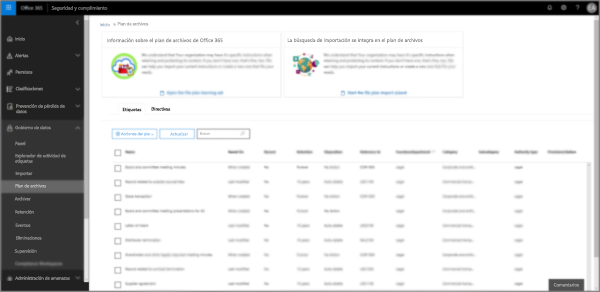

## Acceder al administrador del plan de archivosAccessing file plan manager

Hay dos requisitos para obtener acceso al administrador del plan de archivos, son:There are two requirements to access file plan manager, they are:

- Una suscripción de Office 365 Enterprise E5An Office 365 Enterprise E5 subscription.

- El usuario tiene asignado uno de los siguientes roles en el centro de seguridad y cumplimiento:The user has been in assigned one of the following roles in the security and compliance center:
    
    - Administrador de retenciónRetention Manager
    
    - Administrador de retención con permiso de vistaView-only Retention Manager

## Etiquetas de retención predeterminadas y directiva de etiquetasDefault retention labels and label policy

Si no hay etiquetas de retención en el Centro de seguridad y cumplimiento, la primera vez que elija **Plan de archivos** en la parte izquierda, se creará una directiva de etiquetas denominada **Directiva de publicación predeterminada de gobierno de datos**.If there are no retention labels in the Security & Compliance Center, the first time you choose **File plan** in the left nav, this creates a label policy called **Default Data Governance Publishing Policy**. 

Esta directiva de etiqueta contiene tres etiquetas de retención:This label policy contains three retention labels:

- **Procedimientos operativos****Operational procedure**
- **General comercial****Business general**
- **Acuerdo de contrato****Contract agreement**

Estas etiquetas de retención se configuran solo para retener el contenido, no eliminarlo.These retention labels are configured only to retain content, not delete content. Esta directiva de etiquetas se publicará en toda la organización y puede deshabilitarse o quitarse.This label policy will be published to the entire organization and can be disabled or removed. 

Puede determinar quién ha abierto el administrador del plan de archivos y desencadenado la experiencia de primera ejecución. Para ello, revise el registro de auditoría de las actividades **Directiva de retención creada** y **Configuración de retención para una directiva de retención creada**.You can determine who opened file plan manager and kicked off the first-run experience by reviewing the audit log for the activities **Created retention policy** and **Created retention configuration for a retention policy**.

> [!NOTE]
> Debido a los comentarios de los clientes, hemos eliminado la característica que crea las etiquetas de retención predeterminadas y la directiva de etiquetas de retención mencionadas anteriormente.Due to customer feedback, we have removed this feature that creates the default retention labels and label policy mentioned above. Solo verá las etiquetas de retención y la directiva de etiqueta de retención si abrió el administrador del plan de archivos antes del 11 de abril de 2019.You will only see this policy and labels if you used file plan manager before April 11, 2019.

## Navegar por el plan de archivosNavigating your file plan

El administrador del plan de archivos facilita ver y revisar la configuración de todas las directivas y etiquetas de retención en una vista.File plan manager makes it easier see into and across the settings of all your retention labels and policies from one view.

Tenga en cuenta que las etiquetas de retención creadas fuera del plan de archivos estarán disponibles en el plan de archivos y viceversa.Note that retention labels created outside of the file plan will be available in the file plan and vice versa.

En la pestaña **Etiquetas** del plan de archivos, están disponibles la siguiente información adicional y estas funciones:On the **file plan labels** tab, the following additional information and capabilities are available:

### Columnas de configuración de etiquetaLabel settings columns

- **En base a** identifica el tipo de desencadenador que iniciará el período de retención. Los valores válidos son:**Based on** identifies the type of trigger that will start the retention period. Valid values are:
    - EventoEvent
    - Fecha de creaciónWhen created
    - Fecha de última modificaciónWhen last modified
    - Fecha de etiquetadoWhen labeled
- **Registro** identifica si el elemento se convertirá en un registro declarado cuando se aplique la etiqueta. Los valores válidos son:**Record** identifies if the item will become a declared record when the label is applied. Valid values are:
    - NoNo
    - SíYes
    - Sí (Normativa)Yes(Regulatory)
- **Retención** identifica el tipo de retención. Los valores válidos son:**Retention** identifies the retention type. Valid values are:
    - ConservarKeep
    - Conservar y eliminarKeep and delete
    - EliminarDelete
- **Disposición** identifica qué ocurrirá con el contenido al final del período de retención. Los valores válidos son:**Disposition** identifies what will happen to the content at the end of the retention period. Valid values are:
    - nullnull
    - Ninguna acciónNo action
    - Eliminación automáticaAuto-delete
    - Revisión necesaria (también conocido como revisión de disposición)Review required (aka Disposition review)

### Columnas de descriptores del plan de archivos de las etiquetas de retenciónRetention label file plan descriptors columns

Ahora puede incluir más información en la configuración de sus etiquetas de retención.You can now include more information in the configuration of your retention labels. Inserting file plan descriptors into labels will improve the manageability and organization of your file plan. Cuando se insertan descriptores del plan de archivos en las etiquetas de retención, se facilita la administración y mejora  la organización del plan de archivos.You can now include more information in the configuration of your retention labels. Inserting file plan descriptors into labels will improve the manageability and organization of your file plan.

Para comenzar, el administrador del plan de archivos proporciona algunos valores de fábrica para función o departamento, categoría, tipo de autoridad y aprovisionamiento o cita.To get you started, file plan manager provides some out-of-box values for: Function/department, Category, Authority type and Provision/citation. You can add new file plan descriptor values when creating or editing a retention label. Puede agregar nuevos valores para los descriptores del plan de archivos al crear o editar una etiqueta de retención.To get you started, file plan manager provides some out-of-box values for: Function/department, Category, Authority type and Provision/citation. You can add new file plan descriptor values when creating or editing a retention label. También puede especificar los descriptores del plan de archivos al importar las etiquetas de retención al plan de archivos.You can also specify file plan descriptors when importing retention labels into your file plan. 

Esta es una vista del paso de descriptores del plan de archivos al crear o editar una etiqueta de retención.Here's a view of the file plan descriptors step when creating or editing a retention label.

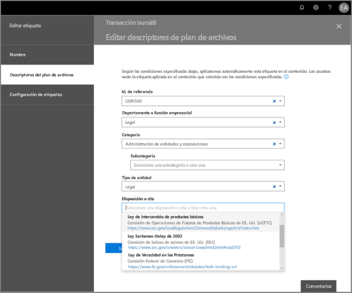

Esta es una vista de las columnas de descriptores del plan de archivos en la pestaña **Etiquetas** del administrador del plan de archivos.Here's a view of the file plan descriptors columns on the labels tab of file plan manager.

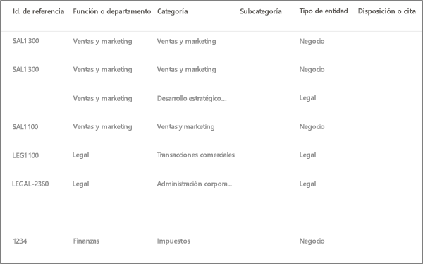

## Exportar todas las etiquetas de retención existentes para analizar y/o realizar revisiones sin conexiónExport all existing retention labels to analyze and/or perform offline reviews

Desde el administrador del plan de archivos, puede exportar los detalles de todas las etiquetas de retención a un archivo .csv para facilitar el revisiones de cumplimiento periódicas con partes interesadas del gobierno de datos de su organización.From file plan manager, you can export the details of all retention labels into a .csv file to assist you in facilitating periodic compliance reviews with data governance stakeholders in your organization.

Para exportar todas las etiquetas de retención, en la página **Plan de archivos**, vaya a **Acciones del plan de archivos**\> **Exportar etiquetas**.To export all retention labels: On the **File plan** page, **File plan actions** \> **Export labels**.

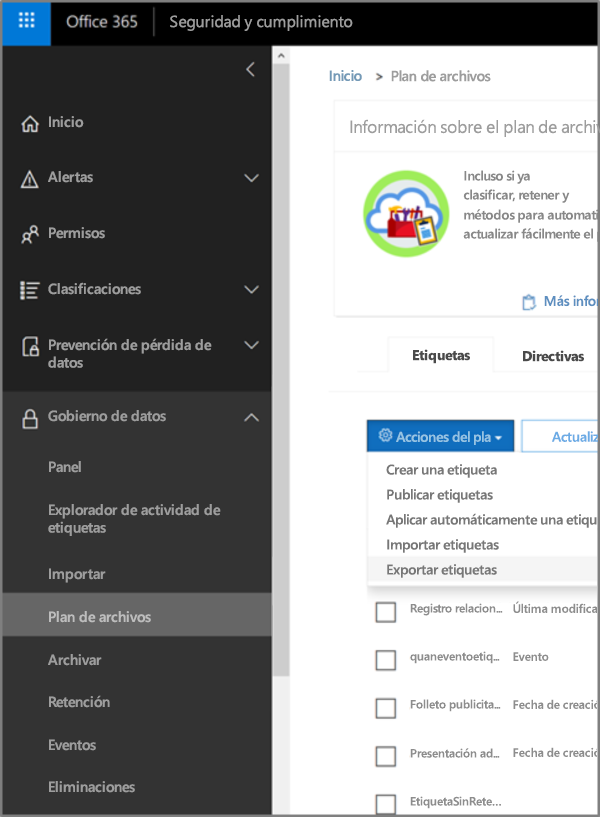

Se abrirá un archivo \*.csv que contiene todas las etiquetas de retención existentes.A \*.csv file containing all existing retention labels will open.

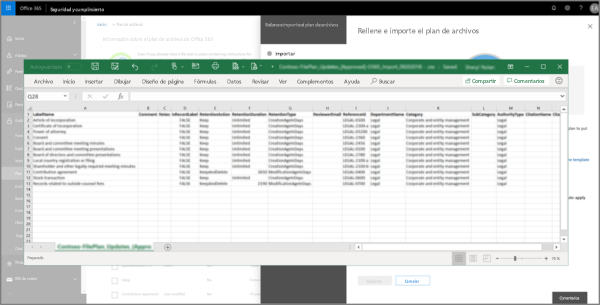

## Importar las etiquetas de retención al plan de archivosImport labels into your file plan

En el administrador del plan de archivos, puede importar en masa nuevas etiquetas de retención y modificar las etiquetas de retención existentes.In the File plan manager, you can bulk import new retention labels and modify existing retention labels.

Cómo importar nuevas etiquetas de retención y modificar las etiquetas de retención existentes:To import new retention labels and modify existing retention labels: 

1. En la página **Plan de archivos**, vaya a **Acciones del plan de archivos** > **Importar etiquetas**.On the **File plan** page, go to **File plan actions** > **Import labels**.

   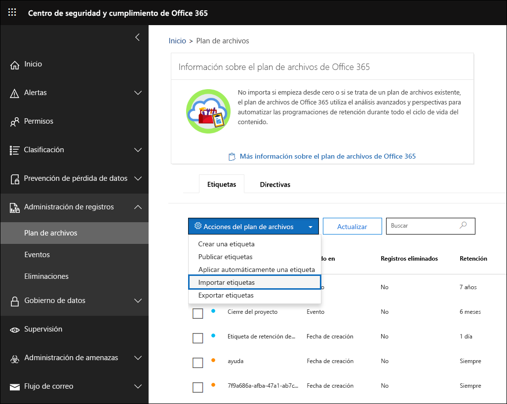

   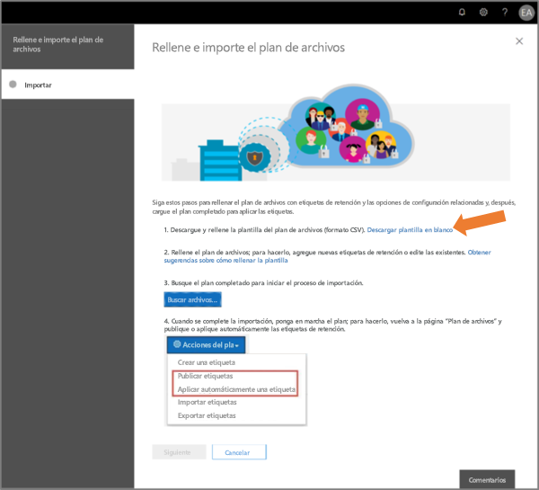

2. Descargue una plantilla en blanco para importar nuevas etiquetas de retención.Download a blank template to import new retention labels. Como alternativa, puede empezar con el archivo .csv que se exporta al exportar las etiquetas de retención existentes en su organización.Alternatively, you can start with the .csv file that is exported when you export the existing retention labels in your organization.

   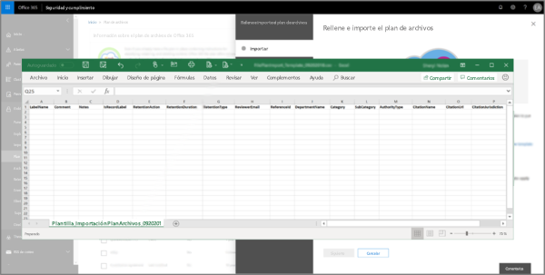

3. Complete la plantilla.Fill-out the template. A continuación, se describen las propiedades y los valores válidos para cada propiedad en la plantilla del plan de archivos.The following describes the properties and valid values for each property in the file plan template. 

   |**Propiedad****Property**|**Tipo****Type**|**Valores válidos****Valid values**|
   |:-----|:-----|:-----|
   |LabelNameLabelName|CadenaString|Esta propiedad especifica el nombre de la etiqueta de retención.This property specifies the name of the retention label.|
   |ComentarioComment|CadenaString|Use esta propiedad para agregar una descripción sobre la etiqueta de retención para administradores.Use this property to add a description about the retention label for admins. Esta descripción solo se mostrará a los administradores que administren la etiqueta en el centro de seguridad y cumplimiento.This description appears only to admins who manage the label in the security and compliance center.|
   |NotasNotes|CadenaString|Use esta propiedad para agregar una descripción sobre la etiqueta de retención para usuarios.Use this property to add a description about the retention label for users. Esta descripción aparece cuando los usuarios mueven el puntero sobre la etiqueta en aplicaciones como Outlook, SharePoint y OneDrive.This description appears when users hover over the label in apps like Outlook, SharePoint, and OneDrive. Si deja esta propiedad en blanco, se muestra una descripción predeterminada que explica la configuración de retención de la etiqueta.If you leave this property blank, a default description is displayed, which explains the label's retention settings. |
   |IsRecordLabelIsRecordLabel|CadenaString|Esta propiedad especifica si la etiqueta es una etiqueta de registro.The 
                IsRecordLabel
              parameter specifies whether the label is a record label. Los elementos etiquetados con una etiqueta de registro se declaran como registros.Items tagged with a record label are declared as records. Los valores válidos son:Valid values are: **TRUE**: la etiqueta es una etiqueta de registro.**TRUE**: The label is a record label. Tenga en cuenta que no se pueden eliminar los elementos declarados como registros.Note that items that are declared as a record can't be deleted.  **FALSE**: la etiqueta no es una etiqueta de registro.**FALSE**: The label isn't a record label. Este es el valor predeterminado.This is the default value.|
   |RetentionActionRetentionAction|CadenaString|Esta propiedad especifica la acción que se llevará a cabo cuando expire el valor especificado por la propiedad RetentionDuration.This property specifies what action to take after the value specified by the RetentionDuration property expires. Los valores válidos son:Valid values are: **Delete**: se eliminan los elementos anteriores al valor especificado por la propiedad RetentionDuration.**Delete**: Items older than the value specified by the RetentionDuration property are deleted. **Keep**: se conservan los elementos durante el tiempo que especifica la propiedad RetentionDuration y, al expirar el período de duración, no se ejecuta ninguna acción.**Keep**: Retain items for the duration specified by the RetentionDuration property and then doing nothing when the duration period expires.  **KeepAndDelete**: se conservan los elementos durante el tiempo que especifica la propiedad RetentionDuration y, al expirar el período de duración, se eliminan**KeepAndDelete**: Retain items for the duration specified by the RetentionDuration property and then delete them when the duration period expires.   |
   |RetentionDurationRetentionDuration|CadenaString|Esta propiedad especifica la cantidad de días que se va a conservar el contenido.The RetentionDuration parameter specifies the number of days to retain the content. Los valores válidos son:Valid values are: **Unlimited**: los elementos se conservarán de forma indefinida.**Unlimited**: Items will be retained indefinitely.  ***n***: un entero positivo, por ejemplo,**365**.***n***: A positive integer; for example, **365**. 
   |RetentionTypeRetentionType|CadenaString|Esta propiedad especifica si se calcula la duración de retención desde la fecha de creación de contenidos, desde la fecha del evento, desde la fecha de etiquetado o desde la fecha de la última modificación.This property specifies whether the retention duration is calculated from the content creation date, event date, labeled (tagged) date, or last modified date. Los valores válidos son:Valid values are: **CreationAgeInDays****CreationAgeInDays** **EventAgeInDays****EventAgeInDays** **TaggedAgeInDays****TaggedAgeInDays** **ModificationAgeInDays****ModificationAgeInDays** |
   |ReviewerEmailReviewerEmail|SmtpAddressSmtpAddress|Al rellenar esta propiedad, se activará una revisión de disposición cuando expire la duración de la retención.When this property is populated, a disposition review will be triggered when the retention duration expires. Esta propiedad especifica la dirección de correo electrónico del revisor para las acciones de retención **Delete** y **KeepAndDelete**The ReviewerEmail parameter specifies the email address of a reviewer for Delete and KeepAndDelete retention actions. Puede incluir la dirección de correo electrónico de usuarios individuales, grupos de seguridad o distribución o grupos de Office 365.You can include the email address of individual users, distribution or security groups, or Office 365 groups. Puede especificar varias direcciones de correo electrónico separadas por comas.You can specify multiple email addresses separated by commas.|
   |ReferenceIdReferenceId|CadenaString|Esta propiedad especifica el valor que se muestra en el descriptor del plan de archivos **Reference Id**.This property specifies the value that's displayed in the **Reference Id** file plan descriptor.| 
   |DepartmentNameDepartmentname|CadenaString|Esta propiedad especifica el valor que se muestra en el descriptor del plan de archivos **Function/Department**.This property specifies the value that's displayed in the **Function/department** file plan descriptor.|
   |CategoríaCategory|CadenaString|Esta propiedad especifica el valor que se muestra en el descriptor **Categoría** del plan de archivos.This property specifies the value that's displayed in the **Category** file plan descriptor.|
   |SubCategorySubCategory|CadenaString|Esta propiedad especifica el valor que se muestra en el descriptor del plan de archivos **Sub category**.This property specifies the value that's displayed in the **Sub category** file plan descriptor.|
   |AuthorityTypeAuthorityType|CadenaString|Esta propiedad especifica el valor que se muestra en el descriptor del plan de archivos **Authority type**.This property specifies the value that's displayed in the **Authority type** file plan descriptor.|
   |CitationNameCitationName|CadenaString|Esta propiedad especifica el nombre de la cita que se muestra en el descriptor del plan de archivos **Provision/citation**. Por ejemplo, "Ley Sarbanes-Oxley de 2002".This property specifies the name of the citation displayed in the **Provision/citation** file plan descriptor; for example "Sarbanes-Oxley Act or 2002". |
   |CitationUrlCitationUrl|CadenaString|Esta propiedad especifica el valor que se muestra en el descriptor del plan de archivos **Provision/citation**.This property specifies the URL that's displayed in the **Provision/citation** file plan descriptor.|
   |CitationJurisdictionCitationJurisdiction|CadenaString|Esta propiedad especifica la jurisdicción o agencia que se muestra en el descriptor del plan de archivos**Provision/citation**. Por ejemplo, "Comisión de Bolsa y Valores de Estados Unidos (SEC)". This property specifies the jurisdiction or agency that's displayed in the **Provision/citation** file plan descriptor; for example, "U.S. Securities and Exchange Commission (SEC)".|
   |RegulatoryRegulatory|CadenaString|Se deja en blanco.(leave blank) Esta propiedad no se usa en este momento.This property isn't used at this time.|
   |EventTypeEventType|CadenaString|Esta propiedad especifica la regla de retención que está asociada a la etiqueta.This property specifies the retention rule that's associated with the label. Puede usar cualquier valor que identifique de forma exclusiva la regla.You can use any value that uniquely identifies the rule. Por ejemplo:For example: **Nombre****Name** **Nombre distintivo (DN)****Distinguished name (DN)** **GUID****GUID**  Puede usar el cmdlet [Get-RetentionComplianceRule](https://docs.microsoft.com/powershell/module/exchange/policy-and-compliance-retention/get-retentioncompliancerule?view=exchange-ps) para ver las reglas de retención disponibles.You can use the [Get-DataEncryptionPolicy](https://docs.microsoft.com/powershell/module/exchange/policy-and-compliance-retention/get-retentioncompliancerule?view=exchange-ps) cmdlet to view the available policies. Tenga en cuenta que, si exporta etiquetas de una organización que utiliza Office 365, no podrá usar los valores de la propiedad EventType de esa organización al importar  las etiquetas a otra organización que utilice Office 365.Note that if you export labels from one Office 365 organization, you can't use the values for the EventType  property from that organization when importing labels to a different Office 365 organization. Esto sucede porque los valores de EventType son únicos para cada organización.That because the EventType values are unique to an organization. |
   |||

   A continuación hay un ejemplo de una plantilla con información sobre las etiquetas de retención.Here's an example the template containing the information about retention labels.

   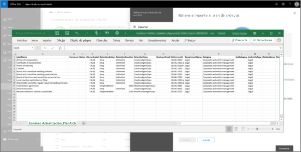

4. En el paso 3, en la página del Asistente para planes de importación de archivos, haga clic en **Buscar archivos** para cargar la plantilla completada.Under step 3 on the import file plan wizard page, click **Browse for files** to upload the filled-out template. 

   El administrador del plan de archivos validará las entradas y mostrará las estadísticas de importación.Upload the filled-out template, and file plan manager will validate the entries and display import statistics.

   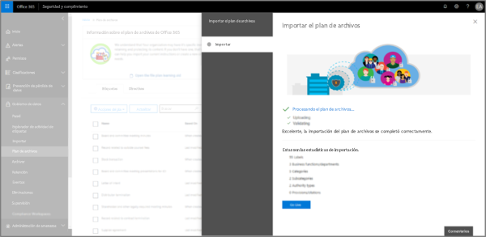

   En caso de que se produzca un error de validación, la importación del plan de archivo seguirá validando todas las entradas del archivo de importación y mostrará todos los errores que hacen referencia a los números de línea/fila en el archivo de importación. Copie los resultados de error que se muestran para que pueda volver fácilmente al archivo de importación y corregir los errores.In the event there is a validation error, file plan import will continue to validate every entry in the import file and display all errors referencing line/row numbers in the import file, copy the displayed error results so that you can easily return to the import file and correct the errors.

5. Una vez completada la importación, vuelva al administrador del plan de archivos para asociar las nuevas etiquetas de retención a directivas de etiquetas de retención nuevas o existentes.When the import is complete, return to file plan manager to assign new labels to new or existing policies.

   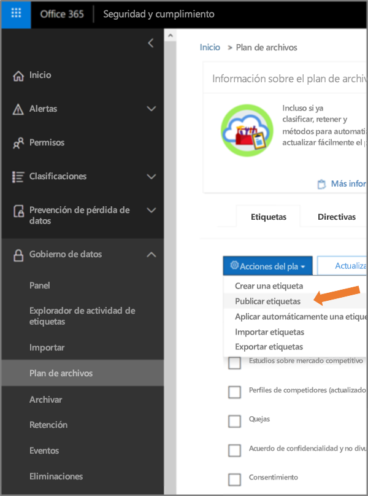
