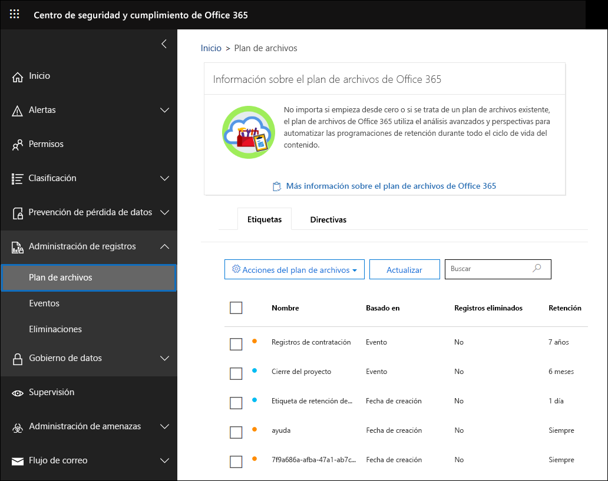
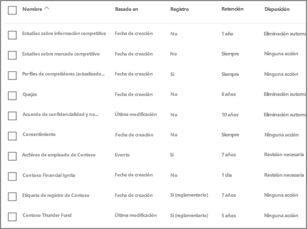
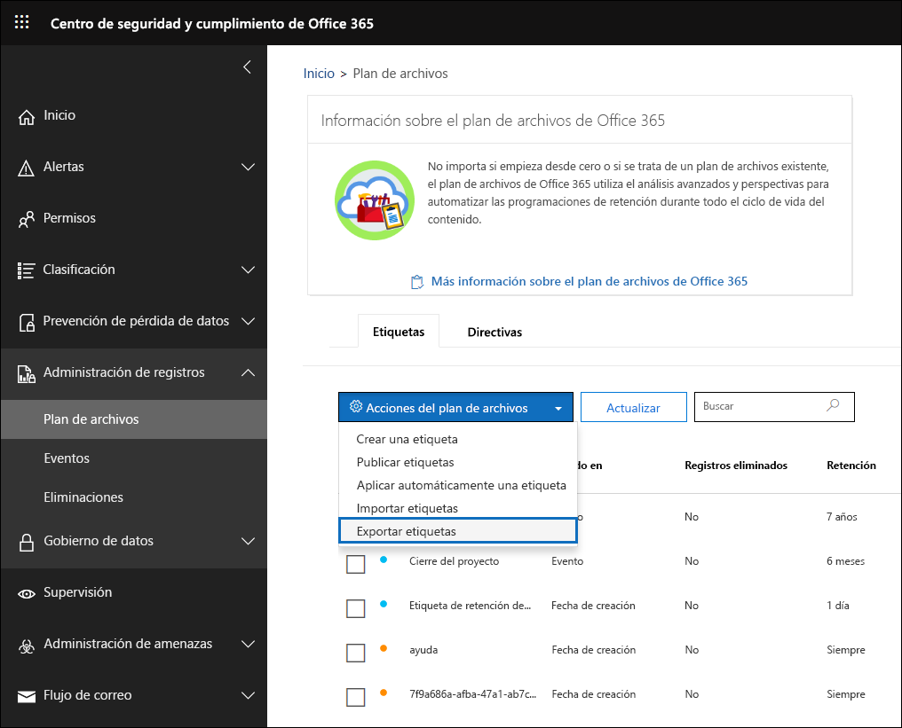
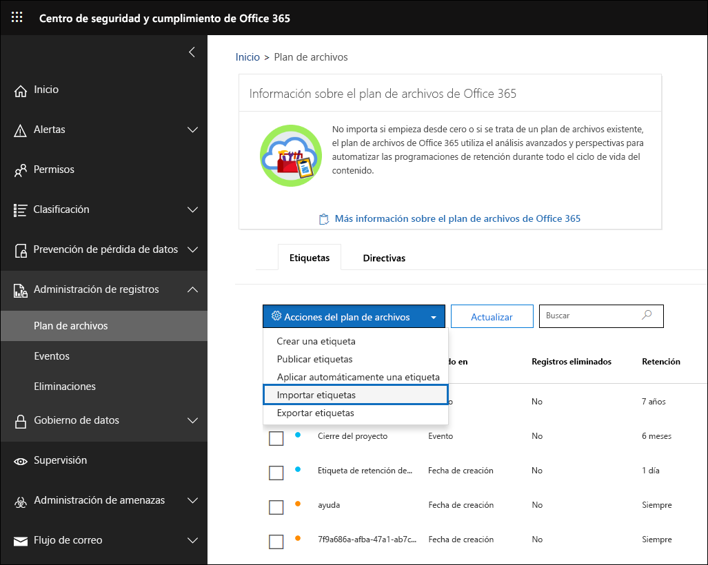
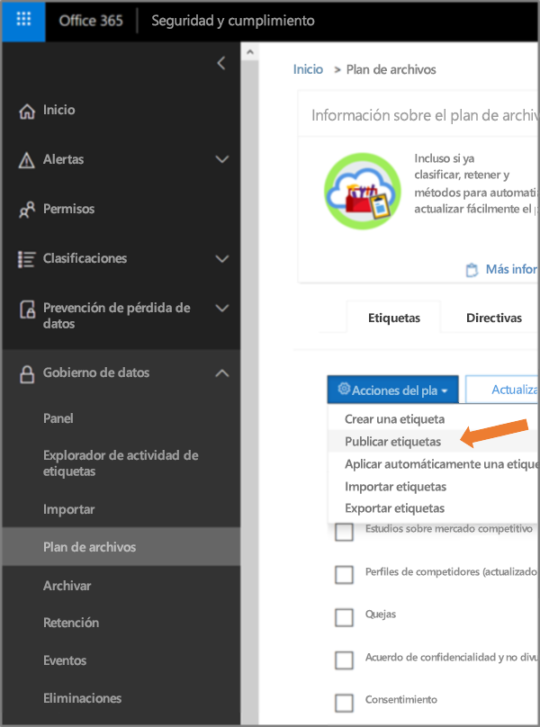

# Información general sobre el administrador del plan de archivos

>*[Instrucciones de licencias de Microsoft 365 para la seguridad y el cumplimiento](https://aka.ms/ComplianceSD).*

El administrador del plan de archivos proporciona funciones avanzadas de administración para las etiquetas de retención, directivas de etiquetas de retención y proporciona una forma integrada para recorrer las etiquetas y la actividad de etiquetas de contenido para todo su ciclo de vida: incluyendo la creación, colaboración, declaración de registro, retención y, por último, eliminación. 

Para acceder al administrador del plan de archivos en el centro de seguridad y cumplimiento, vaya a **Administración de registros** > **Plan de archivos**.

## Acceder al administrador del plan de archivos

Para acceder al administrador del plan de archivos, debe tener uno de los siguientes roles de administrador:
    
- Administrador de retención

- Administrador de retención con permiso de vista

## Etiquetas de retención predeterminadas y directiva de etiquetas

Si no hay etiquetas de retención en el Centro de seguridad y cumplimiento, la primera vez que elija **Plan de archivos** en la parte izquierda, se creará una directiva de etiquetas denominada **Directiva de publicación predeterminada de gobierno de datos**. 

Esta directiva de etiqueta contiene tres etiquetas de retención:

- **Procedimientos operativos**
- **General comercial**
- **Acuerdo de contrato**

Estas etiquetas de retención se configuran solo para retener el contenido, no eliminarlo. Esta directiva de etiquetas se publicará en toda la organización y puede deshabilitarse o quitarse. 

Puede determinar quién ha abierto el administrador del plan de archivos y desencadenado la experiencia de primera ejecución. Para ello, revise el registro de auditoría de las actividades **Directiva de retención creada** y **Configuración de retención para una directiva de retención creada**.

> [!NOTE]
> Debido a los comentarios de los clientes, hemos eliminado la característica que crea las etiquetas de retención predeterminadas y la directiva de etiquetas de retención mencionadas anteriormente. Solo verá las etiquetas de retención y la directiva de etiqueta de retención si abrió el administrador del plan de archivos antes del 11 de abril de 2019.

## Navegar por el plan de archivos

El administrador del plan de archivos facilita ver y revisar la configuración de todas las directivas y etiquetas de retención en una vista.

Tenga en cuenta que las etiquetas de retención creadas fuera del plan de archivos estarán disponibles en el plan de archivos y viceversa.

En la pestaña **Etiquetas** del plan de archivos, están disponibles la siguiente información adicional y estas funciones:

### Columnas de configuración de etiqueta

- **En base a** identifica el tipo de desencadenador que iniciará el período de retención. Los valores válidos son:
    - Evento
    - Fecha de creación
    - Fecha de última modificación
    - Fecha de etiquetado
- **Registro** identifica si el elemento se convertirá en un registro declarado cuando se aplique la etiqueta. Los valores válidos son:
    - No
    - Sí
    - Sí (Normativa)
- **Retención** identifica el tipo de retención. Los valores válidos son:
    - Conservar
    - Conservar y eliminar
    - Eliminar
- **Disposición** identifica qué ocurrirá con el contenido al final del período de retención. Los valores válidos son:
    - null
    - Ninguna acción
    - Eliminación automática
    - Revisión necesaria (también conocido como revisión de disposición)

### Columnas de descriptores del plan de archivos de las etiquetas de retención

Ahora puede incluir más información en la configuración de sus etiquetas de retención. Cuando se insertan descriptores del plan de archivos en las etiquetas de retención, se facilita la administración y mejora  la organización del plan de archivos.

Para comenzar, el administrador del plan de archivos proporciona algunos valores de fábrica para función o departamento, categoría, tipo de autoridad y aprovisionamiento o cita. Puede agregar nuevos valores para los descriptores del plan de archivos al crear o editar una etiqueta de retención. También puede especificar los descriptores del plan de archivos al importar las etiquetas de retención al plan de archivos. 

Esta es una vista del paso de descriptores del plan de archivos al crear o editar una etiqueta de retención.

Esta es una vista de las columnas de descriptores del plan de archivos en la pestaña **Etiquetas** del administrador del plan de archivos.

## Exportar todas las etiquetas de retención existentes para analizar y/o realizar revisiones sin conexión

Desde el administrador del plan de archivos, puede exportar los detalles de todas las etiquetas de retención a un archivo .csv para facilitar el revisiones de cumplimiento periódicas con partes interesadas del gobierno de datos de su organización.

Para exportar todas las etiquetas de retención, en la página **Plan de archivos**, vaya a **Acciones del plan de archivos**\> **Exportar etiquetas**.

Se abrirá un archivo *.csv que contiene todas las etiquetas de retención existentes.

## Importar las etiquetas de retención al plan de archivos

En el administrador del plan de archivos, puede importar en masa nuevas etiquetas de retención y modificar las etiquetas de retención existentes.

Cómo importar nuevas etiquetas de retención y modificar las etiquetas de retención existentes: 

1. En la página **Plan de archivos**, vaya a **Acciones del plan de archivos** > **Importar etiquetas**.

   

   

2. Descargue una plantilla en blanco para importar nuevas etiquetas de retención. Como alternativa, puede empezar con el archivo .csv que se exporta al exportar las etiquetas de retención existentes en su organización.

   

3. Complete la plantilla. A continuación, se describen las propiedades y los valores válidos para cada propiedad en la plantilla del plan de archivos. Para la importación, cada valor tiene una longitud máxima de 64 caracteres.  

   |**Propiedad**|**Tipo**|**Valores válidos**|
   |:-----|:-----|:-----|
   |LabelName|Cadena|Esta propiedad especifica el nombre de la etiqueta de retención.|
   |Comentario|Cadena|Use esta propiedad para agregar una descripción sobre la etiqueta de retención para administradores. Esta descripción solo se mostrará a los administradores que administren la etiqueta en el centro de seguridad y cumplimiento.|
   |Notas|Cadena|Use esta propiedad para agregar una descripción sobre la etiqueta de retención para usuarios. Esta descripción aparece cuando los usuarios mueven el puntero sobre la etiqueta en aplicaciones como Outlook, SharePoint y OneDrive. Si deja esta propiedad en blanco, se muestra una descripción predeterminada que explica la configuración de retención de la etiqueta. |
   |IsRecordLabel|Cadena|Esta propiedad especifica si la etiqueta es una etiqueta de registro. Los elementos etiquetados con una etiqueta de registro se declaran como registros. Los valores válidos son: **TRUE**: la etiqueta es una etiqueta de registro. Tenga en cuenta que no se pueden eliminar los elementos declarados como registros.  **FALSE**: la etiqueta no es una etiqueta de registro. Este es el valor predeterminado.|
   |RetentionAction|Cadena|Esta propiedad especifica la acción que se llevará a cabo cuando expire el valor especificado por la propiedad RetentionDuration. Los valores válidos son: **Delete**: se eliminan los elementos anteriores al valor especificado por la propiedad RetentionDuration. **Keep**: se conservan los elementos durante el tiempo que especifica la propiedad RetentionDuration y, al expirar el período de duración, no se ejecuta ninguna acción.  **KeepAndDelete**: se conservan los elementos durante el tiempo que especifica la propiedad RetentionDuration y, al expirar el período de duración, se eliminan   |
   |RetentionDuration|Cadena|Esta propiedad especifica la cantidad de días que se va a conservar el contenido. Los valores válidos son: **Unlimited**: los elementos se conservarán de forma indefinida.  ***n***: un entero positivo, por ejemplo,**365**. 
   |RetentionType|Cadena|Esta propiedad especifica si se calcula la duración de retención desde la fecha de creación de contenidos, desde la fecha del evento, desde la fecha de etiquetado o desde la fecha de la última modificación. Los valores válidos son: **CreationAgeInDays** **EventAgeInDays** **TaggedAgeInDays** **ModificationAgeInDays** |
   |ReviewerEmail|SmtpAddress|Al rellenar esta propiedad, se activará una revisión de disposición cuando expire la duración de la retención. Esta propiedad especifica la dirección de correo electrónico del revisor para las acción de retención **KeepAndDelete**. Puede incluir la dirección de correo electrónico de usuarios individuales, grupos de seguridad o grupos de distribución. Puede especificar varias direcciones de correo electrónico separadas por punto y coma.|
   |ReferenceId|Cadena|Esta propiedad especifica el valor que se muestra en el descriptor del plan de archivos **Reference Id**.| 
   |DepartmentName|Cadena|Esta propiedad especifica el valor que se muestra en el descriptor del plan de archivos **Function/Department**.|
   |Categoría|Cadena|Esta propiedad especifica el valor que se muestra en el descriptor **Categoría** del plan de archivos.|
   |SubCategory|Cadena|Esta propiedad especifica el valor que se muestra en el descriptor del plan de archivos **Sub category**.|
   |AuthorityType|Cadena|Esta propiedad especifica el valor que se muestra en el descriptor del plan de archivos **Authority type**.|
   |CitationName|Cadena|Esta propiedad especifica el nombre de la cita que se muestra en el descriptor del plan de archivos **Provision/citation**. Por ejemplo, "Ley Sarbanes-Oxley de 2002". |
   |CitationUrl|Cadena|Esta propiedad especifica el valor que se muestra en el descriptor del plan de archivos **Provision/citation**.|
   |CitationJurisdiction|Cadena|Esta propiedad especifica la jurisdicción o agencia que se muestra en el descriptor del plan de archivos**Provision/citation**. Por ejemplo, "Comisión de Bolsa y Valores de Estados Unidos (SEC)". |
   |Regulatory|Cadena|Se deja en blanco. Esta propiedad no se usa en este momento.|
   |EventType|Cadena|Esta propiedad especifica la regla de retención que está asociada a la etiqueta. Puede usar cualquier valor que identifique de forma exclusiva la regla. Por ejemplo: **Nombre** **Nombre distintivo (DN)** **GUID**  Puede usar el cmdlet [Get-RetentionComplianceRule](https://docs.microsoft.com/powershell/module/exchange/get-retentioncompliancerule?view=exchange-ps) para ver las reglas de retención disponibles. Tenga en cuenta que, si exporta etiquetas de una organización, no podrá usar los valores de la propiedad EventType de esa organización al importar las etiquetas a otra organización. Esto sucede porque los valores de EventType son únicos para cada organización. |
   |||

   A continuación hay un ejemplo de una plantilla con información sobre las etiquetas de retención.

   

4. En el paso 3, en la página del Asistente para planes de importación de archivos, haga clic en **Buscar archivos** para cargar la plantilla completada. 

   El administrador del plan de archivos validará las entradas y mostrará las estadísticas de importación.

   

   En caso de que se produzca un error de validación, la importación del plan de archivo seguirá validando todas las entradas del archivo de importación y mostrará todos los errores que hacen referencia a los números de línea/fila en el archivo de importación. Copie los resultados de error que se muestran para que pueda volver fácilmente al archivo de importación y corregir los errores.

5. Una vez completada la importación, vuelva al administrador del plan de archivos para asociar las nuevas etiquetas de retención a directivas de etiquetas de retención nuevas o existentes.

   
