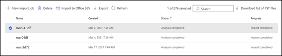
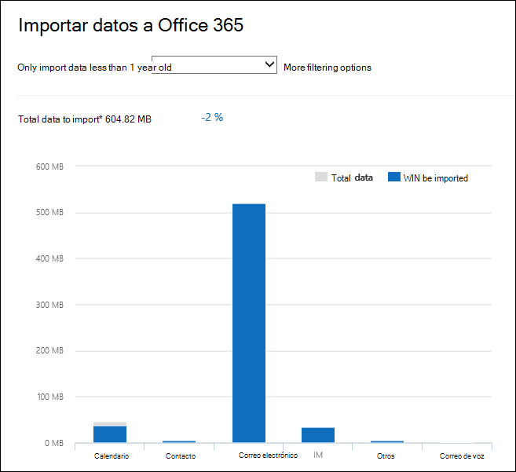
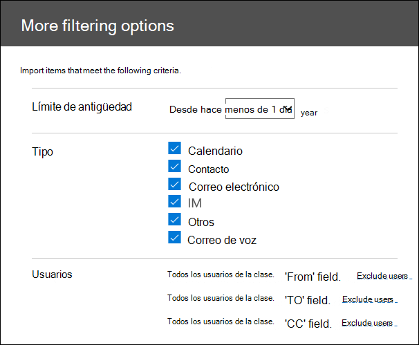

# Filtrar datos al importar archivos PST

Use la nueva característica De importación inteligente en el servicio Microsoft 365 importar para filtrar los elementos de los archivos PST que realmente se importan a los buzones de destino. Aquí se muestra cómo funciona:
  
- Después de crear y enviar un trabajo de importación de PST, los archivos PST se cargan en un área de almacenamiento de Azure en la nube de Microsoft.
  
- Microsoft 365 los datos de los archivos PST, de forma segura y segura, identificando la antigüedad de los elementos del buzón y los diferentes tipos de mensajes incluidos en los archivos PST.
  
- Una vez completado el análisis y los datos están listos para importarse, tiene la opción de importar todos los datos de los archivos PST tal cual o recortar los datos que se importan estableciendo filtros que controlan los datos que se importan. Por ejemplo, puede elegir:
  
  - Importar solo elementos de una determinada antigüedad.
  
  - Importe los tipos de mensaje seleccionados.
  
  - Excluir los mensajes enviados o recibidos por personas específicas.
  
- Después de configurar las opciones de filtro, Microsoft 365 importa solo los datos que cumplen los criterios de filtrado a los buzones de destino especificados en el trabajo de importación.
  
El siguiente gráfico muestra el proceso de importación inteligente y resalta las tareas que realiza y las tareas realizadas por Office 365.
  

  
## Crear un trabajo de importación de PST

- En los pasos de este tema se supone que ha creado un trabajo de importación de PST en el servicio Office 365 importar mediante la carga de red o el trasvase de unidades. Para obtener instrucciones paso a paso, consulte uno de los siguientes temas:
    
  - [Usar la carga en la red para importar archivos PST en Office 365](use-network-upload-to-import-pst-files.md)
    
  - [Use el envío de unidades para importar archivos PST a Office 365](use-drive-shipping-to-import-pst-files-to-office-365.md)
    
- Después de crear un trabajo de importación mediante la carga de red, el estado del trabajo de importación en la página Importar del Centro de cumplimiento de seguridad & se establece en Análisis en **curso,** lo que significa que Microsoft 365 está analizando los datos de los archivos PST que cargó. Haga **clic en** Actualizar actualización para actualizar el estado del trabajo de  importación. 
    
- Para los trabajos de importación de envío de unidades, Microsoft 365 analizará los datos después de que el personal del centro de datos de Microsoft reciba el disco duro y cargue los archivos PST en el área de almacenamiento de Azure para su organización.
  
## Filtrar datos que se importan a buzones

Después de crear un trabajo de importación de PST, siga estos pasos para filtrar los datos antes de importarlos a Office 365.
  
1. Vaya a <https://compliance.microsoft.com> e inicie sesión con las credenciales de una cuenta de administrador de su organización.
    
2. En el panel izquierdo del Centro de cumplimiento de Microsoft 365, haga clic en **Control de la información**\>**Importar**.
    
    Los trabajos de importación de la organización se enumeran en la **pestaña** Importar. El **valor De análisis** completado de la columna Estado indica los trabajos de importación que han sido analizados por Microsoft 365 y están listos para importar. 
    
    
  
3. Seleccione el trabajo de importación que desea completar y haga clic **en Importar para Office 365**.
  
    Se muestra una página de control flotante con información sobre los archivos PST y otra información sobre el trabajo de importación.

4. Haga **clic en Importar para Office 365**.
    
    Se mostrará la página **Filtrar los datos**. Contiene información sobre los datos de los archivos PST para el trabajo de importación, incluida la información sobre la antigüedad de los datos. 
    
    
  
5. En función de si desea recortar los datos que se importan a Microsoft 365, en ¿Desea filtrar los **datos?**, realice una de las siguientes acciones:
  
    a. Haga **clic en Sí, quiero filtrarlo antes de** importarlo para recortar los datos que importa y, a continuación, haga clic en **Siguiente**.
  
    La **página Importar datos Office 365 página** se muestra con información detallada sobre los datos del análisis que Microsoft 365 realizado. 
  
    
  
    El gráfico de esta página muestra la cantidad de datos que se importarán. La información sobre cada tipo de mensaje que se encuentra en los archivos PST se muestra en el gráfico. Puede situar el cursor sobre cada barra para mostrar información específica sobre ese tipo de mensaje. También hay una lista desplegable con diferentes valores de antigüedad basados en el análisis de los archivos PST. Al seleccionar una antigüedad en la lista desplegable, el gráfico se actualiza para mostrar la cantidad de datos que se importarán para la antigüedad seleccionada. 
  
    b. Para configurar filtros adicionales para reducir la cantidad de datos que se importan, haga clic en **Más opciones de filtrado.**
  
    
  
    Puede configurar estos filtros:
  
      - **Antigüedad:** seleccione una antigüedad para que solo se importen los elementos que sean más recientes que la antigüedad especificada. Consulte la [sección Más información](#more-information) para obtener una descripción sobre Microsoft 365 determina los cubos de antigüedad para el filtro **de** antigüedad. 
  
      - **Tipo:** en esta sección se muestran todos los tipos de mensaje que se encontraron en los archivos PST para el trabajo de importación. Puedes desactivar una casilla junto a un tipo de mensaje que quieras excluir. No puede excluir el tipo de mensaje Otro. Vea la [sección Más información](#more-information) para obtener una lista de elementos de buzón que se incluyen en la categoría Otros.
  
      - **Usuarios:** puede excluir los mensajes enviados o recibidos por personas específicas. Para excluir a las personas que aparecen en los campos De: ,  Para: o Cc: de mensajes, haga clic en Excluir usuarios junto a ese tipo de destinatario. Escriba la dirección de correo electrónico (dirección SMTP) de la persona, haga clic en Agregar nuevo icono para agregarlos a la lista de usuarios excluidos para ese tipo de destinatario y, a continuación, haga clic en Guardar para guardar la lista de usuarios    
  
        > [!NOTE]
        > Microsoft 365 no muestra información de datos que se deba a la configuración del **filtro** Personas. Sin embargo, si establece este filtro para excluir los mensajes enviados o recibidos por personas específicas, dichos mensajes se excluirán durante el proceso de importación real. 
  
    c. Haga **clic en** Aplicar en la página Más opciones **de** filtrado para guardar la configuración del filtro. 
  
    Los datos de la página Importar datos **Office 365** se actualizan en función de la configuración del filtro, incluida la cantidad total de datos que se importarán en función de la configuración del filtro. También se muestra un resumen de la configuración del filtro. Puede hacer clic **en Editar** junto a un filtro para cambiar la configuración si es necesario. 
  
    
  
    d. Haga clic en **Siguiente**.
  
    Se muestra una página de estado que muestra la configuración del filtro. De nuevo, puede editar cualquiera de las opciones de filtro.
  
    e. Haga **clic en Importar datos** para iniciar la importación. Se muestra la cantidad total de datos que se importarán. 
  
    O bien:
  
    a. Haga **clic en No, quiero importar** todo para importar todos los datos de los archivos PST a Office 365 y, a continuación, haga clic en **Siguiente**.
  
    b. En la **página Importar datos Office 365,** haga clic **en Importar datos** para iniciar la importación. Se muestra la cantidad total de datos que se importarán. 
  
6. En la **pestaña Importar,** haga clic **en Actualizar**  . El estado del trabajo de importación se muestra en la **columna** Estado.
  
7. Haga clic en importar el trabajo para mostrar información más detallada, como el estado de cada archivo PST y la configuración de filtro que configuró.

## Más información

- ¿Cómo Microsoft 365 los incrementos del filtro de antigüedad? Cuando Microsoft 365 un archivo PST, examina la marca de tiempo enviada o recibida de cada elemento (si un elemento tiene una marca de tiempo enviada y recibida, se selecciona la fecha más antigua). Después Microsoft 365 el valor de año de esa marca de tiempo y lo compara con la fecha actual para determinar la antigüedad del elemento. A continuación, estas edades se usan como valores de la lista desplegable del **filtro Antigüedad.** Por ejemplo, si un archivo PST tiene mensajes de 2016, 2015 y  2014, los valores del filtro Edad serían **1 año,** **2 años** y **3 años**.
  
- En la tabla siguiente se enumeran los tipos  de mensaje  que se incluyen en la categoría Otros en el filtro Tipo de la página Más opciones de salida (vea el paso 5b en el procedimiento anterior).  Actualmente, no puede excluir elementos de la categoría "Otros" al importar LOST a Office 365. 
  
    |**Id. de clase de mensajes**|**Elementos de buzón que usan esta clase de mensaje**|
    |:-----|:-----|
    |IPM.Activity    |Entradas del Diario    |
    |IPM.Document    |Documentos y archivos (no adjuntos a un mensaje de correo electrónico)    |
    |IPM. Archivo    |(igual que IPM.Document)    |
    |IPM. Note.IMC.Notification    |Informes enviados por correo de Internet Conectar, que es la Exchange Server a Internet    |
    |IPM. Note.Microsoft.Fax    |Mensajes de fax    |
    |IPM. Note.Rules.Oof.Template.Microsoft    |Mensajes de autor profunda fuera de la oficina    |
    |IPM. Note.Rules.ReplyTemplate.Microsoft    |Respuestas enviadas por una regla de bandeja de entrada    |
    |IPM.OLE.Class    |Excepciones para una serie periódica    |
    |IPM. Recall.Report    |Informes de recuperación de mensajes    |
    |IPM.Remote    |Mensajes de correo remoto    |
    |IPM. Informe    |Informes de estado de elementos    |
