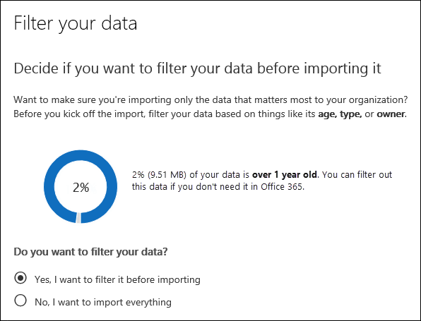

# Filtrar datos al importar archivos PSTFilter data when importing PST files

Use la nueva característica de importación inteligente en el servicio de importación de Office 365 para filtrar los elementos de los archivos PST que realmente se importan a los buzones de correo de destino.Use the new Intelligent Import feature in the Office 365 Import service to filter the items in PST files that actually get imported to the target mailboxes. Aquí se muestra cómo funciona:Here's how it works:
  
- Después de crear y enviar un trabajo de importación de PST, los archivos PST se cargan en un área de almacenamiento de Azure en la nube de Microsoft.After you create and submit a PST import job, PST files are uploaded to an Azure storage area in the Microsoft cloud.
    
- Microsoft 365 analiza los datos de los archivos PST, de forma segura, mediante la identificación de la antigüedad de los elementos del buzón y los distintos tipos de mensajes incluidos en los archivos PST.Microsoft 365 analyzes the data in the PST files, in a safe and secure manner, by identifying the age of the mailbox items and the different message types included in the PST files.
    
- Una vez que se ha completado el análisis y los datos están listos para importar, tiene la opción de importar todos los datos de los archivos PST tal cual o recortar los datos que se importan mediante la configuración de filtros que controlan los datos que se importan.When the analysis is complete and the data is ready to import, you have the option to import all data in the PST files as is or trim the data that's imported by setting filters that control what data gets imported. Por ejemplo, puede elegir entre:For example, you can choose to:
    
  - Importa sólo los elementos de una antigüedad determinada.Import only items of a certain age.
    
  - Importar los tipos de mensajes seleccionados.Import selected message types.
    
  - Excluir los mensajes enviados o recibidos por personas específicas.Exclude messages sent or received by specific people.
    
- Después de configurar las opciones de filtro, Microsoft 365 importa solo los datos que cumplan los criterios de filtrado en los buzones de correo de destino especificados en el trabajo de importación.After you configure the filter settings, Microsoft 365 imports only the data that meets the filtering criteria to the target mailboxes specified in the import job.
    
En el gráfico siguiente se muestra el proceso de importación inteligente y se resaltan las tareas que se realizan y las tareas realizadas por Office 365.The following graphic shows the Intelligent Import process, and highlights the tasks you perform and the tasks performed by Office 365.
  

  
## Antes de empezarBefore you begin

- En los pasos de este tema se supone que ha creado un trabajo de importación de PST en el servicio de importación de Office 365 mediante carga de red o envío de unidades.The steps in this topic assume that you've created a PST import job in the Office 365 Import service by using network upload or drive shipping. Para obtener instrucciones paso a paso, consulte uno de los siguientes temas:For step-by-step instructions, see one of the following topics:
    
  - [Usar la carga en la red para importar archivos PST en Office 365Use network upload to import PST files to Office 365](use-network-upload-to-import-pst-files.md)
    
  - [Use el envío de unidades para importar archivos PST a Office 365Use drive shipping to import PST files to Office 365](use-drive-shipping-to-import-pst-files-to-office-365.md)
    
- Después de crear un trabajo de importación mediante la carga en la red, el estado del trabajo de importación en la página importar del centro de seguridad & cumplimiento se establece en **análisis en curso**, lo que significa que Microsoft 365 está analizando los datos de los archivos PST que ha cargado.After you create an import job by using network upload, the status for the import job on the Import page in the Security & Compliance Center is set to **Analysis in progress**, which means that Microsoft 365 is analyzing the data in the PST files that you uploaded. Haga **Refresh** actualizar actualización para actualizar el estado del trabajo de importación.Click **Refresh** to update the status for the import job. 
    
- Para la unidad de envío de trabajos de importación, Microsoft 365 analiza los datos después de que el personal del centro de datos de Microsoft reciba el disco duro y cargue los archivos PST en el área de almacenamiento de Azure de su organización.For drive shipping import jobs, the data will be analyzed by Microsoft 365 after Microsoft datacenter personnel receive your hard drive and upload the PST files to the Azure storage area for your organization.
  
## Filtrar datos que se importan a los buzonesFilter data that gets imported to mailboxes

Después de crear un trabajo de importación de PST, siga estos pasos para filtrar los datos antes de importarlos a Office 365.After you've created a PST import job, follow these steps to filter the data before you import it to Office 365.
  
1. Vaya a [https://protection.office.com/](https://protection.office.com/) e inicie sesión con las credenciales de una cuenta de administrador de su organización.Go to [https://protection.office.com/](https://protection.office.com/) and sign in using the credentials for an administrator account in your organization. 
    
2. Haga clic en **importar** \> **archivos PST de importación**y **gobierno** \> de información.Click **Information governance** \> **Import** \> **Import PST files**.
    
    Los trabajos de importación de la organización aparecen en la página **importar archivos PST** .The import jobs for your organization are listed on the **Import PST files** page. Tenga en cuenta que el valor de **análisis completado** en la columna **Estado** indica los trabajos de importación analizados por Microsoft 365 y que están listos para que los importe.Note that the **Analysis completed** value in the **Status** column indicates the import jobs that have been analyzed by Microsoft 365 and are ready for you to import. 
    
    
  
3. Haga clic en **listo para importar a Office 365** para el trabajo de importación que desea completar.Click **Ready to import to Office 365** for the import job that you want to complete. 
    
    Se muestra una página de control flotante con información sobre los archivos PST y otra información sobre el trabajo de importación.A fly out page is displayed with information about the PST files and other information about the import job.
    
4. Haga clic en **importar a Office 365**.Click **Import to Office 365**.
    
    Se mostrará la página **Filtrar los datos**.The **Filter your data** page is displayed. Contiene datos sobre los datos de los archivos PST para el trabajo de importación, incluida la información sobre la antigüedad de los datos.It contains data insights about the data in the PST files for the import job, including information about the age of the data. 
    
    
  
5. En función de si desea o no recortar los datos que se importan a Microsoft 365, en **¿desea filtrar los datos?**, siga uno de estos procedimientos:Based on whether or not you want to trim the data that's imported to Microsoft 365, under **Do you want to filter your data?**, do one of the following:
    
    a.a. Haga clic en **sí, deseo filtrarla antes de importarla** para recortar los datos que se van a importar y, a continuación, haga clic en **siguiente**.Click **Yes, I want to filter it before importing** to trim the data that you import, and then click **Next**.
    
    La página **importar datos a Office 365** se muestra con información detallada de los datos del análisis que realizó Microsoft 365.The **Import data to Office 365 page** page is displayed with detailed data insights from the analysis that Microsoft 365 performed. 
    
    
  
    El gráfico de esta página muestra la cantidad de datos que se van a importar.The graph on this page shows the amount of data that will be imported. La información sobre cada tipo de mensaje que se encuentra en los archivos PST se muestra en el gráfico.Information about each message type found in the PST files is displayed in the graph. Puede desplazar el cursor sobre cada barra para mostrar información específica acerca de ese tipo de mensaje.You can hover the cursor over each bar to display specific information about that message type. También hay una lista desplegable con valores de antigüedad diferentes basados en el análisis de los archivos PST.There is also a drop-down list with different age values based on the analysis of the PST files. Cuando selecciona una antigüedad en la lista desplegable, el gráfico se actualiza para mostrar la cantidad de datos que se importarán para la antigüedad seleccionada.When you select an age in the drop-down list, the graph is updated to show how much data will be imported for the selected age. 
    
    b.b. Para configurar los filtros de adición para reducir la cantidad de datos que se importan, haga clic en **más opciones de filtrado**.To configure addition filters to reduce the amount of data that's imported, click **More filtering options**.
    
    
  
    Puede configurar estos filtros:You can configure these filters:
    
      - **Edad** : Seleccione una antigüedad para que solo se importen los elementos que sean más recientes que la edad especificada.**Age** - Select an age so only items that are newer than the specified age will be imported. Consulte la sección [More Information](#more-information) para obtener una descripción de cómo Microsoft 365 determina las cubos de antigüedad para el filtro de **antigüedad** .See the [More information](#more-information) section for a description about how Microsoft 365 determines the age buckets for the **Age** filter. 
    
      - **Tipo** : esta sección muestra todos los tipos de mensajes que se encontraron en los archivos PST para el trabajo de importación.**Type** - This section shows all the message types that were found in the PST files for the import job. Puede desactivar una casilla junto a un tipo de mensaje que quiera excluir.You can uncheck a box next to a message type that you want to exclude. Tenga en cuenta que no puede excluir el otro tipo de mensaje.Note that you can't exclude the Other message type. Consulte la sección [More Information](#more-information) para obtener una lista de los elementos de buzón que se incluyen en la otra categoría.See the [More information](#more-information) section for a list of mailbox items that are included in the Other category. 
    
      - **Usuarios** : puede excluir los mensajes enviados o recibidos por personas específicas.**Users** - You can exclude messages that are sent or received by specific people. Para excluir a las personas que aparecen en el campo de:, a: campo o al campo CC: de los mensajes, haga clic en **excluir usuarios** junto al tipo de destinatario.To exclude people who appear in the From: field, To: field, or the Cc: field of messages, click **Exclude users** next to that recipient type. Escriba la dirección de correo electrónico (dirección SMTP) de la persona **Add** en Agregar nuevo icono para agregarlas a la lista de usuarios excluidos para el tipo de destinatario y, a continuación, haga clic en **Guardar** para guardar la lista de usuarios excluidos.Type the email address (SMTP address) of the person, click **Add** to add them to the list of excluded users for that recipient type, and then click **Save** to save the list of excluded users. 
    
        > [!NOTE]
        > Microsoft 365 no muestra datos que resulten de la configuración del filtro **People** .Microsoft 365 doesn't show data insights that result from setting the **People** filter. Sin embargo, si establece este filtro para excluir los mensajes enviados o recibidos por personas específicas, dichos mensajes se excluirán durante el proceso de importación real.However, if you set this filter to exclude messages sent or received by specific people, those messages will be excluded during the actual import process. 
  
    c.c. Haga clic en **aplicar** en la página **más opciones de filtrado** , volar hacia fuera, para guardar la configuración del filtro.Click **Apply** in the **More filtering options** fly out page to save your filter settings. 
    
    Los datos que se encuentran en la página **importar datos a Office 365** se actualizan en función de la configuración del filtro, incluida la cantidad total de datos que se importarán según la configuración del filtro.The data insights on the **Import data to Office 365** page are updated based on your filter settings, including the total amount of data that will be imported based on the filter settings. Tenga en cuenta que también se muestra un resumen de la configuración del filtro.Note that a summary of the filter settings is also shown. Puede hacer clic en **Editar** junto a un filtro para cambiar la configuración si es necesario.You can click **Edit** next to a filter to change the setting if necessary. 
    
    
  
    d.d. Haga clic en **Siguiente**.Click **Next**.
    
    Se muestra una página de estado que muestra la configuración del filtro.A status page is displayed showing your filter settings. De nuevo, puede editar cualquiera de las opciones de configuración del filtro.Again, you can edit any of the filter settings.
    
    e.e. Haga clic en **importar datos** para iniciar la importación.Click **Import data** to start the import . Tenga en cuenta que se muestra la cantidad total de datos que se van a importar.Note that the total amount of data that will be imported is displayed. 
    
    O bien:Or
    
    a.a. Haga clic en **no, deseo importar todo** para importar todos los datos de los archivos PST a Office 365 y, a continuación, haga clic en **siguiente**.Click **No, I want to import everything** to import all data in the PST files to Office 365, and then click **Next**.
    
    b.b. En la página **importar datos a Office 365** , haga clic en **importar datos** para iniciar la importación.On the **Import data to Office 365** page, click **Import data** to start the import. Tenga en cuenta que se muestra la cantidad total de datos que se van a importar.Note that the total amount of data that will be imported is displayed. 
    
6. En la página **importar archivos PST** , haga clic en](../media/165fb3ad-38a8-4dd9-9e76-296aefd96334.png) **Actualizar** . El estado del trabajo de importación se muestra en la columna **Estado** .The status for the import job is displayed in the **Status** column. 
    
7. Haga clic en importar el trabajo para mostrar información más detallada, como el estado de cada archivo PST y la configuración de filtro que ha configurado.Click the import the job to display more detailed information, such as the status for each PST file and the filter settings that you configured.

  
## Más informaciónMore information

- ¿Cómo determina Microsoft 365 los incrementos para el filtro de antigüedad?How does Microsoft 365 determine the increments for the age filter? Cuando Microsoft 365 analiza un archivo PST, busca en la marca de tiempo de envío o de recepción de cada elemento (si un elemento tiene una marca de tiempo enviada y recibida, se selecciona la fecha más antigua).When Microsoft 365 analyzes a PST file, it looks at the sent or received time stamp of each item (if an item has both a sent and received timestamp, the oldest date is selected). A continuación, Microsoft 365 examina el valor del año para esa marca de tiempo y lo compara con la fecha actual para determinar la antigüedad del elemento.Then Microsoft 365 looks at the year value for that timestamp and compares it to the current date to determine the age of the item. A continuación, estas edades se usan como los valores de la lista desplegable para el filtro de **antigüedad** .These ages are then used as the values in the drop-down list for the **Age** filter. Por ejemplo, si un archivo PST tiene mensajes de 2016, 2015 y 2014, los valores del filtro de **antigüedad** serían **1 año**, **2 años**y **3 años**.For example, if a PST file has messages from 2016, 2015, and 2014, then values in the **Age** filter would be **1 year**, **2 years**, and **3 years**.
    
- En la siguiente tabla se enumeran los tipos de mensajes que se incluyen en la **otra** categoría del filtro **tipo** en la página **más opciones** (vea el paso 5B del procedimiento anterior).The following table lists the message types that are included in the **Other** category in the **Type** filter on the **More options** fly out page (see Step 5b in the previous procedure). Actualmente, no puede excluir elementos de la categoría "Other" al importar archivos PST a Office 365.Currently, you can't exclude items in the "Other" category when you import PSTs to Office 365. 
    
    |**Id. de clase de mensajes****Message class ID**|**Elementos de buzón que usan esta clase de mensaje****Mailbox items that use this message class**|
    |:-----|:-----|
    |IPM.ActivityIPM.Activity    |Entradas del DiarioJournal entries    |
    |IPM.DocumentIPM.Document    |Documentos y archivos (no adjuntos a un mensaje de correo electrónico)Documents and files (not attached to an email message)    |
    |IPM. ArchivoIPM.File    |(igual que IPM. Documento(same as IPM.Document)    |
    |IPM. Note.IMC.NotificationIPM.Note.IMC.Notification    |Informes enviados por Internet Mail Connect, que es la puerta de enlace de Exchange Server a InternetReports sent by Internet Mail Connect, which is the Exchange Server gateway to the Internet    |
    |IPM. Note. Microsoft. faxIPM.Note.Microsoft.Fax    |Mensajes de faxFax messages    |
    |IPM. Note. rules. OOF. template. MicrosoftIPM.Note.Rules.Oof.Template.Microsoft    |Mensajes de respuesta automática de fuera de la oficinaOut-of-office auto-reply messages    |
    |IPM. Note.Rules.ReplyTemplate.MicrosoftIPM.Note.Rules.ReplyTemplate.Microsoft    |Respuestas enviadas por una regla de bandeja de entradaReplies sent by an inbox rule    |
    |IPM.OLE.ClassIPM.OLE.Class    |Excepciones para una serie periódicaExceptions for a recurring series    |
    |IPM. Recall.ReportIPM.Recall.Report    |Informes de recuperación de mensajesMessage recall reports    |
    |IPM.RemoteIPM.Remote    |Mensajes de correo remotosRemote mail messages    |
    |IPM. InformeIPM.Report    |Informes de estado de elementosItem status reports    |
