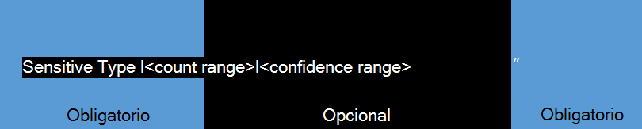

# Crear una consulta para buscar datos confidenciales almacenados en los sitios

Los usuarios suelen almacenar datos confidenciales, como números de tarjeta de crédito, números de seguridad social o personales, en sus sitios, y con el tiempo esto puede exponer a una organización a un riesgo significativo de pérdida de datos. Los documentos almacenados en sitios, incluidos OneDrive para la Empresa web, podrían compartirse con personas de fuera de la organización que no deberían tener acceso a la información. Con prevención de pérdida de datos (DLP) en SharePoint Online, puede detectar documentos que contienen datos confidenciales en todo el espacio empresarial. Después de descubrir los documentos, puede trabajar con los propietarios de documentos para proteger los datos. Este tema puede ayudarle a crear una consulta para buscar datos confidenciales.
  
> [!NOTE]
> La detección electrónica o la exhibición de documentos electrónicos y DLP son características premium que requieren [SharePoint Plan 2 en línea.](https://go.microsoft.com/fwlink/?LinkId=510080) 
  
## Formación de una consulta básica de DLP

Una consulta básica de DLP está formada por tres partes: SensitiveType, intervalo de recuento e intervalo de confianza. Como se muestra en el siguiente gráfico, **Es necesario SensitiveType:" \<type\> "** y ambos y **|\<count range\>** son **|\<confidence range\>** opcionales. 
  

  
### Tipo confidencial: obligatorio

¿Qué es cada parte? SharePoint Las consultas DLP suelen comenzar con la propiedad y un nombre de tipo de información del inventario de tipos de información `SensitiveType:"` confidencial y terminan con un  `"` . También puede usar el nombre de un tipo [de información confidencial personalizado](create-a-custom-sensitive-information-type.md) que creó para su organización. Por ejemplo, tal vez esté buscando documentos que contienen números de tarjetas de crédito. En tal caso, usaría el siguiente formato:  `SensitiveType:"Credit Card Number"` . Dado que no incluye el intervalo de recuento ni el intervalo de confianza, la consulta devuelve todos los documentos en los que se detecta un número de tarjeta de crédito. Esta es la consulta más sencilla que se puede ejecutar y devuelve la mayoría de los resultados. Tenga en cuenta que la ortografía y el espaciado del tipo confidencial son importantes. 
  
### Intervalos: opcionales

Las dos partes siguientes son rangos, por lo que vamos a examinar rápidamente cómo es un rango. En SharePoint de DLP, un intervalo básico se representa mediante dos números separados por dos puntos, que tiene este aspecto: `[number]..[number]` . Por ejemplo, si  `10..20` se usa, ese intervalo capturaría números del 10 al 20. Hay muchas combinaciones de intervalos diferentes y varias de ellas se tratan en este tema. 
  
Vamos a agregar un intervalo de recuento a la consulta. Puede usar el intervalo de recuento para definir el número de repeticiones de información confidencial que debe contener un documento antes de incluirlo en los resultados de la consulta. Por ejemplo, si desea que la consulta devuelva solo documentos que contengan exactamente cinco números de tarjeta de crédito, use esto:  `SensitiveType:"Credit Card Number|5"` . El intervalo de recuento también puede ayudar a identificar los documentos que suponen altos niveles de riesgo. Por ejemplo, su organización puede considerar como un riesgo alto los documentos con cinco o más números de tarjeta de crédito. Para buscar documentos que se ajusten a este criterio, use esta consulta:  `SensitiveType:"Credit Card Number|5.."` . Como alternativa, puede encontrar documentos con cinco o menos números de tarjeta de crédito mediante esta consulta:  `SensitiveType:"Credit Card Number|..5"` . 
  
#### Intervalo de confianza

Por último, el intervalo de confianza es el nivel de confianza con el que el tipo confidencial detectado coincide en realidad. Los valores para el intervalo de confianza funcionan de forma similar al intervalo de recuento. Puede crear una consulta sin incluir un intervalo de recuento. Por ejemplo, para buscar documentos con cualquier número de números de tarjeta de crédito (siempre que el intervalo de confianza sea igual o superior al 85 por ciento), usaría esta consulta:  `SensitiveType:"Credit Card Number|*|85.."` . 
  
> [!IMPORTANT]
> El asterisco ( `*` ) es un carácter comodín que significa que cualquier valor funciona. Puede usar el carácter comodín ( ) en el intervalo de recuento o en el intervalo de confianza, pero `*` no en un tipo confidencial. 
  
### Propiedades de consulta y operadores de búsqueda adicionales disponibles en el centro de exhibición de documentos electrónicos

DLP en SharePoint también presenta la propiedad LastSensitiveContentScan, que puede ayudarle a buscar archivos analizados en un período de tiempo específico. Para obtener ejemplos de consulta con la  `LastSensitiveContentScan` propiedad, vea [los ejemplos de consultas complejas](#examples-of-complex-queries) en la sección siguiente. 
  
No solo puede usar propiedades específicas de DLP para crear una consulta, sino también propiedades SharePoint búsqueda de exhibición de documentos electrónicos como `Author` o `FileExtension` . Puede usar operadores para crear consultas complejas. Para obtener la lista de propiedades y operadores disponibles, vea la entrada de blog [Using Search Properties and Operators with eDiscovery.](/archive/blogs/quentin/using-search-properties-and-operators-with-ediscovery) 
  
## Ejemplos

En los ejemplos siguientes se usan diferentes tipos, propiedades y operadores confidenciales para ilustrar cómo puede refinar las consultas para encontrar exactamente lo que está buscando.
  
|**Query**|**Explicación**|
|:-----|:-----|
| `SensitiveType:"International Banking Account Number (IBAN)"`   |El nombre puede parecer extraño porque es tan largo, pero es el nombre correcto para ese tipo confidencial. Asegúrese de usar nombres exactos del inventario [de tipos de información confidencial](/Exchange/what-the-sensitive-information-types-in-exchange-look-for-exchange-2013-help). También puede usar el nombre de un tipo [de información confidencial personalizado](create-a-custom-sensitive-information-type.md) que creó para su organización.    |
| `SensitiveType:"Credit Card Number|1..4294967295|1..100"`   |Esto devuelve documentos con al menos una coincidencia con el tipo confidencial "Número de tarjeta de crédito". Los valores de cada intervalo son los respectivos valores mínimos y máximos. Una forma más sencilla de escribir esta consulta es  `SensitiveType:"Credit Card Number"` , pero ¿dónde está la diversión en eso?    |
| `SensitiveType:"Credit Card Number| 5..25" AND LastSensitiveContentScan:"8/11/2018..8/13/2018"`   |Esto devuelve documentos con entre 5 y 25 números de tarjeta de crédito que se examinaron del 11 de agosto de 2018 al 13 de agosto de 2018.    |
| `SensitiveType:"Credit Card Number| 5..25" AND LastSensitiveContentScan:"8/11/2018..8/13/2018" NOT FileExtension:XLSX`   |Esto devuelve documentos con entre 5 y 25 números de tarjeta de crédito que se examinaron del 11 de agosto de 2018 al 13 de agosto de 2018. Los archivos con una extensión XLSX no se incluyen en los resultados de la consulta.  `FileExtension` es una de las muchas propiedades que puede incluir en una consulta. Para obtener más información, vea [Using Search Properties and Operators with eDiscovery](/archive/blogs/quentin/using-search-properties-and-operators-with-ediscovery).    |
| `SensitiveType:"Credit Card Number" OR SensitiveType:"U.S. Social Security Number (SSN)"`   |Esto devuelve los documentos que contienen un número de tarjeta de crédito o un número de seguro social.    |
   
## Ejemplos

No todas las consultas son iguales. En la tabla siguiente se proporcionan ejemplos de consultas que no funcionan con DLP en SharePoint y se describe por qué.
  
|**Consulta no compatible**|**Motivo**|
|:-----|:-----|
| `SensitiveType:"Credit Card Number|.."`   |Debe agregar, al menos, un número.    |
| `SensitiveType:"NotARule"`   |"NotARule" no es un nombre de tipo confidencial válido. Solo los nombres en el inventario [de tipos de información](/Exchange/what-the-sensitive-information-types-in-exchange-look-for-exchange-2013-help) confidencial funcionan en consultas DLP.    |
| `SensitiveType:"Credit Card Number|0"`   |Cero no es válido como el valor mínimo o el valor máximo de un intervalo.    |
| `SensitiveType:"Credit Card Number"`   |Puede ser difícil de ver, pero hay un espacio en blanco adicional entre "Crédito" y "Tarjeta" que hace que la consulta no sea válida. Use nombres de tipo confidencial exactos del inventario [de tipos de información confidencial](/Exchange/what-the-sensitive-information-types-in-exchange-look-for-exchange-2013-help).    |
| `SensitiveType:"Credit Card Number|1. .3"`   |La parte de dos períodos no debe estar separada por un espacio.    |
| `SensitiveType:"Credit Card Number| |1..|80.."`   |Hay demasiados delimitadores de canalización (|). Siga este formato en su lugar: `SensitiveType: "Credit Card Number|1..|80.."`   |
| `SensitiveType:"Credit Card Number|1..|80..101"`   |Dado que los valores de confianza representan un porcentaje, no pueden superar los 100. Elija un número del 1 al 100 en su lugar.    |
   
## Más información

- [Definiciones de entidad de tipos de información confidencial](sensitive-information-type-entity-definitions.md)
- [Ejecutar una búsqueda de contenido](content-search.md)
- [Consultas de palabras clave y condiciones de búsqueda para la búsqueda de contenido](keyword-queries-and-search-conditions.md).
