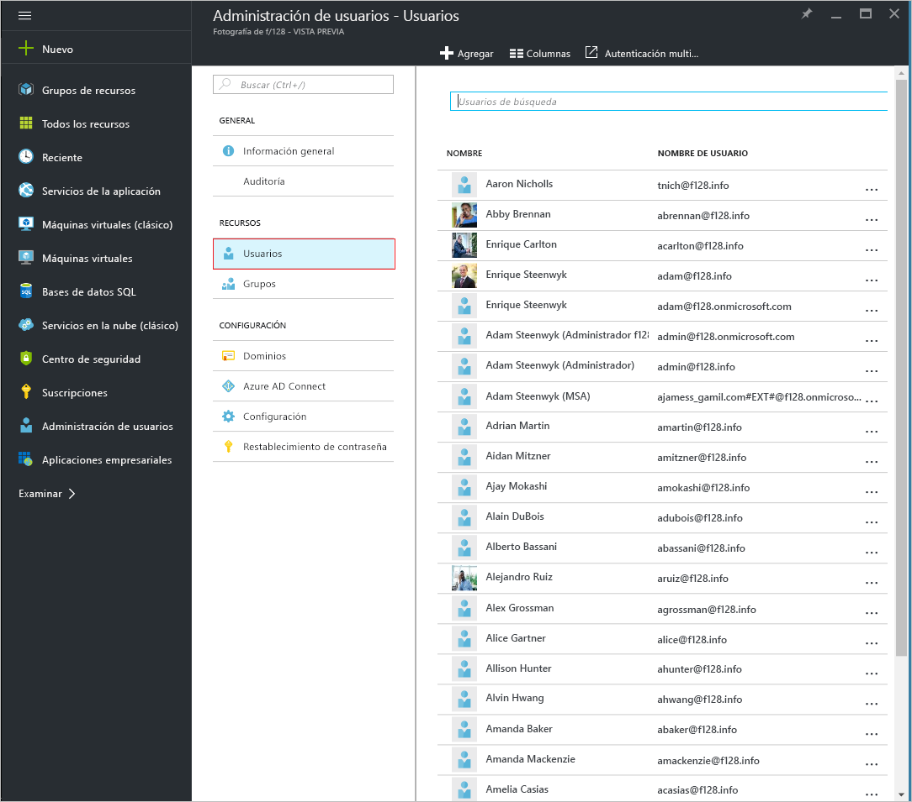
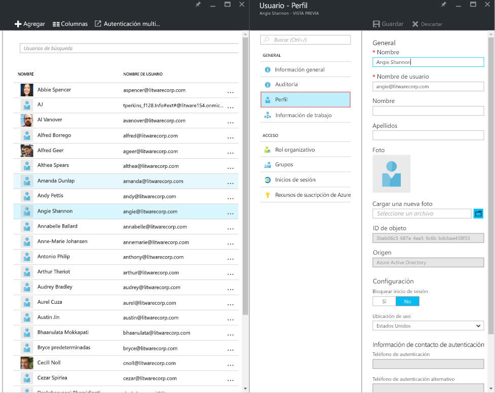
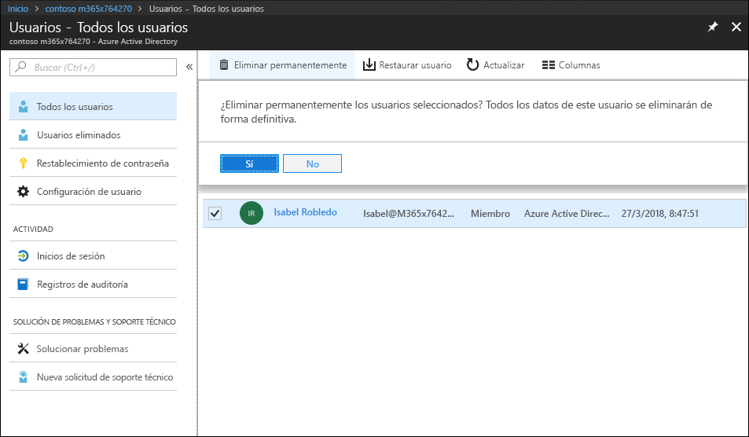
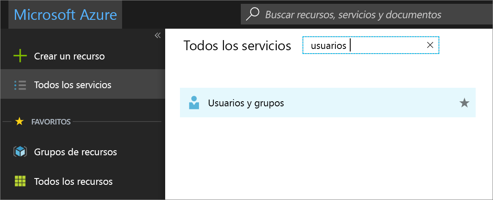
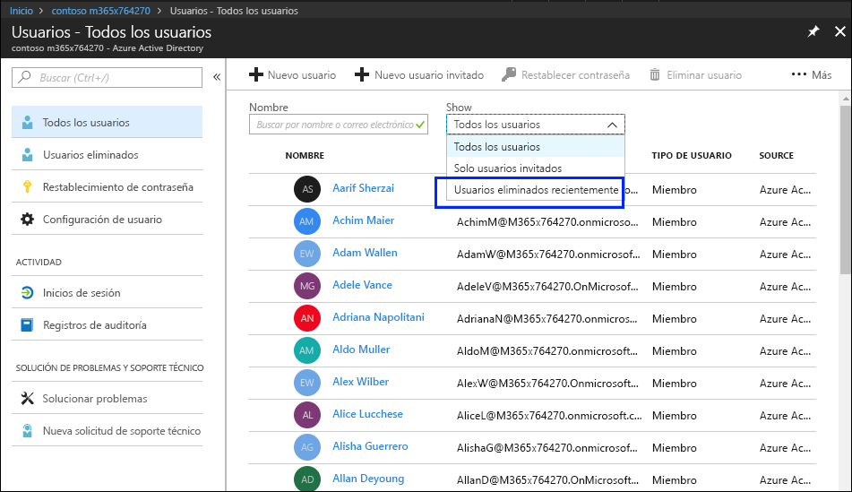
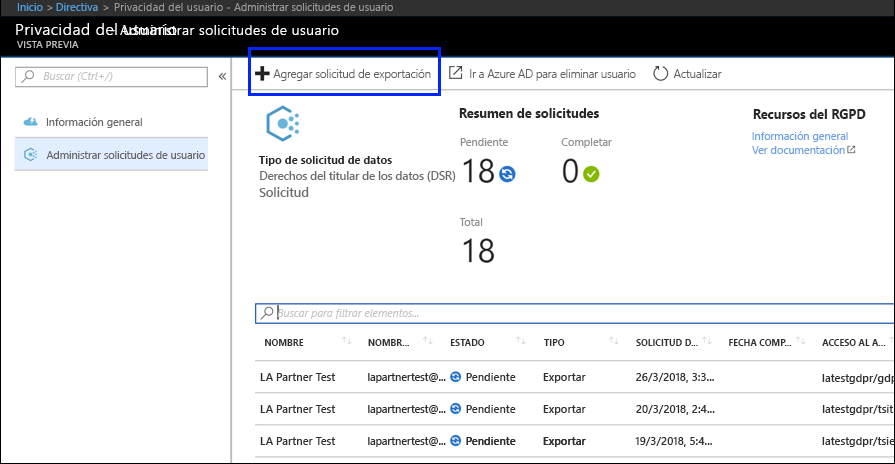
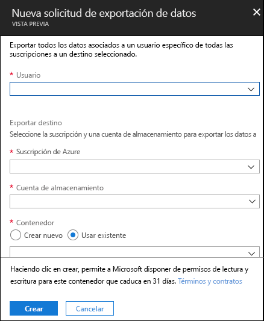

# Solicitudes de interesados de Azure para el RGPDAzure Data Subject Requests for the GDPR

## Introducción a las solicitudes de interesadosIntroduction to Data Subject Requests (DSRs)

El Reglamento de protección de datos de la UE (RGPD) ofrece derechos a las personas (que se denominan *"interesados"* en el reglamento) para administrar los datos personales recopilados por una empresa u otro tipo de agencia u organización (es decir, el *poseedor de los datos* o *"poseedor"*). Los datos personales se definen de forma muy amplia según el RGPD como cualquier dato relacionado con una persona física, ya sea identificada o identificable. El RGPD ofrece a los interesados derechos específicos en sus datos personales, como la obtención de copias de sus datos, la solicitud de correcciones, impedir su procesamiento o eliminación, o el envío en formato electrónico para transferirlos a otro poseedor de los datos. Las solicitudes formales realizadas por un interesado a un poseedor de los datos para realizar una acción en sus datos personales se denominan *solicitudes de interesado*.The EU Data Protection Regulation (GDPR) gives rights to people (known in the regulation as *data subjects*) to manage the personal data that has been collected by an employer or other type of agency or organization (known as the *data controller* or just *controller*). Personal data is defined very broadly under the GDPR as any data that relates to an identified or identifiable natural person. The GDPR gives data subjects specific rights to their personal data; these rights include obtaining copies of personal data, requesting corrections to it, restricting the processing of it, deleting it, or receiving it in an electronic format so it can be moved to another controller. A formal request by a data subject to a controller to take an action on their personal data is called a *Data Subject Request* or DSR.

Esta guía explica cómo usar productos, servicios y herramientas administrativas de Microsoft para ayudar a nuestros clientes poseedores de datos a encontrar y actuar sobre datos personales para responder solicitudes de interesado. En concreto, esto incluye cómo encontrar, acceder y actuar sobre datos personales alojados en la nube de Microsoft. Este es un breve resumen de los procedimientos descritos en esta guía:The guide discusses how to use Microsoft products, services and administrative tools to help our controller customers find and act on personal data to respond to DSRs. Specifically, this includes how to find, access, and act on personal data that reside in the Microsoft cloud. Here’s a quick overview of the processes outlined in this guide:

1.  ***Descubrir***: use herramientas de búsqueda y descubrimiento para encontrar con facilidad datos de clientes que puedan estar sujetos a una solicitud de interesado. Tras recopilar los documentos potenciales, puede realizar una o varias delas acciones de solicitud descritas en los pasos siguientes para responder a la petición. De forma alternativa, puede determinar que la solicitud no cumple las directrices de respuesta a solicitudes de interesado.***Discover***—Use search and discovery tools to more easily find customer data that may be the subject of a DSR. Once potentially responsive documents are collected, you can perform one or more of the DSR actions described in the following steps to respond to the request. Alternatively, you may determine that the request doesn't meet your organization’s guidelines for responding to DSRs.

2.  ***Acceder***: recupere datos personales alojados en la nube de Microsoft y, si se le pide, realice una copia que puede estar a disposición del interesado.***Access***—Retrieve personal data that resides in the Microsoft cloud and, if requested, make a copy of it that can be available to the data subject.

3.  ***Corregir***: realice los cambios o implemente otras acciones solicitadas en los datos personales, si procede.***Rectify***—Make changes or implement other requested actions on the personal data, where applicable.

4.  ***Restringir***: restrinja el procesamiento de datos personales, quitando las licencias de varios servicios de Azure o desactivando los servicios deseados siempre que sea posible. También puede quitar los datos de la nube de Microsoft y conservarlos localmente o en otra ubicación.***Restrict***—Restrict the processing of personal data, either by removing licenses for various Azure services or turning off the desired services where possible. You can also remove data from the Microsoft cloud and retain it on-premises or at another location.

5.  ***Eliminar***: eliminar de forma permanente los datos personales que residen en la nube de Microsoft.***Delete***—Permanently remove personal data that resided in the Microsoft cloud.

6.  ***Exportar***: enviar una copia electrónica (en un formato legible) de datos personales al interesado.***Export***—Provide an electronic copy (in a machine-readable format) of personal data to the data subject.

Cada sección de esta guía describe los procedimientos técnicos que puede realizar una organización poseedora de datos para responder a una solicitud de interesado de datos personales en la nube de Microsoft.Each section in this guide outlines the technical procedures that a data controller organization can take to respond to a DSR for personal data in the Microsoft cloud.

### TerminologíaTerminology

A continuación se ofrecen definiciones de términos relacionados con esta guía.The following provides definitions of terms that are relevant to this guide.

-   *Poseedor*: la persona física o legal, autoridad pública, agencia u organismo que solo o junto a otras personas, determina los fines y medios del procesamiento de datos personales; donde los fines y los medios de dicho procesamiento están determinados por la ley de la unión o de un estado miembro, el poseedor o los criterios específicos para su nominación pueden estar proporcionados por la ley de un estado miembro o de la unión.*Controller*—The natural or legal person, public authority, agency or other body which, alone or jointly with others, determines the purposes and means of the processing of personal data; where the purposes and means of such processing are determined by Union or Member State law, the controller or the specific criteria for its nomination may be provided for by Union or Member State law.

-   *Datos personales* e *interesado*: cualquier información sobre una persona física identificada o identificable (“interesado”); una persona identificable natural es una que puede identificarse, directa o indirectamente, especialmente con referencia a un identificador, con un nombre, un número de identificación, datos de ubicación, un identificador en línea o uno o más elementos específicos físicos, fisiológicos, genéticos, mentales, económicos, culturales o de identidad social de esa persona natural;*Personal data* and *data subject*—Any information relating to an identified or identifiable natural person (‘data subject’); an identifiable natural person is one who can be identified, directly or indirectly, in particular by reference to an identifier such as a name, an identification number, location data, an online identifier or to one or more factors specific to the physical, physiological, genetic, mental, economic, cultural or social identity of that natural person.

-   *Procesador*: persona física o legal, autoridad pública, agencia u otro organismo que trata datos personales en nombre del poseedor.*Processor*—A natural or legal person, public authority, agency or other body which processes personal data on behalf of the controller.

-   *Los datos de clientes*: todos los datos, incluyendo archivos de texto, sonido, vídeos o imagen y software proporcionados a Microsoft por, o en nombre de, un cliente a través del uso del servicio empresarial. Los datos de clientes incluyen tanto (1) información de identificación personal de los usuarios finales (por ejemplo, nombres de usuario e información de contacto en Azure Active Directory) y contenido del cliente cargado o creado por clientes en servicios específicos (por ejemplo, el contenido del cliente en una cuenta de Azure Storage, contenido del cliente de Azure SQL Database, o la imagen de la máquina virtual de un cliente en Azure Virtual Machines).*Customer Data*—All data, including all text, sound, video, or image files, and software, that are provided to Microsoft by, or on behalf of, a customer through use of the enterprise service. Customer Data includes both (1) identifiable information of end users (e.g., user names and contact information in Azure Active Directory) and Customer Content that a customer uploads into or creates in specific services (e.g., customer content in an Azure Storage account, customer content of an Azure SQL Database, or a customer’s virtual machine image in Azure Virtual Machines).

-   *Registros generados por el sistema*: registros y datos relacionados generados por Microsoft que ayudan a Microsoft a proporcionar servicios empresariales a los usuarios. Los registros generados por el sistema contienen principalmente datos pseudonimizados, como identificadores únicos (por lo general, un número generado por el sistema que se usa para ofrecer los servicios a los usuarios, pero no puede identificar a un individuo). Los registros generados por el sistema también pueden contener información que identifique a los usuarios finales, como un nombre de usuario.*System-Generated Logs*—Logs and related data generated by Microsoft that help Microsoft provide enterprise services to users. System-generated logs contain primarily pseudonymized data, such as unique identifiers – typically a number generated by the system that cannot on its own identify an individual person but is used to deliver the enterprise services to users. System-generated logs may also contain identifiable information about end users, such as a user name.

### Cómo utilizar esta guíaHow to use this guide

Esta guía consta de dos partes:This guide consists of two parts:

**Parte 1: Responder a solicitudes de interesados de clientes**: la primera parte de esta guía describe cómo acceder, corregir, restringir, eliminar y exportar datos desde las aplicaciones en las que se han creado. Esta sección detalla cómo ejecutar la solicitud de interesado con el contenido de cliente y también con la información identificable de los usuarios finales.**Part 1: Responding to Data Subject Requests for Customer Data** — Part 1 of this guide discusses how to access, rectify, restrict, delete, and export data from applications in which you have authored data. This section details how to execute DSRs against both Customer Content and also identifiable information of end users.

**Parte 2: Responder a solicitudes de interesados para registros generados por el sistema**: al usar los servicios de empresa de Microsoft, Microsoft genera información conocida como registros generados por el sistema para proporcionar el servicio. La parte 2 de esta guía explica cómo acceder, eliminar y exportar esta información para Azure.**Part 2: Responding to Data Subject Requests for System-Generated Logs** — When you use Microsoft’s enterprise services, Microsoft generates some information, known as System-Generated Logs, in order to provide the service. Part 2 of this guide discusses how to access, delete and export such information for Azure.

### Comprender las solicitudes de interesados para Azure Active Directory y cuentas de servicio de MicrosoftUnderstanding DSRs for Azure Active Directory and Microsoft Service Accounts

Al plantear servicios proporcionados a clientes empresariales, siempre debe entenderse la ejecución de solicitudes de interesados en el contexto de un inquilino específico de Azure Active Directory (AAD). En concreto, este siempre se ejecuta en un inquilino AAD determinado. Si un usuario forma parte de varios inquilinos, es importante destacar que una solicitud de interesado *solo* se ejecuta en el contexto del inquilino específico que ha recibido la solicitud. Esto es importante para comprender que la ejecución de una solicitud de interesado por parte de un cliente empresarial **no** afecta a los datos de otro cliente empresarial adyacente.When considering services provided to enterprise customers, execution of DSRs must always be understood within the context of a specific Azure Active Directory (AAD) tenant. Notably, DSRs are always executed within a given AAD tenant. If a user is participating in multiple tenants, it is important to emphasize that a given DSR is *only* executed within the context of the specific tenant the request was received within. This is critical to understand as it means the execution of a DSR by one enterprise customer **will not** impact the data of an adjacent enterprise customer.

Lo mismo se aplica a las cuentas de servicio de Microsoft (MSA) en el contexto de los servicios proporcionados por un cliente empresarial: la ejecución de una solicitud de interesado de una cuenta MSA *asociada a un cliente AAD* **solo** estará relacionada con los datos del cliente. Además, es importante comprender lo siguiente al gestionar cuentas MSA en un cliente:The same also applies for Microsoft Service Accounts (MSA) within the context of services provided to an enterprise customer: execution of a DSR against an MSA account *associated with an AAD tenant* **will only** pertain to data within the tenant. In addition, it is important to understand the following when handling MSA accounts within a tenant:

-   Si un usuario MSA crea una suscripción de Azure, la suscripción se tratará como si fuera un inquilino AAD. Por lo tanto, las solicitudes de interesado se rastrean en el interior del cliente tal y como se ha descrito anteriormente.If an MSA user creates an Azure subscription, the subscription will be handled as if it were an AAD tenant. Consequently, DSRs are scoped within the tenant as described above.

-   Si se elimina una suscripción de Azure creada con una cuenta MSA, esta última **no se verá afectada**.Como se indicó anteriormente, las solicitudes de interesado que se ejecutan en la suscripción de Azure se limitan al ámbito del mismo inquilino.If an Azure subscription created via an MSA account is deleted, **it will not affect** the actual MSA account. Again, as noted above, DSRs executing within the Azure subscription are limited to the scope of the tenant itself.

Las solicitudes de interesados en una cuenta de MSA, **fuera de un determinado inquilino**, se ejecutan mediante el panel de privacidad del consumidor. Consulte la Guía de solicitud de datos de Windows para obtener más información.DSRs against an MSA account itself, **outside a given tenant**, are executed via the Consumer Privacy Dashboard. Please refer to the Windows Data Subject Request Guide for further details.

## Parte 1: Guía de solicitud de interesado para datos de clientePart 1: DSR Guide for Customer Data

## Ejecutar solicitudes de interesado en datos de clienteExecuting DSRs against Customer Data

Microsoft proporciona la capacidad de acceder, eliminar y exportar determinados datos de cliente a través del Azure Portal y también directamente a través de interfaces de programación de aplicaciones (API) o interfaces de usuario (UI) ya existentes para servicios específicos (también denominados *experiencias de producto*). Los detalles al respecto de dichas experiencias de producto se describen en la documentación de referencia de sus respectivos servicios.Microsoft provides the ability to access, delete, and export certain Customer Data through the Azure Portal and also directly via pre-existing application programming interfaces (APIs) or user interfaces (UIs) for specific services (also referred to as *in-product experiences*). Details regarding such in-product experiences are described in the respective services’ reference documentation.

>[Importante][Important]  
> Los servicios compatibles con solicitudes de interesado en el producto requieren el uso directo de una interfaz de programación de aplicaciones (API) o de una interfaz de usuario (UI) del servicio, que describa las operaciones CRUD (crear, leer, actualizar y eliminar) aplicables. Por lo tanto, la ejecución de la solicitud de interesado en un servicio específico debe realizarse además con la ejecución de una solicitud de interesado en Azure Portal para completar toda la solicitud de un interesado. Consulte la documentación de referencia de los servicios específicos para obtener más detalles.Services supporting in-product DSRs require direct usage of the service’s application programming interface (API) or user interface (UI), describing applicable CRUD (create, read, update, delete) operations. Consequently, execution of DSRs within a given service must be done in addition to execution of a DSR within the Azure Portal in order to complete a full request for a given data subject. Please refer to specific services’ reference documentation for further details.

## Paso 1: DescubrimientoStep 1: Discover

El primer paso para responder a una solicitud de interesado consiste en encontrar los datos personales que se solicitan. Este primer paso, encontrar y revisar los datos personales, le ayudará a determinar si una solicitud de interesado cumple los requisitos de su organización para respetarla o rechazarla. Por ejemplo, después de encontrar y revisar los datos personales, puede determinar que la solicitud no cumple los requisitos de su organización porque al llevarse a cabo puede afectar negativamente los derechos y libertades de terceros.The first step in responding to a DSR is to find the personal data that is the subject of the request. This first step - finding and reviewing the personal data at issue - will help you determine whether a DSR meets your organization's requirements for honoring or declining a DSR. For example, after finding and reviewing the personal data at issue, you may determine the request doesn’t meet your organization’s requirements because doing so may adversely affect the rights and freedoms of others.

Tras encontrar los datos, puede realizar la acción específica para satisfacer la solicitud interesado.After you find the data, you can then perform the specific action to satisfy the request by the data subject.

### Azure Active DirectoryAzure Active Directory

[Azure Active Directory](https://azure.microsoft.com/services/active-directory/) el servicio de administración de identidad y directorio multiinquilino basado en la nube de Microsoft. Puede encontrar información de identificación personal de los usuarios finales, como perfiles de usuario de clientes y empleados e información de trabajo de usuarios que contenga datos personales en su entorno [Azure Active Directory](https://azure.microsoft.com/services/active-directory/) (AAD) usando el [Azure Portal](https://portal.azure.com/).[Azure Active Directory](https://azure.microsoft.com/services/active-directory/) is Microsoft’s cloud-based, multi-tenant directory and identity management service. You can locate identifiable information of end users, such as customer and employee user profiles and user work information that contain personal data in your [Azure Active Directory](https://azure.microsoft.com/services/active-directory/) (AAD) environment by using the [Azure portal](https://portal.azure.com/).

Esto es útil si desea buscar o cambiar datos personales de un usuario específico. También puede agregar o cambiar perfiles de usuario e información de trabajo. Debe iniciar sesión con una cuenta de administrador global para el directorio.This is particularly helpful if you want to find or change personal data for a specific user. You can also add or change user profile and work information. You must sign in with an account that’s a global admin for the directory.

#### ¿Cómo buscar o ver perfiles de usuario e información de trabajo?How do I locate or view user profile and work information?

1. Inicie sesión en [Azure Portal](https://portal.azure.com/) con una cuenta de administrador global para el directorio.Sign in to the [Azure portal](https://portal.azure.com/) with an account that's a global admin for the directory.

1. Seleccione **Todos los servicios**, escriba **Usuarios y grupos** en el cuadro de texto y, después, seleccione **Entrar**.Select **All services**, enter **Users and groups** in the text box, and then select **Enter**.

     

3. En la hoja **Usuarios y grupos**, seleccione **Usuarios**.On the **Users and groups** blade, select **Users**.

     

4.  En la hoja **Usuarios y grupos: Usuarios**, seleccione un usuario de la lista y, a continuación, en el módulo para el usuario seleccionado, seleccione **Perfil** para ver la información de perfil de usuario que puede contener datos personales.On the **Users and groups - Users** blade, select a user from the list, and then, on the blade for the selected user, select **Profile** to view user profile information that might contain personal data.

    

5. Si necesita agregar o cambiar la información de perfil de usuario, puede hacerlo y, a continuación, en la barra de comandos, seleccione **Guardar.**If you need to add or change user profile information, you can do so, and then, in the command bar, select **Save.**

<!-- steps 6 and 7 not in original 
6. On the blade for the selected user, select **Work Info** to view user work information that may contain personal data.

     

7. If you need to add or change user work information, you can do so, and then, in the command bar, select **Save.**

end of text to isolate -->

### Interfaces específicas del servicioService-Specific Interfaces

Microsoft proporciona la capacidad de descubrir datos de clientes directamente a través de interfaces de programación de aplicaciones (API) o interfaces de usuario (UI) ya existentes para servicios específicos. Los detalles se describen en la documentación de referencia de los respectivos servicios, que describen las operaciones CRUD (creación, lectura, actualización y eliminación) aplicables.Microsoft provides the ability to discover Customer Data directly via pre-existing application programming interfaces (APIs) or user interfaces (UIs) for specific services. Details are described in the respective services’ reference documentation, describing applicable CRUD (create, read, update, delete) operations.

## Paso 2: AccesoStep 2: Access

Cuando haya encontrado los datos de clientes que contengan datos personales que puedan responder a una solicitud de interesado, depende de usted y de su organización decidir qué datos proporcionar al interesado. Puede proporcionarle una copia del documento, una versión redactada o una captura de pantalla con las porciones que considere adecuado compartir. Para cada una de estas respuestas a una petición de acceso, deberá recuperar una copia del documento u otro objeto que contenga los datos de respuesta.After you’ve found Customer Data containing personal data that is potentially responsive to a DSR, it is up to you and your organization to decide which data to provide to the data subject. You can provide them with a copy of the actual document, an appropriately redacted version, or a screenshot of the portions you have deemed appropriate to share. For each of these responses to an access request, you will have to retrieve a copy of the document or other item that contains the responsive data.

Al proporcionar una copia al interesado, deberá quitar o censurar información personal sobre otros interesados, además de la información confidencial.When providing a copy to the data subject, you may have to remove or redact personal information about other data subjects and any confidential information.

A continuación se explica cómo obtener una copia de los datos en respuesta a una solicitud de acceso a los datos del interesado.The following explains how to get a copy of data in response to a DSR access request.

### Azure Active DirectoryAzure Active Directory

Microsoft ofrece un portal y experiencias de producto que proporcionan al administrador inquilino del cliente empresarial la capacidad de gestionar peticiones de acceso de interesado. Las peticiones de acceso de interesado permiten acceder a los datos personales del usuario, incluyendo (a) información de identificación sobre un usuario final y (b) registros generados por el sistema.Microsoft offers both a portal and in-product experiences providing the enterprise customer’s tenant administrator the capability to manage DSR access requests. DSR Access requests allow for access of the personal data of the user, including: (a) identifiable information about an end-user and (b) system-generated logs.

### Interfaces específicas del servicioService-Specific Interfaces

Microsoft proporciona la capacidad de descubrir datos de clientes directamente a través de interfaces de programación de aplicaciones (API) o interfaces de usuario (UI) ya existentes para servicios específicos. Los detalles se describen en la documentación de referencia de los respectivos servicios, que describen las operaciones CRUD (creación, lectura, actualización y eliminación) aplicables.Microsoft provides the ability to discover Customer Data directly via pre-existing application programming interfaces (APIs) or user interfaces (UIs) for specific services. Details are described in the respective services’ reference documentation, describing applicable CRUD (create, read, update, delete) operations.

## Paso 3: CorregirStep 3: Rectify

Si un interesado le ha solicitado rectificar los datos personales que se encuentran en los datos de su organización, su organización y usted deberán determinar si es adecuado acceder a dicha petición. Rectificar los datos puede requerir llevar a cabo acciones como editar, censurar o eliminar datos personales de un documento u otro tipo de elemento. La forma más expeditiva de hacerlo para el Soporte técnico de Microsoft y FastTrack es la proporcionada a continuación.If a data subject has asked you to rectify the personal data that resides in your organization’s data, you and your organization will have to determine whether it’s appropriate to honor the request. Rectifying the data may include taking actions such as editing, redacting, or removing personal data from a document or other type or item. The most expedient way to do this for Microsoft Support and FastTrack data is provided below.

### Azure Active DirectoryAzure Active Directory

Los clientes empresariales tienen la capacidad de administrar solicitudes de interesado de rectificación, incluidas características de edición limitadas por la naturaleza de un servicio específico de Microsoft. Como procesador datos, Microsoft no ofrece la posibilidad de corregir los registros generados por el sistema, pues reflejan actividades y constituyen el historial de los eventos de los servicios de Microsoft. Con respecto a Azure Active Directory, existen características de edición limitadas para corregir la información de identificación personal sobre el usuario, tal y como se describe más adelante.Enterprise customers have the ability to manage DSR rectify requests, including limited editing features per the nature of a given Microsoft service. As a data processor, Microsoft does not offer the ability to correct system-generated logs as it reflects factual activities and constitutes a historical record of events within Microsoft services. With respect to Azure Active Directory, limited editing features exist to rectify identifiable information about an end-user, as described further below.

#### Azure Active Directory: solucionar y corregir datos personales inexactos o incompletosAzure Active Directory: rectify/correct inaccurate or incomplete personal data

Puede corregir, actualizar o eliminar información de identificación personal sobre los usuarios finales, como clientes y los perfiles de usuario de empleado e información de trabajo que contiene datos personales, como nombre de usuario, puesto de trabajo, dirección o número de teléfono, en el entorno [Azure Active Directory](https://azure.microsoft.com/services/active-directory/) (AAD) usando [Azure Portal](https://portal.azure.com/). Debe iniciar sesión con una cuenta de administrador global para el directorio.You can correct, update, or delete identifiable information about end users, such as customer and employee user profiles and user work information that contain personal data, such as a user’s name, work title, address, or phone number, in your [Azure Active Directory](https://azure.microsoft.com/services/active-directory/) (AAD) environment by using the [Azure portal](https://portal.azure.com/). You must sign in with an account that’s a global admin for the directory.

##### ¿Cómo corregir o actualizar el perfil de usuario y la información de trabajo en Azure Active Directory?How do I correct or update user profile and work information in Azure Active Directory?

1.  Inicie sesión en [Azure Portal](https://portal.azure.com/) con una cuenta de administrador global para el directorio.Sign in to the [Azure portal](https://portal.azure.com/) with an account that's a global admin for the directory.

2.  Seleccione **Todos los servicios**, escriba **Usuarios y grupos** en el cuadro de texto y, después, seleccione **Entrar**.Select **All services**, enter **Users and groups** in the text box, and then select **Enter**.

    

3.  En la hoja **Usuarios y grupos**, seleccione **Usuarios**.On the **Users and groups** blade, select **Users**.
         
    

4.  En la hoja **Usuarios y grupos: Usuarios**, seleccione un usuario de la lista y, a continuación, en el módulo para el usuario seleccionado, seleccione **Perfil** para ver la información que debe corregirse o actualizarse.On the **Users and groups - Users** blade, select a user from the list, and then, on the blade for the selected user, select **Profile** to view the user profile information that needs to be corrected or updated.

    

5.  Corrija o actualice la información y, a continuación, en la barra de comandos, seleccione **Guardar.**Correct or update the information, and then, in the command bar, select **Save.**

6.  En la hoja del usuario seleccionado, elija **Información de trabajo** para ver la información de trabajo del usuario que requiera corregirse o actualizarse.On the blade for the selected user, select **Work Info** to view user work information that needs to be corrected or updated.

    

7.  Corrija o actualice la información de trabajo del usuario y, a continuación, en la barra de comandos, seleccione **Guardar.**Correct or update the user work information, and then, in the command bar, select **Save.**

### Interfaces específicas del servicioService-Specific Interfaces

Microsoft proporciona la capacidad de descubrir datos de clientes directamente a través de interfaces de programación de aplicaciones (API) o interfaces de usuario (UI) ya existentes para servicios específicos. Los detalles se describen en la documentación de referencia de los respectivos servicios, que describen las operaciones CRUD (creación, lectura, actualización y eliminación) aplicables.Microsoft provides the ability to discover Customer Data directly via pre-existing application programming interfaces (APIs) or user interfaces (UIs) for specific services. Details are described in the respective services’ reference documentation, describing applicable CRUD (create, read, update, delete) operations.

## Paso 4: RestringirStep 4: Restrict

Los interesados pueden solicitar restringir el procesamiento de los datos personales. Proporcionamos tanto Azure Portal como interfaces de programación de aplicaciones (API) o interfaces de usuario (UI) ya existentes. Estas experiencias proporcionan al administrador del cliente empresarial la capacidad de administrar solicitudes de interesado a través de una combinación de exportación y eliminación de datos. Un cliente puede (1) exportar una copia electrónica de los datos personales del usuario, incluyendo (a) cuentas, (b) registros generados por el sistema y (c) registros asociados, seguido de (2) la eliminación de la cuenta y datos asociados que residen en los sistemas de Microsoft.Data subjects may request that you restrict processing of their personal data. We provide both the Azure Portal and pre-existing application programming interfaces (APIs) or user interfaces (UIs). These experiences provide the enterprise customer’s tenant administrator the capability to manage such DSRs through a combination of data export and data deletion. A customer may (1) export an electronic copy of the personal data of the user, including (a) account(s), (b) system-generated logs, and (c) associated logs, followed with (2) deletion of the account and associated data residing within Microsoft systems.

## Paso 5: EliminarStep 5: Delete

El "derecho a la supresión" mediante la eliminación de datos personales de los datos de clientes de una organización es una protección de clave en la RGPD. Quitar datos personales incluye quitar todos los datos personales y registros generado por el sistema, excepto la información de registro de auditoría. Cuando un usuario sufre una **eliminación temporal** (vea los detalles a continuación), la cuenta queda deshabilitada durante 30 días. Si no se realizará ninguna acción durante este período de 30 días, el usuario se **elimina de forma permanente** (de nuevo, vea los detalles a continuación). Tras una **eliminación permanente**, la cuenta del usuario, sus datos personales y los registros generado por el sistema se depuran en 30 días adicionales. Si un administrador de inquilinos emite inmediatamente una **eliminación permanente**, se eliminan la cuenta del usuario, los datos personales y los registros generados por el sistema a los 30 días de emisión.The “right to erasure” by the removal of personal data from an organization’s Customer Data is a key protection in the GDPR. Removing personal data includes removing all personal data and system-generated logs, except audit log information. When a user is **soft deleted** (see details below), the account is disabled for 30 days. If no further action is taken during this 30 day period, the user is **permanently deleted** (again, see details below). Upon a **permanent delete**, the user’s account, personal data, and system-generated logs are expunged within an additional 30 days. If a tenant admin immediately issues a **permanent delete**, the user’s account, personal data, and system-generated logs are expunged within 30 days of issuance.

>[Importante] Debe ser un administrador de inquilinos para eliminar un usuario del inquilino.[Important] You must be a tenant administrator to delete a user from the tenant.

### Eliminar un usuario y los datos asociados a través de Azure PortalDelete a user and associated data through the Azure portal

Después de recibir una solicitud de eliminación por parte de un interesado, puede usar Azure Portal para eliminar tanto un usuario como la información personal asociada, además de los registros generados por el sistema.After you receive a delete request for a data subject, you can use the Azure portal to delete both a user and the associated personal information as well as system-generated logs.

Eliminar datos también supone la eliminación del usuario del inquilino. Los usuarios sufren una eliminación temporal inicial, lo que significa que un administrador de inquilinos puede recuperar la cuenta en los 30 días siguientes a la eliminación temporal. Después de 30 días, se elimina la cuenta automáticamente y de forma permanente del inquilino. Antes de que transcurran dichos 30 días, puede eliminar manualmente de la Papelera de reciclaje un usuario eliminado temporalmente.Deleting this data also means deleting the user from the tenant. Users are initially soft-deleted, which means the account can be recovered by a tenant admin within 30 days of being marked for soft-delete. After 30 days, the account is automatically, and permanently, deleted from the tenant. Prior to that 30 days, you can manually delete a soft-deleted user from the recycle bin.

Este es el proceso de alto nivel para eliminar usuarios de su inquilino.Here’s the high-level process for deleting users from your tenant.

1.  Vaya a Azure Portal y encuentre el usuario.Go to the Azure portal and locate the user.

2.  Eliminar el usuario. Al eliminar el usuario al principio, la cuenta del usuario se envía a la Papelera de reciclaje. **En este momento, el usuario se encuentra eliminado temporalmente, lo que significa que se deshabilita la cuenta, pero no se elimina de Azure Active Directory.**Delete the user. When you initially delete the user, the user’s account is sent to the Recycle Bin. **At this point, the user is soft deleted, meaning the account is disabled, but not expunged from Azure Active Directory.**

3.  Vaya a la lista de usuarios eliminados recientemente y elimine al usuario de forma permanente. **En este momento el usuario se elimina permanentemente, lo que significa que la cuenta se ha depuración de Azure Active Directory**Go to the Recently deleted users list and permanently delete the user. **At this point the user is permanently deleted (also known as hard deleted), meaning the account has been expunged from Azure Active Directory**

##### Para eliminar un usuario de un inquilino de AzureTo delete a user from an Azure tenant

1.  Abra Azure Portal, seleccione la hoja **Azure Active Directory** y seleccione **Usuarios**.Open the Azure portal, select the **Azure Active Directory** blade, and then select **Users**.

    Aparece la hoja **Usuario, Todos los usuarios**.The **Users – All users** blade appears.

    

2.  Active la casilla situada junto al usuario que desea eliminar, seleccione **Eliminar usuario** y después seleccione **Sí** en el cuadro que le pregunta si desea eliminar el usuario.Check the box next to the user you want to delete, select **Delete user**, and then select **Yes** in the box asking if you want to delete the user.

    

3.  En el cuadro **Mostrar** de lista desplegable, seleccione **Usuarios eliminados recientemente**.In the **Show** drop-down box, select **Recently deleted users**.

    

4.  Seleccione de nuevo el nombre de usuario, seleccione **Eliminar permanentemente** y, después, seleccione **Sí** en el cuadro que le pregunta si está seguro.Select the same user again, select **Delete permanently**, and then select **Yes** in the box asking if you’re sure.

>[Importante][Important]  
>Tenga en cuenta que al hacer clic en **Sí** eliminará el usuario y todos los datos y registros generados por el sistema asociados de forma permanente e irrevocable. Si hace esto por error, tendrá que volver a agregar al usuario al cliente de forma manual. Los datos asociados y los registros generados por el sistema no se pueden recuperar.Be aware that by clicking **Yes** you are permanently, and irrevocably, deleting the user and all associated data and system-generated logs. If you do this by mistake, you’ll have to manually add the user back to the tenant. The associated data and system-generated logs are non-recoverable.

   

### Interfaces específicas del servicioService-Specific Interfaces

Microsoft proporciona la capacidad de descubrir datos de clientes directamente a través de interfaces de programación de aplicaciones (API) o interfaces de usuario (UI) ya existentes para servicios específicos. Los detalles se describen en la documentación de referencia de los respectivos servicios, que describen las operaciones CRUD (creación, lectura, actualización y eliminación) aplicables.Microsoft provides the ability to discover Customer Data directly via pre-existing application programming interfaces (APIs) or user interfaces (UIs) for specific services. Details are described in the respective services’ reference documentation, describing applicable CRUD (create, read, update, delete) operations.

## Paso 6: ExportarStep 6: Export

El "derecho de portabilidad de datos" permite a un interesado solicitar una copia de sus datos personales en formato electrónico (es decir, un "formato estructurado, de uso común, compatible con dispositivos electrónicos e interoperable") que pueda transmitirse a otro poseedor de datos. Azure soporta esto al permitir que su organización exporte los datos en formato nativo JSON a su contenedor de almacenamiento de Azure especificado.The “right of data portability” allows a data subject to request a copy of their personal data in an electronic format (that’s a “structured, commonly used, machine read-able and interoperable format”) that may be transmitted to another data controller. Azure supports this by enabling your organization to export the data in the native JSON format, to your specified Azure Storage Container.

>[Importante] Necesita ser un administrador de espacios empresariales para exportar datos de usuario del espacio empresarial.[Important] You must be a tenant administrator to export user data from the tenant.

### Azure Active DirectoryAzure Active Directory

Con respecto a los datos de clientes, Microsoft ofrece un portal y las experiencias del producto para proporcionar al administrador de inquilinos del cliente empresarial la capacidad de exportar solicitudes de información identificable sobre un usuario final.With respect to Customer Data, Microsoft offers both a portal and in-product experiences providing the enterprise customer’s tenant administrator the capability to manage export requests for identifiable information about an end-user.

### Interfaces específicas del servicioService-Specific Interfaces

Microsoft proporciona la capacidad de descubrir datos de clientes directamente a través de interfaces de programación de aplicaciones (API) o interfaces de usuario (UI) ya existentes para servicios específicos. Los detalles se describen en la documentación de referencia de los respectivos servicios, que describen las operaciones CRUD (creación, lectura, actualización y eliminación) aplicables.Microsoft provides the ability to discover Customer Data directly via pre-existing application programming interfaces (APIs) or user interfaces (UIs) for specific services. Details are described in the respective services’ reference documentation, describing applicable CRUD (create, read, update, delete) operations.

## Parte 2: Registros generados por el sistemaPart 2: System-Generated Logs

Microsoft también le proporciona la capacidad de acceso, eliminación y exportación de determinados registros generados por el sistema asociados con el uso de un usuario de Azure.Microsoft also provides you with the ability to access, delete and export certain system-generated logs associated with a user’s use of Azure.

>[!Important]
> No se admite la capacidad para restringir o corregir registros generados por el sistema. Los registros generados por el sistema constituyen acciones realizadas en la nube de Microsoft y datos de diagnóstico y modificar este tipo de datos comprometería los registros históricos de acciones, lo que aumentaría el fraude y los riesgos a la seguridad.The ability to restrict or rectify system-generated logs is not supported. System-generated logs constitute factual actions conducted within the Microsoft cloud and diagnostic data, and modifications to such data would compromise the historical record of actions, increasing fraud and security risks.

## Ejecutar solicitudes de interesado en registros generados por el sistema.Executing DSRs against System-Generated Logs

Microsoft proporciona la capacidad de acceso, eliminación y exportación de determinados registros generados por el sistema a través de Azure Portal y también directamente a través de interfaces de programación o interfaces de usuario para obtener servicios específicos. Los detalles se describen en la documentación de referencia de los servicios correspondientes.Microsoft provides the ability to access, delete, and export certain system-generated logs through the Azure Portal and also directly via programmatic interfaces or user interfaces for specific services. Details are described in the respective services’ reference documentation.

>[!Important]  
> Los servicios compatibles con solicitudes de interesado en el producto requieren el uso directo de una interfaz de programación de aplicaciones (API) o de una interfaz de usuario (UI). Por lo tanto, la ejecución de la solicitud de interesado en un producto **debe realizarse además con la ejecución de una solicitud de interesado en Azure Portal para completar toda la solicitud de un interesado. Consulte la documentación de referencia de los servicios específicos para obtener más detalles.**Services supporting in-product DSRs require direct usage of the service’s application programming interface (API) or user interface (UI). Consequently, execution of an in-product DSRs **must be done in addition to execution of a DSR within the Azure Portal in order to complete a full request for a given data subject. Please refer to specific services’ reference documentation for further details.**

## Paso 1: AccesoStep 1: Access 

El administrador de inquilinos es la única persona de su organización con acceso a los registros generados por el sistema asociados con el uso de un usuario determinado de Azure. Los datos que se recuperan de una solicitud de acceso se ofrecen en un formato legible y se incluirán en los archivos que permiten al usuario saber qué servicios están asociados a los datos. Como se indicó anteriormente, los datos recuperados no incluirán datos que pueden poner en peligro la seguridad del servicio.The tenant admin is the only person within your organization who can access system-generated logs associated with a particular user’s use of Azure. The data retrieved for an access request will be provided in a machine-readable format and will be provided in files that will allow the user to know which services the data is associated with. As noted above, the data retrieved will not include data that may compromise the security of the service.

### Azure Active DirectoryAzure Active Directory

Microsoft ofrece un portal y experiencias de producto que proporcionan al administrador inquilino del cliente empresarial la capacidad de gestionar peticiones de acceso de interesado. Las peticiones de acceso de interesado permiten acceder a los datos personales del usuario, incluyendo (a) información de identificación sobre un usuario final y (b) registros generados por el servicio. El proceso es idéntico al descrito en la sección de Azure Active Directory de la Parte 1, Paso 2: Acceso.Microsoft offers both a portal and in-product experiences providing the enterprise customer’s tenant administrator the capability to manage access requests. Access requests will allow for access of the personal data of the user, including: (a) identifiable information about an end-user and (b) service-generated logs. The process is identical to that described in the Azure Active Directory section of Part 1, Step 2: Access.

### Interfaces específicas del servicioService-Specific Interfaces

Microsoft proporciona la capacidad de descubrir datos de clientes directamente a través de interfaces de programación de aplicaciones (API) o interfaces de usuario (UI) ya existentes para servicios específicos. Los detalles se describen en la documentación de referencia de los respectivos servicios, que describen las operaciones CRUD (creación, lectura, actualización y eliminación) aplicables.Microsoft provides the ability to discover Customer Data directly via pre-existing application programming interfaces (APIs) or user interfaces (UIs) for specific services. Details are described in the respective services’ reference documentation, describing applicable CRUD (create, read, update, delete) operations.

## Paso 2: EliminarStep 2: Delete

El Administrador de inquilinos es la única persona de su organización que puede ejecutar una petición de eliminación de una solicitud de interesado para un usuario concreto en un inquilino de Azure.The tenant admin is the only person within your organization who can execute a DSR delete request for a particular user within an Azure tenant.

### Azure Active DirectoryAzure Active Directory

Microsoft ofrece tanto un portal como experiencias de producto para proporcionar al administrador de inquilinos del cliente empresarial la capacidad de administrar peticiones de eliminación de solicitudes de interesado. Este proceso es igual al descrito en la sección dedicada a la eliminación de un usuario y sus datos asociados mediante Azure Portal de la Parte 1, paso 5: EliminarMicrosoft offers both a portal and in-product experiences providing the enterprise customer’s tenant administrator the capability to manage DSR delete requests. DSR delete requests follow the same as described in the Delete a user and associated data through the Azure portal section of Part 1, Step 5: Delete.

### Interfaces específicas del servicioService-Specific Interfaces

Microsoft proporciona la capacidad de descubrir datos de clientes directamente a través de interfaces de programación de aplicaciones (API) o interfaces de usuario (UI) ya existentes para servicios específicos. Los detalles se describen en la documentación de referencia de los respectivos servicios, que describen las operaciones CRUD (creación, lectura, actualización y eliminación) aplicables.Microsoft provides the ability to discover Customer Data directly via pre-existing application programming interfaces (APIs) or user interfaces (UIs) for specific services. Details are described in the respective services’ reference documentation, describing applicable CRUD (create, read, update, delete) operations.

## Paso 3: ExportarStep 3: Export

El administrador de inquilinos es la única persona de su organización con acceso a los registros generados por el sistema asociados con el uso de un usuario determinado de Azure. Los datos que se recuperan de una solicitud de exportación se ofrecen en un formato legible y se incluirán en los archivos que permiten al usuario saber qué servicios están asociados a los datos. Como se indicó anteriormente, los datos recuperados no incluirán datos que pueden poner en peligro la seguridad o estabilidad del servicio.The tenant admin is the only person within your organization who can access system-generated logs associated with a particular user’s use of Azure. The data retrieved for an export request will be provided in a machine-readable format and will be provided in files that will allow the user to know which services the data is associated with. As noted above, the data retrieved will not include data that may compromise the security or stability of the service.

### Exportar registros generados por el sistema mediante Azure PortalExport system-generated logs using the Azure portal

Después de recibir una solicitud de exportación para un interesado, puede usar Azure Portal para exportar registros generados por el sistema asociados a un usuario determinado.After you receive an export request for a data subject, you can use the Azure portal to export system-generated logs associated with a given user.

Este es el proceso de alto nivel para exportar datos de su inquilino.Here’s the high-level process for exporting data from your tenant.

1.  Vaya a Azure Portal y cree una solicitud de exportación en nombre del usuario.Go to the Azure portal and create an export request on behalf of the user.

2.  Exporte los datos y envíe el archivo al usuario.Export the data and send file to user.

##### Para exportar la información de un usuario de un inquilino de AzureTo export a user’s info from an Azure tenant

1.  Abra Azure Portal, seleccione **Todos los servicios**, escriba *directiva* en el filtro y seleccione **Directiva**.Open the Azure portal, select **All services**, type *policy* into the filter, and then select **Policy**.

     

2.  En la hoja **Directiva**, seleccione **Privacidad del usuario**, a continuación **Administrar las solicitudes de usuario** y después **Agregar solicitud de exportación**.In the **Policy** blade, select **User privacy**, select **Manage User Requests**, and then select **Add export request**.

    

3.  Completar la **solicitud de exportación de datos**:Complete the **Export data request**:

    

-   **Usuario.** Escriba la dirección de correo electrónico del usuario de Azure Active Directory que solicita la exportación.**User.** Type the email address of the Azure Active Directory user that requested the export.

-   **Suscripción.** Seleccione la cuenta que usa para informar del uso de recursos y para facturar por servicios. Esta también es la ubicación de la cuenta de almacenamiento de Azure.**Subscription.** Select the account you use to report resource usage and to bill for services. This is also the location of your Azure storage account.

-   **Cuenta de almacenamiento.** Seleccione la ubicación de Azure Storage (Blob). Para obtener más información, consulte el artículo [Introducción a Microsoft Azure Storage, almacenamiento de blobs](https://docs.microsoft.com/azure/storage/common/storage-introduction#blob-storage).**Storage account.** Select the location of your Azure Storage (Blob). For more info, see the [Introduction to Microsoft Azure Storage – Blob storage](https://docs.microsoft.com/azure/storage/common/storage-introduction#blob-storage) article.

-   **Contenedor.** Cree un nuevo contenedor (o seleccione uno existente) como la ubicación de almacenamiento para los datos de privacidad exportados del usuario.**Container.** Create a new (or select an existing) container as the storage location for the user’s exported privacy data.

4.  Seleccione **Crear**.Select **Create**.

La solicitud de exportación pasa al estado **Pendiente**. Puede ver el informe de estado en la hoja **Privacidad del usuario - Información general**.The export request goes into **Pending** status. You can view the report status on the **User privacy - Overview** blade.
>
>[Importante][Important]  
>Como los datos personales pueden proceder de varios sistemas, es posible que el proceso de exportación tarde hasta un mes en completarse.Because personal data can come from multiple systems, it’s possible that the export process might take up to one month to complete.

### Interfaces específicas del servicioService-Specific Interfaces

Microsoft proporciona la capacidad de descubrir datos de clientes directamente a través de interfaces de programación de aplicaciones (API) o interfaces de usuario (UI) ya existentes para servicios específicos. Los detalles se describen en la documentación de referencia de los respectivos servicios, que describen las operaciones CRUD (creación, lectura, actualización y eliminación) aplicables.Microsoft provides the ability to discover Customer Data directly via pre-existing application programming interfaces (APIs) or user interfaces (UIs) for specific services. Details are described in the respective services’ reference documentation, describing applicable CRUD (create, read, update, delete) operations.

## Notificar sobre los problemas de exportación o eliminaciónNotify about exporting or deleting issues
Si tiene problemas al exportar o eliminar datos desde Azure Portal, vaya a la hoja **Ayuda + soporte** de Azure Portal y envíe un nuevo vale en **Administración de suscripción > Otras solicitudes de seguridad y cumplimiento > Solicitudes de RGPD y la hoja de privacidad**.If you run into issues while exporting or deleting data from the Azure portal, go to the Azure portal **Help + Support** blade and submit a new ticket under **Subscription Management > Other Security and Compliance Request > Privacy Blade and GDPR Requests**.

#### Más informaciónLearn more
[Centro de confianza de MicrosoftMicrosoft Trust Center](https://www.microsoft.com/TrustCenter/Privacy/gdpr/default.aspx)