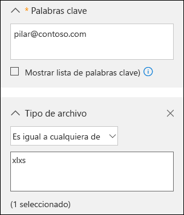
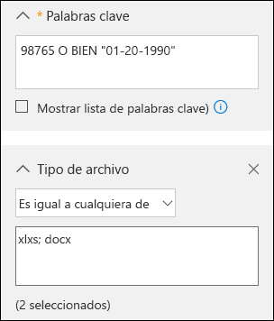
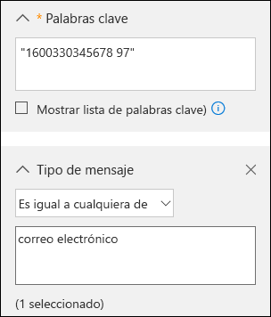

# <a name="office-365-data-subject-requests-for-the-gdpr"></a><span data-ttu-id="ec0d6-104">Solicitudes del interesado de Office 365 para el RGPD</span><span class="sxs-lookup"><span data-stu-id="ec0d6-104">Office 365 Data Subject Requests for the GDPR</span></span>

## <a name="introduction-to-dsrs"></a><span data-ttu-id="ec0d6-105">Introducción a las solicitudes del interesado</span><span class="sxs-lookup"><span data-stu-id="ec0d6-105">Introduction to DSRs</span></span>

<span data-ttu-id="ec0d6-p101">El Reglamento general de protección de datos (RGPD) otorga derechos a las personas (que se denominan *interesados* en el reglamento) para administrar los datos personales recopilados por una empresa u otro tipo de agencia u organización (es decir, el *responsable de los datos* o, para abreviar, el *responsable*). Los datos personales se definen de forma muy amplia según el RGPD como cualquier dato relacionado con una persona física, ya sea identificada o identificable. El RGPD otorga a los interesados derechos específicos sobre sus datos personales, como la obtención de copias de los datos, la solicitud de cambios, la restricción de su tratamiento o su eliminación, o su recepción en formato electrónico para transferirlos a otro responsable. Las solicitudes formales realizadas por un interesado a un responsable de los datos para que realice una acción en sus datos personales se denominan *solicitudes del interesado* (DSR por sus siglas en inglés). El responsable de los datos está obligado a atender de inmediato cualquier DSR y ofrecer una respuesta adecuada, ya sea realizando la acción solicitada u ofreciendo una explicación de por qué no puede llevarla a cabo. Los responsables de los datos tienen que consultar a sus propios asesores legales o de cumplimiento normativo sobre cómo ofrecer una respuesta adecuada a una DSR concreta.</span><span class="sxs-lookup"><span data-stu-id="ec0d6-p101">The General Data Protection Regulation (GDPR) gives rights to people (known in the regulation as *data subjects*) to manage the personal data that has been collected by an employer or other type of agency or organization (known as the *data controller* or just *controller*). Personal data is defined very broadly under the GDPR as any data that relates to an identified or identifiable natural person. The GDPR gives data subjects specific rights to their personal data; these rights include obtaining copies of it, requesting changes to it, restricting the processing of it, deleting it, or receiving it in an electronic format so it can be moved to another controller. A formal request by a data subject to a controller to take an action on their personal data is called a *Data Subject Request* or DSR. The controller is obligated to promptly consider each DSR and provide a substantive response either by taking the requested action or by providing an explanation for why the DSR cannot be accommodated by the controller. A controller should consult with its own legal or compliance advisers regarding the proper disposition of any given DSR.</span></span>

<span data-ttu-id="ec0d6-p102">En esta guía se explica cómo usar productos, servicios y herramientas administrativas de Office 365 con el fin de encontrar y actuar sobre datos personales para responder a solicitudes del interesado. En concreto, incluye cómo encontrar, tener acceso y actuar sobre datos personales hospedados en la nube de Microsoft. Este es un breve resumen de los procedimientos descritos en esta guía:</span><span class="sxs-lookup"><span data-stu-id="ec0d6-p102">The guide discusses how to use Office 365 products, services and administrative tools to help you find and act on personal data to respond to DSRs. Specifically, this includes how to find, access, and act on personal data that resides in Microsoft's cloud. Here’s a quick overview of the processes outlined in this guide:</span></span>

1.  <span data-ttu-id="ec0d6-p103">***Detectar***: use herramientas de búsqueda y detección, como las que ofrece el Centro de seguridad y cumplimiento (SCC) de Microsoft, para encontrar con facilidad contenido de clientes que pueda ser objeto de una DSR. Después de recopilar documentos potencialmente relevantes, puede realizar una o varias de las acciones de DSR descritas en los pasos siguientes para responder a la solicitud de DSR. Como alternativa, puede determinar que esta última no cumple las directrices de respuesta a las solicitudes del interesado.</span><span class="sxs-lookup"><span data-stu-id="ec0d6-p103">***Discover***—Use search and discovery tools, such as those offered by the Microsoft Security & Compliance Center (SCC), to more easily find customer content that may be the subject of a DSR. Once potentially responsive documents are collected, you can perform one or more of the DSR actions described in the following steps to respond to the DSR request. Alternatively, you may determine that the request doesn't meet your organizations guidelines for responding to DSRs.</span></span>

2.  <span data-ttu-id="ec0d6-118">***Obtener acceso***: recupere datos personales hospedados en la nube de Microsoft y, si se le pide, ponga una copia a disposición del interesado.</span><span class="sxs-lookup"><span data-stu-id="ec0d6-118">***Access***—Retrieve personal data that resides in the Microsoft cloud and, if requested, make a copy of it available to the data subject.</span></span>

3.  <span data-ttu-id="ec0d6-119">***Rectificar***: realice cambios o implemente otras acciones solicitadas en los datos personales, si corresponde.</span><span class="sxs-lookup"><span data-stu-id="ec0d6-119">***Rectify***—Make changes or implement other requested actions on the personal data, where applicable.</span></span>

4.  <span data-ttu-id="ec0d6-p104">***Restringir***: restrinja el tratamiento de datos personales, ya sea quitando las licencias para distintos servicios de Office 365 o desactivando los servicios o las características que desee, siempre que sea posible. También puede quitar los datos de la nube de Microsoft y conservarlos localmente o en otra ubicación.</span><span class="sxs-lookup"><span data-stu-id="ec0d6-p104">***Restrict***—Restrict the processing of personal data, either by removing licenses for various Office 365 services, or by turning off the desired services or features where possible. You can also remove data from the Microsoft cloud and retain it on-premises or at another location.</span></span>

5.  <span data-ttu-id="ec0d6-122">***Eliminar***: elimine de forma permanente los datos personales que residen en la nube de Microsoft.</span><span class="sxs-lookup"><span data-stu-id="ec0d6-122">***Delete***—Permanently remove personal data that resides in the Microsoft cloud.</span></span>

6.  <span data-ttu-id="ec0d6-p105">***Exportar***: envíe una copia electrónica de datos personales al interesado. El "derecho de portabilidad de datos" del RGPD permite a un interesado solicitar una copia electrónica de datos personales en un formato común y de lectura mecánica.</span><span class="sxs-lookup"><span data-stu-id="ec0d6-p105">***Export***—Provide an electronic copy of personal data to the data subject. The GDPR’s “right of data portability” allows a data subject to request an electronic copy of personal data that’s in a structured, commonly used, machine-readable format.</span></span>

### <a name="terminology"></a><span data-ttu-id="ec0d6-125">Terminología</span><span class="sxs-lookup"><span data-stu-id="ec0d6-125">Terminology</span></span>

<span data-ttu-id="ec0d6-126">A continuación se ofrecen definiciones de términos relacionados con el RGPD.</span><span class="sxs-lookup"><span data-stu-id="ec0d6-126">Here are definitions of terms from the GDPR that are relevant to this guide.</span></span>

- <span data-ttu-id="ec0d6-127">*Responsable*: la persona física o legal, autoridad pública, agencia u organismo que solo o junto a otras personas, determina los fines y medios del tratamiento de datos personales; donde los fines y los medios de dicho tratamiento están determinados por la ley de la unión o de un estado miembro, el responsable o los criterios específicos para su nominación pueden ser proporcionados por la ley de un estado miembro o de la unión.</span><span class="sxs-lookup"><span data-stu-id="ec0d6-127">*Controller*—The natural or legal person, public authority, agency or other body which, alone or jointly with others, determines the purposes and means of the processing of personal data; where the purposes and means of such processing are determined by Union or Member State law, the controller or the specific criteria for its nomination may be provided for by Union or Member State law.</span></span>

-   <span data-ttu-id="ec0d6-128">*Datos personales* e *interesado*: cualquier información sobre una persona física identificada o identificable (“interesado”); una persona identificable natural es una que puede identificarse, directa o indirectamente, especialmente con referencia a un identificador, con un nombre, un número de identificación, datos de ubicación, un identificador en línea o uno o más elementos específicos físicos, fisiológicos, genéticos, mentales, económicos, culturales o de identidad social de esa persona natural;</span><span class="sxs-lookup"><span data-stu-id="ec0d6-128">*Personal data* and *data subject*—Any information relating to an identified or identifiable natural person (‘data subject’); an identifiable natural person is one who can be identified, directly or indirectly, in particular by reference to an identifier such as a name, an identification number, location data, an online identifier or to one or more factors specific to the physical, physiological, genetic, mental, economic, cultural or social identity of that natural person.</span></span>

-   <span data-ttu-id="ec0d6-129">*Encargado*: persona física o legal, autoridad pública, agencia u otro organismo que trata datos personales en nombre del responsable.</span><span class="sxs-lookup"><span data-stu-id="ec0d6-129">*Processor*—A natural or legal person, public authority, agency or other body which processes personal data on behalf of the controller.</span></span>

### <a name="how-to-use-this-guide"></a><span data-ttu-id="ec0d6-130">Cómo utilizar esta guía</span><span class="sxs-lookup"><span data-stu-id="ec0d6-130">How to use this guide</span></span>

<span data-ttu-id="ec0d6-131">Para ayudarle a buscar información relevante a su caso de uso, esta guía está dividida en cuatro partes.</span><span class="sxs-lookup"><span data-stu-id="ec0d6-131">To help you find information relevant to your use case, this guide is divided into four parts.</span></span>

<span data-ttu-id="ec0d6-p106">[Parte 1: Responder a solicitudes del interesado sobre datos del cliente](#part-1-responding-to-dsrs-for-customer-data) - : los *datos del cliente* son datos que se producen y almacenan en Office 365 durante las operaciones cotidianas de su negocio. Algunos ejemplos de las aplicaciones de Office 365 más usadas que le permiten crear y editar datos son Word, Excel, PowerPoint, Outlook y OneNote. Office 365 también consta de aplicaciones como SharePoint Online, Teams y Forms que le permiten colaborar con otros usuarios. En la parte 1 de esta guía se explica cómo detectar, tener acceso a, rectificar, restringir, eliminar y exportar datos desde las aplicaciones de Office 365 que se han utilizado para crearlos y almacenarlos en servicios online de Office 365. Aborda productos y servicios en los que Microsoft actúa como encargado de los datos de la organización y, por tanto, se pone la funcionalidad de solicitudes del interesado a disposición del administrador del espacio empresarial.</span><span class="sxs-lookup"><span data-stu-id="ec0d6-p106">[Part 1: Responding to DSRs for Customer Data](#part-1-responding-to-dsrs-for-customer-data) - *Customer Data* is data produced and stored in Office 365 in the day-to-day operations of running your business. Examples of the most commonly used Office 365 applications which allow you to author data include Word, Excel, PowerPoint, Outlook and OneNote. Office 365 also consists of applications such as SharePoint Online, Teams, and Forms which allow you to better collaborate with others. Part 1 of this guide discusses how to discover access, rectify, restrict, delete, and export data from Office 365 applications that have been used to author and store data in Office 365 online services. It addresses products and services for which Microsoft is acting as a data processor to your organization, and thus DSR capability is made available to your tenant administrator.</span></span>

<span data-ttu-id="ec0d6-p107">[Parte 2: Responder a solicitudes del interesado con respecto a la información generada por Office 365](#part-2-responding-to-dsrs-with-respect-to-insights-generated-by-office-365): Office 365 proporciona cierta información a través de servicios como Delve, MyAnalytics y Workplace Analytics. En la parte 2 de esta guía se explica cómo se genera esta información y cómo responder a las solicitudes del interesado relacionadas con ella.</span><span class="sxs-lookup"><span data-stu-id="ec0d6-p107">[Part 2: Responding to DSRs with Respect to Insights Generated by Office 365](#part-2-responding-to-dsrs-with-respect-to-insights-generated-by-office-365) - Office 365 provides certain insights through services like Delve, MyAnalytics, and Workplace Analytics. How these insights are generated and how to respond to DSRs related to them are explained in Part 2 of this guide.</span></span>

<span data-ttu-id="ec0d6-p108">[Parte 3: Responder a solicitudes de interesado sobre registros generados por el sistema](#part-3-responding-to-dsrs-for-system-generated-logs): cuando usa servicios de Office 365 Enterprise, Microsoft genera información como registros de servicio que registran el uso o el rendimiento de las características de los servicios en línea. La mayoría de los datos de servicio generados contienen identificadores anónimos generados por Microsoft y por ello a esta categoría se la denomina *registros generado por el sistema* en este documento. Aunque estos datos no pueden atribuirse a un interesado específico sin el uso de información adicional, algunos pueden ser considerados personales dentro de la definición del RGPD de "datos personales". La parte 3 de esta guía trata acerca de cómo acceder a, eliminar y exportar registros generados por el sistema.</span><span class="sxs-lookup"><span data-stu-id="ec0d6-p108">[Part 3: Responding to DSRs for system-generated Logs](#part-3-responding-to-dsrs-for-system-generated-logs) - When you use Office 365 enterprise services, Microsoft generates some information such as service logs that record the use or performance of features in the online services. Most service generated data contain pseudonymous identifiers generated by Microsoft and this category is thus generally referred to within this document as *system-generated logs*. Although this data can't be attributed to a specific data subject without the use of additional information, some of it may be deemed personal under GDPR's definition for "personal data." Part 3 of this guide discusses how to access, delete, and export system-generated logs.</span></span>

<span data-ttu-id="ec0d6-143">[Parte 4: Recursos adicionales para ayudarle con las solicitudes del interesado](#part-4-additional-resources-to-assist-you-with-dsrs): en la parte 4 de esta guía aparecen escenarios limitados en los que Microsoft es el responsable de los datos cuando se usan determinados servicios y productos de Office 365.</span><span class="sxs-lookup"><span data-stu-id="ec0d6-143">[Part 4: Additional resources to assist you with DSRs](#part-4-additional-resources-to-assist-you-with-dsrs) - Part 4 of this guide lists limited scenarios in which Microsoft is the data controller when certain Office 365 products and services are used.</span></span>

> [!NOTE]
> <span data-ttu-id="ec0d6-p109">En la mayoría de casos, cuando los usuarios de la organización usan servicios y productos de Microsoft Office 365, usted es el responsable de los datos y Microsoft el encargado de los datos. Como responsable de los datos, es responsable de responder directamente ante el interesado. Para ayudarle con esto, en las tres primeras partes de esta guía se detallan las funcionalidades técnicas disponibles para la organización a fin de responder a una solicitud DSR. Aunque en algunos escenarios limitados, Microsoft será el responsable de los datos cuando las personas usen determinados servicios y productos de Office 365. En estos casos, la información proporcionada en la parte 4 contiene instrucciones sobre cómo los interesados pueden enviar sus solicitudes DSR a Microsoft.</span><span class="sxs-lookup"><span data-stu-id="ec0d6-p109">In most cases, when users in your organization use Microsoft Office 365 products and services, you are the data controller and Microsoft is the processor. As a data controller, you are responsible for responding to the data subject directly. To assist you with this, Parts 1-3 of this guide detail the technical capabilities available to your organization to respond to a DSR request. In some limited scenarios, however, Microsoft will be the data controller when people use certain Office 365 products and services. In these cases, the information in Part 4 provides guidance on how data subjects can submit DSR requests to Microsoft.</span></span>


### <a name="office-365-national-clouds"></a><span data-ttu-id="ec0d6-149">Nubes nacionales de Office 365</span><span class="sxs-lookup"><span data-stu-id="ec0d6-149">Office 365 national clouds</span></span>

<span data-ttu-id="ec0d6-p110">Los servicios de Microsoft Office 365 también están disponibles en los siguientes entornos de nube nacional: [Office 365 Germany](https://support.office.com/article/learn-about-office-365-germany-8a5a4bbc-667a-4cac-8769-d8ac9015db4c), [Office 365 ofrecido por 21Vianet (China)](https://support.office.com/article/Learn-about-Office-365-operated-by-21Vianet-A8AB5061-3346-4DA0-BB7C-5260822B53AE) y [Office 365 Administración pública de EE. UU.](https://technet.microsoft.com/library/mt774581.aspx) La mayoría de las instrucciones para administrar las solicitudes del interesado descritas en este documento se aplican a estos entornos de nube nacional. Aunque, debido a la naturaleza aislada de estos entornos, hay algunas excepciones. Cuando son relevantes para una subsección determinada, estas excepciones se mencionan en una nota correspondiente.</span><span class="sxs-lookup"><span data-stu-id="ec0d6-p110">The Microsoft Office 365 services are also available in the following national cloud environments: [Office 365 Germany](https://support.office.com/article/learn-about-office-365-germany-8a5a4bbc-667a-4cac-8769-d8ac9015db4c), [Office 365 operated by 21Vianet (China)](https://support.office.com/article/Learn-about-Office-365-operated-by-21Vianet-A8AB5061-3346-4DA0-BB7C-5260822B53AE), and [Office 365 US Government](https://technet.microsoft.com/library/mt774581.aspx). Most of the guidance for managing data subject requests described in this document applies to these national cloud environments. However, due to the isolated nature of these environments, there are some exceptions. Where notable for a given subsection, these exceptions are called out in a corresponding note.</span></span>

### <a name="hybrid-deployments"></a><span data-ttu-id="ec0d6-154">Implementaciones híbridas</span><span class="sxs-lookup"><span data-stu-id="ec0d6-154">Hybrid deployments</span></span>

<span data-ttu-id="ec0d6-p111">Puede que la organización de Office 365 se componga de ofertas de Microsoft que son una combinación de productos de servidor local y servicios basados en la nube. En general, una implementación híbrida suele consistir en el uso compartido de cuentas de usuario (administración de identidades) y recursos (como buzones, sitios web y datos) que existen en la nube y en la instalación local. Entre los escenarios híbridos comunes se incluyen:</span><span class="sxs-lookup"><span data-stu-id="ec0d6-p111">Your Office 365 organization may consist of Microsoft offerings that are a combination of cloud-based services and on-premises server products. In general, a hybrid deployment is typically the sharing of user accounts (identity management) and resources (such as mailboxes, web sites, and data) that exist in the cloud and on-premises. Common hybrid scenarios include:</span></span>
- <span data-ttu-id="ec0d6-158">Implementaciones híbridas de Exchange, en la que algunos usuarios tienen buzones locales y otros tienen buzones de Exchange Online.</span><span class="sxs-lookup"><span data-stu-id="ec0d6-158">Exchange hybrid deployments, where some users have an on-premises mailboxes and other users have Exchange Online mailboxes.</span></span>
- <span data-ttu-id="ec0d6-159">Implementaciones híbridas de SharePoint, en las que los servidores de archivos y del sitio son locales y las cuentas de OneDrive para la Empresa están en Office 365.</span><span class="sxs-lookup"><span data-stu-id="ec0d6-159">SharePoint hybrid deployments, where site and file servers are on-premises and OneDrive for Business accounts are in Office 365.</span></span>
- <span data-ttu-id="ec0d6-160">El sistema de administración de identidades local (Active Directory) que se sincroniza con Azure Activity Directory, que es el servicio de directorio subyacente en Office 365.</span><span class="sxs-lookup"><span data-stu-id="ec0d6-160">The on-premises identity management system (Active Directory) that is synchronized with Azure Activity Directory, which is the underlying directory service in Office 365.</span></span>

<span data-ttu-id="ec0d6-p112">Al responder a una solicitud de DSR, es posible que tenga que determinar si los datos relevantes para una solicitud de este tipo se encuentran en la organización local o en la nube de Microsoft y, luego, seguir los pasos adecuados para responder a la solicitud. La guía de solicitudes del interesado de Office 365 (esta guía) ofrece instrucciones para responder a los datos basados en la nube. Para obtener instrucciones sobre los datos de la organización local, vea [RGPD para servidores locales de Office](https://docs.microsoft.com/Office365/Enterprise/gdpr-for-office-servers).</span><span class="sxs-lookup"><span data-stu-id="ec0d6-p112">When responding to a DSR request, you may have to determine if data that's responsive to a DSR request is in the Microsoft cloud or in your on-premise organization, and then take the appropriate steps to respond to that request. The Office 365 Data Subject Request Guide (this guide) provides guidance for responding to cloud-based data. For guidance for data in your on-premises organization, see [GDPR for Office on-premises Servers](https://docs.microsoft.com/Office365/Enterprise/gdpr-for-office-servers).</span></span> 


## <a name="part-1-responding-to-dsrs-for-customer-data"></a><span data-ttu-id="ec0d6-164">Parte 1: Responder a solicitudes del interesado sobre datos del cliente</span><span class="sxs-lookup"><span data-stu-id="ec0d6-164">Part 1: Responding to DSRs for Customer Data</span></span>

<span data-ttu-id="ec0d6-165">Las instrucciones para responder a las solicitudes de interesado de los datos de clientes se dividen en las cuatro secciones siguientes.</span><span class="sxs-lookup"><span data-stu-id="ec0d6-165">The guidance for responding to DSRs for Customer Data is divided into the following four sections.</span></span>

- [<span data-ttu-id="ec0d6-166">Usar la herramienta Búsqueda de contenido eDiscovery para responder a las solicitudes de interesado</span><span class="sxs-lookup"><span data-stu-id="ec0d6-166">Using the Content Search eDiscovery tool to respond to DSRs</span></span>](#using-the-content-search-ediscovery-tool-to-respond-to-dsrs)

- [<span data-ttu-id="ec0d6-167">Usar una función integrada en la aplicación para responder a las solicitudes de interesado</span><span class="sxs-lookup"><span data-stu-id="ec0d6-167">Using In-App functionality to respond to DSRs</span></span>](#using-in-app-functionality-to-respond-to-dsrs)

- [<span data-ttu-id="ec0d6-168">Responder a solicitudes de interesado de corrección</span><span class="sxs-lookup"><span data-stu-id="ec0d6-168">Responding to DSR rectification requests</span></span>](#responding-to-dsr-rectification-requests)

- [<span data-ttu-id="ec0d6-169">Responder a solicitudes  de DSR</span><span class="sxs-lookup"><span data-stu-id="ec0d6-169">Responding to DSR restriction requests</span></span>](#responding-to-dsr-restriction-requests)

### <a name="how-to-determine-the-office-365-applications-that-may-be-in-scope-for-a-dsr-for-customer-data"></a><span data-ttu-id="ec0d6-170">Cómo determinar las aplicaciones de Office 365 que pueden estar en el ámbito de una solicitud de datos de interesado de datos de clientes</span><span class="sxs-lookup"><span data-stu-id="ec0d6-170">How to determine the Office 365 applications that may be in scope for a DSR for Customer Data</span></span>

<span data-ttu-id="ec0d6-p113">Para ayudarle a determinar dónde buscar datos personales o qué buscar, resulta útil identificar las aplicaciones de Office 365 que los usuarios de su organización pueden usar para crear y almacenar los datos en Office 365. Conocer esto limita las aplicaciones de Office 365 que están en el ámbito de una solicitud de interesado y le ayuda a determinar cómo buscar y acceder a los datos personales relacionados con una solicitud de interesado. En concreto, esto significa si puede usar la herramienta de búsqueda de contenido o si ha de volver a usar la función integrada de la aplicación en la que se crearon los datos.</span><span class="sxs-lookup"><span data-stu-id="ec0d6-p113">To help you determine where to search for personal data or what to search for, it helps to identify the Office 365 applications that people in your organization can use to create and store data in Office 365. Knowing this narrows the Office 365 applications that are in-scope for a DSR and helps you determine how you will search for and access personal data that’s related to a DSR. Specifically, this means whether you can use the Content Search tool or if you’ll have to use the in-app functionality of the application the data was created in.</span></span>

<span data-ttu-id="ec0d6-p114">Una forma rápida de identificar las aplicaciones de Office 365 que los usuarios de su organización usan para crear datos de clientes consiste en determinar qué aplicaciones están incluidas en la suscripción a Office 365 de su organización. Para ello, puede acceder a las cuentas de usuario en el portal de administrador de Office 365 y la información de licencia del producto. Vea [Asignar licencias a usuarios en Office 365 para empresas.](https://docs.microsoft.com/office365/admin/subscriptions-and-billing/assign-licenses-to-users)</span><span class="sxs-lookup"><span data-stu-id="ec0d6-p114">A quick way to identify the Office 365 applications that people in your organization are using to create Customer Data is to determine which applications are included in your organization's Office 365 subscription. To do this, you can access user accounts in the Office 365 admin portal and look at the product licensing information. See [Assign licenses to users in Office 365 for business](https://docs.microsoft.com/office365/admin/subscriptions-and-billing/assign-licenses-to-users).</span></span>

## <a name="using-the-content-search-ediscovery-tool-to-respond-to-dsrs"></a><span data-ttu-id="ec0d6-177">Usar la herramienta Búsqueda de contenido eDiscovery para responder a solicitudes del interesado</span><span class="sxs-lookup"><span data-stu-id="ec0d6-177">Using the Content Search eDiscovery tool to respond to DSRs</span></span>

<span data-ttu-id="ec0d6-p115">Al buscar datos personales en el conjunto más amplio de datos que su organización crea y almacena en Office 365, debería considerar qué aplicaciones es más probable que se hayan usado para crear los datos que busca. Microsoft calcula que más del 90 % de los datos de una organización que se almacenan en Office 365 se han creado en Word, Excel, PowerPoint, OneNote y Outlook. Es muy probable que los documentos creados en estas aplicaciones de Office, aunque se hayan adquirido mediante Office 365 ProPlus o una licencia perpetua de Office, estén almacenados en un sitio de SharePoint Online, en la cuenta de OneDrive para la Empresa de un usuario o en el buzón de Exchange Online de un usuario. Esto significa que puede usar la herramienta Búsqueda de contenido eDiscovery para buscar (y realizar otras acciones relacionadas con solicitudes del interesado) en sitios de SharePoint Online, cuentas de OneDrive para la Empresa y buzones de Exchange Online (incluidos los sitios y buzones asociados a Grupos de Office 365, Microsoft Teams, EDU Assignments y StaffHub) para encontrar documentos y elementos del buzón que puedan ser relevantes para la DSR que investiga. También puede usar la herramienta Búsqueda de contenido para descubrir datos del cliente creados en otras aplicaciones de Office 365.</span><span class="sxs-lookup"><span data-stu-id="ec0d6-p115">When looking for personal data within the larger set of data your organization creates and stores using in Office 365, you may want to first consider which applications people have most likely used to author the data you’re looking for. Microsoft estimates that over 90% of an organization’s data that is stored in Office 365 is authored in Word, Excel, PowerPoint, OneNote, and Outlook. Documents authored in these Office applications, even if purchased through Office 365 ProPlus or an Office perpetual license, are most likely stored on a SharePoint Online site, in a user’s OneDrive for Business account, or in a user’s Exchange Online mailbox. That means you can use the Content Search eDiscovery tool to search (and perform other DSR-related actions) across SharePoint Online sites, OneDrive for Business accounts, and Exchange Online mailboxes (including the sites and mailboxes associated with Office 365 Groups, Microsoft Teams, EDU Assignments, and StaffHub) to find documents and mailbox items that may be relevant to the DSR you’re investigating. You can also use the Content Search tool to discover Customer Data authored in other Office 365 applications.</span></span>

<span data-ttu-id="ec0d6-p116">En la siguiente tabla se enumeran las aplicaciones de Office 365 que los usuarios utilizan para crear contenido de cliente y que pueden detectarse con la Búsqueda de contenido. Esta sección de la guía de DSR ofrece instrucciones sobre cómo detectar, tener acceso a, exportar y eliminar datos creados con estas aplicaciones de Office 365.</span><span class="sxs-lookup"><span data-stu-id="ec0d6-p116">The following table lists the Office 365 applications that people use to create Customer Authored Content and that can be discovered by using Content Search. This section of the DSR guide provides guidance about how discover, access, export, and delete data created with these Office 365 applications.</span></span>

<span data-ttu-id="ec0d6-185">***Tabla 1: Aplicaciones en las que se puede usar la Búsqueda de contenido para buscar datos de clientes***</span><span class="sxs-lookup"><span data-stu-id="ec0d6-185">***Table 1: Applications where Content Search can be used to find Customer Data***</span></span>

| | |
| :---: | :---:|
<br/><span data-ttu-id="ec0d6-186">Calendario</span><span class="sxs-lookup"><span data-stu-id="ec0d6-186">Calendar</span></span> | <br /><span data-ttu-id="ec0d6-187">SharePoint Online</span><span class="sxs-lookup"><span data-stu-id="ec0d6-187">SharePoint Online</span></span> |
| <br/><span data-ttu-id="ec0d6-188">Excel</span><span class="sxs-lookup"><span data-stu-id="ec0d6-188">Excel</span></span> |<br /> <span data-ttu-id="ec0d6-189">Skype Empresarial</span><span class="sxs-lookup"><span data-stu-id="ec0d6-189">Skype for Business</span></span>|
| <br/><span data-ttu-id="ec0d6-190">Office Lens</span><span class="sxs-lookup"><span data-stu-id="ec0d6-190">Office Lens</span></span> |<br/> <span data-ttu-id="ec0d6-191">Tareas</span><span class="sxs-lookup"><span data-stu-id="ec0d6-191">Tasks</span></span> |
|<br/><span data-ttu-id="ec0d6-192">OneDrive para la Empresa</span><span class="sxs-lookup"><span data-stu-id="ec0d6-192">OneDrive for Business</span></span>|<br /><span data-ttu-id="ec0d6-193">Teams</span><span class="sxs-lookup"><span data-stu-id="ec0d6-193">Teams</span></span>|
| <br /><span data-ttu-id="ec0d6-194">OneNote</span><span class="sxs-lookup"><span data-stu-id="ec0d6-194">OneNote</span></span>| <span data-ttu-id="ec0d6-195">To-Do</span><span class="sxs-lookup"><span data-stu-id="ec0d6-195">To-Do</span></span> |
| <br /><span data-ttu-id="ec0d6-196">Outlook/Exchange Online</span><span class="sxs-lookup"><span data-stu-id="ec0d6-196">Outlook/Exchange Online</span></span> | <br /><span data-ttu-id="ec0d6-197">Vídeo</span><span class="sxs-lookup"><span data-stu-id="ec0d6-197">Video</span></span> |
| <br /><span data-ttu-id="ec0d6-198">Contactos</span><span class="sxs-lookup"><span data-stu-id="ec0d6-198">People</span></span>|<br /><span data-ttu-id="ec0d6-199">Visio</span><span class="sxs-lookup"><span data-stu-id="ec0d6-199">Visio</span></span> |
| <br /><span data-ttu-id="ec0d6-200">PowerPoint</span><span class="sxs-lookup"><span data-stu-id="ec0d6-200">PowerPoint</span></span> |  <br/> <span data-ttu-id="ec0d6-202">Word</span><span class="sxs-lookup"><span data-stu-id="ec0d6-202">Word</span></span>
||

<!-- end of table -->

> [!NOTE]
> <span data-ttu-id="ec0d6-p117">La herramienta de Búsqueda de contenido eDiscovery no está disponible en [Office 365 ofrecido por 21Vianet (China)](https://support.office.com/article/Learn-about-Office-365-operated-by-21Vianet-A8AB5061-3346-4DA0-BB7C-5260822B53AE). Esto significa que no puede usar esta herramienta para buscar y exportar datos del cliente en las aplicaciones de Office 365 que se muestran en la tabla 1. Sin embargo, puede usar la herramienta eDiscovery local en Exchange Online para buscar contenido en buzones de usuario. También puede usar el Centro de eDiscovery en SharePoint Online para buscar contenido en cuentas de OneDrive y sitios de SharePoint. Como alternativa, puede pedirle a un propietario del documento que le ayude a buscar y realizar cambios en el contenido, eliminarlo o exportarlo si es necesario. Para obtener más información, vea:</span><span class="sxs-lookup"><span data-stu-id="ec0d6-p117">The Content Search eDiscovery tool is not available in [Office 365 operated by 21Vianet (China)](https://support.office.com/article/Learn-about-Office-365-operated-by-21Vianet-A8AB5061-3346-4DA0-BB7C-5260822B53AE). This means you won’t able to use this tool to search for and export Customer Data in the Office 365 applications shown in Table 1. However, you can use the In-Place eDiscovery tool in Exchange Online to search for content in user mailboxes. You can also use the eDiscovery Center in SharePoint Online to search for content in SharePoint sites and OneDrive accounts. Alternatively, you can ask a document owner to help you find and make changes or deletions to content or export it if necessary. For more information, see:</span></span></br></br><span data-ttu-id="ec0d6-209">&nbsp;&nbsp;• [Crear una búsqueda de eDiscovery local](https://technet.microsoft.com/library/dd353189(v=exchg.150).aspx)</span><span class="sxs-lookup"><span data-stu-id="ec0d6-209">• Create an In-Place eDiscovery search</span></span></br><span data-ttu-id="ec0d6-210">&nbsp;&nbsp;• [Configurar un centro de eDiscovery en SharePoint Online](https://support.office.com/article/Set-up-an-eDiscovery-Center-in-SharePoint-Online-A18F8975-AA7F-43B4-A7D6-001D14744D8E)</span><span class="sxs-lookup"><span data-stu-id="ec0d6-210">• Set up an eDiscovery Center in SharePoint Online</span></span>

### <a name="using-content-search-to-find-personal-data"></a><span data-ttu-id="ec0d6-211">Usar la Búsqueda de contenido para buscar datos personales</span><span class="sxs-lookup"><span data-stu-id="ec0d6-211">Using Content Search to find personal data</span></span>

<span data-ttu-id="ec0d6-p118">El primer paso para responder a una solicitud de interesado es encontrar los datos personales requeridos en la misma. Para esto, debe usar las herramientas eDiscovery de Office 365 para buscar datos personales (entre todos los datos de su organización en Office 365), o puede dirigirse directamente a la aplicación nativa en la que se crearon los datos. Este primer paso (encontrar y revisar los datos personales en cuestión) le ayudará a determinar si una solicitud de interesado cumple los requisitos de su organización para respetarla o rechazarla. Por ejemplo, después de encontrar y revisar los datos personales en cuestión, puede determinar que la solicitud no cumple los requisitos de su organización porque puede afectar a los derechos y libertades de terceros, o porque los datos personales forman parte de un registro de negocios que su organización tiene interés en retener.</span><span class="sxs-lookup"><span data-stu-id="ec0d6-p118">The first step in responding to a DSR is to find the personal data that is the subject of the DSR. This consists of using Office 365 eDiscovery tools to search for personal data (among all your organization’s data in Office 365) or going directly to the native application in which the data was created. This first step - finding and reviewing the personal data at issue - will help you determine whether a DSR meets your organization's requirements for honoring or declining a data subject request. For example, after finding and reviewing the personal data at issue, you may determine the request doesn’t meet your organization’s requirements because doing so may adversely affect the rights and freedoms of others, or because the personal data is contained in a business record your organization has a legitimate business interest in retaining.</span></span>

<span data-ttu-id="ec0d6-p119">Como se indicó anteriormente, Microsoft estima que las aplicaciones de Microsoft Office, como Word y Excel, se usan para crear más del 90 % de los datos de una organización. Esto significa que puede usar la Búsqueda de contenido en el Centro de seguridad y cumplimiento para buscar la mayoría de los datos relacionados con las DSR.</span><span class="sxs-lookup"><span data-stu-id="ec0d6-p119">As previously stated, Microsoft estimates that over 90% of an organization’s data is created with Office applications, such as Word and Excel. This means that you can use the Content Search in the Security & Compliance Center to search for most DSR-related data.</span></span>

<span data-ttu-id="ec0d6-p120">En esta guía se presupone que usted o la persona que busca datos personales que puedan ser relevantes para una solicitud DSR ya están familiarizados, o al menos tienen cierta experiencia, con la herramienta de Búsqueda de contenido del Centro de seguridad y cumplimiento. Para obtener instrucciones generales sobre el uso de la Búsqueda de contenido, vea [Búsqueda de contenido en Office 365](https://support.office.com/article/content-search-in-office-365-53390468-eec6-45cb-b6cd-7511f9c909e4). Asegúrese de que la persona responsable de las búsquedas tenga asignados los permisos necesarios en el Centro de seguridad y cumplimiento. Esta persona debe agregarse como miembro del grupo de roles de Supervisor de eDiscovery en el Centro de seguridad y cumplimiento; vea [Asignar permisos de eDiscovery en el Centro de seguridad y cumplimiento de Office 365](https://support.office.com/article/Assign-eDiscovery-permissions-in-the-Office-365-Security-Compliance-Center-5b9a067b-9d2e-4aa5-bb33-99d8c0d0b5d7). Considere la posibilidad de agregar al grupo de roles de Supervisor de eDiscovery otros usuarios de la organización implicados en la investigación de solicitudes DSR para que puedan llevar a cabo las acciones necesarias en la herramienta de Búsqueda de contenido tales como previsualizar y exportar resultados de la búsqueda. Pero, a menos que configure los límites de cumplimiento normativo (tal y como se describe [aquí](#set-up-compliance-boundaries-to-limit-the-scope-of-content-searches)), tenga en cuenta que un Supervisor de eDiscovery puede buscar en todas las ubicaciones de contenido de la organización, incluidas aquellas que puedan estar o no relacionadas con una investigación de DSR.</span><span class="sxs-lookup"><span data-stu-id="ec0d6-p120">This guide assumes that you or the person searching for personal data that may be responsive to a DSR request is familiar with or has experience using the Content Search tool in the Security & Compliance Center. For general guidance on using Content Search, see [Content Search in Office 365](https://support.office.com/article/content-search-in-office-365-53390468-eec6-45cb-b6cd-7511f9c909e4). Be sure that the person running the searches has been assigned the necessary permissions in the Security & Compliance Center. This person should be added as a member of the eDiscovery Manager role group in the Security & Compliance Center; see [Assign eDiscovery permissions in the Office 365 Security & Compliance Center](https://support.office.com/article/Assign-eDiscovery-permissions-in-the-Office-365-Security-Compliance-Center-5b9a067b-9d2e-4aa5-bb33-99d8c0d0b5d7). Consider adding other people in your organization who are involved in investigating DSRs to the eDiscovery Manager role group, so they can perform the necessary actions in the Content Search tool such as previewing and exporting search results. However, unless you set up compliance boundaries (as described [here](#set-up-compliance-boundaries-to-limit-the-scope-of-content-searches)) be aware that an eDiscovery Manager can search all content locations in your organization, including ones that may not be related to a DSR investigation.</span></span>

<span data-ttu-id="ec0d6-224">Después de encontrar los datos, puede realizar la acción específica para satisfacer la solicitud del interesado.</span><span class="sxs-lookup"><span data-stu-id="ec0d6-224">After you find the data, you can then perform the specific action to satisfy the request by the data subject.</span></span>

> [!NOTE]
> <span data-ttu-id="ec0d6-225">En Office 365 Alemania, el Centro de seguridad y cumplimiento se encuentra en https://protection.office.de.</span><span class="sxs-lookup"><span data-stu-id="ec0d6-225">In Office 365 Germany, the Security & Compliance Center is located at https://protection.office.de.</span></span>


#### <a name="searching-content-locations"></a><span data-ttu-id="ec0d6-226">Buscar ubicaciones de contenido</span><span class="sxs-lookup"><span data-stu-id="ec0d6-226">Searching content locations</span></span>

<span data-ttu-id="ec0d6-227">Puede buscar los siguientes tipos de ubicaciones de contenido con la herramienta de búsqueda de contenido.</span><span class="sxs-lookup"><span data-stu-id="ec0d6-227">You can search the following types of content locations with the Content Search tool.</span></span>

-   <span data-ttu-id="ec0d6-228">Buzones de Exchange Online; incluyendo aquellos asociados con Grupos de Office 365 y Microsoft Teams</span><span class="sxs-lookup"><span data-stu-id="ec0d6-228">Exchange Online mailboxes; this includes the mailboxes associated with Office 365 Groups and Microsoft Teams</span></span>

-   <span data-ttu-id="ec0d6-229">Carpetas públicas de Exchange Online</span><span class="sxs-lookup"><span data-stu-id="ec0d6-229">Exchange Online public folders</span></span>

-   <span data-ttu-id="ec0d6-230">Sitios de SharePoint Online; incluyendo aquellos asociados con Grupos de Office 365 y Microsoft Teams</span><span class="sxs-lookup"><span data-stu-id="ec0d6-230">SharePoint Online sites; this includes the sites associated with Office 365 Groups and Microsoft Teams</span></span>

-   <span data-ttu-id="ec0d6-231">Cuentas de OneDrive para la Empresa</span><span class="sxs-lookup"><span data-stu-id="ec0d6-231">OneDrive for Business accounts</span></span>

> [!NOTE]
> <span data-ttu-id="ec0d6-p121">En esta guía se asume que todos los datos que puedan ser relevantes para una investigación de DSR se almacenan en Office 365; en otras palabras, se almacenan en la nube de Microsoft. Los datos almacenados en el equipo local de un usuario o en las instalaciones de los servidores de archivos de la organización quedan fuera del ámbito de una investigación de DSR en datos almacenados en Office 365. Para más información sobre cómo responder a las solicitudes de datos de DSR en organizaciones locales, vea [RGPD para servidores locales de Office](https://docs.microsoft.com/Office365/Enterprise/gdpr-for-office-servers).</span><span class="sxs-lookup"><span data-stu-id="ec0d6-p121">This guide assumes that all data that might be relevant to a DSR investigation is stored in Office 365; in other words, stored in the Microsoft cloud. Data stored on a user’s local computer or on-premises on your organization’s file servers is outside the scope of a DSR investigation for data stored in Office 365. For guidance about responding to DSR requests for data in on-premises organizations, see [GDPR for Office on-premises Servers](https://docs.microsoft.com/Office365/Enterprise/gdpr-for-office-servers).</span></span>


#### <a name="tips-for-searching-content-locations"></a><span data-ttu-id="ec0d6-235">Sugerencias para la búsqueda de ubicaciones de contenido</span><span class="sxs-lookup"><span data-stu-id="ec0d6-235">Tips for searching content locations</span></span>

-   <span data-ttu-id="ec0d6-p122">Empiece por buscar todas las ubicaciones de contenido de la organización (lo que puede hacerse en una sola búsqueda) para determinar con rapidez qué ubicaciones de contenido contienen elementos que coinciden con la consulta. A continuación, puede volver a ejecutar la búsqueda y restringir el ámbito a las ubicaciones específicas que contienen artículos relevantes.</span><span class="sxs-lookup"><span data-stu-id="ec0d6-p122">Begin by searching all content locations in your organization (which you can search in a single search) to quickly determine which content locations contain items that match your search query. Then you can re-run the search and narrow the search scope to the specific locations that contain relevant items.</span></span>

-   <span data-ttu-id="ec0d6-p123">Use las estadísticas de búsqueda para identificar las ubicaciones principales que contienen los elementos que coinciden con la consulta de búsqueda. Consulte [Ver las estadísticas de palabras clave de resultados de búsqueda de contenido](https://support.office.com/article/View-keyword-statistics-for-Content-Search-results-9701a024-c52e-43f0-b545-9a53478aec04).</span><span class="sxs-lookup"><span data-stu-id="ec0d6-p123">Use search statistics to identify the top locations that contain items that match your search query. See [View keyword statistics for Content Search results](https://support.office.com/article/View-keyword-statistics-for-Content-Search-results-9701a024-c52e-43f0-b545-9a53478aec04).</span></span>

-   <span data-ttu-id="ec0d6-p124">Busque en el registro de auditoría de Office 365 actividades recientes de archivos y carpetas realizadas por el usuario sometido a la solicitud de interesado. Buscar en el registro de auditoría devolverá una lista con el nombre y la ubicación de los recursos que ha utilizado el usuario recientemente. Puede usar esta información para crear una consulta de búsqueda de contenido. Vea [Buscar en el registro de auditoría en el Centro de seguridad y cumplimiento de Office 365](https://support.office.com/article/Search-the-audit-log-in-the-Office-365-Security-Compliance-Center-0d4d0f35-390b-4518-800e-0c7ec95e946c).</span><span class="sxs-lookup"><span data-stu-id="ec0d6-p124">Search the Office 365 audit log for recent file and folder activities performed by the user who is the subject of the DSR. Searching the audit log will return a list of auditing records that will contain the name and location of resources the user has recently interacted with. You may be able to use this information to build a content search query. See [Search the audit log in the Office 365 Security & Compliance Center](https://support.office.com/article/Search-the-audit-log-in-the-Office-365-Security-Compliance-Center-0d4d0f35-390b-4518-800e-0c7ec95e946c).</span></span>

#### <a name="building-search-queries-to-find-personal-data"></a><span data-ttu-id="ec0d6-244">Generar consultas de búsqueda para encontrar datos personales</span><span class="sxs-lookup"><span data-stu-id="ec0d6-244">Building search queries to find personal data</span></span>

<span data-ttu-id="ec0d6-p125">Es muy probable que la DSR que investigue contenga identificadores que puede utilizar como palabras clave para buscar los datos personales. A continuación, se muestran algunos de los identificadores más comunes cuando se buscan datos personales:</span><span class="sxs-lookup"><span data-stu-id="ec0d6-p125">The DSR you’re investigating most likely will contain identifiers that you can use in the keyword search query to search for the personal data. Here are some common identifiers that can be used in a search query to find personal data:</span></span>

-   <span data-ttu-id="ec0d6-247">Dirección de correo electrónico o el alias</span><span class="sxs-lookup"><span data-stu-id="ec0d6-247">Email address or alias</span></span>

-   <span data-ttu-id="ec0d6-248">Número de teléfono</span><span class="sxs-lookup"><span data-stu-id="ec0d6-248">Phone number</span></span>

-   <span data-ttu-id="ec0d6-249">Dirección de correo</span><span class="sxs-lookup"><span data-stu-id="ec0d6-249">Mailing address</span></span>

-   <span data-ttu-id="ec0d6-250">Número de id. de empleado</span><span class="sxs-lookup"><span data-stu-id="ec0d6-250">Employee ID number</span></span>

-   <span data-ttu-id="ec0d6-251">Número de identificación nacional o versión de miembro de la UE del número de la Seguridad Social.</span><span class="sxs-lookup"><span data-stu-id="ec0d6-251">National ID number or EU member version of a Social Security Number</span></span>

<span data-ttu-id="ec0d6-252">Es probable que la DSR que está investigando tenga un identificador y otros detalles sobre los datos personales solicitados que puede usar en una consulta de búsqueda.</span><span class="sxs-lookup"><span data-stu-id="ec0d6-252">The DSR that you’re investigating most likely will have an identifier and other details about the personal data that is the subject of the request that you can use in a search query.</span></span>

<span data-ttu-id="ec0d6-p126">Buscar solo una dirección de correo electrónico o la id. de un empleado probablemente devolverá una gran cantidad de resultados. Para limitar el ámbito de la búsqueda y que devuelva contenido más relevante en relación con la solicitud de interesado, puede agregar condiciones a la consulta de búsqueda. Al agregar una condición, la palabra clave y la condición de búsqueda se conectan de forma lógica por el operador booleano **AND**. Esto significa que solo los elementos que coincidan *tanto* con la palabra clave como con la condición aparecerán en los resultados de la búsqueda.</span><span class="sxs-lookup"><span data-stu-id="ec0d6-p126">Searching for just an email address or employee ID will probably return a lot of results. To narrow the scope of your search so it returns content most relevant to the DSR, you can add conditions to the search query. When you add a condition, the keyword and a search condition are logically connected by the **AND** Boolean operator. This means only items that match *both* the keyword and the condition will be returned in the search results.</span></span>

<span data-ttu-id="ec0d6-p127">La tabla siguiente incluye algunas condiciones que puede usar para restringir el ámbito de búsqueda. También se muestran los valores que puede usar para cada condición para buscar tipos de documento específicos y elementos del buzón.</span><span class="sxs-lookup"><span data-stu-id="ec0d6-p127">The following table lists some conditions you can use to narrow the scope of a search. The table also lists the values that you can use for each condition to search for specific document types and mailbox items.</span></span>

<span data-ttu-id="ec0d6-259">***Tabla 2: Limitar el ámbito de búsqueda mediante el uso de condiciones***</span><span class="sxs-lookup"><span data-stu-id="ec0d6-259">***Table 2: Narrow scope of search by using conditions***</span></span>
<!-- table starts here -->

||||
| :--- | :--- |:--- |
|<span data-ttu-id="ec0d6-260">**Condición**</span><span class="sxs-lookup"><span data-stu-id="ec0d6-260">**Condition**</span></span>|<span data-ttu-id="ec0d6-261">**Descripción**</span><span class="sxs-lookup"><span data-stu-id="ec0d6-261">**Description**</span></span> |<span data-ttu-id="ec0d6-262">**Ejemplo de valores de condición**</span><span class="sxs-lookup"><span data-stu-id="ec0d6-262">**Example of condition values**</span></span>|
| <span data-ttu-id="ec0d6-263">Tipo de archivo</span><span class="sxs-lookup"><span data-stu-id="ec0d6-263">File type</span></span> | <span data-ttu-id="ec0d6-p128">La extensión de un documento o archivo. Use esta condición para buscar documentos de Office y archivos creados en aplicaciones de Office 365. Use esta condición al buscar documentos ubicados en sitios de SharePoint Online y cuentas de OneDrive para la Empresa.</span><span class="sxs-lookup"><span data-stu-id="ec0d6-p128">The extension of a document or file. Use this condition to search for Office documents and files created by Office 365 applications. Use this condition when searching for documents located on SharePoint Online sites and OneDrive for Business accounts.</span></span><br/><span data-ttu-id="ec0d6-267">Tenga en cuenta que la propiedad correspondiente del documento es el tipo de archivo.</span><span class="sxs-lookup"><span data-stu-id="ec0d6-267">Note that the corresponding document property is filetype.</span></span> <br/><span data-ttu-id="ec0d6-268">Para obtener una lista completa de extensiones de archivo que puede buscar, consulte [Extensiones de nombre de archivo y tipos de archivos analizados predeterminados en SharePoint](https://technet.microsoft.com/library/jj219530.aspx).</span><span class="sxs-lookup"><span data-stu-id="ec0d6-268">For a complete list of file extensions that you can search for, see [Default crawled file name extensions and parsed file types in SharePoint](https://technet.microsoft.com/library/jj219530.aspx).</span></span>|<span data-ttu-id="ec0d6-269">&nbsp;&bull;&nbsp;&nbsp;CSV: busca archivos con valores separados por coma (CSV); Los archivos de Excel se pueden guardar en formato CSV y un archivo CSV puede importarse fácilmente a Excel</span><span class="sxs-lookup"><span data-stu-id="ec0d6-269">&nbsp;&bull;&nbsp;&nbsp;csv – Searches for comma separated value (CSV) files; Excel files can be saved in CSV format and CSV file can easily be imported into Excel</span></span><br><br><span data-ttu-id="ec0d6-270">&bull;&nbsp;&nbsp;docx: busca archivos de Word</span><span class="sxs-lookup"><span data-stu-id="ec0d6-270">&bull;&nbsp;&nbsp;docx – Searches for Word file</span></span> <br><br><span data-ttu-id="ec0d6-271">&bull;&nbsp;&nbsp;mpp: busca archivos de Project </span><span class="sxs-lookup"><span data-stu-id="ec0d6-271">&bull;&nbsp;&nbsp;mpp – Searches for Project files <brone – Searches for OneNote files</span></span><br/><br><span data-ttu-id="ec0d6-272">&bull;&nbsp;&nbsp;one: busca archivos de OneNote</span><span class="sxs-lookup"><span data-stu-id="ec0d6-272">&bull;&nbsp;&nbsp;one – Searches for OneNote files</span></span> <br><br><span data-ttu-id="ec0d6-273">&bull;&nbsp;&nbsp;PDF: busca archivos guardados en formato PDF</span><span class="sxs-lookup"><span data-stu-id="ec0d6-273">&bull;&nbsp;&nbsp;pdf – Search for files saved in a PDF format</span></span> <br><br><span data-ttu-id="ec0d6-274">&bull;&nbsp;&nbsp;pptx: busca archivos de PowerPoint</span><span class="sxs-lookup"><span data-stu-id="ec0d6-274">&bull;&nbsp;&nbsp;pptx – Searches for PowerPoint files</span></span> <br><br><span data-ttu-id="ec0d6-275">&bull;&nbsp;&nbsp;xlxs: busca archivos de Excel</span><span class="sxs-lookup"><span data-stu-id="ec0d6-275">&bull;&nbsp;&nbsp;xlxs – Searches for Excel files</span></span> <br><br><span data-ttu-id="ec0d6-276">&bull;&nbsp;&nbsp;vsd: busca archivos de Visio</span><span class="sxs-lookup"><span data-stu-id="ec0d6-276">&bull;&nbsp;&nbsp;vsd – Searches for Visio files</span></span> <br><br><span data-ttu-id="ec0d6-277">&bull;&nbsp;&nbsp;wmv: busca archivos de vídeo de Windows Media</span><span class="sxs-lookup"><span data-stu-id="ec0d6-277">&bull;&nbsp;&nbsp;wmv – Searches for Windows Media video files</span></span> <br>|
| <span data-ttu-id="ec0d6-278">Tipo de mensaje</span><span class="sxs-lookup"><span data-stu-id="ec0d6-278">Message type</span></span> | <span data-ttu-id="ec0d6-p129">El tipo de mensaje de correo electrónico que buscar. Use esta condición para buscar en los buzones de los contactos (Contactos), las tareas de reuniones (Calendario) o las conversaciones de Skype Empresarial. Tenga en cuenta que la propiedad de correo electrónico correspondiente es *tipo*.</span><span class="sxs-lookup"><span data-stu-id="ec0d6-p129">The email message type to search for. Use this condition to search mailboxes for contacts (People), meetings (Calendar) tasks, or Skype for Business conversations.Note that the corresponding email property is *kind*.</span></span>|<span data-ttu-id="ec0d6-281">&bull;&nbsp;&nbsp;*contactos*: busca en la lista de Mis contactos de un buzón</span><span class="sxs-lookup"><span data-stu-id="ec0d6-281">&bull;&nbsp;&nbsp;*contacts* – Searches the My Contacts list (People) of a mailbox</span></span> <br><br><span data-ttu-id="ec0d6-282">&bull;&nbsp;&nbsp;*correo electrónico*: busca mensajes de correo electrónico</span><span class="sxs-lookup"><span data-stu-id="ec0d6-282">&bull;&nbsp;&nbsp;*email* – Searches email messages</span></span> <br><br><span data-ttu-id="ec0d6-283">&bull;&nbsp;&nbsp;*mensajería instantánea*: busca conversaciones de Skype Empresarial</span><span class="sxs-lookup"><span data-stu-id="ec0d6-283">&bull;&nbsp;&nbsp;*im* – Searches Skype for Business conversations</span></span><br><br><span data-ttu-id="ec0d6-284">&bull;&nbsp;&nbsp;*reuniones*: busca convocatorias de reunión y citas (Calendario)</span><span class="sxs-lookup"><span data-stu-id="ec0d6-284">&bull;&nbsp;&nbsp;*meetings* – Searches appointments and meeting requests (Calendar)</span></span> <br><br><span data-ttu-id="ec0d6-285">&bull;&nbsp;&nbsp;*tareas*: busca en la lista de Mis tareas (Tareas); usar este valor también devolverá las tareas creadas en Microsoft To-Do.</span><span class="sxs-lookup"><span data-stu-id="ec0d6-285">&bull;&nbsp;&nbsp;*tasks* – Searches the My Tasks list (Tasks); using this value will also return tasks created in Microsoft To-Do.</span></span><br>|
| <span data-ttu-id="ec0d6-286">Etiqueta de cumplimiento</span><span class="sxs-lookup"><span data-stu-id="ec0d6-286">Compliance tag</span></span> |<span data-ttu-id="ec0d6-p130">La etiqueta asignada a un mensaje de correo electrónico o un documento. Las etiquetas se usan para clasificar correos electrónicos y documentos para el gobierno de datos y para aplicar reglas de retención basadas en la clasificación definida por la etiqueta. Use esta condición para buscar elementos que tengan una etiqueta asignada automática o manualmente.</span><span class="sxs-lookup"><span data-stu-id="ec0d6-p130">The label assigned to an email message or a document. Labels are used to classify email and documents for data governance and enforce retention rules based on the classification defined by the label. Use this condition to search for items that have been automatically or manually assigned a label.</span></span><br/><span data-ttu-id="ec0d6-p131">Esta condición es útil para las investigaciones de DSR porque es posible que su organización utilice etiquetas para clasificar contenido relacionado con la privacidad de datos o que contenga datos personales o información confidencial. Consulte la sección "Usar la búsqueda de contenido para encontrar todo el contenido con una etiqueta específica" en [Información general sobre etiquetas en Office 365](https://support.office.com/article/overview-of-labels-af398293-c69d-465e-a249-d74561552d30).</span><span class="sxs-lookup"><span data-stu-id="ec0d6-p131">This is a useful condition for DSR investigations because your organization may be using labels to classify content related to data privacy or that contains personal data or sensitive information. See the “Using Content Search to find all content with a specific label applied to it” section in [Overview of labels in Office 365.](https://support.office.com/article/overview-of-labels-af398293-c69d-465e-a249-d74561552d30)</span></span>|<span data-ttu-id="ec0d6-292">compliancetag="datos personales"</span><span class="sxs-lookup"><span data-stu-id="ec0d6-292">compliancetag="personal data"</span></span>|
||||

  <!-- table ends here -->                                                                                           
<span data-ttu-id="ec0d6-p132">Hay muchas más propiedades y condiciones de búsqueda de correo electrónico y documentos que puede usar para crear consultas de búsqueda más complejas. Vea las secciones siguientes en el tema de ayuda [Consultas de palabras clave y condiciones de búsqueda para buscar contenido](https://support.office.com/article/Keyword-queries-and-search-conditions-for-Content-Search-c4639c2e-7223-4302-8e0d-b6e10f1c3be3) para obtener más información.</span><span class="sxs-lookup"><span data-stu-id="ec0d6-p132">There are many more email and document properties and search conditions that you can use to build more complex search queries. See the following sections in the [Keyword queries and search conditions for Content Search](https://support.office.com/article/Keyword-queries-and-search-conditions-for-Content-Search-c4639c2e-7223-4302-8e0d-b6e10f1c3be3) help topic for more information.</span></span>

- [<span data-ttu-id="ec0d6-295">Propiedades del correo electrónico que permiten búsquedas</span><span class="sxs-lookup"><span data-stu-id="ec0d6-295">Searchable email properties</span></span>](https://support.office.com/article/Keyword-queries-and-search-conditions-for-Content-Search-c4639c2e-7223-4302-8e0d-b6e10f1c3be3)

- [<span data-ttu-id="ec0d6-296">Propiedades de sitio (documento ) que se pueden buscar</span><span class="sxs-lookup"><span data-stu-id="ec0d6-296">Searchable site (document) properties</span></span>](https://support.office.com/article/Keyword-queries-and-search-conditions-for-Content-Search-c4639c2e-7223-4302-8e0d-b6e10f1c3be3)

- [<span data-ttu-id="ec0d6-297">Condiciones de búsqueda</span><span class="sxs-lookup"><span data-stu-id="ec0d6-297">Search conditions</span></span>](https://support.office.com/article/Keyword-queries-and-search-conditions-for-Content-Search-c4639c2e-7223-4302-8e0d-b6e10f1c3be3)

#### <a name="searching-for-personal-data-in-sharepoint-lists-discussions-and-forms"></a><span data-ttu-id="ec0d6-298">Buscar datos personales en discusiones, formularios y listas de SharePoint</span><span class="sxs-lookup"><span data-stu-id="ec0d6-298">Searching for personal data in SharePoint lists, discussions, and forms</span></span>

<span data-ttu-id="ec0d6-p133">Además de buscar datos personales en los documentos, también puede usar la búsqueda de contenido para buscar otros tipos de datos creados con las aplicaciones nativas de SharePoint Online. Esto incluye aquellos creados con discusiones, formularios de datos y listas de SharePoint. Al ejecutar una búsqueda de contenido y buscar sitios de SharePoint Online (o OneDrive para Empresas) se devolverán datos de listas, discusiones y formularios que cumplan los criterios de búsqueda en los resultados.</span><span class="sxs-lookup"><span data-stu-id="ec0d6-p133">In addition to searching for personal data in documents, you can also use Content Search to search for other types of data that’s created by using native SharePoint Online apps. This includes data created by using SharePoint lists, discussions, and forms. When you run a Content Search and search SharePoint Online sites (or OneDrive for Business accounts) data from lists, discussions, and forms that match the search criteria will be returned in the search results.</span></span>

##### <a name="examples-of-search-queries"></a><span data-ttu-id="ec0d6-302">Ejemplo de consultas de búsqueda</span><span class="sxs-lookup"><span data-stu-id="ec0d6-302">Examples of search queries</span></span>

<span data-ttu-id="ec0d6-p134">A continuación se muestran algunos ejemplos de consultas de búsqueda que usan palabras clave y condiciones para buscar datos personales como respuesta a una solicitud de interesado. Los ejemplos muestran dos versiones de la consulta: uno de la sintaxis de palabras clave (donde la condición va incluida en el cuadro de palabras clave) y otro con la versión basada en GUI de la consulta con condiciones.</span><span class="sxs-lookup"><span data-stu-id="ec0d6-p134">Here are some examples of search queries that use keywords and conditions to search for personal data in response to a DSR. The examples show two versions of the query: one of the keyword syntax (where the condition is included in Keyword box) and one showing the GUI-based version of the query with conditions.</span></span>

##### <a name="example-1"></a><span data-ttu-id="ec0d6-305">Ejemplo 1</span><span class="sxs-lookup"><span data-stu-id="ec0d6-305">Example 1</span></span>

<span data-ttu-id="ec0d6-p135">Este ejemplo devuelve archivos de Excel ubicados en sitios de SharePoint Online y cuentas de OneDrive para la Empresa que contienen la dirección de correo electrónico especificada. Tenga en cuenta que los archivos pueden aparecer si la dirección de correo se encuentra en los metadatos de los mismos.</span><span class="sxs-lookup"><span data-stu-id="ec0d6-p135">This example returns Excel files located on SharePoint Online sites and OneDrive for Business accounts that contain the specified email address. Note that files might be returned if the email address appears in the file metadata.</span></span>

<span data-ttu-id="ec0d6-308">***Sintaxis de palabras clave***</span><span class="sxs-lookup"><span data-stu-id="ec0d6-308">***Keyword syntax***</span></span>

<span data-ttu-id="ec0d6-309">pilar@contoso.com AND filetype="xlxs"</span><span class="sxs-lookup"><span data-stu-id="ec0d6-309">pilar@contoso.com AND filetype="xlxs"</span></span>

<span data-ttu-id="ec0d6-310">***GUI***</span><span class="sxs-lookup"><span data-stu-id="ec0d6-310">***GUI***</span></span>



##### <a name="example-2"></a><span data-ttu-id="ec0d6-311">Ejemplo 2</span><span class="sxs-lookup"><span data-stu-id="ec0d6-311">Example 2</span></span>

<span data-ttu-id="ec0d6-312">Este ejemplo devuelve archivos de Excel o Word ubicados en sitios de SharePoint Online y cuentas de OneDrive para la Empresa que contienen la id. o la fecha de nacimiento del empleado especificado.</span><span class="sxs-lookup"><span data-stu-id="ec0d6-312">This example returns Excel or Word files located on SharePoint Online sites and OneDrive for Business accounts that contain the specified employee ID or birth date.</span></span>

<span data-ttu-id="ec0d6-313">(98765 OR "20-01-1990") AND (filetype="xlxs" OR filetype="docx")</span><span class="sxs-lookup"><span data-stu-id="ec0d6-313">(98765 OR "01-20-1990") AND (filetype="xlxs" OR filetype="docx")</span></span>

<span data-ttu-id="ec0d6-314">***GUI***</span><span class="sxs-lookup"><span data-stu-id="ec0d6-314">***GUI***</span></span>



##### <a name="example-3"></a><span data-ttu-id="ec0d6-315">Ejemplo 3</span><span class="sxs-lookup"><span data-stu-id="ec0d6-315">Example 3</span></span>

<span data-ttu-id="ec0d6-316">Este ejemplo devuelve mensajes de correo electrónico que contienen los números de identificación especificados, que en este caso es un número de la Seguridad Social de Francia (INSEE)</span><span class="sxs-lookup"><span data-stu-id="ec0d6-316">This example returns email messages that contain the specified ID numbers, which is a France Social Security Number (INSEE)</span></span>

<span data-ttu-id="ec0d6-317">"1600330345678 97" AND kind="email"</span><span class="sxs-lookup"><span data-stu-id="ec0d6-317">"1600330345678 97" AND kind="email"</span></span>

<span data-ttu-id="ec0d6-318">***GUI***</span><span class="sxs-lookup"><span data-stu-id="ec0d6-318">***GUI***</span></span>



#### <a name="working-with-partially-indexed-items-in-content-search"></a><span data-ttu-id="ec0d6-319">Trabajar con elementos parcialmente indizados en la búsqueda de contenido</span><span class="sxs-lookup"><span data-stu-id="ec0d6-319">Working with partially indexed items in Content Search</span></span>

<span data-ttu-id="ec0d6-p136">Los elementos parcialmente indizados (también llamados *elementos no indizados*) son elementos del buzón de Exchange Online y documentos en los sitios de SharePoint Online y OneDrive para la Empresa que, por algún motivo no se han indizado por completo para su búsqueda, lo que significa que no es posible encontrarlos con una búsqueda de contenido. La mayoría de los mensajes de correo electrónico y documentos del sitio se indizan correctamente porque encuentran dentro de los [límites de indización de Office 365](https://support.office.com/article/limits-for-content-search-in-the-office-365-security-compliance-center-78fe3147-1979-4c41-83bb-aeccf244368d??). Los motivos por los que mensajes de correo electrónico y archivos no se indizan para su búsqueda incluyen:</span><span class="sxs-lookup"><span data-stu-id="ec0d6-p136">Partially indexed items (also called *unindexed items*) are Exchange Online mailbox items and documents on SharePoint Online and OneDrive for Business sites that for some reason weren't completely indexed for search, which means they aren’t searchable by using Content Search. Most email messages and site documents are successfully indexed because they fall within the [indexing limits for Office 365](https://support.office.com/article/limits-for-content-search-in-the-office-365-security-compliance-center-78fe3147-1979-4c41-83bb-aeccf244368d??). The reasons that email messages or files aren’t indexed for search include:</span></span>

-   <span data-ttu-id="ec0d6-323">El tipo de archivo [no se reconoce para su indización, o no es compatible](https://support.office.com/article/partially-indexed-items-in-content-search-in-office-365-d1691de4-ca0d-446f-a0d0-373a4fc8487b??), aunque a veces sí es compatible con la indización, pero se produjo un error en un archivo específico.</span><span class="sxs-lookup"><span data-stu-id="ec0d6-323">The file type is file type is [unrecognized or unsupported for indexing](https://support.office.com/article/partially-indexed-items-in-content-search-in-office-365-d1691de4-ca0d-446f-a0d0-373a4fc8487b??); though sometimes the file type is supported for indexing but an indexing error occurred for a specific file</span></span>

-   <span data-ttu-id="ec0d6-324">Los mensajes de correo electrónico tienen un archivo adjunto sin un identificador válido, como un archivo de imagen (esta es la causa más común de que un elemento de correo electrónico esté parcialmente indizado).</span><span class="sxs-lookup"><span data-stu-id="ec0d6-324">Email messages have an attached file without a valid handler, such as image file (this is the most common cause of partially indexed email items)</span></span>

-   <span data-ttu-id="ec0d6-325">Los archivos adjuntos a los mensajes de correo electrónico son demasiado grandes o numerosos.</span><span class="sxs-lookup"><span data-stu-id="ec0d6-325">Files attached to email messages are too large or there are too many attached files</span></span>

<span data-ttu-id="ec0d6-p137">Le recomendamos que obtenga más información acerca de los elementos parcialmente indizados para poder trabajar con ellos al responder a solicitudes de interesados. Para obtener más información, consulte:</span><span class="sxs-lookup"><span data-stu-id="ec0d6-p137">We recommend that you learn more about partially indexed items so that you can work with them when responding to DSR requests. For more information, see:</span></span>

-   [<span data-ttu-id="ec0d6-328">Elementos parcialmente indizados en la búsqueda de contenido en Office 365</span><span class="sxs-lookup"><span data-stu-id="ec0d6-328">Partially indexed items in Content Search in Office 365</span></span>](https://support.office.com/article/partially-indexed-items-in-content-search-in-office-365-d1691de4-ca0d-446f-a0d0-373a4fc8487b??)

-   [<span data-ttu-id="ec0d6-329">Investigar elementos indizados parcialmente en eDiscovery de Office 365</span><span class="sxs-lookup"><span data-stu-id="ec0d6-329">Investigating partially indexed items in Office 365 eDiscovery</span></span>](https://support.office.com/article/investigating-partially-indexed-items-in-office-365-ediscovery-4e8ff113-6361-41e2-915a-6338a7e2a1ed)

-   [<span data-ttu-id="ec0d6-330">Exportar elementos sin indexar</span><span class="sxs-lookup"><span data-stu-id="ec0d6-330">Exporting unindexed items</span></span>](https://support.office.com/article/Export-Content-Search-results-from-the-Office-365-Security-Compliance-Center-ed48d448-3714-4c42-85f5-10f75f6a4278#unidexeditems)

#### <a name="tips-for-working-with-partially-indexed-items"></a><span data-ttu-id="ec0d6-331">Sugerencias para trabajar con elementos indizados parcialmente</span><span class="sxs-lookup"><span data-stu-id="ec0d6-331">Tips for working with partially indexed items</span></span>

<span data-ttu-id="ec0d6-p138">Es posible que los datos susceptibles a una investigación de solicitud de interesado se encuentren en un elemento parcialmente indizado. A continuación se muestran algunas sugerencias para trabajar con estos elementos:</span><span class="sxs-lookup"><span data-stu-id="ec0d6-p138">It’s possible that data responsive to a DSR investigation may be in a partially indexed item. Here’s some suggestions for working with partially indexed items:</span></span>

-   <span data-ttu-id="ec0d6-p139">Después de ejecutar una búsqueda, el número estimado de elementos parcialmente indexados se muestra en las estadísticas. Esta estimación no incluye elementos parcialmente indexados en SharePoint Online y OneDrive para la Empresa. Exporte los informes para realizar una búsqueda de contenido y así obtener información sobre elementos parcialmente indizados. El informe **elementos no indizados.csv** contiene información sobre elementos no indizados, incluida la ubicación del elemento, la dirección URL si el elemento está en SharePoint Online o OneDrive para la Empresa y la línea de asunto (para mensajes) o el nombre del documento. Para obtener más información, vea [Exportar un informe de búsqueda de contenido](https://support.office.com/article/Export-a-Content-Search-report-5c8c1db6-d8ac-4dbb-8a7a-f65d452169b9).</span><span class="sxs-lookup"><span data-stu-id="ec0d6-p139">After you run a search, the number of estimated partially items is displayed in the search statistics; this estimate doesn’t include partially indexed items in SharePoint Online and OneDrive for Business. Export the reports for a Content Search to get information about partially indexed items. The **Unindexed Items.csv** report contains information about unindexed items, including the location of the item, the URL if the item is in SharePoint Online or OneDrive for Business, and the subject line (for messages) or name of the document. For more information, see [Export a Content Search report](https://support.office.com/article/Export-a-Content-Search-report-5c8c1db6-d8ac-4dbb-8a7a-f65d452169b9).</span></span>

-   <span data-ttu-id="ec0d6-338">Las estadísticas y la lista de elementos parcialmente indizados devueltos con los resultados de una búsqueda de contenido son todos los elementos parcialmente indizados de las ubicaciones de contenido que se buscan.</span><span class="sxs-lookup"><span data-stu-id="ec0d6-338">The statistics and list of partially indexed items that are returned with the results of a Content Search are all the partially items from the content locations that are searched.</span></span>

-   <span data-ttu-id="ec0d6-339">Para recuperar elementos parcialmente indizados que pueden estar relacionados con una investigación de solicitud de interesado, puede realizar una de las siguientes acciones.</span><span class="sxs-lookup"><span data-stu-id="ec0d6-339">To retrieve partially indexed items that are potentially responsive to a DSR investigation, you can do one of the following things.</span></span>

##### <a name="export-all-partially-indexed-items"></a><span data-ttu-id="ec0d6-340">Exportar todos los elementos parcialmente indexados</span><span class="sxs-lookup"><span data-stu-id="ec0d6-340">Export all partially indexed items</span></span>

<span data-ttu-id="ec0d6-p140">Puede exportar tanto los resultados de una búsqueda de contenido y los elementos parcialmente indexados de la ubicación de contenido en la que se ha realizado la búsqueda. También puede exportar solo los elementos parcialmente indizados y abrirlos en sus aplicaciones nativas para revisar el contenido. Deberá usar esta opción para exportar elementos de SharePoint Online y OneDrive para la Empresa. Consulte [Exportar resultados de búsqueda de contenidos del Centro de seguridad y cumplimiento de Office 365](https://support.office.com/article/Export-Content-Search-results-from-the-Office-365-Security-Compliance-Center-ed48d448-3714-4c42-85f5-10f75f6a4278).</span><span class="sxs-lookup"><span data-stu-id="ec0d6-p140">You export the both the results of a content search and the partially indexed items from the content location that were search. You can also export only the partially indexed items. Then you can open them in their native application and review the content. You have to use this option to export items from SharePoint Online and OneDrive for Business. See [Export Content Search results from the Office 365 Security & Compliance Center](https://support.office.com/article/Export-Content-Search-results-from-the-Office-365-Security-Compliance-Center-ed48d448-3714-4c42-85f5-10f75f6a4278).</span></span>

##### <a name="export-a-specific-set-of-partially-indexed-items-from-mailboxes"></a><span data-ttu-id="ec0d6-346">Exportar un conjunto específico de elementos parcialmente indexados de buzones</span><span class="sxs-lookup"><span data-stu-id="ec0d6-346">Export a specific set of partially indexed items from mailboxes</span></span>

<span data-ttu-id="ec0d6-p141">En lugar de exportar todos los elementos de buzones parcialmente indexados de una búsqueda, puede volver a ejecutar una búsqueda de contenido para buscar una lista específica de elementos parcialmente indizados y, a continuación, exportarlos. Tenga en cuenta que solo puede hacer esto con elementos de buzones. Consulte [Preparar un archivo CSV para una búsqueda de contenido en Office 365](https://support.office.com/article/prepare-a-csv-file-for-a-targeted-content-search-in-office-365-82c97bb4-2b64-4edc-804d-cedbda525d22).</span><span class="sxs-lookup"><span data-stu-id="ec0d6-p141">Instead of exporting all partially indexed mailbox items from a search, you can re-run a Content Search to search for a specific list of partially indexed items, and then export them. Note that you can do this only for mailbox items. See [Prepare a CSV file for a targeted Content Search in Office 365](https://support.office.com/article/prepare-a-csv-file-for-a-targeted-content-search-in-office-365-82c97bb4-2b64-4edc-804d-cedbda525d22).</span></span>


### <a name="next-steps"></a><span data-ttu-id="ec0d6-350">Pasos siguientes</span><span class="sxs-lookup"><span data-stu-id="ec0d6-350">Next steps</span></span>

<span data-ttu-id="ec0d6-p142">Después de encontrar los datos personales relevantes para la solicitud de interesado, asegúrese de conservar la búsqueda de contenido específica que usó para hallarlos. Es probable que vuelva a usarla para completar otros pasos del proceso de respuesta a la solicitud de interesado, como [obtener una copia de los datos](#providing-a-copy-of-personal-data), [exportarlos](#exporting-personal-data) o [eliminarlos de forma permanente](#deleting-personal-data).</span><span class="sxs-lookup"><span data-stu-id="ec0d6-p142">After you find the personal data that's relevant to the DSR, be sure to retain the specific Content Search that you used to find the data. You will likely re-use this search to complete other steps in the DSR response process, such as [obtaining a copy of it](#providing-a-copy-of-personal-data), [exporting it](#exporting-personal-data), or  [permanently deleting it](#deleting-personal-data).</span></span>

### <a name="additional-considerations-for-selected-applications"></a><span data-ttu-id="ec0d6-353">Consideraciones adicionales para aplicaciones seleccionadas</span><span class="sxs-lookup"><span data-stu-id="ec0d6-353">Additional considerations for selected applications</span></span>

<span data-ttu-id="ec0d6-354">Las siguientes secciones describen factores que debe tener en cuenta a la hora de buscar datos en las aplicaciones de Office 365 siguientes.</span><span class="sxs-lookup"><span data-stu-id="ec0d6-354">The following sections describe things you should keep in mind when searching for data in the following Office 365 applications.</span></span>

-   [<span data-ttu-id="ec0d6-355">Office Lens</span><span class="sxs-lookup"><span data-stu-id="ec0d6-355">Office Lens</span></span>](#office-lens)

-   [<span data-ttu-id="ec0d6-356">Configuración de la experiencia de OneDrive para la Empresa y SharePoint</span><span class="sxs-lookup"><span data-stu-id="ec0d6-356">OneDrive for Business and SharePoint Experience Settings</span></span>](#onedrive-for-business-and-sharepoint-online-experience-settings)

-   [<span data-ttu-id="ec0d6-357">Microsoft Teams para educación</span><span class="sxs-lookup"><span data-stu-id="ec0d6-357">Microsoft Teams for Education</span></span>](#microsoft-teams-for-education)

-   [<span data-ttu-id="ec0d6-358">Microsoft To-Do</span><span class="sxs-lookup"><span data-stu-id="ec0d6-358">Microsoft To-Do</span></span>](#microsoft-to-do)

-   [<span data-ttu-id="ec0d6-359">Skype Empresarial</span><span class="sxs-lookup"><span data-stu-id="ec0d6-359">Skype for Business</span></span>](#skype-for-business)

#### <a name="office-lens"></a><span data-ttu-id="ec0d6-360">Office Lens</span><span class="sxs-lookup"><span data-stu-id="ec0d6-360">Office Lens</span></span>

<span data-ttu-id="ec0d6-p143">Un usuario con Office Lens (una aplicación para la cámara compatible con dispositivos iOS, Android y Windows) puede tomar una fotografía de una pizarra, documentos físicos, tarjetas de presentación y otros elementos que contengan gran cantidad de texto. Office Lens utiliza tecnología de reconocimiento óptico de caracteres para extraer el texto de una imagen y guardarlo en un documento de Office como puede ser un archivo de Word, OneNote o PowerPoint, o a un archivo PDF. A continuación, los usuarios pueden cargar el archivo que contiene el texto de la imagen en sus cuentas de OneDrive para la Empresa en Office 365. Esto significa que puede utilizar la herramienta de búsqueda de contenido para buscar, eliminar y exportar datos y acceder a ellos en archivos creados a partir de una imagen de Office Lens. Para más información sobre Office Lens, consulte:</span><span class="sxs-lookup"><span data-stu-id="ec0d6-p143">A person using Office Lens (a camera app supported by devices running iOS, Android, and Windows) can take a picture of whiteboards, hardcopy documents, business cards, and other things that contain a lot of text. Office Lens uses optical character recognition technology that will extract text in an image and save it to an Office document such as a Word, PowerPoint, and OneNote or to a PDF file. Users can then upload the file that contains the text from the image to their OneDrive for Business account in Office 365. That means you can use the Content Search tool to search, access, delete, and export data in files that were created from an Office Lens image. For more information about Office Lens, see:</span></span>

-   [<span data-ttu-id="ec0d6-366">Office Lens para iOS</span><span class="sxs-lookup"><span data-stu-id="ec0d6-366">Office Lens for iOS</span></span>](https://support.office.com/article/Office-Lens-for-iOS-fbdca5f4-1b1b-4391-a931-dc1c2582397b)

-   [<span data-ttu-id="ec0d6-367">Office Lens para Android</span><span class="sxs-lookup"><span data-stu-id="ec0d6-367">Office Lens for Android</span></span>](https://support.office.com/article/Office-Lens-for-Android-ec124207-0049-4201-afaf-b5874a8e6f2b)

-   [<span data-ttu-id="ec0d6-368">Office Lens para Windows</span><span class="sxs-lookup"><span data-stu-id="ec0d6-368">Office Lens for Windows</span></span>](https://support.office.com/article/Office-Lens-for-Windows-577ec09d-8da2-4029-8bb7-12f8114f472a)

#### <a name="onedrive-for-business-and-sharepoint-online-experience-settings"></a><span data-ttu-id="ec0d6-369">Configuración de la experiencia de OneDrive para la Empresa y SharePoint Online</span><span class="sxs-lookup"><span data-stu-id="ec0d6-369">OneDrive for Business and SharePoint Online experience settings</span></span>

<span data-ttu-id="ec0d6-p144">Además de los archivos creados por usuarios almacenados en las cuentas de OneDrive para la Empresa y los sitios de SharePoint Online, estos servicios almacenan información acerca del usuario que se utiliza para habilitar varias experiencias. Los usuarios que sigan en su organización pueden acceder a gran parte de esta información mediante funciones integradas. La información siguiente proporciona una guía para acceder a datos de aplicación de OneDrive para la Empresa y SharePoint Online, verlos y exportarlos.</span><span class="sxs-lookup"><span data-stu-id="ec0d6-p144">In addition to user-created files stored in OneDrive for Business accounts and SharePoint Online sites, these services store information about the user that is used to enable various experiences. Users still in your organization can access much of this information by using in-product functionality. The following information provides guidance on how to access, view, and export OneDrive for Business and SharePoint Online application data.</span></span>

##### <a name="sharepoint-user-profiles"></a><span data-ttu-id="ec0d6-373">Perfiles de usuario de SharePoint</span><span class="sxs-lookup"><span data-stu-id="ec0d6-373">SharePoint user profiles</span></span>

<span data-ttu-id="ec0d6-374">El perfil de usuario de Delve permite a los usuarios mantener propiedades almacenadas en el perfil de usuario de SharePoint Online, como, por ejemplo, la fecha de nacimiento, el número de teléfono móvil (y otra información de contacto), la información biográfica, los proyectos, las aptitudes y los conocimientos, la educación y los centros educativos, los intereses y las aficiones.</span><span class="sxs-lookup"><span data-stu-id="ec0d6-374">The user's Delve profile allows users to maintain properties stored in the SharePoint Online user profile, including birthday, mobile phone number (and other contact information), about me, projects, skills and expertise, schools and education, interests, and hobbies.</span></span>

###### <a name="end-users"></a><span data-ttu-id="ec0d6-375">Usuarios finales</span><span class="sxs-lookup"><span data-stu-id="ec0d6-375">End users</span></span>

<span data-ttu-id="ec0d6-p145">Los usuarios finales pueden descubrir, tener acceso y corregir datos de perfil de usuario de SharePoint Online con la experiencia de perfil de Delve. Vea [Ver y actualizar el perfil en Office Delve](https://support.office.com/article/view-and-update-your-profile-in-office-delve-4e84343b-eedf-45a1-aeb9-8627ccca14ba) para obtener más información.</span><span class="sxs-lookup"><span data-stu-id="ec0d6-p145">End users can discover, access, and rectify SharePoint Online user profile data using the Delve profile experience. See [View and update your profile in Office Delve](https://support.office.com/article/view-and-update-your-profile-in-office-delve-4e84343b-eedf-45a1-aeb9-8627ccca14ba) for more details.</span></span>

<span data-ttu-id="ec0d6-p146">Otra forma de que los usuarios tengan acceso a sus datos de perfil de SharePoint consiste en navegar a la **página de edición de perfil** de su cuenta OneDrive para la Empresa, a la que se puede acceder dirigiéndose a la ruta de acceso **EditProfile.aspx** en la dirección URL de la cuenta de OneDrive para la Empresa. Por ejemplo, la cuenta de OneDrive para la Empresa de un usuario <strong>user1@contoso.com</strong> se encuentra en:</span><span class="sxs-lookup"><span data-stu-id="ec0d6-p146">Another way for users to access their SharePoint profile data is to navigate to the **edit profile page** in their OneDrive for Business account, which can be accessed by going to the **EditProfile.aspx** path under the OneDrive for Business account URL. For example, for a user <strong>user1@contoso.com</strong>, the user's OneDrive for Business account is located at:</span></span>
>`https://contoso-my.sharepoint.com/personal/user1\_contoso\_com/\_layouts/15/OneDrive.aspx`

<span data-ttu-id="ec0d6-380">La dirección URL de la página de edición de perfil sería:</span><span class="sxs-lookup"><span data-stu-id="ec0d6-380">The URL for the edit profile page would be:</span></span>
>`https://contoso-my.sharepoint.com/personal/user1\_contoso\_com/\_layouts/15/EditProfile.aspx`

<span data-ttu-id="ec0d6-p147">Tenga en cuenta que no podrá cambiar en SharePoint Online las propiedades originadas en Azure Active Directory. Sin embargo, los usuarios pueden ir a su página **Cuenta** si seleccionan su **foto** en la cabecera de Office 365 y, a continuación, hacen clic en **Mi cuenta**. Es posible que cambiar las propiedades aquí requiera que los usuarios trabajen con sus administradores para descubrir, acceder o rectificar una propiedad de perfil de usuario.</span><span class="sxs-lookup"><span data-stu-id="ec0d6-p147">Note that properties sourced in Azure Active Directory can’t be changed within SharePoint Online. However, users can go to their **Account** page by selecting their **photo** in the Office 365 header, and then selecting **My account**. Changing the properties here may require users to work with their admins to discover, access, or rectify a user profile property.</span></span>

<span data-ttu-id="ec0d6-384">**Administradores**</span><span class="sxs-lookup"><span data-stu-id="ec0d6-384">**Admins**</span></span>

<span data-ttu-id="ec0d6-p148">Un administrador puede acceder a propiedades de perfil y rectificarlas en el Centro de administración de SharePoint. En el **Centro de administración de SharePoint**, haga clic en la pestaña **perfiles de usuario**. Haga clic en **Administrar perfiles de usuario**, escriba un nombre de usuario y haga clic en **Buscar**. El administrador puede hacer clic con el botón derecho en cualquier usuario y seleccionar **Editar mi perfil**. Tenga en cuenta que las propiedades originadas en Azure Active Directory no se pueden cambiar desde SharePoint Online.</span><span class="sxs-lookup"><span data-stu-id="ec0d6-p148">An admin can access and rectify profile properties in the SharePoint admin center. In the **SharePoint admin center**, click the **user profiles** tab. Click **Manage user profiles**, enter a user's name, and then click **Find**. The admin can right-click any user and select **Edit My Profile**. Note that properties sourced in Azure Active Directory can’t be changed within SharePoint Online.</span></span>

<span data-ttu-id="ec0d6-p149">Un administrador puede exportar todas las propiedades de perfil de usuario de un usuario mediante el cmdlet **Export-SPOUserProfile** de SharePoint Online PowerShell. Vea [Export-SPOUserProfile](https://docs.microsoft.com/powershell/module/sharepoint-online/export-spouserprofile?view=sharepoint-ps).</span><span class="sxs-lookup"><span data-stu-id="ec0d6-p149">An admin can export all User Profile properties for a user by using the **Export-SPOUserProfile** cmdlet in SharePoint Online PowerShell. See  [Export-SPOUserProfile](https://docs.microsoft.com/powershell/module/sharepoint-online/export-spouserprofile?view=sharepoint-ps).</span></span>

<span data-ttu-id="ec0d6-391">Para más información sobre los perfiles de usuario, vea [Administrar perfiles de usuario en el Centro de administración de SharePoint](https://support.office.com/article/Manage-user-profiles-in-the-SharePoint-admin-center-494bec9c-6654-41f0-920f-f7f937ea9723).</span><span class="sxs-lookup"><span data-stu-id="ec0d6-391">For more information about user profiles, see [Manage user profiles in the SharePoint admin center](https://support.office.com/article/Manage-user-profiles-in-the-SharePoint-admin-center-494bec9c-6654-41f0-920f-f7f937ea9723).</span></span>

##### <a name="user-information-list-on-sharepoint-online-sites"></a><span data-ttu-id="ec0d6-392">Lista de información del usuario en sitios de SharePoint Online</span><span class="sxs-lookup"><span data-stu-id="ec0d6-392">User Information list on SharePoint Online sites</span></span>

<span data-ttu-id="ec0d6-p150">Un subconjunto del perfil de usuario de SharePoint de un usuario se sincroniza con la lista de información del usuario de todos los sitios que visite o en los que tenga permisos de acceso. Se utilizan las experiencias de SharePoint Online, como las columnas Contactos en las bibliotecas de documentos, para mostrar información básica sobre el usuario, como el nombre del creador de un documento. Los datos de una lista de información del usuario coincidirán con la información almacenada en el perfil de usuario de SharePoint y se rectifican automáticamente si se cambia el origen. Para los usuarios eliminados, estos datos permanecen en los sitios con los que interactuaban para integridad referencial de los campos de columna de SharePoint.</span><span class="sxs-lookup"><span data-stu-id="ec0d6-p150">A subset of a user's SharePoint user profile is synchronized to the User information list of every site that they visit or have permissions to access. This is used by SharePoint Online experiences, such as People columns in document libraries, to display basic information about the user, such as the name of the creator of a document. The data in a User Information list will match the information stored in SharePoint user profile and will be automatically rectified if the source is changed. For deleted users, this data remains in the sites they interacted with for referential integrity of SharePoint column fields.</span></span> 

<span data-ttu-id="ec0d6-p151">Los administradores pueden controlar qué propiedades son replicables en el Centro de administración de SharePoint. Para ello:</span><span class="sxs-lookup"><span data-stu-id="ec0d6-p151">Admins can control which properties are replicable inside the SharePoint admin center. To do this:</span></span>

1. <span data-ttu-id="ec0d6-399">Vaya al **Centro de administración de SharePoint** y haga clic en la pestaña **Perfiles de usuario**.</span><span class="sxs-lookup"><span data-stu-id="ec0d6-399">Go to the **SharePoint admin center** and click the **user profiles** tab.</span></span> 

2. <span data-ttu-id="ec0d6-400">Haga clic en **Administrar propiedades de usuario** para ver una lista de propiedades.</span><span class="sxs-lookup"><span data-stu-id="ec0d6-400">Click **Manage User Properties** to see a list of properties.</span></span> 

3. <span data-ttu-id="ec0d6-401">Haga clic con el botón derecho en una propiedad y seleccione **Editar** para ajustar diversos valores.</span><span class="sxs-lookup"><span data-stu-id="ec0d6-401">Right-click any property and select **Edit** and adjust various settings.</span></span> 

4. <span data-ttu-id="ec0d6-p152">En **Configuración de directiva**, la propiedad replicable controla si la propiedad se representará en la lista de información del usuario. Tenga en cuenta que no todas las propiedades permiten este ajuste.</span><span class="sxs-lookup"><span data-stu-id="ec0d6-p152">Under **Policy Settings**, the replicable property controls whether the property will be represented in the User information list. Note that not all properties support adjusting this.</span></span>

<span data-ttu-id="ec0d6-p153">Un administrador puede exportar todas las propiedades de información del usuario en un sitio determinado mediante el cmdlet **Export-SPOUserInfo** de SharePoint Online PowerShell. Vea [Export-SPOUserInfo](https://docs.microsoft.com/powershell/module/sharepoint-online/export-spouserinfo?view=sharepoint-ps).</span><span class="sxs-lookup"><span data-stu-id="ec0d6-p153">An admin can export all User information properties for a user on a given site by using the **Export-SPOUserInfo** cmdlet in SharePoint Online PowerShell. See [Export-SPOUserInfo](https://docs.microsoft.com/powershell/module/sharepoint-online/export-spouserinfo?view=sharepoint-ps).</span></span>

##### <a name="onedrive-for-business-experience-settings"></a><span data-ttu-id="ec0d6-406">Configuración de la experiencia de OneDrive para la Empresa</span><span class="sxs-lookup"><span data-stu-id="ec0d6-406">OneDrive for Business experience settings</span></span>

<span data-ttu-id="ec0d6-p154">En una experiencia de OneDrive para la Empresa del usuario, se almacena información para ayudar al usuario a encontrar y navegar por contenido que le interese. Los usuarios finales tienen acceso a la mayor parte de esta información con características integradas. Un administrador puede exportar la información con un [script de PowerShell](https://docs.microsoft.com/powershell/scripting/powershell-scripting?view=powershell-6) o mediante comandos del [modelo de objetos del lado cliente (CSOM) de SharePoint](https://docs.microsoft.com/sharepoint/dev/sp-add-ins/complete-basic-operations-using-sharepoint-client-library-code).</span><span class="sxs-lookup"><span data-stu-id="ec0d6-p154">A user's OneDrive for Business experience stores information to help the user find and navigate content of interest to them. Most of this information can be accessed by end users using in-product features. An admin can export the information using a [PowerShell Script](https://docs.microsoft.com/powershell/scripting/powershell-scripting?view=powershell-6) and [SharePoint Client-Side Object Model (CSOM)](https://docs.microsoft.com/sharepoint/dev/sp-add-ins/complete-basic-operations-using-sharepoint-client-library-code) commands.</span></span>

<span data-ttu-id="ec0d6-410">Vea [Exportar la configuración de la experiencia de OneDrive para la Empresa](https://docs.microsoft.com/sharepoint/export-odfb-lists) para más información sobre la configuración, cómo se almacena y cómo se exporta.</span><span class="sxs-lookup"><span data-stu-id="ec0d6-410">See [Export OneDrive for Business experience settings](https://docs.microsoft.com/sharepoint/export-odfb-lists) for more information about the settings, how they are stored, and how to export them.</span></span>

##### <a name="onedrive-for-business-and-sharepoint-online-search"></a><span data-ttu-id="ec0d6-411">Búsqueda de OneDrive para la Empresa y SharePoint Online</span><span class="sxs-lookup"><span data-stu-id="ec0d6-411">OneDrive for Business and SharePoint Online search</span></span>

<span data-ttu-id="ec0d6-p155">La experiencia de búsqueda integrada en la aplicación de OneDrive para la Empresa y SharePoint Online almacena las consultas de búsqueda de un usuario durante 30 días para aumentar la relevancia de los resultados de la búsqueda. Un administrador puede exportar las consultas de búsqueda de un usuario mediante el cmdlet **Export-SPOQueryLogs** de SharePoint Online PowerShell. Vea [Export-SPOQueryLogs](https://docs.microsoft.com/powershell/module/sharepoint-online/export-spoquerylogs?view=sharepoint-ps).</span><span class="sxs-lookup"><span data-stu-id="ec0d6-p155">The in-app search experience in OneDrive for Business and SharePoint Online stores a user's search queries for 30 days to increase relevance of search results. An admin can export search queries for a user by using the **Export-SPOQueryLogs** cmdlet in SharePoint Online PowerShell. See [Export-SPOQueryLogs](https://docs.microsoft.com/powershell/module/sharepoint-online/export-spoquerylogs?view=sharepoint-ps).</span></span>

#### <a name="microsoft-teams-for-education"></a><span data-ttu-id="ec0d6-415">Microsoft Teams para educación</span><span class="sxs-lookup"><span data-stu-id="ec0d6-415">Microsoft Teams for Education</span></span>

<span data-ttu-id="ec0d6-p156">Microsoft Teams para Educación ofrece dos características de colaboración adicionales que pueden usar profesores y alumnos, y que crean y almacenan datos personales: Tareas y Blocs de notas de clase de OneNote. Puede usar la búsqueda de contenido para obtener información sobre los datos en ambas.</span><span class="sxs-lookup"><span data-stu-id="ec0d6-p156">Microsoft Teams for Education offers two additional collaboration features that teachers and students can use that creates and stores personal data: Assignments and OneNote Class Notebook. You can use Content Search to discover data in both.</span></span>

##### <a name="assignments"></a><span data-ttu-id="ec0d6-418">Tareas</span><span class="sxs-lookup"><span data-stu-id="ec0d6-418">Assignments</span></span>

<span data-ttu-id="ec0d6-p157">Los archivos de alumnos asociados con una tarea se almacenan en una biblioteca de documentos en el sitio correspondiente de Teams de SharePoint Online. Los administradores de TI pueden usar la herramienta de búsqueda de contenido para buscar archivos de alumno relacionados con las tareas. Por ejemplo, un administrador podría buscar todos los sitios de SharePoint Online de la organización y usar el nombre del alumno o de su clase en la consulta de búsqueda para encontrar datos relevantes a una solicitud de interesado.</span><span class="sxs-lookup"><span data-stu-id="ec0d6-p157">Students files associated with an Assignment are stored in a document library in the corresponding Teams SharePoint Online site. IT admins can use the Content Search tool to search for student files that are related to assignments. For example, an admin could search all SharePoint Online sites in the organization and use the student’s name and class or assignment name in the search query to find data relevant to a DSR.</span></span>

<span data-ttu-id="ec0d6-p158">Hay otros datos relacionados con tareas que no se almacenan en el sitio de SharePoint Online de la clase, lo que significa que no pueden detectarse con la búsqueda de contenido. Estos incluyen:</span><span class="sxs-lookup"><span data-stu-id="ec0d6-p158">There’s other data related to Assignments that isn’t stored in the class team SharePoint Online site, which means it’s not discoverable with Content Search. This includes:</span></span>

-   <span data-ttu-id="ec0d6-424">Archivos que el profesor asigna a los estudiantes como parte de la tarea.</span><span class="sxs-lookup"><span data-stu-id="ec0d6-424">Files that the teacher assigns to students as part of the assignment</span></span>

-   <span data-ttu-id="ec0d6-425">Las calificaciones de los alumnos y los comentarios del profesor.</span><span class="sxs-lookup"><span data-stu-id="ec0d6-425">Student grades and feedback from the teacher</span></span>

-   <span data-ttu-id="ec0d6-426">La lista de documentos enviados para una tarea por cada alumno.</span><span class="sxs-lookup"><span data-stu-id="ec0d6-426">The list of documents submitted for an assignment by each student</span></span>

-   <span data-ttu-id="ec0d6-427">Metadatos de tarea</span><span class="sxs-lookup"><span data-stu-id="ec0d6-427">Assignment metadata</span></span>

<span data-ttu-id="ec0d6-428">Para este tipo de datos, un administrador de TI o propietario de los datos (como un profesor) puede que tenga que ir a la tarea en el equipo de clase para encontrar los datos relevantes a una solicitud de interesado.</span><span class="sxs-lookup"><span data-stu-id="ec0d6-428">For this type if data, an IT admin or data owner (such as a teacher) may have to go into the Assignment in the class team to find data relevant to a DSR.</span></span>

##### <a name="onenote-class-notebook"></a><span data-ttu-id="ec0d6-429">Bloc de notas de clase de OneNote</span><span class="sxs-lookup"><span data-stu-id="ec0d6-429">OneNote Class Notebook</span></span>

<span data-ttu-id="ec0d6-p159">El Bloc de notas de clase de OneNote se almacena en el sitio de SharePoint Online del equipo de clase. Todos los alumnos de una clase tienen un bloc de notas privado que comparten con el profesor. También hay una biblioteca de contenido en la que un profesor puede compartir documentos con los alumnos y un espacio de colaboración para todos los alumnos de la clase. Los datos relacionados con estas funciones pueden detectarse en una búsqueda de contenido.</span><span class="sxs-lookup"><span data-stu-id="ec0d6-p159">The OneNote Class Notebook is stored in the class team SharePoint Online site. Every student in a class has a private notebook that’s shared with the teacher. There’s also a content library where a teacher can share documents with students, and a collaboration space for all students in the class. Data related to these capabilities is discoverable with Content Search.</span></span>

<span data-ttu-id="ec0d6-434">Aquí tiene las instrucciones específicas para buscar un bloc de notas de clase.</span><span class="sxs-lookup"><span data-stu-id="ec0d6-434">Here’s specific guidance to search for a Class Notebook.</span></span>

1. <span data-ttu-id="ec0d6-435">Ejecute una búsqueda de contenido con los criterios de búsqueda siguientes:</span><span class="sxs-lookup"><span data-stu-id="ec0d6-435">Run a Content Search using the following search criteria:</span></span>

   - <span data-ttu-id="ec0d6-436">Buscar todos los sitios de SharePoint Online</span><span class="sxs-lookup"><span data-stu-id="ec0d6-436">Search all SharePoint Online sites</span></span>

   - <span data-ttu-id="ec0d6-437">Incluya el nombre del equipo de clase como palabra clave de búsqueda; por ejemplo, "Biología 9C".</span><span class="sxs-lookup"><span data-stu-id="ec0d6-437">Include the name of the class team as a search keyword; for example, “9C Biology.”</span></span>

2. <span data-ttu-id="ec0d6-438">Obtenga una vista previa de los resultados y busque el elemento correspondiente al Bloc de notas de clase.</span><span class="sxs-lookup"><span data-stu-id="ec0d6-438">Preview the search results and look for the item that corresponds to the Class Notebook.</span></span>

3. <span data-ttu-id="ec0d6-p160">Seleccione ese elemento y, a continuación, copie la ruta que se muestra en el panel de detalles. Esta es la carpeta raíz del Bloc de notas de clase.</span><span class="sxs-lookup"><span data-stu-id="ec0d6-p160">Select that item, and then copy the folder path that’s displayed in the details pane. This is the root folder for the Class Notebook.</span></span>

4. <span data-ttu-id="ec0d6-p161">Edite la búsqueda que creó en el paso 1, cambie el nombre de la clase en la consulta de palabras clave con la ruta de la carpeta del Bloc de notas de clase y ponga delante de la ruta de la carpeta la propiedad del sitio **ruta**; por ejemplo, **ruta:"<https://contosoedu.onmicrosoft.com/sites/9C> Biología/SiteAssets/bloc de notas de Biología 9C/"**. Asegúrese de incluir las comillas y la barra invertida final.</span><span class="sxs-lookup"><span data-stu-id="ec0d6-p161">Edit the search that you created in step 1 and replace the class name in the keyword query with the folder path of the Class Notebook and precede the folder path with the **path** site property; for example, **path:"<https://contosoedu.onmicrosoft.com/sites/9C> Biology/SiteAssets/9C Biology Notebook/"**. Be sure to include the quotation marks and the trailing forward slash.</span></span>

5. <span data-ttu-id="ec0d6-p162">Agregue una condición de búsqueda, seleccione la condición Tipo de archivo y use "one" para como el valor del tipo de archivo. Esto devolverá todos los archivos de OneNote en los resultados de búsqueda. La sintaxis de la palabra clave resultante debería tener un aspecto similar al siguiente:[](#building-search-queries-to-find-personal-data)</span><span class="sxs-lookup"><span data-stu-id="ec0d6-p162">Add a search condition and select the File Type condition and use one for the value of the file type. This will return all OneNote files in the search results. The resulting keyword syntax would look something like this:[](#building-search-queries-to-find-personal-data)</span></span>

    ```
   path:"<https://contosoedu.onmicrosoft.com/sites/9C> Biology/SiteAssets/9C Biology Notebook/" AND filetype="one"
   ```

6.  <span data-ttu-id="ec0d6-p163">Vuelva a ejecutar la búsqueda de contenido. Los resultados de búsqueda deben incluir todos los archivos de OneNote del Bloc de notas de clase del equipo de clase.</span><span class="sxs-lookup"><span data-stu-id="ec0d6-p163">Re-run the Content Search. The search results should include all OneNote files for the Class Notebook from the class team.</span></span>

#### <a name="microsoft-to-do"></a><span data-ttu-id="ec0d6-448">Microsoft To-Do</span><span class="sxs-lookup"><span data-stu-id="ec0d6-448">Microsoft To-Do</span></span>

<span data-ttu-id="ec0d6-p164">Las tareas (llamadas *tareas* pendientes, que se guardan en *listas de tareas pendientes*) en Microsoft To-Do se guardan como tareas en un buzón de Exchange Online del usuario. Eso significa que se puede usar la herramienta Búsqueda de contenido para buscar, tener acceso, eliminar y exportar tareas. Para obtener más información, vea [Configurar Microsoft To-Do](https://support.office.com/article/Set-up-Microsoft-To-Do-490c1a8c-2333-4952-8125-841afadb9620).</span><span class="sxs-lookup"><span data-stu-id="ec0d6-p164">Tasks (called *to-dos*, which are saved in *to-do lists*) in Microsoft To-Do are saved as tasks in a user’s Exchange Online mailbox. That means that you can use the Content Search tool to search, access, delete, and export to-dos. For more information, see [Set up Microsoft To-Do](https://support.office.com/article/Set-up-Microsoft-To-Do-490c1a8c-2333-4952-8125-841afadb9620).</span></span>

#### <a name="skype-for-business"></a><span data-ttu-id="ec0d6-452">Skype Empresarial</span><span class="sxs-lookup"><span data-stu-id="ec0d6-452">Skype for Business</span></span>

<span data-ttu-id="ec0d6-453">A continuación se muestra información adicional acerca de cómo acceder a datos personales, verlos y exportarlos en Skype Empresarial.</span><span class="sxs-lookup"><span data-stu-id="ec0d6-453">Here some additional information about how to access, view, and export personal data in Skype for Business.</span></span>

-   <span data-ttu-id="ec0d6-p165">Los archivos adjuntados a una reunión se conservan en ella durante 180 días y después dejan de ser accesibles. Los participantes a la reunión pueden acceder a ellos tras unirse a la misma desde la convocatoria de reunión y, a continuación, revisarlos o descargarlos. Consulte la sección "Usar los datos adjuntos de la reunión" en [Precargar datos adjuntos para una reunión de Skype Empresarial](https://support.office.com/article/preload-attachments-for-a-skype-for-business-meeting-fd3d9f9d-b448-4754-b813-02e49393f251).</span><span class="sxs-lookup"><span data-stu-id="ec0d6-p165">Files attached to a meeting are retained in the actual meeting for 180 days and then become inaccessible. These files can be accessed by meeting participants by joining the meeting from the meeting request and then viewing or downloading the attached file. See the “Use the attachments in the meeting” section in [Preload attachments for a Skype for Business meeting](https://support.office.com/article/preload-attachments-for-a-skype-for-business-meeting-fd3d9f9d-b448-4754-b813-02e49393f251).</span></span>

-   <span data-ttu-id="ec0d6-p166">Las conversaciones de Skype Empresarial se conservan en la carpeta Historial de conversaciones en buzones de usuario. Puede usar la búsqueda de contenido para buscar datos en buzones en las conversaciones de Skype.</span><span class="sxs-lookup"><span data-stu-id="ec0d6-p166">Conversations in Skype for Business are retained in the Conversation History folder in user mailboxes. You can use Content Search to search mailboxes for data in Skype conversations.</span></span>

-   <span data-ttu-id="ec0d6-p167">Un interesado puede exportar sus contactos de Skype Empresarial. Para ello, debe hacer clic en un grupo de contactos de Skype Empresarial y después hacer clic en **Copiar**. A continuación, puede pegar la lista de direcciones de correo electrónico en un texto o un documento de Word.</span><span class="sxs-lookup"><span data-stu-id="ec0d6-p167">A data subject can export their contacts in Skype for Business. To do this, they would right-click a contact group in Skype for Business and click **Copy**. Then they can paste the list of email addresses into a text or Word document.</span></span>

-   <span data-ttu-id="ec0d6-p168">Si el buzón de Exchange Online de un participante de la reunión se coloca en retención por juicio o se asigna a una directiva de retención de Office 365, se conservan los archivos adjuntados a una reunión en el buzón de participantes. Puede usar la búsqueda de contenido para buscar los archivos en el buzón de participantes si no ha expirado el período de retención del archivo. Para obtener más información acerca de la retención de archivos, vea [Conservar archivos grandes adjuntados a una reunión de Skype Empresarial](https://docs.microsoft.com/skypeforbusiness/set-up-policies-in-your-organization/retaining-large-files-attached-to-a-meeting).</span><span class="sxs-lookup"><span data-stu-id="ec0d6-p168">If the Exchange Online mailbox of a meeting participant is placed on Litigation Hold or assigned to an Office 365 retention policy, files attached to a meeting are retained in the participants mailbox. You can use Content Search to search for those files in the participant’s mailbox if the retention period for the file has not expired. For more information about retaining files, see [Retaining large files attached to a Skype for Business meeting](https://docs.microsoft.com/skypeforbusiness/set-up-policies-in-your-organization/retaining-large-files-attached-to-a-meeting).</span></span>

## <a name="providing-a-copy-of-personal-data"></a><span data-ttu-id="ec0d6-465">Proporcionar una copia de los datos personales</span><span class="sxs-lookup"><span data-stu-id="ec0d6-465">Providing a copy of personal data</span></span>

<span data-ttu-id="ec0d6-p169">Cuando haya encontrado datos personales que puedan responder a una solicitud de interesado, depende de usted y de su organización decidir qué datos proporcionar al interesado. Por ejemplo, puede proporcionarle una copia del documento, una versión redactada o una captura de pantalla con las porciones que considere adecuado compartir. Para cada una de estas respuestas a una petición de acceso, deberá recuperar una copia del documento u otro objeto que contenga los datos de respuesta.</span><span class="sxs-lookup"><span data-stu-id="ec0d6-p169">After you’ve found personal data that is potentially responsive to a DSR, it’s up to you and your organization to decide which data to provide the data subject. For example, you can provide them with a copy of the actual document, an appropriately redacted version, or a screenshot of the portions that you’ve deemed appropriate to share. For each of these responses to an access request, you’ll have to retrieve a copy of the document or other item that contains the responsive data.</span></span>

<span data-ttu-id="ec0d6-469">Al proporcionar una copia al interesado, deberá quitar o censurar información personal sobre otros interesados, además de la información confidencial.</span><span class="sxs-lookup"><span data-stu-id="ec0d6-469">When providing a copy to the data subject, you may have to remove or redact personal information about other data subjects and any confidential information.</span></span>


### <a name="using-content-search-to-get-a-copy-of-personal-data"></a><span data-ttu-id="ec0d6-470">Usar la Búsqueda de contenido para obtener una copia de datos personales</span><span class="sxs-lookup"><span data-stu-id="ec0d6-470">Using Content Search to get a copy of personal data</span></span>

<span data-ttu-id="ec0d6-471">Hay dos formas de usar la herramienta de búsqueda de contenido para obtener una copia de un documento o elemento de buzón que haya encontrado después de ejecutar una búsqueda.</span><span class="sxs-lookup"><span data-stu-id="ec0d6-471">There are two ways to use the Content Search tool to get a copy of a document or mailbox item that you’ve found after running a search.</span></span>

-   <span data-ttu-id="ec0d6-p170">Consulte una vista previa de los resultados de búsqueda y descargue una copia del documento o elemento. Se trata de un buen método para descargar algunos elementos o archivos.</span><span class="sxs-lookup"><span data-stu-id="ec0d6-p170">Preview the search results and then download a copy of the document or item. This is a good way to download a few items or files.</span></span>

-   <span data-ttu-id="ec0d6-p171">Exporte los resultados de búsqueda y descargue una copia de todos sus elementos. Este método es más complejo, pero es recomendable para descargar una gran cantidad de elementos relacionados con una solicitud de interesado. También se incluyen informes útiles con la exportación de los resultados de búsqueda. Puede usar estos informes para obtener más información sobre cada elemento. El informe **Results.csv** es muy útil, ya que contiene una gran cantidad de información sobre los elementos exportados, como la ubicación exacta del elemento (por ejemplo, el buzón de mensajes de correo electrónico o la dirección URL de listas o documentos ubicados en sitios de SharePoint Online y OneDrive para la Empresa). Esta información le ayudará a identificar al propietario del elemento, por si necesita ponerse en contacto con él durante el proceso de investigación de la solicitud de interesado. Para obtener más información sobre los informes que se incluyen al exportar resultados de búsqueda, vea [Exportar un informe de búsqueda de contenido](https://support.office.com/article/Export-a-Content-Search-report-5c8c1db6-d8ac-4dbb-8a7a-f65d452169b9).</span><span class="sxs-lookup"><span data-stu-id="ec0d6-p171">Export the search results and then download a copy of all items returned by the search. This method is more complex, but it’s a good way to download lots of items that are responsive to the DSR. Useful reports are also included with you export search results. You can use these reports to get additional information about each item. The **Results.csv** report is particularly useful because it contains a lot of information about the exported items, such as the exact location of the item (for example, the mailbox for email messages or the URL for documents or lists located on SharePoint Online and OneDrive for Business sites). This information will help you identify the owner of the item, in case you need to contact them during the DSR investigation process. For more information about the reports that are included when you export search results, see [Export a Content Search report](https://support.office.com/article/Export-a-Content-Search-report-5c8c1db6-d8ac-4dbb-8a7a-f65d452169b9).</span></span>

#### <a name="preview-and-download-items"></a><span data-ttu-id="ec0d6-481">Vista previa y descarga de elementos</span><span class="sxs-lookup"><span data-stu-id="ec0d6-481">Preview and download items</span></span>

<span data-ttu-id="ec0d6-p172">Después de ejecutar una nueva búsqueda o abrir una existente, puede realizar una vista previa de cada elemento que coincida con la consulta de búsqueda para verificar que está relacionado con la solicitud de interesado que está investigando. Esto incluye listas y sitios web de SharePoint que aparecen en los resultados de búsqueda. También puede descargar el archivo original si necesita proporcionárselo al interesado. En ambos casos, puede realizar una captura de pantalla para satisfacer la petición de información del interesado.</span><span class="sxs-lookup"><span data-stu-id="ec0d6-p172">After you run a new search or open an existing search, you can preview each item that matched the search query to verify that it’s related to the DSR you’re investigating. This also includes SharePoint lists and web pages that are returned in the search results. You can also download the original file if you have to provide it to the data subject. In both cases you could take a screenshot to satisfy the data subject’s request obtain the information.</span></span>

<span data-ttu-id="ec0d6-p173">Tenga en cuenta que no es posible obtener una vista previa de algunos tipos de elementos. Si la vista previa no es compatible con un tipo de archivo o elemento, tiene la opción de descargar dicho elemento de forma individual en un equipo local o una unidad de red u otra ubicación de red. Solo puede ver [tipos de archivo compatibles](https://support.office.com/article/content-search-in-office-365-53390468-eec6-45cb-b6cd-7511f9c909e4).</span><span class="sxs-lookup"><span data-stu-id="ec0d6-p173">Note that some types of items can’t previewed. If an item or file type isn't supported for preview, you have the option to download an individual item to your local computer or to a mapped network drive or other network location. You can only preview [supported file types](https://support.office.com/article/content-search-in-office-365-53390468-eec6-45cb-b6cd-7511f9c909e4).</span></span>

<span data-ttu-id="ec0d6-489">Para obtener una vista previa y descargar elementos:</span><span class="sxs-lookup"><span data-stu-id="ec0d6-489">To preview and download items:</span></span>

1.  <span data-ttu-id="ec0d6-490">Abra la búsqueda de contenido en el Centro de seguridad y cumplimiento.</span><span class="sxs-lookup"><span data-stu-id="ec0d6-490">Open the Content Search in the Security & Compliance Center.</span></span>

2.  <span data-ttu-id="ec0d6-491">Si no se muestran los resultados, haga clic en **Vista previa de los resultados**.</span><span class="sxs-lookup"><span data-stu-id="ec0d6-491">If the results aren’t displayed, click **Preview results**.</span></span>

3.  <span data-ttu-id="ec0d6-492">Haga clic en un elemento para verlo.</span><span class="sxs-lookup"><span data-stu-id="ec0d6-492">Click an item to view it.</span></span>

4.  <span data-ttu-id="ec0d6-p174">Haga clic en **Descargar archivo original** para descargar el elemento en su equipo local. También podrá descargar aquellos elementos que no sean compatibles con una vista previa.</span><span class="sxs-lookup"><span data-stu-id="ec0d6-p174">Click **Download original file** to download the item to your local computer. You’ll also have to download items that can’t be previewed.</span></span>

<span data-ttu-id="ec0d6-495">Para obtener más información sobre cómo obtener una vista previa de resultados de búsqueda, vea [Vista previa de los resultados de búsqueda](https://support.office.com/article/content-search-in-office-365-53390468-eec6-45cb-b6cd-7511f9c909e4).</span><span class="sxs-lookup"><span data-stu-id="ec0d6-495">For more information about previewing search results, see [Preview search results](https://support.office.com/article/content-search-in-office-365-53390468-eec6-45cb-b6cd-7511f9c909e4).</span></span>

#### <a name="export-and-download-items"></a><span data-ttu-id="ec0d6-496">Exportar y descargar elementos</span><span class="sxs-lookup"><span data-stu-id="ec0d6-496">Export and download items</span></span>

<span data-ttu-id="ec0d6-p175">También puede exportar los resultados de una búsqueda de contenido para obtener una copia de mensajes de correo electrónico, documentos, listas y páginas web que contengan datos personales, aunque este método es más complicado que obtener una vista previa de elementos. Vea la sección siguiente para obtener más información sobre [cómo exportar los resultados de una búsqueda de contenido](#export-and-download-content-using-content-search).</span><span class="sxs-lookup"><span data-stu-id="ec0d6-p175">You can also export the results of a content search to get a copy of email messages, documents, lists, and web pages containing the personal data, though this method is more involved than previewing items. See the next section for details about [exporting the results of a Content Search](#export-and-download-content-using-content-search).</span></span>

## <a name="exporting-personal-data"></a><span data-ttu-id="ec0d6-499">Exportar datos personales</span><span class="sxs-lookup"><span data-stu-id="ec0d6-499">Exporting personal data</span></span>

<span data-ttu-id="ec0d6-p176">El "derecho de portabilidad de datos" permite a los interesados solicitar una copia electrónica de sus datos personales en un "formato estructurado, común y legible", y solicitar que su organización transmita estos archivos electrónicos a otro responsable de datos. Microsoft apoya este derecho de dos maneras:</span><span class="sxs-lookup"><span data-stu-id="ec0d6-p176">The “right of data portability” allows a data subject to request an electronic copy of personal data that’s in a “structured, commonly used, machine-readable format”, and to request that your organization transmit these electronic files to another data controller. Microsoft supports this right in two ways:</span></span>
- <span data-ttu-id="ec0d6-p177">Ofreciendo aplicaciones de Office 365 que guardan datos en formatos electrónicos nativos, legibles y de uso común. Para obtener más información acerca de los formatos de archivo de Office, vea [Documentos técnicos de formatos de archivo de Office](https://msdn.microsoft.com/library/office/cc313105(v=office.12).aspx).</span><span class="sxs-lookup"><span data-stu-id="ec0d6-p177">Offering Office 365 applications that save data in native, machine-readable, commonly-used electronic format. For more information about Office file formats, see [Office File Formats-Technical Documents](https://msdn.microsoft.com/library/office/cc313105(v=office.12).aspx).</span></span>
- <span data-ttu-id="ec0d6-504">Permitiendo a su organización exportar datos en el formato de archivo nativo o en un formato (como CSV, TXT y JSON) que puede importarse con facilidad a otra aplicación.</span><span class="sxs-lookup"><span data-stu-id="ec0d6-504">Enabling your organization to export the data in the native file format, or a format (such as CSV, TXT, and JSON) that can be easily imported to another application.</span></span>

<span data-ttu-id="ec0d6-505">Para cumplir una solicitud de interesado de exportación, puede exportar documentos de Office en su formato de archivo nativo y exportar datos de otras aplicaciones de Office 365.</span><span class="sxs-lookup"><span data-stu-id="ec0d6-505">To meet a DSR export request, you can export Office documents in their native file format and export data from other Office 365 applications.</span></span>

### <a name="export-and-download-content-using-content-search"></a><span data-ttu-id="ec0d6-506">Exportar y descargar contenido mediante la búsqueda de contenido</span><span class="sxs-lookup"><span data-stu-id="ec0d6-506">Export and download content using Content Search</span></span>

<span data-ttu-id="ec0d6-p178">Al exportar los resultados de una búsqueda de contenido, es posible descargar los elementos de correo electrónico como archivos PST o mensajes individuales (archivos .msg). Al exportar documentos y listas de SharePoint Online y OneDrive para la Empresa, se exportan copias en los formatos de archivo nativo. Por ejemplo, las listas de SharePoint se exportan como archivos CSV y las páginas web se exportan como archivos .aspx o html.</span><span class="sxs-lookup"><span data-stu-id="ec0d6-p178">When you export the results of a Content Search, email items can be downloaded as PST files or as individual messages (.msg files). When you export documents and lists from SharePoint Online and OneDrive for Business sites, copies in the native file formats are exported. For example, SharePoint lists are exported as CSV files and Web pages are exported as .aspx or html files.</span></span>

> [!NOTE]
> <span data-ttu-id="ec0d6-510">Exportar elementos de buzón de un buzón de usuario mediante la búsqueda de contenido requiere que el usuario (de cuyo buzón va a exportar elementos) tenga asignada una licencia de Exchange Online Plan 2.</span><span class="sxs-lookup"><span data-stu-id="ec0d6-510">Exporting mailbox items from a user’s mailbox using Content Search requires that the user (whose mailbox you’re exporting items from) is assigned an Exchange Online Plan 2 license.</span></span> 

<span data-ttu-id="ec0d6-511">Para exportar y descargar elementos:</span><span class="sxs-lookup"><span data-stu-id="ec0d6-511">To export and download items:</span></span>

1.  <span data-ttu-id="ec0d6-512">Abra la búsqueda de contenido en el Centro de seguridad y cumplimiento.</span><span class="sxs-lookup"><span data-stu-id="ec0d6-512">Open the Content Search in the Security & Compliance Center.</span></span>

2.  <span data-ttu-id="ec0d6-p179">En la página de búsqueda, haga clic en  **Más** y, a continuación, haga clic en **Exportar resultados**. Tenga en cuenta que también puede exportar un informe.</span><span class="sxs-lookup"><span data-stu-id="ec0d6-p179">On the search fly out page, click  **More**, and then click **Export results**. Note that you can also export a report.</span></span>

3.  <span data-ttu-id="ec0d6-p180">Rellene las secciones en la página **Exportar resultados**. Asegúrese de usar la barra de desplazamiento para ver todas las opciones de exportación.</span><span class="sxs-lookup"><span data-stu-id="ec0d6-p180">Complete the sections on the **Export results** fly out page. Be sure to use the scroll bar to view all export options.</span></span>

4.  <span data-ttu-id="ec0d6-517">Vuelva a la página de búsqueda de contenido en el centro de cumplimiento y seguridad y haga clic en la pestaña **Exportar**.</span><span class="sxs-lookup"><span data-stu-id="ec0d6-517">Go back to the Content search page in the Security & Compliance Center, and click the **Export** tab.</span></span>

5.  <span data-ttu-id="ec0d6-518">Haga clic en **Actualizar** para actualizar la página.</span><span class="sxs-lookup"><span data-stu-id="ec0d6-518">Click **Refresh** to update the page.</span></span>

6.  <span data-ttu-id="ec0d6-p181">En la columna **Nombre**, haga clic en el trabajo de exportación que acaba de crear. El nombre de la tarea de exportación es el nombre de la búsqueda de contenido anexado con **\_Exportar**.</span><span class="sxs-lookup"><span data-stu-id="ec0d6-p181">Under the **Name** column, click the export job that you just created. The name of the export job is the name of the content search appended with **\_Export**.</span></span>

7.  <span data-ttu-id="ec0d6-p182">En la página de exportación, en **Clave de exportación**, haga clic en **Copiar al Portapapeles**. Esta clave se usará para descargar los resultados de la búsqueda en el paso 10.</span><span class="sxs-lookup"><span data-stu-id="ec0d6-p182">On the export fly out page, under **Export key**, **click Copy to clipboard**. You’ll use this key in step 10 to download the search results</span></span>

8.  <span data-ttu-id="ec0d6-523">En la parte superior de la página, haga clic en  **Descargar resultados**.</span><span class="sxs-lookup"><span data-stu-id="ec0d6-523">On the top of the fly out page, click  **Download results**.</span></span>

9.  <span data-ttu-id="ec0d6-524">Si se le pide que instale la **Herramienta de exportación de eDiscovery de Microsoft Office 365**, haga clic en **Instalar**.</span><span class="sxs-lookup"><span data-stu-id="ec0d6-524">If you're prompted to install the **Microsoft Office 365 eDiscovery Export Tool**, click **Install**.</span></span>

10. <span data-ttu-id="ec0d6-525">En la \*\*Herramienta de exportación de eDiscovery \*\*, pegue la clave de exportación que ha copiado en el paso 7 en el cuadro correspondiente.</span><span class="sxs-lookup"><span data-stu-id="ec0d6-525">In the **eDiscovery Export Tool**, paste the export key that you copied in step 7 in the appropriate box.</span></span>

11. <span data-ttu-id="ec0d6-526">Haga clic en **Examinar** para especificar la ubicación en la que desea descargar los archivos de los resultados de la búsqueda.</span><span class="sxs-lookup"><span data-stu-id="ec0d6-526">Click **Browse** to specify the location where you want to download the search result files.</span></span>

12. <span data-ttu-id="ec0d6-527">Haga clic en **Iniciar** para descargar los resultados de la búsqueda en el equipo.</span><span class="sxs-lookup"><span data-stu-id="ec0d6-527">Click **Start** to download the search results to your computer.</span></span>

<span data-ttu-id="ec0d6-p183">Cuando se complete el proceso de exportación, tendrá acceso a los archivos en la ubicación del equipo local donde se descargaron. Los resultados de una búsqueda de contenido se descargan en una carpeta con el nombre de la búsqueda de contenido. Los documentos de los sitios se copian en una subcarpeta denominada **SharePoint**. Los elementos del buzón se copian en una subcarpeta denominada **Exchange**.</span><span class="sxs-lookup"><span data-stu-id="ec0d6-p183">When the export process is complete, you can access the files in the location on your local computer where they were downloaded. Results of a content search are downloaded to a folder named after the Content Search. Documents from sites are copied to a subfolder named **SharePoint**. Mailbox items are copied to subfolder named **Exchange**.</span></span>

<span data-ttu-id="ec0d6-532">Consulte [Exportar resultados de búsqueda desde el Centro de seguridad y cumplimiento de Office 365](https://support.office.com/article/Export-Content-Search-results-from-the-Office-365-Security-Compliance-Center-ed48d448-3714-4c42-85f5-10f75f6a4278) para obtener instrucciones detalladas paso a paso.</span><span class="sxs-lookup"><span data-stu-id="ec0d6-532">For detailed step-by-step instructions, see [Export Content Search results from the Office 365 Security & Compliance Center](https://support.office.com/article/Export-Content-Search-results-from-the-Office-365-Security-Compliance-Center-ed48d448-3714-4c42-85f5-10f75f6a4278).</span></span>


### <a name="downloading-documents-and-lists-from-sharepoint-online-and-onedrive-for-business"></a><span data-ttu-id="ec0d6-533">Descargar documentos y listas de SharePoint Online y OneDrive para la Empresa</span><span class="sxs-lookup"><span data-stu-id="ec0d6-533">Downloading documents and lists from SharePoint Online and OneDrive for Business</span></span>

<span data-ttu-id="ec0d6-p184">Otra forma de exportar los datos de SharePoint Online y OneDrive para la Empresa consiste en descargar documentos y listas directamente desde un sitio de SharePoint Online o una cuenta de OneDrive para la Empresa. Tendrá que asignar los permisos para acceder a un sitio, ir al sitio y descargar el contenido. Vea:</span><span class="sxs-lookup"><span data-stu-id="ec0d6-p184">Another way to export data from SharePoint Online and OneDrive for Business is to download documents and lists directly from a SharePoint Online site or a OneDrive for Business account. You would have to get assigned the permissions to access a site, and then go to the site and download the contents. See:</span></span>

-   [<span data-ttu-id="ec0d6-537">Descargar archivos y carpetas de OneDrive o SharePoint</span><span class="sxs-lookup"><span data-stu-id="ec0d6-537">Download files and folders from OneDrive or SharePoint</span></span>](https://support.office.com/article/download-files-and-folders-from-onedrive-or-sharepoint-5c7397b7-19c7-4893-84fe-d02e8fa5df05)

-   [<span data-ttu-id="ec0d6-538">Exportar listas de SharePoint a Excel</span><span class="sxs-lookup"><span data-stu-id="ec0d6-538">Export SharePoint lists to Excel</span></span>](https://support.office.com/article/export-to-excel-from-sharepoint-bfb2ea48-6118-4fa9-abb6-cced9424e5d9)

<span data-ttu-id="ec0d6-p185">Para algunas solicitudes de interesado de exportación, le recomendamos permitir que los interesados puedan descargar contenido por su cuenta. Esto permite a los interesados ir a un sitio o carpeta compartida de SharePoint Online y hacer clic en **Sincronizar** para sincronizar todo el contenido o las carpetas seleccionadas de la biblioteca de documentos. Vea:</span><span class="sxs-lookup"><span data-stu-id="ec0d6-p185">For some DSR export requests, you may want to allow the data subject to download content themselves. This enables the data subject to go to a SharePoint Online site or shared folder and click **Sync** to sync all contents in the document library or selected folders. See:</span></span>

-   [<span data-ttu-id="ec0d6-542">Permitir a los usuarios sincronizar archivos de SharePoint con el nuevo cliente de sincronización de OneDrive</span><span class="sxs-lookup"><span data-stu-id="ec0d6-542">Enable users to sync SharePoint files with the new OneDrive sync client</span></span>](https://support.office.com/article/Enable-users-to-sync-SharePoint-files-with-the-new-OneDrive-sync-client-22e1f635-fb89-49e0-a176-edab26f69614)

-   [<span data-ttu-id="ec0d6-543">Sincronizar archivos de SharePoint con el nuevo cliente de sincronización de OneDrive</span><span class="sxs-lookup"><span data-stu-id="ec0d6-543">Sync SharePoint files with the new OneDrive sync client</span></span>](https://support.office.com/article/sync-sharepoint-files-with-the-new-onedrive-sync-client-6de9ede8-5b6e-4503-80b2-6190f3354a88)

## <a name="deleting-personal-data"></a><span data-ttu-id="ec0d6-544">Eliminar datos personales</span><span class="sxs-lookup"><span data-stu-id="ec0d6-544">Deleting personal data</span></span>

<span data-ttu-id="ec0d6-p186">El “derecho a la eliminación” de datos personales de cliente de una organización es una protección clave en el RGPD. Los datos personales que se eliminan son, entre otros, documentos o archivos, o bien datos específicos un documento o archivo (lo que sería una acción y proceso como aquellos descritos en la sección Rectificar de esta guía).</span><span class="sxs-lookup"><span data-stu-id="ec0d6-p186">The “right to erasure” by the removal of personal data from an organization’s Customer Data is a key protection in the GDPR. Removing personal data includes deleting entire documents or files or deleting specific data within a document or file (which would be an action and process like the ones described in the Rectify section in this guide).</span></span>

<span data-ttu-id="ec0d6-547">Cuando investiga o se prepara para eliminar datos personales en respuesta a una solicitud de derechos del interesado, es importante tener en cuenta varios factores para comprender cómo funciona la eliminación (y retención) de datos en Office 365.</span><span class="sxs-lookup"><span data-stu-id="ec0d6-547">As you investigate or prepare to delete personal data in response to a DSR, here are a few important things to understand about how data deletion (and retention) works in Office 365.</span></span>

-   <span data-ttu-id="ec0d6-548">**Eliminación temporal y eliminación definitiva**: en servicios de Office 365 como Exchange Online, SharePoint Online y OneDrive para la Empresa existe el concepto de *eliminación temporal* y *eliminación definitiva*, relacionado con la recuperación de un elemento eliminado (normalmente durante un tiempo limitado) antes de que se elimine permanentemente de la nube de Microsoft sin posibilidad de recuperación.</span><span class="sxs-lookup"><span data-stu-id="ec0d6-548">**Soft delete vs. hard delete** – In Office 365 services such as Exchange Online, SharePoint Online, and OneDrive for Business there is the concept of *soft deletion* and *hard deletion*, which relates to the recoverability of a deleted item (usually for a limited period) before it’s permanently removed from the Microsoft cloud with no chance of recovery.</span></span> <span data-ttu-id="ec0d6-549">En este contexto, se puede recuperar un elemento tras su eliminación temporal por parte de un usuario o administrador durante un período de tiempo antes de ser eliminado permanentemente.</span><span class="sxs-lookup"><span data-stu-id="ec0d6-549">In this context, a soft-deleted item can be recovered by a user and/or an admin for a limited amount of time before it’s hard-deleted.</span></span> <span data-ttu-id="ec0d6-550">Cuando un elemento ha sido eliminado permanentemente, se marca para su eliminación permanente y se purga tan pronto como es procesado por el servicio de Office 365 correspondiente.</span><span class="sxs-lookup"><span data-stu-id="ec0d6-550">When an item has been hard-deleted, it’s marked for permanent removal and is purged as soon as it's processed by the corresponding Office 365 service.</span></span> <span data-ttu-id="ec0d6-551">Aquí se indica cómo se desarrolla la eliminación temporal y la eliminación definitiva para elementos en buzones de correo y sitios (independientemente de si el elemento es eliminado por el propietario de los datos o por un administrador):</span><span class="sxs-lookup"><span data-stu-id="ec0d6-551">Here’s how soft delete and hard delete works for items in mailboxes and sites (regardless of whether the data owner or an admin deletes an item):</span></span>

    -   <span data-ttu-id="ec0d6-552">**Buzones de correo:** la eliminación temporal de un elemento se realiza cuando se elimina de la carpeta Elementos Eliminados o cuando un usuario elimina un elemento presionando **Mayús + Supr**.</span><span class="sxs-lookup"><span data-stu-id="ec0d6-552">**Mailboxes:** A item is soft-deleted when it’s deleted from the Deleted Items folder or when a user deletes an item by pressing **Shift + Delete**.</span></span> <span data-ttu-id="ec0d6-553">Tras la eliminación temporal de un elemento, este se mueve a la carpeta Elementos Recuperables del buzón de correo.</span><span class="sxs-lookup"><span data-stu-id="ec0d6-553">When item is soft-deleted, it's moved to the Recoverable Items folder in the mailbox.</span></span> <span data-ttu-id="ec0d6-554">En este momento, el elemento puede ser recuperado por el usuario antes de que expire el período de retención de elementos eliminados (en Office 365, el período de retención de elementos eliminados es de 14 días, pero un administrador puede extenderlo hasta 30 días).</span><span class="sxs-lookup"><span data-stu-id="ec0d6-554">At this point, the item can be recovered by the user until the deleted item retention period expires (in Office 365, the deleted item retention period is 14 days, but can be increased up to 30 days by an admin).</span></span> <span data-ttu-id="ec0d6-555">Cuando expira el período de retención, el elemento es eliminado permanentemente y se mueve a una carpeta oculta (denominada carpeta *Purgas*).</span><span class="sxs-lookup"><span data-stu-id="ec0d6-555">After the retention period expires, the item is hard-deleted and moved to a hidden folder (called the *Purges* folder).</span></span> <span data-ttu-id="ec0d6-556">El elemento se eliminará permanentemente (purgado) de Office 365 la próxima vez que se procese el buzón de correo (los buzones se procesan una vez cada 7 días).</span><span class="sxs-lookup"><span data-stu-id="ec0d6-556">The item will be permanently removed (purged) from Office 365 the next time the mailbox is processed (mailboxes are processed once every 7 days).</span></span>

    -   <span data-ttu-id="ec0d6-557">**Sitios de SharePoint Online y OneDrive para la Empresa**: cuando un archivo o documento se elimina, este se mueve a la Papelera de reciclaje del sitio (también denominada *Papelera de reciclaje de primer nivel*, que es similar a la Papelera de reciclaje de Windows).</span><span class="sxs-lookup"><span data-stu-id="ec0d6-557">**SharePoint Online and OneDrive for Business sites**: When a file or documented is deleted, it is moved to the site’s Recycle Bin (also called the *first-stage Recycle Bin* (which is like the Recycle Bin in Windows).</span></span> <span data-ttu-id="ec0d6-558">El elemento permanecerá en la Papelera de reciclaje durante 93 días (el período de retención de elementos eliminados para sitios en Office 365).</span><span class="sxs-lookup"><span data-stu-id="ec0d6-558">The item will remain in the Recycle Bin for 93 days (the deleted item retention period for sites in Office 365).</span></span> <span data-ttu-id="ec0d6-559">Transcurrido ese período, el elemento se mueve automáticamente a la Papelera de reciclaje de la colección de sitios, que también se denomina la *Papelera de reciclaje de segundo nivel*.</span><span class="sxs-lookup"><span data-stu-id="ec0d6-559">After that period, the item is automatically moved to Recycle Bin for the site collection, which also called the *second-stage Recycle Bin*.</span></span> <span data-ttu-id="ec0d6-560">(Tenga en cuenta que los usuarios o administradores, con los permisos adecuados, pueden eliminar elementos de la Papelera de reciclaje de primer nivel).</span><span class="sxs-lookup"><span data-stu-id="ec0d6-560">(Note that users or admins--with the appropriate permissions--can also delete items from the first-stage Recycle Bin).</span></span> <span data-ttu-id="ec0d6-561">En este momento, el elemento se encuentra en eliminación blanda; aún puede ser recuperado por el usuario o administrador de SharePoint Online o por un administrador de colección de sitios de OneDrive para la Empresa).</span><span class="sxs-lookup"><span data-stu-id="ec0d6-561">At this point, the item becomes soft-deleted; it can still be recovered by a site collection administrator in SharePoint Online or by the user or admin in OneDrive for Business).</span></span> <span data-ttu-id="ec0d6-562">Cuando se elimina un elemento de la Papelera de reciclaje de segundo nivel (manual o automáticamente) queda eliminado permanentemente y no es accesible para el usuario o administrador. Tenga en cuenta que existe un período de retención de 93 días para las papeleras de reciclaje del primer nivel y del segundo nivel. Esto significa que la retención de la Papelera de reciclaje de segundo nivel se inicia cuando el elemento se elimina en primer lugar; por lo tanto, el tiempo de retención máximo total es de 93 días para ambas papeleras de reciclaje.</span><span class="sxs-lookup"><span data-stu-id="ec0d6-562">When an item is deleted from the second-stage Recycle Bin (either manually or automatically) it becomes hard-deleted and isn't accessible by user or an admin. Note that the retention period is 93 days for both the first-stage and second-stage recycle bins. That means the second-stage Recycle Bin retention starts when the item is first deleted; therefore, the total maximum retention time is 93 days for both recycle bins.</span></span>

> [!NOTE]
> <span data-ttu-id="ec0d6-563">Comprender las acciones que dan lugar a la eliminación temporal o definitiva de este debate le ayudará a determinar cómo eliminar datos de forma que reúna los requisitos RGPD y responda a los requisitos de RGPD al responder a una solicitud de eliminación.</span><span class="sxs-lookup"><span data-stu-id="ec0d6-563">Understanding the actions that result in an item being soft-deleted or hard-deleted will help you determine how to delete data in a way that meets GDPR requirements when responding to a deletion request.</span></span>

-   <span data-ttu-id="ec0d6-p190">**Directivas de retención y suspensiones legales**: en Office 365, es posible colocar una "suspensión" en buzones y sitios; en resumen, esto supone que no se elimina nada de forma permanente si un buzón o sitio se encuentra retenido, hasta que expire el periodo de retención de un elemento o se levante la retención. Esto es importante a la hora de eliminar contenido de clientes como respuesta a una solicitud de interesado: si se elimina un elemento de forma permanente de una ubicación de contenido que está retenida, el objeto no se elimina permanentemente de Office 365. Esto significa que un administrador de TI podría recuperarlo. Si su organización tiene un requerimiento o directiva que obligue a eliminar permanentemente los datos y no permita recuperarlos en Office 365 como respuesta a una solicitud de interesado, entonces debería eliminar la retención de un buzón de correo o sitio para poder eliminar datos de forma permanente en Office 365. Es probable que las guías de su organización para responder a solicitudes de interesado de eliminación o a una suspensión legal sirvan de precedente. Si se elimina una retención para eliminar elementos, puede volver a implementarse más adelante.</span><span class="sxs-lookup"><span data-stu-id="ec0d6-p190">**Legal holds and retention policies** – In Office 365, a “hold” can be place on mailboxes and sites; in short, this means that nothing will be permanently removed (hard-deleted) if a mailbox or site is on hold, until the retention period for an item expires or until the hold is removed. This is important in the context of deleting Customer Content in response to a DSR: if an item is hard-deleted from a content location that is on hold, the item is not permanently removed from Office 365. That means it could conceivably be recovered by an IT admin. If your organization has a requirement or policy that data be permanently deleted and unrecoverable in Office 365 in response to DSR, then a hold would have to be removed from a mailbox or site to permanently delete data in Office 365. More than likely, your organization’s guidelines for responding to DSRs will have a process in place to determine whether a specific DSR deletion request or a legal hold takes precedence. If a hold is removed to delete items, it can be re-implemented after the item is deleted.</span></span>

### <a name="deleting-documents-in-sharepoint-online-and-onedrive-for-business"></a><span data-ttu-id="ec0d6-569">Eliminar documentos en SharePoint Online y OneDrive para la Empresa</span><span class="sxs-lookup"><span data-stu-id="ec0d6-569">Deleting documents in SharePoint Online and OneDrive for Business</span></span>

<span data-ttu-id="ec0d6-p191">Cuando haya encontrado el documento ubicado en un sitio de SharePoint Online o en una cuenta de OneDrive para la Empresa (al seguir la guía en la sección Detectar) que debe eliminarse, un agente de privacidad de datos o un administrador de TI necesitaría tener asignados los diferentes permisos para acceder al sitio y eliminar el documento. En caso adecuado, se puede indicar al propietario del documento que debe eliminarlo.</span><span class="sxs-lookup"><span data-stu-id="ec0d6-p191">After you find the document located on a SharePoint Online site or in a OneDrive for Business account (by following the guidance in Discover section of this guide) that needs to be deleted, a data privacy officer or IT admin would need to be assign the necessary permissions to access the site and delete the document. If appropriate, the document owner can also be instructed to delete the document.</span></span>

<span data-ttu-id="ec0d6-572">Este es el proceso de alto nivel para eliminar documentos de sitios.</span><span class="sxs-lookup"><span data-stu-id="ec0d6-572">Here’s the high-level process for deleting documents from sites.</span></span>

1.  <span data-ttu-id="ec0d6-573">Vaya al sitio y busque el documento.</span><span class="sxs-lookup"><span data-stu-id="ec0d6-573">Go to the site and locate the document.</span></span>

2.  <span data-ttu-id="ec0d6-p192">Elimine el documento. Al eliminar un documento de un sitio, se envía a la Papelera de reciclaje de primer nivel.</span><span class="sxs-lookup"><span data-stu-id="ec0d6-p192">Delete the document. When you delete a document from a site, it’s sent to the first-stage Recycle Bin.</span></span>

3.  <span data-ttu-id="ec0d6-p193">Vaya a la Papelera de reciclaje de primer nivel (la Papelera de reciclaje del sitio) y elimine el mismo documento que eliminó en el paso anterior. El documento se envía a la Papelera de reciclaje de segundo nivel. **En este momento, el documento está eliminado de forma temporal**.</span><span class="sxs-lookup"><span data-stu-id="ec0d6-p193">Go to the first-stage Recycle Bin (the site Recycle Bin) and delete the same document you deleted in the previous step. The document is sent to the second-stage Recycle Bin. **At this point, the document is soft-deleted**.</span></span>

4.  <span data-ttu-id="ec0d6-p194">Vaya a la Papelera de reciclaje de segundo nivel (la Papelera de reciclaje de la colección de sitios) y elimine el mismo documento que eliminó de la Papelera de reciclaje de primer nivel. **En este momento, el documento se ha eliminado de forma permanente**.</span><span class="sxs-lookup"><span data-stu-id="ec0d6-p194">Go to the second-stage Recycle Bin (which is the site collection Recycle Bin) and delete the same document that you deleted from the first-stage Recycle Bin. **At this point, the document is hard-deleted.**</span></span>

> [!IMPORTANT]
> <span data-ttu-id="ec0d6-p195">No puede eliminar un documento que se encuentra en un sitio que está en suspensión (con una de las funciones de suspensión legal de Office 365). En caso de que una solicitud de eliminación de DSR tenga prioridad sobre una suspensión legal, tendrá que quitarse la retención del sitio para que un documento pueda eliminarse definitivamente.</span><span class="sxs-lookup"><span data-stu-id="ec0d6-p195">You can’t delete a document that is located on a site that is on hold (with one of the retention or legal hold features in Office 365). In the case where a DSR delete request takes precedence over a legal hold, the hold would have to be removed from the site before a document could be permanently deleted.</span></span>

<span data-ttu-id="ec0d6-583">Vea los temas siguientes para obtener procedimientos detallados.</span><span class="sxs-lookup"><span data-stu-id="ec0d6-583">See the following topics for detailed procedures.</span></span>

- [<span data-ttu-id="ec0d6-584">Eliminar un archivo, carpeta o vínculo de una biblioteca de documentos de SharePoint</span><span class="sxs-lookup"><span data-stu-id="ec0d6-584">Delete a file, folder, or link from a SharePoint document library</span></span>](https://support.office.com/article/Delete-a-file-folder-or-link-from-a-SharePoint-document-library-71f3c90a-0d24-4d80-8b66-f88234b79a52#ID0EAADAAA=Online)

- [<span data-ttu-id="ec0d6-585">Eliminar elementos o vaciar la papelera de reciclaje de un sitio de SharePoint</span><span class="sxs-lookup"><span data-stu-id="ec0d6-585">Delete items or empty the Recycle Bin of a SharePoint site</span></span>](https://support.office.com/article/delete-items-or-empty-the-recycle-bin-of-a-sharepoint-site-2e713599-d13e-40d6-96dc-66f0a366f74e#ID0EAADAAA=Online)

- [<span data-ttu-id="ec0d6-586">Eliminar elementos de la papelera de reciclaje de la colección de sitios</span><span class="sxs-lookup"><span data-stu-id="ec0d6-586">Delete items from the site collection recycle bin</span></span>](https://support.office.com/article/Delete-items-from-the-site-collection-Recycle-Bin-dd5c00c2-aef6-4458-9d04-80b185077653#ID0EAADAAA=Online)

- <span data-ttu-id="ec0d6-587">La sección "Obtener acceso a los documentos de OneDrive para la Empresa" en [Obtener acceso y realizar una copia de seguridad de los datos del usuario anterior](https://support.office.com/article/get-access-to-and-back-up-a-former-user-s-data-a6f7f9ad-e3f5-43de-ade5-e5a0d7531604).</span><span class="sxs-lookup"><span data-stu-id="ec0d6-587">“Get access to the former employee’s OneDrive for Business documents” section in [Get access to and back up a former user's data](https://support.office.com/article/get-access-to-and-back-up-a-former-user-s-data-a6f7f9ad-e3f5-43de-ade5-e5a0d7531604)</span></span>

- [<span data-ttu-id="ec0d6-588">Eliminar archivos o carpetas en OneDrive para la Empresa</span><span class="sxs-lookup"><span data-stu-id="ec0d6-588">Delete files or folders in OneDrive for Business</span></span>](https://support.office.com/article/Delete-files-or-folders-in-OneDrive-21fe345a-e488-4fa7-932b-f053c1bebe8a)

- [<span data-ttu-id="ec0d6-589">Eliminar una lista de SharePoint</span><span class="sxs-lookup"><span data-stu-id="ec0d6-589">Delete a list in SharePoint</span></span>](https://support.office.com/article/delete-a-list-in-sharepoint-2a7bca5b-b8fd-4e5b-8f4b-2ac034f3070d#ID0EAADAAA=Online)

- [<span data-ttu-id="ec0d6-590">Eliminar elementos de lista en SharePoint Online</span><span class="sxs-lookup"><span data-stu-id="ec0d6-590">Delete list items in SharePoint Online</span></span>](https://support.office.com/article/delete-list-items-in-sharepoint-online-db722233-4a38-4889-a6cf-4b33fe5c60c0)

### <a name="deleting-a-sharepoint-site"></a><span data-ttu-id="ec0d6-591">Eliminar un sitio de SharePoint</span><span class="sxs-lookup"><span data-stu-id="ec0d6-591">Deleting a SharePoint site</span></span>

<span data-ttu-id="ec0d6-p196">Puede determinar que la mejor forma de responder a una solicitud de interesado de eliminación consiste en eliminar todo un sitio de SharePoint, lo que da pie a la eliminación de los datos personales del sitio. Puede hacerlo ejecutando cmdlets en SharePoint Online PowerShell.</span><span class="sxs-lookup"><span data-stu-id="ec0d6-p196">You may determine that the best way to respond to a DSR delete request is to delete an entire SharePoint site, which will delete all that data located in the site. You can do this by running cmdlets in SharePoint Online PowerShell.</span></span>

-   <span data-ttu-id="ec0d6-594">Use el cmdlet [Remove-SPOSite](https://docs.microsoft.com/powershell/module/sharepoint-online/remove-sposite?view=sharepoint-ps) para eliminar el sitio y enviarlo a la Papelera de reciclaje de SharePoint Online (eliminación temporal).</span><span class="sxs-lookup"><span data-stu-id="ec0d6-594">Use the [Remove-SPOSite](https://docs.microsoft.com/powershell/module/sharepoint-online/remove-sposite?view=sharepoint-ps) cmdlet to delete the site and move it the SharePoint Online Recycle Bin (soft-delete).</span></span>

-   <span data-ttu-id="ec0d6-595">Use los cmdlet [Remove-SPODeletedsite](https://docs.microsoft.com/powershell/module/sharepoint-online/remove-spodeletedsite?view=sharepoint-ps) para eliminar de forma permanente el sitio.</span><span class="sxs-lookup"><span data-stu-id="ec0d6-595">Use the [Remove-SPODeletedSite](https://docs.microsoft.com/powershell/module/sharepoint-online/remove-spodeletedsite?view=sharepoint-ps) cmdlet to permanently delete the site (hard-delete).</span></span>

<span data-ttu-id="ec0d6-p197">Tenga en cuenta que no puede eliminar un sitio que se encuentra retenido por eDiscovery o tiene asignada una empresa de retención. Los sitios deben eliminarse de una retención de eDiscovery o directiva de retención antes de eliminarlas.</span><span class="sxs-lookup"><span data-stu-id="ec0d6-p197">Note that you can’t delete a site the is placed on an eDiscovery hold or is assigned to a retention policy. Sites must be removed from an eDiscovery hold or retention policy before you can delete it.</span></span>

### <a name="deleting-a-onedrive-for-business-site"></a><span data-ttu-id="ec0d6-598">Eliminar un sitio de OneDrive para la Empresa.</span><span class="sxs-lookup"><span data-stu-id="ec0d6-598">Deleting a OneDrive for Business site</span></span>

<span data-ttu-id="ec0d6-p198">De forma similar, puede determinar eliminar el sitio de OneDrive para la Empresa de un usuario en respuesta a una solicitud de interesado de eliminación. Si elimina la cuenta de usuario Office 365, su sitio de OneDrive para la Empresa se retiene (y se puede restaurar) durante 30 días. Después ese periodo, pasa a la Papelera de reciclaje (eliminación temporal) de SharePoint Online y, a continuación, tras 93 días, se elimina permanentemente. Para acelerar este proceso, puede usar el cmdlet [Remove-SPOSite](https://docs.microsoft.com/powershell/module/sharepoint-online/remove-sposite?view=sharepoint-ps) para mover el sitio de OneDrive para empresa a la Papelera de reciclaje y, después, usar el cmdlet [Remove-SPODeletedSite](https://docs.microsoft.com/powershell/module/sharepoint-online/remove-spodeletedsite?view=sharepoint-ps) para eliminarlo de forma permanente. Al igual que con los sitios de SharePoint Online, no puede eliminar sitio de OneDrive para la Empresa de un usuario si se ha asignado una retención de eDiscovery o una directiva de retención, antes de eliminar la cuenta del usuario.</span><span class="sxs-lookup"><span data-stu-id="ec0d6-p198">Similarly, you may determine to delete a user’s OneDrive for Business site in response to a DSR deletion request. If you delete the user’s Office 365 account, their OneDrive for Business site is retained (and restorable) for 30 days. After 30 days, it’s moved to the SharePoint Online Recycle Bin (soft-deleted), and then after 93 days, it’s permanently deleted (hard-deleted). To accelerate this process, you can use the [Remove-SPOSite](https://docs.microsoft.com/powershell/module/sharepoint-online/remove-sposite?view=sharepoint-ps) cmdlet to move the OneDrive for Business site to the Recycle Bin and then use the [Remove-SPODeletedSite](https://docs.microsoft.com/powershell/module/sharepoint-online/remove-spodeletedsite?view=sharepoint-ps) cmdlet to permanently delete it. As with sites in SharePoint Online, you can’t delete a user’s OneDrive for Business site if it was assigned to an eDiscovery hold or a retention policy before the user’s account was deleted.</span></span>

### <a name="deleting-onedrive-for-business-and-sharepoint-online-experience-settings"></a><span data-ttu-id="ec0d6-604">Eliminar la configuración de la experiencia de OneDrive para la Empresa y SharePoint</span><span class="sxs-lookup"><span data-stu-id="ec0d6-604">Deleting OneDrive for Business and SharePoint Online Experience Settings</span></span>

<span data-ttu-id="ec0d6-605">Además de los archivos creados por usuarios almacenados en las cuentas de OneDrive para la Empresa y los sitios de SharePoint Online, estos servicios almacenan información acerca del usuario que se utiliza para habilitar varias experiencias.</span><span class="sxs-lookup"><span data-stu-id="ec0d6-605">In addition to user-created files stored in OneDrive for Business accounts and SharePoint Online sites, these services store information about the user that is used to enable various experiences. Users still in your organization can access much of this information by using in-product functionality. The following information provides guidance on how to access, view, and export OneDrive for Business and SharePoint Online application data.</span></span> <span data-ttu-id="ec0d6-606">Se han documentado anteriormente en este documento.</span><span class="sxs-lookup"><span data-stu-id="ec0d6-606">These were previously documented in this document.</span></span> <span data-ttu-id="ec0d6-607">Consulte las [Consideraciones adicionales para aplicaciones seleccionadas](#additional-considerations-for-selected-applications) en la sección [Usar la herramienta de búsqueda de contenido eDiscovery para responder a solicitudes de interesado](#using-the-content-search-ediscovery-tool-to-respond-to-dsrs) para obtener información sobre cómo acceder, ver y exportar datos de aplicación de OneDrive para la Empresa y SharePoint Online.</span><span class="sxs-lookup"><span data-stu-id="ec0d6-607">In addition to user-created files stored in OneDrive for Business accounts and SharePoint Online sites, these services store information about the user that is used to enable various experiences. These were previously documented in this document. See the [Additional considerations for select applications](#additional-considerations-for-selected-applications) section under [Using the Content Search eDiscovery tool to respond to DSRs](#using-the-content-search-ediscovery-tool-to-respond-to-dsrs), for information about how to access, view, and export OneDrive for Business and SharePoint Online application data.</span></span>

#### <a name="deleting-a-sharepoint-user-profile"></a><span data-ttu-id="ec0d6-608">Eliminar un perfil de usuario de SharePoint</span><span class="sxs-lookup"><span data-stu-id="ec0d6-608">Deleting a SharePoint user profile</span></span>

<span data-ttu-id="ec0d6-p200">El perfil de usuario de SharePoint se eliminará definitivamente 30 días después de eliminar la cuenta de usuario en Azure Active Directory. Pero puede eliminar de forma permanente la cuenta de usuario, lo que eliminará el perfil de usuario de SharePoint. Para más información, vea la sección [Eliminar un usuario](#deleting-a-user) de esta guía.</span><span class="sxs-lookup"><span data-stu-id="ec0d6-p200">The SharePoint user profile will be permanently deleted 30 days after the user account is deleted in Azure Active Directory. However, you can hard-delete the user account, which will remove the SharePoint user profile. For more information, see the [Deleting a user section in this guide](#deleting-a-user).</span></span>

<span data-ttu-id="ec0d6-p201">Un administrador puede acelerar la eliminación del perfil de usuario de un usuario mediante el cmdlet **Remove-SPOUserProfile** de SharePoint Online PowerShell. Cea [Remove-SPOUserProfile](https://docs.microsoft.com/powershell/module/sharepoint-online/remove-spouserprofile?view=sharepoint-ps). Esto requiere que el usuario se elimine temporalmente al menos en Azure Active Directory.</span><span class="sxs-lookup"><span data-stu-id="ec0d6-p201">An admin can expedite the deletion of the User Profile for a user by using the **Remove-SPOUserProfile** cmdlet in SharePoint Online PowerShell. See [Remove-SPOUserProfile](https://docs.microsoft.com/powershell/module/sharepoint-online/remove-spouserprofile?view=sharepoint-ps). This requires the user to be at least soft-deleted in Azure Active Directory.</span></span>

#### <a name="deleting-user-information-lists-on-sharepoint-online-sites"></a><span data-ttu-id="ec0d6-615">Eliminar listas de información del usuario en sitios de SharePoint Online</span><span class="sxs-lookup"><span data-stu-id="ec0d6-615">Deleting User Information lists on SharePoint Online sites</span></span>

<span data-ttu-id="ec0d6-p202">Para los usuarios que han abandonado la organización, estos datos permanecen en los sitios con los que interactuaban para integridad referencial de los campos de columna de SharePoint. Un administrador puede eliminar todas las propiedades de información del usuario de un usuario en un sitio determinado mediante el comando **Remove-SPOUserInfo** de SharePoint Online PowerShell. Vea [Remove-SPOUserInfo](https://docs.microsoft.com/powershell/module/sharepoint-online/remove-spouserinfo?view=sharepoint-ps) para obtener información sobre cómo ejecutar este cmdlet de PowerShell.</span><span class="sxs-lookup"><span data-stu-id="ec0d6-p202">For users that have left the organization, this data remains in the sites they interacted with for referential integrity of SharePoint column fields. An admin can delete all User information properties for a user on a given site by using the **Remove-SPOUserInfo** command in SharePoint Online PowerShell. See [Remove-SPOUserInfo](https://docs.microsoft.com/powershell/module/sharepoint-online/remove-spouserinfo?view=sharepoint-ps) for information about running this PowerShell cmdlet.</span></span>

<span data-ttu-id="ec0d6-p203">De forma predeterminada, este comando conservará el nombre para mostrar del usuario y eliminará propiedades tales como el número de teléfono, la dirección de correo electrónico, las aptitudes y los conocimientos u otras propiedades que se copiaron del perfil de usuario de SharePoint Online. Un administrador puede usar el parámetro **RedactUser** para especificar un nombre para mostrar alternativo del usuario en la lista de información del usuario. Esto afectará a varias partes de la experiencia del usuario y se traducirá en pérdida de información al consultar el historial de archivos del sitio.</span><span class="sxs-lookup"><span data-stu-id="ec0d6-p203">By default, this command will retain the display name of the user and delete properties such as telephone number, email address, skills and expertise, or other properties that were copied from the SharePoint Online user profile. An admin can use the **RedactUser** parameter to specify an alternate display name for the user in the User Information list. This will affect several parts of the user experience and will result in information loss when looking at the history of files in the site.</span></span>

<span data-ttu-id="ec0d6-p204">Por último, la funcionalidad de censura no quitará todos los metadatos ni el contenido que hagan referencia a un usuario en los documentos. La forma de conseguir la censura de los metadatos y el contenido de archivos se describe en la sección [Realizar cambios al contenido en OneDrive para la Empresa y SharePoint Online](#making-changes-to-content-in-onedrive-for-business-and-sharepoint-online) de esta guía. Este método consiste en descargar, eliminar y volver a cargar una copia censurada del archivo.</span><span class="sxs-lookup"><span data-stu-id="ec0d6-p204">Finally, the redaction capability will not remove all metadata or content referencing a user from documents. The way to achieve redaction of file content and metadata is described in the [Making changes to content in OneDrive for Business and SharePoint Online](#making-changes-to-content-in-onedrive-for-business-and-sharepoint-online) section in this guide. This method consists of downloading, deleting, and then uploading a redacted copy of the file.</span></span>

#### <a name="deleting-onedrive-for-business-experience-settings"></a><span data-ttu-id="ec0d6-625">Eliminar la configuración de la experiencia de OneDrive para la Empresa</span><span class="sxs-lookup"><span data-stu-id="ec0d6-625">Deleting OneDrive for Business experience settings</span></span>

<span data-ttu-id="ec0d6-p205">La forma aconsejable de eliminar toda la información y configuración de la experiencia de OneDrive para la Empresa consiste en quitar el sitio de OneDrive para la Empresa del usuario, después de reasignar todos los archivos retenidos a otros usuarios. Un administrador puede eliminar estas listas mediante comandos de [Script de PowerShell](https://docs.microsoft.com/powershell/scripting/powershell-scripting?view=powershell-6) y del [modelo de objetos del lado cliente de SharePoint (CSOM)](https://docs.microsoft.com/sharepoint/dev/sp-add-ins/complete-basic-operations-using-sharepoint-client-library-code). Vea [Eliminar la configuración de la experiencia de OneDrive para la Empresa](https://docs.microsoft.com/sharepoint/delete-odfb-lists) para obtener más información sobre la configuración, cómo se almacena y cómo se exporta.</span><span class="sxs-lookup"><span data-stu-id="ec0d6-p205">The recommended way to delete all OneDrive for Business experience settings and information is to remove the user's OneDrive for Business site, after reassigning any retained files to other users. An admin can delete these lists using [PowerShell Script](https://docs.microsoft.com/powershell/scripting/powershell-scripting?view=powershell-6) and [SharePoint Client-Side Object Model (CSOM)](https://docs.microsoft.com/sharepoint/dev/sp-add-ins/complete-basic-operations-using-sharepoint-client-library-code) commands. See [Deleting OneDrive for Business experience settings](https://docs.microsoft.com/sharepoint/delete-odfb-lists) for more information about the settings, how they are stored, and how to delete them.</span></span>

#### <a name="onedrive-for-business-and-sharepoint-online-search-queries"></a><span data-ttu-id="ec0d6-629">Consultas de búsqueda de OneDrive para la Empresa y SharePoint Online</span><span class="sxs-lookup"><span data-stu-id="ec0d6-629">OneDrive for Business and SharePoint Online search queries</span></span>

<span data-ttu-id="ec0d6-630">Las consultas de búsqueda de un usuario creadas en la experiencia de búsqueda de OneDrive para la Empresa y SharePoint Online se eliminan automáticamente 30 días después de que el usuario haya creado la consulta.</span><span class="sxs-lookup"><span data-stu-id="ec0d6-630">A user’s search queries created in the OneDrive for Business and SharePoint Online search experience are automatically deleted 30 days after the user creates the query.</span></span>

### <a name="deleting-items-in-exchange-online-mailboxes"></a><span data-ttu-id="ec0d6-631">Eliminar elementos en buzones de Exchange Online</span><span class="sxs-lookup"><span data-stu-id="ec0d6-631">Deleting items in Exchange Online mailboxes</span></span>

<span data-ttu-id="ec0d6-p206">Puede que tenga que eliminar elementos en los buzones de Exchange Online para satisfacer una solicitud de interesado de eliminación. Un administrador de TI puede eliminar elementos de un buzón de dos formas, dependiendo de si desea eliminarlos de forma temporal o permanente. Como los documentos en SharePoint Online los sitios en OneDrive para la Empresa, los elementos de un buzón que se encuentran retenidos no pueden eliminarse de forma permanente de Office 365. Es preciso retirar la retención antes de poder eliminarse. De nuevo, tendrá que determinar si la retención del buzón o la solicitud de interesado de eliminación tienen precedencia.</span><span class="sxs-lookup"><span data-stu-id="ec0d6-p206">You may have to delete items in Exchange Online mailboxes to satisfy a DSR delete request. There are two ways that an IT admin can delete items in mailbox, depending on whether to soft-delete or hard-delete the target items. Like documents on SharePoint Online or OneDrive for Business sites, items in a mailbox that is on hold can’t be permanently deleted from Office 365. The hold must be removed before the item can be deleted. Again, you’ll have to determine whether the hold on the mailbox or the DSR delete request takes precedence.</span></span>

#### <a name="soft-delete-mailbox-items"></a><span data-ttu-id="ec0d6-637">Eliminar temporalmente elementos del buzón</span><span class="sxs-lookup"><span data-stu-id="ec0d6-637">Soft-delete mailbox items</span></span>

<span data-ttu-id="ec0d6-p207">Puede usar la función de la acción de buscar contenido para eliminar temporalmente elementos devueltos por una búsqueda de contenido. Como se explicó anteriormente, los elementos eliminados temporalmente se envían a la carpeta de Elementos recuperables del buzón de correo.</span><span class="sxs-lookup"><span data-stu-id="ec0d6-p207">You can use the Content Search Action functionality to soft-delete items that are return by a Content Search. As previously explained, soft-deleted items is moved to the Recoverable Items folder in the mailbox.</span></span>

<span data-ttu-id="ec0d6-640">Aquí presentamos una introducción rápida sobre este proceso:</span><span class="sxs-lookup"><span data-stu-id="ec0d6-640">Here’s a quick overview of this process:</span></span>

1.  <span data-ttu-id="ec0d6-p208">Cree y ejecute una búsqueda de contenido para encontrar los elementos que quiera eliminar del buzón del usuario. Puede que tenga que volver a ejecutar la búsqueda para restringir los resultados de modo que los elementos que quiere eliminar aparezcan en los resultados de búsqueda.</span><span class="sxs-lookup"><span data-stu-id="ec0d6-p208">Create and run a Content Search to find the items that you want to delete from the user mailbox. You may have to re-run the search to narrow that search results so that only the items that you want to delete are returned in the search results.</span></span>

2.  <span data-ttu-id="ec0d6-643">Use el comando **New-ComplianceSearchAction** **-Purge** de PowerShell de Office 365 para eliminar el elemento de forma temporal que devuelve la búsqueda de contenido creada en el paso anterior.</span><span class="sxs-lookup"><span data-stu-id="ec0d6-643">Use the **New-ComplianceSearchAction** **-Purge** command in Office 365 PowerShell to soft-delete the item that are returned by the Content Search that was created in the previous step.</span></span>

<span data-ttu-id="ec0d6-644">Para obtener instrucciones detalladas, vea [Buscar y eliminar mensajes de correo electrónico en la organización de Office 365](https://support.office.com/article/Search-for-and-delete-email-messages-in-your-Office-365-organization-Admin-Help-3526fd06-b45f-445b-aed4-5ebd37b3762a).</span><span class="sxs-lookup"><span data-stu-id="ec0d6-644">For detailed instructions, see [Search for and delete email messages in your Office 365 organization](https://support.office.com/article/Search-for-and-delete-email-messages-in-your-Office-365-organization-Admin-Help-3526fd06-b45f-445b-aed4-5ebd37b3762a).</span></span>

#### <a name="hard-delete-mailbox-items"></a><span data-ttu-id="ec0d6-645">Eliminar permanentemente elementos del buzón</span><span class="sxs-lookup"><span data-stu-id="ec0d6-645">Hard-delete mailbox items</span></span>

<span data-ttu-id="ec0d6-p209">Si tiene que eliminar de forma permanente elementos del buzón como respuesta a una solicitud de interesado de eliminación, puede usar el comando **Search-Mailbox-DeleteContent** en PowerShell de Exchange Online. Si usa este método, considere usar la búsqueda de contenido para desarrollar y refinar una consulta de búsqueda, de modo que aparezcan solo los elementos que se van a eliminar. A continuación puede usar la sintaxis de consulta al ejecutar el comando **Search-Mailbox-DeleteContent**.</span><span class="sxs-lookup"><span data-stu-id="ec0d6-p209">If you have to hard-delete mailbox items in response to the DSR deletion request, you can use the **Search-Mailbox -DeleteContent** command in Exchange Online PowerShell. If you use this method, consider using Content Search to develop and refine a search query so that only the items that are to be deleted are returned in the search. Then you can use that query syntax when you run the **Search-Mailbox -DeleteContent** command.</span></span>

<span data-ttu-id="ec0d6-649">Para obtener instrucciones detalladas, consulte [Buscar y eliminar mensajes](https://technet.microsoft.com/library/ff459253(v=exchg.150).aspx).</span><span class="sxs-lookup"><span data-stu-id="ec0d6-649">For detailed instructions, see [Search for and delete messages](https://technet.microsoft.com/library/ff459253(v=exchg.150).aspx).</span></span>

#### <a name="hard-delete-items-in-a-mailbox-on-hold"></a><span data-ttu-id="ec0d6-650">Eliminar permanentemente elementos de un buzón retenidos</span><span class="sxs-lookup"><span data-stu-id="ec0d6-650">Hard-delete items in a mailbox on hold</span></span>

<span data-ttu-id="ec0d6-p210">Como se ha explicado anteriormente, si elimina de forma permanente elementos de un buzón retenidos, los elementos no se quitan del buzón. Se mueven a una carpeta oculta en la carpeta elementos recuperables (la carpeta **Purgas**) donde permanecen hasta que expire la duración de retención del elemento o se retire la suspensión del buzón. Si no se producen ninguna de estas cosas, los elementos se eliminarán de Office 365 la próxima vez que se procese el buzón.</span><span class="sxs-lookup"><span data-stu-id="ec0d6-p210">As previously explained, if you hard-delete items in a mailbox on hold, items are not removed from the mailbox. They are moved to a hidden folder in the Recoverable Items folder (the **Purges** folder) and will remain there until the hold duration for the item expires or until the hold is removed from the mailbox. If either of those things happen, the items will be purged from Office 365 the next time that the mailbox is processed.</span></span>

<span data-ttu-id="ec0d6-p211">Su organización puede determinar qué elementos eliminar permanentemente al expirar la duración de retención cumplan los requisitos para una solicitud de interesado de eliminación. Sin embargo, si usted determina que deben eliminarse inmediatamente elementos del buzón de Office 365, tendrá que quitar la suspensión del buzón y luego eliminar permanentemente los elementos del buzón. Para obtener instrucciones detalladas, consulte [Eliminar elementos de la carpeta elementos recuperables de buzones en la nube en espera](https://support.office.com/article/Delete-items-in-the-Recoverable-Items-folder-of-cloud-based-mailboxes-on-hold-Admin-Help-a85e1c87-a48e-4715-bfa9-d5275cde67b0).</span><span class="sxs-lookup"><span data-stu-id="ec0d6-p211">Your organization might determine that items being permanently deleted when the hold duration expires meets the requirements for a DSR deletion request. However, if you determine that mailbox items must be immediately purged from Office 365, you would have to remove the hold from the mailbox and then hard-deleted the items from the mailbox. For detailed instructions, see [Delete items in the Recoverable Items folder of cloud-based mailboxes on hold](https://support.office.com/article/Delete-items-in-the-Recoverable-Items-folder-of-cloud-based-mailboxes-on-hold-Admin-Help-a85e1c87-a48e-4715-bfa9-d5275cde67b0).</span></span>

> [!NOTE]
> <span data-ttu-id="ec0d6-657">Para eliminar definitivamente elementos del buzón de correo para satisfacer la solicitud de interesado siguiendo el procedimiento del tema anterior, puede que tenga que eliminar temporalmente dichos elementos mientras el buzón de correo sigue retenido para poder moverlos a la carpeta Elementos recuperables.</span><span class="sxs-lookup"><span data-stu-id="ec0d6-657">To hard-delete mailbox items to satisfy a DSR deletion request by following the procedure in the previous topic, you may have to soft-delete those items while the mailbox is still on hold so that they are moved to the Recoverable Items folder.</span></span>

## <a name="deleting-a-user"></a><span data-ttu-id="ec0d6-658">Eliminar un usuario</span><span class="sxs-lookup"><span data-stu-id="ec0d6-658">Deleting a user</span></span>

<span data-ttu-id="ec0d6-p212">Además de eliminar los datos personales en respuesta a una solicitud de interesado de eliminación, el "derecho al olvido" del interesado también puede cumplirse eliminando su cuenta de usuario de Office 365. A continuación se muestran algunos motivos por los que cambiar de usuario.</span><span class="sxs-lookup"><span data-stu-id="ec0d6-p212">In addition to deleting personal data in response to a DSR deletion request, a data subject's “right to be forgotten” may also be fulfilled by deleting their Office 365 user account. Here are some reasons that you might want to delete a user:</span></span>

-   <span data-ttu-id="ec0d6-661">El interesado ha dejado (o está dejando) su organización.</span><span class="sxs-lookup"><span data-stu-id="ec0d6-661">The data subject has left (or is in the process of leaving) your organization.</span></span>

-   <span data-ttu-id="ec0d6-p213">El interesado ha solicitado eliminar registros generados por el sistema que se hayan recopilado sobre él. Ejemplos de datos generados por registros del sistema incluyen el uso de datos de la aplicación y servicio de Office 365. información sobre solicitudes de búsqueda realizadas por el interesado y datos generados por productos y servicios como producto de función e interacción del sistema por parte de usuarios de otros sistemas. Para más información, consulte [Parte 3: Responder a las solicitudes de interesado para registros generados por el sistema](#part-3-responding-to-dsrs-for-system-generated-logs) en esta guía.</span><span class="sxs-lookup"><span data-stu-id="ec0d6-p213">The data subject has requested that you delete system-generated logs that have been collected about them. Examples of data in system-generated logs include Office 365 app and service usage data, information about search requests performed by the data subject, and data generated by product and services as a product of system functionality and interaction by users or other systems. For more information, see [Part 3: Responding to DSRs for system-generated Logs](#part-3-responding-to-dsrs-for-system-generated-logs) in this guide.</span></span>

-   <span data-ttu-id="ec0d6-665">Evite de forma permanente que el interesado obtenga acceso a los datos o los trate en Office 365 (en lugar de una restricción temporal por el métodos descrito en la sección [Responder a solicitudes de restricción de DSR](#responding-to-dsr-restriction-requests).</span><span class="sxs-lookup"><span data-stu-id="ec0d6-665">Permanently prevent the data subject from accessing or processing data in Office 365 (as opposed to temporarily restriction access by the methods described in the section [Responding to DSR restriction requests](#responding-to-dsr-restriction-requests).</span></span>

<span data-ttu-id="ec0d6-666">Después de eliminar una cuenta de usuario de Office 365:</span><span class="sxs-lookup"><span data-stu-id="ec0d6-666">After you delete an Office 365 user account:</span></span>

-   <span data-ttu-id="ec0d6-667">El usuario no podrán iniciar sesión en Office 365 ni obtener acceso a cualquiera de los recursos de Office 365 de su organización, como su cuenta de OneDrive para la Empresa, sitios de SharePoint Online y su buzón de Exchange Online.</span><span class="sxs-lookup"><span data-stu-id="ec0d6-667">The user can no longer sign-in to Office 365 or access any of your organization's Office 365 resources, such as their OneDrive for Business account, SharePoint Online sites, or their Exchange Online mailbox.</span></span>

-   <span data-ttu-id="ec0d6-668">Se eliminan los datos personales, como la dirección de correo electrónico, el alias, el número de teléfono y la dirección postal asociados con la cuenta del usuario.</span><span class="sxs-lookup"><span data-stu-id="ec0d6-668">Personal data, such as email address, alias, phone number, and mailing address, that's associated with the user account is deleted</span></span>

-   <span data-ttu-id="ec0d6-p214">Algunas aplicaciones de Office 365 quitarán la información sobre el usuario. Por ejemplo, en Microsoft Flow, el usuario eliminado se quitará de la lista de propietarios de un flujo compartido.</span><span class="sxs-lookup"><span data-stu-id="ec0d6-p214">Some Office 365 apps will remove information about the user. For example, in Microsoft Flow, the deleted user will be removed from the list of owners for a shared flow.</span></span>

-   <span data-ttu-id="ec0d6-p215">Los registros generados por el sistema sobre el interesado se eliminarán 30 días después de eliminar la cuenta de usuario. Para más información, vea la sección [Eliminar registros generados por el sistema](#deleting-system-generated-logs).</span><span class="sxs-lookup"><span data-stu-id="ec0d6-p215">System-generated logs about the data subject will be deleted 30 days after the user account is deleted. For more information, see the section [Deleting system-generated logs](#deleting-system-generated-logs).</span></span>

> [!IMPORTANT] 
> <span data-ttu-id="ec0d6-p216">Después de eliminar una cuenta de usuario, ese usuario ya no podrá iniciar sesión en Office 365 ni en los productos o servicios de los que disponía anteriormente en su cuenta profesional o educativa. Ese usuario tampoco podrá iniciar ninguna solicitud DSR directamente a través de Microsoft en instancias en las que Microsoft es el responsable de los datos. Para obtener más información, vea la sección [Productos y servicios autenticados con el identificador de organización por los que Microsoft es responsable de datos](#product-and-services-authenticated-with-an-org-id-for-which-microsoft-is-a-data-controller) de la parte 4 de esta guía.</span><span class="sxs-lookup"><span data-stu-id="ec0d6-p216">After you delete a user account, that person will lose the ability to sign in to Office 365 and the ability to sign in to any products or services for which he or she formerly relied upon for a work or school account. That person would also be unable to initiate any DSR requests through Microsoft directly in instances where Microsoft is the data controller. For more information, see the [Product and services authenticated with an Org ID for which Microsoft is a data controller](#product-and-services-authenticated-with-an-org-id-for-which-microsoft-is-a-data-controller) section in Part 4 of this guide.</span></span>

> [!NOTE]
> <span data-ttu-id="ec0d6-p217">Si es un cliente que actualmente realiza migraciones de FastTrack, la eliminación de la cuenta de usuario de Office 365 no eliminará la copia de datos que el equipo de Microsoft FastTrack conserva, cosa que se hace con el único propósito de completar la migración. Si quiere que el equipo de Microsoft FastTrack elimine también esa copia de datos durante la migración, puede [enviar una solicitud](https://go.microsoft.com/fwlink/?linkid=874544). En el transcurso habitual de las actividades, Microsoft FastTrack eliminará todas las copias de datos cuando la migración finalice.</span><span class="sxs-lookup"><span data-stu-id="ec0d6-p217">In the event that you are a customer currently engaged in FastTrack migrations, deleting the Office 365 user account will not delete the data copy held by the Microsoft FastTrack team, which is held for the sole purpose of completing the migration. If, during the migration, you would like the Microsoft FastTrack team to also delete the data copy, you can [submit a request](https://go.microsoft.com/fwlink/?linkid=874544). In the ordinary course of business, Microsoft FastTrack will delete all data copies once the migration is complete.</span></span>

<span data-ttu-id="ec0d6-679">Al igual que la eliminación temporal y la eliminación permanente de datos descritas en la sección anterior sobre el borrado de datos personales, también existe un estado de eliminación temporal y de eliminación permanente cuando se elimina una cuenta de usuario.</span><span class="sxs-lookup"><span data-stu-id="ec0d6-679">Like the soft-deletion and hard-deletion of data that was described in the previous section on deleting personal data, when you delete a user account, there is also a soft-deleted and hard-deleted state.</span></span>

-   <span data-ttu-id="ec0d6-p218">Al eliminar una cuenta de usuario (eliminando al usuario en el centro de administrador de Office 365 y en Azure Portal), esta queda eliminada temporalmente y pasa a la Papelera de reciclaje en Azure durante un máximo de 30 días. Hasta ese momento, será posible restaurar la cuenta de usuario.</span><span class="sxs-lookup"><span data-stu-id="ec0d6-p218">When you initially delete a user account (by deleting the user in the Office 365 admin center or in the Azure portal), the user account is soft-deleted, and moved the Recycle Bin in Azure for up to 30 days. At this point, the user account can be restored.</span></span>

-   <span data-ttu-id="ec0d6-p219">Si ha eliminado permanentemente la cuenta de usuario, esta se quita de la Papelera de reciclaje en Azure. En este momento, ya no se podrán restaurar la cuenta de usuario y los datos asociados a ella se quitará permanentemente de la nube de Microsoft. Los registros generados por el sistema sobre el interesado se eliminarán tras eliminar la cuenta de usuario de forma permanente.</span><span class="sxs-lookup"><span data-stu-id="ec0d6-p219">If you permanently deleted the user account, the user account is hard-deleted and removed from the Recycle Bin in Azure. At this point, the user account can't be restored, and any data associated with the user account will be permanently removed from the Microsoft cloud. System-generated logs about the data subject will be deleted after the user account is hard-deleted.</span></span>

<span data-ttu-id="ec0d6-685">Este es el proceso de alto nivel para eliminar usuarios de su organización de Office 365.</span><span class="sxs-lookup"><span data-stu-id="ec0d6-685">Here’s the high-level process for deleting a user from your Office 365 organization.</span></span>

1.  <span data-ttu-id="ec0d6-686">Vaya al Centro de administración de Office 365 o a Azure Portal y encuentre al usuario.</span><span class="sxs-lookup"><span data-stu-id="ec0d6-686">Go to the Office 365 admin center or the Azure portal and locate the user.</span></span>

2.  <span data-ttu-id="ec0d6-p220">Elimine al usuario. Al eliminar al usuario al principio, la cuenta del usuario se envía a la Papelera de reciclaje. En este momento, el usuario se encuentra eliminado temporalmente. La cuenta conservará a los eliminados temporalmente durante 30 días, lo que le permite restaurar la cuenta. Después de 30 días, la cuenta se elimina sola automáticamente. Para obtener instrucciones específicas, vea [Eliminar usuarios de Azure AD](https://docs.microsoft.com/azure/active-directory/add-users-azure-active-directory).</span><span class="sxs-lookup"><span data-stu-id="ec0d6-p220">Delete the user. When you initially delete the user, the user’s account is sent to the Recycle Bin. At this point, the user is soft-deleted. The account is retained in the soft-deleted for 30 days, which allows you to restore the account. After 30 days, the account is automatically hard-deleted. For specific instructions, see [Delete users from Azure AD](https://docs.microsoft.com/azure/active-directory/add-users-azure-active-directory).</span></span><p><span data-ttu-id="ec0d6-p221">Puede también eliminar temporalmente una cuenta de usuario en el Centro de administración de Office 365. Vea [Eliminar un usuario de su organización](https://support.office.com/article/Delete-a-user-from-your-organization-D5155593-3BAC-4D8D-9D8B-F4513A81479E).</span><span class="sxs-lookup"><span data-stu-id="ec0d6-p221">You can also soft-delete a user account in the Office 365 admin center. See [Delete a user from your organization](https://support.office.com/article/Delete-a-user-from-your-organization-D5155593-3BAC-4D8D-9D8B-F4513A81479E).</span></span></p>

3.  <span data-ttu-id="ec0d6-p222">Si no quiere esperar 30 días para que la cuenta de usuario se elimine de forma permanente, puede hacerlo de forma manual. Para hacer esto en Azure Portal, vaya a la lista de usuarios eliminados recientemente y elimine definitivamente al usuario. En este momento, el usuario se elimina de forma permanente. Para obtener instrucciones, vea [Cómo eliminar permanentemente un usuario recién eliminado](https://docs.microsoft.com/azure/active-directory/active-directory-users-restore).</span><span class="sxs-lookup"><span data-stu-id="ec0d6-p222">If you don't want to wait for 30-days for the user account to be hard-deleted, you can manually hard-delete it. To do this in the Azure portal, go to the Recently deleted users list and permanently delete the user. At this point the user is hard-deleted. For instructions, see [How to permanently delete a recently deleted user](https://docs.microsoft.com/azure/active-directory/active-directory-users-restore).</span></span>

<span data-ttu-id="ec0d6-699">No puede eliminar de forma permanente un usuario del Portal de administración de Office 365.</span><span class="sxs-lookup"><span data-stu-id="ec0d6-699">You can't hard-delete a user in the Office 365 admin portal.</span></span>

> [!NOTE]
> <span data-ttu-id="ec0d6-p223">En Office 365 ofrecido por 21Vianet (China), no puede eliminar permanentemente un usuario tal y como se ha descrito anteriormente. Para eliminar un usuario permanentemente, puede enviar una solicitud a través del Portal de administración de Office 365 en esta dirección [URL](https://portal.partner.microsoftonline.cn/AdminPortal/Home#/homepage). Vaya a **Comercio**, seleccione **Suscripción** -> **Privacidad** ->  **RGPD** y escriba la información necesaria.</span><span class="sxs-lookup"><span data-stu-id="ec0d6-p223">In Office 365 operated by 21Vianet (China), you can’t permanently delete a user as previously described. To permanently delete a user, you can submit a request via the Office 365 admin portal at this [URL](https://portal.partner.microsoftonline.cn/AdminPortal/Home#/homepage). Go to **Commerce** and then select **Subscription** -> **Privacy** ->  **GDPR** and enter the required information.</span></span>

### <a name="removing-exchange-online-data"></a><span data-ttu-id="ec0d6-703">Quitar datos de Exchange Online</span><span class="sxs-lookup"><span data-stu-id="ec0d6-703">Removing Exchange Online data</span></span>

<span data-ttu-id="ec0d6-p224">Una cosa que debe entender al eliminar un usuario es lo que ocurre en el buzón de usuario Exchange Online. Después de eliminar la cuenta de usuario (en el paso 3 del proceso anterior), el buzón de usuario eliminado no se purga automáticamente de Office 365. Pasarán un máximo de 60 días hasta que la cuenta de usuario se elimine definitivamente de Office 365. Este es el ciclo de vida del buzón después de eliminar la cuenta de usuario y una descripción del estado de los datos del buzón durante ese tiempo:</span><span class="sxs-lookup"><span data-stu-id="ec0d6-p224">One thing to understand when deleting a user is what happens to the user's Exchange Online mailbox. After the user account is hard-deleted (in step 3 in the previously process) the deleted user's mailbox isn't automatically purged from Office 365. It will take up to 60 days after the user account is hard-deleted to permanently remove it from Office 365. Here's the mailbox lifecycle after the user account is deleted and a description of the state of the mailbox data during that time:</span></span>

-   <span data-ttu-id="ec0d6-708">**Día 1 a día 30**: el buzón puede recuperarse completamente si se restaura la cuenta de usuario eliminada.</span><span class="sxs-lookup"><span data-stu-id="ec0d6-708">**Day 1 – Day 30**: The mailbox can be fully restored by restoring the soft-deleted user account.</span></span>

-   <span data-ttu-id="ec0d6-709">**Día 31 a día 60**: 30 días después de que se haya eliminado permanentemente la cuenta de usuario, un administrador de su organización puede recuperar datos en el buzón de correo e importarlos a otros.</span><span class="sxs-lookup"><span data-stu-id="ec0d6-709">**Day 31 – Day 60**: For 30 days after the user account is hard-deleted, an admin in your organization can recover the data in the mailbox and import it into a different mailbox. This provides Office 365 organizations the ability to recover the mailbox data if necessary.</span></span> <span data-ttu-id="ec0d6-710">Esto proporciona a las organizaciones de Office 365 la posibilidad de recuperar los datos del buzón si es necesario.</span><span class="sxs-lookup"><span data-stu-id="ec0d6-710">This provides Office 365 organizations the ability to recover the mailbox data if necessary.</span></span>

-   <span data-ttu-id="ec0d6-711">**Día 61 a día 90**: un administrador ya no podrá recuperar los datos del buzón.</span><span class="sxs-lookup"><span data-stu-id="ec0d6-711">**Day 61 – Day 90** - An admin can no longer recover the data in the mailbox.</span></span> <span data-ttu-id="ec0d6-712">Los datos del buzón se marcarán para su eliminación permanente y llevará 30 días más purgar los datos de Office 365.</span><span class="sxs-lookup"><span data-stu-id="ec0d6-712">Day 61 – Day 90: An admin can no longer recover the data in the mailbox. The mailbox data will be marked for permanent removal, and it will take up to 30 more days for the mailbox data to be purged from Office 365.</span></span>

<span data-ttu-id="ec0d6-p227">Si decide que el ciclo de vida de este buzón no cumple los requisitos de su organización para responder a una solicitud de interesado de eliminación, también puede [ponerse en contacto con el Soporte técnico de Microsoft](https://support.microsoft.com/) *después* de haber eliminado definitivamente la cuenta de usuario y solicite a Microsoft que inicie el proceso manual de eliminar los datos de buzón de forma permanente. Tenga en cuenta que este proceso para eliminar los datos del buzón de forma permanente se inicia automáticamente al final del día 61 del ciclo de vida, por lo que no hay motivos para contactar con Microsoft.</span><span class="sxs-lookup"><span data-stu-id="ec0d6-p227">If you determine that this mailbox lifecycle doesn't meet your organization's requirements for responding to a DSR deletion request, you can [contact Microsoft Support](https://support.microsoft.com/) *after* you hard-delete the user account, and request Microsoft to manually initiate the process to permanently remove the mailbox data. Note that this process to permanently remove mailbox data starts automatically after day 61 in the lifecycle, so there would be no reason to contact Microsoft after this point in the lifecycle.</span></span>

## <a name="using-in-app-functionality-to-respond-to-dsrs"></a><span data-ttu-id="ec0d6-715">Usar una función integrada en la aplicación para responder a las solicitudes de interesado</span><span class="sxs-lookup"><span data-stu-id="ec0d6-715">Using In-App functionality to respond to DSRs</span></span>

<span data-ttu-id="ec0d6-p228">Aunque la gran mayoría de datos del cliente se crean y producen con las aplicaciones descritas en la sección anterior, Office 365 también ofrece muchas otras aplicaciones que los clientes pueden usar para generar y almacenar datos del cliente. Pero, Búsqueda de contenido actualmente no tiene la posibilidad de buscar datos creados en estas otras aplicaciones de Office 365. Para buscar datos generados por estas aplicaciones, el propietario de datos o usted deben usar funcionalidad o características del producto para encontrar datos que puedan ser relevantes para una DSR. En la tabla siguiente se muestran estas aplicaciones de Office 365. Haga clic en el icono de la aplicación para ir a su sección correspondiente en esta guía que describe cómo responder a las solicitudes DSR en el caso de datos creados en la aplicación.</span><span class="sxs-lookup"><span data-stu-id="ec0d6-p228">While most Customer Data is authored and produced using the applications described in the previous section, Office 365 also offers many other applications that customers can use to produce and store Customer Data. However, Content Search doesn’t currently have the ability to find data authored in these other Office 365 applications. To find data generated by these applications, you or the data owner must use in-product functionality or features to find data that may be relevant to a DSR. The following table lists these Office 365 applications. Click the application icon to go the section in this guide that describes how to respond to DSR requests for data authored in the application.</span></span>

<span data-ttu-id="ec0d6-721">***Tabla 3: Aplicaciones con funcionalidad integrada en la aplicación que puede usarse para buscar datos del cliente***</span><span class="sxs-lookup"><span data-stu-id="ec0d6-721">***Table 3: Applications where in-app functionality can be used to find Customer Data***</span></span>

<!--start table here NO HEADER -->

||||
|:-----:|:-----:|:-----:|:-----:|
|[](#access)<br/><span data-ttu-id="ec0d6-722">Access</span><span class="sxs-lookup"><span data-stu-id="ec0d6-722">Access</span></span>|[]()[](#business-apps-for-office-365)<br/><span data-ttu-id="ec0d6-723">Aplicaciones empresariales</span><span class="sxs-lookup"><span data-stu-id="ec0d6-723">Business Apps</span></span> <br/><span data-ttu-id="ec0d6-724">para Office 365</span><span class="sxs-lookup"><span data-stu-id="ec0d6-724">for Office 365</span></span> |[](#education)<br/><span data-ttu-id="ec0d6-725">Education</span><span class="sxs-lookup"><span data-stu-id="ec0d6-725">Education</span></span>|
|[](#flow)<br/><span data-ttu-id="ec0d6-726">Flow</span><span class="sxs-lookup"><span data-stu-id="ec0d6-726">Flow</span></span>|[](#forms)<br/><span data-ttu-id="ec0d6-727">Forms</span><span class="sxs-lookup"><span data-stu-id="ec0d6-727">Forms</span></span>|[](#kaizala)<br/><span data-ttu-id="ec0d6-728">Kaizala</span><span class="sxs-lookup"><span data-stu-id="ec0d6-728">Kaizala</span></span>|
|[](#planner)<br/><span data-ttu-id="ec0d6-729">Planner</span><span class="sxs-lookup"><span data-stu-id="ec0d6-729">Planner</span></span>|[](#powerapps)<br/><span data-ttu-id="ec0d6-730">PowerApps</span><span class="sxs-lookup"><span data-stu-id="ec0d6-730">PowerApps</span></span>|[](#power-bi)<br/><span data-ttu-id="ec0d6-731">Power BI</span><span class="sxs-lookup"><span data-stu-id="ec0d6-731">Power BI</span></span>|
|[](#project-online)<br/> <span data-ttu-id="ec0d6-732">Project Online</span><span class="sxs-lookup"><span data-stu-id="ec0d6-732">Project Online</span></span>|[](#publisher)<br/><span data-ttu-id="ec0d6-733">Publisher</span><span class="sxs-lookup"><span data-stu-id="ec0d6-733">Publisher</span></span>|[](#staffhub)<br/><span data-ttu-id="ec0d6-734">StaffHub</span><span class="sxs-lookup"><span data-stu-id="ec0d6-734">StaffHub</span></span>|
|[](#stream)<br/><span data-ttu-id="ec0d6-735">Stream</span><span class="sxs-lookup"><span data-stu-id="ec0d6-735">Stream</span></span>|<span data-ttu-id="ec0d6-736">[](#sway)</span><span class="sxs-lookup"><span data-stu-id="ec0d6-736">[](#sway)</span></span><br/><span data-ttu-id="ec0d6-737">Sway</span><span class="sxs-lookup"><span data-stu-id="ec0d6-737">Sway</span></span>|[](#whiteboard)<br/><span data-ttu-id="ec0d6-738">Whiteboard</span><span class="sxs-lookup"><span data-stu-id="ec0d6-738">Whiteboard</span></span>|
||<span data-ttu-id="ec0d6-739">[](#yammer)</span><span class="sxs-lookup"><span data-stu-id="ec0d6-739">[](#yammer)</span></span><br/><span data-ttu-id="ec0d6-740">Yammer</span><span class="sxs-lookup"><span data-stu-id="ec0d6-740">Yammer</span></span>|
|||

<!-- end of table -->

### <a name="access"></a><span data-ttu-id="ec0d6-741">Access</span><span class="sxs-lookup"><span data-stu-id="ec0d6-741">Access</span></span>

<span data-ttu-id="ec0d6-742">En las secciones siguientes se explica cómo usar la funcionalidad integrada en la aplicación en Microsoft Access para acceder a datos personales, buscarlos, exportarlos y eliminarlos.</span><span class="sxs-lookup"><span data-stu-id="ec0d6-742">The following sections explain how use the in-app functionality in Microsoft Access to find, access, export, and delete personal data.</span></span>

##### <a name="discover"></a><span data-ttu-id="ec0d6-743">Detectar</span><span class="sxs-lookup"><span data-stu-id="ec0d6-743">Discover</span></span>

<span data-ttu-id="ec0d6-p229">Existen varias formas de buscar registros en una base de datos de Access que puedan ser relevantes para una solicitud DSR. Para una investigación de DSR, puede buscar registros relacionados con el interesado o registros que contengan datos específicos. Por ejemplo, puede buscar o ir a un registro que corresponda al interesado. O buscar registros que contengan datos específicos, tales como datos personales sobre el interesado. Para más información, vea:</span><span class="sxs-lookup"><span data-stu-id="ec0d6-p229">There are several ways that you can search for records in an Access database that might be responsive to a DSR request. For a DSR investigation, you can search for records that related to the data subject or search for records that contain specific data. For example, you could either search or go to a record that corresponds to the data subject. Or you can search for records that contain specific data, such as personal data about the data subject. For more information, see:</span></span>

- [<span data-ttu-id="ec0d6-749">Buscar registros en una base de datos de Access</span><span class="sxs-lookup"><span data-stu-id="ec0d6-749">Find records in an Access database</span></span>](https://support.office.com/article/find-records-in-an-access-database-705220b7-0255-4ef9-9349-6bd7442d1b7e) 

- [<span data-ttu-id="ec0d6-750">Crear una consulta de selección simple</span><span class="sxs-lookup"><span data-stu-id="ec0d6-750">Create a simple select query</span></span>](https://support.office.com/article/create-a-simple-select-query-de8b1c8d-14e9-4b25-8e22-70888d54de59)

##### <a name="access"></a><span data-ttu-id="ec0d6-751">Access</span><span class="sxs-lookup"><span data-stu-id="ec0d6-751">Access</span></span>

<span data-ttu-id="ec0d6-p230">Cuando haya encontrado los registros o campos relacionados con la solicitud DSR, puede realizar una captura de pantalla de los datos o exportarlos a un archivo de Excel, un archivo de Word o un archivo de texto. También puede crear e imprimir un informe basado en un origen de registros o una consulta de selección que haya creado para encontrar los datos. Vea:</span><span class="sxs-lookup"><span data-stu-id="ec0d6-p230">After you find the records or fields that are relevant to the DSR request, you can take a screenshot of the data or export it to an Excel file, Word file, or a text file. You can also create and print a report based on a record source, or a select query that you created to find the data. See:</span></span>

- [<span data-ttu-id="ec0d6-755">Introducción a los informes en Access</span><span class="sxs-lookup"><span data-stu-id="ec0d6-755">Introduction to reports in Access</span></span>](https://support.office.com/article/introduction-to-reports-in-access-e0869f59-7536-4d19-8e05-7158dcd3681c)

- [<span data-ttu-id="ec0d6-756">Exportar datos a Excel</span><span class="sxs-lookup"><span data-stu-id="ec0d6-756">Export data to Excel</span></span>](https://support.office.com/article/export-data-to-excel-64e974e6-ae43-4301-a53e-20463655b1a9)

- [<span data-ttu-id="ec0d6-757">Exportar datos a un documento de Word</span><span class="sxs-lookup"><span data-stu-id="ec0d6-757">Export data to a Word document</span></span>](https://support.office.com/article/export-access-data-to-a-word-document-6e954c8e-2243-4cb9-8544-607e5b7bfc12)

- [<span data-ttu-id="ec0d6-758">Exportar datos a un archivo de texto</span><span class="sxs-lookup"><span data-stu-id="ec0d6-758">Export data to a text file</span></span>](https://support.office.com/article/export-data-to-a-text-file-f72dfc38-a8a0-4c5b-8c2c-bf2950814140)

##### <a name="export"></a><span data-ttu-id="ec0d6-759">Exportar</span><span class="sxs-lookup"><span data-stu-id="ec0d6-759">Export</span></span>

<span data-ttu-id="ec0d6-p231">Como se ha explicado anteriormente, puede exportar datos de una base de datos de Access en distintos formatos de archivo. Puede que el formato de archivo en el que elija exportar esté determinado por la solicitud de exportación DSR específica de un interesado. Vea [Importar y exportar](https://support.office.com/article/import-and-export-c060505b-d8ac-4499-8879-733e56c6106f) para obtener una lista de temas que describen cómo exportar datos de Access en diferentes formatos de archivo.</span><span class="sxs-lookup"><span data-stu-id="ec0d6-p231">As previously explained, you can export data from an Access database to different file formats. The file format that you choose to export to might be determined by the specific DSR export request from a data subject. See [Import and export](https://support.office.com/article/import-and-export-c060505b-d8ac-4499-8879-733e56c6106f) for a list of topics that describe how to export Access data in different file formats.</span></span>

##### <a name="delete"></a><span data-ttu-id="ec0d6-763">Eliminar</span><span class="sxs-lookup"><span data-stu-id="ec0d6-763">Delete</span></span>

<span data-ttu-id="ec0d6-p232">Puede eliminar un registro completo o solo un campo de una base de datos de Access. La forma más rápida de eliminar un registro de una base de datos de Access es abrir la tabla en la vista Hoja de datos, seleccionar el registro (fila) o solo los datos de un campo que quiere eliminar y presione Supr. También puede usar una consulta de selección que haya creado para buscar datos y luego convertirla en una consulta de eliminación. Vea:</span><span class="sxs-lookup"><span data-stu-id="ec0d6-p232">You can delete an entire record or a just a field from an Access database. The quickest way to delete a record from an Access database is to open the table in Datasheet view, select the record (row) or just the data in a field that you want to delete, and then press Delete. You can also use a select query that you created to find data and then convert it to a delete query. See:</span></span>

- [<span data-ttu-id="ec0d6-768">Eliminar uno o varios registros de una base de datos</span><span class="sxs-lookup"><span data-stu-id="ec0d6-768">Delete one or more records from a database</span></span>](https://support.office.com/article/delete-one-or-more-records-from-a-database-002b850d-1efa-473d-9297-0994ce46c66a)

- [<span data-ttu-id="ec0d6-769">Crear y ejecutar una consulta de eliminación</span><span class="sxs-lookup"><span data-stu-id="ec0d6-769">Create and run a delete query</span></span>](https://support.office.com/article/create-and-run-a-delete-query-6da65fe1-0fc7-4a64-8ef0-c052cd4c3ec5)

### <a name="business-apps-for-office-365"></a><span data-ttu-id="ec0d6-770">Aplicaciones empresariales para Office 365</span><span class="sxs-lookup"><span data-stu-id="ec0d6-770">Business Apps for Office 365</span></span>

<span data-ttu-id="ec0d6-771">En esta sección se explica cómo usar la funcionalidad integrada en la aplicación en cada una de las siguientes aplicaciones empresariales para Office 365 para responder a solicitudes DSR.</span><span class="sxs-lookup"><span data-stu-id="ec0d6-771">This section explains how use the in-app functionality in each of the following Business Apps for Office 365 to respond to DSR requests.</span></span>
- [<span data-ttu-id="ec0d6-772">Bookings</span><span class="sxs-lookup"><span data-stu-id="ec0d6-772">Bookings</span></span>](#bookings)

- [<span data-ttu-id="ec0d6-773">Listings</span><span class="sxs-lookup"><span data-stu-id="ec0d6-773">Listings</span></span>](#listings)

- [<span data-ttu-id="ec0d6-774">Connections</span><span class="sxs-lookup"><span data-stu-id="ec0d6-774">Connections</span></span>](#connections)

- [<span data-ttu-id="ec0d6-775">Outlook Customer Manager</span><span class="sxs-lookup"><span data-stu-id="ec0d6-775">Outlook Customer Manager</span></span>](#outlook-customer-manager)

- [<span data-ttu-id="ec0d6-776">Invoicing</span><span class="sxs-lookup"><span data-stu-id="ec0d6-776">Invoicing</span></span>](#invoicing)

#### <a name="bookings"></a><span data-ttu-id="ec0d6-777">Bookings</span><span class="sxs-lookup"><span data-stu-id="ec0d6-777">Bookings</span></span>
<span data-ttu-id="ec0d6-p233">En las secciones siguientes se explica cómo usar la funcionalidad integrada en la aplicación en Microsoft Bookings para acceder a datos personales, buscarlos, exportarlos y eliminarlos. Esto se aplica tanto a la aplicación Bookings independiente como a Bookings al obtener acceso a Business Center.</span><span class="sxs-lookup"><span data-stu-id="ec0d6-p233">The following sections explain how use the in-app functionality in Microsoft Bookings to find, access, export, and delete personal data. This applies to both the standalone Bookings app and to Bookings when accessed through the Business center.</span></span>

<span data-ttu-id="ec0d6-p234">Microsoft Bookings permite a los administradores y usuarios o al personal, con licencia de Bookings en la organización, configurar páginas de reserva para que los clientes pueden programar y realizar cambios en las citas, recibir correos electrónicos de confirmación, actualizaciones, cancelaciones y correos electrónicos de aviso. Los propietarios de empresa y su personal también pueden reservar eventos en nombre de sus clientes con Bookings.</span><span class="sxs-lookup"><span data-stu-id="ec0d6-p234">Microsoft Bookings allows administrators and users or staff, with a Bookings license in their organization, to set up booking pages so customers can schedule and make changes to appointments, receive confirmation emails, updates, cancellation, and reminders email. Business owners and their staff can also book events on behalf of their customers with Bookings.</span></span> 

<span data-ttu-id="ec0d6-782">Los clientes, los administradores o el personal crean los siguientes tipos de datos:</span><span class="sxs-lookup"><span data-stu-id="ec0d6-782">The following types of data is created by customers, administrators, or staff:</span></span> 

- <span data-ttu-id="ec0d6-783">**Información de contacto de clientes, asociados y amigos**: estos datos contienen el nombre, el número de teléfono, la dirección de correo electrónico, la dirección y notas.</span><span class="sxs-lookup"><span data-stu-id="ec0d6-783">**Contact information of customers, partners and friends.** This data contains name, phone number, email address, address, and notes.</span></span>
    
    - <span data-ttu-id="ec0d6-784">Se pueden crear contactos manualmente para cualquier persona mediante los clientes de la web de Bookings, de iOS y de Android.</span><span class="sxs-lookup"><span data-stu-id="ec0d6-784">Contacts for anyone can be manually created by using the Bookings Web, iOS, and Android clients.</span></span>
    
    - <span data-ttu-id="ec0d6-785">Se pueden importar contactos para cualquier persona desde un dispositivo móvil de C1 en Bookings con los clientes de Bookings, iOS y Android.</span><span class="sxs-lookup"><span data-stu-id="ec0d6-785">Contacts for anyone can be imported from a C1’s mobile device into Bookings with the Bookings iOS and Android clients.</span></span>
    
    - <span data-ttu-id="ec0d6-786">Los contactos también se crean automáticamente en el momento de la creación de la reserva a través del flujo de trabajo de reservas para cualquier persona con reserva, ya sea que la reserva la cree un usuario en nombre de un cliente o la cree el cliente a través de la página de reservas del propietario.</span><span class="sxs-lookup"><span data-stu-id="ec0d6-786">Contacts are also auto-created at the time of booking creation through the booking workflow for anyone booked – whether the booking is created by a user on a customer’s behalf or if it’s created by the customer using the owner’s booking page.</span></span>

- <span data-ttu-id="ec0d6-787">**Eventos de reserva**: se trata de reuniones entre el propietario de empresa o su personal designado y un cliente, creadas por el propietario de empresa o el cliente a través de la página pública de reservas del propietario de empresa.</span><span class="sxs-lookup"><span data-stu-id="ec0d6-787">**Booking events.** These are meetings between the business owner or their designated staff and a customer, which are created either by the business owner or the customer through the business owner’s public booking page. This data includes name, address, email address, phone number, and any other info the business owner collects from the customer at the time of booking.</span></span> <span data-ttu-id="ec0d6-788">Los datos de estos eventos incluyen el nombre, la dirección, la dirección de correo electrónico, el número de teléfono y cualquier otra información que el propietario de empresa recopile del cliente en el momento de la reserva.</span><span class="sxs-lookup"><span data-stu-id="ec0d6-788">Booking events. These are meetings between the business owner or their designated staff and a customer, which are created either by the business owner or the customer through the business owner’s public booking page. This data includes name, address, email address, phone number, and any other info the business owner collects from the customer at the time of booking.</span></span>

- <span data-ttu-id="ec0d6-789">**Confirmaciones, cancelaciones y actualizaciones por correo electrónico**: se trata de mensajes de correo electrónico generados y enviados por el sistema en asociación con determinados eventos de reserva.</span><span class="sxs-lookup"><span data-stu-id="ec0d6-789">**Email confirmations/cancellations/updates** - These are email messages generated and sent by the system in association with specific booking events.</span></span> <span data-ttu-id="ec0d6-790">Contienen datos personales sobre el personal que está previsto que preste el servicio correspondiente y contienen datos personales sobre el cliente especificados por el propietario de empresa o el cliente en el momento de la reserva.</span><span class="sxs-lookup"><span data-stu-id="ec0d6-790">Email confirmations/cancellations/updates. These are email messages generated and sent by the system in association with specific booking events. They contain personal data about the staff who is scheduled to the deliver the relevant service and they contain personal data about the customer that was entered by either the business owner or the customer at the time of booking.</span></span>

<span data-ttu-id="ec0d6-p237">Todo el contenido de cliente se almacena en el buzón de Exchange Online que hospeda la instancia de Bookings de la organización. Este contenido se conserva mientras el propietario de empresa y el cliente están activos en el servicio, a menos que soliciten explícitamente que se eliminen los datos o dejen el servicio. Este contenido puede eliminarse de la interfaz de usuario integrada, con un cmdlet o mediante la eliminación del buzón de reserva correspondiente. Una vez iniciada la acción de eliminación, los datos se eliminarán en el período de tiempo establecido por el propietario de empresa.</span><span class="sxs-lookup"><span data-stu-id="ec0d6-p237">All customer content is stored in the Exchange Online mailbox that hosts the organization’s Bookings. This content is retained for as long as the business owner and customer are active in the service, unless they explicitly request that the data be deleted or if they leave the service. This content can be deleted with in-product UI, with a cmdlet, or through deletion of the relevant booking mailbox. Once the deleted action is initiated, the data will be deleted within the time period set by the business owner.</span></span> 

<span data-ttu-id="ec0d6-p238">Si un cliente decide dejar el servicio, su contenido de cliente se elimina después de 90 días. Para más información sobre cuándo se elimina el contenido del buzón después de eliminar una cuenta de usuario, vea [Quitar datos de Exchange Online](#removing-exchange-online-data).</span><span class="sxs-lookup"><span data-stu-id="ec0d6-p238">If a customer decides to leave the service, their customer contents is deleted after 90 days. For more details about when mailbox content is deleted after a user accounts in deleted, see [Removing Exchange Online data](#removing-exchange-online-data).</span></span>

#### <a name="end-user-identifiable-information"></a><span data-ttu-id="ec0d6-797">Información de identificación personal del usuario final</span><span class="sxs-lookup"><span data-stu-id="ec0d6-797">End User Identifiable Information</span></span>

<span data-ttu-id="ec0d6-p239">La información de identificación personal del usuario final (EUII) incluye información personal y de contacto sobre el personal que se programa en Bookings. Se agrega a las páginas detalles del personal cuando el propietario de empresa configura Bookings y realiza actualizaciones tras la instalación. Contiene el nombre del miembro del personal, las iniciales, la dirección de correo electrónico y el número de teléfono. Estos datos se almacenan en el buzón de Exchange Online que hospeda Bookings.</span><span class="sxs-lookup"><span data-stu-id="ec0d6-p239">End user Identifiable Information (EUII) includes personal and contact information about the staff that gets scheduled in Bookings. It’s added to the Staff details pages when the business owner sets up Bookings and makes updates after the setup. It contains staff member’s name, initials, email address, and phone number. This data is stored in the Exchange Online mailbox that hosts Bookings.</span></span>

<span data-ttu-id="ec0d6-p240">Estos datos se conservan mientras el miembro del personal esté activo en el servicio, a menos que los elimine explícitamente el propietario de empresa o un administrador mediante la interfaz de usuario integrada en la aplicación o mediante la eliminación del buzón de reserva correspondiente. Cuando el administrador inicia la eliminación de detalles del personal, o si el miembro del personal deja el servicio, sus detalles se eliminarán conforme a las directivas de retención de contenido del buzón de Exchange Online establecidas por el propietario de empresa o el administrador.</span><span class="sxs-lookup"><span data-stu-id="ec0d6-p240">This data is retained for as long as the staff member is active in the service unless it’s explicitly deleted the business owner or an admin using the in-app UI or by deleting the relevant booking mailbox. When the admin initiates the deletion of staff’s details, or if the staff member leaves the service, their details are deleted in accordance with the Exchange Online mailbox’s content retention policies set by the business owner or admin.</span></span>

##### <a name="discoveraccess"></a><span data-ttu-id="ec0d6-804">Detectar y tener acceso</span><span class="sxs-lookup"><span data-stu-id="ec0d6-804">Discover/Access</span></span>
<span data-ttu-id="ec0d6-805">Bookings recopila y almacena los siguientes tipos de datos:</span><span class="sxs-lookup"><span data-stu-id="ec0d6-805">Bookings gathers and stores the following types of data:</span></span>

- <span data-ttu-id="ec0d6-806">**Información de perfil de empresa**: el contenido del cliente sobre la empresa que utiliza Bookings se recopila a través del formulario información de la empresa de Bookings y, si el cliente utiliza Bookings junto con el Business Center, se sincroniza con el perfil de la empresa de Business Center.</span><span class="sxs-lookup"><span data-stu-id="ec0d6-806">Business profile information. Customer content about the business using Bookings is collected through the Bookings’ Business information form and is synchronized with the Business Center Business Profile if a customer is using Bookings in conjunction with the Business center.</span></span> <span data-ttu-id="ec0d6-807">La única EUII asociada a estos datos es una dirección de correo electrónico de C1.</span><span class="sxs-lookup"><span data-stu-id="ec0d6-807">The only EUII associated with this data is an email address the C1. This address is where new booking notifications and update emails are sent.</span></span> <span data-ttu-id="ec0d6-808">Esta dirección es donde se envían las nuevas notificaciones de reserva y los correos electrónicos de actualización.</span><span class="sxs-lookup"><span data-stu-id="ec0d6-808">The only EUII associated with this data is an email address the C1. This address is where new booking notifications and update emails are sent.</span></span>

- <span data-ttu-id="ec0d6-809">**Contactos del cliente**: se pueden crear contactos manualmente mediante los clientes de la web de Bookings, de iOS y de Android o pueden importarse de un dispositivo móvil. </span><span class="sxs-lookup"><span data-stu-id="ec0d6-809">Customer contacts. Contacts can be manually created in the Bookings Web, iOS, and Android clients, or they can be imported from a mobile device. Contacts are also automatically created during the use of the self-service booking page. They contain EUII and are stored in the Bookings mailbox.</span></span> <span data-ttu-id="ec0d6-810">Los contactos se crean también automáticamente durante el uso de la página de reserva de autoservicio.</span><span class="sxs-lookup"><span data-stu-id="ec0d6-810">Contacts are also automatically created during the use of the self-service booking page.</span></span> <span data-ttu-id="ec0d6-811">Contienen EUII y se almacenan en el buzón de Bookings.</span><span class="sxs-lookup"><span data-stu-id="ec0d6-811">They contain EUII and are stored in the Bookings mailbox.</span></span>

- <span data-ttu-id="ec0d6-812">**Detalles del personal**: el contenido del cliente incluye datos sobre el personal que es apto para prestar los servicios creados en clientes de la web de Bookings, de iOS y de Android.</span><span class="sxs-lookup"><span data-stu-id="ec0d6-812">Staff details. Customer content includes data about the staff that are eligible to deliver the services created from either the Bookings Web, iOS, or Android clients. Staff details can contain name, email address, and phone number.</span></span> <span data-ttu-id="ec0d6-813">Los detalles del personal pueden contener el nombre, la dirección de correo electrónico y el número de teléfono.</span><span class="sxs-lookup"><span data-stu-id="ec0d6-813">Staff details can contain name, email address, and phone number.</span></span>

- <span data-ttu-id="ec0d6-814">**Eventos de reserva**: se trata de reuniones con clientes y contenido de clientes relacionado que crea la empresa mediante un cliente web o una aplicación Android/iOS o que crea el cliente mediante una página pública de reservas (o una página de Facebook).</span><span class="sxs-lookup"><span data-stu-id="ec0d6-814">Booking events. These are customer meetings and related customer content created by the business using a Web client or Android/iOS app, or created by the customer using a public booking page (or a Facebook page). These events can include name, address, email address, phone number, and appointment details.</span></span> <span data-ttu-id="ec0d6-815">Estos eventos pueden incluir el nombre, la dirección, la dirección de correo electrónico, el número de teléfono y detalles de la cita.</span><span class="sxs-lookup"><span data-stu-id="ec0d6-815">These events can include name, address, email address, phone number, and appointment details.</span></span>

- <span data-ttu-id="ec0d6-816">**Cancelaciones y actualizaciones por correo electrónico y correos electrónicos de aviso**: se trata de mensajes de correo electrónico enviados por el sistema en asociación con las reservas.</span><span class="sxs-lookup"><span data-stu-id="ec0d6-816">Meeting requests, email confirmations/cancellations/updates, and email reminders. These are email messages sent by the system in association with bookings. They contain staff data and customer data that was entered at time of booking.</span></span> <span data-ttu-id="ec0d6-817">Contienen los datos del personal y los datos del cliente especificados en el momento de hacer la reserva.</span><span class="sxs-lookup"><span data-stu-id="ec0d6-817">Meeting requests, email confirmations/cancellations/updates, and email reminders. These are email messages sent by the system in association with bookings. They contain staff data and customer data that was entered at time of booking.</span></span>

##### <a name="export"></a><span data-ttu-id="ec0d6-818">Exportar</span><span class="sxs-lookup"><span data-stu-id="ec0d6-818">Export</span></span>

<span data-ttu-id="ec0d6-p246">Para exportar datos correspondientes al propietario de empresa, el personal y los clientes, puede usar el portal de privacidad de Business Center. Vea [Export or delete user data using Business center privacy portal](https://support.office.com/article/export-or-delete-user-data-using-business-center-privacy-portal-eb48e2c1-4c91-4421-988d-5de497d1e8d8) (Exportar o eliminar datos de usuario mediante el portal de privacidad de Business Center).</span><span class="sxs-lookup"><span data-stu-id="ec0d6-p246">To export data corresponding to the business owner, staff and customers, you can use the Business center privacy portal. See [Export or delete user data using Business center privacy portal](https://support.office.com/article/export-or-delete-user-data-using-business-center-privacy-portal-eb48e2c1-4c91-4421-988d-5de497d1e8d8).</span></span>

##### <a name="delete"></a><span data-ttu-id="ec0d6-821">Eliminar</span><span class="sxs-lookup"><span data-stu-id="ec0d6-821">Delete</span></span>
<span data-ttu-id="ec0d6-822">Puede eliminar los siguientes tipos de datos de Bookings en respuesta a una solicitud de eliminación de DSR:</span><span class="sxs-lookup"><span data-stu-id="ec0d6-822">You can delete the following types of Bookings data in response to a DSR deleting request:</span></span>

- <span data-ttu-id="ec0d6-823">**Información de perfil de empresa y contactos**: puede eliminar el buzón de Bookings en el Centro de administración de Office 365.</span><span class="sxs-lookup"><span data-stu-id="ec0d6-823">**Business profile information and contacts** - You can delete the Bookings mailbox in the Office 365 admin center.</span></span> <span data-ttu-id="ec0d6-824">Después de eliminar el buzón, durante 30 días tiene la posibilidad de restaurarlo.</span><span class="sxs-lookup"><span data-stu-id="ec0d6-824">After you delete the mailbox, you can restore it with 30 days.</span></span> <span data-ttu-id="ec0d6-825">Después de 30 días, la cuenta y el buzón correspondiente se eliminan permanentemente.</span><span class="sxs-lookup"><span data-stu-id="ec0d6-825">After 30 days, the user account and mailbox are permanently deleted and not recoverable.</span></span> <span data-ttu-id="ec0d6-826">Para obtener información detallada sobre cómo eliminar una cuenta de usuario, vea la sección [Eliminar un usuario](#deleting-a-user).</span><span class="sxs-lookup"><span data-stu-id="ec0d6-826">For details about deleting a user account, see the section [Deleting a user](#deleting-a-user).</span></span>

- <span data-ttu-id="ec0d6-827">**Detalles del personal**: puede eliminar personal desde el panel Bookings.</span><span class="sxs-lookup"><span data-stu-id="ec0d6-827">**Staff details.** You can delete staff from the Bookings dashboard. To permanently detail staff, you can delete their Office 365 account.</span></span> <span data-ttu-id="ec0d6-828">Para eliminarlo definitivamente, puede eliminar su cuenta de Office 365.</span><span class="sxs-lookup"><span data-stu-id="ec0d6-828">Staff details. You can delete staff from the Bookings dashboard. To permanently detail staff, you can delete their Office 365 account.</span></span>

- <span data-ttu-id="ec0d6-829">**Eventos de Bookings**: puede eliminar eventos de reserva del calendario de Bookings, lo que quitará la información del cliente.</span><span class="sxs-lookup"><span data-stu-id="ec0d6-829">**Bookings events.** You can delete bookings events from the Bookings calendar, which will remove the customer’s information.</span></span>

- <span data-ttu-id="ec0d6-830">**Convocatorias de reuniones, confirmaciones, cancelaciones y actualizaciones por correo electrónico y correos electrónicos de aviso**: puede eliminar estos elementos del calendario de Bookings, lo que quitará la información del cliente.</span><span class="sxs-lookup"><span data-stu-id="ec0d6-830">**Meeting requests, email confirmations/cancellations/updates, and email reminders.** You can delete these from the Bookings calendar, which will remove the customer’s information.</span></span>

<span data-ttu-id="ec0d6-p249">Los propietarios de empresa y los administradores también pueden eliminar los datos de sus clientes mediante el portal de privacidad de Business Center. Vea [Export or delete user data using Business center privacy portal](https://support.office.com/article/export-or-delete-user-data-using-business-center-privacy-portal-eb48e2c1-4c91-4421-988d-5de497d1e8d8) (Exportar o eliminar datos de usuario mediante el portal de privacidad de Business Center).</span><span class="sxs-lookup"><span data-stu-id="ec0d6-p249">Business owners and admins can also delete their customer’s data by using the Business center privacy portal. See [Export or delete user data using Business center privacy portal](https://support.office.com/article/export-or-delete-user-data-using-business-center-privacy-portal-eb48e2c1-4c91-4421-988d-5de497d1e8d8).</span></span>

<span data-ttu-id="ec0d6-p250">Se pueden eliminar los datos del propietario de empresa y del personal, así como la cuenta de usuario de Office 365 correspondiente. Vea la sección [Borrar un usuario](#deleting-a-user).</span><span class="sxs-lookup"><span data-stu-id="ec0d6-p250">Additionally, you can delete business owner and staff data, you can delete the corresponding Office 365 user account. See the section  [Deleting a user](#deleting-a-user).</span></span>

#### <a name="listings"></a><span data-ttu-id="ec0d6-835">Listings</span><span class="sxs-lookup"><span data-stu-id="ec0d6-835">Listings</span></span>

<span data-ttu-id="ec0d6-836">En las secciones siguientes se explica cómo usar la funcionalidad integrada en la aplicación en Microsoft Listings para acceder a datos personales, buscarlos, exportarlos y eliminarlos.</span><span class="sxs-lookup"><span data-stu-id="ec0d6-836">The following sections explain how use the in-app functionality in Microsoft Listings to find, access, export, and delete personal data.</span></span>

##### <a name="discover"></a><span data-ttu-id="ec0d6-837">Detectar</span><span class="sxs-lookup"><span data-stu-id="ec0d6-837">Discover</span></span>
<span data-ttu-id="ec0d6-p251">El propietario de Listings puede conectar su empresa con Google, Bing, Yelp y Facebook para ver una vista agregada de valoraciones y opiniones. Listings recopila y almacena los siguientes tipos de datos:</span><span class="sxs-lookup"><span data-stu-id="ec0d6-p251">Listings owner can connect their business to Google, Bing, Yelp, and Facebook to see an aggregated view of ratings and reviews. Listings collects and stores the following types of data:</span></span>

- <span data-ttu-id="ec0d6-840">Valoraciones y opiniones de Google</span><span class="sxs-lookup"><span data-stu-id="ec0d6-840">Google reviews and ratings</span></span>

- <span data-ttu-id="ec0d6-841">Valoraciones y opiniones de Bing</span><span class="sxs-lookup"><span data-stu-id="ec0d6-841">Bing reviews and ratings</span></span>

- <span data-ttu-id="ec0d6-842">Valoraciones y opiniones de Yelp</span><span class="sxs-lookup"><span data-stu-id="ec0d6-842">Yelp reviews and ratings</span></span>

- <span data-ttu-id="ec0d6-843">Valoraciones y opiniones de Facebook</span><span class="sxs-lookup"><span data-stu-id="ec0d6-843">Facebook reviews and ratings</span></span>

##### <a name="access"></a><span data-ttu-id="ec0d6-844">Acceso</span><span class="sxs-lookup"><span data-stu-id="ec0d6-844">Access</span></span>
<span data-ttu-id="ec0d6-845">Los propietarios de Listings pueden iniciar sesión en el panel Listings para ver las opiniones y valoraciones que han recibido.</span><span class="sxs-lookup"><span data-stu-id="ec0d6-845">Listings owner can sign in to the Listings dashboard to see their reviews and ratings.</span></span>

##### <a name="export"></a><span data-ttu-id="ec0d6-846">Exportar</span><span class="sxs-lookup"><span data-stu-id="ec0d6-846">Export</span></span>
<span data-ttu-id="ec0d6-p252">Para exportar datos del propietario, el personal y los clientes de la empresa, use el portal de privacidad de Business Center. Vea [Export or delete user data using Business center privacy portal](https://support.office.com/article/export-or-delete-user-data-using-business-center-privacy-portal-eb48e2c1-4c91-4421-988d-5de497d1e8d8) (Exportar o eliminar datos de usuario mediante el portal de privacidad de Business Center).</span><span class="sxs-lookup"><span data-stu-id="ec0d6-p252">To export business owner, staff and customer data, use the Business center privacy portal. See [Export or delete user data using Business center privacy portal](https://support.office.com/article/export-or-delete-user-data-using-business-center-privacy-portal-eb48e2c1-4c91-4421-988d-5de497d1e8d8).</span></span>

##### <a name="delete"></a><span data-ttu-id="ec0d6-849">Eliminar</span><span class="sxs-lookup"><span data-stu-id="ec0d6-849">Delete</span></span>
<span data-ttu-id="ec0d6-p253">Si un propietario de Listings quiere eliminar su información de Listings, puede desconectarse del proveedor en la página de Listings. Después de desconectarse, su información se eliminará de Listings.</span><span class="sxs-lookup"><span data-stu-id="ec0d6-p253">If a Listings owner would like to delete their Listings information, they can disconnect from the provider on the Listings page. After they disconnect, their Listings information will be deleted.</span></span>

#### <a name="connections"></a><span data-ttu-id="ec0d6-852">Connections</span><span class="sxs-lookup"><span data-stu-id="ec0d6-852">Connections</span></span>
<span data-ttu-id="ec0d6-853">En las secciones siguientes se explica cómo usar la funcionalidad integrada en la aplicación en Microsoft Connections para acceder a datos personales, buscarlos, exportarlos y eliminarlos.</span><span class="sxs-lookup"><span data-stu-id="ec0d6-853">The following sections explain how use the in-app functionality in Microsoft Connections to find, access, export, and delete personal data.</span></span>

##### <a name="discover"></a><span data-ttu-id="ec0d6-854">Detectar</span><span class="sxs-lookup"><span data-stu-id="ec0d6-854">Discover</span></span>
<span data-ttu-id="ec0d6-855">Connections recopila y almacena los siguientes tipos de datos:</span><span class="sxs-lookup"><span data-stu-id="ec0d6-855">Connections collects and stores the following types of data:</span></span> 

- <span data-ttu-id="ec0d6-p254">Los clientes o contactos se crean en la empresa con el cliente web o la aplicación móvil (iOS, Android) o mediante la aplicación cuando se envía una campaña de marketing por correo electrónico a un contacto profesional. Los datos del cliente pueden incluir el nombre, la dirección, la dirección de correo electrónico y números de identificación fiscal. Tenga en cuenta que los contactos se comparten en todas las aplicaciones de Business Center.</span><span class="sxs-lookup"><span data-stu-id="ec0d6-p254">Customers/contacts are created by the business using the web client or mobile app (iOS, Android), or by using the app when a business contact is sent an email marketing campaign. Customer data can include name, address, email address, and tax ID numbers. Note that contacts are shared across all Business center apps.</span></span>

- <span data-ttu-id="ec0d6-859">Los clientes pueden registrarse en la página de registro de Connections y guardar su información personal.</span><span class="sxs-lookup"><span data-stu-id="ec0d6-859">Customers can sign up on the Connections sign up page and save their personal information.</span></span>

- <span data-ttu-id="ec0d6-860">Vínculos de campañas por correo electrónico</span><span class="sxs-lookup"><span data-stu-id="ec0d6-860">Links from email campaigns</span></span>

##### <a name="access"></a><span data-ttu-id="ec0d6-861">Acceso</span><span class="sxs-lookup"><span data-stu-id="ec0d6-861">Access</span></span>
<span data-ttu-id="ec0d6-862">Los propietarios de Connections pueden iniciar sesión en el panel Connections y ver las campañas por correo electrónico que han enviado.</span><span class="sxs-lookup"><span data-stu-id="ec0d6-862">A Connections owner can sign in to the Connections dashboard and see the email campaigns they’ve sent.</span></span>

##### <a name="export"></a><span data-ttu-id="ec0d6-863">Exportar</span><span class="sxs-lookup"><span data-stu-id="ec0d6-863">Export</span></span>
<span data-ttu-id="ec0d6-p255">Para exportar datos del propietario, el personal y los clientes de la empresa, use el portal de privacidad de Business Center. Vea [Export or delete user data using Business center privacy portal](https://support.office.com/article/export-or-delete-user-data-using-business-center-privacy-portal-eb48e2c1-4c91-4421-988d-5de497d1e8d8) (Exportar o eliminar datos de usuario mediante el portal de privacidad de Business Center).</span><span class="sxs-lookup"><span data-stu-id="ec0d6-p255">To export business owner, staff and customer data, use the Business center privacy portal. See [Export or delete user data using Business center privacy portal](https://support.office.com/article/export-or-delete-user-data-using-business-center-privacy-portal-eb48e2c1-4c91-4421-988d-5de497d1e8d8).</span></span>

##### <a name="delete"></a><span data-ttu-id="ec0d6-866">Eliminar</span><span class="sxs-lookup"><span data-stu-id="ec0d6-866">Delete</span></span>
<span data-ttu-id="ec0d6-p256">Después de enviar una campaña por correo electrónico, un propietario de Connections no puede eliminar la campaña. Si hay algún borrador de campaña que quiera eliminar, podrá iniciar sesión en el panel Connections y eliminar los borradores de campaña.</span><span class="sxs-lookup"><span data-stu-id="ec0d6-p256">After a Connections owner sends an email campaign, they can’t delete the campaign. If there are any draft campaigns they want to delete, they can sign in to the Connections dashboard and delete the draft campaigns.</span></span>

#### <a name="outlook-customer-manager"></a><span data-ttu-id="ec0d6-869">Outlook Customer Manager</span><span class="sxs-lookup"><span data-stu-id="ec0d6-869">Outlook Customer Manager</span></span>
<span data-ttu-id="ec0d6-870">En las secciones siguientes se explica cómo usar la funcionalidad integrada en la aplicación en Outlook Customer Manager para buscar, tener acceso, exportar y eliminar datos personales.</span><span class="sxs-lookup"><span data-stu-id="ec0d6-870">The following sections explain how use the in-app functionality in Outlook Customer Manager to find, access, export, and delete personal data.</span></span>

##### <a name="discover"></a><span data-ttu-id="ec0d6-871">Detectar</span><span class="sxs-lookup"><span data-stu-id="ec0d6-871">Discover</span></span>
<span data-ttu-id="ec0d6-872">Outlook Customer Manager recopila y almacena información de usuario para el propietario de Outlook Customer Manager y sus clientes y contactos profesionales.</span><span class="sxs-lookup"><span data-stu-id="ec0d6-872">Outlook Customer Manager gathers and stores user information for both the Outlook Customer Manager owner and their customers and business contacts.</span></span>

- <span data-ttu-id="ec0d6-p257">Datos del propietario. Incluyen el nombre, la dirección y la dirección de correo electrónico. Los documentos y archivos que un propietario comparte con un cliente se almacenan en OneDrive para la Empresa, SharePoint Online y como tareas de Outlook.</span><span class="sxs-lookup"><span data-stu-id="ec0d6-p257">Owner data. This includes name, address, and email address. Documents and files that an owner shares with a customer are stored in OneDrive for Business, SharePoint Online, and as tasks in Outlook.</span></span>

- <span data-ttu-id="ec0d6-p258">Datos de contacto profesionales y del cliente. Los datos del cliente pueden incluir el nombre, la dirección y la dirección de correo electrónico. Los datos de contacto y del cliente se crean en la empresa en Outlook o en Outlook Web App. Los contactos se comparten en todo Business Center. Los documentos y archivos que un cliente comparte con una empresa se almacenan en OneDrive para la Empresa, SharePoint Online y como tareas de Outlook.</span><span class="sxs-lookup"><span data-stu-id="ec0d6-p258">Customer and business contact data. Customer data can include name, address, and email address. Customer and contact data is created by the business in Outlook or Outlook web app. Contacts are shared across Business center. Documents and files that a customer shares with a business are stored in OneDrive for Business, SharePoint Online, and as tasks in Outlook.</span></span>

<span data-ttu-id="ec0d6-881">Outlook Customer Manager también almacena actividades e información sobre los clientes de Exchange.</span><span class="sxs-lookup"><span data-stu-id="ec0d6-881">Outlook Customer Manager also stores activities and insights about customers in Exchange.</span></span>

##### <a name="access"></a><span data-ttu-id="ec0d6-882">Acceso</span><span class="sxs-lookup"><span data-stu-id="ec0d6-882">Access</span></span>
<span data-ttu-id="ec0d6-883">Los propietarios de Outlook Customer Manager pueden iniciar sesión en Outlook o en Outlook Web App y luego ir al panel Outlook Customer Manager para ver las interacciones que han tenido con sus clientes.</span><span class="sxs-lookup"><span data-stu-id="ec0d6-883">Outlook Customer Manager owners can sign in to Outlook or Outlook web app, and then go to the Outlook Customer Manager dashboard to see the interactions they’ve had with their customers.</span></span>
##### <a name="export"></a><span data-ttu-id="ec0d6-884">Exportar</span><span class="sxs-lookup"><span data-stu-id="ec0d6-884">Export</span></span>
<span data-ttu-id="ec0d6-p259">Para exportar datos del propietario de empresa y del cliente, utilice el portal de privacidad de Outlook Customer Manager. Para más información, vea [Export or delete user data using the Outlook Customer Manager privacy portal](https://support.office.com/article/export-or-delete-user-data-using-business-center-privacy-portal-eb48e2c1-4c91-4421-988d-5de497d1e8d8) (Exportar o eliminar datos de usuario mediante el portal de privacidad de Outlook Customer Manager).</span><span class="sxs-lookup"><span data-stu-id="ec0d6-p259">To export business owner and customer data, use the Outlook Customer Manager privacy portal. For details. See [Export or delete user data using the Outlook Customer Manager privacy portal](https://support.office.com/article/export-or-delete-user-data-using-business-center-privacy-portal-eb48e2c1-4c91-4421-988d-5de497d1e8d8).</span></span>
##### <a name="delete"></a><span data-ttu-id="ec0d6-888">Eliminar</span><span class="sxs-lookup"><span data-stu-id="ec0d6-888">Delete</span></span>
<span data-ttu-id="ec0d6-p260">Para eliminar datos del cliente, utilice el portal de privacidad de Outlook Customer Manager. Vea [Export or delete user data using the Outlook Customer Manager privacy portal](https://support.office.com/article/export-or-delete-user-data-using-business-center-privacy-portal-eb48e2c1-4c91-4421-988d-5de497d1e8d8) (Exportar o eliminar datos de usuario mediante el portal de privacidad de Outlook Customer Manager).</span><span class="sxs-lookup"><span data-stu-id="ec0d6-p260">To delete customer data, use the Outlook Customer Manager privacy portal. See [Export or delete user data using the Outlook Customer Manager privacy portal](https://support.office.com/article/export-or-delete-user-data-using-business-center-privacy-portal-eb48e2c1-4c91-4421-988d-5de497d1e8d8).</span></span>

#### <a name="invoicing"></a><span data-ttu-id="ec0d6-891">Invoicing</span><span class="sxs-lookup"><span data-stu-id="ec0d6-891">Invoicing</span></span>
<span data-ttu-id="ec0d6-892">En las secciones siguientes se explica cómo usar la funcionalidad integrada en la aplicación en Microsoft Invoicing para buscar, tener acceso, exportar y eliminar datos personales.</span><span class="sxs-lookup"><span data-stu-id="ec0d6-892">The following sections explain how use the in-app functionality in Microsoft Invoicing to find, access, export, and delete personal data.</span></span>

##### <a name="discover"></a><span data-ttu-id="ec0d6-893">Detectar</span><span class="sxs-lookup"><span data-stu-id="ec0d6-893">Discover</span></span>
<span data-ttu-id="ec0d6-894">Invoicing recopila y almacena los siguientes tipos de datos:</span><span class="sxs-lookup"><span data-stu-id="ec0d6-894">Invoicing collects and stores the following types of data:</span></span>

- <span data-ttu-id="ec0d6-895">**Contactos**: los crea la empresa al crear una factura o un presupuesto para un cliente o contacto profesional.</span><span class="sxs-lookup"><span data-stu-id="ec0d6-895">**Contacts.** These are created by the business when an invoice or estimate is created for a customer/business contact. Contacts are shared across Business center. Customer data includes name, address, email address, and tax ID numbers.</span></span> <span data-ttu-id="ec0d6-896">Los contactos se comparten en todo Business Center.</span><span class="sxs-lookup"><span data-stu-id="ec0d6-896">Contacts are shared across Business center.</span></span> <span data-ttu-id="ec0d6-897">Los datos del cliente incluyen el nombre, la dirección, la dirección de correo electrónico y los números de identificación fiscal.</span><span class="sxs-lookup"><span data-stu-id="ec0d6-897">Customer data includes name, address, email address, and tax ID numbers.</span></span>

- <span data-ttu-id="ec0d6-898">**Facturas**: se crean y envían a los clientes y representan tanto una deuda como una obligación tributaria.</span><span class="sxs-lookup"><span data-stu-id="ec0d6-898">**Invoices**. These are created and sent to customers and represent both a debt and a tax liability.</span></span>

- <span data-ttu-id="ec0d6-899">**Presupuestos**: la empresa puede enviar presupuestos a los clientes.</span><span class="sxs-lookup"><span data-stu-id="ec0d6-899">**Estimates** - The business can also send estimates to customers.</span></span> <span data-ttu-id="ec0d6-900">Si un cliente acepta un presupuesto, este se convierte en factura.</span><span class="sxs-lookup"><span data-stu-id="ec0d6-900">If a customer accepts an estimate, it is converted to an invoice.</span></span> <span data-ttu-id="ec0d6-901">Un presupuesto se convierte en factura después de que el cliente lo acepte.</span><span class="sxs-lookup"><span data-stu-id="ec0d6-901">An estimate is converted to an invoice after it’s accepted by the customer.</span></span> <span data-ttu-id="ec0d6-902">Los registros de presupuestos no se conservan cuando se convierten en factura.</span><span class="sxs-lookup"><span data-stu-id="ec0d6-902">Records of estimates aren’t kept once they’re converted to an invoice.</span></span>

##### <a name="access"></a><span data-ttu-id="ec0d6-903">Access</span><span class="sxs-lookup"><span data-stu-id="ec0d6-903">Access</span></span>
<span data-ttu-id="ec0d6-904">Los usuarios pueden ir al panel Invoicing en su Business Center para ver los borradores de las facturas que han creado y las facturas que se han enviado a los clientes.</span><span class="sxs-lookup"><span data-stu-id="ec0d6-904">Users can go to the Invoicing dashboard in the to their Business center to see drafts of the invoices they’ve created and the invoices that have been seen to customers.</span></span>

##### <a name="export"></a><span data-ttu-id="ec0d6-905">Exportar</span><span class="sxs-lookup"><span data-stu-id="ec0d6-905">Export</span></span>
<span data-ttu-id="ec0d6-p263">Para exportar datos de facturación de clientes, use el portal de privacidad de Business Center. Vea [Export or delete user data using Business center privacy portal](https://support.office.com/article/export-or-delete-user-data-using-business-center-privacy-portal-eb48e2c1-4c91-4421-988d-5de497d1e8d8) (Exportar o eliminar datos de usuario mediante el portal de privacidad de Business Center).</span><span class="sxs-lookup"><span data-stu-id="ec0d6-p263">To export customer invoicing data, use the Business center privacy portal. See [Export or delete user data using Business center privacy portal](https://support.office.com/article/export-or-delete-user-data-using-business-center-privacy-portal-eb48e2c1-4c91-4421-988d-5de497d1e8d8).</span></span>

##### <a name="delete"></a><span data-ttu-id="ec0d6-908">Eliminar</span><span class="sxs-lookup"><span data-stu-id="ec0d6-908">Delete</span></span>
<span data-ttu-id="ec0d6-p264">Después de crear y enviar una factura, no se pueden eliminar debido a las leyes de contabilidad. Puede solicitar el propietario de facturación que Microsoft elimine algunos o toda su información de Office 365.</span><span class="sxs-lookup"><span data-stu-id="ec0d6-p264">After an invoice is created and sent, it can’t be deleted due to accounting laws. The Invoicing owner can request that Microsoft delete some or all their information from Office 365.</span></span>

<span data-ttu-id="ec0d6-p265">Como alternativa, puede eliminar la cuenta de usuario del titular de la factura en Office 365. Vea la sección [Eliminar un usuario](#deleting-a-user).</span><span class="sxs-lookup"><span data-stu-id="ec0d6-p265">Alternatively, you can delete the invoicing owner’s user account in Office 365. See the section [Deleting a user](#deleting-a-user).</span></span>

### <a name="education"></a><span data-ttu-id="ec0d6-913">Education</span><span class="sxs-lookup"><span data-stu-id="ec0d6-913">Education</span></span>
<span data-ttu-id="ec0d6-914">En esta sección se explica cómo usar la funcionalidad integrada en la aplicación de las siguientes aplicaciones de Microsoft Education para responder a solicitudes DSR.</span><span class="sxs-lookup"><span data-stu-id="ec0d6-914">This section explains how use the in-app functionality of the following Microsoft Education apps to respond to DSR requests.</span></span>

- <span data-ttu-id="ec0d6-915">Tareas</span><span class="sxs-lookup"><span data-stu-id="ec0d6-915">Assignments</span></span>

- <span data-ttu-id="ec0d6-916">Bloc de notas de clase</span><span class="sxs-lookup"><span data-stu-id="ec0d6-916">Class Notebook</span></span>

#### <a name="assignments"></a><span data-ttu-id="ec0d6-917">Tareas</span><span class="sxs-lookup"><span data-stu-id="ec0d6-917">Assignments</span></span>
<span data-ttu-id="ec0d6-918">En las secciones siguientes se explica cómo usar la funcionalidad integrada en la aplicación en Microsoft Forms para acceder a datos personales, buscarlos, exportarlos y eliminarlos.</span><span class="sxs-lookup"><span data-stu-id="ec0d6-918">The following sections explain how use the in-app functionality in Assignments to find, access, export, and delete personal data.</span></span>

##### <a name="discoveraccess"></a><span data-ttu-id="ec0d6-919">Detectar y tener acceso</span><span class="sxs-lookup"><span data-stu-id="ec0d6-919">Discover/Access</span></span>
<span data-ttu-id="ec0d6-p266">Las tareas almacenan la información que generan los profesores y los alumnos. Parte de esta información se almacena en SharePoint y otra parte se almacena en una ubicación que no es de SharePoint.</span><span class="sxs-lookup"><span data-stu-id="ec0d6-p266">Assignments stores information that is generated both by teachers and students. Some of this information is store in SharePoint and some is stored in a non-SharePoint location.</span></span>

##### <a name="finding-assignments-data-stored-in-sharepoint"></a><span data-ttu-id="ec0d6-922">Buscar datos de tareas almacenados en SharePoint </span><span class="sxs-lookup"><span data-stu-id="ec0d6-922">Finding Assignments data stored in SharePoint</span></span>

<span data-ttu-id="ec0d6-p267">Los archivos de alumnos asociados a un envío de tarea se almacenan en una biblioteca de documentos (denominada **Trabajo del alumno**) y los archivos asociados a tareas creadas por los profesores (y accesibles para los alumnos) se almacenan en otra biblioteca de documentos (denominada **Archivos de clase**). Las bibliotecas de documentos están en el sitio de SharePoint del equipo de clase correspondiente.</span><span class="sxs-lookup"><span data-stu-id="ec0d6-p267">Students files associated with a Submission for Assignment are stored in a document library (named **Student Work**) and files associated with Assignments that are created by teachers and (accessible by students) are stored in a different document library (named **Class Files**). Both document libraries are in the corresponding Class Team SharePoint site.</span></span>

<span data-ttu-id="ec0d6-p268">Un administrador puede usar la herramienta de Búsqueda de contenido en el Centro de seguridad y cumplimiento de Office 365 para buscar archivos de alumnos (en las bibliotecas de trabajos de alumnos y de archivos de clase) relacionados con envíos de tareas, así como archivos relacionados con las tareas. Por ejemplo, un administrador puede buscar todos los sitios de SharePoint de la organización y usar el nombre del alumno y el nombre de la clase o tarea en la consulta de búsqueda para encontrar datos relevantes para una solicitud DSR.</span><span class="sxs-lookup"><span data-stu-id="ec0d6-p268">An admin can use the Content Search tool in the Office 365 Security & Compliance Center to search for student files (in the Student Work and Class Files libraries) that are related to submissions on assignments as well as files related to assignments. For example, an admin could search all SharePoint sites in the organization and use the student’s name and class or assignment name in the search query to find data relevant to a DSR request.</span></span> 

<span data-ttu-id="ec0d6-p269">De forma similar, un administrador puede buscar archivos de profesor relacionados con las tareas en los archivos que un profesor ha distribuido a los alumnos. Por ejemplo, un administrador puede buscar todos los sitios de SharePoint de la organización y usar el nombre del profesor y el nombre de la clase o tarea en la consulta de búsqueda para encontrar datos relevantes para una solicitud DSR.</span><span class="sxs-lookup"><span data-stu-id="ec0d6-p269">Similarly, an admin can for teacher files related to assignments for files that a teacher distributed to students. For example, an admin could search all SharePoint sites in the organization and use the teacher's name and class or assignment name in the search query to find data relevant to a DSR request.</span></span>

<span data-ttu-id="ec0d6-929">Vea la sección [Usar la herramienta Búsqueda de contenido eDiscovery para responder a solicitudes del interesado](#using-the-content-search-ediscovery-tool-to-respond-to-dsrs) de esta guía.</span><span class="sxs-lookup"><span data-stu-id="ec0d6-929">See [Using the Content Search eDiscovery tool to respond to DSRs](#using-the-content-search-ediscovery-tool-to-respond-to-dsrs) section in this guide.</span></span>

##### <a name="finding-assignments-data-not-stored-in-sharepoint"></a><span data-ttu-id="ec0d6-930">Buscar datos de tareas no almacenados en SharePoint</span><span class="sxs-lookup"><span data-stu-id="ec0d6-930">Finding Assignments data not stored in SharePoint</span></span>
<span data-ttu-id="ec0d6-p270">Los siguientes tipos de datos de tareas no se almacenan en el sitio de SharePoint del equipo de clase y, por lo tanto, no se pueden detectar mediante la Búsqueda de contenido. Estos datos incluyen lo siguiente:</span><span class="sxs-lookup"><span data-stu-id="ec0d6-p270">The following types of Assignments data is not stored in the class team SharePoint site, and therefore isn't discoverable by using Content Search. This data this includes the following:</span></span>

- <span data-ttu-id="ec0d6-933">Las calificaciones de los alumnos y los comentarios del profesor.</span><span class="sxs-lookup"><span data-stu-id="ec0d6-933">Student grades and feedback from the teacher</span></span>

- <span data-ttu-id="ec0d6-934">La lista de documentos enviados para una tarea por cada alumno.</span><span class="sxs-lookup"><span data-stu-id="ec0d6-934">The list of documents submitted for an assignment by each student</span></span>

- <span data-ttu-id="ec0d6-935">Detalles de la tarea, como la fecha en que vence.</span><span class="sxs-lookup"><span data-stu-id="ec0d6-935">Assignment details, like the date the assignment is due</span></span>

<span data-ttu-id="ec0d6-p271">Para buscar datos, un administrador o un profesor tendrá que ir a la tarea en el sitio del equipo de clase para encontrar datos que pueden ser relevantes para una solicitud DSR. Un administrador puede agregarse a sí mismo como propietario en la clase y ver todas las tareas del equipo de clase.</span><span class="sxs-lookup"><span data-stu-id="ec0d6-p271">To find data, an admin or a teacher would have to go into the Assignment in the Class Team site to find data that may be relevant to a DSR request. An admin can add themselves as an owner to the class and view all the assignments for that class team.</span></span>

<span data-ttu-id="ec0d6-p272">Tenga en cuenta que aunque un alumno ya no forme parte de una clase, puede que sus datos estén todavía presentes en la clase y marcados como "no inscrito ya". En este caso, un alumno que envíe una solicitud de DSR tendrá que proporcionar al administrador la lista de clases en las que se inscribió formalmente.</span><span class="sxs-lookup"><span data-stu-id="ec0d6-p272">Note that even if a student is no longer part of a class, their data might still be present in the class and marked as "no longer enrolled". In this case, a student submitting a DSR request would have to provide the admin the list of classes that they were formally enrolled it.</span></span>

##### <a name="export"></a><span data-ttu-id="ec0d6-940">Exportar</span><span class="sxs-lookup"><span data-stu-id="ec0d6-940">Export</span></span>
<span data-ttu-id="ec0d6-p273">Puede exportar los datos de tareas de un alumno concreto correspondientes a todas las clases en las que el alumno está inscrito actualmente mediante un script PowerShell. Vea:</span><span class="sxs-lookup"><span data-stu-id="ec0d6-p273">You can export Assignments data for a specific student for all classes in which the student is currently enrolled by using a PowerShell script. See:</span></span>

- <span data-ttu-id="ec0d6-943">[Using scripts to export and delete user data from Assignments](https://support.office.com/article/04473375-6c00-4dda-bfe5-b55a772958fe) (Usar scripts para exportar y eliminar datos de usuario de tareas).</span><span class="sxs-lookup"><span data-stu-id="ec0d6-943">[Using scripts to export and delete user data from Assignments](https://support.office.com/article/04473375-6c00-4dda-bfe5-b55a772958fe).</span></span>

- <span data-ttu-id="ec0d6-944">[Export student and teacher data from Assignments](https://support.office.com/article/e8c36e0e-fb6e-42c5-97fd-66f90f92a13a) (Exportar datos de alumnos y profesores de tareas).</span><span class="sxs-lookup"><span data-stu-id="ec0d6-944">[Export student and teacher data from Assignments](https://support.office.com/article/e8c36e0e-fb6e-42c5-97fd-66f90f92a13a).</span></span>

<span data-ttu-id="ec0d6-p274">Si el alumno se ha eliminado del sitio de clase del equipo, el administrador puede agregarlo al sitio antes de ejecutar el script de exportación. También puede usar el archivo de entrada del script para identificar cada clase en la que alguna vez el alumno haya estado inscrito. O bien, usar el script de exportación de tareas para exportar los datos de envío de todas las tareas a las que un profesor tenga acceso.</span><span class="sxs-lookup"><span data-stu-id="ec0d6-p274">If the student has been removed from the Team Class site, the admin can add the student back to the site before running the export script. Or the admin can use the input file for the script to identify every class that the student was ever enrolled in. You can also use the Assignment export script to export submissions data for all assignments that a teacher has access to.</span></span>

##### <a name="delete"></a><span data-ttu-id="ec0d6-948">Eliminar</span><span class="sxs-lookup"><span data-stu-id="ec0d6-948">Delete</span></span>
<span data-ttu-id="ec0d6-p275">Puede eliminar datos de tareas de un alumno concreto correspondientes a todas las clases en las que el alumno está inscrito actualmente mediante un script PowerShell. Debe hacerlo antes de quitar al alumno de la clase. Vea:</span><span class="sxs-lookup"><span data-stu-id="ec0d6-p275">You can delete Assignments data for a specific student for all classes in which the student is currently enrolled by using a PowerShell script. You should do this before you remove the student from the class. See:</span></span>

- <span data-ttu-id="ec0d6-952">[Using scripts to export and delete user data from Assignments](https://support.office.com/article/04473375-6c00-4dda-bfe5-b55a772958fe) (Usar scripts para exportar y eliminar datos de usuario de tareas).</span><span class="sxs-lookup"><span data-stu-id="ec0d6-952">[Using scripts to export and delete user data from Assignments](https://support.office.com/article/04473375-6c00-4dda-bfe5-b55a772958fe).</span></span>

- <span data-ttu-id="ec0d6-953">[Eliminar datos de alumnos de tareas](https://support.office.com/article/a368853a-9565-4320-8e86-2f9423e932a4).</span><span class="sxs-lookup"><span data-stu-id="ec0d6-953">[Delete student data from Assignments](https://support.office.com/article/a368853a-9565-4320-8e86-2f9423e932a4).</span></span>

<span data-ttu-id="ec0d6-p276">Si el alumno se ha eliminado del sitio de clase del equipo, el administrador puede agregarlo de nuevo al sitio antes de ejecutar el script de exportación. También puede usar el archivo de entrada del script para identificar todas las clases en la que el alumno ha estado inscrito alguna vez. No se puede usar el script de eliminación de tareas para eliminar datos de profesores porque todas las tareas se comparten en todo el sitio del equipo de clase. Como alternativa, el administrador tendrá que agregarse a sí mismo en el sitio del equipo de clase y luego eliminar una tarea concreta.</span><span class="sxs-lookup"><span data-stu-id="ec0d6-p276">If the student has been removed from the Team Class site, the admin can add the student back to the site before running the export script. Or the admin can use the input file for the script to identify every class that the student was ever enrolled in. You can't use the Assignments deletion script to delete teacher data because all Assignments are shared across the Class Team site. As an alternative, an admin would have to add themselves to the Class Team site and then delete a specific Assignment.</span></span>

<span data-ttu-id="ec0d6-p277">La búsqueda de contenido en el bloc de notas de clase se describe anteriormente en esta guía. Vea la sección [Bloc de notas de clase de OneNote](#onenote-class-notebook). También puede usar la herramienta Búsqueda de contenido para exportar datos de un bloc de notas de clase. Como alternativa, un administrador o el interesado puede exportar datos de un bloc de notas de clase. Vea [Guardar una copia de un bloc de notas de clase](https://support.office.com/article/44733e18-0ef1-4d4b-be51-fc2ac5bfe9ec).</span><span class="sxs-lookup"><span data-stu-id="ec0d6-p277">Class Notebook Searching for content in Class Notebook is discussed previously in this guide. See the [OneNote Class Notebook](#onenote-class-notebook) section. You can also use the Content Search tool to export data from a Class Notebook. Alternatively, an admin or the data subject can export data from a Class Notebook. See [Save a copy of a Class Notebook](https://support.office.com/article/44733e18-0ef1-4d4b-be51-fc2ac5bfe9ec).</span></span>

### <a name="flow"></a><span data-ttu-id="ec0d6-963">Flow</span><span class="sxs-lookup"><span data-stu-id="ec0d6-963">Flow</span></span>

<span data-ttu-id="ec0d6-964">Las secciones siguientes explican cómo usar la función integrada en la aplicación en Microsoft Flow para acceder a datos personales, buscarlos, exportarlos y eliminarlos.</span><span class="sxs-lookup"><span data-stu-id="ec0d6-964">The following sections explain how to use the in-app functionality in Microsoft Flow to find, access, export, and delete personal data.</span></span>

#### <a name="discover"></a><span data-ttu-id="ec0d6-965">Detectar</span><span class="sxs-lookup"><span data-stu-id="ec0d6-965">Discover</span></span>

<span data-ttu-id="ec0d6-p278">Los usuarios pueden usar Flow para realizar tareas relacionadas con los datos como sincronizar archivos entre aplicaciones, copiar archivos desde un servicio de Office 365 a otro y recopilar datos de una aplicación de Office 365 y almacenarlos en otro. Por ejemplo, un usuario puede configurar Flow para guardar datos adjuntos de correo electrónico de Outlook para su cuenta de OneDrive para la Empresa. En este ejemplo, podría usar la herramienta de búsqueda de contenido para buscar en el buzón del usuario el mensaje de correo electrónico que contiene el archivo adjunto o buscar el archivo en su cuenta de OneDrive para la Empresa. Esto es un ejemplo en el que los datos manejados con Flow pueden detectarse en servicios de Office 365 conectados a un flujo de trabajo de Flow.</span><span class="sxs-lookup"><span data-stu-id="ec0d6-p278">People can use Flow to perform data-related tasks such as synchronizing files between applications, copying files from one Office 365 service to another, and collecting data from one Office 365 app and storing it in another. For example, a user could set up a Flow to save Outlook email attachments to their OneDrive for Business account. In this example, you could use the Content Search tool to search the user’s mailbox for the email message that contained the attachment or search their OneDrive for Business account for the file. This is an example where data handled by Flow might be discoverable in the Office 365 services connected by a Flow workflow.</span></span>

<span data-ttu-id="ec0d6-p279">Además, los usuarios pueden usar Flow para copiar o cargar archivos de Office 365 a un servicio externo, como Dropbox. En estos casos, debería enviarse una solicitud de interesado relacionada con los datos de un servicio externo, que trata los datos en este tipo de escenario.</span><span class="sxs-lookup"><span data-stu-id="ec0d6-p279">Additionally, people can use Flow to copy or upload files from Office 365 to an external service, such as Dropbox. In these cases, a DSR request concerning the data in an external service would have to be submitted to the external service, who is processing the data in this type of scenario.</span></span>

<span data-ttu-id="ec0d6-p280">Si el administrador recibe una solicitud de interesado, puede agregarse a sí mismo como propietario de los flujos de un usuario. Esto permite que un administrador realice funciones como exportar definiciones de flujo, ejecutar historiales y realizar tareas de permisos de Flow. Vea [Administrar Flow en el Centro de administración](https://flow.microsoft.com/blog/managing-flow-resources-in-the-admin-center/).</span><span class="sxs-lookup"><span data-stu-id="ec0d6-p280">If an admin receives a DSR request, they can add themselves as an owner of a user’s flows. This enables an admin to perform functions including exporting flow definitions, run histories and performing flow permission re-assignments. See [Manage Flows in the Admin Center](https://flow.microsoft.com/blog/managing-flow-resources-in-the-admin-center/).</span></span>

<span data-ttu-id="ec0d6-975">La capacidad de un administrador de añadirse a sí mismo como propietario de un Flow requiere una cuenta con los siguientes permisos:</span><span class="sxs-lookup"><span data-stu-id="ec0d6-975">An admin’s ability to add themselves as an owner of a Flow requires an account with the following permissions:</span></span>

- <span data-ttu-id="ec0d6-976">Licencia del Plan 2 de PowerApps/Flow (de pago o de prueba)</span><span class="sxs-lookup"><span data-stu-id="ec0d6-976">Flow/PowerApps Plan 2 license (paid or trial)</span></span>

- [<span data-ttu-id="ec0d6-977">Administrador global de Office 365\\</span><span class="sxs-lookup"><span data-stu-id="ec0d6-977">Office 365 global administrator\ </span></span>](https://support.office.com/article/assign-admin-roles-in-office-365-for-business-eac4d046-1afd-4f1a-85fc-8219c79e1504)

    <span data-ttu-id="ec0d6-978">o</span><span class="sxs-lookup"><span data-stu-id="ec0d6-978">or</span></span>

- [<span data-ttu-id="ec0d6-979">Administrador mundial Azure Active Directory</span><span class="sxs-lookup"><span data-stu-id="ec0d6-979">Azure Active Directory global administrator</span></span>](https://docs.microsoft.com/azure/active-directory/active-directory-assign-admin-roles-azure-portal)

<span data-ttu-id="ec0d6-980">Estos privilegios permiten al administrador usar el centro de administración de Flow para acceder a todos los flujos de la organización.</span><span class="sxs-lookup"><span data-stu-id="ec0d6-980">Having these privileges enables the admin to use the Flow admin center to access all Flows in the organization.</span></span>

<span data-ttu-id="ec0d6-981">Para agregarse como propietario de un flujo.</span><span class="sxs-lookup"><span data-stu-id="ec0d6-981">To add yourself as an owner of a flow.</span></span>

1.  <span data-ttu-id="ec0d6-982">Vaya a <https://admin.flow.microsoft.com></span><span class="sxs-lookup"><span data-stu-id="ec0d6-982">Go to <https://admin.flow.microsoft.com></span></span>

2.  <span data-ttu-id="ec0d6-983">Inicie sesión con sus credenciales de Office 365.</span><span class="sxs-lookup"><span data-stu-id="ec0d6-983">Sign in with your Office 365 credentials.</span></span>

3.  <span data-ttu-id="ec0d6-p281">En la página **Entornos**, haga clic en el entorno cuyos flujos quiere ver. Tenga en cuenta que las organizaciones de Office 365 tienen ya un entorno predeterminado.</span><span class="sxs-lookup"><span data-stu-id="ec0d6-p281">On the **Environments** page, click the environment for the flows that you want to access. Note that Office 365 organizations have a default environment.</span></span>

4.  <span data-ttu-id="ec0d6-p282">En la página del entorno que ha seleccionado, haga clic en **Recursos** y luego en **Flujos**. Se muestra una lista de todos los flujos del entorno.</span><span class="sxs-lookup"><span data-stu-id="ec0d6-p282">On the page for the environment that you selected, click **Resources**, and then click **Flows.** A list of all flows in the environment is displayed.</span></span>

5.  <span data-ttu-id="ec0d6-988">Haga clic en **Ver detalles** del flujo al que quiere agregarse como miembro.</span><span class="sxs-lookup"><span data-stu-id="ec0d6-988">Click **View details** for the flow that you want to add yourself as a member.</span></span>

6.  <span data-ttu-id="ec0d6-989">En **Propietarios**, haga clic en **Administrar el uso compartido**.</span><span class="sxs-lookup"><span data-stu-id="ec0d6-989">Under **Owners**, click **Manage sharing**.</span></span>

7.  <span data-ttu-id="ec0d6-990">En la ventana **Compartir**, agréguese como miembro y, a continuación, guarde los cambios.</span><span class="sxs-lookup"><span data-stu-id="ec0d6-990">On the **Share** flyout, add yourself as a member and then save the change.</span></span>

<span data-ttu-id="ec0d6-p283">Después de hacerse usted mismo propietario, vaya a **Flujo** \> **Mis flujos** \> **Flujos de equipo** para acceder al flujo. Puede descargar el historial de ejecución o exportar el flujo desde allí. Vea:</span><span class="sxs-lookup"><span data-stu-id="ec0d6-p283">After you make yourself an owner, go to **Flow** \> **My flows** \> **Team flows** to access the flow. From there you can download the run history or export the flow. See:</span></span>

-   [<span data-ttu-id="ec0d6-994">Descargar y ejecutar el historial de flujo</span><span class="sxs-lookup"><span data-stu-id="ec0d6-994">Download flow run history</span></span>](https://flow.microsoft.com/blog/download-history-recurrence/)

-   [<span data-ttu-id="ec0d6-995">Exportar e importar los flujos en entornos con empaquetado</span><span class="sxs-lookup"><span data-stu-id="ec0d6-995">Export and import your flows across environments with packaging</span></span>](https://flow.microsoft.com/blog/import-export-bap-packages/)

#### <a name="access"></a><span data-ttu-id="ec0d6-996">Acceder</span><span class="sxs-lookup"><span data-stu-id="ec0d6-996">Access</span></span>

<span data-ttu-id="ec0d6-997">Un usuario puede tener acceso a las definiciones y ejecutar historiales de sus flujos.</span><span class="sxs-lookup"><span data-stu-id="ec0d6-997">A user can access the definitions and run histories of their flows.</span></span>

-   <span data-ttu-id="ec0d6-p284">**Definiciones de flujo:** Un usuario puede exportar la definición de un flujo (que se exporta como paquete de Flow, con formato JSON en un archivo zip). Vea [Exportar e importar sus flujos entre entornos con empaquetado](https://flow.microsoft.com/blog/import-export-bap-packages/).</span><span class="sxs-lookup"><span data-stu-id="ec0d6-p284">**Flow definitions** - A user can export the definition of a flow (which is exported as a Flow package, formatted as JSON in a zipped file). See [Export and import your flows across environments with packaging](https://flow.microsoft.com/blog/import-export-bap-packages/).</span></span>

-   <span data-ttu-id="ec0d6-p285">**Historiales ejecutados por Flow:** Un usuario puede descargar el historial de ejecución de cada uno de los flujos. Un historial ejecutado por Flow se descarga como CSV, que se puede abrir en Excel para filtrar o buscar. Puede descargar el historial de ejecución de flujos de varios usuarios. Vea [ejecutar el historial del flujo de descargar](https://flow.microsoft.com/blog/download-history-recurrence/).</span><span class="sxs-lookup"><span data-stu-id="ec0d6-p285">**Flow run histories** - A user can download the run history of each of their flows. A flow run history is downloaded as a CSV file, which can be opened in Excel to filter or search. Users can also download the run history of multiple flows. See [Download flow run history](https://flow.microsoft.com/blog/download-history-recurrence/).</span></span>

#### <a name="delete"></a><span data-ttu-id="ec0d6-1004">Eliminar</span><span class="sxs-lookup"><span data-stu-id="ec0d6-1004">Delete</span></span>

<span data-ttu-id="ec0d6-p286">Un administrador puede agregarse a sí mismo como propietario de los flujos de un usuario en el centro de administración de Flow. <span id="_Hlk511117287" class="anchor"> </span>Si un usuario deja la organización y se elimina su cuenta de Office 365, se conservarán los flujos que posea. Esto sirve para ayudar a su organización a transicionar los flujos a los propietarios nuevos y evitar las interrupciones a su empresa con respecto a los flujos que pueden usarse para procesos empresariales compartidos. Un administrador deberá determinar si va a eliminar los flujos que pertenecen al usuario o simplemente volverá a asignar a los propietarios de nuevos y realizar la acción.</span><span class="sxs-lookup"><span data-stu-id="ec0d6-p286">An admin can add themselves as an owner of a user’s flows in the Flow admin center. <span id="_Hlk511117287" class="anchor"></span>If a user leaves your organization and their Office 365 account is deleted, the flows that they are the sole owner of will be retained. This is to help your organization transition the flows to new owners and avoid any disruption to your business for flows that may be used for shared business processes. An admin then needs to determine whether to delete the flows that were owned by the user or simply re-assign to new owners, and take that action.</span></span>

<span data-ttu-id="ec0d6-1009">Para los flujos compartidos, cuando un usuario queda eliminado de su organización, su nombre se quita de la lista de propietarios.</span><span class="sxs-lookup"><span data-stu-id="ec0d6-1009">For shared flows, when a user is deleted from your organization, their name is removed from the list of owners.</span></span>

#### <a name="export"></a><span data-ttu-id="ec0d6-1010">Exportar</span><span class="sxs-lookup"><span data-stu-id="ec0d6-1010">Export</span></span>

<span data-ttu-id="ec0d6-p287">Un administrador puede exportar la definición y ejecutar un historial de flujos de usuario. Para esto, un administrador debe agregarse como propietario del flujo del usuario en el centro de administración de Flow.</span><span class="sxs-lookup"><span data-stu-id="ec0d6-p287">An admin can export the definition and run history of a user's flows. To do this, an admin must add themselves as an owner of the user's flow in the Flow admin center</span></span>

-   <span data-ttu-id="ec0d6-p288">**Definiciones de flujo:** Después de que un administrador se agregue a sí mismo como propietario de un flujo, puede ir a **Flow** \> **Mis flujos** \> **Flujos de equipo** para exportar la definición de un flujo (que se exporta como paquete de Flow, con formato JSON en un archivo zip). Vea [Exportar e importar sus flujos entre entornos con empaquetado](https://flow.microsoft.com/blog/import-export-bap-packages/).</span><span class="sxs-lookup"><span data-stu-id="ec0d6-p288">**Flow definitions** - After an admin adds themselves as an owner of a flow, they can go to **Flow** \> **My Flows** \> **Teams flows** to export the flow definition (which is exported as a Flow package, formatted as JSON in a zipped file). See [Export and import your flows across environments with packaging](https://flow.microsoft.com/blog/import-export-bap-packages/).</span></span>

-   <span data-ttu-id="ec0d6-p289">**Historiales de Flow**: De forma similar, un administrador debe añadirse como propietario de un Flow para exportar el historial de sus flujos. El historial de Flow se descarga como archivo CSV, lo que significa que puede usar Excel para filtrarlo o realizar búsquedas. También puede descargar el historial de varios Flow mientras sea el propietario. Vea [Descargar historiales de Flow](https://flow.microsoft.com/blog/download-history-recurrence/).</span><span class="sxs-lookup"><span data-stu-id="ec0d6-p289">**Flow run histories** - Similarly, an admin must add themselves as an owner of a Flow to export its flow run history. The Flow run history is downloaded as a CSV file, which means you can use Excel to filter or search. You can also download the run history of multiple Flows, as long as you have ownership. See [Download flow run history](https://flow.microsoft.com/blog/download-history-recurrence/).</span></span>

#### <a name="connections-and-custom-connectors-in-flow"></a><span data-ttu-id="ec0d6-1019">Conexiones y conectores personalizados en Flow</span><span class="sxs-lookup"><span data-stu-id="ec0d6-1019">Connections and custom connectors in Flow</span></span>

<span data-ttu-id="ec0d6-p290">Las conexiones requieren que los usuarios proporciones credenciales para conectar a las API, aplicaciones SaaS y sistemas personalizados. Estas conexiones son propiedad del usuario que estableció la conexión y pueden [administrarse](https://docs.microsoft.com/flow/add-manage-connections) en el propio producto. Tras la reasignación de Flow, un administrador puede utilizar cmdlets de PowerShell para listar y eliminar estas conexiones como parte de la eliminación de datos de usuario.</span><span class="sxs-lookup"><span data-stu-id="ec0d6-p290">Connections require users to provide credentials to connect to APIs, SaaS applications and custom developed systems. These connections are owned by the user that established the connection and can be [managed](https://docs.microsoft.com/flow/add-manage-connections) in-product. After Flows have been re-assigned, an admin can use PowerShell cmdlets to list and delete these connections as part of deleting user data.</span></span>

<span data-ttu-id="ec0d6-p291">Los conectores personalizados permiten a las organizaciones ampliar las capacidades de Flow al conectarse a los sistemas donde no hay disponible un conector de fábrica. El autor de un conector personalizado puede [compartirlo](https://docs.microsoft.com/flow/register-custom-api) con otros usuarios de la organización. Después de recibir una solicitud de interesado de eliminación, un administrador debe considerar volver a asignar la propiedad de estos conectores para evitar interrupciones de la empresa. Para acelerar este proceso, un administrador puede usar cmdlets de PowerShell para listar, volver a asignar o eliminar conectores personalizados.</span><span class="sxs-lookup"><span data-stu-id="ec0d6-p291">Custom connectors allow organizations to extend the capabilities of Flow by connecting to systems where an out-of-box connector is not available. A custom connector author can [share](https://docs.microsoft.com/flow/register-custom-api) their connector with others in an organization. After receiving a DSR deleting request, an admin should consider re-assigning ownership of these connectors to avoid business disruption. To expedite this process, an admin can use PowerShell cmdlets to list, re-assign or delete custom connectors.</span></span>

### <a name="forms"></a><span data-ttu-id="ec0d6-1027">Formularios</span><span class="sxs-lookup"><span data-stu-id="ec0d6-1027">Forms</span></span>
<span data-ttu-id="ec0d6-1028">Las secciones siguientes explican cómo usar la función integrada en la aplicación en Microsoft Forms acceder a datos personales, buscarlos, exportarlos y eliminarlos.</span><span class="sxs-lookup"><span data-stu-id="ec0d6-1028">The following sections explain how use the in-app functionality in Microsoft Forms to find, access, export, and delete personal data.</span></span>

#### <a name="discover"></a><span data-ttu-id="ec0d6-1029">Detectar</span><span class="sxs-lookup"><span data-stu-id="ec0d6-1029">Discover</span></span>

<span data-ttu-id="ec0d6-p292">Los usuarios de Forms pueden ir a <https://forms.office.com> y seleccionar **Mis formularios** para ver los formularios que han creado. También pueden seleccionar **Compartidos conmigo** para ver Forms compartidos por otros usuarios con un vínculo. Si hay muchos Forms por los que pasar, los usuarios pueden usar la barra de búsqueda integrada para buscar en Forms por título o autor. Para determinar si Microsoft Forms contiene datos personales susceptibles a su investigación de solicitud de interesado, puede pedirle al interesado que busque en su lista de **Compartidos conmigo** para determinar qué usuarios ("Propietarios de formulario") le han enviado Forms. A continuación, puede solicitar a los propietarios que seleccionen **Compartir** en la barra de navegación superior y que le envíen un vínculo a un formulario específico para que pueda consultarlo y determinar si es relevante para su solicitud.</span><span class="sxs-lookup"><span data-stu-id="ec0d6-p292">Forms users can go to <https://forms.office.com> and select **My forms** to see the Forms they’ve created. They can also select **Shared with me** to view Forms others have shared via a link. If there are many Forms to sort through, users can use the in-product search bar to search for Forms by title or author. To determine whether Microsoft Forms is a place where personal data responsive to your DSR is likely to reside, you can ask the Data Subject to search his or her **Shared with me** list to determine which users (“Forms owners”) have sent Forms to the Data Subject. You can then ask the forms owners to select **Share** in the top navigation bar and send you a link to a specific form so you can view it and further determine whether it is material to your DSR.</span></span>

#### <a name="access"></a><span data-ttu-id="ec0d6-1035">Acceder</span><span class="sxs-lookup"><span data-stu-id="ec0d6-1035">Access</span></span>

<span data-ttu-id="ec0d6-p293">Después de encontrar los formularios pertinentes, puede acceder a sus respuestas haciendo clic en la pestaña **Respuestas**. Obtenga más información sobre cómo [comprobar los resultados del cuestionario](https://support.office.com/article/c4a9b45c-d62f-4eb7-b5db-ad81892c7c07) o [resultados de formularios](https://support.office.com/article/02859424-341d-406f-b32a-9a0fbaf357af). Para revisar los resultados en Excel, seleccione la pestaña **Respuestas** y, a continuación, haga clic en **Abrir en Excel**. Si desea enviar una copia del formulario al interesado, puede realizar capturas de pantalla de las preguntas y respuestas importantes que se muestran en formato de texto enriquecido o enviar una copia de Excel con los resultados del interesado. Si está usando Excel y le gustaría compartir con el interesado el resultado encuesta, puede eliminar algunas filas o columnas o censurar el resto de las secciones antes de compartir los resultados. Como alternativa, puede ir a **compartir \> obtener un vínculo para duplicar** (en Compartir como plantilla) para proporcionarle al interesado una réplica de todo el formulario.</span><span class="sxs-lookup"><span data-stu-id="ec0d6-p293">After the relevant Forms are found, you can access the responses to the Form by clicking on the **Responses** tab. Learn more about how to [check your quiz results](https://support.office.com/article/c4a9b45c-d62f-4eb7-b5db-ad81892c7c07) or [form results](https://support.office.com/article/02859424-341d-406f-b32a-9a0fbaf357af). To review response results in Excel, select the **Responses** tab, and then click **Open in Excel**. If you would like to send the Data Subject a copy of the Form, you can either take screenshots of the relevant questions and answers that are in shown in the application in rich text format or send the Data Subject an Excel copy of the results. If you are using Excel and would like to share with the Data Subject only portions of the survey result, you can delete certain rows or columns or redact the remaining sections before sharing the results. Alternatively, you can go to **Share \> Get a link to duplicate** (under Share as a template) to provide the Data Subject with a replicate of the entire Form.</span></span>

#### <a name="delete"></a><span data-ttu-id="ec0d6-1041">Eliminar</span><span class="sxs-lookup"><span data-stu-id="ec0d6-1041">Delete</span></span>

<span data-ttu-id="ec0d6-p294">El propietario de una encuesta, un cuestionario o un sondeo puede eliminarlos de forma permanente. Si quiere satisfacer la solicitud de un interesado sobre el derecho al olvido y eliminar completamente un formulario, búsquelo en la lista, seleccione los puntos (elipsis) en la esquina superior derecha de la vista previa del formulario y haga clic en **Eliminar**. Tras eliminar un formulario, no puede recuperarse. Para más información, consulte [Eliminar un formulario](https://support.office.com/article/delete-a-form-2207e468-ce1b-4c4a-a256-caf631d87af0).</span><span class="sxs-lookup"><span data-stu-id="ec0d6-p294">Any survey, quiz, questionnaire, or poll can be permanently deleted by its owner. If you would like to honor a DSR “forget me” and delete a form in its entirety, find the Form in the list of forms, select the series of dots (ellipsis) in the upper right corner of the form preview window, and then click **Delete**. Once a Form is deleted, it can’t be retrieved. For information, see [Delete a Form](https://support.office.com/article/delete-a-form-2207e468-ce1b-4c4a-a256-caf631d87af0).</span></span>

#### <a name="export"></a><span data-ttu-id="ec0d6-1046">Exportar</span><span class="sxs-lookup"><span data-stu-id="ec0d6-1046">Export</span></span>

<span data-ttu-id="ec0d6-1047">Para exportar las preguntas y respuestas de un formulario a un archivo de Excel, abra el formulario, seleccione la pestaña **Respuestas** y a continuación, seleccione **Abrir en Excel**.</span><span class="sxs-lookup"><span data-stu-id="ec0d6-1047">To export form questions and responses to an Excel file, open the form, select the **Responses** tab, and then select **Open in Excel**.</span></span>

### <a name="kaizala"></a><span data-ttu-id="ec0d6-1048">Kaizala</span><span class="sxs-lookup"><span data-stu-id="ec0d6-1048">Kaizala</span></span>

<span data-ttu-id="ec0d6-1049">En las secciones siguientes se explica cómo usar la funcionalidad integrada en la aplicación en Microsoft Kaizala para acceder a datos personales, buscarlos, exportarlos y eliminarlos.</span><span class="sxs-lookup"><span data-stu-id="ec0d6-1049">The following sections explain how use the in-app functionality in Microsoft Kaizala to find, access, export, and delete personal data.</span></span>

#### <a name="discover"></a><span data-ttu-id="ec0d6-1050">Detectar</span><span class="sxs-lookup"><span data-stu-id="ec0d6-1050">Discover</span></span>
<span data-ttu-id="ec0d6-p295">Un administrador tiene acceso a los datos de la organización de un usuario, que son datos que se comparten entre grupos de la organización, desde el portal de administración de Kaizala. Los datos de la organización se conservan durante un período de tiempo determinado por las directivas de retención de la organización. Además de los datos de usuario, los servidores de Kaizala también almacenan los siguientes tipos de datos de la organización:</span><span class="sxs-lookup"><span data-stu-id="ec0d6-p295">A user’s organizational data, which is data that is shared in organizational groups, can be accessed by an admin from the Kaizala management portal. Organizational data is retained for a duration of time determined by your organization’s retention policies. In addition to user data, Kaizala servers also store the following types of organizational data:</span></span>

- <span data-ttu-id="ec0d6-1054">La lista de los miembros que forman parte de los grupos de la organización</span><span class="sxs-lookup"><span data-stu-id="ec0d6-1054">List of members who are part of the organization’s groups</span></span>

- <span data-ttu-id="ec0d6-1055">Los datos de mensajes de grupos de la organización, que son mensajes y respuestas que se comparten entre grupos de la organización</span><span class="sxs-lookup"><span data-stu-id="ec0d6-1055">Organization group messages data, which are messages and responses shared across organizational groups</span></span>

- <span data-ttu-id="ec0d6-1056">Una lista de los usuarios de las organizaciones</span><span class="sxs-lookup"><span data-stu-id="ec0d6-1056">A list of users in the organizations</span></span>

- <span data-ttu-id="ec0d6-1057">Los datos de uso de productos y servicios capturados para todos los usuarios de la organización</span><span class="sxs-lookup"><span data-stu-id="ec0d6-1057">Product and service usage data captured for all users in the organization.</span></span>

- <span data-ttu-id="ec0d6-1058">Las acciones de Kaizala creadas por la organización</span><span class="sxs-lookup"><span data-stu-id="ec0d6-1058">Kaizala Actions created by the organization</span></span>

- <span data-ttu-id="ec0d6-1059">Los datos de conectores de Kaizala</span><span class="sxs-lookup"><span data-stu-id="ec0d6-1059">Kaizala connectors data</span></span>

<span data-ttu-id="ec0d6-p296">El interesado puede tener acceso a los datos del cliente de un usuario con la aplicación móvil de Kaizala de datos del consumidor. Los datos del consumidor incluyen los siguientes tipos de datos:</span><span class="sxs-lookup"><span data-stu-id="ec0d6-p296">A user’s consumer data can be accessed by the data subject using the Kaizala mobile app for consumer data. Consumer data includes the following types of data:</span></span>

- <span data-ttu-id="ec0d6-1062">Los datos que pertenecen a grupos privados en Kaizala (almacenados en servidores de Kaizala durante 90 días)</span><span class="sxs-lookup"><span data-stu-id="ec0d6-1062">Data belonging to private groups on Kaizala (stored on Kaizala servers for 90 days)</span></span>

- <span data-ttu-id="ec0d6-1063">La información de perfil de un usuario, además de los contactos del usuario</span><span class="sxs-lookup"><span data-stu-id="ec0d6-1063">A user’s profile information, as well as the user’s contacts</span></span>

- <span data-ttu-id="ec0d6-1064">La lista de los miembros que forman parte de los mismos grupos que el usuario</span><span class="sxs-lookup"><span data-stu-id="ec0d6-1064">List of members who are part of the same groups as the user</span></span>

- <span data-ttu-id="ec0d6-1065">Los mensajes y respuestas compartidos entre grupos</span><span class="sxs-lookup"><span data-stu-id="ec0d6-1065">Group messages and responses shared across groups</span></span>

- <span data-ttu-id="ec0d6-1066">La lista de contactos del usuario (almacenada en el servicio de Kaizala)</span><span class="sxs-lookup"><span data-stu-id="ec0d6-1066">The user’s contact list (stored on Kaizala service)</span></span>

- <span data-ttu-id="ec0d6-1067">Las transacciones efectuadas por el usuario en Kaizala (se aplica Kaizala únicamente a los usuarios de la República de la India)</span><span class="sxs-lookup"><span data-stu-id="ec0d6-1067">Transactions made by the user on Kaizala (applies to Kaizala users in India only)</span></span>

- <span data-ttu-id="ec0d6-1068">Los datos de uso de productos y servicios del usuario</span><span class="sxs-lookup"><span data-stu-id="ec0d6-1068">Product and service usage data for the user</span></span>

#### <a name="access"></a><span data-ttu-id="ec0d6-1069">Acceso</span><span class="sxs-lookup"><span data-stu-id="ec0d6-1069">Access</span></span>
<span data-ttu-id="ec0d6-p297">Los usuarios de Kaizala pueden ir a su dispositivo móvil para ver contenido de Kaizala que han creado en su dispositivo. Para determinar si las aplicaciones móviles de Kaizala son un lugar en el que es probable que residan datos personales relevantes para una DSR, puede pedir al interesado que busque en su aplicación de Kaizala la información solicitada.</span><span class="sxs-lookup"><span data-stu-id="ec0d6-p297">Kaizala users can go to their mobile device to see Kaizala content they’ve created on their device. To determine whether Kaizala mobile apps is a place where personal data responsive to a DSR is likely to reside, you can ask the data subject to search their Kaizala app for the requested information.</span></span>

#### <a name="export"></a><span data-ttu-id="ec0d6-1072">Exportar</span><span class="sxs-lookup"><span data-stu-id="ec0d6-1072">Export</span></span>
<span data-ttu-id="ec0d6-p298">Cuando los usuarios de la organización usan Kaizala, se generan datos del consumidor y puede que se generen datos de la organización si el usuario forma parte de un grupo de la organización. Los administradores pueden exportar los datos de la organización de un usuario desde el portal de administración de Kaizala. Los usuarios consumidores de Kaizala pueden exportar sus datos privados desde la aplicación móvil de Kaizala. En ambos casos, tenga en cuenta que los datos de uso de productos y servicios también se exportan cuando un administrador o usuario exporta datos de Kaizala. Para más información, vea:</span><span class="sxs-lookup"><span data-stu-id="ec0d6-p298">When users in your organization use Kaizala, consumer data is generated, and organizational data may be generated if the user participates in an organization group. Admins can export a user's organizational data from the Kaizala management portal. Kaizala consumer users can export their private data from the Kaizala mobile app. In both cases, note that product and service usage data is also export when an admin or user exports Kaizala data. For details, see:</span></span>

- [<span data-ttu-id="ec0d6-1078">Exportar o eliminar datos de la organización de un usuario en Kaizala</span><span class="sxs-lookup"><span data-stu-id="ec0d6-1078">Export or delete a user's organizational data in Kaizala</span></span>](https://support.office.com/article/export-or-delete-a-user-s-organizational-data-in-kaizala-150ec214-a070-4e8a-8509-82f46d84bbb6)

- [<span data-ttu-id="ec0d6-1079">Exportar o eliminar los datos en la aplicación móvil de Kaizala</span><span class="sxs-lookup"><span data-stu-id="ec0d6-1079">Export or delete your data in the Kaizala mobile app</span></span>](https://support.office.com/article/export-or-delete-your-data-in-the-kaizala-mobile-app-65f83dbc-4f10-4644-9b2d-9945c967684e)

#### <a name="delete"></a><span data-ttu-id="ec0d6-1080">Eliminar</span><span class="sxs-lookup"><span data-stu-id="ec0d6-1080">Delete</span></span>
<span data-ttu-id="ec0d6-p299">Un administrador de Kaizala puede quitar la cuenta de un usuario de Kaizala en el portal de administración de Kaizala. Después de eliminar una cuenta de usuario, el usuario se quita de todos los grupos que pertenecen a la organización y los datos de la organización se eliminan de su dispositivo.</span><span class="sxs-lookup"><span data-stu-id="ec0d6-p299">A Kaizala admin can remove a Kaizala user’s account in the Kaizala management portal. After a user account is deleted, the user is removed from all groups that belong to your organization and organizational data is deleted from their device.</span></span> 

<span data-ttu-id="ec0d6-p300">Para eliminar todos los datos privados del dispositivo móvil del usuario, el usuario de Kaizala puede eliminar su cuenta de Kaizala. Después de eliminar la cuenta, todo el contenido relacionado con Kaizala, incluidos los chats, las fotos y otros datos, se eliminará del dispositivo.</span><span class="sxs-lookup"><span data-stu-id="ec0d6-p300">To remove all private data from the user’s mobile device, the Kaizala user can delete their Kaizala account. After the account is deleted, all related Kaizala content including, chats, photos, and other data will be deleted from the device.</span></span>

<span data-ttu-id="ec0d6-1085">Para más información, vea:</span><span class="sxs-lookup"><span data-stu-id="ec0d6-1085">For details, see:</span></span>

- [<span data-ttu-id="ec0d6-1086">Exportar o eliminar datos de la organización de un usuario en Kaizala</span><span class="sxs-lookup"><span data-stu-id="ec0d6-1086">Export or delete a user's organizational data in Kaizala</span></span>](https://support.office.com/article/export-or-delete-a-user-s-organizational-data-in-kaizala-150ec214-a070-4e8a-8509-82f46d84bbb6)

- [<span data-ttu-id="ec0d6-1087">Exportar o eliminar los datos en la aplicación móvil de Kaizala</span><span class="sxs-lookup"><span data-stu-id="ec0d6-1087">Export or delete your data in the Kaizala mobile app</span></span>](https://support.office.com/article/export-or-delete-your-data-in-the-kaizala-mobile-app-65f83dbc-4f10-4644-9b2d-9945c967684e)

### <a name="planner"></a><span data-ttu-id="ec0d6-1088">Planner</span><span class="sxs-lookup"><span data-stu-id="ec0d6-1088">Planner</span></span>

<span data-ttu-id="ec0d6-1089">Las secciones siguientes explican cómo usar la función integrada en la aplicación en Microsoft Planner para acceder a datos personales, buscarlos, exportarlos y eliminarlos.</span><span class="sxs-lookup"><span data-stu-id="ec0d6-1089">The following sections explain how use the in-app functionality in Microsoft Planner to find, access, export, and delete personal data.</span></span>

#### <a name="discover"></a><span data-ttu-id="ec0d6-1090">Detectar</span><span class="sxs-lookup"><span data-stu-id="ec0d6-1090">Discover</span></span>

<span data-ttu-id="ec0d6-p301">Los planes de Planner están asociados a un grupo de Office 365 y los archivos de Grupos de Office 365 se almacenan en un sitio de SharePoint Online asociado con el grupo. Eso significa que puede usar la búsqueda de contenido para buscar archivos de Planner en el sitio del grupo de Office 365. Para ello, debe tener la dirección URL del grupo de Office 365. Vea [Buscar en Microsoft Teams y Grupos de Office 365](https://support.office.com/article/content-search-in-office-365-53390468-eec6-45cb-b6cd-7511f9c909e4) en el tema de ayuda "Búsqueda de contenido en Office 365" para obtener sugerencias sobre cómo conseguir información sobre Grupos de Office 365 para ayudarle a buscar archivos de Planner en los sitios correspondientes de SharePoint Online.</span><span class="sxs-lookup"><span data-stu-id="ec0d6-p301">Planner plans are associated with an Office 365 Group, and the files for Office 365 Groups are stored in an associated SharePoint Online site for the group. That means that you can use Content Search to find Planner files by searching the site for the Office 365 Group. To do this, you’ll need to have the URL for the Office 365 Group. See [Searching Microsoft Teams and Office 365 Groups](https://support.office.com/article/content-search-in-office-365-53390468-eec6-45cb-b6cd-7511f9c909e4) in the “Content Search in Office 365” help topic for tips about getting information about Office 365 Groups to help you search for Planner files in the corresponding SharePoint Online site.</span></span>

#### <a name="access"></a><span data-ttu-id="ec0d6-1095">Access</span><span class="sxs-lookup"><span data-stu-id="ec0d6-1095">Access</span></span>

<span data-ttu-id="ec0d6-1096">Como se ha explicado anteriormente, puede buscar el sitio subordinado de SharePoint Online y el buzón que están asociados con un plan.</span><span class="sxs-lookup"><span data-stu-id="ec0d6-1096">As previously explained, you can search the underling SharePoint Online site and mailbox that are associated with a plan. Then you can preview or download the related search results to access data.</span></span> <span data-ttu-id="ec0d6-1097">A continuación, puede obtener una vista previa o descargar los resultados de búsqueda relacionados para obtener acceso a los datos.</span><span class="sxs-lookup"><span data-stu-id="ec0d6-1097">Then you can preview or download the related search results to access data.</span></span>

#### <a name="delete"></a><span data-ttu-id="ec0d6-1098">Eliminar</span><span class="sxs-lookup"><span data-stu-id="ec0d6-1098">Delete</span></span>

<span data-ttu-id="ec0d6-p303">Puede eliminar de forma manual la información personal de un usuario tanto otorgándose a sí mismo permisos de acceso a los planes de los que forma parte el usuario, o iniciar sesión como el usuario para realizar los cambios. Vea [Eliminar datos de usuario en Microsoft Planner](https://support.office.com/article/delete-user-data-in-microsoft-planner-4349ded2-1891-4896-8e27-05fd40f3929f).</span><span class="sxs-lookup"><span data-stu-id="ec0d6-p303">You can manually delete a user's personally information by either giving yourself permissions to access the plans the user is part of or signing in as the user to make the changes. See [Delete user data in Microsoft Planner](https://support.office.com/article/delete-user-data-in-microsoft-planner-4349ded2-1891-4896-8e27-05fd40f3929f).</span></span>

#### <a name="export"></a><span data-ttu-id="ec0d6-1101">Exportar</span><span class="sxs-lookup"><span data-stu-id="ec0d6-1101">Export</span></span>

<span data-ttu-id="ec0d6-p304">Puede usar un script de PowerShell para exportar datos de un usuario desde Planner. Al exportar los datos, se exporta un archivo independiente de JSON por cada plan del que forme parte el usuario. Vea [Exportar datos de usuario desde Microsoft Planner](https://support.office.com/article/export-user-data-from-microsoft-planner-91258c96-b353-4da1-b6d9-d78e4809cf08).</span><span class="sxs-lookup"><span data-stu-id="ec0d6-p304">You can use a PowerShell script to export a user's data from Planner. When you export the data, a separate JSON file is export for each plan that the user is a part of. See [Export user data from Microsoft Planner](https://support.office.com/article/export-user-data-from-microsoft-planner-91258c96-b353-4da1-b6d9-d78e4809cf08).</span></span>

### <a name="power-bi"></a><span data-ttu-id="ec0d6-1105">Power BI</span><span class="sxs-lookup"><span data-stu-id="ec0d6-1105">Power BI</span></span>

<span data-ttu-id="ec0d6-1106">Las siguientes secciones explican cómo usar la función integrada en la aplicación de Microsoft Power BI para acceder a datos personales, buscarlos, exportarlos y eliminarlos.</span><span class="sxs-lookup"><span data-stu-id="ec0d6-1106">The following sections explain how use the in-app functionality in Microsoft Power BI to find, access, export, and delete personal data.</span></span>

#### <a name="discover"></a><span data-ttu-id="ec0d6-1107">Detectar</span><span class="sxs-lookup"><span data-stu-id="ec0d6-1107">Discover</span></span>
<span data-ttu-id="ec0d6-p305">Puede buscar contenido en las distintas áreas de trabajo de Power BI, tales como paneles, informes, libros y conjuntos de datos. Cada tipo de área de trabajo contiene un campo de búsqueda que permite buscar en esa área de trabajo. Vea [Navegación: búsqueda, detección y ordenación de contenido en el servicio Power BI](https://docs.microsoft.com/power-bi/service-navigation-search-filter-sort).</span><span class="sxs-lookup"><span data-stu-id="ec0d6-p305">You can search for content in the different workspaces in Power BI, including dashboards, reports, workbooks, and datasets. Each type of workspace contains a search field that you can use to search that workspace. See [Searching, finding, and sorting content in Power BI service](https://docs.microsoft.com/power-bi/service-navigation-search-filter-sort).</span></span>

#### <a name="access"></a><span data-ttu-id="ec0d6-1111">Acceso</span><span class="sxs-lookup"><span data-stu-id="ec0d6-1111">Access</span></span>

<span data-ttu-id="ec0d6-p306">Puede imprimir paneles, informes y elementos visuales a partir de informes en Power BI para producir una copia física. Tenga en cuenta que no puede imprimir informes completos, solo una página cada vez. Para esto, vaya a un informe, use el campo de búsqueda para encontrar datos específicos y, a continuación, imprima esa página. Vea [Imprimir desde el servicio Power BI](https://docs.microsoft.com/power-bi/service-print).</span><span class="sxs-lookup"><span data-stu-id="ec0d6-p306">You can print dashboards, reports, and visuals from reports in Power BI to produce a physical copy. Note that you can’t print entire reports; you can only print one page at a time. To do this, go to a report, use the search field to find specific data, and then print that page. See [Printing from Power BI service](https://docs.microsoft.com/power-bi/service-print).</span></span>

#### <a name="delete"></a><span data-ttu-id="ec0d6-1116">Eliminar</span><span class="sxs-lookup"><span data-stu-id="ec0d6-1116">Delete</span></span>

<span data-ttu-id="ec0d6-1117">Para eliminar libros, informes y paneles, consulte [Eliminar casi cualquier cosa en el servicio Power BI](https://docs.microsoft.com/power-bi/service-delete).</span><span class="sxs-lookup"><span data-stu-id="ec0d6-1117">To delete dashboards, reports, and workbooks, see [Delete almost anything in Power BI service](https://docs.microsoft.com/power-bi/service-delete).</span></span>

<span data-ttu-id="ec0d6-p307">Eliminar un libro, informe o panel no elimina el conjunto de datos subyacente. Como Power BI depende de una conexión dinámica a los datos de origen subyacentes para ser completo y preciso, la eliminación de datos personales debe realizarse desde ahí (por ejemplo, si crea un informe de Power BI conectado a Dynamics 365 for Sales como origen de datos dinámico, tendrá que realizar cualquier corrección de datos en Dynamics 365 for Sales).</span><span class="sxs-lookup"><span data-stu-id="ec0d6-p307">Deleting a dashboard, report, or workbook doesn’t delete the underlying dataset. Because Power BI relies on a live connection to the underlying source data to be complete and accurate, deleting personal data must be done there. (For example, if you created a Power BI report that is connected to Dynamics 365 for Sales as the live data source, you would have to make any corrections to the data in Dynamics 365 for Sales.)</span></span>

<span data-ttu-id="ec0d6-p308">Después de eliminar los datos, puede usar la capacidad de [actualización de datos programada](https://docs.microsoft.com/power-bi/refresh-scheduled-refresh) de Power BI para actualizar el conjunto de datos que se almacena en Power BI, tras lo cual, los datos eliminados no se reflejarán en los informes o paneles de Power BI que usaban esos datos. Para ayudar a cumplir los requisitos del RGPD, debe tener directivas para garantizar que va a actualizar los datos al ritmo adecuado.</span><span class="sxs-lookup"><span data-stu-id="ec0d6-p308">After the data is deleted, you can use the [scheduled data refresh](https://docs.microsoft.com/power-bi/refresh-scheduled-refresh) capabilities in Power BI to update the dataset that is stored in Power BI, after which the deleted data will no longer be reflected in any Power BI reports or dashboards that leveraged that data. To help comply with GDPR requirements, you should have policies in place to ensure that you are refreshing your data at an appropriate cadence.</span></span>

#### <a name="export"></a><span data-ttu-id="ec0d6-1123">Exportar</span><span class="sxs-lookup"><span data-stu-id="ec0d6-1123">Export</span></span>

<span data-ttu-id="ec0d6-1124">Para facilitar una solicitud de portabilidad de datos, puede exportar paneles e informes de Power BI:</span><span class="sxs-lookup"><span data-stu-id="ec0d6-1124">To facilitate a data portability request, you can export dashboards and reports in Power BI:</span></span>

-   <span data-ttu-id="ec0d6-p309">Puede exportar los datos subyacentes para paneles e informes a un archivo de Excel estático. Vea el vídeo en [Imprimir desde el servicio de Power BI](https://docs.microsoft.com/power-bi/service-print). Con Excel, puede, a continuación, editar los datos personales que desea incluir en la solicitud de portabilidad y guardarlo en un formato legible, y común como .csv o .xml.</span><span class="sxs-lookup"><span data-stu-id="ec0d6-p309">You can export the underlying data for dashboards and reports to a static Excel file. See the video in [Printing from Power BI service](https://docs.microsoft.com/power-bi/service-print). Using Excel, you can then edit the personal data to be included in the portability request, and save it in a commonly used, machine-readable format such as .csv or .xml.</span></span>

-   <span data-ttu-id="ec0d6-p310">Puede exportar (descargar) un informe del servicio Power BI servicio en Office 365 a un archivo .pbix si se publicó con Power BI Desktop. A continuación, puede importar el archivo a Power BI Desktop y publicarlo (exportar) en el servicio Power BI de otra organización. Vea [Exportar un informe de servicio de Power BI Desktop](https://docs.microsoft.com/power-bi/service-export-to-pbix).</span><span class="sxs-lookup"><span data-stu-id="ec0d6-p310">You can export (download) a report from the Power BI service in Office 365 to a .pbix file if it was originally published using Power BI Desktop. You can then import this file to Power BI Desktop and publish (export) it to the Power BI service of another organization. See [Export a report from Power BI service to Desktop](https://docs.microsoft.com/power-bi/service-export-to-pbix).</span></span>

### <a name="powerapps"></a><span data-ttu-id="ec0d6-1131">PowerApps</span><span class="sxs-lookup"><span data-stu-id="ec0d6-1131">PowerApps</span></span>

<span data-ttu-id="ec0d6-p311">Las siguientes secciones explican cómo usar la funcionalidad integrada en Microsoft PowerApps para acceder a datos personales, buscarlos, exportarlos y eliminarlos. Estos pasos describen cómo un administrador puede cambiar las aplicaciones y sus recursos dependientes a nuevos propietarios para limitar la interrupción de la empresa.</span><span class="sxs-lookup"><span data-stu-id="ec0d6-p311">The following sections explain how use the in-app functionality in Microsoft Power Apps to find, access, export, and delete personal data. These steps outline how an admin can transition apps and their dependent resources to new owners to limit business disruption.</span></span>

#### <a name="discover"></a><span data-ttu-id="ec0d6-1134">Detectar</span><span class="sxs-lookup"><span data-stu-id="ec0d6-1134">Discover</span></span>

<span data-ttu-id="ec0d6-p312">PowerApps es un servicio para crear aplicaciones que se pueden compartir y usar en su organización. Como parte del proceso de creación o ejecución de una aplicación, un usuario acabará almacenando varios tipos de datos y recursos en el servicio de PowerApps, como aplicaciones, entornos, conexiones, conectores personalizados y permisos.</span><span class="sxs-lookup"><span data-stu-id="ec0d6-p312">PowerApps is a service for building apps that can be shared and used within your organization. As a part of the process of building or running an app, a user will end up storing several types of resources and data in the PowerApps service, including apps, environments, connections, custom connectors, and permissions.</span></span>

<span data-ttu-id="ec0d6-p313">Para facilitar una solicitud de interesado relacionada con PowerApps, puede aprovechar las operaciones de administración expuestas en el [centro de administración de PowerApps](https://admin.powerapps.com/) y [cmdlets de PowerShell de administración de PowerApps](https://go.microsoft.com/fwlink/?linkid=871804). El acceso a estas herramientas requiere una cuenta con los permisos siguientes:</span><span class="sxs-lookup"><span data-stu-id="ec0d6-p313">To help facilitate a DSR request related to PowerApps, you can leverage the administration operations exposed in the [PowerApps Admin Center](https://admin.powerapps.com/) and [PowerApps Admin PowerShell cmdlets](https://go.microsoft.com/fwlink/?linkid=871804). Access to these tools will require an account with the following permissions:</span></span>

- <span data-ttu-id="ec0d6-p314">Una licencia de PowerApps Plan 2 pagada o de prueba. Puede suscribirse a una licencia de prueba de 30 días [aquí](http://web.powerapps.com/trial).</span><span class="sxs-lookup"><span data-stu-id="ec0d6-p314">A paid PowerApps Plan 2 license or a PowerApps Plan 2 trial license. You can sign-up for a 30 day trial license [here](http://web.powerapps.com/trial).</span></span>

- [<span data-ttu-id="ec0d6-1141">Administrador global de Office 365</span><span class="sxs-lookup"><span data-stu-id="ec0d6-1141">Office 365 global administrator</span></span>](https://support.office.com/article/assign-admin-roles-in-office-365-for-business-eac4d046-1afd-4f1a-85fc-8219c79e1504)

    <span data-ttu-id="ec0d6-1142">o</span><span class="sxs-lookup"><span data-stu-id="ec0d6-1142">or</span></span>
- [<span data-ttu-id="ec0d6-1143">Administrador mundial Azure Active Directory</span><span class="sxs-lookup"><span data-stu-id="ec0d6-1143">Azure Active Directory global administrator</span></span>](https://docs.microsoft.com/azure/active-directory/active-directory-assign-admin-roles-azure-portal)

<span data-ttu-id="ec0d6-1144">Para obtener más información sobre cómo encontrar datos personales, consulte [Detectar datos personales de PowerApps](https://go.microsoft.com/fwlink/?linkid=871880).</span><span class="sxs-lookup"><span data-stu-id="ec0d6-1144">For more information about finding personal data, see [Discover PowerApps personal data](https://go.microsoft.com/fwlink/?linkid=871880).</span></span>

<span data-ttu-id="ec0d6-p315">El servicio de PowerApps también incluye el servicio de datos comunes para aplicaciones, que permite a los usuarios almacenar datos en entidades estándar o personalizadas en una base de datos de servicio de datos común. Puede ver los datos almacenados en estas entidades desde el [portal PowerApps Maker](https://web.powerapps.com) y usar las funciones de búsqueda de producto de [búsqueda avanzada](https://docs.microsoft.com/dynamics365/customer-engagement/basics/save-advanced-find-search) para buscar datos específicos de la entidad. Para más información sobre detectar datos personales en el servicio de datos comunes, consulte [Detectar datos personales en el servicio de datos comunes](https://go.microsoft.com/fwlink/?linkid=871881).</span><span class="sxs-lookup"><span data-stu-id="ec0d6-p315">The PowerApps service also includes the Common Data Service For Apps, which enables users to store data in standard and custom entities within a Common Data Service database. You can view the data stored in these entities from the [PowerApps Maker portal](https://web.powerapps.com), and use the in-product search capabilities of [Advanced Find](https://docs.microsoft.com/dynamics365/customer-engagement/basics/save-advanced-find-search) to search for specific data in the entity. For more details around discovering personal data in the Common Data Service, see [Discover Common Data Service personal data](https://go.microsoft.com/fwlink/?linkid=871881).</span></span>

#### <a name="access"></a><span data-ttu-id="ec0d6-1148">Acceder</span><span class="sxs-lookup"><span data-stu-id="ec0d6-1148">Access</span></span>

<span data-ttu-id="ec0d6-1149">Los administradores tienen la capacidad de asignarse privilegios para acceder a las aplicaciones y a los recursos asociados y ejecutarlos (incluidos flujos, conexiones y conectores personalizados) con el [Centro de administración de PowerApps](https://admin.powerapps.com/) o [cmdlets de PowerShell de administrador de PowerApps](https://go.microsoft.com/fwlink/?linkid=871804).</span><span class="sxs-lookup"><span data-stu-id="ec0d6-1149">Admins have the ability to assign themselves privileges to access and run the apps and associated resources (including flows, connections, and custom connectors) using the [PowerApps Admin Center](https://admin.powerapps.com/) or [PowerApps Admin PowerShell cmdlets](https://go.microsoft.com/fwlink/?linkid=871804).</span></span>

<span data-ttu-id="ec0d6-p316">Una vez tiene acceso a la aplicación de usuario, puede usar un navegador web para abrir la aplicación. A continuación, puede tomar una captura de pantalla de los datos. Vea [Usar PowerApps en un navegador web](https://docs.microsoft.com/powerapps/run-app-browser).</span><span class="sxs-lookup"><span data-stu-id="ec0d6-p316">After you have access to the user’s app, you can use a web browser to open the app. After you open an app, you can take a screenshot of the data. See [Use PowerApps in a web browser](https://docs.microsoft.com/powerapps/run-app-browser).</span></span>

#### <a name="delete"></a><span data-ttu-id="ec0d6-1153">Eliminar</span><span class="sxs-lookup"><span data-stu-id="ec0d6-1153">Delete</span></span>

<span data-ttu-id="ec0d6-p317">Como PowerApps permite a los usuarios crear aplicaciones de línea de negocios que pueden ser una parte crítica de las operaciones diarias de su organización, cuando un usuario se marcha y se elimina su cuenta de Office 365, el administrador necesitará determinar si elimina las aplicaciones del usuario o las reasigna a un nuevo propietario. Esto sirve para ayudar a su organización a pasar las aplicaciones a nuevos propietarios y evitar interrupciones en su negocio debido a aplicaciones que pueden usarse en procesos de negocios compartidos.</span><span class="sxs-lookup"><span data-stu-id="ec0d6-p317">Because PowerApps allows users to build line-of-business application that can be a critical part of your organization’s day-to-day operations, when a user leaves your organization and their Office 365 account is deleted, the admin will need to determine whether to delete the apps owned by the user or simply re-assign to new owners. This is to help your organization transition apps to new owners and avoid any disruption to your business for apps that may be used for shared business processes.</span></span>

<span data-ttu-id="ec0d6-p318">Para los datos compartidos, como aplicaciones, los administradores deben decidir si quieren eliminar permanentemente los datos compartidos de ese usuario o conservarlos y asignárselos a sí mismos o a alguien de la organización. Vea [datos personales de PowerApps eliminar](https://go.microsoft.com/fwlink/?linkid=871883).</span><span class="sxs-lookup"><span data-stu-id="ec0d6-p318">For shared data, like apps, admins must decide whether or not they want to permanently delete that user’s shared data or keep them by re-assigning the data to themselves or someone else within their organization. See [Delete PowerApps personal data](https://go.microsoft.com/fwlink/?linkid=871883).</span></span>

<span data-ttu-id="ec0d6-p319">Eliminan los datos que se almacenan un usuario de una entidad de servicio de datos común para la base de datos de aplicaciones también necesitará revisar y (si lo desea) por un administrador mediante las capacidades del producto. Vea [datos personales de servicio de datos común eliminar usuario](https://go.microsoft.com/fwlink/?linkid=871886).</span><span class="sxs-lookup"><span data-stu-id="ec0d6-p319">Any data that was stored by a user in an entity in a Common Data Service For Apps database will also need to be reviewed and (if desired) deleted by an admin using the in-product capabilities. See [Delete Common Data Service user personal data](https://go.microsoft.com/fwlink/?linkid=871886).</span></span>

#### <a name="export"></a><span data-ttu-id="ec0d6-1160">Exportar</span><span class="sxs-lookup"><span data-stu-id="ec0d6-1160">Export</span></span>

<span data-ttu-id="ec0d6-p320">Los administradores tienen la capacidad de exportar los datos personales almacenados de un usuario en el servicio de PowerApps mediante el [centro de administración de PowerApps](https://admin.powerapps.com/) y los [cmdlets de PowerShell de administración de PowerApps](https://go.microsoft.com/fwlink/?linkid=871804). Vea [Exportar datos personales de PowerApps](https://go.microsoft.com/fwlink/?linkid=871883).</span><span class="sxs-lookup"><span data-stu-id="ec0d6-p320">Admins have the ability to export personal data stored for a user within the PowerApps service using the [PowerApps Admin Center](https://admin.powerapps.com/) and [PowerApps Admin PowerShell cmdlets](https://go.microsoft.com/fwlink/?linkid=871804). See [Export PowerApps personal data](https://go.microsoft.com/fwlink/?linkid=871883).</span></span>

<span data-ttu-id="ec0d6-p321">También puede usar las capacidades de búsqueda integradas de [Búsqueda avanzada](https://docs.microsoft.com/dynamics365/customer-engagement/basics/save-advanced-find-search) para buscar los datos personales de un usuario en cualquier entidad. Para más información acerca de la exportación de datos personales en servicios de datos comunes, vea [Exportar datos personales en servicios de datos comunes](https://go.microsoft.com/fwlink/?linkid=871889).</span><span class="sxs-lookup"><span data-stu-id="ec0d6-p321">You can also use the in-product search capabilities of [Advanced Find](https://docs.microsoft.com/dynamics365/customer-engagement/basics/save-advanced-find-search) to search for a user’s personal data in any entity. For details about exporting personal data in the Common Data Service, see [Export Common Data Service personal data](https://go.microsoft.com/fwlink/?linkid=871889).</span></span>

#### <a name="connections-and-custom-connectors-in-powerapps"></a><span data-ttu-id="ec0d6-1165">Conexiones y conectores personalizados en PowerApps</span><span class="sxs-lookup"><span data-stu-id="ec0d6-1165">Connections and custom connectors in PowerApps</span></span>

<span data-ttu-id="ec0d6-p322">Las conexiones requieren que los usuarios proporcionen credenciales para conectarse a las API, aplicaciones SaaS y sistemas personalizados. Estas conexiones son propiedad del usuario que estableció la conexión y pueden [administrarse](https://docs.microsoft.com/powerapps/maker/canvas-apps/add-data-connection) en el propio producto. Tras la reasignación de PowerApps, un administrador puede utilizar cmdlets de PowerShell para listar y eliminar estas conexiones como parte de la eliminación de datos de usuario.</span><span class="sxs-lookup"><span data-stu-id="ec0d6-p322">Connections require users to provide credentials to connect to APIs, SaaS applications and custom developed systems. These connections are owned by the user that established the connection and can be [managed](https://docs.microsoft.com/powerapps/maker/canvas-apps/add-data-connection) in-product. After PowerApps have been re-assigned, an admin can use PowerShell cmdlets to list and delete these connections as part of deleting user data.</span></span>

<span data-ttu-id="ec0d6-p323">Los conectores personalizados permiten a las organizaciones ampliar las capacidades de PowerApps al conectarse a los sistemas donde no hay disponible un conector de fábrica. El autor de un conector personalizado puede [compartirlo](https://docs.microsoft.com/connectors/custom-connectors/use-custom-connector-powerapps) con otros usuarios de la organización. Después de recibir una solicitud de interesado de eliminación, un administrador debe considerar volver a asignar la propiedad de estos conectores para evitar interrupciones de la empresa. Para acelerar este proceso, un administrador puede usar cmdlets de PowerShell para listar, volver a asignar o eliminar conectores personalizados.</span><span class="sxs-lookup"><span data-stu-id="ec0d6-p323">Custom connectors allow organizations to extend the capabilities of PowerApps by connecting to systems where an out-of-box connector is not available. A custom connector author can [share](https://docs.microsoft.com/connectors/custom-connectors/use-custom-connector-powerapps) their connector with others in an organization. After receiving a DSR deleting request, an admin should consider re-assigning ownership of these connectors to avoid business disruption. To expedite this process, an admin can use PowerShell cmdlets to list, re-assign or delete custom connectors.</span></span>

### <a name="project-online"></a><span data-ttu-id="ec0d6-1173">Project Online</span><span class="sxs-lookup"><span data-stu-id="ec0d6-1173">Project Online</span></span>

<span data-ttu-id="ec0d6-1174">Las siguientes secciones explican cómo usar la función integrada en la aplicación de Microsoft Project Online para acceder a datos personales, buscarlos, exportarlos y eliminarlos.</span><span class="sxs-lookup"><span data-stu-id="ec0d6-1174">The following sections explain how use the in-app functionality in Microsoft Project Online to find, access, export, and delete personal data.</span></span>

#### <a name="discover-and-access"></a><span data-ttu-id="ec0d6-1175">Detectar y acceder</span><span class="sxs-lookup"><span data-stu-id="ec0d6-1175">Discover and access</span></span>

<span data-ttu-id="ec0d6-p324">Puede usar la búsqueda de contenido para buscar el sitio de SharePoint Online que está asociado a un proyecto (cuando se crea un proyecto, hay una opción para crear un sitio de SharePoint Online asociado); la búsqueda de contenido no busca los datos en un proyecto en Project Online, solo en el sitio que tenga asociado. Aunque la búsqueda de contenido buscará metadatos sobre proyectos, como personas mencionan en el asunto). Sin embargo, esto puede ayudarle a encontrar el proyecto que contiene los datos relacionados con la DSR (y acceder a él).</span><span class="sxs-lookup"><span data-stu-id="ec0d6-p324">You can use Content Search to search the SharePoint Online site that’s associated with a Project (when a Project is first created, there’s an option to create an associated SharePoint Online site); Content Search doesn’t search the data in an actual project in Project Online, only the associated site. Though Content Search will search for metadata about projects such as people mentioned in the subject) However, this may help you find (and access) the Project that contains the data related to the DSR.</span></span>

> [!TIP]
> <span data-ttu-id="ec0d6-p325">La dirección URL de la colección de sitios de la organización donde se encuentran los sitios asociados a Projects es **https://\<su organización\>.sharepoint.com/sites/pwa**; por ejemplo, **https://contoso.sharepoint.com/pwa**. Puede usar esta colección de sitios específica como ubicación de la búsqueda de contenido y luego escribir el nombre en la consulta de búsqueda. Además, un administrador de TI puede usar la página de colecciones de sitios en el Centro de administración de SharePoint para obtener una lista de colecciones de sitios de PWA de la organización.</span><span class="sxs-lookup"><span data-stu-id="ec0d6-p325">The URL for the site collection in your organization where sites associated with Projects is **https://\<your org\>.sharepoint.com/sites/pwa**; for example, **https://contoso.sharepoint.com/pwa**. You can use this specific site collection as the location of your content search and then the name of the Project in the search query. Additionally, an IT admin can use the Site Collections page in the SharePoint admin center to get a list of PWA site collections in the organization.</span></span>

#### <a name="delete"></a><span data-ttu-id="ec0d6-1181">Eliminar</span><span class="sxs-lookup"><span data-stu-id="ec0d6-1181">Delete</span></span>

<span data-ttu-id="ec0d6-p326">Puede eliminar información de un usuario de su entorno de Project Online. Vea [Eliminar datos de usuario de Project Online](https://support.office.com/article/delete-user-data-from-project-online-252fa593-9c25-47ed-b861-643fe8bf1cb7).</span><span class="sxs-lookup"><span data-stu-id="ec0d6-p326">You can delete information about a user from your Project Online environment. See [Delete user data from Project Online](https://support.office.com/article/delete-user-data-from-project-online-252fa593-9c25-47ed-b861-643fe8bf1cb7).</span></span>

#### <a name="export"></a><span data-ttu-id="ec0d6-1184">Exportar</span><span class="sxs-lookup"><span data-stu-id="ec0d6-1184">Export</span></span>

<span data-ttu-id="ec0d6-p327">Puede exportar el contenido de un usuario específico de su entorno de Project Online. Estos datos se exportan a varios archivos en el formato JSON. Para ver instrucciones paso a paso, consulte [Exportar datos de usuario de Project Online](https://support.office.com/article/export-user-data-from-project-online-27f3838d-3dbe-4b98-80dc-df55f851154d). Para obtener información detallada sobre los archivos que se exportan, vea [Definiciones de objeto JSON exportadas de Project Online](https://support.office.com/article/project-online-export-json-object-definitions-ce5faeae-9af4-4696-b847-a1f4f20327c7).</span><span class="sxs-lookup"><span data-stu-id="ec0d6-p327">You can a specific user's content from your Project Online environment. This data is exported to multiple files in the JSON format. For step-by instructions see, [Export user data from Project Online](https://support.office.com/article/export-user-data-from-project-online-27f3838d-3dbe-4b98-80dc-df55f851154d). For detailed information about the files that are exported, see [Project Online export json object definitions](https://support.office.com/article/project-online-export-json-object-definitions-ce5faeae-9af4-4696-b847-a1f4f20327c7).</span></span>

### <a name="publisher"></a><span data-ttu-id="ec0d6-1189">Publisher</span><span class="sxs-lookup"><span data-stu-id="ec0d6-1189">Publisher</span></span>

<span data-ttu-id="ec0d6-1190">Las secciones siguientes explican cómo usar la función integrada en la aplicación en Microsoft Publisher para acceder a datos personales, buscarlos, exportarlos y eliminarlos.</span><span class="sxs-lookup"><span data-stu-id="ec0d6-1190">The following sections explain how to use the in-app functionality in Microsoft Flow to find, access, export, and delete personal data.</span></span>

#### <a name="discover"></a><span data-ttu-id="ec0d6-1191">Detectar</span><span class="sxs-lookup"><span data-stu-id="ec0d6-1191">Discover</span></span>

<span data-ttu-id="ec0d6-1192">Puede usar la característica de búsqueda en la aplicación para buscar texto en un archivo de Publisher del mismo modo que puede hacer en la mayoría de aplicaciones de Office.</span><span class="sxs-lookup"><span data-stu-id="ec0d6-1192">You can use the in-app search feature to find text in a Publisher file the same way as you can in most Office applications.</span></span> <span data-ttu-id="ec0d6-1193">Vea [Buscar y reemplazar texto](https://support.office.com/article/find-and-replace-text-bfe54275-b7c7-4d0f-904d-a2f38d322268).</span><span class="sxs-lookup"><span data-stu-id="ec0d6-1193">[Find and replace text or formatting](https://support.office.com/article/find-and-replace-text-bfe54275-b7c7-4d0f-904d-a2f38d322268)</span></span>

#### <a name="access"></a><span data-ttu-id="ec0d6-1194">Access</span><span class="sxs-lookup"><span data-stu-id="ec0d6-1194">Access</span></span>

<span data-ttu-id="ec0d6-1195">Después de encontrar los datos, puede tomar una captura de pantalla o copiarlos y pegarlos en un archivo de Word o de texto y proporcionarlos al interesado.</span><span class="sxs-lookup"><span data-stu-id="ec0d6-1195">After you find data, you can take a screenshot of it or copy and paste it into a Word or text file and provide that to the data subject.</span></span> <span data-ttu-id="ec0d6-1196">También puede guardar una publicación como un archivo PDF, XPS o Word.</span><span class="sxs-lookup"><span data-stu-id="ec0d6-1196">You can also save a publication as a Word, PDF, or XPS file.</span></span> <span data-ttu-id="ec0d6-1197">Vea:</span><span class="sxs-lookup"><span data-stu-id="ec0d6-1197">See:</span></span>

  - [<span data-ttu-id="ec0d6-1198">Guardar una publicación como un documento de Word</span><span class="sxs-lookup"><span data-stu-id="ec0d6-1198">Save a received message as a Microsoft Word document</span></span>](https://support.office.com/article/save-a-publication-as-a-word-document-b5eaaae5-6f1b-48c1-bebc-44460376b693)

  - [<span data-ttu-id="ec0d6-1199">Guardar como o convertir una publicación a .pdf o .xps utilizando Publisher</span><span class="sxs-lookup"><span data-stu-id="ec0d6-1199">Save As or convert a publication to .pdf or .xps using Publisher</span></span>](https://support.office.com/article/657332d0-d2c2-464a-9870-e9b3d22e6469)

#### <a name="export"></a><span data-ttu-id="ec0d6-1200">Exportar</span><span class="sxs-lookup"><span data-stu-id="ec0d6-1200">Export</span></span>

<span data-ttu-id="ec0d6-1201">Puede proporcionar un interesado con el archivo de Publisher real o, como se explicó anteriormente, puede guardar una publicación como archivo de Word, PDF o XPS.</span><span class="sxs-lookup"><span data-stu-id="ec0d6-1201">You can provide a data subject with the actual Publisher file or as previously explained, you can save a publication as a Word, PDF, or XPS file.</span></span> <span data-ttu-id="ec0d6-1202">Vea:</span><span class="sxs-lookup"><span data-stu-id="ec0d6-1202">See:</span></span>

  - [<span data-ttu-id="ec0d6-1203">Guardar una publicación como un documento de Word</span><span class="sxs-lookup"><span data-stu-id="ec0d6-1203">Save a received message as a Microsoft Word document</span></span>](https://support.office.com/article/save-a-publication-as-a-word-document-b5eaaae5-6f1b-48c1-bebc-44460376b693)

  - [<span data-ttu-id="ec0d6-1204">Guardar como o convertir una publicación a .pdf o .xps utilizando Publisher</span><span class="sxs-lookup"><span data-stu-id="ec0d6-1204">Save As or convert a publication to .pdf or .xps using Publisher</span></span>](https://support.office.com/article/657332d0-d2c2-464a-9870-e9b3d22e6469)

#### <a name="delete"></a><span data-ttu-id="ec0d6-1205">Eliminar</span><span class="sxs-lookup"><span data-stu-id="ec0d6-1205">Delete</span></span>

<span data-ttu-id="ec0d6-1206">Puede eliminar el contenido de una publicación, eliminar páginas completas o eliminar un archivo completo de Publisher.</span><span class="sxs-lookup"><span data-stu-id="ec0d6-1206">You can delete content from a publication, delete entire pages, or delete an entire Publisher file.</span></span> <span data-ttu-id="ec0d6-1207">Vea [Agregar o eliminar páginas](https://support.office.com/article/add-or-delete-pages-daf71e39-86e0-4bbc-a186-d5ec70450b08)</span><span class="sxs-lookup"><span data-stu-id="ec0d6-1207">See [Add or delete pages](https://support.office.com/article/add-or-delete-pages-daf71e39-86e0-4bbc-a186-d5ec70450b08).</span></span>

### <a name="staffhub"></a><span data-ttu-id="ec0d6-1208">StaffHub</span><span class="sxs-lookup"><span data-stu-id="ec0d6-1208">StaffHub</span></span>

<span data-ttu-id="ec0d6-1209">Las siguientes secciones explican cómo usar la función integrada en la aplicación de Microsoft StaffHub para acceder a datos personales, buscarlos, exportarlos y eliminarlos.</span><span class="sxs-lookup"><span data-stu-id="ec0d6-1209">The following sections explain how use the in-app functionality in Microsoft StaffHub to find, access, export, and delete personal data.</span></span>

#### <a name="discover"></a><span data-ttu-id="ec0d6-1210">Detectar</span><span class="sxs-lookup"><span data-stu-id="ec0d6-1210">Discover</span></span>

<span data-ttu-id="ec0d6-p332">La mayoría de los datos de StaffHub está disponible para todos los miembros del equipo de StaffHub y administradores. Para revisar los datos de StaffHub, haga que un miembro del grupo o el administrador vaya a <https://staffhub.office.com> para buscar datos potencialmente relevantes respecto a la solicitud de interesado o haga que le agreguen como miembro de su equipo para que puede revisar la información en StaffHub en busca de información relevante.</span><span class="sxs-lookup"><span data-stu-id="ec0d6-p332">Most data within StaffHub is available to all StaffHub team members and managers. To review data in StaffHub, have a manager or team member go to <https://staffhub.office.com> to look for data that is potentially relevant to the DSR request or have them add you as a member of their team so that you can directly review the StaffHub information for potentially responsive data.</span></span>

#### <a name="access"></a><span data-ttu-id="ec0d6-1213">Acceder</span><span class="sxs-lookup"><span data-stu-id="ec0d6-1213">Access</span></span>

<span data-ttu-id="ec0d6-1214">Cuando encuentre contenido de StaffHub relevante, puede verlo y tomar capturas de pantalla de los datos que le gustaría proporcionar al interesado desde la aplicación o descargarlos.</span><span class="sxs-lookup"><span data-stu-id="ec0d6-1214">After relevant StaffHub content is found, you can view and take screenshots of relevant data that you would like to provide to the data subject from within the application or download it.</span></span>

-   <span data-ttu-id="ec0d6-p333">**Información de programación**: la pestaña **Programación** de StaffHub ofrece una **vista Personas** y una **vista Turnos** que le permiten ver la programación diaria, semanal y mensual de los miembros del equipo o los turnos de trabajo. Estas vistas se pueden descargar en Excel, seleccione los puntos suspensivos (elipsis) en la esquina superior izquierda de la aplicación web StaffHub y haga clic en **Exportar programación**.</span><span class="sxs-lookup"><span data-stu-id="ec0d6-p333">**Scheduling information** - The **Schedule** tab in StaffHub offers both a **People View** and a **Shifts View** that allows you to view daily, weekly and monthly schedules by team members or by work shifts. These views can be printed or downloaded to Excel by selecting the three dots (ellipsis) in the top left corner of the StaffHub web app and clicking **Export Schedule**.</span></span>

-   <span data-ttu-id="ec0d6-p334">**Archivos compartidos**: todos los archivos de StaffHub se almacenan en SharePoint Online y por tanto es posible descubrirlos, acceder a ellos y exportarlos mediante la búsqueda de contenido tal como se describió anteriormente. También pueden verse desde StaffHub en la pestaña **Archivos**.</span><span class="sxs-lookup"><span data-stu-id="ec0d6-p334">**Shared files** - All files in StaffHub are stored on SharePoint Online and can thus be discovered, accessed and exported by using Content Search as previously described above. They can also be viewed from within StaffHub under the tab **Files**.</span></span>

-   <span data-ttu-id="ec0d6-p335">**Mensajería**: actualmente, se puede acceder a los mensajes siguiendo estos pasos para acceder a datos específicos de usuarios en el siguiente elemento. En el futuro, todos los mensajes de StaffHub se almacenarán en Microsoft Teams, lo que supondrá que podrá usar la herramienta de búsqueda de contenido para acceder a ellos.</span><span class="sxs-lookup"><span data-stu-id="ec0d6-p335">**Messaging** - Currently, messages can be accessed by following the steps about accessing user-specific data in the next item. In the future, all messages in StaffHub will be stored in Microsoft Teams, which means you be able to use the Content Search tool to access them.</span></span>

-   <span data-ttu-id="ec0d6-p336">**Datos específicos de usuarios**: los datos específicos de usuarios se componen de la configuración de usuario, la fuente de actividades de usuario y la solicitud de historial del usuario. Los administradores y los miembros del equipo no pueden ver ninguno de estos datos. Para obtener acceso o exportar los datos específicos del usuario, haga que el interesado inicie sesión con su cuenta de StaffHub. De forma alternativa, si el interesado ha dejado la organización, puede obtener sus datos haciendo que el administrador reinicie la cuenta.</span><span class="sxs-lookup"><span data-stu-id="ec0d6-p336">**User-specific data** - User-specific data consists of user settings, user activity feed and user shift request history, none of which can viewed by team members or admins. To access or export user-specific data, have the data subject sign in to their StaffHub account to obtain it. Alternatively, if the data subject has left your organization, you can obtain this data by having your admin reset the user password for the data subject to allow you or the admin to sign in to their account.</span></span>

-   <span data-ttu-id="ec0d6-p337">**Kronos**: StaffHub admite conexiones a [Kronos](http://www.kronos.com/), que es una herramienta de administración de recursos de terceros. StaffHub y Kronos son encargados del tratamiento independientes y tratan los datos de su organización en los términos individuales que haya aceptado con cada parte. Si su DSR está relacionada con los datos mantenidos por Kronos, debe ponerse en contacto con Kronos para obtener asistencia con la DSR y viceversa.</span><span class="sxs-lookup"><span data-stu-id="ec0d6-p337">**Kronos** - StaffHub supports connections to [Kronos](http://www.kronos.com/), which is a third-party workforce management tool. StaffHub and Kronos are independent processors and process your organization's data under individual terms that you have signed with each party. If your DSR relates to data held by Kronos you will need to contact Kronos for DSR assistance and vice versa.</span></span>

#### <a name="delete"></a><span data-ttu-id="ec0d6-1227">Eliminar</span><span class="sxs-lookup"><span data-stu-id="ec0d6-1227">Delete</span></span>

-   <span data-ttu-id="ec0d6-p338">Un administrador de grupo puede eliminar la mayoría del patrón de contenido de datos de la aplicación en StaffHub. Como se mencionó anteriormente en la sección Descubrir de StaffHub, puede agregarse a un equipo como administrador de grupo y eliminar los datos.</span><span class="sxs-lookup"><span data-stu-id="ec0d6-p338">Most in-app data content mastered in StaffHub can be deleted by a team manager from the app itself. As previously stated in the Discover section for StaffHub, you can add yourself to a team as a team manager and delete the data.</span></span>

-   <span data-ttu-id="ec0d6-1230">Cuando una cuenta de usuario se elimina permanentemente, StaffHub registra durante 30 días el nombre, el número de teléfono, la dirección de correo electrónico y la imagen de perfil del usuario días de la cuenta que se está eliminando.</span><span class="sxs-lookup"><span data-stu-id="ec0d6-1230">When a user account is permanently deleted, StaffHub redacts the user's name, phone number, email address, and profile picture within 30 days of the account being deleted.</span></span>

#### <a name="export"></a><span data-ttu-id="ec0d6-1231">Exportar</span><span class="sxs-lookup"><span data-stu-id="ec0d6-1231">Export</span></span>
<span data-ttu-id="ec0d6-1232">Consulte la sección [Acceder](#access-12) de StaffHub.</span><span class="sxs-lookup"><span data-stu-id="ec0d6-1232">See the [Access](#access-12) section for StaffHub.</span></span>

### <a name="stream"></a><span data-ttu-id="ec0d6-1233">Stream</span><span class="sxs-lookup"><span data-stu-id="ec0d6-1233">Stream</span></span>

<span data-ttu-id="ec0d6-1234">En las secciones siguientes se explica cómo usar la funcionalidad integrada en la aplicación en Microsoft Stream para acceder a datos personales, buscarlos, exportarlos y eliminarlos.</span><span class="sxs-lookup"><span data-stu-id="ec0d6-1234">The following sections explain how use the in-app functionality in Microsoft Stream to find, access, export, and delete personal data.</span></span>

#### <a name="discover"></a><span data-ttu-id="ec0d6-1235">Detectar</span><span class="sxs-lookup"><span data-stu-id="ec0d6-1235">Discover</span></span>

<span data-ttu-id="ec0d6-p339">Para detectar contenido generado o cargado en Stream que pueda ser relevante para una solicitud del interesado, un administrador de Stream puede ejecutar un informe de usuario para determinar los vídeos, las descripciones de vídeos, los grupos, los canales o los comentarios que un usuario de Stream pueda haber cargado, creado o publicado. Para obtener instrucciones sobre cómo generar un informe, vea [Administración de datos de usuario en Microsoft Stream](https://docs.microsoft.com/stream/managing-user-data). El resultado del informe está en formato HTML y contiene hipervínculos que pueden usarse para navegar a vídeos de posible interés. Si quiere ver un vídeo que tiene un conjunto de permisos personalizados y usted no forma parte de los usuarios originales a los que se dirigía el vídeo, puede verlo en modo de administrador. Vea [Funcionalidad de administración de Microsoft Stream](https://docs.microsoft.com/stream/manage-content-permissions).</span><span class="sxs-lookup"><span data-stu-id="ec0d6-p339">To discover content that is generated or uploaded to Stream that may be relevant to a data subject request, a Stream admin can run a user report to determine what videos, video descriptions, groups, channels or comments a Stream user may have uploaded, created or posted by a user. For instructions on how to generate a report, see [Managing user data in Microsoft Stream](https://docs.microsoft.com/stream/managing-user-data). The report output is in HTML format and contains hyperlinks that can be used to navigate to videos of potential interest. If you would like to view a video that has custom permission set and you are not part of the original users for whom the video was intended, you can view in admin mode, See [Admin capabilities in Microsoft Stream](https://docs.microsoft.com/stream/manage-content-permissions).</span></span>  

#### <a name="access"></a><span data-ttu-id="ec0d6-1240">Acceso</span><span class="sxs-lookup"><span data-stu-id="ec0d6-1240">Access</span></span>

<span data-ttu-id="ec0d6-p340">Según la naturaleza de la solicitud del interesado, puede usar una copia del informe descrito anteriormente ayudar a satisfacer una solicitud del interesado. El informe de usuario incluye el nombre y el identificador único del usuario de Stream, una lista de los vídeos cargados por el usuario, una lista de los vídeos a los que el usuario tiene acceso, una lista de los canales que el usuario ha creado, una lista de todos los grupos de los que el usuario es miembro y una lista de todos los comentarios que el usuario ha dejado en los vídeos. El informe muestra además si el usuario ha visto cada vídeo que aparece en el informe de usuario. Si quiere proporcionar al interesado acceso a un vídeo que satisface una solicitud DSR, puede compartir el vídeo.</span><span class="sxs-lookup"><span data-stu-id="ec0d6-p340">Depending on the nature of the data subject request, a copy of the report described above can be used help satisfy a data subject request. The user report includes the Stream user’s name and unique ID, a list of videos the user uploaded, a list of videos the user has access to, a list of channels the user created, a list of all the groups the user is a member of, and a list of all comments the user left on videos. The report further shows whether the user viewed each video listed in the user report. If you would like to provide the data subject with access to a video to satisfy a DSR request, you can share the video.</span></span>

#### <a name="export"></a><span data-ttu-id="ec0d6-1245">Exportar</span><span class="sxs-lookup"><span data-stu-id="ec0d6-1245">Export</span></span>

<span data-ttu-id="ec0d6-1246">Vea la sección Obtener acceso de Stream.</span><span class="sxs-lookup"><span data-stu-id="ec0d6-1246">See the Access section for Stream.</span></span> 

#### <a name="delete"></a><span data-ttu-id="ec0d6-1247">Eliminar</span><span class="sxs-lookup"><span data-stu-id="ec0d6-1247">Delete</span></span>

<span data-ttu-id="ec0d6-p341">Para eliminar o editar vídeos o cualquier otro contenido de Stream, un administrador de Stream puede seleccionar la vista en modo de administrador para realizar la función necesaria. Vea [Funcionalidad de administración de Microsoft Stream](https://docs.microsoft.com/stream/manage-content-permissions). Si un usuario deja la organización y no quiere que su nombre aparezca junto a los vídeos que ha cargado, puede quitar el nombre o reemplazarlo por otro. Vea [Administración de usuarios eliminados en Microsoft Stream](https://docs.microsoft.com/stream/managing-deleted-users).</span><span class="sxs-lookup"><span data-stu-id="ec0d6-p341">To delete or edit videos or any other Stream content, a Stream admin can select view in admin mode to perform the necessary function. See [Admin capabilities in Microsoft Stream](https://docs.microsoft.com/stream/manage-content-permissions). If a user has left the organization and would like to have their name removed from appearing next to videos that they uploaded, you can remove their name or replace it with another. See [Managing deleted users in Microsoft Stream](https://docs.microsoft.com/stream/managing-deleted-users).</span></span>

### <a name="sway"></a><span data-ttu-id="ec0d6-1252">Sway</span><span class="sxs-lookup"><span data-stu-id="ec0d6-1252">Sway</span></span>
<span data-ttu-id="ec0d6-1253">Las secciones siguientes explican cómo usar la función integrada en la aplicación en Microsoft Sway para buscar, acceder, exportar y eliminar datos personales.</span><span class="sxs-lookup"><span data-stu-id="ec0d6-1253">The following sections explain how use the in-app functionality in Microsoft Sway to find, access, export, and delete personal data.</span></span>

#### <a name="discover"></a><span data-ttu-id="ec0d6-1254">Detectar</span><span class="sxs-lookup"><span data-stu-id="ec0d6-1254">Discover</span></span>
<span data-ttu-id="ec0d6-p342">El contenido creado con Sway (en [www.sway.com](http://www.sway.com)) sólo puede ser visto por el propietario y aquellos a los que el autor ha otorgado permiso. Vea [Configuración de privacidad en Sway](https://support.office.com/article/privacy-settings-in-sway-394b551c-be6f-4bd7-a70a-f318d72bf217). Para determinar si Sway es un lugar con datos personales que puedan responder a la solicitud de interesado, puede pedir al interesado y a los usuarios de la organización que probablemente hayan generado el contenido que busquen en sus Sways y compartan con usted cualquiera que pueda contener datos personales susceptibles de formar parte de la solicitud del interesado. Para obtener información sobre cómo compartir un Sway, consulte "Compartir un Sway desde su cuenta de organización" en el artículo [Compartir su Sway](https://support.office.com/article/share-your-sway-1cf853b8-ef7e-46b0-b704-003e58d28998).</span><span class="sxs-lookup"><span data-stu-id="ec0d6-p342">Content created using Sway (found at [www.sway.com](http://www.sway.com)) can only be seen by the owner and those that the author has permissioned to view the Sway. See [Privacy Settings in Sway](https://support.office.com/article/privacy-settings-in-sway-394b551c-be6f-4bd7-a70a-f318d72bf217). To determine whether Sway is a place where personal data responsive to your DSR is likely to reside, you can ask the Data Subject and organizational users who are likely to have generated content about the Data Subject to search their Sways and share with you any Sways that are likely to contain personal data responsive to the Data Subject’s request. For information on how to share a Sway, see “Share a Sway from your Organizational Account” in this [Share your Sway](https://support.office.com/article/share-your-sway-1cf853b8-ef7e-46b0-b704-003e58d28998) article.</span></span>

#### <a name="access"></a><span data-ttu-id="ec0d6-1259">Acceder</span><span class="sxs-lookup"><span data-stu-id="ec0d6-1259">Access</span></span>

<span data-ttu-id="ec0d6-p343">Si ha encontrado datos personales en un Sway que desea compartir con el interesado, puede proporcionarle acceso a los datos a través de varias formas. Puede proporcionar al interesado una copia de la versión en línea de Sway (como se describió anteriormente), puede compartir capturas de pantalla de la porción relevante; también puede imprimir o descargar el Sway en Word o convertirlo en un archivo PDF. Cómo descargar un Sway se describe en la sección siguiente, "Exportar".</span><span class="sxs-lookup"><span data-stu-id="ec0d6-p343">If you have found personal data in a Sway that you would like to share with the Data Subject, you can provide the Data Subject with access to the data through one of several means. You can provide the Data Subject a copy of the online version of Sway (as described above); you can take screen shots of the relevant portion of the Sway that you would like to share; or you can print or download the Sway to Word or convert it to a PDF. How to download a Sway is further described in the “export” section below.</span></span>

#### <a name="delete"></a><span data-ttu-id="ec0d6-1263">Eliminar</span><span class="sxs-lookup"><span data-stu-id="ec0d6-1263">Delete</span></span>

<span data-ttu-id="ec0d6-p344">Para obtener información sobre cómo eliminar un Sway, vaya a la sección "¿Cómo elimino mi Sway?" en [Configuración de privacidad en Sway](https://support.office.com/article/privacy-settings-in-sway-394b551c-be6f-4bd7-a70a-f318d72bf217).</span><span class="sxs-lookup"><span data-stu-id="ec0d6-p344">To learn how to delete a Sway, go to the “How do I delete my Sway?” section in [Privacy settings in Sway](https://support.office.com/article/privacy-settings-in-sway-394b551c-be6f-4bd7-a70a-f318d72bf217).</span></span>

#### <a name="export"></a><span data-ttu-id="ec0d6-1266">Exportar</span><span class="sxs-lookup"><span data-stu-id="ec0d6-1266">Export</span></span>

<span data-ttu-id="ec0d6-1267">Para exportar un Sway, abra el Sway que quiere descargar, seleccione los puntos suspensivos de la esquina superior derecha, seleccione **Exportar** y luego elija **Word** o **PDF**.</span><span class="sxs-lookup"><span data-stu-id="ec0d6-1267">To export a Sway, open the Sway that you would like to download, select the series of dots (ellipsis) in the upper right corner, select **Export,** and then choose either **Word** or **PDF**.</span></span>

### <a name="whiteboard"></a><span data-ttu-id="ec0d6-1268">Whiteboard</span><span class="sxs-lookup"><span data-stu-id="ec0d6-1268">Whiteboard</span></span>

<span data-ttu-id="ec0d6-1269">Las secciones siguientes explican cómo usar la función integrada en la aplicación en Microsoft Whiteboard para acceder a datos personales, buscarlos, exportarlos y eliminarlos.</span><span class="sxs-lookup"><span data-stu-id="ec0d6-1269">The following sections explain how use the in-app functionality in Microsoft Whiteboard to find, access, export, and delete personal data.</span></span>

- [<span data-ttu-id="ec0d6-1270">Whiteboard 2016 en Surface Hub</span><span class="sxs-lookup"><span data-stu-id="ec0d6-1270">Whiteboard 2016 on Surface Hub</span></span>](#whiteboard-2016-on-surface-hub)

- [<span data-ttu-id="ec0d6-1271">Whiteboard en todas las demás plataformas.</span><span class="sxs-lookup"><span data-stu-id="ec0d6-1271"> Whiteboard on all other platforms</span></span>](#whiteboard-for-pc-surface-hub-and-other-platforms)

#### <a name="whiteboard-2016-on-surface-hub"></a><span data-ttu-id="ec0d6-1272">Whiteboard 2016 en Surface Hub</span><span class="sxs-lookup"><span data-stu-id="ec0d6-1272">Whiteboard 2016 on Surface Hub</span></span>

<span data-ttu-id="ec0d6-1273">En esta sección se describe cómo responder a las solicitudes DSR creadas con la aplicación de Whiteboard 2016 en Surface Hub.</span><span class="sxs-lookup"><span data-stu-id="ec0d6-1273">This section describes responding to DSR requests for data created using the built-in Whiteboard 2016 app on Surface Hub.</span></span>


##### <a name="discover"></a><span data-ttu-id="ec0d6-1274">Detectar</span><span class="sxs-lookup"><span data-stu-id="ec0d6-1274">Discover</span></span>

<span data-ttu-id="ec0d6-p345">Los archivos de Whiteboard (.wbx) se almacenan en la cuenta de OneDrive para la Empresa de los usuarios. Se puede preguntar al interesado o a otros usuarios si las pizarras que han creado pueden contener datos personales relevantes para una solicitud DSR. Ellos pueden compartir una pizarra con usted o usted puede obtener una copia de la pizarra para dársela al interesado.</span><span class="sxs-lookup"><span data-stu-id="ec0d6-p345">Whiteboard files (.wbx files) are stored in users’ OneDrive for Business account. You can ask the data subject or other users if whiteboards they created may contain personal data responsive to a DSR request. They can share a whiteboard with you, or you can get a copy of it to give to the data subject.</span></span>

<span data-ttu-id="ec0d6-1278">Para tener acceso a pizarras y transferirlas:</span><span class="sxs-lookup"><span data-stu-id="ec0d6-1278">To access and transfer whiteboards:</span></span> 

1. <span data-ttu-id="ec0d6-p346">Concédase acceso a la cuenta de OneDrive for Business del usuario. Vea la sección "Obtener acceso a los documentos de OneDrive para la Empresa" en [Obtener acceso y realizar una copia de seguridad de los datos del usuario anterior](https://support.office.com/article/get-access-to-and-back-up-a-former-user-s-data-a6f7f9ad-e3f5-43de-ade5-e5a0d7531604).</span><span class="sxs-lookup"><span data-stu-id="ec0d6-p346">Give yourself access to the user’s OneDrive for Business account. See the “Get access to the former employee’s OneDrive for Business documents” section in [Get access to and back up a former user's data](https://support.office.com/article/get-access-to-and-back-up-a-former-user-s-data-a6f7f9ad-e3f5-43de-ade5-e5a0d7531604).</span></span>

2. <span data-ttu-id="ec0d6-1281">Vaya a la carpeta Datos de la aplicación Pizarra de la cuenta de OneDrive para la Empresa del usuario y copie los archivos .wbx de las pizarras que quiere transferir.</span><span class="sxs-lookup"><span data-stu-id="ec0d6-1281">Go to the Whiteboard App Data folder in the user’s OneDrive for Business account and copy the .wbx files of the whiteboards that you want to transfer.</span></span>

3. <span data-ttu-id="ec0d6-1282">Concédase acceso a la cuenta de OneDrive para la Empresa del interesado y vaya a la carpeta Datos de la aplicación Pizarra.</span><span class="sxs-lookup"><span data-stu-id="ec0d6-1282">Give yourself access to the data subject’s OneDrive for Business account, and then go to Whiteboard App Data folder.</span></span>

4. <span data-ttu-id="ec0d6-1283">Pegue los archivos .wbx que copió en el paso anterior.</span><span class="sxs-lookup"><span data-stu-id="ec0d6-1283">Paste the .wbx files that you copied in the previous step.</span></span>

##### <a name="access"></a><span data-ttu-id="ec0d6-1284">Acceso</span><span class="sxs-lookup"><span data-stu-id="ec0d6-1284">Access</span></span>

<span data-ttu-id="ec0d6-1285">Si encuentra datos personales en una pizarra que sean relevantes para una solicitud de acceso DSR, puede proporcionar al interesado acceso a una pizarra de varias formas:</span><span class="sxs-lookup"><span data-stu-id="ec0d6-1285">If you find personal data in a whiteboard that’s responsive to a DSR access request, you can provide the data subject access to a whiteboard in several ways:</span></span>

- <span data-ttu-id="ec0d6-1286">Realizar capturas de pantalla de las partes importantes de una pizarra.</span><span class="sxs-lookup"><span data-stu-id="ec0d6-1286">Take screenshots of the relevant portions of a whiteboard.</span></span>

- <span data-ttu-id="ec0d6-p347">Cargue una copia del archivo .wbx en la cuenta de OneDrive para la Empresa del interesado. Vea la sección anterior para conocer los pasos sobre el acceso y la transferencia de archivos .wbx.</span><span class="sxs-lookup"><span data-stu-id="ec0d6-p347">Upload a copy of the .wbx file to the data subject’s OneDrive for Business account. See the previous section for steps on accessing and transferring .wbx files.</span></span>

- <span data-ttu-id="ec0d6-1289">Exportar una copia de pizarra como archivo .png.</span><span class="sxs-lookup"><span data-stu-id="ec0d6-1289">Export a copy of whiteboard as a .png file.</span></span>

##### <a name="export"></a><span data-ttu-id="ec0d6-1290">Exportar</span><span class="sxs-lookup"><span data-stu-id="ec0d6-1290">Export</span></span>

<span data-ttu-id="ec0d6-1291">Si ha obtenido una copia de una pizarra, puede exportarla.</span><span class="sxs-lookup"><span data-stu-id="ec0d6-1291">If you’ve obtained a copy of a whiteboard, you can export it.</span></span> 

1. <span data-ttu-id="ec0d6-1292">Inicie Whiteboard en Surface Hub.</span><span class="sxs-lookup"><span data-stu-id="ec0d6-1292">Launch Whiteboard on the Surface Hub.</span></span>

2. <span data-ttu-id="ec0d6-p348">Pulse el botón Compartir y luego seleccione Exportar una copia. Puede exportar una pizarra en un archivo de OneNote (.one) o un archivo de imagen (.png).</span><span class="sxs-lookup"><span data-stu-id="ec0d6-p348">Tap the Share button and then select Export a copy. You can export a whiteboard to a OneNote (.one) file or to an image (.png) file.</span></span>

##### <a name="delete"></a><span data-ttu-id="ec0d6-1295">Eliminar</span><span class="sxs-lookup"><span data-stu-id="ec0d6-1295">Delete</span></span>

<span data-ttu-id="ec0d6-1296">Puede concederse acceso a la cuenta de OneDrive para la Empresa del usuario y luego eliminar las pizarras.</span><span class="sxs-lookup"><span data-stu-id="ec0d6-1296">You can give yourself access to the user’s OneDrive for Business account and then delete the whiteboards.</span></span>

1. <span data-ttu-id="ec0d6-p349">Concédase acceso a la cuenta de OneDrive for Business del interesado. Vea la sección "Obtener acceso a los documentos de OneDrive para la Empresa" en [Obtener acceso y realizar una copia de seguridad de los datos del usuario anterior](https://support.office.com/article/get-access-to-and-back-up-a-former-user-s-data-a6f7f9ad-e3f5-43de-ade5-e5a0d7531604).</span><span class="sxs-lookup"><span data-stu-id="ec0d6-p349">Give yourself access to the data subject’s OneDrive for Business account. See the “Get access to the former employee’s OneDrive for Business documents” section in [Get access to and back up a former user's data](https://support.office.com/article/get-access-to-and-back-up-a-former-user-s-data-a6f7f9ad-e3f5-43de-ade5-e5a0d7531604)</span></span>

2. <span data-ttu-id="ec0d6-1299">Vaya a la carpeta Datos de la aplicación Pizarra y elimine el contenido de la carpeta.</span><span class="sxs-lookup"><span data-stu-id="ec0d6-1299">Go to the Whiteboard App Data folder and then delete the contents of this folder.</span></span>

####  <a name="whiteboard-for-pc-surface-hub-and-other-platforms"></a><span data-ttu-id="ec0d6-1300">Whiteboard para PC, Surface Hub y otras plataformas</span><span class="sxs-lookup"><span data-stu-id="ec0d6-1300">Whiteboard for PC, Surface Hub, and other platforms</span></span>

<span data-ttu-id="ec0d6-p350">Si un administrador recibe una solicitud DSR de datos en la nueva aplicación Whiteboard, puede utilizar PowerShell de Whiteboard para agregarse a sí mismo (o a otros usuarios) como propietario de las pizarras de un usuario. Esto permite a un administrador realizar acciones tales como tener acceso, exportar y eliminar pizarras. Utilice el cmdlet **Set-WhiteboardOwner** para agregarse a sí mismo o a otro usuario como propietario de una pizarra o utilice el cmdlet **Invoke-TransferAllWhiteboards** para transferir la propiedad de todas las pizarras de un usuario concreto a otro propietario. Para más información sobre el uso de estos cmdlets y la instalación del módulo PowerShell de Whiteboard, veaMicrosoft Whiteboard cmdlet reference- Una vez que usted u ora persona tengan en propiedad una pizarra, vea [Microsoft Whiteboard cmdlet reference](https://docs.microsoft.com/powershell/module/whiteboard/?view=whiteboard-ps) (Referencia de cmdlets de Microsoft Whiteboard).</span><span class="sxs-lookup"><span data-stu-id="ec0d6-p350">If an admin receives a DSR request for data in the new Whiteboard app, they can use Whiteboard PowerShell to add themselves (or other users) as an owner of a user’s whiteboards. This enables an admin to perform actions including accessing, exporting, and deleting whiteboards. Use either the **Set-WhiteboardOwner** cmdlet to add yourself or another user as the owner of a whiteboard or use the **Invoke-TransferAllWhiteboards** cmdlet to transfer the ownership of all whiteboards for a specific user to a new owner. For information about using these cmdlets and installing the Whiteboard PowerShell module, see Microsoft Whiteboard cmdlet reference. After you or another person has ownership of a whiteboard, see [Microsoft Whiteboard cmdlet reference](https://docs.microsoft.com/powershell/module/whiteboard/?view=whiteboard-ps).</span></span>

<span data-ttu-id="ec0d6-1306">Una vez que usted u ora persona tengan en propiedad una pizarra, vea el [artículo de soporte técnico de Whiteboard](https://go.microsoft.com/fwlink/?linkid=872780) para obtener instrucciones detalladas sobre el acceso, exportación y eliminación de pizarras.</span><span class="sxs-lookup"><span data-stu-id="ec0d6-1306">After you or another person has ownership of a whiteboard, see the [Whiteboard support article](https://go.microsoft.com/fwlink/?linkid=872780) for detailed guidance about accessing, exporting, and deleting whiteboards.</span></span>

### <a name="yammer"></a><span data-ttu-id="ec0d6-1307">Yammer</span><span class="sxs-lookup"><span data-stu-id="ec0d6-1307">Yammer</span></span>

<span data-ttu-id="ec0d6-1308">Las secciones siguientes explican cómo usar la función integrada en la aplicación en Microsoft Yammer para acceder a datos personales, buscarlos, exportarlos y eliminarlos.</span><span class="sxs-lookup"><span data-stu-id="ec0d6-1308">The following sections explain how use the in-app functionality in Microsoft Yammer to find, access, export, and delete personal data.</span></span>

#### <a name="discover"></a><span data-ttu-id="ec0d6-1309">Detectar</span><span class="sxs-lookup"><span data-stu-id="ec0d6-1309">Discover</span></span>

<span data-ttu-id="ec0d6-p351">En el centro de administración de Yammer, un administrador superior de Yammer (administrador global de Office 365 o un administrador superior de Yammer) puede exportar los datos que pertenezcan a un usuario determinado. La exportación incluye los mensajes y archivos registrados y modificados por el usuario, así como información sobre los temas y los grupos creados por el usuario. Cuando se ejecuta una exportación de datos específicos del usuario, el administrador también recibirá un mensaje de la Bandeja de entrada con datos de actividad de cuenta del usuario que pueden proporcionar al usuario si así lo desean. Para obtener instrucciones detalladas, consulte [Yammer Enterprise: privacidad](https://support.office.com/article/enterprise-privacy-yammer-eae49f12-4661-4ba5-aa72-01248f0709bf).</span><span class="sxs-lookup"><span data-stu-id="ec0d6-p351">From the Yammer admin center, a Yammer verified admin (Office 365 global admin or verified admin set up in Yammer) can export data pertaining to a given user. The export includes the messages and files posted and modified by the user, as well as information about topics and groups created by the user. When a user-specific data export is run, the admin will also receive an inbox message with the user’s account activity data that they can provide to the user if they so choose. For detailed instructions, see [Yammer Enterprise: Privacy](https://support.office.com/article/enterprise-privacy-yammer-eae49f12-4661-4ba5-aa72-01248f0709bf).</span></span>

<span data-ttu-id="ec0d6-1314">Las exportaciones específicas de usuarios son para una sola red, por lo que si el usuario se encuentra en una red de Yammer externa, el administrador debe exportar los datos para esa red externa, además de para la red doméstica.</span><span class="sxs-lookup"><span data-stu-id="ec0d6-1314">User-specific exports are for a single network, so if the user is in an external Yammer network, the admin must export data for that external network, as well as for the home network.</span></span>

<span data-ttu-id="ec0d6-p352">Para acceder a los datos no incluidos en la exportación, pueden tomarse capturas de pantalla del perfil del usuario, configuración, grupos a los que pertenece, mensajes marcados, usuarios seguidos y temas seguidos. Los usuarios o administradores pueden recoger esta información. Para obtener más información, consulte [Yammer Enterprise: Privacidad](https://support.office.com/article/enterprise-privacy-yammer-eae49f12-4661-4ba5-aa72-01248f0709bf).</span><span class="sxs-lookup"><span data-stu-id="ec0d6-p352">To access data not included in data export, screen shots can be taken for the user’s profile, settings, group memberships, bookmarked messages, followed users, and followed topics. Users or admins can collect this information. For more information, see [Yammer Enterprise: Privacy](https://support.office.com/article/enterprise-privacy-yammer-eae49f12-4661-4ba5-aa72-01248f0709bf).</span></span>

#### <a name="access"></a><span data-ttu-id="ec0d6-1318">Acceder</span><span class="sxs-lookup"><span data-stu-id="ec0d6-1318">Access</span></span>

<span data-ttu-id="ec0d6-p353">Puede ver los datos de los archivos exportados, incluyendo el texto completo de los mensajes y el contenido de los archivos. También puede hacer clic en vínculos de los archivos exportados para ir directamente a los mensajes registrados y archivos de Yammer, grupos y temas creados por el usuario, mensajes que le gustaron al usuario, mensajes que mencionan al usuario, sondeos en los que ha participado el usuario y vínculos que el usuario ha agregado.</span><span class="sxs-lookup"><span data-stu-id="ec0d6-p353">You can view data in the exported files, including the full text of messages and the contents of files. You can also click links in the exported files to go directly to the posted messages and files in Yammer, and to groups, and topics the user created, messages the user liked, messages where the user is @mentioned, polls the user has voted on, and links the user has added.</span></span>

<span data-ttu-id="ec0d6-1321">La exportación de datos del usuario no incluye:</span><span class="sxs-lookup"><span data-stu-id="ec0d6-1321">Per-user data export does not include:</span></span>

- <span data-ttu-id="ec0d6-1322">El perfil del usuario:</span><span class="sxs-lookup"><span data-stu-id="ec0d6-1322">The user’s profile:</span></span>
    - <span data-ttu-id="ec0d6-p354">Si el usuario tiene una identidad de Yammer, tiene control total de su perfil. Para obtener información sobre cómo ver y modificar el perfil, vea [Cambiar la configuración de perfiles de Yammer](https://support.office.com/article/change-my-yammer-profile-and-settings-a3aeca0e-de34-4897-9b59-de6516542851).</span><span class="sxs-lookup"><span data-stu-id="ec0d6-p354">If the user has a Yammer identity, the user has full control of their profile. For information on how to view and modify the profile, see [Change my Yammer profile and settings](https://support.office.com/article/change-my-yammer-profile-and-settings-a3aeca0e-de34-4897-9b59-de6516542851).</span></span>
    
    - <span data-ttu-id="ec0d6-p355">Si el usuario tiene una identidad de Office 365, el perfil de usuario de Yammer se extrae automáticamente de Office 365, que obtiene la información de perfil de Azure Active Directory (AAD). Los usuarios de Yammer pueden cambiar temporalmente sus perfiles de Yammer, pero estos cambios se sobrescriben cuando se produzca un cambio en AAD, por lo que debe ver y cambiar los datos en AAD. Vea [Administrar usuarios de Yammer en su ciclo de vida de Office 365](https://support.office.com/article/Manage-Yammer-users-across-their-life-cycle-from-Office-365-6c4c8fff-6444-404a-bffc-f9da0bcc3039) y [Agregar o cambiar la información de perfil de un usuario en Azure Active Directory](https://docs.microsoft.com/azure/active-directory/active-directory-users-profile-azure-portal).</span><span class="sxs-lookup"><span data-stu-id="ec0d6-p355">If the user has an Office 365 identity, the Yammer user profile is pulled automatically from Office 365, which gets the profile information from Azure Active Directory (AAD). Yammer users can temporarily change their profiles in Yammer, but these changes are overwritten when there is a change in AAD, so you must view and change directory data in AAD. See [Manage Yammer users across their lifecycle from Office 365](https://support.office.com/article/Manage-Yammer-users-across-their-life-cycle-from-Office-365-6c4c8fff-6444-404a-bffc-f9da0bcc3039) and [Add or change profile information for a user in Azure Active Directory](https://docs.microsoft.com/azure/active-directory/active-directory-users-profile-azure-portal).</span></span>

-   <span data-ttu-id="ec0d6-1328">Configuración del usuario:</span><span class="sxs-lookup"><span data-stu-id="ec0d6-1328">The user’s settings:</span></span>

- <span data-ttu-id="ec0d6-p356">El usuario puede ver y cambiar su propia configuración. Para obtener información sobre cómo ver y modificar la configuración de usuario, vea [Cambiar la configuración de perfiles de Yammer](https://support.office.com/article/change-my-yammer-profile-and-settings-a3aeca0e-de34-4897-9b59-de6516542851). Un administrador puede ver esta información y hacer capturas, pero no puede cambiarla. Vaya a configuración de Yammer \> **Usuarios**y, a continuación, haga clic en el nombre del usuario.</span><span class="sxs-lookup"><span data-stu-id="ec0d6-p356">The user can view and change their own settings. For information on how to view and modify user settings, see [Change my Yammer profile and settings](https://support.office.com/article/change-my-yammer-profile-and-settings-a3aeca0e-de34-4897-9b59-de6516542851). An admin can view this information and take screenshots, but can’t change it. Go to Yammer settings \> **People**, and then click the name of the user.</span></span><br/>
    - <span data-ttu-id="ec0d6-1333">La pertenencia a grupos del usuario, mensajes marcados, usuarios seguidos y temas seguidos.</span><span class="sxs-lookup"><span data-stu-id="ec0d6-1333">The user’s group membership, bookmarked messages, followed users, and followed topics.</span></span>
    
    - <span data-ttu-id="ec0d6-p357">El usuario puede ver esta información. Para obtener información sobre cómo hacerlo, vea [Consejos para estar organizado en Yammer](https://support.office.com/article/tips-for-staying-organized-in-yammer-40ae9666-75c0-4254-a84c-d87a9542f380). Un administrador puede ver esta información y hacer capturas, pero no puede cambiarla. Vaya a configuración de Yammer \> **Usuarios**y, a continuación, haga clic en el nombre del usuario.</span><span class="sxs-lookup"><span data-stu-id="ec0d6-p357">The user can view this information. For information on how, see [Tips for staying organized in Yammer](https://support.office.com/article/tips-for-staying-organized-in-yammer-40ae9666-75c0-4254-a84c-d87a9542f380). An admin can view this information and take screenshots, but can’t change it. Go to Yammer settings \> **People**, and then click the name of the user.</span></span>

#### <a name="export"></a><span data-ttu-id="ec0d6-1338">Exportar</span><span class="sxs-lookup"><span data-stu-id="ec0d6-1338">Export</span></span>
<span data-ttu-id="ec0d6-p358">Consulte instrucciones sobre cómo exportar datos en [Administrar solicitudes de interesados RGPD en Yammer Enterprise](https://support.office.com/article/enterprise-privacy-yammer-eae49f12-4661-4ba5-aa72-01248f0709bf). Ejecute una exportación por usuario por cada red de Yammer a la que pertenezca el usuario.</span><span class="sxs-lookup"><span data-stu-id="ec0d6-p358">For instructions for how to export data, see [Manage GDPR data subject requests in Yammer Enterprise](https://support.office.com/article/enterprise-privacy-yammer-eae49f12-4661-4ba5-aa72-01248f0709bf). You must run a per-user export for each Yammer network the user is a member of.</span></span>

<span data-ttu-id="ec0d6-p359">Tenga en cuenta que Yammer tiene configuración de retención de datos que elimina temporalmente o definitivamente los datos cuando un usuario elimina un mensaje o archivo. Si está configurada la eliminación temporal, los datos eliminados por el usuario se incluirán en la exportación. Si la retención de datos de Yammer está configurada para la eliminación permanente, los datos eliminados ya no están almacenados en Yammer y no se incluirán en la exportación.</span><span class="sxs-lookup"><span data-stu-id="ec0d6-p359">Note that Yammer has data retention settings that either soft-delete or hard-delete data when a user deletes a message or file. If this is set to soft-delete, data a user has deleted will be included in the export. If the Yammer data retention setting is set to hard-delete, the deleted information is no longer stored in Yammer, so will not be included in the export.</span></span>

#### <a name="delete"></a><span data-ttu-id="ec0d6-1344">Eliminar</span><span class="sxs-lookup"><span data-stu-id="ec0d6-1344">Delete</span></span>
<span data-ttu-id="ec0d6-p360">Yammer permite a los administradores superiores ejecutar una eliminación que cumpla con el RGPD a través del centro de administración de Yammer si reciben una solicitud de interesado. Esta opción se denomina Borrar usuario y suspende al usuario durante 14 días para, a continuación, eliminar todos sus datos personales, a excepción de sus archivos y mensajes. Si el usuario es un invitado, esto debe hacerse en cada red externa de la que sea miembro.</span><span class="sxs-lookup"><span data-stu-id="ec0d6-p360">Yammer allows verified admins to execute a GDPR-compliant delete via the Yammer admin center if they receive a DSR. This option is called Erase User, and it suspends the user for 14 days and then removes all their personal data, excluding files and messages. If the user is a guest user, this must be done for each external network the guest user is a member of.</span></span>

> [!NOTE]
> <span data-ttu-id="ec0d6-p361">Si un administrador desea quitar los archivos y mensajes de los usuarios durante el intervalo de 14 días, tendrá que realizar una exportación de nivel de usuario para identificar los archivos y mensajes y, después, decidir cuáles va a eliminar mediante la eliminación integrada o un script de PowerShell. Después del plazo de 14 días, el administrador no puede asociar al usuario con sus archivos o mensajes.</span><span class="sxs-lookup"><span data-stu-id="ec0d6-p361">If an admin wants to remove the files and messages of a user during the 14-day window, they will have to perform a user level export to identify the files and messages, and then decide which ones to delete either by in-product deletion or by using a PowerShell script. After the 14-day window, the admin can no longer associate the user with their files or messages.</span></span>

<span data-ttu-id="ec0d6-p362">Cuando se elimina un usuario con la opción Borrar usuario, se envía una notificación a la bandeja de entrada de Yammer de todos los administradores de red y administradores superiores.La opción Borrar usuario elimina el perfil de Yammer del usuario, pero no elimina su perfil de Office 365 o Azure Active Directory.</span><span class="sxs-lookup"><span data-stu-id="ec0d6-p362">When a user is deleted with the Erase User option, notification is sent to the Yammer Inbox of all network admins and verified admins. The Erase User option deletes the user’s Yammer profile, but does not delete their Office 365 or Azure Active Directory profile.</span></span>

<span data-ttu-id="ec0d6-1352">Para obtener pasos detallados para quitar un usuario, consulte [Administrar solicitudes de interesados sobre RGPD en Yammer Enterprise](https://support.office.com/article/enterprise-privacy-yammer-eae49f12-4661-4ba5-aa72-01248f0709bf).</span><span class="sxs-lookup"><span data-stu-id="ec0d6-1352">For detailed steps to remove a user, see [Manage GDPR data subject requests in Yammer Enterprise](https://support.office.com/article/enterprise-privacy-yammer-eae49f12-4661-4ba5-aa72-01248f0709bf).</span></span>

## <a name="responding-to-dsr-rectification-requests"></a><span data-ttu-id="ec0d6-1353">Responder a solicitudes de interesado de corrección</span><span class="sxs-lookup"><span data-stu-id="ec0d6-1353">Responding to DSR rectification requests</span></span>

<span data-ttu-id="ec0d6-p363">Si un interesado solicita corregir los datos personales almacenados por su organización en Office 365, usted y su organización tendrán que determinar si es adecuado aceptar la solicitud. En caso afirmativo, rectificar los datos puede incluir realizar acciones como censurar, editar o quitar datos personales de un documento y otro tipo o elemento. Pedir al propietario del documento o de los datos que use la aplicación de Office 365 adecuada para realizar el cambio solicitado es la manera más conveniente. Una alternativa es que un administrador de TI de su organización realice los cambios. Esto probablemente requiere que el administrador de TI (u otra persona de su organización con los privilegios adecuados, como un administrador de colección de sitios SharePoint Online) se asigne a sí mismo o a otro usuario los permisos necesarios para obtener acceso al documento o a la ubicación del documento para realizar los cambios directamente en el mismo.</span><span class="sxs-lookup"><span data-stu-id="ec0d6-p363">If a data subject has asked you to rectify the personal data that resides in your organization’s data stored in Office 365, you and your organization will have to determine whether it’s appropriate to honor the request. If you choose to honor the request, then rectifying the data may include taking actions such as editing, redacting, or removing personal data from a document or other type or item. The most expedient way to do this is to ask the data/document owner to use the appropriate Office 365 application to make the requested change. An alternative is to have an IT admin in your organization make the change. This will probably require the IT admin (or other people in your organization with the appropriate privileges, such as a SharePoint Online site collection administrator) to assign to themselves or someone else working on the DSR the necessary permissions to gain access to the document or the content location where the document is located to make the change directly to the document.</span></span>

### <a name="requesting-that-the-data-owner-to-make-the-approved-change"></a><span data-ttu-id="ec0d6-1359">Solicitar que el propietario de datos realice el cambio aprobado</span><span class="sxs-lookup"><span data-stu-id="ec0d6-1359">Requesting that the data owner to make the approved change</span></span>
<span data-ttu-id="ec0d6-p364">Pedir al propietario de los datos que realice el cambio es la forma más directa de rectificar datos personales. Después de encontrar los datos relevantes de la solicitud del interesado, puede proporcionar la siguiente información para que este pueda realizar el cambio.</span><span class="sxs-lookup"><span data-stu-id="ec0d6-p364">The most direct way to rectify personal data is to ask the data owner to make the change. After you locate the data that is the subject of the DSR, you can provide the following information so that they can make the change.</span></span>

-   <span data-ttu-id="ec0d6-1362">La ubicación y el nombre de archivo (para documentos y otros archivos) del elemento que debe cambiarse; ubicar los datos en cuestión es parte del [proceso de detección](#using-content-search-to-find-personal-data) explicado anteriormente.</span><span class="sxs-lookup"><span data-stu-id="ec0d6-1362">The location and file name (for documents and other files) of the item that needs to be changed; locating the data in question is part of the discovery process [discovery process](#using-content-search-to-find-personal-data) that was previously explained.</span></span>

-   <span data-ttu-id="ec0d6-1363">El cambio aprobado que debe realizar el propietario de los datos</span><span class="sxs-lookup"><span data-stu-id="ec0d6-1363">The approved change the data owner should make</span></span>

<span data-ttu-id="ec0d6-1364">Le recomendamos que implemente un proceso de confirmación en el que usted u otro individuo implicado en la investigación de la solicitud de interesado verifique que se ha realizado el cambio solicitado.</span><span class="sxs-lookup"><span data-stu-id="ec0d6-1364">You may want to consider implementing a confirmation process where you or another person involved in the DSR investigation verifies that the requested change has been made.</span></span>

### <a name="gaining-access-to-a-sharepoint-online-site-or-onedrive-for-business-account-to-make-changes"></a><span data-ttu-id="ec0d6-1365">Obtener acceso a un sitio de SharePoint Online o cuenta de OneDrive para la Empresa para realizar cambios</span><span class="sxs-lookup"><span data-stu-id="ec0d6-1365">Gaining access to a SharePoint Online site or OneDrive for Business account to make changes</span></span>
<span data-ttu-id="ec0d6-p365">Si no es posible para el propietario de los datos implementar la solicitud de rectificación del interesado, un administrador de TI o de SharePoint de su organización puede acceder a la ubicación del contenido y realizar los cambios requeridos. O puede asignarle a usted o a otro responsable de privacidad de datos los permisos necesarios.</span><span class="sxs-lookup"><span data-stu-id="ec0d6-p365">If it’s not feasible for the data owner to implement the data subject’s request for rectification, an IT admin or SharePoint admin in your organization can get access to the content location and make the required changes. Or, an admin can assign you or another data privacy officer the necessary permissions.</span></span>

#### <a name="sharepoint-online"></a><span data-ttu-id="ec0d6-1368">SharePoint Online</span><span class="sxs-lookup"><span data-stu-id="ec0d6-1368">SharePoint Online</span></span>

<span data-ttu-id="ec0d6-1369">Para asignar permisos de administrador o de propietario a un sitio de SharePoint Online de modo que usted u otro individuo pueda acceder al documento y editarlo, vea</span><span class="sxs-lookup"><span data-stu-id="ec0d6-1369">To assign administrator or owner permissions to a SharePoint Online site so that you or someone else can access and edit that document, see</span></span>

-   [<span data-ttu-id="ec0d6-1370">Administrar los administradores de una colección de sitios</span><span class="sxs-lookup"><span data-stu-id="ec0d6-1370">Manage administrators for a site collection</span></span>](https://support.office.com/article/Manage-administrators-for-a-site-collection-9A7E46F9-3FC4-4297-955A-82CB292A5BE0)

-   [<span data-ttu-id="ec0d6-1371">Editar y administrar los permisos para una lista o una biblioteca de SharePoint</span><span class="sxs-lookup"><span data-stu-id="ec0d6-1371">Edit and manage permissions for a SharePoint list or library</span></span>](https://support.office.com/article/Edit-and-manage-permissions-for-a-SharePoint-list-or-library-02d770f3-59eb-4910-a608-5f84cc297782)

#### <a name="onedrive-for-business"></a><span data-ttu-id="ec0d6-1372">OneDrive para la Empresa</span><span class="sxs-lookup"><span data-stu-id="ec0d6-1372">OneDrive for Business</span></span>

<span data-ttu-id="ec0d6-1373">Un administrador global de Office 365 puede acceder a la cuenta de OneDrive para la Empresa de un usuario con el Centro de administración de Office 365.</span><span class="sxs-lookup"><span data-stu-id="ec0d6-1373">An Office 365 global admin can access a user’s OneDrive for Business account by using the Office 365 admin center.</span></span>

1.  <span data-ttu-id="ec0d6-1374">Inicie sesión con sus credenciales de administrador global en Office 365.</span><span class="sxs-lookup"><span data-stu-id="ec0d6-1374">Sign in to Office 365 with your global admin credentials.</span></span>

2.  <span data-ttu-id="ec0d6-1375">Vaya al Centro de administración de Office 365.</span><span class="sxs-lookup"><span data-stu-id="ec0d6-1375">Go to the Office 365 admin center.</span></span>

3.  <span data-ttu-id="ec0d6-1376">Vaya a **Usuarios activos** y seleccione el usuario.</span><span class="sxs-lookup"><span data-stu-id="ec0d6-1376">Go to **Active users** and select the user.</span></span>

4.  <span data-ttu-id="ec0d6-1377">Expanda **Configuración de OneDrive para la Empresa** en el panel de detalles y, después, haga clic en **Acceder a archivos**.</span><span class="sxs-lookup"><span data-stu-id="ec0d6-1377">Expand **OneDrive for Business Settings** in the details pane, and then click **Access files**.</span></span>

5.  <span data-ttu-id="ec0d6-1378">Haga clic en la dirección URL para ir a la cuenta de OneDrive para la Empresa del usuario.</span><span class="sxs-lookup"><span data-stu-id="ec0d6-1378">Click the URL to go to the user’s OneDrive for Business account.</span></span>

### <a name="gaining-access-to-an-exchange-online-mailbox-to-make-changes-to-data"></a><span data-ttu-id="ec0d6-1379">Obtener acceso a un buzón de Exchange Online para realizar cambios en los datos</span><span class="sxs-lookup"><span data-stu-id="ec0d6-1379">Gaining access to an Exchange Online mailbox to make changes to data</span></span>

<span data-ttu-id="ec0d6-p366">Un administrador global de Office 365 puede asignarse los permisos necesarios para abrir y modificar (o eliminar) elementos de buzón de otro usuario, como si fuera el propietario del buzón. También puede asignar permisos a otro usuario. En concreto, el administrador global debe agregar el permiso **Leer y administrar**, que es el permiso de acceso completo en Exchange Online. Para obtener más información, vea:</span><span class="sxs-lookup"><span data-stu-id="ec0d6-p366">An Office 365 global admin can assign themselves the permissions necessary to open and edit (or delete) items in another user’s mailbox, as if they were the mailbox owner. A global admin can also assign these permissions to another user. Specifically, the global admin needs to add the **Read and manage** permission, which is the Full Access permission in Exchange Online. For details, see:</span></span>

-   [<span data-ttu-id="ec0d6-1384">Conceder permisos de buzón a otro usuario en Office 365</span><span class="sxs-lookup"><span data-stu-id="ec0d6-1384">Give mailbox permissions to another user in Office 365</span></span>](https://support.office.com/article/Give-mailbox-permissions-to-another-user-in-Office-365-Admin-Help-1DBCF12F-A9DE-4D1D-B0B3-A227F8A736D8)

-   [<span data-ttu-id="ec0d6-1385">Obtener acceso al buzón de otra persona</span><span class="sxs-lookup"><span data-stu-id="ec0d6-1385">Access another person's mailbox</span></span>](https://support.office.com/article/Access-another-person-s-mailbox-A909AD30-E413-40B5-A487-0EA70B763081)

<span data-ttu-id="ec0d6-p367">Tenga en cuenta que, si el buzón del usuario se coloca en suspensión legal o se ha asignado a una directiva de retención, todas las versiones de un buzón se conservan hasta que expire el período de retención o de suspensión. Eso significa que, si los elementos del buzón se cambian en respuesta a la solicitud de interesado de corrección, una copia del elemento original (antes del cambio) se conserva y se almacena en una carpeta oculta en la carpeta Elementos recuperables del buzón del usuario.</span><span class="sxs-lookup"><span data-stu-id="ec0d6-p367">Note that if the user mailbox is place on a legal hold or has been assigned to a retention policy, all versions of a mailbox are retained until the retention period expires or the hold is removed from the mailbox. That means if a mailbox item is changed in response to DSR rectification request, a copy of original item (before the change was made) is retained and stored in a hidden folder in the Recoverable Items folder in the user’s mailbox.</span></span>

### <a name="making-changes-to-content-in-onedrive-for-business-and-sharepoint-online"></a><span data-ttu-id="ec0d6-1388">Realizar cambios en el contenido en OneDrive para la Empresa y SharePoint Online</span><span class="sxs-lookup"><span data-stu-id="ec0d6-1388">Making changes to content in OneDrive for Business and SharePoint Online</span></span>

<span data-ttu-id="ec0d6-p368">Los propietarios de datos o administradores de pueden realizar cambios en las páginas, listas y documentos de SharePoint Online. Tenga en cuenta lo siguiente a la hora de realizar cambios en contenido de SharePoint:</span><span class="sxs-lookup"><span data-stu-id="ec0d6-p368">Admins or data owners can make changes to SharePoint Online documents, lists, and pages. Keep the following things in mind when making changes to SharePoint content:</span></span>

-   <span data-ttu-id="ec0d6-p369">Actualizar un documento guardará una nueva versión del mismo que contendrá la revisión. Las versiones anteriores del documento no se actualizarán. Eso significa que es posible que los datos que sean el asunto de una solicitud de interesado de corrección pueden conservarse en las versiones anteriores del tema. Tenga en cuenta que las versiones anteriores de un tema pueden eliminarse y, a continuación, se quitan permanentemente de Office 365. Consulte la sección de esta guía [Eliminar documentos en SharePoint Online y OneDrive para la Empresa](#deleting-documents-in-sharepoint-online-and-onedrive-for-business).</span><span class="sxs-lookup"><span data-stu-id="ec0d6-p369">Updating a document will save a new version of the document, which will contain the revision. Older versions of the document will not be updated. That means it’s possible that the data that’s the subject of a DSR rectification request may persist in older versions of the topic. Note that older versions of a topic can be deleted and then permanently removed from Office 365. See the [Deleting documents in SharePoint Online and OneDrive for Business](#deleting-documents-in-sharepoint-online-and-onedrive-for-business) section in this guide.</span></span>

-   <span data-ttu-id="ec0d6-1396">Para censurar completamente un archivo de SharePoint de forma que quite todo rastro de los datos de un interesado del archivo, incluyendo todas las versiones del archivo y toda la actividad registrada realizada por el interesado, tendrá que hacer lo siguiente:</span><span class="sxs-lookup"><span data-stu-id="ec0d6-1396">To complete redact a SharePoint file in a way that removes all traces of a data subject from the file, including all versions of the file and all recorded activity performed by the data subject, you would have to perform the following steps:</span></span>

    1.  <span data-ttu-id="ec0d6-1397">Descargue una copia del archivo en su equipo local.</span><span class="sxs-lookup"><span data-stu-id="ec0d6-1397">Download a copy of the file to your local computer.</span></span>

    2.  <span data-ttu-id="ec0d6-p370">Elimine permanentemente el archivo de SharePoint Online, eliminando el archivo y vaciando la Papelera de reciclaje de primer y segundo nivel. Consulte la sección de esta guía [Eliminar documentos en SharePoint Online y OneDrive para la Empresa](#deleting-documents-in-sharepoint-online-and-onedrive-for-business).</span><span class="sxs-lookup"><span data-stu-id="ec0d6-p370">Permanently delete the file from SharePoint Online, by deleting the file, and then deleting if from the first-stage and second-stage Recycle Bin. See the [Deleting documents in SharePoint Online and OneDrive for Business](#deleting-documents-in-sharepoint-online-and-onedrive-for-business) section in this guide.</span></span>

    3.  <span data-ttu-id="ec0d6-1400">Haga las revisiones en la copia del documento en el equipo local.</span><span class="sxs-lookup"><span data-stu-id="ec0d6-1400">Make the revisions to the copy of the document on your local computer.</span></span>

    4.  <span data-ttu-id="ec0d6-1401">Cargue el archivo revisado en la ubicación original de SharePoint Online.</span><span class="sxs-lookup"><span data-stu-id="ec0d6-1401">Upload the revised file to the original SharePoint Online location.</span></span>

-   <span data-ttu-id="ec0d6-p371">Se pueden editar los datos en listas de SharePoint. Vea [Agregar, editar o eliminar elementos de lista](https://support.office.com/article/add-edit-or-delete-list-items-a4b31f53-f044-470e-9823-4526594bacde).</span><span class="sxs-lookup"><span data-stu-id="ec0d6-p371">Data in SharePoint lists can be edited. See [Add, edit, or delete list items](https://support.office.com/article/add-edit-or-delete-list-items-a4b31f53-f044-470e-9823-4526594bacde).</span></span>

<span data-ttu-id="ec0d6-1404">Los administradores de TI también pueden corregir algunas propiedades personales asociadas con un documento:</span><span class="sxs-lookup"><span data-stu-id="ec0d6-1404">IT admins can also correct certain personal properties associated with a document:</span></span>

<span data-ttu-id="ec0d6-p372">La información de usuario del perfil de usuario de SharePoint u Office 365 se asocia a menudo con documentos de OneDrive para la Empresa y SharePoint Online para representar a esa persona. Por ejemplo, un nombre de usuario creado por o modificado por la columna Contactos para un elemento de lista o documento. Esta información de usuario puede rectificarse de varias formas, según su origen:</span><span class="sxs-lookup"><span data-stu-id="ec0d6-p372">User information from the SharePoint User Profile or Office 365 is often associated with OneDrive for Business and SharePoint Online documents to represent that person. For example, a user's name in a Created By or Modified By People column for a document or list item. This user information can be rectified in several ways, depending on the source:</span></span>

-   <span data-ttu-id="ec0d6-p373">Rectificar las propiedades de usuario en su propio Active Directory local. Los clientes que sincronicen las propiedades de usuario como nombre de usuario, Nombre de pila, etcétera... desde su AD local, deben modificar dichas propiedades ahí. Las propiedades asignadas correctamente se propagarán a Office 365 y de ahí a OneDrive para la Empresa y SharePoint Online.</span><span class="sxs-lookup"><span data-stu-id="ec0d6-p373">Rectify user properties in their own on-premises Active Directory. For customers syncing user properties such as user Display Name, First Name, etc. from an on-premises AD, those properties should be rectified there. Appropriately mapped properties will flow into Office 365, and then OneDrive for Business and SharePoint Online.</span></span>

-   <span data-ttu-id="ec0d6-p374">Rectificar las propiedades de usuario en el Centro de administración de Office 365. Los cambios realizados a la información de la cuenta se reflejarán automáticamente en OneDrive para la Empresa y SharePoint Online. Para obtener más información, vea [Agregar o cambiar información de perfil de un usuario en Azure Active Directory](https://go.microsoft.com/fwlink/?linkid=864809). Tenga en cuenta que las propiedades cuyo origen sea Office 365 no pueden cambiarse desde SharePoint.</span><span class="sxs-lookup"><span data-stu-id="ec0d6-p374">Rectify user properties in the Office 365 Admin Center. Changes made to account information there will automatically be reflected in OneDrive for Business and SharePoint Online experiences. For info, see [Add or change profile information for a user in Azure Active Directory](https://go.microsoft.com/fwlink/?linkid=864809). Note that for properties sourced in Office 365, no changes can be made on the SharePoint side.</span></span>

-   <span data-ttu-id="ec0d6-p375">Rectificar las propiedades de usuario en el perfil de usuario de SharePoint del Centro de administración de SharePoint. En la pestaña perfiles de usuario del Centro de administración de SharePoint, los administradores pueden hacer clic en **Administrar perfiles de usuario** y buscar las propiedades de un usuario para editarlas.</span><span class="sxs-lookup"><span data-stu-id="ec0d6-p375">Rectify user properties in the SharePoint user profile experience of the SharePoint admin center. In the user profiles tab of the SharePoint admin center, admins can click **Manage user profiles**, and look up any user's properties. Then they can choose to Edit the user's properties.</span></span>

-   <span data-ttu-id="ec0d6-p376">Rectificar las propiedades de usuario en un origen personalizado. Las propiedades de perfil de SharePoint personalizadas pueden sincronizarse desde un origen personalizado a través de Microsoft Identity Manager (MIM) u otro método.</span><span class="sxs-lookup"><span data-stu-id="ec0d6-p376">Rectify user properties in a custom source. Custom SharePoint profile properties may be syncing from a custom source via Microsoft Identity Manager (MIM) or another method.</span></span>

<span data-ttu-id="ec0d6-p377">Tenga en cuenta que esto no afectará a todas las experiencias, que pueden conservar la información anterior. Por ejemplo, el nombre del usuario como texto en el documento.</span><span class="sxs-lookup"><span data-stu-id="ec0d6-p377">Note that this will not affect all experiences, which may retain the older information. For example, the user's name as text in the document.</span></span>

### <a name="making-changes-to-content-in-power-bi"></a><span data-ttu-id="ec0d6-1422">Realizar cambios en el contenido de Power BI</span><span class="sxs-lookup"><span data-stu-id="ec0d6-1422">Making changes to content in Power BI</span></span>
<span data-ttu-id="ec0d6-p378">Power BI depende de datos de origen subyacentes usados en sus paneles e informes para ser completos y precisos, por lo que corregir las imprecisiones de los datos de origen debe hacerse aquí. Por ejemplo, si crea un informe de Power BI conectado a Dynamics 365 for Sales como origen de datos dinámico, tendrá que realizar cualquier corrección de datos en Dynamics 365 for Sales.</span><span class="sxs-lookup"><span data-stu-id="ec0d6-p378">Power BI relies on the underlying source data used in its dashboards and reports to be complete and accurate, so correcting inaccurate or incomplete source data must be done there. For example, if you created a Power BI report that is connected to Dynamics 365 for Sales as the live data source, you would have to make any corrections to the data in Dynamics 365 for Sales.</span></span>

<span data-ttu-id="ec0d6-p379">Después de realizar esos cambios, puede aprovechar la capacidad de [actualización de datos programada](https://docs.microsoft.com/power-bi/refresh-scheduled-refresh) para actualizar el conjunto de datos que se almacena en Power BI, de modo que los datos revisados se reflejen en los recursos dependientes de Power BI. Para ayudar a cumplir los requisitos del RGPD, debe tener directivas para garantizar que va a actualizar los datos al ritmo adecuado.</span><span class="sxs-lookup"><span data-stu-id="ec0d6-p379">After those changes are made, you can take advantage of the [scheduled data refresh](https://docs.microsoft.com/power-bi/refresh-scheduled-refresh) capabilities to update the dataset that is stored in Power BI so that the revised data is reflected in the dependent Power BI assets. To help comply with GDPR requirements, you should have policies in place to ensure that you are refreshing your data at an appropriate cadence.</span></span>

### <a name="making-changes-to-content-in-yammer"></a><span data-ttu-id="ec0d6-1427">Realizar cambios en el contenido de Yammer</span><span class="sxs-lookup"><span data-stu-id="ec0d6-1427">Making changes to content in Yammer</span></span>

<span data-ttu-id="ec0d6-p380">Para los mensajes, un usuario puede modificar un mensaje para rectificar cualquier inexactitud. Puede solicitar una lista de todos sus mensajes a un administrador superior de Yammer y, a continuación, hacer clic en un vínculo en el archivo para revisar cada mensaje.</span><span class="sxs-lookup"><span data-stu-id="ec0d6-p380">For messages, a user can edit a given message to rectify any inaccuracies. They can request a list of all their messages from a Yammer verified admin, and then click a link in the file to review each message.</span></span>

<span data-ttu-id="ec0d6-p381">Para los archivos, un usuario puede modificar un archivo concreto para rectificar cualquier imprecisión. Puede solicitar una lista de todos los archivos registrados a un administrador superior de Yammer y acceder a ellos. Los archivos que se exportan a la carpeta de archivos pueden verse, solo hay que buscar el archivo por número. Por ejemplo, para un archivo denominado 12345678.ppx en la exportación, use el cuadro de búsqueda en Yammer para buscar 1235678.ppx. O bien, vaya a <strong>https://www.yammer.com/\<network\_name\>/\#/files/\<file\_number\></strong>; por ejemplo, <strong>https://www.yammer.com/contosomkt.onmicrosoft.com/\#/files/12345678</strong>.</span><span class="sxs-lookup"><span data-stu-id="ec0d6-p381">For files, a user can edit a given file to rectify any inaccuracies. They can request a list of all the files they posted from a Yammer verified admin, and then access the files in Yammer. Files that are exported into the Files folder can be viewed by searching for the file by number. For example, for a file named 12345678.ppx in the export, use the Search box in Yammer to search for 1235678.ppx. Or, go to <strong>https://www.yammer.com/\<network\_name\>/\#/files/\<file\_number\></strong>; for example, <strong>https://www.yammer.com/contosomkt.onmicrosoft.com/\#/files/12345678</strong>.</span></span>

<span data-ttu-id="ec0d6-1435">Para los datos a los que el usuario puede acceder a través de su perfil y configuración, es posible realizar todos los cambios necesarios.</span><span class="sxs-lookup"><span data-stu-id="ec0d6-1435">For data that the user can access through their profile and settings, the user can make any needed changes.</span></span>

-   <span data-ttu-id="ec0d6-1436">El perfil del usuario:</span><span class="sxs-lookup"><span data-stu-id="ec0d6-1436">The user’s profile:</span></span>

    - <span data-ttu-id="ec0d6-p382">Si el usuario tiene una identidad de Yammer, tiene control total de su perfil. Para obtener información sobre cómo ver y modificar el perfil, vea [Cambiar la configuración de perfiles de Yammer](https://support.office.com/article/change-my-yammer-profile-and-settings-a3aeca0e-de34-4897-9b59-de6516542851).</span><span class="sxs-lookup"><span data-stu-id="ec0d6-p382">If the user has a Yammer identity, the user has full control of their profile. For information on how to view and modify the profile, see [Change my Yammer profile and settings](https://support.office.com/article/change-my-yammer-profile-and-settings-a3aeca0e-de34-4897-9b59-de6516542851).</span></span>

    - <span data-ttu-id="ec0d6-p383">Si el usuario tiene una identidad de Office 365, el perfil de usuario de Yammer se extrae automáticamente de Office 365, que obtiene la información de perfil de Azure Active Directory (AAD). Los usuarios de Yammer pueden cambiar temporalmente sus perfiles de Yammer, pero estos cambios se sobrescriben cuando se produzca un cambio en AAD, por lo que el mejor sitio para ver y cambiar los datos es AAD. El usuario necesitará solicitar la actualización de AAD. Vea [Administrar usuarios de Yammer en su ciclo de vida de Office 365](https://support.office.com/article/Manage-Yammer-users-across-their-life-cycle-from-Office-365-6c4c8fff-6444-404a-bffc-f9da0bcc3039) y [Agregar o cambiar la información de perfil de un usuario en Azure Active Directory](https://docs.microsoft.com/azure/active-directory/active-directory-users-profile-azure-portal).</span><span class="sxs-lookup"><span data-stu-id="ec0d6-p383">If the user has an Office 365 identity, the Yammer user profile is pulled automatically from Office 365, which gets the profile information from Azure Active Directory (AAD). Yammer users can temporarily change their profiles in Yammer, but these changes are overwritten when there is a change in AAD, so the best place to view and change directory data is AAD. The user will need to request that AAD be updated. See [Manage Yammer users across their lifecycle from Office 365](https://support.office.com/article/Manage-Yammer-users-across-their-life-cycle-from-Office-365-6c4c8fff-6444-404a-bffc-f9da0bcc3039) and [Add or change profile information for a user in Azure Active Directory](https://docs.microsoft.com/azure/active-directory/active-directory-users-profile-azure-portal).</span></span>

-   <span data-ttu-id="ec0d6-1443">Configuración del usuario:</span><span class="sxs-lookup"><span data-stu-id="ec0d6-1443">The user’s settings:</span></span>
    
    - <span data-ttu-id="ec0d6-p384">El usuario puede cambiar su propia configuración. Para obtener información sobre cómo ver y modificar la configuración de usuario, vea [Cambiar la configuración de perfiles de Yammer](https://support.office.com/article/change-my-yammer-profile-and-settings-a3aeca0e-de34-4897-9b59-de6516542851).</span><span class="sxs-lookup"><span data-stu-id="ec0d6-p384">The user can change their own settings. For information on how to view and modify user settings, see [Change my Yammer profile and settings](https://support.office.com/article/change-my-yammer-profile-and-settings-a3aeca0e-de34-4897-9b59-de6516542851).</span></span>

    - <span data-ttu-id="ec0d6-p385">La pertenencia a grupos del usuario, mensajes marcados, usuarios seguidos y temas seguidos. El usuario puede cambiar esta información; vea [Sugerencias para organizarse en Yammer](https://support.office.com/article/tips-for-staying-organized-in-yammer-40ae9666-75c0-4254-a84c-d87a9542f380).</span><span class="sxs-lookup"><span data-stu-id="ec0d6-p385">The user’s group membership, bookmarked messages, followed users, and followed topics. The user can change this information; see [Tips for staying organized in Yammer](https://support.office.com/article/tips-for-staying-organized-in-yammer-40ae9666-75c0-4254-a84c-d87a9542f380).</span></span>

## <a name="responding-to-dsr-restriction-requests"></a><span data-ttu-id="ec0d6-1448">Responder a solicitudes de restricción de DSR</span><span class="sxs-lookup"><span data-stu-id="ec0d6-1448">Responding to DSR restriction requests</span></span>

<span data-ttu-id="ec0d6-1449">Estas son las formas de restringir el tratamiento de datos en Office 365:</span><span class="sxs-lookup"><span data-stu-id="ec0d6-1449">Here are the ways to restrict the processing of data in Office 365:</span></span>

- <span data-ttu-id="ec0d6-1450">Quitar una licencia de aplicación para evitar que los usuarios tengan acceso a los datos a través de una aplicación de Office 365</span><span class="sxs-lookup"><span data-stu-id="ec0d6-1450">Remove an Office 365 application license to prevent users from accessing data via an application</span></span>

- <span data-ttu-id="ec0d6-1451">Impedir que los usuarios tengan acceso a su cuenta de OneDrive para la Empresa</span><span class="sxs-lookup"><span data-stu-id="ec0d6-1451">Prevent users from accessing their OneDrive for Business account</span></span>

- <span data-ttu-id="ec0d6-1452">Desactivar el tratamiento de datos de un servicio de Office 365</span><span class="sxs-lookup"><span data-stu-id="ec0d6-1452">Turn off an Office 365 service from processing the data</span></span>

- <span data-ttu-id="ec0d6-1453">Quitar los datos de SharePoint Online y OneDrive para la Empresa temporalmente y conservarlos locales</span><span class="sxs-lookup"><span data-stu-id="ec0d6-1453">Temporarily remove the data from SharePoint Online and OneDrive for Business and retain it on-premises</span></span>

- <span data-ttu-id="ec0d6-1454">Impedir temporalmente el acceso a un sitio de SharePoint Online</span><span class="sxs-lookup"><span data-stu-id="ec0d6-1454">Temporarily restrict all access to a SharePoint Online site</span></span>

- <span data-ttu-id="ec0d6-1455">Impedir que un usuario inicie sesión en Office 365</span><span class="sxs-lookup"><span data-stu-id="ec0d6-1455">Prevent a user from signing in to Office 365</span></span>

<span data-ttu-id="ec0d6-1456">Si su organización más adelante determina que ya no se aplica una restricción, puede terminar la restricción invirtiendo los pasos que realizó para realizarla. Por ejemplo, volver a asignar licencias, volver a activar un servicio o permitir al usuario iniciar sesión en Office 365.</span><span class="sxs-lookup"><span data-stu-id="ec0d6-1456">If your organization determines later that a restriction no longer applies, you can end the restriction by reversing the steps you took to restrict it; such as re-assigning licenses, turning a service back on, or allowing a user to sign in to Office 365.</span></span>

### <a name="removing-the-license-for-an-office-365-application"></a><span data-ttu-id="ec0d6-1457">Quitar la licencia para una aplicación de Office 365</span><span class="sxs-lookup"><span data-stu-id="ec0d6-1457">Removing the license for an Office 365 application</span></span>

<span data-ttu-id="ec0d6-p386">Como se ha explicado anteriormente, las licencias para todas las aplicaciones de Office 365 que se incluyen en la suscripción de Office 365 de su organización están asignadas a todos los usuarios de forma predeterminada. Si es necesario restringir el acceso a los datos sujetos a una solicitud de interesado, un administrador de TI puede usar el Portal de administración de Office 365 para desactivar temporalmente la licencia de un usuario en una aplicación. Si un usuario, a continuación, intenta usar esa aplicación, recibirá una notificación de producto sin licencia o un mensaje que indica que no tiene acceso. Para obtener más información, vea [Quitar licencias de usuarios en Office 365 para empresas](https://support.office.com/article/Remove-licenses-from-users-in-Office-365-for-business-9B497C85-D0A4-4735-80FA-D3565BC05BD1).</span><span class="sxs-lookup"><span data-stu-id="ec0d6-p386">As previously explained, licenses for all Office 365 applications that are included in your organization’s Office 365 subscription are assigned to all users by default. If necessary to restrict access to data that’s subject to a DSR, an IT admin can use the Office 365 admin portal temporarily turn off a user’s license for an application. If a user then tries to use that application, they’ll receive an unlicensed product notification or a message saying they no longer have access. For details, see [Remove licenses from users in Office 365 for business](https://support.office.com/article/Remove-licenses-from-users-in-Office-365-for-business-9B497C85-D0A4-4735-80FA-D3565BC05BD1).</span></span>

<span data-ttu-id="ec0d6-1462">**Notas**:</span><span class="sxs-lookup"><span data-stu-id="ec0d6-1462">**Notes:**</span></span>

- <span data-ttu-id="ec0d6-1463">Para impedir que un usuario acceda a Yammer, primero debe [obligar a Office 365 a identificar a un usuario de Yammer](https://support.office.com/article/Enforce-office-365-identity-for-Yammer-users-008f940b-6bec-47fc-bcc6-9c6133467562) y, después, quitar la licencia del usuario Yammer.</span><span class="sxs-lookup"><span data-stu-id="ec0d6-1463">To restrict a user from accessing Yammer, you must first [enforce Office 365 identify for a Yammer user](https://support.office.com/article/Enforce-office-365-identity-for-Yammer-users-008f940b-6bec-47fc-bcc6-9c6133467562) and then remove the user's Yammer license.</span></span>

- <span data-ttu-id="ec0d6-1464">En los escenarios que aprovechan Power BI, puede restringir el acceso a la aplicación de proveedor (ISV) de software independientes incrustado en el contenido.</span><span class="sxs-lookup"><span data-stu-id="ec0d6-1464">For scenarios that take advantage of Power BI Embedded, you can restrict access to the independent software vendor (ISV) application that the content is embedded in.</span></span>

### <a name="preventing-users-from-accessing-their-onedrive-for-business-account"></a><span data-ttu-id="ec0d6-1465">Impedir que los usuarios tengan acceso a su cuenta de OneDrive para la Empresa</span><span class="sxs-lookup"><span data-stu-id="ec0d6-1465">Preventing users from accessing their OneDrive for Business account</span></span>

<span data-ttu-id="ec0d6-p387">Quitar una licencia de usuario SharePoint Online no evitar que tengan acceso a su cuenta de OneDrive para la Empresa si esta ya existe. Debe quitar los permisos de usuario a su cuenta de OneDrive para la Empresa. Puede hacer esto quitando el usuario como propietario de una colección de sitios de su cuenta de OneDrive para la Empresa. En concreto, tendrá que quitar el usuario de los grupos Administrador de colección de sitios primaria y Administrador de colección de sitios en su perfil de usuario. Consulte la sección "Agregar y quitar administradores en una cuenta de OneDrive para empresa" en [Administrar perfiles de usuario en el Centro de administración de SharePoint](https://support.office.com/article/Manage-user-profiles-in-the-SharePoint-admin-center-494bec9c-6654-41f0-920f-f7f937ea9723).</span><span class="sxs-lookup"><span data-stu-id="ec0d6-p387">Removing a user’s SharePoint Online license won’t prevent them from accessing their OneDrive for Business account if it already exists. You have to remove the user’s permissions to their OneDrive for Business account to. You can do this by removing the user as a site collection owner of their OneDrive for Business account. Specifically, you have to remove the user from the Primary Site Collection Administrator and Site Collection Administrators groups in their user profile. See the “Add and remove admins on a OneDrive for Business account” section in [Manage user profiles in the SharePoint admin center](https://support.office.com/article/Manage-user-profiles-in-the-SharePoint-admin-center-494bec9c-6654-41f0-920f-f7f937ea9723).</span></span>

### <a name="turning-off-an-office-365-service"></a><span data-ttu-id="ec0d6-1471">Desactivar un servicio de Office 365</span><span class="sxs-lookup"><span data-stu-id="ec0d6-1471">Turning off an Office 365 Service</span></span>

<span data-ttu-id="ec0d6-p388">Otra forma de lidiar con una solicitud de interesado para restringir el tratamiento de datos es apagar un servicio de Office 365. Por supuesto, esto afectará a todos los usuarios de su organización y evitará que todos usen el servicio o accedan a sus datos.</span><span class="sxs-lookup"><span data-stu-id="ec0d6-p388">Another way to address a DSR request to restrict the processing of data is to turn off an Office 365 service. Of course, this will impact all users in your entire organization and prevent everyone from using the service or accessing data in the service.</span></span>

<span data-ttu-id="ec0d6-p389">La manera más conveniente de desactivar un servicio es usar PowerShell de Office 365 y eliminar la licencia de usuario correspondiente de todos los usuarios de la organización. Esto restringirá el acceso a los datos de cualquiera que use ese servicio. Para obtener instrucciones detalladas, vea [Desactivar el acceso a servicios con PowerShell de Office 365](https://docs.microsoft.com/office365/enterprise/powershell/disable-access-to-services-with-office-365-powershell) y siga los procedimientos para desactivar servicios de Office 365 para usuarios con un plan de licencia única.</span><span class="sxs-lookup"><span data-stu-id="ec0d6-p389">The most expedient way to turn off a service is to use Office 365 PowerShell and remove the corresponding user license from all users in the organization. This will in effect restrict anyone from access data in that service. For detailed instructions, see [Disable access to services with Office 365 PowerShell](https://docs.microsoft.com/office365/enterprise/powershell/disable-access-to-services-with-office-365-powershell) and follow the procedures to disable Office 365 services for users from a single licensing plan.</span></span>

> [!NOTE]
> <span data-ttu-id="ec0d6-p390">Para Yammer, además de quitar la licencia de Yammer de las cuentas de usuario, también debe deshabilitar la capacidad de los usuarios de iniciar sesión con sus credenciales de Yammer (obligándoles a usar sus credenciales de Office 365 para iniciar sesión). Para obtener instrucciones detalladas, vea [Desactivar el acceso de Yammer para usuarios de Office 365](https://support.office.com/article/Turn-off-Yammer-access-for-Office-365-users-1f79bfad-f713-4143-aa5d-5584985ce53a).</span><span class="sxs-lookup"><span data-stu-id="ec0d6-p390">For Yammer, in additional to removing the Yammer license from user accounts, you also must disable users’ ability to sign in to Yammer with Yammer credentials (by enforcing the use of their Office 365 credentials when signing in). For detailed instructions, see [Turn off Yammer access for Office 365 users](https://support.office.com/article/Turn-off-Yammer-access-for-Office-365-users-1f79bfad-f713-4143-aa5d-5584985ce53a).</span></span>

### <a name="temporarily-removing-data-from-sharepoint-online-or-onedrive-for-business-sites"></a><span data-ttu-id="ec0d6-1479">Eliminar temporalmente los datos de SharePoint Online o de OneDrive para la Empresa</span><span class="sxs-lookup"><span data-stu-id="ec0d6-1479">Temporarily removing data from SharePoint Online or OneDrive for Business sites</span></span>

<span data-ttu-id="ec0d6-p391">Otra forma de restringir el tratamiento de datos personales es quitarlos temporalmente de Office 365 en respuesta a una solicitud de interesado. Cuando su organización determine que ya no se aplica la restricción, puede volver a importar los datos a Office 365.</span><span class="sxs-lookup"><span data-stu-id="ec0d6-p391">Another way to restrict the processing of personal data is to temporarily remove it from Office 365 in response to a DSR. When your organization determines that the restriction no longer applies, you can import the data back into Office 365.</span></span>

<span data-ttu-id="ec0d6-1482">Como la mayoría de los documentos de Office se encuentra en los sitios de SharePoint Online o OneDrive para la Empresa, eliminar documentos y luego volver a importarlos es un proceso de alto nivel.</span><span class="sxs-lookup"><span data-stu-id="ec0d6-1482">Because most Office documents are located on a SharePoint Online or OneDrive for Business site, here’s a high-level process for removing documents from sites and then re-importing them.</span></span>

1.  <span data-ttu-id="ec0d6-p392">Obtenga una copia del documento sujeto a la petición de restricción. Tendrá que solicitar el acceso al sitio, preguntar al administrador global de Office 365 o a un administrador de colección de sitios para conseguirla.</span><span class="sxs-lookup"><span data-stu-id="ec0d6-p392">Get a copy of the document that is the subject of the restriction request. You may have to request either access to the site or ask an Office 365 global admin or a site collection administrator to provide you with a copy of the document.</span></span>

2.  <span data-ttu-id="ec0d6-1485">Almacene el documento en una ubicación local (por ejemplo, un servidor de archivos o un recurso compartido de archivos) o en otra ubicación que distinta al inquilino de Office 365 en la nube de Microsoft.</span><span class="sxs-lookup"><span data-stu-id="ec0d6-1485">Store the document in an on-premises location (such as a file server or a file share) or another location other than your Office 365 tenant in the Microsoft cloud.</span></span>

3.  <span data-ttu-id="ec0d6-p393">Elimine permanentemente el documento original (Purgar) de Office 365. Esto es un proceso de tres pasos:</span><span class="sxs-lookup"><span data-stu-id="ec0d6-p393">Permanently delete (purge) the original document from Office 365. This is a 3-step process:</span></span>

    <span data-ttu-id="ec0d6-p394">a. Elimine la copia original del documento. Al eliminar un documento de un sitio, se envía a la Papelera de reciclaje del sitio (también denominada *Papelera de reciclaje de primer nivel*).</span><span class="sxs-lookup"><span data-stu-id="ec0d6-p394">a.  Delete the original copy of the document. When you delete a document from a site, it’s sent to the site Recycle Bin (also called the *first-stage Recycle Bin*).</span></span>

    <span data-ttu-id="ec0d6-p395">b. Vaya a la Papelera de reciclaje y elimine la copia del documento. Al eliminar un documento de la Papelera de reciclaje, se envía a la Papelera de reciclaje de la colección de sitios (también denominada *Papelera de reciclaje de segundo nivel*). Vea [Eliminar un archivo, carpeta o vínculo de una biblioteca de documentos de SharePoint](https://support.office.com/article/Delete-a-file-folder-or-link-from-a-SharePoint-document-library-71f3c90a-0d24-4d80-8b66-f88234b79a52).</span><span class="sxs-lookup"><span data-stu-id="ec0d6-p395">b.  Go to the site Recycle Bin and delete that copy of the document. When you delete a document from the site Recycle Bin, it’s sent to the site collection Recycle Bin (also called the *second-stage Recycle Bin*). See [Delete a file, folder, or link from a SharePoint document library](https://support.office.com/article/Delete-a-file-folder-or-link-from-a-SharePoint-document-library-71f3c90a-0d24-4d80-8b66-f88234b79a52).</span></span>

    <span data-ttu-id="ec0d6-p396">c. Vaya a la Papelera de reciclaje de la colección de sitios y elimine la copia del documento permanentemente de Office 365. Vea [Eliminar elementos de la Papelera de reciclaje de la colección de sitios](https://support.office.com/article/Delete-items-from-the-site-collection-Recycle-Bin-dd5c00c2-aef6-4458-9d04-80b185077653).</span><span class="sxs-lookup"><span data-stu-id="ec0d6-p396">c.  Go to the site collection Recycle Bin and delete that copy of the document, which permanently removes it from Office 365. See [Delete items from the site collection recycle bin](https://support.office.com/article/Delete-items-from-the-site-collection-Recycle-Bin-dd5c00c2-aef6-4458-9d04-80b185077653).</span></span>

4.  <span data-ttu-id="ec0d6-1498">Cuando ya no se aplique la restricción, la copia del documento que se almacenó localmente puede volver a cargarse en el sitio de Office 365.</span><span class="sxs-lookup"><span data-stu-id="ec0d6-1498">When the restriction no longer applies, the copy of the document that was stored on-premises can be re-uploaded to the site in Office 365.</span></span>

> [!IMPORTANT] 
> <span data-ttu-id="ec0d6-p397">El procedimiento anterior no funcionará si el documento se encuentra en un sitio que está suspendido (con una de las características de suspensión legal o de retención de Office 365). En caso de que una solicitud de restricción para una DSR tenga prioridad sobre una suspensión legal, tendrá que quitarse la suspensión del sitio antes de que un documento pueda eliminarse definitivamente. Además, el historial de los documentos eliminados se elimina definitivamente.</span><span class="sxs-lookup"><span data-stu-id="ec0d6-p397">The preceding procedure won’t work if the document is located on a site that is on hold (with one of the retention or legal hold features in Office 365). In the case where a restriction request for a DSR takes precedence over a legal hold, the hold would have to be removed from the site before a document could be permanently deleted. Additionally, the document history for deleted documents is permanently removed.</span></span>

### <a name="temporarily-restricting-access-to-sharepoint-online-sites"></a><span data-ttu-id="ec0d6-1502">Restringir temporalmente el acceso a sitios de SharePoint Online</span><span class="sxs-lookup"><span data-stu-id="ec0d6-1502">Temporarily restricting access to SharePoint Online sites</span></span>

<span data-ttu-id="ec0d6-p398">Un administrador de SharePoint Online puede impedir temporalmente que todos los usuarios tengan acceso a una colección de sitios de SharePoint Online mediante el bloqueo de la misma (con el comando de PowerShell de SharePoint Online **Set-SPOSite - LockState**). Esto evitará que los usuarios tengan acceso a la colección de sitios y cualquier contenido o datos que se encuentren en ella. Si después decide permitir el acceso al sitio a los usuarios, el administrador puede desbloquear el sitio. Vea [Set-SPOSite](https://docs.microsoft.com/powershell/module/sharepoint-online/set-sposite) para obtener información sobre cómo ejecutar este cmdlet de PowerShell.</span><span class="sxs-lookup"><span data-stu-id="ec0d6-p398">A SharePoint Online administrator can temporarily prevent all users from accessing a SharePoint Online site collection by locking the site collection (by using the **Set-SPOSite -LockState** command in SharePoint Online PowerShell). This will prevent users for accessing the site collection and any content or data that’s located in the site. If you then determine that users should be able to access the site, the administrator can unlock the site. See [Set-SPOSite](https://docs.microsoft.com/powershell/module/sharepoint-online/set-sposite) for information about running this PowerShell cmdlet.</span></span>

### <a name="preventing-a-user-from-signing-in-to-office-365"></a><span data-ttu-id="ec0d6-1507">Impedir que un usuario inicie sesión en Office 365</span><span class="sxs-lookup"><span data-stu-id="ec0d6-1507">Preventing a user from signing in to Office 365</span></span>

<span data-ttu-id="ec0d6-p399">Un administrador de TI también puede impedir que un usuario inicie sesión en Office 365, lo que debería impedir que obtenga acceso a los servicios online de Office 365 o que procese los datos almacenados en Office 365. Vea [Bloquear el acceso de un antiguo empleado a los datos de Office 365](https://support.office.com/article/Remove-a-former-employee-from-Office-365-44d96212-4d90-4027-9aa9-a95eddb367d1).</span><span class="sxs-lookup"><span data-stu-id="ec0d6-p399">An IT admin can also prevent a user from signing into Office 365, which would prevent the user from accessing any Office 365 online service or processing any data stored in Office 365. See [Block a former employee's access to Office 365 data](https://support.office.com/article/Remove-a-former-employee-from-Office-365-44d96212-4d90-4027-9aa9-a95eddb367d1).</span></span>

## <a name="part-2-responding-to-dsrs-with-respect-to-insights-generated-by-office-365"></a><span data-ttu-id="ec0d6-1510">Parte 2: Responder a solicitudes del interesado con respecto a la información generada por Office 365</span><span class="sxs-lookup"><span data-stu-id="ec0d6-1510">Part 2: Responding to DSRs with Respect to Insights Generated by Office 365</span></span>

<span data-ttu-id="ec0d6-1511">El conjunto de aplicaciones de Microsoft incluye servicios online de Office 365 que ofrecen información a los usuarios y a las organizaciones que los usan.</span><span class="sxs-lookup"><span data-stu-id="ec0d6-1511">The Microsoft suite of Office 365 services includes online services that provide insights to users and organizations that have opted to use them.</span></span>
- <span data-ttu-id="ec0d6-1512">Delve y MyAnalytics ofrecen información a usuarios individuales</span><span class="sxs-lookup"><span data-stu-id="ec0d6-1512">Delve and MyAnalytics provide insights to individual users</span></span>

- <span data-ttu-id="ec0d6-1513">Workplace Analytics proporciona información a las organizaciones.</span><span class="sxs-lookup"><span data-stu-id="ec0d6-1513">Workplace Analytics provides insights to organizations.</span></span>

<span data-ttu-id="ec0d6-1514">Estos servicios se describen en las secciones siguientes.</span><span class="sxs-lookup"><span data-stu-id="ec0d6-1514">These services are described in the following sections.</span></span>

### <a name="delve"></a><span data-ttu-id="ec0d6-1515">Delve</span><span class="sxs-lookup"><span data-stu-id="ec0d6-1515">Delve</span></span>

<span data-ttu-id="ec0d6-p400">En Delve, los usuarios pueden administrar su perfil de Office 365 y encontrar contactos y documentos que pueden resultarles relevantes. Los usuarios solo pueden ver los documentos a los que tienen acceso. Para una serie de artículos útiles sobre Delve, consulte [Office Delve](https://support.office.com/article/What-is-Office-Delve-1315665a-c6af-4409-a28d-49f8916878ca).</span><span class="sxs-lookup"><span data-stu-id="ec0d6-p400">In Delve, users can manage their Office 365 profile and discover people and documents that may be relevant to them. Users can only see documents they have access to. For a series of helpful articles about Delve, see [Office Delve](https://support.office.com/article/What-is-Office-Delve-1315665a-c6af-4409-a28d-49f8916878ca).</span></span>

#### <a name="access-and-export"></a><span data-ttu-id="ec0d6-1519">Acceder y exportar</span><span class="sxs-lookup"><span data-stu-id="ec0d6-1519">Access and export</span></span>

<span data-ttu-id="ec0d6-p401">Los administradores no pueden exportar o acceder a los datos de los usuarios Delve. Esto significa que los usuarios deben acceder a los datos de Delve y exportarlos ellos mismos. Pueden acceder a la mayoría de tipos de datos y exportarlos directamente desde Delve, pero algunos solo están disponibles a través de otros servicios.</span><span class="sxs-lookup"><span data-stu-id="ec0d6-p401">Admins can’t access or export a users’ Delve data. This means that users have to access and export Delve data themselves. Most of the data types can be accessed and exported directly from Delve, but some data types are only available through other services.</span></span>

##### <a name="data-available-in-the-delve-user-interface"></a><span data-ttu-id="ec0d6-1523">Datos disponibles en la interfaz de usuario de Delve</span><span class="sxs-lookup"><span data-stu-id="ec0d6-1523">Data available in the Delve user interface</span></span>

-   <span data-ttu-id="ec0d6-1524">**Datos de perfil**: esta es la información de perfil de la lista global de direcciones de su organización en Azure Active Directory, así como la información opcional que los usuarios han decidido agregar sobre sí mismos.</span><span class="sxs-lookup"><span data-stu-id="ec0d6-1524">**Profile data**. This is the profile information from your organization’s Global Address List in Azure Active Directory, as well as optional information that users have chosen to add about themselves. To access or export profile data in Delve, a user can click MeUpdate profile. They can either copy the content directly from the page or take a screenshot.</span></span> <span data-ttu-id="ec0d6-1525">Para obtener acceso o exportar los datos de perfil en Delve, un usuario puede hacer clic en **Yo** \> **Actualizar perfil**.</span><span class="sxs-lookup"><span data-stu-id="ec0d6-1525">To access or export profile data in Delve, a user can click **Me** \> **Update profile**.</span></span> <span data-ttu-id="ec0d6-1526">Se puede copiar el contenido directamente desde la página o realizar una captura de pantalla.</span><span class="sxs-lookup"><span data-stu-id="ec0d6-1526">They can either copy the content directly from the page or take a screenshot.</span></span>

-   <span data-ttu-id="ec0d6-1527">**Datos de blog**: se trata de entradas de blog publicadas por un usuario.</span><span class="sxs-lookup"><span data-stu-id="ec0d6-1527">**Blog data** - This is blog posts published by a user.</span></span> <span data-ttu-id="ec0d6-1528">Para acceder a datos de blog o exportarlos, un usuario puede hacer clic en **Yo** \> **Todas las entradas**.</span><span class="sxs-lookup"><span data-stu-id="ec0d6-1528">To access or export blog data, a user can click **Me** \> **All posts**.</span></span> <span data-ttu-id="ec0d6-1529">Se puede copiar el contenido directamente desde la página o realizar una captura de pantalla.</span><span class="sxs-lookup"><span data-stu-id="ec0d6-1529">They can either copy the content directly from the page or take a screenshot.</span></span>

-   <span data-ttu-id="ec0d6-1530">**Datos de contactos recientes**: estos son los usuarios de la organización que Delve considera relevantes para el usuario en un momento determinado.</span><span class="sxs-lookup"><span data-stu-id="ec0d6-1530">**Recent people data** - These are the people in the organization that Delve has inferred are most relevant to the user at a given time.</span></span> <span data-ttu-id="ec0d6-1531">Cuando un usuario hace clic en **Yo** \> **Ver todo** en el panel "Haga clic en una persona para ver en qué está trabajando", Delve muestra las personas más relevantes para un usuario en un momento determinado.</span><span class="sxs-lookup"><span data-stu-id="ec0d6-1531">Recent people data. These are the people in the organization that Delve has inferred are most relevant to the user at a given time. When a user clicks **Me** \> **See all** in the “Click a person to see what they’re working on” pane, Delve shows the most relevant people for a user at a given time.</span></span>

##### <a name="data-available-through-an-export-link-in-delve"></a><span data-ttu-id="ec0d6-1532">Datos disponibles a través de un vínculo de exportación de Delve</span><span class="sxs-lookup"><span data-stu-id="ec0d6-1532">Data available through an export link in Delve</span></span>

- <span data-ttu-id="ec0d6-1533">**Datos de lista de usuarios**:</span><span class="sxs-lookup"><span data-stu-id="ec0d6-1533">**People list data.**</span></span> <span data-ttu-id="ec0d6-1534">Estas son las personas que el usuario ha visto en Delve.</span><span class="sxs-lookup"><span data-stu-id="ec0d6-1534">- These are the people the user has viewed in Delve.</span></span> <span data-ttu-id="ec0d6-1535">La lista de **Usuarios** se muestra en el panel izquierdo de la página principal.</span><span class="sxs-lookup"><span data-stu-id="ec0d6-1535">The **People** list is shown in the left pane on the home page.</span></span> <span data-ttu-id="ec0d6-1536">Los usuarios pueden exportar la lista de los contactos que han visto recientemente en Delve.</span><span class="sxs-lookup"><span data-stu-id="ec0d6-1536">Users can export the list of people they have most recently viewed in Delve.</span></span>

- <span data-ttu-id="ec0d6-1537">**Datos de favoritos**: estos son los paneles y los documentos que el usuario ha marcado como sus favoritos.</span><span class="sxs-lookup"><span data-stu-id="ec0d6-1537">**Favorites data** - These are boards and documents that the user has marked as their favorite.</span></span> <span data-ttu-id="ec0d6-1538">La página **Favoritos** muestra los paneles y los documentos que el usuario ha agregado a sus favoritos.</span><span class="sxs-lookup"><span data-stu-id="ec0d6-1538">The **Favorites** page shows boards and documents that the user has added to their favorites.</span></span> <span data-ttu-id="ec0d6-1539">Los usuarios pueden exportar una lista de sus paneles favoritos actuales y los documentos.</span><span class="sxs-lookup"><span data-stu-id="ec0d6-1539">Users can export a list of their current favorite boards and documents.</span></span>

- <span data-ttu-id="ec0d6-1540">**Datos de configuración de la característica**: estas son las configuraciones o acciones de Delve resultantes de la utilización de Delve por parte de un usuario.</span><span class="sxs-lookup"><span data-stu-id="ec0d6-1540">**Feature settings data**. These are Delve configurations or actions that result from a user’s use of Delve. Users can export a full list of these settings.</span></span> <span data-ttu-id="ec0d6-1541">Los usuarios pueden exportar una lista completa de esta configuración.</span><span class="sxs-lookup"><span data-stu-id="ec0d6-1541">Users can export a full list of these settings.</span></span> 

<span data-ttu-id="ec0d6-p408">Para acceder a los datos anteriores o exportarlos, el usuario puede hacer clic en el icono de engranaje de la esquina superior derecha de Delve y luego hacer clic en **Configuración de la característica** > **Exportar datos**. La información se exporta en formato JSON.</span><span class="sxs-lookup"><span data-stu-id="ec0d6-p408">To access or export the above data, the user can click the gear icon in the upper-right corner in Delve, and then click **Feature settings** > **Export data**. Information is exported in JSON format.</span></span>

##### <a name="data-thats-available-through-other-services"></a><span data-ttu-id="ec0d6-1544">Datos disponibles a través de otros servicios</span><span class="sxs-lookup"><span data-stu-id="ec0d6-1544">Data that’s available through other services</span></span>

-   <span data-ttu-id="ec0d6-1545">**Datos de documentos populares**: estos son documentos y datos adjuntos de correo electrónico que pueden ser relevantes para el usuario.</span><span class="sxs-lookup"><span data-stu-id="ec0d6-1545">**Popular documents data** - These are documents and email attachments that may be relevant to the user.</span></span> <span data-ttu-id="ec0d6-1546">Delve organiza de forma dinámica estos documentos y mensajes de correo electrónico en función de las actividades y los contactos del usuario en Office 365.</span><span class="sxs-lookup"><span data-stu-id="ec0d6-1546">Delve dynamically organizes these documents and email messages based on the user’s activities and people they work with in Office 365.</span></span> <span data-ttu-id="ec0d6-1547">Cuando un usuario abre Delve o hace clic en **Inicio**, Delve muestra los documentos o datos adjuntos más relevantes para el usuario en un momento determinado.</span><span class="sxs-lookup"><span data-stu-id="ec0d6-1547">When a user opens Delve or clicks **Home**, Delve shows the most relevant documents or attachments for the user at a given time.</span></span> <span data-ttu-id="ec0d6-1548">Para acceder a los documentos y los datos adjuntos o exportarlos, el usuario puede ir al servicio de Office 365 a través del cual se publican los documentos o los datos adjuntos (como Office.com, SharePoint Online, OneDrive para la Empresa y Exchange Online).</span><span class="sxs-lookup"><span data-stu-id="ec0d6-1548">To access or export the actual documents and attachments, the user can go to the Office 365 service through which the document or attachment was made available (such as Office.com, SharePoint Online, OneDrive for Business, or Exchange Online).</span></span>

-   <span data-ttu-id="ec0d6-1549">**Datos de documentos recientes y datos adjuntos de correo**: estos son los documentos y datos adjuntos de correo electrónico que el usuario ha modificado más recientemente.</span><span class="sxs-lookup"><span data-stu-id="ec0d6-1549">**Recent documents and email attachments data** - These are the most recent documents and email attachments that the user has modified.</span></span> <span data-ttu-id="ec0d6-1550">Cuando un usuario hace clic en **Yo** \> **Ver todo** en el panel "Volver a los documentos y datos adjuntos de correo electrónico más recientes", Delve muestra los últimos documentos y datos adjuntos de correo electrónico modificados por el usuario. </span><span class="sxs-lookup"><span data-stu-id="ec0d6-1550">When a user clicks **Me** \> **See all** in the “Get back to your recent documents and email attachments” pane, Delve shows the latest documents and email attachments the user has modified at a given time.</span></span> <span data-ttu-id="ec0d6-1551">Para acceder a los documentos y los datos adjuntos o exportarlos, el usuario puede ir al servicio de Office 365 a través del cual se publican los documentos o los datos adjuntos como, por ejemplo, Office.com, SharePoint Online, OneDrive para la Empresa y Exchange Online.</span><span class="sxs-lookup"><span data-stu-id="ec0d6-1551">To access or export the actual documents and attachments, the user can go to the Office 365 service through which the document or attachment was made available; for example, Office.com, SharePoint Online, OneDrive for Business, or Exchange Online.</span></span>

-   <span data-ttu-id="ec0d6-1552">**Datos de documentos de usuarios de su entorno**: estos son los documentos que Delve considera que son más relevantes para el usuario en un momento determinado.</span><span class="sxs-lookup"><span data-stu-id="ec0d6-1552">**Documents from people around you data** - These are the documents that Delve has inferred are most relevant to the user at a given time.</span></span> <span data-ttu-id="ec0d6-1553">Cuando un usuario hace clic en **Yo** \> **Ver todo** en el panel "Descubrir documentos de usuarios de su entorno", Delve muestra los documentos más relevantes para un usuario en un momento determinado.</span><span class="sxs-lookup"><span data-stu-id="ec0d6-1553">When a user clicks **Me** \> **See all** in the “Discover documents from people around you” pane, Delve shows the most relevant documents for a user at a given time.</span></span> <span data-ttu-id="ec0d6-1554">Para acceder a los documentos o exportarlos, el usuario puede ir al servicio de Office 365 a través del cual se publican los documentos o los datos adjuntos (como Office.com, SharePoint Online, OneDrive para la Empresa y Exchange Online).</span><span class="sxs-lookup"><span data-stu-id="ec0d6-1554">To access or export the actual documents, the user can go to the Office 365 service through which the document or attachment was made available (e.g. Office.com, SharePoint Online, OneDrive for Business, or Exchange Online).</span></span>

#### <a name="rectify"></a><span data-ttu-id="ec0d6-1555">Rectificar</span><span class="sxs-lookup"><span data-stu-id="ec0d6-1555">Rectify</span></span>

<span data-ttu-id="ec0d6-1556">Los usuarios pueden modificar la siguiente información en Delve:</span><span class="sxs-lookup"><span data-stu-id="ec0d6-1556">Users can modify the following information in Delve:</span></span>

-   <span data-ttu-id="ec0d6-1557">**Información de perfil**: un usuario puede hacer clic en **Yo** \> **Actualizar perfil** para actualizar su información.</span><span class="sxs-lookup"><span data-stu-id="ec0d6-1557">**Profile information** - A user can click **Me** \> **Update profile** to update their information.</span></span> <span data-ttu-id="ec0d6-1558">Dependiendo la configuración de su organización en la lista global de direcciones, los usuarios no podrán modificar toda su información de perfil, como el nombre o el puesto de trabajo.</span><span class="sxs-lookup"><span data-stu-id="ec0d6-1558">Profile information. A user can click MeUpdate profile to update their information. Depending on your organization’s settings in the Global Address List, users may not be able to modify all their profile information, such as their name or job title.</span></span>

-   <span data-ttu-id="ec0d6-1559">**Configuración de características**: un usuario puede hacer clic en el icono de engranaje en la esquina superior derecha de Delve y después hacer clic en **Configuración de características**\> para cambiar la configuración que desee.</span><span class="sxs-lookup"><span data-stu-id="ec0d6-1559">**Feature settings**. A user can click the gear icon in the upper-right corner in Delve, and then click **Feature settings** \> to change the desired settings.</span></span>

#### <a name="restrict"></a><span data-ttu-id="ec0d6-1560">Restringir</span><span class="sxs-lookup"><span data-stu-id="ec0d6-1560">Restrict</span></span>

<span data-ttu-id="ec0d6-p413">Para restringir el tratamiento de Delve en su organización, puede desactivar Office Graph. Más [aquí](https://support.office.com/article/office-delve-for-office-365-admins-54f87a42-15a4-44b4-9df0-d36287d9531b#bkmk_delveonoff).</span><span class="sxs-lookup"><span data-stu-id="ec0d6-p413">To restrict processing in Delve for your organization, you can turn off the Office Graph. Learn more [here](https://support.office.com/article/office-delve-for-office-365-admins-54f87a42-15a4-44b4-9df0-d36287d9531b#bkmk_delveonoff).</span></span>

#### <a name="delete"></a><span data-ttu-id="ec0d6-1563">Eliminar</span><span class="sxs-lookup"><span data-stu-id="ec0d6-1563">Delete</span></span>

<span data-ttu-id="ec0d6-1564">Los usuarios pueden eliminar la siguiente información en Delve:</span><span class="sxs-lookup"><span data-stu-id="ec0d6-1564">Users can delete the following information in Delve:</span></span>

-   <span data-ttu-id="ec0d6-1565">**Información de perfil**: para eliminar la información de perfil, un usuario puede hacer clic en **Yo** \> **Actualizar perfil** y eliminar el texto que desee.</span><span class="sxs-lookup"><span data-stu-id="ec0d6-1565">**Profile information** - To delete profile information, a user can click **Me** \> **Update profile** and either delete free-form text.</span></span> <span data-ttu-id="ec0d6-1566">Dependiendo de la configuración de su organización en la lista global de direcciones, los usuarios no podrán eliminar toda su información de perfil, como el nombre o el puesto de trabajo.</span><span class="sxs-lookup"><span data-stu-id="ec0d6-1566">Profile information. To delete profile information, a user can click MeUpdate profile and either delete free-form text. Depending on your organization’s settings in the Global Address List, users may not be able to delete all their profile information, such as their name or job title.</span></span>

-   <span data-ttu-id="ec0d6-1567">**Documentos y datos adjuntos de correo electrónico**: para eliminar un documento o datos adjuntos, los usuarios deben ir al servicio donde estén almacenados el documento o los datos adjuntos (por ejemplo, SharePoint Online, OneDrive para la Empresa o Exchange Online) y eliminar allí el documento o los datos adjuntos.</span><span class="sxs-lookup"><span data-stu-id="ec0d6-1567">**Documents and email attachments**. To delete a document or attachment, users must go to the service where the document or attachment is stored (such as SharePoint Online, OneDrive for Business, or Exchange Online) and delete the document there.</span></span>

### <a name="myanalytics"></a><span data-ttu-id="ec0d6-1568">MyAnalytics</span><span class="sxs-lookup"><span data-stu-id="ec0d6-1568">MyAnalytics</span></span>

<span data-ttu-id="ec0d6-p415">MyAnalytics proporciona estadísticas a los usuarios para ayudarles a comprender cómo invierten su tiempo en el trabajo. Para ayudar a los usuarios a comprender mejor los datos que se muestran en el panel personal y cómo se calculan estos, recomiende a los usuarios el tema de ayuda [Panel personal de MyAnalytics](https://docs.microsoft.com/workplace-analytics/myanalytics/use/dashboard).</span><span class="sxs-lookup"><span data-stu-id="ec0d6-p415">MyAnalytics provides statistics to users to help them understand how they spend their time at work. To help your users better understand the data that is presented to them in their personal dashboard and how that data is calculated, direct your users to the [MyAnalytics personal dashboard](https://docs.microsoft.com/workplace-analytics/myanalytics/use/dashboard) help topic.</span></span>

#### <a name="access-and-export"></a><span data-ttu-id="ec0d6-1571">Obtener acceso y exportar</span><span class="sxs-lookup"><span data-stu-id="ec0d6-1571">Access and export</span></span>
<span data-ttu-id="ec0d6-p416">Si la organización usa MyAnalytics, Microsoft genera información de todos los usuarios (tengan o no una licencia de usuario de MyAnalytics) para ofrecer resultados significativos a los usuarios con licencia. Toda la información de MyAnalytics se deriva de los encabezados de reunión y correo electrónico del buzón del usuario. Microsoft le ofrece la posibilidad de exportar los datos que MyAnalytics usa para generar esta información mediante la herramienta de casos de DSR del Centro de seguridad y cumplimiento. Para obtener instrucciones detalladas, vea [Exportar datos de MyAnalytics y el servicio de Roaming de Office](https://docs.microsoft.com/office365/securitycompliance/manage-gdpr-data-subject-requests-with-the-dsr-case-tool#exporting-data-from-myanalytics-and-the-office-roaming-service).</span><span class="sxs-lookup"><span data-stu-id="ec0d6-p416">If your organization uses MyAnalytics, then Microsoft generates insights for all users – whether they have a MyAnalytics user license or not – to provide meaningful results to your licensed users. All MyAnalytics insights are derived from email and meeting headers in the user’s mailbox. Microsoft provides you the ability to export data that MyAnalytics uses to generate these insights by using the DSR case tool in the Security & Compliance Center. For detailed instructions. See [Exporting Data from MyAnalytics and Office Roaming Service](https://docs.microsoft.com/office365/securitycompliance/manage-gdpr-data-subject-requests-with-the-dsr-case-tool#exporting-data-from-myanalytics-and-the-office-roaming-service).</span></span>

<span data-ttu-id="ec0d6-p417">Además de la información que puede exportarse mediante el Centro de seguridad y cumplimiento, los usuarios con licencia de MyAnalytics pueden ir al [panel MyAnalytics](https://delve.office.com) cuando hayan iniciado sesión en su cuenta de Office 365 para ver la información que se genera sobre la forma en que invierten el tiempo en el trabajo. Pueden realizar capturas de pantalla de la información de MyAnalytics si quieren tener copias permanentes de sus datos.</span><span class="sxs-lookup"><span data-stu-id="ec0d6-p417">In addition to the insights data that you can export using the Security & Compliance Center, users with a MyAnalytics license can go to the [MyAnalytics dashboard](https://delve.office.com) while signed in to their Office 365 account to view the insights that are generated about how they spend their time at work. They can take screenshots of MyAnalytics insights if they want to have permanent copies of their information.</span></span>


#### <a name="rectify"></a><span data-ttu-id="ec0d6-1579">Rectificar</span><span class="sxs-lookup"><span data-stu-id="ec0d6-1579">Rectify</span></span>

<span data-ttu-id="ec0d6-p418">Todas las conclusiones generadas por MyAnalytics proceden de los elementos de calendario y el correo del usuario. Por lo tanto, no hay nada para rectificar excepto los elementos de calendario o correo electrónico de origen.</span><span class="sxs-lookup"><span data-stu-id="ec0d6-p418">All insights generated by MyAnalytics are derived from the user’s mail and calendar items. Therefore, there is nothing to rectify other than the source email or calendar items.</span></span>

#### <a name="restrict"></a><span data-ttu-id="ec0d6-1582">Restringir</span><span class="sxs-lookup"><span data-stu-id="ec0d6-1582">Restrict</span></span>

<span data-ttu-id="ec0d6-p419">Para restringir el tratamiento de un usuario específico, puede expulsarlo de MyAnalytics. Para ver cómo hacerlo, consulte [Configurar ajustes de usuario de MyAnalytics](https://docs.microsoft.com/workplace-analytics/myanalytics/setup/configure-mya-user-settings).</span><span class="sxs-lookup"><span data-stu-id="ec0d6-p419">To restrict processing for a specific user, you can opt them out of MyAnalytics. To see how, see [Configure MyAnalytics user settings](https://docs.microsoft.com/workplace-analytics/myanalytics/setup/configure-mya-user-settings).</span></span>

#### <a name="delete"></a><span data-ttu-id="ec0d6-1585">Eliminar</span><span class="sxs-lookup"><span data-stu-id="ec0d6-1585">Delete</span></span>

<span data-ttu-id="ec0d6-p420">Todo el contenido del buzón, incluidos los datos de MyAnalytics, se purga cuando una cuenta de usuario se "elimina de forma permanente" de Active Directory. Para más información, vea la sección [Eliminar un usuario](#deleting-a-user) de esta guía.</span><span class="sxs-lookup"><span data-stu-id="ec0d6-p420">All mailbox content, including MyAnalytics data, is purged when a user account is “hard-deleted” from Active Directory. For more information, see the [Deleting a user](#deleting-a-user) section in this guide.</span></span>

### <a name="workplace-analytics"></a><span data-ttu-id="ec0d6-1588">Workplace Analytics</span><span class="sxs-lookup"><span data-stu-id="ec0d6-1588">Workplace Analytics</span></span>

<span data-ttu-id="ec0d6-p421">Workplace Analytics permite a las organizaciones aumentar los datos de Office 365 con sus propios datos empresariales para obtener información sobre el compromiso de los empleados, patrones de colaboración y productividad de la organización. [Este artículo](https://docs.microsoft.com/workplace-analytics/overview/privacy-and-data-access) explica el control que su organización tiene los datos que trata Workplace Analytics y quién tiene acceso a ellos.</span><span class="sxs-lookup"><span data-stu-id="ec0d6-p421">Workplace Analytics allows organizations to augment Office 365 data with their own business data to gain insights about organizational productivity, collaboration patterns, and employee engagement. [This article](https://docs.microsoft.com/workplace-analytics/overview/privacy-and-data-access) explains the control that your organization has over the data that Workplace Analytics processes and who has access to that data.</span></span>

<span data-ttu-id="ec0d6-1591">Para ayudarle con las solicitudes del interesado en Workplace Analytics:</span><span class="sxs-lookup"><span data-stu-id="ec0d6-1591">To assist you with DSRs in Workplace Analytics:</span></span> 

1. <span data-ttu-id="ec0d6-p422">Determine si la organización usa Workplace Analytics. Para más información, vea [Asignar licencias a usuarios en Office 365 para empresas](https://docs.microsoft.com/office365/admin/subscriptions-and-billing/assign-licenses-to-users). Si la organización no usa Workplace Analytics, no hay ninguna otra acción.</span><span class="sxs-lookup"><span data-stu-id="ec0d6-p422">Determine whether your organization is using Workplace Analytics. For more information, see [Assign licenses to users in Office 365 for Business](https://docs.microsoft.com/office365/admin/subscriptions-and-billing/assign-licenses-to-users). If your organization is not using Workplace Analytics, there is no further action.</span></span>

2. <span data-ttu-id="ec0d6-p423">Si la organización usa Workplace Analytics, compruebe a qué usuario de la organización se le ha asignado el rol de administrador de Workplace Analytics. También debe determinar si el buzón del interesado tiene licencia de Workplace Analytics. Si es necesario, pida al administrador de Workplace Analytics que se ponga en contacto con el Soporte técnico de Microsoft para administrar las siguientes solicitudes del interesado.</span><span class="sxs-lookup"><span data-stu-id="ec0d6-p423">If your organization is using Workplace Analytics, then see who in your organization has been assigned to the role of Workplace Analytics administrator. You should also determine if the data subject’s mailbox is licensed for Workplace Analytics. If necessary, have your Workplace Analytics administrator contact Microsoft Support in handling the following DSR requests.</span></span> 

#### <a name="access-and-export"></a><span data-ttu-id="ec0d6-1598">Obtener acceso y exportar</span><span class="sxs-lookup"><span data-stu-id="ec0d6-1598">Access and export</span></span>

<span data-ttu-id="ec0d6-p424">Puede que la información de los informes de Workplace Analytics creados por usted contengan o no datos personales de usuarios de la organización con licencia de Workplace Analytics, según la información que haya usado la organización para complementar los datos de Office 365. El administrador de Workplace Analytics deberá revisar esos informes para determinar si contienen datos personales del usuario. Si un informe contiene datos personales de un usuario, usted tendrá que decidir si quiere proporcionarle una copia del informe. Workplace Analytics permite exportar el informe.</span><span class="sxs-lookup"><span data-stu-id="ec0d6-p424">Insights in Workplace Analytics reports created by you may or may not contain personal data of users that your organization licensed for Workplace Analytics, depending on the information that your organization used to supplement the Office 365 data. Your Workplace Analytics administrator will need to review those reports to determine if they contain a user’s personal data. If a report does contain a user’s personal data, then you will need to decide if you want to provide a copy of that report to the user. Workplace Analytics allows you to export the report.</span></span> 

#### <a name="rectify"></a><span data-ttu-id="ec0d6-1603">Rectificar</span><span class="sxs-lookup"><span data-stu-id="ec0d6-1603">Rectify</span></span>

<span data-ttu-id="ec0d6-p425">Como se ha explicado anteriormente, Workplace Analytics usa datos de Office 365 junto con otros proporcionados por la organización para generar informes que le interesen. Los datos de Office 365 no se pueden corregir, se basan en las actividades del calendario y el correo electrónico de los usuarios. Pero los datos de la organización que haya cargado en Workplace Analytics se pueden corregir para generar el informe. Para ello, tiene que corregir los datos de origen, cargarlos y volver a ejecutar el informe para generar un nuevo informe de Workplace Analytics.</span><span class="sxs-lookup"><span data-stu-id="ec0d6-p425">As explained above, Workplace Analytics uses Office 365 data in combination with the organizational data that you provide to generate reports of interest to you. The Office 365 data can't be rectified; it's based on a user’s email and calendar activities. However, the organizational data that you have uploaded into Workplace Analytics to generate the report can be rectified. To do this, you will need to correct the source data, upload it, and rerun the report to generate a new Workplace Analytics report.</span></span>

#### <a name="restrict"></a><span data-ttu-id="ec0d6-1608">Restringir</span><span class="sxs-lookup"><span data-stu-id="ec0d6-1608">Restrict</span></span>
<span data-ttu-id="ec0d6-1609">Para restringir el tratamiento de un usuario específico, puede quitar su licencia de Workplace Analytics.</span><span class="sxs-lookup"><span data-stu-id="ec0d6-1609">To restrict processing for a specific user, you can remove their Workplace Analytics license.</span></span>

#### <a name="delete"></a><span data-ttu-id="ec0d6-1610">Eliminar</span><span class="sxs-lookup"><span data-stu-id="ec0d6-1610">Delete</span></span>
<span data-ttu-id="ec0d6-p426">Si un interesado quiere que se le quite de un informe o conjunto de informes de Workplace Analytics, puede eliminar el informe. Es su responsabilidad eliminar los usuarios de los datos de la organización que use para generar el informe y volver a cargar los datos. Todos los datos sobre el usuario se quitan cuando se "elimina de forma permanente" una cuenta de usuario de Azure Active Directory.</span><span class="sxs-lookup"><span data-stu-id="ec0d6-p426">If a data subject would like to be removed from a Workplace Analytics report or set of reports, you can delete the report. It is your responsibility to delete users from any organizational data that you used to generate the report, and reupload the data. All data about the user is removed when a user account is “hard-deleted” from Azure Active Directory.</span></span> 

<span data-ttu-id="ec0d6-1614">Para quitar los datos personales de un interesado, un administrador global de Office 365 puede realizar lo siguiente:</span><span class="sxs-lookup"><span data-stu-id="ec0d6-1614">To remove the personal data of a data subject, an Office 365 global administrator can take the following steps:</span></span> 

1. <span data-ttu-id="ec0d6-1615">Eliminar la licencia de Workplace Analytics del interesado.</span><span class="sxs-lookup"><span data-stu-id="ec0d6-1615">Remove the Workplace Analytics license from the data subject.</span></span>

2. <span data-ttu-id="ec0d6-p427">Eliminar la entrada de Azure Active Directory (AAD) para el interesado. (Para obtener más información, vea [Eliminar un usuario](https://docs.microsoft.com/azure/active-directory/fundamentals/add-users-azure-active-directory#delete-a-user).)</span><span class="sxs-lookup"><span data-stu-id="ec0d6-p427">Delete the Azure Active Directory (AAD) entry for the data subject. (For more information, see [Delete a user](https://docs.microsoft.com/azure/active-directory/fundamentals/add-users-azure-active-directory#delete-a-user).)</span></span>

3. <span data-ttu-id="ec0d6-p428">Póngase en contacto con el soporte técnico y haga que el soporte abra un vale de una solicitud de eliminación de usuario de Derechos del interesado (DSR). En este vale, identifique al interesado mediante su nombre principal de usuario (UPN).</span><span class="sxs-lookup"><span data-stu-id="ec0d6-p428">Contact support and have support open a ticket for a Data Subject Rights (DSR) user-delete request. In this ticket, identify the data subject by using their User Principal Name (UPN).</span></span>

4. <span data-ttu-id="ec0d6-1620">Exporte una copia de los datos de recursos humanos del sistema de recursos humanos de la empresa (vea [Exportar datos](https://docs.microsoft.com/workplace-analytics/setup/prepare-organizational-data#step-three--export-data)), quite la información del interesado de ese archivo de datos de recursos humanos y después cargue el archivo de datos de recursos humanos editado en formato .csv en Workplace Analytics (vea [Cargar datos de la organización](https://docs.microsoft.com/workplace-analytics/setup/upload-organizational-data)).</span><span class="sxs-lookup"><span data-stu-id="ec0d6-1620">Export a copy of the HR data from the company's HR system (see [Export data](https://docs.microsoft.com/workplace-analytics/setup/prepare-organizational-data#step-three--export-data)), remove the data subject's information from that HR data file, and then upload the edited HR data file in .csv format into Workplace Analytics (see [Upload organizational data](https://docs.microsoft.com/workplace-analytics/setup/upload-organizational-data)).</span></span>

## <a name="part-3-responding-to-dsrs-for-system-generated-logs"></a><span data-ttu-id="ec0d6-1621">Parte 3: Responder a solicitudes de derechos del interesado sobre registros generados por el sistema</span><span class="sxs-lookup"><span data-stu-id="ec0d6-1621">Part 3: Responding to DSRs for system-generated Logs</span></span>

<span data-ttu-id="ec0d6-p429">Microsoft también le permite acceder a registros generados por el sistema, exportarlos y eliminarlos, que pueden considerarse como datos personales según la definición amplia del RGPD de “datos personales”. Estos son algunos ejemplos de registros generados por el sistema que pueden considerarse como datos personales según el RGPD:</span><span class="sxs-lookup"><span data-stu-id="ec0d6-p429">Microsoft also provides you with the ability to access, export, and delete system-generated logs that may be deemed personal under the GDPR’s broad definition of "personal data." Examples of system-generated logs that may be deemed personal under GDPR include:</span></span>

-   <span data-ttu-id="ec0d6-1624">Datos de uso del servicio de productos, como registros de actividad de usuario.</span><span class="sxs-lookup"><span data-stu-id="ec0d6-1624">Product and service usage data such as user activity logs</span></span>

-   <span data-ttu-id="ec0d6-1625">Solicitudes de búsqueda de usuarios y datos de consultas.</span><span class="sxs-lookup"><span data-stu-id="ec0d6-1625">User search requests and query data</span></span>

-   <span data-ttu-id="ec0d6-1626">Los datos generados por productos y servicios como resultado del funcionamiento del sistema y la interacción por los usuarios u otros sistemas.</span><span class="sxs-lookup"><span data-stu-id="ec0d6-1626">Data generated by product and services as a product of system functionality and interaction by users or other systems</span></span>

<span data-ttu-id="ec0d6-p430">No se admite la capacidad de restringir o rectificar datos en los registros generados por el sistema. Los registros generados por el sistema constituyen acciones realizadas en la nube de Microsoft y datos de diagnóstico, y modificar este tipo de datos podría afectar a los registros históricos de acciones, lo que aumentaría el fraude y los riesgos de seguridad.</span><span class="sxs-lookup"><span data-stu-id="ec0d6-p430">Note that the ability to restrict or rectify data in system-generated logs is not supported. Data in system-generated logs constitutes factual actions conducted within the Microsoft cloud and diagnostic data, and modifications to such data would compromise the historical record of actions and increase fraud and security risks.</span></span>

### <a name="accessing-and-exporting-system-generated-logs"></a><span data-ttu-id="ec0d6-1629">Acceder a registros generados por el sistema y exportarlos</span><span class="sxs-lookup"><span data-stu-id="ec0d6-1629">Accessing and exporting system-generated logs</span></span>

<span data-ttu-id="ec0d6-p431">Los administradores pueden obtener acceso a registros generados por el sistema asociados con el uso de un usuario específico de las aplicaciones y servicios de Office 365. Para obtener acceso y exportar los registros generados por el sistema:</span><span class="sxs-lookup"><span data-stu-id="ec0d6-p431">Admins can access system-generated logs associated with a particular user’s use of Office 365 services and applications. To access and export system-generated logs:</span></span>

1.  <span data-ttu-id="ec0d6-1632">Vaya al [Portal de confianza de servicios de Microsoft](https://servicetrust.microsoft.com/) e inicie sesión con las credenciales de un administrador global de Office 365.</span><span class="sxs-lookup"><span data-stu-id="ec0d6-1632">Go to the [Microsoft Service Trust Portal](https://servicetrust.microsoft.com/) and sign in using the credentials of an Office 365 global administrator.</span></span>

2.  <span data-ttu-id="ec0d6-1633">En la lista desplegable **Privacidad** de la parte superior de la página, haga clic en **Solicitud del interesado**.</span><span class="sxs-lookup"><span data-stu-id="ec0d6-1633">In the **Privacy** drop-down list at the top of the page, click **Data Subject Request**.</span></span>

3.  <span data-ttu-id="ec0d6-1634">En la página **Solicitud del interesado**, en **Registros generados por el sistema**, haga clic en **Exportación de registros de datos**.</span><span class="sxs-lookup"><span data-stu-id="ec0d6-1634">On the **Data Subject Request** page, under **System Generated Logs**, click **Data Log Export**.</span></span>

    <span data-ttu-id="ec0d6-p432">Se mostrará la pantalla **Exportación de registros de datos**. Se mostrará una lista de las solicitudes de datos de exportación enviadas por su organización.</span><span class="sxs-lookup"><span data-stu-id="ec0d6-p432">The **Data Log Export** is displayed. Note that a list of export data requests submitted by your organization is displayed.</span></span>

4.  <span data-ttu-id="ec0d6-1637">Para crear una solicitud para usuario, haga clic en **Crear solicitud de exportación de datos**.</span><span class="sxs-lookup"><span data-stu-id="ec0d6-1637">To create a new request for a user, click **Create Export Data Request**.</span></span>

<span data-ttu-id="ec0d6-p433">Después de crear una solicitud, se mostrará en la página **Exportación de registros de datos**, donde puede realizar un seguimiento de su estado. Después de completar una solicitud, puede hacer clic en un vínculo para obtener acceso a los registros generados por el sistema, que se exportarán a la ubicación de Azure Storage de su organización en un plazo de 30 días después de crear la solicitud. Los datos se guardarán en formatos de archivo de lectura mecánica comunes, como JSON o XML. Si no tiene una cuenta de Azure ni una ubicación de Azure Storage, tendrá que crear una cuenta de Azure o una ubicación de Azure Storage para su organización para que la herramienta Exportación de registros de datos pueda exportar los registros generados por el sistema. Para más información, vea [Introducción a Azure Storage](https://docs.microsoft.com/azure/storage/common/storage-introduction).</span><span class="sxs-lookup"><span data-stu-id="ec0d6-p433">After you create a new request, it will be listed on the **Data Log Export** page where you can track its status. After a request is complete, you can click a link to access the system-generated logs, which will be exported to your organization’s Azure storage location within 30 days of creating the request. The data will be saved in common, machine-readable file formats such as JSON or XML. If you don't have an Azure account and Azure storage location, you'll need to create an Azure account and/or Azure storage location for your organization so that the Data Log Export tool can export the system-generated logs. For more information, see [Introduction to Azure Storage](https://docs.microsoft.com/azure/storage/common/storage-introduction).</span></span>

> [!NOTE]
> <span data-ttu-id="ec0d6-p434">Al crear una solicitud de exportación de datos, los datos generados por el sistema para algunas aplicaciones no se exportarán mediante la herramienta Exportación de registros de datos. Para exportar datos de estas aplicaciones, vea [Pasos adicionales para exportar datos de registros generados por el sistema](https://docs.microsoft.com/microsoft-365/compliance/gdpr-system-generated-log-data).</span><span class="sxs-lookup"><span data-stu-id="ec0d6-p434">When you create an Export Data Request, system-generated data for a few applications will not be exported through the Data Log Export tool. To export data for these applications, see [Additional steps to export system-generated log data](https://docs.microsoft.com/microsoft-365/compliance/gdpr-system-generated-log-data).</span></span>

<span data-ttu-id="ec0d6-1645">Este es un resumen de las acciones de acceso y exportación de registros generados por el sistema con la herramienta Exportación de registros de datos:</span><span class="sxs-lookup"><span data-stu-id="ec0d6-1645">The following summarizes accessing and exporting system-generated logs using the Data Log Export tool:</span></span>

  - <span data-ttu-id="ec0d6-p435">\*\*¿Cuánto tarda la herramienta Exportación de registros de datos de Microsoft en completar una solicitud? \*\* Esto depende de varios factores. En la mayoría de los casos debe completarse en uno o dos días, pero puede tardar hasta 30 días.</span><span class="sxs-lookup"><span data-stu-id="ec0d6-p435">**How long does the Microsoft Data Log Export tool take to complete a request?** This can depend on several factors. In most cases it should complete in one or two days, but it can take up to 30 days.</span></span>

  - <span data-ttu-id="ec0d6-p436">**¿Qué formato tendrá el resultado?** El resultado serán archivos con formato de lectura mecánica estructurados, como XML, CSV o JSON.</span><span class="sxs-lookup"><span data-stu-id="ec0d6-p436">**What format will the output be in?** The output will be structured machine-readable files such as XML, CSV, or JSON.</span></span>

- <span data-ttu-id="ec0d6-p437">**¿Quién tiene acceso a la herramienta Exportación de registros de datos para enviar solicitudes de acceso de registros generados por el sistema?** Los administradores globales de Office 365 tendrán acceso a la utilidad Administrador de registros del RGPD.</span><span class="sxs-lookup"><span data-stu-id="ec0d6-p437">**Who has access to Data Log Export tool to submit access requests for system-generated logs?** Office 365 global administrators will have access to the GDPR Log Manager utility.</span></span>

- <span data-ttu-id="ec0d6-p438">**¿Qué datos devuelve la herramienta Exportación de registros de datos?** La herramienta Exportación de registros de datos devuelve registros generados por el sistema que Microsoft almacena. Los datos exportados abarcan varios servicios Microsoft, como Office 365, Azure y Dynamics.</span><span class="sxs-lookup"><span data-stu-id="ec0d6-p438">**What data does the Data Log Export tool return?** The Data Log Export tool returns system generated logs that Microsoft stores. Exported data will span across various Microsoft services including Office 365, Azure and Dynamics.</span></span>

- <span data-ttu-id="ec0d6-p439">**¿Cómo se devuelven los datos al usuario?** Los datos se exportarán a la ubicación de Azure Storage de su organización; los administradores de la organización tendrán que determinar cómo mostrarán o enviarán estos datos a los usuarios.</span><span class="sxs-lookup"><span data-stu-id="ec0d6-p439">**How is data returned to the user?** Data will be exported to your organization's Azure storage location; it will be up to admins in your organization to determine how they will show/return this data to users.</span></span>

- <span data-ttu-id="ec0d6-p440">**¿Cuál será la apariencia de los datos en los registros generados por el sistema?** Ejemplo de una entrada de registro generado por el sistema en formato JSON:</span><span class="sxs-lookup"><span data-stu-id="ec0d6-p440">**What will data in system-generated logs look like?** Example of a system-generated log record in JSON format:</span></span>


   ```
   [{
            "DateTime": "2017-04-28T12:09:29-07:00",

             "AppName": "SharePoint",

             "Action": "OpenFile",

             "IP": "154.192.13.131",

             "DevicePlatform": "Windows 1.0.1607"
   }]
   ```

> [!NOTE]
> <span data-ttu-id="ec0d6-1660">Algunas características no permiten exportar ni eliminar los registros generados por el sistema con información personal para mantener la integridad de dicha información con fines de seguridad y auditoría.</span><span class="sxs-lookup"><span data-stu-id="ec0d6-1660">Some features will not allow for the export or deletion of system-generated logs with personal information to maintain the integrity of such information for security and audit reasons.</span></span>

<span data-ttu-id="ec0d6-p441">También se pueden recuperar datos de uso de productos y servicios de algunos de los servicios de Microsoft utilizados con más frecuencia, como Exchange Online, SharePoint Online, Skype Empresarial, Yammer y Grupos de Office 365, buscando en el registro de auditoría de Office 365 del Centro de seguridad y cumplimiento. Para más información, vea [Use the Office 365 audit log search tool in DSR investigations](#use-the-office-365-audit-log-search-tool-in-dsr-investigations) (Usar la herramienta de búsqueda de registro de auditoría de Office 365 en investigaciones de DSR) en el Apéndice A. El uso del registro de auditoría puede ser de interés para usted, puesto que es posible asignar permisos a otras personas de la organización (como, por ejemplo, el responsable de cumplimiento normativo) para buscar en el registro de auditoría a fin de tener acceso a estos datos.</span><span class="sxs-lookup"><span data-stu-id="ec0d6-p441">Product and service usage data for some of Microsoft’s most often-used services, such as Exchange Online, SharePoint Online, Skype for Business, Yammer and Office 365 Groups can also be retrieved by searching the Office 365 audit log in the Security & Compliance Center. For more information, see [Use the Office 365 audit log search tool in DSR investigations](#use-the-office-365-audit-log-search-tool-in-dsr-investigations) in Appendix A. Using the audit log may be of interest to you because it's possible to assign permissions to other people in your organization (such as your compliance officer) to search the audit log to access this data.</span></span>

#### <a name="national-clouds"></a><span data-ttu-id="ec0d6-1663">Nubes nacionales</span><span class="sxs-lookup"><span data-stu-id="ec0d6-1663">National clouds</span></span>
<span data-ttu-id="ec0d6-1664">En las siguientes nubes nacionales, un administrador de TI global tendrá que realizar este procedimiento para exportar registros de datos generados por el sistema:</span><span class="sxs-lookup"><span data-stu-id="ec0d6-1664">A global IT admin will need to do the following to export system-generated log data in the following national clouds:</span></span>

- <span data-ttu-id="ec0d6-1665">Office 365 Alemania: [Visite el Portal de confianza del servicio Microsoft de Alemania](https://aka.ms/MicrosoftSTPGermany) y siga los pasos descritos anteriormente.</span><span class="sxs-lookup"><span data-stu-id="ec0d6-1665">Office 365 Germany - [Go to the Microsoft Service Trust Portal for Germany](https://aka.ms/MicrosoftSTPGermany) and complete the steps outlined above.</span></span>

- <span data-ttu-id="ec0d6-1666">Office 365 Administración pública de EE. UU.: [vaya al Portal de administración de Office 365](https://portal.office365.us) y envíe una solicitud al Soporte técnico de Microsoft.</span><span class="sxs-lookup"><span data-stu-id="ec0d6-1666">Office 365 US Government - [Go to the Office 365 admin portal](https://portal.office365.us) and submit a request to Microsoft Support.</span></span>

- <span data-ttu-id="ec0d6-1667">Office 365 ofrecido por 21Vianet (China): [vaya al Portal de administración de Office 365 operado por 21Vianet](https://portal.partner.microsoftonline.cn/AdminPortal/Home#/homepage) y después a **Comercio** > **Suscripción** > **Privacidad** > **RGPD** y escriba la información necesaria.</span><span class="sxs-lookup"><span data-stu-id="ec0d6-1667">Office 365 operated by 21Vianet (China) - [Go to the Office 365 operated by 21Vianet admin portal](https://portal.partner.microsoftonline.cn/AdminPortal/Home#/homepage) and then go to **Commerce** > **Subscription** > **Privacy** > **GDPR** and enter the required information.</span></span>

### <a name="deleting-system-generated-logs"></a><span data-ttu-id="ec0d6-1668">Eliminar registros generados por el sistema</span><span class="sxs-lookup"><span data-stu-id="ec0d6-1668">Deleting system-generated logs</span></span>
<span data-ttu-id="ec0d6-p442">Para eliminar los registros generados por el sistema recuperados con una solicitud de acceso, tiene que quitar el usuario del servicio y eliminar permanentemente su cuenta de Azure Active Directory. Para obtener instrucciones sobre cómo eliminar un usuario de forma permanente, vea la sección [Eliminar un usuario](#deleting-a-user) en esta guía. Es importante tener en cuenta que la eliminación permanente de una cuenta de usuario es irreversible una vez iniciada.</span><span class="sxs-lookup"><span data-stu-id="ec0d6-p442">To delete system-generated logs retrieved through an access request, you must remove the user from the service and permanently delete their Azure Active Directory account. For instructions about permanently delete a user, see the [Deleting a user section](#deleting-a-user) in this guide. It's important to note that permanently deleting a user account is irreversible once initiated.</span></span>

<span data-ttu-id="ec0d6-p443">La eliminación permanente de una cuenta de usuario quitará los datos del usuario de los registros generados por el sistema de casi todos los servicios de Office 365 en menos de 30 días. Una excepción a esto es la eliminación permanente de la cuenta de usuario de Exchange Online, que tarda más de 30 días. Debido a la naturaleza crítica del contenido de Exchange Online y para evitar la pérdida accidental de datos, este sistema se ha diseñado para colocar intencionadamente los datos en un estado de suspensión hasta 60 días después de la eliminación permanente de una cuenta de usuario. Para eliminar definitivamente los datos de Exchange Online de un usuario en un plazo de 30 días, elimine definitivamente la cuenta de usuario en Azure Active Directory y luego contacte con el [soporte técnico de Microsoft](https://support.microsoft.com/) y pida que los datos de Exchange Online del usuario se quiten manualmente del proceso de eliminación programado. Para más información, vea [Quitar datos de Exchange Online](#removing-exchange-online-data), que ya se explicó anteriormente en esta guía.</span><span class="sxs-lookup"><span data-stu-id="ec0d6-p443">Permanently deleting a user account will remove the user’s data from system-generated logs for nearly all Office 365 services within 30 days. One exception to this is that the permanent deletion of the user account takes longer than 30 days in Exchange Online. Given the critical nature of Exchange Online content and prevent accidental data loss, this system has been engineered to intentionally place data in a holding state for up to 60 days after a user account has been permanently deleted. To permanently delete a user’s Exchange Online data in a 30-day time frame, permanently delete the user account in Azure Active Directory and then contact [Microsoft Support](https://support.microsoft.com/) and request that the user's Exchange Online data be manually removed outside the scheduled delete process. For more information, see [Removing Exchange Online data](#removing-exchange-online-data), which was previously explained in this guide</span></span>

<span data-ttu-id="ec0d6-p444">La eliminación de una cuenta de usuario no quitará los registros generados por los sistemas de Yammer y Kaizala. Para quitar los datos de estas aplicaciones, vea uno de los siguientes:</span><span class="sxs-lookup"><span data-stu-id="ec0d6-p444">Deleting a user’s account will not remove system-generated logs for Yammer and Kaizala. To remove the data from these applications, see one of the following:</span></span>

- <span data-ttu-id="ec0d6-1679">Yammer: [administrar las solicitudes del interesado sobre RGDP en Yammer Enterprise](https://docs.microsoft.com/yammer/manage-security-and-compliance/gdpr-requests-in-yammer-enterprise)</span><span class="sxs-lookup"><span data-stu-id="ec0d6-1679">Yammer - [Manage GDPR data subject requests in Yammer Enterprise](https://docs.microsoft.com/yammer/manage-security-and-compliance/gdpr-requests-in-yammer-enterprise)</span></span>
- <span data-ttu-id="ec0d6-1680">Kaizala:[exportar o eliminar datos de la organización de un usuario en Kaizala](https://docs.microsoft.com/office365/kaizala/export-or-delete-a-user-s-data)</span><span class="sxs-lookup"><span data-stu-id="ec0d6-1680">Kaizala - [Export or delete a user's organizational data in Kaizala](https://docs.microsoft.com/office365/kaizala/export-or-delete-a-user-s-data)</span></span>

#### <a name="national-clouds"></a><span data-ttu-id="ec0d6-1681">Nubes nacionales</span><span class="sxs-lookup"><span data-stu-id="ec0d6-1681">National clouds</span></span>

<span data-ttu-id="ec0d6-1682">En las siguientes nubes nacionales, un administrador de TI global tendrá que realizar este procedimiento para eliminar registros generados por el sistema:</span><span class="sxs-lookup"><span data-stu-id="ec0d6-1682">A global IT admin will need to do the following to delete system-generated logs in the following national clouds:</span></span>

- <span data-ttu-id="ec0d6-1683">Office 365 Alemania: cuando la cuenta de usuario se elimina definitivamente, también se eliminarán los registros generados por el sistema.</span><span class="sxs-lookup"><span data-stu-id="ec0d6-1683">Office 365 Germany - When the user account is permanently deleted, the system-generated logs will also be deleted.</span></span> 

- <span data-ttu-id="ec0d6-1684">Office 365 Administración pública de EE. UU.: envíe una solicitud al Soporte técnico de Microsoft a través del [Portal de administración de Office 365](http://portal.office365.us).</span><span class="sxs-lookup"><span data-stu-id="ec0d6-1684">Office 365 US Government - Submit a request to Microsoft Support via the [Office 365 admin portal](http://portal.office365.us).</span></span>

- <span data-ttu-id="ec0d6-p445">Office 365 ofrecido por 21Vianet (China): envíe una solicitud al Soporte técnico de Microsoft a través del Portal de administración de Office 365 en esta dirección [URL](https://portal.partner.microsoftonline.cn/AdminPortal/Home#/homepage). Vaya a **Comercio** y seleccione **Suscripción** -> **Privacidad** -> **RGPD** y escriba la información necesaria.</span><span class="sxs-lookup"><span data-stu-id="ec0d6-p445">Office 365 operated by 21Vianet (China) - Submit a request to Microsoft Support via the Office 365 admin portal at this [URL](https://portal.partner.microsoftonline.cn/AdminPortal/Home#/homepage). Go to **Commerce** and then select **Subscription** -> **Privacy** -> **GDPR** and enter the required information.</span></span>

## <a name="part-4-additional-resources-to-assist-you-with-dsrs"></a><span data-ttu-id="ec0d6-1687">Parte 4: Recursos adicionales para ayudarle con las solicitudes del interesado</span><span class="sxs-lookup"><span data-stu-id="ec0d6-1687">Part 4: Additional resources to assist you with DSRs</span></span>

### <a name="dsr-guides-for-other-microsoft-enterprise-services"></a><span data-ttu-id="ec0d6-1688">Guías de solicitudes de interesados para otros servicios empresariales de Microsoft</span><span class="sxs-lookup"><span data-stu-id="ec0d6-1688">DSR guides for other Microsoft enterprise services</span></span>

<span data-ttu-id="ec0d6-p446">Esta guía está dedicada al tema sobre cómo buscar y actuar sobre datos personales para responder a una solicitud de interesado al usar productos, servicios y herramientas administrativas de Office 365. Vaya al [Portal de confianza del servicio de Microsoft](https://servicetrust.microsoft.com/) para tener acceso a guías similares de otros servicios empresariales de Microsoft.</span><span class="sxs-lookup"><span data-stu-id="ec0d6-p446">This guide is dedicated to the topic of how to find and act on personal data to respond to DSRs when using Office 365 products, services and administrative tools. Go to the [Microsoft Service Trust Portal](https://servicetrust.microsoft.com/) to access similar guides for other Microsoft enterprise services.</span></span>

### <a name="microsoft-support"></a><span data-ttu-id="ec0d6-1691">Soporte técnico de Microsoft</span><span class="sxs-lookup"><span data-stu-id="ec0d6-1691">Microsoft Support</span></span>
<span data-ttu-id="ec0d6-p447">Los "datos de soporte" son aquellos que sus usuarios y usted envían a Microsoft cuando interactúan con Microsoft para recibir soporte técnico relacionado con Office 365 u otros productos y servicios de Microsoft (por ejemplo, para solucionar problemas de comportamiento inesperado del producto). Algunos de estos datos pueden contener datos personales. Para más información, vea [Solicitudes del interesado de soporte técnico y los servicios profesionales de Microsoft para el RGPD](https://docs.microsoft.com/microsoft-365/compliance/gdpr-dsr-prof-services).</span><span class="sxs-lookup"><span data-stu-id="ec0d6-p447">“Support Data” is the data you and your users provide to Microsoft if your organization or your users engage with Microsoft to receive product support related to Office 365 or other Microsoft products and services (for example, to troubleshoot unexpected product behavior). Some of this data may contain personal data. For more information, see [Microsoft Support and Professional Services Data Subject Requests for the GDPR](https://docs.microsoft.com/microsoft-365/compliance/gdpr-dsr-prof-services).</span></span>

### <a name="product-and-services-authenticated-with-an-org-id-for-which-microsoft-is-a-data-controller"></a><span data-ttu-id="ec0d6-1695">Productos y servicios autenticados con el identificador de una organización en la que Microsoft es responsable de los datos</span><span class="sxs-lookup"><span data-stu-id="ec0d6-1695">Product and services authenticated with an Org ID for which Microsoft is a data controller</span></span>

<span data-ttu-id="ec0d6-p448">En las tres primeras partes de esta guía se describen productos y servicios en los que Microsoft es encargado del tratamiento de los datos de la organización y, por tanto, se pone la funcionalidad de solicitudes del interesado a disposición del administrador de inquilinos. Hay diversas circunstancias en las que los usuarios de la organización puedan usar su cuenta profesional o educativa (también denominadas "identificador de Azure Active Directory" o "AAD") para iniciar sesión en los productos y servicios de Microsoft en los que Microsoft es el responsable de los datos. En dichos productos y servicios, los usuarios tendrán que iniciar sus propias solicitudes del interesado directamente en Microsoft y Microsoft tratará las solicitudes directamente con el usuario. Tenga en cuenta que los productos y servicios relacionados con el almacenamiento de contenido creado por los usuarios permiten a los usuarios tener acceso, exportar, corregir y eliminar este contenido como parte de su funcionalidad intrínseca. Los escenarios en lo que esto se aplica incluyen los siguientes:</span><span class="sxs-lookup"><span data-stu-id="ec0d6-p448">Parts 1-3 of this guide cover products and services for which Microsoft is a data processor to your organization, and thus DSR capability is made available to your tenant administrator. There are a variety of circumstances where your organization’s users may use their work or school account (also referred to as “Azure Active Directory ID” or “AAD”) to sign in to Microsoft products and services for which Microsoft is a data controller. For all such products and services, your users will need to initiate their own data subject requests directly to Microsoft and Microsoft will fulfill the requests directly to the user. Note that, by design, products and services involving storage of user-authored content enable users to access, export, rectify, and delete their user-authored content as part of the inherent functionality of the products. Scenarios where this may apply include the following:</span></span>

- <span data-ttu-id="ec0d6-p449">**Servicios en línea conectados opcionales**: Office 365 ProPlus ofrece al usuario varios servicios en línea conectados opcionales. La lista de estos servicios y los controles de usuario relacionados se muestran [aquí](https://support.office.com/article/microsoft-s-other-connected-services-92c234f1-dc91-4dc1-925d-6c90fc3816d8). Puede decidir si quiere permitir que sus usuarios finales usen estos servicios. Para obtener más información, vea [Formas en que los administradores pueden administrar servicios de los responsables de los datos en Office 365 ProPlus](https://docs.microsoft.com/DeployOffice/manage-controller-services-office-365-proplus). En la medida en que estos servicios opcionales realicen un tratamiento de datos personales, Microsoft es el responsable de los datos para estos servicios.</span><span class="sxs-lookup"><span data-stu-id="ec0d6-p449">**Optional connected online services** – Office 365 ProPlus makes certain optional connected online services available to the user. The list of such services and related user controls are listed [here](https://support.office.com/article/microsoft-s-other-connected-services-92c234f1-dc91-4dc1-925d-6c90fc3816d8). You can decide whether you would like to allow your end users to use these services. For more information, see [How admins can manage controller services in Office 365 ProPlus](https://docs.microsoft.com/DeployOffice/manage-controller-services-office-365-proplus). To the extent that these optional services process personal data, Microsoft is a data controller for these services.</span></span>

- <span data-ttu-id="ec0d6-p450">**Comentarios de los usuarios**: si los usuarios envían comentarios sobre productos y servicios de Microsoft, Microsoft es el responsable de los datos de esos comentarios en la medida en que contengan datos personales. Microsoft cumplirá las solicitudes de derechos del interesado en relación con los comentarios recopilados por Microsoft (incluidos los comentarios administrados por los encargados del tratamiento secundarios de Microsoft), excepto en aquellos casos en los que Microsoft indique a los usuarios que no incluyan datos personales durante el proceso de recopilación de comentarios. Excepciones: si Microsoft indica a los usuarios que no incluyan datos personales durante el proceso de recopilación de comentarios, Microsoft se basará en esa instrucción y supondrá que no se ha proporcionado ningún dato personal. Los usuarios que hayan creado una cuenta independiente con proveedores de servicios de comentarios de terceros tendrán que realizar su solicitud de derechos del interesado directamente con esos proveedores.</span><span class="sxs-lookup"><span data-stu-id="ec0d6-p450">**User feedback** – If your users elect to provide feedback on Microsoft products and services, Microsoft is a data controller for such feedback to the extent it contains personal data. Microsoft will fulfill any data subject requests for feedback collected by Microsoft (including feedback managed by Microsoft subprocessors) except in cases where Microsoft has instructed users to not include personal data during the feedback collection process. Exceptions: If Microsoft has instructed users to not include personal data during the feedback collection process, Microsoft will rely on that instruction and will assume that no personal data has been provided. Users who have created a separate account with third-party feedback service providers will need to fulfill their DSR directly with those providers.</span></span>

- <span data-ttu-id="ec0d6-p451">**Cuenta profesional o educativa de Windows autenticada**: si su organización ha comprado licencias de Windows y los usuarios las autentican en su cuenta profesional o educativa de Microsoft, este actúa como responsable de los datos. Para más información, vea [Solicitudes del interesado de Windows para el RGPD](https://docs.microsoft.com/microsoft-365/compliance/gdpr-dsr-windows).</span><span class="sxs-lookup"><span data-stu-id="ec0d6-p451">**Windows authenticated via work or school account** - If your organization has purchased Windows licenses, and your users authenticate to organization-provided Windows with their work or school account, Microsoft acts as a data controller. For more information, see the [Windows Data Subject Requests for the GDPR](https://docs.microsoft.com/microsoft-365/compliance/gdpr-dsr-windows).</span></span>

- <span data-ttu-id="ec0d6-p452">**Productos y servicios adquiridos por el usuario**: si permite que los usuarios, actuando a título individual, adquieran productos o servicios de Microsoft que usan AAD para la autenticación (como complementos de Office o aplicaciones disponibles en Microsoft Store), es posible que Microsoft sea el responsable de los datos. Para estos productos o servicios de Microsoft, los usuarios tendrán que ponerse en contacto con Microsoft directamente para iniciar una DSR.</span><span class="sxs-lookup"><span data-stu-id="ec0d6-p452">**User-acquired products or services** - If you allow your users, acting in their individual capacity, to acquire Microsoft products or services that use AAD for authentication (for example, Office Add-Ons or applications available in a Microsoft Store), Microsoft may be a data controller. For any such Microsoft products or services, users will need to contact Microsoft directly to initiate a DSR.</span></span>

> [!IMPORTANT]
> <span data-ttu-id="ec0d6-p453">Si elimina un usuario habilitado mediante Azure Active Directory, el (antiguo) usuario ya no podrá iniciar sesión en los productos o servicios que usaba anteriormente con una cuenta profesional o educativa. Además, Microsoft ya no podrá autenticar al usuario en relación con una solicitud de derechos del interesado correspondiente para productos o servicios en los que Microsoft sea el responsable de los datos. Si quiere que un usuario pueda iniciar solicitudes de derechos del interesado en estos servicios, es importante que le indique que lo haga antes de eliminar la cuenta de AAD del usuario.</span><span class="sxs-lookup"><span data-stu-id="ec0d6-p453">If you delete a user as enabled via Azure Active Directory, your (former) user will lose the ability to sign in to any products or services for which he or she formerly relied upon for a work or school account. Additionally, Microsoft will no longer be able to authenticate the user in connection with a DSR request for products or services for which Microsoft is a data controller. If you wish to enable a user to initiate DSRs against such services, it is important you instruct your user to do so before you delete the user’s AAD account.</span></span>

### <a name="personal-accounts"></a><span data-ttu-id="ec0d6-1717">Cuentas personales</span><span class="sxs-lookup"><span data-stu-id="ec0d6-1717">Personal accounts</span></span>
<span data-ttu-id="ec0d6-1718">Si los usuarios han utilizado cuentas de Microsoft (es decir, cuentas personales) para adquirir productos y servicios de Microsoft para su propio uso y en los que Microsoft sea responsable de los datos, pueden iniciar solicitudes de DSR mediante el [Panel de privacidad de Microsoft](https://account.microsoft.com/account/privacy).</span><span class="sxs-lookup"><span data-stu-id="ec0d6-1718">If your users have used Microsoft accounts (i.e. personal accounts) to acquire products and services from Microsoft for their own use and for which Microsoft is a data controller, they may initiate DSR requests by using the [Microsoft privacy dashboard](https://account.microsoft.com/account/privacy).</span></span>

### <a name="third-party-products"></a><span data-ttu-id="ec0d6-1719">Productos de terceros</span><span class="sxs-lookup"><span data-stu-id="ec0d6-1719">Third party products</span></span>

<span data-ttu-id="ec0d6-1720">Si su organización o los usuarios que actúan en su capacidad individual, han adquirido productos o servicios de terceros y usar su cuenta profesional o educativa de Microsoft para la autenticación, las solicitudes de interesados deben dirigirse a la entidad correspondiente.</span><span class="sxs-lookup"><span data-stu-id="ec0d6-1720">If your organization, or your users acting in their individual capacity, have acquired products or services from third parties and use their Microsoft work or school account for authentication, any data subject requests should be directed to the applicable third party.</span></span>

## <a name="appendix-a-preparing-for-dsr-investigations"></a><span data-ttu-id="ec0d6-1721">Apéndice A: Preparar investigaciones de solicitudes de interesados</span><span class="sxs-lookup"><span data-stu-id="ec0d6-1721">Appendix A: Preparing for DSR investigations</span></span>

<span data-ttu-id="ec0d6-1722">Para ayudar a su organización a preparar investigaciones de solicitudes de terceros con servicios de Office 365, considere las siguientes recomendaciones:</span><span class="sxs-lookup"><span data-stu-id="ec0d6-1722">To help prepare your organization to undertake DSR investigations using Office 365 services, consider the following recommendations:</span></span>

- <span data-ttu-id="ec0d6-1723">Usar la herramienta de casos eDiscovery de solicitudes de interesado en el Centro de seguridad y cumplimiento de Office 365 para administrar investigaciones de solicitudes de interesado</span><span class="sxs-lookup"><span data-stu-id="ec0d6-1723">Use the DSR eDiscovery case tool in the Office 365 Security & Compliance Center to manage DSR investigations</span></span>

- <span data-ttu-id="ec0d6-1724">Configurar los límites de cumplimiento para limitar el ámbito de las búsquedas de contenido</span><span class="sxs-lookup"><span data-stu-id="ec0d6-1724">Set up Compliance Boundaries to limit the scope of Content Searches</span></span>

- <span data-ttu-id="ec0d6-1725">Usar la herramienta de búsqueda de registro de auditoría de Office 365 en investigaciones de solicitudes de interesado</span><span class="sxs-lookup"><span data-stu-id="ec0d6-1725">Use the Office 365 audit log search tool in DSR investigations</span></span>

### <a name="use-the-dsr-case-tool-to-manage-dsr-investigations"></a><span data-ttu-id="ec0d6-1726">Usar la herramienta de caso de solicitudes de interesado para administrar investigaciones de solicitudes de interesado</span><span class="sxs-lookup"><span data-stu-id="ec0d6-1726">Use the DSR case tool to manage DSR investigations</span></span>

<span data-ttu-id="ec0d6-p454">Le recomendamos que use la herramienta de solicitudes de interesado en el centro de cumplimiento y seguridad para administrar las investigaciones. Al usar la herramienta, puede:</span><span class="sxs-lookup"><span data-stu-id="ec0d6-p454">We recommend that you use the DSR case tool in Security & Compliance Center to manage DSR investigations. By using the DSR case tool, you can:</span></span>

- <span data-ttu-id="ec0d6-1729">Crear un caso independiente para cada investigación de DSR.</span><span class="sxs-lookup"><span data-stu-id="ec0d6-1729">Create a separate case for each DSR investigation.</span></span>

- <span data-ttu-id="ec0d6-p455">Use la búsqueda integrada para buscar todo el contenido relacionado con un interesado concreto. Al crear un caso e iniciar la búsqueda, se buscan estas ubicaciones de contenido:</span><span class="sxs-lookup"><span data-stu-id="ec0d6-p455">Use the built-in to search for all content related to a specific data subject. When you create a new case and start the search, these content locations are searched:</span></span>
    
   - <span data-ttu-id="ec0d6-1732">Todos los buzones de la organización (incluidos los buzones asociados a Microsoft Teams y Grupos de Office 365)</span><span class="sxs-lookup"><span data-stu-id="ec0d6-1732">All mailboxes in your organization (including the mailboxes associated with all Microsoft Teams and Office 365 Groups)</span></span>
    
    - <span data-ttu-id="ec0d6-1733">Todos los sitios de SharePoint Online y OneDrive para la Empresa de la organización</span><span class="sxs-lookup"><span data-stu-id="ec0d6-1733">All SharePoint Online sites and OneDrive for Business accounts in your organization</span></span>
    
    - <span data-ttu-id="ec0d6-1734">Todos los sitios de Microsoft Teams y sitios de grupo de Office 365 de su organización</span><span class="sxs-lookup"><span data-stu-id="ec0d6-1734">All Microsoft Teams sites and Office 365 group sites in your organization</span></span>
    
    - <span data-ttu-id="ec0d6-1735">Todas las carpetas públicas de Exchange Online</span><span class="sxs-lookup"><span data-stu-id="ec0d6-1735">All public folders in Exchange Online</span></span>

- <span data-ttu-id="ec0d6-1736">Revise la consulta de búsqueda predeterminada y vuelva a ejecutar la búsqueda para restringir los resultados de búsqueda.</span><span class="sxs-lookup"><span data-stu-id="ec0d6-1736">Revise the default search query and re-run the search to narrow the search results.</span></span>

- <span data-ttu-id="ec0d6-p456">Controle quién tiene acceso al caso agregando usuarios como miembros, solo los miembros pueden acceder al caso y podrán ver solo sus casos en la lista de casos de la página de solicitudes de interesados en el Centro de seguridad y cumplimiento. Además, puede asignar distintos permisos a distintos miembros del mismo caso. Por ejemplo, puede permitir a algunos miembros ver solo el caso y los resultados de una búsqueda de contenido y permitir a otros crear búsquedas y exportar resultados.</span><span class="sxs-lookup"><span data-stu-id="ec0d6-p456">Control who has access to the case by adding people as members of the case; only members can access the case and they’ll be able only see their cases in the list of cases on the DSR cases page in the Security & Compliance Center. Additionally, you can assign different permissions to different members of the same case. For example, you could allow some members to only view the case and the results of a Content Search and allow other members to create searches and export search results.</span></span>

- <span data-ttu-id="ec0d6-p457">Cree trabajos de exportación para exportar los resultados de la búsqueda en respuesta a una solicitud de exportación de DSR. Puede exportar todo el contenido devuelto por la Búsqueda de contenido. También se exportarán otros datos de Office 365 relacionados con un interesado.</span><span class="sxs-lookup"><span data-stu-id="ec0d6-p457">Create export jobs to export the search results in response to a DSR export request. You can export all content returned by the Content Search. Additionally, other Office 365 data related to a data subject will also be exported.</span></span>

- <span data-ttu-id="ec0d6-p458">Cree trabajos de exportación para exportar los resultados de la búsqueda en respuesta a una solicitud de exportación de DSR. Puede exportar todo el contenido devuelto por la Búsqueda de contenido. Además, puede exportar registros generados por el sistema para My Analytics y el Servicio de roaming de Office.</span><span class="sxs-lookup"><span data-stu-id="ec0d6-p458">Create export jobs to export the search results in response to a DSR export request. You can export all content returned by the Content Search. Additionally, you can export system-generated logs for My Analytics and Office Roaming service.</span></span>

- <span data-ttu-id="ec0d6-p459">Elimine los casos cuando se complete el proceso de investigación de solicitudes de derechos del interesado. Se quitarán todas las búsquedas de contenido y trabajos de exportación asociados al caso.</span><span class="sxs-lookup"><span data-stu-id="ec0d6-p459">Delete cases when the DSR investigation process is complete. This will remove all the content searches and export jobs associated with the case.</span></span>

<span data-ttu-id="ec0d6-1748">Para empezar a usar casos de DSR, vea [Administrar solicitudes de los interesados sobre RGPD con la herramienta de casos de DSR en el Centro de seguridad y cumplimiento de Office 365](https://support.office.com/article/manage-dsr-cases-in-the-office-365-security-compliance-center-ce9eb942-3589-42cb-88fd-1576ecb09c5c).</span><span class="sxs-lookup"><span data-stu-id="ec0d6-1748">To get started with using DSR cases, see [Manage GDPR data subject requests with the DSR case tool in the Office 365 Security & Compliance Center](https://support.office.com/article/manage-dsr-cases-in-the-office-365-security-compliance-center-ce9eb942-3589-42cb-88fd-1576ecb09c5c).</span></span>

> [!IMPORTANT]
> <span data-ttu-id="ec0d6-p460">Un administrador de eDiscovery puede ver y administrar todos los casos de DSR de la organización. Para obtener más información sobre los distintos roles relacionados con eDiscovery, vea [Asignar permisos de eDiscovery a posibles miembros](https://docs.microsoft.com/Office365/SecurityCompliance/assign-ediscovery-permissions).</span><span class="sxs-lookup"><span data-stu-id="ec0d6-p460">An eDiscovery Administrator can view and manage all DSR cases in your organization. For more information about the different roles related to eDiscovery, see [Assign eDiscovery permissions to potential case members](https://docs.microsoft.com/Office365/SecurityCompliance/assign-ediscovery-permissions).</span></span>

### <a name="set-up-compliance-boundaries-to-limit-the-scope-of-content-searches"></a><span data-ttu-id="ec0d6-1751">Configurar los límites de cumplimiento normativo para limitar el ámbito de las búsquedas de contenido</span><span class="sxs-lookup"><span data-stu-id="ec0d6-1751">Set up Compliance Boundaries to limit the scope of Content Searches</span></span>

<span data-ttu-id="ec0d6-p461">Los límites de cumplimiento se implementan con la función de filtrado de permisos de búsqueda en el Centro de seguridad y cumplimiento. Los límites de cumplimiento crean límites de búsqueda lógicos dentro de una organización que controlan o limitan en qué ubicaciones de contenido (por ejemplo, buzones de Exchange Online y sitios de SharePoint Online) puede buscar un administrador de TI o responsable de cumplimiento. Los límites de cumplimiento son útiles para organizaciones multinacionales que necesitan respetar los límites geográficos, las organizaciones gubernamentales que necesiten para separar diferentes agencias y las organizaciones de empresa que se segregan en unidades de negocio o departamentos. En todos estos escenarios, los límites de cumplimiento pueden usarse en investigaciones de solicitudes de interesado para limitar los buzones y sitios en los que se puedan buscar personas implicadas en la investigación.</span><span class="sxs-lookup"><span data-stu-id="ec0d6-p461">Compliance Boundaries are implemented by using the search permissions filtering functionality in the Security & Compliance Center. Compliance Boundaries create logical search boundaries within an organization that control/limit which content locations (for example Exchange Online mailboxes and SharePoint Online sites) that an IT admin or compliance officer can search. Compliance Boundaries are useful for multi-national organizations that need to respect geographical boundaries, governmental organizations that need to separate different agencies, and business organizations that segregated into business unit or department. For all these scenarios, Compliance Boundaries can be used in DSR investigations to limit which mailboxes and sites can be searched by people involved in the investigation.</span></span>

<span data-ttu-id="ec0d6-1756">Puede usar los límites de cumplimiento con casos de eDiscovery para limitar las ubicaciones del contenido que se pueden buscar en una investigación en esas ubicaciones dentro de la agencia o unidad de negocio.</span><span class="sxs-lookup"><span data-stu-id="ec0d6-1756">You can use Compliance Boundaries together with eDiscovery cases to limit the content locations that can be searched in an investigation to those locations only within the agency or business unit.</span></span>

<span data-ttu-id="ec0d6-1757">Una descripción general de alto nivel acerca de cómo implementar límites de cumplimiento (junto a casos de eDiscovery) en investigaciones de solicitudes de interesado.</span><span class="sxs-lookup"><span data-stu-id="ec0d6-1757">Here’s a high-level overview of how to implement Compliance Boundaries (together with eDiscovery cases) for DSR investigations.</span></span>

1. <span data-ttu-id="ec0d6-1758">Determine las agencias de su organización que se designarán como límite de cumplimiento.</span><span class="sxs-lookup"><span data-stu-id="ec0d6-1758">Determine the agencies in your organization that will be designated as a compliance boundary.</span></span>

2. <span data-ttu-id="ec0d6-p462">Determine el atributo de objeto de usuario de Azure Active Directory que se va a usar para definir los límites de cumplimiento normativo. Por ejemplo, puede elegir el atributo Country, CountryCode o Department, para que los miembros del grupo de roles de administrador que cree el siguiente paso solo puedan buscar las ubicaciones de contenido de los usuarios con un valor específico para ese atributo. Así es como se limita quién puede buscar contenido en un organismo específico.</span><span class="sxs-lookup"><span data-stu-id="ec0d6-p462">Determine which user object attribute in Azure Active Directory will be used to define the compliance boundary. For example, you might choose the Country, CountryCode, or Department attribute, so that members of the admin role group that you create in the next step can only search the content locations of the users that have a specific value for that attribute. This is how you limit who can search for content in a specific agency.</span></span>

> [!NOTE]
> <span data-ttu-id="ec0d6-1762">Actualmente, debe realizar un paso adicional para OneDrive para la Empresa y presentar una solicitud del Soporte técnico de Microsoft para que el atributo se sincronice con las cuentas de OneDrive para la Empresa.</span><span class="sxs-lookup"><span data-stu-id="ec0d6-1762">Currently, you must perform an additional step for OneDrive for Business and file a Microsoft Support request to have the attribute synchronized to OneDrive for Business accounts.</span></span>

4. <span data-ttu-id="ec0d6-p463">Cree un grupo de roles de administrador en el Centro de seguridad y cumplimiento de Office 365 para cada límite de cumplimiento. Para crear estos grupos de roles, se recomienda copiar el grupo de roles de Supervisor de eDiscovery y luego quitar roles según sea necesario.</span><span class="sxs-lookup"><span data-stu-id="ec0d6-p463">Create an admin role group in the Office 365 Security & Compliance Center for each compliance boundary. We recommend that you create these role groups by copying the built-in eDiscovery Manager role group and then removing any roles as necessary.</span></span>

5. <span data-ttu-id="ec0d6-p464">Agregue miembros a cada uno de los grupos de roles específicos, como administradores de eDiscovery. Los miembros son los responsables de investigar y responder a las solicitudes de interesado y normalmente serán administradores de TI, responsables de privacidad de datos, administradores de cumplimiento y representantes de recursos humanos.</span><span class="sxs-lookup"><span data-stu-id="ec0d6-p464">Add members to each of the specific role groups as eDiscovery Mangers. Members will the people responsible for investigating and responding to DSRs, and will typically consist of IT admins, data privacy officers, compliance managers, and human resource representatives.</span></span>

6. <span data-ttu-id="ec0d6-p465">Cree un filtro de permisos de búsqueda para cada límite de cumplimiento para que los miembros del grupo de roles de administración correspondiente solo pueden buscar usuarios en buzones y sitios dentro de ese límite de cumplimiento. El filtro de permisos de búsqueda permitirá a miembros del grupo de roles correspondiente buscar solo en las ubicaciones de contenido con el valor de atributo de objeto de usuario que se corresponde con el límite de cumplimiento.</span><span class="sxs-lookup"><span data-stu-id="ec0d6-p465">Create a search permissions filter for each compliance boundary so that the members of the corresponding admin role group can only search mailboxes and sites for users within that agency/compliance boundary. The search permissions filter will allow members of the corresponding role group to search only the content locations with user object attribute value that corresponds to the agency/compliance boundary.</span></span>

<span data-ttu-id="ec0d6-1769">Para obtener instrucciones detalladas, consulte [Configurar los límites de cumplimiento para investigaciones de eDiscovery en Office 365](https://support.office.com/article/1b45c82f-26c8-44fb-9f3b-b45436fe2271).</span><span class="sxs-lookup"><span data-stu-id="ec0d6-1769">For step-by-step instructions, see [Set up compliance boundaries for eDiscovery investigations in Office 365](https://support.office.com/article/1b45c82f-26c8-44fb-9f3b-b45436fe2271).</span></span>

### <a name="use-the-office-365-audit-log-search-tool-in-dsr-investigations"></a><span data-ttu-id="ec0d6-1770">Usar la herramienta de búsqueda de registro de auditoría de Office 365 en investigaciones de solicitudes de interesado</span><span class="sxs-lookup"><span data-stu-id="ec0d6-1770">Use the Office 365 audit log search tool in DSR investigations</span></span>

<span data-ttu-id="ec0d6-p466">Los administradores de TI pueden usar la herramienta de búsqueda de registro de auditoría en el centro de cumplimiento y seguridad para los documentos de identidad, archivos y otros recursos de Office 365 que los usuarios han creado, cambiado, eliminado, o a los que estos han accedido. Una búsqueda de actividad de este tipo puede ser útil en investigaciones de solicitud de interesado. Por ejemplo, en SharePoint Online y OneDrive para la Empresa, los eventos de auditoría se registran cuando los usuarios realizan estas actividades:</span><span class="sxs-lookup"><span data-stu-id="ec0d6-p466">IT admins can use the audit log search tool in the Security & Compliance Center to identity documents, files, and other Office 365 resources that users have created, accessed, changed, or deleted. Searching for this kind activity can be useful in DSR investigations. For example, in SharePoint Online and OneDrive for Business, auditing events are logged when users perform these activities:</span></span>

- <span data-ttu-id="ec0d6-1774">Acceso a un archivo</span><span class="sxs-lookup"><span data-stu-id="ec0d6-1774">Accessed a file</span></span>
- <span data-ttu-id="ec0d6-1775">Modificación de un archivo</span><span class="sxs-lookup"><span data-stu-id="ec0d6-1775">Modified a file</span></span>
- <span data-ttu-id="ec0d6-1776">Movimiento de un archivo</span><span class="sxs-lookup"><span data-stu-id="ec0d6-1776">Moved a file</span></span>
- <span data-ttu-id="ec0d6-1777">Carga o descarga de un archivo</span><span class="sxs-lookup"><span data-stu-id="ec0d6-1777">Uploaded or downloaded a file</span></span>

<span data-ttu-id="ec0d6-p467">En el registro de auditoría puede buscar actividades específicas, tipos de actividades, actividades realizadas por un usuario concreto y otros criterios de búsqueda. Además de actividades de SharePoint Online y OneDrive para la Empresa, también puede buscar actividades de Flow, Power BI y Microsoft Teams. Tenga en cuenta que los registros de auditoría se conservan durante 90 días. Por lo tanto, no podrá buscar actividades de usuario que hayan ocurrido más de 90 días antes. Para obtener una lista completa de actividades auditadas y cómo buscar en el registro de auditoría, vea [Buscar en el registro de auditoría del Centro de seguridad y cumplimiento de Office 365](https://support.office.com/article/Search-the-audit-log-in-the-Office-365-Security-Compliance-Center-0d4d0f35-390b-4518-800e-0c7ec95e946c).</span><span class="sxs-lookup"><span data-stu-id="ec0d6-p467">You can search the audit log for specific activities, types of activities, activities performed by a specific user, and other search criteria. In addition to SharePoint Online and OneDrive for Business activities, you can also search for activities in Flow, Power BI, and Microsoft Teams. Note that auditing records are retained for 90 days. Therefore, you won’t be able to search for user activities that occurred more than 90 days ago. For a complete list of audited activities and how to search the audit log, see [Search the audit log in the Office 365 Security & Compliance Center](https://support.office.com/article/Search-the-audit-log-in-the-Office-365-Security-Compliance-Center-0d4d0f35-390b-4518-800e-0c7ec95e946c).</span></span>

> [!TIP]
> <span data-ttu-id="ec0d6-1783">Para evitar la limitación de 90 días descrita anteriormente y mantener un historial acumulado de los registros de auditoría de la organización, puede exportar todas las actividades periódicamente (por ejemplo, cada 30 días) para tener un registro continuo de los registros de auditoría de la organización.</span><span class="sxs-lookup"><span data-stu-id="ec0d6-1783">To work around the 90-day limitation discussed above and maintain a running history of your organization’s auditing records, you could export all activities on a recurring schedule (for example, every 30 days) to have a continuous record of your organization’s auditing records.</span></span>

## <a name="appendix-b-change-log"></a><span data-ttu-id="ec0d6-1784">Apéndice B: registro de cambios</span><span class="sxs-lookup"><span data-stu-id="ec0d6-1784">Appendix B: Change log</span></span>

<span data-ttu-id="ec0d6-1785">La siguiente tabla enumeran los cambios realizados en la Guía de solicitudes del interesado de Office 365 desde su publicación inicial en el 25 de mayo de 2018.</span><span class="sxs-lookup"><span data-stu-id="ec0d6-1785">The following table lists the changes to the Office 365 DSR guide since its initial publication on May 25, 2018.</span></span>

|<span data-ttu-id="ec0d6-1786">Fecha</span><span class="sxs-lookup"><span data-stu-id="ec0d6-1786">Date</span></span>  |<span data-ttu-id="ec0d6-1787">Sección / aplicación.</span><span class="sxs-lookup"><span data-stu-id="ec0d6-1787">Section/App</span></span> |<span data-ttu-id="ec0d6-1788">Cambio</span><span class="sxs-lookup"><span data-stu-id="ec0d6-1788">Change</span></span>  |
|:---------|:---------|:---------|
|<span data-ttu-id="ec0d6-1789">18/09/2018</span><span class="sxs-lookup"><span data-stu-id="ec0d6-1789">9/18/2018</span></span>     |   [<span data-ttu-id="ec0d6-1790">Whiteboard</span><span class="sxs-lookup"><span data-stu-id="ec0d6-1790">Whiteboard</span></span>](#whiteboard)      |<span data-ttu-id="ec0d6-p468">La vista previa de Whiteboard ya no está en vista previa y se ha publicado para disponibilidad general. Por lo tanto, se ha cambiado el nombre de la sección de vista previa de Whiteboard a "Whiteboard para PC, Surface Hub y otras plataformas"; los procedimientos para el acceso, la exportación y la eliminación de datos se han eliminado de esta sección y han sido reemplazados con un vínculo al artículo de soporte técnico de Whiteboard.</span><span class="sxs-lookup"><span data-stu-id="ec0d6-p468">Whiteboard Preview is no longer in preview and has been released to general availability. Therefore, the section on Whiteboard Preview was renamed to "Whiteboard for PC, Surface Hub, and other platforms"; procedures to access, export, and delete data were removed from this section and replaced with a link to the Whiteboard support article.</span></span>|
|<span data-ttu-id="ec0d6-1793">08/11/2018</span><span class="sxs-lookup"><span data-stu-id="ec0d6-1793">11/08/2018</span></span>     |    [<span data-ttu-id="ec0d6-1794">Workplace Analytics</span><span class="sxs-lookup"><span data-stu-id="ec0d6-1794">Workplace Analytics</span></span>](#workplace-analytics)     |<span data-ttu-id="ec0d6-1795">Se han agregado instrucciones paso a paso a la sección Eliminar acerca de cómo quitar a un interesado de Workplace Analytics y quitar la información sobre un interesado de un informe de Workplace Analytics.</span><span class="sxs-lookup"><span data-stu-id="ec0d6-1795">Added step-by-step guidance to the Delete section about removing a data subject from Workplace Analytics and removing information about a data subject from a Workplace Analytics report.</span></span>|
|<span data-ttu-id="ec0d6-1796">12/11/2018</span><span class="sxs-lookup"><span data-stu-id="ec0d6-1796">11/12/2018</span></span>| <span data-ttu-id="ec0d6-1797">Todo</span><span class="sxs-lookup"><span data-stu-id="ec0d6-1797">All</span></span>| <span data-ttu-id="ec0d6-1798">Se han arreglado los marcadores y los vínculos a temas externos que no funcionaban.</span><span class="sxs-lookup"><span data-stu-id="ec0d6-1798">Fixed broken bookmarks and broken links to external topics.</span></span>|
|<span data-ttu-id="ec0d6-1799">9/1/2019</span><span class="sxs-lookup"><span data-stu-id="ec0d6-1799">1/9/2019</span></span>|[<span data-ttu-id="ec0d6-1800">StaffHub</span><span class="sxs-lookup"><span data-stu-id="ec0d6-1800">StaffHub</span></span>](#staffhub)|<span data-ttu-id="ec0d6-1801">En la sección Eliminar se ha actualizado la descripción de lo que ocurre cuando una cuenta de usuario se elimina permanentemente.</span><span class="sxs-lookup"><span data-stu-id="ec0d6-1801">In the Delete section, updated the description of what happens when a user account is permanently deleted.</span></span>|
|<span data-ttu-id="ec0d6-1802">8/5/2019</span><span class="sxs-lookup"><span data-stu-id="ec0d6-1802">5/8/2019</span></span>| [<span data-ttu-id="ec0d6-1803">Publisher</span><span class="sxs-lookup"><span data-stu-id="ec0d6-1803">Publisher</span></span>](#publisher)|<span data-ttu-id="ec0d6-1804">Contenido agregado sobre cómo responder a solicitudes del interesado sobre Publisher.</span><span class="sxs-lookup"><span data-stu-id="ec0d6-1804">Added content about responding to DSRs for Publisher.</span></span>|
||||
