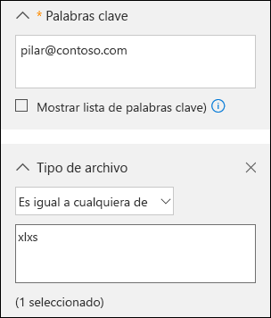
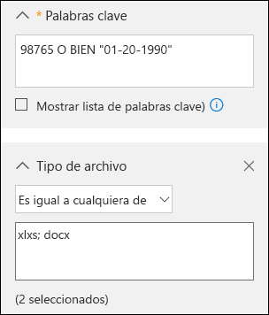
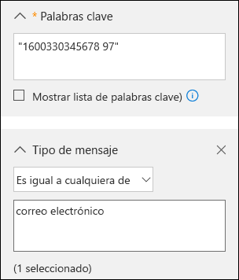

# <a name="office-365-data-subject-requests-for-the-gdpr-and-ccpa"></a>Solicitudes del interesado de Office 365 para el RGPD y la CCPA

## <a name="introduction-to-dsrs"></a>Introducción a las solicitudes del interesado

The European Union [General Data Protection Regulation (GDPR)](https://ec.europa.eu/justice/data-protection/reform/index_en.htm) gives rights to people (known in the regulation as *data subjects*) to manage the personal data that has been collected by an employer or other type of agency or organization (known as the *data controller* or just *controller*). Personal data is defined broadly under the GDPR as any data that relates to an identified or identifiable natural person. The GDPR gives data subjects specific rights to their personal data; these rights include obtaining copies of it, requesting changes to it, restricting the processing of it, deleting it, or receiving it in an electronic format so it can be moved to another controller. A formal request by a data subject to a controller to take an action on their personal data is called a *Data Subject Request* or DSR. The controller is obligated to promptly consider each DSR and provide a substantive response either by taking the requested action or by providing an explanation for why the DSR cannot be accommodated by the controller. A controller should consult with its own legal or compliance advisers regarding the proper disposition of any given DSR.

De forma similar, la Ley de Privacidad del Consumidor de California (CCPA, por sus siglas en inglés), ofrece derechos y obligaciones de privacidad a los consumidores de California, incluyendo derechos similares a los Derechos del Interesado de GDPR, como el derecho de eliminar, acceder y recibir (portabilidad) su información personal. La CCPA también prevé casos de divulgación de información, protecciones contra la discriminación en el ejercicio de derechos y requisitos de "cancelación/suscripción" para ciertas transferencias de datos clasificadas como "ventas". Las ventas se definen de forma amplia para incluir el uso compartido de datos con ánimo de lucro. Para obtener más información sobre la CCPA, consulte la [Ley de Privacidad de los Consumidores California](offering-ccpa.md) y las [Preguntas más frecuentes sobre la privacidad del consumidor de California](ccpa-faq.md).

En esta guía, se explica cómo usar los productos, servicios y herramientas administrativas de Office 365 para ayudarle a encontrar datos e información personales y actuar en base a ellos, con el fin de responder a solicitudes de interesados: En concreto, esto incluye cómo encontrar y acceder a los datos e información personales que residen en la nube de Microsoft y actuar en base a ellos. Este es un breve resumen de los procesos descritos en esta guía:

- **Búsqueda**: use herramientas de búsqueda y detección para encontrar más fácilmente los datos personales que pueden ser objeto de una solicitud de DSR. Una vez recopilados los documentos de respuesta, puede realizar una o varias de las acciones de DSR siguientes para responder a la solicitud. También puede determinar que la solicitud no cumple con las directrices de la organización para responder a las solicitudes de sujeto de datos.
- **Acceso:** recupere datos personales que residan en la nube de Microsoft y, si se le pide, realice una copia para proporcionársela al titular de los datos.
- **Rectificación:** realice cambios o implemente otras acciones solicitadas en los datos personales, si corresponde.
- **Restricción:** restrinja el tratamiento de datos personales, ya sea al quitar las licencias de distintos servicios de la nube de Microsoft o al desactivar los servicios que quiera, siempre que sea posible. También puede quitar datos de la nube de Microsoft y conservarlos de manera local o en otra ubicación.
- **Eliminación:** elimine de forma permanente los datos personales que residen en la nube de Microsoft.
- **Exportar o recibir (portabilidad):** envíe una copia electrónica (en un formato legible por máquina) de datos o información personal al titular de los datos. La información personal bajo la CCPA es cualquier información relacionada con una persona identificada o identificable. No hay distinción entre los roles privados, públicos o laborales de una persona. La definición de la CCPA de la "información personal" es a grandes rasgos similar a la que el RGPD hace de los "datos personales". Sin embargo, la CCPA también incluye datos domésticos y familiares. Para obtener más información sobre la CCPA, consulte la [Ley de Privacidad de los Consumidores California](offering-ccpa.md) y las [Preguntas más frecuentes sobre la privacidad del consumidor de California](ccpa-faq.md).

### <a name="terminology"></a>Terminología

A continuación se ofrecen definiciones de términos relacionados con el RGPD.

- **Poseedor:** la persona física o jurídica, entidad pública, agencia u organismo que, solo o junto a otras personas, determina los fines y los medios del procesamiento de datos personales; donde los fines y los medios de dicho procesamiento están determinados por la ley de la Unión Europea o de los Estados miembros, el poseedor o los criterios específicos para su designación pueden estar proporcionados por la ley de la Unión Europea o de los Estados miembros.
- **Datos personales y titular de los datos:** cualquier información sobre una persona física identificada o identificable ("interesado"); una persona física identificable es una que puede identificarse, directa o indirectamente, especialmente en referencia a un identificador, con un nombre, un número de identificación, datos de ubicación, un identificador en línea o uno o más factores específicos físicos, fisiológicos, genéticos, mentales, económicos, culturales o de identidad social de esa persona física.
- **Procesador:** persona física o jurídica, entidad pública, agencia u otro organismo que procesa datos personales en nombre del poseedor.
- **Datos de cliente:** todos los datos, incluidos todos los archivos de texto, sonido, vídeo o imagen, y software, proporcionados a Microsoft por un cliente o en su representación mediante el uso del servicio empresarial. Los datos del cliente incluyen tanto (1) información de identificación de los usuarios finales (por ejemplo, nombres de usuario e información de contacto en Azure Active Directory) como contenido del cliente que un cliente carga o crea en servicios específicos (por ejemplo, el contenido del cliente en un documento de Word o Excel, o en el texto de un mensaje de correo electrónico en Exchange Online; el contenido del cliente agregado a un sitio de SharePoint Online, o guardado en una cuenta de OneDrive para la Empresa).
- **Registros generados por el sistema:** registros y datos relacionados generados por Microsoft que ayudan a Microsoft a proporcionar servicios empresariales a los usuarios. Los registros generados por el sistema contienen principalmente datos pseudonimizados, como identificadores únicos (por lo general, un número generado por el sistema que se usa para ofrecer los servicios a los usuarios, pero no puede identificar a un individuo). Los registros generados por el sistema también pueden contener información identificable sobre los usuarios finales, como un nombre de usuario.

### <a name="how-to-use-this-guide"></a>Uso de esta guía

Para ayudarle a buscar información relevante a su caso de uso, esta guía está dividida en cuatro partes.

- **[Parte 1: Responder a solicitudes del interesado sobre datos del cliente](#part-1-responding-to-dsrs-for-customer-data):** *los datos del cliente* son datos que se producen y almacenan en Office 365 durante las operaciones cotidianas de su negocio. Algunos ejemplos de las aplicaciones de Office 365 más usadas que le permiten crear y editar datos son Word, Excel, PowerPoint, Outlook y OneNote. Office 365 también consta de aplicaciones como SharePoint Online, Teams y Forms que le permiten colaborar con otros usuarios. En la parte 1 de esta guía se explica cómo detectar, tener acceso a, rectificar, restringir, eliminar y exportar datos desde las aplicaciones de Office 365 que se han utilizado para crearlos y almacenarlos en servicios online de Office 365. Aborda productos y servicios en los que Microsoft actúa como encargado de los datos de la organización y, por tanto, se pone la funcionalidad de solicitudes del interesado a disposición del administrador del espacio empresarial.
- **[Parte 2: Responder a solicitudes del interesado con respecto a la información generada por Office 365](#part-2-responding-to-dsrs-with-respect-to-insights-generated-by-office-365):** Office 365 proporciona cierta información a través de servicios como Delve, MyAnalytics y Workplace Analytics. En la parte 2 de esta guía se explica cómo se genera esta información y cómo responder a las solicitudes del interesado relacionadas con ella.
- **[Parte 3: Responder a solicitudes de interesado sobre registros generados por el sistema](#part-3-responding-to-dsrs-for-system-generated-logs):** cuando usa servicios de Office 365 Enterprise, Microsoft genera información como registros de servicio que registran el uso o el rendimiento de las características de los servicios en línea. La mayoría de los datos de servicio generados contienen identificadores anónimos generados por Microsoft y por ello a esta categoría se la denomina *registros generado por el sistema* en este documento. Aunque estos datos no pueden atribuirse a un interesado específico sin el uso de información adicional, algunos pueden ser considerados personales dentro de la definición del RGPD de "datos personales". La parte 3 de esta guía trata acerca de cómo acceder a, eliminar y exportar registros generados por el sistema.
- **[Parte 4: Recursos adicionales para ayudarle con las solicitudes del interesado](#part-4-additional-resources-to-assist-you-with-dsrs):** en la parte 4 de esta guía aparecen escenarios limitados en los que Microsoft es el responsable de los datos cuando se usan determinados servicios y productos de Office 365.

>[!NOTE]
>In most cases, when users in your organization use Microsoft Office 365 products and services, you are the data controller and Microsoft is the processor. As a data controller, you are responsible for responding to the data subject directly. To assist you with this, Parts 1-3 of this guide detail the technical capabilities available to your organization to respond to a DSR request. In some limited scenarios, however, Microsoft will be the data controller when people use certain Office 365 products and services. In these cases, the information in Part 4 provides guidance on how data subjects can submit DSR requests to Microsoft.

### <a name="office-365-national-clouds"></a>Nubes nacionales de Office 365

The Microsoft Office 365 services are also available in the following national cloud environments: [Office 365 Germany](https://docs.microsoft.com/microsoft-365/admin/admin-overview/learn-about-office-365-germany), [Office 365 operated by 21Vianet (China)](https://docs.microsoft.com/microsoft-365/admin/services-in-china/services-in-china), and [Office 365 US Government](https://www.microsoft.com/microsoft-365/government/compare-office-365-government-plans). Most of the guidance for managing data subject requests described in this document applies to these national cloud environments. However, due to the isolated nature of these environments, there are some exceptions. Where notable for a given subsection, these exceptions are called out in a corresponding note.

### <a name="hybrid-deployments"></a>Implementaciones híbridas

Your organization may consist of Microsoft offerings that are a combination of cloud-based services and on-premises server products. In general, a hybrid deployment is typically the sharing of user accounts (identity management) and resources (such as mailboxes, web sites, and data) that exist in the cloud and on-premises. Common hybrid scenarios include:

- Implementaciones híbridas de Exchange, en la que algunos usuarios tienen un buzón local y otros tienen buzones de Exchange Online.
- Implementaciones híbridas de SharePoint, en las que los servidores de archivos y del sitio son locales y las cuentas de OneDrive para la Empresa están en Office 365.
- El sistema de administración de identidades local (Active Directory) que se sincroniza con Azure Activity Directory, que es el servicio de directorio subyacente en Office 365.

When responding to a DSR request, you may have to determine if data that's responsive to a DSR request is in the Microsoft cloud or in your on-premise organization, and then take the appropriate steps to respond to that request. The Office 365 Data Subject Request Guide (this guide) provides guidance for responding to cloud-based data. For guidance for data in your on-premises organization, see [GDPR for Office on-premises Servers](https://docs.microsoft.com/Office365/Enterprise/gdpr-for-office-servers).

## <a name="part-1-responding-to-dsrs-for-customer-data"></a>Parte 1: Responder a solicitudes del interesado sobre datos del cliente

Las instrucciones para responder a las solicitudes de interesado de los datos de clientes se dividen en las cuatro secciones siguientes:

- [Usar la herramienta Búsqueda de contenido eDiscovery para responder a las solicitudes de interesado](#using-the-content-search-ediscovery-tool-to-respond-to-dsrs)
- [Usar una función integrada en la aplicación para responder a las solicitudes de interesado](#using-in-app-functionality-to-respond-to-dsrs)
- [Responder a solicitudes de interesado de corrección](#responding-to-dsr-rectification-requests)
- [Responder a solicitudes  de DSR](#responding-to-dsr-restriction-requests)

### <a name="how-to-determine-the-office-365-applications-that-may-be-in-scope-for-a-dsr-for-customer-data"></a>Cómo determinar las aplicaciones de Office 365 que pueden estar en el ámbito de una solicitud de datos de interesado de datos de clientes

Para que le resulte más fácil determinar dónde buscar datos personales, le será útil identificar las aplicaciones de Office 365 que las personas de su organización pueden usar para crear y almacenar datos en Office 365. Esto limitará las aplicaciones de Office 365 que deba considerar para una DSR y le ayudará a determinar cómo buscar y tener acceso a los datos personales relacionados con una DSR. Además, esto determina si puede usar la herramienta de Búsqueda de contenido o si tendrá que usar la función de búsqueda de la aplicación en la que se crearon los datos.

A quick way to identify the Office 365 applications that people in your organization are using to create Customer Data is to determine which applications are included in your organization's Microsoft 365 for business subscription. To do this, you can access user accounts in the Office 365 admin portal and look at the product licensing information. See [Assign licenses to users](../admin/manage/assign-licenses-to-users.md).

## <a name="using-the-content-search-ediscovery-tool-to-respond-to-dsrs"></a>Usar la herramienta Búsqueda de contenido eDiscovery para responder a solicitudes del interesado

When looking for personal data within the larger set of data your organization creates and stores using in Office 365, you may want to first consider which applications people have most likely used to author the data you're looking for. Microsoft estimates that over 90% of an organization's data that is stored in Office 365 is authored in Word, Excel, PowerPoint, OneNote, and Outlook. Documents authored in these Office applications, even if purchased through Microsoft 365 Apps for enterprise or an Office perpetual license, are most likely stored on a SharePoint Online site, in a user's OneDrive for Business account, or in a user's Exchange Online mailbox. That means you can use the Content Search eDiscovery tool to search (and perform other DSR-related actions) across SharePoint Online sites, OneDrive for Business accounts, and Exchange Online mailboxes (including the sites and mailboxes associated with Microsoft 365 Groups, Microsoft Teams, EDU Assignments) to find documents and mailbox items that may be relevant to the DSR you're investigating. You can also use the Content Search tool to discover Customer Data authored in other Office 365 applications.

En la tabla siguiente se enumeran las aplicaciones de Office 365 que usan los usuarios para crear contenido ellos mismos y que puede detectarse con la Búsqueda de contenido. Esta sección de la guía DSR ofrece instrucciones sobre cómo descubrir, obtener acceso, exportar y eliminar datos creados con estas aplicaciones de Office 365.

***Tabla 1: Aplicaciones en las que se puede usar la Búsqueda de contenido para buscar datos de clientes***

| | |
| :---: | :---:|
 <br> Calendario |  <br> SharePoint  |
|  <br> Excel |  <br> Skype Empresarial |
|  <br> Office Lens |  <br> Tareas |
|  <br> OneDrive para la Empresa | <br> Teams |
|  <br> OneNote|  <br> Acciones que realizar |
|  <br> Outlook/Exchange |  <br> Vídeo |
|  <br> Contactos |  <br> Visio |
|  <br> PowerPoint |  <br> Word
||

>[!NOTE]
>The Content Search eDiscovery tool is not available in [Office 365 operated by 21Vianet (China)](https://docs.microsoft.com/microsoft-365/admin/services-in-china/services-in-china). This means you won't able to use this tool to search for and export Customer Data in the Office 365 applications shown in Table 1. However, you can use the In-Place eDiscovery tool in Exchange Online to search for content in user mailboxes. You can also use the eDiscovery Center in SharePoint Online to search for content in SharePoint sites and OneDrive accounts. Alternatively, you can ask a document owner to help you find and make changes or deletions to content or export it if necessary. For more information, see:</br><br> * [Crear una búsqueda de eDiscovery local](https://docs.microsoft.com/exchange/create-in-place-ediscovery-search-exchange-2013-help)<br> * [Configurar un Centro de eDiscovery en SharePoint Online](https://support.office.com/article/Set-up-an-eDiscovery-Center-in-SharePoint-Online-A18F8975-AA7F-43B4-A7D6-001D14744D8E)

### <a name="using-content-search-to-find-personal-data"></a>Usar la Búsqueda de contenido para buscar datos personales

El primer paso para responder a una solicitud de derechos del interesado es buscar los datos de cliente que sean el objeto del DSR. Con este fin puede usar las herramientas de eDiscovery de Office 365 para buscar datos personales (entre todos los datos de la organización en Office 365) o ir directamente a la aplicación nativa en la que se crearon los datos. Este primer paso (buscar y revisar los datos personales que sean objeto de la solicitud) le permitirá determinar si el DSR cumple con los requisitos de la organización para aceptarlo o rechazarlo. Por ejemplo, después de encontrar y revisar los datos personales, puede determinar que la solicitud no cumple los requisitos de su organización porque al llevarse a cabo puede afectar negativamente los derechos y libertades de terceros, o porque los datos personales se incluyen en un registro de la empresa que tiene un derecho legítimo para conservarlos.

As previously stated, Microsoft estimates that over 90% of an organization's data is created with Office applications, such as Word and Excel. This means that you can use the Content Search in the Security & Compliance Center to search for most DSR-related data.

This guide assumes that you or the person searching for personal data that may be responsive to a DSR request is familiar with or has experience using the Content Search tool in the Security & Compliance Center. For general guidance on using Content Search, see [Content Search in Office 365](https://docs.microsoft.com/microsoft-365/compliance/content-search). Be sure that the person running the searches has been assigned the necessary permissions in the Security & Compliance Center. This person should be added as a member of the eDiscovery Manager role group in the Security & Compliance Center; see [Assign eDiscovery permissions in the Security & Compliance Center](https://docs.microsoft.com/microsoft-365/compliance/assign-ediscovery-permissions). Consider adding other people in your organization who are involved in investigating DSRs to the eDiscovery Manager role group, so they can perform the necessary actions in the Content Search tool such as previewing and exporting search results. However, unless you set up compliance boundaries (as described [here](#set-up-compliance-boundaries-to-limit-the-scope-of-content-searches)) be aware that an eDiscovery Manager can search all content locations in your organization, including ones that may not be related to a DSR investigation.

Después de encontrar los datos, puede realizar la acción específica para satisfacer la solicitud del interesado.

>[!NOTE]
>En Office 365 Alemania, el Centro de seguridad y cumplimiento se encuentra en https://protection.office.de.

#### <a name="searching-content-locations"></a>Buscar ubicaciones de contenido

Puede buscar los siguientes tipos de ubicaciones de contenido con la herramienta de búsqueda de contenido.

- Buzones de correo de Exchange Online. Esto incluye aquellos asociados con Grupos de Microsoft 365 y Microsoft Teams
- Carpetas públicas de Exchange Online
- Sitios de SharePoint Online. Esto incluye los sitios asociados con Grupos de Microsoft 365 y Microsoft Teams
- Cuentas de OneDrive para la Empresa

>[!NOTE]
>This guide assumes that all data that might be relevant to a DSR investigation is stored in Office 365; in other words, stored in the Microsoft cloud. Data stored on a user's local computer or on-premises on your organization's file servers is outside the scope of a DSR investigation for data stored in Office 365. For guidance about responding to DSR requests for data in on-premises organizations, see [GDPR for Office on-premises Servers](https://docs.microsoft.com/Office365/Enterprise/gdpr-for-office-servers).

#### <a name="tips-for-searching-content-locations"></a>Sugerencias para la búsqueda de ubicaciones de contenido

- Empiece por buscar todas las ubicaciones de contenido de la organización (lo que puede hacerse en una sola búsqueda) para determinar con rapidez qué ubicaciones de contenido contienen elementos que coinciden con la consulta. Después, puede volver a ejecutar la búsqueda y restringir el ámbito a las ubicaciones específicas que contienen elementos relevantes.
- Use search statistics to identify the top locations that contain items that match your search query. See [View keyword statistics for Content Search results](https://docs.microsoft.com/microsoft-365/compliance/view-keyword-statistics-for-content-search).
- En el registro de auditoría, busque la actividad reciente que el usuario al que se somete el DSR ha realizado en archivos y carpetas. La búsqueda en el registro de auditoría devuelve una lista de registros que contienen el nombre y la ubicación de los recursos con los que ha interactuado recientemente el usuario. Puede usar esta información para crear una consulta de búsqueda de contenido. Vea [Buscar el registro de auditoría en el Centro de seguridad y cumplimiento](https://docs.microsoft.com/microsoft-365/compliance/search-the-audit-log-in-security-and-compliance).

#### <a name="building-search-queries-to-find-personal-data"></a>Generar consultas de búsqueda para encontrar datos personales

Es probable que la DSR que investiga contenga identificadores que pueda usar en la consulta de búsqueda de palabras clave para buscar datos personales. Estos son algunos identificadores habituales que se pueden usar en una consulta de búsqueda de datos personales:

- Dirección de correo electrónico o el alias
- Número de teléfono
- Dirección de correo
- Número de id. de empleado
- Número de identificación nacional o versión de miembro de la UE del número de la Seguridad Social.

Es probable que la DSR que investiga tenga un identificador y otros detalles sobre los datos personales solicitados que puede usar en una consulta de búsqueda.

Es probable que si busca solo una dirección de correo electrónico o un id. de empleado reciba demasiados resultados. Para restringir el ámbito de la búsqueda a un contenido más relevante para el DSR, puede agregar condiciones a la consulta de búsqueda. Cuando se agrega una condición, la palabra clave y la condición de búsqueda quedan unidas lógicamente por el operador booleano **AND**. Es decir, la búsqueda solo devolverá los elementos en los que coincidan la palabra clave *Y* la condición.

The following table lists some conditions you can use to narrow the scope of a search. The table also lists the values that you can use for each condition to search for specific document types and mailbox items.

***Tabla 2: Limitar el ámbito de búsqueda mediante el uso de condiciones***

||||
| :--- | :--- |:--- |
|**Condición**|**Descripción** |**Ejemplo de valores de condición**|
| Tipo de archivo | La extensión de un documento o archivo. Use esta condición para buscar documentos de Office y archivos creados por aplicaciones de Office 365. Use esta condición al buscar documentos en sitios de SharePoint Online y en cuentas de OneDrive para la empresa.<br/>La propiedad correspondiente del documento es el tipo de archivo. <br/>Para obtener una lista completa de extensiones de archivo que puede buscar, consulte Extensiones de nombre de archivo y tipos de archivos analizados predeterminados en SharePoint(https://technet.microsoft.com/library/jj219530.aspx).|&nbsp;&bull;&nbsp;&nbsp;csv: busca archivos con valores separados por coma (CSV); Los archivos de Excel se pueden guardar en formato CSV y un archivo CSV puede importarse fácilmente a Excel<br><br>&bull;&nbsp;&nbsp;docx: busca archivos de Word <br><br>&bull;&nbsp;&nbsp;mpp: busca archivos de Project <br/><br>&bull;&nbsp;&nbsp;one: busca archivos de OneNote <br><br>&bull;&nbsp;&nbsp;pdf: busca archivos guardados en formato PDF <br><br>&bull;&nbsp;&nbsp;pptx: busca archivos de PowerPoint <br><br>&bull;&nbsp;&nbsp;xlxs: busca archivos de Excel <br><br>&bull;&nbsp;&nbsp;vsd: busca archivos de Visio <br><br>&bull;&nbsp;&nbsp;wmv: busca archivos de vídeo de Windows Media <br>|
| Tipo de mensaje | El tipo de mensaje de correo electrónico a buscar. Use esta condición para buscar en los buzones contactos (Personas), reuniones (Calendario) o conversaciones de Skype empresarial. La propiedad de correo electrónico correspondiente es *kind*.|&bull;&nbsp;&nbsp;*contactos: busca en la lista de Mis contactos (Personas) de un buzón <br><br>&bull;&nbsp;&nbsp;* correo electrónico: busca mensajes de correo electrónico <br><br>&bull;&nbsp;&nbsp;*im: realiza búsquedas en las conversaciones de Skype Empresarial<br><br>&bull;&nbsp;&nbsp;* reuniones: busca citas y solicitudes de reunión (Calendario). <br><br>&bull;&nbsp;&nbsp;*tareas: busca en la lista de Mis tareas (Tareas); usar este valor también devolverá las tareas creadas en Microsoft To-Do.<br>|
| Etiqueta de cumplimiento |The label assigned to an email message or a document. Labels are used to classify email and documents for data governance and enforce retention rules based on the classification defined by the label. Use this condition to search for items that have been automatically or manually assigned a label.<br/>This is a useful condition for DSR investigations because your organization may be using labels to classify content related to data privacy or that contains personal data or sensitive information. See the "Using Content Search to find all content with a specific label applied to it" section in [Overview of labels in Office 365.](https://docs.microsoft.com/microsoft-365/compliance/labels)|compliancetag="datos personales"|
||||

There are many more email and document properties and search conditions that you can use to build more complex search queries. See the following sections in the [Keyword queries and search conditions for Content Search](https://docs.microsoft.com/microsoft-365/compliance/keyword-queries-and-search-conditions) help topic for more information.

- [Propiedades del correo electrónico que permiten búsquedas](https://docs.microsoft.com/microsoft-365/compliance/keyword-queries-and-search-conditions)
- [Propiedades de sitio (documento ) que se pueden buscar](https://docs.microsoft.com/microsoft-365/compliance/keyword-queries-and-search-conditions)
- [Condiciones de búsqueda](https://docs.microsoft.com/microsoft-365/compliance/keyword-queries-and-search-conditions)

#### <a name="searching-for-personal-data-in-sharepoint-lists-discussions-and-forms"></a>Buscar datos personales en discusiones, formularios y listas de SharePoint

In addition to searching for personal data in documents, you can also use Content Search to search for other types of data that's created by using native SharePoint Online apps. This includes data created by using SharePoint lists, discussions, and forms. When you run a Content Search and search SharePoint Online sites (or OneDrive for Business accounts) data from lists, discussions, and forms that match the search criteria will be returned in the search results.

##### <a name="examples-of-search-queries"></a>Ejemplo de consultas de búsqueda

Estos son algunos ejemplos de consultas de búsqueda que usan palabras clave y condiciones para buscar datos personales en respuesta a un DSR. En los ejemplos puede ver dos versiones de la consulta: una en la que se muestra la sintaxis de las palabras clave (donde se incluye la condición en el cuadro de palabras clave) y otra en la que se muestra la versión basada en la interfaz gráfica de la consulta con condiciones.

##### <a name="example-1"></a>Ejemplo 1

Este ejemplo devuelve archivos de Excel ubicados en sitios de SharePoint Online y cuentas de OneDrive para la Empresa que contienen la dirección de correo del empleado especificado. La búsqueda también puede devolver archivos si la dirección de correo electrónico aparece en los metadatos del archivo.

***Sintaxis de palabras clave***

```Query
pilar@contoso.com AND filetype="xlxs"
```

***GUI***



##### <a name="example-2"></a>Ejemplo 2

Este ejemplo devuelve archivos de Excel o Word ubicados en sitios de SharePoint Online y cuentas de OneDrive para la Empresa que contienen el id. o la fecha de nacimiento del empleado especificado.

(98765 OR "20-01-1990") AND (filetype="xlxs" OR filetype="docx")

***GUI***



##### <a name="example-3"></a>Ejemplo 3

Este ejemplo devuelve mensajes de correo electrónico que contienen el número de identificación especificado, que en este caso es un número de la Seguridad Social de Francia (INSEE)

```Query
"1600330345678 97" AND kind="email"
```

***GUI***



#### <a name="working-with-partially-indexed-items-in-content-search"></a>Trabajar con elementos parcialmente indizados en la búsqueda de contenido

Los elementos indexados parcialmente (también denominados *elementos sin indexar*) son elementos del buzón de Exchange Online y documentos en sitios de SharePoint Online y OneDrive para la Empresa que, por algún motivo, no se indexaron para búsquedas, lo que significa que no aparecen en la Búsqueda de contenido. La mayoría de los mensajes de correo electrónico y documentos del sitio se indexan correctamente porque se encuentran dentro de los [límites de indexación de Office 365](https://docs.microsoft.com/microsoft-365/compliance/limits-for-content-search). Las razones por las que los mensajes de correo electrónico o los archivos no están indexados para la búsqueda son:

- El tipo de archivo [no se admite o está deshabilitado para la indexación](https://docs.microsoft.com/microsoft-365/compliance/partially-indexed-items-in-content-search). El tipo de archivo sí se admite para indexación, pero se produce un error de indexación en un archivo específico.
- Los mensajes de correo electrónico tienen un archivo adjunto sin un identificador válido, como un archivo de imagen (esta es la causa más común de que un elemento de correo electrónico esté parcialmente indizado).
- Los archivos adjuntos a los mensajes de correo electrónico son demasiado grandes o numerosos.

We recommend that you learn more about partially indexed items so that you can work with them when responding to DSR requests. For more information, see:

- [Elementos parcialmente indizados en la búsqueda de contenido en Office 365](https://docs.microsoft.com/microsoft-365/compliance/partially-indexed-items-in-content-search)
- [Investigar elementos indizados parcialmente en eDiscovery de Office 365](https://docs.microsoft.com/microsoft-365/compliance/investigating-partially-indexed-items-in-ediscovery)
- [Exportar elementos sin indexar](export-search-results.md)

#### <a name="tips-for-working-with-partially-indexed-items"></a>Sugerencias para trabajar con elementos indizados parcialmente

It's possible that data responsive to a DSR investigation may be in a partially indexed item. Here's some suggestions for working with partially indexed items:

- Después de ejecutar una búsqueda, el número de elementos parcialmente estimados se mostrará en las estadísticas de búsqueda. En esta estimación no se incluyen elementos parcialmente indexados en SharePoint Online y OneDrive para la Empresa. Exporte los informes de búsqueda de contenido para obtener información acerca de los elementos indexados parcialmente. El informe **Unindexed Items.csv** contiene información sobre los elementos sin indexar, incluida la ubicación del elemento, la dirección URL si el elemento está en SharePoint Online o OneDrive para la empresa, y la línea de asunto (para los mensajes) o el nombre del documento. Para obtener más información, vea [Exportar resultados de búsqueda de contenido](https://docs.microsoft.com/microsoft-365/compliance/export-a-content-search-report).

- Las estadísticas y la lista de elementos parcialmente indizados devueltos con los resultados de una búsqueda de contenido son todos los elementos parcialmente indizados de las ubicaciones de contenido que se buscan.

- Para recuperar elementos parcialmente indizados que pueden estar relacionados con una investigación de solicitud de interesado, puede realizar una de las siguientes acciones:

##### <a name="export-all-partially-indexed-items"></a>Exportar todos los elementos parcialmente indexados

Exporte los resultados de una búsqueda de contenido y los elementos indexados parcialmente de la ubicación de contenido que se ha buscado. También puede exportar solo los elementos parcialmente indexados. Después, puede abrirlos en su aplicación nativa y revisar el contenido. Debe usar esta opción para exportar elementos de SharePoint Online y OneDrive para la empresa. Consulte [Exportar resultados de búsqueda desde el Centro de seguridad y cumplimiento](export-search-results.md).

##### <a name="export-a-specific-set-of-partially-indexed-items-from-mailboxes"></a>Exportar un conjunto específico de elementos parcialmente indexados de buzones

En lugar de exportar todos los elementos de buzón parcialmente indexados de una búsqueda, puede volver a ejecutar una búsqueda de contenido para buscar una lista específica de elementos parcialmente indexados y, a continuación, exportarlos. Solo puede hacer esto para los elementos del buzón de correo. Consulte [Preparar un archivo CSV para una búsqueda de contenido de destino en Office 365](https://docs.microsoft.com/microsoft-365/compliance/csv-file-for-an-id-list-content-search).

### <a name="next-steps"></a>Siguientes pasos

Cuando encuentre los datos personales relevantes para el DSR, asegúrese de conservar la búsqueda de contenido específica que utilizó para encontrar los datos. Es probable que vuelva a usar esta búsqueda para completar otros pasos en el proceso de respuesta al DSR, como [obtener una copia del mismo](#providing-a-copy-of-personal-data), [exportarlo](#exporting-personal-data) o [eliminarlo de forma permanente](#deleting-personal-data).

### <a name="additional-considerations-for-selected-applications"></a>Consideraciones adicionales para aplicaciones seleccionadas

Las siguientes secciones describen factores que debe tener en cuenta a la hora de buscar datos en las aplicaciones de Office 365 siguientes.

- [Office Lens](#office-lens)
- [Configuración de la experiencia de OneDrive para la Empresa y SharePoint](#onedrive-for-business-and-sharepoint-online-experience-settings)
- [Microsoft Teams para educación](#microsoft-teams-for-education)
- [Microsoft To Do](#microsoft-to-do)
- [Skype Empresarial](#skype-for-business)

#### <a name="office-lens"></a>Office Lens

Una persona que usa Office Lens (una aplicación para cámara compatible con dispositivos en iOS, Android y Windows) puede tomar una imagen de pizarras, documentos impresos, tarjetas de presentación y otras cosas que contengan una gran cantidad de texto. Office Lens usa una tecnología de reconocimiento óptico de caracteres que extrae el texto de una imagen y la guarda en un documento de Office, (como Word, PowerPoint o OneNote) o en un archivo PDF. Los usuarios pueden entonces cargar el archivo que contiene el texto de la imagen en su cuenta de OneDrive para la empresa en Office 365. Esto significa que puede usar la herramienta de Búsqueda de contenido para buscar, obtener acceso, eliminar y exportar datos de archivos que se han creado a partir de una imagen de Office Lens. Para obtener más información acerca de Office Lens, vea:

- [Office Lens para iOS](https://support.microsoft.com/es-ES/office/microsoft-office-lens-for-ios-fbdca5f4-1b1b-4391-a931-dc1c2582397b)
- [Office Lens para Android](https://support.office.com/article/Office-Lens-for-Android-ec124207-0049-4201-afaf-b5874a8e6f2b)
- [Office Lens para Windows](https://support.microsoft.com/es-ES/office/office-lens-for-windows-577ec09d-8da2-4029-8bb7-12f8114f472a)

#### <a name="onedrive-for-business-and-sharepoint-online-experience-settings"></a>Configuración de la experiencia de OneDrive para la Empresa y SharePoint Online

In addition to user-created files stored in OneDrive for Business accounts and SharePoint Online sites, these services store information about the user that is used to enable various experiences. Users still in your organization can access much of this information by using in-product functionality. The following information provides guidance on how to access, view, and export OneDrive for Business and SharePoint Online application data.

##### <a name="sharepoint-user-profiles"></a>Perfiles de usuario de SharePoint

El perfil de usuario de Delve permite a los usuarios mantener propiedades almacenadas en el perfil de usuario de SharePoint Online, como, por ejemplo, la fecha de nacimiento, el número de teléfono móvil (y otra información de contacto), la información biográfica, los proyectos, las aptitudes y los conocimientos, la educación y los centros educativos, los intereses y las aficiones.

###### <a name="end-users"></a>Usuarios finales

End users can discover, access, and rectify SharePoint Online user profile data using the Delve profile experience. See [View and update your profile in Office Delve](https://support.office.com/article/view-and-update-your-profile-in-office-delve-4e84343b-eedf-45a1-aeb9-8627ccca14ba) for more details.

Otra forma de que los usuarios tengan acceso a sus datos de perfil de SharePoint consiste en navegar a la **página de edición de perfil** de su cuenta OneDrive para la Empresa, a la que se puede acceder dirigiéndose a la ruta de acceso **EditProfile.aspx** en la dirección URL de la cuenta de OneDrive para la Empresa. Por ejemplo, para un usuario <strong>user1@contoso.com</strong>, la cuenta de OneDrive para la empresa del usuario se encuentra en:

```URL
`https://contoso-my.sharepoint.com/personal/user1\_contoso\_com/\_layouts/15/OneDrive.aspx`
```

La dirección URL de la página de edición de perfil sería:

```URL
`https://contoso-my.sharepoint.com/personal/user1\_contoso\_com/\_layouts/15/EditProfile.aspx`
```

Las propiedades con origen en Azure Active Directory no se pueden cambiar en SharePoint Online. Sin embargo, los usuarios pueden ir a la página de su **Cuenta** seleccionando su **foto** en el encabezado de Office 365 y, a continuación, seleccionando **Mi cuenta**. Para cambiar las propiedades desde aquí es posible que los administradores deban explicar a los usuarios cómo descubrir, tener acceso o rectificar una propiedad de Perfil de usuario.

###### <a name="admins"></a>Administradores

Un administrador puede rectificar y tener acceso a las propiedades de perfil en el centro de administración de SharePoint. En el **Centro de administración de SharePoint**, haga clic en la pestaña **perfiles de usuario**. Luego, haga clic en **Administrar perfiles de usuario**, escriba un nombre de usuario y, después, haga clic en buscar. El administrador puede hacer clic con el botón derecho en cualquier usuario y seleccionar **Editar mi perfil**. Las propiedades con origen en Azure Active Directory no se pueden cambiar en SharePoint Online.

An admin can export all User Profile properties for a user by using the **Export-SPOUserProfile** cmdlet in SharePoint Online PowerShell. See  [Export-SPOUserProfile](https://docs.microsoft.com/powershell/module/sharepoint-online/export-spouserprofile?view=sharepoint-ps).

Para más información sobre los perfiles de usuario, vea [Administrar perfiles de usuario en el Centro de administración de SharePoint](https://docs.microsoft.com/sharepoint/manage-user-profiles).

##### <a name="user-information-list-on-sharepoint-online-sites"></a>Lista de información del usuario en sitios de SharePoint Online

Un subconjunto de un perfil de usuario de SharePoint se sincroniza con la lista de información de usuario de todos los sitios a los que visite o a los que tiene permisos de acceso. Esto es útil para las experiencias de SharePoint Online, como las columnas de Personas en las bibliotecas de documentos, para mostrar información básica sobre el usuario como el nombre del creador de un documento. Los datos de una lista de información de usuario coinciden con la información almacenada en el perfil de usuario de SharePoint y se corregirán automáticamente si se cambia la fuente de los datos. Los datos de los usuarios eliminados se conservan en los sitios en los que interactúan, con el fin de preservar la integridad de las referencias de los campos de columna de SharePoint. 

Admins can control which properties are replicable inside the SharePoint admin center. To do this:

1. Vaya al **Centro de administración de SharePoint** y haga clic en la pestaña **Perfiles de usuario**.
2. Haga clic en **Administrar propiedades de usuario** para ver una lista de propiedades.
3. Haga clic con el botón derecho en una propiedad y seleccione **Editar** para ajustar diversos valores.
4. En **Configuración de directiva**, la propiedad replicable controla si la propiedad se representará en la lista de información del usuario. No todas las propiedades son compatibles con ello.

An admin can export all User information properties for a user on a given site by using the **Export-SPOUserInfo** cmdlet in SharePoint Online PowerShell. See [Export-SPOUserInfo](https://docs.microsoft.com/powershell/module/sharepoint-online/export-spouserinfo?view=sharepoint-ps).

##### <a name="onedrive-for-business-experience-settings"></a>Configuración de la experiencia de OneDrive para la Empresa

A user's OneDrive for Business experience stores information to help the user find and navigate content of interest to them. Most of this information can be accessed by end users using in-product features. An admin can export the information using a [PowerShell Script](https://docs.microsoft.com/powershell/scripting/overview) and [SharePoint Client-Side Object Model (CSOM)](https://docs.microsoft.com/sharepoint/dev/sp-add-ins/complete-basic-operations-using-sharepoint-client-library-code) commands.

Vea [Exportar la configuración de la experiencia de OneDrive para la Empresa](https://docs.microsoft.com/sharepoint/export-odfb-lists) para más información sobre la configuración, cómo se almacena y cómo se exporta.

##### <a name="onedrive-for-business-and-sharepoint-online-search"></a>Búsqueda de OneDrive para la Empresa y SharePoint Online

The in-app search experience in OneDrive for Business and SharePoint Online stores a user's search queries for 30 days to increase relevance of search results. An admin can export search queries for a user by using the **Export-SPOQueryLogs** cmdlet in SharePoint Online PowerShell. See [Export-SPOQueryLogs](https://docs.microsoft.com/powershell/module/sharepoint-online/export-spoquerylogs?view=sharepoint-ps).

#### <a name="microsoft-teams-for-education"></a>Microsoft Teams para educación

Microsoft Teams for Education offers two additional collaboration features that teachers and students can use that creates and stores personal data: Assignments and OneNote Class Notebook. You can use Content Search to discover data in both.

##### <a name="assignments"></a>Tareas

Students files associated with an Assignment are stored in a document library in the corresponding Teams SharePoint Online site. IT admins can use the Content Search tool to search for student files that are related to assignments. For example, an admin could search all SharePoint Online sites in the organization and use the student's name and class or assignment name in the search query to find data relevant to a DSR.

There's other data related to Assignments that isn't stored in the class team SharePoint Online site, which means it's not discoverable with Content Search. This includes:

- Archivos que el profesor asigna a los estudiantes como parte de la tarea.
- Las calificaciones de los alumnos y los comentarios del profesor.
- La lista de documentos enviados para una tarea por cada alumno.
- Metadatos de tarea

Para este tipo de datos, un administrador de TI o propietario de los datos (como un profesor) puede que tenga que ir a la tarea en el equipo de clase para encontrar los datos relevantes a una solicitud de interesado.

##### <a name="onenote-class-notebook"></a>Bloc de notas de clase de OneNote

The OneNote Class Notebook is stored in the class team SharePoint Online site. Every student in a class has a private notebook that's shared with the teacher. There's also a content library where a teacher can share documents with students, and a collaboration space for all students in the class. Data related to these capabilities is discoverable with Content Search.

Aquí tiene las instrucciones específicas para buscar un bloc de notas de clase.

1. Ejecute una búsqueda de contenido con los criterios de búsqueda siguientes:

   - Buscar todos los sitios de SharePoint Online

   - Incluya el nombre del equipo de clase como palabra clave de búsqueda; por ejemplo, "Biología 9C".

2. Obtenga una vista previa de los resultados y busque el elemento correspondiente al Bloc de notas de clase.
3. Select that item, and then copy the folder path that's displayed in the details pane. This is the root folder for the Class Notebook.
4. Edit the search that you created in step 1 and replace the class name in the keyword query with the folder path of the Class Notebook and precede the folder path with the **path** site property; for example, **path:"<https://contosoedu.onmicrosoft.com/sites/9C> Biology/SiteAssets/9C Biology Notebook/"**. Be sure to include the quotation marks and the trailing forward slash.
5. Agregue una condición de búsqueda, seleccione la condición de tipo de archivo y use una para el valor del tipo de archivo. Esto devuelve todos los archivos de OneNote en los resultados de búsqueda. La sintaxis de la palabra clave resultante tendría un aspecto similar a este:[](#building-search-queries-to-find-personal-data)

    ```Query
   path:"<https://contosoedu.onmicrosoft.com/sites/9C> Biology/SiteAssets/9C Biology Notebook/" AND filetype="one"
   ```

6.  Vuelva a ejecutar la búsqueda de contenido. Los resultados de búsqueda deben incluir todos los archivos de OneNote del Bloc de notas de clase del equipo de clase.

#### <a name="microsoft-to-do"></a>Microsoft To Do

Las *tareas*, que se guardan en las *listas de tareas pendientes* en Microsoft To Do se guardan como tareas en el buzón de correo electrónico del usuario de Exchange Online. Esto significa que puede usar la herramienta de búsqueda de contenido para localizar, acceder, borrar y exportar cosas que hacer. Para obtener más información, consulte [Configurar Microsoft To Do](https://support.microsoft.com/es-ES/office/set-up-microsoft-to-do-490c1a8c-2333-4952-8125-841afadb9620).

#### <a name="skype-for-business"></a>Skype Empresarial

A continuación se muestra información adicional acerca de cómo acceder a datos personales, verlos y exportarlos en Skype Empresarial.

- Files attached to a meeting are retained in the actual meeting for 180 days and then become inaccessible. These files can be accessed by meeting participants by joining the meeting from the meeting request and then viewing or downloading the attached file. See the "Use the attachments in the meeting" section in [Preload attachments for a Skype for Business meeting](https://support.microsoft.com/es-ES/office/preload-attachments-for-a-skype-for-business-meeting-fd3d9f9d-b448-4754-b813-02e49393f251).
- Conversations in Skype for Business are retained in the Conversation History folder in user mailboxes. You can use Content Search to search mailboxes for data in Skype conversations.
- A data subject can export their contacts in Skype for Business. To do this, they would right-click a contact group in Skype for Business and click **Copy**. Then they can paste the list of email addresses into a text or Word document.
- If the Exchange Online mailbox of a meeting participant is placed on Litigation Hold or assigned to an Office 365 retention policy, files attached to a meeting are retained in the participants mailbox. You can use Content Search to search for those files in the participant's mailbox if the retention period for the file has not expired. For more information about retaining files, see [Retaining large files attached to a Skype for Business meeting](https://docs.microsoft.com/skypeforbusiness/set-up-policies-in-your-organization/retaining-large-files-attached-to-a-meeting).

## <a name="providing-a-copy-of-personal-data"></a>Proporcionar una copia de los datos personales

After you've found personal data that is potentially responsive to a DSR, it's up to you and your organization to decide which data to provide the data subject. For example, you can provide them with a copy of the actual document, an appropriately redacted version, or a screenshot of the portions that you've deemed appropriate to share. For each of these responses to an access request, you'll have to retrieve a copy of the document or other item that contains the responsive data.

Al proporcionar una copia al interesado, deberá quitar o censurar información personal sobre otros interesados, además de la información confidencial.

### <a name="using-content-search-to-get-a-copy-of-personal-data"></a>Usar la Búsqueda de contenido para obtener una copia de datos personales

Hay dos formas de usar la herramienta de búsqueda de contenido para obtener una copia de un documento o elemento de buzón que haya encontrado después de ejecutar una búsqueda.

- Preview the search results and then download a copy of the document or item. This is a good way to download a few items or files.
- Exporte los resultados de búsqueda y, después, descargue una copia de todos los elementos devueltos por la búsqueda. Este método es más complejo, pero es una forma útil de descargar una gran cantidad de elementos que responden al DSR. Cuando exporta los resultados de búsqueda también recibe informes útiles. Puede usar estos informes para obtener más información sobre cada elemento. El informe **Results.csv** es útil porque contiene una gran cantidad de información acerca de los elementos exportados, como la ubicación exacta del elemento (por ejemplo, el buzón para los mensajes de correo electrónico o la dirección URL de los documentos o listas en SharePoint Online y OneDrive para la empresa). Esta información le ayuda a identificar al propietario del elemento, en caso de que tenga que ponerse en contacto con él durante el proceso de investigación del DSR. Para obtener más información sobre los informes que se incluyen al exportar resultados de búsqueda, vea [Exportar un informe de búsqueda de contenido](https://docs.microsoft.com/microsoft-365/compliance/export-a-content-search-report).

#### <a name="preview-and-download-items"></a>Vista previa y descarga de elementos

Cuando ejecute una búsqueda nueva o abra una búsqueda existente, puede previsualizar cada elemento que coincida con la búsqueda para comprobar si está relacionado con la DSR que investiga. Esto también incluye las listas de SharePoint y páginas web que aparezcan en los resultados de la búsqueda. También puede descargar el archivo original, si debe ofrecérselo al interesado. En ambos casos, puede hacer una captura de pantalla para satisfacer la solicitud de información del interesado.

No se puede obtener una vista previa de algunos tipos de elementos. Si la vista previa no es compatible con un tipo de archivo o elemento, tiene la opción de descargar dicho elemento de forma individual en un equipo local o una unidad de red u otra ubicación de red. Solo puede obtener una vista previa de los [tipos de archivo admitidos](https://docs.microsoft.com/microsoft-365/compliance/content-search).

Para obtener una vista previa y descargar elementos:

1. Abra la búsqueda de contenido en el Centro de seguridad y cumplimiento.
2. Si no se muestran los resultados, haga clic en **Vista previa de los resultados**.
3. Haga clic en un elemento para verlo.
4. Click **Download original file** to download the item to your local computer. You'll also have to download items that can't be previewed.

Para obtener más información sobre cómo obtener una vista previa de resultados de búsqueda, vea [Vista previa de los resultados de búsqueda](https://docs.microsoft.com/microsoft-365/compliance/content-search).

#### <a name="export-and-download-items"></a>Exportar y descargar elementos

You can also export the results of a content search to get a copy of email messages, documents, lists, and web pages containing the personal data, though this method is more involved than previewing items. See the next section for details about [exporting the results of a Content Search](#export-and-download-content-using-content-search).

## <a name="exporting-personal-data"></a>Exportar datos personales

The "right of data portability" allows a data subject to request an electronic copy of personal data that's in a "structured, commonly used, machine-readable format", and to request that your organization transmit these electronic files to another data controller. Microsoft supports this right in two ways:

- Ofreciendo aplicaciones de Office 365 que guardan datos en formato electrónico nativo, legible por máquina y de uso común. Si quiere informarse de los formatos de archivo de Office, consulte [Formatos de archivo de Office: documentos técnicos](https://msdn.microsoft.com/library/office/cc313105(v=office.12).aspx).
- Permitiendo a su organización exportar datos en el formato de archivo nativo o en un formato (como CSV, TXT y JSON) que puede importarse con facilidad a otra aplicación.

Para cumplir una solicitud de interesado de exportación, puede exportar documentos de Office en su formato de archivo nativo y exportar datos de otras aplicaciones de Office 365.

### <a name="export-and-download-content-using-content-search"></a>Exportar y descargar contenido mediante la búsqueda de contenido

When you export the results of a Content Search, email items can be downloaded as PST files or as individual messages (.msg files). When you export documents and lists from SharePoint Online and OneDrive for Business sites, copies in the native file formats are exported. For example, SharePoint lists are exported as CSV files and Web pages are exported as .aspx or html files.

>[!NOTE]
>Exportar elementos de buzón de un buzón de usuario mediante la búsqueda de contenido requiere que el usuario (de cuyo buzón va a exportar elementos) tenga asignada una licencia de Exchange Online Plan 2. 

Para exportar y descargar elementos:

1. Abra la búsqueda de contenido en el Centro de seguridad y cumplimiento.
2. En la página de búsqueda, haga clic en  **Más** y, a continuación, en **Exportar resultados**. También puede exportar un informe.
3. Complete the sections on the **Export results** fly out page. Be sure to use the scroll bar to view all export options.
4. Vuelva a la página de búsqueda de contenido en el centro de cumplimiento y seguridad y haga clic en la pestaña **Exportar**.
5. Haga clic en **Actualizar** para actualizar la página.
6. En la columna **Nombre**, haga clic en el trabajo de exportación que creó. El nombre de la tarea de exportación es el nombre de la búsqueda de contenido adjunta con **\_Exportar**.
7. En la página de Exportar, bajo **Exportar llave**, **haga clic en Copiar al portapapeles**. Usará esta clave para descargar los resultados de la búsqueda en el paso 10.
8. En la parte superior de la página, haga clic en  **Descargar resultados**.
9. Si se le pide que instale la **Herramienta de exportación de eDiscovery de Microsoft Office 365**, haga clic en **Instalar**.
10. En la **Herramienta de exportación de eDiscovery **, pegue la clave de exportación que ha copiado en el paso 7 en el cuadro correspondiente.
11. Haga clic en **Examinar** para especificar la ubicación en la que desea descargar los archivos de los resultados de la búsqueda.
12. Haga clic en **Iniciar** para descargar los resultados de la búsqueda en el equipo.

When the export process is complete, you can access the files in the location on your local computer where they were downloaded. Results of a content search are downloaded to a folder named after the Content Search. Documents from sites are copied to a subfolder named **SharePoint**. Mailbox items are copied to subfolder named **Exchange**.

Consulte [Exportar resultados de búsqueda desde el Centro de seguridad y cumplimiento](export-search-results.md) para obtener instrucciones detalladas paso a paso.

### <a name="downloading-documents-and-lists-from-sharepoint-online-and-onedrive-for-business"></a>Descargar documentos y listas de SharePoint Online y OneDrive para la Empresa

Another way to export data from SharePoint Online and OneDrive for Business is to download documents and lists directly from a SharePoint Online site or a OneDrive for Business account. You would have to get assigned the permissions to access a site, and then go to the site and download the contents. See:

- [Descargar archivos y carpetas de OneDrive o SharePoint](https://support.office.com/article/download-files-and-folders-from-onedrive-or-sharepoint-5c7397b7-19c7-4893-84fe-d02e8fa5df05)
- [Exportar listas de SharePoint a Excel](https://support.office.com/article/export-to-excel-from-sharepoint-bfb2ea48-6118-4fa9-abb6-cced9424e5d9)

For some DSR export requests, you may want to allow the data subject to download content themselves. This enables the data subject to go to a SharePoint Online site or shared folder and click **Sync** to sync all contents in the document library or selected folders. See:

- [Permitir a los usuarios sincronizar archivos de SharePoint con el nuevo cliente de sincronización de OneDrive](https://docs.microsoft.com/sharepoint/let-users-use-new-onedrive-sync-client)
- [Sincronizar archivos de SharePoint con el nuevo cliente de sincronización de OneDrive](https://support.office.com/article/sync-sharepoint-files-with-the-new-onedrive-sync-client-6de9ede8-5b6e-4503-80b2-6190f3354a88)

## <a name="deleting-personal-data"></a>Eliminar datos personales

El “derecho a la eliminación” de datos personales de los datos de clientes de una organización es una protección clave en el RGPD. La eliminación de datos incluye documentos o archivos completos, o bien datos específicos un documento o archivo (lo que sería una acción y proceso como aquellos descritos en la sección Rectificar de esta guía).

Cuando investiga o se prepara para eliminar datos personales en respuesta a una solicitud de derechos del interesado, es importante tener en cuenta varios factores para comprender cómo funciona la eliminación (y retención) de datos en Office 365.

- **Eliminación temporal y eliminación definitiva**: en servicios de Office 365 como Exchange Online, SharePoint Online y OneDrive para la Empresa existe el concepto de *eliminación temporal* y *eliminación definitiva*, relacionado con la recuperación de un elemento eliminado (normalmente durante un tiempo limitado) antes de que se elimine permanentemente de la nube de Microsoft sin posibilidad de recuperación. En este contexto, se puede recuperar un elemento tras su eliminación temporal por parte de un usuario o administrador durante un período de tiempo antes de ser eliminado permanentemente. Cuando un elemento ha sido eliminado permanentemente, se marca para su eliminación permanente y se purga cuando lo procesa el servicio de Office 365 correspondiente. Aquí se indica cómo se desarrolla la eliminación temporal y la eliminación definitiva para elementos en buzones de correo y sitios (independientemente de si el elemento es eliminado por el propietario de los datos o por un administrador):

    - **Buzones de correo:** la eliminación temporal de un elemento se realiza cuando se elimina de la carpeta Elementos Eliminados o cuando un usuario elimina un elemento presionando **Mayús + Supr**. Tras la eliminación temporal de un elemento, este se mueve a la carpeta Elementos Recuperables del buzón de correo. En este momento, el elemento puede ser recuperado por el usuario antes de que expire el período de retención de elementos eliminados (en Office 365, el período de retención de elementos eliminados es de 14 días, pero un administrador puede extenderlo hasta 30 días). Cuando expira el período de retención, el elemento es eliminado permanentemente y se mueve a una carpeta oculta (denominada carpeta *Purgas*). El elemento se eliminará permanentemente (purgado) de Office 365 la próxima vez que se procese el buzón de correo (los buzones se procesan una vez cada 7 días).

    - **Sitios de SharePoint Online y OneDrive para la Empresa**: cuando un archivo o documento se elimina, este se mueve a la Papelera de reciclaje del sitio (también denominada *Papelera de reciclaje de primer nivel*, que es similar a la Papelera de reciclaje de Windows). El elemento permanece en la Papelera de reciclaje durante 93 días (el período de retención de elementos eliminados para sitios en Office 365). Transcurrido ese período, el elemento se mueve automáticamente a la Papelera de reciclaje de la colección de sitios, que también se denomina la *Papelera de reciclaje de segundo nivel*. (Tenga en cuenta que los usuarios o administradores, con los permisos adecuados, pueden eliminar elementos de la Papelera de reciclaje de primer nivel). En este momento, el elemento se encuentra en eliminación blanda; aún puede ser recuperado por el usuario o administrador de SharePoint Online o por un administrador de colección de sitios de OneDrive para la Empresa). Cuando se elimina un elemento de la Papelera de reciclaje de segundo nivel (manual o automáticamente) queda eliminado permanentemente y no es accesible para el usuario o administrador. Existe un período de retención de 93 días para las papeleras de reciclaje del primer nivel y del segundo nivel. Esto significa que la retención de la Papelera de reciclaje de segundo nivel se inicia cuando el elemento se elimina en primer lugar. Por lo tanto, el tiempo de retención máximo total es de 93 días para ambas papeleras de reciclaje.

>[!NOTE]
>Comprender las acciones que dan lugar a la eliminación temporal o definitiva de este debate le ayudará a determinar cómo eliminar datos de forma que reúna los requisitos RGPD y responda a los requisitos de RGPD al responder a una solicitud de eliminación.

- **Directivas y suspensiones legales:** Office 365 permite dejar «en espera» buzones y sitios. Si un buzón o un sitio está en espera, esto significa que no se elimina nada de forma permanente hasta que finalice el período de espera del elemento o hasta que se elimine la espera. Esto es importante en el contexto de eliminar el contenido de un cliente en respuesta a un DSR: si un elemento se elimina de forma permanente de una ubicación en espera, el elemento no se eliminará permanentemente de Office 365. Por lo tanto, es posible que un administrador de TI pueda recuperarlo. Si su organización tiene un requisito o directiva según la cual los datos se eliminan de forma permanente y no se pueden recuperar en Office 365 como respuesta a un DSR, entonces debe quitar la espera de un buzón o un sitio para eliminar de forma permanente los datos en Office 365. Es probable que las directrices de respuesta a las DSR de su organización incluyan un proceso para determinar qué tiene prioridad: una solicitud de eliminación específica de un DSR o una situación de espera por razones legales. Usted puede quitar una espera para eliminar elementos específicos y, tras eliminarlos, volver a implementarla.

### <a name="deleting-documents-in-sharepoint-online-and-onedrive-for-business"></a>Eliminar documentos en SharePoint Online y OneDrive para la Empresa

Cuando haya encontrado el documento en un sitio de SharePoint Online o en una cuenta de OneDrive para la Empresa (al seguir la guía en la sección Detectar) que debe eliminarse, un agente de privacidad de datos o un administrador de TI necesitaría tener asignados los diferentes permisos para acceder al sitio y eliminar el documento. Si es necesario, también puede solicitar al propietario del documento que elimine el documento.

Este es el proceso general para eliminar documentos de sitios.

1. Vaya al sitio y busque el documento.
2. Delete the document. When you delete a document from a site, it's sent to the first-stage Recycle Bin.
3. Go to the first-stage Recycle Bin (the site Recycle Bin) and delete the same document you deleted in the previous step. The document is sent to the second-stage Recycle Bin. **At this point, the document is soft-deleted**.
4. Go to the second-stage Recycle Bin (which is the site collection Recycle Bin) and delete the same document that you deleted from the first-stage Recycle Bin. **At this point, the document is hard-deleted.**

>[!IMPORTANT]
>You can't delete a document that is located on a site that is on hold (with one of the retention or legal hold features in Office 365). In the case where a DSR delete request takes precedence over a legal hold, the hold would have to be removed from the site before a document could be permanently deleted.

Vea los temas siguientes para obtener procedimientos detallados.

- [Eliminar un archivo, carpeta o vínculo de una biblioteca de documentos de SharePoint](https://support.microsoft.com/es-ES/office/delete-a-file-folder-or-link-from-a-sharepoint-document-library-71f3c90a-0d24-4d80-8b66-f88234b79a52)
- [Eliminar elementos o vaciar la papelera de reciclaje de un sitio de SharePoint](https://support.microsoft.com/es-ES/office/delete-items-or-empty-the-recycle-bin-of-a-sharepoint-site-2e713599-d13e-40d6-96dc-66f0a366f74e)
- [Eliminar elementos de la papelera de reciclaje de la colección de sitios](https://support.microsoft.com/es-ES/office/delete-items-from-the-site-collection-recycle-bin-dd5c00c2-aef6-4458-9d04-80b185077653)
- La sección "Obtener acceso a los documentos de OneDrive para la Empresa" en [Obtener acceso a los datos de un antiguo usuario y realizar una copia de seguridad](https://docs.microsoft.com/microsoft-365/admin/add-users/get-access-to-and-back-up-a-former-user-s-data).
- [Eliminar archivos o carpetas en OneDrive para la Empresa](https://support.office.com/article/Delete-files-or-folders-in-OneDrive-21fe345a-e488-4fa7-932b-f053c1bebe8a)
- [Eliminar una lista de SharePoint](https://support.microsoft.com/es-ES/office/delete-a-list-in-sharepoint-2a7bca5b-b8fd-4e5b-8f4b-2ac034f3070d)
- [Eliminar elementos de lista en SharePoint Online](https://support.office.com/article/delete-list-items-in-sharepoint-online-db722233-4a38-4889-a6cf-4b33fe5c60c0)

### <a name="deleting-a-sharepoint-site"></a>Eliminar un sitio de SharePoint

You may determine that the best way to respond to a DSR delete request is to delete an entire SharePoint site, which will delete all that data located in the site. You can do this by running cmdlets in SharePoint Online PowerShell.

- Use el cmdlet [Remove-SPOSite](https://docs.microsoft.com/powershell/module/sharepoint-online/remove-sposite?view=sharepoint-ps) para eliminar el sitio y enviarlo a la Papelera de reciclaje de SharePoint Online (eliminación temporal).
- Use los cmdlet [Remove-SPODeletedsite](https://docs.microsoft.com/powershell/module/sharepoint-online/remove-spodeletedsite?view=sharepoint-ps) para eliminar de forma permanente el sitio.

No puede eliminar un sitio en espera de eDiscovery o que esté asignado a una directiva de retención. Debe quitar los sitios de una espera de eDiscovery o una directiva de retención para poder eliminarlos.

### <a name="deleting-a-onedrive-for-business-site"></a>Eliminar un sitio de OneDrive para la Empresa.

Similarly, you may determine to delete a user's OneDrive for Business site in response to a DSR deletion request. If you delete the user's Office 365 account, their OneDrive for Business site is retained (and restorable) for 30 days. After 30 days, it's moved to the SharePoint Online Recycle Bin (soft-deleted), and then after 93 days, it's permanently deleted (hard-deleted). To accelerate this process, you can use the [Remove-SPOSite](https://docs.microsoft.com/powershell/module/sharepoint-online/remove-sposite?view=sharepoint-ps) cmdlet to move the OneDrive for Business site to the Recycle Bin and then use the [Remove-SPODeletedSite](https://docs.microsoft.com/powershell/module/sharepoint-online/remove-spodeletedsite?view=sharepoint-ps) cmdlet to permanently delete it. As with sites in SharePoint Online, you can't delete a user's OneDrive for Business site if it was assigned to an eDiscovery hold or a retention policy before the user's account was deleted.

### <a name="deleting-onedrive-for-business-and-sharepoint-online-experience-settings"></a>Eliminar la configuración de la experiencia de OneDrive para la Empresa y SharePoint

Además de los archivos creados por usuarios almacenados en las cuentas de OneDrive para la Empresa y los sitios de SharePoint Online, estos servicios almacenan información acerca del usuario que se utiliza para habilitar varias experiencias. Se han documentado anteriormente en este documento. Consulte las [Consideraciones adicionales para aplicaciones seleccionadas](#additional-considerations-for-selected-applications) en la sección [Usar la herramienta de búsqueda de contenido eDiscovery para responder a solicitudes de interesado](#using-the-content-search-ediscovery-tool-to-respond-to-dsrs) para obtener información sobre cómo acceder, ver y exportar datos de aplicación de OneDrive para la Empresa y SharePoint Online.

#### <a name="deleting-a-sharepoint-user-profile"></a>Eliminar un perfil de usuario de SharePoint

The SharePoint user profile will be permanently deleted 30 days after the user account is deleted in Azure Active Directory. However, you can hard-delete the user account, which will remove the SharePoint user profile. For more information, see the [Deleting a user section in this guide](#deleting-a-user).

An admin can expedite the deletion of the User Profile for a user by using the **Remove-SPOUserProfile** cmdlet in SharePoint Online PowerShell. See [Remove-SPOUserProfile](https://docs.microsoft.com/powershell/module/sharepoint-online/remove-spouserprofile?view=sharepoint-ps). This requires the user to be at least soft-deleted in Azure Active Directory.

#### <a name="deleting-user-information-lists-on-sharepoint-online-sites"></a>Eliminar listas de información del usuario en sitios de SharePoint Online

For users that have left the organization, this data remains in the sites they interacted with for referential integrity of SharePoint column fields. An admin can delete all User information properties for a user on a given site by using the **Remove-SPOUserInfo** command in SharePoint Online PowerShell. See [Remove-SPOUserInfo](https://docs.microsoft.com/powershell/module/sharepoint-online/remove-spouserinfo?view=sharepoint-ps) for information about running this PowerShell cmdlet.

De forma predeterminada, este comando retendrá el nombre de usuario y eliminará propiedades como número de teléfono, dirección de correo, aptitudes y experiencia, u otras propiedades copiadas del perfil de usuario de SharePoint Online. Un administrador puede usar el parámetro **RedactUser** para especificar un nombre de usuario alternativo para mostrar en la lista de información del usuario. Esto afecta de varias maneras a la experiencia del usuario y provocará la pérdida de información en el historial de archivos del sitio.

Finally, the redaction capability will not remove all metadata or content referencing a user from documents. The way to achieve redaction of file content and metadata is described in the [Making changes to content in OneDrive for Business and SharePoint Online](#making-changes-to-content-in-onedrive-for-business-and-sharepoint-online) section in this guide. This method consists of downloading, deleting, and then uploading a redacted copy of the file.

#### <a name="deleting-onedrive-for-business-experience-settings"></a>Eliminar la configuración de la experiencia de OneDrive para la Empresa

The recommended way to delete all OneDrive for Business experience settings and information is to remove the user's OneDrive for Business site, after reassigning any retained files to other users. An admin can delete these lists using [PowerShell Script](https://docs.microsoft.com/powershell/scripting/overview) and [SharePoint Client-Side Object Model (CSOM)](https://docs.microsoft.com/sharepoint/dev/sp-add-ins/complete-basic-operations-using-sharepoint-client-library-code) commands. See [Deleting OneDrive for Business experience settings](https://docs.microsoft.com/sharepoint/delete-odfb-lists) for more information about the settings, how they are stored, and how to delete them.

#### <a name="onedrive-for-business-and-sharepoint-online-search-queries"></a>Consultas de búsqueda de OneDrive para la Empresa y SharePoint Online

Las consultas de búsqueda de un usuario creadas en la experiencia de búsqueda de OneDrive para la Empresa y SharePoint Online se eliminan automáticamente 30 días después de que el usuario haya creado la consulta.

### <a name="deleting-items-in-exchange-online-mailboxes"></a>Eliminar elementos en buzones de Exchange Online

Es posible que tenga que eliminar elementos de los buzones de Exchange Online para satisfacer una solicitud de eliminación DSR. Hay dos formas en las que un administrador de TI puede eliminar elementos del buzón de correo, en función de si elimina el producto de forma permanente o temporal. Al igual que ocurre con los documentos de los sitios de SharePoint Online o OneDrive para la Empresa, los elementos de un buzón en espera no se pueden eliminar definitivamente de Office 365. Para poder borrar el elemento hay que quitar la espera. De nuevo, tendrá que determinar qué tiene prioridad: la espera en el buzón o la solicitud de eliminación DSR.

#### <a name="soft-delete-mailbox-items"></a>Eliminar temporalmente elementos del buzón

Puede usar la función de la Acción de búsqueda de contenido para eliminar temporalmente los elementos que devuelva una búsqueda de contenido. Como hemos indicado antes, los elementos temporalmente eliminados se mueven a la carpeta Elementos recuperables del buzón de correo.

Aquí presentamos una introducción rápida sobre este proceso:

1. Cree y ejecute una Búsqueda de contenido para buscar los elementos que desea eliminar del buzón de correo del usuario. Es posible que tenga que volver a ejecutar la búsqueda para restringir los resultados, de forma que solo aparezcan los elementos que desea eliminar.
2. Use el comando **New-ComplianceSearchAction** **-Purge** de PowerShell de Office 365 para eliminar de forma temporal elementos que devuelve la búsqueda de contenido creada en el paso anterior.

Para obtener instrucciones detalladas, vea [Buscar y eliminar mensajes de correo electrónico en la organización](https://docs.microsoft.com/microsoft-365/compliance/search-for-and-delete-messages-in-your-organization).

#### <a name="hard-delete-mailbox-items"></a>Eliminar permanentemente elementos del buzón

If you have to hard-delete mailbox items in response to the DSR deletion request, you can use the **Search-Mailbox -DeleteContent** command in Exchange Online PowerShell. If you use this method, consider using Content Search to develop and refine a search query so that only the items that are to be deleted are returned in the search. Then you can use that query syntax when you run the **Search-Mailbox -DeleteContent** command.

Para obtener instrucciones detalladas, consulte [Buscar y eliminar mensajes](https://technet.microsoft.com/library/ff459253(v=exchg.150).aspx).

#### <a name="hard-delete-items-in-a-mailbox-on-hold"></a>Eliminar permanentemente elementos de un buzón retenidos

As previously explained, if you hard-delete items in a mailbox on hold, items are not removed from the mailbox. They are moved to a hidden folder in the Recoverable Items folder (the **Purges** folder) and will remain there until the hold duration for the item expires or until the hold is removed from the mailbox. If either of those things happen, the items will be purged from Office 365 the next time that the mailbox is processed.

Your organization might determine that items being permanently deleted when the hold duration expires meets the requirements for a DSR deletion request. However, if you determine that mailbox items must be immediately purged from Office 365, you would have to remove the hold from the mailbox and then hard-deleted the items from the mailbox. For detailed instructions, see [Delete items in the Recoverable Items folder of cloud-based mailboxes on hold](https://docs.microsoft.com/microsoft-365/compliance/delete-items-in-the-recoverable-items-folder-of-mailboxes-on-hold).

>[!NOTE]
>Para eliminar definitivamente elementos del buzón de correo para satisfacer la solicitud de interesado siguiendo el procedimiento del tema anterior, puede que tenga que eliminar temporalmente dichos elementos mientras el buzón de correo sigue retenido para poder moverlos a la carpeta Elementos recuperables.

## <a name="deleting-a-user"></a>Eliminar un usuario

In addition to deleting personal data in response to a DSR deletion request, a data subject's "right to be forgotten" may also be fulfilled by deleting their user account. Here are some reasons that you might want to delete a user:

- El interesado ha dejado (o está dejando) su organización.
- The data subject has requested that you delete system-generated logs that have been collected about them. Examples of data in system-generated logs include Office 365 app and service usage data, information about search requests performed by the data subject, and data generated by product and services as a product of system functionality and interaction by users or other systems. For more information, see [Part 3: Responding to DSRs for system-generated Logs](#part-3-responding-to-dsrs-for-system-generated-logs) in this guide.
- Evite que el interesado obtenga datos de acceso o procese datos en Office 365 de forma permanente (en lugar de una restricción temporal por el métodos descrito en la sección [Responder a solicitudes de interesado de restricción](#responding-to-dsr-restriction-requests).

Después de eliminar una cuenta de usuario:

- El usuario no podrá iniciar sesión en Office 365 ni obtener acceso a cualquiera de los recursos de Microsoft de su organización, como su cuenta de OneDrive para la Empresa, sitios de SharePoint Online y su buzón de Exchange Online.
- Se eliminan los datos personales, como la dirección de correo electrónico, el alias, el número de teléfono y la dirección postal asociados con la cuenta del usuario.
- Algunas aplicaciones de Office 365 eliminan información sobre el usuario. Por ejemplo, en Microsoft Flow, el usuario eliminado se elimina de la lista de propietarios para un flujo compartido.
- Los registros generados por el sistema sobre el interesado, con la excepción de los datos que pueden comprometer la seguridad o la estabilidad del servicio, se eliminarán 30 días después de que se elimine la cuenta de usuario. Para más información, vea la sección [Eliminar registros generados por el sistema](#deleting-system-generated-logs).

>[!IMPORTANT]
>After you delete a user account, that person will lose the ability to sign in to Office 365 and the ability to sign in to any products or services for which he or she formerly relied upon for a work or school account. That person would also be unable to initiate any DSR requests through Microsoft directly in instances where Microsoft is the data controller. For more information, see the [Product and services authenticated with an Org ID for which Microsoft is a data controller](#product-and-services-authenticated-with-an-org-id-for-which-microsoft-is-a-data-controller) section in Part 4 of this guide.

>[!NOTE]
>In the event that you are a customer currently engaged in FastTrack migrations, deleting the user account will not delete the data copy held by the Microsoft FastTrack team, which is held for the sole purpose of completing the migration. If, during the migration, you would like the Microsoft FastTrack team to also delete the data copy, you can [submit a request](https://go.microsoft.com/fwlink/?linkid=874544). In the ordinary course of business, Microsoft FastTrack will delete all data copies once the migration is complete.

Al igual que la eliminación temporal y la eliminación permanente de datos descritas en la sección anterior sobre el borrado de datos personales, también existe un estado de eliminación temporal y de eliminación permanente cuando se elimina una cuenta de usuario.

- Al eliminar una cuenta de usuario (eliminando al usuario en el centro de administrador y en Azure Portal), esta queda eliminada temporalmente y pasa a la Papelera de reciclaje en Azure durante un máximo de 30 días. En este momento, se puede restaurar la cuenta de usuario.
- If you permanently deleted the user account, the user account is hard-deleted and removed from the Recycle Bin in Azure. At this point, the user account can't be restored, and any data associated with the user account will be permanently removed from the Microsoft cloud. Hard-deleting an account deletes system-generated logs about the data subject, except for data that may compromise the security or stability of the service.

Este es el proceso de alto nivel para eliminar usuarios de su organización.

1. Vaya al Centro de administración de Azure Portal y encuentre al usuario.

2. Delete the user. When you initially delete the user, the user's account is sent to the Recycle Bin. At this point, the user is soft-deleted. The account is retained in the soft-deleted for 30 days, which allows you to restore the account. After 30 days, the account is automatically hard-deleted. For specific instructions, see [Delete users from Azure AD](https://docs.microsoft.com/azure/active-directory/add-users-azure-active-directory).<br><br> También puede eliminar temporalmente una cuenta de usuario en el centro de administración. Consulte [Elimine un usuario de su organización](https://docs.microsoft.com/microsoft-365/admin/add-users/delete-a-user).

3. Si no desea esperar 30 días hasta que se elimine permanentemente la cuenta de usuario, puede eliminarla permanente de forma manual. Para hacer esto en Azure Portal, vaya a la lista de Usuarios eliminados recientemente y elimine de forma permanente el usuario. A partir de entonces, el usuario quedará permanentemente eliminado. Para saber cómo hacerlo, consulte [Cómo eliminar permanentemente a un usuario recién eliminado](https://docs.microsoft.com/azure/active-directory/active-directory-users-restore).

No puede eliminar de forma permanente un usuario del Portal de administración de Office 365.

>[!NOTE]
>In Office 365 operated by 21Vianet (China), you can't permanently delete a user as previously described. To permanently delete a user, you can submit a request via the Office 365 admin portal at this [URL](https://portal.partner.microsoftonline.cn/AdminPortal/Home#/homepage). Go to **Commerce** and then select **Subscription** -> **Privacy** ->  **GDPR** and enter the required information.

### <a name="removing-exchange-online-data"></a>Quitar datos de Exchange Online

Un aspecto que debe tener en cuenta al eliminar un usuario es qué ocurre con el buzón de Exchange Online de este. Después de eliminar la cuenta de usuario permanentemente (el paso 3 del proceso anterior), el buzón del usuario eliminado no se purga automáticamente de Office 365. Tienen que pasar 60 días tras la eliminación permanente de la cuenta de usuario para poder eliminar su buzón definitivamente de Office 365. A continuación, puede ver el ciclo habitual del buzón de correo cuando se elimina la cuenta de usuario, junto con una descripción del estado de los datos del buzón durante ese tiempo:

- **Día 1 a día 30**: el buzón puede recuperarse completamente si se restaura la cuenta de usuario eliminada.
- **Día 31 a día 60**: 30 días después de que se haya eliminado permanentemente la cuenta de usuario, un administrador de su organización puede recuperar datos en el buzón de correo e importarlos a otros. Esto proporciona a las organizaciones la posibilidad de recuperar los datos del buzón si es necesario.
- **Día 61 a día 90**: un administrador ya no podrá recuperar los datos del buzón. Los datos del buzón se marcarán para su eliminación permanente y llevará 30 días más purgar los datos de Office 365.

Si decide que el ciclo de vida de este buzón no cumple los requisitos de su organización para responder a una solicitud de interesado de eliminación, también puede [ponerse en contacto con el Soporte técnico de Microsoft](https://support.microsoft.com/) *después* de haber eliminado definitivamente la cuenta de usuario y solicitar a Microsoft que inicie el proceso manual de eliminar los datos de buzón de forma permanente. Este proceso para eliminar de forma permanente los datos de los buzones comienza automáticamente el día 61 del ciclo, por lo que no necesita ponerse en contacto con Microsoft después de este punto del ciclo de vida.

## <a name="using-in-app-functionality-to-respond-to-dsrs"></a>Usar una función integrada en la aplicación para responder a las solicitudes de interesado

While most Customer Data is authored and produced using the applications described in the previous section, Office 365 also offers many other applications that customers can use to produce and store Customer Data. However, Content Search doesn't currently have the ability to find data authored in these other Office 365 applications. To find data generated by these applications, you or the data owner must use in-product functionality or features to find data that may be relevant to a DSR. The following table lists these Office 365 applications. Click the application icon to go the section in this guide that describes how to respond to DSR requests for data authored in the application.

***Tabla 3: Aplicaciones con funcionalidad integrada en la aplicación que puede usarse para buscar datos del cliente***

||||
|:-----:|:-----:|:-----:|:-----:|
|  <br> [Access](#access) |  <br> [Aplicaciones empresariales<br> para Office 365](#business-apps-for-office-365) |  <br> [Educación](#education)|
|  <br> [Flujo](#flow) |  <br> [Formularios](#forms) | <br> [Kaizala](#kaizala) |
|  <br> [Planificador](#planner) | <br> [Power Apps](#powerapps) | <br> [Power BI](#power-bi) |
| <br> [Proyecto](#project-online) | <br> [Publisher](#publisher) | <br> [Secuencia](#stream) | <br> [Sway](#sway) |  <br> [Pizarra](#whiteboard) |
| <br> [Yammer](#yammer) |
|||

### <a name="access"></a>Access

En las secciones siguientes se explica cómo usar la funcionalidad integrada en la aplicación en Microsoft Access para acceder a datos personales, buscarlos, exportarlos y eliminarlos.

##### <a name="discover"></a>Detectar

There are several ways that you can search for records in an Access database that might be responsive to a DSR request. For a DSR investigation, you can search for records that related to the data subject or search for records that contain specific data. For example, you could either search or go to a record that corresponds to the data subject. Or you can search for records that contain specific data, such as personal data about the data subject. For more information, see:

- [Buscar registros en una base de datos de Access](https://support.microsoft.com/es-ES/office/find-records-in-an-access-database-705220b7-0255-4ef9-9349-6bd7442d1b7e) 
- [Crear una consulta de selección simple](https://support.office.com/article/create-a-simple-select-query-de8b1c8d-14e9-4b25-8e22-70888d54de59)

##### <a name="access"></a>Access

After you find the records or fields that are relevant to the DSR request, you can take a screenshot of the data or export it to an Excel file, Word file, or a text file. You can also create and print a report based on a record source, or a select query that you created to find the data. See:

- [Introducción a los informes en Access](https://support.office.com/article/introduction-to-reports-in-access-e0869f59-7536-4d19-8e05-7158dcd3681c)
- [Exportar datos a Excel](https://support.office.com/article/export-data-to-excel-64e974e6-ae43-4301-a53e-20463655b1a9)
- [Exportar datos a un documento de Word](https://support.microsoft.com/es-ES/office/export-access-data-to-a-word-document-6e954c8e-2243-4cb9-8544-607e5b7bfc12)
- [Exportar datos a un archivo de texto](https://support.microsoft.com/es-ES/office/export-data-to-a-text-file-f72dfc38-a8a0-4c5b-8c2c-bf2950814140)

##### <a name="export"></a>Exportar

Como se ha explicado anteriormente, puede exportar datos de una base de datos de Access a diferentes formatos de archivo. El formato de archivo de exportación que elija podría depender de la solicitud de exportación del DSR específica del interesado. Vea [Importar y exportar](https://support.microsoft.com/es-ES/office/import-and-export-c060505b-d8ac-4499-8879-733e56c6106f) para una lista de temas que describen cómo exportar datos de Access en diferentes formatos de archivo.

##### <a name="delete"></a>Eliminar

Puede eliminar un registro completo o solo un campo de una base de datos de Access. La forma más rápida de eliminar un registro de una base de datos de Access es abrir la tabla en la vista Hoja de datos, seleccionar el registro (fila) o directamente los datos de un campo que desea eliminar y, a continuación, presionar la tecla Suprimir. También puede usar una consulta de selección que creó para buscar datos y, a continuación, convertirla en una consulta de eliminación. Vea:

- [Eliminar uno o varios registros de una base de datos](https://support.office.com/article/ways-to-add-edit-and-delete-records-5e90a80c-106d-4c55-996e-07d7200980ce)
- [Crear y ejecutar una consulta de eliminación](https://support.office.com/article/create-and-run-a-delete-query-6da65fe1-0fc7-4a64-8ef0-c052cd4c3ec5)

### <a name="business-apps-for-office-365"></a>Aplicaciones empresariales para Office 365

En esta sección se explica cómo usar la funcionalidad integrada en la aplicación en cada una de las siguientes aplicaciones empresariales para Office 365 para responder a solicitudes DSR.

- [Bookings](#bookings)
- [Listings](#listings)
- [Connections](#connections)
- [Outlook Customer Manager](#outlook-customer-manager)
- [Invoicing](#invoicing)

#### <a name="bookings"></a>Bookings

En las secciones siguientes se explica cómo usar la funcionalidad integrada en la aplicación en Microsoft Bookings para acceder a datos personales, buscarlos, exportarlos y eliminarlos. Esto sirve tanto para la aplicación Bookings independiente como para el acceso a Bookings desde Business Center.

Microsoft Bookings allows administrators and users or staff, with a Bookings license in their organization, to set up booking pages so customers can schedule and make changes to appointments, receive confirmation emails, updates, cancellation, and reminders email. Business owners and their staff can also book events on behalf of their customers with Bookings. 

Los clientes, los administradores o el personal crean los siguientes tipos de datos:

- **Información de contacto de clientes, asociados y amigos**: estos datos contienen el nombre, el número de teléfono, la dirección de correo electrónico, la dirección y notas.

    - Se pueden crear contactos manualmente para cualquier persona mediante los clientes de la web de Bookings, de iOS y de Android.
    
    - Se pueden importar contactos para cualquier persona desde un dispositivo móvil de C1 en Bookings con los clientes de Bookings, iOS y Android.
    
    - Los contactos también se crean automáticamente en el momento de la creación de la reserva a través del flujo de trabajo de reservas para cualquier persona con reserva, ya sea que la reserva la cree un usuario en nombre de un cliente o la cree el cliente a través de la página de reservas del propietario.

- **Eventos de reserva**: se trata de reuniones entre el propietario de la empresa o su personal designado y un cliente, creadas por el propietario de empresa o el cliente a través de la página pública de reservas del propietario de empresa. Los datos de estos eventos incluyen el nombre, la dirección, la dirección de correo electrónico, el número de teléfono y cualquier otra información que el propietario de empresa recopile del cliente en el momento de la reserva.

- **Confirmaciones, cancelaciones y actualizaciones por correo electrónico**: se trata de mensajes de correo electrónico generados y enviados por el sistema en asociación con determinados eventos de reserva. Contienen datos personales sobre el personal que está previsto que preste el servicio correspondiente y contienen datos personales sobre el cliente especificados por el propietario de empresa o el cliente en el momento de la reserva.

Todo el contenido de los clientes se almacena en el buzón de Exchange Online que hospeda la versión de Bookings de la organización. Este contenido se conserva siempre y cuando el propietario de la empresa y el cliente utilicen el servicio activamente, a menos que soliciten explícitamente que se eliminen los datos o que abandonen el servicio. Este contenido se puede eliminar desde la interfaz de usuario de un producto, con un cmdlet o a eliminando el buzón de Bookings relevante. Cuando se inicia la acción de eliminar, los datos se eliminan en el período de tiempo establecido por el propietario de la empresa. 

Si un cliente decide abandonar el servicio, se eliminará el contenido de su cliente después de 90 días. Para obtener más información sobre cuándo se elimina el contenido de un buzón después de eliminar una cuenta de usuario, vea [Eliminar datos de Exchange Online](#removing-exchange-online-data).

#### <a name="end-user-identifiable-information"></a>Información de identificación personal del usuario final

End user Identifiable Information (EUII) includes personal and contact information about the staff that gets scheduled in Bookings. It's added to the Staff details pages when the business owner sets up Bookings and makes updates after the setup. It contains staff member's name, initials, email address, and phone number. This data is stored in the Exchange Online mailbox that hosts Bookings.

This data is retained for as long as the staff member is active in the service unless it's explicitly deleted the business owner or an admin using the in-app UI or by deleting the relevant booking mailbox. When the admin initiates the deletion of staff's details, or if the staff member leaves the service, their details are deleted in accordance with the Exchange Online mailbox's content retention policies set by the business owner or admin.

##### <a name="discoveraccess"></a>Detectar y tener acceso

Bookings recopila y almacena los siguientes tipos de datos:

- **Información de perfil de empresa**: el contenido de cliente sobre la empresa que usa Bookings se recopila a través del formulario de información de la empresa de Bookings y, si el cliente utiliza Bookings junto con el Business Center, se sincroniza con el perfil de la empresa de Business Center. La única EUII asociada a estos datos es una dirección de correo electrónico de C1. Esta dirección es donde se envían las nuevas notificaciones de reserva y los correos electrónicos de actualización.
- **Contactos del cliente**: se pueden crear contactos manualmente mediante los clientes de la web de Bookings, de iOS y de Android o pueden importarse de un dispositivo móvil.  Los contactos se crean también automáticamente durante el uso de la página de reserva de autoservicio. Contienen EUII y se almacenan en el buzón de Bookings.
- **Detalles del personal**: el contenido del cliente incluye datos sobre el personal que es apto para prestar los servicios creados en clientes de la web de Bookings, de iOS y de Android. Los detalles del personal pueden contener el nombre, la dirección de correo electrónico y el número de teléfono.
- **Eventos de reserva**: se trata de reuniones con clientes y contenido de clientes relacionado que crea la empresa mediante un cliente web o una aplicación Android/iOS o que crea el cliente mediante una página pública de reservas (o una página de Facebook). Estos eventos pueden incluir el nombre, la dirección, la dirección de correo electrónico, el número de teléfono y detalles de la cita.
- **Cancelaciones y actualizaciones por correo electrónico y correos electrónicos de aviso**: se trata de mensajes de correo electrónico enviados por el sistema en asociación con las reservas. Contienen los datos del personal y los datos del cliente especificados en el momento de hacer la reserva.

##### <a name="export"></a>Exportar

To export data corresponding to the business owner, staff and customers, you can use the Business center privacy portal. See [Export or delete user data using Business center privacy portal](https://support.office.com/article/export-or-delete-user-data-using-business-center-privacy-portal-eb48e2c1-4c91-4421-988d-5de497d1e8d8).

##### <a name="delete"></a>Eliminar

Puede eliminar los siguientes tipos de datos de Bookings en respuesta a una solicitud de eliminación de DSR:

- **Información de perfil de empresa y contactos**: puede eliminar el buzón de Bookings en el Centro de administración. Después de eliminar el buzón, durante 30 días tiene la posibilidad de restaurarlo. Después de 30 días, la cuenta y el buzón correspondiente se eliminan permanentemente. Para obtener información detallada sobre cómo eliminar una cuenta de usuario, vea la sección [Eliminar un usuario](#deleting-a-user).
- **Detalles del personal**: puede eliminar personal desde el panel Bookings. Para eliminarlo definitivamente, puede eliminar su cuenta de Office 365.
- **Eventos de Bookings**: puede eliminar eventos de reserva del calendario de Bookings, lo que quitará la información del cliente.
- **Convocatorias de reuniones, confirmaciones, cancelaciones y actualizaciones por correo electrónico y correos electrónicos de aviso**: puede eliminar estos elementos del calendario de Bookings, lo que quitará la información del cliente.

Business owners and admins can also delete their customer's data by using the Business center privacy portal. See [Export or delete user data using Business center privacy portal](https://support.office.com/article/export-or-delete-user-data-using-business-center-privacy-portal-eb48e2c1-4c91-4421-988d-5de497d1e8d8).

Additionally, you can delete business owner and staff data, you can delete the corresponding user account. See the section  [Deleting a user](#deleting-a-user).

#### <a name="listings"></a>Listings

En las secciones siguientes se explica cómo usar la funcionalidad integrada en la aplicación en Microsoft Listings para acceder a datos personales, buscarlos, exportarlos y eliminarlos.

##### <a name="discover"></a>Detectar

El propietario de Listings puede conectar su empresa con Google, Bing, Yelp y Facebook para ver una vista agregada de valoraciones y opiniones. Listings recopila y almacena los siguientes tipos de datos:

- Valoraciones y opiniones de Google
- Valoraciones y opiniones de Bing
- Valoraciones y opiniones de Yelp
- Valoraciones y opiniones de Facebook

##### <a name="access"></a>Acceso
Los propietarios de Listings pueden iniciar sesión en el panel Listings para ver las opiniones y valoraciones que han recibido.

##### <a name="export"></a>Exportar

To export business owner, staff and customer data, use the Business center privacy portal. See [Export or delete user data using Business center privacy portal](https://support.office.com/article/export-or-delete-user-data-using-business-center-privacy-portal-eb48e2c1-4c91-4421-988d-5de497d1e8d8).

##### <a name="delete"></a>Eliminar

If a Listings owner would like to delete their Listings information, they can disconnect from the provider on the Listings page. After they disconnect, their Listings information will be deleted.

#### <a name="connections"></a>Connections

En las secciones siguientes se explica cómo usar la funcionalidad integrada en la aplicación en Microsoft Connections para acceder a datos personales, buscarlos, exportarlos y eliminarlos.

##### <a name="discover"></a>Detectar

Connections recopila y almacena los siguientes tipos de datos: 

- Los clientes y contactos se crean en la empresa mediante el cliente web o aplicación móvil (iOS o Android) o al usar la aplicación cuando se envía un contacto profesional una campaña de marketing por correo electrónico. Los datos del cliente pueden incluir el nombre, la dirección, la dirección de correo electrónico y los números de identificación fiscal. Los contactos se comparten en todas las aplicaciones de Business Center.
- Los clientes pueden registrarse en la página de registro de Connections y guardar su información personal.
- Vínculos de campañas por correo electrónico

##### <a name="access"></a>Access

Los propietarios de Connections pueden iniciar sesión en el panel Connections y ver las campañas de correo electrónico que han enviado.

##### <a name="export"></a>Exportar

To export business owner, staff and customer data, use the Business center privacy portal. See [Export or delete user data using Business center privacy portal](https://support.office.com/article/export-or-delete-user-data-using-business-center-privacy-portal-eb48e2c1-4c91-4421-988d-5de497d1e8d8).

##### <a name="delete"></a>Eliminar

After a Connections owner sends an email campaign, they can't delete the campaign. If there are any draft campaigns they want to delete, they can sign in to the Connections dashboard and delete the draft campaigns.

#### <a name="outlook-customer-manager"></a>Outlook Customer Manager

En las secciones siguientes se explica cómo usar la funcionalidad integrada en la aplicación en Outlook Customer Manager para buscar, tener acceso, exportar y eliminar datos personales.

##### <a name="discover"></a>Detectar

Outlook Customer Manager recopila y almacena información de usuario para el propietario de Outlook Customer Manager y sus clientes y contactos profesionales.

- Owner data. This includes name, address, and email address. Documents and files that an owner shares with a customer are stored in OneDrive for Business, SharePoint Online, and as tasks in Outlook.
- Customer and business contact data. Customer data can include name, address, and email address. Customer and contact data is created by the business in Outlook or Outlook web app. Contacts are shared across Business center. Documents and files that a customer shares with a business are stored in OneDrive for Business, SharePoint Online, and as tasks in Outlook.

Outlook Customer Manager también almacena actividades e información sobre los clientes de Exchange.

##### <a name="access"></a>Access

Los propietarios de Outlook Customer Manager pueden iniciar sesión en Outlook o en Outlook Web App y luego ir al panel Outlook Customer Manager para ver las interacciones que han tenido con sus clientes.

##### <a name="export"></a>Exportar

To export business owner and customer data, use the Outlook Customer Manager privacy portal. For details. See [Export or delete user data using the Outlook Customer Manager privacy portal](https://support.office.com/article/export-or-delete-user-data-using-business-center-privacy-portal-eb48e2c1-4c91-4421-988d-5de497d1e8d8).

##### <a name="delete"></a>Eliminar

To delete customer data, use the Outlook Customer Manager privacy portal. See [Export or delete user data using the Outlook Customer Manager privacy portal](https://support.office.com/article/export-or-delete-user-data-using-business-center-privacy-portal-eb48e2c1-4c91-4421-988d-5de497d1e8d8).

#### <a name="invoicing"></a>Invoicing

En las secciones siguientes se explica cómo usar la funcionalidad integrada en la aplicación en Microsoft Invoicing para buscar, tener acceso, exportar y eliminar datos personales.

##### <a name="discover"></a>Detectar

Invoicing recopila y almacena los siguientes tipos de datos:

- **Contactos**: los crea la empresa al crear una factura o un presupuesto para un cliente o contacto profesional. Los contactos se comparten en todo Business Center. Los datos del cliente incluyen el nombre, la dirección, la dirección de correo electrónico y los números de identificación fiscal.
- **Facturas**: se crean y envían a los clientes y representan tanto una deuda como una obligación tributaria.
- **Presupuestos**: la empresa puede enviar presupuestos a los clientes. Si un cliente acepta un presupuesto, este se convierte en factura. Un presupuesto se convierte en factura después de que el cliente lo acepte. Los registros de presupuestos no se conservan cuando se convierten en factura.

##### <a name="access"></a>Access

Los usuarios pueden ir al panel de Facturación en su Business Center para ver los borradores de las facturas que han creado y las facturas que se han enviado a los clientes.

##### <a name="export"></a>Exportar

To export customer invoicing data, use the Business center privacy portal. See [Export or delete user data using Business center privacy portal](https://support.office.com/article/export-or-delete-user-data-using-business-center-privacy-portal-eb48e2c1-4c91-4421-988d-5de497d1e8d8).

##### <a name="delete"></a>Eliminar

After an invoice is created and sent, it can't be deleted due to accounting laws. The Invoicing owner can request that Microsoft delete some or all their information from Office 365.

Alternatively, you can delete the invoicing owner's user account in Office 365. See the section [Deleting a user](#deleting-a-user).

### <a name="education"></a>Educación

En esta sección se explica cómo usar la funcionalidad integrada en la aplicación de las siguientes aplicaciones de Microsoft Education para responder a solicitudes DSR.

- Tareas
- Bloc de notas de clase

#### <a name="assignments"></a>Tareas

En las secciones siguientes se explica cómo usar la funcionalidad integrada en la aplicación en Microsoft Forms para acceder a datos personales, buscarlos, exportarlos y eliminarlos.

##### <a name="discoveraccess"></a>Detectar y tener acceso

Assignments stores information that is generated both by teachers and students. Some of this information is store in SharePoint and some is stored in a non-SharePoint location.

##### <a name="finding-assignments-data-stored-in-sharepoint"></a>Buscar datos de tareas almacenados en SharePoint 

Students files associated with a Submission for Assignment are stored in a document library (named **Student Work**) and files associated with Assignments that are created by teachers and (accessible by students) are stored in a different document library (named **Class Files**). Both document libraries are in the corresponding Class Team SharePoint site.

Un administrador puede usar la herramienta de Búsqueda de contenido en el Centro de seguridad y cumplimiento para buscar archivos de estudiantes (en las bibliotecas de archivos de clase y de trabajo del estudiante) relacionadas con las tareas presentadas y los archivos relacionados con las tareas. Por ejemplo, un administrador podría buscar en todos los sitios de SharePoint de la organización y usar el nombre y la clase del alumno o el nombre de una tarea en la consulta de búsqueda para encontrar los datos relevantes para una solicitud DSR.

De forma similar, un administrador puede buscar archivos del profesor relacionados con las tareas para los archivos que un profesor distribuya a los alumnos. Por ejemplo, un administrador podría buscar en todos los sitios de SharePoint de la organización y usar el nombre y la clase del profesor o el nombre de una tarea en la consulta de búsqueda para encontrar los datos relevantes para una solicitud del interesado.

Para obtener más información, vea:

- [Documentación sobre la administración de tareas](https://docs.microsoft.com/microsoft-365/education/deploy/assignments-admin-documentation)
- [Usar la herramienta Búsqueda de contenido eDiscovery para responder a solicitudes del interesado](#using-the-content-search-ediscovery-tool-to-respond-to-dsrs) (en esta guía)

##### <a name="finding-assignments-data-not-stored-in-sharepoint"></a>Buscar datos de tareas no almacenados en SharePoint

Los siguientes tipos de datos de tareas no se almacenan en el sitio de SharePoint del equipo de clase y, por lo tanto, no se pueden detectar mediante la Búsqueda de contenido. Estos datos incluyen lo siguiente:

- Las calificaciones de los alumnos y los comentarios del profesor.
- La lista de documentos enviados para una tarea por cada alumno.
- Detalles de la tarea, como la fecha en que vence.

To find data, an admin or a teacher would have to go into the Assignment in the Class Team site to find data that may be relevant to a DSR request. An admin can add themselves as an owner to the class and view all the assignments for that class team.

Incluso si un estudiante ya no forma parte de una clase, puede que sus datos estén presentes en la clase y marcados como «ya no está inscrito». En ese caso, un alumno que envíe una solicitud DSR tendría que ofrecer al administrador la lista de clases en que les inscribieron formalmente.

##### <a name="export"></a>Exportar

Puede exportar datos de las Tareas de un alumno concreto para todas las clases en las que este esté inscrito con un script de PowerShell que obtenga la lista de clases del alumno y, a continuación, usar otro script de PowerShell para exportar los datos. Vea:

- [Configurar tareas para Teams](https://docs.microsoft.com/microsoft-365/education/deploy/configure-assignments-for-teams)
- [Obtener una lista de clases de un alumno específico](https://docs.microsoft.com/microsoft-365/education/deploy/assignments-script-get)
- [Exportar datos de alumnos y profesores de tareas](https://docs.microsoft.com/microsoft-365/education/deploy/assignments-script-export)

If the student has been removed from the Team Class site, the admin can add the student back to the site before running the export script. Or the admin can use the input file for the script to identify every class that the student was ever enrolled in. You can also use the Assignment export script to export submissions data for all assignments that a teacher has access to.

##### <a name="delete"></a>Eliminar

Puede eliminar datos de las Tareas de un alumno concreto para todas las clases en las que este esté inscrito con un script de PowerShell que obtenga la lista de clases del alumno y, a continuación, usar otro script de PowerShell para eliminar los datos. Debe hacerlo antes de quitar al alumno de la clase. Vea:

- [Configurar tareas para Teams](https://docs.microsoft.com/microsoft-365/education/deploy/configure-assignments-for-teams)
- [Obtener una lista de clases de un alumno específico](https://docs.microsoft.com/microsoft-365/education/deploy/assignments-script-get)
- [Eliminar datos de alumnos de tareas](https://docs.microsoft.com/microsoft-365/education/deploy/assignments-script-delete)

If the student has been removed from the Team Class site, the admin can add the student back to the site before running the export script. Or the admin can use the input file for the script to identify every class that the student was ever enrolled in. You can't use the Assignments deletion script to delete teacher data because all Assignments are shared across the Class Team site. As an alternative, an admin would have to add themselves to the Class Team site and then delete a specific Assignment.

#### <a name="class-notebook"></a>Bloc de notas de clase

La búsqueda de contenido en el bloc de notas de clase ya se ha descrito en esta guía. Vea la sección [Bloc de notas de clase de OneNote](#onenote-class-notebook). También puede usar la herramienta Búsqueda de contenido para exportar datos de un bloc de notas de clase. Como alternativa, un administrador o el interesado pueden exportar datos de un bloc de notas de clase. Vea [Guardar una copia de un bloc de notas de clase](https://support.office.com/article/44733e18-0ef1-4d4b-be51-fc2ac5bfe9ec).

### <a name="flow"></a>Flow

Las secciones siguientes explican cómo usar la función integrada en la aplicación en Microsoft Flow para acceder a datos personales, buscarlos, exportarlos y eliminarlos.

#### <a name="discover"></a>Detectar

People can use Flow to perform data-related tasks such as synchronizing files between applications, copying files from one Office 365 service to another, and collecting data from one Office 365 app and storing it in another. For example, a user could set up a Flow to save Outlook email attachments to their OneDrive for Business account. In this example, you could use the Content Search tool to search the user's mailbox for the email message that contained the attachment or search their OneDrive for Business account for the file. This is an example where data handled by Flow might be discoverable in the Office 365 services connected by a Flow workflow.

Additionally, people can use Flow to copy or upload files from Office 365 to an external service, such as Dropbox. In these cases, a DSR request concerning the data in an external service would have to be submitted to the external service, who is processing the data in this type of scenario.

Si un administrador recibe una solicitud DSR, puede autoañadirse como propietario de una corriente de usuario. Esto permite a un administrador ejecutar funciones como exportar definiciones de flujo, ejecutar historiales y realizar reasignaciones de permisos de flujo. Vea [Administrar flujos en el centro de administración](https://flow.microsoft.com/blog/managing-flow-resources-in-the-admin-center/).

La capacidad de un administrador de añadirse a sí mismo como propietario de un flujo requiere una cuenta con los siguientes permisos:

- Licencia del Plan 2 de PowerApps/Flow (de pago o de prueba)

- [Administrador global\ ](https://docs.microsoft.com/microsoft-365/admin/add-users/assign-admin-roles)

    o

- [Administrador mundial Azure Active Directory](https://docs.microsoft.com/azure/active-directory/active-directory-assign-admin-roles-azure-portal)

Estos privilegios permiten al administrador usar Flow en el centro para acceder a todos los Flow de la organización.

Para agregarse como propietario de un flujo.

1. Vaya a <https://admin.flow.microsoft.com>
2. Inicie sesión con sus credenciales de Office 365.
3. En la página **Entornos**, haga clic en el entorno de los flujos a los que desea acceder. Las organizaciones tienen un entorno predeterminado.
4. On the page for the environment that you selected, click **Resources**, and then click **Flows.** A list of all flows in the environment is displayed.
5. Haga clic en **Ver detalles** del flujo al que quiere agregarse como miembro.
6. En **Propietarios**, haga clic en **Administrar el uso compartido**.
7. En la ventana **Compartir**, agréguese como miembro y, a continuación, guarde los cambios.

Después de que se convierta en un propietario, vaya a **Flujo** \> **Mis flujos** \> **Flujos de equipo** para tener acceso al flujo. Desde allí, puede descargar el historial de ejecución o exportar el flujo. Vea:

- [Descargar y ejecutar el historial de flujo](https://flow.microsoft.com/blog/download-history-recurrence/)
- [Exportar e importar los flujos en entornos con empaquetado](https://flow.microsoft.com/blog/import-export-bap-packages/)

#### <a name="access"></a>Acceder

Un usuario puede tener acceso a las definiciones y ejecutar historiales de sus flujos.

- **Definiciones de flujo:** un usuario puede exportar la definición de un flujo (que se exporta como paquete de Flow, con formato JSON en un archivo zip). Vea [Exportar e importar los flujos en entornos con empaquetado](https://flow.microsoft.com/blog/import-export-bap-packages/).
- **Historiales ejecutados por Flow:** un usuario puede descargar el historial de ejecución de cada uno de los flujos. Un historial ejecutado por Flow se descarga como CSV, que se puede abrir en Excel para filtrar o buscar. Los usuarios también pueden descargar el historial de ejecución de varios flujos. Vea [Descargar y ejecutar el historial de flujo](https://flow.microsoft.com/blog/download-history-recurrence/).

#### <a name="delete"></a>Eliminar

Un administrador puede agregarse a sí mismo como propietario de los flujos de un usuario en el Centro de administración de Flow. Si un usuario deja la organización y se elimina su cuenta de Office 365, se conservarán los flujos que posea. Esto sirve para ayudar a su organización a transicionar los flujos a los propietarios nuevos y evitar las interrupciones a su empresa con respecto a los flujos que pueden usarse para procesos empresariales compartidos. Un administrador deberá determinar si va a eliminar los flujos que pertenecen al usuario o volverá a asignarlos a los nuevos propietarios y realizar la acción.

Para los flujos compartidos, cuando un usuario queda eliminado de su organización, su nombre se quita de la lista de propietarios.

#### <a name="export"></a>Exportar

An admin can export the definition and run history of a user's flows. To do this, an admin must add themselves as an owner of the user's flow in the Flow admin center

- **Definiciones de flujo:** Después de que un administrador se agregue a sí mismo como propietario de un flujo, puede ir a **Flow** \> **Mis flujos** \> **Flujos de equipo** para exportar la definición de un flujo (que se exporta como paquete de Flow, con formato JSON en un archivo zip). Vea [Exportar e importar los flujos en entornos con empaquetado](https://flow.microsoft.com/blog/import-export-bap-packages/).

- **Historiales de Flow**: De forma similar, un administrador debe añadirse como propietario de un Flow para exportar el historial de sus flujos. El historial de Flow se descarga como archivo CSV, lo que significa que puede usar Excel para filtrarlo o realizar búsquedas. Los usuarios también pueden descargar el historial de ejecución de varios flujos, siempre y cuando tenga la propiedad. Vea [Descargar y ejecutar el historial de flujo](https://flow.microsoft.com/blog/download-history-recurrence/).

#### <a name="connections-and-custom-connectors-in-flow"></a>Conexiones y conectores personalizados en Flow

Las conexiones requieren que los usuarios proporcionen credenciales para conectarse a las API, las aplicaciones de SaaS y los sistemas de desarrollo personalizado. Estas conexiones pertenecen al usuario que estableció la conexión y se pueden [administrar](https://docs.microsoft.com/flow/add-manage-connections) en el producto. Después de reasignar los flujos, un administrador puede usar los cmdlets de PowerShell para enumerar y eliminar estas conexiones como parte de la eliminación de datos de usuario.

Los conectores personalizados permiten a las organizaciones ampliar las capacidades del flujo conectándose a los equipos en los que no hay disponible ningún conector listo para usar. El autor de un conector personalizado puede [compartir](https://docs.microsoft.com/flow/register-custom-api) el conector con otros usuarios de la organización. Después de recibir una solicitud para eliminar un DSR, un administrador debe considerar la posibilidad de reasignar la propiedad de estos conectores para evitar interrupciones en la empresa. Para acelerar este proceso, un administrador puede usar los cmdlets de PowerShell para listar, reasignar o eliminar conectores personalizados.

### <a name="forms"></a>Formularios

Las secciones siguientes explican cómo usar la función integrada en la aplicación en Microsoft Forms acceder a datos personales, buscarlos, exportarlos y eliminarlos.

#### <a name="discover"></a>Detectar

Forms users can go to <https://forms.office.com> and select **My forms** to see the Forms they've created. They can also select **Shared with me** to view Forms others have shared via a link. If there are many Forms to sort through, users can use the in-product search bar to search for Forms by title or author. To determine whether Microsoft Forms is a place where personal data responsive to your DSR is likely to reside, you can ask the Data Subject to search his or her **Shared with me** list to determine which users ("Forms owners") have sent Forms to the Data Subject. You can then ask the forms owners to select **Share** in the top navigation bar and send you a link to a specific form so you can view it and further determine whether it is material to your DSR.

#### <a name="access"></a>Access

Después de encontrar los formularios relevantes, puede acceder a las respuestas del formulario si hace clic en la pestaña **Respuestas**. Obtenga más información sobre cómo [comprobar los resultados del cuestionario](https://support.microsoft.com/es-ES/office/check-and-share-your-quiz-results-c4a9b45c-d62f-4eb7-b5db-ad81892c7c07) o los [resultados del formulario](https://support.office.com/article/02859424-341d-406f-b32a-9a0fbaf357af). Para revisar los resultados de respuesta en Excel, seleccione la pestaña **Respuestas** y, a continuación, haga clic en **Abrir en Excel**. Si desea enviar al interesado una copia del formulario, puede tomar capturas de pantalla de las preguntas y respuestas relevantes que se muestran en la aplicación con formato de texto enriquecido o enviar al interesado una copia de los resultados en formato de Excel. Si usa Excel y quisiera compartir con el interesado solo una parte del resultado de la encuesta, puede eliminar determinadas filas o columnas u ocultar las secciones restantes antes de compartir los resultados. Como alternativa, puede ir a **Compartir \> Obtener un vínculo para duplicar** (en Compartir como plantilla) para proporcionar al interesado una réplica de todo el formulario.

#### <a name="delete"></a>Eliminar

Any survey, quiz, questionnaire, or poll can be permanently deleted by its owner. If you would like to honor a DSR "forget me" and delete a form in its entirety, find the Form in the list of forms, select the series of dots (ellipsis) in the upper right corner of the form preview window, and then click **Delete**. Once a Form is deleted, it can't be retrieved. For information, see [Delete a Form](https://support.microsoft.com/es-ES/office/delete-a-form-2207e468-ce1b-4c4a-a256-caf631d87af0).

#### <a name="export"></a>Exportar

Para exportar las preguntas y respuestas de un formulario a un archivo de Excel, abra el formulario, seleccione la pestaña **Respuestas** y a continuación, seleccione **Abrir en Excel**.

### <a name="kaizala"></a>Kaizala

En las secciones siguientes se explica cómo usar la funcionalidad integrada en la aplicación en Microsoft Kaizala para acceder a datos personales, buscarlos, exportarlos y eliminarlos.

#### <a name="discover"></a>Detectar

A user's organizational data, which is data that is shared in organizational groups, can be accessed by an admin from the Kaizala management portal. Organizational data is retained for a duration of time determined by your organization's retention policies. In addition to user data, Kaizala servers also store the following types of organizational data:

- La lista de los miembros que forman parte de los grupos de la organización
- Los datos de mensajes de grupos de la organización, que son mensajes y respuestas que se comparten entre grupos de la organización
- Una lista de los usuarios de las organizaciones
- Los datos de uso de productos y servicios capturados para todos los usuarios de la organización
- Las acciones de Kaizala creadas por la organización
- Los datos de conectores de Kaizala

A user's consumer data can be accessed by the data subject using the Kaizala mobile app for consumer data. Consumer data includes the following types of data:

- Los datos que pertenecen a grupos privados en Kaizala (almacenados en servidores de Kaizala durante 90 días)
- La información de perfil de un usuario y los contactos del usuario
- La lista de los miembros que forman parte de los mismos grupos que el usuario
- Los mensajes y respuestas compartidos entre grupos
- La lista de contactos del usuario (almacenada en el servicio de Kaizala)
- Las transacciones efectuadas por el usuario en Kaizala (se aplica Kaizala únicamente a los usuarios de la República de la India)
- Los datos de uso de productos y servicios del usuario

#### <a name="access"></a>Access

Kaizala users can go to their mobile device to see Kaizala content they've created on their device. To determine whether Kaizala mobile apps is a place where personal data responsive to a DSR is likely to reside, you can ask the data subject to search their Kaizala app for the requested information.

#### <a name="export"></a>Exportar

When users in your organization use Kaizala, consumer data is generated, and organizational data may be generated if the user participates in an organization group. Admins can export a user's organizational data from the Kaizala management portal. Kaizala consumer users can export their private data from the Kaizala mobile app. In both cases, note that product and service usage data is also export when an admin or user exports Kaizala data. For details, see:

- [Exportar o eliminar datos de la organización de un usuario en Kaizala](https://docs.microsoft.com/office365/kaizala/export-or-delete-a-user-s-data)
- [Exportar o eliminar los datos en la aplicación móvil de Kaizala](https://docs.microsoft.com/office365/kaizala/export-or-delete-your-data)

#### <a name="delete"></a>Eliminar

A Kaizala admin can remove a Kaizala user's account in the Kaizala management portal. After a user account is deleted, the user is removed from all groups that belong to your organization and organizational data is deleted from their device. 

To remove all private data from the user's mobile device, the Kaizala user can delete their Kaizala account. After the account is deleted, all related Kaizala content including, chats, photos, and other data will be deleted from the device.

Para más información, vea:

- [Exportar o eliminar datos de la organización de un usuario en Kaizala](https://docs.microsoft.com/office365/kaizala/export-or-delete-a-user-s-data)
- [Exportar o eliminar los datos en la aplicación móvil de Kaizala](https://docs.microsoft.com/office365/kaizala/export-or-delete-your-data)

### <a name="planner"></a>Planner

Las secciones siguientes explican cómo usar la función integrada en la aplicación en Microsoft Planner para acceder a datos personales, buscarlos, exportarlos y eliminarlos.

#### <a name="discover"></a>Detectar

Los planes de Planner están asociados a un grupo de Microsoft 365 y los archivos de los Grupos de Microsoft 365 se almacenan en un sitio asociado de SharePoint Online para el grupo. Esto significa que puede usar la Búsqueda de contenido para encontrar archivos de Planner buscando en el sitio para el grupo de Microsoft 365. Para ello, debe tener la dirección URL del grupo de Microsoft 365. Consulte [Búsqueda de Grupos de Microsoft Teams y Microsoft 365](https://docs.microsoft.com/microsoft-365/compliance/content-search) en el tema de ayuda "Búsqueda de contenido en Office 365". Allí encontrará sugerencias sobre cómo obtener información de los Grupos de Microsoft 365 y buscar archivos de Planner en el sitio correspondiente de SharePoint Online.

#### <a name="access"></a>Access

Como se ha explicado anteriormente, puede buscar el sitio subordinado de SharePoint Online y el buzón que están asociados con un plan. A continuación, puede obtener una vista previa o descargar los resultados de búsqueda relacionados para obtener acceso a los datos.

#### <a name="delete"></a>Delete

You can manually delete a user's personally information by either giving yourself permissions to access the plans the user is part of or signing in as the user to make the changes. See [Delete user data in Microsoft Planner](https://support.office.com/article/delete-user-data-in-microsoft-planner-4349ded2-1891-4896-8e27-05fd40f3929f).

#### <a name="export"></a>Exportar

You can use a PowerShell script to export a user's data from Planner. When you export the data, a separate JSON file is export for each plan that the user is a part of. See [Export user data from Microsoft Planner](https://support.office.com/article/export-user-data-from-microsoft-planner-91258c96-b353-4da1-b6d9-d78e4809cf08).

### <a name="power-bi"></a>Power BI

Las siguientes secciones explican cómo usar la función integrada en la aplicación de Microsoft Power BI para acceder a datos personales, buscarlos, exportarlos y eliminarlos.

#### <a name="discover"></a>Detectar
You can search for content in the different workspaces in Power BI, including dashboards, reports, workbooks, and datasets. Each type of workspace contains a search field that you can use to search that workspace. See [Searching, finding, and sorting content in Power BI service](https://docs.microsoft.com/power-bi/service-navigation-search-filter-sort).

#### <a name="access"></a>Access

Puede imprimir paneles, informes y objetos visuales de los informes de Power BI para crear una copia física. No es posible imprimir informes completos y solo puede imprimir una página a la vez. Para ello, vaya a un informe, utilice el campo de búsqueda para buscar datos específicos y, a continuación, imprima esa página. Vea [Imprimir desde el servicio Power BI](https://docs.microsoft.com/power-bi/service-print).

#### <a name="delete"></a>Eliminar

Para eliminar libros, informes y paneles, consulte [Eliminar casi cualquier cosa en el servicio Power BI](https://docs.microsoft.com/power-bi/service-delete).

Deleting a dashboard, report, or workbook doesn't delete the underlying dataset. Because Power BI relies on a live connection to the underlying source data to be complete and accurate, deleting personal data must be done there. (For example, if you created a Power BI report that is connected to Dynamics 365 for Sales as the live data source, you would have to make any corrections to the data in Dynamics 365 for Sales.)

Después de eliminar los datos, puede usar la capacidad de [actualización de datos programada](https://docs.microsoft.com/power-bi/refresh-scheduled-refresh) de Power BI para actualizar el conjunto de datos que se almacena en Power BI, tras lo cual, los datos eliminados no se reflejarán en los informes o paneles de Power utilizados para esos datos. Para ayudarle a cumplir los requisitos del RGPD, debe tener directivas que garanticen que actualiza los datos al ritmo apropiado.

#### <a name="export"></a>Exportar

Para facilitar una solicitud de portabilidad de datos, puede exportar paneles e informes de Power BI:

- You can export the underlying data for dashboards and reports to a static Excel file. See the video in [Printing from Power BI service](https://docs.microsoft.com/power-bi/service-print). Using Excel, you can then edit the personal data to be included in the portability request, and save it in a commonly used, machine-readable format such as .csv or .xml.
- You can export (download) a report from the Power BI service in Office 365 to a .pbix file if it was originally published using Power BI Desktop. You can then import this file to Power BI Desktop and publish (export) it to the Power BI service of another organization. See [Export a report from Power BI service to Desktop](https://docs.microsoft.com/power-bi/service-export-to-pbix).

### <a name="powerapps"></a>PowerApps

Las siguientes secciones explican cómo usar la función integrada en la aplicación de Microsoft Power Apps para acceder a datos personales, buscarlos, exportarlos y eliminarlos. Los siguientes pasos indican cómo puede un administrador transferir las aplicaciones y los recursos que dependen de ellas a nuevos propietarios alterando lo menos posible el funcionamiento de la empresa.

#### <a name="discover"></a>Detectar

PowerApps es un servicio para crear aplicaciones que se pueden compartir y usar en la organización. Como parte del proceso de creación o ejecución de una aplicación, un usuario acabará almacenando varios tipos de datos y recursos en el servicio de PowerApps, como aplicaciones, entornos, conexiones, conectores personalizados y permisos.

Para facilitar una solicitud de DSR con PowerApps, puede aprovechar las operaciones de administración expuestas en el [centro de administración de PowerApps](https://admin.powerapps.com/) y [cmdlets de PowerShell de administración de PowerApps](https://go.microsoft.com/fwlink/?linkid=871804). El acceso a estas herramientas requiere una cuenta con los permisos siguientes:

- Una licencia de pago o de prueba de un programa PowerApps Plan 2. Puede registrarse para obtener una licencia de prueba de 30 días [aquí](https://web.powerapps.com/trial).
- [Administrador global](https://docs.microsoft.com/microsoft-365/admin/add-users/assign-admin-roles) o
- [Administrador mundial Azure Active Directory](https://docs.microsoft.com/azure/active-directory/active-directory-assign-admin-roles-azure-portal)

Para obtener más información sobre cómo encontrar datos personales, consulte [Detectar datos personales de PowerApps](https://go.microsoft.com/fwlink/?linkid=871880).

El servicio PowerApps también incluye Common Data Service para aplicaciones, que permite a los usuarios almacenar datos en entidades tanto estándar como personalizadas dentro de una base de datos Common Data Service (servicios de datos comunes). Puede ver los datos almacenados en estas entidades desde el [portal de PowerApps Maker](https://docs.microsoft.com/dynamics365/customer-engagement/basics/save-advanced-find-search) y usar las funciones de [Búsqueda avanzada](https://web.powerapps.com) dentro del producto para buscar datos específicos en la entidad. Para saber cómo descubrir datos personales en el Common Data Service, consulte [Descubrir datos personales en Common Data Service](https://go.microsoft.com/fwlink/?linkid=871881).

#### <a name="access"></a>Access

Los administradores tienen la capacidad de asignarse privilegios para acceder a las aplicaciones y a los recursos asociados y ejecutarlos (incluidos flujos, conexiones y conectores personalizados) con el [Centro de administración de PowerApps](https://admin.powerapps.com/) o [cmdlets de PowerShell de administrador de PowerApps](https://go.microsoft.com/fwlink/?linkid=871804).

After you have access to the user's app, you can use a web browser to open the app. After you open an app, you can take a screenshot of the data. See [Use PowerApps in a web browser](https://docs.microsoft.com/powerapps/run-app-browser).

#### <a name="delete"></a>Eliminar

PowerApps permite a los usuarios crear aplicaciones de línea de negocio que sean un elemento crítico en las operaciones diarias de su organización. Cuando un usuario deja la empresa y se elimina su cuenta de Office 365, el administrador debe decidir si elimina las aplicaciones que pertenecen al usuario o las reasigna a unos nuevos propietarios. Esto sirve para ayudar a su organización a transferir las aplicaciones a nuevos propietarios y evitar las interrupciones a su empresa con respecto a las aplicaciones que pueden usarse para procesos empresariales compartidos.

Para datos compartidos, como aplicaciones, los administradores deben decidir si eliminan permanentemente los datos compartidos de ese usuario o los conservan y los reasignan a sí mismos o a alguien de la organización. Vea [Datos personales de PowerApps eliminar](https://go.microsoft.com/fwlink/?linkid=871883).

Any data that was stored by a user in an entity in a Common Data Service For Apps database will also need to be reviewed and (if desired) deleted by an admin using the in-product capabilities. See [Delete Common Data Service user personal data](https://go.microsoft.com/fwlink/?linkid=871886).

#### <a name="export"></a>Exportar

Admins have the ability to export personal data stored for a user within the PowerApps service using the [PowerApps Admin Center](https://admin.powerapps.com/) and [PowerApps Admin PowerShell cmdlets](https://go.microsoft.com/fwlink/?linkid=871804). See [Export PowerApps personal data](https://go.microsoft.com/fwlink/?linkid=871883).

You can also use the in-product search capabilities of [Advanced Find](https://docs.microsoft.com/dynamics365/customer-engagement/basics/save-advanced-find-search) to search for a user's personal data in any entity. For details about exporting personal data in the Common Data Service, see [Export Common Data Service personal data](https://go.microsoft.com/fwlink/?linkid=871889).

#### <a name="connections-and-custom-connectors-in-powerapps"></a>Conexiones y conectores personalizados en PowerApps

Las conexiones requieren que los usuarios proporcionen credenciales para conectarse a las API, las aplicaciones de SaaS y los sistemas de desarrollo personalizado. El usuario que establece la conexión es el propietario de estas conexiones que se pueden [gestionar](https://docs.microsoft.com/powerapps/maker/canvas-apps/add-data-connection) dentro del producto. Después de reasignar las aplicaciones, un administrador puede usar los cmdlets de PowerShell para enumerar y eliminar estas conexiones como parte de la eliminación de datos de usuario.

Los conectores personalizados permiten a las organizaciones ampliar las capacidades de PowerApps conectándose a los equipos en los que no hay disponible ningún conector listo para usar. El autor de un conector personalizado puede [compartir](https://docs.microsoft.com/connectors/custom-connectors/use-custom-connector-powerapps) el conector con otros usuarios de la organización. Después de recibir una solicitud para eliminar un DSR, un administrador debe considerar la posibilidad de reasignar la propiedad de estos conectores para evitar interrupciones en la empresa. Para acelerar este proceso, un administrador puede usar los cmdlets de PowerShell para listar, reasignar o eliminar conectores personalizados.

### <a name="project-online"></a>Project Online

Las siguientes secciones explican cómo usar la función integrada en la aplicación de Microsoft Project Online para acceder a datos personales, buscarlos, exportarlos y eliminarlos.

#### <a name="discover-and-access"></a>Detectar y acceder

Puede usar la Búsqueda de contenido para buscar en el sitio de SharePoint Online que está asociado a un proyecto (cuando se crea un proyecto por primera vez, hay una opción para crear un sitio de SharePoint Online asociado). La Búsqueda de contenido no busca los datos en un proyecto real en Project online, solo en el sitio asociado. Aunque la Búsqueda de contenido busca simplemente metadatos de proyectos (como las personas mencionadas en el asunto), puede usar esto para buscar y acceder al proyecto que contiene los datos relacionados con el DSR.

>[!TIP]
>The URL for the site collection in your organization where sites associated with Projects is **https://\<your org\>.sharepoint.com/sites/pwa**; for example, **https://contoso.sharepoint.com/pwa**. You can use this specific site collection as the location of your content search and then the name of the Project in the search query. Additionally, an IT admin can use the Site Collections page in the SharePoint admin center to get a list of PWA site collections in the organization.

#### <a name="delete"></a>Delete

You can delete information about a user from your Project Online environment. See [Delete user data from Project Online](https://support.office.com/article/delete-user-data-from-project-online-252fa593-9c25-47ed-b861-643fe8bf1cb7).

#### <a name="export"></a>Exportar

You can a specific user's content from your Project Online environment. This data is exported to multiple files in the JSON format. For step-by instructions see, [Export user data from Project Online](https://support.office.com/article/export-user-data-from-project-online-27f3838d-3dbe-4b98-80dc-df55f851154d). For detailed information about the files that are exported, see [Project Online export json object definitions](https://support.office.com/article/project-online-export-json-object-definitions-ce5faeae-9af4-4696-b847-a1f4f20327c7).

### <a name="publisher"></a>Publisher

Las secciones siguientes explican cómo usar la función integrada en la aplicación en Microsoft Publisher para acceder a datos personales, buscarlos, exportarlos y eliminarlos.

#### <a name="discover"></a>Descubrir

Puede usar la característica de búsqueda en la aplicación para buscar texto en un archivo de Publisher del mismo modo que puede hacer en la mayoría de aplicaciones de Office. Vea [Buscar y reemplazar texto](https://support.office.com/article/find-and-replace-text-bfe54275-b7c7-4d0f-904d-a2f38d322268).

#### <a name="access"></a>Access

Después de encontrar los datos, puede tomar una captura de pantalla o copiarlos y pegarlos en un archivo de Word o de texto y proporcionarlos al sujeto de los datos. También puede guardar una publicación como un archivo PDF, XPS o Word. Vea:

  - [Guardar una publicación como un documento de Word](https://support.microsoft.com/es-ES/office/save-a-publication-as-a-word-document-b5eaaae5-6f1b-48c1-bebc-44460376b693)
  - [Guardar como o convertir una publicación a .pdf o .xps utilizando Publisher](https://support.microsoft.com/es-ES/office/save-as-or-convert-a-publication-to-pdf-or-xps-using-publisher-657332d0-d2c2-464a-9870-e9b3d22e6469)

#### <a name="export"></a>Exportar

Puede proporcionar un asunto de datos con el archivo de Publisher real o, como se explicó anteriormente, puede guardar una publicación como archivo de Word, PDF o XPS. Vea:

  - [Guardar una publicación como un documento de Word](https://support.microsoft.com/es-ES/office/save-a-publication-as-a-word-document-b5eaaae5-6f1b-48c1-bebc-44460376b693)
  - [Guardar como o convertir una publicación a .pdf o .xps utilizando Publisher](https://support.microsoft.com/es-ES/office/save-as-or-convert-a-publication-to-pdf-or-xps-using-publisher-657332d0-d2c2-464a-9870-e9b3d22e6469)

#### <a name="delete"></a>Eliminar

Puede eliminar el contenido de una publicación, eliminar páginas completas o eliminar un archivo completo de Publisher. Vea [Agregar o eliminar páginas](https://support.office.com/article/add-or-delete-pages-daf71e39-86e0-4bbc-a186-d5ec70450b08)

### <a name="stream"></a>Stream

En las secciones siguientes se explica cómo usar la funcionalidad integrada en la aplicación en Microsoft Stream para acceder a datos personales, buscarlos, exportarlos y eliminarlos.

#### <a name="discover"></a>Detectar

Para descubrir contenido que se ha generado o cargado en Stream que pueda ser relevante para un DSR, un administrador de Stream puede ejecutar un informe de usuario para determinar los vídeos, las descripciones de vídeo, los grupos, los canales o los comentarios que el usuario de Stream ha podido cargar, crear o publicar. Para obtener instrucciones sobre cómo crear un informe, vea [Administrar datos de usuario en Microsoft Stream](https://docs.microsoft.com/stream/managing-user-data). El resultado del informe está en formato HTML y contiene hipervínculos que se pueden usar para navegar por vídeos de posible interés. Si desea ver un vídeo con permisos personalizados y usted no forma parte de los usuarios para los que el vídeo estaba destinado, puede verlo en el modo de administración. Consulte [Capacidades de administración en Microsoft Stream](https://docs.microsoft.com/stream/manage-content-permissions).  

#### <a name="access"></a>Access

Depending on the nature of the data subject request, a copy of the report described above can be used help satisfy a data subject request. The user report includes the Stream user's name and unique ID, a list of videos the user uploaded, a list of videos the user has access to, a list of channels the user created, a list of all the groups the user is a member of, and a list of all comments the user left on videos. The report further shows whether the user viewed each video listed in the user report. If you would like to provide the data subject with access to a video to satisfy a DSR request, you can share the video.

#### <a name="export"></a>Exportar

Vea la sección Obtener acceso de Stream. 

#### <a name="delete"></a>Eliminar

To delete or edit videos or any other Stream content, a Stream admin can select view in admin mode to perform the necessary function. See [Admin capabilities in Microsoft Stream](https://docs.microsoft.com/stream/manage-content-permissions). If a user has left the organization and would like to have their name removed from appearing next to videos that they uploaded, you can remove their name or replace it with another. See [Managing deleted users in Microsoft Stream](https://docs.microsoft.com/stream/managing-deleted-users).

### <a name="sway"></a>Sway

Las secciones siguientes explican cómo usar la función integrada en la aplicación en Microsoft Sway para buscar, acceder, exportar y eliminar datos personales.

#### <a name="discover"></a>Detectar

El contenido creado con Sway (que se encuentra en [www.sway.com](https://sway.office.com/)) solo lo puede ver el propietario y aquellos a los que el autor dé permiso. Ver [Configuración de privacidad en Sway](https://support.microsoft.com/es-ES/office/privacy-settings-in-sway-394b551c-be6f-4bd7-a70a-f318d72bf217). Para determinar si es probable que en Sway haya datos personales que responden a su DSR, puede pedir al interesado, y a los usuarios de la organización que generen contenido sobre el interesado, que busquen en sus Sways y compartan cualquier Sway que pueda contener datos personales que respondan a la solicitud del interesado. Para informarse sobre cómo compartir un Sway, vea «compartir un Sway desde su cuenta profesional» en este artículo sobre [Compartir su Sway](https://support.microsoft.com/es-ES/office/share-your-sway-1cf853b8-ef7e-46b0-b704-003e58d28998).

#### <a name="access"></a>Access

Si encontró datos personales en un Sway que le gustaría compartir con el interesado, puede ofrecer al interesado acceso a los datos mediante varios métodos. Puede ofrecerle una copia de la versión en línea de Sway (como se describió anteriormente). Puede tomar capturas de pantalla de la parte relevante del Sway que quiera compartir. O también puede imprimir o descargar el Sway en Word o convertirlo en un archivo PDF. En la sección «exportar» que encontrará a continuación, se describe cómo descargar un Sway.

#### <a name="delete"></a>Eliminar

To learn how to delete a Sway, go to the "How do I delete my Sway?" section in [Privacy settings in Sway](https://support.microsoft.com/es-ES/office/privacy-settings-in-sway-394b551c-be6f-4bd7-a70a-f318d72bf217).

#### <a name="export"></a>Exportar

Para exportar un Sway, abra el Sway que quiere descargar, seleccione los puntos suspensivos de la esquina superior derecha, seleccione **Exportar** y luego elija **Word** o **PDF**.

### <a name="whiteboard"></a>Whiteboard

Las secciones siguientes explican cómo usar la función integrada en la aplicación en Microsoft Whiteboard para acceder a datos personales, buscarlos, exportarlos y eliminarlos.

- [Whiteboard 2016 en Surface Hub](#whiteboard-2016-on-surface-hub)
- [Whiteboard en todas las demás plataformas.](#whiteboard-for-pc-surface-hub-and-other-platforms)

#### <a name="whiteboard-2016-on-surface-hub"></a>Whiteboard 2016 en Surface Hub

En esta sección se describe cómo responder a las solicitudes DSR creadas con la aplicación de Whiteboard 2016 en Surface Hub.

##### <a name="discover"></a>Detectar

Whiteboard files (.wbx files) are stored in users' OneDrive for Business account. You can ask the data subject or other users if whiteboards they created may contain personal data responsive to a DSR request. They can share a whiteboard with you, or you can get a copy of it to give to the data subject.

Para tener acceso a pizarras y transferirlas: 

1. Give yourself access to the user's OneDrive for Business account. See the "Get access to the former employee's OneDrive for Business documents" section in [Get access to and back up a former user's data](https://docs.microsoft.com/microsoft-365/admin/add-users/get-access-to-and-back-up-a-former-user-s-data).
2. Vaya a la carpeta Datos de la aplicación Whiteboard de la cuenta de OneDrive para la Empresa del usuario y copie los archivos .wbx de las pizarras que quiere transferir.
3. Concédase acceso a la cuenta de OneDrive para la Empresa del interesado y vaya a la carpeta Datos de la aplicación Whiteboard.
4. Pegue los archivos .wbx que copió en el paso anterior.

##### <a name="access"></a>Access

Si encuentra datos personales en una pizarra que sean relevantes para una solicitud de acceso DSR, puede proporcionar al interesado acceso a una pizarra de varias formas:

- Realizar capturas de pantalla de las partes importantes de una pizarra.
- Upload a copy of the .wbx file to the data subject's OneDrive for Business account. See the previous section for steps on accessing and transferring .wbx files.
- Exportar una copia de pizarra como archivo .png.

##### <a name="export"></a>Exportar

Si ha obtenido una copia de una pizarra, puede exportarla. 

1. Inicie Whiteboard en Surface Hub.
2. Tap the Share button and then select Export a copy.
You can export a whiteboard to a OneNote (.one) file or to an image (.png) file.

##### <a name="delete"></a>Eliminar

Puede concederse acceso a la cuenta de OneDrive para la Empresa del usuario y luego eliminar las pizarras.

1. Give yourself access to the data subject's OneDrive for Business account. See the "Get access to the former employee's OneDrive for Business documents" section in [Get access to and back up a former user's data](https://docs.microsoft.com/microsoft-365/admin/add-users/get-access-to-and-back-up-a-former-user-s-data)
2. Vaya a la carpeta Datos de la aplicación Pizarra y elimine el contenido de la carpeta.

#### <a name="whiteboard-for-pc-surface-hub-and-other-platforms"></a>Whiteboard para PC, Surface Hub y otras plataformas

If an admin receives a DSR request for data in the new Whiteboard app, they can use Whiteboard PowerShell to add themselves (or other users) as an owner of a user's whiteboards. This enables an admin to perform actions including accessing, exporting, and deleting whiteboards. Use either the **Set-WhiteboardOwner** cmdlet to add yourself or another user as the owner of a whiteboard or use the **Invoke-TransferAllWhiteboards** cmdlet to transfer the ownership of all whiteboards for a specific user to a new owner. For information about using these cmdlets and installing the Whiteboard PowerShell module, see Microsoft Whiteboard cmdlet reference.
After you or another person has ownership of a whiteboard, see [Microsoft Whiteboard cmdlet reference](https://docs.microsoft.com/powershell/module/whiteboard/?view=whiteboard-ps).

Una vez que usted u ora persona tengan en propiedad una pizarra, vea el [artículo de soporte técnico de Whiteboard](https://go.microsoft.com/fwlink/?linkid=872780) para obtener instrucciones detalladas sobre el acceso, exportación y eliminación de pizarras.

### <a name="yammer"></a>Yammer

Las secciones siguientes explican cómo usar la función integrada en la aplicación en Microsoft Yammer para acceder a datos personales, buscarlos, exportarlos y eliminarlos.

#### <a name="discover"></a>Detectar

Desde el centro de administración de Yammer, un administrador superior de Yammer (administrador global o administrador superior con la configuración de Yammer) puede exportar los datos de un usuario determinado. La exportación incluye los mensajes y los archivos que el usuario ha publicado y modificado e información sobre temas y grupos creados por el usuario. Cuando se ejecuta una exportación de datos específica de un usuario, el administrador también recibirá un mensaje en su bandeja de entrada con los datos de actividad de la cuenta del usuario que podrá compartir con él si así lo desea. Para ver instrucciones detalladas, consulte [Yammer Enterprise: Privacidad](https://docs.microsoft.com/yammer/manage-security-and-compliance/gdpr-requests-in-yammer-enterprise).

Las exportaciones específicas de usuarios son para una sola red, por lo que si el usuario se encuentra en una red de Yammer externa, el administrador debe exportar los datos para esa red externa, además de para la red doméstica.

Para acceder a los datos no incluidos en la exportación, pueden tomarse capturas de pantalla del perfil del usuario, la configuración, los grupos a los que pertenece, mensajes marcados, usuarios seguidos y temas seguidos. Los usuarios o administradores pueden recoger esta información. Para obtener más información, consulte [Yammer Enterprise: Privacidad](https://docs.microsoft.com/yammer/manage-security-and-compliance/gdpr-requests-in-yammer-enterprise).

#### <a name="access"></a>Access

You can view data in the exported files, including the full text of messages and the contents of files. You can also click links in the exported files to go directly to the posted messages and files in Yammer, and to groups, and topics the user created, messages the user liked, messages where the user is @mentioned, polls the user has voted on, and links the user has added.

La exportación de datos del usuario no incluye:

- El perfil del usuario:
    - If the user has a Yammer identity, the user has full control of their profile. For information on how to view and modify the profile, see [Change my Yammer profile and settings](https://support.office.com/article/change-my-yammer-profile-and-settings-a3aeca0e-de34-4897-9b59-de6516542851).
    
    - If the user has an Office 365 identity, the Yammer user profile is pulled automatically from Office 365, which gets the profile information from Azure Active Directory (AAD). Yammer users can temporarily change their profiles in Yammer, but these changes are overwritten when there is a change in AAD, so you must view and change directory data in AAD. See [Manage Yammer users across their lifecycle from Office 365](https://docs.microsoft.com/yammer/manage-yammer-users/manage-users-across-their-lifecycle) and [Add or change profile information for a user in Azure Active Directory](https://docs.microsoft.com/azure/active-directory/active-directory-users-profile-azure-portal).

-   Configuración del usuario:

- The user can view and change their own settings. For information on how to view and modify user settings, see [Change my Yammer profile and settings](https://support.office.com/article/change-my-yammer-profile-and-settings-a3aeca0e-de34-4897-9b59-de6516542851). An admin can view this information and take screenshots, but can't change it. Go to Yammer settings \> **People**, and then click the name of the user.<br/>
    - La pertenencia a grupos del usuario, mensajes marcados, usuarios seguidos y temas seguidos.
    
    - The user can view this information. For information on how, see [Tips for staying organized in Yammer](https://support.office.com/article/tips-for-staying-organized-in-yammer-40ae9666-75c0-4254-a84c-d87a9542f380). An admin can view this information and take screenshots, but can't change it. Go to Yammer settings \> **People**, and then click the name of the user.

#### <a name="export"></a>Exportar

For instructions for how to export data, see [Manage GDPR data subject requests in Yammer Enterprise](https://docs.microsoft.com/yammer/manage-security-and-compliance/gdpr-requests-in-yammer-enterprise). You must run a per-user export for each Yammer network the user is a member of.

Yammer tiene una configuración de retención de datos que elimina datos de forma permanente o temporal cuando un usuario elimina un mensaje o un archivo. Si se establece en eliminación temporal, los datos que haya eliminado un usuario se incluirán en la exportación. Si se establece en eliminación permanente, la información eliminada ya no se almacena en Yammer, por lo que no se incluirá en la exportación.

#### <a name="delete"></a>Eliminar

Yammer allows verified admins to execute a GDPR-compliant delete via the Yammer admin center if they receive a DSR. This option is called Erase User, and it suspends the user for 14 days and then removes all their personal data, excluding files and messages. If the user is a guest user, this must be done for each external network the guest user is a member of.

>[!NOTE]
>If an admin wants to remove the files and messages of a user during the 14-day window, they will have to perform a user level export to identify the files and messages, and then decide which ones to delete either by in-product deletion or by using a PowerShell script. After the 14-day window, the admin can no longer associate the user with their files or messages.

When a user is deleted with the Erase User option, notification is sent to the Yammer Inbox of all network admins and verified admins. The Erase User option deletes the user's Yammer profile, but does not delete their Office 365 or Azure Active Directory profile.

Para obtener pasos detallados para quitar un usuario, consulte [Administrar solicitudes de interesados RGPD en Yammer Enterprise](https://docs.microsoft.com/yammer/manage-security-and-compliance/gdpr-requests-in-yammer-enterprise).

## <a name="responding-to-dsr-rectification-requests"></a>Responder a solicitudes de interesado de corrección

Si un interesado le ha pedido rectificar los datos personales que su organización almacena en Office 365, usted y su organización deben determinar si aceptan la solicitud. Si lo hacen, la rectificación de los datos puede conllevar acciones como editar, ocultar o eliminar datos personales de un documento u otro tipo o elemento. La forma más rápida de hacerlo es pedir al propietario de los datos o documentos que use la aplicación de Office 365 adecuada para realizar el cambio solicitado. Otra opción es que un administrador de TI de la organización realice el cambio. Es probable que esto requiera que el administrador de TI (u otras personas de su organización con los privilegios necesarios, como un administrador de la colección de sitios de SharePoint Online) se asigne a sí mismo o a otra persona que trabaja en el DSR los permisos necesarios para acceder al documento, o a la ubicación del contenido donde se encuentra el documento, y realizar el cambio en el propio documento.

### <a name="requesting-that-the-data-owner-to-make-the-approved-change"></a>Solicitar que el propietario de datos realice el cambio aprobado

The most direct way to rectify personal data is to ask the data owner to make the change. After you locate the data that is the subject of the DSR, you can provide the following information so that they can make the change.

- La ubicación y el nombre de archivo (de documentos y otros archivos) del elemento que debe modificarse. Encontrar los datos en cuestión forma parte del [proceso de descubrimiento](#using-content-search-to-find-personal-data) descrito anteriormente.
- El cambio aprobado que debe realizar el propietario de los datos

Le recomendamos que implemente un proceso de confirmación en el que usted u otro individuo implicado en la investigación de la solicitud de interesado verifique que se ha realizado el cambio solicitado.

### <a name="gaining-access-to-a-sharepoint-online-site-or-onedrive-for-business-account-to-make-changes"></a>Obtener acceso a un sitio de SharePoint Online o cuenta de OneDrive para la Empresa para realizar cambios

If it's not feasible for the data owner to implement the data subject's request for rectification, an IT admin or SharePoint admin in your organization can get access to the content location and make the required changes. Or, an admin can assign you or another data privacy officer the necessary permissions.

#### <a name="sharepoint-online"></a>SharePoint en linea

Para asignar permisos de administrador o de propietario a un sitio de SharePoint Online de modo que usted u otro individuo pueda acceder al documento y editarlo, vea

- [Administrar los administradores de una colección de sitios](https://docs.microsoft.com/sharepoint/manage-site-collection-administrators)

- [Editar y administrar los permisos para una lista o una biblioteca de SharePoint](https://support.office.com/article/Edit-and-manage-permissions-for-a-SharePoint-list-or-library-02d770f3-59eb-4910-a608-5f84cc297782)

#### <a name="onedrive-for-business"></a>OneDrive para la Empresa

Un administrador global puede acceder a la cuenta de OneDrive para la Empresa de un usuario.

1. Inicie sesión con sus credenciales de administrador global en Office 365.
2. Vaya al Centro de administración.
3. Vaya a **Usuarios activos** y seleccione el usuario.
4. Expanda **OneDrive para la Empresa** en el panel de detalles y, después, haga clic en **Acceder a archivos**.
5. Haga clic en la dirección URL para ir a la cuenta de OneDrive para la Empresa del usuario.

### <a name="gaining-access-to-an-exchange-online-mailbox-to-make-changes-to-data"></a>Obtener acceso a un buzón de Exchange Online para realizar cambios en los datos

A global admin can assign themselves the permissions necessary to open and edit (or delete) items in another user's mailbox, as if they were the mailbox owner. A global admin can also assign these permissions to another user. Specifically, the global admin needs to add the **Read and manage** permission, which is the Full Access permission in Exchange Online. For details, see:

- [Conceder permisos de buzón a otro usuario en Office 365](https://docs.microsoft.com/microsoft-365/admin/add-users/give-mailbox-permissions-to-another-user)
- [Obtener acceso al buzón de otra persona](https://support.office.com/article/Access-another-person-s-mailbox-A909AD30-E413-40B5-A487-0EA70B763081)

Si el buzón del usuario se coloca en espera por razones legales o se le ha asignado a una directiva de retención, todas las versiones de un buzón se conservan hasta que finalice el período de retención o el buzón deje de estar en espera. Esto significa que si se cambia un elemento de buzón como respuesta a una solicitud de rectificación de DSR, se retendrá una copia del elemento original (antes del cambio) y se almacenará en una carpeta oculta en la carpeta de Elementos recuperables del buzón del usuario.

### <a name="making-changes-to-content-in-onedrive-for-business-and-sharepoint-online"></a>Realizar cambios en el contenido en OneDrive para la Empresa y SharePoint Online

Admins or data owners can make changes to SharePoint Online documents, lists, and pages. Keep the following things in mind when making changes to SharePoint content:

- Al actualizar un documento, se guarda una nueva versión del mismo que contendrá la revisión. No se actualizarán las versiones anteriores del documento. Esto significa que es posible que los datos que sean objeto de una solicitud de corrección DSR persistan en versiones anteriores. Las versiones anteriores de un tema se pueden eliminar y, a continuación, quitarse definitivamente de Office 365. Vea la sección [Eliminar documentos en SharePoint Online y OneDrive para la Empresa](#deleting-documents-in-sharepoint-online-and-onedrive-for-business) en esta guía.
- Para ocultar completamente un archivo de SharePoint de forma que quite todo rastro de los datos de un interesado del archivo, incluyendo todas las versiones del archivo y toda la actividad registrada realizada por el interesado, tendrá que hacer lo siguiente:

    1. Descargue una copia del archivo en su equipo local.
    2. Permanently delete the file from SharePoint Online, by deleting the file, and then deleting if from the first-stage and second-stage Recycle Bin. See the [Deleting documents in SharePoint Online and OneDrive for Business](#deleting-documents-in-sharepoint-online-and-onedrive-for-business) section in this guide.
    3. Haga las revisiones en la copia del documento en el equipo local.
    4. Cargue el archivo revisado en la ubicación original de SharePoint Online.

- Data in SharePoint lists can be edited. See [Add, edit, or delete list items](https://support.microsoft.com/es-ES/office/add-edit-or-delete-list-items-a4b31f53-f044-470e-9823-4526594bacde).

Los administradores de TI también pueden corregir algunas propiedades personales asociadas con un documento:

User information from the SharePoint User Profile or Office 365 is often associated with OneDrive for Business and SharePoint Online documents to represent that person. For example, a user's name in a Created By or Modified By People column for a document or list item. This user information can be rectified in several ways, depending on the source:

- Rectificar las propiedades de usuario en su propio Active Directory local. Para los clientes que sincronizan propiedades de usuario como el nombre para mostrar del usuario, el nombre, etc. de un AD local, estas propiedades se deben rectificar allí. Las propiedades asignadas correctamente se transfieren a Office 365 y luego OneDrive para la empresa y SharePoint Online.
- Rectificar las propiedades de usuario en el centro de administración. Los cambios realizados en la información de la cuenta se reflejarán automáticamente en las experiencias de OneDrive para la empresa y SharePoint Online. Para más información, lea [Adición o modificación de la información de perfil de un usuario en Azure Active Directory](https://go.microsoft.com/fwlink/?linkid=864809) En las propiedades con origen en Office 365, no se pueden realizar cambios que afecten a SharePoint.
- Rectify user properties in the SharePoint user profile experience of the SharePoint admin center. In the user profiles tab of the SharePoint admin center, admins can click **Manage user profiles**, and look up any user's properties. Then they can choose to Edit the user's properties.
- Rectify user properties in a custom source. Custom SharePoint profile properties may be syncing from a custom source via Microsoft Identity Manager (MIM) or another method.

Esto no afectará a todas las experiencias, que pueden conservar la información anterior. Por ejemplo, el nombre del usuario como texto en el documento.

### <a name="making-changes-to-content-in-power-bi"></a>Realizar cambios en el contenido de Power BI

Power BI relies on the underlying source data used in its dashboards and reports to be complete and accurate, so correcting inaccurate or incomplete source data must be done there. For example, if you created a Power BI report that is connected to Dynamics 365 for Sales as the live data source, you would have to make any corrections to the data in Dynamics 365 for Sales.

After those changes are made, you can take advantage of the [scheduled data refresh](https://docs.microsoft.com/power-bi/refresh-scheduled-refresh) capabilities to update the dataset that is stored in Power BI so that the revised data is reflected in the dependent Power BI assets. To help comply with GDPR requirements, you should have policies in place to ensure that you are refreshing your data at an appropriate cadence.

### <a name="making-changes-to-content-in-yammer"></a>Realizar cambios en el contenido de Yammer

For messages, a user can edit a given message to rectify any inaccuracies. They can request a list of all their messages from a Yammer verified admin, and then click a link in the file to review each message.

For files, a user can edit a given file to rectify any inaccuracies. They can request a list of all the files they posted from a Yammer verified admin, and then access the files in Yammer. Files that are exported into the Files folder can be viewed by searching for the file by number. For example, for a file named 12345678.ppx in the export, use the Search box in Yammer to search for 1235678.ppx. Or, go to <strong>https://www.yammer.com/\<network\_name\>/\#/files/\<file\_number\></strong>; for example, <strong>https://www.yammer.com/contosomkt.onmicrosoft.com/\#/files/12345678</strong>.

Para los datos a los que el usuario puede acceder a través de su perfil y configuración, es posible realizar todos los cambios necesarios.

- El perfil del usuario:

    - If the user has a Yammer identity, the user has full control of their profile. For information on how to view and modify the profile, see [Change my Yammer profile and settings](https://support.office.com/article/change-my-yammer-profile-and-settings-a3aeca0e-de34-4897-9b59-de6516542851).
    - Si el usuario tiene una identidad de Office 365, el perfil de usuario de Yammer se extrae automáticamente de Office 365, que obtiene la información de perfil de Azure Active Directory (AAD). Los usuarios de Yammer pueden cambiar sus perfiles temporalmente en Yammer, pero estos cambios se sobrescriben cuando se produce un cambio en AAD, por lo que el mejor sitio para ver y cambiar los datos del directorio es AAD. El usuario debe solicitar que se actualice AAD. Vea [Administrar usuarios de Yammer en todo su ciclo de vida desde Office 365](https://docs.microsoft.com/yammer/manage-yammer-users/manage-users-across-their-lifecycle) y [Agregar o cambiar la información de perfil de un usuario de Azure Active Directory](https://docs.microsoft.com/azure/active-directory/active-directory-users-profile-azure-portal).

- Configuración del usuario:

    - The user can change their own settings. For information on how to view and modify user settings, see [Change my Yammer profile and settings](https://support.office.com/article/change-my-yammer-profile-and-settings-a3aeca0e-de34-4897-9b59-de6516542851).
    - The user's group membership, bookmarked messages, followed users, and followed topics. The user can change this information; see [Tips for staying organized in Yammer](https://support.office.com/article/tips-for-staying-organized-in-yammer-40ae9666-75c0-4254-a84c-d87a9542f380).

## <a name="responding-to-dsr-restriction-requests"></a>Responder a solicitudes de interesado de restricción

Estas son las formas de restringir el tratamiento de datos en Office 365:

- Quitar una licencia de aplicación para evitar que los usuarios tengan acceso a los datos a través de una aplicación de Office 365
- Impedir que los usuarios tengan acceso a su cuenta de OneDrive para la Empresa
- Desactivar el tratamiento de datos de un servicio de Office 365
- Quitar los datos de SharePoint Online y OneDrive para la Empresa temporalmente y conservarlos locales
- Impedir temporalmente el acceso a un sitio de SharePoint Online
- Impedir que un usuario inicie sesión en Office 365

Si su organización más adelante determina que ya no se aplica una restricción, puede terminar la restricción invirtiendo los pasos que realizó para realizarla. Por ejemplo, volver a asignar licencias, volver a activar un servicio o permitir al usuario iniciar sesión en Office 365.

### <a name="removing-the-license-for-an-office-365-application"></a>Quitar la licencia para una aplicación de Office 365

Como se ha explicado anteriormente, las licencias de todas las aplicaciones de Office 365 incluidas en la suscripción a Microsoft 365 de su organización se asignan a todos los usuarios de forma predeterminada. Si debe limitar el acceso a los datos sujetos a un DSR, un administrador de TI puede usar el portal de administración de Office 365 para desactivar temporalmente la licencia de un usuario para una aplicación. Si un usuario intenta usar esa aplicación, recibirá una notificación de producto sin licencia o un mensaje que indica que ya no tiene acceso. Para ver más detalles, vea [Quitar licencias de usuarios en Office 365 para empresas](https://docs.microsoft.com/microsoft-365/admin/add-users/delete-a-user).

**Notas**:

- Para impedir que un usuario acceda a Yammer, primero debe [obligar a Office 365 a identificar a un usuario de Yammer](https://docs.microsoft.com/yammer/configure-your-yammer-network/enforce-office-365-identity) y, después, quitar la licencia del usuario Yammer.

- En los escenarios que aprovechan Power BI, puede restringir el acceso a la aplicación de proveedor (ISV) de software independientes incrustado en el contenido.

### <a name="preventing-users-from-accessing-their-onedrive-for-business-account"></a>Impedir que los usuarios tengan acceso a su cuenta de OneDrive para la Empresa

Quitar la licencia de SharePoint Online de un usuario no le impedirá acceder a su cuenta de OneDrive para la empresa, si esta existe. Debe eliminar los permisos del usuario para la cuenta de OneDrive para la Empresa. Puede hacerlo quitando al usuario como propietario de la colección de sitios de su cuenta de OneDrive para la empresa. En concreto, debe ir al perfil del usuario y quitarle de los grupos Administrador de la colección de sitios principales y Administrador de colección de sitios. Vea la sección "Añadir y quitar administradores en una cuenta de OneDrive para la Empresa" en [Administrar perfiles de usuario en el Centro de administración de SharePoint](https://docs.microsoft.com/sharepoint/manage-user-profiles).

### <a name="turning-off-an-office-365-service"></a>Desactivar un servicio de Office 365

Otra forma de tratar una solicitud DSR para restringir el procesamiento de datos consiste en desactivar un servicio de Office 365. Esto afecta a todos los usuarios de la organización y evita que cualquiera pueda usar el servicio o acceder a los datos del servicio.

The most expedient way to turn off a service is to use Office 365 PowerShell and remove the corresponding user license from all users in the organization. This will in effect restrict anyone from access data in that service. For detailed instructions, see [Disable access to services with Office 365 PowerShell](https://docs.microsoft.com/office365/enterprise/powershell/disable-access-to-services-with-office-365-powershell) and follow the procedures to disable Office 365 services for users from a single licensing plan.

>[!NOTE]
>For Yammer, in additional to removing the Yammer license from user accounts, you also must disable users' ability to sign in to Yammer with Yammer credentials (by enforcing the use of their Office 365 credentials when signing in). For detailed instructions, see [Turn off Yammer access for Microsoft 365 users](https://support.office.com/article/Turn-off-Yammer-access-for-Office-365-users-1f79bfad-f713-4143-aa5d-5584985ce53a).

### <a name="temporarily-removing-data-from-sharepoint-online-or-onedrive-for-business-sites"></a>Eliminar temporalmente los datos de SharePoint Online o de OneDrive para la Empresa

Another way to restrict the processing of personal data is to temporarily remove it from Office 365 in response to a DSR. When your organization determines that the restriction no longer applies, you can import the data back into Office 365.

Como la mayoría de los documentos de Office se encuentra en los sitios de SharePoint Online o OneDrive para la Empresa, eliminar documentos y luego volver a importarlos es un proceso de alto nivel.

1. Get a copy of the document that is the subject of the restriction request. You may have to request either access to the site or ask a global admin or a site collection administrator to provide you with a copy of the document.
2. Almacene el documento en una ubicación local (por ejemplo, un servidor de archivos o un recurso compartido de archivos) o en otra ubicación que distinta al inquilino de Office 365 en la nube de Microsoft.
3. Permanently delete (purge) the original document from Office 365. This is a 3-step process:

    a.  Delete the original copy of the document. When you delete a document from a site, it's sent to the site Recycle Bin (also called the *first-stage Recycle Bin*).

    b.  Go to the site Recycle Bin and delete that copy of the document. When you delete a document from the site Recycle Bin, it's sent to the site collection Recycle Bin (also called the *second-stage Recycle Bin*). See [Delete a file, folder, or link from a SharePoint document library](https://support.microsoft.com/es-ES/office/delete-a-file-folder-or-link-from-a-sharepoint-document-library-71f3c90a-0d24-4d80-8b66-f88234b79a52).

    c.  Go to the site collection Recycle Bin and delete that copy of the document, which permanently removes it from Office 365. See [Delete items from the site collection recycle bin](https://support.microsoft.com/es-ES/office/delete-items-from-the-site-collection-recycle-bin-dd5c00c2-aef6-4458-9d04-80b185077653).

4. Cuando ya no se aplique la restricción, la copia del documento que se almacenó localmente puede volver a cargarse en el sitio de Office 365.

>[!IMPORTANT]
>The preceding procedure won't work if the document is located on a site that is on hold (with one of the retention or legal hold features in Office 365). In the case where a restriction request for a DSR takes precedence over a legal hold, the hold would have to be removed from the site before a document could be permanently deleted. Additionally, the document history for deleted documents is permanently removed.

### <a name="temporarily-restricting-access-to-sharepoint-online-sites"></a>Restringir temporalmente el acceso a sitios de SharePoint Online

Un administrador de SharePoint Online puede impedir temporalmente el acceso de todos los usuarios a una colección de sitios de SharePoint Online bloqueando la colección de los sitios (con el comando **Set-SPOSite -LockState** en SharePoint Online PowerShell). Esto evita que los usuarios puedan acceder a la colección de sitios y al contenido o los datos del sitio. Si, posteriormente, decide que los usuarios vuelvan a acceder al sitio, el administrador puede desbloquear el sitio. Consulte [Set-SPOSite](https://docs.microsoft.com/powershell/module/sharepoint-online/set-sposite) para ver cómo ejecutar el cmdlet de PowerShell.

### <a name="preventing-a-user-from-signing-in-to-office-365"></a>Impedir que un usuario inicie sesión en Office 365

An IT admin can also prevent a user from signing into Office 365, which would prevent the user from accessing any Office 365 online service or processing any data stored in Office 365. See [Block a former employee's access to Office 365 data](https://docs.microsoft.com/microsoft-365/admin/add-users/remove-former-employee).

## <a name="part-2-responding-to-dsrs-with-respect-to-insights-generated-by-office-365"></a>Parte 2: Responder a solicitudes del interesado con respecto a la información generada por Office 365

El conjunto de aplicaciones de Microsoft incluye servicios online de Office 365 que ofrecen información a los usuarios y a las organizaciones que los usan.

- Delve y MyAnalytics ofrecen información a usuarios individuales
- Workplace Analytics proporciona información a las organizaciones.

Estos servicios se describen en las secciones siguientes:

### <a name="delve"></a>Delve

En Delve, los usuarios pueden administrar su perfil de Office 365, y descubrir personas y documentos relevantes para ellos. Los demás usuarios solo verán los documentos a los que tengan acceso. Para ver una serie de artículos de ayuda sobre Delve, vea [Office Delve](https://support.office.com/article/What-is-Office-Delve-1315665a-c6af-4409-a28d-49f8916878ca).

#### <a name="access-and-export"></a>Obtener acceso y exportar

Admins can't access or export a users' Delve data. This means that users have to access and export Delve data themselves. Most of the data types can be accessed and exported directly from Delve, but some data types are only available through other services.

##### <a name="data-available-in-the-delve-user-interface"></a>Datos disponibles en la interfaz de usuario de Delve

- **Datos de perfil**: esta es la información de perfil de la lista global de direcciones de su organización en Azure Active Directory, así como la información opcional que los usuarios han decidido agregar sobre sí mismos. Para obtener acceso o exportar los datos de perfil en Delve, un usuario puede hacer clic en **Yo** \> **Actualizar perfil**. Se puede copiar el contenido directamente desde la página o realizar una captura de pantalla.
- **Datos de blog**: se trata de entradas de blog publicadas por un usuario. Para acceder a datos de blog o exportarlos, un usuario puede hacer clic en **Yo** \> **Todas las entradas**. Se puede copiar el contenido directamente desde la página o realizar una captura de pantalla.
- **Datos de contactos recientes**: estos son los usuarios de la organización que Delve considera relevantes para el usuario en un momento determinado. Cuando un usuario hace clic en **Yo** \> **Ver todo** en el panel "Haga clic en una persona para ver en qué está trabajando", Delve muestra las personas más relevantes para un usuario en un momento determinado.

##### <a name="data-available-through-an-export-link-in-delve"></a>Datos disponibles a través de un vínculo de exportación de Delve

- **Datos de lista de usuarios**. Estas son las personas que el usuario ha visto en Delve. La lista de **Usuarios** se muestra en el panel izquierdo de la página principal. Los usuarios pueden exportar la lista de los contactos que han visto recientemente en Delve.
- **Datos de favoritos**: estos son los paneles y los documentos que el usuario ha marcado como sus favoritos. La página **Favoritos** muestra los paneles y los documentos que el usuario ha agregado a sus favoritos. Los usuarios pueden exportar una lista de sus paneles favoritos actuales y los documentos.
- **Datos de configuración de la característica**: estas son las configuraciones o acciones de Delve resultantes de la utilización de Delve por parte de un usuario. Los usuarios pueden exportar una lista completa de esta configuración.

To access or export the above data, the user can click the gear icon in the upper-right corner in Delve, and then click **Feature settings** > **Export data**. Information is exported in JSON format.

##### <a name="data-thats-available-through-other-services"></a>Datos disponibles a través de otros servicios

- **Datos de documentos populares**: estos son documentos y datos adjuntos de correo electrónico que pueden ser relevantes para el usuario. Delve organiza de forma dinámica estos documentos y mensajes de correo electrónico en función de las actividades y los contactos del usuario en Office 365. Cuando un usuario abre Delve o hace clic en **Inicio**, Delve muestra los documentos o datos adjuntos más relevantes para el usuario en un momento determinado. Para acceder a los documentos y los datos adjuntos o exportarlos, el usuario puede ir al servicio de Office 365 a través del cual se publican los documentos o los datos adjuntos (como Office.com, SharePoint Online, OneDrive para la Empresa y Exchange Online).
- **Datos de documentos recientes y datos adjuntos de correo**: estos son los documentos y datos adjuntos de correo electrónico que el usuario ha modificado más recientemente. Cuando un usuario hace clic en **Yo** \> **Ver todo** en el panel "Volver a los documentos y datos adjuntos de correo electrónico más recientes", Delve muestra los últimos documentos y datos adjuntos de correo electrónico modificados por el usuario.  Para acceder a los documentos y los datos adjuntos o exportarlos, el usuario puede ir al servicio de Office 365 a través del cual se publican los documentos o los datos adjuntos como, por ejemplo, Office.com, SharePoint Online, OneDrive para la Empresa y Exchange Online.
- **Datos de documentos de usuarios de su entorno**: estos son los documentos que Delve considera más relevantes para el usuario en un momento determinado. Cuando un usuario hace clic en **Yo** \> **Ver todo** en el panel "Descubrir documentos de usuarios de su entorno", Delve muestra los documentos más relevantes para un usuario en un momento determinado. Para acceder a los documentos o exportarlos, el usuario puede ir al servicio de Office 365 donde se publicaron los documentos o los datos adjuntos como, por ejemplo, Office.com, SharePoint Online, OneDrive para la Empresa y Exchange Online.

#### <a name="rectify"></a>Rectificar

Los usuarios pueden modificar la siguiente información en Delve:

- **Información de perfil**: un usuario puede hacer clic en **Yo** \> **Actualizar perfil** para actualizar su información. Dependiendo de la configuración de su organización en la lista global de direcciones, los usuarios no podrán modificar toda su información de perfil, como el nombre o el puesto de trabajo.
- **Configuración de características**: un usuario puede hacer clic en el icono de engranaje en la esquina superior derecha de Delve y después hacer clic en **Configuración de características**\> para cambiar la configuración que desee.

#### <a name="restrict"></a>Restrict

To restrict processing in Delve for your organization, you can turn off the Office Graph. Learn more [here](https://docs.microsoft.com/sharepoint/delve-for-office-365-admins).

#### <a name="delete"></a>Eliminar

Los usuarios pueden eliminar la siguiente información en Delve:

- **Información de perfil**: para eliminar la información de perfil, un usuario puede hacer clic en **Yo** \> **Actualizar perfil** y eliminar el texto que desee. Dependiendo de la configuración de su organización en la lista global de direcciones, los usuarios no podrán eliminar toda su información de perfil, como el nombre o el puesto de trabajo.
- **Documentos y datos adjuntos de correo electrónico**: para eliminar un documento o datos adjuntos, los usuarios deben ir al servicio donde estén almacenados el documento o los datos adjuntos (por ejemplo, SharePoint Online, OneDrive para la Empresa o Exchange Online) y eliminar allí el documento o los datos adjuntos.

### <a name="myanalytics"></a>MyAnalytics

MyAnalytics provides statistics to users to help them understand how they spend their time at work. To help your users better understand the data that is presented to them in their personal dashboard and how that data is calculated, direct your users to the [MyAnalytics personal dashboard](https://docs.microsoft.com/workplace-analytics/myanalytics/use/dashboard-2) help topic.

#### <a name="access-and-export"></a>Obtener acceso y exportar

Si su organización usa MyAnalytics, Microsoft genera información para todos los usuarios. Todos los hallazgos de MyAnalytics se derivan de los encabezados de reuniones y mensajes de correo electrónico en el buzón del usuario. Los usuarios pueden ir al [Panel MyAnalytics](https://delve.office.com) durante la sesión iniciada en su cuenta de Office 365 para ver la información sobre cómo invierten su tiempo en el trabajo. Pueden tomar capturas de pantalla de los hallazgos de MyAnalytics si quieren tener copias permanentes de su información.

#### <a name="rectify"></a>Rectificar

All insights generated by MyAnalytics are derived from the user's mail and calendar items. Therefore, there is nothing to rectify other than the source email or calendar items.

#### <a name="restrict"></a>Restrict

To restrict processing for a specific user, you can opt them out of MyAnalytics. To see how, see [Configure MyAnalytics user settings](https://docs.microsoft.com/workplace-analytics/myanalytics/setup/configure-myanalytics).

#### <a name="delete"></a>Eliminar

All mailbox content, including MyAnalytics data, is purged when a user account is "hard-deleted" from Active Directory. For more information, see the [Deleting a user](#deleting-a-user) section in this guide.

### <a name="workplace-analytics"></a>Workplace Analytics

Workplace Analytics allows organizations to augment Office 365 data with their own business data to gain insights about organizational productivity, collaboration patterns, and employee engagement. [This article](https://docs.microsoft.com/workplace-analytics/index-orig) explains the control that your organization has over the data that Workplace Analytics processes and who has access to that data.

Para ayudarle con las solicitudes del interesado en Workplace Analytics: 

1. Determine whether your organization is using Workplace Analytics. For more information, see [Assign licenses to users](../admin/manage/assign-licenses-to-users.md). If your organization is not using Workplace Analytics, there is no further action.

2. Si su organización usa Workplace Analytics, compruebe qué usuario de su organización tiene la función de administrador de Workplace Analytics. También debe determinar si el buzón del interesado tiene licencia de Workplace Analytics. Si es necesario, pida al administrador de Workplace Analytics que se ponga en contacto con el Soporte técnico de Microsoft para administrar la siguiente solicitud de interesado. 

#### <a name="access-and-export"></a>Obtener acceso y exportar

Los informes de hallazgos de Workplace Analytics creados por usted pueden contener o no datos personales de los usuarios para los que la organización otorgó la licencia de análisis de Workplace, en función de la información que la organización usó para completar los datos de Office 365. Su administrador de Workplace Analytics debe revisar estos informes para determinar si contienen datos personales de un usuario. Si un informe contiene los datos personales de un usuario, usted debe decidir si desea proporcionar una copia de ese informe al usuario. Workplace Analytics le permite exportar el informe. 

#### <a name="rectify"></a>Rectificar

Como se ha explicado anteriormente, Workplace Analytics usa los datos de Office 365 y los datos de la organización que usted proporciona para generar informes de interés. Los datos de Office 365 no se pueden rectificar, pues se basan en las actividades del correo electrónico y el calendario del usuario. Sin embargo, los datos de la organización que usted ha subido a Workplace Analytics para crear el informe sí se pueden rectificar. Para hacerlo, debe corregir los datos de origen, subirlos y volver a ejecutar el informe para generar un nuevo informe de Workplace Analytics.

#### <a name="restrict"></a>Restrict

Para restringir el tratamiento de un usuario específico, puede quitar su licencia de Workplace Analytics.

#### <a name="delete"></a>Eliminar

If a data subject would like to be removed from a Workplace Analytics report or set of reports, you can delete the report. It is your responsibility to delete users from any organizational data that you used to generate the report, and reupload the data. All data about the user is removed when a user account is "hard-deleted" from Azure Active Directory. 

Para quitar los datos personales de un interesado, un administrador global puede realizar lo siguiente: 

1. Eliminar la licencia de Workplace Analytics del interesado.
2. Delete the Azure Active Directory (AAD) entry for the data subject. (For more information, see [Delete a user](https://docs.microsoft.com/azure/active-directory/fundamentals/add-users-azure-active-directory#delete-a-user).)
3. Contact support and have support open a ticket for a Data Subject Rights (DSR) user-delete request. In this ticket, identify the data subject by using their User Principal Name (UPN).
4. Exporte una copia de los datos de recursos humanos del sistema de recursos humanos de la empresa (vea [Exportar datos](https://docs.microsoft.com/workplace-analytics/setup/prepare-organizational-data)), quite la información del interesado de ese archivo de datos de recursos humanos y después cargue el archivo de datos de recursos humanos editado en formato .csv en Workplace Analytics (vea [Cargar datos de la organización](https://docs.microsoft.com/workplace-analytics/setup/upload-organizational-data)).

## <a name="part-3-responding-to-dsrs-for-system-generated-logs"></a>Parte 3: Responder a solicitudes de derechos del interesado sobre registros generados por el sistema

Microsoft also provides you with the ability to access, export, and delete system-generated logs that may be deemed personal under the GDPR's broad definition of "personal data." Examples of system-generated logs that may be deemed personal under GDPR include:

- Datos de uso del servicio de productos, como registros de actividad de usuario.
- Solicitudes de búsqueda de usuarios y datos de consultas.
- Los datos generados por productos y servicios como resultado del funcionamiento del sistema y la interacción por los usuarios u otros sistemas.

No se permite restringir o rectificar los datos de los registros generados por el sistema. Los registros generados por el sistema constituyen acciones realizadas en la nube de Microsoft y datos de diagnóstico, y modificar este tipo de datos podría afectar a los registros históricos de acciones, lo que aumentaría el fraude y los riesgos de seguridad.

### <a name="accessing-and-exporting-system-generated-logs"></a>Acceder a registros generados por el sistema y exportarlos

El administrador del espacio empresarial es la única persona de su organización que puede acceder a los registros generados por el sistema asociados con el uso de servicios y aplicaciones de Office 365 por parte de un usuario en particular. Los datos recuperados para una solicitud de exportación se proporcionarán en un formato legible por máquina y se facilitarán en archivos que permitirán al usuario conocer los servicios a los que se asocian los datos. Como se ha señalado anteriormente, los datos recuperados no incluirán datos que puedan comprometer la seguridad o la estabilidad del servicio.

Para acceder a registros generados por el sistema y exportarlos:

1. Inicie sesión en Azure Portal y seleccione **Todos los servicios**.
2. Escriba "directiva" en el filtro y, a continuación, seleccione **Directiva**.
3. En la hoja **Directiva**, seleccione **Privacidad del usuario**, a continuación **Administrar las solicitudes de usuario** y después **Agregar solicitud de exportación**.
4. Completar la **solicitud de exportación de datos**:

    - **Usuario**. Escriba la dirección de correo electrónico del usuario de Azure Active Directory que solicita la exportación.
    - **Suscripción**. Seleccione la cuenta que usa para notificar el uso de los recursos y cobrar por servicios. Esta es también la ubicación de su Azure Storage.
    - **Cuenta de almacenamiento**. Seleccione la ubicación de su Azure Storage (Blob). Para obtener más información, consulte el artículo Introducción a Microsoft Azure Storage, almacenamiento de blobs.
    - **Contenedor**. Crear un nuevo contenedor (o seleccionar uno existente) como lugar de almacenamiento de los datos de privacidad exportados por el usuario.

5. Seleccione **Crear**.

La solicitud de exportación pasa al estado **Pendiente**. Puede ver el informe de estado en la hoja **Privacidad del usuario** > **Información general**.

>[!IMPORTANT]
>Debido a que los datos personales pueden provenir de múltiples sistemas, es posible que el proceso de exportación pueda tardar hasta un mes en completarse.

### <a name="notify-about-exporting-or-deleting-issues"></a>Notificar sobre los problemas de exportación o eliminación

Si tiene problemas al exportar o eliminar datos desde Azure Portal, vaya a la hoja **Ayuda + soporte** de Azure Portal y envíe un nuevo vale en **Administración de suscripción** > **Otras solicitudes de seguridad y cumplimiento** > **Solicitudes de RGPD y la hoja de privacidad.**

>[!NOTE]
 >Cuando exporta datos desde Azure Portal, los datos generados por el sistema para unas pocas aplicaciones no se exportarán. Para exportar datos para estas aplicaciones, consulte [Pasos adicionales para exportar datos de registro generados por el sistema](https://docs.microsoft.com/microsoft-365/compliance/gdpr-system-generated-log-data).

A continuación, se resumen las acciones de acceso y exportación de registros generados por el sistema:

- **¿Cuánto tarda en completarse una solicitud de exportación realizada con Azure Portal?**: Esto depende de varios factores. En la mayoría de los casos debe completarse en uno o dos días, pero puede tardar hasta 30 días.
- **¿Qué formato tendrá el resultado?** El resultado son archivos con formato de lectura mecánica estructurados, como XML, CSV o JSON.
- **¿Quién tiene acceso a Azure Portal para enviar solicitudes de acceso para datos generados por el sistema?**: Los administradores globales de Office 365 tienen acceso a Azure Portal.
- **¿Qué datos devuelven los resultados de la exportación?**: Los resultados contienen registros generados por el sistema que Microsoft almacena. Los datos exportados pertenecen a varios servicios Microsoft, como Office 365, Azure y Dynamics. Los resultados no incluirán datos que puedan comprometer la seguridad o la estabilidad del servicio.
- **¿Cómo se devuelven los datos al usuario?** Los datos se exportan a la ubicación de Azure Storage de su organización. Los administradores de la organización deben determinar cómo mostrarán o enviarán estos datos a los usuarios.
- **¿Cómo serán los datos del registro generado por el sistema?**: A continuación se muestra un ejemplo con datos en formato JSON:

    ```JSON
    [{
    "DateTime": "2017-04-28T12:09:29-07:00",
    "AppName": "SharePoint",
    "Action": "OpenFile",
    "IP": "154.192.13.131",
    "DevicePlatform": "Windows 1.0.1607"
    }]
    ```

Los datos sobre el producto y el servicio de algunos de los servicios más utilizados de Microsoft, como Exchange Online, SharePoint Online, Skype empresarial, Yammer y Office 365 también se pueden recuperar al buscar el registro de auditoría de Office 365 en el Centro de seguridad y cumplimiento. Para obtener más información, vea [Usar la herramienta de búsqueda de registros de auditoría de Office 365 en investigaciones DSR](#use-the-audit-log-search-tool-in-dsr-investigations) en el Apéndice A. Es posible que el uso del registro de auditoría le sea útil, ya que es posible asignar permisos a otras personas de su organización (como el trabajador encargado de la conformidad) para que busquen en el registro de auditoría el acceso a estos datos.

### <a name="deleting-system-generated-logs"></a>Eliminar registros generados por el sistema

To delete system-generated logs retrieved through an access request, you must remove the user from the service and permanently delete their Azure Active Directory account. For instructions about permanently delete a user, see the [Deleting a user section](#deleting-a-user) in this guide. It's important to note that permanently deleting a user account is irreversible once initiated.

Al eliminar de forma permanente una cuenta de usuario, en un plazo de 30 días se quitan los datos del usuario de los registros generados por el sistema de prácticamente todos los servicios de Office 365, a excepción de los datos que pueden comprometer la seguridad o la estabilidad del servicio. 

Una excepción que supera este plazo de 30 días, es la eliminación permanente de la cuenta de usuario de Exchange Online. Esto se debe al carácter crítico del contenido de Exchange Online y la necesidad de evitar la pérdida accidental de datos. Exchange Online se ha diseñado intencionalmente para dejar en espera datos durante un máximo de 60 días después de que se haya eliminado permanentemente la cuenta de usuario. Para eliminar de forma permanente los datos de Exchange Online de un usuario en un plazo de 30 días, elimine definitivamente la cuenta de usuario de Azure Active Directory y solicite al [Soporte técnico de Microsoft](https://support.microsoft.com/) que se eliminen manualmente los datos del usuario en Exchange Online, fuera del proceso de eliminación programado. Para obtener más información, consulte [Eliminación de datos de Exchange Online](#removing-exchange-online-data), anteriormente explicado en esta guía.

Deleting a user's account will not remove system-generated logs for Yammer and Kaizala. To remove the data from these applications, see one of the following:

- Yammer: [administrar las solicitudes del interesado RGDP en Yammer Enterprise](https://docs.microsoft.com/yammer/manage-security-and-compliance/gdpr-requests-in-yammer-enterprise)
- Kaizala:[exportar o eliminar datos de la organización de un usuario en Kaizala](https://docs.microsoft.com/office365/kaizala/export-or-delete-a-user-s-data)

#### <a name="national-clouds"></a>Nubes nacionales

En las siguientes nubes nacionales, un administrador de TI global tiene que realizar este procedimiento para exportar registros de datos generados por el sistema:

- **Office 365 Germany**: siga los pasos anteriores.
- **Office 365 Administración Pública para los EE. UU.**: [vaya al Portal de administración de Office 365](https://portal.office365.us) y envíe una solicitud al Soporte técnico de Microsoft.
- **Office 365 ofrecido por 21Vianet (China)**: [vaya al Portal de administración de Office 365 operado por 21Vianet](https://portal.partner.microsoftonline.cn/AdminPortal/Home#/homepage) y después a **Comercio** > **Suscripción** > **Privacidad** > **RGPD** y escriba la información necesaria.

## <a name="part-4-additional-resources-to-assist-you-with-dsrs"></a>Parte 4: Recursos adicionales para ayudarle con las solicitudes del interesado

### <a name="dsr-guides-for-other-microsoft-enterprise-services"></a>Guías de solicitudes de interesados para otros servicios empresariales de Microsoft

Esta guía está dedicada al tema sobre cómo buscar y tratar datos personales para responder a DSR al usar los productos, servicios y herramientas administrativas de Office 365. Vaya al [Portal de confianza del servicio de Microsoft](https://servicetrust.microsoft.com/) para obtener acceso a guías similares para otros servicios empresariales de Microsoft.

### <a name="microsoft-support"></a>Soporte técnico de Microsoft

"Support Data" is the data you and your users provide to Microsoft if your organization or your users engage with Microsoft to receive product support related to Office 365 or other Microsoft products and services (for example, to troubleshoot unexpected product behavior). Some of this data may contain personal data. For more information, see [Microsoft Support and Professional Services Data Subject Requests for the GDPR](https://docs.microsoft.com/microsoft-365/compliance/gdpr-dsr-prof-services).

### <a name="product-and-services-authenticated-with-an-org-id-for-which-microsoft-is-a-data-controller"></a>Productos y servicios autenticados con el identificador de una organización en la que Microsoft es responsable de los datos

Las partes 1 a 3 abordan productos y servicios en los que Microsoft es el encargado de los datos de la organización y, por tanto, se pone la funcionalidad de solicitudes del interesado a disposición del administrador del espacio empresarial. Hay varias situaciones en las que los usuarios de su organización pueden usar su cuenta profesional o educativa (también denominada "Id. de Azure Active Directory" o "AAD") para iniciar sesión en productos y servicios de Microsoft para los que Microsoft sea un controlador de datos. Para todos estos productos y servicios, es necesario que los usuarios inicien sus propias solicitudes de datos en Microsoft, que las entregará directamente al usuario. Los productos y los servicios que impliquen almacenamiento de contenido creado por el usuario permiten a los usuarios acceder, exportar, rectificar y eliminar el contenido que han creado como parte de la funcionalidad inherente a los productos. Estas son algunas situaciones en las que lo anterior puede aplicarse:

- **Servicios en línea conectados opcionales**: Aplicaciones de Microsoft 365 para empresas ofrece al usuario varios servicios en línea conectados opcionales. La lista de estos servicios y los controles de usuario relacionados se muestran [aquí](https://support.office.com/article/microsoft-s-other-connected-services-92c234f1-dc91-4dc1-925d-6c90fc3816d8). Puede decidir si quiere permitir que sus usuarios finales usen estos servicios. Para obtener más información, vea [Formas en que los administradores pueden administrar servicios de los responsables de los datos en Aplicaciones de Microsoft 365 para empresas](https://docs.microsoft.com/DeployOffice/manage-controller-services-office-365-proplus). Si estos servicios opcionales realizan un tratamiento de datos personales, Microsoft es el responsable de los datos para estos servicios.
- **Los comentarios de los usuarios:** si los usuarios deciden enviar comentarios sobre productos y servicios de Microsoft, Microsoft es un poseedor de datos de los mismos en la medida en que contengan datos personales. Microsoft cumple las solicitudes de interesados de los datos recopilados por Microsoft (incluyendo comentarios administrados por los subprocesadores de Microsoft) excepto en aquellos casos en los que Microsoft haya advertido a los usuarios que no incluyan datos personales durante el proceso de recolección de comentarios. Excepciones: si Microsoft les ha indicado a los usuarios que no incluyan datos personales durante el proceso de comentarios, Microsoft se basa en esa instrucción y supondrá que no ha proporcionado ningún dato personal. Los usuarios que han creado una cuenta independiente con proveedores de servicios de terceros tendrán que tratar sus solicitudes de interesado directamente con dichos proveedores.
- **Cuenta profesional o educativa de Windows autenticada**: si su organización ha comprado licencias de Windows y los usuarios las autentican en su cuenta profesional o educativa de Microsoft, este actúa como responsable de los datos.
- **Productos y servicios adquiridos por el usuario**: si permite que los usuarios, actuando a título individual, adquieran productos o servicios de Microsoft que usan AAD para la autenticación (como complementos de Office o aplicaciones disponibles en Microsoft Store), es posible que Microsoft sea el responsable de los datos. Para estos productos o servicios de Microsoft, los usuarios tendrán que ponerse en contacto con Microsoft directamente para iniciar una solicitud de derechos del interesado.

>[!IMPORTANT]
>If you delete a user as enabled via Azure Active Directory, your (former) user will lose the ability to sign in to any products or services for which he or she formerly relied upon for a work or school account. Additionally, Microsoft will no longer be able to authenticate the user in connection with a DSR request for products or services for which Microsoft is a data controller. If you wish to enable a user to initiate DSRs against such services, it is important you instruct your user to do so before you delete the user's AAD account.

### <a name="personal-accounts"></a>Cuentas personales

Si los usuarios han utilizado cuentas de Microsoft (es decir, cuentas personales) para adquirir productos y servicios de Microsoft para su propio uso y en los que Microsoft sea responsable de los datos, pueden iniciar solicitudes de DSR mediante el [Panel de privacidad de Microsoft](https://account.microsoft.com/account/privacy).

### <a name="third-party-products"></a>Otros productos de terceros

Si su organización o los usuarios que actúan en su capacidad individual, han adquirido productos o servicios de terceros y usar su cuenta profesional o educativa de Microsoft para la autenticación, las solicitudes de interesados deben dirigirse a la entidad correspondiente.

## <a name="appendix-a-preparing-for-dsr-investigations"></a>Apéndice A: Preparar investigaciones de solicitudes de interesados

Para ayudar a su organización a preparar investigaciones de solicitudes de terceros con servicios de Office 365, considere las siguientes recomendaciones:

- Usar la herramienta de casos eDiscovery de solicitudes de interesado en el Centro de seguridad y cumplimiento para administrar investigaciones de solicitudes de interesado
- Configurar los límites de cumplimiento normativo para limitar el ámbito de las búsquedas de contenido
- Usar la herramienta de búsqueda de registro de auditoría en investigaciones de solicitudes de interesado

### <a name="use-the-dsr-case-tool-to-manage-dsr-investigations"></a>Usar la herramienta de caso de solicitudes de interesado para administrar investigaciones de solicitudes de interesado

We recommend that you use the DSR case tool in Security & Compliance Center to manage DSR investigations. By using the DSR case tool, you can:

- Crear un caso independiente para cada investigación de DSR.

- Use la herramienta integrada para buscar todo el contenido relacionado con un determinado asunto de datos. Cuando se crea un caso y se inicia la búsqueda, estas ubicaciones de contenido se buscan de la siguiente forma:

   - Todos los buzones de la organización (incluidos los buzones asociados a todos los Grupos de Microsoft 365 y Microsoft Teams)
   - Todos los sitios de SharePoint Online y OneDrive para la Empresa de la organización
   - Todos los sitios de Microsoft Teams y sitios de grupo de Microsoft 365 de su organización
   - Todas las carpetas públicas de Exchange Online

- Revise la consulta de búsqueda predeterminada y vuelva a ejecutar la búsqueda para restringir los resultados de búsqueda.

- Controle quién tiene acceso al caso agregando personas como miembros del caso. Solo los miembros pueden acceder al caso y solo pueden ver sus propios casos en la lista de la página de casos de DSR en el Centro de seguridad y cumplimiento. Además, puede asignar permisos diferentes a distintos miembros del mismo caso. Por ejemplo, puede permitir que algunos miembros solo vean el caso y los resultados de una Búsqueda de contenido, mientras que otros sean capaces de crear búsquedas y exportar resultados de búsqueda.

- Cree trabajos de exportación para exportar los resultados de la búsqueda como respuesta a una solicitud de exportación de DSR. Puede exportar todo el contenido devuelto por la Búsqueda de contenido. También se exportan otros datos de Office 365 relacionados con el interesado.

- Cree trabajos de exportación para exportar los resultados de la búsqueda como respuesta a una solicitud de exportación de DSR. Puede exportar todo el contenido devuelto por la Búsqueda de contenido. También puede exportar registros generados por el sistema para el servicio de roaming de Office.

- Elimine los casos cuando se complete el proceso de investigación de DSR. Esto elimina todas las búsquedas de contenido y todos los trabajos de exportación asociados con el caso.

Para empezar a usar casos de DSR, vea [Administrar solicitudes de los interesados sobre RGPD con la herramienta de casos de DSR en el Centro de seguridad y cumplimiento](https://docs.microsoft.com/microsoft-365/compliance/manage-gdpr-data-subject-requests-with-the-dsr-case-tool).

>[!IMPORTANT]
>An eDiscovery Administrator can view and manage all DSR cases in your organization. For more information about the different roles related to eDiscovery, see [Assign eDiscovery permissions to potential case members](https://docs.microsoft.com/Office365/SecurityCompliance/assign-ediscovery-permissions).

### <a name="set-up-compliance-boundaries-to-limit-the-scope-of-content-searches"></a>Configurar los límites de cumplimiento normativo para limitar el ámbito de las búsquedas de contenido

Compliance Boundaries are implemented by using the search permissions filtering functionality in the Security & Compliance Center. Compliance Boundaries create logical search boundaries within an organization that control/limit which content locations (for example Exchange Online mailboxes and SharePoint Online sites) that an IT admin or compliance officer can search. Compliance Boundaries are useful for multi-national organizations that need to respect geographical boundaries, governmental organizations that need to separate different agencies, and business organizations that segregated into business unit or department. For all these scenarios, Compliance Boundaries can be used in DSR investigations to limit which mailboxes and sites can be searched by people involved in the investigation.

Puede usar los límites de cumplimiento con casos de eDiscovery para limitar las ubicaciones del contenido que se pueden buscar en una investigación en esas ubicaciones dentro de la agencia o unidad de negocio.

Una descripción general de alto nivel acerca de cómo implementar límites de cumplimiento (junto a casos de eDiscovery) en investigaciones de solicitudes de interesado.

1. Determine las agencias de su organización que se designarán como límite de cumplimiento.

2. Determine which user object attribute in Azure Active Directory will be used to define the compliance boundary. For example, you might choose the Country, CountryCode, or Department attribute, so that members of the admin role group that you create in the next step can only search the content locations of the users that have a specific value for that attribute. This is how you limit who can search for content in a specific agency.

>[!NOTE]
>Actualmente, debe realizar un paso adicional para OneDrive para la Empresa y presentar una solicitud del Soporte técnico de Microsoft para que el atributo se sincronice con las cuentas de OneDrive para la Empresa.

4. Create an admin role group in the Security & Compliance Center for each compliance boundary. We recommend that you create these role groups by copying the built-in eDiscovery Manager role group and then removing any roles as necessary.

5. Agregue miembros a cada uno de los grupos de roles específicos como administradores de eDiscovery. Los miembros son los responsables de investigar y responder a las solicitudes de interesado y normalmente serán administradores de TI, responsables de privacidad de datos, administradores de cumplimiento y representantes de recursos humanos.

6. Cree un filtro de permisos de búsqueda para cada límite de cumplimiento, de modo que los miembros del grupo de roles de administrador correspondientes solo puedan buscar en los buzones y sitios de los usuarios que se encuentren dentro del límite. El filtro de permisos de búsqueda permite a los miembros del grupo de roles correspondiente buscar solo en las ubicaciones de contenido con el valor de atributo del objeto de usuario que se corresponda con el límite de agencia/cumplimiento.

Para obtener instrucciones detalladas, consulte [Configurar los límites de cumplimiento para investigaciones de eDiscovery en Office 365](https://docs.microsoft.com/microsoft-365/compliance/set-up-compliance-boundaries).

### <a name="use-the-audit-log-search-tool-in-dsr-investigations"></a>Usar la herramienta de búsqueda de registro de auditoría en investigaciones de solicitudes de interesado

IT admins can use the audit log search tool in the Security & Compliance Center to identity documents, files, and other Office 365 resources that users have created, accessed, changed, or deleted. Searching for this kind activity can be useful in DSR investigations. For example, in SharePoint Online and OneDrive for Business, auditing events are logged when users perform these activities:

- Acceso a un archivo
- Modificación de un archivo
- Movimiento de un archivo
- Carga o descarga de un archivo

Puede buscar el registro de auditoría para actividades específicas, tipos de actividades, actividades que realiza un usuario específico y otros criterios de búsqueda. Además de las actividades de SharePoint Online y OneDrive para la empresa, también puede buscar actividades en Flow, Power BI y Microsoft Teams. Los registros de auditoría se conservan durante 90 días. Por lo tanto, no podrá buscar actividades de usuario que se hayan producido hace más de 90 días. Para obtener una lista completa de las actividades auditadas y averiguar cómo buscar en el registro de auditoría, vea [Buscar en el registro de auditoría en el Centro de seguridad y cumplimiento](search-the-audit-log-in-security-and-compliance.md).

>[!TIP]
>Para evitar la limitación de 90 días descrita anteriormente y mantener un historial acumulado de los registros de auditoría de la organización, puede exportar todas las actividades periódicamente (por ejemplo, cada 30 días) para tener un registro continuo de los registros de auditoría de la organización.

## <a name="appendix-b-change-log"></a>Apéndice B: registro de cambios

La siguiente tabla enumeran los cambios realizados en la Guía de solicitudes del interesado de Office 365 desde su publicación inicial en el 25 de mayo de 2018.

|Fecha  |Sección / aplicación. |Cambio  |
|:---------|:---------|:---------|
|18/09/2018 | [Whiteboard](#whiteboard) |Whiteboard Preview is no longer in preview and has been released to general availability. Therefore, the section on Whiteboard Preview was renamed to "Whiteboard for PC, Surface Hub, and other platforms"; procedures to access, export, and delete data were removed from this section and replaced with a link to the Whiteboard support article.|
|08/11/2018 | [Workplace Analytics](#workplace-analytics) |Añadidas instrucciones paso a paso a la sección Eliminar acerca de cómo quitar a un interesado de Workplace Analytics y quitar la información sobre un interesado de un informe de Workplace Analytics.|
|12/11/2018| Todo| Se han arreglado los marcadores y los vínculos a temas externos que no funcionaban.|
|9/1/2019| StaffHub |En la sección Eliminar se ha actualizado la descripción de lo que ocurre cuando una cuenta de usuario se elimina permanentemente.|
|8/5/2019| [Publisher](#publisher)|Contenido agregado sobre cómo responder a solicitudes del interesado sobre Publisher.|
|11/7/2019| [MyAnalytics](#myanalytics)|La capacidad de un administrador de usar la herramienta de caso de DSR en el Centro de seguridad y cumplimiento para exportar los datos de MyAnalytics se quitó porque todos los usuarios ya pueden ver sus datos directamente en la aplicación MyAnalytics. |
|6/11/2019|[Educación](#education)|Vinculado a nuevos temas sobre el uso de los scripts de PowerShell para obtener una lista de clases para alumnos concretos y, a continuación, exportar o eliminar sus datos.|
|28/1/2020| Todo | Se quitó StaffHub del documento, StaffHub se ha retirado. |
||||
