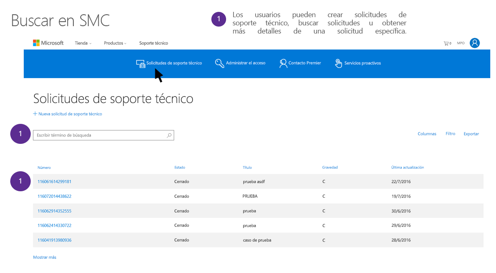

# Solicitudes de interesados del soporte técnico y los servicios profesionales de Microsoft para el RGPD

## Introducción a los Servicios Profesionales de Microsoft

El equipo de Servicios profesionales de Microsoft está formado por un grupo diverso de arquitectos técnicos, ingenieros, consultores y profesionales de soporte técnico dedicados a alcanzar la misión de Microsoft de proporcionar recursos a los clientes para mejorar su productividad. Nuestro equipo de Servicios profesionales está formado por un total de más de 21 000 consultores, asesores digitales, representantes de soporte técnico Premier, ingenieros y profesionales de ventas que trabajan en 191 países, ofrecen asistencia en 46 idiomas, administran varios millones de interacciones al mes, e interactúan con clientes y partners con herramientas automatizadas, locales, telefónicas, web y de la comunidad. La organización ofrece amplia experiencia en toda la cartera de Microsoft, con una extensa red de partners, comunidades técnicas, herramientas, diagnósticos y canales que nos conectan con nuestros clientes empresariales.

Para informarse sobre los servicios profesionales de Microsoft vaya a la sección de Servicios profesionales de Microsoft en Microsoft Trust Center (<https://www.microsoft.com/trustcenter/professional-services>). En los Servicios profesionales de Microsoft nos tomamos muy en serio nuestras obligaciones relativas al Reglamento general de protección de datos (RGPD). La información de este documento está diseñada para responder a preguntas de clientes sobre cómo el servicio de atención al cliente de Microsoft y las ofertas de consultoría asistirán y responderán a los clientes a solicitudes de los interesados relativas al RGPD.

### Introducción a las solicitudes del interesado 

El Reglamento de protección de datos de la UE (RGPD) ofrece derechos a las personas (que se denominan en el reglamento *interesados*) para administrar los datos personales recopilados por una empresa u otro tipo de agencia u organización (es decir, el *responsable de los datos* o simplemente el *responsable*). Los datos personales se definen de forma muy amplia según el RGPD como cualquier dato relacionado con una persona física, ya sea identificada o identificable. El RGPD ofrece a los interesados derechos específicos sobre sus datos personales, como la obtención de copias de sus datos, la solicitud de correcciones, la restricción de su tratamiento y su eliminación. Las solicitudes formales realizadas por un interesado a un responsable para realizar una acción con sus datos personales se denominan *solicitud del interesado* o DSR. Además, obliga a las compañías que trabajan en nombre de un responsable (conocido como el *encargado del tratamiento* o simplemente el *encargado*) a asistir de forma razonable al responsable para cumplir con las DSR.

En esta guía, se explica cómo buscar, obtener acceso y actuar sobre datos personales que residen en los sistemas de TI de Microsoft que se puedan haber recopilado para prestar servicios de soporte técnico y otras ofertas de Servicios profesionales.

Al elaborar una respuesta para una DSR, es importante que los clientes de Microsoft comprendan que los datos de soporte técnico y consultoría están separados de los datos de clientes en los servicios en línea, así como otros datos que ellos o los interesados hayan proporcionado a Microsoft. Las herramientas y los procesos proporcionados para los servicios en línea, el Panel de privacidad de Microsoft u otros sistemas de Microsoft para responder a las DSR no se pueden usar para responder a DSR mantenidas por el Soporte técnico de Microsoft u otros servicios profesionales.

Todas las solicitudes han de realizarse con un representante de soporte técnico, como se describe más adelante. Actualmente, no hay ninguna herramienta de autoservicio para que los clientes obtengan acceso a datos personales en las organizaciones de Servicios profesionales.

#### Información general sobre los procesos descritos en esta guía

  ***Detectar.*** Encuentre datos personales que puedan ser el objeto de una DSR. Después de recopilar material que pueda ser objeto de una solicitud, realice una o más de las acciones de DSR descritas en los pasos siguientes para responder a la solicitud de DSR. Como alternativa, determine si la solicitud cumple o no con las directrices de la organización para responder a DSR.

  ***Obtener acceso.*** Recupere datos personales alojados en la nube de Microsoft y, si se le pide, realice una copia que puede estar a disposición del interesado.

  ***Rectificar.*** Realice los cambios o implemente otras acciones solicitadas en los datos personales, si corresponde.

  ***Restringir.*** Restrinja el tratamiento de datos personales interrumpiendo la actividad en una interacción.

  ***Eliminar.*** Elimine de forma permanente los datos personales que residan en los sistemas de TI de Microsoft.

  ***Exportar.*** Proporcione una copia de datos personales al cliente o a los titulares de los datos.
 

### Terminología

Estas son definiciones relevantes de los términos del RGPD para esta guía:

-   **Responsable**: la persona física o jurídica, entidad pública, agencia u organismo que, solo o junto a otras personas, determina los fines y los medios del tratamiento de datos personales; donde los fines y los medios de dicho tratamiento están determinados por la ley de la Unión Europea o de los Estados miembros, el responsable o los criterios específicos para su designación pueden estar proporcionados por la ley de la Unión Europea o de los Estados miembros.

-   **Datos personales y titular de los datos**: cualquier información sobre una persona física identificada o identificable (“titular de los datos”); una persona física identificable es una que puede identificarse, directa o indirectamente, especialmente en referencia a un identificador, con un nombre, un número de identificación, datos de ubicación, un identificador en línea o uno o más factores específicos físicos, fisiológicos, genéticos, mentales, económicos, culturales o de identidad social de esa persona física.

-   **Encargado**: persona física o jurídica, entidad pública, agencia u otro organismo que trata datos personales en nombre del responsable.

#### Otros términos y definiciones que pueden resultar útiles para comprender esta guía

-   **Datos de soporte técnico y consultoría** son todos los datos (incluidos todos los archivos de texto, audio, vídeo e imagen, o software) proporcionados a Microsoft por el cliente o en su representación (o que el cliente autoriza a Microsoft a obtener de un servicio en línea) con una interacción con Microsoft para obtener servicios profesionales o de soporte técnico. Para que quede más claro, no se incluyen los datos recopilados donde Microsoft es el responsabe de los datos, incluidos los datos de contacto del cliente.

-   **Contacto del cliente** son datos personales que pueden formar parte de su relación empresarial con Microsoft, como datos personales contenidos en su información de contacto del cliente. Algunos de estos datos pueden ser su nombre, correo electrónico o número de teléfono del Administrador de servicios del contrato Premier, el administrador de TI o global de un servicio en línea, o roles similares.

-   **Datos anonimizados parcialmente** Al usar el soporte técnico de Microsoft en relación con los productos y servicios empresariales de Microsoft, Microsoft genera información vinculada a un identificador numérico de Microsoft para prestar el servicio de soporte técnico. Esto suele conocerse como “datos anonimizados parcialmente”. Aunque estos datos no se pueden atribuir a un interesado específico sin el uso de información adicional, algunos pueden considerarse como información personal según la definición amplia del RGPD de “datos personales”. En los Servicios profesionales, en las DSR siempre se incluirán automáticamente datos anonimizados parcialmente.

### Uso de esta guía

En esta guía, se describen cuatro escenarios que puede encontrarse un cliente si usa los Servicios profesionales de Microsoft.

- **Solicitud del interesado de los datos de un contacto de cliente que interactúa con Microsoft**

Explicación de cómo Microsoft responderá a las solicitudes de un contacto de cliente o administrador de TI para ejercer sus derechos como interesado.

- **Solicitud del interesado para un usuario final que interactúa con Microsoft**

Explicación de cómo Microsoft responderá a las peticiones de los empleados de un cliente u otros derechos del titular de los datos para ejercer sus derechos.

- **Solicitud del interesado para datos proporcionados por el cliente: servicio de atención al cliente comercial**

Explicación de cómo recibir asistencia de Microsoft cuando un cliente recibe una solicitud de su empleado u otros interesados para ejercer sus derechos, y cuando los datos personales del interesado fueron recopilados por el soporte técnico de Microsoft durante una interacción de soporte técnico.

- **Solicitud del interesado para datos proporcionados por el cliente: servicios de consultoría incluidos los servicios de migración de FastTrack** 

Explicación de cómo recibir asistencia de Microsoft cuando un cliente recibe una solicitud de su empleado u otros interesados para ejercer sus derechos, y cuando los datos personales del interesado fueron recopilados por Microsoft durante una interacción de consultoría.

## Solicitud de derechos del titular de los datos de un contacto de cliente que interacciona con Microsoft

*Explicación de cómo Microsoft responde a las solicitudes realizadas por un contacto de cliente o administrador de TI para ejercer los derechos del interesado.*

Cuando un cliente interacciona con Microsoft para recibir servicios de consultoría o soporte técnico, el soporte técnico de Microsoft recopila o recupera automáticamente los datos personales del contacto del cliente de los registros de la cuenta (por ejemplo, el administrador de servicios del contrato Premier, administrador global, administrador de TI). Suele incluirse el nombre, el correo electrónico, el teléfono y otros datos personales de la persona que solicita servicios de consultoría o soporte técnico.

Los datos personales del contacto del cliente forman parte de la relación empresarial de Microsoft con el cliente, y Microsoft es el responsable de los datos. Microsoft responderá a las DSR del contacto del cliente en relación con sus datos personales, independientemente de si permanecen o no en la organización.

Los clientes necesitan comprender que la DSR solo abarca los datos personales del contacto del cliente, y no se realizarán cambios ni eliminaciones en los datos enviados del cliente como parte de las interacciones (por ejemplo, transcripciones, descripciones de casos, archivos, productos de trabajo), ya que Microsoft es el encargado del tratamiento. Además, para mantener un registro histórico de las interacciones, no se realizarán cambios en las interacciones cerradas, incluido el registro de quién inició una interacción.

Al recibir una petición de un contacto de cliente en relación con una solicitud de derechos del titular de los datos, el personal de Microsoft remitirá al contacto de cliente al [Soporte para la privacidad de Microsoft](http://go.microsoft.com/fwlink/?LinkId=321116). Este es el mecanismo de entrada principal de Microsoft para las quejas y solicitudes de privacidad. Al recibir una solicitud, el Equipo de privacidad de Microsoft identificará si forma parte de una cuenta comercial o de organización, y responderá en consecuencia.

Para mantener la continuidad empresarial del cliente, Microsoft no procesará solicitudes de derechos del titular de los datos asociadas con una interacción hasta que se confirme un contacto de sustitución. Después de confirmar un nuevo contacto, Microsoft cambiará el contacto anterior por el nuevo en las interacciones abiertas.

Puede que los clientes decidan realizar cambios en sus datos recopilados durante las interacciones con Servicios profesionales con los canales habituales de consultoría o soporte técnico, separados de esta solicitud de derechos del titular de los datos. Por ejemplo, Microsoft puede ayudarle a eliminar las interacciones de soporte técnico a petición (vea la sección *Guía de solicitudes de derechos del titular de los datos proporcionados por el cliente* más adelante).

***Este ejemplo solo se proporciona con fines ilustrativos***

Sergio es un administrador de TI de un cliente empresarial de Office 365, con una interacción de soporte técnico abierta y dos interacciones cerradas. Ahora, Sergio abandona la compañía y quiere que se eliminen sus datos. Sergio se pone en contacto con el PRC, quien le identifica como el administrador de TI. A Sergio se le informa de que su nombre no se puede eliminar de las interacciones anteriores (cerradas), ni cualquier otro dato de las interacciones abiertas. Pero el PRC sustituirá a Sergio como el contacto en la incidencia abierta actual si identifica un contacto de sustitución. Sergio informa a Microsoft de que Elvira será su contacto de sustitución, y Microsoft realizará el cambio en todos los sistemas de soporte técnico.

## Solicitud del interesado para un usuario final que interactúa con Microsoft

*Forma en que Microsoft responde a solicitudes de los empleados de un cliente u otros interesados para el ejercicio de sus derechos.*

Si el empleado de un cliente u otro interesado se pone en contacto con Microsoft para ejercer sus derechos en relación con los datos que Microsoft recopiló como encargado del tratamiento, se informará a ese interesado de que necesita ponerse en contacto con el cliente de Microsoft, como responsable de los datos, para ejercer tales derechos. Microsoft no realizará ninguna otra acción.

Si el interesado también se puso en contacto con Microsoft en relación con el ejercicio de sus derechos de los datos que Microsoft recopiló en situaciones en las que Microsoft sea el responsable de los datos (por ejemplo, soporte técnico para consumidores, contacto de cliente comercial, etc.), Microsoft responderá por separado a la solicitud adecuada del interesado en relación con esos datos personales.

***Este ejemplo solo se proporciona con fines ilustrativos***

Elvira es una empleada de un cliente empresarial, Contoso, que le asignó una cuenta de Dynamics 365. Se pone en contacto con Microsoft para solicitar la eliminación de todos sus datos y se le remite al Centro de respuestas para la privacidad. Elvira rellena el formulario de solicitud. El Centro de respuestas para la privacidad identifica a Elvira como una usuaria final empresarial y le informa de que necesita dirigirse a Contoso para eliminar sus datos empresariales. También la identifican como un usuario de Microsoft Xbox y eliminan sus datos de su cuenta Microsoft de consumidor.

## Solicitud de derechos del titular de los datos proporcionados por el cliente: Asistencia comercial

*Explicación de cómo recibir asistencia de Microsoft cuando un cliente recibe una solicitud de su empleado u otros interesados para ejercer sus derechos, y cuando los datos personales del interesado fueron recopilados por el soporte técnico de Microsoft durante una interacción de soporte técnico.*

Cuando un cliente interacciona con el soporte técnico de Microsoft, Microsoft recopila datos de soporte técnico del cliente para solucionar los problemas necesarios derivados de una interacción de soporte técnico. En estos datos de soporte técnico, se incluyen la interacción de Microsoft con el cliente (por ejemplo, chat, teléfono, correo electrónico, envío web), además de los archivos de contenido que el cliente envíe a Microsoft, o bien contenido que Microsoft haya extraído con el permiso del cliente del entorno de TI del cliente o del espacio empresarial de los servicios en línea para solucionar el problema de soporte técnico. En el caso del soporte técnico Premier, también se incluyen los datos que recopilamos del usuario para impedir de forma proactiva problemas futuros. Pero se excluye la información de contacto del cliente u otra información de la relación empresarial de Microsoft con el cliente (por ejemplo, registros de facturación).

Para todos los datos de soporte técnico, Microsoft es el encargado del tratamiento. Como tal, Microsoft no responderá a solicitudes directas de interesados en relación con los datos de soporte técnico proporcionados cuando se asociaron con un cliente comercial de Microsoft. Microsoft trabajará con el cliente mediante sus canales habituales de soporte técnico para ayudarle a responder a las DSR.

## Paso 1: Detección

El primer paso para obtener ayuda de Microsoft al responder a una DSR es encontrar los datos personales que son objeto de la DSR. El primer paso (buscar y revisar los datos personales que son objeto del problema) permitirán a un cliente determinar si una DSR cumple con las directivas de la organización para aceptar la solicitud de un interesado.

Cuando el cliente encuentre los datos, puede realizar la acción específica para cumplir con la solicitud del interesado. Según lo que el cliente intente realizar, determinará el nivel de detección con el que el cliente necesita interactuar.

Cuando Microsoft ayuda un cliente con la resolución de una solicitud de derechos del titular de los datos, se trata de una función empresarial, y la solicitud se realiza con su canal de soporte técnico habitual, no con una solicitud enviada al Equipo de privacidad de Microsoft.

Al detectar datos relevantes y obtener ayuda de Microsoft, los clientes tienen distintas opciones para procesar la DSR:

*Opción A: Solicitud de derechos del titular de los datos de cliente de varios servicios de soporte técnico de Microsoft.* Se aplica la solicitud de derechos del titular de los datos a todos los datos de soporte técnico del cliente de todo el entorno de soporte técnico de Microsoft. Para hacerlo, un cliente puede pedir a Microsoft que aplique la solicitud de derechos del titular de los datos a todos los datos de soporte técnico recopilados.

*Opción B: Interacciones con clientes específicas.* Use los sistemas en línea para revisar incidencias, identifique interacciones específicas que contengan datos personales relevantes e informe de estas a Microsoft. Microsoft intentará proporcionar asistencia para realizar una búsqueda si el cliente no puede buscar en distintas interacciones (incidencias).

** Después de identificar las interacciones, solicite aplicar la solicitud de derechos del titular de los datos en una parte específica del registro o en todo lo relacionado con esa interacción en Microsoft. **

Para identificar interacciones específicas, los clientes necesitan buscar en todas sus interacciones. Para los clientes Premier, el administrador de servicios del contrato de un cliente puede ver todas las solicitudes de soporte técnico creadas en esa programación de contrato. Para los clientes que no sean Premier, hay disponibles portales equivalentes de interacción de soporte técnico, como las áreas de soporte técnico de servicios en línea.

El administrador de servicios del contrato puede ir al portal en support.microsoft.com ([https://support.microsoft.com/\<localcódigo de idioma\>](https://support.microsoft.com/%3clocal%20language%20code%3e/premier)/premier) (“SMC”) para seleccionar y revisar las solicitudes de soporte técnico. (Nota: En la URL, sustituya el texto por su código de idioma local).

>[**Nota importante en relación con DTM**] Además del historial del caso en SMC, los clientes también pueden tener datos personales de un usuario final en archivos recopilados por Microsoft (o, con el permiso del cliente, quitados del servicio en línea) durante una interacción de soporte técnico. Algunos ejemplos pueden ser copias de los buzones de Exchange del cliente, Azure VM o bases de datos. Estos datos personales se pueden mencionar o no en el historial del caso (es decir, la incidencia) de una interacción específica. Para revisar esos datos, el contacto del cliente tiene que ser un contacto de solicitud de soporte técnico autenticado específicamente (con AAD o MSA) que recibió una URL para un área de trabajo en la herramienta Administración y transferencia de datos de soporte técnico de Microsoft (DTM). Un contacto de cliente tendrá acceso a los archivos, pero no hay disponible una vista global, y SMC no indicará si los archivos existen.

Cuando los clientes identifiquen todos los datos relevantes de las incidencias de soporte técnico seleccionadas, pueden decidir si quieren solicitar la eliminación de todo lo relacionado con una incidencia, o bien si prefieren aplicar de forma selectiva la DSR en las instancias específicas de datos personales.

## Paso 2: Acceso

Si un cliente encuentra datos de soporte técnico que contengan datos personales que puedan ser objeto de una DSR, puede decidir qué datos personales quiere incluir en la respuesta. Por ejemplo, el cliente puede quitar datos personales de otros derechos del interesado y cualquier información confidencial.

En la respuesta a la solicitud de derechos del titular de los datos, se puede incluir una copia del documento en sí, una versión redactaba correctamente o una captura de pantalla de las partes que el cliente consideró apropiado compartir. Para cada una de estas respuestas a una solicitud de acceso, el cliente tendrá que recuperar una copia del documento u otros elementos que contengan los datos de respuesta.

El acceso a los datos personales de un usuario final podría ser de una mención o notación en los distintos tipos de documentación de contenido. Como los clientes pueden obtener acceso a la incidencia de interacción y al contenido, pueden proporcionar un resumen de los datos personales por su cuenta, sin necesitar ayuda de Microsoft.

En casos poco frecuentes, puede que los clientes necesiten obtener copias de datos de interacciones de soporte técnico (por ejemplo, correos electrónicos, copias transcritas de grabaciones telefónicas, transcripciones de chat, etc.) entre un representante de Microsoft y el representante del cliente. Hasta el máximo permitido, Microsoft puede proporcionar copias redactadas de estas transcripciones basadas en la necesidad, la confidencialidad y la dificultad.

## Paso 3: Rectificar

Si un interesado pide al cliente que rectifique los datos personales que residen en los datos de soporte técnico de su organización, el cliente tendrá que determinar si acepta o no la solicitud. Si el cliente acepta la solicitud, puede solicitar a Microsoft que realice el cambio. Microsoft puede rectificar los datos, o bien puede eliminar los datos del cliente de los sistemas de soporte técnico y solicitar que el cliente vuelva a enviarlos a Microsoft en un formato corregido.

## Paso 4: Restricción

El cliente puede, en cualquier momento, interrumpir una interacción o contacto con Microsoft y solicitar el cierre de la interacción. Una interacción cerrada impedirá que se realice cualquier trabajo.

Para obtener garantías adicionales, el cliente puede ponerse en contacto con Microsoft y solicitar que se agregue una nota en el sistema de incidencias de interacción donde se indique que no puede volver a abrirse el caso por cualquier motivo sin el permiso explícito del cliente.

Nota: Las interacciones (incidencias) también se eliminarán según una programación de retención o eliminación, basándose en la confidencialidad de los datos, el servicio y el sistema. Si un cliente necesita una copia de datos, tiene que asegurarse de que extrajo los datos antes de la eliminación.

## Paso 5: Eliminar

El “derecho a la eliminación” de datos personales de soporte técnico de una organización es una protección clave en el RGPD. Los datos personales que se eliminan son, entre otros, todas las interacciones, documentos o archivos, o bien datos específicos en una interacción, documento o archivo.

Cuando un cliente investiga o se prepara para eliminar datos personales en respuesta a una solicitud de derechos del titular de los datos, es importante tener en cuenta varios factores para comprender cómo funciona la eliminación para el soporte técnico de Microsoft.

Todos los datos en Microsoft tienen aplicada una directiva de retención y eliminación, que puede variar dependiendo del riesgo y de otros factores.

Los clientes que soliciten la eliminación de los datos personales de un interesado de forma global en todos los sistemas de soporte técnico pueden hacerlo con su responsable técnico de cuenta, o bien pueden rellenar una solicitud de soporte técnico en SMC o un sistema equivalente. *Necesita* indicar que se trata de una solicitud para ayudar con una DSR según el RGPD.

*Opción A: DSR de cliente de varios servicios de soporte técnico de Microsoft.* Para las DSR que abarquen varios sistemas, el cliente tiene que especificar los datos personales que Microsoft necesita para identificar los datos necesarios (por ejemplo, dirección de correo electrónico o número de teléfono). Microsoft no pondrá en correlación ni investigará los registros, y solo buscará directamente según los identificadores proporcionados por el cliente. Cuando se encuentren los datos, Microsoft eliminará todas las interacciones y todos los datos asociados. **Nota importante:** Esto puede causar la pérdida de registros históricos que sean importantes para la organización del cliente.

*Opción B: Interacciones con clientes específicas*. En el caso de interacciones específicas que el cliente haya identificado y quiera eliminar, no elimine las incidencias del SMC. Si lo hace, puede que los datos personales en registros y sistemas de bajada no se eliminen en el período de tiempo necesario. En su lugar, identifique la incidencia o los datos personales de la incidencia que es necesario eliminar y, después, póngase en contacto con el soporte técnico de Microsoft para recibir ayuda para eliminar esos datos.

### Instrucciones para la herramienta Administración y transferencia de datos de soporte técnico de Microsoft (DTM)

Para todas estas búsquedas, Microsoft no buscará en toda la DTM debido a la posible confidencialidad del contenido de los archivos. Pero, si el cliente así lo quiere, Microsoft eliminará todos los archivos contenidos en DTM asociados a la cuenta del cliente. Como puede producirse un impacto grave en el cliente, Microsoft necesita una solicitud separada del cliente donde se especifique la eliminación de los archivos de DTM.

-   Para los casos abiertos, el contacto del cliente puede eliminar los archivos directamente en DTM.

-   En el caso de los casos cerrados hace menos de 90 días, es necesario realizar una solicitud a un responsable técnico de cuenta o una solicitud de soporte técnico para que se eliminen los archivos.

-   Para los casos cerrados después de más de 90 días, los archivos ya sabrán eliminado automáticamente.

-   Incluso si los datos personales solo se encontraban en un archivo que se eliminó, los clientes necesitan solicitar a Microsoft que realice una búsqueda de los datos personales en todos los sistemas, ya que es posible que algunos datos se eliminaran de DTM durante el transcurso de la prestación de soporte técnico.

## Paso 6: Exportar

El “derecho a la portabilidad de los datos” permite a un titular de los datos solicitar una copia de sus datos personales en un formato electrónico y pedir que su organización los transmita a otro poseedor. En el caso de los datos de soporte técnico, cualquier información útil que Microsoft tenga estará en un formato de información de interacción o archivos que se pueden entregar para enviarlos a otro poseedor.

Nota: En los datos exportados, es posible que no se incluyan datos de propiedad intelectual de Microsoft, ni cualquier otro dato que pueda poner en peligro la seguridad o la estabilidad del servicio.

***Este ejemplo solo se proporciona con fines ilustrativos***

Sergio es administrador de servicios del contrato Premier de un cliente empresarial, Contoso, que usa Office 365 para su correo electrónico de empleado, y Azure para hospedar una base de datos SQL de Contoso. Contoso tiene varias incidencias abiertas y cerradas. Recientemente, el soporte técnico de Microsoft, con el permiso de Contoso, movió una copia de la base de datos SQL en DTM con fines de soporte técnico y solución de problemas.

Sergio recibe una DSR de Elvira por la que se le pide que se eliminen todos los datos. Sergio obtiene acceso a SMC y busca en las interacciones para comprobar que Elvira tuvo problemas con su cuenta de correo electrónico y, confirma que hay dos incidencias en las que se hace referencia a su nombre y dirección de correo electrónico. Se pone en contacto con su responsable técnico de cuenta, proporciona al responsable técnico de cuenta el nombre y la dirección de correo electrónico de Elvira como identificador, y solicita la eliminación de esas dos incidencias, además de todos los datos de bajada que se generaran de esas dos incidencias.

También sospecha que participó en una conversación de chat con el personal de soporte técnico donde se menciona a Elvira, por lo que solicita que también se elimine ese registro de chat.

También sabe que los datos personales de Elvira se encuentran en la base de datos SQL. Como la VM de SQL se movió a DTM hace menos de 90 días, le pide a su responsable técnico de cuenta por separado que le ayude con la eliminación inmediata de la base de datos de DTM.

Por último, como sabe que es posible que los datos se eliminaran del archivo de DTM durante la prestación del soporte técnico, le pide a Microsoft que realice una comprobación en todos sus sistemas de TI para buscar los datos personales de Elvira que aparecen en la base de datos SQL.

El soporte técnico de Microsoft realiza todas estas eliminaciones y, basándose en la petición del cliente, el responsable técnico de cuenta le proporciona una declaración de atestación que confirma que se eliminaron los datos necesarios.

## Guía de solicitud de derechos del titular de los datos proporcionados por el cliente en servicios de consultoría, incluidos los Servicios de migración Microsoft

*Explicación de cómo recibir asistencia de Microsoft cuando un cliente recibe una solicitud de su empleado u otros interesados para ejercer sus derechos, y cuando los datos personales del interesado fueron recopilados por Microsoft durante una interacción de consultoría.*

## Servicios de consultoría de Microsoft

Para las interacciones de los servicios de consultoría de Microsoft realizadas donde se aplique el Anexo de protección de datos de Servicios profesionales de Microsoft (<http://aka.ms/professionalservicesdpa>).

Microsoft es el responsable de los datos para los contactos de clientes que trabajen con el equipo de interacción. Esas personas necesitan ponerse en contacto con el [Soporte para la privacidad de Microsoft](http://go.microsoft.com/fwlink/?LinkId=321116) para ejercer sus derechos como interesados.

Microsoft es el encargado del tratamiento de una DSR que se encuentre en los datos proporcionados durante una interacción de consultoría. El cliente necesita ponerse en contacto con el responsable de la interacción para elaborar un plan para responder a una DSR basándose en los datos recopilados y en el tipo específico de servicio de consultoría prestado. Hasta el punto en que la petición constituya un nivel de esfuerzo que suele ser típico en una interacción de los Servicios de consultoría de Microsoft, puede que sea necesario realizar una petición de trabajo adicional. Además, los datos personales se eliminarán después de cada interacción de consultoría en un período de tiempo que depende del tipo de interacción de consultoría. El cliente puede solicitar la eliminación de los datos con anterioridad y pedir una atestación de su eliminación.

## Servicios de Microsoft FastTrack

[Microsoft FastTrack](https://na01.safelinks.protection.outlook.com/?url=https%3A%2F%2Ffasttrack.microsoft.com%2Fabout&data=02%7C01%7C%7Cd0521d8739c841df674508d596834585%7C72f988bf86f141af91ab2d7cd011db47%7C1%7C0%7C636580412901207944&sdata=PO5eh56pm9IYk5Y%2Ff%2F31e%2BRVPmrC2Qi%2FCsw1NphR8gY%3D&reserved=0) proporciona servicios de consultoría de TI a las organizaciones para ayudarles a incorporar y usar los Servicios en la nube de Microsoft, como Microsoft 365, Azure y Dynamics 365.

Microsoft es el responsable de los datos de los contactos de clientes que trabajen con el equipo de FastTrack. Si los contactos de clientes quieren obtener acceso, revisar o quitar información de contacto de los registros de Microsoft FastTrack, los clientes pueden pedir al interesado que envíe la solicitud directamente a la bandeja de entrada de solicitudes del RGPD de FastTrack para Office 365\<<o365ftgdpr@microsoft.com>\>.

Para los servicios de migración de FastTrack, Microsoft es el encargado del tratamiento. Según nuestra declaración de divulgación de privacidad adicional de FastTrack, todos los datos de la migración se consideran "datos de la migración". Si necesita ejecutar una DSR mientras su organización está ocupada en un proyecto de migración de FastTrack, se requiere especial atención.
  
Si necesita procesar cualquier acceso, corregir o exportar solicitudes de DSR mientras se están procesando los datos de un usuario a través de sistemas de migración de FastTrack, será responsabilidad del cliente realizar estas DSR mediante los sistemas de origen existentes en los que se almacenan los datos del usuario. Cuando finalice la migración del usuario y los datos se hayan migrado al servicio de nube de destino de Microsoft, se aplicarán las instrucciones de Microsoft sobre cómo los clientes puedan usar sus productos, servicios y herramientas administrativas para buscar y realizar acciones sobre los datos personales con el fin de responder a la solicitud del interesado. Para conocer estas instrucciones, vea [Solicitudes de interesados para el RGPD](https://docs.microsoft.com/microsoft-365/compliance/gdpr-data-subject-requests). 

Si necesita eliminar una cuenta de usuario de Office 365 en respuesta a una solicitud de eliminación de DSR mientras su organización está ocupada en un proyecto de migración de FastTrack en curso, debe tener en cuenta que los sistemas de migración pueden conservar una copia de los datos de migración del usuario durante un período de tiempo tras la finalización de la migración del usuario y la eliminación de la cuenta de usuario de Office 365 no eliminará automáticamente estos datos migración de usuario almacenados en los sistemas de migración de FastTrack. Si desea que el equipo de Microsoft FastTrack elimine los datos de migración del usuario, puede [enviar una solicitud](https://go.microsoft.com/fwlink/?linkid=874544). Durante el transcurso habitual de la actividad empresarial, Microsoft FastTrack eliminará todas las copias de datos cuando finalice la migración de su organización.

## Otros servicios de consultoría

Los clientes que reciban otros servicios profesionales con Microsoft necesitan colaborar con el equipo de interacción para cumplir todos los requisitos del RGPD. Si el equipo de interacción no puede proporcionar instrucciones claras sobre cómo cumplir con la solicitud de derechos del titular de los datos del RGPD, los clientes se pueden ponerse en contacto con el [Soporte para la privacidad de Microsoft](http://go.microsoft.com/fwlink/?LinkId=321116) para obtener ayuda.
