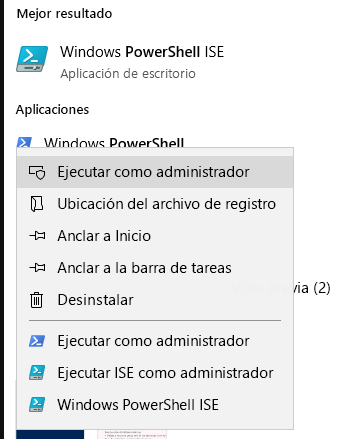
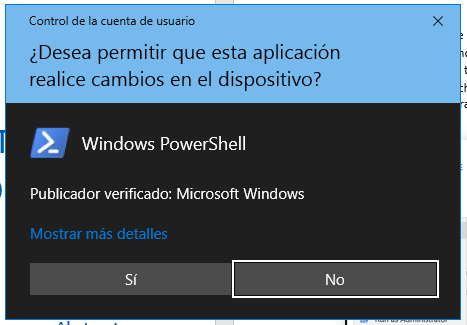
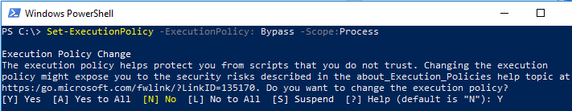

# Conjunto de herramientas de migración de FastTrack para cursar solicitudes de eliminaciónFastTrack Migration Toolset for Submitting Delete Request

## Finalidad del conjunto de herramientasToolset purpose

Si es un cliente que actualmente está realizando una migración de FastTrack, eliminar la cuenta de usuario de Office 365 no hará que se elimine la copia de datos que el equipo de FastTrack de Microsoft conserva, cosa que hace con el único propósito de completar la migración. Si quiere que el equipo de Microsoft FastTrack elimine también esa copia de datos durante la migración, curse una solicitud a través de este conjunto de herramientas. En el transcurso habitual de las actividades, Microsoft FastTrack eliminará todas las copias de datos cuando la migración finalice.In the event that you are a customer currently engaged in FastTrack migrations, deleting the Office 365 user account will not delete the data copy held by the Microsoft FastTrack team, which is held for the sole purpose of completing the migration. If during the migration you would like the Microsoft FastTrack team to also delete the data copy, submit a request via this tool set. In the ordinary course of business, Microsoft FastTrack will delete all data copies once the migration is complete.

### Plataformas compatiblesSupported platforms
Microsoft admite la versión inicial de este conjunto de herramientas en la plataforma de Windows y en la consola de PowerShell. Este conjunto de herramientas admite las siguientes plataformas conocidas:Microsoft supports the initial release of this  toolset in the Windows platform and PowerShell console. The following known platforms are supported by this toolset:
 
***Tabla 1: plataformas admitidas por este conjunto de herramientas******Table 1 — Platforms supported by this toolset***
 
<!--start table here HEADER -->
 
|||||||
|:-----|:-----|:-----|:-----|:-----|:-----|
| |**Windows 7****Windows 7**|**Windows 8****Windows 8**|**Windows 10****Windows 10**|**Windows Server 2012****Windows Server 2012**|**Windows Server 2016****Windows Server 2016**|
|PS 5.0PS 5.0|NoNot Compatible.Supported|Compatible.Supported|Compatible.Supported|Compatible.Supported|Compatible.Supported|
|PS 5.1PS 5.1|NoNot Compatible.Supported|Compatible.Supported|Compatible.Supported|Compatible.Supported|Compatible.Supported|
|||
 
<!-- end of table -->

### Obtener el conjunto de herramientasObtaining the toolset

Este conjunto de herramientas está disponible en la Galería de PowerShell de la aplicación de consola de PowerShell. Para encontrar y cargar este módulo de cmdlet, abra primero PowerShell en el modo de administrador para, así, contar con los permisos adecuados para instalar el módulo. Si no ha usado PowerShell anteriormente, vaya a la barra de tareas de Windows y, en el cuadro de búsqueda, escriba "PowerShell". Seleccione la aplicación de consola haciendo clic con el botón derecho, elija **Ejecutar como administrador** y haga clic en **Sí** para ejecutar Windows PowerShell.This toolset is available in the PowerShell Gallery on the PowerShell console application.  To locate and load this cmdlet module, first open PowerShell in administrator mode so it has the appropriate permissions to install the module. If you have not used PowerShell previously go to your Windows Task Bar and in the search box type “PowerShell”. Select the console app using right-click and choose **Run as administrator**, then click **Yes** to run Windows PowerShell.

Con la consola ya abierta, hay que configurar los permisos que permitan ejecutar scripts. Para ello, escriba el siguiente comando: "Set-ExecutionPolicy – ExecutionPolicy: Bypass – Scope: Process".Now that the console is open, you need to set permissions for script execution. Type the following command to allow the scripts to run: ‘Set-ExecutionPolicy — ExecutionPolicy: Bypass — Scope: Process’

Se le pedirá que confirme esta acción, dado que el administrador puede cambiar el ámbito a su conveniencia.You will be prompted to confirm this action, as the administrator can change the scope at their discretion.

***Definir la directiva de ejecución******Set Execution Policy***

Ahora que la consola está configurada para permitir la ejecución de scripts, ejecute el siguiente comando para instalar el módulo:Now that the console is set to allow the script,  run this next command to install the module:

>`Install-Module -Name Microsoft.FastTrack ` -Repository PSGallery \``Install-Module -Name Microsoft.FastTrack ` -Repository PSGallery \`
>        
>               -WarningAction: SilentlyContinue `
>               -Force’

### Requisitos previos del móduloPrerequisites for module
Para ejecutar correctamente este módulo, puede que sea necesario instalar módulos dependientes para usarlos si aún no están instalados. Posiblemente deba reiniciar PowerShell.To successfully execute this module, you may need to install dependent modules for use if they are not already installed. You may need to restart PowerShell.  

Para enviar una solicitud de interesado, antes tiene que iniciar sesión con sus credenciales de Office 365; cuando especifique las credenciales apropiadas, se validará el estado de su cuenta de administrador global y se recopilará información del inquilino.In order to submit a DSR, you must first log in using your Office 365 credentials — entering the proper credentials will validate your global administrator status and collect tenant information. 

**Login-FastTrackAccount -ApiKey: \<Clave de API proporcionada por FastTrack MVM\>****Login-FastTrackAccount -ApiKey: \<API Key provided by FastTrack MVM\>**

Tras haber iniciado sesión correctamente, la clave y las credenciales se almacenarán para su uso con módulos FastTrack durante lo que quede de la sesión actual de PowerShell.Once successfully logged in, the credentials and key will be stored for use with FastTrack modules for the remainder of the current PowerShell session.

Si necesita conectarse a un entorno de nube que no sea comercial, deberá agregar *-Environment* al comando *Login* con uno de los siguientes entornos válidos:If you need to connect to a cloud environment, other than commercial, *-Environment* will need to be added to *Log in* command with one of the following valid environments:
- AzureCloudAzureCloud
- AzureChinaCloudAzureChinaCloud
- AzureGermanCloudAzureGermanCloud
- AzureUSGovernmentCloudAzureUSGovernmentCloud

**Login-FastTrackAcccount -ApiKey\ <API Key provided by FastTrack MVM> -Environment: <entorno de nube\>****Login-FastTrackAcccount -ApiKey\ <API Key provided by FastTrack MVM> -Environment: <cloud environment\>**

Para enviar una solicitud de interesado, ejecute el siguiente comando: Submit-FastTrackGdprDsrRequest -DsrRequestUserEmail: SubjectUserEmail@mycompany.comTo submit a DSR request, run the following command: Submit-FastTrackGdprDsrRequest -DsrRequestUserEmail: SubjectUserEmail@mycompany.com

Si el cmdlet se ejecuta correctamente, devolverá un objeto de identificador de transacción. Guárdelo.On success — the cmdlet will return a Transaction ID object. Please retain the Transaction ID.

#### Comprobar el estado de una transacción de solicitudChecking the status of a request transaction

Ejecutar la siguiente función usando el identificador de transacción obtenido anteriormente: Get-FastTrackGdprDsrRequest -TransactionID: "identificadorDeTransacción"Run the following function using the previously obtained Transaction ID: Get-FastTrackGdprDsrRequest -TransactionID: “YourTransactionID”

#### Códigos de estado de la transacciónTransaction Status Codes
<!--start table here no header -->

|||
|:-----|:-----|:-----|
|**Transacción****Transaction** |**Estado****Status**|
|**Created****Created** |La solicitud se ha creado.Request has been created|
|**Failed****Failed**|La solicitud no se ha podido crear. Vuelva a enviarla o póngase en contacto con el equipo de soporte técnico.Request failed to create, please resubmit, or contact support|
|**Completed****Completed**|La solicitud se ha completado y saneado.Request has been completed and sanitized|
|||

<!-- end of table -->

<!-- original version: **Created**  Request has been created **Failed** Request failed to create, please resubmit, or contact support **Completed** Request has been completed and sanitized -->

## Más informaciónLearn more
[Centro de confianza de MicrosoftMicrosoft Trust Center](https://www.microsoft.com/TrustCenter/Privacy/gdpr/default.aspx)