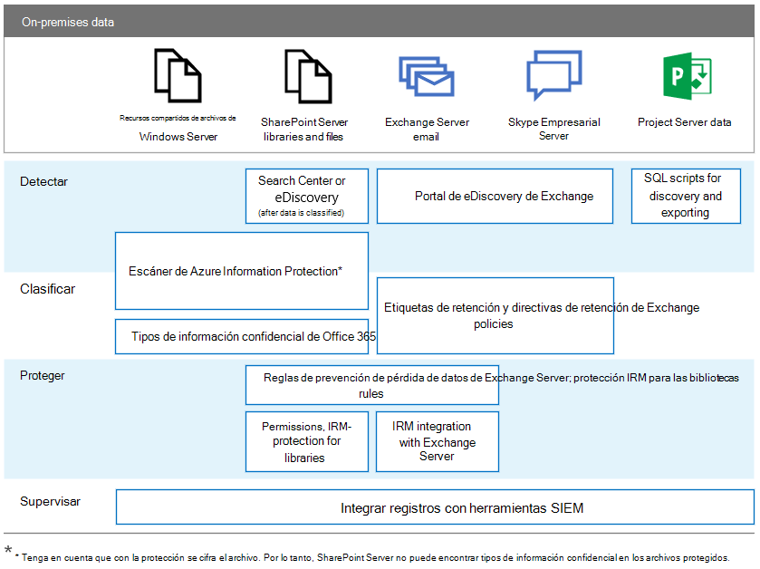

# RGPD para servidores locales de OfficeGDPR for Office on-premises Servers

El Reglamento general de protección de datos (RGPD) presenta requisitos para que las organizaciones protejan los datos personales y respondan correctamente a las solicitudes de datos personales. Esta serie de artículos proporciona enfoques recomendados para cargas de trabajo locales:The General Data Protection Regulation (GDPR) introduces requirements for organizations to protect personal data and respond appropriately to data subject requests. This series of articles provides recommended approaches for on-premises workloads:

- [SharePoint ServerSharePoint Server](gdpr-for-sharepoint-server.md)

- [Exchange ServerExchange Server](gdpr-for-exchange-server.md)

- [Skype Empresarial ServerSkype for Business Server](gdpr-for-skype-for-business-server.md)

- [Project ServerProject Server](gdpr-for-project-server.md)

- [Office Web Apps Server y Office Online ServerOffice Web Apps Server and Office Online Server](gdpr-for-office-online-server.md)

- [Uso compartido de archivos localesOn-premises file shares](gdpr-for-on-premises-file-shares.md)

Para obtener más información sobre el RGPD y cómo puede ayudarle Microsoft, consulte el [Centro de confianza de Microsoft](https://www.microsoft.com/trust-center/privacy/gdpr-overview
).For more information about the GDPR and how Microsoft can help you, see the [Microsoft Trust Center](https://www.microsoft.com/trust-center/privacy/gdpr-overview
).

Antes de realizar cualquier trabajo con los datos locales, consulte con sus equipos legales y de cumplimiento para buscar orientación y obtener información sobre los métodos de clasificación existentes para trabajar con datos personales y esquemas. Microsoft ofrece recomendaciones para desarrollar y ampliar esquemas de clasificación en el Kit de herramientas de detección de datos de RGPD de Microsoft en [https://aka.ms/gdprpartners](<https://aka.ms/gdprpartners>). Este kit de herramientas también describe métodos para mover datos locales a la nube donde puede usar funciones de gobierno de datos más complejas, si así lo desea. Los artículos de esta sección proporcionan recomendaciones para datos que se pretende que permanezcan en un entorno local.Before doing any work with on-premises data, consult with your legal and compliance teams to seek guidance and to learn about existing classification schemas and approaches to working with personal data. Microsoft provides recommendations for developing and extending classifications schemas in the Microsoft GDPR Data Discovery Toolkit at [https://aka.ms/gdprpartners](<https://aka.ms/gdprpartners>). This toolkit also describes approaches for moving on-premises data to the cloud where you can use more sophisticated data governance capabilities, if this is desired. The articles in this section provide recommendations for data that is intended to remain on premises.

La siguiente ilustración enumera las capacidades recomendadas que se deben usar en cada una de estas cargas de trabajo para descubrir, clasificar, proteger y vigilar los datos personales. Consulte los artículos de esta sección para obtener más información.The following illustration lists recommended capabilities to use across each of these workloads to discover, classify, protect, and monitor personal data. See the articles in this section for more information.

## Descripción de la ilustraciónIllustration description

Por motivos de accesibilidad, en la tabla siguiente se incluyen los mismos ejemplos que en la ilustración.For accessibility, the following table provides the same examples in the illustration.

****

|AcciónAction|Recursos compartidos de archivos de Windows ServerWindows Server file shares|SharePoint ServerSharePoint Server|Exchange ServerExchange Server|Skype EmpresarialSkype for Business|Project ServerProject Server|
|---|---|---|---|---|---|
|DetectarDiscover|Escáner de Azure Information Protection\*Azure Information Protection scanner\*|Centro de búsqueda o eDiscovery (después de clasificar los datos)Search Center or eDiscovery (after data is classified)    Escáner de Azure Information Protection\*Azure Information Protection scanner\*|Portal de eDiscovery de ExchangeExchange eDiscovery Portal|Portal de eDiscovery de ExchangeExchange eDiscovery portal|Scripts SQL de detección y exportaciónSQL scripts for discovery and exporting|
|ClasificarClassify|Escáner de Azure Information Protection\*Azure Information Protection scanner\*    Tipos de información confidencial de Office 365Office 365 sensitive information types|Escáner de Azure Information Protection\*Azure Information Protection scanner\*    Tipos de información confidencial de Office 365Office 365 sensitive information types|Etiquetas de retención y directivas de retención de ExchangeExchange retention tags and retention policies|Etiquetas de retención y directivas de retención de ExchangeExchange retention tags and retention policies||
|ProtegerProtect||Reglas de prevención de pérdida de datos de Exchange ServerExchange Server data loss prevention rules    Permisos y protección IRM para las bibliotecasPermissions, IRM-protection for libraries|Reglas de prevención de pérdida de datos de Exchange ServerExchange Server data loss prevention rules    Integración IRM con Exchange ServerIRM integration with Exchange Server|||
|MonitorearMonitor|Integrar registros con herramientas SIEMIntegrate logs with SIEM tools|Integrar registros con herramientas SIEMIntegrate logs with SIEM tools|Integrar registros con herramientas SIEMIntegrate logs with SIEM tools|Integrar registros con herramientas SIEMIntegrate logs with SIEM tools|Integrar registros con herramientas SIEMIntegrate logs with SIEM tools|
|

\* Tenga en cuenta que la protección cifra el archivo.\* Note that protection encrypts the file. Por lo tanto, SharePoint Server no puede encontrar tipos de información confidencial en los archivos protegidos.Consequently, SharePoint Server can't find the sensitive information types in protected files.
