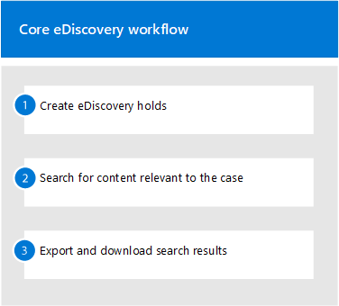

# Introducción a Core eDiscovery

La exhibición de documentos electrónicos principal de Microsoft 365 proporciona una herramienta básica de exhibición de documentos electrónicos que las organizaciones pueden usar para buscar y exportar contenido en Microsoft 365 y Office 365. También puede usar la exhibición de documentos electrónicos principal para almacenar una exhibición de documentos electrónicos en ubicaciones de contenido, como buzones de Exchange, sitios de SharePoint, cuentas de OneDrive y Microsoft Teams. No se necesita nada para implementar la exhibición de documentos electrónicos principal, pero hay algunas tareas de requisitos previos que debe realizar un administrador de ti y un administrador de exhibición de documentos electrónicos antes de que su organización pueda empezar a usar la exhibición de documentos electrónicos principal para buscar, exportar y conservar contenido.

En este artículo se describen los pasos necesarios para configurar la exhibición de documentos electrónicos principal. Esto incluye garantizar que se requieren las licencias adecuadas para obtener acceso a la exhibición de documentos electrónicos principal y almacenar una exhibición de documentos electrónicos en ubicaciones de contenido, así como asignar permisos a su equipo de ti, legal y de investigación para que puedan acceder a los casos y administrarlos. En este artículo también se proporciona una descripción general de alto nivel del uso de casos para buscar y exportar contenido.

## Paso 1: comprobar y asignar las licencias adecuadas

La concesión de licencias para la exhibición de documentos electrónicos principal requiere la suscripción de la organización y licencias por usuario adecuadas.

- **Suscripción de la organización:** Para acceder a la exhibición de documentos electrónicos principal en el centro de cumplimiento de Microsoft 365 o en el centro de seguridad & cumplimiento de Office 365 y usar las características de retención y exportación, su organización debe tener una suscripción a Microsoft 365 E3 o Office 365 E3 o superior.

- **Licencias por usuario:** Para realizar una retención de exhibición de documentos electrónicos en los buzones de correo y los sitios, un usuario debe tener asignada una de las siguientes licencias, en función de la suscripción de su organización:

  - Una licencia de Microsoft 365 E3 o Office 365 E3 o superior

   O

  - Licencia de Office 365 E1 con una licencia de complemento de archivado de Exchange Online plan 2 o Exchange Online

  Y

  - Licencia de Office 365 E1 con una licencia de complemento de plan 2 de SharePoint Online plan 2 o OneDrive para la empresa
  
  Para obtener información acerca de cómo asignar licencias, consulte [asignar licencias a los usuarios](https://docs.microsoft.com/microsoft-365/admin/manage/assign-licenses-to-users).

Para obtener información acerca de las licencias:

- Descargue y vea la solución "Descubra & responder" en la [comparación de licencias de cumplimiento de Microsoft 365](https://docs.microsoft.com/office365/servicedescriptions/downloads/microsoft-365-compliance-licensing-comparison.xlsx).

- Vea la [Descripción del servicio del centro de cumplimiento de & de seguridad](https://docs.microsoft.com/office365/servicedescriptions/office-365-platform-service-description/office-365-securitycompliance-center).

## Paso 2: asignar permisos de exhibición de documentos electrónicos

Para obtener acceso a la exhibición de documentos electrónicos principal o agregar como miembro de un caso de exhibición de documentos electrónicos principal, se debe asignar a un usuario los permisos adecuados. En concreto, debe agregarse un usuario como miembro del grupo de roles eDiscovery Manager en el centro de seguridad & cumplimiento de Office 365. Los miembros de este grupo de roles pueden crear y administrar casos de eDiscovery principales. Pueden agregar y quitar miembros, realizar una retención de eDiscovery en los usuarios, crear y editar búsquedas y exportar contenido de un caso de eDiscovery principal.

Complete los siguientes pasos para agregar usuarios al grupo de roles eDiscovery Manager:

1. Vaya a [https://protection.office.com/permissions](https://protection.office.com/permissions) e inicie sesión con las credenciales de una cuenta de administrador en la organización de Microsoft 365 u Office 365.

2. En la página **permisos** , seleccione el grupo de roles **Administrador de exhibición** de documentos electrónicos.

3. En la página desplegable administrador de exhibición de documentos electrónicos, haga clic en **Editar** junto a la sección **Administrador de exhibición** de documentos electrónicos.

4. En la página **elegir administrador de exhibición** de documentos electrónicos del asistente editar grupo de roles, haga clic en **elegir administrador de detección**.

5. Haga clic en **Agregar** y, a continuación, active la casilla de verificación para todos los usuarios que desee agregar al grupo de roles.

6. Haga clic en **Agregar** para agregar los usuarios seleccionados y, a continuación, haga clic en **listo**.

7. Haga clic en **Guardar** para agregar los usuarios al grupo de roles y, a continuación, haga clic en **cerrar** para completar el paso.

### Más información sobre el grupo de roles de eDiscovery Manager

Hay dos subgrupos en el grupo de roles de administrador de exhibición de documentos electrónicos. La diferencia entre estos subgrupos se basa en el ámbito.

- **Administrador de eDiscovery:** Puede ver y administrar los casos de exhibición de documentos electrónicos principales que crean o a los que pertenece. Si otro administrador de eDiscovery crea un caso pero no agrega un segundo administrador de eDiscovery como miembro de ese caso, el segundo administrador de eDiscovery no podrá ver ni abrir el caso en la Página principal de eDiscovery en el centro de cumplimiento. En general, la mayoría de las personas de su organización se pueden agregar al subgrupo eDiscovery Manager.

- **Administrador de eDiscovery:** Puede realizar todas las tareas de administración de casos que puede realizar un administrador de exhibición de documentos electrónicos. Además, un administrador de exhibición de documentos electrónicos puede:

  - Ver todos los casos que se enumeran en la Página principal de eDiscovery.
  
  - Administrar cualquier caso en la organización después de que se agreguen como miembro del caso.

  - Obtenga acceso y exporte datos de casos para cualquier caso de la organización.

  Debido al amplio ámbito de acceso, una organización solo debe tener unos pocos administradores que sean miembros del subgrupo administradores de eDiscovery.

Para obtener más información acerca de los permisos de exhibición de documentos electrónicos y una descripción de cada rol asignado al grupo de roles eDiscovery Manager, consulte [asignar permisos de exhibición](assign-ediscovery-permissions.md)de documentos electrónicos.

## Paso 3: crear un caso de exhibición de documentos electrónicos principal

El siguiente paso es crear un caso y empezar a usar la exhibición de documentos electrónicos principal. Complete los siguientes pasos para crear un caso y agregar miembros. El usuario que crea el caso se agrega automáticamente como miembro.

1. Vaya a [https://compliance.microsoft.com](https://compliance.microsoft.com) e inicie sesión con las credenciales de una cuenta de usuario a la que se le hayan asignado los permisos de eDiscovery adecuados. Los miembros del grupo de roles administración de la organización también pueden crear casos de eDiscovery principales.

2. En el panel de navegación izquierdo del centro de cumplimiento de Microsoft 365, haga clic en **Mostrar todos**y, a continuación, en **eDiscovery > Core**.

3. En la página **principal de eDiscovery** , haga clic en **crear un caso**.

4. En la página flotante de **nuevo caso** , indique el caso como un nombre (obligatorio) y, a continuación, escriba un número y una descripción de caso opcional. El nombre del caso debe ser único en la organización.

5. Haga clic en **Guardar** para crear el caso.

   El nuevo caso se crea y se muestra en la Página principal de eDiscovery. Es posible que deba hacer clic en **Actualizar** para mostrar el nuevo caso. 

## Paso 4 (opcional): agregar miembros a un caso de exhibición de documentos electrónicos principal

Si crea un caso en el paso 3 y es la única persona que va a usar el caso, no es necesario que realice este paso. Puede empezar a usar el caso para crear suspensiones de eDiscovery, buscar contenido o exportar resultados de búsqueda. Realice este paso si desea conceder acceso al caso a otros usuarios (o grupos de roles).

1. En la página **principal de eDiscovery** del centro de cumplimiento de Microsoft 365, haga clic en el nombre del caso al que desea agregar miembros.

2. En la página desplegable **administrar este caso** , en **administrar miembros**, haga clic en **Agregar** para agregar miembros al caso. 

    También puede elegir agregar un grupo de roles como miembro de un caso. En **administrar grupos de roles**, haga clic en **Agregar**. Solo puede asignar a un caso los grupos de roles de los que es miembro. Esto se debe a que los grupos de roles controlan quién puede asignar miembros a un caso de exhibición de documentos electrónicos.

3. En la lista de personas o grupos de roles que se pueden agregar como miembros del caso, haga clic en la casilla situada junto a los nombres de las personas (o grupos de roles) que desee agregar. Si tiene una lista grande de personas que pueden agregarse como miembros, use el cuadro de **búsqueda** para buscar una persona específica en la lista.
  
4. Después de seleccionar los grupos de personas o roles que se agregarán como miembros del caso, haga clic en **Agregar**.

5. Haga clic en **Guardar** para guardar la nueva lista de miembros de caso.

## Explorar el flujo de trabajo de eDiscovery principal

Para empezar a usar la exhibición de documentos electrónicos principal, este es un sencillo flujo de trabajo de la creación de suspensiones de eDiscovery para personas de interés, la búsqueda de contenido que sea relevante para la investigación y la exportación de los datos para su posterior revisión. En cada uno de estos pasos también se resaltará una funcionalidad de exhibición de documentos electrónicos principal extendida que puede explorar.

1. **[Crear una suspensión de exhibición](create-ediscovery-holds.md)** de documentos electrónicos. El primer paso después de crear un caso es colocar una retención (también denominada *conservación*de la exhibición de documentos electrónicos) en las ubicaciones de contenido de las personas de interés en la investigación. Las ubicaciones de contenido incluyen buzones de correo de Exchange, sitios de SharePoint, cuentas de OneDrive, así como los buzones y sitios asociados con Microsoft Teams y grupos de Office 365. Aunque este paso es opcional, la creación de una retención de eDiscovery conserva el contenido que puede ser relevante para el caso durante la investigación. Al crear una retención de exhibición de documentos electrónicos, puede conservar todo el contenido de ubicaciones de contenido específicas o puede crear una retención basada en consultas para conservar solo el contenido que coincide con una consulta de retención. Además de preservar el contenido, otra buena razón para crear retenciones de eDiscovery consiste en buscar rápidamente las ubicaciones de contenido en espera (en lugar de tener que seleccionar cada ubicación para la búsqueda) al crear y ejecutar búsquedas en el paso siguiente. Una vez completada la investigación, puede liberar cualquier suspensión que haya creado.

2. **[Buscar contenido](search-for-content-in-core-ediscovery.md)**. Después de crear suspensiones de exhibición de documentos electrónicos, use la herramienta de búsqueda integrada para buscar en las ubicaciones de contenido en espera. También puede buscar datos en otras ubicaciones de contenido que puedan ser relevantes para el caso. Puede crear y ejecutar diferentes búsquedas asociadas con el caso. Se usan palabras clave, propiedades y condiciones para [crear consultas de búsqueda](keyword-queries-and-search-conditions.md) que devuelven los resultados de la búsqueda con los datos que es más probable que sean relevantes para el caso. También puede hacer lo siguiente:

   - Ver las estadísticas de búsqueda que pueden ayudarle a refinar una consulta de búsqueda para restringir los resultados.

   - Obtenga una vista previa de los resultados de la búsqueda para comprobar rápidamente si se encuentran los datos relevantes.

   - Revise una consulta y vuelva a ejecutar la búsqueda.

3. **[Exportar y descargar los resultados de la búsqueda](export-content-in-core-ediscovery.md)**. Una vez que haya buscado y buscado los datos que sean relevantes para su investigación, puede exportarlos fuera de Office 365 para su revisión por parte de personas ajenas al equipo de investigación. La exportación de datos es un proceso de dos pasos. El primer paso consiste en exportar los resultados de una búsqueda en el caso de fuera de Office 365. Esto se logra copiando los resultados de una búsqueda en una ubicación de almacenamiento de Azure proporcionada por Microsoft. El paso siguiente es usar la herramienta de exportación de exhibición de documentos electrónicos para descargar el contenido en un equipo local. Además de los archivos de datos exportados, los Contains del paquete de exportación también contienen un informe de exportación, un informe de Resumen y un informe de errores.
