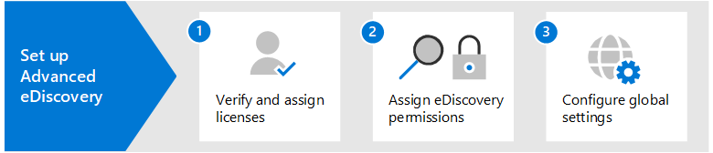

# Configurar eDiscovery avanzada de Microsoft 365Set up Microsoft 365 Advanced eDiscovery

La exhibición de documentos electrónicos avanzada en Microsoft 365 proporciona un flujo de trabajo completo para conservar, recopilar, revisar, analizar y exportar datos que responden a las investigaciones internas y externas de la organización.Advanced eDiscovery in Microsoft 365 provides an end-to-end workflow to preserve, collect, review, analyze, and export data that's responsive to your organization's internal and external investigations. No se necesita nada para implementar la exhibición de documentos electrónicos avanzada, pero hay algunas tareas previas que un administrador de TI y un administrador de exhibición de documentos electrónicos deben completar antes de que su organización pueda empezar a crear y usar casos de exhibición de documentos electrónicos avanzados para administrar las investigaciones.Nothing is needed to deploy Advanced eDiscovery, but there are some prerequisite tasks that an IT admin and eDiscovery manager have to complete before your organization can start to create and use Advanced eDiscovery cases to manage your investigations.

En este artículo se de abordan los siguientes pasos necesarios para configurar la exhibición de documentos electrónicos avanzada.This article discusses the following steps necessary to set up Advanced eDiscovery.

Esto incluye garantizar la licencia adecuada necesaria para tener acceso a eDiscovery avanzada y agregar custodios a los casos, y asignar permisos al equipo legal e investigador para que puedan acceder y administrar casos.This includes ensuring the proper licensing required to access Advanced eDiscovery and add custodians to cases, and assigning permissions to your legal and investigation team so they can access and manage cases.

## Paso 1: Comprobar y asignar licencias adecuadasStep 1: Verify and assign appropriate licenses

Las licencias para exhibición de documentos electrónicos avanzados requieren la suscripción de la organización adecuada y las licencias por usuario.Licensing for Advanced eDiscovery requires the appropriate organization subscription and per-user licensing. Para obtener una lista de los requisitos de licencias para eDiscovery avanzada, vea [Suscripciones y licencias.](overview-ediscovery-20.md#subscriptions-and-licensing)For a list of licensing requirements for Advanced eDiscovery, see [Subscriptions and licensing](overview-ediscovery-20.md#subscriptions-and-licensing).

## Paso 2: Asignar permisos de exhibición de documentos electrónicosStep 2: Assign eDiscovery permissions

Para obtener acceso a la exhibición de documentos electrónicos avanzada o agregarse como miembro de un caso de exhibición de documentos electrónicos avanzados, se deben asignar los permisos adecuados a un usuario.To access Advanced eDiscovery or added as a member of an Advanced eDiscovery case, a user must be assigned the appropriate permissions. Específicamente, un usuario debe agregarse como miembro del grupo de roles administrador de exhibición de documentos electrónicos en el Centro de seguridad & cumplimiento.Specifically, a user must be added as a member of the eDiscovery Manager role group in the Security & Compliance Center. Los miembros de este grupo de roles pueden crear y administrar casos de exhibición de documentos electrónicos avanzados.Members of this role group can create and manage Advanced eDiscovery cases. Pueden agregar y quitar miembros, poner en espera a custodios y ubicaciones de contenido, administrar notificaciones de retención legal, crear y editar búsquedas asociadas en un caso, agregar resultados de búsqueda a un conjunto de revisión, analizar datos de un conjunto de revisión y exportar y descargar desde un caso de exhibición de documentos electrónicos avanzado.They can add and remove members, place custodians and content locations on hold, manage legal hold notifications, create and edit searches associated in a case, add search results to a review set, analyze data in a review set, and export and download from an Advanced eDiscovery case.

Siga estos pasos para agregar usuarios al grupo de roles administrador de exhibición de documentos electrónicos:Complete the following steps to add users to the eDiscovery Manager role group:

1. Vaya a e inicie sesión con las credenciales de una cuenta de administrador en su organización de <https://protection.office.com/permissions> Microsoft 365.Go to <https://protection.office.com/permissions> and sign in using the credentials for an admin account in your Microsoft 365 organization.

2. En la **página Permisos,** seleccione el grupo de **roles** Administrador de exhibición de documentos electrónicos.On the **Permissions** page, select the **eDiscovery Manager** role group.

3. En la página desplegable administrador de exhibición de documentos electrónicos, haga clic **en Editar** junto a la sección Administrador de **exhibición de documentos** electrónicos.On the eDiscovery Manager flyout page, click **Edit** next to the **eDiscovery Manager** section.

4. En la página **Elegir administrador de exhibición** de documentos electrónicos en el asistente para editar grupos de roles, haga clic **en Elegir administrador de exhibición de documentos electrónicos.**On the **Choose eDiscovery Manager** page in the edit role group wizard, click **Choose eDiscovery Manager**.

5. Haga **clic en** Agregar y seleccione la casilla para todos los usuarios que desee agregar al grupo de roles.Click **Add** then select the checkbox for all users you want to add to the role group.

6. Haga **clic en** Agregar para agregar los usuarios seleccionados y, a continuación, haga clic en **Listo**.Click **Add** to add the selected users, and then click **Done**.

7. Haga **clic en** Guardar para agregar los usuarios al grupo de roles y, a continuación, haga clic **en** Cerrar para completar el paso.Click **Save** to add the users to the role group, and then click **Close** to complete the step.

### Más información sobre el grupo de roles administrador de exhibición de documentos electrónicosMore information about the eDiscovery Manager role group

Hay dos subgrupos en el grupo de roles administrador de exhibición de documentos electrónicos.There are two subgroups in the eDiscovery Manager role group. La diferencia entre estos subgrupos se basa en el ámbito.The difference between these subgroups is based on scope.

- **Administrador de exhibición de documentos** electrónicos: puede ver y administrar los casos de exhibición de documentos electrónicos avanzados de los que crean o son miembros.**eDiscovery Manager**: Can view and manage the Advanced eDiscovery cases they create or are a member of. Si otro administrador de exhibición de documentos electrónicos crea un caso pero no agrega un segundo administrador de exhibición de documentos electrónicos como miembro de ese caso, el segundo administrador de exhibición de documentos electrónicos no podrá ver ni abrir el caso en la página Exhibición de documentos electrónicos avanzada en el centro de cumplimiento.If another eDiscovery Manager creates a case but doesn't add a second eDiscovery Manager as a member of that case, the second eDiscovery Manager won't be able to view or open the case on the Advanced eDiscovery page in the compliance center. En general, la mayoría de las personas de la organización se pueden agregar al subgrupo del Administrador de exhibición de documentos electrónicos.In general, most people in your organization can be added to the eDiscovery Manager subgroup.

- **Administrador de exhibición de documentos electrónicos:** puede realizar todas las tareas de administración de casos que un administrador de exhibición de documentos electrónicos puede realizar.**eDiscovery Administrator**: Can perform all case management tasks that an eDiscovery Manager can do. Además, un administrador de exhibición de documentos electrónicos puede:Additionally, an eDiscovery Administrator can:

  - Ver todos los casos que se enumeran en la página Exhibición de documentos electrónicos avanzada.View all cases that are listed on the Advanced eDiscovery page.
  
  - Administre cualquier caso de la organización después de agregarse como miembro del caso.Manage any case in the organization after they add themselves as a member of the case.

  - Obtener acceso y exportar datos de casos para cualquier caso de la organización.Access and export case data for any case in the organization.

  Debido al amplio ámbito de acceso, una organización debe tener solo unos pocos administradores que sean miembros del subgrupo administradores de exhibición de documentos electrónicos.Because of the broad scope of access, an organization should have only a few admins who are members of the eDiscovery Administrators subgroup.

Para obtener más información acerca de los permisos de exhibición de documentos electrónicos y una descripción de cada función asignada al grupo de roles administrador de exhibición de documentos electrónicos, vea Asignar permisos de exhibición [de documentos electrónicos](assign-ediscovery-permissions.md).For more information about eDiscovery permissions and a description of each role that's assigned to the eDiscovery Manager role group, see [Assign eDiscovery permissions](assign-ediscovery-permissions.md).

## Paso 3: Configurar la configuración global para eDiscovery avanzadaStep 3: Configure global settings for Advanced eDiscovery

El último paso que se debe completar antes de que los usuarios de la organización comiencen a crear y usar casos es configurar las opciones globales que se aplican a todos los casos de la organización.The last step to complete before people in your organization start to create and use cases is to configure global settings that apply to all cases in your organization. En este momento, la única configuración global es *la detección* de privilegios de abogado y cliente (habrá más opciones globales disponibles en el futuro).At this time, the only global setting is *attorney-client privilege detection* (more global settings will be available in the future). Esta configuración permite que el modelo de privilegios abogado-cliente se ejecute al analizar los datos de un conjunto de revisión.This setting enables the attorney-client privilege model to run when you analyze data in a review set. El modelo usa el aprendizaje automático para determinar la probabilidad de que un documento contenga contenido de naturaleza legal.The model uses machine learning to determine the likelihood that a document contains content that is legal in nature. También compara los participantes de los documentos con una lista de abogados (que envía al configurar el modelo) para determinar si un documento tiene al menos un participante que sea abogado.It also compares the participants of documents with an attorney list (that you submit when setting up the model) to determine if a document has at least one participant who is an attorney.

Para obtener más información acerca de cómo configurar y usar el modelo de detección de privilegios abogado-cliente, vea Configurar la detección de privilegios de [abogado-cliente en eDiscovery avanzada.](attorney-privilege-detection.md)For more information about setting up and using the attorney-client privilege detection model, see [Set up attorney-client privilege detection in Advanced eDiscovery](attorney-privilege-detection.md).

> [!NOTE]
> Este es un paso opcional que puede realizar en cualquier momento.This is an optional step that you can perform anytime. No implementar el modelo de detección de privilegios abogado-cliente no le impide crear y usar casos de exhibición de documentos electrónicos avanzados.Not implementing the attorney-client privilege detection model doesn't prevent you from creating and using Advanced eDiscovery cases.

## Pasos siguientesNext steps

Después de configurar la exhibición de documentos electrónicos avanzada, está listo para [crear un caso](create-and-manage-advanced-ediscoveryv2-case.md).After you set up Advanced eDiscovery, you're ready to [create a case](create-and-manage-advanced-ediscoveryv2-case.md).