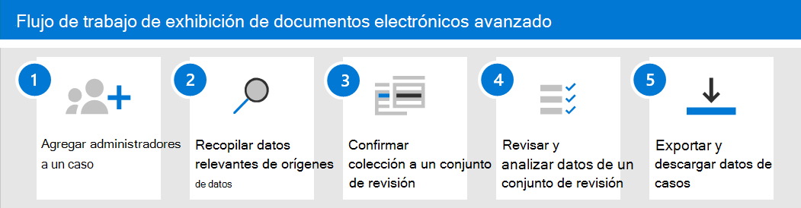

# Introducción a eDiscovery avanzadoGet started with Advanced eDiscovery

EDiscovery avanzado en Microsoft 365 proporciona un [flujo de trabajo de un extremo a otro](overview-ediscovery-20.md#advanced-ediscovery-architecture) para preservar, recopilar, revisar, analizar y exportar datos que responden a las investigaciones internas y externas de su organización.Advanced eDiscovery in Microsoft 365 provides an [end-to-end workflow](overview-ediscovery-20.md#advanced-ediscovery-architecture) to preserve, collect, review, analyze, and export data that's responsive to your organization's internal and external investigations. No se necesita nada para implementar la exhibición avanzada de documentos electrónicos, pero hay algunas tareas de requisitos previos que debe realizar un administrador de ti y un administrador de exhibición de documentos electrónicos antes de que su organización pueda empezar a crear y usar casos de eDiscovery avanzados para administrar las investigaciones.Nothing is needed to deploy Advanced eDiscovery, but there are some prerequisite tasks that an IT admin and eDiscovery manager have to complete before your organization can start to create and use Advanced eDiscovery cases to manage your investigations.

En este artículo se describen los pasos necesarios para configurar la exhibición avanzada de documentos electrónicos.This article discusses the steps necessary to set up Advanced eDiscovery. Esto incluye garantizar las licencias adecuadas necesarias para acceder a la exhibición de documentos electrónicos avanzada y agregar custodios a los casos, así como asignar permisos a su equipo legal y de investigación para que puedan acceder a los casos y administrarlos.This includes ensuring the proper licensing required to access Advanced eDiscovery and add custodians to cases, as well as assigning permissions to your legal and investigation team so they can access and manage cases. En este artículo también se proporciona una introducción de alto nivel sobre el uso de casos para administrar el flujo de trabajo de eDiscovery avanzado para una investigación legal.This article also provides a high-level overview of using cases to manage the Advanced eDiscovery workflow for a legal investigation.

## Paso 1: comprobar y asignar las licencias adecuadasStep 1: Verify and assign appropriate licenses

La concesión de licencias para eDiscovery avanzado requiere la suscripción a la organización correspondiente y la licencia por usuario.Licensing for Advanced eDiscovery requires the appropriate organization subscription and per-user licensing.

- **Suscripción de la organización:** Para obtener acceso a la exhibición avanzada de documentos electrónicos en el centro de cumplimiento de Microsoft 365 o el centro de seguridad & cumplimiento, su organización debe tener una de las siguientes opciones:**Organization subscription:** To access Advanced eDiscovery in the Microsoft 365 compliance center or the Security & Compliance Center, your organization must have one of the following:

  - Suscripciones a Microsoft 365 E5 u Office 365 E5.Microsoft 365 E5 or Office 365 E5 subscription
  
  - Suscripción a Microsoft 365 E3 con complemento de cumplimiento E5Microsoft 365 E3 subscription with E5 Compliance add-on

  - Suscripción a Microsoft 365 E3 con el complemento de eDiscovery y auditoría de E5Microsoft 365 E3 subscription with E5 eDiscovery and Audit add-on

  Si no tiene un plan de Microsoft 365 E5 existente y desea probar la exhibición avanzada de documentos electrónicos, puede [Agregar microsoft 365](https://docs.microsoft.com/office365/admin/try-or-buy-microsoft-365) a la suscripción existente o [registrarse para obtener una versión de prueba](https://www.microsoft.com/microsoft-365/enterprise) de Microsoft 365 E5.If you don't have an existing Microsoft 365 E5 plan and want to try Advanced eDiscovery, you can [add Microsoft 365](https://docs.microsoft.com/office365/admin/try-or-buy-microsoft-365) to your existing subscription or [sign up for a trial](https://www.microsoft.com/microsoft-365/enterprise) of Microsoft 365 E5.

- **Licencias por usuario:** Para agregar un usuario como custodio en un caso de exhibición de documentos electrónicos, el usuario debe tener asignada una de las siguientes licencias, según la suscripción de la organización:**Per-user licensing:** To add a user as a custodian in an Advance eDiscovery case, that user must be assigned one of the following licenses, depending on your organization subscription:

  - Microsoft 365: los usuarios deben tener asignada una licencia de Microsoft 365 E5, una licencia de complemento de cumplimiento E5 o una licencia de eDiscovery y de auditoría de la exhibición de documentos electrónicos E5.Microsoft 365: Users must be assigned a Microsoft 365 E5 license, an E5 Compliance add-on license, or an E5 eDiscovery and Audit add-on license.

  - Office 365: los usuarios deben tener asignada una licencia de Office 365 E5.Office 365: Users must be assigned an Office 365 E5 license.

   Para obtener información acerca de cómo asignar licencias, consulte [asignar licencias a los usuarios](https://docs.microsoft.com/microsoft-365/admin/manage/assign-licenses-to-users).For information about how to assign licenses, see [Assign licenses to users](https://docs.microsoft.com/microsoft-365/admin/manage/assign-licenses-to-users).

> [!NOTE]
> Los usuarios solo necesitan una licencia E5 (o la licencia de complemento correspondiente) para agregarse como custodios a un caso de eDiscovery avanzado.Users only need an E5 license (or the appropriate add-on license) to be added as custodians to an Advanced eDiscovery case. Los administradores de ti, los administradores de eDiscovery, los abogados, los parajudiciales o los investigadores que usan eDiscovery avanzado para administrar los casos y revisar los datos de caso no necesitan una licencia E5 o de complemento.IT admins, eDiscovery managers, lawyers, paralegals, or investigators who use Advanced eDiscovery to manage cases and review case data don't need an E5 or add-on license.

## Paso 2: asignar permisos de exhibición de documentos electrónicosStep 2: Assign eDiscovery permissions

Para obtener acceso a la exhibición de documentos electrónicos avanzada o agregar como miembro de un caso de exhibición de documentos electrónicos avanzado, un usuario debe tener asignados los permisos adecuados.To access Advanced eDiscovery or added as a member of an Advanced eDiscovery case, a user must be assigned the appropriate permissions. En concreto, debe agregarse un usuario como miembro del grupo de roles eDiscovery Manager en el centro de seguridad & cumplimiento.Specifically, a user must be added as a member of the eDiscovery Manager role group in the Security & Compliance Center. Los miembros de este grupo de roles pueden crear y administrar casos de eDiscovery avanzados.Members of this role group can create and manage Advanced eDiscovery cases. Pueden agregar y quitar miembros, ubicar custodios y ubicaciones de contenido en retención, administrar notificaciones de retención legal, crear y editar búsquedas asociadas en un caso, agregar resultados de búsqueda a un conjunto de revisión, analizar datos en un conjunto de revisión, y exportar y descargar desde un caso de exhibición de documentos electrónicos avanzado.They can add and remove members, place custodians and content locations on hold, manage legal hold notifications, create and edit searches associated in a case, add search results to a review set, analyze data in a review set, and export and download from an Advanced eDiscovery case.

Complete los siguientes pasos para agregar usuarios al grupo de roles eDiscovery Manager:Complete the following steps to add users to the eDiscovery Manager role group:

1. Vaya a [https://protection.office.com/permissions](https://protection.office.com/permissions) e inicie sesión con las credenciales de una cuenta de administrador en la organización de Microsoft 365.Go to [https://protection.office.com/permissions](https://protection.office.com/permissions) and sign in using the credentials for an admin account in your Microsoft 365 organization.

2. En la página **permisos** , seleccione el grupo de roles **Administrador de exhibición** de documentos electrónicos.On the **Permissions** page, select the **eDiscovery Manager** role group.

3. En la página desplegable administrador de exhibición de documentos electrónicos, haga clic en **Editar** junto a la sección **Administrador de exhibición** de documentos electrónicos.On the eDiscovery Manager flyout page, click **Edit** next to the **eDiscovery Manager** section.

4. En la página **elegir administrador de exhibición** de documentos electrónicos del asistente editar grupo de roles, haga clic en **elegir administrador de detección**.On the **Choose eDiscovery Manager** page in the edit role group wizard, click **Choose Discovery Manager**.

5. Haga clic en **Agregar** y, a continuación, active la casilla de verificación para todos los usuarios que desee agregar al grupo de roles.Click **Add** then select the checkbox for all users you want to add to the role group.

6. Haga clic en **Agregar** para agregar los usuarios seleccionados y, a continuación, haga clic en **listo**.Click **Add** to add the selected users, and then click **Done**.

7. Haga clic en **Guardar** para agregar los usuarios al grupo de roles y, a continuación, haga clic en **cerrar** para completar el paso.Click **Save** to add the users to the role group, and then click **Close** to complete the step.

### Más información sobre el grupo de roles de eDiscovery ManagerMore information about the eDiscovery Manager role group

Hay dos subgrupos en el grupo de roles de administrador de exhibición de documentos electrónicos.There are two subgroups in the eDiscovery Manager role group. La diferencia entre estos subgrupos se basa en el ámbito.The difference between these subgroups is based on scope.

- **Administrador de eDiscovery:** Permite ver y administrar los casos de eDiscovery avanzados que crean o de los que son miembros.**eDiscovery Manager:** Can view and manage the Advanced eDiscovery cases they create or are a member of. Si otro administrador de exhibición de documentos electrónicos crea un caso pero no agrega un segundo administrador de eDiscovery como miembro de ese caso, el segundo administrador de eDiscovery no podrá ver ni abrir el caso en la página de exhibición de documentos electrónicos avanzada en el centro de cumplimiento.If another eDiscovery Manager creates a case but doesn't add a second eDiscovery Manager as a member of that case, the second eDiscovery Manager won't be able to view or open the case on the Advanced eDiscovery page in the compliance center. En general, la mayoría de las personas de su organización se pueden agregar al subgrupo eDiscovery Manager.In general, most people in your organization can be added to the eDiscovery Manager subgroup.

- **Administrador de eDiscovery:** Puede realizar todas las tareas de administración de casos que puede realizar un administrador de exhibición de documentos electrónicos.**eDiscovery Administrator:** Can perform all case management tasks that an eDiscovery Manager can do. Además, un administrador de exhibición de documentos electrónicos puede:Additionally, an eDiscovery Administrator can:

  - Ver todos los casos que se enumeran en la página exhibición avanzada de documentos electrónicos.View all cases that are listed on the Advanced eDiscovery page.
  
  - Administrar cualquier caso en la organización después de que se agreguen como miembro del caso.Manage any case in the organization after they add themselves as a member of the case.

  - Obtenga acceso y exporte datos de casos para cualquier caso de la organización.Access and export case data for any case in the organization.

  Debido al amplio ámbito de acceso, una organización solo debe tener unos pocos administradores que sean miembros del subgrupo administradores de eDiscovery.Because of the broad scope of access, an organization should have only a few admins who are members of the eDiscovery Administrators subgroup.

Para obtener más información acerca de los permisos de exhibición de documentos electrónicos y una descripción de cada rol asignado al grupo de roles eDiscovery Manager, consulte [asignar permisos de exhibición](assign-ediscovery-permissions.md)de documentos electrónicos.For more information about eDiscovery permissions and a description of each role that's assigned to the eDiscovery Manager role group, see [Assign eDiscovery permissions](assign-ediscovery-permissions.md).

## Paso 3: configurar las opciones globales de eDiscovery avanzadoStep 3: Configure global settings for Advanced eDiscovery

El último paso para completar antes de que los usuarios de la organización comiencen a crear y a usar casos es configurar las opciones globales que se aplican a todos los casos de la organización.The last step to complete before people in your organization start to create and use cases is to configure global settings that apply to all cases in your organization. En este momento, la única configuración global es *abogado-detección de privilegios de cliente* (más configuraciones globales estarán disponibles en el futuro).At this time, the only global setting is *attorney-client privilege detection* (more global settings will be available in the future). Esta configuración permite que el modelo de privilegios abogado-Client se ejecute al analizar datos en un conjunto de revisión.This setting enables the attorney-client privilege model to run when you analyze data in a review set. El modelo usa el aprendizaje de la máquina para determinar la probabilidad de que un documento incluya contenido que sea legal por naturaleza.The model uses machine learning to determine the likelihood that a document contains content that is legal in nature. También compara los participantes de los documentos con una lista de abogados (que se envía al configurar el modelo) para determinar si un documento tiene al menos un participante que es un abogado.It also compares the participants of documents with an attorney list (that you submit when setting up the model) to determine if a document has at least one participant who is an attorney.

Para obtener más información acerca de la configuración y el uso del modelo de detección de privilegios de clientes de abogados, consulte [set up abogado-Client Privilege Detection in Advanced eDiscovery](attorney-privilege-detection.md).For more information about setting up and using the attorney-client privilege detection model, see [Set up attorney-client privilege detection in Advanced eDiscovery](attorney-privilege-detection.md).

> [!NOTE]
> Este es un paso opcional que puede realizar en cualquier momento.This is an optional step that you can perform anytime. No implementar el modelo de detección de privilegios de clientes de abogados no impide crear y usar casos de exhibición de documentos electrónicos avanzada.Not implementing the attorney-client privilege detection model doesn't prevent you from creating and using Advanced eDiscovery cases.

## Paso 4: crear un caso de exhibición avanzada de documentos electrónicosStep 4: Create an Advanced eDiscovery case

El siguiente paso es crear un caso y empezar a usar la exhibición avanzada de documentos electrónicos.The next step is to create a case and start using Advanced eDiscovery. Complete los siguientes pasos para crear un caso y agregar miembros.Complete the following steps to create a case and add members. El usuario que crea el caso se agrega automáticamente como miembro.The user who creates the case is automatically added as a member.

1. Vaya a [https://compliance.microsoft.com](https://compliance.microsoft.com) e inicie sesión con las credenciales de la cuenta de usuario a la que se le han asignado los permisos de eDiscovery adecuados.Go to [https://compliance.microsoft.com](https://compliance.microsoft.com) and sign in using the credentials for user account that has been assigned the appropriate eDiscovery permissions. Los miembros del grupo de roles administración de la organización también pueden crear casos de eDiscovery avanzados.Members of the Organization Management role group can also create Advanced eDiscovery cases.

2. En el panel de navegación izquierdo del centro de cumplimiento de Microsoft 365, haga clic en **Mostrar todo** y, a continuación, en **eDiscovery > avanzadas**.In the left navigation pane of the Microsoft 365 compliance center, click **Show all** , and then click **eDiscovery > Advanced**.

3. En la página **EDiscovery avanzado** , haga clic en la pestaña **casos** y, a continuación, haga clic en **crear un caso**.On the **Advanced eDiscovery** page, click the **Cases** tab, and then click **Create a case**.

4. En la página nuevo elemento emergente de **exhibición** de documentos electrónicos, indique un nombre (obligatorio) y, a continuación, escriba un número de caso y una descripción opcionales.On the **New eDiscovery case** flyout page, give the case a name (required), and then type an optional case number and description. El nombre del caso debe ser único en la organización.The case name must be unique in your organization.

5. Haga clic en **Guardar** para crear el caso.Click **Save** to create the case.

   Se crea el nuevo caso y se muestra la pestaña **configuración** en el nuevo caso.The new case is created and the **Settings** tab in the new case is displayed. 

6. En el cuadro **permisos de acceso &** de la ficha **configuración** , haga clic en **seleccionar** y, a continuación, haga clic en **Actualizar**.In the **Access & permissions** tile on the **Settings** tab, click **Select** , and then click **Update**.

7. Haga clic en **Actualizar**.Click **Update**.

8. En la página desplegable **administrar este caso** , en **administrar miembros** , haga clic en **Agregar** para agregar miembros al caso.On the **Manage this case** flyout page, under **Manage members** , click **Add** to add members to the case.

9. En la lista de personas, active la casilla de verificación situada junto a los nombres de las personas que desea agregar al caso.In the list of people, select the check box next to the names of the people that you want to add to the case. Como se ha explicado anteriormente, asegúrese de que a las personas que agregue al caso se les haya asignado el permiso de eDiscovery adecuado.As previously explained, be sure that the people you add to the case have been assigned the appropriate eDiscovery permissions.

10. Una vez que haya seleccionado a los usuarios para agregar como miembros del caso, haga clic en **Agregar**.After you've selected the people to add as members of the case, click **Add**.

11. En la página desplegable **administrar este caso** , haga clic en **Guardar** para guardar la nueva lista de miembros de mayúsculas y minúsculas.In the **Manage this case** flyout page, click **Save** to save the new list of case members.

12. Haga clic en la pestaña **Inicio** para ir a la Página principal del caso.Click the **Home** tab to go to the case home page.

## Explorar el flujo de trabajo avanzado de eDiscoveryExplore the Advanced eDiscovery workflow

Para empezar a usar la exhibición avanzada de documentos electrónicos, este es un flujo de trabajo sencillo que se alinea con las [prácticas comunes de eDiscovery](overview-ediscovery-20.md#alignment-with-edrm).To get you started using Advanced eDiscovery, here's a simple workflow that aligns with [common eDiscovery practices](overview-ediscovery-20.md#alignment-with-edrm). En cada uno de estos pasos también se resaltará alguna funcionalidad avanzada de exhibición de documentos electrónicos avanzada que puede explorar.In each of these steps, we'll also highlight some extended Advanced eDiscovery functionality that you can explore.

1. **[Agregar custodios a un caso](add-custodians-to-case.md)**.**[Add custodians to a case](add-custodians-to-case.md)**. El primer paso tras crear un caso es agregar custodios.The first step after creating a case is to add custodians. Un *custodio* es una persona con control administrativo de un documento o un archivo electrónico que puede ser relevante para el caso.A *custodian* is a person having administrative control of a document or electronic file that may be relevant to the case. Estas son algunas de las cosas que ocurren (o que puede hacer) cuando agrega custodios a un caso:Here are some things that happen (or that you can do) when you add custodians to a case:

   - Los datos del buzón de correo de Exchange, la cuenta de OneDrive y los grupos de Microsoft Teams o Yammer a los que pertenece el custodio pueden "marcarse" como datos de apoyo en el caso.Data in the custodian's Exchange mailbox, OneDrive account, and any Microsoft Teams or Yammer groups that the custodian is a member of can be "marked" as custodial data in the case.
  
   - Los datos de custodios se reindizan (por un proceso denominado *indización avanzada* ).Custodian data is reindexed (by a process called *Advanced indexing* ). Esto ayuda a optimizar la búsqueda en el paso siguiente.This helps optimize searching for it in the next step.
  
   - Puede poner una retención en los datos de custodios.You can place a hold on custodian data. Así se conservan los datos que puedan ser relevantes para el caso durante la investigación.This preserves data that may be relevant to the case during the investigation.
  
   - Puede asociar otros orígenes de datos a un custodio (por ejemplo, puede asociar un sitio de SharePoint o un grupo de Microsoft 365 con un custodio) para que estos datos se puedan reindizar, poner en suspensión y realizar búsquedas, igual que los datos del buzón de correo de la custodio o de la cuenta de OneDrive.You can associate other data sources with a custodian (for example, you can associate a SharePoint site or Microsoft 365 Group with a custodian) so this data can be reindexed, placed on hold, and searched, just like the data in the custodian's mailbox or OneDrive account.

   - Puede usar el [flujo de trabajo de comunicaciones](managing-custodian-communications.md) en la exhibición avanzada de documentos electrónicos para enviar una notificación de retención legal a los custodios.You can use the [communications workflow](managing-custodian-communications.md) in Advanced eDiscovery to send a legal hold notification to custodians.

2. **[Buscar orígenes de datos de apoyo para datos relevantes para el caso](collecting-data-for-ediscovery.md)**.**[Search custodial data sources for data relevant to the case](collecting-data-for-ediscovery.md)**. Después de agregar custodios a un caso, use la herramienta de búsqueda integrada para buscar en las ubicaciones de datos del custodio los datos que puedan ser relevantes para el caso.After you add custodians to a case, use the built-in search tool to search the custodian data locations for data that may be relevant to the case. Se usan palabras clave, propiedades y condiciones para [crear consultas de búsqueda](building-search-queries.md) que devuelven los resultados de la búsqueda con los datos que es más probable que sean relevantes para el caso.You use keywords, properties, and conditions to [build search queries](building-search-queries.md) that return search results with the data that's most likely relevant to the case. También puede:You can also:

   - Ver las [estadísticas de búsqueda](search-statistics.md) que pueden ayudarle a refinar una consulta de búsqueda para restringir los resultados.View [search statistics](search-statistics.md) that may help you refine a search query to narrow the results.

   - Obtenga una vista previa de los resultados de la búsqueda para comprobar rápidamente si se encuentran los datos relevantes.Preview the search results to quickly verify whether the relevant data is being found.

   - Revise una consulta y vuelva a ejecutar la búsqueda.Revise a query and rerun the search.

3. **[Agregar datos a un conjunto de revisión](add-data-to-review-set.md)**.**[Add data to a review set](add-data-to-review-set.md)**. Una vez que haya configurado y comprobado que una búsqueda devuelve los datos deseados, el siguiente paso consiste en agregar los resultados de la búsqueda a un conjunto de revisión.Once you've configured and verified that a search returns the desired data, the next step is to add the search results to a review set. Cuando se agregan datos a un conjunto de revisión, los elementos se copian de su ubicación original en una ubicación de almacenamiento segura de Azure.When you add data to a review set, items are copied from their original location to a secure Azure Storage location. Los datos se vuelven a indizar de nuevo para optimizarlos para realizar búsquedas exhaustivas y rápidas al revisar y analizar elementos en el conjunto de revisiones.The data is reindexed again to optimize it for thorough and fast searches when reviewing and analyzing items in the review set. Además, también puede [Agregar datos que no son de Office 365 a un conjunto de revisión](load-non-office-365-data-into-a-review-set.md).Additionally, you can also [add non-Office 365 data into a review set](load-non-office-365-data-into-a-review-set.md).

   También hay un tipo especial de conjunto de revisión al que puede agregar datos, denominados un *conjunto de revisión de conversación*.There's also a special kind of review set that you can add data to, called a *conversation review set*. Estos tipos de revisión proporcionan capacidades de reconstrucción de conversaciones para reconstruir, revisar y exportar conversaciones encadenadas como las de Microsoft Teams.These types of reviews sets provide conversation reconstruction capabilities to reconstruct, review, and export threaded conversations like those in Microsoft Teams. Para obtener más información, vea [revisar conversaciones en EDiscovery avanzado](conversation-review-sets.md).For more information, see [Review conversations in Advanced eDiscovery](conversation-review-sets.md).

4. **Revisar y analizar los datos de un conjunto de revisión**.**Review and analyze data in a review set**. Ahora que los datos están en un conjunto de revisión, puede usar una amplia variedad de herramientas y capacidades para ver y analizar los datos de casos con el objetivo de reducir el conjunto de datos a lo más relevante para el caso que está investigando.Now that data is in a review set, you can use a wide-variety of tools and capabilities to view and analyze the case data with the goal of reducing the data set to what is most relevant to the case you're investigating. Esta es una lista de algunas herramientas y capacidades que puede usar durante este proceso.Here's a list of some tools and capabilities that you can use during this process.

   - [Ver documentos](view-documents-in-review-set.md).[View documents](view-documents-in-review-set.md). Esto incluye ver los metadatos de cada documento en un conjunto de revisión y ver el documento en su versión nativa o de texto.This includes viewing the metadata for each document in a review set, and viewing the document in its native version or text version.

   - [Crear consultas y filtros](review-set-search.md).[Create queries and filters](review-set-search.md). Las consultas de búsqueda se crean con diversos criterios de búsqueda (incluida la capacidad de buscar en todas [las propiedades de los metadatos de archivo](document-metadata-fields-in-advanced-ediscovery.md)) para refinar y refinar los datos de casos a lo que sea más relevante para el caso.You create search queries using a variety of search criteria (including the ability to search all [file metadata properties](document-metadata-fields-in-advanced-ediscovery.md)) to further refine and cull the case data to what is most relevant to the case. También puede usar la revisión Set filters para aplicar rápidamente condiciones adicionales a los resultados de una consulta de búsqueda para restringir aún más los resultados.You can also use review set filters to quickly apply additional conditions to the results of a search query to further refine those results. 

   - [Cree y use etiquetas](tagging-documents.md).[Create and use tags](tagging-documents.md). Puede aplicar etiquetas a los documentos en un conjunto de revisiones para identificar los que responden (o que no responden a las mayúsculas y minúsculas) y, a continuación, usar esas etiquetas al crear consultas de búsqueda para incluir o excluir los documentos etiquetados.You can apply tags to documents in a review set to identify which are responsive (or non-responsive to the case) and then use those tags when creating search queries to include or exclude the tagged documents. También puede etiquetar para determinar los documentos que se van a exportar.You can also tagging to determine which documents to export.

   - [Anotar y censurar documentos](view-documents-in-review-set.md#annotate-view).[Annotate and redact documents](view-documents-in-review-set.md#annotate-view). Puede usar la herramienta de anotación en una revisión para anotar documentos y censurar el contenido de los documentos como producto de trabajo.You can use the annotation tool in a review to annotate documents and redact content in documents as work product. Durante la revisión, se genera una versión en PDF de un documento anotado o redactado para reducir el riesgo de exportar la versión nativa no censurada del documento.We generate a PDF version of an annotated or redacted document during review to reduce the risk of exporting the unredacted native version of the document.

   - [Analizar datos de casos](analyzing-data-in-review-set.md).[Analyze case data](analyzing-data-in-review-set.md). La funcionalidad de análisis en eDiscovery avanzado es eficaz.The analytics functionality in Advanced eDiscovery is powerful. Después de ejecutar análisis en los datos del conjunto de revisiones, realizaremos análisis como la detección de duplicados, el procesamiento de mensajes de correo electrónico y los temas que pueden ayudarle a reducir el volumen de documentos que tiene que revisar.After you run analytics on the data in review set, we perform analysis such as near duplicate detection, email threading, and themes that can help reduce the volume of documents that you have to review. También se genera un informe de análisis que resume el resultado de la ejecución de análisis.We also generate an Analytics reports that summarize the result of running analytics. Como se explicó anteriormente, la ejecución de análisis también ejecuta [el modelo de detección de privilegios de clientes de abogados](attorney-privilege-detection.md#use-the-attorney-client-privilege-detection-model).As previously explained, running analytics also runs [the attorney-client privilege detection model](attorney-privilege-detection.md#use-the-attorney-client-privilege-detection-model).

5. **Exportar y descargar datos de casos**.**Export and download case data**. Un paso final después de recopilar, revisar y analizar los datos de casos es exportarlos de la exhibición de documentos electrónicos avanzada para su revisión externa o su revisión por parte de personas ajenas al equipo de investigación.A final step after collecting, reviewing, and analyzing case data is to export it out of Advanced eDiscovery for external review or for review by people outside of the investigation team. La exportación de datos es un proceso de dos pasos.Exporting data is a two-step process. El primer paso consiste en [exportar](export-documents-from-review-set.md) los datos del conjunto de revisión y copiarlo en una ubicación de almacenamiento de Azure diferente (una proporcionada por Microsoft o una administrada por la organización).The first step is to [export](export-documents-from-review-set.md) data out of the review set and copy it to a different Azure Storage location (one provided by Microsoft or one managed by your organization). A continuación, se usa el explorador de Azure Storage para [Descargar](download-export-jobs.md) los datos en un equipo local.Then you use Azure Storage Explorer to [download](download-export-jobs.md) the data to a local computer. Además de los archivos de datos exportados, los Contains del paquete de exportación también contienen un informe de exportación, un informe de Resumen y un informe de errores.In addition to the exported data files, the contains of the export package also contains an export report, a summary report, and an error report.
