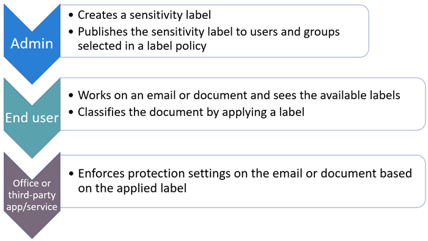

# Empiece a usar las etiquetas de confidencialidadGet started with sensitivity labels

Para obtener información sobre qué son las etiquetas de confidencialidad y cómo pueden ayudarle a proteger los datos de su organización, vea [Información sobre las etiquetas de confidencialidad](sensitivity-labels.md).For information about what sensitivity labels are and how they can help you protect your organization's data, see [Learn about sensitivity labels](sensitivity-labels.md).

Si tiene [Azure Information Protection](https://docs.microsoft.com/azure/information-protection/what-is-information-protection), determine si necesita migrar etiquetas a la plataforma de etiquetado unificado y qué cliente de etiquetado usar:If you have [Azure Information Protection](https://docs.microsoft.com/azure/information-protection/what-is-information-protection), determine whether you need to migrate labels to the unified labeling platform, and which labeling client to use:
- [¿Cómo puedo saber si mi espacio empresarial está en la plataforma de etiquetado unificado?How can I determine if my tenant is on the unified labeling platform?](https://docs.microsoft.com/azure/information-protection/faqs#how-can-i-determine-if-my-tenant-is-on-the-unified-labeling-platform)
- [Elegir el cliente de etiquetas que se usará para equipos WindowsChoose which labeling client to use for Windows computers](https://docs.microsoft.com/azure/information-protection/rms-client/use-client#choose-which-labeling-client-to-use-for-windows-computers)

Cuando esté listo para empezar a proteger los datos de la organización mediante etiquetas de confidencialidad:When you're ready to start protecting your organization's data by using sensitivity labels:

1. **Creación de las etiquetas.****Create the labels.** Cree y asigne un nombre a las etiquetas de confidencialidad en función de la taxonomía de clasificación de su organización para distintos niveles de confidencialidad de contenido.Create and name your sensitivity labels according to your organization's classification taxonomy for different sensitivity levels of content. Utilice nombres o términos comunes que tengan sentido para sus usuarios.Use common names or terms that make sense to your users. Si aún no tiene una taxonomía establecida, considere la posibilidad de empezar por nombres de etiqueta como personal, público, general, confidencial y muy confidencial.If you don't already have an established taxonomy, consider starting with label names such as Personal, Public, General, Confidential, and Highly Confidential. Puede utilizar subetiquetas para agrupar etiquetas similares por categoría.You can then use sublabels to group similar labels by category. Cuando se crea una etiqueta, use el texto de información sobre herramientas para ayudar a los usuarios a seleccionar la etiqueta apropiada.When you create a label, use the  tooltip text to help users select the appropriate label.

2. **Defina la función de cada etiqueta.****Define what each label can do.** Configure los ajustes de protección que desea asociar a cada etiqueta.Configure the protection settings you want associated with each label. Por ejemplo, tal vez desee que el contenido de menor confidencialidad (como una etiqueta "General") pueda simplemente tener un encabezado o pie de página aplicado, mientras que el contenido de mayor confidencialidad (como una etiqueta "Confidencial") debiera tener una marca de agua, encriptación y protección de los puntos de conexión.For example, you might want lower sensitivity content (such as a “General” label) to have just a header or footer applied, while higher sensitivity content (such as a “Confidential” label) should have a watermark, encryption, and endpoint protection applied.

3. **Publique las etiquetas.****Publish the labels.** Una vez configuradas las etiquetas de sensibilidad, publíquelas mediante una directiva de etiqueta.After your sensitivity labels are configured, publish them by using a label policy. Decida qué usuarios y grupos deben tener las etiquetas y qué configuración de directiva usar.Decide which users and groups should have the labels and what policy settings to use. Una sola etiqueta es reutilizable: se define una vez y, después, se puede incluir en varias directivas de etiquetas asignadas a diferentes usuarios.A single label is reusable — you define it once, and then you can include it in several label policies assigned to different users. Por ejemplo, puede crear una prueba de las etiquetas de confidencialidad asignando una directiva de etiqueta a solo algunos usuarios.So for example, you could pilot your sensitivity labels by assigning a label policy to just a few users. Cuando esté listo para implementar las etiquetas en la organización, puede crear una nueva directiva para sus etiquetas y, esta vez, especificar todos los usuarios.Then when you're ready to roll out the labels across your organization, you can create a new label policy for your labels and this time, specify all users.

Pasos básicos que llevan a cabo el administrador, el usuario, y las aplicaciones y los servicios de Office para hacer funcionar las etiquetas de confidencialidad:The basic flow for what the admin, user, and Office apps and services do to make sensitivity labels work:

## Escenarios comunes de etiquetas de confidencialidadCommon scenarios for sensitivity labels

Use la siguiente documentación para ayudarle con su implementación de etiquetado de confidencialidad:Use the following documentation to support your sensitivity labeling deployment:

|Quiero...I want to ...|DocumentaciónDocumentation|
|----------------|---------------|
|Crear y publicar etiquetas de confidencialidad que ayudarán a proteger los datos de mi organizaciónCreate and publish sensitivity labels that will help protect my organization's data|[Crear y configurar etiquetas de confidencialidad y sus directivasCreate and configure sensitivity labels and their policies](create-sensitivity-labels.md)|
|Cifre documentos y mensajes de correo electrónico con etiquetas de confidencialidad y restrinja quién puede tener acceso a ellos y cómo puede usar el contenido.Encrypt documents and emails with sensitivity labels and restrict who can access it and how they can use that content |[Restringir el acceso al contenido mediante el uso de etiquetas de confidencialidad para aplicar el cifradoRestrict access to content by using sensitivity labels to apply encryption](encryption-sensitivity-labels.md)|
|Habilite las características de colaboración en SharePoint (y OneDrive) para los documentos que se etiquetan con el cifradoEnable collaboration capabilities in SharePoint (and OneDrive) for documents that are labeled with encryption | [Habilitar etiquetas de confidencialidad para los archivos de Office en SharePoint y OneDrive (vista previa)Enable sensitivity labels for Office files in SharePoint and OneDrive (public preview)](sensitivity-labels-sharepoint-onedrive-files.md)
|Administre etiquetas de confidencialidad para las aplicaciones de Office para que el contenido se etiquete a medida que se creaManage sensitivity labels for Office apps so that content is labeled as it's created |[Usar etiquetas de confidencialidad en las aplicaciones de OfficeUse sensitivity labels in Office apps](sensitivity-labels-office-apps.md)|
|Aplique etiquetas de confidencialidad automáticamente o recomiende etiquetas a los usuarios al crear contenidoAutomatically apply sensitivity labels or recommend labels to users when content is created | [Aplicar una etiqueta de confidencialidad automáticamente al contenidoApply a sensitivity label to content automatically](apply-sensitivity-label-automatically.md)|
|Use etiquetas de confidencialidad para proteger el contenido de Teams y SharePointUse sensitivity labels to protect content in Teams and  SharePoint |[Usar etiquetas de confidencialidad con Microsoft Teams, grupos de Office 365 y sitios de SharePoint (versión preliminar pública)Use sensitivity labels with Microsoft Teams, Office 365 groups, and SharePoint sites (public preview)](sensitivity-labels-teams-groups-sites.md)|
|Detecte, etiquete y proteja los archivos almacenados en almacenes de datos localesDiscover, label, and protect files stored in on-premises data stores |[Implementación del escáner de Azure Information Protection para clasificar y proteger los archivos automáticamenteDeploying the Azure Information Protection scanner to automatically classify and protect files](https://docs.microsoft.com/azure/information-protection/deploy-aip-scanner)|
|Detecte, etiquete y proteja archivos almacenados en almacenes de datos en la nubeDiscover, label, and protect files stored in cloud data stores |[Descubrir, clasificar, etiquetar y proteger la información regulada y confidencialidad almacenada en la nubeDiscover, classify, label, and protect regulated and sensitive data stored in the cloud](https://docs.microsoft.com/cloud-app-security/best-practices#discover-classify-label-and-protect-regulated-and-sensitive-data-stored-in-the-cloud)|
|Visualizar cómo se usan las etiquetas de confidencialidad para informar del estado de implementación y ajustar la configuración de etiquetasVisualize how sensitivity labels are being used to report deployment status and fine-tune label configuration|[Ver el uso de etiquetas con el análisis de etiquetasView label usage with label analytics](label-analytics.md)|

## Documentación de usuario final para las etiquetas de confidencialidadEnd-user documentation for sensitivity labels

- [Aplicar etiquetas de confidencialidad a los archivos y mensajes en OfficeApply sensitivity labels to your files and email in Office](https://support.office.com/article/apply-sensitivity-labels-to-your-files-and-email-in-office-2f96e7cd-d5a4-403b-8bd7-4cc636bae0f9)

- [Problemas conocidos con las etiquetas de confidencialidad en OfficeKnown issues with sensitivity labels in Office](https://support.office.com/en-us/article/known-issues-with-sensitivity-labels-in-office-b169d687-2bbd-4e21-a440-7da1b2743edc)

- [Aplicar o recomendar automáticamente etiquetas de confidencialidad para sus archivos y correos electrónicos en OfficeAutomatically apply or recommend sensitivity labels to your files and emails in Office](https://support.office.com/article/automatically-apply-or-recommend-sensitivity-labels-to-your-files-and-emails-in-office-622e0d9c-f38c-470a-bcdb-9e90b24d71a1)

- [Problemas conocidos al aplicar o recomendar automáticamente etiquetas de confidencialidadKnown issues with automatically applying or recommending sensitivity labels](https://support.office.com/article/known-issues-with-automatically-applying-or-recommending-sensitivity-labels-451698ae-311b-4d28-83aa-a839a66f6efc)

