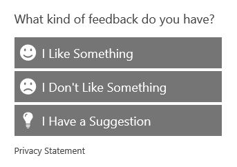

# Introducción al portal de confianza de servicios de MicrosoftGet started with the Microsoft Service Trust Portal

El portal de confianza de servicios de Microsoft proporciona una variedad de contenido, herramientas y otros recursos sobre las prácticas de seguridad, privacidad y cumplimiento de Microsoft.The Microsoft Service Trust Portal provides a variety of content, tools, and other resources about Microsoft security, privacy, and compliance practices.

## Acceso al portal de confianza de serviciosAccessing the Service Trust Portal

El portal de confianza del servicio contiene detalles sobre la implementación de Microsoft de controles y procesos que protegen nuestros servicios en la nube y los datos del cliente que hay en él.The Service Trust Portal contains details about Microsoft's implementation of controls and processes that protect our cloud services and the customer data therein. Para obtener acceso a algunos de los recursos del portal de confianza de servicios, debe iniciar sesión como usuario autenticado con su cuenta de servicios en la nube de Microsoft (ya sea una cuenta de Microsoft Azure Active Directory o una cuenta de Microsoft) y revisar y aceptar el contrato de Microsoft no divulgación para los materiales de cumplimiento.To access some of the resources on the Service Trust Portal, you must log in as an authenticated user with your Microsoft cloud services account (either an Azure Active Directory organization account or a Microsoft Account) and review and accept the Microsoft Non-Disclosure Agreement for Compliance Materials.

### Clientes existentesExisting customers

Los clientes existentes pueden acceder al portal de confianza de servicios en <https://aka.ms/STP> con una de las siguientes suscripciones en línea (de prueba o de pago):Existing customers can access the Service Trust Portal at <https://aka.ms/STP> with one of the following online subscriptions (trial or paid):

- Microsoft 365Microsoft 365
- Dynamics 365Dynamics 365
- AzureAzure

 > [!NOTE]
 > Las cuentas de Azure Active Directory asociadas con las organizaciones tienen acceso a toda la gama de documentos y características como administrador de cumplimiento.Azure Active Directory accounts associated with organizations have access to the full range of documents and features like Compliance Manager. Las cuentas de Microsoft creadas para uso personal tienen acceso limitado al contenido del portal de confianza de servicios.Microsoft accounts created for personal use have limited access to Service Trust Portal content.

### Nuevos clientes y clientes que evalúen Microsoft Online ServicesNew customers and customers evaluating Microsoft online services

Para crear una cuenta nueva o para crear una cuenta de prueba, use uno de los siguientes formularios de suscripción (también se usa para las cuentas de prueba) para obtener acceso a STP.To create a new account or to create a trial account, use one of the following sign-up forms (also used for trial accounts) to get access to the STP.

- Inscríbase para obtener una nueva cuenta [de prueba de Microsoft 365 apps for Business](https://go.microsoft.com/fwlink/p/?LinkID=507653) o una nueva [cuenta de prueba de Office 365 Enterprise](https://go.microsoft.com/fwlink/p/?LinkID=698279)Sign up for a new [Microsoft 365 Apps for business trial account](https://go.microsoft.com/fwlink/p/?LinkID=507653) or a new [Office 365 Enterprise trial account](https://go.microsoft.com/fwlink/p/?LinkID=698279)

- Registrarse para obtener una nueva [cuenta de prueba de Dynamics 365](https://go.microsoft.com/fwlink/?LinkId=252780)Sign up for a new [Dynamics 365 trial account](https://go.microsoft.com/fwlink/?LinkId=252780)

- Regístrese para obtener una nueva [cuenta de prueba de Azure](https://go.microsoft.com/fwlink/?LinkId=722737).Sign up for a new [Azure trial account](https://go.microsoft.com/fwlink/?LinkId=722737).

Al registrarse para obtener una prueba gratuita o una suscripción, debe habilitar Azure Active Directory para que admita el acceso a STP.When you sign up for either a free trial, or a subscription, you must enable Azure Active Directory to support your access to the STP.

## Uso del portal de confianza de serviciosUsing the Service Trust Portal

El contenido y las características del portal de confianza de servicios son accesibles desde el menú principal.The Service Trust Portal features and content are accessible from the main menu.

En las secciones siguientes se describe cada elemento en el menú principal.The following sections describe each item in the main menu.

### Portal de confianza del servicioService Trust Portal

El vínculo **portal de confianza de servicios** muestra la Página principal.The **Service Trust Portal** link displays the home page. Proporciona una forma rápida de volver a la Página principal.It provides a quick way to get back to the home page.

### Administrador de cumplimientoCompliance Manager

El administrador de cumplimiento es una herramienta de evaluación de riesgos basada en flujos de trabajo que le ayuda a controlar, asignar y comprobar las actividades de cumplimiento normativo de su organización relacionadas con los servicios en la nube de Microsoft, como Microsoft 365, Dynamics 365 y Azure.Compliance Manager is a workflow-based risk assessment tool that helps you track, assign, and verify your organization's regulatory compliance activities related to Microsoft Cloud services, such as Microsoft 365, Dynamics 365, and Azure. Use el administrador de cumplimiento para administrar el cumplimiento normativo en el modelo de responsabilidad compartida de la nube.Use Compliance Manager to manage regulatory compliance within the shared responsibility model of the cloud. En función de la versión del administrador de cumplimiento que desee usar, vea los artículos siguientes para obtener más información:Depending on the version of Compliance Manager you want to use, see the following articles for more information:

- [Administrador de cumplimiento de Microsoft (Classic)Microsoft Compliance Manager (Classic)](meet-data-protection-and-regulatory-reqs-using-microsoft-cloud.md)

- [Administrador de cumplimiento de Microsoft (versión preliminar)Microsoft Compliance Manager (Preview)](compliance-manager-overview.md)

### Documentos de confianzaTrust Documents

Proporciona una gran cantidad de información sobre la implementación y el diseño de seguridad con el objetivo de que sea más fácil para usted cumplir los objetivos de cumplimiento normativo mediante la comprensión del modo en que los servicios en la nube de Microsoft mantienen seguros sus datos.Provides a wealth of security implementation and design information with the goal of making it easier for you to meet regulatory compliance objectives by understanding how Microsoft Cloud services keep your data secure. Para revisar el contenido, seleccione una de las siguientes opciones en el menú desplegable de **documentos de confianza** .To review content, select one of the following options on the **Trust Documents** pull-down menu.

- **Informes de auditoría:** Se muestra una lista de informes independientes de auditoría y evaluación de los servicios en la nube de Microsoft.**Audit Reports:** A list of independent audit and assessment reports on Microsoft's Cloud services is displayed. Estos informes proporcionan información sobre el cumplimiento de los servicios en la nube de Microsoft con los estándares de protección de datos y los requisitos normativos, como:These reports provide information about Microsoft Cloud services compliance with data protection standards and regulatory requirements, such as:

  - Organización Internacional de normalización (ISO)International Organization for Standardization (ISO)
  - Controles para la Organización de Servicios (SOC)Service Organization Controls (SOC)
  - Instituto Nacional de Normas y Tecnología (NIST)National Institute of Standards and Technology (NIST)
  - Programa Federal de Administración de Autorizaciones y Riesgo (FedRAMP)Federal Risk and Authorization Management Program (FedRAMP)
  - Reglamento general de protección de datos (RGPD)General Data Protection Regulation (GDPR)

- **Protección de datos:** Contiene una gran cantidad de recursos, como controles auditados, notas del producto, preguntas más frecuentes, pruebas de penetración, herramientas de evaluación de riesgos y guías de cumplimiento.**Data Protection:** Contains a wealth of resources such as audited controls, white papers, FAQs, penetration tests, risk assessment tools, and compliance guides.

- **Proyectos de Azure Security y Compliance:** Recursos que le ayudarán a crear aplicaciones basadas en la nube seguras y compatibles.**Azure Security and Compliance Blueprints:** Resources that help you build secure and compliant cloud-based applications. En esta área se incluyen guías de Blueprint para la administración pública, finanzas, servicios de salud y verticales comerciales.This area contain blueprint-guidance for government, finance, healthcare, and retail verticals.

### Sectores y regionesIndustries & Regions

Proporciona información de cumplimiento específica de la industria y de la región sobre los servicios en la nube de Microsoft.Provides industry- and region-specific compliance information about Microsoft Cloud services.

- **Industrias:** En este momento, esta página proporciona una página de aterrizaje específica del sector para la industria de servicios financieros.**Industries:** At this time, this page provides an industry-specific landing page the for the Financial Services industry. Contiene información como ofertas de cumplimiento, preguntas más frecuentes y historias de éxito.This contains information such as compliance offerings, FAQs, and success stories. Los recursos para más industrias se publicarán en el futuro, pero puede encontrar recursos para más industrias en la página de **documentos de confianza > protección de datos** en el STP.Resources for more industries will be released in the future, however you can find resources for more industries by going to the **Trust Documents > Data Protection** page in the STP.

- **Regiones:** Proporciona dictámenes legales sobre el cumplimiento de los servicios en la nube de Microsoft con diversas leyes de varios países.**Regions:** Provides legal opinions on Microsoft Cloud services compliance with various the laws of various countries. Los países específicos incluyen Australia, Canadá, República Checa, Dinamarca, Alemania, Polonia, Rumanía, España y Reino Unido.Specific countries include Australia, Canada, Czech Republic, Denmark, Germany, Poland, Romania, Spain, and the United Kingdom.

### Centro de confianzaTrust Center

Vínculos al [centro de confianza de Microsoft](https://www.microsoft.com/trust-center), que proporciona más información sobre la seguridad, el cumplimiento y la privacidad en la nube de Microsoft.Links to the [Microsoft Trust Center](https://www.microsoft.com/trust-center), which provides more information about security, compliance, and privacy in the Microsoft Cloud. Esto incluye información sobre las capacidades de los servicios en la nube de Microsoft que puede usar para satisfacer requisitos específicos de la RGPD, la documentación útil para su responsabilidad RGPD y su conocimiento de las medidas técnicas y organizativas que Microsoft ha tomado para admitir el RGPD.This includes information about the capabilities in Microsoft Cloud services that you can use to address specific requirements of the GDPR, documentation helpful to your GDPR accountability and to your understanding of the technical and organizational measures Microsoft has taken to support the GDPR.

### Mi bibliotecaMy Library

Esta nueva característica le permite guardar (o *anclar*) documentos para que pueda obtener acceso rápidamente a ellos en la página mi biblioteca.This new feature lets you save (or *pin*) documents so that you can quickly access them on your My Library page. También puede configurar notificaciones para que Microsoft le envíe un mensaje de correo electrónico cuando se actualicen los documentos de la mis bibliotecas.You can also set up notifications so that Microsoft sends you an email message when documents in your My Library are updated. Para obtener más información, vea la sección [mi biblioteca](#my-library-1) de este artículo.For more information, see the [My Library](#my-library-1) section in this article.

### MásMore

Vaya a **más > administrador** para acceder a funciones administrativas que solo están disponibles para la cuenta de administrador global.Go to **More > Admin** to access administrative functions that are only available to the global administrator account. Esta opción solo está visible si ha iniciado sesión como administrador global.This option is visible only when you are signed in as a global administrator. Hay dos opciones en el menú desplegable **Administración** :There are two options in the **Admin** pull-down menu:

- **Configuración:** Esta página le permite asignar acceso basado en roles (conocidos como *roles de usuario*) al administrador de cumplimiento.**Settings:** This page lets you assign role-based access (known as *user roles*) to Compliance Manager.  Para más información, consulte:For more information, see:

  - [Permisos en el administrador de cumplimiento (clásico)Permissions in Compliance Manager (Classic)](meet-data-protection-and-regulatory-reqs-using-microsoft-cloud.md#permissions-and-role-based-access-control)

  - [Permisos en el administrador de cumplimiento (versión preliminar)Permissions in Compliance Manager (Preview)](compliance-manager-overview.md#permissions)

  También puede configurar si las acciones en el administrador de cumplimiento se actualizan en función del estado de la misma acción en calificación segura.You can also configure whether actions in Compliance Manager are updated based on the status of the same action in Secure Score. Esta funcionalidad solo se admite si usa la versión más reciente del administrador de cumplimiento.This capability is only supported if you're using the latest version of Compliance Manager. Para obtener más información, consulte [control de actualizaciones automáticas de puntuaciones seguras](working-with-compliance-manager.md#controlling-automatic-secure-score-updates).For more information, see [Controlling automatic Secure Score updates](working-with-compliance-manager.md#controlling-automatic-secure-score-updates).

- **Configuración de privacidad del usuario:** Esta página le permite exportar un informe que contiene asignaciones de elementos de acción en el administrador de cumplimiento para un usuario específico.**User Privacy Settings:** This page lets you export a report that contains action item assignments in Compliance Manager for a specific user. También puede reasignar todos los elementos de acción a un usuario diferente y quitar cualquier elemento de acción asignado del usuario especificado.You can also reassign all action items to a different user and remove any assigned action item from the specified user. Para obtener más información, vea [configuración de privacidad de usuario](meet-data-protection-and-regulatory-reqs-using-microsoft-cloud.md#user-privacy-settings).For more information, see [User Privacy settings](meet-data-protection-and-regulatory-reqs-using-microsoft-cloud.md#user-privacy-settings).

### BúsquedaSearch

Haga clic en la lupa de la esquina superior derecha de la página portal de confianza de servicios para expandir el cuadro, escriba los términos de búsqueda y presione **entrar**.Click the magnifying glass in the upper right-hand corner of the Service Trust Portal page to expand the box, enter your search terms, and press **Enter**. Se muestra la página de **búsqueda** , con el término de búsqueda en el cuadro de búsqueda y los resultados de la búsqueda que se enumeran a continuación.The **Search** page is displayed, with the search term displayed in the search box and the search results listed below.

De forma predeterminada, la búsqueda devuelve los resultados del documento.By default, th search returns document results. Puede filtrar los resultados con las listas desplegables para refinar la lista de documentos mostrados.You can filter the results by using the dropdown lists to refine the list of documents displayed. Puede usar varios filtros para restringir la lista de documentos.You can use multiple filters to narrow the list of documents. Los filtros incluyen los servicios en la nube específicos, categorías de cumplimiento o prácticas de seguridad, regiones e industrias.Filters include the specific cloud services, categories of compliance or security practices, regions, and industries. Haga clic en el vínculo nombre del documento para descargar el documento.Click the document name link to download the document.

Para enumerar controles a partir de evaluaciones en el administrador de cumplimiento relacionadas con los términos de búsqueda, haga clic en **Administrador de cumplimiento**.To list controls from Assessments in Compliance Manager related your search terms, click **Compliance Manager**. Los resultados de la búsqueda muestran la fecha en que se creó la evaluación, el nombre de la agrupación de la evaluación, el servicio aplicable en la nube de Microsoft y si el control es Microsoft o administrado por el cliente.The search results show the date the assessment was created, the name of the assessment grouping, the applicable Microsoft Cloud service, and whether the control is Microsoft or Customer Managed. Haga clic en el nombre del control para ver el control en la evaluación en Compliance Manager.Click the name of the control to view the control in the Assessment in Compliance Manager.

> [!NOTE]
> Los informes y documentos del portal de confianza de servicios están disponibles para su descarga durante al menos 12 meses después de su publicación o hasta que esté disponible una nueva versión del documento.Service Trust Portal reports and documents are available to download for at least 12 months after publishing or until a new version of document becomes available.

## Mi bibliotecaMy Library

Use la característica mi biblioteca para agregar documentos y recursos en el portal de confianza de servicios a la página mi biblioteca.Use the My Library feature to add documents and resources on the Service Trust Portal to your My Library page. Esto le permite acceder a los documentos que son relevantes para usted en un solo punto.This lets you access documents that are relevant to you in a single place.  Para agregar un documento a mi biblioteca, haga clic en el menú **...** a la derecha de un documento y, a continuación, seleccione **Guardar en la biblioteca**.To add a document to your My Library, click the **...** menu to the right of a document and then select **Save to library**. Puede agregar varios documentos a mi biblioteca haciendo clic en la casilla situada junto a uno o más documentos y, a continuación, hacer clic en **Guardar en la biblioteca** en la parte superior de la página.You can add multiple documents to your My Library by clicking the checkbox next to one or more documents, and then clicking **Save to library** at the top of the page.

Además, la característica de notificaciones le permite configurar mi biblioteca para que se le envíe un mensaje de correo electrónico siempre que Microsoft actualice un documento que haya agregado a mi biblioteca.Additionally, the notifications feature lets you configure your My Library so that an email message is sent to you whenever Microsoft updates a document that you've added to your My Library. Para configurar las notificaciones, vaya a mi biblioteca y haga clic en **configuración de notificaciones**.To set up notifications, go to your My Library and click **Notification Settings**. Puede elegir la frecuencia de las notificaciones y especificar una dirección de correo electrónico en la organización a la que enviar las notificaciones.You can choose the frequency of notifications and specify an email address in your organization to send notifications to. Las notificaciones de correo electrónico incluyen vínculos a los documentos que se han actualizado y una breve descripción de la actualización.Email notifications include links to the documents that have been updated and a brief description of the update.

Además, tenga en cuenta que se identifican los documentos de mi biblioteca que se han actualizado en los últimos 30 días, independientemente de si se activan las notificaciones.Also note that we identify any documents in your My Library that have been updated within the last 30 days, regardless of whether or not you turn on notifications. También se muestra una descripción breve de la actualización en una información sobre herramientas.A brief description of the update is also displayed in a tool tip.

## Paquetes de inicioStarter packs

Los paquetes de inicio son un conjunto de Microsoft-creados de documentación sobre los servicios en la nube de Microsoft para sectores específicos.Starter packs are a Microsoft-curated set of documentation about Microsoft Cloud services for specific industries. Actualmente, el portal de confianza de servicios ofrece los siguientes tres paquetes de inicio para organizaciones de servicios financieros.Currently, the Service Trust Portal offers the following three starter packs for financial services organizations. Estos paquetes de inicio ayudan a las organizaciones a evaluar y evaluar la seguridad, el cumplimiento y la privacidad en la nube de Microsoft y proporcionan instrucciones para ayudar a implementar los servicios en la nube de Microsoft en la industria de servicios financieros altamente regulados.These starter packs help organizations evaluate and assess security, compliance, and privacy in the Microsoft Cloud and provide guidance to help implement Microsoft Cloud services in the highly regulated financial services industry.

- **Paquete de evaluación de Inicio:** Usar para la evaluación anticipada de la nube de Microsoft para organizaciones de servicios financieros.**Evaluation Starter Pack:** Use for early evaluation of the Microsoft cloud for financial services organizations.

- **Paquete de evaluación de Inicio:** Después de la evaluación, use las listas de comprobación y otras instrucciones de este paquete de inicio para ayudar a su organización a evaluar los riesgos relacionados con la seguridad, el cumplimiento y la privacidad.**Assessment Starter Pack:** After evaluation, use the checklists and other guidance in this starter pack to help your organization assess risks related to security, compliance, and privacy.

- **Paquete de inicio de auditoría:** Use este paquete de inicio para obtener instrucciones sobre el uso de controles de auditoría y otras herramientas para ayudar a guiar la implementación de los servicios en la nube de Microsoft de una manera que ayude a reducir la exposición de la organización al riesgo.**Audit Starter Pack:** User this starter pack for guidance on using auditing controls and other tool to help guide your implementation of Microsoft Cloud services in a way that helps reduce your organization's exposure to risk.

Para acceder a estos paquetes de inicio, vaya a **Service Trust Portal > Industries & regions > Solutions Industry > Financial Services**.To access these starter packs, go to **Service Trust Portal > Industries & Regions > Industry Solutions > Financial Services**. Puede abrir o descargar documentos desde un paquete de inicio o guardarlos en mi biblioteca.You can open or a download documents from a starter pack or save them to your My Library.

## Soporte de localizaciónLocalization support

El portal de confianza del servicio le permite ver el contenido de la página en diferentes idiomas.The Service Trust Portal enables you to view the page content in different languages. Para cambiar el idioma de la página, simplemente haga clic en el icono del globo terráqueo en la esquina inferior izquierda de la página y seleccione el idioma de su elección.To change the page language, simply click on the globe icon in the lower left corner of the page and select the language of your choice.

## Enviar comentariosGive feedback

Podemos ayudarle con las preguntas sobre el portal de confianza de servicios o con los errores que experimente cuando use el portal.We can help with questions about the Service Trust Portal, or errors you experience when you use the portal. También puede ponerse en contacto con nosotros con preguntas y comentarios sobre los informes de cumplimiento del portal de confianza del servicio y los recursos de confianza mediante el vínculo comentarios en la parte inferior de las páginas STP.You can also contact us with questions and feedback about Service Trust Portal compliance reports and trust resources by using the Feedback link on the bottom of the STP pages.

Su opinión es importante para nosotros.Your feedback is important to us. Haga clic en el botón comentarios de la parte inferior de la página para enviarnos comentarios sobre lo que ha hecho o no le gusta, o sugerencias que puede tener para mejorar nuestros productos o características del producto.Click on the Feedback button at the bottom of the page to send us comments about what you did or did not like, or suggestions you may have for improving our products or product features.

