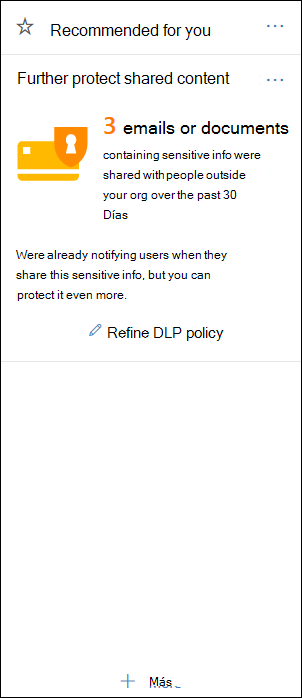

# Introducción a la directiva predeterminada de DLPGet started with the default DLP policy

Antes de crear la primera Directiva de prevención de pérdida de datos (DLP), DLP ayuda a proteger la información confidencial con una directiva predeterminada.Before you even create your first data loss prevention (DLP) policy, DLP is helping to protect your sensitive information with a default policy. Esta directiva predeterminada y su recomendación (que se muestra a continuación) ayudan a mantener seguro el contenido confidencial mediante una notificación cuando el correo electrónico o los documentos que contienen un número de tarjeta de crédito se han compartido con alguien ajeno a la organización.This default policy and its recommendation (shown below) help keep your sensitive content secure by notifying you when email or documents containing a credit card number were shared with someone outside your organization. Verá esta recomendación en la página **principal** del centro de seguridad y &amp; cumplimiento.You'll see this recommendation on the **Home** page of the Security &amp; Compliance Center. 
  
Puede usar este widget para ver rápidamente cuándo y cuánto se ha compartido la información confidencial y, a continuación, refinar la Directiva de DLP predeterminada en solo un clic o dos.You can use this widget to quickly view when and how much sensitive information was shared, and then refine the default DLP policy in just a click or two. También puede editar la Directiva DLP predeterminada en cualquier momento, ya que es totalmente personalizable.You can also edit the default DLP policy at any time because it's fully customizable. Tenga en cuenta que si no ve la recomendación en primer lugar, intente hacer clic en **+ más** en la parte inferior de la sección **recomendada para usted** .Note that if you don't see the recommendation at first, try clicking **+More** at the bottom of the **Recommended for you** section. 
  

  
## Ver el informe y refinar la Directiva de DLP predeterminadaView the report and refine the default DLP policy

Cuando el widget muestre que los usuarios comparten información confidencial con personas de fuera de la organización, elija **refinar la Directiva DLP** en la parte inferior.When the widget shows you that users have shared sensitive information with people outside your organization, choose **Refine DLP policy** at the bottom. 
  
El informe detallado muestra Cuándo y cuánto contenido que contiene los números de las tarjetas de crédito se ha compartido en los últimos 30 días.The detailed report shows you when and how much content containing credit card numbers was shared in the past 30 days. Tenga en cuenta que las coincidencias de regla pueden tardar hasta 48 horas en mostrarse en el widget.Note that rule matches can take up to 48 hours to show up in the widget.
  
Para ayudar a proteger la información confidencial, la Directiva de DLP predeterminada:To help protect the sensitive information, the default DLP policy:
  
- Detecta si el contenido de Exchange, SharePoint y OneDrive que contiene al menos un número de tarjeta de crédito se comparte con personas de fuera de la organización.Detects when content in Exchange, SharePoint, and OneDrive that contains at least one credit card number is shared with people outside your organization.
    
- Muestra una sugerencia de directiva y envía una notificación por correo electrónico a los usuarios cuando intentan compartir esta información confidencial con personas de fuera de la organización.Shows a policy tip and sends an email notification to users when they attempt to share this sensitive information with people outside your organization. Para obtener más información sobre estas opciones, vea [enviar notificaciones de correo electrónico y Mostrar sugerencias de directiva para directivas de DLP](use-notifications-and-policy-tips.md).For more information on these options, see [Send email notifications and show policy tips for DLP policies](use-notifications-and-policy-tips.md).
    
- Genera informes de actividad detallados para que pueda realizar un seguimiento de cosas como quién ha compartido el contenido con personas de fuera de la organización y cuándo lo ha hecho.Generates detailed activity reports so that you can track things like who shared the content with people outside your organization and when they did it. Puede usar los [informes de DLP](view-the-dlp-reports.md) y los datos del [registro de auditoría](search-the-audit-log-in-security-and-compliance.md) (donde **Activity**  =  **DLP**de actividad) para ver esta información.You can use the [DLP reports](view-the-dlp-reports.md) and [audit log data](search-the-audit-log-in-security-and-compliance.md) (where **Activity** = **DLP**) to see this information.
    
Para refinar rápidamente la Directiva DLP predeterminada, puede elegir que:To quickly refine the default DLP policy, you can choose to have it:
  
- Envíe un informe de correo electrónico de incidentes cuando los usuarios compartan esta información confidencial con personas de fuera de la organización.Send you an incident report email when users share this sensitive information with people outside your organization.
    
- Agregar otros usuarios al informe de incidentes de correo electrónico.Add other users to the email incident report.
    
- Bloquee el acceso al contenido que contiene la información confidencial, pero permita al usuario reemplazar y compartir o enviar si es necesario.Block access to the content containing the sensitive information, but allow the user to override and share or send if they need to.
    
Para obtener más información sobre los informes de incidentes o restringir el acceso, consulte [información general sobre las directivas de prevención de pérdida de datos](data-loss-prevention-policies.md).For more information on incident reports or restricting access, see [Overview of data loss prevention policies](data-loss-prevention-policies.md).
  
Si desea cambiar estas opciones más adelante, puede editar la Directiva DLP predeterminada en cualquier momento (consulte la sección siguiente).If you want to change these options later, you can edit the default DLP policy at any time - see the next section.
  

  
## Edición de la Directiva de DLP predeterminadaEdit the default DLP policy

Esta Directiva se denomina **Directiva DLP predeterminada** y aparece en **prevención de pérdida de datos** en la página de la **Directiva** del centro de seguridad y &amp; cumplimiento.This policy is named **Default DLP policy** and appears under **Data loss prevention** on the **Policy** page of the Security &amp; Compliance Center. 
  
Esta directiva es totalmente personalizable, igual que cualquier directiva DLP que se cree a partir de cero.This policy is fully customizable, the same as any DLP policy that you create yourself from scratch. También puede desactivar o eliminar la Directiva para que los usuarios dejen de recibir sugerencias de directiva o notificaciones de correo electrónico.You can also turn off or delete the policy, so that your users no longer receive policy tips or email notifications.
  

  
## Cuando el widget no apareceWhen the widget does and does not appear

El widget denominado **protección de contenido compartido adicional** aparece en la sección **recomendada para usted** de la página **principal** del centro de seguridad y &amp; cumplimiento.The widget named **Further protect shared content** appears in the **Recommended for you** section of the **Home** page of the Security &amp; Compliance Center. 
  
Este widget solo aparece cuando:This widget appears only when:
  
- No hay directivas de prevención de pérdida de datos en el centro de seguridad &amp; y cumplimiento o en el centro de administración de Exchange.There are no data loss prevention policies in the Security &amp; Compliance Center or Exchange admin center. Este widget está pensado para ayudarle a empezar a usar DLP, por lo que no aparece si ya tiene directivas de DLP.This widget is intended to help you get started with DLP, so it doesn't appear if you already have DLP policies.
    
- En los últimos 30 días se ha compartido el contenido que contiene menos una tarjeta de crédito con alguien ajeno a su organización.Content containing least one credit card has been shared with someone outside your organization in the past 30 days.
    
Tenga en cuenta que las coincidencias de regla pueden tardar hasta 48 horas en estar disponibles para el widget, por lo que, una vez detectada la información confidencial compartida de forma externa, puede tardar hasta dos días en aparecer la recomendación.Note that rule matches can take up to 48 hours to be available to the widget, so after sensitive information shared externally is detected, it may take up to two days for the recommendation to appear.
  
Por último, después de usar el widget para refinar la Directiva de DLP predeterminada, el widget desaparecerá de la página **principal** .Finally, after you use the widget to refine the default DLP policy, the widget disappears from the **Home** page. 
  

