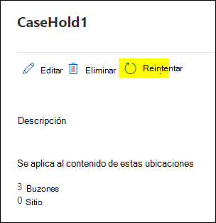

# <a name="troubleshoot-ediscovery-hold-errors"></a>Solución de problemas de suspensión de eDiscovery

En este artículo se analizan los problemas comunes que pueden producirse con las retenciones de exhibición de documentos electrónicos y cómo resolverlos. El artículo también incluye prácticas recomendadas para ayudarle a mitigar o evitar estos problemas.

## <a name="recommended-practices"></a>Procedimientos recomendados

Para reducir el número de errores relacionados con las retenciones de exhibición de documentos electrónicos, se recomiendan los siguientes procedimientos:

- Si una distribución de retención aún está pendiente, con un estado de o , espere hasta que se complete la distribución de retención antes de `On (Pending)` `Off (Pending)` realizar más actualizaciones.

- Compruebe si una directiva de retención está pendiente antes de realizar más actualizaciones. Ejecute los siguientes comandos o guárdelos en un script de PowerShell.

    ```powershell
    $status = Get-CaseHoldPolicy -Identity <policyname> -DistributionDetail
    if($status.DistributionStatus -ne "Pending"){
        # policy no longer pending
        Set-CaseHoldPolicy -Identity <policyname> -AddExchangeLocation $user1
    }else{
        # policy still pending
        Write-Host "Hold policy still pending."
    }
   ```

- Combina las actualizaciones en una retención de exhibición de documentos electrónicos en una única solicitud masiva en lugar de actualizar la directiva de retención repetidamente para cada transacción. Por ejemplo, para agregar varios buzones de usuario a una directiva de retención existente mediante el cmdlet [Set-CaseHoldPolicy,](/powershell/module/exchange/set-caseholdpolicy) ejecute el comando (o agregue como un bloque de código a un script) para que se ejecute solo una vez para agregar varios usuarios.

  **Correcto:**

    ```powershell
    Set-CaseHoldPolicy -Identity "policyname" -AddExchangeLocation "User1", "User2", "User3", "User4", "User5"
    ```

   **Incorrecto:**

    ```powershell
    $users = "User1", "User2", "User3", "User4", "User5"
    ForEach($user in $users)
    {
        Set-CaseHoldPolicy -Identity "policyname" -AddExchangeLocation $user
    }
    ```

   En el ejemplo incorrecto anterior, el cmdlet se ejecuta cinco veces distintas para completar la tarea. Para obtener más información acerca de los procedimientos recomendados para agregar usuarios a una directiva de retención, vea la [sección Más](#more-information) información.

- Antes de ponerse en contacto con el Soporte técnico de Microsoft acerca de los problemas de retención de exhibición de documentos electrónicos, compruebe qué está provocando que la directiva falle al comprobar distributionResults, en función del ResultCode:

   ```powershell
   Get-CaseHoldPolicy -Identity "policyname" -DistributionDetail | Select -ExpandProperty DistributionResults
   ```

   

## <a name="error-policysynctimeout"></a>Error: PolicySyncTimeout

Si ve este error en **ResultCode: PolicySyncTimeout** y el siguiente mensaje de error, compruebe LastResultTime para ver si ha pasado más de dos horas desde que la sincronización ha alcanzado el tiempo de espera.

> La implementación de la directiva tarda más de lo esperado. Podría tardar 2 horas adicionales en actualizar el estado de implementación final, por lo que vuelve a comprobarlo en un par de horas.

### <a name="resolution"></a>Solución

Al ejecutar **Set-CaseHoldPolicy -Identity "policyname" -RetryDistribution** se resolverá el problema.

   ```powershell
   Set-CaseHoldPolicy "policyname" -RetryDistribution
   ```

También en la página de retención de casos de la Centro de cumplimiento de Microsoft 365, puede volver a implementar la directiva haciendo clic en **Reintentar**.



## <a name="error-policynotifyerror"></a>Error: PolicyNotifyError

Si ve este error en **ResultCode: PolicyNotifyError** y el siguiente mensaje de error, un problema del centro de datos interrumpió la sincronización de directivas.

> La directiva no se puede implementar en el origen de contenido debido a un problema Office 365 centro de datos. La directiva actual no se aplica a ningún contenido del origen, por lo que no hay ningún impacto de la implementación bloqueada. Para solucionar este problema, intente volver a implementar la directiva.

### <a name="resolution"></a>Solución

Al ejecutar **Set-CaseHoldPolicy -Identity "policyname" -RetryDistribution** se resolverá el problema.

   ```powershell
   Set-CaseHoldPolicy "policyname" -RetryDistribution
   ```

También en la página de retención de casos de la Centro de cumplimiento de Microsoft 365, puede volver a implementar la directiva haciendo clic en **Reintentar**.


## <a name="error-internalerror"></a>Error: InternalError

Si ve este error en **ResultCode: InternalError** y el siguiente mensaje de error, Microsoft debe resolver este problema.

> La implementación de directivas se ha interrumpido por un problema inesperado Office 365 centro de datos. Póngase en contacto con el soporte técnico de Microsoft para solucionar el problema de implementación.

### <a name="resolution"></a>Solución

Póngase en contacto con el soporte técnico de Microsoft con la siguiente información:

- Nombre de la directiva
- Servicio o característica de Microsoft 365
- Código de resultados
- Mensaje de resultados
- Diagnósticos adicionales

## <a name="error-failedtoopencontainer"></a>Error: FailedToOpenContainer

Si ve este error en **ResultCode: FailedToOpenContainer** y el siguiente mensaje de error al poner a los custodios y orígenes de datos en espera, siga los pasos de resolución para solucionar el problema.

> Es posible que el buzón SharePoint sitio no exista.  Si esto es incorrecto, póngase en contacto con el soporte técnico de Microsoft.  De lo contrario, quítela de esta directiva.

### <a name="resolution"></a>Solución

- Ejecute [get-mailbox](/powershell/module/exchange/get-mailbox) in Exchange Online PowerShell para comprobar si el buzón de usuario existe en la organización.

- Ejecute el cmdlet [Get-SPOSite](/powershell/module/sharepoint-online/get-sposite) en SharePoint PowerShell en línea para comprobar si el sitio existe en la organización.

- Compruebe si la dirección URL del sitio ha cambiado.

- Quite el buzón o el sitio de la directiva, si el objeto no existe.

## <a name="error-siteinreadonlyornotaccessible"></a>Error: SiteInReadonlyOrNotAccessible

Si ve este error en **ResultCode: SiteInReadonlyOrNotAccessible** y el siguiente mensaje de error, el sitio SharePoint está en modo de solo lectura.

> El SharePoint es de solo lectura o no es accesible. Póngase en contacto con el administrador del sitio para que el sitio se grabe y, a continuación, vuelva a implementar esta directiva.

### <a name="resolution"></a>Solución

Desbloquea el sitio (o pide a un administrador que lo desbloquee) para resolver este problema. Para obtener más información sobre cómo cambiar el estado de bloqueo de un sitio, vea [Bloquear y desbloquear sitios](/sharepoint/manage-lock-status).

## <a name="error-siteoutofquota"></a>Error: SiteOutOfQuota

Si ve este error en **ResultCode: SiteOutOfQuota** y el siguiente mensaje de error, el sitio SharePoint ha alcanzado su cuota de almacenamiento.

> El sitio SharePoint no tiene suficiente cuota. Asigne más cuota a la colección de sitios y, a continuación, vuelva a implementar esta directiva.

### <a name="resolution"></a>Solución

Agregue más almacenamiento al sitio (o pida a un administrador que agregue más almacenamiento) a la colección de sitios. Para obtener más información sobre cómo administrar las cuotas de almacenamiento de un sitio, vea [Manage site collection storage limits](/sharepoint/manage-site-collection-storage-limits).

Después de agregar más cuota de almacenamiento al sitio, la directiva tendrá que volver a implementarse.

   ```powershell
   Set-CaseHoldPolicy "policyname" -RetryDistribution
   ```

También en la página de retención de casos de la Centro de cumplimiento de Microsoft 365, puede volver a implementar la directiva haciendo clic en **Reintentar**.


## <a name="error-recipienttypenotallowed"></a>Error: RecipientTypeNotAllowed

Si ve este error en **ResultCode: RecipientTypeNotAllowed** y el siguiente mensaje de error, se asigna una ubicación Exchange que es un buzón de correo a la directiva.

> El tipo de destinatario no está permitido para retenciones.

### <a name="resolution"></a>Solución

Ejecute [get-recipient](/powershell/module/exchange/get-recipient) en Exchange Online PowerShell para comprobar si la dirección en el extremo es un buzón válido.

Si el cmdlet anterior muestra que la dirección SMTP no es un buzón válido, quítela de la directiva.

```powershell
Set-CaseHoldPolicy "policyname" -RemoveExchangeLocation "non-mailbox user"
```

## <a name="more-information"></a>Más información

Las instrucciones sobre cómo actualizar directivas de retención para varios usuarios en la sección "Prácticas recomendadas" se deben al hecho de que el sistema bloquea las actualizaciones simultáneas de una directiva de retención. Esto significa que cuando se aplica una directiva de retención actualizada a nuevas ubicaciones de contenido y la directiva de retención está en un estado pendiente, no se pueden agregar ubicaciones de contenido adicionales a la directiva de retención. Estas son algunas cosas que debe tener en cuenta para ayudarle a mitigar este problema:
  
- Cada vez que se actualiza una retención, pasa inmediatamente a un estado pendiente. El estado pendiente significa que la retención se aplica a las ubicaciones de contenido.
  
- Si tiene un script que ejecuta un bucle y agrega ubicaciones a la directiva uno a uno (similar al ejemplo incorrecto que se muestra en la sección "Prácticas recomendadas"), la primera ubicación de contenido (por ejemplo, un buzón de usuario) inicia el proceso de sincronización que desencadena el estado pendiente. Esto significa que los demás usuarios que se agregan a la directiva en bucles posteriores producirán un error.
  
- Si su organización usa un script que ejecuta un bucle para actualizar las ubicaciones de contenido de una directiva de retención, debe actualizar el script para que actualice las ubicaciones en una sola operación masiva (como se muestra en el ejemplo correcto en la sección "Prácticas recomendadas").
