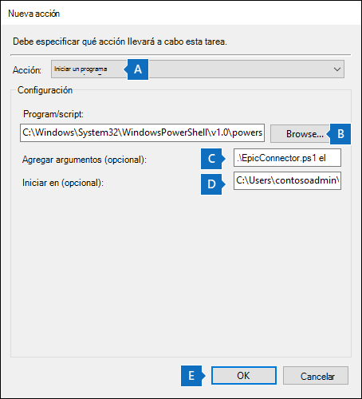

# <a name="set-up-a-connector-to-import-epic-ehr-audit-data-preview"></a>Configurar un conector para importar datos de auditoría de Épico EHR (versión preliminar)

Puede configurar un conector de datos en el Centro de cumplimiento de Microsoft 365 importar registros de auditoría para la actividad del usuario en el sistema de Registros electrónicos de atención médica (EHR) de su organización. Los registros de auditoría de su sistema de EHR épico incluyen registros de eventos relacionados con el acceso a los registros de salud de un paciente. Los registros de auditoría de EHR épicos pueden ser usados por la solución de administración de riesgos Microsoft 365 [insider](insider-risk-management.md) para ayudar a proteger su organización del acceso no autorizado a la información del paciente.

La configuración de un conector épico consta de las siguientes tareas:

- Crear una aplicación en Azure Active Directory (Azure AD) para tener acceso a un extremo de API que acepte un archivo de texto separado por tabulaciones que contenga registros de auditoría de EHR épicos.

- Crear un archivo de texto con todos los campos necesarios según se define en el esquema del conector.

- Crear una instancia de conector épico en el Centro de cumplimiento de Microsoft 365.

- Ejecución de un script para insertar registros de auditoría de EHR épicos en el punto de conexión de la API.

- Opcionalmente, programar el script para que se ejecute automáticamente para importar registros de auditoría.

## <a name="before-you-set-up-the-connector"></a>Antes de configurar el conector

- El usuario que crea el conector épico en el paso 3 debe tener asignado el rol de administrador del conector de datos. Este rol es necesario para agregar conectores en la **página Conectores de datos** de la Centro de cumplimiento de Microsoft 365. Este rol se agrega de forma predeterminada a varios grupos de roles. Para obtener una lista de estos grupos de roles, vea la sección "Roles en los centros de seguridad y cumplimiento" en Permisos en el [Centro de seguridad & cumplimiento](../security/office-365-security/permissions-in-the-security-and-compliance-center.md#roles-in-the-security--compliance-center). Como alternativa, un administrador de la organización puede crear un grupo de roles personalizado, asignar el rol de administrador del conector de datos y, a continuación, agregar los usuarios adecuados como miembros. Para obtener instrucciones, vea la sección "Crear un grupo de roles personalizado" en [Permisos en el Centro de cumplimiento de Microsoft 365](microsoft-365-compliance-center-permissions.md#create-a-custom-role-group).

- Debe determinar cómo recuperar o exportar los datos del sistema Épico EHR de su organización (diariamente) y crear un archivo de texto que se describe en el paso 2. El script que ejecute en el paso 4 insertará los datos del archivo de texto en el punto de conexión de la API.

- El script de ejemplo que se ejecuta en el paso 4 inserta los registros de auditoría de EHR épico desde el archivo de texto a la API del conector para que pueda ser usado por la solución de administración de riesgos insider. Este script de ejemplo no se admite en ningún servicio o programa de soporte técnico estándar de Microsoft. El script de ejemplo aparece "TAL CUAL", sin garantía de ningún tipo. Además, Microsoft no se hace responsable de cualquier garantía implícita, incluyendo, de manera enunciativa pero no limitativa, cualquier garantía implícita de comercialización o de calidad para cualquier propósito. Cualquier riesgo resultante del uso o rendimiento del script y la documentación de ejemplo será únicamente responsabilidad suya. En ningún caso Microsoft, sus autores o cualquier persona involucrada en su creación, producción o entrega de los scripts será responsable de cualquier daño (incluidos, de manera enunciativa pero no limitativa, daños por pérdidas de beneficios de una empresa, interrupción de la actividad de una empresa, pérdidas de información de una empresa, o cualquier otro daño pecuniario), incluso si Microsoft supiera de la posibilidad de tales daños.

## <a name="step-1-create-an-app-in-azure-active-directory"></a>Paso 1: Crear una aplicación en Azure Active Directory

El primer paso es crear y registrar una nueva aplicación en Azure Active Directory (Azure AD). La aplicación se corresponderá con el conector épico que creas en el paso 3. La creación de esta aplicación Azure AD autenticar la solicitud de inserción del archivo de texto que contiene registros de auditoría de EHR épicos. Durante la creación de esta Azure AD, asegúrate de guardar la siguiente información. Estos valores se usarán en pasos posteriores.

- Azure AD de aplicación (también denominado id. *de aplicación* o *identificador de cliente*)

- Azure AD secreto de aplicación (también denominado *secreto de cliente*)

- Identificador de inquilino (también denominado *id. de directorio*)

Para obtener instrucciones paso a paso para crear una aplicación en Azure AD, consulta [Registrar una aplicación con el Plataforma de identidad de Microsoft](\azure\active-directory\develop\quickstart-register-app).

## <a name="step-2-prepare-a-text-file-with-epic-ehr-audit-records"></a>Paso 2: Preparar un archivo de texto con registros de auditoría de EHR épicos

El siguiente paso es crear un archivo de texto que contenga información sobre el acceso de los empleados a los registros de salud del paciente en el sistema Épico EHR de su organización. Como se explicó anteriormente, debes determinar cómo generar este archivo de texto desde el sistema de EHR épico. El flujo de trabajo del conector épico requiere un archivo de texto con valores separados por tabulaciones para asignar esos datos en el archivo de texto con el esquema de conector requerido. El formato de archivo admitido es un archivo separado por .txt tabulación.

> [!NOTE]
> El tamaño máximo del archivo de texto que contiene los datos de auditoría es de 3 GB. El número máximo de filas es de 5 millones. Además, asegúrese de incluir solo los datos de auditoría relevantes de su sistema ehr de salud.

En la tabla siguiente se enumeran los campos necesarios para habilitar escenarios de administración de riesgos de insider. Un subconjunto de estos campos es obligatorio. Estos campos se resaltan con un asterisco (*). Si falta alguno de los campos obligatorios en el archivo de texto, el archivo no se validará y los datos del archivo no se importarán.

|Field|Categoría|
|:----|:----------|
| ACCESS_LOG. *<br/>ACCESS_TIME ACCESS_LOG_METRIC. METRIC_NAME*<br/>ACCESS_LOG. WORKSTATION_ID<br/>ZCMETRIC\_\_ GROUP.NAME<br/>ZCACCESS\_\_ ACTION.NAME |Estos campos se usan para identificar eventos de actividad de acceso en el sistema de EHR épico.|
| PACIENTE. PAT_MRN_ID<br/>PACIENTE. PAT_FIRST_NAME* <br/>PACIENTE. PAT_MIDDLE_NAME <br/>PACIENTE. PAT_LAST_NAME* <br/>PACIENTE. ADD_LINE_1* <br/>PACIENTE. ADD_LINE_2  <br/>PACIENTE. CITY* <br/>PATIENT.ZIP*  <br/>ZC_STATE.NAME <br/>ZC_COUNTRY.NAME <br/>CLARITY_DEP. DEPARTMENT_NAME              | Estos campos se usan para identificar la información del perfil del paciente.|
| ZC_BTG_REASON.NAME*<br/> PAT_BTG_AUDIT. BTG_EXPLANATION | Estos campos se usan para identificar el acceso a registros restringidos.|
| EMP. SYSTEM_LOGIN*<br/>CLARITY_EMP. USER_ID <br/> employee_last_name <sup>1</sup> <br/> employee_first_name <sup>1</sup>                | Estos campos se usan para identificar la información de perfil de los empleados para la coincidencia de direcciones y nombres necesarias para determinar el acceso a los registros familia/vecino/empleado. |
|||

> [!NOTE]
> Asegúrate de exportar solo las métricas de registro relevantes de Epic. 
> <sup>1</sup> Este campo no está disponible de forma predeterminada en Epic. Debe configurar la exportación para asegurarse de que el archivo de texto contiene este campo.

## <a name="step-3-create-the-epic-connector"></a>Paso 3: Crear el conector épico

El siguiente paso es crear un conector épico en el Centro de cumplimiento de Microsoft 365. Después de ejecutar el script en el paso 4, el archivo de texto que creó en el paso 2 se procesará y se insertará en el punto de conexión de la API que configure en el paso 1. En este paso, asegúrese de copiar el JobId que se genera al crear el conector. Usará el JobId al ejecutar el script.

1. Vaya a <https://compliance.microsoft.com> y, a continuación, **haga clic en Conectores de datos** en la navegación izquierda.

2. En la **página Conectores de datos** en **Conector épico**, haga clic en **Ver**.

3. En la **página Conector épico** , haga clic **en Agregar conector**.

4. En la **página Configurar la conexión** , haga lo siguiente y, a continuación, haga clic **en Siguiente**:

    1. Escriba o pegue el Azure AD de aplicación de la aplicación de Azure que creó en el paso 2.

    2. Escriba un nombre para el conector épico.

5. En la **página Revisar** , revise la configuración y, a continuación, haga clic **en Finalizar** para crear el conector.

   Se muestra una página de estado que confirma que se creó el conector. Esta página contiene dos cosas importantes que necesita para completar el siguiente paso para ejecutar el script de ejemplo para cargar los datos de registros de auditoría de EHR de Epic.

    Página de revisión con identificador de trabajo y vínculo a github para script de ejemplo

    1. **Id. de trabajo.** Necesitará este identificador de trabajo para ejecutar el script en el paso siguiente. Puede copiarlo desde esta página o desde la página desplegable del conector.

    2. **Esquema de referencia.** Consulte el esquema para comprender qué campos del sistema épico aceptan el conector. Esto le ayudará a crear un archivo con todos los campos de base de datos de Epic necesarios.

    3. **Vínculo al script de ejemplo.** Haga clic **en el** vínculo aquí para ir al sitio GitHub para obtener acceso al script de ejemplo (el vínculo abre una nueva ventana). Mantenga esta ventana abierta para poder copiar el script en el paso 4. Como alternativa, puede marcar el destino o copiar la dirección URL para que pueda tener acceso de nuevo al ejecutar el script. Este vínculo también está disponible en la página desplegable del conector.

6. Haga clic en **Listo**.

   El nuevo conector se muestra en la lista de la **pestaña Conectores** .

7. Haga clic en el conector épico que acaba de crear para mostrar la página desplegable, que contiene propiedades y otra información sobre el conector.

Si aún no lo ha hecho, puede copiar los valores del identificador de la aplicación **de Azure** y del **identificador de trabajo de conector**. Los necesitará para ejecutar el script en el paso siguiente. También puede descargar el script desde la página desplegable (o descargarlo mediante el vínculo en el paso siguiente).

También puede hacer clic en **Editar** para cambiar el identificador de aplicación de Azure o los nombres de encabezado de columna que definió en la página **Asignación de** archivos.

## <a name="step-4-run-the-sample-script-to-upload-your-epic-ehr-audit-records"></a>Paso 4: Ejecutar el script de ejemplo para cargar los registros de auditoría de Ehr épico

El último paso para configurar un conector de Epic es ejecutar un script de ejemplo que cargará los datos de registros de auditoría de EHR épicos en el archivo de texto (que creó en el paso 1) en la nube de Microsoft. En concreto, el script carga los datos en el conector épico. Después de ejecutar el script, el conector épico que creó en el paso 3 importa los datos de los registros de auditoría de EHR épicos a su organización de Microsoft 365, a la que pueden acceder otras herramientas de cumplimiento, como la solución de administración de riesgos Insider. Después de ejecutar el script, considere la posibilidad de programar una tarea para ejecutarla automáticamente diariamente para que los datos de terminación de empleados más actuales se carguen en la nube de Microsoft. Vea [(Opcional) Paso 6: Programar el script para que se ejecute automáticamente](#optional-step-6-schedule-the-script-to-run-automatically).

> [!NOTE]
> Como se ha indicado anteriormente, el tamaño máximo del archivo de texto que contiene los datos de auditoría es de 3 GB. El número máximo de filas es de 5 millones. El script que ejecute en este paso llevará entre 30 y 40 minutos importar los datos de auditoría de archivos de texto grandes. Además, el script dividirá archivos de texto grandes en bloques más pequeños de filas de 100K y, a continuación, importará esos bloques secuencialmente.

1. Vaya a la ventana que dejó abierta desde el paso anterior para obtener acceso al sitio GitHub con el script de ejemplo. Como alternativa, abra el sitio marcador o use la dirección URL que copió. También puede obtener acceso al script [aquí](https://github.com/microsoft/m365-compliance-connector-sample-scripts/blob/main/sample_script.ps1).

2. Haga clic en **el botón** Sin procesar para mostrar el script en la vista de texto.

3. Copie todas las líneas del script de ejemplo y guárdelas en un archivo de texto.

4. Modifique el script de ejemplo de la organización, si es necesario.

5. Guarde el archivo de texto como un archivo Windows PowerShell script mediante un sufijo de `.ps1`nombre de archivo de ; por ejemplo, `EpicConnector.ps1`.

6. Abra un símbolo del sistema en el equipo local y vaya al directorio donde guardó el script.

7. Ejecute el siguiente comando para cargar los datos de auditoría de Epic en el archivo de texto en la nube de Microsoft; por ejemplo:

   ```powershell
   .\EpicConnector.ps1 -tenantId <tenantId> -appId <appId>  -appSecret <appSecret>  -jobId <jobId>  -filePath '<filePath>'
   ```

En la tabla siguiente se describen los parámetros que se deben usar con este script y sus valores necesarios. La información obtenida en los pasos anteriores se usa en los valores de estos parámetros.

|Parámetro  |Descripción|
|:----------|:----------|
|tenantId|Este es el identificador de la Microsoft 365 organización que obtuvo en el paso 1. También puede obtener el identificador de inquilino de su organización en la  hoja Información general del centro Azure AD administración. Esto se usa para identificar la organización.|
|appId|Este es el identificador Azure AD aplicación para la aplicación que creaste en Azure AD en el paso 1. Esto lo usa Azure AD para la autenticación cuando el script intenta obtener acceso a su Microsoft 365 organización.|
|appSecret|Este es el secreto Azure AD aplicación para la aplicación que creaste en Azure AD paso 1. También se usa para la autenticación.|
|jobId|Este es el identificador de trabajo para el conector de Epic que creó en el paso 3. Esto se usa para asociar los registros de auditoría de EHR épicos que se cargan en la nube de Microsoft con el conector de Epic.|
|filePath|Esta es la ruta de acceso del archivo de texto (almacenado en el mismo sistema que el script) que creó en el paso 2. Intente evitar espacios en la ruta de acceso del archivo; de lo contrario, use comillas simples.|
|||

Este es un ejemplo de la sintaxis del script de conector de Epic que usa valores reales para cada parámetro:

```powershell
.\EpicConnector.ps1 -tenantId d5723623-11cf-4e2e-b5a5-01d1506273g9 -appId 29ee526e-f9a7-4e98-a682-67f41bfd643e -appSecret MNubVGbcQDkGCnn -jobId b8be4a7d-e338-43eb-a69e-c513cd458eba -filePath 'C:\Users\contosoadmin\Desktop\Data\epic_audit_records.txt'
```

Si la carga se realiza correctamente, el script muestra el **Upload correcto**.

> [!NOTE]
> Si tiene problemas para ejecutar el comando anterior debido a las directivas de ejecución, vea [Acerca](/powershell/module/microsoft.powershell.core/about/about_execution_policies) de las directivas de ejecución y [Set-ExecutionPolicy](/powershell/module/microsoft.powershell.security/set-executionpolicy) para obtener instrucciones sobre cómo establecer directivas de ejecución.

## <a name="step-5-monitor-the-epic-connector"></a>Paso 5: Supervisar el conector de Epic

Después de crear el conector épico e insertar los registros de auditoría de EHR, puede ver el conector y el estado de carga en el Centro de cumplimiento de Microsoft 365. Si programa el script para que se ejecute automáticamente de forma regular, también puede ver el estado actual después de la última vez que se ejecutó el script.

1. Vaya a <https://compliance.microsoft.com> y haga clic **en Conectores de datos** en la navegación izquierda.

2. Haga clic **en la pestaña Conectores** y, a continuación, seleccione el conector épico para mostrar la página desplegable. Esta página contiene las propiedades y la información sobre el conector.

3. En **Última importación**, haga clic en **el vínculo Descargar registro** para abrir (o guardar) el registro de estado del conector. Este registro contiene información sobre cada vez que se ejecuta el script y carga los datos del archivo de texto en la nube de Microsoft.

    El archivo de registro de conector épico muestra las filas de números del archivo de texto que se cargaron

    El `RecordsSaved` campo indica el número de filas del archivo de texto que se cargó. Por ejemplo, si el archivo de texto contiene cuatro filas, `RecordsSaved` el valor de los campos es 4, si el script cargó correctamente todas las filas del archivo de texto.

Si no ha ejecutado el script en el paso 4, se muestra un vínculo para descargar el script en **Last import**. Puede descargar el script y, a continuación, seguir los pasos para ejecutar el script.

## <a name="optional-step-6-schedule-the-script-to-run-automatically"></a>(Opcional) Paso 6: Programar el script para que se ejecute automáticamente

Para asegurarse de que los registros de auditoría más recientes de su sistema de EHR épico estén disponibles para herramientas como la solución de administración de riesgos insider, se recomienda programar el script para que se ejecute automáticamente diariamente. Esto también requiere que actualice los datos de registro de auditoría de Epic en el mismo archivo de texto con una programación similar (si no es la misma) para que contenga la información más reciente sobre las actividades de acceso a registros de pacientes por parte de los empleados. El objetivo es cargar los registros de auditoría más actuales para que el conector de Epic pueda estar disponible para la solución de administración de riesgos insider. 

Puedes usar la aplicación Programador de tareas en Windows para ejecutar automáticamente el script todos los días.

1. En el equipo local, haga clic en Windows **botón Inicio y**, a continuación, escriba **Programador de tareas**.

2. Haz clic **en la aplicación Programador de** tareas para abrirlo.

3. En la **sección Acciones** , haga clic **en Crear tarea**.

4. En la **ficha General** , escriba un nombre descriptivo para la tarea programada; por ejemplo, **script de conector épico**. También puede agregar una descripción opcional.

5. En **Opciones de seguridad**, haga lo siguiente:

    1. Determine si se debe ejecutar el script solo cuando haya iniciado sesión en el equipo o cuando haya iniciado sesión o no.

    2. Asegúrese de que la **casilla Ejecutar con los privilegios más altos** está activada.

6. Seleccione la **pestaña Desencadenadores** , haga clic **en Nuevo** y, a continuación, haga lo siguiente:

    1. En **Configuración**, seleccione la **opción Diario** y, a continuación, elija una fecha y hora para ejecutar el script por primera vez. El script se ejecutará todos los días a la misma hora especificada.

    2. En **Configuración avanzada**, asegúrate de que la **casilla Habilitado** esté activada.

    3. Haga clic en **Aceptar**.

7. Seleccione la **pestaña Acciones** , haga clic **en Nuevo** y, a continuación, haga lo siguiente:

   

    1. En la **lista** desplegable Acción, asegúrese de que **está seleccionado Iniciar un** programa.

    2. En el **cuadro Programa/script** , haga clic en **Examinar y vaya** a la siguiente ubicación y selecciónelo para que la ruta de acceso se muestre en el cuadro: C:.0.exe.

    3. En el **cuadro Agregar argumentos (opcional** ), pegue el mismo comando de script que ejecutó en el paso 4. Por ejemplo: `.\EpicConnector.ps1 -tenantId "d5723623-11cf-4e2e-b5a5-01d1506273g9" -appId "c12823b7-b55a-4989-faba-02de41bb97c3" -appSecret "MNubVGbcQDkGCnn" -jobId "e081f4f4-3831-48d6-7bb3-fcfab1581458" -filePath "C:\Epic\audit\records.txt"`

    4. En el **cuadro Inicio en (opcional** ), pegue la ubicación de carpeta del script que ejecutó en el paso 4. Por ejemplo, C:\Epic\audit.

    5. Haga **clic en** Aceptar para guardar la configuración de la nueva acción.

8. En la **ventana Crear tarea** , haga clic en **Aceptar** para guardar la tarea programada. Es posible que se te pida que escribas las credenciales de tu cuenta de usuario.

   La nueva tarea se muestra en la Biblioteca del programador de tareas.

   

   Se muestra la última vez que se ejecutó el script y la próxima vez que está programado para ejecutarse. Puede hacer doble clic en la tarea para editarla.

   También puede comprobar la última vez que se ejecutó el script en la página desplegable del conector épico correspondiente en el centro de cumplimiento.
