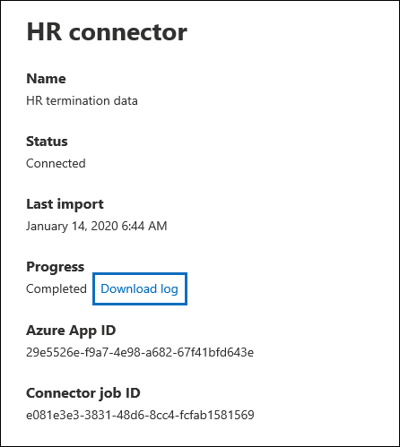
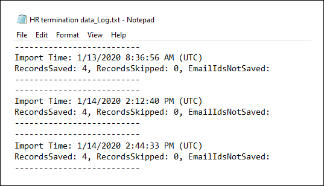

# <a name="set-up-a-connector-to-import-hr-data"></a><span data-ttu-id="59716-104">Configurar un conector para importar datos de recursos humanos</span><span class="sxs-lookup"><span data-stu-id="59716-104">Set up a connector to import HR data</span></span>

<span data-ttu-id="59716-105">Puede configurar un conector de datos en el centro de cumplimiento de Microsoft 365 para importar datos de recursos humanos (HR), como la fecha en que un empleado envió su retirada y la fecha del último día del empleado.</span><span class="sxs-lookup"><span data-stu-id="59716-105">You can set up a data connector in the Microsoft 365 compliance center to import human resources (HR) data, such as the date an employee submitted their resignation and date of the employee's last day.</span></span> <span data-ttu-id="59716-106">Estos datos de recursos humanos pueden usarse en las soluciones de protección de la información de Microsoft, como la nueva [solución de administración de riesgos de Insider](insider-risk-management.md), para ayudar a proteger su organización de la actividad malintencionada o del robo de datos dentro de la organización.</span><span class="sxs-lookup"><span data-stu-id="59716-106">This HR data can then be used by Microsoft information protection solutions, such as the new [insider risk management solution](insider-risk-management.md), to help protect your organization from malicious activity or data theft inside your organization.</span></span> <span data-ttu-id="59716-107">La configuración de un conector de recursos humanos consiste en crear una aplicación en Azure Active Directory que se usa para la autenticación por conector, crear archivos de asignación CSV que contengan los datos de recursos humanos, crear un conector de datos en el centro de cumplimiento y, a continuación, ejecutar un script (en un base programada) que recopila los datos de recursos humanos del archivo CSV en la nube de Microsoft.</span><span class="sxs-lookup"><span data-stu-id="59716-107">Setting up an HR connector consists of creating an app in Azure Active Directory that's used for authentication by connector, creating a CSV mapping files that contains your HR data, creating a data connector in the compliance center, and then running a script (on a scheduled basis) that ingests the HR data in the CSV file to the Microsoft cloud.</span></span> <span data-ttu-id="59716-108">A continuación, el conector de datos se usa soluciones de cumplimiento de Microsoft (como la administración de riesgos de Insider) para obtener acceso a los datos de recursos humanos que se importaron a la organización de Microsoft 365.</span><span class="sxs-lookup"><span data-stu-id="59716-108">Then the data connector is used Microsoft compliance solutions (like insider risk management) to access the HR data that was imported to your Microsoft 365 organization.</span></span>

## <a name="before-you-begin"></a><span data-ttu-id="59716-109">Antes de empezar</span><span class="sxs-lookup"><span data-stu-id="59716-109">Before you begin</span></span>

- <span data-ttu-id="59716-110">La organización debe permitir que el servicio de importación de Office 365 obtenga acceso a los datos de la organización.</span><span class="sxs-lookup"><span data-stu-id="59716-110">Your organization must consent to allow the Office 365 Import service to access data in your organization.</span></span> <span data-ttu-id="59716-111">Para dar su consentimiento a esta solicitud, vaya a [esta página](https://login.microsoftonline.com/common/oauth2/authorize?client_id=570d0bec-d001-4c4e-985e-3ab17fdc3073&response_type=code&redirect_uri=https://portal.azure.com/&nonce=1234&prompt=admin_consent), inicie sesión con las credenciales de un administrador global de Microsoft 365 y, a continuación, acepte la solicitud.</span><span class="sxs-lookup"><span data-stu-id="59716-111">To consent to this request, go to [this page](https://login.microsoftonline.com/common/oauth2/authorize?client_id=570d0bec-d001-4c4e-985e-3ab17fdc3073&response_type=code&redirect_uri=https://portal.azure.com/&nonce=1234&prompt=admin_consent), sign in with the credentials of a Microsoft 365 global admin, and then accept the request.</span></span> <span data-ttu-id="59716-112">Debe completar este paso para poder crear correctamente el conector de recursos humanos en el paso 3.</span><span class="sxs-lookup"><span data-stu-id="59716-112">You have to complete this step before you can successfully create the HR connector in Step 3.</span></span>

- <span data-ttu-id="59716-113">El usuario que crea el conector de recursos humanos en el paso 3 debe tener asignado el rol importación y exportación de buzones de correo en Exchange Online.</span><span class="sxs-lookup"><span data-stu-id="59716-113">The user who creates the HR connector in Step 3 must be assigned the Mailbox Import Export role in Exchange Online.</span></span> <span data-ttu-id="59716-114">Este rol no está asignado a ningún grupo de roles de Exchange Online de forma predeterminada.</span><span class="sxs-lookup"><span data-stu-id="59716-114">By default, this role isn't assigned to any role group in Exchange Online.</span></span> <span data-ttu-id="59716-115">Puede Agregar el rol importación y exportación de buzones al grupo de funciones de administración de la organización en Exchange Online.</span><span class="sxs-lookup"><span data-stu-id="59716-115">You can add the Mailbox Import Export role to the Organization Management role group in Exchange Online.</span></span> <span data-ttu-id="59716-116">O bien, puede crear un nuevo grupo de roles, asignar el rol de importación y exportación de buzones de correo y, a continuación, agregar los usuarios adecuados como miembros.</span><span class="sxs-lookup"><span data-stu-id="59716-116">Or you can create a new role group, assign the Mailbox Import Export role, and then add the appropriate users as members.</span></span> <span data-ttu-id="59716-117">Para obtener más información, vea las secciones [crear grupos](https://docs.microsoft.com/Exchange/permissions-exo/role-groups#create-role-groups) de roles o [modificar grupos de roles](https://docs.microsoft.com/Exchange/permissions-exo/role-groups#modify-role-groups) en el artículo sobre la administración de grupos de roles en Exchange Online.</span><span class="sxs-lookup"><span data-stu-id="59716-117">For more information, see the [Create role groups](https://docs.microsoft.com/Exchange/permissions-exo/role-groups#create-role-groups) or [Modify role groups](https://docs.microsoft.com/Exchange/permissions-exo/role-groups#modify-role-groups) sections in the article "Manage role groups in Exchange Online".</span></span>

- <span data-ttu-id="59716-118">Deberá determinar cómo recuperar o exportar los datos del sistema de RRHH de su organización (de forma regular) y agregar el archivo CSV que se describe en el paso 2.</span><span class="sxs-lookup"><span data-stu-id="59716-118">You'll need to determine how to retrieve or export the data from your organization's HR system (on a regular basis) and add the CSV file that's described in Step 2.</span></span> <span data-ttu-id="59716-119">El script que ejecutó en el paso 4 cargará los datos de recursos humanos en el archivo CSV en la nube de Microsoft.</span><span class="sxs-lookup"><span data-stu-id="59716-119">The script that you run in Step 4 will upload the HR data in the CSV file to the Microsoft cloud.</span></span>

- <span data-ttu-id="59716-120">El script de ejemplo que ejecutó en el paso 4 cargará los datos de recursos humanos en la nube de Microsoft para que puedan usarse en otras herramientas de Microsoft, como la solución de administración de riesgos de Insider.</span><span class="sxs-lookup"><span data-stu-id="59716-120">The sample script that you run in Step 4 will upload HR data to the Microsoft cloud so that it can be used by other Microsoft tools, such as the insider risk management solution.</span></span> <span data-ttu-id="59716-121">Este script de ejemplo no es compatible con ningún servicio o programa de soporte estándar de Microsoft.</span><span class="sxs-lookup"><span data-stu-id="59716-121">This sample script isn't supported under any Microsoft standard support program or service.</span></span> <span data-ttu-id="59716-122">El script de ejemplo se proporciona tal cual sin garantías de ningún tipo.</span><span class="sxs-lookup"><span data-stu-id="59716-122">The sample script is provided AS IS without warranty of any kind.</span></span> <span data-ttu-id="59716-123">Además, Microsoft no se hace responsable de cualquier garantía implícita, incluyendo, de manera enunciativa pero no limitativa, cualquier garantía implícita de comercialización o de calidad para cualquier propósito.</span><span class="sxs-lookup"><span data-stu-id="59716-123">Microsoft further disclaims all implied warranties including, without limitation, any implied warranties of merchantability or of fitness for a particular purpose.</span></span> <span data-ttu-id="59716-124">Todo el riesgo derivado del uso o el rendimiento de la secuencia de comandos de muestra y la documentación se conservan con usted.</span><span class="sxs-lookup"><span data-stu-id="59716-124">The entire risk arising out of the use or performance of the sample script and documentation remains with you.</span></span> <span data-ttu-id="59716-125">En ningún caso Microsoft, sus autores o cualquier persona involucrada en su creación, producción o entrega de los scripts será responsable de cualquier daño (incluidos, de manera enunciativa pero no limitativa, daños por pérdidas de beneficios de una empresa, interrupción de la actividad de una empresa, pérdidas de información de una empresa, o cualquier otro daño pecuniario), incluso si Microsoft supiera de la posibilidad de tales daños.</span><span class="sxs-lookup"><span data-stu-id="59716-125">In no event shall Microsoft, its authors, or anyone else involved in the creation, production, or delivery of the scripts be liable for any damages whatsoever (including, without limitation, damages for loss of business profits, business interruption, loss of business information, or other pecuniary loss) arising out of the use of or inability to use the sample scripts or documentation, even if Microsoft has been advised of the possibility of such damages.</span></span>

## <a name="step-1-create-an-app-in-azure-active-directory"></a><span data-ttu-id="59716-126">Paso 1: crear una aplicación en Azure Active Directory</span><span class="sxs-lookup"><span data-stu-id="59716-126">Step 1: Create an app in Azure Active Directory</span></span>

<span data-ttu-id="59716-127">El primer paso consiste en crear y registrar una nueva aplicación en Azure Active Directory (AAD).</span><span class="sxs-lookup"><span data-stu-id="59716-127">The first step is to create and register a new app in Azure Active Directory (AAD).</span></span> <span data-ttu-id="59716-128">La aplicación se corresponderá con el conector de RRHH que cree en el paso 3.</span><span class="sxs-lookup"><span data-stu-id="59716-128">The app will correspond to the HR connector that you create in Step 3.</span></span>  <span data-ttu-id="59716-129">La creación de esta aplicación permitirá que AAD autentique el conector de RRHH cuando se ejecute e intente acceder a su organización.</span><span class="sxs-lookup"><span data-stu-id="59716-129">Creating this app will allow AAD to authenticate the HR connector when it runs and attempts to access your organization.</span></span> <span data-ttu-id="59716-130">Esta aplicación también se usará para autenticar el script que ejecutó en el paso 4 para cargar los datos de recursos humanos en la nube de Microsoft.</span><span class="sxs-lookup"><span data-stu-id="59716-130">This app will also be used to authenticate the script that you run in Step 4 to upload your HR data to the Microsoft cloud.</span></span> <span data-ttu-id="59716-131">Durante la creación de esta aplicación de AAD, asegúrese de guardar la siguiente información.</span><span class="sxs-lookup"><span data-stu-id="59716-131">During the creation of this AAD app, be sure to save the following information.</span></span> <span data-ttu-id="59716-132">Estos valores se usarán en pasos posteriores en este proceso.</span><span class="sxs-lookup"><span data-stu-id="59716-132">These values will be used in later steps is this process.</span></span>

- <span data-ttu-id="59716-133">IDENTIFICADOR de la aplicación AAD (también denominado identificador de *aplicación* o identificador de *cliente*)</span><span class="sxs-lookup"><span data-stu-id="59716-133">AAD application ID (also called the *app Id* or *client Id*)</span></span>

- <span data-ttu-id="59716-134">Secreto de la aplicación AAD (también denominado *secreto de cliente*)</span><span class="sxs-lookup"><span data-stu-id="59716-134">AAD application secret (also called the *client secret*)</span></span>

- <span data-ttu-id="59716-135">Identificador de inquilino (también denominado *identificador de directorio*)</span><span class="sxs-lookup"><span data-stu-id="59716-135">Tenant Id (also called the *directory Id*)</span></span>

<span data-ttu-id="59716-136">Para obtener instrucciones paso a paso para crear una aplicación en AAD, vea [crear una aplicación de AAD](https://docs.microsoft.com/azure/kusto/management/access-control/how-to-provision-aad-app) .</span><span class="sxs-lookup"><span data-stu-id="59716-136">For step-by-step instructions for creating an app in AAD, see [Creating an AAD Application](https://docs.microsoft.com/azure/kusto/management/access-control/how-to-provision-aad-app)</span></span>

## <a name="step-2-prepare-a-csv-file-with-your-hr-data"></a><span data-ttu-id="59716-137">Paso 2: preparar un archivo CSV con los datos de recursos humanos</span><span class="sxs-lookup"><span data-stu-id="59716-137">Step 2: Prepare a CSV file with your HR data</span></span>

<span data-ttu-id="59716-138">El paso siguiente es crear un archivo CSV que contenga información sobre los empleados que han abandonado la organización.</span><span class="sxs-lookup"><span data-stu-id="59716-138">The next step is to create a CSV file that contains information about employees who have left your organization.</span></span> <span data-ttu-id="59716-139">Como se explica en la sección antes de empezar, deberá determinar cómo generar este archivo CSV desde el sistema de RRHH de la organización.</span><span class="sxs-lookup"><span data-stu-id="59716-139">As explained in the Before You Begin section, you'll need to determine how to generate this CSV file from your organization's HR system.</span></span> <span data-ttu-id="59716-140">En el ejemplo siguiente se muestra un archivo CSV completado (abierto en el Bloc de notas) que contiene los tres parámetros obligatorios (columnas).</span><span class="sxs-lookup"><span data-stu-id="59716-140">The following example shows a completed CSV file (opened in NotePad) that contains the three required parameters (columns).</span></span> <span data-ttu-id="59716-141">Es mucho más fácil editar el archivo CSV en Microsoft Excel.</span><span class="sxs-lookup"><span data-stu-id="59716-141">It's much easier to edit the CSV file in Microsoft Excel.</span></span>

```text
EmailAddress,TerminationDate,LastWorkingDate
sarad@contoso.com,2019-04-23T15:18:02.4675041+05:30,2019-04-29T15:18:02.4675041+05:30
pilarp@contoso.com,2019-04-24T09:15:49Z,2019-04-29T15:18:02.7117540
```

<span data-ttu-id="59716-142">La primera fila, o fila de encabezado, del archivo CSV enumera los nombres de columna necesarios.</span><span class="sxs-lookup"><span data-stu-id="59716-142">The first row, or header row, of the CSV file lists the required column names.</span></span> <span data-ttu-id="59716-143">El nombre que se usa en cada encabezado de columna depende de usted (los que aparecen en el ejemplo anterior son sugerencias).</span><span class="sxs-lookup"><span data-stu-id="59716-143">The name used in each column header is up to you (the ones in the previous example are suggestions).</span></span> <span data-ttu-id="59716-144">Sin embargo, *deben* especificarse los mismos nombres de columna que se usan en el archivo CSV al crear el conector de RRHH en el paso 3.</span><span class="sxs-lookup"><span data-stu-id="59716-144">However, the same column names you use in the CSV file *must* be specified when you create the HR connector in Step 3.</span></span> <span data-ttu-id="59716-145">No incluya espacios en los nombres de columna.</span><span class="sxs-lookup"><span data-stu-id="59716-145">Do not include spaces in the column names.</span></span>

<span data-ttu-id="59716-146">En la tabla siguiente se describe cada una de las columnas del archivo CSV:</span><span class="sxs-lookup"><span data-stu-id="59716-146">The following table describes each column in the CSV file:</span></span>

|<span data-ttu-id="59716-147">**Nombre de columna**</span><span class="sxs-lookup"><span data-stu-id="59716-147">**Column name**</span></span>|<span data-ttu-id="59716-148">**Descripción**</span><span class="sxs-lookup"><span data-stu-id="59716-148">**Description**</span></span>|
|:-----|:-----|
| <span data-ttu-id="59716-149">**EmailAddress**</span><span class="sxs-lookup"><span data-stu-id="59716-149">**EmailAddress**</span></span> <br/> |<span data-ttu-id="59716-150">Especifica la dirección de correo electrónico del empleado que ha finalizado.</span><span class="sxs-lookup"><span data-stu-id="59716-150">Specifies the email address of the terminated employee.</span></span>|
| <span data-ttu-id="59716-151">**TerminationDate**</span><span class="sxs-lookup"><span data-stu-id="59716-151">**TerminationDate**</span></span> <br/> |<span data-ttu-id="59716-152">Especifica la fecha de finalización oficial del empleo de la persona en la organización.</span><span class="sxs-lookup"><span data-stu-id="59716-152">Specifies the date the person's employment was officially terminated in your organization.</span></span> <span data-ttu-id="59716-153">Por ejemplo, puede ser la fecha en la que el empleado dio su aviso sobre cómo dejar la organización.</span><span class="sxs-lookup"><span data-stu-id="59716-153">For example, this may be the date when the employee gave their notice about leaving your organization.</span></span> <span data-ttu-id="59716-154">Esta fecha puede ser distinta a la fecha del último día de trabajo de la persona.</span><span class="sxs-lookup"><span data-stu-id="59716-154">This date may be the different than the date of the person's last day of work.</span></span> <span data-ttu-id="59716-155">Debe usar el siguiente formato de fecha: `yyyy-mm-ddThh:mm:ss.nnnnnn+|-hh:mm`, que es el [formato de fecha y hora ISO 8601](https://www.iso.org/iso-8601-date-and-time-format.html).</span><span class="sxs-lookup"><span data-stu-id="59716-155">You must use the following date format: `yyyy-mm-ddThh:mm:ss.nnnnnn+|-hh:mm`, which is the [ISO 8601 date and time format](https://www.iso.org/iso-8601-date-and-time-format.html).</span></span>|
|<span data-ttu-id="59716-156">**LastWorkingDate**</span><span class="sxs-lookup"><span data-stu-id="59716-156">**LastWorkingDate**</span></span>|<span data-ttu-id="59716-157">Especifica el último día de trabajo del empleado que ha finalizado.</span><span class="sxs-lookup"><span data-stu-id="59716-157">Specifies the last day of work for the terminated employee.</span></span> <span data-ttu-id="59716-158">Debe usar el siguiente formato de fecha: `yyyy-mm-ddThh:mm:ss.nnnnnn+|-hh:mm`, que es el [formato de fecha y hora ISO 8601](https://www.iso.org/iso-8601-date-and-time-format.html).</span><span class="sxs-lookup"><span data-stu-id="59716-158">You must use the following date format: `yyyy-mm-ddThh:mm:ss.nnnnnn+|-hh:mm`, which is the [ISO 8601 date and time format](https://www.iso.org/iso-8601-date-and-time-format.html).</span></span>|
|||

<span data-ttu-id="59716-159">Después de crear el archivo CSV con los datos de recursos humanos necesarios, almacene en un equipo local o en una ubicación de red que se pueda especificar al ejecutar el script en el paso 4.</span><span class="sxs-lookup"><span data-stu-id="59716-159">After you create the CSV file with the required HR data, store in on a local computer or network location that can be specified when you run the script in Step 4.</span></span> <span data-ttu-id="59716-160">También debe implementar una estrategia de actualización para que el archivo CSV siempre contenga la información más actual, de modo que cualquier cosa que ejecute el script, los datos de finalización del empleado más actual se carguen en la nube de Microsoft.</span><span class="sxs-lookup"><span data-stu-id="59716-160">You should also implement an update strategy so that the CSV file always contains the most current information so that whatever you run the script, the most current employee termination data will be uploaded to the Microsoft cloud.</span></span>

## <a name="step-3-create-the-hr-connector"></a><span data-ttu-id="59716-161">Paso 3: crear el conector de recursos humanos</span><span class="sxs-lookup"><span data-stu-id="59716-161">Step 3: Create the HR connector</span></span>

<span data-ttu-id="59716-162">El siguiente paso es crear un conector de recursos humanos en el centro de cumplimiento de Microsoft 365.</span><span class="sxs-lookup"><span data-stu-id="59716-162">The next step is to create an HR connector in the Microsoft 365 compliance center.</span></span> <span data-ttu-id="59716-163">Después de ejecutar el script en el paso 4, el conector de recursos humanos que cree devolverá los datos de recursos humanos del archivo CSV a la organización de Microsoft 365.</span><span class="sxs-lookup"><span data-stu-id="59716-163">After you run the script in Step 4, the HR connector that you create will ingest the HR data from the CSV file to your Microsoft 365 organization.</span></span> <span data-ttu-id="59716-164">En este paso, asegúrese de copiar el JobId que se genera al crear el conector.</span><span class="sxs-lookup"><span data-stu-id="59716-164">In this step, be sure to copy the JobId that's generated when you create the connector.</span></span> <span data-ttu-id="59716-165">Debe usar el JobId al ejecutar el script.</span><span class="sxs-lookup"><span data-stu-id="59716-165">You'll use the JobId when you run the script.</span></span>

1. <span data-ttu-id="59716-166">Vaya a [https://compliance.microsoft.com](https://compliance.microsoft.com) y, a continuación, haga clic en **conectores de datos** en el panel de navegación izquierdo.</span><span class="sxs-lookup"><span data-stu-id="59716-166">Go to [https://compliance.microsoft.com](https://compliance.microsoft.com) and then click **Data connectors** in the left nav.</span></span>

2. <span data-ttu-id="59716-167">En la página **conectores de datos (vista previa)** , en **HR**, haga clic en **Ver**.</span><span class="sxs-lookup"><span data-stu-id="59716-167">On the **Data connectors (preview)** page under **HR**, click **View**.</span></span>

3. <span data-ttu-id="59716-168">En la página **RRHH** , haga clic en **Agregar conector**.</span><span class="sxs-lookup"><span data-stu-id="59716-168">On the **HR** page, click **Add connector**.</span></span>

4. <span data-ttu-id="59716-169">En la página **credenciales de autenticación** , realice lo siguiente y, a continuación, haga clic en **siguiente**:</span><span class="sxs-lookup"><span data-stu-id="59716-169">On the **Authentication credentials** page, do the following and then click **Next**:</span></span>

   <span data-ttu-id="59716-170">a.</span><span class="sxs-lookup"><span data-stu-id="59716-170">a.</span></span> <span data-ttu-id="59716-171">Escriba o pegue el identificador de la aplicación de AAD para la aplicación de Azure que creó en el paso 1.</span><span class="sxs-lookup"><span data-stu-id="59716-171">Type or paste the AAD application ID for the Azure app that you created in Step 1.</span></span>

   <span data-ttu-id="59716-172">b.</span><span class="sxs-lookup"><span data-stu-id="59716-172">b.</span></span> <span data-ttu-id="59716-173">Escriba un nombre para el conector de recursos humanos.</span><span class="sxs-lookup"><span data-stu-id="59716-173">Type a name for the HR connector.</span></span>

5. <span data-ttu-id="59716-174">En la página **asignación de archivos** , escriba los tres nombres de encabezado de columna (también denominados *parámetros* del archivo CSV que creó en el paso 2 en cada uno de los cuadros correspondientes.</span><span class="sxs-lookup"><span data-stu-id="59716-174">On the **File mapping** page, type the three column header names (also called *parameters* from the CSV file that you created in Step 2 in each of the appropriate boxes.</span></span> <span data-ttu-id="59716-175">Los nombres no distinguen mayúsculas de minúsculas.</span><span class="sxs-lookup"><span data-stu-id="59716-175">The names are not case-sensitive.</span></span> <span data-ttu-id="59716-176">Como se ha explicado anteriormente, los nombres que escriba en estos cuadros deben coincidir con los nombres de los parámetros en el archivo CSV.</span><span class="sxs-lookup"><span data-stu-id="59716-176">As previously explained, the names that you type in these boxes must match the parameter names in your CSV file.</span></span> <span data-ttu-id="59716-177">Por ejemplo, en la siguiente captura de pantalla se muestran los nombres de parámetro del ejemplo del archivo CSV de ejemplo que se muestra en el paso 2.</span><span class="sxs-lookup"><span data-stu-id="59716-177">For example, the following screenshot shows the parameter names from the example in sample CSV file shown in Step 2.</span></span>

   

6. <span data-ttu-id="59716-179">En la página **revisión** , revise la configuración y, a continuación, haga clic en **Finalizar** para crear el conector.</span><span class="sxs-lookup"><span data-stu-id="59716-179">On the **Review** page, review your settings and then click **Finish** to create the connector.</span></span>

   <span data-ttu-id="59716-180">Se muestra una página de estado que confirma que se ha creado el conector.</span><span class="sxs-lookup"><span data-stu-id="59716-180">A status page is displayed that confirms the connector was created.</span></span> <span data-ttu-id="59716-181">Esta página también contiene el identificador de trabajo.</span><span class="sxs-lookup"><span data-stu-id="59716-181">This page also contains the job ID.</span></span> <span data-ttu-id="59716-182">Necesitará este identificador de trabajo para ejecutar el script en el paso siguiente.</span><span class="sxs-lookup"><span data-stu-id="59716-182">You'll need this job ID to run the script in the next step.</span></span> <span data-ttu-id="59716-183">Puede copiarlo desde esta página o desde la página de control flotante para el conector.</span><span class="sxs-lookup"><span data-stu-id="59716-183">You can copy it from this page or from the flyout page for the connector.</span></span>

7. <span data-ttu-id="59716-184">Haga clic en **Listo**.</span><span class="sxs-lookup"><span data-stu-id="59716-184">Click **Done**.</span></span>
   
   <span data-ttu-id="59716-185">El nuevo conector se muestra en la lista de la ficha **conectores** .</span><span class="sxs-lookup"><span data-stu-id="59716-185">The new connector is displayed in the list on the **Connectors** tab.</span></span> 

8. <span data-ttu-id="59716-186">Haga clic en el conector de recursos humanos que acaba de crear para mostrar la página de flotante, que contiene propiedades y otra información sobre el conector.</span><span class="sxs-lookup"><span data-stu-id="59716-186">Click the HR connector that you just created to display the flyout page, which contains properties and other information about the connector.</span></span> 

   

   <span data-ttu-id="59716-188">Si aún no lo ha hecho, puede copiar los valores del identificador de la **aplicación de Azure** y del identificador de trabajo del **conector**.</span><span class="sxs-lookup"><span data-stu-id="59716-188">If you haven't already done so, you can copy the values for the **Azure App ID** and **Connector job ID**.</span></span> <span data-ttu-id="59716-189">Necesitará estos para ejecutar el script en el paso siguiente.</span><span class="sxs-lookup"><span data-stu-id="59716-189">You'll need these to run the script in the next step.</span></span> <span data-ttu-id="59716-190">También puede descargar el script de la página flotante (o descargarlo con el vínculo en el paso siguiente).</span><span class="sxs-lookup"><span data-stu-id="59716-190">You can also download the script from the flyout page (or download it using the link in the next step.)</span></span>

   <span data-ttu-id="59716-191">También puede hacer clic en **Editar** para cambiar el identificador de la aplicación de Azure o los nombres de encabezado de columna que ha definido en la página **asignación de archivos** .</span><span class="sxs-lookup"><span data-stu-id="59716-191">You can also click **Edit** to change the Azure App ID or the column header names that you defined on the **File mapping** page.</span></span>

## <a name="step-4-run-the-sample-script-to-upload-your-hr-data"></a><span data-ttu-id="59716-192">Paso 4: ejecutar el script de ejemplo para cargar los datos de recursos humanos</span><span class="sxs-lookup"><span data-stu-id="59716-192">Step 4: Run the sample script to upload your HR data</span></span>

<span data-ttu-id="59716-193">El último paso para configurar un conector de recursos humanos es ejecutar un script de ejemplo que cargará los datos de recursos humanos en el archivo CSV (que creó en el paso 2) a la nube de Microsoft.</span><span class="sxs-lookup"><span data-stu-id="59716-193">The last step in setting up an HR connector is to run a sample script that will upload the HR data in the CSV file (that you created in Step 2) to the Microsoft cloud.</span></span> <span data-ttu-id="59716-194">Después de ejecutar el script, el conector de recursos humanos que creó en el paso 3 puede tener acceso e importar los datos en la organización de Microsoft 365, donde puede tener acceso a ellos otras herramientas de cumplimiento, como la solución de administración de riesgos de Insider.</span><span class="sxs-lookup"><span data-stu-id="59716-194">After you run the script, the HR connector that you created in Step 3 can access and import the data to your Microsoft 365 organization where it can accessed by other compliance tools, such as the Insider risk management solution.</span></span> <span data-ttu-id="59716-195">Después de ejecutar el script, considere la posibilidad de programar una tarea para que se ejecute de forma automática diariamente, de modo que los datos de finalización de los empleados más actuales se carguen en la nube de Microsoft.</span><span class="sxs-lookup"><span data-stu-id="59716-195">After you run the script, consider scheduling a task to run it automatically on a daily basis so the most current employee termination data is uploaded to the Microsoft cloud.</span></span> <span data-ttu-id="59716-196">Consulte [programar el script para que se ejecute automáticamente](#optional-step-6-schedule-the-script-to-run-automatically).</span><span class="sxs-lookup"><span data-stu-id="59716-196">See [Schedule the script to run automatically](#optional-step-6-schedule-the-script-to-run-automatically).</span></span>

1. <span data-ttu-id="59716-197">Vaya a [este sitio de github](https://github.com/microsoft/m365-hrconnector-sample-scripts/blob/master/upload_termination_records.ps1) para acceder al script de ejemplo.</span><span class="sxs-lookup"><span data-stu-id="59716-197">Go to [this GitHub site](https://github.com/microsoft/m365-hrconnector-sample-scripts/blob/master/upload_termination_records.ps1) to access the sample script.</span></span>

2. <span data-ttu-id="59716-198">Haga clic en el botón **sin procesar** para mostrar el script en la vista de texto</span><span class="sxs-lookup"><span data-stu-id="59716-198">Click the **Raw** button to display the script in text view</span></span>

3. <span data-ttu-id="59716-199">Copie todas las líneas del script de ejemplo y guárdelas en un archivo de texto.</span><span class="sxs-lookup"><span data-stu-id="59716-199">Copy all the lines in the sample script and then save them to a text file.</span></span>

4. <span data-ttu-id="59716-200">Modifique el script de ejemplo para su organización, si es necesario.</span><span class="sxs-lookup"><span data-stu-id="59716-200">Modify the sample script for your organization, if necessary.</span></span>

5. <span data-ttu-id="59716-201">Guarde el archivo de texto como un archivo de script de Windows PowerShell mediante un sufijo `.ps1`de nombre de archivo de; por ejemplo, `HRConnector.ps1`.</span><span class="sxs-lookup"><span data-stu-id="59716-201">Save the text file as a Windows PowerShell script file by using a filename suffix of `.ps1`; for example, `HRConnector.ps1`.</span></span>

6. <span data-ttu-id="59716-202">Abra un símbolo del sistema en el equipo local y vaya al directorio donde guardó el script.</span><span class="sxs-lookup"><span data-stu-id="59716-202">Open a Command Prompt on your local computer, and go to the directory where you saved the script.</span></span>

7. <span data-ttu-id="59716-203">Ejecute el siguiente comando para cargar los datos de recursos humanos en el archivo CSV a la nube de Microsoft; por ejemplo:</span><span class="sxs-lookup"><span data-stu-id="59716-203">Run the following command to upload the HR data in the CSV file to the Microsoft cloud; for example:</span></span>

    ```powershell
    .\HRConnector.ps1 -tenantId <tenantId> -appId <appId>  -appSecret <appSecret>  -jobId <jobId>  -csvFilePath '<csvFilePath>'
    ```

   <span data-ttu-id="59716-204">En la tabla siguiente se describen los parámetros que se deben usar con este script y los valores necesarios.</span><span class="sxs-lookup"><span data-stu-id="59716-204">The following table describes the parameters to use with this script and their required values.</span></span> <span data-ttu-id="59716-205">La información que ha obtenido en los pasos anteriores se usa en los valores de estos parámetros.</span><span class="sxs-lookup"><span data-stu-id="59716-205">The information you obtained in the previous steps is used in the values for these parameters.</span></span>

   |<span data-ttu-id="59716-206">**Parámetro**</span><span class="sxs-lookup"><span data-stu-id="59716-206">**Parameter**</span></span>|<span data-ttu-id="59716-207">**Descripción**</span><span class="sxs-lookup"><span data-stu-id="59716-207">**Description**</span></span>
   |:-----|:-----|:-----|
   |`tenantId`|<span data-ttu-id="59716-208">Este es el identificador de la organización de Microsoft 365 que obtuvo en el paso 1.</span><span class="sxs-lookup"><span data-stu-id="59716-208">This is the Id for your Microsoft 365 organization that you obtained in Step 1.</span></span> <span data-ttu-id="59716-209">También puede obtener el tenantId de su organización en la hoja de **información general** del centro de administración de Azure ad.</span><span class="sxs-lookup"><span data-stu-id="59716-209">You can also obtain the tenantId for your organization on the **Overview** blade in the Azure AD admin center.</span></span> <span data-ttu-id="59716-210">Se usa para identificar la organización.</span><span class="sxs-lookup"><span data-stu-id="59716-210">This is used to identify your organization.</span></span>|
   |`appId` |<span data-ttu-id="59716-211">Este es el identificador de la aplicación de AAD para la aplicación que ha creado en Azure AD en el paso 1.</span><span class="sxs-lookup"><span data-stu-id="59716-211">This is the AAD application Id for the app that you created in Azure AD in Step 1.</span></span> <span data-ttu-id="59716-212">Esto lo usa Azure AD para la autenticación cuando el script intenta obtener acceso a la organización de 365 de Microsoft.</span><span class="sxs-lookup"><span data-stu-id="59716-212">This is used by Azure AD for authentication when the script attempts to accesses your Microsoft 365 organization.</span></span> | 
   |`appSecret`|<span data-ttu-id="59716-213">Este es el secreto de la aplicación de AAD para la aplicación que ha creado en Azure AD en el paso 1.</span><span class="sxs-lookup"><span data-stu-id="59716-213">This is the AAD application secret for the app that you created in Azure AD in Step 1.</span></span> <span data-ttu-id="59716-214">También se usa para la autenticación.</span><span class="sxs-lookup"><span data-stu-id="59716-214">This also used for authentication.</span></span>|
   |`jobId`|<span data-ttu-id="59716-215">Se trata del identificador de trabajo para el conector de recursos humanos que creó en el paso 3.</span><span class="sxs-lookup"><span data-stu-id="59716-215">This is the Job Id for the HR connector that you created in Step 3.</span></span> <span data-ttu-id="59716-216">Se usa para asociar los datos de recursos humanos cargados en la nube de Microsoft con el conector de recursos humanos.</span><span class="sxs-lookup"><span data-stu-id="59716-216">This is used to associate the HR data that is uploaded to the Microsoft cloud with the HR connector.</span></span>|
   |`csvFilePath`|<span data-ttu-id="59716-217">Esta es la ruta de acceso al archivo en el equipo local (la que está usando para ejecutar el script) para el archivo CSV que creó en el paso 2.</span><span class="sxs-lookup"><span data-stu-id="59716-217">This is the file path on the local computer (the one you're using to run the script) for the CSV file that you created in Step 2.</span></span> <span data-ttu-id="59716-218">Si el archivo CSV está ubicado en una ubicación de red compartida, deberá especificar la ruta de acceso completa del archivo para dicha ubicación.</span><span class="sxs-lookup"><span data-stu-id="59716-218">If the CSV file is located on a shared network location, you'll have to specify the complete file path for that location.</span></span> <span data-ttu-id="59716-219">Intente evitar espacios en la ruta de acceso al archivo; de lo contrario, use comillas simples.</span><span class="sxs-lookup"><span data-stu-id="59716-219">Try to avoid spaces in the file path; otherwise use single quotation marks.</span></span>|
   |||
   
   <span data-ttu-id="59716-220">A continuación, se muestra un ejemplo de la sintaxis del script del conector de recursos humanos con valores reales para cada parámetro:</span><span class="sxs-lookup"><span data-stu-id="59716-220">Here's an example of the syntax for the HR connector script using actual values for each parameter:</span></span>

   ```powershell
    .\HRConnector.ps1 -tenantId d5723623-11cf-4e2e-b5a5-01d1506273g9 -appId 29ee526e-f9a7-4e98-a682-67f41bfd643e -appSecret MNubVGbcQDkGCnn -jobId b8be4a7d-e338-43eb-a69e-c513cd458eba -csvFilePath 'C:\Users\contosoadmin\Desktop\Data\employee_termination_data.csv'
    ```

   <span data-ttu-id="59716-221">Si la carga se realiza correctamente, el script muestra el mensaje de **carga correcta** .</span><span class="sxs-lookup"><span data-stu-id="59716-221">If the upload is successful, the script displays the **Upload Successful** message.</span></span>

## <a name="step-5-monitor-the-hr-connector"></a><span data-ttu-id="59716-222">Paso 5: supervisar el conector de recursos humanos</span><span class="sxs-lookup"><span data-stu-id="59716-222">Step 5: Monitor the HR connector</span></span>

<span data-ttu-id="59716-223">Después de crear el conector de recursos humanos y ejecutar el script para cargar los datos de recursos humanos, puede ver el conector y el estado de carga en el centro de cumplimiento de Microsoft 365.</span><span class="sxs-lookup"><span data-stu-id="59716-223">After you create the HR connector and run the script to upload your HR data, you can view the connector and upload status in the Microsoft 365 compliance center.</span></span> <span data-ttu-id="59716-224">Si programa la secuencia de comandos para que se ejecute automáticamente periódicamente, también puede ver el estado actual después de la última vez que se ejecutó el script.</span><span class="sxs-lookup"><span data-stu-id="59716-224">If you schedule the script to run automatically on a regular basis, you can also view the current status after the last time the script ran.</span></span>

1. <span data-ttu-id="59716-225">Vaya a [https://compliance.microsoft.com](https://compliance.microsoft.com) y haga clic en **conectores de datos** en el panel de navegación izquierdo.</span><span class="sxs-lookup"><span data-stu-id="59716-225">Go to [https://compliance.microsoft.com](https://compliance.microsoft.com) and click **Data connectors** in the left nav.</span></span>

2. <span data-ttu-id="59716-226">Haga clic en la pestaña **conectores** y, a continuación, seleccione el conector de RRHH para mostrar la página de flotante, que contiene las propiedades y la información sobre el conector.</span><span class="sxs-lookup"><span data-stu-id="59716-226">Click the **Connectors** tab and then select the HR connector to display the flyout page, which contains the properties and information about the connector.</span></span>

   

3. <span data-ttu-id="59716-228">En **curso**, haga clic en el vínculo **Descargar registro** para abrir (o guardar) el registro de estado del conector.</span><span class="sxs-lookup"><span data-stu-id="59716-228">Under **Progress**, click the **Download log** link to open (or save) the status log for the connector.</span></span> <span data-ttu-id="59716-229">Este registro contiene información sobre cada vez que se ejecuta el script y carga los datos del archivo CSV a la nube de Microsoft.</span><span class="sxs-lookup"><span data-stu-id="59716-229">This log contains information about each time the script runs and uploads the data from the CSV file to the Microsoft cloud.</span></span> 

   

   <span data-ttu-id="59716-231">El campo **RecordsSaved** indica el número de filas del archivo CSV que se han cargado.</span><span class="sxs-lookup"><span data-stu-id="59716-231">The **RecordsSaved** field indicates the number of rows in the CSV file that uploaded.</span></span> <span data-ttu-id="59716-232">Por ejemplo, si el archivo CSV contiene 4 filas, el valor de los campos **RecordsSaved** es 4 Si el script cargó correctamente todas las filas en el archivo CSV.</span><span class="sxs-lookup"><span data-stu-id="59716-232">For example, if the CSV file contains 4 rows, then the value of the **RecordsSaved** fields is 4, if the script successfully uploaded all the rows in the CSV file.</span></span>

<span data-ttu-id="59716-233">Si no ha ejecutado el script en el paso 4, en la **última importación**se muestra un vínculo para descargar el script.</span><span class="sxs-lookup"><span data-stu-id="59716-233">If you've haven't run the script in Step 4, a link to download the script is displayed under **Last import**.</span></span> <span data-ttu-id="59716-234">Puede descargar el script y, a continuación, seguir los pasos del paso 4 para ejecutarlo.</span><span class="sxs-lookup"><span data-stu-id="59716-234">You can download the script and then follow the steps in Step 4 to run it.</span></span>

## <a name="optional-step-6-schedule-the-script-to-run-automatically"></a><span data-ttu-id="59716-235">Opcional Paso 6: programar el script para que se ejecute automáticamente</span><span class="sxs-lookup"><span data-stu-id="59716-235">(Optional) Step 6: Schedule the script to run automatically</span></span>

<span data-ttu-id="59716-236">Para asegurarse de que los datos de recursos humanos más recientes de su organización están disponibles para herramientas como la solución de administración de riesgos de Insider, le recomendamos que programe el script para que se ejecute automáticamente de forma periódica, como una vez al día.</span><span class="sxs-lookup"><span data-stu-id="59716-236">To make sure that the latest HR data from your organization is available to tools like the insider risk management solution, we recommend that you schedule the script to run automatically on a recurring basis, such as once a day.</span></span> <span data-ttu-id="59716-237">Esto también requiere que actualice los datos de recursos humanos en el archivo CSV en una programación similar, si no es la misma, para que contenga la información más reciente acerca de los empleados que dejan la organización.</span><span class="sxs-lookup"><span data-stu-id="59716-237">This also requires that you update the HR data in the CSV file on a similar (if not the same) schedule so that it contains the latest information about employees who leave your organization.</span></span> <span data-ttu-id="59716-238">El objetivo es cargar los datos de recursos humanos más actuales para que el conector de recursos humanos pueda ponerlos a disposición de la solución de administración de riesgos de Insider.</span><span class="sxs-lookup"><span data-stu-id="59716-238">The goal is to upload the most current HR data so that the HR connector can make it available to the insider risk management solution.</span></span>

<span data-ttu-id="59716-239">Puede usar la aplicación programador de tareas de Windows para ejecutar el script de forma automática cada día.</span><span class="sxs-lookup"><span data-stu-id="59716-239">You can user the Task Scheduler app in Windows to automatically run the script every day.</span></span>

1. <span data-ttu-id="59716-240">En el equipo local, haga clic en el botón **Inicio** de Windows y, a continuación, escriba **programador de tareas**.</span><span class="sxs-lookup"><span data-stu-id="59716-240">On your local computer, click the Windows **Start** button and then type **Task Scheduler**.</span></span>

2. <span data-ttu-id="59716-241">Haga clic en la aplicación **programador de tareas** para abrirla.</span><span class="sxs-lookup"><span data-stu-id="59716-241">Click the **Task Scheduler** app to open it.</span></span>

3. <span data-ttu-id="59716-242">En la sección **acciones** , haga clic en **crear tarea**.</span><span class="sxs-lookup"><span data-stu-id="59716-242">In the **Actions** section, click **Create Task**.</span></span>

4. <span data-ttu-id="59716-243">En la pestaña **General** , escriba un nombre descriptivo para la tarea programada; por ejemplo, **script de conector de recursos humanos**.</span><span class="sxs-lookup"><span data-stu-id="59716-243">On the **General** tab, type a descriptive name for the scheduled task; for example, **HR Connector Script**.</span></span> <span data-ttu-id="59716-244">También puede Agregar una descripción opcional.</span><span class="sxs-lookup"><span data-stu-id="59716-244">You can also add an optional description.</span></span> 

5. <span data-ttu-id="59716-245">En **Opciones de seguridad**, haga lo siguiente:</span><span class="sxs-lookup"><span data-stu-id="59716-245">Under **Security options**, do the following:</span></span>

   <span data-ttu-id="59716-246">a.</span><span class="sxs-lookup"><span data-stu-id="59716-246">a.</span></span> <span data-ttu-id="59716-247">Determine si desea ejecutar el script solo cuando haya iniciado sesión en el equipo o ejecutarlo cuando haya iniciado sesión o no.</span><span class="sxs-lookup"><span data-stu-id="59716-247">Determine whether to run the script only when you're logged on to the computer or run it when you're logged on or not.</span></span>
   
   <span data-ttu-id="59716-248">b.</span><span class="sxs-lookup"><span data-stu-id="59716-248">b.</span></span> <span data-ttu-id="59716-249">Asegúrese de que la casilla **ejecutar con los privilegios más altos** está seleccionada.</span><span class="sxs-lookup"><span data-stu-id="59716-249">Make sure that the **Run with the highest privileges** checkbox is selected.</span></span>

6. <span data-ttu-id="59716-250">Seleccione la pestaña **desencadenadores** , haga clic en **nuevo**y, a continuación, realice las siguientes acciones:</span><span class="sxs-lookup"><span data-stu-id="59716-250">Select the **Triggers** tab, click **New**, and then do the following things:</span></span>

   <span data-ttu-id="59716-251">a.</span><span class="sxs-lookup"><span data-stu-id="59716-251">a.</span></span> <span data-ttu-id="59716-252">En **configuración**, seleccione la opción **diariamente** y, a continuación, elija una fecha y hora para ejecutar el script por primera vez.</span><span class="sxs-lookup"><span data-stu-id="59716-252">Under **Settings**, select the **Daily** option, and then choose a date and time to run the script for the first time.</span></span> <span data-ttu-id="59716-253">El script será cada día a la misma hora especificada.</span><span class="sxs-lookup"><span data-stu-id="59716-253">The script will every day at the same specified time.</span></span>
   
   <span data-ttu-id="59716-254">b.</span><span class="sxs-lookup"><span data-stu-id="59716-254">b.</span></span> <span data-ttu-id="59716-255">En **Configuración avanzada**, asegúrese de que esté activada la casilla de verificación **habilitado** .</span><span class="sxs-lookup"><span data-stu-id="59716-255">Under **Advanced settings**, make sure the **Enabled** checkbox is selected.</span></span>
   
   <span data-ttu-id="59716-256">c.</span><span class="sxs-lookup"><span data-stu-id="59716-256">c.</span></span> <span data-ttu-id="59716-257">Haga clic en **Aceptar**.</span><span class="sxs-lookup"><span data-stu-id="59716-257">Click **Ok**.</span></span>

7. <span data-ttu-id="59716-258">Seleccione la pestaña **acciones** , haga clic en **nueva**y, a continuación, realice las siguientes acciones:</span><span class="sxs-lookup"><span data-stu-id="59716-258">Select the **Actions** tab, click **New**, and then do the following things:</span></span>

   

   <span data-ttu-id="59716-260">a.</span><span class="sxs-lookup"><span data-stu-id="59716-260">a.</span></span> <span data-ttu-id="59716-261">En la lista desplegable **acción** , asegúrese de que está seleccionado **iniciar un programa** .</span><span class="sxs-lookup"><span data-stu-id="59716-261">In the **Action** dropdown list, make sure that **Start a program** is selected.</span></span>

   <span data-ttu-id="59716-262">b.</span><span class="sxs-lookup"><span data-stu-id="59716-262">b.</span></span> <span data-ttu-id="59716-263">En el cuadro **programa/script** , haga clic en **examinar**, vaya a la siguiente ubicación y selecciónela para que la ruta de acceso aparezca en el `C:\Windows\System32\WindowsPowerShell\v1.0\powershell.exe`cuadro:.</span><span class="sxs-lookup"><span data-stu-id="59716-263">In the **Program/script** box, click **Browse**, and go to the following location and select it so the path is displayed in the box: `C:\Windows\System32\WindowsPowerShell\v1.0\powershell.exe`.</span></span>

   <span data-ttu-id="59716-264">c.</span><span class="sxs-lookup"><span data-stu-id="59716-264">c.</span></span> <span data-ttu-id="59716-265">En el cuadro **Agregar argumentos (opcional)** , pegue el mismo comando de script que ejecutó en el paso 4.</span><span class="sxs-lookup"><span data-stu-id="59716-265">In the **Add arguments (optional)** box, paste the same script command that you ran in Step 4.</span></span> <span data-ttu-id="59716-266">Por ejemplo: `.\HRConnector.ps1 -tenantId "d5723623-11cf-4e2e-b5a5-01d1506273g9" -appId "c12823b7-b55a-4989-faba-02de41bb97c3" -appSecret "MNubVGbcQDkGCnn"  -jobId "e081f4f4-3831-48d6-7bb3-fcfab1581458" -csvFilePath "C:\Users\contosoadmin\Desktop\Data\employee_termination_data.csv"`</span><span class="sxs-lookup"><span data-stu-id="59716-266">For example, `.\HRConnector.ps1 -tenantId "d5723623-11cf-4e2e-b5a5-01d1506273g9" -appId "c12823b7-b55a-4989-faba-02de41bb97c3" -appSecret "MNubVGbcQDkGCnn"  -jobId "e081f4f4-3831-48d6-7bb3-fcfab1581458" -csvFilePath "C:\Users\contosoadmin\Desktop\Data\employee_termination_data.csv"`</span></span>

   <span data-ttu-id="59716-267">d.</span><span class="sxs-lookup"><span data-stu-id="59716-267">d.</span></span> <span data-ttu-id="59716-268">En el cuadro **iniciar en (opcional)** , pegue la ubicación de la carpeta del script que ejecutó en el paso 4.</span><span class="sxs-lookup"><span data-stu-id="59716-268">In the **Start in (optional)** box, paste the folder location of the script that you ran in Step 4.</span></span> <span data-ttu-id="59716-269">Por ejemplo, `C:\Users\contosoadmin\Desktop\Scripts`.</span><span class="sxs-lookup"><span data-stu-id="59716-269">For example, `C:\Users\contosoadmin\Desktop\Scripts`.</span></span>

   <span data-ttu-id="59716-270">e.</span><span class="sxs-lookup"><span data-stu-id="59716-270">e.</span></span> <span data-ttu-id="59716-271">Haga clic en **Aceptar** para guardar la configuración de la nueva acción.</span><span class="sxs-lookup"><span data-stu-id="59716-271">Click **Ok** to save the settings for the new action.</span></span>

8. <span data-ttu-id="59716-272">En la ventana **crear tarea** , haga clic en **Aceptar** para guardar la tarea programada.</span><span class="sxs-lookup"><span data-stu-id="59716-272">In the **Create Task** window, click **Ok** to save the scheduled task.</span></span> <span data-ttu-id="59716-273">Es posible que se le pida que escriba sus credenciales de cuenta de usuario.</span><span class="sxs-lookup"><span data-stu-id="59716-273">You might be prompted to enter your user account credentials.</span></span>

   <span data-ttu-id="59716-274">La nueva tarea se muestra en la biblioteca del programador de tareas.</span><span class="sxs-lookup"><span data-stu-id="59716-274">The new task is displayed in the Task Scheduler Library.</span></span>

   

   <span data-ttu-id="59716-276">La última vez que se ejecuta la secuencia de comandos se muestra la última vez que se ejecutó ejecutar.</span><span class="sxs-lookup"><span data-stu-id="59716-276">The last time and the next time the script ran is scheduled to run is displayed.</span></span> <span data-ttu-id="59716-277">Puede hacer doble clic en la tarea para editarla.</span><span class="sxs-lookup"><span data-stu-id="59716-277">You can double-click the task to edit it.</span></span>

   <span data-ttu-id="59716-278">También puede comprobar la última vez que se ejecutó el script en la página flotante del conector HR correspondiente en el centro de cumplimiento.</span><span class="sxs-lookup"><span data-stu-id="59716-278">You can also verify the last time the script ran on the flyout page of the corresponding HR connector in the compliance center.</span></span>
