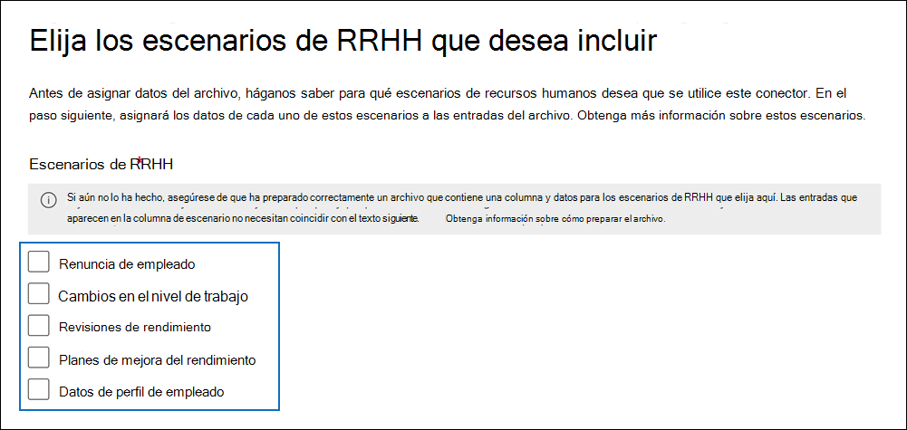

# <a name="set-up-a-connector-to-import-hr-data"></a>Configurar un conector para importar datos de RR.HH.

Puede configurar un conector de datos en el portal de cumplimiento Microsoft Purview para importar datos de recursos humanos (RR. HH.) relacionados con eventos como la renuncia de un usuario o un cambio en el nivel de trabajo de un usuario. A continuación, la [solución de administración de riesgos internos](insider-risk-management.md) puede usar los datos de RR. HH. para generar indicadores de riesgo que pueden ayudarle a identificar posibles actividades malintencionadas o robos de datos por parte de los usuarios de su organización.

La configuración de un conector para datos de RR. HH. que las directivas de administración de riesgos internos pueden usar para generar indicadores de riesgo consiste en crear un archivo CSV que contenga los datos de RR. HH., crear una aplicación en Azure Active Directory que se use para la autenticación, crear un conector de datos de RR. HH. en el portal de cumplimiento y, a continuación, ejecutar un script (de forma programada) que ingiera los datos de RR. HH. en archivos CSV en la nube de Microsoft para que estén disponibles. a la solución de administración de riesgos internos.

> [!IMPORTANT]
> Ahora hay disponible una nueva versión del conector de RR. HH. para la versión preliminar pública. Para crear un nuevo conector de RR. HH. o para importar datos para el [nuevo escenario de perfil de empleado](#csv-file-for-employee-profile-data-preview) para el escenario de directiva de atención sanitaria para la administración de riesgos internos, vaya a la página **Conectores de datos** en el portal de cumplimiento, seleccione la pestaña **Conectores** y, a continuación, seleccione **Agregar un conector > RR. HH. (versión preliminar)** para iniciar la configuración. Los conectores de RR. HH. existentes seguirán funcionando sin interrupciones.

[!INCLUDE [purview-preview](../includes/purview-preview.md)]

## <a name="before-you-begin"></a>Antes de empezar

- Determine qué escenarios y datos de RR. HH. se van a importar a Microsoft 365. Esto le ayudará a determinar cuántos archivos CSV y conectores de RR. HH. necesitará crear y cómo generar y estructurar los archivos CSV. Los datos de RR. HH. que importa vienen determinados por las directivas de administración de riesgos internos que desea implementar. Para obtener más información, consulte el paso 1.

- Determine cómo recuperar o exportar los datos del sistema de RR. HH. de su organización (y con regularidad) y agréguelos a los archivos CSV que cree en el paso 1. El script que ejecute en el paso 4 cargará los datos de RR. HH. en los archivos CSV en la nube de Microsoft.

- Al usuario que crea el conector de RR. HH. en el paso 3 se le debe asignar el rol Administración conector de datos. Este rol es necesario para agregar conectores en la página **Conectores de datos** del portal de cumplimiento. Este rol se agrega de forma predeterminada a varios grupos de roles. Para obtener una lista de estos grupos de roles, consulte la sección "Roles en los centros de seguridad y cumplimiento" de [Permisos en el Centro de cumplimiento de & seguridad](../security/office-365-security/permissions-in-the-security-and-compliance-center.md#roles-in-the-security--compliance-center). Como alternativa, un administrador de su organización puede crear un grupo de roles personalizado, asignar el rol Administración conector de datos y, a continuación, agregar los usuarios adecuados como miembros. Para obtener instrucciones, consulte la sección "Crear un grupo de roles personalizado" en [Permisos en el portal de cumplimiento Microsoft Purview](microsoft-365-compliance-center-permissions.md#create-a-custom-role-group).

- El script de ejemplo que ejecute en el paso 4 cargará los datos de RR. HH. en la nube de Microsoft para que puedan usarlos la solución de administración de riesgos internos. Este script de ejemplo no se admite en ningún servicio o programa de soporte técnico estándar de Microsoft. El script de ejemplo aparece "TAL CUAL", sin garantía de ningún tipo. Además, Microsoft no se hace responsable de cualquier garantía implícita, incluyendo, de manera enunciativa pero no limitativa, cualquier garantía implícita de comercialización o de calidad para cualquier propósito. Cualquier riesgo resultante del uso o rendimiento del script y la documentación de ejemplo será únicamente responsabilidad suya. En ningún caso Microsoft, sus autores o cualquier persona involucrada en su creación, producción o entrega de los scripts será responsable de cualquier daño (incluidos, de manera enunciativa pero no limitativa, daños por pérdidas de beneficios de una empresa, interrupción de la actividad de una empresa, pérdidas de información de una empresa, o cualquier otro daño pecuniario), incluso si Microsoft supiera de la posibilidad de tales daños.

- Este conector está disponible en entornos GCC en la nube de Microsoft 365 US Government. Las aplicaciones y servicios de terceros pueden implicar almacenar, transmitir y procesar los datos de clientes de su organización en sistemas de terceros que están fuera de la infraestructura de Microsoft 365 y, por lo tanto, no están cubiertos por los compromisos de protección de datos y Microsoft Purview. Microsoft no hace ninguna representación de que el uso de este producto para conectarse a aplicaciones de terceros implica que esas aplicaciones de terceros son compatibles con FEDRAMP. Para obtener instrucciones paso a paso para configurar un conector de RR. HH. en un entorno GCC, consulte [Configuración de un conector para importar datos de RR. HH. en el Gobierno de EE. UU](import-hr-data-US-government.md).

## <a name="step-1-prepare-a-csv-file-with-your-hr-data"></a>Paso 1: Preparar un archivo CSV con los datos de RR. HH.

El primer paso consiste en crear un archivo CSV que contenga los datos de RR. HH. que el conector importará a Microsoft 365. La solución de riesgo interno usará estos datos para generar posibles indicadores de riesgo. Los datos de los siguientes escenarios de RR. HH. se pueden importar a Microsoft 365:

- Renuncia de empleados. Información sobre los empleados que han abandonado la organización.

- Cambios en el nivel de trabajo. Información sobre los cambios de nivel de trabajo para los empleados, como promociones y disminuciones de nivel.

- Revisiones de rendimiento. Información sobre el rendimiento de los empleados.

- Planes de mejora del rendimiento. Información sobre los planes de mejora del rendimiento para los empleados.

- Perfil de empleado (versión preliminar). Información general sobre un empleado.

El tipo de datos de RR. HH. que se van a importar depende de la directiva de administración de riesgos internos y de la plantilla de directiva correspondiente que quiera implementar. En la tabla siguiente se muestra qué tipo de datos de RR. HH. es necesario para cada plantilla de directiva:

|  Plantilla de directiva |  Tipo de datos de RR. HH. |
|:------------------------------|:--------------------------------|
| Robo de datos por parte de los usuarios que abandonan la organización | Renuncias de empleados|
| Filtraciones de datos generales                             | No aplicable|
| Filtraciones de datos por parte de usuarios prioritarios                   | No aplicable |
| Filtraciones de datos por parte de usuarios inconformes                | Cambios en el nivel de trabajo, revisiones de rendimiento, planes de mejora del rendimiento|
| Infracciones generales de la directiva de seguridad             | No aplicable |
| Infracciones de la directiva de seguridad por parte de los usuarios que abandonan la organización  | Renuncias de empleados|
| Infracciones de la directiva de seguridad por parte de los usuarios prioritarios   | No aplicable|
| Infracciones de la directiva de seguridad por parte de usuarios inconformes| Cambios en el nivel de trabajo, revisiones de rendimiento, planes de mejora del rendimiento |
| Lenguaje ofensivo en el correo electrónico                    | No aplicable |
| Política sanitaria| Perfil de empleado |
|||

Para obtener más información sobre las plantillas de directiva para la administración de riesgos internos, consulte [Directivas de administración de riesgos internos](insider-risk-management-policies.md#policy-templates).

Para cada escenario de RR. HH., deberá proporcionar los datos de RR. HH. correspondientes en uno o varios archivos CSV. El número de archivos CSV que se usarán para la implementación de administración de riesgos internos se describe más adelante en esta sección.

Después de crear el archivo CSV con los datos de RR. HH. necesarios, almacénelo en el equipo local en el que se ejecuta el script en el paso 4. También debe implementar una estrategia de actualización para asegurarse de que el archivo CSV siempre contiene la información más reciente para que, independientemente de lo que ejecute el script, los datos de RR. HH. más actuales se carguen en la nube de Microsoft y sean accesibles para la solución de administración de riesgos internos.

> [!IMPORTANT]
> Los nombres de columna descritos en las secciones siguientes no son parámetros necesarios, sino solo ejemplos. Puede usar cualquier nombre de columna en los archivos CSV. Sin embargo, los nombres de columna que se usan en un archivo CSV *deben* asignarse al tipo de datos al crear el conector de RR. HH. en el paso 3. Tenga en cuenta también que los archivos CSV de ejemplo de las secciones siguientes se muestran en la vista Del Bloc de notas. Es mucho más fácil ver y editar archivos CSV en Microsoft Excel.

En las secciones siguientes se describen los datos CSV necesarios para cada escenario de RR. HH.

### <a name="csv-file-for-employee-resignation-data"></a>Archivo CSV para los datos de dimisión de empleados

Este es un ejemplo de un archivo CSV para los datos de renuncia de empleados.

```text
EmailAddress,ResignationDate,LastWorkingDate
sarad@contoso.com,2019-04-23T15:18:02.4675041+05:30,2019-04-29T15:18:02.4675041+05:30
pilarp@contoso.com,2019-04-24T09:15:49Z,2019-04-29T15:18:02.7117540
```

En la tabla siguiente se describe cada columna del archivo CSV para los datos de renuncia de empleados.

|  Columna   |   Descripción |
|:------------|:----------------|
|**EmailAddress**| Especifica la dirección de correo electrónico (UPN) del usuario terminado.|
| **SigniciónDate** | Especifica la fecha en que se finalizó oficialmente el empleo del usuario en su organización. Por ejemplo, esta puede ser la fecha en que el usuario dio su aviso sobre la salida de la organización. Esta fecha puede ser diferente de la fecha del último día de trabajo de la persona. Use el siguiente formato de fecha: `yyyy-mm-ddThh:mm:ss.nnnnnn+|-hh:mm`, que es el [formato de fecha y hora ISO 8601](https://www.iso.org/iso-8601-date-and-time-format.html).|
| **LastWorkingDate** | Especifica el último día de trabajo para el usuario terminado. Use el siguiente formato de fecha: `yyyy-mm-ddThh:mm:ss.nnnnnn+|-hh:mm`, que es el [formato de fecha y hora ISO 8601](https://www.iso.org/iso-8601-date-and-time-format.html).|
|||

### <a name="csv-file-for-job-level-changes-data"></a>Archivo CSV para los datos de cambios de nivel de trabajo

Este es un ejemplo de un archivo CSV para los datos de cambios de nivel de trabajo.

```text
EmailAddress,EffectiveDate,OldLevel,NewLevel
sarad@contoso.com,2019-04-23T15:18:02.4675041+05:30,Level 61 - Sr. Manager,Level 60- Manager
pillar@contoso.com,2019-04-23T15:18:02.4675041+05:30,Level 62 - Director,Level 60- Sr. Manager
```

En la tabla siguiente se describe cada columna del archivo CSV para los datos de cambios de nivel de trabajo.

|  Columna | Descripción |
|:--------- |:------------- |
| **EmailAddress**  | Especifica la dirección de correo electrónico del usuario (UPN).|
| **EffectiveDate** | Especifica la fecha en que se cambió oficialmente el nivel de trabajo del usuario. Use el siguiente formato de fecha: `yyyy-mm-ddThh:mm:ss.nnnnnn+|-hh:mm`, que es el [formato de fecha y hora ISO 8601](https://www.iso.org/iso-8601-date-and-time-format.html).|
| **Comentarios**| Especifica los comentarios que el evaluador ha proporcionado sobre el cambio de nivel de trabajo. Puede especificar un límite de 200 caracteres. Este parámetro es opcional. No es necesario incluirlo en el archivo CSV.|
| **OldLevel**| Especifica el nivel de trabajo del usuario antes de cambiarlo. Se trata de un parámetro de texto libre y puede contener taxonomía jerárquica para su organización. Este parámetro es opcional. No es necesario incluirlo en el archivo CSV.|
| **NewLevel**| Especifica el nivel de trabajo del usuario después de cambiarlo. Se trata de un parámetro de texto libre y puede contener taxonomía jerárquica para su organización. Este parámetro es opcional. No es necesario incluirlo en el archivo CSV.|
|||

### <a name="csv-file-for-performance-review-data"></a>Archivo CSV para los datos de revisión de rendimiento

Este es un ejemplo de un archivo CSV para los datos de rendimiento.

```text
EmailAddress,EffectiveDate,Remarks,Rating
sarad@contoso.com,2019-04-23T15:18:02.4675041+05:30,Met expectations but bad attitude,2-Below expectation
pillar@contoso.com,2019-04-23T15:18:02.4675041+05:30, Multiple conflicts with the team
```

En la tabla siguiente se describe cada columna del archivo CSV para los datos de revisión de rendimiento.

|  Columna | Descripción |
|:----------|:--------------|
| **EmailAddress**  | Especifica la dirección de correo electrónico del usuario (UPN).|
| **EffectiveDate** | Especifica la fecha en que se informó oficialmente al usuario sobre el resultado de su revisión de rendimiento. Esta puede ser la fecha en que finalizó el ciclo de revisión del rendimiento. Use el siguiente formato de fecha: `yyyy-mm-ddThh:mm:ss.nnnnnn+|-hh:mm`, que es el [formato de fecha y hora ISO 8601](https://www.iso.org/iso-8601-date-and-time-format.html).|
| **Comentarios**| Especifica los comentarios que el evaluador ha proporcionado al usuario para la revisión de rendimiento. Se trata de un parámetro de texto con un límite de 200 caracteres. Este parámetro es opcional. No es necesario incluirlo en el archivo CSV.|
| **Clasificación**| Especifica la clasificación proporcionada para la revisión de rendimiento. Se trata de un parámetro de texto y puede contener cualquier texto de forma libre que use su organización para reconocer la evaluación. Por ejemplo, "3 expectativas cumplidas" o "2 por debajo del promedio". Se trata de un parámetro de texto con un límite de 25 caracteres. Este parámetro es opcional. No es necesario incluirlo en el archivo CSV.|
|||

### <a name="csv-file-for-performance-improvement-plan-data"></a>Archivo CSV para los datos del plan de mejora del rendimiento

Este es un ejemplo de un archivo CSV para los datos de los datos del plan de mejora del rendimiento.

```text
EmailAddress,EffectiveDate,ImprovementRemarks,PerformanceRating
sarad@contoso.com,2019-04-23T15:18:02.4675041+05:30,Met expectation but bad attitude,2-Below expectation
pillar@contoso.com,2019-04-23T15:18:02.4675041+05:30, Multiple conflicts with the team
```

En la tabla siguiente se describe cada columna del archivo CSV para los datos de revisión de rendimiento.

|  Columna |  Descripción |
|:----------|:---------------|
| **EmailAddress**  | Especifica la dirección de correo electrónico del usuario (UPN).|
| **EffectiveDate** | Especifica la fecha en que se informó oficialmente al usuario sobre su plan de mejora del rendimiento. Debe usar el siguiente formato de fecha: `yyyy-mm-ddThh:mm:ss.nnnnnn+|-hh:mm`, que es el [formato de fecha y hora ISO 8601](https://www.iso.org/iso-8601-date-and-time-format.html).|
| **Comentarios**| Especifica los comentarios que el evaluador ha proporcionado sobre el plan de mejora del rendimiento. Se trata de un parámetro de texto con un límite de 200 caracteres. Este parámetro es opcional. No es necesario incluirlo en el archivo CSV. |
| **Clasificación**| Especifica cualquier clasificación u otra información relacionada con la revisión del rendimiento. Se trata de un parámetro de texto y puede contener cualquier texto de forma libre que use su organización para reconocer la evaluación. Por ejemplo, "3 expectativas cumplidas" o "2 por debajo del promedio". Se trata de un parámetro de texto con un límite de 25 caracteres. Este parámetro es opcional. No es necesario incluirlo en el archivo CSV.|
|||

### <a name="csv-file-for-employee-profile-data-preview"></a>Archivo CSV para datos de perfil de empleado (versión preliminar)

> [!NOTE]
> La capacidad de crear un conector de RR. HH. para datos de perfil de empleado está en versión preliminar pública. Para crear un conector de RR. HH. que admita datos de perfil de empleado, vaya a la página **Conectores de datos** del portal de cumplimiento, seleccione la pestaña **Conectores** y, a continuación, seleccione **Agregar una****RR. HH. de** conector  >  (versión preliminar). Siga los pasos para crear un conector en [Paso 3: Crear el conector de RR. HH](#step-3-create-the-hr-connector).

Este es un ejemplo de un archivo CSV para los datos de los datos de perfil de empleado.

```text
EmailAddress,UserName,EmployeeFirstName,EmployeeLastName,EmployeeAddLine1,EmployeeAddLine2,EmployeeCity,EmployeeState,EmployeeZipCode,EmployeeDept,EmployeeType,EmployeeRole
jackq@contoso.com,jackq,jack,qualtz,50 Oakland Ave,#206,City,Florida,32104,Orthopaedic,Regular,Nurse
```

En la tabla siguiente se describe cada columna del archivo CSV para los datos de perfil de empleado.

|  Columna |  Descripción |
|:----------|:---------------|
| EmailAddress<sup>*</sup>    | El nombre principal de usuario (UPN) o la dirección de correo electrónico del empleado.|
| EmployeeFirstName<sup>*</sup>   | Nombre del empleado.|
| EmployeeLastName<sup>*</sup>   | Apellido del empleado.|
| EmployeeAddressLine1<sup>*</sup>    | Dirección postal del empleado.|
| EmployeeAddressLine2   | Información de dirección secundaria, como el número de apartamento, para el empleado.|
| EmployeeCity | Ciudad de residencia para empleados.|
| EmployeeState | Estado de residencia del empleado.|
| EmployeeZipCode<sup>*</sup>  | Código postal de residencia del empleado. |
| EmployeeCountry| País de residencia del empleado.|
| EmployeeDepartment | Departamento de empleados de la organización.|
| EmployeeType |Tipo de empleo para empleados, como Regular, Exento o Contratista.|
| EmployeeRole |Rol, designación o puesto de trabajo de los empleados en la organización.|
|||

> [!NOTE]
> <sup>*</sup> Esta columna es obligatoria. Si falta una columna obligatoria, el archivo CSV no se validará y no se importarán otros datos del archivo.

Se recomienda crear un conector de RR. HH. que solo importe datos de perfil de empleado. Para este conector, asegúrese de actualizar con frecuencia los datos del perfil de empleado, preferiblemente en cada 15 a 20 días. Los registros de perfil de empleado se eliminarán si no se actualizan en los últimos 30 días.

### <a name="determining-how-many-csv-files-to-use-for-hr-data"></a>Determinación del número de archivos CSV que se van a usar para los datos de RR. HH.

En el paso 3, puede elegir crear conectores independientes para cada tipo de datos de RR. HH. o puede optar por crear un único conector para todos los tipos de datos. Puede usar archivos CSV independientes que contengan datos para un escenario de RR. HH. (por ejemplo, los ejemplos de los archivos CSV descritos en las secciones anteriores). Como alternativa, puede usar un único archivo CSV que contenga datos para dos o más escenarios de RR. HH. Estas son algunas directrices que le ayudarán a determinar cuántos archivos CSV se usarán para los datos de RR. HH.

- Si la directiva de administración de riesgos internos que desea implementar requiere varios tipos de datos de RR. HH., considere la posibilidad de usar un único archivo CSV que contenga todos los tipos de datos necesarios.

- El método para generar o recopilar los datos de RR. HH. puede determinar el número de archivos CSV. Por ejemplo, si los distintos tipos de datos de RR. HH. que se usan para configurar un conector de RR. HH. se encuentran en un único sistema de RR. HH. de su organización, es posible que pueda exportar los datos a un único archivo CSV. Pero si los datos se distribuyen entre diferentes sistemas de RR. HH., es posible que sea más fácil exportar datos a archivos CSV diferentes. Por ejemplo, los datos de dimisión de empleados pueden encontrarse en un sistema de RR. HH. diferente al nivel de trabajo o en los datos de revisión de rendimiento. En este caso, puede ser más fácil tener archivos CSV independientes en lugar de tener que combinar manualmente los datos en un único archivo CSV. Por lo tanto, cómo recuperar o exportar datos de los sistemas de RR. HH. puede determinar el número de archivos CSV que necesitará.

- Como regla general, el número de conectores de RR. HH. que tendrá que crear viene determinado por los tipos de datos de un archivo CSV. Por ejemplo, si un archivo CSV contiene todos los tipos de datos necesarios para admitir la implementación de administración de riesgos internos, solo necesita un conector de RR. HH. Pero si tiene dos archivos CSV independientes que contienen un único tipo de datos, tendrá que crear dos conectores de RR. HH. Una excepción a esto es que si agrega una columna **HRScenario** a un archivo CSV (consulte la sección siguiente), puede configurar un único conector de RR. HH. que pueda procesar diferentes archivos CSV.

### <a name="configuring-a-single-csv-file-for-multiple-hr-data-types"></a>Configuración de un único archivo CSV para varios tipos de datos de RR. HH.

Puede agregar varios tipos de datos de RR. HH. a un único archivo CSV. Esto resulta útil si la solución de administración de riesgos internos que está implementando requiere varios tipos de datos de RR. HH. o si los tipos de datos se encuentran en un único sistema de RR. HH. de su organización. Tener menos archivos CSV siempre le permite tener menos conectores de RR. HH. para crear y administrar.

Estos son los requisitos para configurar un archivo CSV con varios tipos de datos:

- Tiene que agregar las columnas necesarias (y opcionales si las usa) para cada tipo de datos y el nombre de columna correspondiente en la fila de encabezado. Si un tipo de datos no se corresponde con una columna, puede dejar el valor en blanco.

- Para usar un archivo CSV con varios tipos de datos de RR. HH., el conector de RR. HH. debe saber qué filas del archivo CSV contienen qué tipo de datos de RR. HH. Para ello, agregue una columna **HRScenario** adicional al archivo CSV. Los valores de esta columna identifican el tipo de datos de RR. HH. en cada fila. Por ejemplo, los valores correspondientes a los escenarios de RR. HH. podrían ser Renuncia, Cambio de nivel de trabajo, \`Revisión\` del rendimiento, \`Plan\` de mejora del rendimiento y \`Perfil\` de empleado.\`\`\`\`

- Si tiene varios archivos CSV que contienen una columna HRScenario**, asegúrese de que cada archivo usa el mismo nombre de columna y los mismos valores que identifican los escenarios de RR. HH. específicos.

En el ejemplo siguiente se muestra un archivo CSV que contiene la columna **HRScenario** . Los valores de la columna HRScenario identifican el tipo de datos de la fila correspondiente. En el ejemplo siguiente se tratan cuatro escenarios \`de RR. HH., renuncia\`, \`cambio\` de nivel de trabajo, \`revisión\` del rendimiento y \`plan\` de mejora del rendimiento.

```text
HRScenario,EmailAddress,ResignationDate,LastWorkingDate,EffectiveDate,Remarks,Rating,OldLevel,NewLevel
Resignation,sarad@contoso.com,2019-04-23T15:18:02.4675041+05:30,2019-04-29T15:18:02.4675041+05:30,,,,
Resignation,pilarp@contoso.com,2019-04-24T09:15:49Z,2019-04-29T15:18:02.7117540,,,,
Job level change,sarad@contoso.com,2019-04-23T15:18:02.4675041+05:30,,,,,Level 61 Sr. Manager, Level 60 Manager
Job level change,pillarp@contoso.com,2019-04-23T15:18:02.4675041+05:30,,,,,Level 62 Director,Level 60 Sr Manager
Performance review,sarad@contoso.com,,,2019-04-23T15:18:02.4675041+05:30,Met expectation but bad attitude,2 Below expectations,,
Performance review,pillarp@contoso.com,,,2019-04-23T15:18:02.4675041+05:30, Multiple conflicts with the team,,
Performance improvement plan,sarad@contoso.com,,,2019-04-23T15:18:02.4675041+05:30,Met expectations but bad attitude,2 Below expectations,,
Performance improvement plan,pillarp@contoso.com,,,2019-04-23T15:18:02.4675041+05:30,Multiple conflicts with the team,,
```

> [!NOTE]
> Puede usar cualquier nombre para la columna que identifique el tipo de datos de RR. HH. porque asignará el nombre de la columna en el archivo CSV como la columna que identifica el tipo de datos de RR. HH. al configurar el conector en el paso 3. También asignará los valores usados para la columna de tipo de datos al configurar el conector.

### <a name="adding-the-hrscenario-column-to-a-csv-file-that-contains-a-single-data-type"></a>Adición de la columna HRScenario a un archivo CSV que contiene un único tipo de datos

En función de los sistemas de RR. HH. de la organización y de cómo exportará datos de RR. HH. a un archivo CSV, es posible que tenga que crear varios archivos CSV que contengan un único tipo de datos de RR. HH. En este caso, todavía puede crear un único conector de RR. HH. para importar datos de diferentes archivos CSV. Para ello, solo tendrá que agregar una columna HRScenario al archivo CSV y especificar el tipo de datos de RR. HH. A continuación, puede ejecutar el script para cada archivo CSV, pero usar el mismo identificador de trabajo para el conector. Vea el [Paso 4](#step-4-run-the-sample-script-to-upload-your-hr-data).

## <a name="step-2-create-an-app-in-azure-active-directory"></a>Paso 2: Creación de una aplicación en Azure Active Directory

El siguiente paso es crear y registrar una nueva aplicación en Azure Active Directory (Azure AD). La aplicación se corresponderá con el conector de RR. HH. que cree en el paso 3. La creación de esta aplicación permitirá que Azure AD autentique el conector de RR. HH. cuando se ejecute e intente acceder a su organización. Esta aplicación también se usará para autenticar el script que se ejecuta en el paso 4 para cargar los datos de RR. HH. en la nube de Microsoft. Durante la creación de esta aplicación de Azure AD, asegúrese de guardar la siguiente información. Estos valores se usarán en los pasos 3 y 4.

- Identificador de aplicación de Azure AD (también denominado *id. de aplicación* o *id. de cliente*)

- Secreto de aplicación de Azure AD (también denominado *secreto de cliente*)

- Id. de inquilino (también denominado id. de *directorio*)

Para obtener instrucciones paso a paso para crear una aplicación en Azure AD, consulte [Registro de una aplicación con el Plataforma de identidad de Microsoft](/azure/active-directory/develop/quickstart-register-app).

## <a name="step-3-create-the-hr-connector"></a>Paso 3: Creación del conector de RR. HH.

El siguiente paso es crear un conector de RR. HH. en el portal de cumplimiento. Después de ejecutar el script en el paso 4, el conector de RR. HH. que cree ingerirá los datos de RR. HH. del archivo CSV en la organización de Microsoft 365. Antes de crear un conector, asegúrese de que tiene una lista de los escenarios de RR. HH. y los nombres de columna CSV correspondientes para cada uno de ellos. Debe asignar los datos necesarios para cada escenario a los nombres de columna reales del archivo CSV al configurar el conector. Como alternativa, puede cargar un archivo CSV de ejemplo al configurar el conector y el asistente le ayudará a asignar el nombre de las columnas a los tipos de datos necesarios.

Después de completar este paso, asegúrese de copiar el identificador de trabajo que se genera al crear el conector. Usará el identificador de trabajo al ejecutar el script.

1. Vaya al portal de cumplimiento y seleccione <a href="https://go.microsoft.com/fwlink/p/?linkid=2173865" target="_blank">**Conectores de datos**</a>.

2. En la página **Conectores de datos**, seleccione **RR. HH. (versión preliminar).**

3. En la página **RR. HH. (versión preliminar),** seleccione **Agregar conector**.

4. En la página **Configurar la conexión** , haga lo siguiente y, a continuación, seleccione **Siguiente**:

   1. Escriba o pegue el identificador de aplicación de Azure AD para la aplicación de Azure que creó en el paso 2.

   2. Escriba un nombre para el conector de RR. HH.

5. En la página Escenarios de RR. HH., seleccione uno o varios escenarios de RR. HH. para los que desea importar datos y, a continuación, seleccione **Siguiente**.

   

6. En la página método de asignación de archivos, seleccione un tipo de archivo si es necesario y, a continuación, seleccione una de las siguientes opciones y, a continuación, seleccione **Siguiente**.

   - **Cargue un archivo de ejemplo**. Si selecciona esta opción, seleccione **Cargar archivo de ejemplo** para cargar el archivo CSV que preparó en el paso 1. Esta opción le permite seleccionar rápidamente los nombres de columna del archivo CSV en una lista desplegable para asignarlos a los tipos de datos para los escenarios de RR. HH. que seleccionó anteriormente.

   O

   - **Proporcione manualmente los detalles de la asignación**. Si selecciona esta opción, debe escribir el nombre de las columnas del archivo CSV para asignarlas a los tipos de datos para los escenarios de RR. HH. que seleccionó anteriormente.

7. En la página Detalles de asignación de archivos, realice una de las siguientes acciones, en función de si cargó un archivo CSV de ejemplo y de si va a configurar el conector para un único escenario de RR. HH. o para varios escenarios. Si cargó un archivo de ejemplo, no es necesario escribir los nombres de columna. Las elige de una lista desplegable.

    - Si seleccionó un único escenario de RR. HH. en el paso anterior, escriba los nombres de encabezado de columna (también *denominados parámetros*) del archivo CSV que creó en el paso 1 en cada uno de los cuadros adecuados. Los nombres de columna que escriba no distinguen mayúsculas de minúsculas, pero asegúrese de incluir espacios si los nombres de columna del archivo CSV incluyen espacios. Como se explicó anteriormente, los nombres que escriba en estos cuadros deben coincidir con los nombres de parámetro del archivo CSV. Por ejemplo, en la captura de pantalla siguiente se muestran los nombres de parámetro del archivo CSV de ejemplo para el escenario de recursos humanos de renuncia de empleados que se muestra en el paso 1.

    - Si seleccionó varios tipos de datos en el paso anterior, deberá escribir el nombre de columna de identificador que identificará el tipo de datos de RR. HH. en el archivo CSV. Después de escribir el nombre de la columna de identificador, escriba el valor que identifica este tipo de datos de RR. HH. y escriba los nombres de encabezado de columna para los tipos de datos seleccionados de los archivos CSV que creó en el paso 1 en cada uno de los cuadros adecuados para cada tipo de datos seleccionado. Como se explicó anteriormente, los nombres que escriba en estos cuadros deben coincidir con los nombres de columna del archivo CSV.

8. En la página **Revisar** , revise la configuración y, a continuación, seleccione **Finalizar** para crear el conector.

   Se muestra una página de estado que confirma que se creó el conector. Esta página contiene dos cosas importantes que necesita para completar el siguiente paso para ejecutar el script de ejemplo para cargar los datos de RR. HH.

   

   1. **Id. de trabajo.** Necesitará este identificador de trabajo para ejecutar el script en el paso siguiente. Puede copiarlo desde esta página o desde la página de control flotante del conector.

   2. **Vínculo a script de ejemplo.** Seleccione el vínculo **aquí** para ir al sitio de GitHub para acceder al script de ejemplo (el vínculo abre una nueva ventana). Mantenga esta ventana abierta para que pueda copiar el script en el paso 4. Como alternativa, puede marcar el destino o copiar la dirección URL para poder acceder a ella de nuevo al ejecutar el script. Este vínculo también está disponible en la página de control flotante del conector.

9. Seleccione **Listo**.

   El nuevo conector se muestra en la lista de la pestaña **Conectores** .

10. Seleccione el conector de RR. HH. que acaba de crear para mostrar la página de control flotante, que contiene propiedades y otra información sobre el conector.

   

Si aún no lo ha hecho, puede copiar los valores del **identificador de App de Azure** y el **identificador del trabajo del conector**. Necesitará estos para ejecutar el script en el paso siguiente. También puede descargar el script desde la página de control flotante (o descargarlo mediante el vínculo del paso siguiente).

También puede seleccionar **Editar** para cambiar el identificador de App de Azure o los nombres de encabezado de columna que definió en la página **Asignación de** archivos.

## <a name="step-4-run-the-sample-script-to-upload-your-hr-data"></a>Paso 4: Ejecución del script de ejemplo para cargar los datos de RR. HH.

El último paso para configurar un conector de RR. HH. es ejecutar un script de ejemplo que cargará los datos de RR. HH. en el archivo CSV (que creó en el paso 1) en la nube de Microsoft. En concreto, el script carga los datos en el conector de RR. HH. Después de ejecutar el script, el conector de RR. HH. que creó en el paso 3 importa los datos de RR. HH. a la organización de Microsoft 365, donde se puede acceder a ellos mediante otras herramientas de cumplimiento, como la solución de administración de riesgos Insider. Después de ejecutar el script, considere la posibilidad de programar una tarea para ejecutarla automáticamente diariamente para que los datos de terminación de empleados más actuales se carguen en la nube de Microsoft. Consulte [Programación del script para que se ejecute automáticamente](#optional-step-6-schedule-the-script-to-run-automatically).

1. Vaya a la ventana que dejó abierta desde el paso anterior para acceder al sitio de GitHub con el script de ejemplo. Como alternativa, abra el sitio marcado o use la dirección URL que copió. También puede acceder al script [aquí](https://github.com/microsoft/m365-compliance-connector-sample-scripts/blob/main/sample_script.ps1).

2. Seleccione el botón **Sin formato** para mostrar el script en la vista de texto.

3. Copie todas las líneas del script de ejemplo y guárdelas en un archivo de texto.

4. Modifique el script de ejemplo de su organización, si es necesario.

5. Guarde el archivo de texto como un archivo de script Windows PowerShell usando un sufijo de nombre de archivo de `.ps1`; por ejemplo, `HRConnector.ps1`. Como alternativa, puede usar el nombre de archivo de GitHub para el script, que es `upload_termination_records.ps1`.

6. Abra un símbolo del sistema en el equipo local y vaya al directorio donde guardó el script.

7. Ejecute el siguiente comando para cargar los datos de RR. HH. en el archivo CSV en la nube de Microsoft; por ejemplo:

    ```powershell
    .\HRConnector.ps1 -tenantId <tenantId> -appId <appId>  -appSecret <appSecret>  -jobId <jobId>  -filePath '<filePath>'
    ```

   En la tabla siguiente se describen los parámetros que se usarán con este script y sus valores necesarios. La información obtenida en los pasos anteriores se usa en los valores de estos parámetros.

   | Parámetro | Descripción |
   |:-----|:-----|:-----|
   |`tenantId`|Este es el identificador de la organización de Microsoft 365 que obtuvo en el paso 2. También puede obtener el identificador de inquilino de su organización en la hoja **Información general** del Centro de administración de Azure AD. Esto se usa para identificar su organización.|
   |`appId` |Este es el identificador de aplicación de Azure AD para la aplicación que creó en Azure AD en el paso 2. Azure AD lo usa para la autenticación cuando el script intenta acceder a la organización de Microsoft 365. | 
   |`appSecret`|Este es el secreto de aplicación de Azure AD para la aplicación que creó en Azure AD en el paso 2. Esto también se usa para la autenticación.|
   |`jobId`|Este es el identificador de trabajo del conector de RR. HH. que creó en el paso 3. Esto se usa para asociar los datos de RR. HH. que se cargan en la nube de Microsoft con el conector de RR. HH.|
   |`filePath`|Esta es la ruta de acceso del archivo (almacenado en el mismo sistema que el script) que creó en el paso 1. Intente evitar espacios en la ruta de acceso del archivo; de lo contrario, use comillas simples.|
   |||

   Este es un ejemplo de la sintaxis del script del conector de RR. HH. mediante valores reales para cada parámetro:

   ```powershell
    .\HRConnector.ps1 -tenantId d5723623-11cf-4e2e-b5a5-01d1506273g9 -appId 29ee526e-f9a7-4e98-a682-67f41bfd643e -appSecret MNubVGbcQDkGCnn -jobId b8be4a7d-e338-43eb-a69e-c513cd458eba -filePath 'C:\Users\contosoadmin\Desktop\Data\employee_termination_data.csv'
    ```

   Si la carga se realiza correctamente, el script muestra el mensaje **Cargar correctamente** .

   > [!NOTE]
   > Si tiene problemas para ejecutar el comando anterior debido a las directivas de ejecución, consulte [Acerca de las directivas de ejecución](/powershell/module/microsoft.powershell.core/about/about_execution_policies) y [Set-ExecutionPolicy](/powershell/module/microsoft.powershell.security/set-executionpolicy) para obtener instrucciones sobre cómo establecer directivas de ejecución.

## <a name="step-5-monitor-the-hr-connector"></a>Paso 5: Supervisión del conector de RR. HH.

Después de crear el conector de RR. HH. y ejecutar el script para cargar los datos de RR. HH., puede ver el conector y cargar el estado en el portal de cumplimiento. Si programa el script para que se ejecute automáticamente periódicamente, también puede ver el estado actual después de la última vez que se ejecutó el script.

1. Vaya al portal de cumplimiento y seleccione <a href="https://go.microsoft.com/fwlink/p/?linkid=2173865" target="_blank">**Conectores de datos**</a>.

2. Seleccione la pestaña **Conectores** y, a continuación, seleccione el conector de RR. HH. para mostrar la página de control flotante. Esta página contiene las propiedades y la información sobre el conector.

   

3. En **Progreso**, seleccione el vínculo **Descargar registro** para abrir (o guardar) el registro de estado del conector. Este registro contiene información sobre cada vez que se ejecuta el script y carga los datos del archivo CSV en la nube de Microsoft. 

   

   El `RecordsSaved` campo indica el número de filas del archivo CSV que se cargó. Por ejemplo, si el archivo CSV contiene cuatro filas, el valor de los `RecordsSaved` campos es 4, si el script cargó correctamente todas las filas del archivo CSV.

Si no ha ejecutado el script en el paso 4, se muestra un vínculo para descargar el script en **Última importación**. Puede descargar el script y, a continuación, seguir los pasos para ejecutar el script.

## <a name="optional-step-6-schedule-the-script-to-run-automatically"></a>(Opcional) Paso 6: Programar el script para que se ejecute automáticamente

Para asegurarse de que los datos de RR. HH. más recientes de su organización están disponibles para herramientas como la solución de administración de riesgos internos, se recomienda programar el script para que se ejecute automáticamente de forma periódica, como una vez al día. Esto también requiere que actualice los datos de RR. HH. en el archivo CSV en una programación similar (si no es la misma) para que contenga la información más reciente sobre los empleados que abandonan la organización. El objetivo es cargar los datos de RR. HH. más actuales para que el conector de RR. HH. pueda ponerlos a disposición de la solución de administración de riesgos internos.

Puede usar la aplicación Programador de tareas en Windows para ejecutar automáticamente el script todos los días.

1. En el equipo local, seleccione el botón **Inicio** de Windows y escriba **Programador de tareas**.

2. Seleccione la aplicación **Programador de tareas** para abrirla.

3. En la sección **Acciones** , seleccione **Crear tarea**.

4. En la pestaña **General** , escriba un nombre descriptivo para la tarea programada; por ejemplo, **script del conector de RR. HH**. También puede agregar una descripción opcional.

5. En **Opciones de seguridad**, haga lo siguiente:

   1. Determine si debe ejecutar el script solo cuando haya iniciado sesión en el equipo o ejecutarlo cuando haya iniciado sesión o no.

   1. Asegúrese de que está activada **la casilla Ejecutar con los privilegios más altos** .

6. Seleccione la pestaña **Desencadenadores** , seleccione **Nuevo** y, a continuación, haga lo siguiente:

   1. En **Configuración**, seleccione la opción **Diario** y, a continuación, elija una fecha y hora para ejecutar el script por primera vez. El script se ejecutará todos los días a la misma hora especificada.

   1. En **Configuración avanzada**, asegúrese de que la casilla **Habilitado** está seleccionada.

   1. Seleccione **Aceptar**.

7. Seleccione la pestaña **Acciones** , seleccione **Nuevo** y, a continuación, haga lo siguiente:

   

   1. En la lista desplegable **Acción** , asegúrese de que **iniciar un programa** está seleccionado.

   1. En el cuadro **Programa o script** , seleccione **Examinar**, vaya a la siguiente ubicación y selecciónela para que la ruta de acceso se muestre en el cuadro : `C:\Windows\System32\WindowsPowerShell\v1.0\powershell.exe`.

   1. En el cuadro **Agregar argumentos (opcional),** pegue el mismo comando de script que ejecutó en el paso 4. Por ejemplo: `.\HRConnector.ps1 -tenantId "d5723623-11cf-4e2e-b5a5-01d1506273g9" -appId "c12823b7-b55a-4989-faba-02de41bb97c3" -appSecret "MNubVGbcQDkGCnn"  -jobId "e081f4f4-3831-48d6-7bb3-fcfab1581458" -filePath "C:\Users\contosoadmin\Desktop\Data\employee_termination_data.csv"`

   1. En el cuadro **Iniciar en (opcional),** pegue la ubicación de carpeta del script que ejecutó en el paso 4. Por ejemplo, `C:\Users\contosoadmin\Desktop\Scripts`.

   1. Seleccione **Aceptar** para guardar la configuración de la nueva acción.

8. En la ventana **Crear tarea** , seleccione **Aceptar** para guardar la tarea programada. Es posible que se le pida que escriba las credenciales de la cuenta de usuario.

   La nueva tarea se muestra en la biblioteca del programador de tareas.

   

   Se muestra la última vez que se ejecutó el script y la próxima vez que está programado para ejecutarse. Puede seleccionar doblemente la tarea para editarla.

   También puede comprobar la última vez que el script se ejecutó en la página de control flotante del conector de RR. HH. correspondiente en el centro de cumplimiento.

## <a name="optional-step-7-upload-data-using-power-automate-templates"></a>(Opcional) Paso 7: Carga de datos mediante plantillas de Power Automate

Puede cargar datos de RR. HH. mediante plantillas de Power Automate y definir desencadenadores. Por ejemplo, puede configurar una plantilla de Power Automate para que se desencadene cuando haya nuevos archivos de conector de RR. HH. disponibles en ubicaciones de SharePoint o OneDrive. También puede simplificar este proceso almacenando información confidencial como el secreto de aplicación de Azure AD (creado en el **paso 2**) en Azure Key Vault y usándolo con Power Automate para la autenticación.

Complete los pasos siguientes para cargar automáticamente los datos de RR. HH. cuando los nuevos archivos estén disponibles en OneDrive para la Empresa:

1.  Descargue el paquete *ImportHRDataforIRM.zip* del [sitio de GitHub](https://github.com/microsoft/m365-compliance-connector-sample-scripts/blob/main/ImportHRDataforIRM.zip).
2. En [Power Automate](https://make.preview.powerautomate.com), vaya a **Mis flujos**.
3.  Seleccione **Importar** y cargue el paquete *deImportHRDataforIRM.zip* .
4.  Una vez cargado el paquete, actualice el contenido (nombre & OneDrive para la Empresa conexión) y seleccione **Importar**.

    

5.  Seleccione **Abrir flujo** y actualice los parámetros. En la tabla siguiente se describen los parámetros que se usarán en este flujo de Power Automate y sus valores necesarios. La información obtenida en los pasos anteriores se usa en los valores de estos parámetros.

    |**Parámetro**|**Descripción**|
    |:------------|:--------------|
    | Identificador de la aplicación | Este es el identificador de aplicación de Azure AD para la aplicación que creó en Azure AD en el **paso 2**. Azure AD lo usa para la autenticación cuando el script intenta acceder a la organización de Microsoft 365. |
    | Secreto de aplicación | Este es el secreto de aplicación de Azure AD para la aplicación que creó en Azure AD en el **paso 2**. Esto se usa para la autenticación. |
    | Ubicación del archivo | Esta es la ubicación OneDrive para la Empresa donde Power Automate supervisa las actividades de "nuevo archivo creado" para desencadenar este flujo.|
    | Id. de trabajo | Identificador del conector de RR. HH. creado en **el paso 3**. Esto se usa para asociar los datos de RR. HH. cargados en la nube de Microsoft con el conector de RR. HH. |
    | Identificación del inquilino | Identificador de la organización de Microsoft 365 obtenido en **el paso 2**. También puede obtener el identificador de inquilino de su organización en la hoja **Información general** del Centro de administración de Azure AD. Esto se usa para identificar su organización. |
    | URI | Compruebe que el valor de este parámetro es *https://webhook.ingestion.office.com/api/signals* |

    

6.  Seleccione **Guardar**.
7.  Vaya a **Información general de Flow** y seleccione **Activar**.

    

8.  Pruebe el flujo manualmente cargando un nuevo archivo en la carpeta OneDrive para la Empresa y compruebe que se ejecutó correctamente. Esto puede tardar unos minutos después de la carga antes de que se desencadene el flujo.

    

9.  Ahora puede supervisar el conector de RR. HH. como se describe en **el paso 5**.

Si es necesario, puede actualizar el flujo para crear desencadenadores basados en eventos de disponibilidad y modificación de archivos en SharePoint y otros orígenes de datos compatibles con Flujos de Power Automate.

## <a name="existing-hr-connectors"></a>Conectores de RR. HH. existentes

El 13 de diciembre de 2021, publicamos el escenario de datos de perfil de empleado para los conectores de RR. HH. Si creó un conector de RR. HH. antes de esta fecha, migraremos las instancias existentes o los conectores de RR. HH. de su organización para que los datos de RR. HH. se sigan importando a la nube de Microsoft. No es necesario hacer nada para mantener esta funcionalidad. Puede seguir usando estos conectores sin interrupciones.

Si desea implementar el escenario de datos de perfil de empleado, cree un nuevo conector de RR. HH. y configúrelo según sea necesario. Después de crear un nuevo conector de RR. HH., ejecute el script con el identificador de trabajo del nuevo conector y los archivos CSV con [los datos de perfil de empleado](#csv-file-for-employee-profile-data-preview) descritos anteriormente en este artículo.
