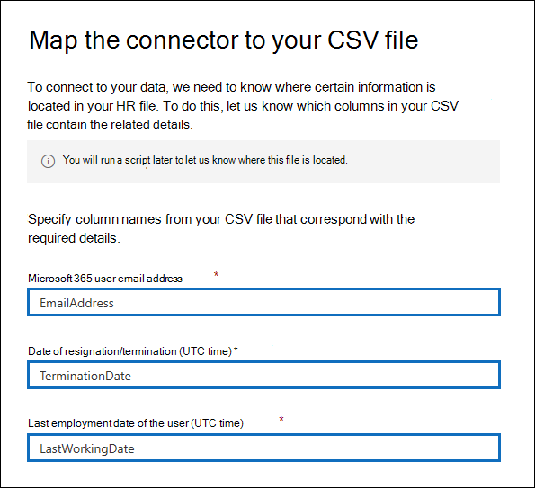
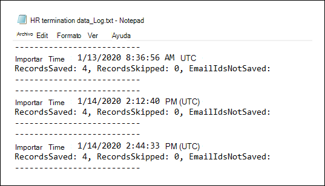
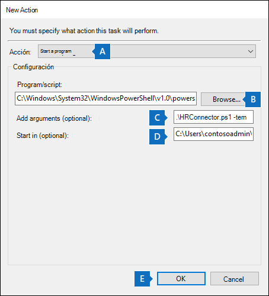
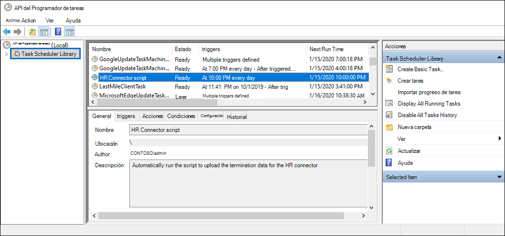

# <a name="set-up-a-connector-to-import-hr-data"></a>Configurar un conector para importar datos de recursos humanos

Puede configurar un conector de datos en el centro de cumplimiento de Microsoft 365 para importar datos de recursos humanos (HR), como la fecha en que un empleado envió su retirada y la fecha del último día del empleado. Estos datos de recursos humanos pueden usarse en las soluciones de protección de la información de Microsoft, como la nueva [solución de administración de riesgos de Insider](insider-risk-management.md), para ayudar a proteger su organización de la actividad malintencionada o del robo de datos dentro de la organización. La configuración de un conector de recursos humanos consiste en crear una aplicación en Azure Active Directory que se usa para la autenticación por conector, crear archivos de asignación CSV que contengan los datos de recursos humanos, crear un conector de datos en el centro de cumplimiento y, a continuación, ejecutar un script (en un base programada) que recopila los datos de recursos humanos del archivo CSV en la nube de Microsoft. A continuación, el conector de datos se usa soluciones de cumplimiento de Microsoft (como la administración de riesgos de Insider) para obtener acceso a los datos de recursos humanos que se importaron a la organización de Microsoft 365.

## <a name="before-you-begin"></a>Antes de empezar

- La organización debe permitir que el servicio de importación de Office 365 obtenga acceso a los datos de la organización. Para dar su consentimiento a esta solicitud, vaya a [esta página](https://login.microsoftonline.com/common/oauth2/authorize?client_id=570d0bec-d001-4c4e-985e-3ab17fdc3073&response_type=code&redirect_uri=https://portal.azure.com/&nonce=1234&prompt=admin_consent), inicie sesión con las credenciales de un administrador global de Microsoft 365 y, a continuación, acepte la solicitud. Debe completar este paso para poder crear correctamente el conector de recursos humanos en el paso 3.

- El usuario que crea el conector de recursos humanos en el paso 3 debe tener asignado el rol importación y exportación de buzones de correo en Exchange Online. Este rol no está asignado a ningún grupo de roles de Exchange Online de forma predeterminada. Puede Agregar el rol importación y exportación de buzones al grupo de funciones de administración de la organización en Exchange Online. O bien, puede crear un nuevo grupo de roles, asignar el rol de importación y exportación de buzones de correo y, a continuación, agregar los usuarios adecuados como miembros. Para obtener más información, vea las secciones [crear grupos](https://docs.microsoft.com/Exchange/permissions-exo/role-groups#create-role-groups) de roles o [modificar grupos de roles](https://docs.microsoft.com/Exchange/permissions-exo/role-groups#modify-role-groups) en el artículo sobre la administración de grupos de roles en Exchange Online.

- Deberá determinar cómo recuperar o exportar los datos del sistema de RRHH de su organización (de forma regular) y agregarlos al archivo CSV que se describe en el paso 2. El script que ejecutó en el paso 4 cargará los datos de recursos humanos en el archivo CSV en la nube de Microsoft.

- El script de ejemplo que ejecutó en el paso 4 cargará los datos de recursos humanos en la nube de Microsoft para que puedan usarse en otras herramientas de Microsoft, como la solución de administración de riesgos de Insider. Este script de ejemplo no es compatible con ningún servicio o programa de soporte estándar de Microsoft. El script de ejemplo se proporciona tal cual sin garantías de ningún tipo. Además, Microsoft no se hace responsable de cualquier garantía implícita, incluyendo, de manera enunciativa pero no limitativa, cualquier garantía implícita de comercialización o de calidad para cualquier propósito. Todo el riesgo derivado del uso o el rendimiento de la secuencia de comandos de muestra y la documentación se conservan con usted. En ningún caso Microsoft, sus autores o cualquier persona involucrada en su creación, producción o entrega de los scripts será responsable de cualquier daño (incluidos, de manera enunciativa pero no limitativa, daños por pérdidas de beneficios de una empresa, interrupción de la actividad de una empresa, pérdidas de información de una empresa, o cualquier otro daño pecuniario), incluso si Microsoft supiera de la posibilidad de tales daños.

## <a name="step-1-create-an-app-in-azure-active-directory"></a>Paso 1: crear una aplicación en Azure Active Directory

El primer paso consiste en crear y registrar una nueva aplicación en Azure Active Directory (AAD). La aplicación se corresponderá con el conector de RRHH que cree en el paso 3. La creación de esta aplicación permitirá que AAD autentique el conector de RRHH cuando se ejecute e intente acceder a su organización. Esta aplicación también se usará para autenticar el script que ejecutó en el paso 4 para cargar los datos de recursos humanos en la nube de Microsoft. Durante la creación de esta aplicación de AAD, asegúrese de guardar la siguiente información. Estos valores se usarán en pasos posteriores.

- IDENTIFICADOR de la aplicación AAD (también denominado identificador de *aplicación* o identificador de *cliente*)

- Secreto de la aplicación AAD (también denominado *secreto de cliente*)

- Identificador de inquilino (también denominado *identificador de directorio*)

Para obtener instrucciones paso a paso para crear una aplicación en AAD, vea [registrar una aplicación con la plataforma de identidad de Microsoft](https://docs.microsoft.com/azure/active-directory/develop/quickstart-register-app).

## <a name="step-2-prepare-a-csv-file-with-your-hr-data"></a>Paso 2: preparar un archivo CSV con los datos de recursos humanos

El paso siguiente es crear un archivo CSV que contenga información sobre los empleados que han abandonado la organización. Como se explica en la sección antes de empezar, deberá determinar cómo generar este archivo CSV desde el sistema de RRHH de la organización. En el ejemplo siguiente se muestra un archivo CSV completado (abierto en el Bloc de notas) que contiene los tres parámetros obligatorios (columnas). Es mucho más fácil editar el archivo CSV en Microsoft Excel.

```text
EmailAddress,TerminationDate,LastWorkingDate
sarad@contoso.com,2019-04-23T15:18:02.4675041+05:30,2019-04-29T15:18:02.4675041+05:30
pilarp@contoso.com,2019-04-24T09:15:49Z,2019-04-29T15:18:02.7117540
```

La primera fila, o fila de encabezado, del archivo CSV enumera los nombres de columna necesarios. El nombre que se usa en cada encabezado de columna depende de usted (los que aparecen en el ejemplo anterior son sugerencias). Sin embargo, *deben* especificarse los mismos nombres de columna que se usan en el archivo CSV al crear el conector de RRHH en el paso 3. No incluya espacios en los nombres de columna.

En la tabla siguiente se describe cada una de las columnas del archivo CSV:

|**Nombre de columna**|**Descripción**|
|:-----|:-----|
| **EmailAddress** <br/> |Especifica la dirección de correo electrónico del empleado que ha finalizado.|
| **TerminationDate** <br/> |Especifica la fecha de finalización oficial del empleo de la persona en la organización. Por ejemplo, puede ser la fecha en la que el empleado dio su aviso sobre cómo dejar la organización. Esta fecha puede ser distinta a la fecha del último día de trabajo de la persona. Debe usar el siguiente formato de fecha: `yyyy-mm-ddThh:mm:ss.nnnnnn+|-hh:mm`, que es el [formato de fecha y hora ISO 8601](https://www.iso.org/iso-8601-date-and-time-format.html).|
|**LastWorkingDate**|Especifica el último día de trabajo del empleado que ha finalizado. Debe usar el siguiente formato de fecha: `yyyy-mm-ddThh:mm:ss.nnnnnn+|-hh:mm`, que es el [formato de fecha y hora ISO 8601](https://www.iso.org/iso-8601-date-and-time-format.html).|
|||

Después de crear el archivo CSV con los datos de HR necesarios, almacénelo en el equipo local en el que ejecute el script en el paso 4. También debe implementar una estrategia de actualización para asegurarse de que el archivo CSV siempre contiene la información más actual, de modo que cualquier cosa que ejecute el script, los datos de finalización de empleado más actuales se cargarán en la nube de Microsoft.

## <a name="step-3-create-the-hr-connector"></a>Paso 3: crear el conector de recursos humanos

El siguiente paso es crear un conector de recursos humanos en el centro de cumplimiento de Microsoft 365. Después de ejecutar el script en el paso 4, el conector de recursos humanos que cree devolverá los datos de recursos humanos del archivo CSV a la organización de Microsoft 365. En este paso, asegúrese de copiar el JobId que se genera al crear el conector. Debe usar el JobId al ejecutar el script.

1. Vaya a [https://compliance.microsoft.com](https://compliance.microsoft.com) y, a continuación, haga clic en **conectores de datos** en el panel de navegación izquierdo.

2. En la página **conectores de datos (vista previa)** , en **HR**, haga clic en **Ver**.

3. En la página **RRHH** , haga clic en **Agregar conector**.

4. En la página **credenciales de autenticación** , realice lo siguiente y, a continuación, haga clic en **siguiente**:

   a. Escriba o pegue el identificador de la aplicación de AAD para la aplicación de Azure que creó en el paso 1.

   b. Escriba un nombre para el conector de recursos humanos.

5. En la página **asignación de archivos** , escriba los tres nombres de encabezado de columna (también denominados *parámetros* del archivo CSV que creó en el paso 2 en cada uno de los cuadros correspondientes. Los nombres no distinguen mayúsculas de minúsculas. Como se ha explicado anteriormente, los nombres que escriba en estos cuadros deben coincidir con los nombres de los parámetros en el archivo CSV. Por ejemplo, en la siguiente captura de pantalla se muestran los nombres de parámetro del ejemplo del archivo CSV de ejemplo que se muestra en el paso 2.

   

6. En la página **revisión** , revise la configuración y, a continuación, haga clic en **Finalizar** para crear el conector.

   Se muestra una página de estado que confirma que se ha creado el conector. Esta página también contiene el identificador de trabajo. Necesitará este identificador de trabajo para ejecutar el script en el paso siguiente. Puede copiarlo desde esta página o desde la página de control flotante para el conector.

7. Haga clic en **Listo**.
   
   El nuevo conector se muestra en la lista de la ficha **conectores** . 

8. Haga clic en el conector de recursos humanos que acaba de crear para mostrar la página de flotante, que contiene propiedades y otra información sobre el conector. 

   

   Si aún no lo ha hecho, puede copiar los valores del identificador de la **aplicación de Azure** y del identificador de trabajo del **conector**. Necesitará estos para ejecutar el script en el paso siguiente. También puede descargar el script de la página flotante (o descargarlo con el vínculo en el paso siguiente).

   También puede hacer clic en **Editar** para cambiar el identificador de la aplicación de Azure o los nombres de encabezado de columna que ha definido en la página **asignación de archivos** .

## <a name="step-4-run-the-sample-script-to-upload-your-hr-data"></a>Paso 4: ejecutar el script de ejemplo para cargar los datos de recursos humanos

El último paso para configurar un conector de recursos humanos es ejecutar un script de ejemplo que cargará los datos de recursos humanos en el archivo CSV (que creó en el paso 2) a la nube de Microsoft. En concreto, la secuencia de comandos carga los datos en el conector de recursos humanos. Después de ejecutar el script, el conector de recursos humanos que creó en el paso 3 importa los datos de recursos humanos a su organización de Microsoft 365, donde puede tener acceso a ellos otras herramientas de cumplimiento, como la solución de administración de riesgos de Insider. Después de ejecutar el script, considere la posibilidad de programar una tarea para que se ejecute de forma automática diariamente, de modo que los datos de finalización de los empleados más actuales se carguen en la nube de Microsoft. Consulte [programar el script para que se ejecute automáticamente](#optional-step-6-schedule-the-script-to-run-automatically).

1. Vaya a [este sitio de github](https://github.com/microsoft/m365-hrconnector-sample-scripts/blob/master/upload_termination_records.ps1) para acceder al script de ejemplo.

2. Haga clic en el botón **sin procesar** para mostrar el script en la vista de texto

3. Copie todas las líneas del script de ejemplo y guárdelas en un archivo de texto.

4. Modifique el script de ejemplo para su organización, si es necesario.

5. Guarde el archivo de texto como un archivo de script de Windows PowerShell mediante un sufijo `.ps1`de nombre de archivo de; por ejemplo, `HRConnector.ps1`.

6. Abra un símbolo del sistema en el equipo local y vaya al directorio donde guardó el script.

7. Ejecute el siguiente comando para cargar los datos de recursos humanos en el archivo CSV a la nube de Microsoft; por ejemplo:

    ```powershell
    .\HRConnector.ps1 -tenantId <tenantId> -appId <appId>  -appSecret <appSecret>  -jobId <jobId>  -csvFilePath '<csvFilePath>'
    ```

   En la tabla siguiente se describen los parámetros que se deben usar con este script y los valores necesarios. La información que ha obtenido en los pasos anteriores se usa en los valores de estos parámetros.

   |**Parámetro**|**Descripción**
   |:-----|:-----|:-----|
   |`tenantId`|Este es el identificador de la organización de Microsoft 365 que obtuvo en el paso 1. También puede obtener el tenantId de su organización en la hoja de **información general** del centro de administración de Azure ad. Se usa para identificar la organización.|
   |`appId` |Este es el identificador de la aplicación de AAD para la aplicación que ha creado en Azure AD en el paso 1. Esto lo usa Azure AD para la autenticación cuando el script intenta obtener acceso a la organización de 365 de Microsoft. | 
   |`appSecret`|Este es el secreto de la aplicación de AAD para la aplicación que ha creado en Azure AD en el paso 1. También se usa para la autenticación.|
   |`jobId`|Se trata del identificador de trabajo para el conector de recursos humanos que creó en el paso 3. Se usa para asociar los datos de recursos humanos cargados en la nube de Microsoft con el conector de recursos humanos.|
   |`csvFilePath`|Esta es la ruta de acceso al archivo en el equipo local (la que está usando para ejecutar el script) para el archivo CSV que creó en el paso 2. Intente evitar espacios en la ruta de acceso al archivo; de lo contrario, use comillas simples.|
   |||
   
   A continuación, se muestra un ejemplo de la sintaxis del script del conector de recursos humanos con valores reales para cada parámetro:

   ```powershell
    .\HRConnector.ps1 -tenantId d5723623-11cf-4e2e-b5a5-01d1506273g9 -appId 29ee526e-f9a7-4e98-a682-67f41bfd643e -appSecret MNubVGbcQDkGCnn -jobId b8be4a7d-e338-43eb-a69e-c513cd458eba -csvFilePath 'C:\Users\contosoadmin\Desktop\Data\employee_termination_data.csv'
    ```

   Si la carga se realiza correctamente, el script muestra el mensaje de **carga correcta** .

## <a name="step-5-monitor-the-hr-connector"></a>Paso 5: supervisar el conector de recursos humanos

Después de crear el conector de recursos humanos y ejecutar el script para cargar los datos de recursos humanos, puede ver el conector y el estado de carga en el centro de cumplimiento de Microsoft 365. Si programa la secuencia de comandos para que se ejecute automáticamente periódicamente, también puede ver el estado actual después de la última vez que se ejecutó el script.

1. Vaya a [https://compliance.microsoft.com](https://compliance.microsoft.com) y haga clic en **conectores de datos** en el panel de navegación izquierdo.

2. Haga clic en la pestaña **conectores** y, a continuación, seleccione el conector de RRHH para mostrar la página de flotante, que contiene las propiedades y la información sobre el conector.

   

3. En **curso**, haga clic en el vínculo **Descargar registro** para abrir (o guardar) el registro de estado del conector. Este registro contiene información sobre cada vez que se ejecuta el script y carga los datos del archivo CSV a la nube de Microsoft. 

   

   El campo **RecordsSaved** indica el número de filas del archivo CSV que se han cargado. Por ejemplo, si el archivo CSV contiene cuatro filas, el valor de los campos **RecordsSaved** es 4, si el script cargó correctamente todas las filas en el archivo CSV.

Si no ha ejecutado el script en el paso 4, en la **última importación**se muestra un vínculo para descargar el script. Puede descargar el script y, a continuación, seguir los pasos del paso 4 para ejecutarlo.

## <a name="optional-step-6-schedule-the-script-to-run-automatically"></a>Opcional Paso 6: programar el script para que se ejecute automáticamente

Para asegurarse de que los datos de recursos humanos más recientes de su organización están disponibles para herramientas como la solución de administración de riesgos de Insider, le recomendamos que programe el script para que se ejecute automáticamente de forma periódica, como una vez al día. Esto también requiere que actualice los datos de recursos humanos en el archivo CSV en una programación similar, si no es la misma, para que contenga la información más reciente acerca de los empleados que dejan la organización. El objetivo es cargar los datos de recursos humanos más actuales para que el conector de recursos humanos pueda ponerlos a disposición de la solución de administración de riesgos de Insider.

Puede usar la aplicación programador de tareas de Windows para ejecutar el script de forma automática cada día.

1. En el equipo local, haga clic en el botón **Inicio** de Windows y, a continuación, escriba **programador de tareas**.

2. Haga clic en la aplicación **programador de tareas** para abrirla.

3. En la sección **acciones** , haga clic en **crear tarea**.

4. En la pestaña **General** , escriba un nombre descriptivo para la tarea programada; por ejemplo, **script de conector de recursos humanos**. También puede Agregar una descripción opcional. 

5. En **Opciones de seguridad**, haga lo siguiente:

   a. Determine si desea ejecutar el script solo cuando haya iniciado sesión en el equipo o ejecutarlo cuando haya iniciado sesión o no.
   
   b. Asegúrese de que la casilla **ejecutar con los privilegios más altos** está seleccionada.

6. Seleccione la pestaña **desencadenadores** , haga clic en **nuevo**y, a continuación, realice las siguientes acciones:

   a. En **configuración**, seleccione la opción **diariamente** y, a continuación, elija una fecha y hora para ejecutar el script por primera vez. El script será cada día a la misma hora especificada.
   
   b. En **Configuración avanzada**, asegúrese de que esté activada la casilla de verificación **habilitado** .
   
   c. Haga clic en **Aceptar**.

7. Seleccione la pestaña **acciones** , haga clic en **nueva**y, a continuación, realice las siguientes acciones:

   

   a. En la lista desplegable **acción** , asegúrese de que está seleccionado **iniciar un programa** .

   b. En el cuadro **programa/script** , haga clic en **examinar**, vaya a la siguiente ubicación y selecciónela para que la ruta de acceso aparezca en el `C:\Windows\System32\WindowsPowerShell\v1.0\powershell.exe`cuadro:.

   c. En el cuadro **Agregar argumentos (opcional)** , pegue el mismo comando de script que ejecutó en el paso 4. Por ejemplo: `.\HRConnector.ps1 -tenantId "d5723623-11cf-4e2e-b5a5-01d1506273g9" -appId "c12823b7-b55a-4989-faba-02de41bb97c3" -appSecret "MNubVGbcQDkGCnn"  -jobId "e081f4f4-3831-48d6-7bb3-fcfab1581458" -csvFilePath "C:\Users\contosoadmin\Desktop\Data\employee_termination_data.csv"`

   d. En el cuadro **iniciar en (opcional)** , pegue la ubicación de la carpeta del script que ejecutó en el paso 4. Por ejemplo, `C:\Users\contosoadmin\Desktop\Scripts`.

   e. Haga clic en **Aceptar** para guardar la configuración de la nueva acción.

8. En la ventana **crear tarea** , haga clic en **Aceptar** para guardar la tarea programada. Es posible que se le pida que escriba sus credenciales de cuenta de usuario.

   La nueva tarea se muestra en la biblioteca del programador de tareas.

   

   Se muestra la última vez que se ejecutó el script y la próxima vez que está programado para ejecutarse. Puede hacer doble clic en la tarea para editarla.

   También puede comprobar la última vez que se ejecutó el script en la página flotante del conector HR correspondiente en el centro de cumplimiento.
