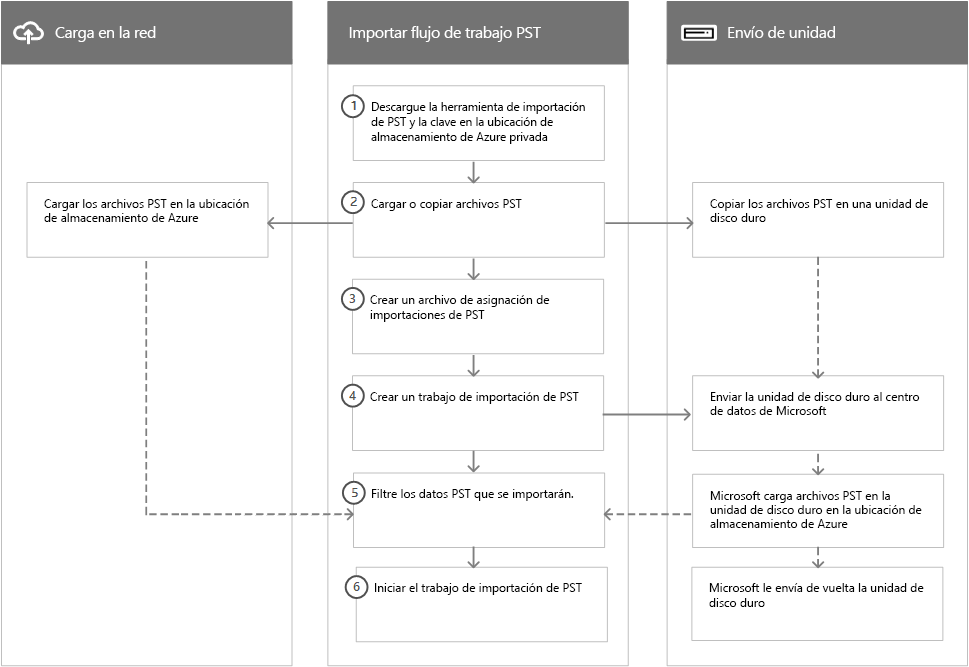

# Información general sobre la importación de archivos PST de su organización a Office 365Overview of importing your organization's PST files to Office 365

> [!NOTE]
> Este artículo está dirigido a administradores.This article is for administrators. ¿Está intentando importar archivos PST a su propio buzón?Are you trying to import PST files to your own mailbox? Consulte [Importar el correo electrónico, los contactos y el calendario desde un archivo .pst de Outlook](https://go.microsoft.com/fwlink/p/?LinkID=785075)See [Import email, contacts, and calendar from an Outlook .pst file](https://go.microsoft.com/fwlink/p/?LinkID=785075)

Puede usar el servicio de importación del Centro de seguridad y cumplimiento para importar grandes cantidades de archivos PST rápidamente a buzones de Exchange online a su organización de Office 365.You can use the Import service in the Security & Compliance Center to quickly bulk-import PST files to Exchange Online mailboxes in your Office 365 organization. Hay dos formas de importar archivos PST a Office 365:There are two ways you can import PST files to Office 365:

- **Carga en la red** : cargue los archivos PST a través de la red en una ubicación temporal de Azure Storage en la nube de Microsoft.**Network upload**  - Upload the PST files over the network to a temporary Azure Storage location in the Microsoft cloud. Después, use el servicio de importación de Office 365 para importar los datos PST a los buzones de su organización de Office 365.Then you use the Office 365 Import service to import the PST data to mailboxes in your Office 365 organization. 

- **Envío de unidad** : Copie los archivos PST a un disco duro cifrado por BitLocker y envíe físicamente la unidad a Microsoft.**Drive shipping**  - Copy the PST files to a BitLocker-encrypted hard drive and then physically ship the drive to Microsoft. Cuando Microsoft reciba la unidad de disco duro, el personal del centro de datos cargará los datos a una ubicación temporal de Azure Storage en la nube de Microsoft.When Microsoft receives the hard drive, data center personnel upload the data to a temporary Azure Storage location in the Microsoft cloud. Después, use el servicio de importación de Office 365 para importar los datos a los buzones de su organización de Office 365.Then you use the Office 365 Import service to import the data to mailboxes in your Office 365 organization.

## Instrucciones detalladasStep-by-step instructions
  
Consulte uno de los siguientes temas con instrucciones paso a paso para importar grandes cantidades de archivos PST de su organización a Office 365.See one of the following topics for detailed, step-by-step instructions for bulk-importing your organization's PST files to Office 365. 

- [Usar la carga en la red para importar archivos PST en Office 365Use network upload to import PST files to Office 365](use-network-upload-to-import-pst-files.md)

- [Use el envío de unidades para importar archivos PST a Office 365Use drive shipping to import PST files to Office 365](use-drive-shipping-to-import-pst-files-to-office-365.md)

## Cómo funciona la importación de archivos PSTHow importing PST files works

A continuación, le presentamos una ilustración y una descripción del proceso completo de importación de PST.Here's an illustration and description of the complete PST import process. La ilustración muestra el flujo de trabajo principal y resalta las diferencias entre la carga por red y los métodos de envío de unidades.The illustration shows the primary workflow and highlights the differences between the network upload and drive shipping methods.
  

  
1. **Descargar las herramientas de importación de PST y la clave de la ubicación privada de Azure Storage**: el primer paso es descargar la herramienta y la clave de acceso utilizadas para cargar los archivos PST o copiarlos en una unidad de disco duro.**Download the PST import tools and key to private Azure Storage location** - The first step is to download the tool and access key used to upload the PST files or copy them to a hard drive. Puede obtenerlas en la página **Importar** en el Centro de seguridad y cumplimiento.You obtain these from the **Import** page in the Security & Compliance Center. La clave le ofrece (a usted o al personal del centro de datos de Microsoft en el caso de envío de unidades) los permisos necesarios para cargar los archivos PST a una ubicación privada y segura de Azure Storage.The key provides you (or Microsoft data center personnel in the case of drive shipping) with the necessary permissions to upload PST files to a private and secure Azure Storage location. Esta clave de acceso es exclusiva para su organización y le ayuda a evitar el acceso no autorizado a archivos PST tras su carga en la nube de Microsoft.This access key is unique to your organization and helps prevent unauthorized access to your PST files after they're uploaded to the Microsoft cloud. Tenga en cuenta que para importar archivos PST a Office 365 su organización no necesita una suscripción a Azure separada.Importing PST files to Office 365 doesn't require your organization to have a separate Azure subscription. 
    
2. **Cargar o copiar los archivos PST**: El siguiente paso depende de si decidió importar los archivos PST mediante la carga en la red o el envío de unidades.**Upload or copy the PST files** - The next step depends on whether you're using network upload or drive shipping to import PST files. En ambos casos, usará la herramienta y la clave de almacenamiento segura que obtuvo en el paso anterior.In both cases, you'll use the tool and secure storage key that you obtained in the previous step.
    
    - **Carga en la red:** la herramienta AzCopy.exe (descargada en el paso 1) le permite cargar y almacenar los archivos PST en una ubicación de Azure Storage en la nube de Microsoft.**Network upload**The AzCopy.exe tool (downloaded in step 1) is used to upload and store your PST files in an Azure Storage location in the Microsoft cloud. La ubicación de Azure Storage que carga los archivos PST está en el mismo centro de datos regional de Microsoft que su organización 365 de Office.The Azure Storage location that you upload your PST files to resides in the same regional Microsoft datacenter where your Office 365 organization is located.
    
      Para poder cargar los archivos PST que quiere importar a Office 365, estos deben encontrarse en un recurso compartido de archivos o en un servidor de archivos de su organización.To upload them, the PST files that you want to import to Office 365 have to be located in a file share or file server in your organization.
    
    - **Envío de discos:** la herramienta WAImportExport.exe (descargada en el paso 1) le permite copiar los archivos PST en la unidad de disco duro.**Drive shipping**The WAImportExport.exe tool (downloaded in step 1) is used to copy your PST files to the hard drive. Esta herramienta cifra la unidad de disco duro con BitLocker y, a continuación, copia los PST a la unidad de disco duro.This tool encrypts the hard drive with BitLocker and then copies the PSTs to the hard drive. Como en la carga por red, los archivos PST que desea copiar al disco duro deben encontrarse en un recurso compartido de archivos o en un servidor de archivos de su organización.Like network upload, the PST files that you want to copy to the hard drive have to be located in a file share or file server in your organization.
    
3. **Crear un archivo de asignación para importar PST**: una vez que los archivos PST se han cargado en la ubicación de Azure Storage o se han copiado en un disco duro, el siguiente paso es crear un archivo de valores separados por comas (CSV) que especifique qué buzones de usuario se usarán para importar los archivos PST (un archivo PST se puede importar al buzón principal de un usuario o a su buzón de archivo).**Create a PST import mapping file** - After the PST files have been uploaded to the Azure Storage location or copied to a hard drive, the next step is to create a comma-separated value (CSV) file that specifies which user mailboxes the PST files will be imported to (and a PST file can be imported to a user's primary mailbox or their archive mailbox). El servicio de importación de Office 365 usará la información para importar los archivos PST.The Office 365 Import service will use the information to import the PST files. 
    
4. **Crear un trabajo de importación de PST**: el siguiente paso es crear un trabajo de importación de PST en la página **Importar archivos PST** del Centro de seguridad y cumplimiento, y enviar el archivo de asignación de importación de PST creado en el paso anterior.**Create a PST import job** - The next step is to create a PST import job on the **Import PST files** page in the Security & Compliance Center and submit the PST import mapping file created in the previous step. Para la carga en la red (debido a que los archivos PST se han cargado en Azure), Office 365 analiza los datos de los archivos PST y, a continuación, le permite establecer filtros para controlar qué datos se importan a los buzones especificados en el archivo de asignación de importación de PST.For network upload (because the PST files have been uploaded to Azure) Office 365 analyzes the data in the PST files and then gives you an opportunity to set filters that control what data actually gets imported to the mailboxes specified in the PST import mapping file. 
    
    El método de envío de unidades conlleva algunos pasos adicionales en esta parte del proceso.For drive shipping, a few additional things happen at this point in the process.
    
    - Usted envía físicamente la unidad de disco duro a un centro de datos de Microsoft (la dirección de envío del centro de datos de Microsoft se mostrará cuando se cree el trabajo de importación).You physically ship the hard drive to a Microsoft data center (the shipping address for the Microsoft data center is displayed when the import job is created).
    
    - Cuando Microsoft reciba la unidad de disco duro, el personal del centro de datos cargará los archivos PST de la unidad en la ubicación de Azure Storage de su organización.When Microsoft receives the hard drive, data center personnel will upload the PST files on the hard drive to the Azure Storage location for your organization. Como se explicó anteriormente, sus archivos PST se cargan en una ubicación de Azure Storage que se encuentra en el mismo centro de datos regional de Microsoft que su organización de Office 365.As previously explained, your PST files are uploaded to a Azure Storage location that resides in the same regional Microsoft datacenter where your Office 365 organization is located.
    
      > [!NOTE]
      > Cargar los archivos PST de la unidad a la ubicación de Azure lleva de unos 7 a 10 días hábiles después de que Microsoft la reciba.The PST files on the hard drive are uploaded to Azure within 7 to 10 business days after Microsoft receives the hard drive.

      Como en la carga por red, Office 365 analiza los datos de los archivos PST y, a continuación, le permite establecer filtros para controlar qué datos se importan a los buzones especificados en el archivo de asignación de importación de PST.Like the network upload process, Office 365 then analyzes the data in the PST files and gives you an opportunity to set filters that control what data actually gets imported to the mailboxes specified in the PST import mapping file.
    
    - Microsoft le envía de vuelta la unidad de disco duro.Microsoft ships the hard drive back to you.
    
5. **Filtrar los datos PST que se importarán a los buzones**: después de crear el trabajo de importación (y de que los archivos PST se carguen en la ubicación de Azure Storage tras el envío del disco), Office 365 analiza los datos de los archivos PST (de forma segura) identificando la antigüedad de los elementos y los diferentes tipos de mensajes incluidos en los archivos PST.**Filter the PST data that will be imported to mailboxes** - After the import job is created (and after the PST files from a drive shipping job are uploaded to the Azure Storage location) Office 365 analyzes the data in the PST files (safely and securely) by identifying the age of the items and the different message types included in the PST files. Una vez se haya completado el análisis y los datos estén listos para la importación, tiene la opción de importar todos los datos incluidos en los archivos PST o de recortar solo algunos de ellos, estableciendo filtros para controlar los datos para importar.When the analysis is completed and the data is ready to import, you have the option to import all the data contained in the PST files or you can trim the data that's imported by setting filters that control what data gets imported. 
    
6. **Iniciar el trabajo de importación de PST**: después de que se inicia el trabajo de importación, Office 365 usa la información del archivo de asignación para importar los archivos PST desde la ubicación de Azure Storage a los buzones de los usuarios.**Start the PST import job** - After the import job is started, Office 365 uses the information in the PST import mapping file to import the PSTs files from the he Azure Storage location to user mailboxes. En la página **Importar archivos PST** del Centro de seguridad y cumplimiento se mostrará la información de estado sobre el trabajo de importación (incluida información individual de cada archivo PST importado).Status information about the import job (including information about each PST file being imported) is displayed on the **Import PST files** page in the Security & Compliance Center. Cuando finalice el trabajo de importación, el estado del trabajo aparecerá como **Completado**.When the import job is finished, the status for the job is set to **Complete**.
  
## ¿Por qué importar datos de correo electrónico a Office 365?Why import email data to Office 365?

- Es una buena forma de importar los datos de mensajería de archivo de su organización a Office 365.It's a good way to import your organization's archival messaging data to Office 365.
    
- Puede usar la [Importación inteligente](filter-data-when-importing-pst-files.md) para filtrar y seleccionar qué elementos de los archivos PST se importan a los buzones de destino.You can use the [Intelligent Import](filter-data-when-importing-pst-files.md) feature to filter the items in PST files that actually get imported to the target mailboxes. Esto le permite limitar los datos importados a aquellos que usted seleccione.This lets you trim the data that's imported by setting filters that control what data gets imported. 
    
- Importar datos de correo a Office365 ayuda a satisfacer las necesidades de cumplimiento de la organización, ya que le permite:Importing email data to Office 365 helps address compliance needs of your organization by letting you:
    
  - Habilitar [buzones de archivo](enable-archive-mailboxes.md) y [archivo ilimitado](unlimited-archiving.md) proporciona a los usuarios un mayor espacio de almacenamiento en su buzón.Enable [archive mailboxes](enable-archive-mailboxes.md) and [unlimited archiving](unlimited-archiving.md) to give users additional mailbox storage space. 
    
  - Establezca los buzones en [Suspensión por litigio](https://go.microsoft.com/fwlink/?linkid=841243) para conservar el contenido.Place mailboxes on [Litigation Hold](https://go.microsoft.com/fwlink/?linkid=841243) to retain content. 
    
  - Use la [Herramienta de búsqueda de contenido](content-search.md) para buscar en el contenido del buzón.Use the [Content Search tool](content-search.md) to search for mailbox content. 
    
  - Use los [casos de eDiscovery](ediscovery-cases.md) para administrar las investigaciones legales de su organización.Use [eDiscovery cases](ediscovery-cases.md) to manage your organization's legal investigations 
    
  - Use las [directivas de conservación](retention-policies.md) del Centro de cumplimiento y seguridad para establecer cuánto tiempo se debe conservar el contenido del buzón y elimine el contenido cuando expire el período de conservación.Use [retention policies](retention-policies.md) in the Security & Compliance Center to control how long mailbox content is retained, and then delete content after the retention period expires. 

  - Use [las directivas de cumplimiento con la comunidad](communication-compliance.md) para examinar los mensajes, asegurarse de que son compatibles con los estándares de mensaje y agregar un tipo de clasificación.Use [Communication compliance policies](communication-compliance.md) to examine messages to make sure they are compliant with message standards and add a classification type.
    
- Importar datos a Office365 le ayuda a protegerse contra la pérdida de datos.Importing data to Office 365 helps protect against data loss. Los datos de correo electrónico que se importan a Office 365 heredan las características de alta disponibilidad de Exchange Online.Email data that's imported to Office 365 inherits the high availability features of Exchange Online.
    
- Los datos de correo en Office365 están disponibles para los usuarios en todos los dispositivos porque se almacenan en la nube.Email data in Office 365 is available to users from all devices because it's stored in the cloud.
    
## Importar datos de SharePoint en Office 365Importing SharePoint data to Office 365

También puede importar archivos y documentos de los sitios de SharePoint y las cuentas de OneDrive en su organización 365 de Office.You can also import files and documents to SharePoint sites and OneDrive accounts in your Office 365 organization. Para obtener más información, consulte los siguientes artículos:For more information, see the following articles:

- [Migrar a SharePoint OnlineMigrate to SharePoint Online](https://docs.microsoft.com/sharepointmigration/migrate-to-sharepoint-online)

- [Presentación de la herramienta de migración de SharePointIntroducing the SharePoint Migration Tool](https://docs.microsoft.com/sharepointmigration/introducing-the-sharepoint-migration-tool)

- [Migrar a SharePoint Online con PowerShellMigrate to SharePoint Online using PowerShell](https://docs.microsoft.com/sharepointmigration/overview-spmt-ps-cmdlets)

- [Migrar su contenido de recursos compartidos a SharePoint Online con Azure Data BoxMigrate your file share content to SharePoint Online using the Azure Data Box](https://docs.microsoft.com/sharepointmigration/how-to-migrate-file-share-content-to-spo-using-azuredatabox)

## Preguntas frecuentes sobre la importación de archivos PST a Office 365Frequently asked questions about importing PST files to Office 365
  
Estas son algunas de las preguntas más frecuentes sobre el uso del servicio de importación de Office 365 para importar archivos PST en masa a los buzones de Office 365.Here are some frequently asked questions about using the Office 365 Import service to bulk-import PST files to Office 365 mailboxes. 
  
- [Uso de la carga en la red para importar archivos PSTUsing network upload to import PST files](#using-network-upload-to-import-pst-files)
  
- [Uso del envío de unidades para importar los archivos PSTUsing drive shipping to import PST files](#using-drive-shipping-to-import-pst-files)
  
### Uso de la carga en la red para importar archivos PSTUsing network upload to import PST files

 **¿Qué permisos son necesarios para crear trabajos de importación en el servicio de importación de Office 365?****What permissions are required to create import jobs in the Office 365 Import Service?**
  
Debe tener asignado el rol importación y exportación de buzón de Exchange Online para importar archivos PST a los buzones de Office 365.You have to be assigned the Mailbox Import Export role in Exchange Online to import PST files to Office 365 mailboxes. Este rol no está asignado a ningún grupo de roles de Exchange Online de forma predeterminada.By default, this role isn't assigned to any role group in Exchange Online. Puede agregar el rol Mailbox Import Export al grupo de roles Administración de la organización.You can add the Mailbox Import Export role to the Organization Management role group. O puede crear un nuevo grupo de rol, asignar el rol de exportación e importación de buzón y, después, agregarse o agregar a otros usuarios como miembro.Or you can create a new role group, assign the Mailbox Import Export role, and then add yourself or other users as a member. Para obtener más información, vea las secciones "Agregar un rol a un grupo de roles" o "Crear un grupo de roles" en [Administrar grupos de roles en Exchange Online](https://go.microsoft.com/fwlink/p/?LinkId=730688).For more information, see the "Add a role to a role group" or the "Create a role group" sections in [Manage role groups in Exchange Online](https://go.microsoft.com/fwlink/p/?LinkId=730688).
  
Además, para crear trabajos de importación en el Centro de seguridad y cumplimiento, debe cumplirse uno de estos requisitos:Additionally, to create import jobs in the Security & Compliance Center, one of the following must be true:
  
- Debe tener asignado el rol de los destinatarios de correo en Exchange Online.You have to be assigned the Mail Recipients role in Exchange Online. De forma predeterminada, este rol se asigna a los grupos de roles de administración de la organización y administración de destinatarios.By default, this role is assigned to the Organization Management and Recipient Management roles groups.

    O bienOr
    
- Debe ser administrador global en su organización de Office 365. You have to be a global administrator in your Office 365 organization.

> [!TIP]
> Puede crear un nuevo grupo de roles en Exchange Online que está pensado específicamente para la importación de archivos PST a Office 365.Consider creating a new role group in Exchange Online that's specifically intended for importing PST files to Office 365. Para obtener el nivel mínimo de privilegios necesarios para importar archivos PST, asigne los roles de importación y exportación de buzón y de destinatarios de correo al nuevo grupo de roles y, a continuación, agregue a los miembros.For the minimum level of privileges required to import PST files, assign the Mailbox Import Export and Mail Recipients roles to the new role group, and then add members. 
  
 **¿Dónde está disponible la carga en la red?****Where is network upload available?**
  
La carga en la red está disponible actualmente en Estados Unidos, Canadá, Brasil, Reino Unido, Europa, India, Asia Oriental, Sudeste asiático, Japón, República de Corea y Australia. La carga en la red estará disponible en más regiones próximamente.Network upload is currently available in the United States, Canada, Brazil, the United Kingdom, Europe, India, East Asia, Southeast Asia, Japan, Republic of Korea, and Australia. Network upload will be available in more regions soon.
  
 **¿Cuál es el precio de importar archivos PST con la carga en la red?****What is the pricing for importing PST files by using network upload?**
  
Using network upload to import PST files is free.Using network upload to import PST files is free.
  
Esto también significa que después de que los archivos PST se eliminen del área de Azure Storage, ya no se mostrarán en la lista de archivos para un trabajo de importación completado en el Centro de administración de Microsoft 365.This also means that after PST files are deleted from the Azure Storage area, they're no longer displayed in the list of files for a completed import job in the Microsoft 365 admin center. Aunque todavía puede aparecer un trabajo de importación en la página **Importar datos a Office 365**, la lista de archivos PST puede estar vacía cuando vea los detalles de los trabajos de importación más antiguos.Although an import job might still be listed on the **Import data to Office 365** page, the list of PST files might be empty when you view the details of older import jobs.
  
 **¿Qué versión del formato de archivo PST se admite para importarse en Office 365?****What version of the PST file format is supported for importing to Office 365?**
  
There are two versions of the PST file format: ANSI and Unicode.There are two versions of the PST file format: ANSI and Unicode. Recomendamos la importación de archivos que usen el formato Unicode de archivo PST.We recommend importing files that use the Unicode PST file format. En cambio, los archivos que usan el formato ANSI de archivo PST, como pueden ser los de los idiomas que usan un conjunto de caracteres de doble byte (DBCS), también pueden importarse a Office 365.However, files that use the ANSI PST file format, such as those for languages that use a double-byte character set (DBCS), can also be imported to Office 365. Para obtener más información sobre la importación de archivos PST con formato ANSI, vea el Paso 4 de [Usar la carga en la red para importar los archivos PST en Office 365](https://go.microsoft.com/fwlink/p/?LinkId=823074).For more information about importing ANSI PST files, see Step 4 in [Use network upload to import PST files to Office 365](https://go.microsoft.com/fwlink/p/?LinkId=823074).
  
Además, los archivos PST de Outlook 2007 y versiones posteriores se pueden importar a Office 365.Additionally, PST files from Outlook 2007 and later versions can be imported to Office 365.
  
 **Después de cargar mis archivos PST en el área de Azure Storage, ¿cuánto tiempo se mantienen en Azure antes de eliminarse?****After I upload my PST files to the Azure Storage area, how long are they kept in Azure before they're deleted?**
  
Cuando use el método de carga en la red para importar archivos PST, cárguelos en un contenedor de blobs de Azure denominado **ingestiondata**.When you use the network upload method to import PST files, you upload them to an Azure blob container named **ingestiondata**. Si no hay ningún trabajo de importación en curso en la página **Importar archivos PST** en el Centro de seguridad y cumplimiento, entonces todos los archivos PST del contenedor **ingestiondata** en Azure se eliminarán en un plazo de 30 días después de que se haya creado el trabajo de importación más reciente en el Centro de seguridad y cumplimiento.If there are no import jobs in progress on the **Import PST files** page in the Security & Compliance Center), then all PST files in the **ingestiondata** container in Azure are deleted 30 days after the most recent import job was created in the Security & Compliance Center. Eso significa también tendrá que crear una nueva tarea de importación en el Centro de seguridad y cumplimiento (se describe en el paso 5 de las instrucciones de carga de red) en un plazo de 30 días posteriores a la carga de archivos PST en Azure.That also means you have to create a new import job in the Security & Compliance Center (described in Step 5 in the network upload instructions) within 30 days of uploading PST files to Azure.
  
Esto también significa que después de que los archivos PST se eliminen del área de Azure Storage, ya no se mostrarán en la lista de archivos para un trabajo de importación completado en el Centro de seguridad y cumplimiento.This also means that after PST files are deleted from the Azure Storage area, they're no longer displayed in the list of files for a completed import job in the Security & Compliance Center. Aunque todavía puede aparecer un trabajo de importación en la página **Importar archivos PST** en el Centro de seguridad y cumplimiento, la lista de archivos PST puede estar vacía cuando vea los detalles de los trabajos de importación más antiguos.Although an import job might still be listed on the **Import PST files** page in the Security & Compliance Center, the list of PST files might be empty when you view the details of older import jobs.
  
 **¿Cuánto tiempo se tarda en importar un archivo PST en un buzón?****How long does it take to import a PST file to a mailbox?**
  
Depende de la capacidad de su red, pero normalmente se necesitan varias horas para que cada terabyte (TB) de datos se cargue en el área de Azure Storage para su organización.It depends on the capacity of your network, but it typically takes several hours for each terabyte (TB) of data to be uploaded to the Azure Storage area for your organization. Después de que los archivos PST se copien en el área de Azure Storage, un archivo PST se importa a un buzón de Office 365 a una velocidad mínima de 24 GB al día.After the PST files are copied to the Azure Storage area, a PST file is imported to an Office 365 mailbox at a rate of at least 24 GB per day. Si esta velocidad no satisface sus necesidades, puede considerar otros métodos para migrar datos de correo electrónico a Office 365.If this rate doesn't meet your needs, you might consider other methods to get email data into Office 365. Para obtener más información, vea [Formas de migrar varias cuentas de correo electrónico a Office 365](https://docs.microsoft.com/Exchange/mailbox-migration/mailbox-migration).For more information, see [Ways to migrate multiple email accounts to Office 365](https://docs.microsoft.com/Exchange/mailbox-migration/mailbox-migration).
  
Si se importan distintos archivos PST a diferentes buzones de destino, el proceso de importación se producirá en paralelo; en otras palabras, cada par PST-buzón se importará de forma simultánea.If different PST files are imported to different target mailboxes, the import process occurs in parallel; in other words, each PST/mailbox pair is imported simultaneously. Si se importan varios archivos PST al mismo buzón, se hará de manera simultánea.Likewise, if multiple PST files are imported to the same mailbox, they will be simultaneously imported.
  
 **¿Existe un límite de tamaño del mensaje al importar archivos PST?****Is there a message size limit when importing PST files?**
  
Sí.Yes. Si un archivo PST contiene un elemento de buzón de más de 150 MB, el elemento se ignorará durante el proceso de importación.If a PST file contains a mailbox item that is larger than 150 MB, the item will be skipped during the import process.
  
 **¿Las propiedades de los mensajes, como cuando el mensaje se envía o se recibe, la lista de destinatarios y otras propiedades, se conservan cuando se importan los archivos PST en un buzón de Office 365?****Are message properties, such as when the message was sent or received, the list of recipients and other properties, preserved when PST files are imported to an Office 365 mailbox?**
  
Sí.Yes. Ninguno de los metadatos de los mensajes originales cambiará durante el proceso de importación.The original message metadata isn't changed during the import process.
  
 **¿Existe algún límite en el número de niveles de una jerarquía de carpetas para un archivo PST que quiero importar a un buzón?****Is there a limit to the number of levels in a folder hierarchy for a PST file that I want to import to a mailbox?**
  
Sí. No puede importar archivos PST que tengan 300 o más niveles de carpetas anidadas.Yes. You can't import a PST file that has 300 or more levels of nested folders.
  
 **¿Puedo usar la carga en la red para importar archivos PST en un buzón inactivo en Office 365?****Can I use network upload to import PST files to an inactive mailbox in Office 365?**
  
Sí, esta función está disponible ahora.Yes, this capability is now available.
  
 **¿Puedo usar la carga en la red para importar archivos PST en un buzón de archivo en línea en una implementación híbrida de Exchange?****Can I use network upload to import PST files to an online archive mailbox in an Exchange hybrid deployment?**
  
Sí, esta función está disponible ahora.Yes, this capability is now available.
  
 **¿Puedo usar la carga de red para importar archivos PST en carpetas públicas de Exchange Online?****Can I use network upload to import PST files to public folders in Exchange Online?**
  
No, no puede importar archivos PST en carpetas públicas.No, you can't import PST files to public folders.
  
### Uso del envío de unidades para importar los archivos PSTUsing drive shipping to import PST files

 **¿Qué permisos son necesarios para crear trabajos de importación en el servicio de importación de Office 365?****What permissions are required to create import jobs in the Office 365 Import Service?**
  
Debe tener asignado el rol Importación o exportación de buzón para poder importar archivos PST a los buzones de Office 365.You have to be assigned the Mailbox Import Export role to import PST files to Office 365 mailboxes. Este rol no está asignado a ningún grupo de roles de Exchange Online de forma predeterminada.By default, this role isn't assigned to any role group in Exchange Online. Puede agregar el rol Mailbox Import Export al grupo de roles Administración de la organización.You can add the Mailbox Import Export role to the Organization Management role group. O puede crear un nuevo grupo de rol, asignar el rol de exportación e importación de buzón y, después, agregarse o agregar a otros usuarios como miembro.Or you can create a new role group, assign the Mailbox Import Export role, and then add yourself or other users as a member. Para obtener más información, vea las secciones "Agregar un rol a un grupo de roles" o "Crear un grupo de roles" en [Administrar grupos de roles en Exchange Online](https://go.microsoft.com/fwlink/p/?LinkId=730688).For more information, see the "Add a role to a role group" or the "Create a role group" sections in [Manage role groups in Exchange Online](https://go.microsoft.com/fwlink/p/?LinkId=730688).
  
Además, para crear trabajos de importación en el Centro de seguridad y cumplimiento, debe cumplirse uno de estos requisitos:Additionally, to create import jobs in the Security & Compliance Center, one of the following must be true:
  
- Debe tener asignado el rol de los destinatarios de correo en Exchange Online.You have to be assigned the Mail Recipients role in Exchange Online. De forma predeterminada, este rol se asigna a los grupos de roles de administración de la organización y administración de destinatarios.By default, this role is assigned to the Organization Management and Recipient Management roles groups.
    
    O bienOr
    
- Debe ser administrador global en su organización de Office 365. You have to be a global administrator in your Office 365 organization.
    
> [!TIP]
> Puede crear un nuevo grupo de roles en Exchange Online que está pensado específicamente para la importación de archivos PST a Office 365.Consider creating a new role group in Exchange Online that's specifically intended for importing PST files to Office 365. Para obtener el nivel mínimo de privilegios necesarios para importar archivos PST, asigne los roles de importación y exportación de buzón y de destinatarios de correo al nuevo grupo de roles y, a continuación, agregue a los miembros.For the minimum level of privileges required to import PST files, assign the Mailbox Import Export and Mail Recipients roles to the new role group, and then add members. 
  
 **¿Dónde está disponible el envío de unidades?****Where is drive shipping available?**
  
El envío de unidades está disponible actualmente en Estados Unidos, Canadá, Brasil, Reino Unido, Europa, India, Asia Oriental, Sudeste asiático, Japón, República de Corea y Australia.Drive shipping is currently available in the United States, Canada, Brazil, the United Kingdom, Europe, India, East Asia, Southeast Asia, Japan, Republic of Korea, and Australia. El envío de unidades estará disponible en más regiones próximamente.Drive shipping will be available in more regions soon.
  
 **¿Qué contratos de licencias comerciales admiten el envío de unidades?****What commercial licensing agreements support drive shipping?**
  
El envío de unidades para importar archivos PST en Office 365 está disponible mediante el Contrato Microsoft Enterprise (EA).Drive shipping to import PST files to Office 365 is available through a Microsoft Enterprise Agreement (EA). El envío de unidades no está disponible mediante un Contrato de productos y servicios de Microsoft (MPSA).Drive shipping isn't available through a Microsoft Products and Services Agreement (MPSA).
  
 **¿Cuál es el precio de usar el envío de unidades para importar archivos PST en Office 365?****What is the pricing for using drive shipping to import PST files to Office 365?**
  
El costo de usar el envío de unidades para importar archivos PST en buzones de Office 365 es de 2 USD por GB de datos.The cost to use drive shipping to import PST files to Office 365 mailboxes is $2 USD per GB of data. Por ejemplo, si envía una unidad de disco duro que contiene 1000 GB (1 TB) de archivos PST, el costo es 2000 USD.For example, if you ship a hard drive that contains 1,000 GB (1 TB) of PST files, the cost is $2,000 USD. Puede colaborar con un asociado para abonar la cuota de importación.You can work with a partner to pay the import fee. Para obtener información sobre cómo buscar un asociado, consulte [Buscar un asociado o distribuidor de Office 365](https://go.microsoft.com/fwlink/p/?LinkId=785197).For information about finding a partner, see [Find your Office 365 partner or reseller](https://go.microsoft.com/fwlink/p/?LinkId=785197).
  
 **¿Qué tipo de unidades de disco duro se admiten para el envío de unidades?****What kind of hard drives are supported for drive shipping?**
  
El servicio de importación de Office 365 solo se puede usar con unidades de estado sólido de 2,5 pulgadas (SSD) o discos duros internos de 2,5 o 3,5 pulgadas SATA II o SATA III .Only 2.5 inch solid-state drives (SSDs) or 2.5 inch or 3.5 inch SATA II/III internal hard drives are supported for use with the Office 365 Import service. Puede usar discos duros de hasta 10 TB.You can use hard drives up to 10 TB. Para los trabajos de importación, se procesará solo el primer volumen de datos del disco duro.For import jobs, only the first data volume on the hard drive will be processed. El volumen de datos debe tener el formato NTFS.The data volume must be formatted with NTFS. Al copiar datos a un disco duro, puede adjuntarlos directamente mediante un conector SSD de 2,5 pulgadas o un conector SATA II o SATA III de 2,5 o 3,5 pulgadas, o también puede adjuntarlos de forma externa usando un adaptador USB externo SSD de 2,5 pulgadas o uno SATA II o SATA III de 2,5 o 3,5 pulgadas.When copying data to a hard drive, you can attach it directly using a 2.5 inch SSD or 2.5 inch or 3.5 inch SATA II/III connector or you can attach it externally using an external 2.5 inch SSD or 2.5 inch or 3.5 inch SATA II/III USB adaptor.
  
> [!IMPORTANT]
> El Servicio de importación de Office 365 no admite los discos duros externos con un adaptador USB integrado.External hard drives that come with an built-in USB adaptor aren't supported by the Office 365 Import service. Además, no se puede usar un disco que esté dentro de la carcasa de un disco duro externo.Additionally, the disk inside the casing of an external hard drive can't be used. No envíe discos duros externos.Please don't ship external hard drives. 
  
 **¿Cuántas unidades de disco duro puedo enviar para un trabajo de importación único?****How many hard drives can I ship for a single import job?**
  
Puede enviar un máximo de 10 unidades de disco duro para un único trabajo de importación.You can ship a maximum of 10 hard drives for a single import job.
  
 **Después de enviar mi unidad de disco duro, ¿cuánto tiempo tarda en llegar al centro de datos de Microsoft?****After I ship my hard drive, how long does it take to get to the Microsoft data center?**
  
Eso depende de varias cosas, como su proximidad al centro de datos de Microsoft y qué tipo de opción de envío ha usado para enviar la unidad de disco duro (es decir, envío en un día, en dos días o entrega mediante red terrestre). Con la mayoría de los transportistas, puede usar el número de seguimiento para realizar un seguimiento del estado de su envío.That depends on a few things, such as your proximity to the Microsoft data center and what kind of shipping option you used to ship your hard drive (such as, next-day delivery, two-day delivery, or ground-delivery). With most shippers, you can use the tracking number to track the status of your delivery.
  
 **Tras la recepción de mi disco duro en el centro de datos de Microsoft, ¿cuánto tiempo se tarda en cargar los archivos PST en Azure?****After my hard drive arrives at the Microsoft data center, how long does it take to upload my PST files to Azure?**
  
Una vez que su disco duro se reciba en el centro de datos de Microsoft, tardará entre 7 y 10 días laborables en cargar los archivos PST en la ubicación de Azure Storage de su organización.After your hard drive is received at the Microsoft data center, it will take between 7 to 10 business days to upload the PST files to the Azure Storage location for your organization. Los archivos PST se cargarán en un contenedor de Azure denominado blob`ingestiondata`.The PST files will be uploaded to an Azure blob container named `ingestiondata`. 
  
 **¿Cuánto tiempo se tarda en importar un archivo PST en un buzón?****How long does it take to import a PST file to a mailbox?**
  
Una vez que los archivos PST se han cargado al área de Azure Storage, Office 365 analiza los datos de los archivos PST (de forma segura) para identificar la antigüedad de los elementos y los diferentes tipos de mensajes incluidos en los archivos PST.After the PST files are uploaded to the Azure Storage area, Office 365 analyzes the data in the PST files (in a safe and secure manner) to identify the age of the items and the different message types included in the PST files. Cuando se haya completado este análisis, podrá importar todos los datos de los archivos PST o establecer filtros para determinar qué datos importa.When this analysis is complete, you'll have the option to import all the data in the PST files or set filters to that control what data gets imported. Durante el trabajo de importación, un archivo PST se importa a un buzón de correo de Office 365 a una velocidad de 24 GB al día como mínimo.After you start the import job, a PST file is imported to an Office 365 mailbox at a rate of at least 24 GB per day. Si esta velocidad no satisface sus necesidades, puede considerar otros métodos para migrar datos de correo electrónico a Office 365.If this rate doesn't meet your needs, you might consider other methods to get email data into Office 365. Para obtener más información, vea [Formas de migrar varias cuentas de correo electrónico a Office 365](https://docs.microsoft.com/Exchange/mailbox-migration/mailbox-migration).For more information, see [Ways to migrate multiple email accounts to Office 365](https://docs.microsoft.com/Exchange/mailbox-migration/mailbox-migration).
  
Si se importan distintos archivos PST a diferentes buzones de destino, el proceso de importación se producirá en paralelo; en otras palabras, cada par PST-buzón se importará de forma simultánea.If different PST files are imported to different target mailboxes, the import process occurs in parallel; in other words, each PST/mailbox pair is imported simultaneously. Si se importan varios archivos PST al mismo buzón, se hará de manera simultánea.Likewise, if multiple PST files are imported to the same mailbox, they will be simultaneously imported.
  
 **Después de que Microsoft cargue mis archivos PST a Azure, ¿cuánto tiempo se conservarán en Azure antes de su eliminación?****After Microsoft uploads my PST files to Azure, how long are they kept in Azure before they're deleted?**
  
Todos los archivos PST en la ubicación de Azure Storage para su organización (en el contenedor denominado blob `ingestiondata`) se eliminan 30 días después de la creación del trabajo de importación más reciente en la página **Importar archivos PST** del Centro de seguridad y cumplimiento.All PST files in the Azure Storage location for your organization (in blob container named `ingestiondata`), are deleted 30 days after the most recent import job was created on the **Import PST files** page in the Security & Compliance Center. 
  
Esto también significa que después de que los archivos PST se eliminen del área de Azure Storage, ya no se mostrarán en la lista de archivos para un trabajo de importación completado en el Centro de seguridad y cumplimiento.This also means that after PST files are deleted from the Azure Storage area, they're no longer displayed in the list of files for a completed import job in the Security & Compliance Center. Aunque todavía puede aparecer un trabajo de importación en la página **Importar archivos PST** en el Centro de seguridad y cumplimiento, la lista de archivos PST puede estar vacía cuando vea los detalles de los trabajos de importación más antiguos.Although an import job might still be listed on the **Import PST files** page in the Security & Compliance Center, the list of PST files might be empty when you view the details of older import jobs. 
  
 **¿Qué versión del formato de archivo PST se admite para importarse en Office 365?****What version of the PST file format is supported for importing to Office 365?**
  
There are two versions of the PST file format: ANSI and Unicode.There are two versions of the PST file format: ANSI and Unicode. Recomendamos la importación de archivos que usen el formato Unicode de archivo PST.We recommend importing files that use the Unicode PST file format. En cambio, los archivos que usan el formato ANSI de archivo PST, como pueden ser los de los idiomas que usan un conjunto de caracteres de doble byte (DBCS), también pueden importarse a Office 365.However, files that use the ANSI PST file format, such as those for languages that use a double-byte character set (DBCS), can also be imported to Office 365. Para obtener más información sobre la importación de archivos PST con formato ANSI, vea el Paso 3 de [Usar el envío de unidades para importar los archivos PST de su organización a Office 365](use-drive-shipping-to-import-pst-files-to-office-365.md#step-3-create-the-pst-import-mapping-file).For more information about importing ANSI PST files, see Step 3 in [Use drive shipping to import your organization PST files to Office 365](use-drive-shipping-to-import-pst-files-to-office-365.md#step-3-create-the-pst-import-mapping-file).
  
Además, los archivos PST de Outlook 2007 y versiones posteriores se pueden importar a Office 365.Additionally, PST files from Outlook 2007 and later versions can be imported to Office 365.
  
 **¿Existe un límite de tamaño del mensaje al importar archivos PST?****Is there a message size limit when importing PST files?**
  
Sí.Yes. Si un archivo PST contiene un elemento de buzón de más de 150 MB, el elemento se ignorará durante el proceso de importación.If a PST file contains a mailbox item that is larger than 150 MB, the item will be skipped during the import process.
  
 **¿Las propiedades de los mensajes, como cuando el mensaje se envía o se recibe, la lista de destinatarios y otras propiedades, se conservan cuando se importan los archivos PST en un buzón de Office 365?****Are message properties, such as when the message was sent or received, the list of recipients and other properties, preserved when PST files are imported to an Office 365 mailbox?**
  
Sí.Yes. Los metadatos de los mensajes originales no se modifican durante el proceso de importación.The original message metadata isn't changed during the import process
  
 **¿Existe algún límite en el número de niveles de una jerarquía de carpetas para un archivo PST que quiero importar a un buzón?****Is there a limit to the number of levels in a folder hierarchy for a PST file that I want to import to a mailbox?**
  
Sí. No puede importar archivos PST que tengan 300 o más niveles de carpetas anidadas.Yes. You can't import a PST file that has 300 or more levels of nested folders.
  
 **¿Puedo usar el envío de unidades para importar archivos PST en un buzón inactivo en Office 365?****Can I use drive shipping to import PST files to an inactive mailbox in Office 365?**
  
Sí, esta función está disponible ahora.Yes, this capability is now available.
  
 **¿Puedo usar el envío de unidades para importar archivos PST en un buzón de archivo en línea en una implementación híbrida de Exchange?****Can I use drive shipping to import PST files to an online archive mailbox in an Exchange hybrid deployment?**
  
Sí, esta función está disponible ahora.Yes, this capability is now available.
  
 **¿Puedo usar el envío de unidades para importar archivos PST en carpetas públicas de Exchange Online?****Can I use drive shipping to import PST files to public folders in Exchange Online?**
  
No, no puede importar archivos PST en carpetas públicas.No, you can't import PST files to public folders.
  
 **¿Puede Microsoft borrar los datos de mi unidad de disco duro antes de que me la envíen de nuevo?****Can Microsoft wipe my hard drive before they ship it back to me?**
  
No, Microsoft no puede borrar los datos de las unidades de disco duro antes de enviarlas de nuevo a los clientes. Las unidades de disco duro se le devuelven en el mismo estado en el que se encontraban cuando las recibió Microsoft.No, Microsoft can't wipe hard drives before shipping them back to customers. Hard drives are returned to you in the same state they were in when they were received by Microsoft.
  
 **¿Puede Microsoft destruir mi unidad de disco duro en lugar de enviármela de nuevo?****Can Microsoft shred my hard drive instead of shipping it back to me?**
  
No, Microsoft no puede destruir la unidad de disco duro. Las unidades de disco duro se le devuelven en el mismo estado que estaban cuando las recibió Microsoft.No, Microsoft can't destroy your hard drive. Hard drives are returned to you in the same state they were in when they were received by Microsoft.
  
 **¿Qué servicios de mensajería admiten la devolución?****What courier services are supported for return shipping?**
  
Si es un cliente de Estados Unidos o Europa, Microsoft usa FedEx para devolver la unidad de disco duro. Para las demás regiones, Microsoft usa DHL.If you're a customer in the United States or Europe, Microsoft uses FedEx to return your hard drive. For all other regions, Microsoft uses DHL.
  
 **¿Cuáles son los costos de la devolución?****What are the return shipping costs?**
  
Los costos de la devolución varían dependiendo de la proximidad al centro de datos de Microsoft al que ha enviado la unidad. Microsoft facturará la cuenta de DHL o FedEx para devolver su unidad de disco duro. El costo de la devolución es su responsabilidad.Return shipping costs vary, depending on your proximity to the Microsoft data center that you shipped your hard drive to. Microsoft will bill your FedEx or DHL account to return your hard drive. The cost of return shipping is your responsibility.
  
 **¿Puedo usar un servicio de envío personalizado, como el envío personalizado de FedEx, para enviar mi unidad de disco duro a Microsoft?****Can I use a custom courier shipping service, such as FedEx Custom Shipping, to ship my hard drive to Microsoft?**
  
Sí.Yes.
  
 **Si tengo que enviar mi unidad a otro país, ¿necesito hacer algo?****If I have to ship my hard drive to another country, is there anything I need to do?**
  
La unidad de disco duro que envíe a Microsoft puede tener que atravesar fronteras internacionales. Si este es el caso, es responsable de garantizar que la unidad y los datos que contiene se importen o exporten según las leyes aplicables. Antes de enviar una unidad de disco duro, compruebe con sus asesores que la unidad y los datos pueden enviarse legalmente al centro de datos de Microsoft especificado. Esto ayudará a garantizar que llegan a Microsoft de manera puntual.The hard drive that you ship to Microsoft might have to cross international borders. If this is the case, you're responsible for ensuring that the hard drive and the data it contains are imported and/or exported in accordance with the applicable laws. Before shipping a hard drive, check with your advisors to verify that your drive and data can legally be shipped to the specified Microsoft data center. This will help to ensure that it reaches Microsoft in a timely manner.
